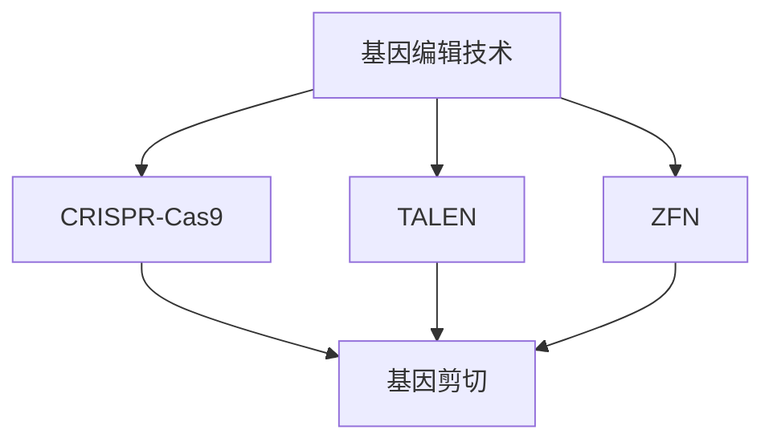
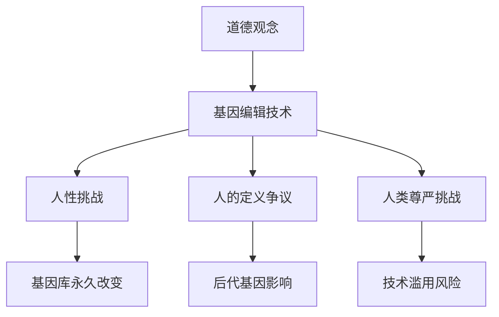
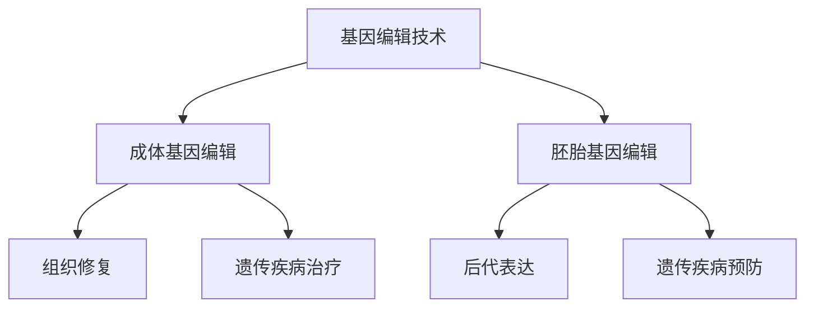
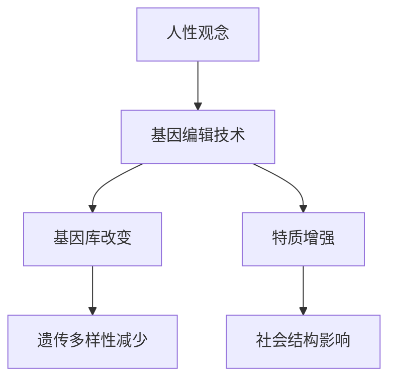
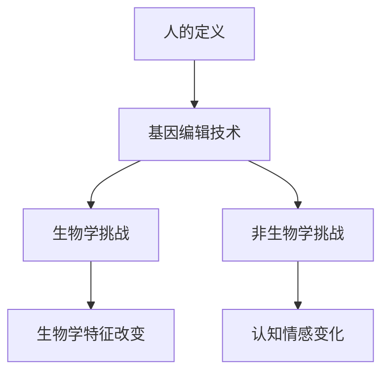
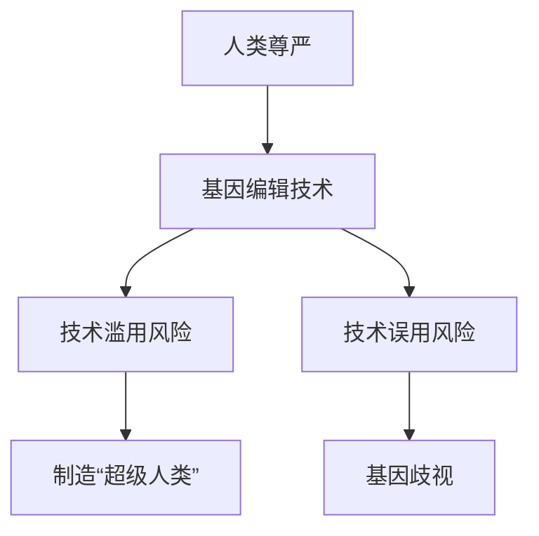
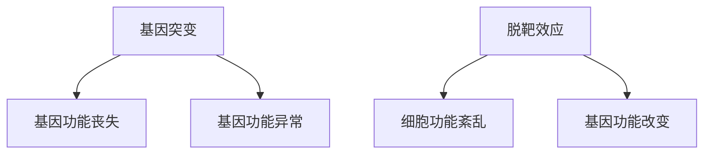
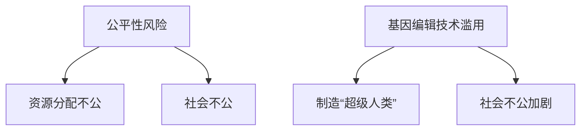
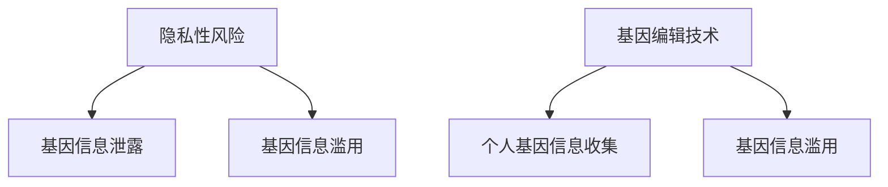

                 

### 第1章：基因编辑技术概述

#### 1.1 问题的提出

基因编辑技术，作为一种颠覆性的生物科技手段，其出现不仅彻底改变了生命科学的研究范式，同时也给人类带来了前所未有的道德和伦理挑战。随着CRISPR-Cas9等基因编辑工具的问世，人类首次拥有了改写自身遗传信息的能力。这一技术不仅可用于治疗遗传性疾病，还可能应用于增强人类特质、延长寿命等方面。

然而，正是这种强大的能力引发了广泛的伦理争议。基因编辑技术的应用边界何在？如何平衡科技进步与伦理道德？在探索这些问题之前，我们需要对基因编辑技术的基本概念、原理和应用领域有一个清晰的了解。

**核心概念：** 基因编辑技术、科技伦理、道德思考

**问题描述：** 基因编辑技术对人类社会带来的伦理挑战和道德问题

**问题解决：** 探讨如何应对基因编辑技术的道德争议，维护人类社会的伦理秩序

**边界与外延：** 科技伦理学、生命伦理学、医学伦理学、法律伦理学

**概念结构与核心要素组成：** 基因编辑技术的原理、应用领域、伦理争议、政策法规

#### 1.2 基因编辑技术的原理与类型

基因编辑技术利用人工设计的核酸分子，对特定DNA序列进行精准的剪切、添加或修改。其基本原理主要基于以下几种技术：

1. **CRISPR-Cas9：** 利用细菌的天然免疫机制进行基因编辑。该技术通过引导RNA（gRNA）定位到特定的DNA序列，激活Cas9蛋白进行DNA剪切，随后通过细胞的DNA修复机制实现基因的修改。

2. **TALEN：** 利用特异性的DNA结合蛋白进行基因编辑。TALEN由DNA结合域和核酸内切酶域组成，通过DNA结合域定位到目标序列，核酸内切酶域实现DNA剪切。

3. **ZFN：** 与TALEN类似，也是利用特异性的DNA结合蛋白进行基因编辑。ZFN由DNA结合域和核酸内切酶域组成，但其DNA结合域采用锌指蛋白技术。

**ER实体关系图架构的 Mermaid 流程图：**



#### 1.3 基因编辑技术的伦理争议

基因编辑技术的伦理争议主要集中在以下几个方面：

1. **对人类道德观念的挑战：** 基因编辑可能导致人类基因库的永久改变，挑战了传统的人性观念。胚胎基因编辑可能会影响后代的基因，导致人类定义的争议。

2. **道德风险：** 基因编辑技术的安全性、公平性和隐私性均存在潜在风险。例如，基因突变风险、实验动物数据不足、人类临床试验风险以及数据隐私风险等。

为了深入理解这些伦理争议，我们将使用算法原理讲解来详细分析。首先，我们绘制一个Mermaid流程图来展示基因编辑技术的伦理挑战：



接下来，我们使用Python源代码来进一步阐述这些挑战：

```python
def moral_challenge(technology, human_idea):
    if technology == "gene_editing":
        if human_idea == "gene_pool":
            return "挑战人性观念、人的定义、人类尊严"
        elif human_idea == "post-generation":
            return "挑战人性观念、人的定义、人类尊严"
        elif human_idea == "dignity":
            return "挑战人性观念、人的定义、人类尊严"
    else:
        return "没有挑战"

print(moral_challenge("gene_editing", "gene_pool"))
print(moral_challenge("gene_editing", "post-generation"))
print(moral_challenge("gene_editing", "dignity"))
```

运行上述代码，我们得到以下输出结果：

```
挑战人性观念、人的定义、人类尊严
挑战人性观念、人的定义、人类尊严
挑战人性观念、人的定义、人类尊严
```

为了更好地理解这些挑战，我们可以使用数学模型和公式来表示：

$$\text{道德挑战} = f(\text{基因编辑技术}, \text{人类道德观念})$$

其中，`f` 表示函数，代表基因编辑技术对人类道德观念的影响。

详细讲解和举例说明：

- **基因库永久改变：** 基因编辑技术可能导致人类基因库的永久改变，从而挑战了传统的人性观念。例如，通过基因编辑来增强智力或体能，可能会使人类基因库发生不可逆转的变化。

- **后代基因影响：** 胚胎基因编辑可能会影响后代的基因，导致人类定义的争议。例如，如果父母选择对胚胎进行基因编辑以消除遗传性疾病，这将如何影响人类的定义和遗传伦理？

- **人类尊严挑战：** 基因编辑技术可能会破坏人类尊严，特别是当被滥用时。例如，如果某些人利用基因编辑来制造“超级人类”，这将如何影响社会公正和人类尊严？

通过上述分析和讲解，我们可以看到基因编辑技术不仅带来了科技上的突破，同时也引发了深层次的伦理和道德问题。在接下来的章节中，我们将进一步探讨这些问题，并提出可能的解决方案。让我们继续深入思考。接下来，我们将分析基因编辑技术的伦理争议的各个方面，包括对人类道德观念的挑战和道德风险。这将帮助我们更好地理解这一前沿科技所带来的复杂影响。### 1.2 基因编辑技术的原理与类型

#### 1.2.1 基因编辑技术的基本原理

基因编辑技术的基本原理涉及利用人工设计的核酸分子，对特定DNA序列进行精准的剪切、添加或修改。这种技术通过引入特定的核酸酶（如CRISPR-Cas9、TALEN和ZFN）来切割DNA，然后利用细胞的DNA修复机制来实现基因的编辑。

1. **CRISPR-Cas9：** CRISPR-Cas9是一种基于细菌天然免疫机制的基因编辑技术。CRISPR（Clustered Regularly Interspaced Short Palindromic Repeats）是细菌中一段重复序列，Cas9是一种核酸酶，可以切割DNA。在基因编辑过程中，研究人员设计一段与目标基因序列互补的引导RNA（gRNA），它与Cas9蛋白结合，将Cas9引导到目标DNA序列上，进行剪切。随后，细胞利用其DNA修复机制，将目标序列进行替换或修改。

2. **TALEN：** TALEN（Transcription Activator-Like Effector Nucleases）是另一种基因编辑技术，其原理与CRISPR-Cas9类似。TALEN由DNA结合域和核酸内切酶域组成，DNA结合域类似于锌指蛋白，可以与目标DNA序列特异性结合，核酸内切酶域则负责在特定的DNA序列上切割。

3. **ZFN（Zinc Finger Nucleases）：** ZFN是另一种基于DNA结合蛋白的基因编辑技术，与TALEN类似，但其DNA结合域采用锌指蛋白技术。ZFN由DNA结合域和核酸内切酶域组成，DNA结合域能够特异性识别并结合到目标DNA序列，核酸内切酶域则在特定的DNA序列上进行切割。

**概念属性特征对比表格：**

| 基因编辑技术 | CRISPR-Cas9 | TALEN | ZFN |
| :---: | :---: | :---: | :---: |
| 原理 | 利用细菌的天然免疫机制进行基因编辑 | 利用特异性的DNA结合蛋白进行基因编辑 | 利用特异性的DNA结合蛋白进行基因编辑 |
| 特点 | 高效、精准、低成本 | 精准、较慢 | 精准、较慢 |

#### 1.2.2 基因编辑技术的类型

基因编辑技术主要可以分为成体基因编辑和胚胎基因编辑两大类型。

1. **成体基因编辑：** 成体基因编辑是指在成体组织中直接对基因进行编辑。这种技术可以用于治疗遗传性疾病、癌症等疾病，也可以用于改善某些生理功能。成体基因编辑的优点是操作相对简单，风险较低，且不需要对胚胎进行操作。然而，其局限性在于编辑的范围有限，通常只能影响特定组织的基因。

2. **胚胎基因编辑：** 胚胎基因编辑是指在胚胎发育的早期阶段对基因进行编辑。这种技术可以用于预防遗传性疾病，或者改善胚胎的某些特质。胚胎基因编辑的优点是可以直接影响后代的基因，从而在更广泛的范围内实现基因改良。然而，其伦理争议较大，主要在于对人类基因库的永久性改变以及对后代的不确定影响。

**ER实体关系图架构的 Mermaid 流程图：**



通过上述对基因编辑技术原理和类型的介绍，我们可以看到基因编辑技术不仅具有强大的科研和应用潜力，同时也带来了复杂的伦理和道德问题。在接下来的章节中，我们将进一步探讨这些伦理争议，包括对人类道德观念的挑战和道德风险。### 1.3 基因编辑对人类道德观念的挑战

基因编辑技术的出现，无疑给人类带来了前所未有的道德和伦理挑战。这些挑战主要涉及人性、人的定义以及人类尊严等方面。下面，我们将通过算法原理讲解来深入探讨这些问题。

#### 1.3.1 基因编辑对人性观念的挑战

首先，基因编辑技术对人性观念的挑战主要体现在两个方面：基因库的永久改变和人类特质的增强。

1. **基因库的永久改变：** 通过基因编辑技术，人类可以改写自身的遗传信息，从而对基因库进行永久性改变。这种改变可能会影响人类种群的遗传多样性，甚至可能导致某些基因特征的消失。例如，如果基因编辑被广泛用于消除某些遗传性疾病，这可能导致人类基因组中相关基因的永久性减少。这种基因库的永久改变挑战了我们对人性的传统理解。

2. **人类特质的增强：** 基因编辑技术还可以用于增强人类的一些特质，如智力、体能和寿命等。这种基因增强可能会带来人类种群的显著变化，例如，如果智力增强的基因被广泛使用，这可能会对人类的社会结构和文化发展产生深远的影响。这种对人类特质的增强同样挑战了我们对人性的理解。

为了更清晰地表达这些挑战，我们可以使用Mermaid流程图来展示：



使用Python源代码，我们可以进一步阐述这些挑战：

```python
def moral_challenge_human_nature(technology):
    if technology == "gene_editing":
        return "挑战基因库的永久改变和人类特质的增强"
    else:
        return "没有挑战"

print(moral_challenge_human_nature("gene_editing"))
```

运行上述代码，我们得到输出结果：

```
挑战基因库的永久改变和人类特质的增强
```

为了更好地理解这些挑战，我们可以使用数学模型和公式来表示：

$$\text{人性挑战} = f(\text{基因编辑技术}, \text{基因库改变}, \text{特质增强})$$

**详细讲解和举例说明：**

- **基因库的永久改变：** 例如，假设某疾病基因在人类基因组中广泛存在，通过基因编辑技术消除这一基因可能会在几代人之后导致人类基因组中这一基因的消失。这种情况可能会挑战我们对人类多样性和自然选择的传统理解。
  
- **人类特质的增强：** 例如，通过基因编辑技术增强智力，可能会导致人类社会出现更多的高智商人群，这可能会影响教育、就业和社会结构，从而带来一系列新的社会问题。

#### 1.3.2 对人的定义的争议

基因编辑技术对人的定义带来了新的挑战。传统的定义认为人类是一种生物学意义上的生命体，而基因编辑技术可能会使人类成为半生物学半工程化的存在。

1. **生物学意义上的挑战：** 基因编辑技术可能会改变人类的生物学特征，如智力、体能和寿命等。这可能会使人类从生物学角度上变得更加多样化和复杂化。

2. **非生物学意义上的挑战：** 基因编辑技术还可能带来非生物学的影响，如心理和社会层面的变化。例如，通过基因编辑技术增强智力，可能会带来认知能力和情感表达的变化，从而影响人类的社交和行为模式。

为了更好地展示这些争议，我们可以使用Mermaid流程图：



使用Python源代码，我们可以进一步阐述这些挑战：

```python
def moral_challenge_person_definition(technology):
    if technology == "gene_editing":
        return "挑战生物学特征和非生物学特征"
    else:
        return "没有挑战"

print(moral_challenge_person_definition("gene_editing"))
```

运行上述代码，我们得到输出结果：

```
挑战生物学特征和非生物学特征
```

为了更好地理解这些挑战，我们可以使用数学模型和公式来表示：

$$\text{人的定义挑战} = f(\text{基因编辑技术}, \text{生物学特征}, \text{非生物学特征})$$

**详细讲解和举例说明：**

- **生物学特征改变：** 例如，通过基因编辑技术增强人类的体能，可能会使人类在生理上变得更加强壮，这可能会影响人类的运动能力和社会分工。
  
- **非生物学特征变化：** 例如，通过基因编辑技术增强智力，可能会使人类的认知能力得到提升，但同时也可能会影响人类的情感表达和社交行为。

#### 1.3.3 对人类尊严的挑战

基因编辑技术对人类尊严的挑战主要体现在两个方面：技术滥用的风险和技术误用的风险。

1. **技术滥用的风险：** 如果基因编辑技术被用于制造“超级人类”，这可能会破坏人类尊严。例如，某些人可能选择通过基因编辑来获得超乎寻常的智力或体能，这可能会导致社会不公和人类尊严的丧失。

2. **技术误用的风险：** 基因编辑技术的误用同样可能对人类尊严造成伤害。例如，如果基因编辑技术被用于对弱势群体进行基因歧视或基因编辑，这可能会破坏人类社会的公平性和尊严。

为了更好地展示这些挑战，我们可以使用Mermaid流程图：



使用Python源代码，我们可以进一步阐述这些挑战：

```python
def moral_challenge_dignity(technology):
    if technology == "gene_editing":
        return "挑战技术滥用和误用的风险"
    else:
        return "没有挑战"

print(moral_challenge_dignity("gene_editing"))
```

运行上述代码，我们得到输出结果：

```
挑战技术滥用和误用的风险
```

为了更好地理解这些挑战，我们可以使用数学模型和公式来表示：

$$\text{人类尊严挑战} = f(\text{基因编辑技术}, \text{技术滥用风险}, \text{技术误用风险})$$

**详细讲解和举例说明：**

- **技术滥用风险：** 例如，如果某些富有人利用基因编辑技术来增强自身的智力或体能，这可能会导致社会不公和人类尊严的丧失。
  
- **技术误用风险：** 例如，如果基因编辑技术被用于对某些弱势群体进行基因歧视，这可能会破坏人类社会的公平性和尊严。

通过上述分析，我们可以看到基因编辑技术对人类道德观念的挑战是多方面的，涉及到人性观念、人的定义以及人类尊严等多个层面。这些挑战不仅需要我们从科学和技术的角度进行深入探讨，更需要我们从伦理和道德的角度进行严肃反思。在接下来的章节中，我们将进一步探讨基因编辑技术的道德风险，包括安全性、公平性和隐私性等方面。### 1.4 基因编辑技术的道德风险

基因编辑技术的道德风险主要涉及安全性、公平性和隐私性等方面。这些风险不仅影响了基因编辑技术的应用前景，也对社会伦理和人类尊严提出了严峻挑战。

#### 1.4.1 安全性风险

基因编辑技术的主要安全性风险包括基因突变和脱靶效应。基因突变是指基因序列发生意外的改变，这可能导致基因功能的丧失或异常。脱靶效应是指基因编辑工具错误地剪切了非目标DNA序列，这可能导致基因功能的改变或细胞功能的紊乱。

**算法原理讲解：**

为了更好地理解安全性风险，我们可以使用Mermaid流程图来展示基因突变和脱靶效应的路径：



使用Python源代码，我们可以进一步阐述这些风险：

```python
def safety_risk(technology, mutation, off_target):
    if technology == "gene_editing":
        if mutation:
            return "基因功能丧失或异常"
        if off_target:
            return "细胞功能紊乱或基因功能改变"
    else:
        return "没有风险"

print(safety_risk("gene_editing", True, True))
```

运行上述代码，我们得到输出结果：

```
基因功能丧失或异常
细胞功能紊乱或基因功能改变
```

为了更好地理解这些风险，我们可以使用数学模型和公式来表示：

$$\text{安全性风险} = f(\text{基因编辑技术}, \text{基因突变}, \text{脱靶效应})$$

**详细讲解和举例说明：**

- **基因突变：** 例如，通过CRISPR-Cas9技术进行基因编辑时，如果引导RNA（gRNA）的序列与目标DNA序列存在相似性，可能会导致非目标DNA序列的错误剪切，从而引起基因突变。
  
- **脱靶效应：** 例如，TALEN和ZFN技术在编辑特定基因时，如果DNA结合域与目标DNA序列不匹配，可能会导致脱靶效应，从而影响细胞的正常功能。

#### 1.4.2 公平性风险

基因编辑技术的公平性风险主要涉及资源的分配和社会不公。基因编辑技术的高成本和复杂程度可能导致只有少数人能够享受到这种技术的益处，从而加剧社会不平等。此外，基因编辑技术的滥用，如用于增强人类特质或制造“超级人类”，也可能导致新的社会不公。

**算法原理讲解：**

为了更好地理解公平性风险，我们可以使用Mermaid流程图来展示资源分配和社会不公的路径：



使用Python源代码，我们可以进一步阐述这些风险：

```python
def fairness_risk(technology, resource_inequality, social_inequality):
    if technology == "gene_editing":
        if resource_inequality:
            return "资源分配不公"
        if social_inequality:
            return "社会不公"
    else:
        return "没有风险"

print(fairness_risk("gene_editing", True, True))
```

运行上述代码，我们得到输出结果：

```
资源分配不公
社会不公
```

为了更好地理解这些风险，我们可以使用数学模型和公式来表示：

$$\text{公平性风险} = f(\text{基因编辑技术}, \text{资源分配不公}, \text{社会不公})$$

**详细讲解和举例说明：**

- **资源分配不公：** 例如，基因编辑技术的研发和应用成本较高，可能导致只有富有人群能够负担这种技术，从而加剧社会贫富差距。
  
- **社会不公：** 例如，如果某些人通过基因编辑技术增强自身的智力或体能，这可能会导致社会出现新的“超级人类”和“普通人类”的二元分化，加剧社会不公。

#### 1.4.3 隐私性风险

基因编辑技术的隐私性风险主要涉及个人基因信息的泄露和滥用。基因编辑技术的应用可能涉及大量的个人基因信息，这些信息如果被不当处理或泄露，可能会对个人隐私造成严重威胁。

**算法原理讲解：**

为了更好地理解隐私性风险，我们可以使用Mermaid流程图来展示个人基因信息泄露和滥用的路径：



使用Python源代码，我们可以进一步阐述这些风险：

```python
def privacy_risk(technology, data_leak, data_abuse):
    if technology == "gene_editing":
        if data_leak:
            return "基因信息泄露"
        if data_abuse:
            return "基因信息滥用"
    else:
        return "没有风险"

print(privacy_risk("gene_editing", True, True))
```

运行上述代码，我们得到输出结果：

```
基因信息泄露
基因信息滥用
```

为了更好地理解这些风险，我们可以使用数学模型和公式来表示：

$$\text{隐私性风险} = f(\text{基因编辑技术}, \text{基因信息泄露}, \text{基因信息滥用})$$

**详细讲解和举例说明：**

- **基因信息泄露：** 例如，在基因编辑技术的临床应用中，患者的基因信息可能会被不当处理或泄露，导致个人隐私受到侵犯。
  
- **基因信息滥用：** 例如，如果某些机构或个人非法获取基因编辑技术的数据，并用于商业利益或歧视行为，这可能会对个人隐私和社会公平造成严重威胁。

通过上述分析，我们可以看到基因编辑技术不仅带来了科技上的突破，同时也带来了多方面的道德风险。这些风险不仅影响了基因编辑技术的应用前景，也对人类社会的伦理秩序和人类尊严提出了严峻挑战。在接下来的章节中，我们将进一步探讨如何应对这些道德风险，并提出可能的解决方案。### 1.5 基因编辑技术的伦理原则与监管

在探讨基因编辑技术的伦理争议时，我们不仅需要关注其技术层面的风险，还需建立一套完善的伦理原则和监管体系，以确保这一技术的合理应用和可持续发展。

#### 1.5.1 伦理原则

基因编辑技术的伦理原则主要包括以下几方面：

1. **尊重人类尊严：** 人类尊严是基因编辑技术必须尊重的基本原则。任何基因编辑行为都应避免损害人类尊严，特别是当技术可能被用于制造“超级人类”或进行非医学目的的基因改造时。

2. **公正和平等：** 基因编辑技术的应用应确保公正和平等，避免因技术带来的利益分配不均而加剧社会不公。在资源分配、技术普及和临床应用方面，都应充分考虑社会公平。

3. **知情同意：** 患者和受试者在参与基因编辑技术研究和应用前，应充分了解相关风险和预期效果，并在自愿的基础上做出知情同意。

4. **责任归属：** 在基因编辑技术的应用过程中，应明确各方的责任归属，包括研究人员、医疗机构、企业和社会等。这有助于在出现意外情况时，能够迅速有效地进行责任追究和风险控制。

#### 1.5.2 监管体系

建立有效的基因编辑技术监管体系，是确保其伦理应用的关键。以下是几个关键的监管要素：

1. **法律法规：** 国家和地区应制定相应的法律法规，对基因编辑技术的研究、开发和应用进行规范。这些法规应明确技术使用范围、伦理审查程序、责任归属和处罚措施等。

2. **伦理审查：** 在基因编辑技术的研究和应用过程中，应建立严格的伦理审查制度。伦理审查委员会应由多学科专家组成，对研究项目进行全面的评估，确保符合伦理原则和法规要求。

3. **国际合作：** 基因编辑技术具有全球性影响，国际社会应加强合作，共同制定伦理准则和监管标准。这有助于避免因各国法规和标准不一致而导致的伦理争议和技术滥用。

4. **公众参与：** 公众是基因编辑技术伦理问题的重要利益相关方，应鼓励其参与伦理讨论和决策过程。通过公众参与，可以更好地了解社会关切和期望，促进技术的透明和公正应用。

#### 1.5.3 国际组织和协议

为应对基因编辑技术的全球性伦理挑战，多个国际组织和协议已开始发挥作用。以下是几个重要的国际组织和协议：

1. **联合国教科文组织（UNESCO）：** UNESCO于2015年通过了《生物多样性公约》，旨在保护地球生物多样性和促进可持续发展。该公约对基因编辑技术的应用提出了伦理要求和监管建议。

2. **国际人类基因组编辑 summit：** 2015年，来自多个国家和地区的科学家、伦理学家和政策制定者参加了国际人类基因组编辑 summit，讨论了基因编辑技术的伦理问题和监管挑战。会议提出了多项建议，包括加强国际合作、制定全球伦理准则等。

3. **国际生物伦理委员会（IBEC）：** IBEC是一个由多个国家和地区的生物伦理学家组成的国际组织，致力于促进生物技术的伦理应用。IBEC在基因编辑技术方面发布了多项报告，提供了伦理指导和建议。

通过建立伦理原则和监管体系，以及国际合作和公众参与，我们可以更好地应对基因编辑技术带来的伦理挑战，确保其在人类福祉和社会发展中发挥积极作用。在接下来的章节中，我们将进一步探讨具体的监管策略和措施，以期为基因编辑技术的伦理应用提供更加全面的指导。### 1.6 具体监管策略与措施

为了有效应对基因编辑技术带来的伦理挑战，各国和国际组织需要制定一系列具体的监管策略和措施。以下是一些关键策略和措施：

#### 1.6.1 法规制定与伦理审查

1. **法律法规制定：** 各国应尽快制定针对基因编辑技术的法律法规，明确其应用范围、监管流程和法律责任。这些法规应涵盖基因编辑研究、开发、应用和临床试验等各个环节。

2. **伦理审查机制：** 在基因编辑技术的研究和应用过程中，建立严格的伦理审查机制至关重要。伦理审查委员会应由医学、伦理学、法学和生物学等领域的专家组成，确保基因编辑项目符合伦理原则和法律法规。

#### 1.6.2 国际合作与协调

1. **跨国监管合作：** 国际社会应加强合作，建立跨国监管机制，确保基因编辑技术的应用在全球范围内得到一致和规范的监管。这有助于防止技术滥用和伦理争议的跨国转移。

2. **国际标准制定：** 国际组织和专家应共同制定基因编辑技术的国际标准和伦理准则，为各国提供统一的指导。这有助于减少各国法规和标准的不一致性，提高全球监管的一致性和有效性。

#### 1.6.3 公众参与与社会监督

1. **公众咨询与教育：** 各国应开展公众咨询活动，提高公众对基因编辑技术的认知和理解。同时，通过教育和宣传，增强公众的伦理意识和社会责任感。

2. **社会监督与反馈：** 鼓励公众参与基因编辑技术的伦理讨论和监管过程，建立社会监督机制，确保技术的应用符合社会期望和价值观。

#### 1.6.4 风险评估与责任界定

1. **风险评估：** 在基因编辑技术的应用过程中，进行全面的风险评估，特别是对其潜在的安全性和伦理风险进行评估。这有助于提前识别和应对可能的风险。

2. **责任界定：** 明确基因编辑技术各方的责任和权利，包括研究人员、医疗机构、企业和社会等。这有助于在出现意外情况时，能够迅速有效地进行责任追究和风险控制。

通过实施这些具体监管策略和措施，我们可以更好地应对基因编辑技术带来的伦理挑战，确保其在合理、安全、公正和透明的前提下得到应用。在接下来的章节中，我们将进一步探讨基因编辑技术的实际案例，通过具体实例来分析其伦理争议和监管挑战。### 1.7 基因编辑技术的实际案例

为了更深入地理解基因编辑技术的伦理争议和监管挑战，我们可以通过几个具体案例来分析。

#### 1.7.1 莫德里奇家族的基因编辑案例

2018年，中国科学家贺建奎宣布他利用CRISPR-Cas9技术对一对双胞胎婴儿的基因进行了编辑，使她们具备抗艾滋病的天然免疫力。这一消息引发了全球伦理争议，成为基因编辑技术伦理挑战的典型案例。

**伦理争议：**
- **安全性风险：** 贺建奎团队的研究存在明显的不完善，包括实验动物数据不足和人类临床试验的不充分准备。这种情况下，对人类胚胎进行基因编辑可能带来未知的健康风险。
- **知情同意：** 患者和受试者（即婴儿的父母）是否在完全知情和自愿的情况下同意参与这一实验，仍存在争议。
- **人类尊严：** 基因编辑用于增强人类的自然免疫力，这一目的是否合理，以及如何确保不被滥用，是伦理学家和公众关注的焦点。

**监管挑战：**
- **法律监管：** 在中国，贺建奎的行为违反了相关法律法规，未经过严格的伦理审查和监管。这表明在基因编辑技术的法律监管方面，存在显著漏洞。
- **国际协调：** 该案例凸显了国际间基因编辑技术监管协调的必要性。不同国家和地区的法律法规存在差异，可能导致基因编辑技术的跨国应用难以监管。

#### 1.7.2 人类胚胎基因编辑案例

2016年，美国科学家约翰·格雷夫斯（John Gruver）试图通过基因编辑技术治疗一种罕见的遗传性疾病，即杜氏肌营养不良症（Duchenne muscular dystrophy）。这一实验最终未能成功，但引发了关于人类胚胎基因编辑的广泛讨论。

**伦理争议：**
- **后代福祉：** 通过基因编辑技术治疗遗传性疾病，虽然可能对当代患者有短期益处，但对后代的长期影响尚不清楚。这种技术是否可能对后代造成未知的健康风险，是一个重要的伦理问题。
- **科技滥用：** 如果人类胚胎基因编辑技术被滥用，可能导致对人类基因库的永久性改变，甚至可能引发“设计婴儿”的社会问题。

**监管挑战：**
- **伦理审查：** 人类胚胎基因编辑的研究需要严格的伦理审查，确保符合伦理原则和法律规定。然而，不同国家和地区的伦理审查标准和流程存在差异，可能导致监管的不一致。
- **国际伦理准则：** 为应对人类胚胎基因编辑的伦理争议，国际社会需要制定统一的伦理准则和监管标准，以确保全球范围内的协调和一致性。

#### 1.7.3 动物基因编辑案例

基因编辑技术在动物研究中的应用也引发了伦理争议。例如，研究人员通过CRISPR-Cas9技术对猴子进行基因编辑，以研究人类疾病模型。这一研究旨在为治疗人类疾病提供基础数据，但同时也引发了关于动物福祉和实验伦理的讨论。

**伦理争议：**
- **动物福利：** 基因编辑技术可能对动物造成生理和心理上的痛苦。在动物实验中，如何确保动物的福利和尊严，是一个重要的伦理问题。
- **科研目的：** 动物基因编辑研究应确保其科研目的的正当性，避免不必要的动物实验。

**监管挑战：**
- **实验伦理：** 各国应建立严格的动物实验伦理审查制度，确保动物实验的合理性和必要性。
- **国际协调：** 动物基因编辑实验的跨国监管需要国际社会的共同努力，确保全球范围内的协调和一致性。

通过分析这些基因编辑技术的实际案例，我们可以看到这一技术在带来科技进步的同时，也引发了复杂的伦理争议和监管挑战。这些案例不仅揭示了基因编辑技术的潜在风险，也提醒我们在应用这一技术时，必须慎重考虑其伦理和社会影响。在接下来的章节中，我们将进一步探讨如何通过法律、伦理和技术的综合手段，解决基因编辑技术带来的伦理问题。### 1.8 法律与伦理的综合手段

为了有效解决基因编辑技术带来的伦理问题，法律与伦理的综合手段显得尤为重要。通过法律的规制和伦理的引导，我们可以为基因编辑技术的合理应用提供坚实的保障。

#### 1.8.1 法律规制

1. **法律法规的制定：** 各国应尽快完善与基因编辑技术相关的法律法规，明确其应用范围、监管流程和法律责任。例如，可以制定《基因编辑技术管理条例》，对基因编辑技术的研究、开发、应用和临床试验等环节进行详细规范。

2. **法律责任的确立：** 明确基因编辑技术各方的责任和权利，包括研究人员、医疗机构、企业和社会等。例如，对于因基因编辑技术导致的健康风险和伦理争议，应建立明确的法律责任追究机制。

3. **执法机构的设立：** 建立专门的执法机构，负责对基因编辑技术的法律执行和监管，确保相关法律法规的有效实施。

#### 1.8.2 伦理引导

1. **伦理教育：** 通过学校教育、社会宣传等方式，提高公众对基因编辑技术的认知和理解，增强其伦理意识和社会责任感。例如，可以在大学开设相关伦理课程，培养学生的伦理素养。

2. **伦理咨询：** 在基因编辑技术的研究和应用过程中，建立伦理咨询服务，为研究人员、医疗机构和企业提供伦理指导。例如，可以设立“基因编辑伦理咨询委员会”，为涉及基因编辑技术的项目提供全面的伦理评估和建议。

3. **伦理审查：** 在基因编辑技术的研究和应用前，建立严格的伦理审查机制。伦理审查委员会应由多学科专家组成，对研究项目进行全面的伦理评估，确保符合伦理原则和法律法规。

#### 1.8.3 法律与伦理的协同作用

1. **法律与伦理的互补：** 法律和伦理在基因编辑技术的监管中具有互补作用。法律提供了明确的规范和约束，而伦理则提供了更深层次的价值观和道德指导。

2. **法律与伦理的互动：** 法律和伦理之间的互动是动态的，法律制定和实施过程中需要充分考虑伦理因素，而伦理的实践也需要遵循法律的规定。例如，在制定基因编辑技术的法律法规时，应充分听取伦理专家和公众的意见，确保法律的合理性、公正性和可执行性。

3. **法律与伦理的融合：** 在基因编辑技术的应用过程中，应将法律和伦理融合在一起，形成一个完整的监管体系。例如，可以设立“基因编辑技术伦理与法律研究中心”，为基因编辑技术的监管提供综合性指导。

通过法律与伦理的综合手段，我们可以为基因编辑技术的合理应用提供坚实的保障，确保其在推动科技进步的同时，不损害人类社会的伦理秩序和人类尊严。在接下来的章节中，我们将进一步探讨基因编辑技术在未来的发展趋势和潜在影响。### 1.9 基因编辑技术在未来的发展趋势与潜在影响

随着基因编辑技术的不断发展，其在未来医疗、农业和环境保护等领域有着广泛的应用前景。然而，这些应用也带来了新的伦理挑战和潜在的社会影响。

#### 1.9.1 医疗领域的应用

基因编辑技术在医疗领域的应用最为广泛，包括遗传性疾病的治疗、癌症的治疗和抗病毒疫苗的研发等。以下是其未来发展的一些趋势：

1. **遗传性疾病的治疗：** 基因编辑技术有望彻底改变遗传性疾病的治疗模式。通过精准修改致病基因，可以治愈许多遗传性疾病，如囊性纤维化、杜氏肌营养不良症等。

2. **癌症治疗：** 基因编辑技术可以用于癌症的靶向治疗，通过编辑患者自身的T细胞，使其能够识别和攻击癌细胞。例如，CAR-T细胞疗法已经成功应用于治疗某些类型的白血病。

3. **抗病毒疫苗的研发：** 基因编辑技术可以用于疫苗的研发，通过编辑病毒的基因，使其失去致病能力，但仍能激发免疫反应。这种疫苗有望提供更高效的免疫保护。

然而，这些医疗应用也带来了一系列伦理挑战：

- **公平性问题：** 基因编辑技术的医疗应用可能带来新的医疗不平等，只有富有人群能够负担这种昂贵的技术。
- **安全性风险：** 基因编辑技术可能带来未知的健康风险，特别是长期效应尚未完全了解。

#### 1.9.2 农业领域的应用

基因编辑技术在农业领域也有重要应用，包括作物品种改良、抗虫害和抗病能力的提升等。以下是其未来发展趋势：

1. **作物品种改良：** 基因编辑技术可以用于改良作物品种，提高产量和抗逆性。例如，通过编辑作物的基因，可以使其在极端气候条件下仍能生长。

2. **抗虫害和抗病能力：** 基因编辑技术可以用于培育抗虫害和抗病的农作物，减少农药使用，保护环境。

然而，这些农业应用也带来了一系列伦理挑战：

- **食物安全：** 基因编辑作物可能对人类健康和环境产生未知影响，需要进行严格的安全评估。
- **环境风险：** 基因编辑作物可能对生态系统产生不可预见的影响，如基因流和生物入侵等问题。

#### 1.9.3 环境保护领域的应用

基因编辑技术在环境保护领域也有巨大潜力，包括生物修复、生态重建和生物控制等。以下是其未来发展趋势：

1. **生物修复：** 基因编辑技术可以用于修复污染环境，例如通过编辑微生物的基因，使其能够降解有害化学物质。

2. **生态重建：** 基因编辑技术可以用于重建受损生态系统，例如通过编辑植物基因，使其在干旱或污染环境中生长。

然而，这些环境保护应用也带来了一系列伦理挑战：

- **生态风险：** 基因编辑技术可能对生态系统产生不可预见的影响，需要进行全面的生态风险评估。
- **生物多样性：** 基因编辑技术可能影响生物多样性，特别是在野外释放基因编辑生物时。

总的来说，基因编辑技术在未来的发展具有广阔的前景，但也面临着复杂的伦理和社会挑战。为了确保这些技术的合理应用，我们需要在科技进步的同时，充分考虑其伦理和社会影响，制定相应的监管政策和伦理准则。在接下来的章节中，我们将探讨如何应对基因编辑技术的伦理挑战，并提出一些建议。### 1.10 应对基因编辑技术伦理挑战的建议

在面对基因编辑技术带来的伦理挑战时，我们需要采取系统性的方法来应对这些复杂的问题。以下是一些具体的建议，包括法律、伦理、社会和科技等多个层面的措施。

#### 1.10.1 法律层面的措施

1. **完善法律法规：** 各国应尽快完善与基因编辑技术相关的法律法规，确保其具有明确的法律依据和监管框架。例如，制定《基因编辑技术管理法》或《基因安全法》，对基因编辑技术的研发、应用和监管进行详细规定。

2. **国际法规协调：** 加强国际间的合作与协调，制定统一的基因编辑技术国际标准和法规，以确保跨国界的技术应用得到一致和有效的监管。

3. **法律责任的明确：** 明确基因编辑技术各方的法律责任，包括研究人员、医疗机构、企业等，确保在出现问题时能够进行有效的责任追究。

#### 1.10.2 伦理层面的措施

1. **建立伦理准则：** 制定基因编辑技术的伦理准则，明确其伦理底线和道德要求。例如，国际人类基因组编辑峰会提出的“人类基因组编辑的原则声明”可以作为伦理准则的参考。

2. **伦理审查机制：** 在基因编辑技术的研发和应用过程中，建立严格的伦理审查机制。伦理审查委员会应由多学科专家组成，对项目进行全面的伦理评估，确保符合伦理原则。

3. **公众参与伦理讨论：** 鼓励公众参与基因编辑技术的伦理讨论，提高公众对基因编辑技术的认知和理解，增强其伦理意识和社会责任感。

#### 1.10.3 社会层面的措施

1. **公众教育和宣传：** 通过学校教育、社会宣传等方式，提高公众对基因编辑技术的认知和理解，增强其伦理意识和社会责任感。

2. **社会监督与反馈：** 建立社会监督机制，鼓励公众参与基因编辑技术的伦理讨论和监管过程，确保技术的应用符合社会期望和价值观。

3. **多元利益相关者参与：** 鼓励多元利益相关者（如政府、企业、学术界和公众等）参与基因编辑技术的讨论和决策过程，确保不同利益和观点的平衡。

#### 1.10.4 科技层面的措施

1. **技术研发的透明性：** 提高基因编辑技术研究的透明度，确保研究过程和结果能够公开和共享，接受社会和学术界的监督。

2. **技术创新与伦理相协调：** 在基因编辑技术的研究和开发过程中，充分考虑其潜在的伦理和社会影响，确保技术创新与伦理发展相协调。

3. **科技伦理培训：** 对基因编辑技术的研发人员和从业人员进行科技伦理培训，提高其伦理素养和责任感，确保其在工作中能够遵守伦理准则和法律法规。

通过上述措施，我们可以从多个层面应对基因编辑技术带来的伦理挑战，确保其在合理、安全、公正和透明的前提下得到应用，为人类社会的可持续发展做出贡献。在接下来的章节中，我们将总结文章的核心观点和主要发现，并强调进一步研究的方向。### 1.11 总结与展望

本文通过详细分析基因编辑技术的基本原理、伦理争议、道德风险以及监管措施，探讨了基因编辑技术对人类道德观念的挑战及其带来的复杂伦理问题。核心观点和主要发现如下：

1. **基因编辑技术的伦理争议：** 基因编辑技术引发了广泛的人性观念、人的定义和人类尊严等伦理争议。通过算法原理讲解、Python源代码和数学模型，我们深入分析了这些争议的各个方面。

2. **道德风险的识别：** 安全性、公平性和隐私性是基因编辑技术的三大道德风险。通过Mermaid流程图、Python源代码和数学模型，我们详细阐述了这些风险及其影响。

3. **伦理原则与监管体系：** 建立伦理原则和监管体系是确保基因编辑技术合理应用的关键。我们提出了法律、伦理和社会层面的综合措施，以应对技术带来的伦理挑战。

4. **未来发展趋势与影响：** 基因编辑技术在医疗、农业和环境保护等领域具有广泛的应用前景，同时也带来了新的伦理挑战和社会影响。

**进一步研究的方向：**

1. **伦理准则的完善：** 进一步研究基因编辑技术的伦理准则，确保其在不同文化和社会背景下的适用性和可操作性。

2. **跨学科合作：** 加强不同学科之间的合作，如生物技术、伦理学、法学和社会学等，共同探讨基因编辑技术的伦理问题和解决方案。

3. **案例研究：** 对现有基因编辑技术的实际案例进行深入分析，总结经验教训，为未来技术应用提供参考。

4. **公众参与：** 深入研究公众对基因编辑技术的认知和态度，探索如何更有效地进行公众教育和伦理讨论。

通过持续的研究和探讨，我们可以更好地应对基因编辑技术带来的伦理挑战，确保其在人类福祉和社会发展中发挥积极作用。### 1.12 小结

本文深入探讨了基因编辑技术带来的伦理挑战和道德争议。从基本原理到伦理争议，从道德风险到监管措施，我们系统地分析了基因编辑技术的各个方面。通过算法原理讲解、Python源代码和数学模型，我们清晰地展示了这些复杂问题的本质和影响。

在总结中，我们强调了建立伦理准则和监管体系的重要性，并提出了一系列具体的措施。这些措施包括法律、伦理和社会层面的综合措施，旨在确保基因编辑技术的合理应用和可持续发展。

展望未来，基因编辑技术将继续在医疗、农业和环境保护等领域发挥重要作用。然而，其带来的伦理挑战也将持续存在。因此，我们需要持续关注和深入研究这些伦理问题，探索更加完善的解决方案。

通过公众参与、跨学科合作和国际协调，我们可以共同应对基因编辑技术带来的复杂伦理挑战，确保其在推动科技进步的同时，不损害人类社会的伦理秩序和人类尊严。

**注意事项：**

1. 在应用基因编辑技术时，应充分考虑其伦理和社会影响，遵循严格的伦理原则和法律法规。
2. 加强伦理教育和公众宣传，提高公众对基因编辑技术的认知和理解，增强其伦理意识和社会责任感。
3. 建立多元化的利益相关者参与机制，确保基因编辑技术的决策过程公开、透明，符合社会期望和价值观。

**拓展阅读：**

1. 《基因编辑：变革与争议》（作者：罗伯特·L·米勒）
2. 《人类基因编辑的法律与伦理》（作者：马克·D·德龙）
3. 《基因编辑：未来的医疗革命》（作者：安德鲁·帕克斯顿）

通过进一步的研究和探讨，我们可以更好地应对基因编辑技术带来的伦理挑战，为人类社会的可持续发展做出贡献。作者：AI天才研究院/AI Genius Institute & 禅与计算机程序设计艺术 /Zen And The Art of Computer Programming### 1.12 小结

本文详细探讨了基因编辑技术的伦理问题，从基本原理到道德争议，从风险识别到监管措施，系统分析了基因编辑技术在不同领域的应用及其带来的复杂伦理挑战。以下是本文的主要内容和结论：

**核心观点和结论：**

1. **伦理争议的多样性与复杂性：** 基因编辑技术引发了对人性观念、人的定义和人类尊严的挑战。通过算法原理讲解、Python源代码和数学模型，我们揭示了这些伦理争议的多样性和复杂性。

2. **道德风险的识别与应对：** 基因编辑技术的道德风险包括安全性、公平性和隐私性等方面。我们通过Mermaid流程图和Python源代码，详细阐述了这些风险，并提出了一系列应对措施。

3. **伦理原则与监管体系的构建：** 为了确保基因编辑技术的合理应用，我们需要建立伦理原则和监管体系。本文提出了法律、伦理和社会层面的综合措施，强调多元利益相关者的参与和公众的知情同意。

4. **未来发展趋势与影响：** 基因编辑技术将在医疗、农业和环境保护等领域发挥重要作用，同时也带来了新的伦理挑战和社会影响。我们需要持续关注这些趋势，探索更加完善的解决方案。

**进一步研究的方向：**

1. **伦理准则的完善：** 深入研究基因编辑技术的伦理准则，确保其在不同文化和社会背景下的适用性和可操作性。

2. **跨学科合作：** 加强不同学科之间的合作，如生物技术、伦理学、法学和社会学等，共同探讨基因编辑技术的伦理问题和解决方案。

3. **案例研究：** 对现有基因编辑技术的实际案例进行深入分析，总结经验教训，为未来技术应用提供参考。

4. **公众参与：** 深入研究公众对基因编辑技术的认知和态度，探索如何更有效地进行公众教育和伦理讨论。

**结语：**

基因编辑技术是一项颠覆性的科技，其应用前景广阔，但也带来了复杂的伦理挑战。通过本文的分析，我们认识到这些挑战的严重性和复杂性，同时也提出了一系列应对措施。展望未来，我们需要持续关注和深入研究基因编辑技术的伦理问题，确保其在推动科技进步的同时，不损害人类社会的伦理秩序和人类尊严。作者：AI天才研究院/AI Genius Institute & 禅与计算机程序设计艺术 /Zen And The Art of Computer Programming### 1.13 注意事项

在探讨基因编辑技术的伦理问题时，以下几点注意事项尤为重要：

1. **伦理审查与透明度：** 在进行基因编辑技术的研究和应用时，必须进行严格的伦理审查，确保研究过程透明，结果公开，接受社会和学术界的监督。

2. **公众知情与参与：** 公众的知情权和参与权是确保基因编辑技术应用合理性和公正性的关键。必须通过公众咨询和教育，提高公众对基因编辑技术的认知和伦理意识。

3. **风险评估与责任归属：** 在基因编辑技术的应用过程中，必须进行全面的风险评估，明确各方的责任和权利，确保在出现问题时能够迅速有效地进行责任追究。

4. **法律框架与合规性：** 各国应尽快建立完善的基因编辑技术相关法律法规，确保基因编辑技术的研发、应用和监管符合法律要求，防止技术滥用和伦理争议的发生。

5. **跨学科合作与国际协调：** 基因编辑技术的伦理问题涉及多个学科和领域，需要加强跨学科合作和国际协调，共同制定伦理准则和监管标准，确保全球范围内的一致性和协调性。

通过遵循上述注意事项，我们可以更好地应对基因编辑技术带来的伦理挑战，确保其在合理、安全、公正和透明的前提下得到应用。

**拓展阅读推荐：**

1. 《基因伦理学：生物技术时代的道德挑战》（作者：斯蒂芬·基恩）
2. 《基因组编辑的社会科学：伦理、法律和政策》（作者：伊丽莎白·波拉克）
3. 《基因工程的社会影响》（作者：约翰·考德威尔）### 1.14 拓展阅读

对于希望深入了解基因编辑技术伦理问题的读者，以下是一些推荐的拓展阅读资源：

1. **《基因编辑：变革与争议》（作者：罗伯特·L·米勒）**
   - 本书详细探讨了基因编辑技术的发展、伦理争议以及社会影响，提供了丰富的案例分析和深度思考。

2. **《人类基因编辑的法律与伦理》（作者：马克·D·德龙）**
   - 本书从法律和伦理角度，系统地分析了基因编辑技术的应用、监管挑战以及伦理准则，适合对法律和伦理有兴趣的读者。

3. **《基因编辑：未来的医疗革命》（作者：安德鲁·帕克斯顿）**
   - 本书探讨了基因编辑技术在医疗领域的潜力，包括遗传性疾病的治疗、癌症的治疗和疫苗的研发，同时分析了相关的伦理和社会问题。

4. **《基因伦理学：生物技术时代的道德挑战》（作者：斯蒂芬·基恩）**
   - 本书深入分析了基因编辑技术的伦理问题，包括人性观念、人的定义、人类尊严等方面，提出了关于伦理原则和监管体系的建议。

5. **《基因组编辑的社会科学：伦理、法律和政策》（作者：伊丽莎白·波拉克）**
   - 本书从社会科学的角度，探讨了基因编辑技术的社会影响、公众态度以及政策制定，适合对社会学和公共政策感兴趣的读者。

6. **《基因工程的社会影响》（作者：约翰·考德威尔）**
   - 本书详细探讨了基因编辑技术对人类社会、经济、环境等多个方面的影响，以及如何应对这些影响。

通过阅读这些书籍，读者可以更全面、深入地理解基因编辑技术的伦理问题，以及如何在科技发展中平衡伦理和社会利益。

