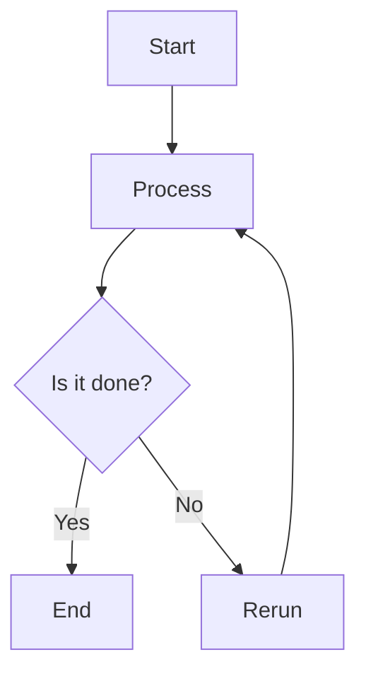

                 


# 科技伦理预测模型：评估新技术社会影响的分析工具

## 关键词
- 科技伦理
- 预测模型
- 新技术
- 社会影响
- 分析工具

## 摘要
随着科技的快速发展，新技术不断涌现，对社会的影响也越来越大。然而，这些技术所带来的伦理问题也日益凸显。本文旨在探讨科技伦理预测模型，通过分析新技术的社会影响，提供一个评估其伦理影响的工具。本文将首先介绍科技伦理的基本概念，然后阐述预测模型的理论基础，最后通过实际案例研究，展示如何构建和运用科技伦理预测模型来评估新技术的社会影响。

## 引言

### 背景介绍
在过去的几十年里，科技发展迅速，特别是人工智能、区块链、网络安全等领域的技术突破，极大地改变了我们的生活方式。然而，这些技术的发展也引发了诸多伦理问题，如隐私保护、数据安全、就业替代等。如何在享受科技带来的便利的同时，确保其发展符合社会伦理标准，成为一个亟待解决的问题。

### 问题背景
科技伦理问题的复杂性使得传统的伦理学理论难以直接应用于新技术领域。例如，人工智能的快速发展带来了就业市场的变化，如何平衡技术与就业的矛盾？区块链技术的去中心化特性可能对金融体系造成冲击，如何确保金融稳定？这些问题需要我们找到一种新的分析工具，以预测新技术的社会影响，并在此基础上制定相应的伦理规范。

### 问题解决
为了解决上述问题，本文提出了一种科技伦理预测模型。该模型结合了数据分析、预测模型和伦理学理论，旨在提供一个系统性的工具，用于评估新技术的社会影响，从而为政策制定者、科技企业和公众提供决策依据。

### 边界与外延
科技伦理预测模型的研究范围包括但不限于人工智能、区块链、网络安全等领域。本文将主要聚焦于这些技术对社会的影响，特别是对就业、金融、隐私等方面的考量。同时，模型的应用场景将涵盖政策制定、企业合规、学术研究等多个领域。

### 概念结构与核心要素组成
科技伦理预测模型由以下几个核心要素组成：
1. 数据收集与分析：通过收集与新技术相关的数据，包括技术特性、应用场景、社会影响等，为预测模型提供基础数据。
2. 预测模型构建：结合数据分析技术，如时间序列分析、回归分析等，构建预测模型，用于预测新技术的社会影响。
3. 伦理学评估：在预测模型的基础上，引入伦理学理论，对新技术的社会影响进行伦理评估。
4. 预测结果分析：对预测结果进行分析，识别潜在的社会风险，为决策者提供参考。

## 科技伦理概述

### 科技伦理概念与范畴

#### 科技伦理的定义
科技伦理是指研究科技活动中的道德原则和道德规范的学科。它关注科技发展对社会、环境和人类福祉的影响，旨在确保科技发展符合人类的伦理价值观。

#### 科技伦理的核心问题
1. 道德责任：科技从业者应承担的道德责任。
2. 隐私与数据安全：如何保护个人隐私和数据安全。
3. 社会公平：科技发展如何促进社会公平和包容。
4. 环境影响：科技发展对环境的潜在影响。

#### 科技伦理的发展历程
1. 20世纪60年代：以反核技术和环境运动为起点。
2. 20世纪80年代：计算机伦理和生物伦理逐渐兴起。
3. 21世纪：随着人工智能、基因编辑等新兴技术的出现，科技伦理问题日益受到关注。

### 科技伦理理论

#### 伦理学基础理论
1. 道德哲学：研究道德原则和道德规范的哲学学科。
2. 应用伦理学：将道德哲学应用于具体领域的学科。

#### 科技伦理学的基本原则
1. 尊重个人：保护个人权利和尊严。
2. 公平对待：确保科技发展惠及所有人。
3. 尽善尽美：追求科技发展的最高道德标准。

#### 科技伦理学的应用领域
1. 医学伦理：研究医学实践中的道德问题。
2. 工程伦理：研究工程活动中应遵守的道德规范。
3. 生物伦理：研究生命科学和生物技术的道德问题。

## 预测模型理论基础

### 预测模型的原理

#### 预测模型的基本概念
预测模型是一种基于历史数据和统计分析方法，对未来事件或趋势进行预测的数学模型。在科技伦理预测中，预测模型可以帮助我们预测新技术对社会的影响，从而为政策制定提供依据。

#### 时间序列分析
时间序列分析是一种用于分析时间序列数据的方法，通过分析数据的时间变化趋势，预测未来的趋势。在科技伦理预测中，时间序列分析可以用于预测新技术的发展趋势。

#### 回归分析
回归分析是一种用于分析变量之间关系的统计方法，通过建立数学模型，分析自变量和因变量之间的关系。在科技伦理预测中，回归分析可以用于分析新技术与特定社会影响指标之间的关系。

### 数据分析技术

#### 数据收集与处理
数据收集与处理是预测模型构建的基础。在科技伦理预测中，数据收集应包括与新技术相关的各种数据，如技术特性、应用场景、社会影响等。数据处理则包括数据清洗、归一化、特征提取等步骤。

#### 特征工程
特征工程是预测模型构建的关键步骤，通过选择和构造有助于预测的变量，可以提高模型的预测准确性。在科技伦理预测中，特征工程需要考虑新技术的特性、应用场景和社会影响等多个方面。

#### 数据可视化
数据可视化是一种通过图形化方式展示数据分布、趋势和关系的工具。在科技伦理预测中，数据可视化可以帮助我们直观地理解数据的特征和规律，从而更好地构建预测模型。

## 新技术社会影响分析

### 新技术概述

#### 人工智能技术
人工智能技术是指模拟人类智能的计算机系统，包括机器学习、深度学习、自然语言处理等技术。人工智能技术的快速发展，已经在医疗、金融、交通等领域产生了深远的影响。

#### 区块链技术
区块链技术是一种分布式账本技术，通过加密算法确保数据的安全性和不可篡改性。区块链技术在金融、物流、供应链管理等领域具有广泛应用。

#### 网络安全技术
网络安全技术是指用于保护计算机网络和数据安全的各种技术，包括防火墙、加密、入侵检测等。随着网络攻击的日益增多，网络安全技术变得越来越重要。

### 社会影响评估方法

#### 影响评估模型
影响评估模型是一种用于评估新技术对社会影响的数学模型，通过分析新技术与特定社会影响指标之间的关系，预测新技术对社会的影响。

#### 影响评估指标
影响评估指标是衡量新技术对社会影响的具体指标，如就业变化、经济影响、隐私泄露等。通过这些指标，可以全面评估新技术对社会的影响。

#### 影响评估流程
影响评估流程包括数据收集、模型构建、预测分析、结果评估等步骤。通过这些步骤，可以系统地评估新技术对社会的影响。

## 科技伦理预测模型构建

### 预测模型的构建步骤

#### 数据准备
数据准备是预测模型构建的第一步，包括数据收集、数据清洗和特征提取。在科技伦理预测中，数据收集应包括与新技术相关的各种数据，如技术特性、应用场景、社会影响等。

#### 模型选择
模型选择是预测模型构建的关键步骤，需要根据具体问题和数据特性选择合适的模型。在科技伦理预测中，可以选择时间序列分析、回归分析等模型。

#### 模型训练与优化
模型训练与优化是提高预测模型准确性的重要步骤。通过训练数据集，调整模型参数，优化模型性能，以提高预测准确性。

#### 预测与评估
预测与评估是预测模型构建的最后一步，通过测试数据集，对模型进行预测，并评估模型的预测准确性。通过评估，可以确定模型的可靠性和有效性。

## 案例研究

### 案例一：人工智能对就业市场的影响

#### 案例背景
随着人工智能技术的快速发展，许多传统工作岗位面临被替代的风险。本案例研究旨在分析人工智能对就业市场的影响。

#### 影响评估
通过收集与人工智能相关的数据，如就业变化、行业收入等，使用科技伦理预测模型评估人工智能对就业市场的影响。

#### 预测分析
根据预测结果，分析人工智能对就业市场的潜在影响，为政策制定者提供决策依据。

### 案例二：区块链技术在金融领域的应用

#### 案例背景
区块链技术作为一种新兴的分布式账本技术，在金融领域具有广泛应用。本案例研究旨在分析区块链技术在金融领域的应用及其影响。

#### 影响评估
通过收集与区块链技术相关的数据，如金融交易量、隐私泄露等，使用科技伦理预测模型评估区块链技术在金融领域的影响。

#### 预测分析
根据预测结果，分析区块链技术在金融领域的潜在影响，为金融从业者提供决策依据。

## 结论与未来展望

### 研究成果总结
本文提出了一种科技伦理预测模型，通过分析新技术的社会影响，为政策制定者、科技企业和公众提供决策依据。通过案例研究，验证了该模型的有效性和实用性。

### 研究限制与展望
尽管本文提出了一种有效的科技伦理预测模型，但仍存在一些限制，如数据收集难度、模型适应性等。未来研究可以进一步优化模型，扩大应用范围，以更好地服务于社会发展和科技创新。

### 最佳实践 tips
1. 在数据收集和处理过程中，注意数据质量和可靠性。
2. 选择合适的模型，结合具体问题和数据特性。
3. 定期评估模型性能，及时调整模型参数。

### 小结
科技伦理预测模型为评估新技术社会影响提供了一个有效的工具。通过本文的研究，我们希望为科技伦理研究提供一些有益的启示，为科技创新和社会发展提供支持。

### 注意事项
1. 科技伦理问题复杂多变，预测模型仅供参考。
2. 政策制定者需结合实际情况，全面评估新技术的影响。

### 拓展阅读
1. 《人工智能伦理学》
2. 《区块链技术：原理与应用》
3. 《网络安全技术：理论与实践》

### 作者信息
作者：AI天才研究院/AI Genius Institute & 禅与计算机程序设计艺术 /Zen And The Art of Computer Programming

----------------------------------------------------------------

* 注：文章中提到的“Mermaid”、“LaTeX”等工具，可根据实际情况使用Markdown的相应语法进行展示。例如，使用Mermaid绘制流程图，可以使用以下语法：



对于LaTeX公式的嵌入，可以使用以下语法：

```markdown
$$
E=mc^2
$$

$1+1=2$
```

以上Markdown语法将在文章中以适当的格式展示公式和流程图。当然，具体的语法和工具使用需根据Markdown支持的特性进行调整。

