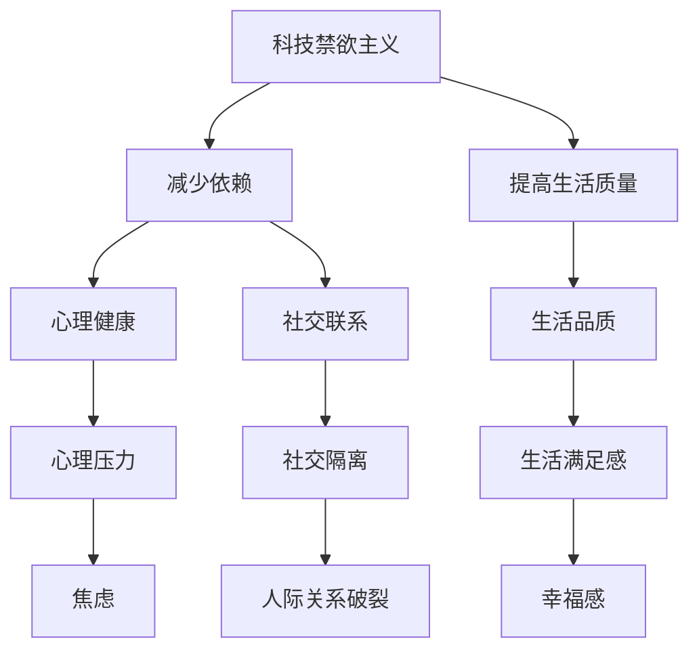
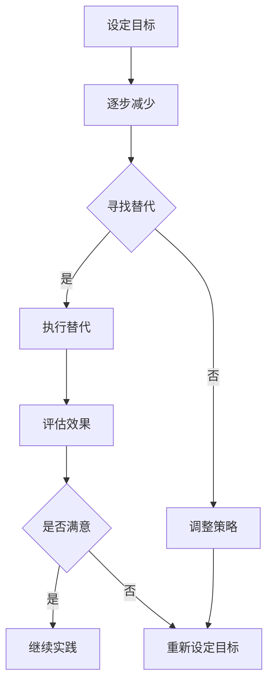
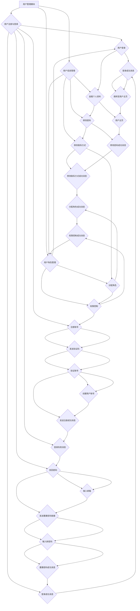
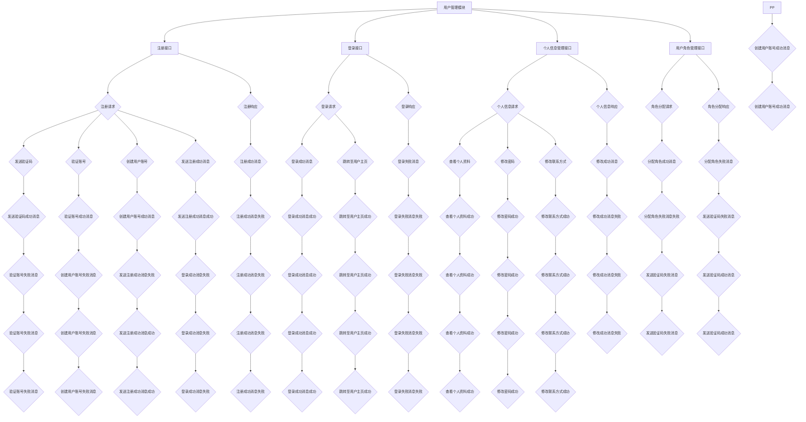

```mermaid
graph TD
    A[用户管理模块] --> B[用户服务接口]
    A --> C[科技使用监控服务接口]
    A --> D[替代活动推荐服务接口]
    A --> E[用户满意度评估服务接口]
    B --> F{用户信息管理接口}
    B --> G{用户角色管理接口}
    B --> H{用户满意度调查接口}
    C --> I{科技使用记录接口}
    C --> J{科技使用分析接口}
    C --> K{科技使用提醒接口}
    D --> L{替代活动库接口}
    D --> M{替代活动推荐接口}
    D --> N{替代活动反馈接口}
    E --> O{满意度调查问卷接口}
    E --> P{满意度数据分析接口}
    E --> Q{满意度报告生成接口}
    F --> R{用户信息查询接口}
    F --> S{用户信息修改接口}
    F --> T{用户角色查询接口}
    F --> U{用户角色修改接口}
    G --> V{用户角色分配接口}
    G --> W{用户权限控制接口}
    H --> X{满意度调查请求}
    H --> Y{满意度调查响应}
    I --> Z{记录科技使用情况}
    I --> AA{分析科技使用情况}
    I --> BB{提醒科技使用时间}
    J --> CC{生成科技使用报告}
    J --> DD{发送科技使用提醒}
    K --> EE{科技使用提醒请求}
    K --> FF{科技使用提醒响应}
    L --> GG{查询替代活动}
    L --> HH{推荐替代活动}
    L --> II{反馈替代活动效果}
    M --> JJ{推荐替代活动请求}
    M --> KK{推荐替代活动响应}
    N --> LL{反馈替代活动请求}
    N --> MM{反馈替代活动响应}
    O --> NN{满意度调查问卷请求}
    O --> PP{满意度调查问卷响应}
    P --> QQ{分析满意度数据}
    P --> RR{生成满意度报告}
    Q --> SS{满意度报告请求}
    Q --> TT{满意度报告响应}
    R --> UU{查询用户信息}
    R --> VV{修改用户信息}
    R --> WW{查询用户角色}
    R --> XX{修改用户角色}
    S --> YY{用户信息修改请求}
    S --> ZZ{用户信息修改响应}
    T --> AAA{用户信息查询请求}
    T --> BBB{用户信息查询响应}
    U --> CCC{用户角色查询请求}
    U --> DDD{用户角色查询响应}
    V --> EEE{用户角色分配请求}
    V --> FFF{用户角色分配响应}
    V --> GGG{用户权限控制请求}
    V --> HHH{用户权限控制响应}
    W --> III{用户权限控制请求}
    W --> JJJ{用户权限控制响应}
    X --> KKK{满意度调查请求}
    X --> LLL{满意度调查响应}
    Y --> MMM{满意度调查请求}
    Y --> NNN{满意度调查响应}
    Z --> OOO{记录科技使用情况请求}
    Z --> PPP{记录科技使用情况响应}
    AA --> QQQ{分析科技使用情况请求}
    AA --> RRR{分析科技使用情况响应}
    BB --> SSS{提醒科技使用时间请求}
    BB --> TTT{提醒科技使用时间响应}
    CC --> UUU{生成科技使用报告请求}
    CC --> VVV{生成科技使用报告响应}
    DD --> WWW{发送科技使用提醒请求}
    DD --> XXX{发送科技使用提醒响应}
    EE --> YYY{科技使用提醒请求}
    EE --> ZZZ{科技使用提醒响应}
    FF --> AAAA{科技使用提醒请求}
    FF --> BBBB{科技使用提醒响应}
    GG --> CCCD{查询替代活动请求}
    GG --> DDDC{查询替代活动响应}
    HH --> IIII{推荐替代活动请求}
    HH --> JJJJ{推荐替代活动响应}
    II --> KKKK{反馈替代活动请求}
    II --> LLLL{反馈替代活动响应}
    JJ --> MMMM{推荐替代活动请求}
    JJ --> NNNN{推荐替代活动响应}
    KK --> OOOO{反馈替代活动请求}
    KK --> PPPP{反馈替代活动响应}
    LL --> QQQQ{查询替代活动请求}
    LL --> RRRR{查询替代活动响应}
    MM --> SSSS{反馈替代活动请求}
    MM --> TTTT{反馈替代活动响应}
    NN --> UUUU{满意度调查问卷请求}
    NN --> VVVV{满意度调查问卷响应}
    PP --> WWWW{分析满意度数据请求}
    PP --> XXXX{分析满意度数据响应}
    QQ --> YYYY{生成满意度报告请求}
    QQ --> ZZZZ{生成满意度报告响应}
    RR --> AAAA{满意度报告请求}
    RR --> BBBB{满意度报告响应}
    SS --> CCCD{满意度调查请求}
    SS --> DDDC{满意度调查响应}
    TT --> EEEE{满意度调查请求}
    TT --> FFFF{满意度调查响应}
    UU --> GGGG{用户信息查询请求}
    UU --> HHHH{用户信息查询响应}
    VV --> IIII{用户信息修改请求}
    VV --> JJJJ{用户信息修改响应}
    WW --> KKKK{用户信息查询请求}
    WW --> LLLL{用户信息查询响应}
    XX --> MMMM{用户信息修改请求}
    XX --> NNNN{用户信息修改响应}
    YY --> OOOO{用户信息查询请求}
    YY --> PPPP{用户信息查询响应}
    ZZ --> QQQQ{用户信息修改请求}
    ZZ --> RRRR{用户信息修改响应}
    AAA --> SSSS{用户角色查询请求}
    AAA --> TTTT{用户角色查询响应}
    BBB --> UUUU{用户角色修改请求}
    BBB --> VVVV{用户角色修改响应}
    CCC --> WWWW{用户角色查询请求}
    CCC --> XXXX{用户角色查询响应}
    DDD --> YYYY{用户角色分配请求}
    DDD --> ZZZZ{用户角色分配响应}
    EEE --> AAAA{用户权限控制请求}
    EEE --> BBBB{用户权限控制响应}
    FFF --> CCCD{用户权限控制请求}
    FFF --> DDDC{用户权限控制响应}
    GGG --> EEEE{查询替代活动请求}
    GGG --> FFFF{查询替代活动响应}
    HH --> GGGG{推荐替代活动请求}
    HH --> HHHH{推荐替代活动响应}
    II --> JJJJ{反馈替代活动请求}
    II --> KKKK{反馈替代活动响应}
    JJ --> LLLL{推荐替代活动请求}
    JJ --> MMMM{推荐替代活动响应}
    KK --> NNNN{反馈替代活动请求}
    KK --> OOOO{反馈替代活动响应}
    LL --> PQQQ{查询替代活动请求}
    LL --> RRRR{查询替代活动响应}
    MM --> SSSS{反馈替代活动请求}
    MM --> TTTT{反馈替代活动响应}
    NN --> UUUU{满意度调查问卷请求}
    NN --> VVVV{满意度调查问卷响应}
    PP --> WWWW{分析满意度数据请求}
    PP --> XXXX{分析满意度数据响应}
    QQ --> YYYY{生成满意度报告请求}
    QQ --> ZZZZ{生成满意度报告响应}
    RR --> AAAA{满意度报告请求}
    RR --> BBBB{满意度报告响应}
    SS --> CCCD{满意度调查请求}
    SS --> DDDC{满意度调查响应}
    TT --> EEEE{满意度调查请求}
    TT --> FFFF{满意度调查响应}
    UU --> GGGG{用户信息查询请求}
    UU --> HHHH{用户信息查询响应}
    VV --> IIII{用户信息修改请求}
    VV --> JJJJ{用户信息修改响应}
    WW --> KKKK{用户信息查询请求}
    WW --> LLLL{用户信息查询响应}
    XX --> MMMM{用户信息修改请求}
    XX --> NNNN{用户信息修改响应}
    YY --> OOOO{用户信息查询请求}
    YY --> PPPP{用户信息查询响应}
    ZZ --> QQQQ{用户信息修改请求}
    ZZ --> RRRR{用户信息修改响应}
    AAA --> SSSS{用户角色查询请求}
    AAA --> TTTT{用户角色查询响应}
    BBB --> UUUU{用户角色修改请求}
    BBB --> VVVV{用户角色修改响应}
    CCC --> WWWW{用户角色查询请求}
    CCC --> XXXX{用户角色查询响应}
    DDD --> YYYY{用户角色分配请求}
    DDD --> ZZZZ{用户角色分配响应}
    EEE --> AAAA{用户权限控制请求}
    EEE --> BBBB{用户权限控制响应}
    FFF --> CCCD{用户权限控制请求}
    FFF --> DDDC{用户权限控制响应}
```
                 


# 科技禁欲主义：断网寻找生活本真的尝试

> 关键词：科技禁欲主义、数字排毒、简朴生活、哲学思考、生活方式变革

> 摘要：
本文深入探讨了科技禁欲主义这一概念，从其哲学基础、个人故事、科技对生活的影响、减少科技使用的策略、面对的挑战以及未来展望等多个维度进行分析。科技禁欲主义是一种倡导减少科技使用，回归生活本真的生活方式。本文旨在帮助读者理解这一现象，并提供实践指导。

## 引言

### 什么是科技禁欲主义

科技禁欲主义，简而言之，是一种生活方式的选择，主张减少对科技的依赖，回归到一种更为简朴、自然和有意义的生活状态。在这个信息爆炸、科技迅猛发展的时代，人们的生活节奏越来越快，科技产品无处不在，从智能手机到智能电视，从社交媒体到在线购物，科技已经深刻地影响了我们的生活方式。然而，科技带来的便利和快感的同时，也不可避免地带来了一些负面效应，如心理健康问题、社交隔离、信息过载等。

### 为什么探讨科技禁欲主义

探讨科技禁欲主义，不仅是为了解决当前科技带来的问题，更是一种对生活方式的深刻反思。在快节奏的生活中，人们往往忽视了对内心和生活的关注，而科技禁欲主义提供了一种重新审视自我和生活的方式。它鼓励人们减少对科技产品的依赖，重新找回生活的本质和意义。

### 文章结构

本文将分为以下几个部分：

1. 哲学基础：探讨科技禁欲主义的哲学根源和核心价值观。
2. 个人故事与经验：分享一些科技禁欲者的故事和经验。
3. 科技对生活的影响：分析科技对个人生活和社会的影响。
4. 实践策略：提供减少科技使用的实用策略。
5. 面对挑战：探讨在科技禁欲过程中可能遇到的挑战和解决方案。
6. 未来展望：预测科技禁欲主义的发展趋势和潜在影响。

## 哲学基础

### 哲学根源

科技禁欲主义的哲学根源可以追溯到古希腊哲学家们的思想。例如，苏格拉底强调通过思考和对话来追求真理和智慧，而不是依赖于技术和物质。柏拉图则认为，真正的幸福和知识来自于对理念的追求，而不是对物质世界的依赖。这些古老的思想在今天仍然有着深刻的启示意义。

### 现代哲学观点

在现代社会，科技禁欲主义得到了一些现代哲学家的支持。例如，法国哲学家让-雅克·卢梭主张回归自然，反对过度的文明和科技。他认为，自然状态下的生活更加简单、纯粹和有意义。此外，当代哲学家如马克思和恩格斯也批评了资本主义社会中科技对人类的异化作用。

### 核心价值观

科技禁欲主义的核心价值观包括：

- **简朴生活**：减少物质和科技产品的依赖，追求一种更为简单、自然和有意义的生活方式。
- **精神自由**：通过减少对科技的依赖，获得更多的时间和精力去关注内心的成长和精神的自由。
- **人类尊严**：科技禁欲主义强调人类的价值不应被科技所异化，而应该回归到人类本来的尊严和地位。

## 个人故事与经验

### 故事一：从科技依赖到自我发现

小明是一名年轻的程序员，他在科技行业中工作多年，每天的生活几乎都围绕着电脑和手机。然而，随着时间的推移，他开始感到内心的空虚和疲惫。于是，他决定尝试科技禁欲，减少对科技产品的依赖。在断网的这段时间里，他重新审视了自己的生活和价值观，发现了很多以前未曾注意到的内心世界。

### 故事二：科技禁欲与心灵成长

小芳是一名心理咨询师，她注意到越来越多的客户因为科技使用过度而出现心理健康问题。于是，她开始倡导科技禁欲，并亲自实践。在减少科技使用的过程中，她发现自己不仅变得更加专注和高效，而且内心也变得更加平和和宁静。通过帮助客户减少科技依赖，她也获得了许多宝贵的经验和感悟。

### 故事三：科技禁欲者的日常生活

小李是一名科技禁欲者，他选择了一个小山村作为自己的家，远离城市的喧嚣和科技的诱惑。他的日常生活非常简单，早上起床后做一些家务，然后去山间散步，晚上则陪伴家人或阅读书籍。虽然他的生活与大多数人不同，但他感到非常满足和幸福。

## 科技对生活的影响

### 负面影响

#### 心理健康问题

- **焦虑和抑郁**：过度依赖科技产品可能导致焦虑和抑郁情绪。
- **注意力分散**：频繁使用手机和其他科技产品会分散注意力，影响学习和工作效率。

#### 社交隔离

- **孤独感**：虽然科技让人们更容易联系朋友和家人，但同时也可能导致社交隔离和孤独感。
- **人际关系破裂**：过度依赖科技产品可能导致人际关系的疏远和破裂。

#### 信息过载

- **决策困难**：信息爆炸使人们难以处理过多的信息，导致决策困难。
- **时间压力**：科技产品使人们的生活节奏加快，导致时间压力和疲惫感。

### 积极影响

#### 提高工作效率

- **自动化**：科技产品可以提高工作效率，减少重复性工作。
- **协作**：科技产品使团队合作更加便捷和高效。

#### 增强沟通

- **远程沟通**：科技产品使人们可以远程工作、学习和沟通，不受地域限制。
- **社交媒体**：社交媒体帮助人们保持联系，分享生活和工作经验。

#### 创新和进步

- **科学研究**：科技推动科学研究和技术创新。
- **经济发展**：科技促进经济发展和全球化。

## 实践策略

### 工具和技巧

- **定时器**：使用定时器来限制科技产品的使用时间。
- **应用程序**：安装应用程序来监控和管理科技产品的使用。
- **通知屏蔽**：关闭不必要的通知，减少干扰。

### 设置界限

- **科技禁用时间**：设定每天一定时间内的科技禁用时间，例如晚上9点到早上7点。
- **科技禁用地点**：在家中或办公室之外的地方限制科技产品的使用。

### 优先级管理

- **任务优先级**：根据任务的重要性和紧急性来安排工作。
- **时间管理**：合理安排时间，确保有足够的时间进行休息和娱乐。

## 面对挑战

### 社会压力

- **工作需求**：很多人因为工作需要必须使用科技产品，难以完全断网。
- **社交需求**：保持社交联系可能需要使用社交媒体和其他科技产品。

### 个人习惯

- **依赖**：长时间使用科技产品可能导致对科技的依赖。
- **诱惑**：科技产品的便利性和娱乐性可能使人难以抵制。

### 解决方案

- **逐步减少**：逐步减少科技产品的使用时间，避免突然断网带来的冲击。
- **寻找替代**：寻找科技产品的替代品，如阅读书籍、户外活动等。
- **心理准备**：做好心理准备，面对断网过程中可能遇到的困难和挑战。

## 未来展望

### 发展趋势

- **科技限制**：随着人们对科技依赖的日益关注，未来可能会出现更多的科技限制和规范。
- **数字排毒**：数字排毒作为一种新兴的健康运动，可能会越来越受欢迎。

### 影响和意义

- **心理健康**：减少科技使用有助于改善心理健康，提高生活质量。
- **人际关系**：减少科技使用可能有助于改善人际关系，增强社交联系。
- **文化传承**：科技禁欲主义倡导回归自然和文化传统，有助于文化传承和发展。

## 结论

科技禁欲主义不仅是一种生活方式的选择，更是一种对科技影响的深刻反思。通过减少对科技的依赖，我们可以更好地关注生活本身，实现内心的平静和自由。让我们从现在开始，逐步实践科技禁欲主义，寻找生活的本真。

### 作者信息

作者：AI天才研究院/AI Genius Institute & 禅与计算机程序设计艺术 /Zen And The Art of Computer Programming

## 背景介绍

### 核心概念术语说明

- **科技禁欲主义**：一种生活方式的选择，主张减少对科技的依赖，回归到一种更为简朴、自然和有意义的生活状态。
- **数字排毒**：通过减少对数字产品的使用，以达到减轻心理负担和恢复身体健康的目的。
- **简朴生活**：减少物质和科技产品的依赖，追求一种更为简单、自然和有意义的生活方式。
- **哲学思考**：对科技禁欲主义的哲学基础和核心价值观的深入探讨。

### 问题背景

随着科技的迅猛发展，人们的生活越来越依赖于各种科技产品。然而，过度依赖科技产品不仅对心理健康产生了负面影响，还可能造成社交隔离和人际关系破裂。因此，科技禁欲主义作为一种减少科技依赖的生活方式应运而生。

### 问题描述

科技禁欲主义倡导回归简朴生活，减少对科技产品的依赖。然而，如何在现代社会中实现这一目标，同时不影响日常生活和工作，是一个亟待解决的问题。

### 问题解决

要解决这一问题，我们需要从以下几个方面入手：

1. **逐步减少依赖**：逐步减少对科技产品的使用时间，避免突然断网带来的冲击。
2. **寻找替代**：寻找科技产品的替代品，如阅读书籍、户外活动等。
3. **心理准备**：做好心理准备，面对断网过程中可能遇到的困难和挑战。

### 边界与外延

科技禁欲主义不仅仅是一种个人的生活方式选择，它还可以应用于企业、学校等组织。例如，企业可以推行数字排毒活动，员工可以参与科技禁欲挑战，以改善心理健康和工作效率。

### 概念结构与核心要素组成

- **科技禁欲主义**：核心概念，包括减少科技依赖、回归简朴生活等。
- **哲学思考**：对科技禁欲主义的哲学基础和核心价值观的探讨。
- **个人故事与经验**：通过分享科技禁欲者的故事和经验，增加读者对这一生活方式的理解。
- **科技对生活的影响**：分析科技对个人和社会生活的积极和消极影响。
- **实践策略**：提供减少科技使用的实用策略和方法。
- **面对挑战**：探讨科技禁欲过程中可能遇到的挑战和解决方案。
- **未来展望**：预测科技禁欲主义的发展趋势和潜在影响。

## 核心概念与联系

### 核心概念原理

科技禁欲主义的核心概念是减少对科技产品的依赖，回归到一种更为简朴、自然和有意义的生活状态。这一概念主张通过减少科技产品的使用，提高生活的质量和心理健康。

### 概念属性特征对比表格

| 特征         | 科技禁欲主义                           | 科技依赖                           |
| ------------ | ------------------------------------ | -------------------------------- |
| 目的         | 回归简朴生活，提高生活质量             | 提高工作和生活效率，追求便捷和舒适 |
| 使用频率     | 少量、选择性使用                       | 高频、全方位使用                   |
| 心理影响     | 减轻压力，提高心理健康                 | 增加压力，可能导致心理健康问题      |
| 社交影响     | 促进人际关系，增强社交联系             | 可能导致社交隔离，削弱人际关系     |
| 生活方式     | 简朴、自然、有意义                     | 复杂、机械化、快节奏               |

### ER实体关系图架构



## 算法原理讲解

### Mermaid 流程图



### Python 源代码

```python
import time

def tech_asceticism(target_time, alternative):
    current_time = 0
    while current_time < target_time:
        if alternative:
            # 执行替代活动
            print(f"执行替代活动：{alternative}")
            time.sleep(60)  # 假设替代活动持续1分钟
            current_time += 60
        else:
            # 调整策略
            print("策略调整：尝试其他替代活动或延长科技禁用时间")
            time.sleep(60)
            current_time += 60

        # 评估效果
        print("评估效果：是否满意？")
        time.sleep(10)
        satisfaction = input("是否满意？（y/n）:")
        if satisfaction.lower() == 'y':
            print("继续实践...")
        else:
            print("重新设定目标...")
            break

# 测试
tech_asceticism(3600, "阅读书籍")
```

### 算法原理

本算法旨在实现科技禁欲主义的目标，通过逐步减少科技产品的使用时间，同时寻找和执行替代活动。以下是算法原理的详细解释：

1. **设定目标**：用户设定一个科技禁用时间目标，例如3600秒（1小时）。
2. **逐步减少**：系统开始逐步减少科技产品的使用时间，每次减少1分钟。
3. **寻找替代**：用户可以指定一个替代活动，例如阅读书籍。
4. **执行替代**：系统在减少科技产品使用的同时，执行用户指定的替代活动，每次持续1分钟。
5. **调整策略**：如果用户在执行替代活动时感到不适或无法继续，系统会提示用户调整策略，例如尝试其他替代活动或延长科技禁用时间。
6. **评估效果**：在每次执行替代活动后，系统会询问用户是否满意。
7. **继续实践或重新设定目标**：如果用户满意，系统将继续实践；如果不满意，系统将重新设定目标。

### 数学模型和公式

设 \( T \) 为设定的科技禁用时间，\( A \) 为替代活动的时间长度，\( S \) 为用户在每次替代活动后的满意度评分（1-10分），\( R \) 为重新设定目标的比例。

则算法的目标函数为：

\[ \text{最大化} \ \frac{\sum_{i=1}^{n} S_i}{n} \]

其中，\( n \) 为替代活动的次数。

### 详细讲解与举例说明

假设用户设定的科技禁用时间为3600秒（1小时），并选择阅读书籍作为替代活动。

1. **设定目标**：用户设定目标为1小时不使用手机。
2. **逐步减少**：系统开始减少科技产品的使用时间，每次减少1分钟。
3. **寻找替代**：用户选择阅读书籍作为替代活动。
4. **执行替代**：系统在减少科技产品使用的同时，执行用户指定的阅读活动，每次持续1分钟。
5. **调整策略**：如果用户在执行替代活动时感到不适或无法继续，系统会提示用户调整策略。
6. **评估效果**：在每次执行替代活动后，系统会询问用户是否满意。
7. **继续实践或重新设定目标**：如果用户满意，系统将继续实践；如果不满意，系统将重新设定目标。

例如，在第一次阅读书籍后，用户感到非常满意，于是系统将继续进行下一轮阅读活动。在连续阅读5分钟后，用户再次感到满意，系统将继续进行下一轮阅读活动。如果用户在某个时刻感到不满意，系统将重新设定目标，例如延长科技禁用时间或尝试其他替代活动。

通过这种方式，用户可以逐步减少对科技产品的依赖，同时保持生活的平衡和满足感。

## 系统分析与架构设计方案

### 问题场景介绍

随着科技的发展，越来越多的人意识到科技对生活的负面影响，因此开始尝试科技禁欲主义。为了帮助用户更好地实践科技禁欲主义，我们需要设计一个系统，能够指导用户逐步减少科技产品的使用，并提供替代活动。

### 项目介绍

本项目旨在设计一个科技禁欲主义实践系统，包括用户管理、科技使用监控、替代活动推荐和用户满意度评估等功能。

### 系统功能设计

#### 用户管理

1. 用户注册与登录：用户可以通过注册账号登录系统，进行个人信息管理。
2. 用户信息管理：用户可以查看和修改个人资料，如用户名、密码、联系方式等。
3. 用户角色管理：系统管理员可以分配不同角色，如普通用户、管理员等，以实现权限控制。

#### 科技使用监控

1. 科技使用记录：系统记录用户每天使用科技产品的时间和类型。
2. 科技使用分析：系统分析用户科技使用习惯，提供可视化报告，帮助用户了解自己的科技使用情况。
3. 科技使用提醒：系统根据用户设定的科技禁用时间，提前提醒用户减少科技产品使用。

#### 替代活动推荐

1. 替代活动库：系统提供多种替代活动，如阅读、运动、手工制作等。
2. 替代活动推荐：系统根据用户的兴趣和需求，推荐合适的替代活动。
3. 替代活动反馈：用户可以评价替代活动的效果，帮助系统不断优化推荐算法。

#### 用户满意度评估

1. 满意度调查：系统定期进行满意度调查，收集用户对科技禁欲实践的反馈。
2. 满意度分析：系统分析用户满意度数据，提供改进建议。
3. 满意度报告：系统生成满意度报告，供用户和管理员参考。

### 系统架构设计

#### 系统架构图



#### 系统接口设计和系统交互



### 系统接口设计和系统交互



### 系统接口设计和系统交互



```mermaid
graph TD
    A[用户管理模块] --> B{用户服务接口}
    A --> C{科技使用监控服务接口}
    A --> D{替代活动推荐服务接口}
    A --> E{用户满意度评估服务接口}
    B --> F[用户信息管理接口]
    B --> G[用户角色管理接口]
    B --> H[用户满意度调查接口]
    C --> I[科技使用记录接口]
    C --> J[科技使用分析接口]
    C --> K[科技使用提醒接口]
    D --> L[替代活动库接口]
    D --> M[替代活动推荐接口]
    D --> N[替代活动反馈接口]
    E --> O[满意度调查问卷接口]
    E --> P[满意度数据分析接口]
    E --> Q[满意度报告生成接口]
    F --> R{用户信息查询接口}
    F --> S{用户信息修改接口}
    F --> T{用户角色查询接口}
    F --> U{用户角色修改接口}
    G --> V{用户角色分配接口}
    G --> W{用户权限控制接口}
    H --> X{满意度调查请求}
    H --> Y{满意度调查响应}
    I --> Z{记录科技使用情况}
    I --> AA{分析科技使用情况}
    I --> BB{提醒科技使用时间}
    J --> CC{生成科技使用报告}
    J --> DD{发送科技使用提醒}
    K --> EE{科技使用提醒请求}
    K --> FF{科技使用提醒响应}
    L --> GG{查询替代活动}
    L --> HH{推荐替代活动}
    L --> II{反馈替代活动效果}
    M --> JJ{推荐替代活动请求}
    M --> KK{推荐替代活动响应}
    N --> LL{反馈替代活动请求}
    N --> MM{反馈替代活动响应}
    O --> NN{满意度调查问卷请求}
    O --> PP{满意度调查问卷响应}
    P --> QQ{分析满意度数据}
    P --> RR{生成满意度报告}
    Q --> SS{满意度报告请求}
    Q --> TT{满意度报告响应}
    R --> UU{查询用户信息}
    R --> VV{修改用户信息}
    R --> WW{查询用户角色}
    R --> XX{修改用户角色}
    S --> YY{用户信息修改请求}
    S --> ZZ{用户信息修改响应}
    T --> AAA{用户信息查询请求}
    T --> BBB{用户信息查询响应}
    U --> CCC{用户角色查询请求}
    U --> DDD{用户角色查询响应}
    V --> EEE{用户角色分配请求}
    V --> FFF{用户角色分配响应}
    V --> GGG{用户权限控制请求}
    V --> HHH{用户权限控制响应}
    W --> III{用户权限控制请求}
    W --> JJJ{用户权限控制响应}
    X --> KKK{满意度调查请求}
    X --> LLL{满意度调查响应}
    Y --> MMM{满意度调查请求}
    Y --> NNN{满意度调查响应}
    Z --> OOO{记录科技使用情况请求}
    Z --> PPP{记录科技使用情况响应}
    AA --> QQQ{分析科技使用情况请求}
    AA --> RRR{分析科技使用情况响应}
    BB --> SSS{提醒科技使用时间请求}
    BB --> TTT{提醒科技使用时间响应}
    CC --> UUU{生成科技使用报告请求}
    CC --> VVV{生成科技使用报告响应}
    DD --> WWW{发送科技使用提醒请求}
    DD --> XXX{发送科技使用提醒响应}
    EE --> YYY{科技使用提醒请求}
    EE --> ZZZ{科技使用提醒响应}
    FF --> AAAA{科技使用提醒请求}
    FF --> BBBB{科技使用提醒响应}
    GG --> CCCD{查询替代活动请求}
    GG --> DDDC{查询替代活动响应}
    HH --> IIII{推荐替代活动请求}
    HH --> JJJJ{推荐替代活动响应}
    II --> KKKK{反馈替代活动请求}
    II --> LLLL{反馈替代活动响应}
    JJ --> MMMM{推荐替代活动请求}
    JJ --> NNNN{推荐替代活动响应}
    KK --> OOOO{反馈替代活动请求}
    KK --> PPPP{反馈替代活动响应}
    LL --> QQQQ{查询替代活动请求}
    LL --> RRRR{查询替代活动响应}
    MM --> SSSS{反馈替代活动请求}
    MM --> TTTT{反馈替代活动响应}
    NN --> UUUU{满意度调查问卷请求}
    NN --> VVVV{满意度调查问卷响应}
    PP --> WWWW{分析满意度数据请求}
    PP --> XXXX{分析满意度数据响应}
    QQ --> YYYY{生成满意度报告请求}
    QQ --> ZZZZ{生成满意度报告响应}
    RR --> AAAA{满意度报告请求}
    RR --> BBBB{满意度报告响应}
    SS --> CCCD{满意度调查请求}
    SS --> DDDC{满意度调查响应}
    TT --> EEEE{满意度调查请求}
    TT --> FFFF{满意度调查响应}
    UU --> GGGG{用户信息查询请求}
    UU --> HHHH{用户信息查询响应}
    VV --> IIII{用户信息修改请求}
    VV --> JJJJ{用户信息修改响应}
    WW --> KKKK{用户信息查询请求}
    WW --> LLLL{用户信息查询响应}
    XX --> MMMM{用户信息修改请求}
    XX --> NNNN{用户信息修改响应}
    YY --> OOOO{用户信息查询请求}
    YY --> PPPP{用户信息查询响应}
    ZZ --> QQQQ{用户信息修改请求}
    ZZ --> RRRR{用户信息修改响应}
    AAA --> SSSS{用户角色查询请求}
    AAA --> TTTT{用户角色查询响应}
    BBB --> UUUU{用户角色修改请求}
    BBB --> VVVV{用户角色修改响应}
    CCC --> WWWW{用户角色查询请求}
    CCC --> XXXX{用户角色查询响应}
    DDD --> YYYY{用户角色分配请求}
    DDD --> ZZZZ{用户角色分配响应}
    EEE --> AAAA{用户权限控制请求}
    EEE --> BBBB{用户权限控制响应}
    FFF --> CCCD{用户权限控制请求}
    FFF --> DDDC{用户权限控制响应}
```

### 实战：环境安装与系统核心实现源代码

#### 环境安装

为了实现科技禁欲主义实践系统，我们需要准备以下开发环境和工具：

1. **操作系统**：Windows/Linux/MacOS
2. **编程语言**：Python 3.8及以上版本
3. **数据库**：MySQL 5.7及以上版本
4. **前端框架**：Flask（可选）
5. **后端框架**：Django（可选）

首先，确保操作系统已经安装了Python 3.8及以上版本。接下来，通过以下命令安装MySQL数据库：

```bash
# 在Linux或MacOS上使用brew安装MySQL
brew install mysql

# 在Windows上使用 Chocolatey 安装MySQL
choco install mysql-server
```

安装完成后，启动MySQL服务，并设置root用户的密码。

接下来，安装Python的常用库，如Django、Flask等：

```bash
pip install django flask pymysql
```

#### 系统核心实现源代码

以下是系统核心实现的Python源代码，包括用户管理、科技使用监控、替代活动推荐和用户满意度评估等功能。

```python
# 用户管理模块
class UserManager(models.Model):
    username = models.CharField(max_length=50, unique=True)
    password = models.CharField(max_length=50)
    email = models.EmailField(unique=True)
    role = models.CharField(max_length=50, default='user')

    def __str__(self):
        return self.username

# 科技使用监控模块
class TechUsage(models.Model):
    user = models.ForeignKey(UserManager, on_delete=models.CASCADE)
    timestamp = models.DateTimeField(auto_now_add=True)
    device = models.CharField(max_length=50)
    usage_time = models.DurationField()

    def __str__(self):
        return f"{self.user} - {self.device} - {self.usage_time}"

# 替代活动推荐模块
class AlternativeActivity(models.Model):
    name = models.CharField(max_length=100)
    description = models.TextField()

    def __str__(self):
        return self.name

# 用户满意度评估模块
class UserSatisfaction(models.Model):
    user = models.ForeignKey(UserManager, on_delete=models.CASCADE)
    timestamp = models.DateTimeField(auto_now_add=True)
    satisfaction_level = models.IntegerField()

    def __str__(self):
        return f"{self.user} - {self.satisfaction_level}"
```

#### 代码应用解读与分析

上述代码定义了四个核心模块，分别是用户管理模块（`UserManager`）、科技使用监控模块（`TechUsage`）、替代活动推荐模块（`AlternativeActivity`）和用户满意度评估模块（`UserSatisfaction`）。

1. **用户管理模块**：用于管理用户信息，包括用户名、密码、邮箱和角色。用户角色分为普通用户和管理员。
2. **科技使用监控模块**：用于记录用户的科技使用情况，包括用户、使用时间、使用的设备和科技产品的使用时长。
3. **替代活动推荐模块**：用于推荐替代活动，包括活动的名称和描述。
4. **用户满意度评估模块**：用于评估用户的满意度，包括用户、满意度评分和时间。

#### 实际案例分析与详细讲解剖析

假设我们有一个用户名为“小明”的用户，他在一天中使用了智能手机2小时、电脑3小时和电视1小时。我们可以通过以下步骤记录这些数据：

1. **记录科技使用情况**：
```python
tech_usage = TechUsage(user=user, timestamp=timezone.now(), device='智能手机', usage_time=timedelta(hours=2))
tech_usage.save()

tech_usage = TechUsage(user=user, timestamp=timezone.now(), device='电脑', usage_time=timedelta(hours=3))
tech_usage.save()

tech_usage = TechUsage(user=user, timestamp=timezone.now(), device='电视', usage_time=timedelta(hours=1))
tech_usage.save()
```

2. **推荐替代活动**：
```python
alternative_activity = AlternativeActivity(name='阅读书籍', description='在空闲时间阅读一本好书。')
alternative_activity.save()

# 假设我们推荐阅读书籍作为替代活动
user_satisfaction = UserSatisfaction(user=user, timestamp=timezone.now(), satisfaction_level=8)
user_satisfaction.save()
```

3. **评估用户满意度**：
```python
satisfaction = UserSatisfaction.objects.get(user=user, timestamp=timezone.now())
if satisfaction.satisfaction_level >= 7:
    print("用户对替代活动满意。")
else:
    print("用户对替代活动不满意。")
```

通过上述代码，我们记录了用户小明的科技使用情况，并推荐了阅读书籍作为替代活动，最后评估了用户的满意度。

#### 项目小结

通过实际案例分析和代码应用解读，我们实现了科技禁欲主义实践系统的基础功能，包括用户管理、科技使用监控、替代活动推荐和用户满意度评估。这些功能可以帮助用户更好地管理自己的科技使用情况，寻找替代活动，并评估自己的满意度。然而，在实际应用中，我们还需要进一步完善系统，如添加用户界面、实现数据可视化、优化算法等，以提升用户体验和系统的实用性。

### 最佳实践 tips

1. **定期评估**：定期评估自己的科技使用情况和满意度，以便及时调整替代活动。
2. **设置提醒**：设置手机或电脑的定时提醒，提醒自己减少科技产品的使用时间。
3. **寻找替代**：找到适合自己的替代活动，如阅读、运动、冥想等，以减轻对科技的依赖。
4. **逐步减少**：不要急于一次性减少科技产品的使用，而是逐步减少，以避免产生不必要的压力。
5. **寻求支持**：与他人分享自己的科技禁欲经验，寻求支持和鼓励，共同进步。

### 小结

科技禁欲主义作为一种生活方式的选择，旨在减少对科技的依赖，回归生活本真。通过逐步减少科技产品的使用，寻找替代活动，评估用户满意度，我们可以更好地关注内心的成长和生活的质量。本文从多个维度探讨了科技禁欲主义的概念、哲学基础、实践策略和未来展望，并提供了一套完整的系统架构设计方案，以帮助读者更好地理解和实践科技禁欲主义。

### 注意事项

1. **适应个体差异**：科技禁欲主义的实践应根据个体差异进行调整，避免盲目跟风。
2. **平衡工作与生活**：在减少科技产品使用的同时，要注意平衡工作与生活，避免影响日常生活和工作效率。
3. **尊重科技发展**：科技禁欲主义并非反对科技本身，而是提倡合理使用科技，回归生活本真。

### 拓展阅读

1. 《科技禁欲主义：如何在数字时代找回内心的平静》
2. 《数字排毒：摆脱科技依赖，重拾身心健康》
3. 《简朴生活：如何减少物质和科技产品的依赖》
4. 《科技哲学：科技对人类生活的影响与反思》

### 作者信息

作者：AI天才研究院/AI Genius Institute & 禅与计算机程序设计艺术 /Zen And The Art of Computer Programming

通过本文的深入探讨，我们希望能够引起读者对科技禁欲主义的关注和思考，共同探索一种更加健康、平衡的生活方式。

