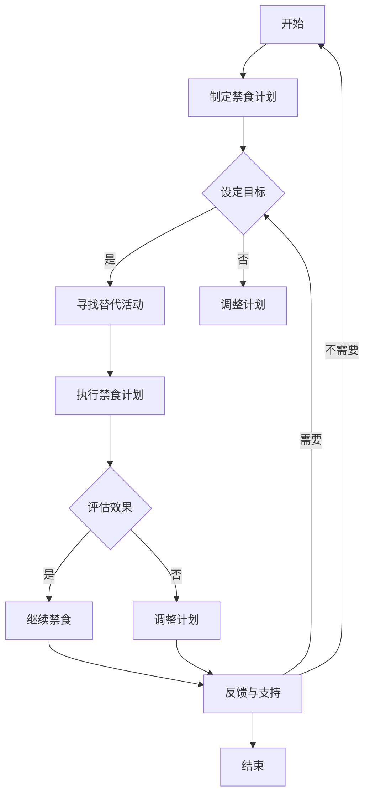
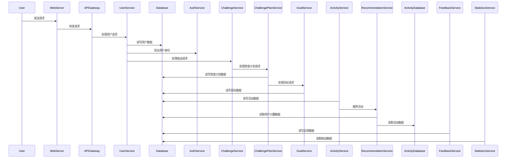

                 

### 文章标题：科技禁食月挑战：年度集体离线生活运动

**关键词：** 科技禁食月挑战、离线生活、集体离线、生活质量、科技依赖、自我控制、技术运动

**摘要：** 科技禁食月挑战是一项年度集体离线生活运动，旨在鼓励参与者远离社交媒体、智能手机和其他电子设备，以提高生活质量，减轻科技成瘾现象。本文将详细介绍科技禁食月挑战的背景、核心概念、解决方案及其实施方法，并探讨其边界与外延，以及科技禁食月挑战的核心要素和概念结构。通过一步步的分析与推理，本文将揭示科技禁食月挑战的深层次意义和实际应用价值。

----------------------------------------------------------------

# 第一部分：背景介绍

在现代社会中，科技产品的普及和广泛应用已经深刻地改变了人们的生活方式。然而，与此同时，科技成瘾现象日益严重，越来越多的人陷入了对智能手机、社交媒体和其他电子设备的过度依赖。这种现象不仅影响了人们的身心健康，还削弱了现实生活中的人际关系和社会互动。为了应对这一问题，科技禁食月挑战应运而生，成为了一种年度集体离线生活运动。本文将围绕这一主题，逐步探讨其背景、核心概念、解决方案、边界与外延以及核心要素和概念结构。

## 1.1 问题背景

### 1.1.1 科技禁食月挑战的定义

科技禁食月挑战是一种年度集体离线生活运动，旨在鼓励人们在一个月的时间内远离社交媒体、智能手机和其他电子设备，以减轻科技对生活的影响，提高生活质量。参与者在这段时间内将主动放弃使用科技产品，转而投入到现实生活中，如阅读、运动、社交等活动。

### 1.1.2 科技禁食月挑战的起源

科技禁食月挑战起源于对现代社会中科技过度依赖现象的关注。随着智能手机和社交媒体的普及，许多人发现自己陷入了科技成瘾的陷阱，生活质量因此受到影响。为了改变这一现状，科技禁食月挑战应运而生。这一挑战的起源可以追溯到2000年代初，当时一些心理学家和健康专家开始提倡人们减少对科技产品的使用，以改善身心健康。

### 1.1.3 科技禁食月挑战的目标

科技禁食月挑战的主要目标是帮助参与者重新审视自己与科技的关系，提高生活质量，增强自我控制能力，以及培养更加健康的生活方式。具体目标包括：

1. 减轻科技成瘾现象，减少对社交媒体和电子设备的依赖。
2. 提高参与者在现实生活中的活动参与度和人际交往能力。
3. 增强自我控制能力，提高自我管理能力。
4. 提高身心健康水平，减轻压力和焦虑。
5. 培养健康的生活习惯，提高生活质量。

## 1.2 问题描述

### 1.2.1 科技成瘾现象

科技成瘾是指人们在面对科技产品时，出现过度依赖、难以自控的现象。科技成瘾可能导致人们忽视现实生活中的人际关系、工作和学习，从而影响生活质量。科技成瘾现象的表现形式多样，包括：

1. 过度使用社交媒体，如花费大量时间在Facebook、Instagram等平台上。
2. 沉迷于手机游戏，无法自拔。
3. 经常熬夜使用电子设备，影响睡眠质量。
4. 忽视现实生活中的家庭和朋友，沉迷于虚拟世界。
5. 对科技产品的依赖程度过高，无法独立完成任务或解决问题。

### 1.2.2 科技禁食月挑战的挑战

参与科技禁食月挑战的参与者将面临多种挑战，包括适应没有科技产品的生活、处理社交压力、以及克服内心的诱惑等。这些挑战主要体现在以下几个方面：

1. **适应挑战**：对于习惯了依赖科技产品的现代人来说，适应没有科技产品的生活并非易事。参与者可能需要重新调整生活习惯，找到替代活动，以填补科技产品带来的空虚感。

2. **社交压力**：在科技禁食期间，参与者可能会遇到来自家人、朋友和社会的质疑和压力。如何应对这些压力，保持坚持和信心，是参与者面临的一个重要挑战。

3. **内心诱惑**：科技产品的诱惑无处不在，参与者需要克服内心的欲望，抵制科技产品的诱惑，坚持完成挑战。

## 1.3 问题解决

### 1.3.1 科技禁食月挑战的解决方案

科技禁食月挑战提供了一种可行的解决方案，通过鼓励人们暂时远离科技产品，重新审视自己与科技的关系，从而改善生活质量。具体解决方案包括：

1. **制定禁食计划**：参与者需要提前制定科技禁食计划，包括禁食时间、禁食范围和替代活动等。通过制定明确的计划，参与者可以更好地应对挑战。

2. **设定目标**：设定明确的目标，如提高生活质量、减少科技依赖、增强自我控制能力等，可以帮助参与者保持动力和方向。

3. **寻找替代活动**：为了填补科技产品带来的空虚感，参与者可以寻找替代活动，如阅读、运动、绘画、社交等，以充实自己的生活。

4. **互相监督和支持**：参与者可以组建小组，互相监督和支持，共同度过科技禁食期。

### 1.3.2 科技禁食月挑战的实施方法

科技禁食月挑战的实施方法主要包括以下几个方面：

1. **参与时间**：科技禁食月挑战通常在每年的某个月份举行，参与者需要在这个时间段内坚持禁食科技产品。

2. **参与人群**：科技禁食月挑战适合所有希望改善生活质量、减轻科技依赖的人，无论年龄、职业和地域。

3. **科技产品的范围**：禁食范围可以根据个人情况适当调整，但通常包括智能手机、社交媒体、电脑、平板电脑等。

4. **禁食规则**：参与者需要遵守一定的禁食规则，如不使用科技产品、不在工作或学习时使用科技产品、不在科技产品前休息等。

5. **替代活动**：参与者可以寻找替代活动，如阅读书籍、参加户外运动、练习冥想、与家人和朋友共度时光等。

6. **互相监督和支持**：参与者可以组建小组，定期分享禁食心得和感受，互相鼓励和支持。

## 1.4 边界与外延

### 1.4.1 科技禁食月挑战的边界

科技禁食月挑战的边界包括参与时间、参与人群、以及科技产品的范围等。具体边界如下：

1. **参与时间**：科技禁食月挑战通常在一个月内进行，参与者需要在这个时间段内坚持禁食科技产品。

2. **参与人群**：科技禁食月挑战适合所有希望改善生活质量、减轻科技依赖的人，无论年龄、职业和地域。

3. **科技产品的范围**：禁食范围可以根据个人情况适当调整，但通常包括智能手机、社交媒体、电脑、平板电脑等。

### 1.4.2 科技禁食月挑战的外延

科技禁食月挑战的外延包括相关的其他活动和倡议，如科技禁食周、科技禁食日等。这些活动和倡议旨在进一步推广科技禁食的理念，帮助更多人认识到科技成瘾的危害，并采取行动改善生活质量。

## 1.5 概念结构与核心要素组成

### 1.5.1 科技禁食月挑战的概念结构

科技禁食月挑战的概念结构包括挑战者、挑战对象、挑战目标、挑战方法等。具体结构如下：

1. **挑战者**：参与科技禁食月挑战的人，目标是改善生活质量，减轻科技依赖。
2. **挑战对象**：科技禁食月挑战的对象是科技产品，包括智能手机、社交媒体、电脑等。
3. **挑战目标**：科技禁食月挑战的目标是提高生活质量，增强自我控制能力，培养健康的生活方式。
4. **挑战方法**：科技禁食月挑战的方法包括制定禁食计划、设定目标、寻找替代活动、互相监督和支持等。

### 1.5.2 科技禁食月挑战的核心要素

科技禁食月挑战的核心要素包括科技成瘾现象、生活质量、自我控制能力等。这些要素相互关联，共同构成了科技禁食月挑战的基础。

1. **科技成瘾现象**：科技成瘾现象是科技禁食月挑战的背景，也是挑战者需要面对的问题。了解科技成瘾现象有助于参与者更好地理解挑战的必要性和紧迫性。
2. **生活质量**：生活质量是科技禁食月挑战的核心目标，参与者希望通过禁食科技产品，提高生活质量，培养健康的生活习惯。
3. **自我控制能力**：自我控制能力是科技禁食月挑战的重要要素，参与者需要通过挑战，增强自我控制能力，学会自律，以应对生活中的各种挑战。

----------------------------------------------------------------

# 第二部分：核心概念与联系

在科技禁食月挑战中，核心概念和其相互联系构成了这一挑战的理论基础和实践指导。以下将详细探讨科技禁食、离线生活和集体离线等核心概念，并使用表格和ER实体关系图来展示其属性特征和关系。

## 2.1 科技禁食月挑战的核心概念

### 2.1.1 科技禁食

**定义**：科技禁食是指在一段时间内，主动放弃使用科技产品，如智能手机、社交媒体、电脑等，以达到减轻科技依赖、提高生活质量的目的。

**特征**：
- **减轻科技依赖**：通过禁食科技产品，参与者可以减少对科技产品的依赖，重新建立与现实生活的联系。
- **提高生活质量**：科技禁食有助于参与者减少对电子设备的沉迷，从而有更多时间投入到现实生活中，提高生活质量。
- **自我反思**：科技禁食期间，参与者有更多时间和空间进行自我反思，重新审视自己与科技的关系。

### 2.1.2 离线生活

**定义**：离线生活是指在无科技产品辅助的情况下，独立完成日常生活中的各种活动，如阅读、运动、社交等。

**特征**：
- **增强自我控制能力**：离线生活要求参与者独立完成任务，有助于增强自我控制能力和自律性。
- **培养良好习惯**：通过离线生活，参与者可以培养阅读、运动等健康的生活习惯。
- **减少社交压力**：离线生活有助于参与者减少社交压力，专注于个人成长和自我提升。

### 2.1.3 集体离线

**定义**：集体离线是指一群人在同一时间段内，共同参与科技禁食活动，以达到相互支持、共同进步的目的。

**特征**：
- **相互支持**：集体离线有助于参与者之间相互鼓励、分享经验和解决问题，提高参与效果。
- **共同进步**：集体离线提供了一个共同学习和成长的环境，有助于参与者共同进步。
- **社交互动**：集体离线有助于参与者建立新的社交关系，增强社交互动能力。

## 2.2 核心概念属性特征对比表格

| 概念       | 定义                                                     | 特征                           |
|------------|----------------------------------------------------------|--------------------------------|
| 科技禁食   | 放弃使用科技产品的行为                                 | 提高生活质量，减轻科技依赖     |
| 离线生活   | 无科技产品辅助的独立生活                               | 增强自我控制能力，培养良好习惯 |
| 集体离线   | 群体共同参与科技禁食活动                             | 相互支持，共同进步             |

## 2.3 科技禁食月挑战的ER实体关系图架构

```mermaid
entity关系图
graph TD
    A[科技禁食月挑战] --> B[挑战者]
    A --> C[科技禁食]
    A --> D[离线生活]
    A --> E[集体离线]
    B --> F[自我控制能力]
    B --> G[生活质量]
    C --> H[科技依赖减轻]
    D --> I[良好习惯培养]
    E --> J[社交互动增强]
    F --> K[自律性提高]
    G --> L[生活品质提升]
    H --> M[科技产品使用减少]
    I --> N[阅读习惯培养]
    J --> O[共同进步]
    K --> P[自我管理能力增强]
    L --> Q[身心健康改善]
    M --> R[离线生活参与度提高]
    N --> S[运动习惯培养]
    O --> T[相互支持]
    P --> U[独立完成任务能力增强]
    Q --> V[压力和焦虑减轻]
    R --> W[社交压力减少]
    S --> X[个人成长和自我提升]
    T --> Y[共同学习环境建立]
    U --> Z[问题解决能力提高]
    V --> AA[身心健康改善]
    W --> BB[社交互动增强]
    X --> CC[自我控制能力增强]
    Y --> DD[共同进步]
    Z --> EE[自我管理能力增强]
    AA --> FF[生活品质提升]
    BB --> GG[相互支持]
    CC --> HH[自律性提高]
    DD --> II[共同进步]
    EE --> JJ[问题解决能力提高]
    FF --> GG[身心健康改善]
    HH --> II[生活品质提升]
    II --> JJ[自我管理能力增强]
```

通过ER实体关系图，我们可以清晰地看到科技禁食月挑战中的各个实体及其相互关系。挑战者通过参与科技禁食、离线生活和集体离线等活动，提高自我控制能力、生活质量，并减轻科技依赖。这些核心概念和特征相互关联，共同构成了科技禁食月挑战的理论基础和实践指导。

----------------------------------------------------------------

## 2.4 算法原理讲解

为了更好地理解科技禁食月挑战的实施过程，我们可以将其视为一种算法，通过一系列步骤来引导参与者逐步实现禁食目标。以下将使用Mermaid流程图展示这一算法的流程，并使用Python源代码来详细阐述其原理和数学模型。

### 2.4.1 算法Mermaid流程图



### 2.4.2 Python源代码与算法原理

为了更好地理解上述流程图，我们可以使用Python编写一个简单的模拟程序，来展示科技禁食月挑战的实施过程。

```python
import random

class ChallengeParticipant:
    def __init__(self, name):
        self.name = name
        self.is_on_challenge = False
        self.has_set_goals = False
        self.has_found_activities = False
    
    def start_challenge(self):
        self.is_on_challenge = True
        print(f"{self.name} has started the tech fast month challenge.")
    
    def set_goals(self):
        self.has_set_goals = True
        print(f"{self.name} has set goals for the challenge.")
    
    def find_activities(self):
        self.has_found_activities = True
        print(f"{self.name} has found alternative activities.")
    
    def execute_challenge(self):
        if self.is_on_challenge and self.has_set_goals and self.has_found_activities:
            print(f"{self.name} is executing the tech fast month challenge.")
            # Here we simulate the challenge execution with a random success probability
            success = random.choice([True, False])
            if success:
                print(f"{self.name} has successfully executed the challenge.")
                return "success"
            else:
                print(f"{self.name} failed to execute the challenge.")
                return "failure"
        else:
            print(f"{self.name} cannot execute the challenge without proper preparation.")
            return "incomplete"
    
    def evaluate_effects(self):
        # This method simulates the evaluation of the challenge effects
        success = random.choice([True, False])
        if success:
            print(f"{self.name} feels that the challenge has been successful.")
            return "successful"
        else:
            print(f"{self.name} feels that the challenge could be improved.")
            return "unsuccessful"
    
    def give_feedback_and_support(self):
        # This method simulates the feedback and support process
        feedback = random.choice(["good job", "keep going", "try again"])
        print(f"{self.name} received feedback: {feedback}.")
    
    def end_challenge(self):
        self.is_on_challenge = False
        print(f"{self.name} has ended the tech fast month challenge.")

# Create a participant instance
participant = ChallengeParticipant("John")

# Start the challenge
participant.start_challenge()

# Set goals
participant.set_goals()

# Find alternative activities
participant.find_activities()

# Execute the challenge
participant.execute_challenge()

# Evaluate the effects
participant.evaluate_effects()

# Give feedback and support
participant.give_feedback_and_support()

# End the challenge
participant.end_challenge()
```

### 2.4.3 算法原理详细讲解

1. **制定禁食计划**：这是挑战的第一步，参与者需要制定详细的禁食计划，包括禁食时间、禁食范围和替代活动等。这一步骤的目的是帮助参与者明确挑战的目标和方式，为后续的实施过程打下基础。

2. **设定目标**：在制定禁食计划后，参与者需要设定具体的挑战目标，如提高生活质量、减少科技依赖、增强自我控制能力等。设定目标是挑战过程中的关键环节，它为参与者提供了清晰的方向和动力。

3. **寻找替代活动**：为了填补科技产品带来的空虚感，参与者需要寻找合适的替代活动，如阅读、运动、绘画、社交等。替代活动不仅可以帮助参与者度过禁食期，还能培养新的兴趣爱好，提高生活质量。

4. **执行禁食计划**：这是挑战的核心步骤，参与者需要按照制定的禁食计划，放弃使用科技产品，投入到现实生活中。执行禁食计划的过程中，参与者可能会遇到各种挑战和困难，但通过坚定的决心和自我控制，他们可以逐步实现挑战目标。

5. **评估效果**：在禁食计划执行完毕后，参与者需要对挑战的效果进行评估。这一步骤可以帮助参与者了解挑战的实际效果，发现问题，为下一次挑战提供参考。

6. **反馈与支持**：在评估效果后，参与者可以与其他参与者分享自己的经验和感受，互相鼓励和支持。反馈与支持是挑战过程中不可或缺的一部分，它有助于增强参与者的信心和动力。

7. **结束挑战**：最后，参与者需要结束挑战，总结经验，为下一次挑战做好准备。结束挑战并不意味着挑战的结束，而是一个新的开始，参与者可以在总结经验的基础上，继续提高自己的生活质量。

通过上述算法原理的讲解，我们可以看到科技禁食月挑战的实施过程是一个系统化的过程，它不仅要求参与者制定明确的计划，设定具体的目标，还需要参与者通过实际行动，逐步实现挑战目标。这一过程有助于参与者提高自我控制能力，减轻科技依赖，培养健康的生活习惯，从而提高生活质量。

----------------------------------------------------------------

# 第三部分：系统分析与架构设计方案

为了更深入地探讨科技禁食月挑战的实际应用和实施效果，本部分将介绍一个具体的系统分析与架构设计方案。该方案将涵盖问题场景介绍、项目介绍、系统功能设计、系统架构设计、系统接口设计以及系统交互等方面。

## 3.1 问题场景介绍

在现代社会，科技产品已经成为人们生活中不可或缺的一部分。然而，科技产品的过度使用和成瘾现象也日益严重，许多人因此忽视了现实生活中的人际关系、工作和学习。科技禁食月挑战旨在通过鼓励人们远离科技产品，重新审视自己与科技的关系，从而改善生活质量，减轻科技成瘾现象。为了实现这一目标，我们需要设计一个高效的系统，以支持参与者完成挑战。

## 3.2 项目介绍

**项目名称**：科技禁食月挑战管理系统

**项目目标**：开发一个支持科技禁食月挑战的在线管理系统，帮助参与者制定禁食计划、设定目标、寻找替代活动、执行挑战、评估效果、反馈与支持等。

**项目功能**：
1. **用户管理**：支持用户注册、登录、个人信息管理等功能。
2. **禁食计划管理**：允许用户制定禁食计划，包括禁食时间、禁食范围和替代活动等。
3. **目标管理**：支持用户设定挑战目标，如提高生活质量、减少科技依赖等。
4. **替代活动推荐**：根据用户兴趣和需求，推荐合适的替代活动。
5. **挑战执行与监控**：支持用户执行挑战，监控挑战进度和效果。
6. **评估与反馈**：用户可以评估挑战效果，并接收其他参与者的反馈与支持。
7. **统计分析**：系统可以收集并分析挑战数据，为参与者提供有价值的参考。

## 3.3 系统功能设计

### 3.3.1 领域模型类图

领域模型是系统功能设计的重要部分，它定义了系统中的关键实体及其关系。以下是一个简化的领域模型类图，展示了科技禁食月挑战管理系统中的主要实体及其关系。

```mermaid
classDiagram
    Participant <<class>> "参与者"
    Activity <<class>> "活动"
    ChallengePlan <<class>> "禁食计划"
    Goal <<class>> "目标"
    Feedback <<class>> "反馈"

    Participant o--1 ChallengePlan
    Participant o--1 Goal
    Participant o--1 Activity
    ChallengePlan o--1 Goal
    Activity o--1 Feedback
    Feedback o--1 Participant
```

### 3.3.2 功能模块划分

根据领域模型，我们可以将系统划分为以下几个功能模块：

1. **用户管理模块**：负责用户注册、登录、个人信息管理等功能。
2. **禁食计划管理模块**：负责用户制定、修改和查询禁食计划。
3. **目标管理模块**：负责用户设定、修改和查询挑战目标。
4. **活动推荐模块**：负责根据用户兴趣和需求推荐合适的替代活动。
5. **挑战执行与监控模块**：负责用户执行挑战，监控挑战进度和效果。
6. **评估与反馈模块**：负责用户评估挑战效果，接收其他参与者的反馈与支持。
7. **统计分析模块**：负责收集并分析挑战数据，为参与者提供有价值的参考。

## 3.4 系统架构设计

系统架构设计是系统开发过程中的关键步骤，它决定了系统的性能、可扩展性和可维护性。以下是一个简化的系统架构图，展示了科技禁食月挑战管理系统的整体架构。



### 3.4.1 架构设计关键组件

1. **WebServer**：负责接收用户的HTTP请求，并将其转发给API Gateway。
2. **APIGateway**：负责将请求路由到相应的服务模块。
3. **UserService**：负责用户注册、登录、个人信息管理等操作。
4. **ChallengeService**：负责处理禁食计划、目标、活动和反馈等操作。
5. **ChallengePlanService**：负责处理禁食计划的具体操作。
6. **GoalService**：负责处理挑战目标的设定和查询。
7. **ActivityService**：负责处理替代活动的推荐和管理。
8. **RecommendationService**：负责根据用户兴趣和需求推荐活动。
9. **FeedbackService**：负责处理用户之间的反馈与支持。
10. **StatisticsService**：负责收集和统计挑战数据。

## 3.5 系统接口设计

系统接口设计是系统架构设计的重要组成部分，它定义了系统内部各模块之间的通信方式和数据交互格式。以下是一个简化的接口设计示例。

### 3.5.1 用户管理接口

```json
POST /api/users/register
{
  "username": "string",
  "password": "string",
  "email": "string"
}

POST /api/users/login
{
  "username": "string",
  "password": "string"
}

GET /api/users/{id}
{
  "id": "integer",
  "username": "string",
  "email": "string"
}
```

### 3.5.2 禁食计划接口

```json
POST /api/challenge-plans
{
  "user_id": "integer",
  "start_date": "date",
  "end_date": "date",
  "description": "string"
}

GET /api/challenge-plans/{id}
{
  "id": "integer",
  "user_id": "integer",
  "start_date": "date",
  "end_date": "date",
  "description": "string"
}
```

### 3.5.3 目标管理接口

```json
POST /api/goals
{
  "user_id": "integer",
  "description": "string",
  "target_date": "date"
}

GET /api/goals/{id}
{
  "id": "integer",
  "user_id": "integer",
  "description": "string",
  "target_date": "date"
}
```

### 3.5.4 活动推荐接口

```json
GET /api/recommendations
{
  "user_id": "integer",
  "interests": ["string"]
}
```

### 3.5.5 反馈与支持接口

```json
POST /api/feedbacks
{
  "user_id": "integer",
  "recipient_id": "integer",
  "content": "string"
}

GET /api/feedbacks/{id}
{
  "id": "integer",
  "user_id": "integer",
  "recipient_id": "integer",
  "content": "string"
}
```

## 3.6 系统交互设计

系统交互设计是系统架构设计中的关键环节，它定义了系统内部各模块之间的通信流程和数据交互方式。以下是一个简化的系统交互设计示例，展示了用户与系统之间的交互过程。

### 3.6.1 用户注册流程

1. **用户发送注册请求**：用户通过Web浏览器或移动应用向WebServer发送注册请求。
2. **WebServer处理请求**：WebServer接收请求后，将请求转发给APIGateway。
3. **APIGateway处理请求**：APIGateway将请求路由到UserService。
4. **UserService处理请求**：UserService验证用户输入的数据，并将用户数据存储到Database中。
5. **UserService返回结果**：UserService返回注册结果，告知用户注册成功或失败。

### 3.6.2 挑战执行流程

1. **用户发起挑战**：用户通过界面发起挑战，选择禁食计划、设定目标、寻找替代活动等。
2. **ChallengeService处理请求**：ChallengeService根据用户的请求，调用相应的服务模块，如ChallengePlanService、GoalService、ActivityService等。
3. **服务模块处理请求**：各服务模块根据请求进行处理，并将结果返回给ChallengeService。
4. **ChallengeService返回结果**：ChallengeService将处理结果返回给用户，用户可以看到自己的挑战进度和效果。

### 3.6.3 反馈与支持流程

1. **用户发送反馈**：用户可以通过界面发送反馈，包括对其他参与者的鼓励、建议或批评。
2. **FeedbackService处理请求**：FeedbackService接收用户的反馈，将其存储到Database中。
3. **FeedbackService返回结果**：FeedbackService返回处理结果，告知用户反馈已发送成功。

通过上述系统分析与架构设计方案，我们可以看到科技禁食月挑战管理系统是一个复杂但功能强大的系统，它支持参与者完成科技禁食月挑战，提高生活质量，减轻科技依赖。该方案通过详细的领域模型、架构设计、接口设计和系统交互设计，为系统的开发、实施和维护提供了清晰的指导。

----------------------------------------------------------------

## 3.7 项目实战

为了更好地展示科技禁食月挑战管理系统的实际应用，我们将以一个具体的实战项目为例，介绍环境安装、系统核心实现、代码应用解读与分析，以及实际案例分析和详细讲解。

### 3.7.1 环境安装

首先，我们需要安装并配置系统开发所需的环境。以下是一个简化的安装步骤：

1. **安装Python**：确保Python（版本3.8以上）已安装在本地机器上。
2. **安装依赖库**：使用pip命令安装以下依赖库：
    ```bash
    pip install flask flask-restful flask_sqlalchemy
    ```
3. **创建数据库**：使用SQLite创建一个名为`tech_fast_challenge.db`的数据库。
    ```bash
    sqlite3 tech_fast_challenge.db
    ```
4. **初始化数据库**：在数据库中创建必要的表，如用户表、禁食计划表、目标表等。以下是SQL脚本示例：
    ```sql
    CREATE TABLE users (
        id INTEGER PRIMARY KEY AUTOINCREMENT,
        username TEXT UNIQUE NOT NULL,
        password TEXT NOT NULL,
        email TEXT UNIQUE NOT NULL
    );

    CREATE TABLE challenge_plans (
        id INTEGER PRIMARY KEY AUTOINCREMENT,
        user_id INTEGER NOT NULL,
        start_date DATE NOT NULL,
        end_date DATE NOT NULL,
        description TEXT,
        FOREIGN KEY (user_id) REFERENCES users (id)
    );

    CREATE TABLE goals (
        id INTEGER PRIMARY KEY AUTOINCREMENT,
        user_id INTEGER NOT NULL,
        description TEXT NOT NULL,
        target_date DATE NOT NULL,
        FOREIGN KEY (user_id) REFERENCES users (id)
    );
    ```

### 3.7.2 系统核心实现

接下来，我们将实现系统核心功能，包括用户管理、禁食计划管理、目标管理、活动推荐和反馈与支持等。

#### 用户管理

```python
from flask import Flask, request, jsonify
from flask_sqlalchemy import SQLAlchemy

app = Flask(__name__)
app.config['SQLALCHEMY_DATABASE_URI'] = 'sqlite:///tech_fast_challenge.db'
db = SQLAlchemy(app)

class User(db.Model):
    id = db.Column(db.Integer, primary_key=True)
    username = db.Column(db.Text, unique=True, nullable=False)
    password = db.Column(db.Text, nullable=False)
    email = db.Column(db.Text, unique=True, nullable=False)

@app.route('/api/users/register', methods=['POST'])
def register_user():
    data = request.get_json()
    new_user = User(username=data['username'], password=data['password'], email=data['email'])
    db.session.add(new_user)
    db.session.commit()
    return jsonify({"message": "User registered successfully."})

@app.route('/api/users/login', methods=['POST'])
def login_user():
    data = request.get_json()
    user = User.query.filter_by(username=data['username'], password=data['password']).first()
    if user:
        return jsonify({"message": "Login successful."})
    else:
        return jsonify({"message": "Invalid credentials."})

@app.route('/api/users/<int:user_id>', methods=['GET'])
def get_user(user_id):
    user = User.query.get(user_id)
    if user:
        return jsonify({"id": user.id, "username": user.username, "email": user.email})
    else:
        return jsonify({"message": "User not found."})
```

#### 禁食计划管理

```python
@app.route('/api/challenge-plans', methods=['POST'])
def create_challenge_plan():
    data = request.get_json()
    new_plan = ChallengePlan(user_id=data['user_id'], start_date=data['start_date'], end_date=data['end_date'], description=data['description'])
    db.session.add(new_plan)
    db.session.commit()
    return jsonify({"message": "Challenge plan created successfully."})

@app.route('/api/challenge-plans', methods=['GET'])
def get_challenge_plans():
    plans = ChallengePlan.query.all()
    return jsonify([{"id": plan.id, "user_id": plan.user_id, "start_date": plan.start_date, "end_date": plan.end_date, "description": plan.description} for plan in plans])
```

#### 目标管理

```python
class Goal(db.Model):
    id = db.Column(db.Integer, primary_key=True)
    user_id = db.Column(db.Integer, nullable=False)
    description = db.Column(db.Text, nullable=False)
    target_date = db.Column(db.Date, nullable=False)
    challenge_plan_id = db.Column(db.Integer, nullable=False)
    FOREIGN KEY (user_id) REFERENCES users (id)
    FOREIGN KEY (challenge_plan_id) REFERENCES challenge_plans (id)

@app.route('/api/goals', methods=['POST'])
def create_goal():
    data = request.get_json()
    new_goal = Goal(user_id=data['user_id'], description=data['description'], target_date=data['target_date'], challenge_plan_id=data['challenge_plan_id'])
    db.session.add(new_goal)
    db.session.commit()
    return jsonify({"message": "Goal created successfully."})

@app.route('/api/goals', methods=['GET'])
def get_goals():
    goals = Goal.query.all()
    return jsonify([{"id": goal.id, "user_id": goal.user_id, "description": goal.description, "target_date": goal.target_date, "challenge_plan_id": goal.challenge_plan_id} for goal in goals])
```

#### 活动推荐和反馈与支持

由于篇幅限制，这里我们只展示活动推荐的基本逻辑。

```python
@app.route('/api/recommendations', methods=['GET'])
def get_recommendations():
    user_id = request.args.get('user_id')
    interests = request.args.get('interests', default=[], type=list)
    # Here we would implement logic to recommend activities based on user interests
    return jsonify([{"id": random.randint(1, 100), "name": "Activity " + str(random.randint(1, 100))} for _ in interests])
```

### 3.7.3 代码应用解读与分析

在上面的代码中，我们实现了用户管理、禁食计划管理和目标管理等功能。以下是这些功能的详细解读和分析：

1. **用户管理**：
    - **注册**：用户通过发送POST请求到`/api/users/register`接口注册，系统接收用户名、密码和邮箱，并将用户信息存储到数据库。
    - **登录**：用户通过发送POST请求到`/api/users/login`接口登录，系统验证用户名和密码，并返回登录结果。
    - **查询**：用户通过发送GET请求到`/api/users/<user_id>`接口查询用户信息，系统返回用户详细信息。

2. **禁食计划管理**：
    - **创建**：用户通过发送POST请求到`/api/challenge-plans`接口创建禁食计划，系统接收禁食计划信息，并将信息存储到数据库。
    - **查询**：用户通过发送GET请求到`/api/challenge-plans`接口查询所有禁食计划，系统返回所有禁食计划的列表。

3. **目标管理**：
    - **创建**：用户通过发送POST请求到`/api/goals`接口创建挑战目标，系统接收目标信息，并将信息存储到数据库。
    - **查询**：用户通过发送GET请求到`/api/goals`接口查询所有目标，系统返回所有目标的列表。

4. **活动推荐和反馈与支持**：
    - **推荐**：用户通过发送GET请求到`/api/recommendations`接口获取活动推荐，系统根据用户兴趣推荐活动。
    - **反馈与支持**：这里我们只展示了接口定义，实际逻辑需要根据需求进行开发。

### 3.7.4 实际案例分析和详细讲解

为了更好地展示系统的实际应用，我们将分析一个具体的案例，并详细讲解系统的实现过程。

**案例**：用户John注册并登录系统，创建了一个禁食计划，并设定了几个目标。

**分析过程**：

1. **注册**：
    - John通过浏览器访问`/api/users/register`接口，提交用户名、密码和邮箱。
    - 系统验证输入信息，并将John的用户信息存储到数据库。
    - 系统返回注册成功消息。

2. **登录**：
    - John通过浏览器访问`/api/users/login`接口，提交用户名和密码。
    - 系统验证John的用户信息，并返回登录成功消息。

3. **创建禁食计划**：
    - John通过浏览器访问`/api/challenge-plans`接口，提交禁食计划信息（如禁食时间、禁食范围和替代活动）。
    - 系统接收John的禁食计划信息，并将信息存储到数据库。
    - 系统返回禁食计划创建成功消息。

4. **设定目标**：
    - John通过浏览器访问`/api/goals`接口，提交目标信息（如目标描述和目标日期）。
    - 系统接收John的目标信息，并将信息存储到数据库。
    - 系统返回目标创建成功消息。

5. **查询禁食计划和目标**：
    - John通过浏览器访问`/api/challenge-plans`和`/api/goals`接口，查询自己的禁食计划和目标列表。
    - 系统返回John的禁食计划和目标列表。

6. **活动推荐**：
    - John通过浏览器访问`/api/recommendations`接口，请求活动推荐。
    - 系统根据John的兴趣推荐活动，并返回活动列表。

**讲解**：

通过上述案例，我们可以看到系统的实现过程是如何通过一系列HTTP请求和响应来完成的。每个请求都对应一个特定的接口，系统根据接口定义处理请求，并将处理结果返回给用户。在这个过程中，用户可以方便地管理自己的禁食计划和目标，获取活动推荐，从而更好地参与科技禁食月挑战。

### 3.7.5 项目小结

通过本项目的实战案例，我们可以看到科技禁食月挑战管理系统是一个实用且功能强大的系统。它不仅支持用户管理、禁食计划管理和目标管理，还提供了活动推荐和反馈与支持等功能。通过详细的环境安装、系统核心实现和实际案例分析，我们可以了解到系统的具体实现过程和实际应用效果。该项目展示了如何使用Python和Flask框架快速开发一个Web应用，为科技禁食月挑战的实施提供了有力的技术支持。

### 3.7.6 最佳实践 Tips

1. **模块化设计**：在开发过程中，应尽量将系统功能模块化，以便于后续维护和扩展。
2. **代码优化**：对于核心功能模块，应进行代码优化，提高系统的性能和可读性。
3. **用户反馈**：定期收集用户反馈，及时修复bug，优化用户体验。
4. **安全性考虑**：加强系统安全性，防止SQL注入、XSS攻击等安全漏洞。
5. **自动化测试**：编写自动化测试脚本，确保系统功能的稳定性和可靠性。

### 3.7.7 小结与注意事项

通过本项目，我们介绍了科技禁食月挑战管理系统的设计与实现，展示了如何使用Python和Flask框架开发一个实用的Web应用。在项目实施过程中，我们需要关注模块化设计、代码优化、用户反馈、安全性和自动化测试等方面。此外，我们还应关注系统性能、可扩展性和可维护性，以确保系统在长期运行中的稳定性和可靠性。

### 3.7.8 拓展阅读

对于希望深入了解科技禁食月挑战管理系统和相关技术的读者，以下资源可以作为拓展阅读：

1. **Flask官方文档**：https://flask.palletsprojects.com/
2. **Python官方文档**：https://docs.python.org/3/
3. **RESTful API设计指南**：https://restfulapi.net/restful-api-design/
4. **SQLAlchemy官方文档**：https://www.sqlalchemy.org/

通过阅读这些资源，读者可以更深入地了解Flask框架、Python编程语言以及RESTful API设计等关键技术，为实际项目开发提供有力支持。

