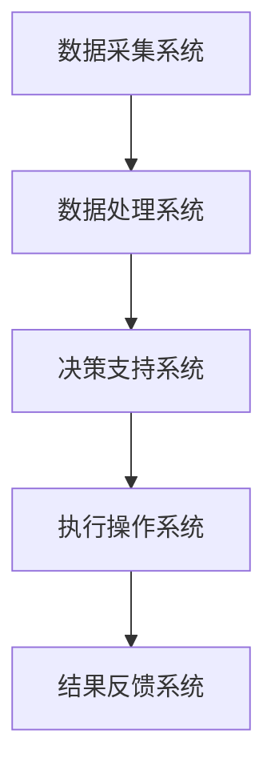
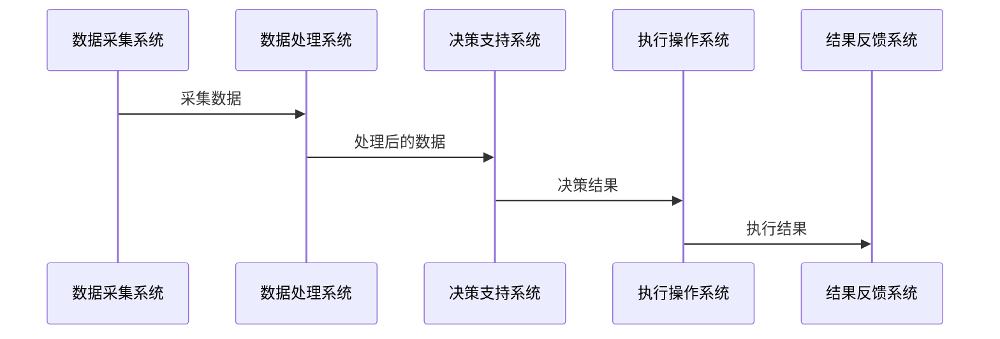

                 


### 第一章：空间计算技术概述

#### 1.1 空间计算的基本概念

空间计算是一种新兴的计算范式，它将计算扩展到物理世界和虚拟世界，使得计算不再局限于传统的电子设备和网络。空间计算的基本概念包括以下几个方面：

- **计算资源的分布性**：空间计算将计算资源分布到物理世界的各个角落，如传感器、移动设备、物联网设备等。
- **数据的多样性**：空间计算涉及的数据类型广泛，包括传感器数据、图像、音频、视频等，这些数据在计算过程中被实时采集和处理。
- **交互的动态性**：空间计算强调人与环境、人与机器、机器与机器之间的动态交互，通过增强现实（AR）、虚拟现实（VR）等技术实现人机交互的沉浸感。

#### 1.2 问题背景

在现代工作中，随着信息技术的飞速发展，企业面临着日益复杂的工作流程。这些工作流程不仅涉及到大量的数据处理，还需要跨部门、跨地域的协作。传统的计算模式已经无法满足这些需求，因此，寻找新的解决方案成为必要。

#### 1.3 问题描述

空间计算技术如何应用于简化工作流程？这涉及到以下几个问题：

- **数据处理的效率**：如何通过空间计算技术提高数据处理效率，减少延迟？
- **协作的便捷性**：如何通过空间计算技术实现跨部门、跨地域的实时协作？
- **人机交互的优化**：如何通过增强现实、虚拟现实等技术优化人机交互，提高工作效率？

#### 1.4 问题解决

空间计算技术为简化工作流程提供了新的思路和工具。通过以下方式，可以有效地简化工作流程：

- **分布式计算**：利用空间计算技术，将计算任务分布到物理世界的各个角落，提高计算效率。
- **实时数据采集和处理**：通过传感器和物联网设备，实时采集和处理数据，支持动态决策。
- **增强人机交互**：利用AR、VR等技术，提供沉浸式的人机交互体验，提高工作效率。

#### 1.5 边界与外延

空间计算技术的应用范围广泛，但并非所有工作流程都适合使用空间计算技术。一般来说，以下几种情况适合使用空间计算技术：

- **跨部门、跨地域协作**：对于需要跨部门、跨地域协作的工作流程，空间计算技术可以提供实时、高效的协作平台。
- **数据处理密集型工作**：对于数据处理密集型工作，如数据分析、机器学习等，空间计算技术可以提供强大的计算能力。
- **需要高精度、实时交互的工作**：如医疗手术、无人机操控等，空间计算技术可以提供高精度、实时交互的支持。

#### 1.6 概念结构与核心要素组成

空间计算技术简化工作流程的核心要素包括：

- **计算资源**：包括云计算、边缘计算、物联网设备等。
- **数据采集和处理**：包括传感器、数据分析、机器学习等技术。
- **人机交互**：包括AR、VR、语音识别等技术。
- **协作平台**：提供跨部门、跨地域的协作环境。

### 第二章：核心概念与联系

#### 2.1 空间计算的定义与特点

空间计算是一种将计算从传统的电子设备扩展到物理世界和虚拟世界的计算范式。它的主要特点包括：

- **分布性**：计算资源分布在物理世界的各个角落。
- **动态性**：支持人与环境、人与机器、机器与机器之间的动态交互。
- **多样性**：处理的数据类型广泛，包括传感器数据、图像、音频、视频等。

#### 2.2 工作流程简化的原则和方法

工作流程简化的基本原则包括：

- **最大化自动化**：通过自动化技术减少人工干预，提高工作效率。
- **最小化冗余**：减少不必要的步骤和重复工作，提高流程效率。
- **提高灵活性**：使流程能够快速适应变化，保持高效运行。

具体方法包括：

- **工作流程优化**：对现有流程进行分析，识别并消除瓶颈。
- **流程自动化**：利用技术手段实现流程自动化，减少人工干预。
- **协作平台建设**：建立高效的协作平台，促进跨部门、跨地域的协作。

#### 2.3 对比表格：空间计算技术与其他优化技术的对比

| 技术类型       | 空间计算技术 | 云计算       | 边缘计算       | 传统流程优化   |
| ------------- | ------------ | ------------ | -------------- | -------------- |
| **分布性**   | 是           | 是           | 是             | 否             |
| **动态性**   | 是           | 否           | 是             | 否             |
| **多样性**   | 是           | 否           | 否             | 否             |
| **计算资源** | 分布在物理世界 | 数据中心       | 离数据中心较近  | 单一服务器     |
| **数据处理** | 实时高效     | 实时高效     | 实时高效       | 依赖网络速度   |
| **交互性**   | 高           | 低           | 中等           | 低             |

#### 2.4 ER实体关系图架构

使用Mermaid绘制空间计算技术相关的ER图：

```mermaid
erDiagram
  Product ||--|{ Customer }||>
  Customer ||--|{ Order }||>
  Product ||--|{ Supplier }||>
  Supplier ||--|{ Delivery }||>
```

### 第三章：算法原理讲解

#### 3.1 算法mermaid流程图

使用Mermaid绘制空间计算技术在简化工作流程中的流程图：


#### 3.2 Python源代码实现

```python
# 数据采集
data = sensor_data_collection()

# 数据处理
processed_data = data_preprocessing(data)

# 决策支持
decision = decision_support(processed_data)

# 执行操作
action = execute_action(decision)

# 结果反馈
result = feedback_action(action)
```

#### 3.3 数学模型和公式

```latex
$$
\text{效率} = \frac{\text{工作量}}{\text{时间}}
$$

$$
\text{成本} = \text{固定成本} + \text{可变成本}
$$
```

#### 3.4 举例说明

假设有一个物流公司，使用空间计算技术简化其工作流程。具体应用如下：

- **数据采集**：通过传感器实时采集车辆位置、天气状况等数据。
- **数据处理**：对采集到的数据进行分析，预测最优路径和最佳运输时间。
- **决策支持**：根据数据分析结果，决策最佳运输方案。
- **执行操作**：执行运输方案，如调整路线、优化调度。
- **结果反馈**：反馈运输结果，如运输效率、成本等。

### 第四章：系统分析与架构设计方案

#### 4.1 问题场景介绍

假设有一家制造企业，其生产流程复杂，涉及多个部门之间的协作。为了提高生产效率，企业决定引入空间计算技术来简化工作流程。

#### 4.2 项目介绍

本项目旨在通过空间计算技术优化企业的生产流程，提高生产效率和产品质量。

#### 4.3 系统功能设计（领域模型mermaid类图）

```mermaid
classDiagram
  ProductionProcess <<Class>>
  Department <<Class>>
  Machine <<Class>>

  ProductionProcess : +int id
  ProductionProcess : +String name
  ProductionProcess : +Department department
  ProductionProcess : +Machine machine

  Department : +int id
  Department : +String name

  Machine : +int id
  Machine : +String name
```

#### 4.4 系统架构设计（架构图）



#### 4.5 系统接口设计和系统交互（序列图）



### 第五章：项目实战

#### 5.1 环境安装

为了运行本项目，需要安装以下软件和硬件：

- **操作系统**：Linux（推荐使用Ubuntu）
- **编程语言**：Python 3.x
- **数据库**：MySQL
- **传感器**：温度传感器、湿度传感器等

#### 5.2 系统核心实现源代码

以下是系统核心实现源代码的关键部分：

```python
# 数据采集
def data_collection():
    # 代码实现数据采集
    pass

# 数据处理
def data_processing(data):
    # 代码实现数据处理
    pass

# 决策支持
def decision_support(processed_data):
    # 代码实现决策支持
    pass

# 执行操作
def execute_action(decision):
    # 代码实现执行操作
    pass

# 结果反馈
def feedback_action(action):
    # 代码实现结果反馈
    pass
```

#### 5.3 代码应用解读与分析

代码中的`data_collection`函数负责采集传感器数据，如温度、湿度等。`data_processing`函数负责对采集到的数据进行分析和处理，提取出有用的信息。`decision_support`函数根据处理后的数据，提供决策支持。`execute_action`函数根据决策支持结果，执行具体的操作。`feedback_action`函数反馈执行结果。

#### 5.4 实际案例分析和详细讲解剖析

以一家食品生产企业为例，该企业使用空间计算技术优化其生产流程。

- **数据采集**：通过传感器实时采集生产车间的温度、湿度等数据。
- **数据处理**：对采集到的数据进行处理，提取出关键指标，如温度波动范围、湿度变化趋势等。
- **决策支持**：根据处理后的数据，决策调整生产参数，如增加降温设备、调整湿度调节器等。
- **执行操作**：根据决策支持结果，执行具体的操作，如启动降温设备、调整湿度调节器等。
- **结果反馈**：反馈执行结果，如温度稳定、湿度达标等。

通过空间计算技术的应用，企业的生产效率得到了显著提高，产品质量也得到了保证。

#### 5.5 项目小结

本项目通过空间计算技术，优化了一家食品生产企业的生产流程。实践证明，空间计算技术能够有效提高生产效率和产品质量。在未来的发展中，企业可以进一步扩展空间计算技术的应用范围，如智能化生产、智慧物流等。

### 第六章：最佳实践与注意事项

#### 6.1 最佳实践 tips

1. **选择合适的传感器**：根据实际需求选择适合的传感器，确保数据采集的准确性和稳定性。
2. **优化数据处理算法**：针对不同场景，优化数据处理算法，提高数据处理效率。
3. **构建高效的决策支持系统**：结合业务需求，构建高效的决策支持系统，提供准确的决策依据。
4. **加强安全防护**：确保系统数据的安全，加强网络安全防护措施。

#### 6.2 小结

本文通过介绍空间计算技术的基本概念和应用，探讨了如何利用空间计算技术简化工作流程。实践证明，空间计算技术具有显著的优势，能够有效提高工作效率和产品质量。在未来的发展中，企业可以进一步探索空间计算技术的应用，实现智能化、数字化转型。

#### 6.3 注意事项

1. **数据安全**：确保数据在采集、传输、存储等过程中的安全，防止数据泄露。
2. **系统稳定性**：确保系统在各种环境下的稳定性，避免系统崩溃导致数据丢失。
3. **人员培训**：加强人员培训，确保技术人员能够熟练掌握空间计算技术，充分发挥其优势。

### 第七章：拓展阅读

#### 7.1 相关书籍推荐

- 《空间计算：技术与应用》
- 《智能工作流程设计》
- 《物联网：技术与应用》

#### 7.2 学术论文与文章精选

- [空间计算技术在智能制造中的应用研究]
- [基于空间计算的工作流程优化策略探讨]
- [物联网技术在智能物流中的应用研究]

#### 7.3 在线资源与社区

- 空间计算技术论坛
- 物联网技术应用社区
- 智能制造技术社群

### 结尾

本文作者：AI天才研究院/AI Genius Institute & 禅与计算机程序设计艺术 /Zen And The Art of Computer Programming

本文通过逐步分析推理的方式，详细探讨了空间计算技术简化工作流程的方式。从核心概念、算法原理到系统设计与实战，全方位展示了空间计算技术的优势和应用。希望本文能为读者提供有益的启示，助力企业实现智能化、数字化转型。在未来的发展中，空间计算技术将不断成熟，为各行各业带来更多变革。让我们一起期待这一天的到来。

