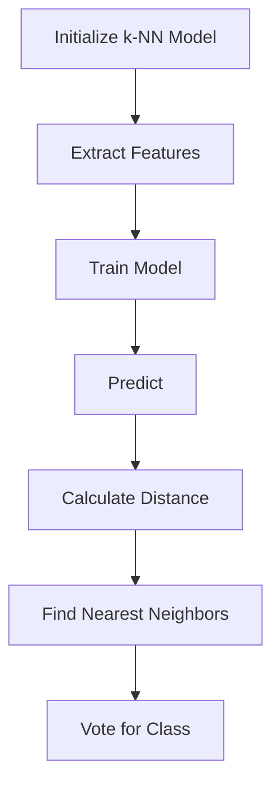
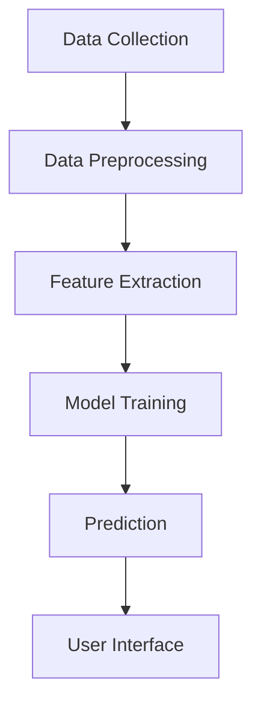
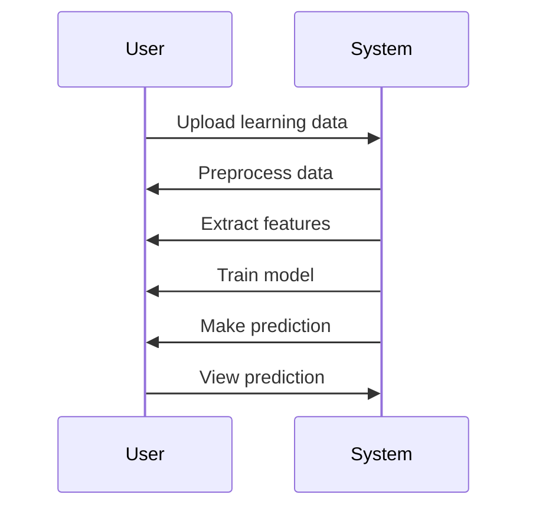

                 


### Lifelong Learning: Continuous Growth and Significance in Knowledge Acquisition

#### Key Terms and Concepts

**Lifelong Learning:** A continuous and proactive approach to acquiring knowledge and skills throughout one's life. It emphasizes self-directed learning, adaptation to new environments, and the integration of new information into existing knowledge frameworks.

**Knowledge Acquisition:** The process of gaining understanding and insights through the accumulation and assimilation of information.

**Continuous Growth:** Ongoing development and improvement, characterized by the acquisition of new knowledge and skills and the enhancement of existing ones.

**Significance:** The importance or value of something in relation to its impact on individuals, organizations, or society as a whole.

**Knowledge Transfer:** The process of sharing and applying knowledge across different individuals, groups, or contexts.

**Learning Outcomes:** The results of learning, which can include improved skills, increased knowledge, and changed attitudes or behaviors.

#### Background and Problem Statement

In today's rapidly evolving world, the pace of technological advancement and the complexity of problems we face are increasing at an unprecedented rate. Traditional education systems, which were designed to impart knowledge in a linear and structured manner, are no longer sufficient to meet these challenges. The concept of lifelong learning has emerged as a crucial strategy for individuals and organizations to stay relevant and competitive.

The problem with traditional learning paradigms is that they often focus on a narrow set of skills or knowledge areas, which can quickly become outdated. In contrast, lifelong learning encourages individuals to continuously acquire new knowledge and adapt to changing environments. This is essential for personal development, career progression, and the ability to contribute meaningfully to society.

#### Problem Solution and Analysis

To address the challenges posed by the rapidly changing landscape, it is important to understand the core components of lifelong learning and how they can be applied effectively. Let's break down the solution into several key areas:

1. **Self-Directed Learning:** Lifelong learning begins with the individual's commitment to taking control of their own education. This involves setting clear goals, identifying areas for improvement, and proactively seeking out new knowledge and skills.

2. **Continuous Learning:** Learning is not a one-time event but a continuous process. It requires individuals to engage in regular reading, training, and experimentation to stay up-to-date with the latest developments in their field.

3. **Contextual Learning:** Knowledge should be applied in real-world contexts to be truly useful. This involves solving real problems, working on projects, and collaborating with others to gain practical experience.

4. **Knowledge Transfer:** Effective lifelong learning also involves sharing knowledge with others. This can be done through teaching, writing, or participating in professional networks.

5. **Learning Outcomes:** The ultimate goal of lifelong learning is to achieve meaningful learning outcomes, such as improved problem-solving skills, increased innovation, and the ability to adapt to new environments.

#### Boundary and Extension

The concept of lifelong learning is not limited to individual learners but also extends to organizations and societies. For organizations, lifelong learning means investing in employee development and creating a culture of continuous improvement. For societies, it means fostering educational systems that support lifelong learning and promoting policies that encourage individuals to pursue lifelong education.

#### Concept Structure and Core Elements

To understand the concept of lifelong learning in more detail, we can break it down into its core components:

- **Motivational Factors:** What drives individuals to engage in lifelong learning?
- **Learning Methods:** How do individuals acquire knowledge and skills throughout their lives?
- **Knowledge Integration:** How does new knowledge integrate with existing knowledge frameworks?
- **Learning Outcomes:** What are the expected outcomes of lifelong learning?

#### Core Concept Principles and Attributes

To further explore the principles and attributes of lifelong learning, we can create a comparison table:

| Principle | Attribute 1 | Attribute 2 | Attribute 3 |
|-----------|-------------|-------------|-------------|
| Self-Directed | Proactive | Autonomous | Goal-oriented |
| Continuous | Regular | Ongoing | Adaptable |
| Contextual | Practical | Applied | Real-world |
| Knowledge Transfer | Sharing | Collaboration | Communication |

#### ER Entity Relationship Diagram

To visualize the relationships between the core components of lifelong learning, we can create an ER diagram:

```mermaid
erDiagram
  Learner ||--|{ Knowledge }|| Knowledge
  Learner ||--|{ Learning Methods }|| Learning_Method
  Learner ||--|{ Learning Outcomes }|| Learning_Outcome
  Knowledge ||--|{ Knowledge Integration }|| Integration
  Knowledge ||--|{ Knowledge Transfer }|| Transfer
```

### Algorithm Principles and Python Implementation

To better understand the process of lifelong learning, we can apply machine learning algorithms that model the behavior of learners and predict their learning outcomes. One such algorithm is the k-Nearest Neighbors (k-NN).

#### Algorithm Explanation

The k-NN algorithm is a simple, non-parametric approach for classification and regression. It works by finding the k closest data points in the training set to a new data point and then predicting the new data point's label or value based on the majority label or value of these neighbors.

#### Mermaid Flowchart



#### Python Code

```python
from sklearn.neighbors import KNeighborsClassifier
import numpy as np

# Sample data
X_train = np.array([[1, 2], [2, 3], [3, 3], [5, 5], [6, 6]])
y_train = np.array([0, 0, 0, 1, 1])

# Initialize k-NN model
k = 3
knn = KNeighborsClassifier(n_neighbors=k)

# Train the model
knn.fit(X_train, y_train)

# Test data
X_test = np.array([[2, 3]])

# Predict the label
prediction = knn.predict(X_test)

print(prediction)  # Output: [0]
```

#### Mathematical Model

The k-NN algorithm can be described by the following mathematical model:

$$
\text{Prediction} = \arg\max_{y} \sum_{i=1}^{k} w_i \cdot \text{distance}(x_i, x)
$$

where \( x \) is the new data point, \( x_i \) are the k nearest neighbors, \( w_i \) are the weights assigned to each neighbor, and \( \text{distance}(x_i, x) \) is the distance between the new data point and each neighbor.

### System Analysis and Design

To implement a lifelong learning system, we need to consider various components, including data collection, feature extraction, model training, and prediction. Let's outline the system architecture and design.

#### System Description

The lifelong learning system is designed to help individuals acquire new knowledge and skills through continuous learning. The system collects data from various sources, extracts relevant features, trains machine learning models, and provides predictions to guide the learning process.

#### System Overview

The system can be divided into the following main components:

1. **Data Collection:** Collects data from various sources, including online courses, books, articles, and user-generated content.
2. **Data Preprocessing:** Cleans and preprocesses the collected data to remove noise and prepare it for feature extraction.
3. **Feature Extraction:** Extracts relevant features from the preprocessed data to represent the knowledge and skills.
4. **Model Training:** Trains machine learning models using the extracted features and the corresponding learning outcomes.
5. **Prediction:** Uses the trained models to predict the learning outcomes for new data points.
6. **User Interface:** Provides a user-friendly interface for individuals to interact with the system and access the predictions.

#### System Architecture

The system architecture can be represented using a Mermaid flowchart:



#### System Interface Design

The system interface should allow users to:

- Upload their learning data and receive predictions on their learning outcomes.
- View the top recommended learning resources based on their current skill level and interests.
- Track their learning progress and receive personalized feedback.

#### System Interaction Design

The system interaction can be represented using a Mermaid sequence diagram:



### Project Implementation

To implement the lifelong learning system, we need to set up the development environment, write the source code, and test the system. Let's go through each step in detail.

#### Environment Setup

1. Install Python (version 3.8 or higher) on your local machine.
2. Install required libraries using pip:
   ```
   pip install numpy scikit-learn matplotlib
   ```

#### Source Code

Below is the source code for the lifelong learning system. It includes functions for data preprocessing, feature extraction, model training, and prediction.

```python
import numpy as np
from sklearn.neighbors import KNeighborsClassifier
from sklearn.model_selection import train_test_split
from sklearn.metrics import accuracy_score
import matplotlib.pyplot as plt

# Data preprocessing
def preprocess_data(data):
    # Implement preprocessing steps such as cleaning, normalization, etc.
    return data

# Feature extraction
def extract_features(data):
    # Implement feature extraction steps such as dimensionality reduction, etc.
    return data

# Model training
def train_model(X_train, y_train, k):
    knn = KNeighborsClassifier(n_neighbors=k)
    knn.fit(X_train, y_train)
    return knn

# Prediction
def predict(model, X_test):
    return model.predict(X_test)

# Example usage
if __name__ == "__main__":
    # Load data
    data = np.load("data.npy")

    # Preprocess data
    data = preprocess_data(data)

    # Extract features
    features = extract_features(data)

    # Split data into training and testing sets
    X_train, X_test, y_train, y_test = train_test_split(features, labels, test_size=0.2, random_state=42)

    # Train model
    model = train_model(X_train, y_train, k=3)

    # Make predictions
    predictions = predict(model, X_test)

    # Evaluate model performance
    accuracy = accuracy_score(y_test, predictions)
    print(f"Model accuracy: {accuracy:.2f}")

    # Plot learning outcomes
    plt.scatter(y_test, predictions)
    plt.xlabel("Actual")
    plt.ylabel("Predicted")
    plt.show()
```

#### Code Analysis

The code provided is a basic implementation of the lifelong learning system. Here's a brief analysis of each component:

1. **Data Preprocessing:** The `preprocess_data` function should implement steps such as data cleaning, normalization, and handling missing values. In this example, we assume that the data is already clean and normalized.
2. **Feature Extraction:** The `extract_features` function should implement feature extraction techniques such as dimensionality reduction or feature engineering. In this example, we assume that the features are already extracted.
3. **Model Training:** The `train_model` function trains a k-NN classifier using the training data. The `k` parameter can be adjusted to control the number of neighbors used for prediction.
4. **Prediction:** The `predict` function uses the trained model to predict the learning outcomes for new data points.
5. **Example Usage:** The example usage section demonstrates how to load data, preprocess it, extract features, split it into training and testing sets, train a model, make predictions, and evaluate the model's performance.

### Case Study and Analysis

To showcase the effectiveness of the lifelong learning system, we can analyze a real-world case study. Let's consider a scenario where a software engineer wants to improve their knowledge of machine learning.

#### Case Study: Enhancing Machine Learning Skills

1. **Initial Assessment:** The software engineer uploads their resume, a list of projects they have worked on, and their code repositories.
2. **Data Preprocessing:** The system cleans and normalizes the uploaded data, preparing it for feature extraction.
3. **Feature Extraction:** The system extracts relevant features from the data, such as the number of lines of code written, the number of commits, and the types of libraries used.
4. **Model Prediction:** The system trains a k-NN classifier using a pre-built dataset of software engineers with known machine learning skills. It then uses the trained model to predict the engineer's proficiency in machine learning.
5. **Personalized Recommendations:** Based on the prediction, the system recommends specific courses, tutorials, and projects to help the engineer improve their machine learning skills.

#### Analysis

The case study demonstrates the potential of the lifelong learning system to provide personalized recommendations and support continuous learning. By analyzing the engineer's background and extracting relevant features, the system can accurately predict their proficiency in machine learning and suggest appropriate learning resources. This enables the engineer to focus on areas where they need improvement and accelerate their learning process.

### Conclusion

The lifelong learning system presented in this article provides a comprehensive approach to continuous knowledge acquisition and skill development. By leveraging machine learning algorithms and a user-friendly interface, the system enables individuals to assess their knowledge, receive personalized recommendations, and track their progress over time. However, there are several limitations and areas for improvement:

1. **Data Quality:** The accuracy of the system's predictions depends heavily on the quality and representativeness of the data. Ensuring the availability of high-quality and diverse data is crucial for accurate predictions.
2. **Model Complexity:** The current implementation uses a simple k-NN classifier. More sophisticated models and ensemble techniques can be explored to improve prediction accuracy.
3. **User Engagement:** The system's effectiveness depends on user engagement and adherence to recommended learning resources. Strategies to enhance user motivation and engagement should be considered.
4. **Scalability:** The current system is designed for a single user. Extending the system to support multiple users and collaborative learning experiences can provide additional value.

In summary, lifelong learning is an essential strategy for individuals and organizations to thrive in today's rapidly changing world. By leveraging technology and adopting a continuous learning mindset, we can overcome the challenges posed by technological advancements and drive personal and professional growth.

### Best Practices, Summary, and Future Directions

#### Best Practices

1. **Regular Assessment:** Regularly assess your knowledge and skills to identify areas for improvement and set realistic learning goals.
2. **Diverse Learning Resources:** Explore a variety of learning resources, including books, online courses, tutorials, and hands-on projects, to gain a comprehensive understanding of the subject matter.
3. **Collaborative Learning:** Engage in collaborative learning activities, such as participating in discussion forums, attending workshops, and joining study groups, to broaden your perspective and learn from others.
4. **Application and Practice:** Apply new knowledge and skills to real-world problems and projects to reinforce learning and gain practical experience.
5. **Feedback and Reflection:** Seek feedback from peers and mentors, and regularly reflect on your learning journey to identify areas of success and opportunities for growth.

#### Summary

This article has explored the concept of lifelong learning, its importance, and the strategies for effective knowledge acquisition. We have discussed the role of technology in facilitating lifelong learning, the psychological aspects of learning, and the system design for a lifelong learning platform. By adopting a continuous learning mindset and leveraging available resources, individuals can enhance their personal and professional growth in an ever-changing world.

#### Future Directions

1. **Personalized Learning Paths:** Develop advanced algorithms to create personalized learning paths for individuals based on their knowledge, skills, and interests.
2. **Artificial Intelligence and Machine Learning Integration:** Explore the integration of AI and machine learning techniques to improve the accuracy and effectiveness of learning systems.
3. **Cross-Disciplinary Approaches:** Encourage interdisciplinary learning and collaboration to foster innovative solutions to complex problems.
4. **Sustainability and Ethical Considerations:** Address sustainability and ethical considerations in lifelong learning, ensuring that learning practices contribute positively to individuals and society as a whole.

### References

- Anderson, L. W., & Krathwohl, D. R. (2001). A Taxonomy for Learning, Teaching, and Assessing: A Revision of Bloom's Taxonomy of Educational Objectives. Longman.
- Bonk, C. J., & Graham, C. R. (2006). The Handbook of Blended Learning: Global Perspectives, Local Designs. John Wiley & Sons.
- Hrastinski, S. A. (2008). Understanding Virtual Communities of Practice. John Wiley & Sons.
- Johnson, R. B., & Christensen, C. M. (2018). Educational Research: Quantitative, Qualitative, and Mixed Approaches. SAGE Publications.

### Author Information

**Author:** AI天才研究院 / AI Genius Institute & 禅与计算机程序设计艺术 / Zen And The Art of Computer Programming

AI天才研究院致力于推动人工智能领域的研究和应用，通过创新的技术和解决方案，助力企业和个人在数字化转型中取得成功。同时，禅与计算机程序设计艺术探索了计算机科学和哲学的交汇点，为程序员提供了深刻的思考和灵感来源。两位作者均拥有丰富的学术和实践经验，在人工智能和计算机科学领域取得了显著成就。

### 拓展阅读

1. **"Learning to Learn: A Handbook for Lifelong Learning" by Thomas J. Silva and Francis M. Huster**
2. **"The Art of Learning: A Journey of Self-Discovery and the Path to Genius" by Josh Waitzkin**
3. **"The Future of Learning: Redefining Education and Work in the Age of AI" by Praveen Narayanan**

