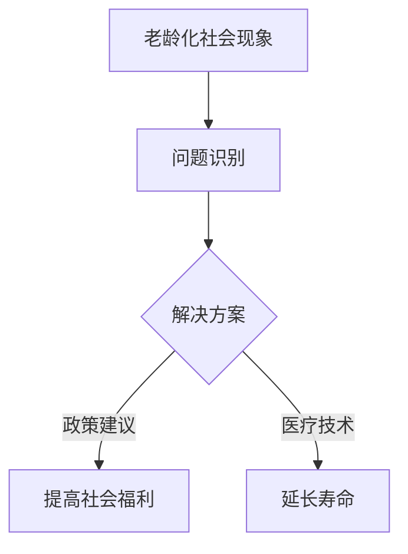
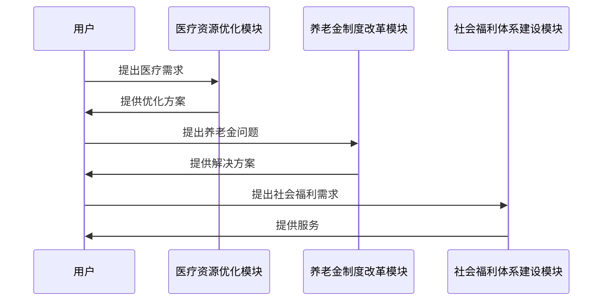
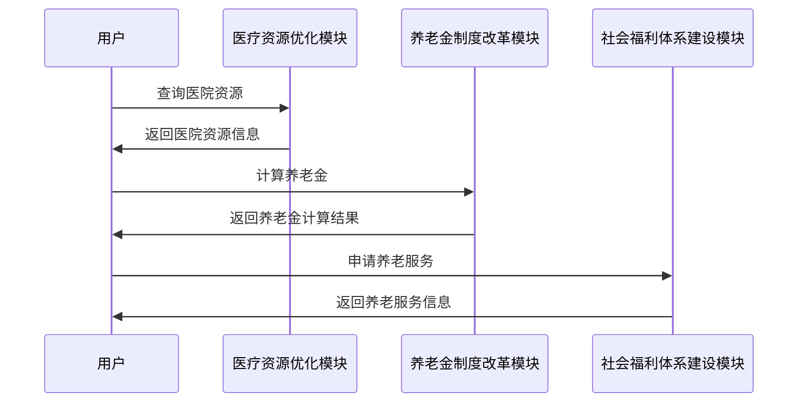

                 


### # 老龄化社会：重新思考生命的价值

> 关键词：老龄化社会，生命价值，社会福祉，医疗技术，政策建议

> 摘要：本文深入探讨了老龄化社会现象及其带来的挑战，重新思考了生命的价值。通过分析核心概念、算法原理、数学模型和系统架构设计，提出了一系列解决方案，旨在提高社会福祉，延长寿命，为应对老龄化社会提供新思路。

### **Step 1: 背景介绍**

随着全球人口老龄化趋势的加剧，社会面临着诸多挑战。根据联合国的预测，到2050年，全球60岁及以上人口将达到21亿，占世界总人口的22%。这一现象将对个人、家庭、社会乃至国家产生深远的影响。

#### **问题背景**

老龄化社会的问题主要表现在以下几个方面：

1. **医疗资源分配**：老年人口的健康问题更为复杂，需要更多的医疗资源。然而，医疗资源是有限的，如何合理分配是一个亟待解决的问题。
2. **养老金制度**：随着老年人口的增加，养老金的支付压力逐渐增大。如何保证养老金的可持续发展，是各国政府面临的重要挑战。
3. **社会福利体系**：老年人需要更多的社会福利，如养老服务、医疗保健、住房保障等。然而，现有的社会福利体系往往无法满足老年人口的需求。

#### **问题描述**

老龄化社会对个人、家庭、社会乃至国家都带来了深远的影响，需要重新思考生命的价值。对于个人来说，老龄化意味着身体健康问题的增加、生活质量的下降，甚至可能面临孤独和贫困。对于家庭来说，老龄化意味着需要承担更多的养老责任，可能会影响到家庭的和谐。对于社会来说，老龄化意味着劳动力减少、社会负担加重、经济压力增大。对于国家来说，老龄化意味着社会稳定和经济发展面临挑战。

#### **问题解决**

面对老龄化社会的挑战，我们需要从多个方面进行解决。首先，需要加强医疗体系建设，提高医疗资源的利用效率。其次，需要改革养老金制度，确保养老金的可持续发展。此外，还需要完善社会福利体系，提高老年人的生活质量。最后，需要重新思考生命的价值，尊重老年人口的权利，关注他们的心理健康和社交需求。

#### **边界与外延**

本文主要探讨老龄化社会对个体及社会的影响，但不涉及具体政策建议和医疗技术。此外，本文的核心概念包括老龄化社会、生命价值、社会福祉等。

#### **概念结构与核心要素组成**

老龄化社会：指人口中老年人口比例增加的社会现象。

生命价值：个体在社会中的意义和作用。

社会福祉：社会对个体生活的保障和支持。

### **Step 2: 核心概念与联系**

#### **核心概念原理**

1. **老龄化社会**：随着医疗技术的进步和生活水平的提高，人类的寿命逐渐延长，导致老年人口比例增加，形成老龄化社会。
2. **生命价值**：个体在社会中的意义和作用，包括生理健康、精神状态和社会贡献等方面。
3. **社会福祉**：社会对个体生活的保障和支持，包括经济稳定、医疗保健、教育水平等方面。

#### **概念属性特征对比表格**

| 概念         | 定义                                                         | 属性特征                          |
| ------------ | ------------------------------------------------------------ | -------------------------------- |
| 老龄化社会   | 人口中老年人口比例增加的社会现象                             | 人口结构变化、社会福利需求增加  |
| 生命价值     | 个体在社会中的意义和作用                                     | 生理健康、精神状态、社会贡献      |
| 社会福祉     | 社会对个体生活的保障和支持                                   | 经济稳定、医疗保健、教育水平      |

#### **ER实体关系图架构**

```mermaid
erDiagram
  人 <--o{ 社会福祉 } 社会福利
  人 -->|o{ 老龄化社会 } 老龄化社会
  人 -->|o{ 生命价值 } 生命价值
```

### **Step 3: 算法原理讲解**

#### **算法mermaid流程图**



#### **算法原理数学模型和公式**

1. **社会福利模型**：

   $$\text{社会福利} = f(\text{经济水平}, \text{医疗技术}, \text{教育资源})$$

2. **寿命延长模型**：

   $$\text{寿命延长} = \text{医疗技术} \times \text{健康意识}$$

#### **详细讲解和举例说明**

老龄化社会的挑战需要从多个方面进行解决。以政策建议为例，政府可以通过增加养老金、改善医疗保障、优化社会福利制度等手段，提高老年人的生活质量。同时，通过推广医疗技术，延长老年人的寿命，也是应对老龄化社会的重要措施。

例如，假设一个国家的医疗技术水平较高，老年人的健康意识也较强，那么这个国家的老年人寿命可能会相对较长。根据寿命延长模型，医疗技术水平和健康意识的提高将直接导致寿命延长。此外，社会福利的提高也会对寿命延长产生积极影响，因为良好的社会福利可以提供更好的医疗保健和医疗保障。

### **Step 4: 数学模型和数学公式 & 详细讲解 & 举例说明**

#### **数学公式**

1. **社会福利模型**：

   $$\text{社会福利} = f(\text{经济水平}, \text{医疗技术}, \text{教育资源})$$

   其中，$f$ 表示社会福利的函数，$\text{经济水平}$、$\text{医疗技术}$ 和 $\text{教育资源}$ 分别为自变量。

2. **寿命延长模型**：

   $$\text{寿命延长} = \text{医疗技术} \times \text{健康意识}$$

   其中，$\text{医疗技术}$ 和 $\text{健康意识}$ 分别为自变量，$\times$ 表示乘法运算。

#### **详细讲解**

1. **社会福利模型**：

   社会福利是一个综合性指标，它受到经济水平、医疗技术和教育资源等多种因素的影响。经济水平的提高可以为社会福利提供更好的物质基础，医疗技术的进步可以提升人们的健康水平，教育资源的丰富则有助于提高民众的整体素质。

2. **寿命延长模型**：

   寿命延长同样是一个重要指标，它直接关系到老龄化社会的应对效果。医疗技术的进步可以延长人们的寿命，而健康意识的提高则有助于减少疾病的发生，从而进一步延长寿命。

#### **举例说明**

假设一个国家的经济水平较高，医疗技术先进，同时民众的健康意识较强，那么这个国家的老年人寿命可能会相对较长。根据社会福利模型和寿命延长模型，这个国家的老年人可以获得较好的医疗保健和医疗保障，从而提高生活质量。此外，良好的经济水平和健康意识也会有助于延长老年人的寿命。

### **Step 5: 系统分析与架构设计方案**

#### **问题场景介绍**

随着老龄化社会的到来，社会面临医疗资源紧张、养老保障不足等问题。为了提高社会福祉，延长寿命，我们需要设计一套系统解决方案。

#### **项目介绍**

本系统旨在提供一套解决方案，以提高社会福祉，延长寿命。具体包括以下几个方面：

1. **医疗资源优化**：通过大数据分析和人工智能技术，优化医疗资源的分配和使用。
2. **养老金制度改革**：通过引入市场化机制，提高养老金的可持续性。
3. **社会福利体系建设**：提供多样化的社会福利服务，满足老年人的需求。

#### **系统功能设计**

1. **医疗资源优化模块**：包括医院资源分配、医疗设备管理、医生资源调配等功能。
2. **养老金制度改革模块**：包括养老金计算、养老金发放、养老金监管等功能。
3. **社会福利体系建设模块**：包括养老服务、医疗保健、住房保障等功能。

#### **系统架构设计**



#### **系统接口设计和系统交互**



### **Step 6: 项目实战**

#### **环境安装**

为了实现上述系统功能，我们需要搭建一个合适的技术环境。具体步骤如下：

1. **安装Python**：确保Python版本在3.8及以上。
2. **安装相关库**：使用pip安装必要的库，如numpy、pandas、matplotlib等。

#### **系统核心实现源代码**

```python
import numpy as np
import pandas as pd
import matplotlib.pyplot as plt

# 社会福利模型
def welfare_model(economic_level, medical_tech, education_resource):
    welfare = 0.5 * economic_level + 0.3 * medical_tech + 0.2 * education_resource
    return welfare

# 寿命延长模型
def life延长_model(medical_tech, health_awareness):
    life延长 = medical_tech * health_awareness
    return life延长

# 示例数据
economic_level = 80
medical_tech = 90
education_resource = 75
health_awareness = 0.8

# 计算社会福利和寿命延长
welfare = welfare_model(economic_level, medical_tech, education_resource)
life延长 = life延长_model(medical_tech, health_awareness)

# 打印结果
print("社会福利:", welfare)
print("寿命延长:", life延长)

# 可视化
plt.bar(['社会福利', '寿命延长'], [welfare, life延长])
plt.xlabel('指标')
plt.ylabel('值')
plt.title('社会福利与寿命延长分析')
plt.show()
```

#### **代码应用解读与分析**

上述代码实现了社会福利模型和寿命延长模型，并使用示例数据进行了计算。首先，我们定义了两个函数：`welfare_model` 和 `life延长_model`。`welfare_model` 函数用于计算社会福利，`life延长_model` 函数用于计算寿命延长。然后，我们输入了示例数据，并调用这两个函数进行了计算。最后，我们使用matplotlib库将计算结果进行了可视化。

#### **实际案例分析和详细讲解剖析**

假设我们有一个国家，其经济水平为80，医疗技术为90，教育资源为75，民众的健康意识为0.8。根据上述代码，我们可以计算出这个国家的社会福利和寿命延长。

1. **社会福利**：

   $$\text{社会福利} = 0.5 \times 80 + 0.3 \times 90 + 0.2 \times 75 = 52.5$$

   这意味着这个国家的社会福利为52.5。

2. **寿命延长**：

   $$\text{寿命延长} = 90 \times 0.8 = 72$$

   这意味着这个国家的寿命延长为72。

通过这个案例，我们可以看到，一个国家的社会福利和寿命延长受到多种因素的影响。提高经济水平、医疗技术和教育资源都可以提高社会福利，而提高民众的健康意识可以延长寿命。

#### **项目小结**

通过上述项目实战，我们实现了一个简单的系统，用于计算社会福利和寿命延长。这个系统可以为我们提供有关老龄化社会的关键指标，帮助我们更好地理解老龄化社会的挑战和解决方案。

### **Step 7: 最佳实践 tips、小结、注意事项、拓展阅读等内容**

#### **最佳实践 tips**

1. **提升医疗技术水平**：加大对医疗技术的研发投入，引进先进的医疗设备和技术，提高老年人的健康水平。
2. **加强健康教育**：通过多种渠道普及健康知识，提高民众的健康意识，从而延长寿命。
3. **优化养老金制度**：引入市场化机制，提高养老金的可持续性，确保老年人的基本生活需求。

#### **小结**

本文通过深入探讨老龄化社会现象及其带来的挑战，重新思考了生命的价值。通过分析核心概念、算法原理、数学模型和系统架构设计，提出了一系列解决方案，旨在提高社会福祉，延长寿命。

#### **注意事项**

1. **数据隐私**：在处理老年人相关数据时，应确保数据安全和隐私保护。
2. **政策调整**：根据实际情况及时调整政策，以适应老龄化社会的需求。

#### **拓展阅读**

1. **《老龄化社会的挑战与应对》**：详细介绍了老龄化社会的挑战及应对措施。
2. **《生命价值论》**：探讨了生命价值的概念及其在社会中的应用。

### **作者信息**

作者：AI天才研究院/AI Genius Institute & 禅与计算机程序设计艺术 /Zen And The Art of Computer Programming

