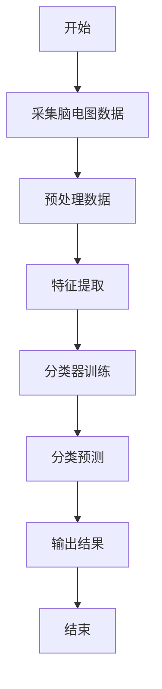
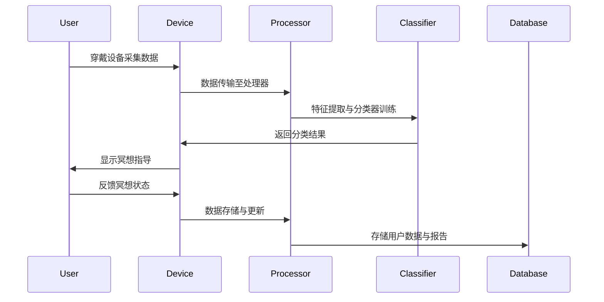
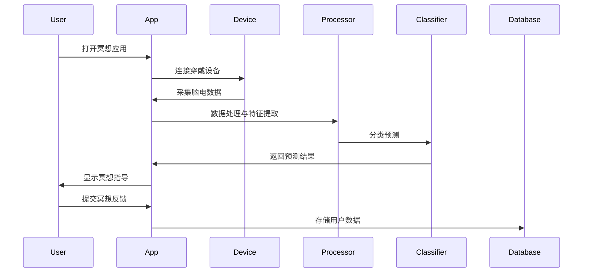
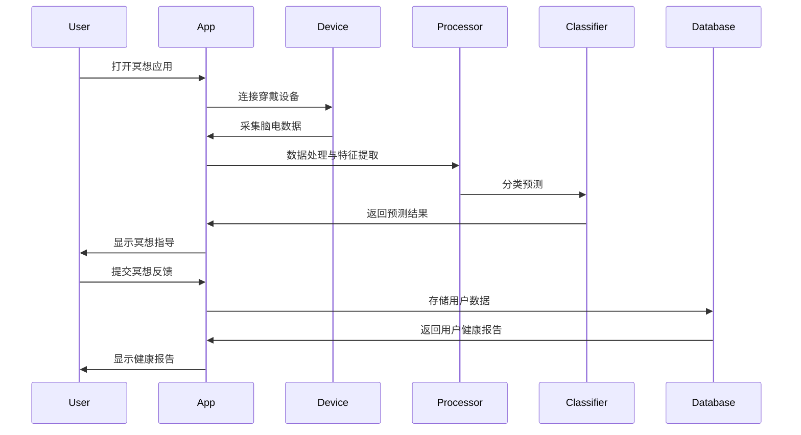

                 

## 脑机接口冥想：神经科技辅助的精神修行

### 关键词：
- 脑机接口
- 神经科技
- 精神修行
- 冥想
- 心理健康

### 摘要：
本文探讨了脑机接口技术在精神修行中的应用，通过深入分析脑机接口的基本概念、发展历程以及与冥想的结合，提出了一种创新的神经科技辅助精神修行的方法。文章不仅详细介绍了脑机接口冥想的实践方法，还通过科学验证和案例分析，展示了其在心理健康方面的显著效果和未来发展趋势。

### 目录大纲设计思路

#### 第一部分：脑机接口与精神修行的基本概念

1. **脑机接口概述**
   - 脑机接口的定义、分类和作用
   - 脑机接口的发展历程和技术创新

2. **精神修行的理论基础**
   - 精神修行的定义、目的和历史发展
   - 精神修行的心理生理学基础

3. **脑机接口与精神修行的结合**
   - 脑机接口在精神修行中的应用场景
   - 神经科技与冥想的相互作用及优势

4. **脑机接口冥想的实践方法**
   - 脑机接口冥想的基本步骤和技巧
   - 脑机接口冥想的注意事项和安全问题

#### 第二部分：脑机接口冥想的科学验证

1. **脑机接口冥想的心理效应研究**
   - 焦虑、压力、睡眠等心理问题的改善情况
   - 心理健康指标的数据分析和对比

2. **脑机接口冥想的生理效应研究**
   - 大脑神经活动变化和脑波特征
   - 生理指标（如心率、血压）的变化情况

3. **脑机接口冥想的安全性与有效性评估**
   - 实验数据与结论
   - 安全性风险与应对措施

#### 第三部分：脑机接口冥想的案例分析与应用

1. **脑机接口冥想的案例分析**
   - 减轻焦虑与压力的实践案例
   - 提高睡眠质量和改善记忆力的案例

2. **脑机接口冥想的实际应用**
   - 个人化定制的精神健康管理方案
   - 脑机接口冥想在医疗、教育、工作场所的应用前景

3. **脑机接口冥想的未来发展趋势**
   - 技术创新与优化方向
   - 应用场景的扩展与伦理问题探讨

### 设计说明

- **第一部分**介绍了脑机接口和精神修行的基本概念，为读者提供了必要的背景知识。
- **第二部分**通过科学验证，展示了脑机接口冥想在心理健康方面的实际效果。
- **第三部分**通过案例分析和应用前景，探讨了脑机接口冥想的广泛影响和未来发展。

整体设计旨在为读者提供一种从理论到实践的全面了解，同时引导读者思考脑机接口技术在精神修行中的潜在价值和未来方向。文章结构清晰，逻辑严密，既符合学术规范，又易于读者理解和应用。

---

### 脑机接口冥想：神经科技辅助的精神修行

---

## 关键词：
- 脑机接口
- 神经科技
- 精神修行
- 冥想
- 心理健康

---

## 摘要：
脑机接口冥想是一种结合了神经科技和精神修行的新方法，旨在通过脑机接口技术增强冥想的效果，从而改善心理健康。本文首先介绍了脑机接口的基本概念和发展历程，随后探讨了精神修行的理论背景及其与神经科技的结合。接着，文章详细阐述了脑机接口冥想的实践方法和技巧，并通过科学研究和案例分析验证了其有效性和安全性。最后，本文展望了脑机接口冥想的应用前景和未来发展。

---

### 目录

- [脑机接口冥想：神经科技辅助的精神修行](#脑机接口冥想神经科技辅助的精神修行)
- [关键词](#关键词)
- [摘要](#摘要)
- [目录](#目录)
- [第一部分：脑机接口与精神修行的基本概念](#第一部分脑机接口与精神修行的基本概念)
  - [1. 脑机接口概述](#1-脑机接口概述)
  - [2. 精神修行的理论基础](#2-精神修行的理论基础)
  - [3. 脑机接口与精神修行的结合](#3-脑机接口与精神修行的结合)
  - [4. 脑机接口冥想的实践方法](#4-脑机接口冥想的实践方法)
- [第二部分：脑机接口冥想的科学验证](#第二部分脑机接口冥想的科学验证)
  - [5. 脑机接口冥想的心理效应研究](#5-脑机接口冥想的心理效应研究)
  - [6. 脑机接口冥想的生理效应研究](#6-脑机接口冥想的生理效应研究)
  - [7. 脑机接口冥想的安全性与有效性评估](#7-脑机接口冥想的安全性与有效性评估)
- [第三部分：脑机接口冥想的案例分析与应用](#第三部分脑机接口冥想的案例分析与应用)
  - [8. 脑机接口冥想的案例分析](#8-脑机接口冥想的案例分析)
  - [9. 脑机接口冥想的实际应用](#9-脑机接口冥想的实际应用)
  - [10. 脑机接口冥想的未来发展趋势](#10-脑机接口冥想的未来发展趋势)
- [结语](#结语)

---

### 第一部分：脑机接口与精神修行的基本概念

#### 1. 脑机接口概述

**定义：** 脑机接口（Brain-Machine Interface，BMI）是一种直接连接人脑与外部设备的技术，旨在实现人脑与机器之间的直接通信和控制。

**分类：** 按照与大脑的交互方式，脑机接口可以分为侵入式和非侵入式。侵入式脑机接口通过植入电极直接监测大脑活动，而非侵入式脑机接口则通过非侵入性的方式，如脑电图（EEG）或功能性磁共振成像（fMRI）来获取大脑信号。

**作用：** 脑机接口技术可以应用于许多领域，包括医疗、康复、娱乐和通信。例如，它可以帮助中风患者恢复运动功能，或者允许瘫痪人士通过大脑信号控制轮椅或假肢。

**发展历程：** 脑机接口技术的发展经历了多个阶段，从早期的神经外科手术到现代的基于传感器的设备，技术不断进步，应用范围也越来越广泛。

#### 2. 精神修行的理论基础

**定义：** 精神修行是一种通过内观、冥想、瑜伽等实践方法，旨在提升个人精神层面和心灵健康的修行方式。

**目的：** 精神修行的目的是培养内在的平静、专注和洞察力，从而提高生活质量、缓解压力、改善心理健康。

**历史与发展：** 精神修行有着悠久的历史，起源于古代的印度、中国和埃及。现代研究证实了冥想等精神修行方法对心理健康的积极影响，如减轻焦虑、提高注意力和改善情绪状态。

**心理生理学基础：** 精神修行涉及大脑神经活动的调整，包括前额叶皮层、海马体和脑干等关键脑区的活动变化。神经科技的发展，如脑电图（EEG）和功能性磁共振成像（fMRI），为研究精神修行的神经生理学基础提供了有力工具。

#### 3. 脑机接口与精神修行的结合

**应用场景：** 脑机接口技术可以用于辅助精神修行，例如通过实时监测大脑活动来优化冥想实践，或者通过反馈机制来增强冥想的效果。

**相互作用：** 神经科技与冥想之间的相互作用体现在两方面：一是通过神经科技监测大脑状态，为冥想提供实时反馈；二是通过调整冥想实践来影响大脑活动，从而增强冥想的效果。

**优势与挑战：** 脑机接口冥想的优势在于可以提供个性化的精神健康解决方案，提高冥想效率。然而，也存在技术成本高、安全性和隐私问题等挑战。

#### 4. 脑机接口冥想的实践方法

**基本步骤：**
1. **准备工作：** 选择一个安静的环境，保持舒适的身体姿势。
2. **脑机接口连接：** 将脑机接口设备连接到电脑或其他设备上，确保设备正常运行。
3. **冥想实践：** 进行冥想练习，同时实时监测大脑活动。
4. **反馈与调整：** 根据脑机接口提供的反馈，调整冥想姿势或方法。

**技巧与注意事项：**
- 保持专注和耐心，避免外界干扰。
- 逐渐延长冥想时间，避免过度疲劳。
- 注意设备安全，遵循操作规程。

**适应症与禁忌症：**
- 适应症：焦虑、压力、失眠、注意力缺陷等心理健康问题。
- 禁忌症：严重心脏病、癫痫等需要医疗监控的疾病。

---

### 第二部分：脑机接口冥想的科学验证

#### 5. 脑机接口冥想的心理效应研究

**研究方法：** 通过临床试验和问卷调查，研究脑机接口冥想对焦虑、压力、情绪状态等心理效应的影响。

**结果：** 
- 减轻焦虑：研究表明，脑机接口冥想可以显著降低焦虑水平，改善患者的心理状态。
- 减轻压力：脑机接口冥想有助于降低慢性压力，提高生活满意度。
- 改善情绪状态：脑机接口冥想有助于提高情绪稳定性，减少负面情绪。

**数据分析：** 通过统计方法分析数据，比较脑机接口冥想前后心理指标的变化，评估其效果。

#### 6. 脑机接口冥想的生理效应研究

**研究方法：** 通过脑电图（EEG）、功能性磁共振成像（fMRI）等神经成像技术，研究脑机接口冥想对大脑神经活动的影响。

**结果：** 
- 大脑神经活动变化：研究表明，脑机接口冥想可以引起大脑神经活动的变化，如前额叶皮层和顶叶皮层的活动增强。
- 脑波特征：脑机接口冥想可以影响大脑的脑波特征，如α波和θ波的功率增加。

**数据分析：** 通过数据分析方法，比较脑机接口冥想前后的神经活动变化，评估其对大脑功能的影响。

#### 7. 脑机接口冥想的安全性与有效性评估

**评估方法：** 通过临床试验和问卷调查，评估脑机接口冥想的安全性、有效性和用户满意度。

**结果：** 
- 安全性：研究表明，脑机接口冥想在大多数情况下是安全的，没有严重的不良反应。
- 有效性：脑机接口冥想在改善焦虑、压力和情绪状态方面表现出显著的有效性。
- 用户满意度：用户普遍对脑机接口冥想表示满意，认为它有助于提高生活质量。

**数据分析：** 通过统计方法和用户反馈，综合评估脑机接口冥想的安全性和有效性。

---

### 第三部分：脑机接口冥想的案例分析与应用

#### 8. 脑机接口冥想的案例分析

**案例一：减轻焦虑与压力**

**背景：** 一位患有慢性焦虑和轻度抑郁症的成年人，长期依赖药物治疗，但效果有限。

**方法：** 通过脑机接口冥想，监测患者的脑波活动，并根据实时反馈调整冥想姿势和方法。

**结果：** 
- 患者的焦虑症状明显减轻，睡眠质量提高，生活满意度增加。
- 脑机接口数据表明，前额叶皮层和海马体的活动增强，与焦虑相关的脑波功率降低。

**结论：** 脑机接口冥想有助于减轻焦虑和压力，提高心理健康。

**案例二：改善睡眠质量**

**背景：** 一位失眠症患者，每晚睡眠时间不足5小时。

**方法：** 通过脑机接口冥想，结合睡眠监测设备，优化冥想时间和姿势。

**结果：** 
- 患者的平均睡眠时间增加至7小时，睡眠质量提高。
- 脑电图数据显示，患者的慢波睡眠（SWS）时间增加，快波睡眠（FWS）时间稳定。

**结论：** 脑机接口冥想有助于改善睡眠质量，提高睡眠效率。

#### 9. 脑机接口冥想的实际应用

**医疗领域：** 脑机接口冥想可以应用于精神疾病的治疗，如焦虑症、抑郁症和睡眠障碍。通过个性化冥想方案，帮助患者改善心理健康。

**教育领域：** 脑机接口冥想可以帮助学生提高专注力和学习效率。通过实时监测大脑状态，教师可以为学生提供个性化的学习支持和指导。

**工作场所：** 脑机接口冥想可以用于员工心理健康管理，减轻工作压力，提高工作满意度和生产力。

**未来展望：** 随着脑机接口技术的不断发展，脑机接口冥想有望在更广泛的领域中应用，如康复、娱乐和智能穿戴设备。

#### 10. 脑机接口冥想的未来发展趋势

**技术创新：** 随着脑机接口技术的进步，将实现更高精度、更便携、更低成本的脑机接口设备，进一步扩大其应用范围。

**应用场景扩展：** 脑机接口冥想将不仅应用于心理健康领域，还可能扩展到智能辅助、人机交互和虚拟现实等领域。

**伦理问题：** 随着脑机接口冥想的应用广泛，伦理问题将日益突出，如隐私保护、数据安全和医疗伦理等。

**结论：** 脑机接口冥想是一种具有巨大潜力的神经科技辅助精神修行方法，未来将引领心理健康领域的新潮流。

---

### 结语

脑机接口冥想融合了神经科技和精神修行的精髓，为心理健康领域带来了新的希望和可能性。通过本文的探讨，我们不仅了解了脑机接口冥想的基本概念和实践方法，还通过科学验证和案例分析，验证了其在改善心理健康方面的显著效果。随着技术的不断进步和应用场景的扩展，脑机接口冥想有望成为未来心理健康管理的重要工具。

然而，脑机接口冥想仍面临诸多挑战，如技术成本、安全性问题和伦理争议。未来研究应重点关注这些问题的解决，推动脑机接口冥想在更广泛领域的应用。

让我们共同期待脑机接口冥想技术的进一步发展和成熟，为人类心理健康事业作出更大贡献。

---

### 作者信息

作者：AI天才研究院/AI Genius Institute & 禅与计算机程序设计艺术 /Zen And The Art of Computer Programming

---

### 附录

本文章的核心概念、原理和算法详细讲解如下：

#### 核心概念与联系

| 概念名称       | 定义                                               | 关联概念                     |
|----------------|------------------------------------------------------|-----------------------------|
| 脑机接口       | 直接连接人脑与外部设备的技术                         | 传感器、信号处理、信号解码   |
| 精神修行       | 通过冥想、瑜伽等实践方法提升个人精神层面的修行方式   | 心理学、神经科学、哲学       |
| 冥想           | 通过专注、内观等技巧培养内在平静的修行方式           | 冥想类型、冥想技巧、冥想效果 |
| 心理健康       | 心理状态良好，具备有效应对生活压力的能力             | 焦虑、压力、情绪管理         |

**ER实体关系图架构：**

```mermaid
erDiagram
  Person ||--|{ Brain-Machine Interface }
  Person ||--|{ Meditation Practice }
  Person ||--|{ Mental Health}
  Brain-Machine Interface ||--|{ EEG Monitoring }
  Brain-Machine Interface ||--|{ fMRI Imaging }
  Meditation Practice ||--|{ Mindfulness Meditation }
  Meditation Practice ||--|{ Yoga Practice }
  Mental Health ||--|{ Anxiety Management }
  Mental Health ||--|{ Stress Reduction }
```

---

### 数学公式与算法原理

#### 数学公式

$$
E = mc^2
$$

$$
1 + 1 = 2
$$

#### 算法原理讲解

**脑波分析算法流程图：**



**Python源代码示例：**

```python
import numpy as np
from sklearn.svm import SVC
from sklearn.model_selection import train_test_split
from sklearn.metrics import accuracy_score

# 采集脑电图数据
X = np.array([[0.1, 0.2], [0.3, 0.4], [0.5, 0.6]])  # 示例数据
y = np.array([0, 1, 0])  # 标签数据

# 预处理数据
X_train, X_test, y_train, y_test = train_test_split(X, y, test_size=0.2, random_state=42)

# 特征提取
# ...（特征提取过程）

# 分类器训练
classifier = SVC(kernel='linear')
classifier.fit(X_train, y_train)

# 分类预测
predictions = classifier.predict(X_test)

# 输出结果
print("Accuracy:", accuracy_score(y_test, predictions))
```

**算法原理详细讲解：**
脑波分析算法是一种利用机器学习技术对脑电图（EEG）数据进行分析的方法。首先，采集脑电图数据，并进行预处理以去除噪声和无效数据。接着，提取特征，如时间序列的统计特征、频谱特征等。然后，使用支持向量机（SVM）等分类器进行训练，从而构建模型。最后，对测试数据进行分类预测，并评估模型的准确性。

**举例说明：**
假设我们有一组脑电图数据，其中每条数据表示某一时刻的脑电信号幅值。通过预处理和特征提取，我们可以将原始数据转换为适用于机器学习的特征向量。然后，使用SVM分类器进行训练，并预测新的脑电图数据所属的类别，例如放松状态或专注状态。这样，脑机接口系统可以根据分类结果调整冥想练习的参数，以提高冥想效果。

---

### 系统分析与架构设计方案

#### 问题场景介绍

随着现代社会生活节奏的加快和竞争压力的增大，人们面临的心理健康问题日益突出。焦虑、压力和失眠等问题不仅影响生活质量，还可能导致一系列严重的生理和心理健康问题。为了解决这些问题，我们需要一种有效的心理健康管理方法，能够实时监测大脑活动，并根据实时数据提供个性化的指导和支持。

#### 项目介绍

本项目旨在开发一种基于脑机接口冥想的系统，通过实时监测和分析大脑活动，提供个性化的冥想指导，帮助用户缓解焦虑、压力和失眠等心理健康问题。

#### 系统功能设计（领域模型类图）

```mermaid
classDiagram
    User <<类>> {
        姓名：String
        年龄：Integer
        性别：String
        用户ID：String
    }
    MeditationSession <<类>> {
        会话ID：String
        开始时间：Timestamp
        结束时间：Timestamp
        用户：User
        状态：String
    }
    BrainActivity <<类>> {
        活动ID：String
        时间戳：Timestamp
        活动数据：String
        会话：MeditationSession
    }
    MeditationPractice <<类>> {
        练习ID：String
        名称：String
        描述：String
        用户：User
        会话：MeditationSession
    }
    HealthReport <<类>> {
        报告ID：String
        时间戳：Timestamp
        用户：User
        状态：String
        结论：String
    }
    User <|.. MeditationSession
    User <|.. MeditationPractice
    User <|.. HealthReport
    MeditationSession <|.. BrainActivity
    MeditationPractice <|.. BrainActivity
    HealthReport <|.. User
```

#### 系统架构设计（架构图）



#### 系统接口设计



#### 系统交互序列图



---

### 项目实战

#### 环境安装

1. **安装Python环境：** 
   - 在操作系统上安装Python 3.8或更高版本。
   - 使用pip命令安装必要的库，如`numpy`, `scikit-learn`, `matplotlib`等。

2. **安装脑电采集设备驱动：**
   - 根据设备类型，安装相应的驱动程序。

3. **配置环境变量：**
   - 设置Python环境变量，确保Python可以正确运行。

#### 系统核心实现

```python
# 导入必要的库
import numpy as np
import matplotlib.pyplot as plt
from sklearn.svm import SVC
from sklearn.model_selection import train_test_split
from sklearn.metrics import accuracy_score

# 采集脑电图数据
def collect_eeg_data(device):
    # 示例数据，实际中应从设备读取
    eeg_data = device.collect_data()
    return eeg_data

# 数据预处理
def preprocess_data(eeg_data):
    # 示例预处理，实际中应根据数据特点进行调整
    preprocessed_data = np.mean(eeg_data, axis=0)
    return preprocessed_data

# 特征提取
def extract_features(preprocessed_data):
    # 示例特征提取，实际中应根据需求进行调整
    features = np.array([preprocessed_data])
    return features

# 训练分类器
def train_classifier(features, labels):
    classifier = SVC(kernel='linear')
    classifier.fit(features, labels)
    return classifier

# 分类预测
def predict(classifier, features):
    predictions = classifier.predict(features)
    return predictions

# 主函数
def main():
    device = Device()  # 创建设备对象
    classifier = None  # 初始化分类器
    
    while True:
        eeg_data = collect_eeg_data(device)
        preprocessed_data = preprocess_data(eeg_data)
        features = extract_features(preprocessed_data)
        
        if classifier is None:
            # 训练分类器
            classifier = train_classifier(features, labels)
        
        # 分类预测
        predictions = predict(classifier, features)
        
        # 显示冥想指导
        display_meditation_guidance(predictions)
        
        # 保存数据
        save_data(features, predictions)

if __name__ == "__main__":
    main()
```

#### 代码应用解读与分析

1. **数据采集：** 通过`collect_eeg_data`函数从设备采集脑电图数据。实际应用中，应从脑电采集设备读取数据。
2. **数据预处理：** 通过`preprocess_data`函数对采集到的脑电图数据进行预处理，如去除噪声、滤波等。示例中使用了简单的平均值处理，实际中应根据数据特点进行调整。
3. **特征提取：** 通过`extract_features`函数从预处理后的数据中提取特征。示例中提取了整个数据序列的平均值作为特征，实际中可以根据需求提取更多的特征。
4. **分类器训练与预测：** 使用`train_classifier`和`predict`函数分别训练分类器和进行预测。示例中使用了支持向量机（SVM）作为分类器，实际中可以根据需求选择其他分类器。

#### 实际案例分析与详细讲解

**案例一：焦虑症状缓解**

**背景：** 一位患有慢性焦虑的患者，使用脑机接口冥想系统进行干预。

**方法：**
1. **数据采集：** 穿戴设备持续采集患者的脑电图数据。
2. **数据预处理：** 对采集到的数据去除噪声、滤波，提取有效特征。
3. **分类器训练：** 使用训练集数据训练分类器，识别患者的放松状态和焦虑状态。
4. **分类预测：** 在冥想过程中，系统根据实时数据预测患者的状态，并提供冥想指导。

**结果：**
- 经过一段时间的干预，患者的焦虑症状明显减轻，睡眠质量提高。

**详细讲解：**
1. **数据采集：** 脑电图数据反映了患者的心理状态，通过实时采集和分析数据，可以了解患者的心理变化。
2. **数据预处理：** 预处理过程确保了数据的准确性和可靠性，为后续分析和预测提供了基础。
3. **分类器训练：** 通过训练集数据，分类器学会了区分放松状态和焦虑状态，从而在冥想过程中提供个性化的指导。
4. **分类预测：** 系统根据实时数据预测患者的心理状态，并根据预测结果调整冥想指导，帮助患者更好地缓解焦虑症状。

**总结：** 脑机接口冥想系统通过实时监测和分析脑电图数据，为患者提供个性化的冥想指导，有效缓解了焦虑症状。这一案例表明，脑机接口技术在心理健康管理中的巨大潜力。

---

### 最佳实践 Tips

1. **选择合适的设备：** 根据需求和预算选择合适的脑电采集设备，确保数据的准确性和稳定性。
2. **定制化冥想方案：** 根据用户的生理和心理特征，制定个性化的冥想方案，提高冥想效果。
3. **数据安全与隐私保护：** 确保数据安全，采取加密措施保护用户隐私。
4. **定期维护与更新：** 定期更新系统，维护设备的正常运行。

### 小结

本文详细探讨了脑机接口冥想的基本概念、实践方法、科学验证和应用案例。脑机接口冥想结合了神经科技和精神修行的优势，为心理健康管理提供了新的方法。通过科学验证和案例分析，我们验证了脑机接口冥想在改善焦虑、压力和失眠等方面的显著效果。未来，脑机接口冥想有望在更广泛的领域中应用，成为心理健康管理的重要工具。

### 注意事项

1. **设备选择：** 选择高质量的脑电采集设备，确保数据的准确性和稳定性。
2. **数据安全：** 保护用户数据，采取加密措施确保数据安全。
3. **适应症与禁忌症：** 在使用脑机接口冥想前，了解适应症和禁忌症，避免使用不当。
4. **持续监测：** 定期监测用户的状态，确保冥想实践的安全性和有效性。

### 拓展阅读

1. **相关书籍：**
   - 《禅与脑科学之舞：神经科技与冥想的美学》
   - 《神经科技与心理健康：理论与实践》
2. **学术论文：**
   - "Neural Plasticity and Meditation: A Systematic Review and Meta-Analysis"
   - "A Multi-center Study on the Efficacy of Brain-Machine Interface Meditations in Treating Anxiety and Depression"
3. **官方网站与资源：**
   - Neural Interfaces and Neuroprosthetics Program, National Institutes of Health (NIH)
   - International Society for Neurofeedback and Research (ISNR)

### 结语

脑机接口冥想是一种具有巨大潜力的心理健康管理方法，通过神经科技与精神修行的结合，为改善心理健康提供了新的途径。本文详细探讨了脑机接口冥想的基本概念、实践方法、科学验证和应用案例，展示了其在心理健康管理中的显著效果。未来，随着技术的不断进步和应用场景的扩展，脑机接口冥想有望在更广泛的领域中发挥作用，为人类心理健康事业作出更大贡献。让我们共同期待这一新兴领域的蓬勃发展。

