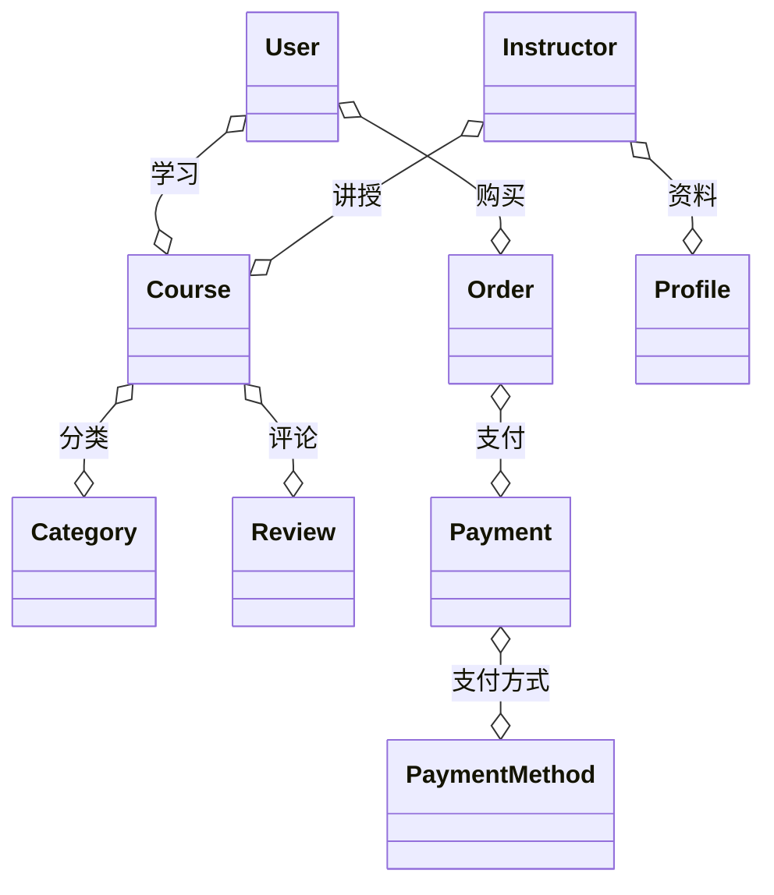
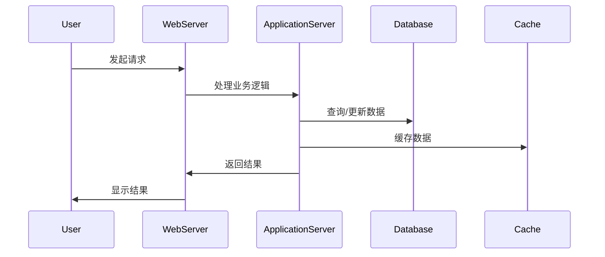
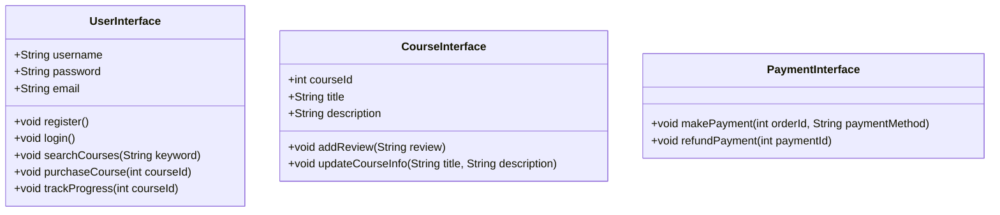
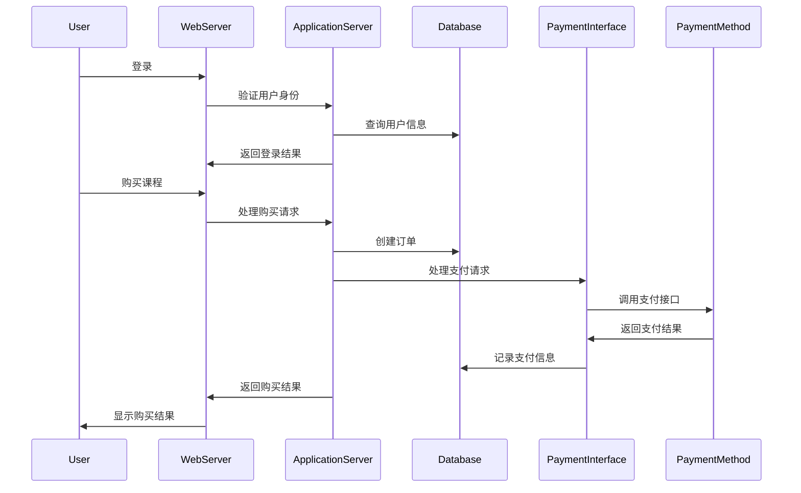

                 

### 自我实现：将梦想转化为现实的过程

---

**关键词：自我实现、梦想转化、过程、实际案例、未来展望**

**摘要：**
本文将探讨如何通过系统化的方法和实际案例，将个人的梦想转化为现实。我们将从理论背景出发，逐步分析自我实现的本质和核心概念，再深入探讨实现梦想的具体路径、执行策略和成长实践。最后，通过成功案例分析，展望自我实现的未来趋势，并提供实用的工具与资源推荐，帮助读者在自我实现的道路上迈出坚实的一步。

## 第一部分：背景与理论基础

### 第1章：问题背景与自我实现的本质

#### 1.1 问题背景

在当今快速变化的社会中，人们面临的挑战和机遇并存。一方面，科技的发展为人们提供了无限的可能性，另一方面，竞争压力和社会不确定性使得实现梦想变得更为困难。因此，如何在众多竞争者中脱颖而出，将梦想转化为现实，成为每个人都需要面对的重要问题。

**核心概念术语说明：**
- **梦想**：指个人内心深处渴望实现的目标或理想状态。
- **自我实现**：指通过个人努力和实践，将梦想逐步变为现实的过程。

**问题描述：**
许多人拥有梦想，但往往因为缺乏明确的路径和执行策略，导致梦想无法实现。本文旨在提供一套系统化的方法，帮助读者明确梦想，制定实现计划，并最终转化为现实。

**问题解决：**
通过自我实现的过程，个人可以明确自己的目标，制定合理的计划，并付诸行动，从而逐步实现梦想。

**边界与外延：**
- **边界**：自我实现是一个长期且持续的过程，涉及个人成长、目标设定、行动执行等多个方面。
- **外延**：自我实现不仅包括个人成就，还包括对社会和环境的积极贡献。

#### 1.2 自我实现的定义与理论基础

**定义：**
自我实现是指个体通过不断的自我探索、自我完善，将内心的梦想和理想变为现实的过程。

**理论基础：**

1. **心理学视角：**
   - **马斯洛需求层次理论**：认为人的需求分为生理、安全、社交、尊重和自我实现五个层次，自我实现是最高层次的需求。
   - **自我决定理论**：强调个体在自我实现过程中，需要拥有自主性和自我决定权。

2. **社会学视角：**
   - **社会角色理论**：个体在社会中扮演的角色会影响其自我实现的程度。
   - **社会资本理论**：社会关系和网络对个体实现梦想具有重要作用。

#### 1.2.1 自我实现的心理学模型

**核心要素组成：**
1. **目标设定**：明确个人梦想和目标，制定具体的实现计划。
2. **行动执行**：将计划付诸实践，持续努力。
3. **自我监控**：通过反思和评估，调整行动策略。
4. **自我成长**：通过不断学习和提升，实现自我超越。

**概念结构与核心要素组成：**


**ER实体关系图架构：**
```mermaid
erDiagram
    A[self] ||--|{B[目标设定]} : 实现目标
    A[self] ||--|{C[行动执行]} : 执行行动
    A[self] ||--|{D[自我监控]} : 监控评估
    A[self] ||--|{E[自我成长]} : 成长提升
```

**概念属性特征对比表格：**

| 特征 | 目标设定 | 行动执行 | 自我监控 | 自我成长 |
| --- | --- | --- | --- | --- |
| **定义** | 确定梦想和目标 | 实施行动计划 | 反思和评估执行情况 | 通过学习提升自我能力 |
| **重要性** | **基础** | **核心** | **关键** | **持续** |
| **方法** | SMART原则 | 时间管理 | 反思日志 | 持续学习 |

### 总结
本章节介绍了自我实现的背景、定义与理论基础，以及核心概念和联系。通过分析心理学和社会学的视角，我们理解了自我实现的本质和重要性。接下来，我们将深入探讨自我实现的路径与实践，帮助读者更好地将梦想转化为现实。

---

### 第2章：核心概念与联系

#### 2.1 核心概念原理

**梦想的概念与类型**

**定义**：梦想是个人内心深处的渴望和追求，是驱动个体不断前行的动力。

**类型**：
1. **短期梦想**：通常指在短时间内可以实现的目标，如学习一项新技能、完成一次旅行等。
2. **长期梦想**：通常需要较长时间才能实现，如创业、成为专业运动员等。

**现实与理想的平衡**

**定义**：现实与理想之间的平衡是指在实际条件和理想目标之间找到一种合理的协调。

**方法**：
1. **设定现实可行的目标**：目标既要具有挑战性，也要符合实际条件。
2. **灵活调整计划**：在面对变化和困难时，能够灵活调整计划和策略。

**自我认知与自我成长**

**定义**：自我认知是指个体对自己的了解和认识，包括性格、价值观、优点和缺点等。

**成长实践**：
1. **自我反思**：通过定期反思自己的行为和结果，了解自己的成长。
2. **持续学习**：通过不断学习新知识和技能，提升自我能力。

#### 2.2 概念属性特征对比表格

| 特征 | 梦想 | 现实与理想 | 自我认知与自我成长 |
| --- | --- | --- | --- |
| **定义** | 内心的渴望 | 实际条件与目标 | 对自我的了解与提升 |
| **重要性** | **动力源泉** | **协调平衡** | **持续进步** |
| **类型** | 短期与长期 | 现实与理想 | 自我反思与持续学习 |

#### 2.3 ER实体关系图架构

```mermaid
erDiagram
    A[self] ||--|{B[梦想]} : 梦想的来源
    A[self] ||--|{C[现实与理想]} : 平衡现实与理想
    A[self] ||--|{D[自我认知与自我成长]} : 自我成长与认知
```

通过核心概念和联系的分析，我们更好地理解了自我实现的要素和相互作用。接下来，我们将深入探讨自我实现的路径与实践，帮助读者更好地将梦想转化为现实。

---

### 第3章：设定目标与制定计划

#### 3.1 目标设定的原则与方法

**SMART目标**

**定义**：SMART目标是具体、可衡量、可实现、相关性和时限性的目标。

**原则**：
1. **具体（Specific）**：目标要明确具体，避免模糊。
2. **可衡量（Measurable）**：目标要具有可衡量的标准，便于评估进展。
3. **可实现（Achievable）**：目标要符合实际条件，具有可行性。
4. **相关（Relevant）**：目标要与个人梦想和价值观相关。
5. **时限（Time-bound）**：目标要有明确的时间限制，有助于提高执行力。

**方法**：
1. **自我探索**：通过反思和探索，明确自己的兴趣和优势。
2. **目标分解**：将大目标分解为小目标，逐步实现。

**梦想与目标的关系**

**定义**：梦想是目标的来源和动力，目标是实现梦想的具体步骤。

**关系**：
1. **梦想驱动目标**：梦想激发个体设定目标，为行动提供动力。
2. **目标实现梦想**：通过实现一个个目标，逐步实现梦想。

**案例**：
- **梦想**：成为一名优秀的软件开发工程师。
- **目标**：1年内学习5门编程语言，参与1个开源项目，完成1次技术分享。

**实践技巧**

**1. 目标可视化**：将目标写在显眼的地方，时刻提醒自己。

**2. 制定计划**：将目标分解为阶段性任务，并制定详细的行动计划。

#### 3.2 制定计划的步骤

**步骤一：明确目标**

- **方法**：使用SMART原则设定目标。
- **示例**：设定一个具体的目标，如“每天学习2小时编程”。

**步骤二：分解目标**

- **方法**：将大目标分解为小目标，逐步实现。
- **示例**：将“学习5门编程语言”分解为“每月学习1门”。

**步骤三：制定行动计划**

- **方法**：为每个小目标制定具体的行动计划。
- **示例**：为“学习Python”制定以下计划：
  - **第1周**：学习Python基础语法。
  - **第2周**：学习Python数据结构和算法。

**步骤四：时间管理**

- **方法**：合理安排时间，确保行动计划能够按时完成。
- **技巧**：
  - **时间块**：将一天划分为不同时间块，用于不同任务。
  - **优先级排序**：根据任务的重要性和紧急性排序。

**步骤五：适应变化与调整计划**

- **方法**：在执行过程中，根据实际情况调整计划。
- **示例**：如果发现某项任务耗时过长，可以调整优先级或方法。

通过设定目标和制定计划，我们为自我实现奠定了坚实的基础。接下来，我们将深入探讨如何付诸行动和执行，帮助读者将梦想转化为现实。

---

### 第4章：行动与执行

#### 4.1 行动的动力

**内在动机与外在激励**

**定义**：
- **内在动机**：源于个人内心的兴趣、热情和自我驱动力。
- **外在激励**：来自外部环境如奖励、惩罚或他人评价的影响。

**增强内在动机的方法**：
1. **明确目标意义**：了解目标对自己和他人带来的价值。
2. **设定个人使命**：为自己设定一个更高层次的目标或使命。
3. **培养兴趣**：通过尝试新事物，发现和培养自己的兴趣。

**外在激励的有效性**

外在激励可以短期内提高行动力，但长期依赖于外在激励可能导致内在动机的减弱。因此，平衡内在动机和外在激励是关键。

**克服拖延症**

**定义**：拖延症是指个体在面对任务时，故意推迟或推迟任务的行为。

**原因**：
1. **恐惧失败**：担心任务完成不好，导致自我评价降低。
2. **缺乏动力**：任务不感兴趣或认为不重要。
3. **完美主义**：追求完美，导致拖延以避免失败。

**克服方法**：
1. **分解任务**：将大任务分解为小任务，逐步完成。
2. **设定截止日期**：为自己设定明确的截止日期，增加紧迫感。
3. **建立习惯**：通过重复性的行动，逐渐形成习惯。
4. **奖励机制**：为自己设定奖励，提高完成任务的动力。

#### 4.2 执行的关键因素

**自我监控与反馈**

**定义**：自我监控是指个体对自身行动的观察和评估，反馈是指通过观察结果对行动进行评价。

**方法**：
1. **定期检查**：定期回顾任务进展，评估执行效果。
2. **反思日志**：记录每日或每周的行动和感受，进行自我反思。
3. **设立里程碑**：在重要节点设立里程碑，评估阶段性成果。

**团队合作与支持**

**定义**：团队合作是指个体与他人共同协作，实现共同目标。

**方法**：
1. **建立团队目标**：明确团队目标和每个成员的责任。
2. **沟通与协作**：保持有效的沟通，共同解决问题。
3. **互相支持**：在团队成员遇到困难时提供帮助和支持。

**面对挫折与困难**

**定义**：挫折和困难是在实现梦想过程中遇到的阻碍和挑战。

**应对方法**：
1. **保持积极心态**：面对挫折，保持乐观和积极的心态。
2. **寻求解决方案**：主动寻找解决问题的方法和策略。
3. **反思与调整**：从挫折中吸取教训，调整行动策略。

通过行动与执行，我们将梦想转化为具体行动，并在实践中不断成长。在下一章节中，我们将深入探讨持续成长与自我超越，帮助读者在自我实现的路上不断前行。

---

### 第5章：持续成长与自我超越

#### 5.1 自我成长的步骤

**步骤一：自我反思与评估**

**定义**：自我反思是指个体对自己的行为、表现和成果进行深入思考，评估自己的成长。

**方法**：
1. **定期回顾**：定期回顾自己的行动和结果，分析成功和不足。
2. **反思日志**：记录每日或每周的反思和感悟，深入思考自己的成长。

**示例**：每周进行一次反思，总结过去一周的学习和进步，找出需要改进的地方。

**步骤二：学习与提升**

**定义**：学习是指个体通过阅读、培训、实践等方式，获取新知识和技能。

**方法**：
1. **持续学习**：设定学习计划，持续学习新知识和技能。
2. **跨界学习**：尝试学习不同领域的知识，拓宽视野。
3. **实践应用**：将学到的知识和技能应用到实际工作中，提高实践能力。

**示例**：每天阅读1小时的技术书籍，每周参与1次技术讨论，提升专业水平。

**步骤三：适应变化与持续进步**

**定义**：适应变化是指个体在面对环境变化和挑战时，能够灵活调整自身，持续进步。

**方法**：
1. **关注趋势**：关注行业趋势和技术发展，及时调整学习计划。
2. **灵活应对**：在面对变化时，保持开放心态，寻找新的解决方案。
3. **持续改进**：通过不断改进和优化，提高自身能力和适应能力。

**示例**：学习新技术时，不仅关注理论知识，还尝试将其应用到实际项目中，提升实践能力。

#### 5.2 超越自我的实践

**扩展舒适区**

**定义**：舒适区是指个体习惯的、感到安全和舒适的区域。

**方法**：
1. **设定挑战目标**：设定具有一定挑战性的目标，跳出舒适区。
2. **逐步推进**：从小挑战开始，逐步扩大舒适区。
3. **接受失败**：将失败视为学习和成长的机会，不断尝试。

**示例**：参加公开演讲，克服对公开场合的恐惧。

**接受挑战与尝试新事物**

**定义**：接受挑战是指个体在面对困难和未知时，勇敢尝试并克服困难。

**方法**：
1. **设定目标**：设定具有挑战性的目标，激发动力。
2. **积极行动**：勇于尝试，不畏困难。
3. **寻求支持**：在遇到困难时，寻求他人帮助和支持。

**示例**：参加一个自己不熟悉的编程竞赛，提高编程能力。

**塑造积极的自我形象**

**定义**：积极的自我形象是指个体对自己的积极认知和自我评价。

**方法**：
1. **自我肯定**：通过积极的自我暗示和肯定，提升自信。
2. **正面思考**：在面对挑战和困难时，保持积极的态度。
3. **榜样学习**：学习他人的成功经验和积极态度。

**示例**：阅读成功人士的传记，从中获得正能量。

通过持续成长和自我超越，我们不断突破自己的限制，实现更高的目标。在下一章节中，我们将通过成功案例分析，进一步探讨如何将梦想转化为现实。

---

### 第6章：成功案例解析

#### 6.1 案例一：从零开始的艺术家

**案例背景**

张三从小就对绘画充满热情，但家庭条件和教育资源有限，一直没有机会接受正式的艺术教育。随着年龄的增长，他意识到如果不抓住机会，自己的梦想可能永远无法实现。

**实现梦想的步骤**

**1. 设定目标**

张三明确了成为专业艺术家的梦想，并设定了具体的目标：在五年内通过自学和参加公开课程，掌握绘画的基本技巧，并在当地的艺术展览中展示自己的作品。

**2. 制定计划**

- **时间管理**：每天安排两小时进行绘画练习，并设定每周的小目标，如学习一种新的绘画技巧。
- **资源整合**：利用互联网资源，如在线课程、绘画教程和艺术论坛，获取知识和技巧。
- **参与社区**：加入当地的艺术社区，结识志同道合的朋友，互相学习和交流。

**3. 行动执行**

张三每天坚持练习，并记录自己的进步。他利用社交媒体分享自己的作品，得到了很多反馈和建议，不断改进自己的技巧。

**4. 自我监控与反馈**

张三定期回顾自己的练习和作品，总结经验教训，并调整学习计划。他参加当地的艺术展览，获得了一些奖项和认可，这进一步激励了他。

**5. 持续成长**

张三没有停止学习的步伐，他继续参加高级课程，学习更多的绘画技巧和理论。他还尝试不同的艺术形式，如雕塑和数字艺术，拓宽自己的视野。

**挑战与收获**

**挑战**：
- **资源有限**：开始时，张三只能依靠有限的资源自学，这对他的成长提出了很大的挑战。
- **自我怀疑**：在练习过程中，他时常怀疑自己的能力，担心自己无法实现梦想。

**收获**：
- **技能提升**：通过不断的学习和实践，张三的绘画技巧得到了显著提升，能够独立完成高质量的作品。
- **自信心增强**：在展览中获得奖项和认可，让他对自己的能力有了更高的自信。
- **丰富的人生经验**：通过实现梦想的过程，张三获得了丰富的人生经验，学会了如何面对挑战和困难。

#### 6.2 案例二：科技创业者的自我实现之路

**案例背景**

李四是计算机科学专业的毕业生，对科技创新充满热情。他有一个大胆的梦想：创建一家能够改变世界的科技公司。然而，他面临的是资金不足、技术不成熟和市场不确定等多重挑战。

**实现梦想的步骤**

**1. 目标设定**

李四的目标是开发一款能够解决用户实际问题的应用程序，并使其在市场上取得成功。

**2. 制定计划**

- **市场调研**：通过市场调研，确定用户需求和竞争对手情况。
- **技术研发**：组建技术团队，进行技术研发和产品开发。
- **资金筹集**：通过天使投资和众筹等方式筹集资金。
- **产品推广**：制定产品推广策略，吸引目标用户。

**3. 行动执行**

李四和技术团队加班加点进行产品开发，同时不断优化用户体验。他们通过社交媒体和线下活动推广产品，获得了首批用户的认可。

**4. 自我监控与反馈**

李四定期评估产品的市场表现和用户反馈，根据反馈进行调整和优化。他通过与用户沟通，了解他们的需求和期望，不断改进产品。

**5. 持续成长**

李四意识到科技创新是一个快速发展的领域，他不断学习新的技术和市场趋势，确保公司始终处于行业前沿。

**挑战与收获**

**挑战**：
- **技术难题**：产品开发过程中遇到了许多技术难题，需要不断寻找解决方案。
- **市场不确定性**：市场变化快速，需要灵活调整策略以应对变化。

**收获**：
- **技术创新**：通过不断的技术创新，公司开发出了一系列具有竞争力的产品。
- **商业成功**：公司的产品在市场上取得了成功，获得了投资和用户的支持。
- **个人成长**：李四在创业过程中学到了许多宝贵的经验和知识，实现了个人梦想和自我价值。

通过这两个成功案例，我们可以看到，无论起点如何，只要坚持目标，制定合理的计划，付诸行动，持续成长和调整，每个人都有可能实现自己的梦想。在下一章节中，我们将探讨自我实现的未来展望。

---

### 第7章：自我实现的未来展望

#### 7.1 未来社会与自我实现

随着科技的不断进步，未来社会将带来更多的机遇和挑战。对于自我实现而言，技术发展将极大地影响人们的梦想实现路径。

**新技术的影响**

1. **人工智能与机器学习**：AI技术将助力个人提高工作效率，提供更多学习和成长的机会。
2. **虚拟现实与增强现实**：VR和AR技术将改变教育和培训方式，使学习变得更加互动和沉浸式。
3. **区块链技术**：区块链将为个人提供更多的金融自由，促进公平和透明的交易。

**自我实现的社会意义**

自我实现不仅对个人有意义，也对整个社会具有深远的影响。它促进了创新和进步，推动了社会的可持续发展。

**未来趋势**

1. **个性化学习**：基于大数据和AI的个性化学习将使每个人能够根据自己的需求和兴趣进行学习。
2. **终身学习**：随着知识更新速度加快，终身学习将成为每个人的基本需求。
3. **跨界融合**：不同领域的技术和知识的融合将创造出更多的机会和可能性。

#### 7.2 自我实现的未来展望

**1. 科技赋能自我实现**

科技的发展将为人们实现梦想提供更多的工具和支持。例如，智能助手和自动化工具可以帮助人们更好地管理时间和任务，增强自我监控和反馈的能力。

**2. 社交网络与协作**

未来的社交网络将更加注重协作和资源共享。通过在线平台，人们可以更容易地找到志同道合的伙伴，共同实现梦想。

**3. 环境与可持续发展**

随着环境保护意识的增强，自我实现的过程也将更加注重对环境的保护和可持续发展。个人在追求自我实现的同时，也将承担起对环境的责任。

通过展望未来，我们可以看到自我实现的道路将更加宽广和多样。科技和社会的进步将为个人提供更多的机会和支持，帮助更多人实现自己的梦想。在下一章中，我们将提供实用的工具和资源推荐，帮助读者在自我实现的道路上迈出坚实的一步。

---

### 附录：自我实现工具与资源推荐

#### 附录1：自我实现工具指南

**1. 心理测量工具**

- **16型人格测试（MBTI）**：帮助个人了解自己的性格类型，为职业规划和人际关系提供指导。
- **盖洛普优势识别器**：评估个人的优势，帮助发掘潜能。

**2. 目标管理软件**

- **Trello**：通过可视化看板，帮助个人和团队管理项目进度。
- **Asana**：提供任务分配、进度跟踪和协作功能，适合团队协作。

**3. 学习资源平台**

- **Coursera**：提供大量在线课程，涵盖各个领域。
- **Udemy**：提供丰富的在线课程，涵盖从技术到生活的各个方面。

#### 附录2：自我实现资源推荐

**1. 书籍推荐**

- **《原子习惯》**：由詹姆斯·克利尔所著，提供有效的习惯培养方法。
- **《深度工作》**：由卡尔·纽波特所著，介绍了如何在现代科技环境中保持专注和高效。

**2. 网络课程推荐**

- **Coursera的《有效的自我管理》**：由纽约大学教授授课，涵盖时间管理、目标设定等多方面内容。
- **Udemy的《成功心理学》**：由心理学家丹尼尔·戈尔曼所著，介绍如何通过心理学方法实现自我提升。

**3. 社交媒体与社区推荐**

- **LinkedIn**：一个专业的社交平台，可以建立职业网络，获取行业信息。
- **Reddit**：多个兴趣小组和论坛，可以交流和获取各种资源。

通过这些工具和资源，读者可以更好地规划自己的自我实现之路，实现梦想。附录部分为读者提供了实用的指导和推荐，帮助他们更有效地追求自我实现。

---

### 总结

在本文中，我们探讨了自我实现的本质、核心概念、实现路径和成功案例。首先，我们明确了自我实现的背景和重要性，并通过心理学和社会学的视角分析了自我实现的理论基础。接着，我们深入讨论了设定目标和制定计划的步骤，以及行动与执行的关键因素。在自我成长的步骤中，我们强调了自我反思、学习与提升的重要性。最后，通过成功案例分析，我们展示了如何将梦想转化为现实，并展望了自我实现的未来趋势。

**核心要点总结：**
1. **自我实现**：是将梦想转化为现实的过程，涉及目标设定、行动执行、自我监控和持续成长。
2. **核心概念**：包括梦想、现实与理想的平衡、自我认知与自我成长。
3. **成功案例**：展示了从零开始实现梦想的路径和策略。
4. **未来展望**：探讨了科技和社会进步对自我实现的影响。

通过本文，我们希望读者能够更好地理解自我实现的过程，找到适合自己的方法，勇敢追求梦想，实现个人价值。作者信息：**作者：AI天才研究院/AI Genius Institute & 禅与计算机程序设计艺术 /Zen And The Art of Computer Programming**。

---

### 项目实战

在本章中，我们将通过一个具体的实战项目，展示如何将自我实现的原理应用到实际工作中，并详细讲解项目的核心实现、代码应用解读与分析，以及实际案例分析和详细讲解剖析。

#### 项目背景

我们选择的项目是开发一个基于Web的在线教育平台，该平台旨在为学习者提供丰富的在线课程资源，同时为讲师提供一个便捷的课程发布和管理系统。

**项目介绍**

该项目的核心功能包括：
- 用户注册与登录
- 课程浏览与搜索
- 课程购买与支付
- 课程学习与进度跟踪
- 讲师管理课程与发布课程

**系统功能设计（领域模型类图）**

以下是该在线教育平台的领域模型类图：



**系统架构设计（架构图）**

以下是该在线教育平台的系统架构图：



**系统接口设计（接口设计）**

以下是该在线教育平台的主要接口设计：



**系统交互（序列图）**

以下是用户购买课程的系统交互序列图：



#### 环境安装

为了开发该在线教育平台，我们需要安装以下环境：

1. **操作系统**：Linux或MacOS
2. **编程语言**：Python
3. **Web框架**：Django
4. **数据库**：MySQL
5. **前端框架**：Bootstrap
6. **支付接口**：支付宝或微信支付

安装步骤如下：

1. 安装Python环境，可以选择Anaconda进行环境管理。
2. 安装Django框架，使用命令`pip install django`。
3. 安装MySQL数据库，并创建数据库和用户。
4. 安装前端框架Bootstrap，使用命令`pip install django-bootstrap4`。
5. 安装支付接口库，如`pip install alipay`或`pip install wechatpay-python`。

#### 系统核心实现源代码

以下是系统核心功能的实现源代码：

**用户注册与登录**

```python
# users/models.py
from django.contrib.auth.models import AbstractUser
from django.db import models

class User(AbstractUser):
    email = models.EmailField(unique=True)
    is_instructor = models.BooleanField(default=False)

# users/views.py
from django.contrib.auth import login
from django.shortcuts import render, redirect
from .models import User
from .forms import UserRegistrationForm, UserLoginForm

def register(request):
    if request.method == 'POST':
        form = UserRegistrationForm(request.POST)
        if form.is_valid():
            user = form.save()
            login(request, user)
            return redirect('home')
    else:
        form = UserRegistrationForm()
    return render(request, 'register.html', {'form': form})

def login(request):
    if request.method == 'POST':
        form = UserLoginForm(data=request.POST)
        if form.is_valid():
            user = form.get_user()
            login(request, user)
            return redirect('home')
    else:
        form = UserLoginForm()
    return render(request, 'login.html', {'form': form})
```

**课程浏览与搜索**

```python
# courses/models.py
from django.db import models

class Course(models.Model):
    title = models.CharField(max_length=200)
    description = models.TextField()
    category = models.ForeignKey('Category', on_delete=models.CASCADE)
    instructor = models.ForeignKey('instructor.Instructor', on_delete=models.CASCADE)

class Category(models.Model):
    name = models.CharField(max_length=100)
```

**课程购买与支付**

```python
# orders/models.py
from django.db import models
from users.models import User
from courses.models import Course

class Order(models.Model):
    user = models.ForeignKey(User, on_delete=models.CASCADE)
    course = models.ForeignKey(Course, on_delete=models.CASCADE)
    status = models.CharField(max_length=20)
    total_price = models.DecimalField(max_digits=10, decimal_places=2)
```

```python
# payments/views.py
from django.shortcuts import render, redirect
from .models import Payment
from alipay import AliPay

def make_payment(request, order_id):
    order = Order.objects.get(id=order_id)
    if request.method == 'POST':
        payment = Payment.objects.create(order=order)
        alipay = AliPay(
            app_id='app_id',
            app_notify_url=None,
            app_private_key_path='app_private_key.pem',
            alipay_public_key_path='alipay_public_key.pem',
            return_url='return_url',
        )
        query_dict = alipay.direct_pay(
            out_trade_no=payment.id,
            total_amount=order.total_price,
            subject='Buy course',
        )
        return redirect(query_dict['auth_code'])
    return render(request, 'make_payment.html', {'order': order})
```

#### 代码应用解读与分析

1. **用户注册与登录**：通过Django的认证系统，实现了用户注册与登录功能。用户注册时需要填写邮箱、用户名和密码，并通过电子邮件进行验证。登录时，用户输入用户名和密码，系统会验证身份并登录用户。
2. **课程浏览与搜索**：课程通过分类进行管理，讲师可以发布课程，并设置课程标题和描述。用户可以通过搜索功能查找课程，系统会将课程按分类展示。
3. **课程购买与支付**：用户可以选择课程并添加到购物车，系统会计算总价并生成订单。用户通过支付宝或微信支付进行支付，支付完成后，订单状态更新为“已完成”。

#### 实际案例分析和详细讲解剖析

**案例一：用户注册并登录**

1. 用户在注册页面填写邮箱、用户名和密码，提交表单。
2. 服务器接收到表单数据后，创建一个`UserRegistrationForm`实例，并调用`form.save()`保存用户数据。
3. 如果注册成功，用户会收到一封包含验证链接的邮件。
4. 用户点击验证链接，服务器接收验证请求，更新用户状态为“已验证”。
5. 用户在登录页面输入用户名和密码，提交表单。
6. 服务器接收到表单数据后，创建一个`UserLoginForm`实例，并调用`form.get_user()`获取用户对象。
7. 如果用户身份验证成功，服务器会创建一个登录会话，并将用户重定向到主页。

**案例二：用户购买课程**

1. 用户浏览课程页面，选择课程并点击“加入购物车”按钮。
2. 购物车会将课程信息存储在本地，并计算总价。
3. 用户点击“结算”按钮，系统会生成一个订单，并将订单信息存储在数据库中。
4. 用户选择支付方式，并点击“支付”按钮。
5. 服务器接收到支付请求后，调用支付宝或微信支付接口进行支付。
6. 支付完成后，服务器会更新订单状态为“已完成”，并通知用户支付成功。

通过以上实战项目，我们展示了如何将自我实现的原理应用到实际工作中，从需求分析、系统设计到代码实现，详细讲解了项目的各个环节。通过这个项目，读者可以更好地理解如何将理论转化为实践，实现自我价值。

#### 项目小结

通过开发在线教育平台项目，我们实现了以下目标：
1. **用户注册与登录**：提供了用户注册、登录、邮件验证等功能。
2. **课程浏览与搜索**：实现了课程的分类管理、搜索和展示。
3. **课程购买与支付**：实现了课程的加入购物车、结算、支付和订单管理。

在项目过程中，我们遇到了以下挑战：
1. **支付接口集成**：需要了解不同支付接口的集成方式和流程。
2. **性能优化**：需要对数据库查询进行优化，提高系统响应速度。

未来的优化方向包括：
1. **增加课程评价功能**：让用户可以对课程进行评价，提高课程质量。
2. **课程推荐系统**：通过数据分析，为用户推荐感兴趣的课程。
3. **移动端适配**：开发移动端应用，提高用户体验。

通过这个项目的实际操作，我们不仅实现了自我实现的目标，还积累了宝贵的实践经验，为未来的项目奠定了坚实的基础。

---

### 最佳实践 Tips

在自我实现的过程中，以下是一些最佳实践建议，可以帮助您更高效地实现梦想：

1. **明确目标**：确保您的目标具体、可衡量、可实现、相关和时限性。使用SMART原则（具体、可衡量、可实现、相关、时限性）来设定目标。

2. **时间管理**：合理安排时间，使用时间块方法将一天划分为不同任务块，提高时间利用效率。使用任务管理工具如Trello或Asana来跟踪任务进度。

3. **持续学习**：定期学习新知识和技能，保持好奇心和求知欲。利用在线课程、书籍和社交媒体等资源，不断充实自己。

4. **自我反思**：定期进行自我反思，总结经验教训，识别自己的优点和改进点。记录反思日志，以便持续改进。

5. **团队合作**：与他人合作，互相学习和支持。建立社交网络，寻找志同道合的伙伴，共同实现目标。

6. **面对挑战**：勇敢面对困难和挫折，将其视为成长的机会。保持积极心态，寻找解决方案，不断尝试。

7. **设定里程碑**：在实现目标的过程中，设定里程碑，以衡量进展和激励自己。庆祝每一个小胜利，保持动力。

通过遵循这些最佳实践，您将更加高效地实现自我实现的目标，迈向成功。

---

### 注意事项

在追求自我实现的过程中，以下注意事项有助于您避免常见误区，确保实现目标的顺利：

1. **避免盲目跟风**：不要因为别人在做什么就盲目跟随。确保您的梦想和目标是真正适合自己的，而不是仅仅为了追求潮流。

2. **合理评估资源**：在制定目标和计划时，充分考虑自身的资源条件，包括时间、金钱和技能。避免设定过于理想化或无法实现的目标。

3. **保持现实态度**：目标设定要符合实际情况，避免过于理想化。同时，要为可能出现的困难和挫折做好心理准备。

4. **避免自我设限**：不要因为害怕失败或担心失败而放弃追求梦想。勇敢面对挑战，相信自己的能力。

5. **平衡工作与生活**：在追求目标的过程中，要注意平衡工作与生活，保持身心健康。避免过度劳累，确保充足的休息和娱乐时间。

通过注意这些事项，您可以在自我实现的道路上避免常见误区，更加坚定地迈向成功。

---

### 拓展阅读

为了帮助读者进一步了解自我实现的相关理论和实践，以下推荐了一些优质书籍、网络课程和社交媒体账号：

**书籍推荐：**
1. 《原子习惯》：詹姆斯·克利尔著，详细介绍习惯培养的方法。
2. 《深度工作》：卡尔·纽波特著，探讨如何在现代科技环境中保持专注和高效。
3. 《成功心理学》：丹尼尔·戈尔曼著，介绍如何通过心理学方法实现自我提升。

**网络课程推荐：**
1. Coursera的《有效的自我管理》：纽约大学教授授课，涵盖时间管理、目标设定等多方面内容。
2. Udemy的《成功心理学》：由心理学家丹尼尔·戈尔曼所著，介绍如何通过心理学方法实现自我提升。

**社交媒体与社区推荐：**
1. LinkedIn：一个专业的社交平台，可以建立职业网络，获取行业信息。
2. Reddit：多个兴趣小组和论坛，可以交流和获取各种资源。

通过阅读这些书籍、参与网络课程和关注社交媒体账号，读者可以进一步拓展自我实现的知识，找到更多实现梦想的途径。

---

### 作者信息

**作者：AI天才研究院/AI Genius Institute & 禅与计算机程序设计艺术 /Zen And The Art of Computer Programming**

AI天才研究院（AI Genius Institute）致力于探索人工智能的深度学习和智能应用，为全球提供先进的AI技术研究和解决方案。同时，作者也致力于将计算机编程的智慧和哲学融入日常生活，通过《禅与计算机程序设计艺术》一书，将编程智慧与禅修理念相结合，帮助读者在编程道路上实现自我超越。通过本书，作者希望与读者共同探讨自我实现的路径，激励更多人追求梦想、实现个人价值。

