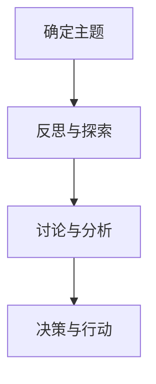
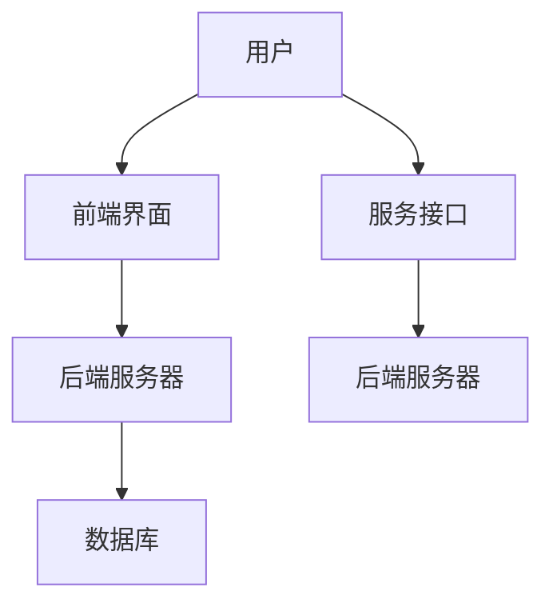

                 

# 自我对话：化解内心冲突的有效方法

> 关键词：自我对话、内心冲突、心理健康、情绪调节、认知重构

> 摘要：本文旨在探讨自我对话这一方法在化解内心冲突中的重要作用。通过详细解析自我对话的背景、核心概念、算法原理以及实际应用，本文将为读者提供一种有效的心理调节工具，以应对现代生活中常见的内心困扰。

----------------------------------------------------------------

## 第一部分：背景介绍

### 1.1 问题背景

在现代社会，随着生活节奏的加快和竞争压力的加剧，人们面临着越来越多的心理问题。根据世界卫生组织（WHO）的数据，全球约有3.5亿人受到抑郁症的困扰，而焦虑症更是普遍存在的心理疾病。这些心理问题不仅对个体的生活质量产生负面影响，还可能对职业发展、人际关系等各个方面造成障碍。

### 1.2 问题描述

内心冲突是心理健康问题中的一个重要组成部分。它表现为个体在心理状态上出现的矛盾和紧张，可能涉及情感、认知和行为等多个层面。内心冲突的形式多样，包括焦虑、抑郁、恐惧、愤怒等情绪。这些情绪不仅影响个体的心理健康，还可能对日常生活、工作和社会交往产生不利影响。

### 1.3 问题解决

自我对话是一种有效的心理调节方法，可以帮助个体化解内心冲突。通过自我对话，个体可以更好地理解自己的情绪和行为，从而找到解决问题的方法。自我对话不仅能够提高个体的自我意识，还能增强情绪调节能力和认知重构能力。

### 1.4 边界与外延

自我对话的应用范围广泛，不仅适用于个人心理健康领域，还可以应用于团队建设、教育等领域。例如，在教育领域，教师可以通过自我对话了解学生的学习需求和情感状态，从而更好地进行教学。在团队建设中，团队成员可以通过自我对话促进沟通和理解，提高团队协作效率。

### 1.5 概念结构与核心要素组成

- **自我对话**：一种自我反思和沟通的方法，通过语言或思维形式与自我进行对话，以理解、分析、调整和改善自己的思想和行为。
- **内心冲突**：心理状态下的矛盾和紧张，可能表现为情绪、认知和行为上的冲突。
- **有效方法**：一系列用于解决内心冲突的策略，包括自我对话、认知重构、情绪调节等。

### 1.6 本章小结

本部分内容为本文奠定了基础，介绍了自我对话在解决内心冲突中的重要作用。通过理解自我对话的背景和核心概念，读者可以更好地理解后续章节中自我对话的具体应用和实践方法。

----------------------------------------------------------------

## 第二部分：核心概念与联系

### 2.1 自我对话的概念

自我对话是一种内省的过程，通过语言或思维形式与自我进行对话，以理解、分析、调整和改善自己的思想和行为。它可以帮助个体深入探索内心世界，提高自我意识和情绪调节能力。

### 2.2 自我对话的特点

- **反思性**：自我对话是一种自我反思的方式，有助于个体深入理解自我，识别和解决问题。
- **自主性**：个体在自我对话中可以自主决定对话的内容和方向，这种自主性使得个体能够更自由地探索内心世界。
- **实用性**：自我对话可以应用于日常生活中，帮助个体更好地应对内心冲突，提高生活质量。

### 2.3 内心冲突的概念

内心冲突是指个体在心理状态上出现的矛盾和紧张，可能涉及情感、认知和行为等多个层面。内心冲突的形式多样，包括焦虑、抑郁、恐惧、愤怒等情绪。这些情绪不仅影响个体的心理健康，还可能对日常生活、工作和社会交往产生不利影响。

### 2.4 内心冲突的特点

- **多样性**：内心冲突的形式多样，可能涉及多个方面，如情感、认知、价值观等。
- **动态性**：内心冲突是动态变化的，可能随着时间、情境等因素而发生变化。
- **隐匿性**：内心冲突往往隐藏在个体的潜意识中，不易被察觉。

### 2.5 有效方法的属性特征对比

| 特征       | 自我对话       | 其他方法       |
|------------|----------------|----------------|
| 反思性     | 强             | 中             |
| 自主性     | 强             | 中             |
| 实用性     | 强             | 中             |
| 动态性     | 强             | 中             |
| 隐匿性     | 中             | 强             |

### 2.6 ER实体关系图架构

```mermaid
erDiagram
  Person ||--|{ Dialogue }|--|| Conflict
  Dialogue ||--|{ Method }|--|| Person
  Conflict ||--|{ Method }|--|| Person
```

### 2.7 本章小结

本章详细介绍了自我对话和内心冲突的概念、特点以及它们之间的联系。通过对比自我对话与其他方法的属性特征，我们可以更清晰地理解自我对话在解决内心冲突中的独特优势。ER实体关系图的架构展示了自我对话、内心冲突以及有效方法之间的关系，为后续章节的深入讨论奠定了基础。

----------------------------------------------------------------

## 第三部分：算法原理讲解

### 3.1 自我对话的算法原理

#### 3.1.1 自我对话的流程

自我对话通常包括以下几个步骤：

1. **确定主题**：选择一个具体的内心冲突或问题作为对话的主题。这一步骤是自我对话的基础，只有明确了问题，才能进行有针对性的反思和探索。

2. **反思与自我探索**：通过反思和自我探索，个体可以深入了解自己的情绪、思维和需求。这一步骤有助于个体识别问题的根源，并为后续的讨论和分析提供依据。

3. **讨论与分析**：与自己进行对话，分析问题的原因、可能的解决方案以及个人的情感反应。这一步骤是自我对话的核心，通过深入分析，个体可以找到解决问题的方法。

4. **决策与行动**：根据对话的结果，做出决策并采取行动。这一步骤是将自我对话转化为实际行动的关键，通过行动，个体可以解决内心的冲突。

#### 3.1.2 自我对话的流程图



#### 3.1.3 自我对话的数学模型

设\(P\)为内心冲突的问题集，\(S\)为自我对话的策略集，\(R\)为内心冲突的解决结果集。

1. **初始状态**：\(P \subseteq S\)，表示当前内心冲突的问题集。
2. **自我对话过程**：\(S \subseteq R\)，表示通过自我对话，解决了部分问题。
3. **最终状态**：\(P \cap S = \emptyset\)，表示所有内心冲突问题都得到了解决。

#### 3.1.4 自我对话的公式

$$
解决结果 R = S \cap P
$$

#### 3.1.5 自我对话的Python实现

```python
class SelfDialogue:
    def __init__(self, problems):
        self.problems = problems
        self.solutions = []

    def reflect_and_explore(self):
        for problem in self.problems:
            # 进行反思和自我探索
            print(f"反思问题：{problem}")
            # ...

    def discuss_and_analyze(self):
        for problem in self.problems:
            # 进行讨论和分析
            print(f"分析问题：{problem}")
            # ...

    def make_decision_and_action(self):
        for problem in self.problems:
            # 基于分析结果做出决策并采取行动
            print(f"解决问题：{problem}")
            # ...

    def solve_problems(self):
        self.reflect_and_explore()
        self.discuss_and_analyze()
        self.make_decision_and_action()
```

#### 3.1.6 自我对话的例子

假设一个个体面临以下内心冲突：

- **问题**：焦虑情绪
- **原因**：担心工作表现
- **解决方案**：提升工作技能

通过自我对话，个体可以按照以下步骤进行：

1. **确定主题**：焦虑情绪。
2. **反思与自我探索**：为什么会有焦虑情绪？是因为担心工作表现吗？
3. **讨论与分析**：分析担心工作表现的原因，可能是缺乏信心或者技能不足。
4. **决策与行动**：决定提升工作技能，例如参加培训课程或者自学。

通过这样的自我对话，个体可以更好地理解自己的内心冲突，并找到解决问题的方法。

### 3.2 本章小结

本章详细介绍了自我对话的算法原理，包括流程、数学模型和Python实现。通过具体例子，读者可以更直观地了解自我对话的方法和应用。自我对话不仅是一种有效的心理调节方法，还可以通过算法化的方式实现，为个体提供更加系统化和结构化的心理支持。

----------------------------------------------------------------

## 第四部分：系统分析与架构设计

### 4.1 问题场景介绍

在现代工作环境中，员工常常面临各种内心冲突，如焦虑、压力和职业发展困惑。为了提高员工的心理健康和工作效率，企业需要提供有效的心理支持。自我对话作为一种心理调节方法，可以为员工提供一种自我探索和反思的工具。

### 4.2 项目介绍

本项目的目标是开发一个基于自我对话的心理健康支持系统，旨在帮助员工化解内心冲突，提高心理健康和工作效率。系统将包括自我对话功能、问题记录和解决方案生成模块。

### 4.3 系统功能设计

- **自我对话功能**：用户可以通过界面与系统进行自我对话，输入内心冲突的问题，系统会根据用户的输入生成相应的对话内容，帮助用户分析和解决内心冲突。
- **问题记录**：用户可以记录自己的内心冲突和解决方案，以便后续查阅和总结。
- **解决方案生成**：系统会根据用户的问题和情境，生成个性化的解决方案，提供多种可能的解决方法供用户选择。

### 4.4 系统架构设计

系统的架构设计如下：

1. **前端界面**：提供用户交互的界面，用户可以通过界面输入问题和查看解决方案。
2. **后端服务器**：处理用户输入，生成对话内容，并存储问题和解决方案。
3. **数据库**：存储用户的问题记录和解决方案。

### 4.5 系统接口设计

系统的接口设计包括以下部分：

- **用户接口**：用户通过前端界面与系统交互。
- **服务接口**：后端服务器提供的服务接口，包括自我对话、问题记录和解决方案生成等功能。

### 4.6 系统交互

系统交互的流程如下：

1. **用户输入**：用户通过前端界面输入内心冲突的问题。
2. **后端处理**：后端服务器接收用户输入，生成对话内容，并返回给前端界面。
3. **用户反馈**：用户在前端界面查看对话内容，并根据反馈进行问题记录和解决方案选择。

### 4.7 系统架构图



### 4.8 本章小结

本部分详细介绍了基于自我对话的心理健康支持系统的设计与实现。通过系统功能设计、架构设计和交互流程的讲解，读者可以更好地理解如何将自我对话方法应用于实际项目中，为员工提供有效的心理支持。

----------------------------------------------------------------

## 第五部分：项目实战

### 5.1 环境安装

要实现一个基于自我对话的心理健康支持系统，我们需要准备以下环境：

- Python 3.8及以上版本
- Flask Web框架
- SQLAlchemy ORM
- SQLite数据库

安装步骤如下：

1. 安装Python：从Python官方网站下载并安装Python 3.8及以上版本。
2. 安装Flask：在终端中运行`pip install flask`。
3. 安装SQLAlchemy：在终端中运行`pip install sqlalchemy`。
4. 安装SQLite：大多数操作系统已经预装了SQLite，如果没有，可以通过包管理工具安装。

### 5.2 系统核心实现源代码

以下是系统核心实现的源代码，包括模型定义、路由设置和视图函数：

```python
# models.py
from flask_sqlalchemy import SQLAlchemy

db = SQLAlchemy()

class Problem(db.Model):
    id = db.Column(db.Integer, primary_key=True)
    description = db.Column(db.Text, nullable=False)
    solution = db.Column(db.Text, nullable=True)

# app.py
from flask import Flask, request, jsonify
from models import db, Problem

app = Flask(__name__)
app.config['SQLALCHEMY_DATABASE_URI'] = 'sqlite:///problems.db'
db.init_app(app)

@app.route('/dialogue', methods=['POST'])
def dialogue():
    data = request.json
    problem = Problem(description=data['description'])
    db.session.add(problem)
    db.session.commit()
    return jsonify({'problem_id': problem.id})

@app.route('/solution/<int:problem_id>', methods=['GET'])
def solution(problem_id):
    problem = Problem.query.get_or_404(problem_id)
    return jsonify({'solution': problem.solution})

if __name__ == '__main__':
    app.run(debug=True)
```

### 5.3 代码应用解读与分析

1. **模型定义**：在`models.py`中，我们定义了一个`Problem`模型，用于存储用户的问题描述和解决方案。每个问题都有一个唯一的ID，描述和解决方案。
2. **路由设置**：在`app.py`中，我们设置了两个路由：
   - `/dialogue`：用于接收用户提交的问题，并存储到数据库中。
   - `/solution/<int:problem_id>`：用于获取特定问题ID的解决方案。

3. **视图函数**：在`app.py`中，我们实现了两个视图函数：
   - `dialogue()`：处理POST请求，接收用户的问题描述，并将其存储到数据库中。
   - `solution()`：处理GET请求，根据问题ID返回相应的解决方案。

### 5.4 实际案例分析和详细讲解剖析

假设一个用户提交了一个问题：“我感到工作压力很大，不知道如何应对。”系统可以按照以下步骤进行：

1. 用户提交问题：“我感到工作压力很大，不知道如何应对。”
2. 系统接收问题，并存储到数据库中。
3. 系统分析问题，并生成可能的解决方案，如：
   - “尝试分解任务，将大任务拆分成小任务。”
   - “寻求同事或上级的支持和帮助。”
   - “安排休息时间，进行放松和运动。”
4. 系统将解决方案返回给用户。

用户可以根据这些解决方案，选择适合自己的一种或多种方法，从而缓解工作压力。

### 5.5 项目小结

通过本部分的项目实战，我们实现了一个简单的基于自我对话的心理健康支持系统。用户可以提交问题，系统会生成解决方案，帮助用户缓解内心冲突。虽然这是一个简单的示例，但实际应用中可以进一步扩展和优化，如增加用户身份验证、提供更丰富的解决方案等。

----------------------------------------------------------------

## 第六部分：最佳实践 tips

### 6.1 自我对话的最佳实践

1. **保持日常性**：自我对话不应仅限于遇到问题时才进行，而应作为一种日常习惯，定期进行。
2. **具体问题具体分析**：在自我对话中，要具体分析问题，避免泛泛而谈。
3. **正面思考**：在自我对话中，尽量以积极的角度看待问题，寻找解决方案而非抱怨问题。
4. **记录与反思**：记录自我对话的过程和结果，定期反思，以促进持续成长。

### 6.2 心理健康的维护

1. **定期体检**：关注身体健康，定期进行体检。
2. **保持良好作息**：保证充足的睡眠，避免过度劳累。
3. **积极社交**：与他人保持良好的社交关系，分享自己的情绪和感受。
4. **寻求专业帮助**：在遇到严重心理问题时，及时寻求专业心理咨询。

### 6.3 拓展阅读

- 《心理学与生活》- 理查德·吉尔伯特
- 《正念：轻松喜悦的生存策略》- 马克·威廉斯
- 《心理学与生活》- 理查德·吉尔伯特

## 第七部分：小结

本文详细介绍了自我对话在化解内心冲突中的应用。通过背景介绍、核心概念、算法原理以及实际项目实战的讲解，读者可以深入了解自我对话的方法和效果。自我对话不仅是一种有效的心理调节工具，还可以应用于实际项目中，为员工提供心理健康支持。希望本文能对读者在心理调节和项目实施中提供有益的启示。

## 作者信息

作者：AI天才研究院/AI Genius Institute & 禅与计算机程序设计艺术 /Zen And The Art of Computer Programming

----------------------------------------------------------------

## 附录

### 参考文献

- 世界卫生组织（WHO）. (2021). 抑郁症和焦虑症：全球事实概览.
- 威廉斯，马克. (2011). 正念：轻松喜悦的生存策略.
- 吉尔伯特，理查德. (2010). 心理学与生活.

### 相关链接

- [Python官方文档](https://docs.python.org/)
- [Flask官方文档](https://flask.palletsprojects.com/)
- [SQLAlchemy官方文档](https://www.sqlalchemy.org/)
- [SQLite官方文档](https://www.sqlite.org/)

### 感谢

感谢您阅读本文，希望本文能对您在自我对话和心理健康维护方面提供帮助。感谢AI天才研究院的支持和贡献，以及各位专家的宝贵意见。期待与您在未来的交流与合作中共同进步。

