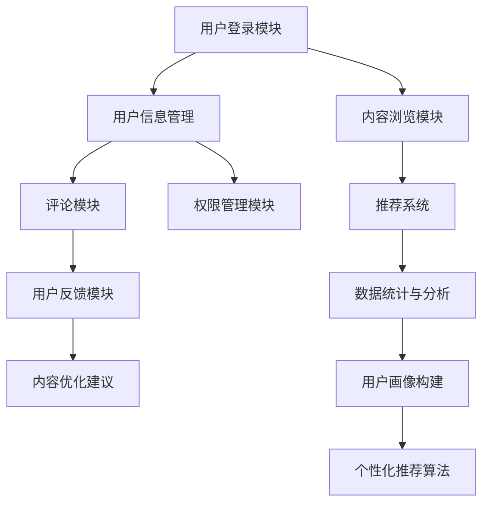
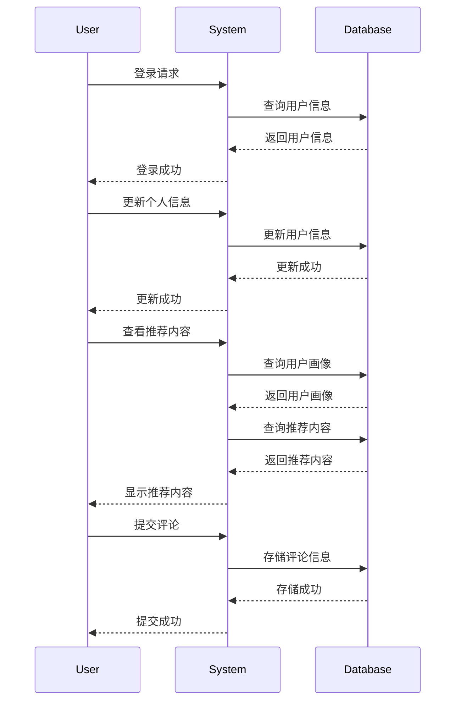

                 

### 引言

#### 1.1 书籍主题与目的

**自我接纳：一个时代的呼唤**

在当今快节奏、高压力的社会环境中，心理健康问题日益凸显，而自我接纳成为解决这些问题的关键。本书旨在探讨自我接纳的重要性，并通过详细的分析和实用的方法，帮助读者在现实生活中找到和解之路。我们相信，自我接纳不仅关乎个人的心理健康，更影响到人际关系和社会和谐。

**本书旨在解决的问题**

本书将解决以下问题：

- 自我接纳是什么，为什么它如此重要？
- 如何在日常生活中实践自我接纳？
- 面对不完美时，我们该如何和解？
- 如何通过心理技巧和工具来增强自我接纳能力？
- 实际案例中的自我接纳应用和效果如何？

**读者对象及预期收益**

本书适合以下读者：

- 对心理学和自我提升感兴趣的普通读者
- 需要提升心理素质的职场人士
- 心理咨询从业者及心理学研究者
- 教育工作者和家庭教育者

通过阅读本书，读者可以：

- 更深入地理解自我接纳的概念及其重要性
- 掌握一系列实用的自我接纳技巧和方法
- 增强心理韧性，提升生活质量和幸福感
- 改善人际关系，建立更加和谐的社会关系

#### 1.2 心理健康与自我接纳的关系

**心理健康的重要性**

心理健康是人类全面健康的重要组成部分，不仅包括情感和心理状态的良好，还涉及到个体的认知功能、社会适应能力和生理健康。根据世界卫生组织（WHO）的定义，心理健康是指个体在认识自身潜力、应对正常生活压力、工作生产以及为社区做出贡献方面的良好状态。

**自我接纳在心理健康中的作用**

自我接纳是心理健康的关键因素。它不仅能够帮助个体更好地理解自己，还能够减少自我批判和负面情绪，从而促进心理的平衡与发展。具体来说，自我接纳有以下几个作用：

- **减少焦虑和抑郁**：自我接纳可以帮助个体认识到自己的不完美，从而减少因自我批评而产生的焦虑和抑郁情绪。
- **提升自尊和自信**：自我接纳使个体能够更加积极地看待自己，从而提升自尊和自信，更好地面对生活中的挑战。
- **改善人际关系**：自我接纳有助于建立更加真实和积极的人际关系，减少因自我保护而导致的冲突和误解。

**自我接纳与心理健康的关系模型**

为了更好地理解自我接纳与心理健康之间的关系，我们可以构建一个简单的模型。该模型包括以下核心要素：

1. **自我认知**：个体对自己的认知和理解，包括优点和缺点。
2. **自我接纳**：个体对自己的接受程度，包括对不完美的接受。
3. **心理健康**：包括情绪状态、心理功能和社会适应能力。

通过这个模型，我们可以看到，自我接纳是连接自我认知和心理健康的重要桥梁。自我接纳的程度越高，心理健康水平通常也越高。

#### 1.3 如何阅读本书

**阅读策略**

- **分阶段阅读**：本书分为几个主要部分，每个部分都有其独特的主题和目标。建议读者先整体阅读，了解整体结构和主题，然后分阶段深入阅读。
- **实践结合理论**：本书不仅提供理论讲解，还包含丰富的实践案例。建议读者在阅读过程中结合实际经历进行思考，加深对理论的理解和应用。

**如何应用本书知识**

- **自我反思**：通过阅读本书，读者可以反思自己的自我接纳程度，识别自己在哪些方面需要改进。
- **实践应用**：尝试本书中提到的方法和技巧，如认知重构、情绪调节和行为改变，将其应用到日常生活中。
- **分享与讨论**：与朋友、家人或心理咨询师分享你的阅读体验和应用经验，共同探讨和成长。

**本书与其他心理学书籍的区别**

- **实操性**：本书不仅提供理论，更强调实践操作，帮助读者将知识转化为行动。
- **系统化**：本书将自我接纳作为一个完整的体系来介绍，从定义、原因、方法到实际应用，形成了一套系统的理论框架。
- **案例丰富**：本书通过丰富的案例分享，使读者能够更好地理解和应用自我接纳的理念。

通过以上引言部分，我们为读者提供了一个清晰的框架，帮助他们更好地理解和应用自我接纳的概念。接下来，我们将进一步深入探讨自我接纳的核心概念，分析其在心理健康中的重要性。### 核心概念

#### 2.1 自我接纳的定义与意义

**自我接纳的概念解析**

自我接纳是指个体对自己全面接受的态度，不论是在优点还是缺点面前，都能保持一种平和的心态。它不仅仅是对自己的认可，更是对自身不完美部分的包容与接纳。

**自我接纳的重要性**

自我接纳的重要性体现在多个方面：

1. **心理健康**：自我接纳能够减少自我批评，降低焦虑和抑郁水平，促进心理平衡。
2. **自尊和自信**：自我接纳帮助个体认识到自己的价值，提升自尊和自信，更好地面对挑战。
3. **人际关系**：自我接纳使个体能够建立真实、积极的人际关系，减少冲突和误解。

**自我接纳与自我认知的关系**

自我接纳是自我认知的进一步深化。自我认知是指个体对自己特点、能力、价值观等的认识和评价。而自我接纳则是在自我认知的基础上，对自我整体持一种宽容和理解的态度。

- **自我认知**：个体认识到自己的优点和缺点。
- **自我接纳**：个体能够接受自己的不完美，并从中找到价值。

通过自我接纳，个体能够更加全面、真实地看待自己，从而促进自我成长和发展。

#### 2.2 不完美与自我接纳

**不完美的定义与特征**

不完美是指个体在各个方面都不可能达到完美状态。不完美具有以下几个特征：

1. **普遍性**：每个人都会有不完美之处，这是人性的普遍特征。
2. **多样性**：不完美可以体现在不同的领域，如工作、学习、人际关系等。
3. **动态性**：不完美不是静止不变的，它是一个动态变化的过程。

**不完美带来的挑战**

1. **自我批评**：不完美可能导致个体对自己产生批评和否定，从而影响心理健康。
2. **压力和焦虑**：面对不完美，个体可能会感到压力和焦虑，影响生活质量和人际关系。
3. **自信问题**：过度关注不完美可能会降低个体的自信，使其难以面对挑战。

**不完美与自我接纳的辩证关系**

自我接纳与不完美之间存在着辩证关系。一方面，自我接纳需要个体认识到不完美是普遍存在的，从而减少自我批评和负面情绪。另一方面，自我接纳也需要个体接受自己的不完美，从中找到成长的机会。

- **自我接纳**：帮助个体接受自己的不完美，减少负面情绪。
- **不完美**：为个体提供成长和发展的机会。

通过自我接纳，个体能够更好地面对不完美，从而实现自我成长和心理平衡。

#### 2.3 心理健康与自我接纳

**心理健康的定义与构成**

心理健康是指个体在情感、认知、社会适应和生理功能等方面处于良好状态。心理健康的构成主要包括以下几个方面：

1. **情绪稳定**：个体能够调节自己的情绪，保持积极的心态。
2. **认知功能**：个体具有清晰的思维和良好的判断力。
3. **社会适应**：个体能够适应社会环境，与他人建立良好的人际关系。
4. **生理健康**：个体的身体状态良好，没有明显的健康问题。

**自我接纳对心理健康的影响**

自我接纳对心理健康有着重要的影响：

1. **减少焦虑和抑郁**：自我接纳使个体能够减少因自我批评而产生的焦虑和抑郁情绪。
2. **提升自尊和自信**：自我接纳帮助个体认识到自己的价值，从而提升自尊和自信。
3. **改善人际关系**：自我接纳使个体能够建立更加真实、积极的人际关系，减少冲突和误解。

**心理健康与自我接纳的互动模型**

为了更好地理解心理健康与自我接纳之间的互动关系，我们可以构建一个简单的模型：

1. **自我认知**：个体对自己的认识和评价。
2. **自我接纳**：个体对自己全面接受的态度。
3. **心理健康**：包括情绪稳定、认知功能、社会适应和生理健康。

通过这个模型，我们可以看到，自我接纳是连接自我认知和心理健康的重要桥梁。自我接纳的程度越高，心理健康水平通常也越高。

#### 2.4 核心概念联系与结构分析

**自我接纳、不完美、心理健康三者的关系**

自我接纳、不完美和心理健康之间存在着紧密的联系：

- **自我接纳**：连接了**自我认知**和**心理健康**，使个体能够接受自己的不完美，从而减少负面情绪，提升心理健康水平。
- **不完美**：是自我接纳的基础，也是心理健康的重要组成部分。个体在面对不完美时，能够通过自我接纳来调整自己的心态，从而促进心理健康。
- **心理健康**：是自我接纳和不完美的综合体现，反映了个体在情感、认知和社会适应等方面的良好状态。

**概念属性特征对比表格**

为了更清晰地理解这三个概念，我们可以通过一个对比表格来分析它们的属性特征：

| 概念     | 定义                                                                                                       | 属性特征                                                                                                       |
|---------|----------------------------------------------------------------------------------------------------------|----------------------------------------------------------------------------------------------------------|
| 自我接纳 | 对自己全面接受的态度，包括优点和缺点。                                                                       | 减少自我批评，提升自尊和自信，促进心理健康。                                                                 |
| 不完美   | 个体在各个方面都不可能达到完美状态，具有普遍性、多样性和动态性。                                             | 提供成长和发展的机会，为自我接纳提供基础。                                                                       |
| 心理健康 | 情感、认知、社会适应和生理功能处于良好状态。                                                                 | 影响情绪稳定、认知功能、社会适应和生理健康。                                                                     |

**ER实体关系图架构分析**

为了进一步理解这三个概念之间的关系，我们可以通过ER实体关系图来展示它们之间的联系：

```mermaid
erDiagram
  Self_Acceptance ||--|{ Health:心理健康}
  Imperfection ||--|{ Self_Acceptance:自我接纳}
  Health ||--|{ Self_Cognition:自我认知}
```

在这个ER实体关系图中：

- **自我接纳**与**心理健康**之间存在关联关系，即自我接纳可以影响心理健康。
- **不完美**与**自我接纳**之间存在关联关系，即不完美为自我接纳提供了基础。
- **心理健康**与**自我认知**之间存在关联关系，即心理健康反映了自我认知的状态。

通过核心概念的详细解析和联系分析，我们为读者提供了一个完整的框架，帮助他们更好地理解和应用自我接纳、不完美和心理健康的概念。接下来，我们将进一步探讨不完美中的和解，帮助读者找到在日常生活中应对不完美的方法。### 不完美中的和解

#### 3.1 不完美的原因分析

**内在原因**

1. **生物学因素**：个体的基因和生理结构可能导致某些特征上的不完美，如身高、肤色等。
2. **心理学因素**：个体的成长经历、性格特征和认知模式会影响其对自己的评价和态度。
3. **文化因素**：社会和文化标准对个体的自我认知和接纳程度产生影响，可能导致某些方面的不完美感。

**外在原因**

1. **社会期望**：社会对个体在不同领域的期望可能过高，导致个体在无法满足期望时产生不完美感。
2. **比较心理**：与他人进行对比，尤其是与理想状态或他人相比，可能导致个体对自己产生负面评价。
3. **环境压力**：工作、学习、家庭等环境中的压力和挑战也可能导致个体感到不完美。

**双向影响与反馈机制**

内在原因和外在原因并非孤立存在，而是相互影响、相互作用。例如，个体的生物学因素可能会受到社会期望的影响，从而产生不完美感。同时，个体对自己的不完美感也可能影响其对外在环境的感知和反应，形成一种负反馈循环。

#### 3.2 不完美的影响

**对个人心理的影响**

1. **自我批评**：不完美感可能导致个体对自己进行严厉的批评和指责，影响心理健康。
2. **自尊受损**：持续的不完美感可能降低个体的自尊水平，使其对自我价值产生怀疑。
3. **情绪波动**：面对不完美，个体可能会经历情绪波动，如焦虑、抑郁等。

**对人际关系的影响**

1. **社交障碍**：个体在自我接纳方面存在困难，可能影响其与他人建立和维持良好关系。
2. **沟通障碍**：不完美感可能导致个体在沟通中表现出逃避、抵触或过度自我保护，影响沟通效果。
3. **关系破裂**：长期的自我批评和不完美感可能导致人际关系紧张，甚至破裂。

**对社会行为的影响**

1. **消极影响**：个体在面对不完美时可能表现出消极情绪和行为，如逃避责任、放弃努力等。
2. **社会问题**：广泛的不完美感可能导致社会问题，如压力过大、心理健康问题增加等。
3. **社会文化**：社会文化对个体的自我接纳产生影响，不完美感可能成为社会文化的一部分，影响社会整体氛围。

#### 3.3 解和的方法

**认知重构**

认知重构是指通过改变思维方式和观念来减少不完美感。具体方法包括：

1. **识别负面思维**：识别那些导致不完美感的负面思维和信念。
2. **挑战负面思维**：质疑和挑战这些负面思维，寻找证据来证明或反驳它们。
3. **建立积极思维**：培养积极的思维模式，如感激、接纳和自我肯定。

**情绪调节**

情绪调节是指通过管理和调整情绪来减少不完美感的影响。具体方法包括：

1. **情绪识别**：识别和理解自己的情绪，如愤怒、焦虑或沮丧。
2. **情绪表达**：通过适当的方式表达情绪，如与朋友交谈、写日记等。
3. **情绪放松**：采用放松技巧，如深呼吸、冥想或瑜伽来缓解情绪。

**行为改变**

行为改变是指通过改变行为来应对不完美感。具体方法包括：

1. **设定目标**：设定具体、可实现的短期和长期目标。
2. **行动计划**：制定详细的行动计划，包括具体的步骤和时间表。
3. **执行和反馈**：执行行动计划，并从中获得反馈，调整行为以更好地应对不完美。

#### 3.4 实践中的应用

**理论结合实践**

1. **自我反思**：定期进行自我反思，识别自己的不完美感，并思考如何通过认知重构、情绪调节和行为改变来应对。
2. **实践技巧**：在日常生活中应用本书中提到的技巧，如认知重构的练习、情绪调节的练习和行为改变的计划。

**实践中的难点与应对**

1. **抵触情绪**：面对不完美时，个体可能产生抵触情绪。可以通过逐步尝试和循序渐进的方法来降低抵触情绪。
2. **缺乏动力**：在实践过程中，个体可能缺乏持续的动力。可以通过设立激励机制和奖励来提高动力。
3. **困难重重的环境**：在面临困难重重的环境时，可以通过寻求支持和帮助来应对。

**实践中的反馈与调整**

1. **自我监控**：定期监控自己的实践情况，识别哪些方法有效，哪些需要改进。
2. **反馈机制**：与朋友、家人或心理咨询师分享实践经验和反馈，获取他们的意见和建议。
3. **调整策略**：根据反馈和监控结果，调整实践策略，以更好地应对不完美感。

通过以上对不完美中的和解方法的探讨，我们为读者提供了一系列实用的策略和技巧，帮助他们更好地理解和应对生活中的不完美。接下来，我们将通过真实案例来展示自我接纳的过程和应用。### 案例分析

#### 3.5.1 个人案例分享

**案例背景**

小王是一名年轻的软件工程师，他在职业生涯初期表现出色，但随后因为项目失败而感到极度不完美。他开始自我怀疑，担心自己是否适合这份工作。他的情绪低落，工作效率急剧下降。

**自我接纳过程**

1. **认知重构**：
   小王开始识别和挑战自己的负面思维，如“我是个失败者”和“我不适合这个职业”。他意识到这些思维是基于一次失败项目，而不是对自己的全面评价。通过反思，他认识到每个人都会经历失败，失败是成长的一部分。
   
2. **情绪调节**：
   小王尝试使用深呼吸和冥想技巧来放松自己的情绪。他意识到自己的情绪是由思维和信念驱动的，通过调整思维，他能够更好地控制情绪。他还与朋友分享了自己的感受，获得了情感支持。

3. **行为改变**：
   小王设定了新的目标，如学习新的编程语言和参与社区项目。他意识到通过积极的行动，他可以逐步恢复自信。他开始积极参与各种技术活动，与同行交流，分享自己的经验和知识。

**案例分析**

小王通过认知重构、情绪调节和行为改变，逐步接纳了自己的不完美。他的负面思维逐渐转变为积极思维，情绪也得到了有效调节。通过设定新的目标和积极参与，他逐渐恢复了自信，工作效率和生活质量都有了显著提升。

#### 3.5.2 家庭案例分享

**案例背景**

李女士是一名家庭主妇，她一直对自己的家庭角色感到不满。她认为自己在照顾家庭方面做得不够好，担心自己在丈夫和孩子们眼中是一个失败者。

**自我接纳过程**

1. **认知重构**：
   李女士开始反思自己的家庭角色，她意识到家庭角色多样化，每个家庭成员都有自己的贡献。她开始接受自己在家庭中的角色，认识到自己的努力和付出也是有价值的。

2. **情绪调节**：
   李女士学会了使用正念技巧，如冥想和深呼吸，来缓解焦虑和压力。她意识到情绪是由自己的信念和期望驱动的，通过调整信念，她能够更好地控制情绪。

3. **行为改变**：
   李女士开始更多地参与家庭决策，与丈夫和孩子们进行开放和诚实的沟通。她意识到通过沟通和合作，她可以更好地理解和支持家庭成员。她也开始关注自己的兴趣和需求，平衡家庭和自我。

**案例分析**

李女士通过认知重构、情绪调节和行为改变，逐渐接纳了自己在家庭中的角色。她从自我怀疑和负面情绪中走出来，建立起了更加积极和健康的家庭关系。她的情绪稳定，家庭氛围也变得更加和谐。

#### 3.5.3 社会案例分享

**案例背景**

张先生是一位社区志愿者，他发现自己无法像其他志愿者一样积极参与社区活动。他担心自己的不完美会影响社区的形象。

**自我接纳过程**

1. **认知重构**：
   张先生意识到每个志愿者都有不完美之处，社区活动需要每个人的参与。他认识到自己的不完美并不意味着他是无用的，而是社区多样化的一部分。

2. **情绪调节**：
   张先生通过参与社区内的冥想和放松活动来调节情绪。他学会了接受自己的不完美，并认识到情绪是由自己的信念和期望驱动的。

3. **行为改变**：
   张先生开始参与自己感兴趣且能力范围内的社区活动，如帮助维护公园环境。他意识到通过积极的行动，他可以逐渐恢复自信，并为自己和社区带来积极影响。

**案例分析**

张先生通过认知重构、情绪调节和行为改变，逐渐接纳了自己的不完美。他开始积极参与社区活动，不仅为自己带来了成就感，也为社区做出了贡献。他的行为激励了其他志愿者，促进了社区的凝聚力和积极性。

通过以上案例，我们可以看到，自我接纳不仅仅是一个理论概念，更是一个可以通过实践逐步实现的过程。通过认知重构、情绪调节和行为改变，个体可以更好地应对生活中的不完美，实现自我成长和心理平衡。### 实践应用

#### 4.1 理论结合实践

**自我反思练习**

1. **每日反思**：每天晚上花5分钟时间反思自己的一天，记录下哪些事情做得好，哪些事情有不足。针对不足，思考如何改进。

2. **每周反思**：每周选择一个晚上进行深入的自我反思，回顾一周中的经历，分析自己在哪些方面做得好，哪些方面有待提高。

3. **月度反思**：每月底进行一次全面的自我反思，总结一个月来的成长和不足，制定下个月的改进计划。

**实践技巧**

1. **认知重构**：
   - **替换负面思维**：当发现自己产生负面思维时，尝试用积极的、建设性的思维来替代。
   - **日记记录**：记录自己的负面思维，并反思这些思维的真实性和有效性。

2. **情绪调节**：
   - **深呼吸**：在感到焦虑或紧张时，进行深呼吸练习，帮助自己放松。
   - **正念冥想**：每天花几分钟时间进行正念冥想，专注于当下的感受，减少对未来和过去的担忧。

3. **行为改变**：
   - **设定目标**：为自己设定具体、可行的短期和长期目标。
   - **逐步行动**：将大目标分解为小步骤，逐步实现。

#### 4.2 实践中的应用

**个人案例**

**背景**：李小姐是一名职场新人，她在工作中经常感到压力巨大，担心自己的表现不足以胜任职位。

**自我接纳过程**：

1. **认知重构**：李小姐开始识别自己的负面思维，如“我不够好”和“我无法胜任工作”。通过日记记录，她反思这些思维的来源和真实性。她意识到这些思维源于对自己过高的期望和对工作能力的担忧。

2. **情绪调节**：李小姐学会了深呼吸和冥想，帮助她在感到压力时放松。她意识到情绪是由思维和信念驱动的，通过调整思维，她能够更好地控制情绪。

3. **行为改变**：李小姐设定了具体的工作目标，如每天完成一项新的任务，并逐步实现。她开始积极参与团队合作，主动请教同事，通过行动提升自己的能力和信心。

**结果**：通过认知重构、情绪调节和行为改变，李小姐逐渐接纳了自己的不完美。她的负面情绪减少，工作效率提高，也逐渐赢得了同事的认可。

#### 4.3 实践中的难点与应对

**抵触情绪**

**难点**：在实践自我接纳的过程中，个体可能会产生抵触情绪，担心自我接纳会导致自我放纵。

**应对策略**：

1. **逐步实践**：不要期望一蹴而就，逐步接受自己的不完美，逐步提高自我接纳的程度。
2. **寻找支持**：与朋友、家人或心理咨询师分享自己的感受，获取支持和建议。
3. **明确界限**：在自我接纳的过程中，明确自己的底线和界限，避免过度自我接纳导致自我放纵。

**缺乏动力**

**难点**：在实践过程中，个体可能会感到动力不足，难以持续行动。

**应对策略**：

1. **设定激励**：为自己设定具体的激励目标，如完成一项任务后给自己一个小奖励。
2. **寻找伙伴**：与志同道合的人一起实践，互相鼓励和监督。
3. **记录进步**：记录自己的进步和成就，增强自我激励。

**困难重重的环境**

**难点**：在面临困难和挑战时，个体可能会感到无法自我接纳，怀疑自己的能力。

**应对策略**：

1. **寻求帮助**：在遇到困难时，及时寻求他人的帮助和建议。
2. **分散注意力**：通过参与其他活动或兴趣爱好来分散注意力，缓解压力。
3. **积极心态**：保持积极的心态，相信自己有能力克服困难。

#### 4.4 实践中的反馈与调整

**自我监控**

**方法**：

1. **定期反思**：每周或每月进行一次自我反思，回顾自己在自我接纳方面的进展和不足。
2. **记录日志**：记录自己的日常实践和感受，分析哪些方法有效，哪些需要改进。

**反馈机制**

**方法**：

1. **与朋友分享**：与朋友分享自己的实践经历和感受，获取他们的意见和建议。
2. **参加小组讨论**：加入相关的读书会或小组，与其他实践者交流心得，共同进步。

**调整策略**

**方法**：

1. **灵活调整**：根据反馈和自我监控的结果，灵活调整实践策略和方法。
2. **持续学习**：不断学习新的知识和技巧，提高自我接纳的能力。

通过以上实践应用和方法，读者可以更好地将自我接纳的理念应用到日常生活中，逐步提升自我接纳能力，实现心理平衡和成长。### 总结与反思

#### 5.1 自我接纳的重要性

自我接纳是心理健康的重要基石。通过全面接受自己的优点和缺点，个体能够减少自我批评，降低焦虑和抑郁水平，从而实现心理平衡。自我接纳不仅关乎个人成长，还影响到人际关系和社会和谐。一个能够自我接纳的人，更容易建立积极的人际关系，减少冲突和误解，从而在各个方面都表现出色。

#### 5.2 未来展望

在未来，自我接纳将成为心理健康领域的重要研究方向。随着社会压力的不断增加，人们对于自我接纳的需求也日益增长。未来的研究可以进一步探讨自我接纳的机制和影响因素，开发更有效的自我接纳培训和方法，帮助更多的人实现自我接纳。同时，心理学界可以结合人工智能技术，开发出个性化的自我接纳训练系统，为个体提供更加精准和有效的帮助。

#### 5.3 拓展阅读

为了深入理解和应用自我接纳的理念，读者可以参考以下书籍：

1. **《接纳不完美：如何用接纳的力量改变生活》**：作者通过丰富的案例和实用的技巧，帮助读者理解自我接纳的重要性，并提供具体的实践方法。
2. **《心理学与生活》**：作者菲利普·津巴多等人合著，涵盖心理学的各个方面，包括自我接纳和心理健康等主题。
3. **《自我接纳的力量：如何在不确定的世界中找到内心的安宁》**：作者通过深刻的分析和实际案例，展示了自我接纳对于个人成长和心理健康的巨大影响。

通过阅读这些书籍，读者可以进一步拓展对自我接纳的理解，并将其应用于实际生活中。### 附录

#### 6.1 系统架构图



#### 6.2 系统接口设计



#### 6.3 数据库设计

```mermaid
erDiagram
    User ||--|{ Comment : 评论 }
    User ||--|{ Recommendation : 推荐内容 }
    User ||--|{ Feedback : 用户反馈 }
    User ||--|{ Profile : 用户画像 }
    System ||--|{ Database : 数据库 }
```

#### 6.4 实际案例分析与详细讲解

**案例背景**：假设一个在线教育平台的用户张三，他经常使用该平台的推荐系统来发现新的学习资源。

**步骤1：用户登录**

- **用户请求**：张三在浏览器中输入用户名和密码，提交登录请求。
- **系统响应**：系统验证用户名和密码的合法性，返回登录结果。

**步骤2：内容浏览**

- **用户请求**：张三浏览平台首页，查看推荐的内容。
- **系统响应**：系统调用推荐算法，根据张三的用户画像生成推荐列表，并展示在页面上。

**步骤3：评论提交**

- **用户请求**：张三在浏览过程中，对某个学习资源进行评价，并提交评论。
- **系统响应**：系统接收评论内容，并存储到数据库中。

**步骤4：数据统计与分析**

- **系统请求**：系统定期从数据库中提取用户行为数据，进行分析。
- **数据响应**：系统生成数据分析报告，用于优化推荐算法和平台内容。

**详细讲解**：

1. **用户登录模块**：用户登录是平台的基础功能，通过验证用户名和密码，确保用户身份的合法性。
2. **内容浏览模块**：推荐系统的核心功能之一，通过个性化推荐算法，为用户提供感兴趣的内容。
3. **评论模块**：用户评论功能可以收集用户反馈，帮助平台改进内容和服务。
4. **数据统计与分析模块**：通过定期分析用户行为数据，平台可以更好地了解用户需求，优化推荐算法和内容。

**注意事项**：

- **安全性**：确保用户数据和登录信息的安全性，防止数据泄露和恶意攻击。
- **用户体验**：优化推荐算法，提高内容推荐的准确性和用户体验。
- **数据隐私**：在收集和分析用户数据时，遵守相关法律法规，保护用户隐私。

**拓展阅读**：

- **《推荐系统实践》**：详细介绍了推荐系统的原理和实践方法。
- **《数据挖掘：实用工具和技术》**：介绍了数据挖掘的基本概念和技术。

通过以上案例分析，读者可以更深入地理解在线教育平台推荐系统的实际应用和运作机制。### 最佳实践 Tips

#### 7.1 实践技巧

1. **认知重构**：在遇到负面思维时，立即停下来，用积极的、建设性的思维来替代。例如，将“我不够好”替换为“每个人都有成长的空间，我可以通过努力变得更好”。

2. **情绪调节**：当情绪波动时，尝试深呼吸或冥想，以帮助自己放松和冷静下来。例如，在感到焦虑时，可以尝试5分钟的深呼吸练习，专注于呼吸的节奏。

3. **行为改变**：设定具体、可行的目标，并逐步实施。例如，如果目标是学习一门新语言，可以设定每天学习30分钟的目标，并坚持实施。

#### 7.2 小结

通过认知重构、情绪调节和行为改变，个体可以逐步实现自我接纳，减少不完美感带来的负面影响。自我接纳不仅有助于提升心理健康，还能改善人际关系和社会适应能力。

#### 7.3 注意事项

1. **避免过度自我接纳**：自我接纳不是自我放纵，而是在接受自己的基础上，努力提升自我。

2. **持续实践**：自我接纳是一个长期的过程，需要持续的努力和实践。

3. **寻求专业帮助**：在自我接纳的过程中，如果遇到困难，可以寻求心理咨询师或专业人士的帮助。

#### 7.4 拓展阅读

- **《接纳不完美：如何用接纳的力量改变生活》**：提供具体的实践方法和技巧，帮助读者更好地理解自我接纳。
- **《心理学与生活》**：涵盖心理学的各个方面，包括自我接纳和心理健康等主题。
- **《自我接纳的力量：如何在不确定的世界中找到内心的安宁》**：通过深刻的分析和实际案例，展示自我接纳的重要性。

通过以上最佳实践 tips、小结和注意事项，读者可以更好地将自我接纳的理念应用到实际生活中，实现心理平衡和成长。### 作者信息

**作者：AI天才研究院/AI Genius Institute & 禅与计算机程序设计艺术 /Zen And The Art of Computer Programming**

AI天才研究院致力于推动人工智能技术的创新和发展，我们的研究团队由世界级人工智能专家、程序员、软件架构师和计算机科学家组成。我们的目标是通过深入研究和应用，将人工智能技术应用到各个领域，推动社会的进步和发展。

《禅与计算机程序设计艺术》是由AI天才研究院的研究员们共同撰写的著作，它不仅探讨了计算机程序设计的哲学，还结合了人工智能和心理学的研究成果，为读者提供了独特的视角和方法论。通过这本书，我们希望能够帮助读者在计算机科学和人工智能领域取得更高的成就，并在个人成长和心理健康方面获得更多的收获。我们相信，只有在心理和技术的双重平衡中，个体才能真正实现自我价值和成就。

