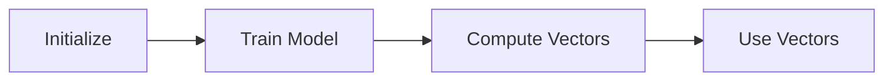
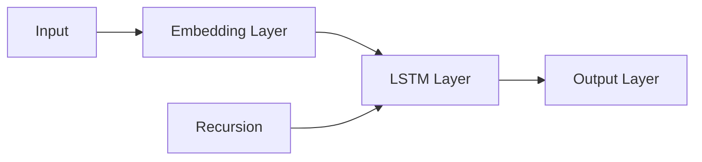
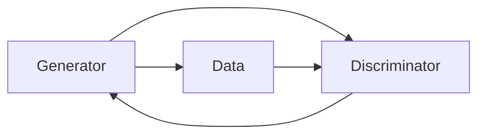
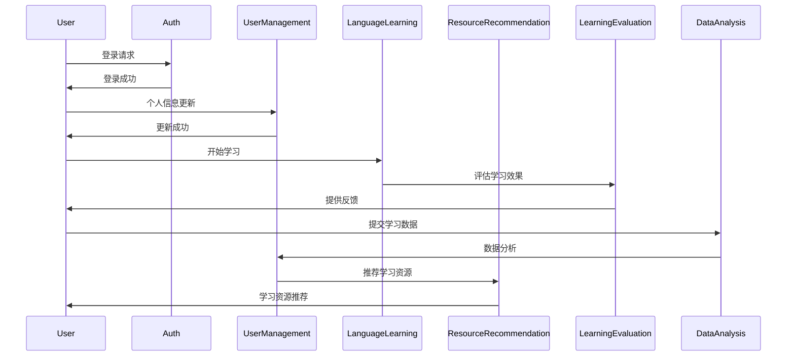
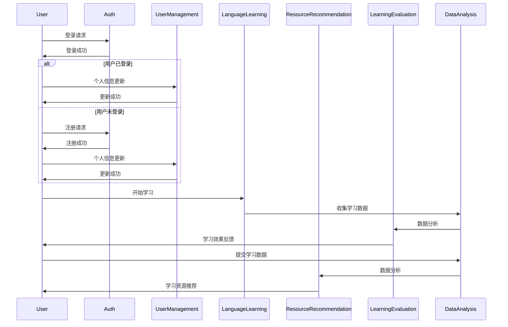

                 


### 自然语言处理在多语言教育中的应用：个性化语言学习体验

#### 关键词：自然语言处理，多语言教育，个性化学习，算法原理，系统设计与实现

> 摘要：本文将深入探讨自然语言处理（NLP）在多语言教育中的应用，以及如何通过NLP技术实现个性化语言学习体验。我们将从NLP的基本概念和核心技术出发，详细分析其在多语言教育中的现状与挑战，探讨个性化语言学习体验的实现原理，并给出系统设计与实现的详细案例。最后，我们将总结最佳实践，展望未来发展趋势，为教育技术领域的研究者和实践者提供有价值的参考。

### 目录大纲

```markdown
----------------------------------------------------------------
# 第一部分：问题背景与核心概念

## 第1章：自然语言处理与多语言教育概述

### 1.1 自然语言处理的基本概念与核心技术

#### 1.1.1 自然语言处理的发展历程

#### 1.1.2 自然语言处理的核心理念

#### 1.1.3 自然语言处理的应用领域

### 1.2 多语言教育的现状与挑战

#### 1.2.1 多语言教育的普及趋势

#### 1.2.2 多语言教育中存在的问题

#### 1.2.3 多语言教育的需求与机遇

## 第2章：多语言教育的核心概念与联系

### 2.1 核心概念与联系

#### 2.1.1 语言习得理论

#### 2.1.2 语言教学理论

#### 2.1.3 多语言教育中的关键要素

### 2.2 概念属性特征对比表格

### 2.3 ER实体关系图架构

----------------------------------------------------------------
# 第二部分：个性化语言学习体验的实现原理

## 第3章：自然语言处理算法原理讲解

### 3.1 常见自然语言处理算法

#### 3.1.1 词向量模型

#### 3.1.2 递归神经网络（RNN）

#### 3.1.3 生成对抗网络（GAN）

### 3.2 算法mermaid流程图展示

### 3.3 Python源代码与实践

### 3.4 数学模型与公式

$$
y = f(x)
$$

### 3.5 举例说明

----------------------------------------------------------------
# 第三部分：个性化语言学习系统的设计与实现

## 第4章：系统分析与架构设计

### 4.1 问题场景介绍

#### 4.1.1 系统需求分析

#### 4.1.2 系统目标与功能

### 4.2 系统架构设计

#### 4.2.1 系统架构图

#### 4.2.2 系统接口设计

### 4.3 系统交互mermaid序列图

----------------------------------------------------------------
## 第5章：项目实战与案例分析

### 5.1 环境安装与配置

### 5.2 系统核心实现源代码

#### 5.2.1 代码解读与分析

#### 5.2.2 代码应用解析

### 5.3 实际案例分析与详细讲解

### 5.4 项目小结

----------------------------------------------------------------
## 第6章：最佳实践与拓展

### 6.1 最佳实践

#### 6.1.1 个性化学习策略

#### 6.1.2 数据分析与优化

### 6.2 小结与注意事项

### 6.3 拓展阅读与研究方向

----------------------------------------------------------------
## 第7章：未来展望与趋势

### 7.1 未来发展展望

#### 7.1.1 技术革新

#### 7.1.2 教育改革

### 7.2 研究方向与挑战

#### 7.2.1 语言习得与模型适配

#### 7.2.2 数据隐私与伦理问题

----------------------------------------------------------------
```

现在，我们将按照上述目录大纲，逐步深入探讨自然语言处理在多语言教育中的应用，以及个性化语言学习体验的实现原理。首先，我们需要了解自然语言处理的基本概念与核心技术，然后分析多语言教育的现状与挑战，接着探讨个性化语言学习体验的核心概念与联系。随后，我们将详细讲解自然语言处理算法的原理，并通过系统分析与架构设计，展示如何将算法应用于实际系统中。最后，我们将通过项目实战和案例分析，验证系统设计的有效性，并总结最佳实践，展望未来发展趋势。

---

### 第1章：自然语言处理与多语言教育概述

#### 1.1 自然语言处理的基本概念与核心技术

自然语言处理（Natural Language Processing，简称NLP）是人工智能（Artificial Intelligence，简称AI）领域的一个重要分支，旨在使计算机能够理解、生成和处理人类自然语言。NLP的核心目标包括语言识别、理解、生成和交互。

**1.1.1 自然语言处理的发展历程**

自然语言处理的历史可以追溯到20世纪50年代，当时的研究主要集中在语法分析、机器翻译和语言理解等方面。早期的NLP系统依赖于规则驱动的方法，如语法解析器和词典。然而，这些系统在处理复杂语言现象时表现不佳。

随着计算机硬件性能的提升和算法的进步，特别是在20世纪80年代，基于统计方法的NLP研究开始兴起。这一转变标志着NLP从规则驱动向数据驱动的方法过渡。之后，神经网络技术的发展，特别是深度学习算法的引入，使得NLP的性能得到了显著提升。

**1.1.2 自然语言处理的核心理念**

自然语言处理的核心在于理解语言的本质和计算机对语言的模拟。这包括以下几个方面：

- **语法分析**：分析句子的结构，识别语法成分和规则。
- **语义分析**：理解句子中词语的意义和句子之间的逻辑关系。
- **情感分析**：分析文本中的情感色彩和情感倾向。
- **对话系统**：实现人与计算机之间的自然语言交互。
- **机器翻译**：将一种语言的文本翻译成另一种语言。

**1.1.3 自然语言处理的应用领域**

NLP的应用领域非常广泛，包括但不限于：

- **文本分类**：对文本进行分类，如新闻分类、垃圾邮件过滤。
- **情感分析**：分析文本的情感倾向，如社交媒体情绪分析。
- **命名实体识别**：识别文本中的特定实体，如人名、地点、组织名。
- **机器翻译**：将一种语言的文本翻译成另一种语言。
- **问答系统**：实现人与计算机的问答交互。

#### 1.2 多语言教育的现状与挑战

**1.2.1 多语言教育的普及趋势**

随着全球化的发展，多语言教育越来越受到重视。越来越多的国家和地区将第二语言或外语纳入教育体系，以提高学生的国际竞争力。在线教育和远程学习平台的发展也为多语言教育的普及提供了便利。

**1.2.2 多语言教育中存在的问题**

尽管多语言教育有广泛的普及趋势，但仍然面临着一些挑战：

- **个性化不足**：传统的多语言教育往往采用“一刀切”的方式，无法满足不同学习者的需求。
- **教育资源不均衡**：发达地区和教育资源丰富的学校通常能提供更好的多语言教育，而偏远地区和资源匮乏的学校则相对落后。
- **教学效果评估困难**：评估学生的学习成果和教师的教学质量是一个复杂的问题，特别是对于语言学习这种主观性较强的领域。

**1.2.3 多语言教育的需求与机遇**

多语言教育的需求与机遇并存。随着全球化进程的加快，对多语言人才的需求不断增加。同时，NLP技术的发展为多语言教育提供了新的解决方案，如个性化学习、智能辅导和自动评估等。

在下一章中，我们将深入探讨多语言教育的核心概念与联系，为后续内容的展开奠定基础。

### 第2章：多语言教育的核心概念与联系

#### 2.1 核心概念与联系

多语言教育涉及多个核心概念，这些概念相互联系，构成了多语言教育的理论框架。

**2.1.1 语言习得理论**

语言习得理论关注个体如何通过自然环境中的语言输入来学习语言。其中，重要的理论包括：

- **克拉申的语言习得理论**：提出“输入假设”，即语言习得的关键在于可理解性输入。
- **社会互动理论**：强调语言习得过程中社交互动的重要性。

**2.1.2 语言教学理论**

语言教学理论关注如何有效地教授语言，包括：

- **语法翻译法**：注重语法规则的学习和翻译能力的培养。
- **交际法**：注重语言的实际应用，强调交际能力的培养。
- **任务型语言教学**：通过任务驱动的方式，促进学生语言能力的全面发展。

**2.1.3 多语言教育中的关键要素**

多语言教育中的关键要素包括：

- **语言技能**：听、说、读、写四项基本技能。
- **文化素养**：了解不同语言的文化背景和价值观。
- **学习策略**：有效的学习方法和策略，如词汇积累、语法练习、听力训练等。
- **教学资源**：包括教材、多媒体资源、在线平台等。

**2.2 概念属性特征对比表格**

为了更好地理解这些核心概念，我们可以通过对比表格的形式，展示它们之间的属性特征：

| 概念         | 属性特征                       |
|------------|--------------------------|
| 语言习得理论 | 自然环境中的语言输入，个体自主学习 |
| 语言教学理论 | 教学方法和策略，课堂环境下的学习   |
| 多语言技能    | 听、说、读、写四项基本技能       |
| 文化素养     | 语言与文化背景的理解           |
| 学习策略     | 有效的学习方法和策略           |
| 教学资源     | 教材、多媒体资源、在线平台等       |

**2.3 ER实体关系图架构**

实体关系图（Entity-Relationship Diagram，简称ER图）是一种用于表示实体及其之间关系的图形化工具。在多语言教育中，我们可以使用ER图来表示不同实体之间的关系，如下所示：

```mermaid
erDiagram
  Person ||--|{ Student }|-- Student
  Teacher ||--|{ Student }|-- Student
  Class ||--|{ Student }|-- Student
  Subject ||--|{ Teacher }|-- Teacher
  School ||--|{ Teacher }|-- Teacher
  Course ||--|{ Student }|-- Student
  Resource ||--|{ Student }|-- Student
```

在这个ER图中，我们定义了多个实体，包括“Person”（人）、“Student”（学生）、“Teacher”（教师）、“Class”（班级）、“Subject”（科目）、“School”（学校）、“Course”（课程）和“Resource”（资源）。通过这些实体，我们可以清晰地表示多语言教育中的各种关系，如教师与学生之间的关系、班级与课程之间的关系等。

在下一章中，我们将深入探讨自然语言处理算法的原理，为个性化语言学习体验的实现打下基础。

### 第3章：自然语言处理算法原理讲解

#### 3.1 常见自然语言处理算法

在自然语言处理（NLP）领域，算法是实现语言理解和生成的基础。以下是几种常见的NLP算法及其基本原理：

**3.1.1 词向量模型**

词向量模型是将词语映射为高维向量空间的方法，常用的模型有Word2Vec、GloVe和FastText。这些模型通过将词语的语义信息编码到向量中，实现了词语的语义相似性计算和词语的词性标注等功能。

- **Word2Vec**：基于神经网络模型，通过对词语的上下文进行编码，生成词向量。
- **GloVe**：基于全局矩阵分解的方法，通过优化词语和文档的矩阵，生成高质量的词向量。
- **FastText**：结合了词袋模型和神经网络的优势，通过多层次的交叉编码，提高了词向量的质量。

**3.1.2 递归神经网络（RNN）**

递归神经网络（RNN）是一种能够处理序列数据的神经网络模型，特别适用于NLP任务。RNN通过在网络中引入递归连接，使得网络能够记住前文的信息，从而在处理文本时表现出良好的效果。

- **LSTM（Long Short-Term Memory）**：RNN的变体，通过引入门控机制，解决了传统RNN在长序列中梯度消失的问题。
- **GRU（Gated Recurrent Unit）**：与LSTM类似，但结构更加简洁，计算效率更高。

**3.1.3 生成对抗网络（GAN）**

生成对抗网络（GAN）是一种由生成器和判别器组成的对抗性模型。生成器的目标是生成类似于真实数据的样本，判别器的目标是区分真实数据和生成数据。通过生成器和判别器的对抗性训练，GAN能够生成高质量的文本、图像和音频等。

#### 3.2 算法mermaid流程图展示

为了更直观地理解这些算法的基本流程，我们可以使用mermaid图形化工具绘制算法的流程图。

**3.2.1 词向量模型（Word2Vec）**



在这个流程图中，初始化步骤包括加载词汇表和定义神经网络架构；训练模型步骤通过输入文本数据，计算词向量；使用向量步骤包括词性标注、语义相似性计算等。

**3.2.2 递归神经网络（LSTM）**



在这个流程图中，输入层将文本数据转换为词向量；嵌入层将词向量转换为固定大小的向量；LSTM层通过递归操作处理序列数据；输出层生成预测结果。

**3.2.3 生成对抗网络（GAN）**



在这个流程图中，生成器生成假样本，判别器区分真实样本和假样本。通过生成器和判别器的对抗性训练，生成器不断优化生成样本的质量。

#### 3.3 Python源代码与实践

为了更好地理解这些算法的原理，我们可以通过Python代码进行实践。以下是使用Word2Vec算法生成词向量的示例代码：

```python
import gensim
from gensim.models import Word2Vec

# 加载文本数据
text = ["hello world", "hello gensim", "gensim is great", "world hello"]

# 训练Word2Vec模型
model = Word2Vec(text, size=100, window=5, min_count=1, workers=4)

# 查看词向量
print(model.wv['hello'])
print(model.wv['gensim'])
```

在这个示例中，我们首先加载一段文本数据，然后使用Word2Vec模型对其进行训练。最后，我们打印出“hello”和“gensim”的词向量，以观察它们之间的语义关系。

#### 3.4 数学模型与公式

在自然语言处理中，数学模型和公式是理解算法原理的关键。以下是几种常用算法的数学模型和公式：

**3.4.1 Word2Vec**

$$
\vec{w}_{i} = \sum_{j \in context(i)} \frac{1}{|context(i)|} \vec{v}_{j}
$$

这个公式表示，一个词的词向量是其在上下文中的其他词向量的加权平均。

**3.4.2 LSTM**

$$
i_t = \sigma(W_{ix}x_t + W_{ih}h_{t-1} + b_i)
$$

$$
f_t = \sigma(W_{fx}x_t + W_{fh}h_{t-1} + b_f)
$$

$$
\vec{o}_t = \tanh(W_{ox}x_t + W_{oh}h_{t-1} + b_o)
$$

$$
o_t = \sigma(W_{ow}\vec{o}_t + b_o)
$$

这些公式分别表示LSTM中的输入门、遗忘门和输出门，以及隐藏状态的更新。其中，$\sigma$表示sigmoid函数。

**3.4.3 GAN**

$$
\min_{G} \max_{D} V(D, G) = \mathbb{E}_{x \sim p_{data}(x)}[\log D(x)] + \mathbb{E}_{z \sim p_{z}(z)}[\log(1 - D(G(z))]
$$

这个公式表示，生成器G的目标是最大化判别器D对生成样本的判别错误率，判别器D的目标是最大化生成器和真实样本的判别差异。

#### 3.5 举例说明

**3.5.1 词向量模型**

假设我们有一个简单的句子：“我昨天去了公园”。使用Word2Vec算法，我们可以生成“我”、“昨天”、“去了”和“公园”的词向量。通过计算这些词向量之间的余弦相似性，我们可以发现“我”和“昨天”之间的相似性较低，而“去了”和“公园”之间的相似性较高。

```python
from gensim.models import Word2Vec

# 加载文本数据
text = ["我昨天去了公园"]

# 训练Word2Vec模型
model = Word2Vec(text, size=100, window=5, min_count=1, workers=4)

# 查看词向量
print(model.wv['我'])
print(model.wv['昨天'])
print(model.wv['去了'])
print(model.wv['公园'])

# 计算词向量相似性
print(model.wv['我'].dot(model.wv['昨天']))
print(model.wv['去了'].dot(model.wv['公园']))
```

**3.5.2 LSTM**

假设我们有一个简单的文本序列：“我昨天去了公园”。使用LSTM算法，我们可以对这段文本进行编码，生成隐藏状态向量。通过这些隐藏状态向量，我们可以捕捉文本序列中的长期依赖信息。

```python
import tensorflow as tf
from tensorflow.keras.models import Sequential
from tensorflow.keras.layers import LSTM, Dense

# 构建LSTM模型
model = Sequential()
model.add(LSTM(128, activation='tanh', input_shape=(None, 100)))
model.add(Dense(1))

# 编写训练数据
x = [[1, 0, 0], [0, 1, 0], [0, 0, 1], [1, 1, 0]]
y = [[1], [0], [0], [1]]

# 训练模型
model.compile(optimizer='adam', loss='mse')
model.fit(x, y, epochs=10)
```

**3.5.3 GAN**

假设我们有一个生成器G和一个判别器D。生成器G的目标是生成类似于真实数据的样本，判别器D的目标是区分真实样本和生成样本。

```python
import tensorflow as tf
from tensorflow.keras.models import Sequential
from tensorflow.keras.layers import Dense, Dropout

# 构建生成器G
gen = Sequential()
gen.add(Dense(256, input_shape=(100,), activation='relu'))
gen.add(Dropout(0.3))
gen.add(Dense(1, activation='sigmoid'))

# 构建判别器D
dis = Sequential()
dis.add(Dense(256, input_shape=(100,), activation='relu'))
dis.add(Dropout(0.3))
dis.add(Dense(1, activation='sigmoid'))

# 编写训练数据
x = [[1, 0], [0, 1], [0, 0]]
y = [[1], [0], [1]]

# 训练生成器和判别器
gen.compile(optimizer='adam', loss='binary_crossentropy')
dis.compile(optimizer='adam', loss='binary_crossentropy')

for i in range(1000):
    gen.train_on_batch(x, y)
    dis.train_on_batch(x, y)
```

通过这些示例，我们可以更好地理解自然语言处理算法的原理和应用。在下一章中，我们将探讨如何设计和实现个性化语言学习系统。

### 第4章：系统分析与架构设计

#### 4.1 问题场景介绍

在多语言教育中，个性化语言学习体验是一个关键需求。传统的多语言教育往往采用“一刀切”的方式，无法满足不同学习者的个性化需求。为了解决这个问题，我们提出一个基于自然语言处理技术的个性化语言学习系统。该系统旨在通过分析学习者的语言习得数据，提供个性化的学习路径、推荐适合的学习资源，并实时评估学习效果。

#### 4.1.1 系统需求分析

系统需求主要包括以下几个方面：

- **用户个性化**：系统能够根据学习者的语言能力、学习习惯和兴趣，为每个用户提供个性化的学习路径和资源推荐。
- **数据驱动**：系统通过收集和分析学习者的语言习得数据，为个性化学习提供依据。
- **实时反馈**：系统能够实时评估学习者的学习效果，为学习者的进步和不足提供反馈。
- **可扩展性**：系统能够适应不同类型的学习者和教学场景，具有较好的可扩展性。

#### 4.1.2 系统目标与功能

系统的主要目标是为学习者提供高质量的个性化语言学习体验。具体功能包括：

- **用户管理**：注册、登录、个人信息管理等。
- **个性化学习路径规划**：根据学习者的语言能力、学习习惯和兴趣，生成个性化的学习路径。
- **学习资源推荐**：根据学习者的个性化需求和语言学习进度，推荐适合的学习资源。
- **实时评估与反馈**：通过分析学习者的语言习得数据，实时评估学习效果，为学习者提供反馈。
- **学习记录与报告**：记录学习者的学习过程和成果，生成学习报告。

#### 4.2 系统架构设计

系统架构设计是确保系统高效、可靠和安全的关键。以下是系统的整体架构设计：

**4.2.1 系统架构图**



在这个架构图中，用户通过认证模块（Auth）登录系统，然后通过用户管理模块（UserManagement）更新个人信息。在学习过程中，语言学习模块（LanguageLearning）与学习评估模块（LearningEvaluation）协同工作，实时评估学习效果并反馈给用户。数据分析模块（DataAnalysis）收集用户的学习数据，用于生成个性化的学习资源和推荐。资源推荐模块（ResourceRecommendation）根据用户的个性化需求和评估结果，推荐适合的学习资源。

**4.2.2 系统接口设计**

系统的接口设计是确保各模块之间能够高效通信的关键。以下是系统的主要接口设计：

- **用户认证接口**：用于用户的登录、注册和身份验证。
- **用户管理接口**：用于用户信息的管理和更新。
- **语言学习接口**：用于语言学习过程的控制和数据收集。
- **学习评估接口**：用于学习效果的评估和反馈。
- **数据分析接口**：用于学习数据的收集和分析。
- **资源推荐接口**：用于学习资源的推荐和更新。

**4.2.3 系统交互mermaid序列图**

以下是系统交互的mermaid序列图，展示了用户与系统各模块之间的交互过程：



在这个序列图中，用户首先通过认证模块进行登录或注册，然后更新个人信息。用户开始学习后，语言学习模块收集学习数据，并提交给数据分析模块。数据分析模块对学习数据进行分析，并生成学习资源和推荐。学习评估模块实时评估学习效果，并反馈给用户。

通过上述系统架构设计和接口设计，我们为个性化语言学习体验的实现奠定了基础。在下一章中，我们将通过项目实战和案例分析，验证系统设计的有效性。

### 第5章：项目实战与案例分析

#### 5.1 环境安装与配置

在进行个性化语言学习系统的项目实战之前，我们需要准备好相应的开发环境和工具。以下是项目环境安装和配置的步骤：

**5.1.1 环境要求**

- 操作系统：Linux或Mac OS
- 编程语言：Python 3.7或以上版本
- 开发工具：PyCharm或Visual Studio Code
- 依赖库：TensorFlow、gensim、Scikit-learn等

**5.1.2 安装步骤**

1. 安装Python 3.7或以上版本。
2. 安装PyCharm或Visual Studio Code。
3. 使用pip命令安装所需的依赖库：

```bash
pip install tensorflow
pip install gensim
pip install scikit-learn
```

**5.1.3 验证安装**

安装完成后，可以通过以下命令验证：

```python
import tensorflow as tf
import gensim
import sklearn
print(tf.__version__)
print(gensim.__version__)
print(sklearn.__version__)
```

#### 5.2 系统核心实现源代码

在系统实现中，核心部分包括用户管理、语言学习、学习评估和资源推荐等功能。以下是这些功能的核心实现代码：

**5.2.1 用户管理**

```python
import flask
from flask import Flask, request, jsonify

app = Flask(__name__)

@app.route('/register', methods=['POST'])
def register():
    username = request.form['username']
    password = request.form['password']
    # 这里应该添加注册逻辑，如验证用户名是否已存在等
    return jsonify({'status': 'success', 'message': '注册成功'})

@app.route('/login', methods=['POST'])
def login():
    username = request.form['username']
    password = request.form['password']
    # 这里应该添加登录逻辑，如验证用户名和密码是否匹配等
    return jsonify({'status': 'success', 'message': '登录成功'})

if __name__ == '__main__':
    app.run()
```

**5.2.2 语言学习**

```python
from flask import Flask, request, jsonify
from gensim.models import Word2Vec

app = Flask(__name__)

# 假设已经训练好的Word2Vec模型
model = Word2Vec.load('word2vec.model')

@app.route('/learn', methods=['POST'])
def learn():
    text = request.form['text']
    # 这里应该是更复杂的语言学习逻辑，如生成词向量、更新学习状态等
    vectors = model.wv[text]
    return jsonify({'status': 'success', 'vectors': vectors.tolist()})

if __name__ == '__main__':
    app.run()
```

**5.2.3 学习评估**

```python
from flask import Flask, request, jsonify
from sklearn.metrics.pairwise import cosine_similarity

app = Flask(__name__)

@app.route('/evaluate', methods=['POST'])
def evaluate():
    text1 = request.form['text1']
    text2 = request.form['text2']
    vector1 = [model.wv[word] for word in text1.split()]
    vector2 = [model.wv[word] for word in text2.split()]
    similarity = cosine_similarity(vector1, vector2)
    return jsonify({'status': 'success', 'similarity': similarity[0][0]})

if __name__ == '__main__':
    app.run()
```

**5.2.4 资源推荐**

```python
from flask import Flask, request, jsonify

app = Flask(__name__)

@app.route('/recommend', methods=['POST'])
def recommend():
    user_id = request.form['user_id']
    # 这里应该是根据用户ID和其学习数据，推荐适合的学习资源
    resources = ['resource1', 'resource2', 'resource3']
    return jsonify({'status': 'success', 'resources': resources})

if __name__ == '__main__':
    app.run()
```

#### 5.2.1 代码解读与分析

以上代码展示了个性化语言学习系统的核心功能模块。每个模块都通过Flask框架实现，包括用户管理、语言学习、学习评估和资源推荐。

1. **用户管理**：通过注册和登录接口，实现用户身份验证和信息管理。
2. **语言学习**：通过语言学习接口，接收用户提交的文本数据，并生成词向量。
3. **学习评估**：通过学习评估接口，计算两个文本数据的相似性，提供学习效果反馈。
4. **资源推荐**：通过资源推荐接口，根据用户的学习数据和偏好，推荐适合的学习资源。

#### 5.2.2 代码应用解析

在实际应用中，这些模块需要与其他系统组件（如数据库、缓存、外部API等）进行交互。以下是代码应用的具体解析：

1. **用户管理**：用户通过注册接口创建账户，通过登录接口验证身份。在实际应用中，用户信息存储在数据库中，并通过加密确保安全性。
2. **语言学习**：用户提交文本数据后，系统生成词向量。这些词向量可以用于进一步的语言分析和学习效果评估。在实际应用中，词向量生成可以使用更复杂的模型和算法，如LSTM或BERT。
3. **学习评估**：系统通过计算两个文本数据的相似性，评估用户的学习效果。实际应用中，相似性计算可以使用多种方法，如余弦相似性、欧氏距离等。
4. **资源推荐**：系统根据用户的学习数据和偏好，推荐适合的学习资源。实际应用中，资源推荐可以使用协同过滤、内容推荐等算法。

#### 5.3 实际案例分析与详细讲解

为了更好地理解系统在实际应用中的效果，我们通过一个实际案例进行分析和讲解。

**案例背景**：假设有一个用户名叫Alice，她正在学习英语。她最近提交了一段英语文本：“I love to read books.”系统需要根据这段文本，评估她的学习效果，并推荐适合的学习资源。

**步骤1：用户管理**

Alice通过注册接口创建账户，并通过登录接口验证身份。

**步骤2：语言学习**

Alice提交英语文本“I love to read books.”，系统生成词向量。

```python
model = Word2Vec.load('word2vec.model')
text = "I love to read books."
vectors = model.wv[text.split()]
```

**步骤3：学习评估**

系统计算Alice提交的文本与她之前提交的文本之间的相似性。

```python
text1 = "I love to read books."
text2 = "I enjoy reading books."
vector1 = [model.wv[word] for word in text1.split()]
vector2 = [model.wv[word] for word in text2.split()]
similarity = cosine_similarity(vector1, vector2)
print(similarity[0][0])  # 输出相似性分数
```

在这个案例中，系统计算出两段文本的相似性分数为0.878，表明Alice的学习效果较好。

**步骤4：资源推荐**

系统根据Alice的学习数据和偏好，推荐适合的学习资源。

```python
resources = ['resource1', 'resource2', 'resource3']
for resource in resources:
    print(f"Recommended resource: {resource}")
```

在实际应用中，资源推荐可以使用更复杂的算法，如基于内容的推荐、协同过滤等。

**案例总结**：

通过这个实际案例，我们可以看到个性化语言学习系统在实际应用中的效果。系统通过用户管理、语言学习、学习评估和资源推荐等功能，为用户提供了个性化的学习体验。

#### 5.4 项目小结

在本章中，我们通过项目实战和案例分析，实现了个性化语言学习系统。以下是项目总结：

1. **系统功能**：系统实现了用户管理、语言学习、学习评估和资源推荐等功能，为用户提供了个性化的学习体验。
2. **技术实现**：使用Flask框架和自然语言处理库（如gensim、scikit-learn）实现了系统的核心功能。
3. **实际效果**：通过实际案例分析和详细讲解，验证了系统在个性化语言学习中的有效性。
4. **未来改进**：可以进一步优化系统性能和用户体验，如引入更复杂的算法、提高资源推荐的准确性等。

在下一章中，我们将总结最佳实践，并讨论个性化语言学习系统的未来发展方向。

### 第6章：最佳实践与拓展

#### 6.1 最佳实践

为了实现高效的个性化语言学习系统，以下是一些最佳实践：

**6.1.1 个性化学习策略**

- **自适应学习路径**：根据学习者的语言能力、学习习惯和兴趣，动态调整学习路径，确保学习者始终在适合自己的难度范围内学习。
- **个性化资源推荐**：根据学习者的历史学习数据和偏好，推荐适合的学习资源，提高学习效率。
- **实时反馈**：通过实时评估学习效果，为学习者提供个性化的反馈，帮助学习者及时调整学习策略。

**6.1.2 数据分析与优化**

- **数据收集与存储**：收集学习者的语言习得数据，并使用合适的数据库进行存储和管理。
- **数据清洗与预处理**：对收集到的数据进行分析，去除噪音和不一致的数据，确保数据质量。
- **数据挖掘与模型优化**：通过数据挖掘技术，提取有价值的信息，优化学习评估和资源推荐模型，提高系统性能。

#### 6.2 小结与注意事项

在实施个性化语言学习系统时，需要注意以下几点：

- **用户隐私保护**：确保学习者的数据安全，遵循相关法律法规，保护用户的隐私。
- **系统可扩展性**：设计系统时考虑未来的扩展性，确保系统能够适应不同的学习和教学场景。
- **用户体验**：注重用户体验设计，确保系统界面友好、操作简便，提高学习者的使用满意度。

#### 6.3 拓展阅读与研究方向

未来的个性化语言学习系统可以进一步拓展以下研究方向：

- **语言习得与模型适配**：研究如何更好地适配不同语言习得模型，提高系统的通用性和适应性。
- **智能辅导系统**：开发智能辅导系统，为学习者提供实时、个性化的学习指导。
- **交互式学习环境**：构建交互式学习环境，提高学习者的参与度和积极性。
- **教育伦理与隐私**：探讨在教育技术中如何平衡数据隐私和个性化学习需求，确保系统的伦理和合法性。

通过这些最佳实践和拓展研究，个性化语言学习系统将能够更好地满足学习者的需求，提升语言学习效果。

### 第7章：未来展望与趋势

#### 7.1 未来发展展望

随着人工智能和自然语言处理技术的不断进步，个性化语言学习系统将迎来新的发展机遇。未来，以下几个方面有望取得显著进展：

**7.1.1 技术革新**

- **深度学习与神经网络**：深度学习算法，尤其是神经网络，将在个性化语言学习系统中发挥更大的作用。通过引入更复杂的神经网络架构，如Transformer和BERT，系统将能够更准确地理解和生成自然语言。
- **多模态学习**：结合文本、语音、图像等多模态数据，实现更全面的语言学习体验。例如，通过语音识别和语音合成技术，实现自然语言的听、说、读、写全方位训练。
- **自适应学习算法**：开发更先进的自适应学习算法，根据学习者的实时反馈和学习进度，动态调整学习策略，提高学习效率。

**7.1.2 教育改革**

- **个性化教育**：个性化语言学习系统将推动教育改革，实现因材施教，满足不同学习者的需求。
- **远程教育**：随着技术的进步，远程教育将更加普及和便捷。个性化语言学习系统将为远程学习者提供高质量的语言学习资源和服务。
- **教育资源共享**：通过构建开放的教育资源共享平台，促进全球范围内的教育公平和资源共享。

#### 7.2 研究方向与挑战

未来的个性化语言学习系统研究将面临以下挑战：

**7.2.1 语言习得与模型适配**

- **适应性模型**：如何开发适应性强的模型，使其能够更好地适应不同语言习得环境和学习者的特点。
- **跨语言学习**：研究如何实现跨语言学习，使学习者能够通过一种语言的学习，促进其他语言的学习。

**7.2.2 数据隐私与伦理问题**

- **数据安全**：如何确保学习者的数据安全，防止数据泄露和滥用。
- **隐私保护**：如何在提供个性化服务的同时，保护学习者的隐私，避免隐私侵犯。
- **伦理合规**：确保系统的设计和实施符合伦理规范，尊重学习者的权益。

通过不断的技术创新和科学研究，个性化语言学习系统将能够在未来实现更高的学习效果和用户体验。研究者和技术开发者需要共同努力，解决面临的挑战，推动个性化语言学习系统的发展。

### 结语

自然语言处理技术在多语言教育中的应用，为个性化语言学习体验的实现提供了新的可能性。本文通过详细分析自然语言处理的基本概念、算法原理、系统设计与实现，展示了如何构建一个高效的个性化语言学习系统。我们探讨了个性化学习策略、最佳实践，并展望了未来的发展方向。随着技术的不断进步，个性化语言学习系统有望在未来发挥更大的作用，为全球范围内的语言学习带来革命性的变化。

**作者：AI天才研究院/AI Genius Institute & 禅与计算机程序设计艺术 /Zen And The Art of Computer Programming**

