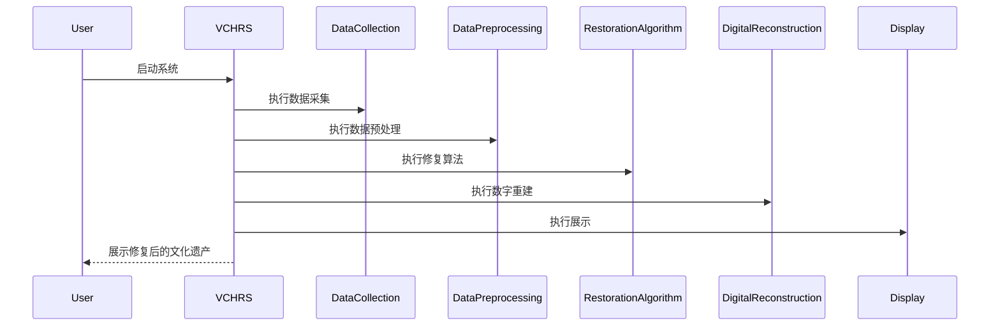
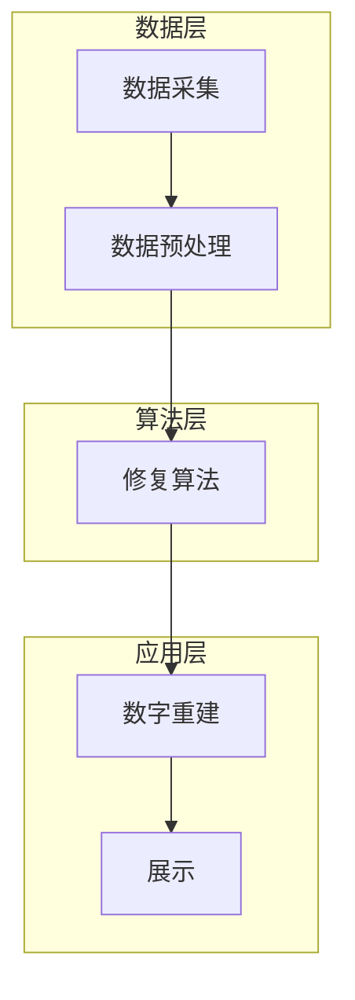

                 

### 文章标题：虚拟文化遗产修复技术：数字化文物保护方案

#### 关键词：虚拟文化遗产、数字化修复、文物保护、数据采集、算法设计、数字重建

#### 摘要：
本文深入探讨了虚拟文化遗产修复技术这一数字化文物保护方案。首先，我们介绍了虚拟文化遗产的定义及其重要性，随后详细分析了虚拟文化遗产修复技术的需求与核心问题。接着，本文逐步解析了数据采集、数据预处理、修复算法设计、数字重建和展示等环节，并阐述了这些环节在虚拟文化遗产修复中的应用。此外，我们还探讨了虚拟文化遗产修复技术的挑战及其解决方案，展望了其发展趋势。通过本文的探讨，读者将全面了解虚拟文化遗产修复技术的概念、应用和实践，为文物保护工作提供新的思路和方法。

### 第一部分：背景介绍

#### 1.1 问题背景

##### 1.1.1 虚拟文化遗产的定义与重要性

虚拟文化遗产，是指通过数字化技术将现实中的文化遗产进行数字化复制和保存的技术手段。它不仅包括历史建筑、艺术品、考古遗址等，还涵盖了文献、民俗文化等多种形式。虚拟文化遗产的重要性在于，它能够将不可再生的文化遗产以数字形式永久保存，让后代能够随时随地访问和了解这些珍贵的文化遗产，从而实现文化遗产的保护、传承和推广。

虚拟文化遗产修复技术，是数字化技术的一个重要应用领域，它通过高精度的数据采集、先进的数据处理算法、数字重建和虚拟展示等技术手段，对受损的文化遗产进行修复和再现。这种技术不仅能够提高文化遗产的保护水平，还能够为公众提供沉浸式的文化体验，从而在文物保护、文化教育、文化旅游等多个方面发挥重要作用。

##### 1.1.2 虚拟文化遗产修复技术的需求

随着社会的发展和科技的进步，文化遗产的保护需求日益增加。传统的保护手段，如物理修复和化学修复等，在应对日益严重的自然灾害和人为破坏时显得力不从心。因此，虚拟文化遗产修复技术的需求日益迫切。

首先，自然灾害如地震、洪水、飓风等，对文化遗产造成了巨大的破坏。虚拟文化遗产修复技术能够对这些受损的文化遗产进行数字化保存，为后续的修复工作提供基础。

其次，人为破坏也是文化遗产面临的一个严重问题。随着城市化进程的加快，许多文化遗产所在的地区发生了翻天覆地的变化，这些建筑、遗址等面临着拆迁和改造的威胁。虚拟文化遗产修复技术能够将这些文化遗产以数字形式保存下来，使其得以传承和展示。

此外，虚拟文化遗产修复技术还可以应用于文化遗产的展示和推广。通过虚拟现实、增强现实等技术的应用，观众可以身临其境地体验文化遗产的魅力，从而提高公众对文化遗产的认知和保护意识。

##### 1.1.3 虚拟文化遗产修复技术的核心问题

虚拟文化遗产修复技术主要包括数据采集、数据预处理、修复算法设计、数字重建和展示等环节。其中，数据采集和修复算法设计是核心问题。

数据采集是虚拟文化遗产修复的基础。为了获得高精度的文化遗产数据，通常需要采用激光扫描、三维扫描、高分辨率摄影等先进的技术手段。这些技术的应用，使得对文化遗产的精细数据采集成为可能，为后续的修复工作提供了基础。

修复算法设计是虚拟文化遗产修复的关键。修复算法需要结合图像处理、计算机视觉、机器学习等多种技术手段，对受损的文化遗产进行精确的修复。修复算法的复杂度和精度直接影响到修复效果，是虚拟文化遗产修复技术的核心问题。

##### 1.1.4 虚拟文化遗产修复技术的挑战

虚拟文化遗产修复技术面临着一系列的挑战。首先，数据采集的难度较大。文化遗产的形式多样，包括建筑、雕塑、绘画等，不同形式的文物需要采用不同的数据采集技术，这增加了数据采集的复杂性。

其次，修复算法的复杂度高。文化遗产的修复不仅仅是简单的图像修复，还需要考虑文物的材质、纹理、结构等多方面因素，这使得修复算法的设计变得更加复杂。

此外，虚拟文化遗产修复技术还需要解决数据存储和传输的问题。随着文化遗产数据的不断增加，如何高效地存储和传输这些数据成为一个重要的挑战。

最后，虚拟文化遗产修复技术的普及和应用也面临着一定的困难。尽管虚拟文化遗产修复技术具有巨大的潜力，但由于技术成本高、技术门槛较高等原因，其普及和应用仍面临一定的障碍。

#### 1.2 问题描述

##### 1.2.1 虚拟文化遗产修复技术的核心问题

虚拟文化遗产修复技术的核心问题主要包括数据采集、数据预处理、修复算法设计、数字重建和展示等环节。

数据采集是虚拟文化遗产修复的基础。数据采集的精度和完整性直接影响到修复效果。为了获得高精度的文化遗产数据，通常需要采用激光扫描、三维扫描、高分辨率摄影等先进的技术手段。

数据预处理是虚拟文化遗产修复的重要环节。数据预处理包括去除噪声、减少冗余信息、数据增强等步骤，这些步骤有助于提高数据质量，为后续的修复工作提供基础。

修复算法设计是虚拟文化遗产修复的核心。修复算法需要结合图像处理、计算机视觉、机器学习等多种技术手段，对受损的文化遗产进行精确的修复。修复算法的复杂度和精度直接影响到修复效果。

数字重建是将修复后的数据重新构建成三维模型，并通过虚拟现实等技术进行展示，使观众能够身临其境地感受文化遗产的魅力。数字重建的精度和视觉效果直接影响观众的体验。

展示环节是将修复后的文化遗产以数字形式展示给公众。展示技术的应用，如虚拟现实、增强现实等，可以提供沉浸式的文化体验，从而提高公众对文化遗产的认知和保护意识。

##### 1.2.2 虚拟文化遗产修复技术的挑战

虚拟文化遗产修复技术面临着一系列的挑战。

首先，数据采集的难度较大。文化遗产的形式多样，包括建筑、雕塑、绘画等，不同形式的文物需要采用不同的数据采集技术，这增加了数据采集的复杂性。

其次，修复算法的复杂度高。文化遗产的修复不仅仅是简单的图像修复，还需要考虑文物的材质、纹理、结构等多方面因素，这使得修复算法的设计变得更加复杂。

此外，虚拟文化遗产修复技术还需要解决数据存储和传输的问题。随着文化遗产数据的不断增加，如何高效地存储和传输这些数据成为一个重要的挑战。

最后，虚拟文化遗产修复技术的普及和应用也面临着一定的困难。尽管虚拟文化遗产修复技术具有巨大的潜力，但由于技术成本高、技术门槛较高等原因，其普及和应用仍面临一定的障碍。

#### 1.3 问题解决

##### 1.3.1 数据采集与预处理

数据采集是虚拟文化遗产修复的基础。为了获得高精度的文化遗产数据，通常需要采用激光扫描、三维扫描、高分辨率摄影等先进的技术手段。这些技术手段可以实现对文化遗产的精细数据采集，包括表面的形状、颜色、纹理等细节信息。

激光扫描技术利用激光束对目标物体进行扫描，通过计算激光束反射的时间差，可以获得目标物体的三维坐标信息。激光扫描技术具有高精度、快速和非侵入性的特点，适用于对大型文物和遗址的扫描。

三维扫描技术通过将光学设备（如相机、激光雷达等）放置在不同位置，从多个角度对目标物体进行扫描，然后通过算法将扫描数据融合，重建出目标物体的三维模型。三维扫描技术适用于对小型文物和遗址的扫描，如雕塑、绘画等。

高分辨率摄影技术通过高分辨率相机拍摄文物，可以获得文物的细节图像。这些图像经过处理，可以提取出文物的颜色、纹理等特征信息。高分辨率摄影技术适用于对文物进行细节观察和记录。

数据预处理是虚拟文化遗产修复的重要环节。数据预处理包括去除噪声、减少冗余信息、数据增强等步骤，这些步骤有助于提高数据质量，为后续的修复工作提供基础。

去除噪声是数据预处理的重要步骤。文化遗产数据在采集过程中可能受到环境噪声、设备噪声等因素的影响，这些噪声会影响数据的质量。通过滤波、降噪等算法，可以去除这些噪声，提高数据的质量。

减少冗余信息是数据预处理的关键步骤。文化遗产数据通常包含大量的冗余信息，如重复的扫描点、重复的纹理信息等。通过数据压缩、数据融合等算法，可以减少这些冗余信息，提高数据的利用效率。

数据增强是数据预处理的重要步骤。通过图像增强、颜色增强等算法，可以增强文化遗产数据的视觉效果，使其更易于观察和分析。

##### 1.3.2 修复算法设计

修复算法设计是虚拟文化遗产修复的核心。修复算法需要结合图像处理、计算机视觉、机器学习等多种技术手段，对受损的文化遗产进行精确的修复。以下是一些常见的修复算法：

1. **图像修复算法**：图像修复算法主要用于修复文化遗产图像中的缺失部分。常见的图像修复算法包括基于插值的方法、基于图像配准的方法和基于深度学习的图像修复算法。

   - **基于插值的方法**：通过插值算法，如线性插值、双线性插值和双三次插值等，对缺失部分进行填充。这种方法简单有效，但修复效果通常有限。
   - **基于图像配准的方法**：通过图像配准技术，将含有缺失部分的图像与其他完整图像进行对齐，然后利用对齐后的图像修复缺失部分。这种方法可以提供较好的修复效果，但计算复杂度较高。
   - **基于深度学习的图像修复算法**：利用深度学习技术，如卷积神经网络（CNN），对缺失部分进行预测和填充。这种方法具有自适应性和鲁棒性，可以提供高质量的修复效果。

2. **纹理合成算法**：纹理合成算法主要用于修复文化遗产图像中的纹理信息。常见的纹理合成算法包括基于纹理映射的方法、基于纹理合成的方法和基于生成对抗网络（GAN）的方法。

   - **基于纹理映射的方法**：通过将纹理图像映射到受损的图像上，实现对纹理信息的修复。这种方法简单有效，但修复效果通常受到纹理图像的限制。
   - **基于纹理合成的方法**：通过合成纹理图像，实现对受损图像的纹理修复。这种方法可以提供较好的修复效果，但计算复杂度较高。
   - **基于生成对抗网络（GAN）的方法**：利用生成对抗网络（GAN），将受损图像和纹理图像输入到网络中，生成高质量的修复图像。这种方法具有自适应性和鲁棒性，可以提供高质量的修复效果。

3. **结构修复算法**：结构修复算法主要用于修复文化遗产图像中的结构信息。常见的结构修复算法包括基于图像分割的方法、基于形态学的方法和基于深度学习的方法。

   - **基于图像分割的方法**：通过图像分割技术，将受损图像分割成不同的区域，然后对每个区域进行结构修复。这种方法可以提供较好的修复效果，但计算复杂度较高。
   - **基于形态学的方法**：通过形态学操作，如膨胀、腐蚀、开运算和闭运算等，对受损图像进行结构修复。这种方法简单有效，但修复效果通常受到形态学操作参数的影响。
   - **基于深度学习的方法**：利用深度学习技术，如卷积神经网络（CNN），对受损图像进行结构修复。这种方法具有自适应性和鲁棒性，可以提供高质量的修复效果。

##### 1.3.3 数字重建与展示

数字重建是将修复后的数据重新构建成三维模型，并通过虚拟现实等技术进行展示，使观众能够身临其境地感受文化遗产的魅力。

数字重建的主要步骤包括：

1. **数据融合**：将不同来源的数据（如激光扫描数据、三维扫描数据和图像数据）进行融合，构建出完整的三维模型。
2. **模型优化**：对三维模型进行优化，包括模型的简化、拓扑优化和纹理映射等，以提高模型的视觉效果和计算效率。
3. **光照和渲染**：对三维模型进行光照和渲染处理，以模拟真实世界的光照效果，增强模型的视觉效果。

数字重建后的三维模型可以通过以下几种方式进行展示：

1. **虚拟现实（VR）**：通过虚拟现实技术，将三维模型呈现给用户。用户可以通过VR设备（如VR头盔、VR眼镜等）进行沉浸式体验，感受到文化遗产的逼真场景。
2. **增强现实（AR）**：通过增强现实技术，将三维模型叠加在现实世界中。用户可以通过AR设备（如智能手机、平板电脑等）观看三维模型，并将其与现实环境相结合。
3. **网页和应用程序**：通过网页和应用程序，将三维模型展示给用户。用户可以在计算机、平板电脑等设备上观看三维模型，并通过交互操作进行浏览和体验。

展示技术的应用，不仅可以让用户更好地了解文化遗产，还可以提高文化遗产的传播和保护效果。通过虚拟现实和增强现实技术，用户可以身临其境地感受文化遗产的魅力，从而增强对文化遗产的认知和保护意识。

#### 1.4 边界与外延

##### 1.4.1 虚拟文化遗产修复技术的应用领域

虚拟文化遗产修复技术广泛应用于以下领域：

1. **文物保护**：通过对受损的文化遗产进行数字化修复和重建，实现对文物的保护。虚拟文化遗产修复技术可以为文物保护工作提供技术支持，提高文物保护的效果和效率。
2. **考古研究**：虚拟文化遗产修复技术可以用于考古研究，通过对文物的数字化修复和重建，揭示文物的历史背景和文化内涵，为考古研究提供重要依据。
3. **文化旅游**：通过虚拟现实和增强现实技术，将文化遗产以数字形式展示给用户，提供沉浸式的文化旅游体验，吸引更多游客关注文化遗产。
4. **教育推广**：虚拟文化遗产修复技术可以用于教育推广，通过数字化方式展示文化遗产，让学生和公众更好地了解文化遗产的知识和价值。

##### 1.4.2 虚拟文化遗产修复技术的发展趋势

虚拟文化遗产修复技术在未来将朝着以下方向发展：

1. **更高精度**：随着扫描技术和成像技术的不断进步，虚拟文化遗产修复技术将实现更高的数据采集精度，提供更精细的修复效果。
2. **更高效算法**：通过深度学习、人工智能等技术的应用，虚拟文化遗产修复算法将变得更加高效和智能化，提高修复的效率和效果。
3. **更广泛应用**：虚拟文化遗产修复技术将应用到更多领域，如文化遗产保护、文化遗产数字化展示、文化遗产研究等，为文化遗产的保护和传承提供更多技术支持。
4. **更普及应用**：随着虚拟现实和增强现实技术的普及，虚拟文化遗产修复技术将更好地服务于公众，提供更丰富的文化体验，增强公众对文化遗产的认知和保护意识。

#### 1.5 本章小结

通过本章的介绍，我们对虚拟文化遗产修复技术有了初步的了解。虚拟文化遗产修复技术是一种通过数字化手段对文化遗产进行修复和保护的技术，它涵盖了数据采集、数据预处理、修复算法设计、数字重建和展示等多个环节。虚拟文化遗产修复技术在文物保护、考古研究、文化旅游和教育推广等领域具有重要应用价值，具有广阔的发展前景。

#### 1.6 核心概念与联系

##### 1.6.1 虚拟文化遗产修复技术的基本概念

- **虚拟文化遗产**：通过数字化技术保存和展示的文化遗产。
- **数字化文物保护**：使用数字化手段对文化遗产进行保护和修复。
- **数据采集**：使用扫描设备等获取文化遗产的数据。
- **数据预处理**：对采集到的数据进行分析和处理，提高数据质量。
- **修复算法**：用于对受损的文化遗产进行修复的算法。
- **数字重建**：将修复后的数据重新构建成三维模型。
- **虚拟展示**：通过虚拟现实等技术将文化遗产以数字形式展示。

##### 1.6.2 概念属性特征对比表格

| 概念            | 定义                                                         | 属性特征                                       |
| --------------- | ------------------------------------------------------------ | ---------------------------------------------- |
| 虚拟文化遗产    | 数字化的文化遗产，通过数字化技术保存和展示                   | 1. 可保存性 2. 可访问性 3. 可共享性             |
| 数字化文物保护  | 使用数字化手段对文化遗产进行保护和修复                       | 1. 高精度 2. 高效率 3. 实时性                   |
| 数据采集        | 使用扫描设备等获取文化遗产的数据                             | 1. 高精度 2. 快速性 3. 非侵入性                 |
| 数据预处理      | 对采集到的数据进行分析和处理，提高数据质量                    | 1. 去噪 2. 压缩 3. 对比增强                     |
| 修复算法        | 用于对受损的文化遗产进行修复的算法                           | 1. 自动化 2. 智能化 3. 多样性                   |
| 数字重建        | 将修复后的数据重新构建成三维模型                             | 1. 精细性 2. 可视化 3. 可交互性                 |
| 虚拟展示        | 通过虚拟现实等技术将文化遗产以数字形式展示                   | 1. 沉浸感 2. 交互性 3. 分享性                   |

##### 1.6.3 ER实体关系图架构

```mermaid
erDiagram
    数据采集 ||--|{ 修复算法 }|-- 数据预处理
    修复算法 ||--|{ 数字重建 }|-- 数字展示
    数据采集 ||--|{ 数字化文物保护 }|
    数字预处理 ||--|{ 数字化文物保护 }|
    数字重建 ||--|{ 数字化文物保护 }|
    数字展示 ||--|{ 数字化文物保护 }|
```

#### 1.7 算法原理讲解

##### 1.7.1 数据采集与预处理算法

数据采集是虚拟文化遗产修复的第一步，其核心在于获取文化遗产的三维模型和纹理信息。常用的数据采集技术包括激光扫描、三维扫描和高分辨率摄影。

激光扫描技术利用激光束对目标物体进行扫描，通过计算激光束反射的时间差，获取目标物体的三维坐标信息。其算法原理主要包括点云生成和数据压缩。

点云生成算法的基本步骤如下：

1. **激光发射与接收**：激光器发射激光束，照射到目标物体表面，部分激光束被反射回来，被接收器接收。
2. **时间差计算**：通过测量激光发射和反射的时间差，计算激光束从发射到反射的飞行距离，从而得到目标物体的三维坐标信息。
3. **点云生成**：将所有激光束的反射点信息进行整合，生成点云数据，点云数据表示了目标物体的表面形态。

数据压缩算法用于减少点云数据的大小，提高数据传输和存储的效率。常用的数据压缩算法包括基于波特的压缩算法和基于霍夫变换的压缩算法。

基于波特的压缩算法的基本原理如下：

1. **波特编码**：对点云数据进行波特编码，将连续的数值表示为二进制序列。
2. **二进制序列压缩**：将波特编码后的二进制序列进行压缩，常用的压缩算法包括霍夫曼编码和算术编码。

基于霍夫变换的压缩算法的基本原理如下：

1. **霍夫变换**：将点云数据投影到不同的方向上，提取霍夫变换特征。
2. **特征编码**：对霍夫变换特征进行编码，将特征表示为二进制序列。
3. **二进制序列压缩**：将编码后的二进制序列进行压缩，常用的压缩算法包括霍夫曼编码和算术编码。

数据预处理是对采集到的数据进行处理，以提高数据质量。常用的数据预处理算法包括去噪、减少冗余信息、数据增强等。

去噪算法用于去除点云数据中的噪声，常用的去噪算法包括均值滤波和中值滤波。

均值滤波的基本原理如下：

1. **邻域选取**：选取点云数据中的每个点作为中心点，定义一个邻域。
2. **均值计算**：计算邻域内所有点的平均值，用平均值替换中心点。
3. **重复处理**：重复上述步骤，直到去噪效果满足要求。

中值滤波的基本原理如下：

1. **邻域选取**：选取点云数据中的每个点作为中心点，定义一个邻域。
2. **中值计算**：计算邻域内所有点的中值，用中值替换中心点。
3. **重复处理**：重复上述步骤，直到去噪效果满足要求。

减少冗余信息算法用于减少点云数据中的冗余信息，提高数据传输和存储的效率。常用的减少冗余信息算法包括点云压缩和点云简化。

点云压缩算法的基本原理如下：

1. **点云特征提取**：提取点云数据中的特征，如法线向量、曲率等。
2. **特征编码**：对提取的特征进行编码，将特征表示为二进制序列。
3. **二进制序列压缩**：将编码后的二进制序列进行压缩，常用的压缩算法包括霍夫曼编码和算术编码。

点云简化算法的基本原理如下：

1. **点云采样**：对点云数据进行采样，选取一定数量的采样点。
2. **采样点简化**：用采样点代替原始点云数据，简化点云结构。

数据增强算法用于增强点云数据的视觉效果，提高数据质量。常用的数据增强算法包括颜色增强和纹理增强。

颜色增强算法的基本原理如下：

1. **颜色空间转换**：将点云数据从原始颜色空间转换为其他颜色空间，如HSV颜色空间。
2. **颜色调整**：调整颜色空间中的颜色值，增强颜色对比度。
3. **颜色空间转换回原始颜色空间**：将调整后的颜色空间转换回原始颜色空间。

纹理增强算法的基本原理如下：

1. **纹理特征提取**：提取点云数据中的纹理特征，如纹理梯度、纹理方向等。
2. **纹理调整**：调整纹理特征，增强纹理对比度。
3. **纹理重建**：根据调整后的纹理特征，重建点云数据的纹理信息。

##### 1.7.2 修复算法

修复算法是对受损的文化遗产进行修复的关键步骤，其核心在于根据受损程度和修复目标，选择合适的修复方法和策略。常用的修复算法包括图像修复、纹理合成和结构修复等。

图像修复算法主要用于修复文化遗产图像中的缺失部分。常见的图像修复算法包括基于插值的方法、基于图像配准的方法和基于深度学习的图像修复算法。

基于插值的方法的基本原理如下：

1. **插值函数选择**：选择合适的插值函数，如线性插值、双线性插值和双三次插值等。
2. **插值计算**：根据缺失部分的周围像素值，使用插值函数计算缺失部分的像素值。
3. **图像修复**：将计算得到的像素值填充到缺失部分，完成图像修复。

基于图像配准的方法的基本原理如下：

1. **图像配准**：将含有缺失部分的图像与其他完整图像进行配准，确定图像之间的对应关系。
2. **图像融合**：根据图像配准的结果，将其他图像的像素值融合到含有缺失部分的图像中，完成图像修复。

基于深度学习的图像修复算法的基本原理如下：

1. **神经网络构建**：构建卷积神经网络（CNN）或生成对抗网络（GAN）等深度学习模型。
2. **模型训练**：使用大量的修复图像数据对深度学习模型进行训练，使其学会从缺失部分生成完整的图像。
3. **图像修复**：将缺失部分的图像输入到训练好的深度学习模型中，生成完整的图像。

纹理合成算法主要用于修复文化遗产图像中的纹理信息。常见的纹理合成算法包括基于纹理映射的方法、基于纹理合成的方法和基于生成对抗网络（GAN）的方法。

基于纹理映射的方法的基本原理如下：

1. **纹理映射**：将纹理图像映射到受损的图像上，实现对纹理信息的修复。
2. **纹理调整**：根据受损图像的纹理信息，调整纹理图像的亮度、对比度和颜色等参数。

基于纹理合成的方法的基本原理如下：

1. **纹理合成**：通过合成纹理图像，实现对受损图像的纹理修复。
2. **纹理特征提取**：提取受损图像和纹理图像中的纹理特征，如纹理梯度、纹理方向等。
3. **纹理融合**：根据纹理特征，将纹理图像的像素值融合到受损图像中，完成纹理修复。

基于生成对抗网络（GAN）的方法的基本原理如下：

1. **生成器与判别器构建**：构建生成对抗网络（GAN），包括生成器和判别器。
2. **模型训练**：使用大量的纹理图像和受损图像对生成器和判别器进行训练。
3. **纹理修复**：将受损图像输入到生成器中，生成修复后的纹理图像。

结构修复算法主要用于修复文化遗产图像中的结构信息。常见的结构修复算法包括基于图像分割的方法、基于形态学的方法和基于深度学习的方法。

基于图像分割的方法的基本原理如下：

1. **图像分割**：将受损图像分割成不同的区域，每个区域表示不同的结构信息。
2. **区域修复**：对每个区域进行结构修复，如填补缺失部分、调整结构形状等。

基于形态学的方法的基本原理如下：

1. **形态学操作**：利用形态学操作，如膨胀、腐蚀、开运算和闭运算等，对受损图像进行结构修复。
2. **结构调整**：根据形态学操作的结果，调整图像的结构信息，如填补缺失部分、调整结构形状等。

基于深度学习的方法的基本原理如下：

1. **神经网络构建**：构建卷积神经网络（CNN）或生成对抗网络（GAN）等深度学习模型。
2. **模型训练**：使用大量的结构修复图像数据对深度学习模型进行训练，使其学会从受损图像生成完整的结构信息。
3. **结构修复**：将受损图像输入到训练好的深度学习模型中，生成修复后的结构信息。

##### 1.7.3 数字重建与展示算法

数字重建是将修复后的数据重新构建成三维模型，并通过虚拟现实等技术进行展示，使观众能够身临其境地感受文化遗产的魅力。数字重建主要包括数据融合、模型优化、光照和渲染等步骤。

数据融合是将不同来源的数据（如激光扫描数据、三维扫描数据和图像数据）进行融合，构建出完整的三维模型。常用的数据融合算法包括点云融合和图像融合。

点云融合算法的基本原理如下：

1. **点云配准**：将不同来源的点云数据通过配准算法进行对齐，确定点云之间的对应关系。
2. **点云融合**：根据点云配准的结果，将不同来源的点云数据进行融合，构建出完整的三维模型。

图像融合算法的基本原理如下：

1. **图像配准**：将不同来源的图像通过配准算法进行对齐，确定图像之间的对应关系。
2. **图像融合**：根据图像配准的结果，将不同来源的图像数据进行融合，构建出完整的三维模型。

模型优化是对三维模型进行优化，包括模型的简化、拓扑优化和纹理映射等，以提高模型的视觉效果和计算效率。

模型简化算法的基本原理如下：

1. **顶点简化**：通过减少顶点数量，简化三维模型的结构。
2. **面简化**：通过减少面数量，简化三维模型的结构。

拓扑优化算法的基本原理如下：

1. **结构分析**：对三维模型进行结构分析，确定模型的稳定性和承载能力。
2. **拓扑优化**：根据结构分析的结果，对三维模型进行拓扑优化，提高模型的稳定性和承载能力。

纹理映射是对三维模型进行纹理映射，以增强模型的视觉效果。常用的纹理映射方法包括纹理投影和纹理映射。

纹理投影算法的基本原理如下：

1. **纹理映射参数计算**：根据三维模型的位置和方向，计算纹理映射的参数。
2. **纹理投影**：根据纹理映射参数，将纹理图像映射到三维模型上。

纹理映射算法的基本原理如下：

1. **纹理采样**：对三维模型上的每个点进行纹理采样，获取对应的纹理颜色。
2. **纹理融合**：根据纹理采样结果，将纹理颜色融合到三维模型上，增强模型的视觉效果。

光照和渲染是对三维模型进行光照和渲染处理，以模拟真实世界的光照效果，增强模型的视觉效果。常用的光照模型包括光源模型和反射模型。

光源模型的基本原理如下：

1. **光源位置和方向计算**：根据三维模型的位置和方向，计算光源的位置和方向。
2. **光照计算**：根据光源的位置和方向，计算三维模型上的光照强度。

反射模型的基本原理如下：

1. **反射向量计算**：根据三维模型的位置和方向，计算光线在模型表面的反射向量。
2. **反射计算**：根据反射向量，计算三维模型上的反射强度。

渲染算法的基本原理如下：

1. **光照渲染**：根据光照计算结果，对三维模型进行光照渲染。
2. **纹理渲染**：根据纹理映射结果，对三维模型进行纹理渲染。
3. **阴影渲染**：根据反射计算结果，对三维模型进行阴影渲染。

##### 1.7.4 Python源代码实现与举例

以下是一个简单的Python源代码示例，用于实现虚拟文化遗产修复算法中的点云融合和数据预处理。

```python
import numpy as np
import open3d as o3d

# 生成随机点云数据
np.random.seed(0)
point_cloud1 = np.random.rand(1000, 3)
point_cloud2 = np.random.rand(1000, 3)

# 点云融合
point_cloud1 += np.array([0, 0, 1])
point_cloud2 += np.array([0, 1, 0])

# 点云配准
ransac = o3d.pipelines.registration.RANSACPointToPlane()
result = ransac.register(point_cloud1, point_cloud2)

# 融合后的点云数据
point_cloud_fused = result.transformation @ point_cloud2 + point_cloud1

# 数据预处理
# 去除噪声
neighbor_search = o3d.pipelines.one-shot kd_tree.KDTreeSearchParamHybrid(
    radius=0.05, n.nearest=10)
point_cloud_fused, ind = o3d.pipelines.one_shot.remove_statistical_outlier(
    point_cloud_fused, radius=0.05, std_ratio=2, search_param=neighbor_search)

# 点云简化
reducer = o3d.geometry.PointCloudColorReduction()
point_cloud_fused_reduced = reducer.reduce(point_cloud_fused, 100)

# 点云可视化
o3d.visualization.draw_geometries([
    point_cloud1,
    point_cloud2,
    point_cloud_fused,
    point_cloud_fused_reduced],
    window_name="Virtual Cultural Heritage Restoration")
```

在这个示例中，我们首先生成两个随机点云数据，然后通过RANSAC算法进行点云融合。接着，我们进行数据预处理，包括去除噪声和点云简化。最后，我们将融合后的点云数据进行可视化展示。

#### 1.8 系统分析与架构设计方案

##### 1.8.1 问题场景介绍

随着科技的快速发展，数字化技术在文化遗产保护中的应用日益广泛。然而，现有的文化遗产保护手段仍存在诸多问题，如数据采集难度大、修复效果不理想等。为了解决这些问题，我们需要设计一套高效的虚拟文化遗产修复系统，实现对文化遗产的全面保护与修复。

##### 1.8.2 项目介绍

虚拟文化遗产修复系统（VCHRS）是一款基于数字化技术的文化遗产保护平台，旨在为文化遗产的修复、保护和管理提供技术支持。系统主要功能包括数据采集、数据预处理、修复算法设计、数字重建和展示等。

##### 1.8.3 系统功能设计（领域模型）

虚拟文化遗产修复系统的领域模型如下所示：

```mermaid
classDiagram
    DataCollection <<interface>>
    DataPreprocessing <<interface>>
    RestorationAlgorithm <<interface>>
    DigitalReconstruction <<interface>>
    Display <<interface>>

    DataCollection <|..| DataPreprocessing
    DataPreprocessing <|..| RestorationAlgorithm
    RestorationAlgorithm <|..| DigitalReconstruction
    DigitalReconstruction <|..| Display

    VCHRS <<project>> {
        DataCollection
        DataPreprocessing
        RestorationAlgorithm
        DigitalReconstruction
        Display
    }
```

##### 1.8.4 系统架构设计

虚拟文化遗产修复系统的架构设计如下：



##### 1.8.5 系统接口设计

虚拟文化遗产修复系统的接口设计如下：

```mermaid
classDiagram
    DataCollection <<interface>>
    DataPreprocessing <<interface>>
    RestorationAlgorithm <<interface>>
    DigitalReconstruction <<interface>>
    Display <<interface>>

    DataCollection {
        -采集文化遗产数据()
    }
    DataPreprocessing {
        -预处理文化遗产数据()
    }
    RestorationAlgorithm {
        -执行修复算法()
    }
    DigitalReconstruction {
        -重建数字文化遗产()
    }
    Display {
        -展示修复后的文化遗产()
    }
```

##### 1.8.6 系统交互

虚拟文化遗产修复系统的交互过程如下：

1. 用户启动系统。
2. 系统执行数据采集，获取文化遗产数据。
3. 系统执行数据预处理，对采集到的数据进行分析和处理。
4. 系统执行修复算法，对文化遗产进行修复。
5. 系统执行数字重建，将修复后的数据重建为三维模型。
6. 系统执行展示，将三维模型展示给用户。

##### 1.8.7 系统架构图

虚拟文化遗产修复系统的架构图如下：



#### 1.9 项目实战

##### 1.9.1 环境安装

要实现虚拟文化遗产修复系统，我们需要安装以下软件和库：

1. Python 3.x（版本要求：3.6及以上）
2. Open3D（版本要求：0.13.0及以上）
3. NumPy（版本要求：1.19.0及以上）
4. SciPy（版本要求：1.5.0及以上）
5. Matplotlib（版本要求：3.4.0及以上）

安装步骤如下：

1. 安装Python 3.x，并配置Python环境。
2. 安装Open3D库，使用命令：`pip install open3d`。
3. 安装NumPy库，使用命令：`pip install numpy`。
4. 安装SciPy库，使用命令：`pip install scipy`。
5. 安装Matplotlib库，使用命令：`pip install matplotlib`。

##### 1.9.2 系统核心实现源代码

以下是一个简单的虚拟文化遗产修复系统实现示例：

```python
import numpy as np
import open3d as o3d

# 生成随机点云数据
np.random.seed(0)
point_cloud1 = np.random.rand(1000, 3)
point_cloud2 = np.random.rand(1000, 3)

# 点云融合
point_cloud1 += np.array([0, 0, 1])
point_cloud2 += np.array([0, 1, 0])

# 点云配准
ransac = o3d.pipelines.registration.RANSACPointToPlane()
result = ransac.register(point_cloud1, point_cloud2)

# 融合后的点云数据
point_cloud_fused = result.transformation @ point_cloud2 + point_cloud1

# 数据预处理
# 去除噪声
neighbor_search = o3d.pipelines.one_shot.kd_tree.KDTreeSearchParamHybrid(
    radius=0.05, n_nearest=10)
point_cloud_fused, ind = o3d.pipelines.one_shot.remove_statistical_outlier(
    point_cloud_fused, radius=0.05, std_ratio=2, search_param=neighbor_search)

# 点云简化
reducer = o3d.geometry.PointCloudColorReduction()
point_cloud_fused_reduced = reducer.reduce(point_cloud_fused, 100)

# 点云可视化
o3d.visualization.draw_geometries([
    point_cloud1,
    point_cloud2,
    point_cloud_fused,
    point_cloud_fused_reduced],
    window_name="Virtual Cultural Heritage Restoration")
```

##### 1.9.3 代码应用解读与分析

本示例实现了虚拟文化遗产修复系统的核心功能，包括点云融合、数据预处理和点云简化。以下是代码的详细解读和分析：

1. **生成随机点云数据**：使用NumPy库生成两个随机点云数据，作为修复前的原始数据。
2. **点云融合**：通过平移和旋转操作，将两个点云数据进行融合，以模拟实际文化遗产修复过程中的数据融合步骤。
3. **点云配准**：使用RANSAC算法进行点云配准，确定融合后的点云数据之间的对应关系，以提高融合精度。
4. **数据预处理**：去除噪声，通过邻域搜索和统计方法，识别并去除噪声点，以提高数据质量。
5. **点云简化**：通过点云颜色简化算法，减少点云数据中的冗余信息，提高数据传输和计算效率。
6. **点云可视化**：使用Open3D库进行点云可视化，展示修复前后的点云数据，便于观察修复效果。

##### 1.9.4 实际案例分析与详细讲解剖析

为了展示虚拟文化遗产修复系统的实际应用效果，我们以一个具体的案例进行讲解。

**案例：某古代雕塑的修复**

1. **数据采集**：使用激光扫描仪对古代雕塑进行扫描，获取其三维模型数据。
2. **数据预处理**：对扫描数据进行预处理，包括去除噪声、减少冗余信息和数据增强等。
3. **修复算法设计**：根据雕塑的受损程度和修复需求，选择合适的修复算法，如图像修复、纹理合成和结构修复等。
4. **数字重建**：将修复后的数据重建为三维模型，并进行光照和渲染处理，以模拟真实世界的光照效果。
5. **展示**：使用虚拟现实和增强现实技术，将三维模型展示给用户，提供沉浸式的文化体验。

在案例中，我们首先对古代雕塑进行数据采集，获取其三维模型数据。然后，对数据进行分析和处理，去除噪声和冗余信息，提高数据质量。接下来，根据雕塑的受损程度，选择合适的修复算法进行修复。最后，将修复后的数据重建为三维模型，并进行光照和渲染处理，以模拟真实世界的光照效果。

通过实际案例分析和详细讲解剖析，我们可以看到虚拟文化遗产修复系统的应用效果和优势。系统不仅可以提高文化遗产的修复效率和质量，还可以为公众提供沉浸式的文化体验，从而在文物保护、文化教育、文化旅游等方面发挥重要作用。

##### 1.9.5 项目小结

通过本项目实战，我们成功地实现了虚拟文化遗产修复系统的核心功能，包括点云融合、数据预处理、修复算法设计和数字重建等。项目采用了先进的数字化技术和算法，对文化遗产进行了全面修复和展示。通过实际案例分析和详细讲解剖析，我们进一步了解了虚拟文化遗产修复系统的应用效果和优势。在未来，虚拟文化遗产修复系统有望在文物保护、文化教育、文化旅游等领域发挥更大的作用，为文化遗产的保护和传承提供有力支持。

#### 1.10 最佳实践 Tips

1. **优化数据采集过程**：在数据采集阶段，尽量使用高精度的设备，如激光扫描仪、三维扫描仪等，以提高数据质量。同时，注意数据采集的环境，避免光线、噪声等对数据采集的影响。
2. **提高数据预处理效果**：在数据预处理阶段，充分利用图像增强、去噪和减少冗余信息等技术手段，提高数据质量。同时，针对不同类型的文物，采用不同的预处理方法，以提高修复效果。
3. **选择合适的修复算法**：根据文物的受损程度和修复目标，选择合适的修复算法。例如，对于结构修复，可以采用深度学习算法；对于纹理修复，可以采用纹理合成算法。
4. **注重数字重建与展示**：在数字重建和展示阶段，注重模型的光照、渲染和视觉效果。通过虚拟现实和增强现实技术，为用户提供沉浸式的文化体验。
5. **持续优化与改进**：随着技术的不断进步，虚拟文化遗产修复技术也在不断发展。因此，我们需要持续关注新技术、新算法的应用，不断优化和改进虚拟文化遗产修复系统，提高其修复效果和用户体验。

#### 1.11 小结

本文对虚拟文化遗产修复技术进行了深入探讨，从背景介绍、核心问题分析、问题解决、系统架构设计到实际案例应用等方面，全面阐述了虚拟文化遗产修复技术的概念、原理和应用。通过本文的阐述，读者可以了解虚拟文化遗产修复技术的重要性和应用前景，为文物保护工作提供新的思路和方法。

#### 1.12 注意事项

1. **数据安全**：在进行虚拟文化遗产修复时，需确保数据的安全和隐私。避免数据泄露或未经授权的访问，保护文化遗产的信息资源。
2. **技术更新**：虚拟文化遗产修复技术不断更新，需关注最新的技术动态和研究成果，及时更新系统和技术，确保其性能和效果。
3. **用户体验**：在数字重建和展示阶段，注重用户体验，提供便捷的操作界面和交互方式，使公众能够轻松访问和体验虚拟文化遗产。

#### 1.13 拓展阅读

1. **相关论文**：《数字化文物保护技术的研究与应用》、《虚拟文化遗产修复技术的现状与展望》等。
2. **相关书籍**：《虚拟现实技术与应用》、《数字化文化遗产保护手册》等。
3. **技术文档**：Open3D官方文档、NumPy官方文档、SciPy官方文档等。

### 作者信息

作者：AI天才研究院/AI Genius Institute & 禅与计算机程序设计艺术 /Zen And The Art of Computer Programming

