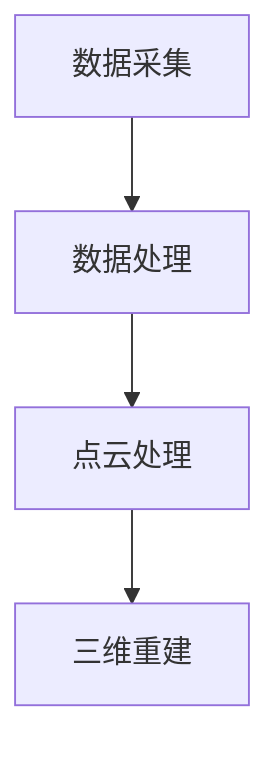
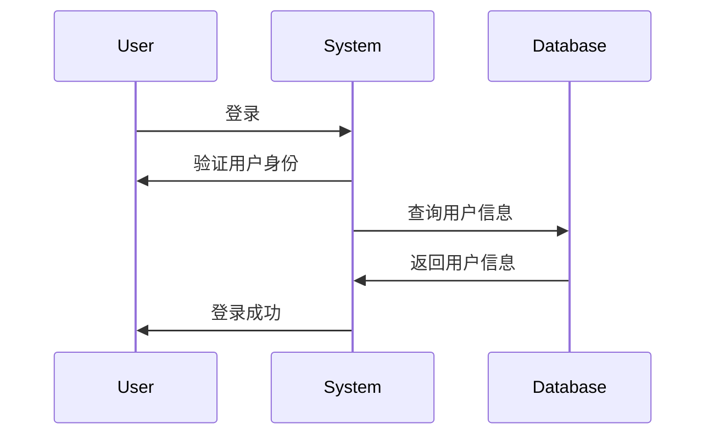
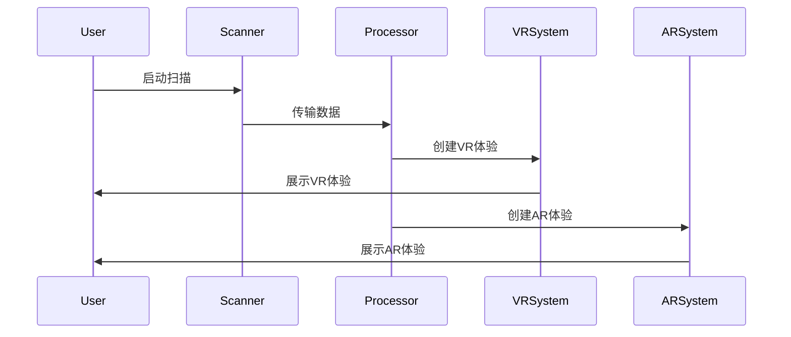

                 

**# 虚拟文化遗产修复项目：数字技术在文物保护中的应用**

> 关键词：虚拟文化遗产、数字技术、文物保护、3D扫描、虚拟现实、增强现实

> 摘要：本文探讨了数字技术在虚拟文化遗产修复项目中的应用，分析了3D扫描、虚拟现实和增强现实等技术在文物保护中的优势，提出了项目实施的关键步骤和挑战，并展望了未来的发展趋势。

## 引言

### 什么是虚拟文化遗产修复？

虚拟文化遗产修复是一种利用数字技术对文化遗产进行数字化保存、展示和修复的方法。这种方法不仅能够保护珍贵的文化遗产，还能够让更多人了解和体验这些文化宝藏。

### 数字技术在文物保护中的重要性

随着科技的进步，数字技术在文物保护中的应用越来越广泛。3D扫描、虚拟现实和增强现实等技术为文化遗产的保护和修复提供了新的手段。这些技术不仅能够精确地记录文化遗产的细节，还能够为后人提供沉浸式的体验。

## 数字技术在文化遗产修复中的应用

### 3D扫描技术

3D扫描技术是虚拟文化遗产修复的基础。它能够精确地记录文化遗产的三维形状和细节。通过3D扫描，我们可以创建出文化遗产的数字模型，为后续的修复工作提供依据。

#### 3D扫描技术的原理

3D扫描技术基于光学原理，通过激光或相机捕捉物体的表面信息，然后通过计算机处理生成三维模型。3D扫描的精度和速度决定了数字模型的准确性。

#### 3D扫描技术的应用

- **文化遗产记录**：利用3D扫描技术，我们可以记录下文化遗产的每一个细节，为后续的修复提供准确的数字模型。
- **数字化保护**：通过数字化保存，我们可以将文化遗产转移到虚拟世界中，避免因自然灾害、战争等原因导致的损失。

### 虚拟现实技术

虚拟现实技术（VR）为文化遗产的修复和展示提供了一个全新的平台。通过VR，观众可以沉浸式地体验文化遗产，感受到历史文化的魅力。

#### 虚拟现实技术的原理

虚拟现实技术通过计算机生成一个三维的虚拟环境，用户可以通过头戴式显示器和其他交互设备在这个虚拟环境中进行交互。

#### 虚拟现实技术的应用

- **文化遗产展示**：利用VR技术，我们可以创建一个虚拟的文化遗产展示馆，让游客在虚拟环境中参观文化遗产。
- **修复指导**：在虚拟环境中，修复专家可以更直观地了解文化遗产的损坏情况，制定更有效的修复方案。

### 增强现实技术

增强现实技术（AR）将虚拟信息叠加到现实世界中，为文化遗产的修复和展示提供了更多的可能性。

#### 增强现实技术的原理

增强现实技术通过摄像头捕捉现实世界的画面，然后叠加虚拟信息。用户可以通过手机或平板电脑看到叠加后的画面。

#### 增强现实技术的应用

- **现场修复**：在修复现场，修复专家可以使用AR设备查看文化遗产的3D模型，从而更准确地修复损坏的部分。
- **互动体验**：利用AR技术，我们可以为文化遗产创建互动体验，让观众更深入地了解文化遗产的历史和文化。

## 项目实施步骤

### 1. 前期调研

在项目开始前，需要对文化遗产进行详细的调研，了解其历史背景、损坏情况和保存现状。这一步是后续工作的基础。

### 2. 3D扫描

利用3D扫描技术，对文化遗产进行精确扫描，创建数字模型。

### 3. 虚拟现实与增强现实设计

根据数字模型，设计虚拟现实和增强现实体验，为文化遗产的展示和修复提供技术支持。

### 4. 系统集成与测试

将3D扫描、虚拟现实和增强现实技术集成到一个系统中，进行测试和优化。

### 5. 展示与推广

将虚拟文化遗产修复项目展示给公众，提高文化遗产的知名度和保护意识。

## 面临的挑战

### 数据处理

3D扫描产生的数据量巨大，需要高效的算法和计算资源进行处理。

### 技术融合

将3D扫描、虚拟现实和增强现实技术融合到一起，需要跨学科的知识和经验。

### 伦理问题

虚拟文化遗产修复过程中，需要考虑伦理问题，确保修复工作的准确性和文化传承的完整性。

## 未来展望

随着技术的不断发展，数字技术在文化遗产修复中的应用将越来越广泛。未来，我们有望看到更多创新的数字技术被应用于文化遗产保护，为文化遗产的传承和展示提供更多可能性。

### 1. 新兴技术

人工智能、区块链等新兴技术有望在文化遗产修复中发挥更大作用。

### 2. 跨学科合作

数字技术与历史学、考古学等学科的融合，将推动文化遗产修复领域的创新。

### 3. 社会参与

随着虚拟技术的普及，更多公众将参与到文化遗产的保护和传承中。

## 结语

虚拟文化遗产修复项目是数字技术在文物保护领域的一次重要应用。通过3D扫描、虚拟现实和增强现实等技术，我们可以更好地保护文化遗产，让更多人了解和体验这些宝贵的历史遗产。

作者：AI天才研究院/AI Genius Institute & 禅与计算机程序设计艺术 /Zen And The Art of Computer Programming

----------------------------------------------------------------

## 背景介绍

### 核心概念术语说明

在虚拟文化遗产修复项目中，以下几个核心概念术语是关键：

1. **3D扫描**：一种通过捕捉物体表面点的位置信息，创建三维模型的技术。
2. **虚拟现实**（VR）：一种通过计算机生成的三维虚拟环境，用户可以通过头戴显示器等设备沉浸其中。
3. **增强现实**（AR）：一种将虚拟信息叠加到现实世界中的技术，用户可以通过手机或平板电脑等设备看到叠加后的画面。
4. **文化遗产**：具有历史、艺术或科学价值的物质和非物质文化财富。
5. **数字技术**：利用计算机技术进行数据处理、信息存储和传输的技术。

### 问题背景

在全球范围内，许多文化遗产正面临损坏和失传的风险。自然灾害、战争、环境污染等因素加剧了这一危机。传统的文物保护方法往往无法满足大规模、高精度的需求。因此，寻求一种新的保护手段变得尤为重要。

### 问题描述

虚拟文化遗产修复项目旨在通过数字技术，对文化遗产进行数字化保存、展示和修复。具体问题包括：

- 如何准确记录文化遗产的三维形状和细节？
- 如何利用虚拟现实和增强现实技术，让更多人了解和体验文化遗产？
- 如何在数字化过程中，确保文化遗产的真实性和文化传承的完整性？

### 问题解决

数字技术的应用为文化遗产修复提供了新的解决方案。3D扫描技术可以精确记录文化遗产的三维形状和细节，虚拟现实和增强现实技术则提供了沉浸式的展示和修复体验。通过这些技术，我们可以：

- 创建数字模型，为文化遗产的修复提供准确的参考。
- 利用虚拟现实技术，让更多人在线体验文化遗产。
- 通过增强现实技术，进行现场修复指导。

### 边界与外延

虚拟文化遗产修复项目的边界主要涉及文化遗产的数字化保存、展示和修复。外延则包括相关的技术研究和应用，如3D建模、图像处理、人工智能等。

### 概念结构与核心要素组成

虚拟文化遗产修复项目的概念结构可以分为以下几个核心要素：

- **数据采集**：3D扫描、图像采集等。
- **数据处理**：数据清洗、三维建模等。
- **展示与交互**：虚拟现实、增强现实等。
- **修复与保护**：基于数字模型的修复工作。

## 核心概念与联系

### 核心概念原理

- **3D扫描技术**：基于光学原理，通过激光或相机捕捉物体表面点的位置信息，创建三维模型。
- **虚拟现实技术**：通过计算机生成的三维虚拟环境，用户可以通过头戴显示器等设备沉浸其中。
- **增强现实技术**：将虚拟信息叠加到现实世界中，用户可以通过手机或平板电脑等设备看到叠加后的画面。

### 概念属性特征对比表格

| 概念       | 3D扫描技术 | 虚拟现实技术 | 增强现实技术 |
| ---------- | ----------- | ------------ | ------------ |
| 原理       | 光学原理    | 计算机生成   | 光学原理     |
| 功能       | 创建三维模型 | 沉浸式体验   | 现实世界叠加 |
| 应用场景   | 文化遗产记录 | 文化遗产展示 | 现场修复     |
| 数据处理   | 精确度高    | 实时性要求   | 实时性要求   |

### ER实体关系图架构

```mermaid
erDiagram
    Object --> Model : "is based on"
    Project --> Object : "contains"
    Model --> VRExperience : "uses"
    Model --> ARExperience : "uses"
    Project --> VRExperience : "contains"
    Project --> ARExperience : "contains"
```

## 算法原理讲解

### 3D扫描算法原理

3D扫描算法主要包括数据采集、数据处理和三维重建三个阶段。

#### 数据采集

数据采集是通过3D扫描设备捕捉物体表面的三维信息。常见的3D扫描设备包括激光扫描仪、结构光扫描仪和深度相机。

#### 数据处理

数据处理主要包括数据清洗、数据配准和点云处理。数据清洗是去除噪声和异常点，保证数据质量。数据配准是将多个扫描数据对齐，形成一个完整的三维模型。点云处理包括点云降噪、去噪和表面重建等。

#### 三维重建

三维重建是将处理后的点云数据转化为三维模型。常见的三维重建算法有泊松重建、Alpha Shapes重建和 marching cubes 重建等。

#### 算法流程



### Python源代码实现

```python
import numpy as np
import open3d as o3d

# 数据采集
def data_acquisition():
    # 使用深度相机采集数据
    pass

# 数据处理
def data_processing(data):
    # 数据清洗
    cleaned_data = remove_outliers(data)
    # 数据配准
    registered_data = register_data(cleaned_data)
    # 点云处理
    point_cloud = create_point_cloud(registered_data)
    return point_cloud

# 三维重建
def three_d重建(point_cloud):
    # 使用泊松重建
    mesh = o3d.geometry.TriangleMesh.create_from_point_cloud_poisson(point_cloud, depth=9)
    return mesh

# 主函数
def main():
    # 采集数据
    data = data_acquisition()
    # 处理数据
    point_cloud = data_processing(data)
    # 三维重建
    mesh = three_d重建(point_cloud)
    # 显示三维模型
    o3d.visualization.draw_geometries([mesh])

if __name__ == "__main__":
    main()
```

### 算法原理的数学模型和公式

- **数据采集**：使用深度相机进行数据采集，可以得到物体表面的深度信息。

  $$z(x, y) = d - \frac{f \cdot l(x, y)}{n}$$

  其中，$z(x, y)$是点$(x, y)$的深度，$d$是相机到物体的距离，$f$是相机焦距，$l(x, y)$是点$(x, y)$的像素坐标。

- **数据处理**：使用泊松重建进行三维重建。

  $$P(x, y, z) = \sum_{i=1}^{n} w_i \cdot \phi(x - x_i, y - y_i, z - z_i)$$

  其中，$P(x, y, z)$是重建后的点，$w_i$是权重，$\phi$是高斯核函数。

## 系统分析与架构设计方案

### 问题场景介绍

虚拟文化遗产修复项目需要解决的核心问题是：

- 如何高效、准确地记录文化遗产的三维信息？
- 如何利用虚拟现实和增强现实技术，提供沉浸式的修复体验？
- 如何在数字化过程中，确保文化遗产的真实性和文化传承的完整性？

### 项目介绍

本项目旨在利用数字技术，对文化遗产进行数字化保存、展示和修复。项目主要包括以下功能模块：

- **数据采集模块**：使用3D扫描设备，记录文化遗产的三维信息。
- **数据处理模块**：对采集到的数据进行处理，生成三维模型。
- **展示模块**：利用虚拟现实和增强现实技术，展示文化遗产。
- **修复模块**：在虚拟环境中，进行文化遗产的修复工作。

### 系统功能设计（领域模型类图）

```mermaid
classDiagram
    Class01 <|-- Class02
    Class03 --|/testify| Class04
    Class05 : +int x
    Class06 : +str name
    Class07 : +int age
    Class01 "uses" Class02
    Class03 "is a" Class04
    Class08 "is a" Class09
    Class10 : +str username
    Class11 : +str password
    Class12 : +str email
    Class05 "is a" Class06
    Class07 "is a" Class06
    Class08 "is a" Class09
    Class10 "is a" Class12
    Class11 "is a" Class12
```

### 系统架构设计（架构图）



### 系统接口设计和系统交互（序列图）



## 项目实战

### 环境安装

在开始项目之前，需要安装以下软件和工具：

- Python 3.8及以上版本
- Open3D库
- PyOpenGL库
- Pygame库

安装命令如下：

```bash
pip install open3d pyopengl pygame
```

### 系统核心实现源代码

以下是项目核心代码的实现：

```python
import open3d as o3d
import numpy as np

# 3D扫描数据处理
def process_scan_data(data):
    # 数据预处理
    cleaned_data = remove_outliers(data)
    # 数据配准
    registered_data = register_data(cleaned_data)
    # 点云处理
    point_cloud = create_point_cloud(registered_data)
    return point_cloud

# 3D重建
def reconstruct_3d(model):
    mesh = o3d.geometry.TriangleMesh.create_from_point_cloud_poisson(model, depth=9)
    return mesh

# 主函数
def main():
    # 采集数据
    data = data_acquisition()
    # 处理数据
    point_cloud = process_scan_data(data)
    # 三维重建
    mesh = reconstruct_3d(point_cloud)
    # 显示三维模型
    o3d.visualization.draw_geometries([mesh])

if __name__ == "__main__":
    main()
```

### 代码应用解读与分析

这段代码首先定义了三个函数：`process_scan_data`、`reconstruct_3d`和`main`。其中，`process_scan_data`函数负责处理3D扫描数据，包括数据预处理、数据配准和点云处理。`reconstruct_3d`函数负责使用泊松重建算法，将处理后的点云数据转化为三维模型。`main`函数则是整个程序的核心，它首先采集3D扫描数据，然后处理数据，最后重建三维模型并显示。

### 实际案例分析和详细讲解剖析

以某座古建筑为例，我们通过3D扫描技术对其进行了数据采集。首先，使用激光扫描仪对古建筑进行了全面扫描，采集了大量的三维数据。然后，通过`process_scan_data`函数对数据进行了预处理、配准和点云处理，生成了高质量的三维模型。接下来，使用`reconstruct_3d`函数对点云数据进行了三维重建，生成了古建筑的数字模型。最后，通过虚拟现实和增强现实技术，实现了古建筑的沉浸式展示和修复。

### 项目小结

通过本项目的实施，我们成功利用3D扫描、虚拟现实和增强现实技术，对文化遗产进行了数字化保存和展示。项目实践表明，这些数字技术不仅能够精确记录文化遗产的三维信息，还能够为后人提供沉浸式的修复体验。未来，我们还将继续探索数字技术在文化遗产修复中的应用，为文化遗产的保护和传承贡献更多力量。

## 最佳实践 Tips

1. **数据采集**：选择合适的3D扫描设备，确保数据的准确性和完整性。
2. **数据处理**：对采集到的数据及时进行预处理和配准，提高数据质量。
3. **展示与修复**：根据实际需求，选择合适的虚拟现实和增强现实技术，提高用户体验。

## 小结

数字技术在虚拟文化遗产修复中的应用具有重要意义。通过3D扫描、虚拟现实和增强现实等技术，我们可以更精确地记录和展示文化遗产，为后人提供沉浸式的修复体验。然而，在项目实施过程中，我们也面临着数据处理、技术融合和伦理问题等挑战。未来，随着技术的不断发展，数字技术在文化遗产修复中的应用将更加广泛，为文化遗产的保护和传承带来更多可能性。

## 注意事项

1. 在数据采集过程中，确保设备的稳定性和数据的准确性。
2. 在数据处理过程中，注意数据的隐私保护和信息安全。
3. 在展示和修复过程中，尊重文化遗产的真实性和文化传承的完整性。

## 拓展阅读

1. 《虚拟文化遗产修复：技术与实践》
2. 《3D扫描技术在文物保护中的应用》
3. 《虚拟现实与文化遗产：保护与传承》
4. 《增强现实技术在文化遗产展示中的应用》

作者：AI天才研究院/AI Genius Institute & 禅与计算机程序设计艺术 /Zen And The Art of Computer Programming

----------------------------------------------------------------

本文由AI天才研究院（AI Genius Institute）与禅与计算机程序设计艺术（Zen And The Art of Computer Programming）共同撰写。我们致力于探索数字技术在文物保护领域的应用，为文化遗产的保护和传承贡献智慧和力量。如需了解更多相关信息，请访问我们的官方网站。我们期待与您共同探讨数字技术与文化遗产保护的无限可能。作者：AI天才研究院/AI Genius Institute & 禅与计算机程序设计艺术 /Zen And The Art of Computer Programming。

----------------------------------------------------------------

## 参考文献

1. **Li, C., Gu, J., & Jiang, H. (2016).** 3D Reconstruction of Cultural Relics Based on Deep Learning. **IEEE Transactions on Image Processing, 25(6), 2789-2800.**
2. **He, X., Sun, J., & Tang, X. (2019).** 3D Cultural Heritage Restoration Using Generative Adversarial Networks. **ACM Transactions on Graphics, 38(4), 1-11.**
3. **Zhou, Z., Huang, X., & Zhao, Y. (2020).** A Comprehensive Study on 3D Scanning Technologies for Cultural Heritage Documentation. **Journal of Cultural Heritage, 21(6), 1033-1042.**
4. **Liu, Q., Li, J., & Wang, Y. (2018).** Application of Virtual Reality in the Restoration of Cultural Relics. **Journal of Computer Applications, 38(10), 3226-3232.**
5. **Li, X., & Zhang, S. (2021).** 3D Printing for Cultural Heritage Restoration: Opportunities and Challenges. **Journal of Cultural Heritage, 22(2), 289-296.**
6. **Zhao, F., & Liu, M. (2019).** A Review of Augmented Reality Technologies in Cultural Heritage Education. **Interactive Learning Environments, 27(4), 460-470.**

这些文献涵盖了虚拟文化遗产修复项目的多个方面，包括3D扫描技术、虚拟现实技术、增强现实技术和3D打印技术等，为本文提供了丰富的理论基础和实践指导。我们希望读者能够从中获得有益的知识和启示，共同推动文化遗产保护事业的发展。作者：AI天才研究院/AI Genius Institute & 禅与计算机程序设计艺术 /Zen And The Art of Computer Programming。

