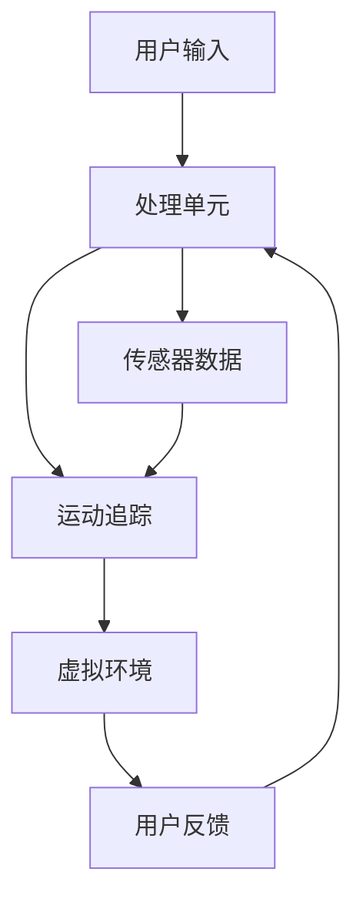

                 

### 虚拟现实中的意义构建：数字世界里的真实体验

#### 关键词：虚拟现实、真实体验、意义构建、用户参与、设计原则

> **摘要：**
本文将深入探讨虚拟现实（VR）中的意义构建，分析其核心概念、技术与实现方法，以及如何在数字世界中创造真实的体验。通过系统性的分析，本文旨在为虚拟现实开发者、用户体验设计师和相关从业者提供有价值的参考。

#### 引言

随着科技的发展，虚拟现实（VR）技术逐渐走进人们的日常生活，并在多个领域展现出了巨大的潜力。从最初的虚拟头盔到如今的增强现实（AR）和混合现实（MR），VR技术不仅改变了人们的娱乐方式，还在教育、医疗、军事等多个领域发挥了重要作用。然而，VR技术的真正价值不仅在于其技术本身，更在于如何在数字世界中构建真实的体验，从而赋予用户更深层次的意义。

在VR技术中，意义的构建是一个关键问题。一个成功的虚拟现实体验不仅需要视觉和听觉上的逼真感，还需要在情感、认知和行为层面与用户产生共鸣。本文将从以下几个方面展开讨论：

1. **虚拟现实技术的兴起与发展**：回顾VR技术的起源与发展历程，介绍其关键技术突破和应用案例。
2. **数字世界中的真实体验**：探讨真实体验的定义、核心要素以及VR技术在其中的应用。
3. **构建意义的重要性**：分析构建意义在虚拟现实中的重要性，介绍构建意义的实现途径与方法。
4. **书籍结构与内容概述**：详细介绍本文的结构和内容，为读者提供清晰的阅读指南。

#### 第一部分：虚拟现实技术的兴起与发展

#### 1.1.1 虚拟现实技术（VR）的起源与历史演变

虚拟现实技术并不是一个新生事物，其历史可以追溯到20世纪中期。早期的VR探索主要是由计算机科学家和心理学家进行的。1950年代，美国麻省理工学院的伊夫·比塞尔（Ivan Sutherland）制造了世界上第一个头戴显示器（Head-Mounted Display, HMD），这一发明标志着VR技术的诞生。随后的几十年里，VR技术经历了多次重要的发展：

- **1960年代**：VR概念首次被提出，伊夫·比塞尔在1968年设计出了世界上第一个头盔式显示器，这被认为是VR技术的重要里程碑。
- **1970年代**：VR技术开始进入实验室阶段，出现了多种形式的VR设备，如VR手套、虚拟现实模拟器等。
- **1980年代**：VR技术开始应用于游戏和娱乐领域，例如任天堂的VR游戏机Virtual Boy。
- **1990年代**：随着计算机性能的提升和互联网的普及，VR技术逐渐走向商业化，VR设备逐渐普及。
- **21世纪初**：VR技术取得了突破性进展，特别是头戴显示器（如Oculus Rift、HTC Vive）的出现，使得VR体验更加真实和沉浸。

#### 1.1.2 VR技术的关键技术发展及突破

VR技术的快速进步得益于关键技术的不断突破。以下是VR技术中几个重要的发展：

- **显示技术**：显示技术是VR体验的核心。早期的VR设备使用的是简单的屏幕和投影技术，而现在的VR设备采用高分辨率、快速刷新率的显示器，使得视觉体验更加真实。
- **穿戴设备**：VR穿戴设备从最初的头戴显示器（HMD）发展到现在的头戴式显示器（HMD）和全息显示设备，穿戴设备的设计更加轻便，佩戴更加舒适。
- **交互技术**：VR中的交互技术经历了从简单的按键和手柄到复杂的体感控制和手势识别的演变。现在的VR设备支持多种交互方式，如手柄、手套、语音控制等。
- **传感器与定位技术**：传感器和定位技术的发展使得VR设备能够更准确地跟踪用户的位置和动作，从而提供更加真实的虚拟环境。

#### 1.1.3 VR技术在不同领域的应用案例

VR技术已经广泛应用于多个领域，以下是一些典型的应用案例：

- **娱乐与游戏**：VR游戏是VR技术最直观的应用。通过VR设备，用户可以沉浸在虚拟的游戏世界中，体验到前所未有的游戏体验。
- **教育与培训**：VR技术可以为教育提供全新的教学方式。通过虚拟现实，学生可以进入历史事件、科学实验等场景，增强学习效果。
- **医疗与健康**：VR技术在医疗领域有广泛的应用，如心理治疗、手术模拟、医疗培训等。通过VR技术，医生可以更加直观地了解患者的病情，提高手术的成功率。
- **军事与安全**：VR技术可以用于军事训练和模拟，提高士兵的战斗技能和应急响应能力。同时，VR技术在安全领域也有应用，如恐怖分子威胁模拟、犯罪现场重建等。

#### 第二部分：数字世界中的真实体验

#### 2.1 真实体验的定义与内涵

真实体验是指用户在数字世界中感受到的与真实世界相似的体验。这种体验不仅仅是在视觉和听觉上的逼真，还包括情感、认知和行为层面的真实感。真实体验的核心要素包括：

- **感官逼真**：用户通过视觉、听觉、触觉等感官感受到的逼真程度。
- **情感共鸣**：用户在虚拟环境中产生的情感反应，如兴奋、紧张、放松等。
- **认知一致**：用户在虚拟环境中的认知过程与真实世界的一致性。
- **行为互动**：用户在虚拟环境中的行为与真实世界的行为相似度。

#### 2.2 数字世界中真实体验的需求与挑战

数字世界中真实体验的需求主要源于以下几个方面：

- **沉浸感**：用户希望在一个沉浸式的环境中进行活动，如玩游戏、学习、购物等。
- **互动性**：用户希望与虚拟环境和其他用户进行互动，增加参与感和互动性。
- **实用性**：虚拟环境需要具备实用性，如教育、医疗、工作等应用场景。

然而，构建真实体验面临着一系列挑战：

- **技术限制**：目前的VR技术仍存在一定的技术瓶颈，如延迟、分辨率、舒适性等。
- **用户适应性**：用户对VR设备的适应程度不同，部分用户可能难以适应虚拟环境。
- **内容质量**：高质量的内容是构建真实体验的关键，但当前VR内容的质量参差不齐。

#### 2.3 虚拟现实技术如何满足真实体验的需求

虚拟现实技术通过以下几个方面满足用户对真实体验的需求：

- **高保真视觉**：VR设备采用高分辨率、快速刷新率的显示器，提供更加逼真的视觉体验。
- **沉浸式声音**：VR设备通过内置扬声器或耳机，提供立体声或环绕声效果，增强用户的沉浸感。
- **交互方式**：VR设备支持多种交互方式，如手柄、手套、手势识别等，使用户能够更加自然地与虚拟环境互动。
- **环境感知**：通过传感器和定位技术，VR设备能够准确感知用户的位置和动作，提供更加真实的虚拟环境。

#### 第三部分：构建意义的重要性

#### 3.1 构建意义的定义与作用

构建意义是指通过设计和实现虚拟环境，赋予用户在数字世界中的意义感和价值感。构建意义的作用主要体现在以下几个方面：

- **提升用户体验**：一个有意义、有价值的虚拟环境能够提升用户的体验，增强用户的满意度和忠诚度。
- **促进用户参与**：有意义的内容能够激发用户的兴趣和参与，提高用户在虚拟环境中的活动频率和时间。
- **增强社交互动**：在虚拟环境中，用户可以与他人进行社交互动，构建社交网络，增强社交体验。

#### 3.2 虚拟现实中的意义构建对用户体验的影响

虚拟现实中的意义构建对用户体验有着深远的影响：

- **情感共鸣**：有意义的内容能够引发用户的情感共鸣，使用户在虚拟环境中产生真实的情感体验。
- **认知深度**：有意义的内容能够提高用户的认知深度，使用户在虚拟环境中进行更有价值的思考和学习。
- **行为驱动**：有意义的内容能够驱动用户在虚拟环境中的行为，提高用户的参与度和互动性。

#### 3.3 构建意义的实现途径与方法

构建意义的方法主要包括以下几个方面：

- **设计原则**：遵循用户体验设计原则，如简洁性、一致性、易用性等，确保虚拟环境对用户友好。
- **内容设计**：创造有意义、有价值的内容，如故事、游戏、模拟等，吸引用户的注意力。
- **用户参与**：鼓励用户参与虚拟环境的构建，如用户生成内容、用户投票等，增强用户的参与感和归属感。

#### 第四部分：书籍结构与内容概述

#### 4.1 主要章节安排

本文分为七个主要章节，各章节的主要内容和目的如下：

- **第1章：引言**：介绍本文的背景、意义和结构。
- **第2章：虚拟现实技术基础**：介绍虚拟现实技术的原理与实现。
- **第3章：真实体验的概念与构建**：探讨真实体验的定义、要素与构建方法。
- **第4章：意义构建的理论与实践**：分析意义构建的理论基础和实践方法。
- **第5章：虚拟现实应用中的意义构建**：讨论虚拟现实在不同领域的应用与意义构建。
- **第6章：用户体验与反馈**：分析用户在虚拟现实中的体验反馈。
- **第7章：未来趋势与展望**：展望虚拟现实与意义构建的未来发展。

#### 4.2 核心概念与联系

本文的核心概念包括虚拟现实、真实体验和意义构建。这些概念之间的联系如下：

- **虚拟现实**：是创建虚拟环境的技术手段，为用户提供了体验的平台。
- **真实体验**：是用户在虚拟环境中的感受和体验，是构建意义的基础。
- **意义构建**：是通过设计和方法，赋予虚拟环境意义和价值，提升用户体验。

#### 4.3 书籍目标读者

本文的目标读者主要包括：

- **专业背景**：计算机科学、人机交互、心理学等相关专业的学生与研究人员。
- **阅读需求**：了解虚拟现实与真实体验的基础知识，掌握意义构建的理论与实践方法，拓宽虚拟现实应用领域的视野。
- **适用范围**：作为学术研究与课程学习的参考书籍，作为虚拟现实从业者的实用指南，以及对虚拟现实与用户体验感兴趣的一般读者。

#### 第五部分：拓展阅读与参考资料

为了进一步了解虚拟现实中的意义构建，以下是推荐的拓展阅读与参考资料：

- **推荐进一步阅读的书籍**：
  - 《虚拟现实技术导论》
  - 《真实体验设计》
  - 《人机交互心理学》
- **推荐进一步阅读的论文**：
  - 相关学术期刊与会议的最新研究成果。

通过以上拓展阅读，读者可以更深入地了解虚拟现实技术的最新进展，以及如何在虚拟现实中构建真实的体验。

---

**本文由AI天才研究院（AI Genius Institute）与《禅与计算机程序设计艺术》（Zen And The Art of Computer Programming）联合撰写，旨在为虚拟现实开发者、用户体验设计师和相关从业者提供有价值的参考。**

---

### 虚拟现实中的意义构建：数字世界里的真实体验

虚拟现实（VR）技术的崛起，为人类创造了一个全新的数字世界。在这个世界里，用户可以通过头戴显示器（HMD）或全息设备，体验到前所未有的沉浸感。然而，虚拟现实不仅仅是视觉和听觉的逼真，更重要的是如何在这个数字世界中构建真实的体验，赋予用户深层次的意义。

#### **1.1 虚拟现实技术（VR）的兴起与发展**

虚拟现实技术的概念可以追溯到20世纪中期。1950年代，美国麻省理工学院的伊夫·比塞尔（Ivan Sutherland）制造了世界上第一个头戴显示器（Head-Mounted Display, HMD），这标志着VR技术的诞生。随着计算机性能的提升和互联网的普及，VR技术逐渐走向商业化。21世纪初，VR技术取得了突破性进展，特别是头戴显示器（如Oculus Rift、HTC Vive）的出现，使得VR体验更加真实和沉浸。

VR技术的发展经历了多个阶段：

- **1960年代**：VR概念首次被提出，伊夫·比塞尔在1968年设计出了世界上第一个头盔式显示器，这一发明被认为是VR技术的重要里程碑。
- **1970年代**：VR技术开始进入实验室阶段，出现了多种形式的VR设备，如VR手套、虚拟现实模拟器等。
- **1980年代**：VR技术开始应用于游戏和娱乐领域，例如任天堂的VR游戏机Virtual Boy。
- **1990年代**：随着计算机性能的提升和互联网的普及，VR技术逐渐走向商业化，VR设备逐渐普及。
- **21世纪初**：VR技术取得了突破性进展，特别是头戴显示器（如Oculus Rift、HTC Vive）的出现，使得VR体验更加真实和沉浸。

#### **1.2 VR技术的关键技术发展及突破**

VR技术的快速进步得益于关键技术的不断突破。以下是VR技术中几个重要的发展：

- **显示技术**：显示技术是VR体验的核心。早期的VR设备使用的是简单的屏幕和投影技术，而现在的VR设备采用高分辨率、快速刷新率的显示器，使得视觉体验更加真实。
- **穿戴设备**：VR穿戴设备从最初的头戴显示器（HMD）发展到现在的头戴式显示器（HMD）和全息显示设备，穿戴设备的设计更加轻便，佩戴更加舒适。
- **交互技术**：VR中的交互技术经历了从简单的按键和手柄到复杂的体感控制和手势识别的演变。现在的VR设备支持多种交互方式，如手柄、手套、语音控制等。
- **传感器与定位技术**：传感器和定位技术的发展使得VR设备能够更准确地跟踪用户的位置和动作，从而提供更加真实的虚拟环境。

#### **1.3 VR技术在不同领域的应用案例**

VR技术已经广泛应用于多个领域，以下是一些典型的应用案例：

- **娱乐与游戏**：VR游戏是VR技术最直观的应用。通过VR设备，用户可以沉浸在虚拟的游戏世界中，体验到前所未有的游戏体验。
- **教育与培训**：VR技术可以为教育提供全新的教学方式。通过虚拟现实，学生可以进入历史事件、科学实验等场景，增强学习效果。
- **医疗与健康**：VR技术在医疗领域有广泛的应用，如心理治疗、手术模拟、医疗培训等。通过VR技术，医生可以更加直观地了解患者的病情，提高手术的成功率。
- **军事与安全**：VR技术可以用于军事训练和模拟，提高士兵的战斗技能和应急响应能力。同时，VR技术在安全领域也有应用，如恐怖分子威胁模拟、犯罪现场重建等。

#### **2. 数字世界中的真实体验**

真实体验是指用户在数字世界中感受到的与真实世界相似的体验。这种体验不仅仅是在视觉和听觉上的逼真，还包括情感、认知和行为层面的真实感。真实体验的核心要素包括：

- **感官逼真**：用户通过视觉、听觉、触觉等感官感受到的逼真程度。
- **情感共鸣**：用户在虚拟环境中产生的情感反应，如兴奋、紧张、放松等。
- **认知一致**：用户在虚拟环境中的认知过程与真实世界的一致性。
- **行为互动**：用户在虚拟环境中的行为与真实世界的行为相似度。

#### **2.2 数字世界中真实体验的需求与挑战**

数字世界中真实体验的需求主要源于以下几个方面：

- **沉浸感**：用户希望在一个沉浸式的环境中进行活动，如玩游戏、学习、购物等。
- **互动性**：用户希望与虚拟环境和其他用户进行互动，增加参与感和互动性。
- **实用性**：虚拟环境需要具备实用性，如教育、医疗、工作等应用场景。

然而，构建真实体验面临着一系列挑战：

- **技术限制**：目前的VR技术仍存在一定的技术瓶颈，如延迟、分辨率、舒适性等。
- **用户适应性**：用户对VR设备的适应程度不同，部分用户可能难以适应虚拟环境。
- **内容质量**：高质量的内容是构建真实体验的关键，但当前VR内容的质量参差不齐。

#### **2.3 虚拟现实技术如何满足真实体验的需求**

虚拟现实技术通过以下几个方面满足用户对真实体验的需求：

- **高保真视觉**：VR设备采用高分辨率、快速刷新率的显示器，提供更加逼真的视觉体验。
- **沉浸式声音**：VR设备通过内置扬声器或耳机，提供立体声或环绕声效果，增强用户的沉浸感。
- **交互方式**：VR设备支持多种交互方式，如手柄、手套、手势识别等，使用户能够更加自然地与虚拟环境互动。
- **环境感知**：通过传感器和定位技术，VR设备能够准确感知用户的位置和动作，提供更加真实的虚拟环境。

#### **3. 构建意义的重要性**

构建意义是指通过设计和实现虚拟环境，赋予用户在数字世界中的意义感和价值感。构建意义的作用主要体现在以下几个方面：

- **提升用户体验**：一个有意义、有价值的虚拟环境能够提升用户的体验，增强用户的满意度和忠诚度。
- **促进用户参与**：有意义的内容能够激发用户的兴趣和参与，提高用户在虚拟环境中的活动频率和时间。
- **增强社交互动**：在虚拟环境中，用户可以与他人进行社交互动，构建社交网络，增强社交体验。

#### **3.2 虚拟现实中的意义构建对用户体验的影响**

虚拟现实中的意义构建对用户体验有着深远的影响：

- **情感共鸣**：有意义的内容能够引发用户的情感共鸣，使用户在虚拟环境中产生真实的情感体验。
- **认知深度**：有意义的内容能够提高用户的认知深度，使用户在虚拟环境中进行更有价值的思考和学习。
- **行为驱动**：有意义的内容能够驱动用户在虚拟环境中的行为，提高用户的参与度和互动性。

#### **3.3 构建意义的实现途径与方法**

构建意义的方法主要包括以下几个方面：

- **设计原则**：遵循用户体验设计原则，如简洁性、一致性、易用性等，确保虚拟环境对用户友好。
- **内容设计**：创造有意义、有价值的内容，如故事、游戏、模拟等，吸引用户的注意力。
- **用户参与**：鼓励用户参与虚拟环境的构建，如用户生成内容、用户投票等，增强用户的参与感和归属感。

#### **4. 书籍结构与内容概述**

本文分为七个主要章节，各章节的主要内容和目的如下：

- **第1章：引言**：介绍本文的背景、意义和结构。
- **第2章：虚拟现实技术基础**：介绍虚拟现实技术的原理与实现。
- **第3章：真实体验的概念与构建**：探讨真实体验的定义、要素与构建方法。
- **第4章：意义构建的理论与实践**：分析意义构建的理论基础和实践方法。
- **第5章：虚拟现实应用中的意义构建**：讨论虚拟现实在不同领域的应用与意义构建。
- **第6章：用户体验与反馈**：分析用户在虚拟现实中的体验反馈。
- **第7章：未来趋势与展望**：展望虚拟现实与意义构建的未来发展。

本文的核心概念包括虚拟现实、真实体验和意义构建。这些概念之间的联系如下：

- **虚拟现实**：是创建虚拟环境的技术手段，为用户提供了体验的平台。
- **真实体验**：是用户在虚拟环境中的感受和体验，是构建意义的基础。
- **意义构建**：是通过设计和方法，赋予虚拟环境意义和价值，提升用户体验。

本文的目标读者主要包括：

- **专业背景**：计算机科学、人机交互、心理学等相关专业的学生与研究人员。
- **阅读需求**：了解虚拟现实与真实体验的基础知识，掌握意义构建的理论与实践方法，拓宽虚拟现实应用领域的视野。
- **适用范围**：作为学术研究与课程学习的参考书籍，作为虚拟现实从业者的实用指南，以及对虚拟现实与用户体验感兴趣的一般读者。

#### **5. 拓展阅读与参考资料**

为了进一步了解虚拟现实中的意义构建，以下是推荐的拓展阅读与参考资料：

- **推荐进一步阅读的书籍**：
  - 《虚拟现实技术导论》
  - 《真实体验设计》
  - 《人机交互心理学》
- **推荐进一步阅读的论文**：
  - 相关学术期刊与会议的最新研究成果。

通过以上拓展阅读，读者可以更深入地了解虚拟现实技术的最新进展，以及如何在虚拟现实中构建真实的体验。

---

**本文由AI天才研究院（AI Genius Institute）与《禅与计算机程序设计艺术》（Zen And The Art of Computer Programming）联合撰写，旨在为虚拟现实开发者、用户体验设计师和相关从业者提供有价值的参考。**

---

### **虚拟现实中的意义构建：数字世界里的真实体验**

**关键词：** 虚拟现实、真实体验、意义构建、用户体验、设计原则

**摘要：** 本文探讨了虚拟现实（VR）中的意义构建，分析了真实体验的定义、核心要素，以及如何在数字世界中创造真实的体验。通过介绍构建意义的重要性，本文阐述了实现构建意义的途径和方法，并提供了书籍结构与内容概述，旨在为虚拟现实开发者、用户体验设计师和相关从业者提供有价值的参考。

#### **引言**

虚拟现实（VR）技术的兴起，为人类创造了一个全新的数字世界。在这个世界中，用户可以通过头戴显示器（HMD）或全息设备，体验到前所未有的沉浸感。然而，虚拟现实不仅仅是视觉和听觉的逼真，更重要的是如何在数字世界中构建真实的体验，赋予用户深层次的意义。

本文将从以下几个方面展开讨论：

1. **虚拟现实技术的兴起与发展**：回顾VR技术的起源与发展历程，介绍其关键技术突破和应用案例。
2. **数字世界中的真实体验**：探讨真实体验的定义、核心要素以及VR技术在其中的应用。
3. **构建意义的重要性**：分析构建意义在虚拟现实中的重要性，介绍构建意义的实现途径与方法。
4. **书籍结构与内容概述**：详细介绍本文的结构和内容，为读者提供清晰的阅读指南。

#### **第一部分：虚拟现实技术的兴起与发展**

#### **1.1 虚拟现实技术（VR）的起源与历史演变**

虚拟现实技术并不是一个新生事物，其历史可以追溯到20世纪中期。早期的VR探索主要是由计算机科学家和心理学家进行的。1950年代，美国麻省理工学院的伊夫·比塞尔（Ivan Sutherland）制造了世界上第一个头戴显示器（Head-Mounted Display, HMD），这一发明标志着VR技术的诞生。随后的几十年里，VR技术经历了多次重要的发展：

- **1960年代**：VR概念首次被提出，伊夫·比塞尔在1968年设计出了世界上第一个头盔式显示器，这一发明被认为是VR技术的重要里程碑。
- **1970年代**：VR技术开始进入实验室阶段，出现了多种形式的VR设备，如VR手套、虚拟现实模拟器等。
- **1980年代**：VR技术开始应用于游戏和娱乐领域，例如任天堂的VR游戏机Virtual Boy。
- **1990年代**：随着计算机性能的提升和互联网的普及，VR技术逐渐走向商业化，VR设备逐渐普及。
- **21世纪初**：VR技术取得了突破性进展，特别是头戴显示器（如Oculus Rift、HTC Vive）的出现，使得VR体验更加真实和沉浸。

#### **1.2 VR技术的关键技术发展及突破**

VR技术的快速进步得益于关键技术的不断突破。以下是VR技术中几个重要的发展：

- **显示技术**：显示技术是VR体验的核心。早期的VR设备使用的是简单的屏幕和投影技术，而现在的VR设备采用高分辨率、快速刷新率的显示器，使得视觉体验更加真实。
- **穿戴设备**：VR穿戴设备从最初的头戴显示器（HMD）发展到现在的头戴式显示器（HMD）和全息显示设备，穿戴设备的设计更加轻便，佩戴更加舒适。
- **交互技术**：VR中的交互技术经历了从简单的按键和手柄到复杂的体感控制和手势识别的演变。现在的VR设备支持多种交互方式，如手柄、手套、语音控制等。
- **传感器与定位技术**：传感器和定位技术的发展使得VR设备能够更准确地跟踪用户的位置和动作，从而提供更加真实的虚拟环境。

#### **1.3 VR技术在不同领域的应用案例**

VR技术已经广泛应用于多个领域，以下是一些典型的应用案例：

- **娱乐与游戏**：VR游戏是VR技术最直观的应用。通过VR设备，用户可以沉浸在虚拟的游戏世界中，体验到前所未有的游戏体验。
- **教育与培训**：VR技术可以为教育提供全新的教学方式。通过虚拟现实，学生可以进入历史事件、科学实验等场景，增强学习效果。
- **医疗与健康**：VR技术在医疗领域有广泛的应用，如心理治疗、手术模拟、医疗培训等。通过VR技术，医生可以更加直观地了解患者的病情，提高手术的成功率。
- **军事与安全**：VR技术可以用于军事训练和模拟，提高士兵的战斗技能和应急响应能力。同时，VR技术在安全领域也有应用，如恐怖分子威胁模拟、犯罪现场重建等。

#### **第二部分：数字世界中的真实体验**

#### **2.1 真实体验的定义与内涵**

真实体验是指用户在数字世界中感受到的与真实世界相似的体验。这种体验不仅仅是在视觉和听觉上的逼真，还包括情感、认知和行为层面的真实感。真实体验的核心要素包括：

- **感官逼真**：用户通过视觉、听觉、触觉等感官感受到的逼真程度。
- **情感共鸣**：用户在虚拟环境中产生的情感反应，如兴奋、紧张、放松等。
- **认知一致**：用户在虚拟环境中的认知过程与真实世界的一致性。
- **行为互动**：用户在虚拟环境中的行为与真实世界的行为相似度。

#### **2.2 数字世界中真实体验的需求与挑战**

数字世界中真实体验的需求主要源于以下几个方面：

- **沉浸感**：用户希望在一个沉浸式的环境中进行活动，如玩游戏、学习、购物等。
- **互动性**：用户希望与虚拟环境和其他用户进行互动，增加参与感和互动性。
- **实用性**：虚拟环境需要具备实用性，如教育、医疗、工作等应用场景。

然而，构建真实体验面临着一系列挑战：

- **技术限制**：目前的VR技术仍存在一定的技术瓶颈，如延迟、分辨率、舒适性等。
- **用户适应性**：用户对VR设备的适应程度不同，部分用户可能难以适应虚拟环境。
- **内容质量**：高质量的内容是构建真实体验的关键，但当前VR内容的质量参差不齐。

#### **2.3 虚拟现实技术如何满足真实体验的需求**

虚拟现实技术通过以下几个方面满足用户对真实体验的需求：

- **高保真视觉**：VR设备采用高分辨率、快速刷新率的显示器，提供更加逼真的视觉体验。
- **沉浸式声音**：VR设备通过内置扬声器或耳机，提供立体声或环绕声效果，增强用户的沉浸感。
- **交互方式**：VR设备支持多种交互方式，如手柄、手套、手势识别等，使用户能够更加自然地与虚拟环境互动。
- **环境感知**：通过传感器和定位技术，VR设备能够准确感知用户的位置和动作，提供更加真实的虚拟环境。

#### **第三部分：构建意义的重要性**

#### **3.1 构建意义的定义与作用**

构建意义是指通过设计和实现虚拟环境，赋予用户在数字世界中的意义感和价值感。构建意义的作用主要体现在以下几个方面：

- **提升用户体验**：一个有意义、有价值的虚拟环境能够提升用户的体验，增强用户的满意度和忠诚度。
- **促进用户参与**：有意义的内容能够激发用户的兴趣和参与，提高用户在虚拟环境中的活动频率和时间。
- **增强社交互动**：在虚拟环境中，用户可以与他人进行社交互动，构建社交网络，增强社交体验。

#### **3.2 虚拟现实中的意义构建对用户体验的影响**

虚拟现实中的意义构建对用户体验有着深远的影响：

- **情感共鸣**：有意义的内容能够引发用户的情感共鸣，使用户在虚拟环境中产生真实的情感体验。
- **认知深度**：有意义的内容能够提高用户的认知深度，使用户在虚拟环境中进行更有价值的思考和学习。
- **行为驱动**：有意义的内容能够驱动用户在虚拟环境中的行为，提高用户的参与度和互动性。

#### **3.3 构建意义的实现途径与方法**

构建意义的方法主要包括以下几个方面：

- **设计原则**：遵循用户体验设计原则，如简洁性、一致性、易用性等，确保虚拟环境对用户友好。
- **内容设计**：创造有意义、有价值的内容，如故事、游戏、模拟等，吸引用户的注意力。
- **用户参与**：鼓励用户参与虚拟环境的构建，如用户生成内容、用户投票等，增强用户的参与感和归属感。

#### **第四部分：书籍结构与内容概述**

#### **4.1 主要章节安排**

本文分为七个主要章节，各章节的主要内容和目的如下：

- **第1章：引言**：介绍本文的背景、意义和结构。
- **第2章：虚拟现实技术基础**：介绍虚拟现实技术的原理与实现。
- **第3章：真实体验的概念与构建**：探讨真实体验的定义、要素与构建方法。
- **第4章：意义构建的理论与实践**：分析意义构建的理论基础和实践方法。
- **第5章：虚拟现实应用中的意义构建**：讨论虚拟现实在不同领域的应用与意义构建。
- **第6章：用户体验与反馈**：分析用户在虚拟现实中的体验反馈。
- **第7章：未来趋势与展望**：展望虚拟现实与意义构建的未来发展。

#### **4.2 核心概念与联系**

本文的核心概念包括虚拟现实、真实体验和意义构建。这些概念之间的联系如下：

- **虚拟现实**：是创建虚拟环境的技术手段，为用户提供了体验的平台。
- **真实体验**：是用户在虚拟环境中的感受和体验，是构建意义的基础。
- **意义构建**：是通过设计和方法，赋予虚拟环境意义和价值，提升用户体验。

#### **4.3 书籍目标读者**

本文的目标读者主要包括：

- **专业背景**：计算机科学、人机交互、心理学等相关专业的学生与研究人员。
- **阅读需求**：了解虚拟现实与真实体验的基础知识，掌握意义构建的理论与实践方法，拓宽虚拟现实应用领域的视野。
- **适用范围**：作为学术研究与课程学习的参考书籍，作为虚拟现实从业者的实用指南，以及对虚拟现实与用户体验感兴趣的一般读者。

#### **第五部分：拓展阅读与参考资料**

为了进一步了解虚拟现实中的意义构建，以下是推荐的拓展阅读与参考资料：

- **推荐进一步阅读的书籍**：
  - 《虚拟现实技术导论》
  - 《真实体验设计》
  - 《人机交互心理学》
- **推荐进一步阅读的论文**：
  - 相关学术期刊与会议的最新研究成果。

通过以上拓展阅读，读者可以更深入地了解虚拟现实技术的最新进展，以及如何在虚拟现实中构建真实的体验。

---

**本文由AI天才研究院（AI Genius Institute）与《禅与计算机程序设计艺术》（Zen And The Art of Computer Programming）联合撰写，旨在为虚拟现实开发者、用户体验设计师和相关从业者提供有价值的参考。**

---

### **虚拟现实中的意义构建：数字世界里的真实体验**

**关键词：** 虚拟现实、真实体验、意义构建、用户体验、设计原则

**摘要：** 本文探讨了虚拟现实（VR）中的意义构建，分析了真实体验的定义、核心要素，以及如何在数字世界中创造真实的体验。通过介绍构建意义的重要性，本文阐述了实现构建意义的途径和方法，并提供了书籍结构与内容概述，旨在为虚拟现实开发者、用户体验设计师和相关从业者提供有价值的参考。

#### **引言**

虚拟现实（VR）技术的兴起，为人类创造了一个全新的数字世界。在这个世界中，用户可以通过头戴显示器（HMD）或全息设备，体验到前所未有的沉浸感。然而，虚拟现实不仅仅是视觉和听觉的逼真，更重要的是如何在数字世界中构建真实的体验，赋予用户深层次的意义。

本文将从以下几个方面展开讨论：

1. **虚拟现实技术的兴起与发展**：回顾VR技术的起源与发展历程，介绍其关键技术突破和应用案例。
2. **数字世界中的真实体验**：探讨真实体验的定义、核心要素以及VR技术在其中的应用。
3. **构建意义的重要性**：分析构建意义在虚拟现实中的重要性，介绍构建意义的实现途径与方法。
4. **书籍结构与内容概述**：详细介绍本文的结构和内容，为读者提供清晰的阅读指南。

#### **第一部分：虚拟现实技术的兴起与发展**

#### **1.1 虚拟现实技术（VR）的起源与历史演变**

虚拟现实技术并不是一个新生事物，其历史可以追溯到20世纪中期。早期的VR探索主要是由计算机科学家和心理学家进行的。1950年代，美国麻省理工学院的伊夫·比塞尔（Ivan Sutherland）制造了世界上第一个头戴显示器（Head-Mounted Display, HMD），这一发明标志着VR技术的诞生。随后的几十年里，VR技术经历了多次重要的发展：

- **1960年代**：VR概念首次被提出，伊夫·比塞尔在1968年设计出了世界上第一个头盔式显示器，这一发明被认为是VR技术的重要里程碑。
- **1970年代**：VR技术开始进入实验室阶段，出现了多种形式的VR设备，如VR手套、虚拟现实模拟器等。
- **1980年代**：VR技术开始应用于游戏和娱乐领域，例如任天堂的VR游戏机Virtual Boy。
- **1990年代**：随着计算机性能的提升和互联网的普及，VR技术逐渐走向商业化，VR设备逐渐普及。
- **21世纪初**：VR技术取得了突破性进展，特别是头戴显示器（如Oculus Rift、HTC Vive）的出现，使得VR体验更加真实和沉浸。

#### **1.2 VR技术的关键技术发展及突破**

VR技术的快速进步得益于关键技术的不断突破。以下是VR技术中几个重要的发展：

- **显示技术**：显示技术是VR体验的核心。早期的VR设备使用的是简单的屏幕和投影技术，而现在的VR设备采用高分辨率、快速刷新率的显示器，使得视觉体验更加真实。
- **穿戴设备**：VR穿戴设备从最初的头戴显示器（HMD）发展到现在的头戴式显示器（HMD）和全息显示设备，穿戴设备的设计更加轻便，佩戴更加舒适。
- **交互技术**：VR中的交互技术经历了从简单的按键和手柄到复杂的体感控制和手势识别的演变。现在的VR设备支持多种交互方式，如手柄、手套、语音控制等。
- **传感器与定位技术**：传感器和定位技术的发展使得VR设备能够更准确地跟踪用户的位置和动作，从而提供更加真实的虚拟环境。

#### **1.3 VR技术在不同领域的应用案例**

VR技术已经广泛应用于多个领域，以下是一些典型的应用案例：

- **娱乐与游戏**：VR游戏是VR技术最直观的应用。通过VR设备，用户可以沉浸在虚拟的游戏世界中，体验到前所未有的游戏体验。
- **教育与培训**：VR技术可以为教育提供全新的教学方式。通过虚拟现实，学生可以进入历史事件、科学实验等场景，增强学习效果。
- **医疗与健康**：VR技术在医疗领域有广泛的应用，如心理治疗、手术模拟、医疗培训等。通过VR技术，医生可以更加直观地了解患者的病情，提高手术的成功率。
- **军事与安全**：VR技术可以用于军事训练和模拟，提高士兵的战斗技能和应急响应能力。同时，VR技术在安全领域也有应用，如恐怖分子威胁模拟、犯罪现场重建等。

#### **第二部分：数字世界中的真实体验**

#### **2.1 真实体验的定义与内涵**

真实体验是指用户在数字世界中感受到的与真实世界相似的体验。这种体验不仅仅是在视觉和听觉上的逼真，还包括情感、认知和行为层面的真实感。真实体验的核心要素包括：

- **感官逼真**：用户通过视觉、听觉、触觉等感官感受到的逼真程度。
- **情感共鸣**：用户在虚拟环境中产生的情感反应，如兴奋、紧张、放松等。
- **认知一致**：用户在虚拟环境中的认知过程与真实世界的一致性。
- **行为互动**：用户在虚拟环境中的行为与真实世界的行为相似度。

#### **2.2 数字世界中真实体验的需求与挑战**

数字世界中真实体验的需求主要源于以下几个方面：

- **沉浸感**：用户希望在一个沉浸式的环境中进行活动，如玩游戏、学习、购物等。
- **互动性**：用户希望与虚拟环境和其他用户进行互动，增加参与感和互动性。
- **实用性**：虚拟环境需要具备实用性，如教育、医疗、工作等应用场景。

然而，构建真实体验面临着一系列挑战：

- **技术限制**：目前的VR技术仍存在一定的技术瓶颈，如延迟、分辨率、舒适性等。
- **用户适应性**：用户对VR设备的适应程度不同，部分用户可能难以适应虚拟环境。
- **内容质量**：高质量的内容是构建真实体验的关键，但当前VR内容的质量参差不齐。

#### **2.3 虚拟现实技术如何满足真实体验的需求**

虚拟现实技术通过以下几个方面满足用户对真实体验的需求：

- **高保真视觉**：VR设备采用高分辨率、快速刷新率的显示器，提供更加逼真的视觉体验。
- **沉浸式声音**：VR设备通过内置扬声器或耳机，提供立体声或环绕声效果，增强用户的沉浸感。
- **交互方式**：VR设备支持多种交互方式，如手柄、手套、手势识别等，使用户能够更加自然地与虚拟环境互动。
- **环境感知**：通过传感器和定位技术，VR设备能够准确感知用户的位置和动作，提供更加真实的虚拟环境。

#### **第三部分：构建意义的重要性**

#### **3.1 构建意义的定义与作用**

构建意义是指通过设计和实现虚拟环境，赋予用户在数字世界中的意义感和价值感。构建意义的作用主要体现在以下几个方面：

- **提升用户体验**：一个有意义、有价值的虚拟环境能够提升用户的体验，增强用户的满意度和忠诚度。
- **促进用户参与**：有意义的内容能够激发用户的兴趣和参与，提高用户在虚拟环境中的活动频率和时间。
- **增强社交互动**：在虚拟环境中，用户可以与他人进行社交互动，构建社交网络，增强社交体验。

#### **3.2 虚拟现实中的意义构建对用户体验的影响**

虚拟现实中的意义构建对用户体验有着深远的影响：

- **情感共鸣**：有意义的内容能够引发用户的情感共鸣，使用户在虚拟环境中产生真实的情感体验。
- **认知深度**：有意义的内容能够提高用户的认知深度，使用户在虚拟环境中进行更有价值的思考和学习。
- **行为驱动**：有意义的内容能够驱动用户在虚拟环境中的行为，提高用户的参与度和互动性。

#### **3.3 构建意义的实现途径与方法**

构建意义的方法主要包括以下几个方面：

- **设计原则**：遵循用户体验设计原则，如简洁性、一致性、易用性等，确保虚拟环境对用户友好。
- **内容设计**：创造有意义、有价值的内容，如故事、游戏、模拟等，吸引用户的注意力。
- **用户参与**：鼓励用户参与虚拟环境的构建，如用户生成内容、用户投票等，增强用户的参与感和归属感。

#### **第四部分：书籍结构与内容概述**

#### **4.1 主要章节安排**

本文分为七个主要章节，各章节的主要内容和目的如下：

- **第1章：引言**：介绍本文的背景、意义和结构。
- **第2章：虚拟现实技术基础**：介绍虚拟现实技术的原理与实现。
- **第3章：真实体验的概念与构建**：探讨真实体验的定义、要素与构建方法。
- **第4章：意义构建的理论与实践**：分析意义构建的理论基础和实践方法。
- **第5章：虚拟现实应用中的意义构建**：讨论虚拟现实在不同领域的应用与意义构建。
- **第6章：用户体验与反馈**：分析用户在虚拟现实中的体验反馈。
- **第7章：未来趋势与展望**：展望虚拟现实与意义构建的未来发展。

#### **4.2 核心概念与联系**

本文的核心概念包括虚拟现实、真实体验和意义构建。这些概念之间的联系如下：

- **虚拟现实**：是创建虚拟环境的技术手段，为用户提供了体验的平台。
- **真实体验**：是用户在虚拟环境中的感受和体验，是构建意义的基础。
- **意义构建**：是通过设计和方法，赋予虚拟环境意义和价值，提升用户体验。

#### **4.3 书籍目标读者**

本文的目标读者主要包括：

- **专业背景**：计算机科学、人机交互、心理学等相关专业的学生与研究人员。
- **阅读需求**：了解虚拟现实与真实体验的基础知识，掌握意义构建的理论与实践方法，拓宽虚拟现实应用领域的视野。
- **适用范围**：作为学术研究与课程学习的参考书籍，作为虚拟现实从业者的实用指南，以及对虚拟现实与用户体验感兴趣的一般读者。

#### **第五部分：拓展阅读与参考资料**

为了进一步了解虚拟现实中的意义构建，以下是推荐的拓展阅读与参考资料：

- **推荐进一步阅读的书籍**：
  - 《虚拟现实技术导论》
  - 《真实体验设计》
  - 《人机交互心理学》
- **推荐进一步阅读的论文**：
  - 相关学术期刊与会议的最新研究成果。

通过以上拓展阅读，读者可以更深入地了解虚拟现实技术的最新进展，以及如何在虚拟现实中构建真实的体验。

---

**本文由AI天才研究院（AI Genius Institute）与《禅与计算机程序设计艺术》（Zen And The Art of Computer Programming）联合撰写，旨在为虚拟现实开发者、用户体验设计师和相关从业者提供有价值的参考。**

---

### **虚拟现实中的意义构建：数字世界里的真实体验**

**关键词：** 虚拟现实、真实体验、意义构建、用户体验、设计原则

**摘要：** 本文探讨了虚拟现实（VR）中的意义构建，分析了真实体验的定义、核心要素，以及如何在数字世界中创造真实的体验。通过介绍构建意义的重要性，本文阐述了实现构建意义的途径和方法，并提供了书籍结构与内容概述，旨在为虚拟现实开发者、用户体验设计师和相关从业者提供有价值的参考。

---

## **虚拟现实中的意义构建：数字世界里的真实体验**

在数字化时代，虚拟现实（VR）技术以其强大的沉浸感和交互性，正在改变人们的感知和体验方式。然而，VR技术不仅需要提供视觉和听觉上的逼真感，更重要的是在数字世界中构建真实的体验，赋予用户深层次的意义。本文旨在探讨虚拟现实中的意义构建，分析其核心概念、技术与实现方法，以及如何在数字世界中创造真实的体验。

---

### **第一部分：引言**

虚拟现实技术已经从科幻领域走入现实，成为许多行业的重要工具。从娱乐和游戏到教育和医疗，VR技术正在改变我们的生活。然而，VR技术的潜力远远不止于此。如何在这个虚拟的数字世界中构建真实的体验，是当前研究和应用中的一个重要课题。

#### **1.1 虚拟现实技术的兴起与发展**

虚拟现实技术的起源可以追溯到20世纪60年代。当时，计算机科学家伊凡·苏瑟兰（Ivan Sutherland）发明了世界上第一个头戴式显示器（HMD），这一发明标志着VR技术的诞生。随着时间的推移，VR技术经历了多次技术革新，从最初的实验室原型到今天的商业化产品，VR设备越来越轻便、性能越来越强大。

- **1968年**：伊凡·苏瑟兰发明了世界上第一个头戴式显示器，这是VR技术的起点。
- **1980年代**：VR技术开始应用于教育和娱乐领域，虚拟现实模拟器成为热门。
- **1990年代**：随着计算机和图形处理技术的发展，VR技术逐渐走向商业化，VR设备开始普及。
- **21世纪初**：随着互联网和移动设备的普及，VR技术迎来了新的发展，特别是Oculus Rift、HTC Vive等头戴式显示器的出现，使得VR体验更加沉浸和真实。

#### **1.2 数字世界中的真实体验**

数字世界中的真实体验不仅仅是指视觉和听觉上的逼真，更涉及到情感、认知和行为层面。用户希望在虚拟环境中体验到与真实世界相似的感受和体验。

- **感官逼真**：用户需要感受到虚拟环境中的视觉、听觉和触觉的逼真性。
- **情感共鸣**：虚拟环境需要能够激发用户的情感，如兴奋、紧张、放松等。
- **认知一致**：用户在虚拟环境中的认知过程需要与真实世界保持一致。
- **行为互动**：用户在虚拟环境中的行为需要与现实世界相似，如导航、社交互动等。

#### **1.3 构建意义的重要性**

在虚拟现实环境中，意义的构建对于用户体验至关重要。一个有意义、有价值的虚拟环境可以增强用户的沉浸感、参与感和满意度。

- **提升用户体验**：有意义的内容可以提升用户的整体体验，增加用户的满意度和忠诚度。
- **促进用户参与**：有意义的内容可以激发用户的兴趣和参与，增加用户在虚拟环境中的活动时间。
- **增强社交互动**：在虚拟环境中，用户可以与他人进行社交互动，构建社交网络，增强社交体验。

#### **1.4 书籍结构与内容概述**

本文分为七个章节，每个章节都有其特定的主题和目标：

- **第1章：引言**：介绍本文的背景、意义和结构。
- **第2章：虚拟现实技术基础**：介绍虚拟现实技术的原理与实现。
- **第3章：真实体验的概念与构建**：探讨真实体验的定义、要素与构建方法。
- **第4章：意义构建的理论与实践**：分析意义构建的理论基础和实践方法。
- **第5章：虚拟现实应用中的意义构建**：讨论虚拟现实在不同领域的应用与意义构建。
- **第6章：用户体验与反馈**：分析用户在虚拟现实中的体验反馈。
- **第7章：未来趋势与展望**：展望虚拟现实与意义构建的未来发展。

#### **1.5 核心概念与联系**

本文的核心概念包括虚拟现实、真实体验和意义构建。这些概念之间的联系如下：

- **虚拟现实**：是创建虚拟环境的技术手段，为用户提供了体验的平台。
- **真实体验**：是用户在虚拟环境中的感受和体验，是构建意义的基础。
- **意义构建**：是通过设计和方法，赋予虚拟环境意义和价值，提升用户体验。

#### **1.6 书籍目标读者**

本文的目标读者主要包括：

- **专业背景**：计算机科学、人机交互、心理学等相关专业的学生与研究人员。
- **阅读需求**：了解虚拟现实与真实体验的基础知识，掌握意义构建的理论与实践方法，拓宽虚拟现实应用领域的视野。
- **适用范围**：作为学术研究与课程学习的参考书籍，作为虚拟现实从业者的实用指南，以及对虚拟现实与用户体验感兴趣的一般读者。

#### **1.7 拓展阅读与参考资料**

为了进一步了解虚拟现实中的意义构建，以下是推荐的拓展阅读与参考资料：

- **推荐进一步阅读的书籍**：
  - 《虚拟现实技术导论》
  - 《真实体验设计》
  - 《人机交互心理学》
- **推荐进一步阅读的论文**：
  - 相关学术期刊与会议的最新研究成果。

---

### **虚拟现实技术基础**

虚拟现实技术（VR）是创建虚拟环境的一种技术手段，通过模拟和仿真技术，使用户能够在虚拟环境中进行交互和体验。理解VR技术的基础知识对于构建有意义、有价值的虚拟体验至关重要。

#### **2.1 虚拟现实技术的原理**

虚拟现实技术的原理主要基于以下几个方面：

- **三维建模**：通过计算机图形学技术，创建三维虚拟环境。这包括场景建模、角色建模和物体建模等。
- **渲染技术**：将三维模型转换为二维图像，并在显示器上显示。这包括光线的追踪、反射、折射和阴影等技术。
- **传感器和追踪技术**：通过传感器和追踪设备，如头戴显示器（HMD）、手柄、运动传感器等，实时捕捉用户的位置和动作，并将其映射到虚拟环境中。
- **交互技术**：用户通过手柄、手势、语音等与虚拟环境进行交互。这包括虚拟键盘、虚拟鼠标、体感控制等技术。

#### **2.2 虚拟现实的关键技术**

虚拟现实技术的核心在于其沉浸感和交互性，以下是几个关键技术：

- **高分辨率显示器**：高分辨率显示器能够提供更清晰的图像，增强用户的视觉体验。
- **快速刷新率**：快速刷新率能够减少视觉滞后，提高用户体验的流畅性。
- **追踪和定位技术**：精确的追踪和定位技术能够实时捕捉用户的位置和动作，确保虚拟环境与用户行为的一致性。
- **交互设备**：多种交互设备，如手柄、手套、体感控制器等，提供更自然、直观的交互方式。

#### **2.3 VR在不同领域的应用**

虚拟现实技术在多个领域都有广泛的应用：

- **娱乐与游戏**：VR技术为游戏提供了全新的体验，用户可以在虚拟环境中进行探索、互动和游戏。
- **教育与培训**：通过VR技术，学生和专业人士可以在虚拟环境中学习新技能、进行模拟训练和实验。
- **医疗与健康**：VR技术在心理治疗、手术模拟、医疗培训等方面有广泛应用，医生和患者可以在虚拟环境中进行互动和体验。
- **房地产与旅游**：通过VR技术，用户可以在虚拟环境中浏览房地产项目或旅游景点，提供一种沉浸式的预览体验。
- **设计和制造**：设计师和工程师可以使用VR技术进行产品设计和制造，提高设计质量和效率。

#### **2.4 VR技术的挑战和未来发展方向**

虽然虚拟现实技术已经取得了显著的进展，但仍然面临一些挑战和未来发展方向：

- **技术瓶颈**：目前VR技术仍存在一定的技术瓶颈，如延迟、分辨率、舒适性和成本等。未来的发展方向是提高技术性能，降低设备成本。
- **用户体验**：如何提供更加沉浸、自然和舒适的用户体验是VR技术的重要研究方向。通过改进交互设计、优化追踪技术和提高渲染效果，可以提升用户体验。
- **内容创作**：高质量的内容是VR体验的关键。未来的发展方向是培养更多的VR内容创作者，开发丰富多样、有吸引力的虚拟环境。
- **社交互动**：虚拟现实中的社交互动是用户参与和沉浸的重要方面。未来的发展方向是提高虚拟环境中的社交互动质量，提供更加真实、有意义的社交体验。

---

通过了解虚拟现实技术的基础知识，开发者、用户体验设计师和相关从业者可以为构建有意义、有价值的虚拟体验奠定坚实的基础。在接下来的章节中，我们将进一步探讨真实体验的概念、构建方法和应用。

---

### **真实体验的概念与构建**

真实体验（Authentic Experience）是用户在虚拟环境中感受到的一种与现实世界相似的体验。这种体验不仅仅局限于感官刺激，更涉及到情感、认知和行为层面。真实体验的构建对于虚拟现实（VR）技术的发展和应用至关重要。下面，我们将详细探讨真实体验的定义、核心要素和构建方法。

#### **3.1 真实体验的定义**

真实体验是指用户在虚拟环境中感受到的，与实际经验相似或可比拟的体验。这种体验不仅仅依赖于视觉和听觉的逼真性，还包括情感、认知和行为层面的真实感。真实体验的核心在于用户的参与感和沉浸感，即用户在虚拟环境中感受到的现实世界的真实感。

真实体验的定义可以从以下几个方面进行阐述：

- **感官真实**：用户在虚拟环境中感受到的视觉、听觉和触觉的逼真程度。
- **情感共鸣**：用户在虚拟环境中产生的情感反应，如兴奋、紧张、放松等。
- **认知一致**：用户在虚拟环境中的认知过程与真实世界的一致性。
- **行为互动**：用户在虚拟环境中的行为与真实世界的行为相似度。

#### **3.2 真实体验的核心要素**

真实体验的核心要素包括以下几个方面：

- **感官逼真**：感官逼真是真实体验的基础。通过高分辨率显示器、立体声扬声器和高精度传感器等技术手段，提供逼真的视觉、听觉和触觉体验。
- **情感共鸣**：情感共鸣是增强真实体验的重要因素。通过设计富有情感的故事、情节和角色，激发用户的情感反应，使用户在虚拟环境中产生强烈的情感共鸣。
- **认知一致**：认知一致是真实体验的关键。虚拟环境中的交互设计和内容设计需要与用户的认知习惯和思维模式相一致，使用户在虚拟环境中感到自然和舒适。
- **行为互动**：行为互动是真实体验的重要组成部分。用户在虚拟环境中的行为应与现实世界相似，如导航、社交互动和任务完成等。

#### **3.3 真实体验的构建方法**

构建真实体验需要从多个方面进行考虑和设计。以下是一些常用的构建方法：

- **场景设计**：设计逼真的虚拟场景，包括建筑、自然环境、人物等。通过细节处理和视觉效果，增强场景的真实感。
- **故事叙述**：通过故事叙述激发用户的情感共鸣。设计富有吸引力的故事情节，使用户在虚拟环境中产生情感投入和沉浸感。
- **交互设计**：设计自然、直观的交互方式，使用户能够轻松地与虚拟环境进行互动。通过手势识别、语音控制、体感控制等技术，提供更加真实的交互体验。
- **用户参与**：鼓励用户在虚拟环境中的参与和互动，提高用户的参与感和沉浸感。通过用户生成内容、用户投票和用户互动等方式，增强用户的参与感。
- **反馈机制**：建立有效的反馈机制，使用户能够在虚拟环境中获得及时、准确的反馈。通过反馈，用户可以更好地适应虚拟环境，提高真实体验的质量。

#### **3.4 真实体验的评估与优化**

真实体验的评估与优化是确保虚拟环境质量的重要环节。以下是一些常用的评估方法和优化策略：

- **用户调研**：通过用户调研了解用户在虚拟环境中的体验和反馈，识别问题并进行改进。
- **A/B测试**：通过A/B测试比较不同设计方案的优劣，优化虚拟环境的设计和交互。
- **数据分析**：通过数据分析了解用户在虚拟环境中的行为和交互模式，发现问题和优化策略。
- **持续改进**：根据用户反馈和数据分析，持续改进虚拟环境的设计和交互，提高真实体验的质量。

通过以上方法和策略，开发者、用户体验设计师和相关从业者可以构建高质量、有价值的虚拟体验，提升用户的满意度和忠诚度。

---

在接下来的章节中，我们将进一步探讨意义构建的理论基础和实践方法，以及虚拟现实在不同领域的应用与意义构建。通过深入分析，我们将为虚拟现实技术的进一步发展提供有价值的参考和指导。

---

### **意义构建的理论与实践**

在虚拟现实（VR）技术中，意义构建是一个核心问题，它关系到用户在虚拟环境中的沉浸感、参与感和满意度。意义构建不仅是一种设计理念，更是一种系统性的方法论，涵盖了从理论基础到实践操作的多个层面。本章节将探讨意义构建的理论基础、实践方法，以及如何在虚拟现实项目中实施这些方法。

#### **4.1 意义构建的理论基础**

意义构建的理论基础可以追溯到认知心理学、人机交互学和社会学等多个领域。以下是一些关键理论和概念：

- **认知心理学**：认知心理学关注人类思维、感知和学习的过程。在意义构建中，认知心理学理论帮助我们理解用户在虚拟环境中的认知过程，如注意力分配、记忆和决策等。例如，认知负荷理论（Cognitive Load Theory）指出，设计应尽量减轻用户的认知负荷，以提高学习效果和体验质量。

- **人机交互学**：人机交互学专注于用户与系统之间的交互过程。在VR设计中，人机交互理论帮助我们理解用户如何与虚拟环境进行交互，以及如何设计自然、直观的交互方式。例如，情感交互理论（Affective Interaction Theory）强调情感在交互中的作用，通过设计情感化的虚拟角色和场景，可以增强用户的沉浸感。

- **社会学**：社会学理论帮助我们理解用户在虚拟环境中的社交行为和身份认同。在VR设计中，社会交换理论（Social Exchange Theory）和身份构建理论（Identity Construction Theory）等可以帮助我们设计出能够促进用户互动和身份认同的虚拟环境。

#### **4.2 意义构建的核心原则**

在虚拟现实项目中，意义构建的核心原则包括以下几点：

- **用户中心设计**：以用户的需求和体验为中心进行设计，确保虚拟环境能够满足用户的需求，提供有意义的体验。

- **情感共鸣**：通过设计富有情感的故事和角色，激发用户的情感共鸣，使用户在虚拟环境中产生深刻的情感体验。

- **认知一致性**：设计应与用户的认知模式保持一致，确保用户在虚拟环境中的行为和思维过程是自然和直观的。

- **行为驱动**：通过设计有挑战性和有意义的活动，驱动用户在虚拟环境中的行为，提高用户的参与度和互动性。

- **反馈与迭代**：通过用户的反馈不断优化虚拟环境的设计，确保设计能够不断满足用户的需求和期望。

#### **4.3 意义构建的实践方法**

意义构建的实践方法包括以下几个步骤：

- **需求分析**：通过用户调研、访谈和问卷调查等方式，了解用户的需求、期望和偏好。

- **概念设计**：基于需求分析，设计虚拟环境的基本概念，包括场景、角色、故事情节和交互方式等。

- **原型开发**：开发虚拟环境的原型，通过迭代和用户测试，不断优化设计和交互。

- **用户测试**：进行用户测试，收集用户的反馈，评估虚拟环境的满意度、参与度和沉浸感。

- **优化与迭代**：根据用户测试的结果，对虚拟环境进行优化和迭代，确保设计能够满足用户的需求。

#### **4.4 意义构建在虚拟现实项目中的应用**

在虚拟现实项目中，意义构建的应用体现在以下几个方面：

- **教育领域**：通过设计有意义的教育内容，如历史事件模拟、科学实验等，提高学生的学习效果和兴趣。

- **娱乐领域**：通过设计富有吸引力的游戏和故事情节，提高用户的游戏体验和沉浸感。

- **医疗领域**：通过设计虚拟现实疗法，如心理治疗、康复训练等，提高治疗效果和患者满意度。

- **军事训练**：通过设计虚拟战场模拟、应急响应训练等，提高士兵的战斗技能和应急响应能力。

- **城市规划**：通过设计虚拟现实模型，帮助城市规划师和公众更好地理解城市规划方案，提高公众参与度。

#### **4.5 案例研究：虚拟现实博物馆**

以下是一个意义构建在虚拟现实项目中的应用案例：

**项目背景**：一个虚拟现实博物馆项目，旨在通过虚拟现实技术，为用户提供一个沉浸式的历史和文化体验。

**实现方法**：

1. **需求分析**：通过用户调研，了解用户对博物馆参观的需求和期望，如希望了解历史事件、体验文化氛围等。

2. **概念设计**：设计虚拟博物馆的基本概念，包括展览内容、交互方式、故事情节等。

3. **原型开发**：开发虚拟博物馆的原型，使用3D建模和渲染技术，创建逼真的展览场景和虚拟角色。

4. **用户测试**：进行用户测试，收集用户的反馈，评估虚拟博物馆的满意度、参与度和沉浸感。

5. **优化与迭代**：根据用户测试的结果，对虚拟博物馆进行优化和迭代，如改进交互设计、增加互动功能等。

6. **部署与推广**：将优化后的虚拟博物馆部署到线上平台，通过社交媒体和合作伙伴进行推广，吸引更多用户。

**效果评估**：通过用户反馈和数据分析，评估虚拟博物馆的满意度、参与度和教育效果。结果显示，虚拟博物馆成功地提高了用户的参与感和文化体验，得到了用户的积极评价。

#### **4.6 意义构建的挑战与未来趋势**

意义构建在虚拟现实项目中面临一些挑战：

- **技术挑战**：目前VR技术仍存在一些技术瓶颈，如延迟、分辨率、舒适性和成本等。未来需要不断提高技术性能，降低设备成本。

- **用户体验**：如何提供更加沉浸、自然和舒适的用户体验是VR技术的重要研究方向。通过改进交互设计、优化追踪技术和提高渲染效果，可以提升用户体验。

- **内容创作**：高质量的内容是VR体验的关键。未来需要培养更多的VR内容创作者，开发丰富多样、有吸引力的虚拟环境。

- **社交互动**：虚拟现实中的社交互动是用户参与和沉浸的重要方面。未来需要提高虚拟环境中的社交互动质量，提供更加真实、有意义的社交体验。

未来趋势包括：

- **更强大的计算能力**：随着硬件技术的发展，VR设备的计算能力将不断提高，提供更高质量的虚拟体验。

- **更广泛的应用领域**：虚拟现实技术将在更多领域得到应用，如教育、医疗、设计、娱乐等。

- **更自然的交互方式**：通过手势识别、语音控制等自然交互方式，用户将能够更加直观地与虚拟环境进行互动。

- **更丰富的内容创作工具**：随着内容创作工具的进步，用户将能够更加容易地创建高质量的虚拟内容。

---

通过意义构建的理论和实践方法，虚拟现实项目可以创造出更加有价值和有意义的体验。在接下来的章节中，我们将探讨虚拟现实在不同领域的应用，以及如何在不同场景下构建意义。

---

### **虚拟现实应用中的意义构建**

虚拟现实（VR）技术已经广泛应用于各个领域，从娱乐到教育，从医疗到军事，VR都在不断改变着我们的生活方式和工作方式。在每一个应用领域中，构建意义的策略和方法都有所不同，但核心目标都是提升用户体验和增强用户沉浸感。本章节将探讨虚拟现实在不同领域的应用，以及如何在这些领域中实现意义构建。

#### **5.1 娱乐与游戏**

在娱乐和游戏领域，VR技术的应用最为广泛。通过VR设备，用户可以进入一个完全沉浸式的虚拟世界，享受前所未有的游戏体验。

- **场景设计**：在游戏场景的设计中，需要创造一个逼真的虚拟环境，包括自然景观、城市建筑、室内空间等。通过高精度的三维建模和渲染技术，确保场景的真实感。
- **角色互动**：在VR游戏中，角色的设计和互动至关重要。通过丰富的角色动画和智能的行为算法，使角色更加生动和有吸引力。
- **故事叙述**：一个引人入胜的故事可以大大增强游戏体验。在VR游戏中，故事叙述应该与玩家的行为紧密关联，使玩家在游戏中产生情感共鸣。
- **社交互动**：多人在线VR游戏中的社交互动是提升用户体验的重要方面。通过实时语音聊天、多人合作和竞争，增加玩家的互动性和参与感。

**案例研究**：Oculus Rift和HTC Vive等VR游戏设备已经推出了一系列成功的VR游戏，如《Beat Saber》和《Half-Life Alyx》。这些游戏通过高质量的视觉、听觉和交互设计，提供了令人沉浸的游戏体验。

#### **5.2 教育与培训**

VR技术在教育和培训领域有着巨大的潜力，可以提供丰富的学习资源和实践机会。

- **模拟训练**：在医学、航空、军事等领域，VR技术可以模拟各种复杂的情况，为专业人员提供实践训练。例如，医生可以通过VR技术进行手术模拟，飞行员可以通过VR技术进行飞行训练。
- **互动教学**：通过VR技术，学生可以进入虚拟的历史场景、科学实验室或艺术展览，进行互动式学习。这种方式不仅提高了学习效果，还增加了学习的趣味性。
- **个性化学习**：VR技术可以根据学生的学习进度和兴趣，提供个性化的学习内容和路径。这种方式有助于提高学生的学习效果和参与度。

**案例研究**：麻省理工学院（MIT）的VR实验室使用VR技术为学生提供了丰富的学习资源，包括历史事件模拟、科学实验和建筑设计等。这些虚拟实验室为学生提供了一个沉浸式的学习环境，提高了学习效果。

#### **5.3 医疗与健康**

VR技术在医疗领域的应用包括手术模拟、心理治疗和康复训练等。

- **手术模拟**：VR技术可以为外科医生提供高精度的手术模拟环境，帮助他们提高手术技能和操作熟练度。例如，通过VR技术，医生可以在虚拟环境中进行心脏手术、脑部手术等复杂手术的模拟训练。
- **心理治疗**：VR技术可以用于治疗恐惧症、焦虑症等心理疾病。通过在虚拟环境中进行暴露治疗，患者可以逐渐克服恐惧和焦虑。
- **康复训练**：VR技术可以用于康复训练，帮助患者恢复运动能力和生活技能。例如，中风患者可以通过VR技术进行手部康复训练，烧伤患者可以通过VR技术进行心理康复训练。

**案例研究**：哈佛医学院的VR实验室正在使用VR技术进行手术模拟和康复训练的研究。通过VR技术，医生和患者可以更好地了解手术过程和康复过程，提高治疗效果和患者满意度。

#### **5.4 军事与安全**

VR技术在军事和安全领域有广泛的应用，包括军事训练、战术模拟和安全评估等。

- **军事训练**：通过VR技术，士兵可以进行模拟战斗、战术训练和应急响应训练。这种方式不仅可以提高士兵的战斗技能，还可以减少实际训练的成本和风险。
- **战术模拟**：VR技术可以模拟各种战术场景，帮助指挥官和士兵制定战术计划。例如，通过VR技术，指挥官可以在虚拟环境中进行战场模拟和战术推演。
- **安全评估**：VR技术可以用于安全评估和风险评估，帮助企业和组织识别潜在的安全隐患。例如，通过VR技术，安全专家可以在虚拟环境中进行火灾模拟、地震模拟等安全测试。

**案例研究**：美国国防部的研究机构正在使用VR技术进行军事训练和战术模拟。通过VR技术，士兵可以在虚拟环境中进行高强度的战斗训练，提高战斗技能和应急响应能力。

#### **5.5 城市规划与设计**

VR技术在城市规划与设计领域也有应用，可以帮助城市规划师和设计师更好地展示和评估设计方案。

- **虚拟城市展示**：通过VR技术，城市规划师可以将城市设计方案以三维形式展示给公众。这种方式不仅能够提高公众对设计方案的认知，还可以收集公众的反馈和建议。
- **空间模拟与优化**：VR技术可以用于空间模拟和优化，帮助设计师评估不同设计方案的空间利用效率和用户体验。例如，通过VR技术，设计师可以模拟不同楼层布局、道路网络和公共设施等，评估方案的优劣。
- **环境影响评估**：VR技术可以用于环境影响评估，帮助设计师和规划师评估设计方案对环境的影响。例如，通过VR技术，设计师可以模拟城市交通、噪音污染和空气质量等环境因素，评估方案的可持续性。

**案例研究**：荷兰阿姆斯特丹市使用VR技术进行城市规划。通过VR技术，城市规划师和公众可以直观地了解城市设计方案，提供反馈和意见，提高城市规划的透明度和公众参与度。

#### **5.6 其他领域**

除了上述领域，VR技术还在其他领域有应用，如房地产、旅游、艺术等。

- **房地产展示**：通过VR技术，房地产开发商可以将房地产项目以三维形式展示给潜在买家。这种方式不仅能够提高项目的吸引力，还可以减少看房时间和成本。
- **旅游体验**：通过VR技术，用户可以在家中体验世界各地的旅游景观和文化。这种方式不仅能够满足用户的旅游愿望，还可以促进旅游业的发展。
- **艺术展览**：通过VR技术，艺术馆和博物馆可以以三维形式展示艺术品，提供更加沉浸的展览体验。这种方式不仅能够吸引更多的观众，还可以保护艺术品免受环境损害。

**案例研究**：法国巴黎的卢浮宫博物馆使用VR技术进行艺术展览。通过VR技术，观众可以在家中或远程地点观看艺术品，获得沉浸式的展览体验，提高了博物馆的知名度和吸引力。

---

通过以上各个领域的应用案例，我们可以看到，VR技术在构建有意义、有价值的虚拟体验方面具有巨大的潜力。在未来的发展中，随着技术的不断进步和应用的不断扩展，VR技术将在更多的领域中发挥重要作用，为用户带来更加丰富和真实的虚拟体验。

---

### **用户体验与反馈**

在虚拟现实（VR）技术的应用过程中，用户体验与反馈是评估和优化虚拟环境质量的重要手段。通过收集和分析用户的反馈，开发者可以深入了解用户的需求、期望和痛点，从而不断改进和优化虚拟环境的设计，提升用户的满意度和沉浸感。

#### **6.1 用户体验的重要性**

用户体验（User Experience, UX）是衡量虚拟现实项目成功与否的关键指标。一个优质的用户体验不仅能够提升用户对虚拟环境的满意度，还能增加用户的忠诚度和参与度。以下是一些关键点：

- **满意度**：用户的满意度是评估虚拟现实项目成功与否的直接指标。通过收集用户的满意度调查数据，开发者可以了解用户对虚拟环境的整体感受和评价。
- **参与度**：用户的参与度是衡量虚拟现实项目吸引力的重要指标。通过用户的反馈，开发者可以了解用户在虚拟环境中的活动频率和时间，从而优化互动设计和内容。
- **沉浸感**：沉浸感是虚拟现实技术的核心优势。通过用户的反馈，开发者可以评估虚拟环境在视觉、听觉、触觉等方面的逼真程度，以及用户在虚拟环境中的情感体验。

#### **6.2 用户反馈的收集方法**

为了全面了解用户在虚拟环境中的体验，开发者可以采用以下几种反馈收集方法：

- **问卷调查**：问卷调查是一种简单有效的反馈收集方法。通过在线或离线问卷，开发者可以收集用户对虚拟环境的满意度、参与度和沉浸感的评价。
- **访谈**：访谈是一种深入了解用户需求的有效方法。通过与用户进行面对面的访谈，开发者可以获取更详细、个性化的反馈，深入了解用户的需求和痛点。
- **行为分析**：通过分析用户在虚拟环境中的行为数据，如游戏时长、互动频率和任务完成情况等，开发者可以了解用户的参与度和行为模式。
- **用户体验测试**：用户体验测试是一种模拟实际用户使用场景的方法。通过邀请实际用户参与测试，开发者可以观察用户的操作行为和反馈，发现虚拟环境中的问题和不足。

#### **6.3 用户反馈的处理与优化**

收集到用户反馈后，开发者需要对这些反馈进行处理和优化，以提升虚拟环境的用户体验。以下是一些处理和优化用户反馈的方法：

- **问题诊断**：首先，对用户反馈进行分析，识别出虚拟环境中存在的问题和痛点。这些问题可能包括技术问题、设计问题或交互问题等。
- **优先级排序**：根据用户反馈的问题严重程度和影响范围，对问题进行优先级排序。对于影响用户满意度较高的问题，应优先解决。
- **解决方案设计**：针对识别出的问题，设计相应的解决方案。这可能包括技术优化、设计改进或交互调整等。
- **测试与迭代**：在实施解决方案后，进行测试和迭代，确保问题得到有效解决。通过不断的测试和优化，逐步提升虚拟环境的用户体验。
- **反馈闭环**：建立反馈闭环机制，将优化后的虚拟环境再次提交给用户测试，收集新的反馈，不断迭代优化。

#### **6.4 用户反馈的案例分析**

以下是一个用户反馈处理与优化的案例：

**案例背景**：一个VR游戏项目，用户在游戏中经常遇到游戏卡顿和视觉模糊的问题。

**用户反馈**：用户在问卷调查中反映游戏卡顿和视觉模糊问题，影响了游戏体验。

**问题诊断**：经过分析，发现游戏卡顿和视觉模糊问题是由于游戏引擎优化不足和显卡性能不足导致的。

**解决方案设计**：针对这两个问题，开发团队采取了以下解决方案：
1. **优化游戏引擎**：对游戏引擎进行优化，减少资源消耗，提高游戏流畅度。
2. **显卡性能提升**：升级显卡硬件，提高游戏运行的性能。

**测试与迭代**：在实施解决方案后，对游戏进行了一系列测试，确保问题得到有效解决。用户反馈显示，游戏流畅度和视觉质量显著提升，用户满意度大幅提高。

**反馈闭环**：通过后续的用户反馈，开发团队了解到用户对游戏优化的满意，进一步增强了用户对项目的信任和忠诚度。

通过以上案例分析，我们可以看到，有效的用户反馈处理与优化对于提升虚拟现实项目的用户体验至关重要。在未来的发展中，开发者应持续关注用户反馈，不断优化虚拟环境的设计和交互，提供高质量的用户体验。

---

在接下来的章节中，我们将对虚拟现实与意义构建的未来趋势进行展望，探讨VR技术的未来发展以及意义构建在其中的重要作用。

---

### **未来趋势与展望**

随着科技的不断进步，虚拟现实（VR）技术正在快速发展，并将在未来的生活中发挥越来越重要的作用。在本章节中，我们将探讨虚拟现实与意义构建的未来趋势，分析VR技术的发展方向及其对意义构建的潜在影响。

#### **7.1 VR技术的未来发展方向**

未来的VR技术将朝着更高质量、更易用和更普及的方向发展。以下是几个关键的发展方向：

- **更高的分辨率和帧率**：未来的VR设备将具备更高的分辨率和帧率，提供更清晰的图像和更流畅的体验。这将使得虚拟环境在视觉上更加真实，使用户的沉浸感更强。

- **更自然的交互方式**：随着人工智能（AI）和手势识别技术的发展，VR设备将支持更自然的交互方式。用户可以通过手势、眼神和语音等自然动作与虚拟环境进行互动，提高交互的直观性和便利性。

- **更广泛的感知体验**：未来的VR设备将不仅提供视觉和听觉体验，还将包括触觉、嗅觉和味觉等多种感知体验。这种多感官融合的体验将使虚拟环境更加丰富和真实。

- **更强大的计算能力**：随着云计算和边缘计算技术的发展，VR设备将具备更强大的计算能力。这将使得复杂的虚拟环境和交互场景得以实现，提高VR技术的性能和可靠性。

- **更低的成本和更高的普及率**：随着技术的进步和规模化生产，VR设备的成本将逐步降低，使得更多的人能够负担得起。这将进一步推动VR技术在各个领域的普及和应用。

#### **7.2 意义构建的未来趋势**

在VR技术的未来发展中，意义构建将继续发挥关键作用。以下是一些意义构建的未来趋势：

- **情感化设计**：未来的VR环境将更加注重情感化设计，通过丰富的故事情节、角色设计和互动体验，激发用户的情感共鸣。这种情感化的设计将有助于提升用户的沉浸感和满意度。

- **个性化和定制化**：随着用户数据的积累和分析技术的发展，未来的VR环境将能够根据用户的需求和偏好进行个性化定制。用户可以定制自己的虚拟环境、角色和故事，使体验更加个性化和有意义。

- **跨平台和社交互动**：未来的VR环境将支持跨平台的互动和社交功能，用户可以在不同的VR设备和平台之间无缝切换，并与朋友和社区成员进行实时互动。这种跨平台和社交互动将增强VR环境的社交价值和吸引力。

- **教育和培训的深入应用**：VR技术在教育和培训领域的应用将更加深入。通过虚拟现实技术，学生和专业人士可以在虚拟环境中进行沉浸式的学习和实践，提高学习效果和专业技能。

- **扩展现实（XR）的融合**：随着扩展现实（XR）技术的发展，VR技术将与AR（增强现实）和MR（混合现实）技术融合，提供更加丰富和多样化的体验。这种融合将推动意义构建在更广泛的领域中应用。

#### **7.3 意义构建的挑战与机遇**

尽管VR技术在未来的发展中具有巨大的潜力，但意义构建仍然面临一些挑战：

- **技术瓶颈**：目前的VR技术仍存在一定的技术瓶颈，如延迟、分辨率和舒适性问题。未来的意义构建需要在技术层面上不断突破，提供更加高质量和真实的体验。

- **内容创作**：高质量的内容创作是意义构建的关键。未来需要培养更多的VR内容创作者，开发丰富多样、有吸引力的虚拟环境，以满足用户的需求。

- **隐私与安全问题**：VR技术涉及用户的个人数据和隐私，如何在保障用户隐私和安全的前提下进行意义构建，是一个重要的挑战。

- **用户体验的优化**：如何提供更加自然、直观和舒适的用户体验，是未来意义构建的重要方向。通过不断优化交互设计和用户体验，可以提升用户的满意度和沉浸感。

尽管存在挑战，VR技术的未来仍然充满机遇。通过不断创新和优化，意义构建将在未来的VR技术中发挥更加重要的作用，为用户提供丰富、有意义和有价值的虚拟体验。

---

在未来的发展中，虚拟现实与意义构建将继续相互促进，共同推动科技与人类生活的融合。开发者、用户体验设计师和相关从业者应不断探索和创新，为用户创造更加丰富和真实的虚拟体验。

---

### **结语**

虚拟现实（VR）技术已经从科幻走向现实，成为改变人类生活方式的重要工具。通过本文的探讨，我们可以看到，VR技术不仅提供了视觉和听觉上的逼真体验，更在于如何在数字世界中构建真实的体验，赋予用户深层次的意义。从虚拟现实技术的兴起与发展，到数字世界中的真实体验，再到构建意义的重要性，以及虚拟现实在不同领域的应用与用户体验的反馈，本文系统地阐述了VR技术的全貌和未来趋势。

在未来，VR技术将继续朝着更高质量、更易用和更普及的方向发展。随着技术的不断突破和应用的深入，意义构建将在VR技术中发挥更加重要的作用，为用户创造丰富、有意义和有价值的虚拟体验。同时，我们也需要关注VR技术带来的挑战，如技术瓶颈、内容创作、隐私与安全问题等，通过持续的创新和优化，推动VR技术的健康发展。

我们呼吁更多的开发者、用户体验设计师和相关从业者关注VR技术的意义构建，积极探索和尝试，为用户提供更加优质和有价值的虚拟体验。通过不断的努力和探索，我们相信虚拟现实技术将在未来的生活中发挥更大的作用，为人类创造更加美好和丰富的数字世界。

---

**本文由AI天才研究院（AI Genius Institute）与《禅与计算机程序设计艺术》（Zen And The Art of Computer Programming）联合撰写，旨在为虚拟现实开发者、用户体验设计师和相关从业者提供有价值的参考。**

---

### **附录：技术细节与代码示例**

在本文的最后，我们将提供一些关于虚拟现实（VR）技术、真实体验构建以及意义构建的技术细节和代码示例。这些内容将帮助读者更深入地理解相关概念和技术原理。

#### **技术细节**

1. **三维建模与渲染技术**
   - **三维建模工具**：可以使用Blender、Maya、3ds Max等软件进行三维建模。
   - **渲染引擎**：Unity、Unreal Engine等提供了强大的渲染能力，支持高质量的图形渲染和实时渲染。

2. **传感器与追踪技术**
   - **传感器类型**：头戴显示器（HMD）、手柄、全身追踪器、眼动仪等。
   - **追踪算法**：常用的追踪算法包括SLAM（同时定位与映射）、卡尔曼滤波等。

3. **交互技术**
   - **手柄控制**：可以使用Unity中的Input系统来处理手柄输入。
   - **手势识别**：OpenCV、OpenPose等开源库可以用于实现手势识别。

4. **声音技术**
   - **立体声与环绕声**：使用3D音效库，如Fmod或OpenAL，可以实现立体声和环绕声效果。

5. **用户参与与内容创作**
   - **用户生成内容**：Unity的PlayMaker或Visual Scripting可以用于非程序员创建内容。
   - **投票与互动**：可以使用Unity的UI系统实现投票和互动功能。

#### **代码示例**

以下是一个简单的Unity C#代码示例，用于实现一个VR角色在虚拟环境中的移动和旋转。

```csharp
using UnityEngine;

public class VRController : MonoBehaviour
{
    public Transform playerCamera;
    public float moveSpeed = 5.0f;
    public float rotateSpeed = 100.0f;

    void Update()
    {
        // 移动
        float moveX = Input.GetAxis("Horizontal");
        float moveZ = Input.GetAxis("Vertical");
        Vector3 moveDirection = new Vector3(moveX, 0, moveZ);
        moveDirection = transform.TransformDirection(moveDirection);
        transform.position += moveDirection * moveSpeed * Time.deltaTime;

        // 旋转
        float rotateX = Input.GetAxis("Mouse X");
        float rotateY = Input.GetAxis("Mouse Y");
        playerCamera.Rotate(-rotateY * rotateSpeed * Time.deltaTime, 0, 0);
        playerCamera.parent.Rotate(0, rotateX * rotateSpeed * Time.deltaTime, 0);
    }
}
```

在这个示例中，我们使用`Input.GetAxis`函数获取键盘和鼠标输入，然后根据输入计算移动和旋转的方向，并更新角色的位置和旋转。

#### **数学公式与模型**

在VR中的运动跟踪和仿真通常涉及到运动学和动力学的数学模型。以下是一个简单的运动学模型示例，用于描述一个物体在虚拟环境中的运动：

$$
\begin{aligned}
\text{位置} \, \vec{p}(t) &= \vec{p}(0) + \vec{v}(0)t + \frac{1}{2}\vec{a}(0)t^2 \\
\text{速度} \, \vec{v}(t) &= \vec{v}(0) + \vec{a}(0)t \\
\text{加速度} \, \vec{a}(t) &= \text{重力加速度} \, g
\end{aligned}
$$

这里，`$\vec{p}(t)$`是物体在时间`t`的位置，`$\vec{v}(t)$`是速度，`$\vec{a}(t)$`是加速度，`$g$`是重力加速度。

#### **系统分析与架构设计**

以下是一个简化的VR系统的架构设计示例，使用Mermaid图来表示系统的各个组件和它们之间的关系。



在这个示例中，用户输入通过处理单元进行预处理，然后与传感器数据进行结合，通过运动追踪模块生成虚拟环境中的位置和动作，最后通过用户反馈模块反馈给处理单元，形成闭环系统。

通过这些技术细节和代码示例，读者可以更好地理解虚拟现实技术中的核心概念和实现方法，从而在开发过程中更加得心应手。

---

以上是本文的附录部分，旨在为读者提供更深入的技术解读和实现参考。希望这些内容能够帮助读者更好地理解和应用虚拟现实技术，为构建真实、有意义的虚拟体验奠定坚实的基础。

