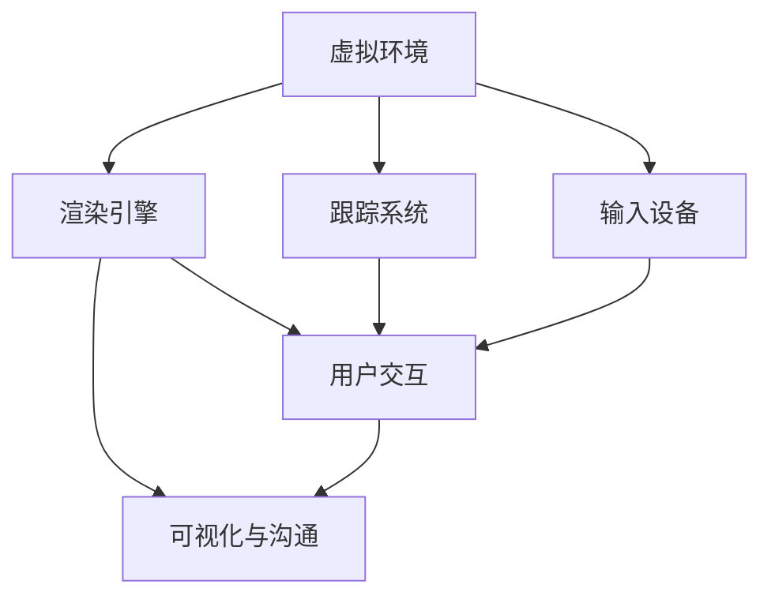
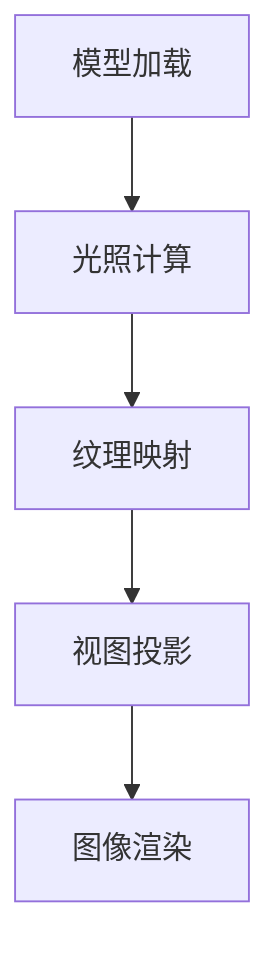
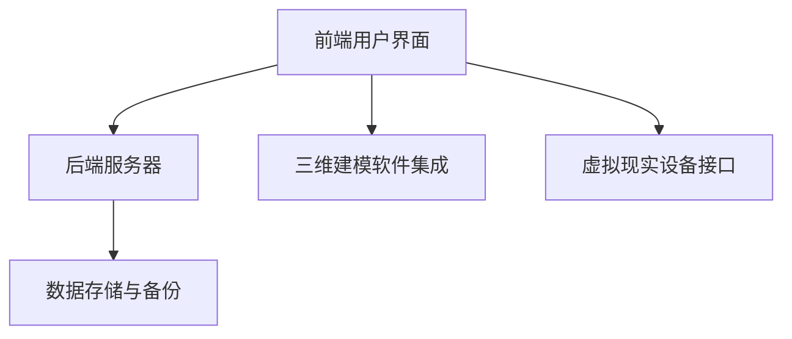
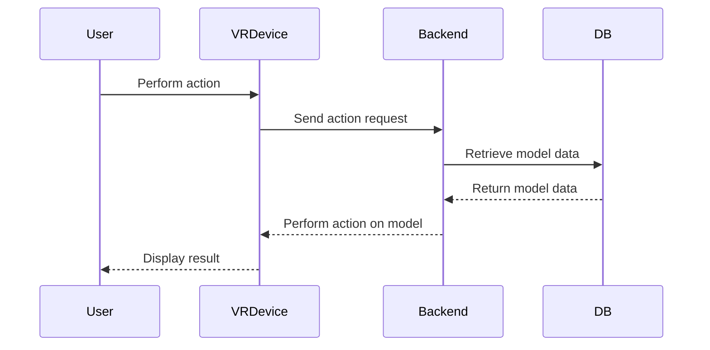

                 

### 虚拟现实技术概述

#### 核心概念术语说明

在探讨虚拟现实（VR）在建筑设计中的应用之前，我们需要首先了解一些核心概念和术语。虚拟现实是一种通过计算机技术模拟出一个逼真的三维环境，使用户能够在其中互动和体验的技术。它通常由以下几个关键组成部分构成：

1. **头戴式显示器（HMD）**：这是VR系统中最基本的硬件设备，它提供了一个沉浸式的视觉体验，将用户包裹在一个虚拟的三维空间中。
2. **跟踪系统**：用于追踪用户的头动和身体运动，确保虚拟环境与用户的动作保持同步。
3. **输入设备**：如手柄、手套等，允许用户与虚拟环境进行交互。
4. **渲染引擎**：负责生成和渲染虚拟环境中的图像，使其尽可能逼真。
5. **声音系统**：通过虚拟现实耳机等设备，提供空间化的声音效果，增强沉浸感。

#### 问题背景与描述

虚拟现实技术在近年来取得了显著进展，尤其是在游戏和娱乐领域。然而，随着技术的不断成熟和成本的降低，它在建筑设计领域的应用也逐渐受到重视。建筑师们可以通过虚拟现实技术，在项目初期就创造出直观的三维模型，帮助客户更好地理解设计方案，减少设计修改的次数，提高项目的效率和质量。

然而，目前虚拟现实在建筑设计中仍面临一些挑战，如技术成熟度、用户体验和成本控制等。如何有效地利用虚拟现实技术提高建筑设计的可视化和沟通效果，成为当前研究的热点。

#### 问题解决

为了解决上述问题，我们需要从以下几个方面入手：

1. **技术优化**：通过改进渲染引擎和跟踪系统，提高虚拟现实技术的成熟度和稳定性。
2. **用户研究**：深入了解建筑师和客户对虚拟现实技术的需求和期望，设计出更加符合实际使用场景的解决方案。
3. **成本控制**：通过规模化生产和技术创新，降低虚拟现实设备的成本，使其在建筑设计中更具可行性。

#### 边界与外延

虚拟现实在建筑设计中的应用不仅限于可视化和沟通，还可以拓展到模拟和预测。通过虚拟现实技术，建筑师可以模拟建筑在不同时间、天气和用户行为下的表现，从而进行更为科学的设计和优化。此外，虚拟现实还可以与其他技术如增强现实（AR）、人工智能（AI）等相结合，创造更加智能化和个性化的建筑设计体验。

#### 概念结构与核心要素组成

虚拟现实技术在建筑设计中的概念结构可以分为以下几个核心要素：

1. **虚拟环境生成**：通过计算机图形学和渲染技术，创建出逼真的三维建筑模型。
2. **用户交互**：通过跟踪系统和输入设备，实现用户在虚拟环境中的自由交互。
3. **可视化与沟通**：将虚拟环境作为设计工具，帮助建筑师和客户更好地理解和讨论设计方案。
4. **模拟与预测**：通过虚拟现实技术，模拟建筑在不同条件下的表现，为设计优化提供数据支持。

下面是关于核心概念的属性特征对比表格：

| 特征               | 说明                                       | 对比       |
|--------------------|--------------------------------------------|------------|
| 沉浸感             | 用户感觉仿佛置身于真实环境中               | 高         |
| 精确性             | 跟踪系统能够精确捕捉用户动作               | 高         |
| 交互性             | 用户可以通过输入设备与虚拟环境互动         | 强         |
| 可视化效果         | 虚拟环境的渲染效果逼真，增强设计沟通      | 高         |
| 成本               | 技术设备成本较高，但随着技术发展有望降低   | 中等       |
| 可用性             | 用户体验直接影响技术的应用效果             | 高         |

以下是核心概念的ER实体关系图架构：



通过以上分析，我们可以看出虚拟现实技术在建筑设计中的应用具有巨大的潜力和广阔的前景。在接下来的章节中，我们将进一步探讨虚拟现实技术在建筑设计中的具体应用案例，以及如何克服当前面临的挑战。通过逐步分析推理，我们将深入理解这一技术的本质和应用价值。

#### 算法原理讲解

在理解了虚拟现实技术在建筑设计中的核心概念后，接下来我们将探讨虚拟现实技术的算法原理，并使用Mermaid绘制相应的流程图，以及Python源代码来详细阐述。

##### 虚拟现实渲染算法原理

虚拟现实渲染的核心是创建和显示三维场景。这一过程主要包括以下几个步骤：

1. **模型加载**：从三维建模软件中导入建筑模型，并将其数据转换为VR系统能够处理的格式。
2. **光照计算**：根据场景中的光源位置和强度，计算每个物体表面的光照效果。
3. **纹理映射**：将材质和纹理映射到物体表面，使其看起来更加真实。
4. **视图投影**：将三维场景投影到二维屏幕上，为用户呈现一个二维的视图。
5. **图像渲染**：将投影后的图像通过VR设备显示给用户。

以下是使用Mermaid绘制的虚拟现实渲染算法流程图：



##### Python源代码实现

下面是一个简单的Python代码示例，用于实现上述虚拟现实渲染算法的简化版本。这里我们使用PyOpenGL库来绘制一个简单的立方体。

```python
from OpenGL.GL import *
from OpenGL.GLUT import *
import sys

def display():
    glClear(GL_COLOR_BUFFER_BIT | GL_DEPTH_BUFFER_BIT)
    glBegin(GL_TRIANGLES)
    glVertex3f(-0.5, -0.5, 0)
    glVertex3f(0.5, -0.5, 0)
    glVertex3f(0.5, 0.5, 0)
    glVertex3f(-0.5, -0.5, 0)
    glVertex3f(0.5, 0.5, 0)
    glVertex3f(-0.5, 0.5, 0)
    glEnd()
    glFlush()

def main():
    glutInit(sys.argv)
    glutInitDisplayMode(GLUT_SINGLE | GLUT_RGBA | GLUT_DEPTH)
    glutInitWindowSize(500, 500)
    glutCreateWindow(b"VR Rendering Example")
    glEnable(GL_DEPTH_TEST)
    glutDisplayFunc(display)
    glutMainLoop()

if __name__ == "__main__":
    main()
```

##### 算法原理详细讲解

1. **模型加载**：在三维建模软件中创建的建筑模型需要导出为适用于VR系统的格式，如`.obj`或`.dae`。加载过程包括读取模型顶点、面片和材质信息。

2. **光照计算**：在渲染过程中，我们需要为每个物体计算光照效果。这通常涉及到光照方程，如Lambert光照模型或Phong光照模型。这些模型基于光线照射到物体表面的方向和材质的反射特性来计算光照强度。

3. **纹理映射**：纹理映射是将二维纹理图像映射到三维物体表面，以增加细节和真实感。这个过程涉及到纹理坐标的计算和纹理贴图的加载。

4. **视图投影**：视图投影是将三维场景映射到二维屏幕上。这涉及到视图矩阵和投影矩阵的计算，以确定物体的位置和大小。

5. **图像渲染**：最后，渲染后的图像通过VR设备显示给用户。这通常涉及到将OpenGL缓冲区中的图像传递到VR设备的显示缓冲区。

##### 数学模型和公式

虚拟现实渲染算法中的数学模型和公式包括：

- **顶点法线计算**：顶点法线用于光照计算，公式如下：

  $$ N = \frac{V_1 - V_0}{\|V_1 - V_0\|} $$

  其中，$N$是顶点法线，$V_1$和$V_0$是相邻顶点的向量。

- **光照强度计算**：基于Lambert光照模型的公式如下：

  $$ I = \max(0, N \cdot L) $$

  其中，$I$是光照强度，$N$是顶点法线，$L$是光线方向向量。

通过以上步骤和公式，我们能够创建一个简单的虚拟现实渲染流程，并在三维空间中实现光照和纹理效果。然而，实际的虚拟现实渲染过程远比这复杂，涉及更多的图形学技术和优化策略。接下来的部分，我们将进一步探讨虚拟现实技术在建筑设计中的具体应用案例。

### 系统分析与架构设计方案

#### 问题描述

在本章中，我们将分析虚拟现实技术在建筑设计中的应用系统，并设计其架构方案。该系统旨在通过虚拟现实技术，为建筑师提供一个高效、直观的可视化设计工具，帮助其在项目早期阶段评估和优化设计方案。

#### 项目介绍

虚拟现实建筑设计可视化系统旨在解决以下问题：

- **设计可视化需求**：建筑师需要一种直观的方式来展示设计方案，以便与客户沟通和获取反馈。
- **设计优化需求**：通过虚拟现实技术，建筑师可以在项目初期就发现设计中的潜在问题，从而进行优化。
- **协作需求**：虚拟现实技术能够支持多方协作，提高设计团队的工作效率。

#### 系统功能设计

虚拟现实建筑设计可视化系统的核心功能包括：

1. **模型导入与编辑**：支持从常见三维建模软件导入建筑模型，并提供编辑功能，如调整尺寸、添加材质等。
2. **虚拟环境渲染**：使用高级渲染技术生成高质量的建筑模型，提供逼真的可视化效果。
3. **交互式浏览**：用户可以通过虚拟现实设备进行交互，如旋转、缩放、平移等，以从不同角度观察建筑模型。
4. **光照与天气模拟**：模拟不同时间、天气条件下的建筑效果，帮助建筑师评估设计方案在不同条件下的表现。
5. **用户反馈收集**：通过虚拟现实环境，建筑师可以收集客户的实时反馈，以便进行设计调整。

#### 系统架构设计

虚拟现实建筑设计可视化系统的架构设计如下：

1. **前端用户界面**：提供用户交互界面，使用户可以通过虚拟现实设备进行浏览和交互。
2. **后端服务器**：负责处理模型数据存储、渲染计算和用户数据管理等任务。
3. **三维建模软件集成**：通过API或插件方式，与常见的三维建模软件进行集成，实现模型导入与编辑。
4. **虚拟现实设备接口**：提供与各种虚拟现实设备的接口，实现实时交互。
5. **数据存储与备份**：使用数据库存储建筑模型和相关数据，并进行备份以防数据丢失。

以下是使用Mermaid绘制的系统架构图：



#### 系统接口设计与系统交互

系统的接口设计需要考虑以下几个关键方面：

1. **模型数据接口**：定义用于导入和导出建筑模型的数据格式和协议，如`.obj`或`.dae`。
2. **用户交互接口**：定义用户与虚拟现实环境之间的交互方式，如手势、语音等。
3. **渲染计算接口**：定义用于处理渲染计算的任务分配和结果输出。
4. **数据传输接口**：定义系统内部和外部数据传输的协议和方式。

以下是使用Mermaid绘制的系统交互序列图：



通过以上系统分析与架构设计方案，我们为虚拟现实技术在建筑设计中的应用提供了一个详细的框架。接下来，我们将通过实际的项目案例，展示如何实现这一系统，并分析其效果。

### 项目实战

#### 环境搭建

要成功实现虚拟现实在建筑设计中的应用项目，首先需要搭建一个合适的技术环境。以下步骤将详细说明如何配置硬件和软件，确保虚拟现实系统的顺利运行。

##### 硬件配置

1. **VR头戴设备**：选择一款符合项目需求的VR头戴设备，如HTC Vive、Oculus Rift或Windows MR头戴设备。这些设备能够提供高质量的沉浸式视觉体验和精确的头动跟踪。

2. **跟踪系统**：配置跟踪传感器，这些传感器通常与头戴设备配套使用，用于跟踪用户的位置和动作。确保传感器能够覆盖整个设计空间，以提供全面的跟踪效果。

3. **高性能计算机**：由于虚拟现实渲染计算量较大，需要一台配置较高的计算机。推荐配置包括高性能的CPU（如Intel i7或以上）、NVIDIA GeForce RTX 3080或以上显卡、16GB及以上RAM和至少512GB的SSD硬盘。

##### 软件安装

1. **VR平台软件**：安装VR平台软件，如Unity或Unreal Engine，这些平台提供了强大的渲染和交互功能，适用于虚拟现实项目的开发。

2. **三维建模软件**：安装常用的三维建模软件，如Autodesk Revit、SketchUp或Rhino，用于创建和导入建筑模型。

3. **开发工具**：安装必要的开发工具，如Python、C++和OpenGL，用于编写和调试渲染代码。

4. **VR SDK**：安装虚拟现实平台提供的软件开发工具包（SDK），如Oculus SDK或Vive SDK，这些SDK提供了与VR设备交互的接口和库函数。

##### 实现过程

以下是使用Unity平台实现虚拟现实建筑设计可视化项目的步骤：

1. **创建Unity项目**：
   - 打开Unity Hub，创建一个新的Unity项目。
   - 选择“3D模式”并命名项目。

2. **导入建筑模型**：
   - 使用三维建模软件创建建筑模型，导出为`.obj`或`.dae`格式。
   - 在Unity项目资源文件夹中导入建筑模型。

3. **设置虚拟现实环境**：
   - 在Unity编辑器中，创建一个平面作为虚拟环境的底图。
   - 配置VR摄像机和渲染设置，确保能够以正确的视角显示建筑模型。

4. **添加交互功能**：
   - 使用Unity的UI系统创建用户交互界面，如菜单和按钮。
   - 编写脚本，实现用户的旋转、缩放和平移等交互操作。

5. **光照和天气模拟**：
   - 配置Unity中的光照系统，实现实时光照效果。
   - 添加天气效果，如晴天、雨天和夜晚模式。

6. **测试与优化**：
   - 在Unity编辑器中测试虚拟现实应用，确保所有功能正常运行。
   - 根据测试结果，优化渲染效果和交互体验。

##### 代码应用解读与分析

以下是一个简单的Unity C#脚本示例，用于实现用户在虚拟环境中旋转建筑模型的功能：

```csharp
using UnityEngine;

public class ModelRotator : MonoBehaviour
{
    public float rotationSpeed = 100f;

    void Update()
    {
        // 旋转建筑模型
        float rotationX = Input.GetAxis("Mouse X") * rotationSpeed * Time.deltaTime;
        float rotationY = Input.GetAxis("Mouse Y") * rotationSpeed * Time.deltaTime;

        transform.Rotate(-rotationY, rotationX, 0);
    }
}
```

该脚本通过监听鼠标的X和Y轴输入，实现建筑模型的旋转。`rotationSpeed`变量控制旋转速度，可以根据实际情况进行调整。

##### 实际案例分析

以一个大型综合体项目为例，该项目的目标是创建一个虚拟现实展示环境，让客户能够直观地了解设计方案。以下是项目实现的关键步骤和成果：

1. **需求分析**：
   - 客户要求展示一个包含多个建筑的综合体，展示其外观和内部空间布局。
   - 需要提供多种交互功能，如旋转、缩放和选择不同楼层浏览。

2. **模型创建**：
   - 使用Revit创建详细的三维建筑模型，包括每个建筑的立面、剖面和结构。
   - 导出模型为`.obj`格式，导入到Unity项目中。

3. **渲染与交互**：
   - 在Unity中设置虚拟环境，包括渲染设置、光照和天气效果。
   - 编写交互脚本，实现用户的旋转、缩放和楼层选择功能。

4. **测试与反馈**：
   - 进行多次测试，优化渲染效果和交互体验。
   - 收集客户的反馈，进行必要的调整。

5. **项目成果**：
   - 成功创建了一个高质量的虚拟现实展示环境，客户对设计方案有了更直观的了解。
   - 项目团队通过虚拟现实技术提高了设计效率和客户满意度。

##### 项目小结

通过这个实际案例，我们可以看到虚拟现实技术在建筑设计中的应用不仅可以提升设计效率和客户满意度，还能为项目带来更多的价值。在未来的项目中，我们应继续优化虚拟现实技术的实现，提高其可靠性和易用性，以更好地服务于建筑设计行业。

### 最佳实践与趋势分析

#### 最佳实践总结

在虚拟现实（VR）技术应用于建筑设计的实际项目中，我们总结了一些成功的最佳实践，这些实践不仅提高了项目的效率，也增强了设计的质量：

1. **提前规划与需求分析**：在项目启动阶段，深入了解客户的需求和目标，确保VR系统设计能够满足项目要求。通过详细的规划，减少后期调整的次数，提高项目进度。

2. **高质量模型导入**：确保导入的3D模型具有高精度和高质量，这对于实现逼真的可视化效果至关重要。使用专业三维建模软件创建模型，并进行精细调整。

3. **优化渲染效果**：选择合适的渲染引擎和优化技术，提高渲染效率和图像质量。使用实时渲染技术，实现流畅的用户交互体验。

4. **用户交互设计**：设计直观且易于使用的用户界面，提供多种交互方式，如手势、语音和触控，以适应不同用户的需求。

5. **实时反馈与迭代**：通过虚拟现实环境收集用户的实时反馈，及时调整设计。这种迭代过程有助于优化设计方案，减少设计错误。

#### 趋势分析与展望

虚拟现实技术在建筑设计中的应用正在快速发展，以下是对未来趋势的分析和展望：

1. **技术成熟度提升**：随着硬件和软件技术的不断进步，虚拟现实系统的性能和稳定性将得到显著提升。这将为建筑设计带来更加逼真和高效的可视化体验。

2. **跨领域融合**：虚拟现实技术将与其他领域（如增强现实、人工智能、物联网等）融合，形成更加智能化和自动化的设计流程。例如，AI可以用于智能推荐设计优化方案，物联网技术可以实时更新建筑模型。

3. **普及与应用扩展**：随着虚拟现实设备的成本降低和易用性提高，其在建筑设计领域的应用将更加普及。除了大型项目，小型设计和个人用户也将受益于虚拟现实技术。

4. **设计决策支持**：虚拟现实技术将不仅仅用于展示和沟通，还将成为设计决策的重要工具。通过虚拟环境模拟，设计师可以评估不同设计方案的可行性，优化建筑性能。

5. **教育与应用培训**：虚拟现实技术在建筑教育和培训中的应用前景广阔。通过虚拟现实环境，学生和设计师可以沉浸式地学习建筑知识，提高实际操作能力。

#### 拓展阅读

为了进一步深入了解虚拟现实在建筑设计中的应用，以下是一些建议的阅读资源：

- **书籍**：
  - 《Virtual Reality in Architecture: Design, Visualization, and Experience》
  - 《Building Information Modeling: A Guide to Integrating People, Process, and Practice》

- **学术论文**：
  - “The Application of Virtual Reality in Architectural Design and Construction”
  - “Virtual Reality for Architectural Visualization: A Survey”

- **在线资源和论坛**：
  - ArchDaily（archdaily.com）
  - Reddit上的r/VirtualReality
  - BIM Forum（bimforum.org）

通过以上最佳实践总结、趋势分析和拓展阅读，我们可以更好地理解虚拟现实在建筑设计中的应用，并为其未来的发展做好准备。

### 总结与展望

在本篇博客中，我们详细探讨了虚拟现实技术在建筑设计可视化中的应用，从核心概念、算法原理到系统设计与项目实战，全面解析了这一技术的本质和应用价值。通过分析虚拟现实技术的核心组成部分，如头戴式显示器、跟踪系统、渲染引擎和交互设计，我们了解了其在建筑设计中如何创造逼真的三维模型和互动体验。

同时，通过系统架构设计和项目实战的案例分析，我们展示了如何利用虚拟现实技术提升设计效率和客户满意度。最佳实践与趋势分析部分进一步强调了虚拟现实技术在未来建筑设计中的发展前景，包括技术成熟度提升、跨领域融合、普及与应用扩展等方面。

展望未来，虚拟现实技术将在建筑设计中发挥越来越重要的作用。随着硬件和软件技术的不断进步，虚拟现实将不仅仅是展示和沟通的工具，更将成为设计决策和支持的重要手段。我们期待看到虚拟现实技术为建筑设计带来更多创新和变革，推动行业向更智能化和高效化的方向发展。

### 拓展阅读

为了深入探索虚拟现实（VR）在建筑设计中的具体应用，以下是一些建议的阅读资源：

- **书籍**：
  - 《Virtual Reality in Architecture: Design, Visualization, and Experience》：本书详细介绍了VR技术在建筑设计和可视化中的实际应用，涵盖了从基础概念到高级应用的各个方面。
  - 《Building Information Modeling: A Guide to Integrating People, Process, and Practice》：这本书专注于建筑信息模型（BIM）的集成与应用，其中包含了大量关于如何将VR技术融入到BIM流程中的内容。

- **学术论文**：
  - “The Application of Virtual Reality in Architectural Design and Construction”：这篇论文探讨了VR技术在建筑设计中的实际应用案例，提供了详细的分析和评估。
  - “Virtual Reality for Architectural Visualization: A Survey”：本文对VR在建筑可视化领域的应用进行了全面的综述，介绍了当前的研究进展和应用现状。

- **在线资源和论坛**：
  - ArchDaily（archdaily.com）：ArchDaily是建筑设计领域的领先在线平台，提供了大量的VR应用案例和行业新闻。
  - Reddit上的r/VirtualReality：这是一个关于虚拟现实技术的Reddit论坛，用户可以在这里分享最新的研究成果和应用案例。
  - BIM Forum（bimforum.org）：这是一个专业的BIM论坛，涵盖了VR与BIM结合的多个方面，包括技术讨论和最佳实践。

通过阅读这些资源，您将能够更全面地了解虚拟现实在建筑设计中的应用，并获取到更多实用的技术指导和行业趋势分析。这些资源不仅能够帮助您拓宽知识视野，还能为实际项目提供有价值的参考和灵感。

