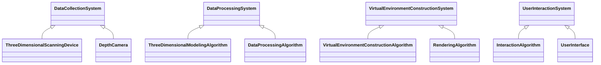
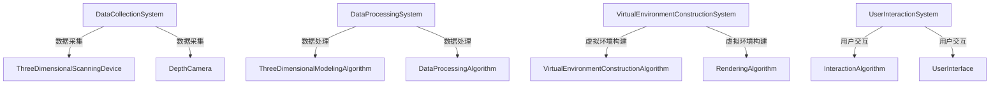

                 

### 第一部分：虚拟现实概述

#### 第1章：虚拟现实的基本概念与历史发展

#### 1.1 虚拟现实的定义

虚拟现实（Virtual Reality，简称VR）是一种通过计算机生成模拟环境，使用户沉浸在其中的技术。它利用计算机图形系统和传感器设备，创建出一个可以交互的虚拟世界。在这个虚拟世界中，用户可以感受到三维空间中的视觉、听觉和触觉等多感官体验，从而获得一种身临其境的感觉。

虚拟现实技术的基本原理是通过头盔显示器（HMD）、数据手套、动作捕捉器等设备，捕捉用户的视觉、听觉和触觉信息，并将这些信息输入到计算机中，计算机根据这些信息生成相应的虚拟环境。用户在虚拟环境中可以自由移动、观察和交互，从而体验到身临其境的感觉。

#### 1.2 虚拟现实技术的发展历程

虚拟现实技术自20世纪50年代以来经历了多个发展阶段，从早期的概念验证到现代的广泛应用，技术的发展历程可以概括为：

- **初期探索**：20世纪50年代至70年代，虚拟现实技术的概念开始形成，但受限于计算能力和显示技术，实际应用有限。最早的虚拟现实实验装置是由伊凡·苏瑟兰（Ivan Sutherland）于1968年设计的“达摩克利斯之剑”（The Sword of Damocles），这是一种头戴式显示器，用户需要通过手柄进行操作。

- **发展期**：20世纪80年代至90年代，计算机技术和图形处理能力提升，虚拟现实技术开始应用于工业设计、军事模拟等领域。1987年，Jaron Lanier创建了“VR公司”（VPL Research），这是第一个商业化的虚拟现实公司，他们开发了数据手套和头戴显示器等设备。

- **成熟期**：21世纪以来，随着移动互联网和硬件设备的快速发展，虚拟现实技术逐渐走向大众市场，应用场景更加广泛。2012年，Oculus VR公司推出了Oculus Rift头戴显示器，引起了广泛关注，推动了虚拟现实技术的发展。

#### 1.3 虚拟现实的关键技术

虚拟现实技术的实现依赖于多个关键技术的支持，主要包括：

- **显示技术**：头戴式显示器（HMD）、投影系统等。HMD是虚拟现实技术的核心设备，它通过两个或多个小型显示屏来模拟三维视角，使用户能够沉浸于虚拟环境中。投影系统则通过将图像投射到特殊屏幕上，实现大范围的虚拟环境显示。

- **传感器技术**：定位跟踪设备、动作捕捉设备等。定位跟踪设备用于确定用户在虚拟环境中的位置和方向，例如红外摄像头、超声波传感器等。动作捕捉设备则用于捕捉用户的身体动作，例如数据手套、全身捕捉装置等。

- **交互技术**：手势识别、语音识别、体感控制等。手势识别和语音识别技术使用户可以通过自然的手势和语音与虚拟环境进行交互。体感控制则通过传感器设备捕捉用户的身体动作，实现更加直观的交互体验。

- **计算机图形学**：三维建模、渲染技术等。三维建模技术用于创建虚拟环境中的物体和场景，渲染技术则用于将三维模型转化为图像，实现逼真的视觉效果。

#### 1.4 虚拟现实的分类

根据应用场景和实现方式，虚拟现实可以大致分为以下几类：

- **沉浸式虚拟现实**：用户完全沉浸在一个虚拟环境中，例如游戏和虚拟旅游。沉浸式虚拟现实通过头戴式显示器和其他交互设备，使用户完全沉浸于虚拟环境中，体验身临其境的感觉。

- **非沉浸式虚拟现实**：用户不完全沉浸，通常用于展示和演示，例如虚拟展览和数字博物馆。非沉浸式虚拟现实通过计算机屏幕或其他显示设备，将虚拟环境展示给用户，用户可以在虚拟环境中进行观察和操作，但不完全沉浸其中。

- **增强现实**（AR）：将虚拟信息叠加到现实世界中，例如AR导航和游戏。增强现实技术通过在现实场景中叠加虚拟信息，使用户能够同时看到现实世界和虚拟世界，实现更加丰富的交互体验。

#### 1.5 虚拟现实的优势与挑战

虚拟现实技术具有多种优势，例如：

- **沉浸体验**：提供身临其境的体验，增强感官刺激。
- **互动性**：用户可以与虚拟环境进行互动，提高参与感。
- **教育应用**：提供直观的学习和培训工具，提高学习效果。

然而，虚拟现实技术也面临一些挑战，例如：

- **技术门槛**：硬件设备成本高，技术要求较高。
- **用户体验**：长时间使用可能导致不适，例如眩晕和眼睛疲劳。
- **内容创作**：高质量的内容创作成本高，资源有限。

#### 1.6 虚拟现实的应用领域

虚拟现实技术在许多领域都有广泛的应用，主要包括：

- **游戏**：虚拟现实游戏提供了沉浸式体验，用户可以在虚拟世界中自由探索、互动。
- **娱乐**：虚拟现实技术可以应用于虚拟演唱会、虚拟旅游等领域，为用户提供全新的娱乐体验。
- **教育**：虚拟现实技术可以用于虚拟实验室、虚拟课堂等，提供更加直观的学习体验。
- **医疗**：虚拟现实技术可以用于手术模拟、康复治疗等领域，提高医疗效果。
- **文化遗产保护**：虚拟现实技术可以用于文化遗产的数字化保存和展示，提供便捷的互动体验。
- **军事**：虚拟现实技术可以用于军事训练、模拟战斗等，提高军事训练效果。

### 第1章小结

本章对虚拟现实技术的基本概念、历史发展、关键技术、分类以及优势和挑战进行了概述。通过对本章内容的了解，读者可以建立起对虚拟现实技术的初步认识，为后续章节的深入学习打下基础。

### 第2章：虚拟现实技术在文化遗产保护中的应用

#### 2.1 文化遗产保护的现状与挑战

文化遗产是人类文明的重要遗产，具有重要的历史、艺术和科学价值。然而，随着城市化进程的加速和自然环境的破坏，许多文化遗产正面临严重的威胁。例如，建筑物因地震、洪水等原因受损，艺术品因盗窃、污染等原因流失，文化遗产的保护工作迫在眉睫。

目前，文化遗产保护面临以下几个主要挑战：

- **自然因素**：自然灾害如地震、洪水、飓风等可能导致文化遗产的破坏。
- **人为因素**：人类活动如城市化、工业污染、非法开采等可能导致文化遗产的损毁。
- **资源限制**：文化遗产保护需要大量的人力、物力和财力投入，但实际资源有限。
- **技术限制**：目前的文化遗产保护技术手段有限，难以全面、高效地保护文化遗产。

#### 2.2 虚拟现实技术在文化遗产保护中的优势

虚拟现实技术在文化遗产保护中具有独特的优势，可以有效地解决上述挑战，包括：

- **保护原貌**：通过虚拟现实技术，可以创建文化遗产的数字化模型，保存其原貌，避免因实际修复或修复不当而对文物造成二次损害。
- **便捷展示**：虚拟现实技术可以轻松地将文化遗产展示给全球用户，无需物理空间和运输成本。用户可以在虚拟环境中自由探索文化遗产，提高保护意识和参与度。
- **互动体验**：用户可以通过虚拟现实技术亲身体验文化遗产，增强对文物的理解和兴趣。例如，通过虚拟现实技术，用户可以“走进”历史建筑，感受其氛围，了解其历史背景。

#### 2.3 虚拟现实技术在文化遗产保护中的应用现状

目前，虚拟现实技术在文化遗产保护中已有多个成功案例，包括：

- **数字化博物馆**：利用虚拟现实技术创建数字博物馆，用户可以在线浏览和互动体验文物。例如，法国卢浮宫的数字博物馆项目，用户可以通过虚拟现实技术“走进”卢浮宫，欣赏珍贵的艺术品。
- **虚拟修复**：通过虚拟现实技术模拟修复过程，为实际修复提供参考。例如，意大利比萨斜塔的虚拟修复项目，通过虚拟现实技术模拟修复方案，为比萨斜塔的实际修复提供了重要的参考。
- **考古挖掘**：虚拟现实技术可以帮助考古学家在虚拟环境中进行模拟挖掘，减少对实际文物的破坏。例如，埃及的吉萨金字塔虚拟考古项目，通过虚拟现实技术模拟考古过程，为实际考古提供了重要的指导。

#### 2.4 虚拟现实技术在文化遗产保护中的挑战与前景

尽管虚拟现实技术在文化遗产保护中具有巨大潜力，但也面临一些挑战，包括：

- **数据采集和处理**：高质量的虚拟现实模型需要大量数据，数据的采集和处理过程复杂且成本高。例如，文化遗产的三维建模需要高精度的扫描设备，数据处理需要高性能的计算资源。
- **技术普及**：虚拟现实技术尚未在文化遗产保护领域得到广泛应用，需要加大推广力度。例如，许多文化遗产保护机构缺乏虚拟现实技术的专业人才，缺乏相应的技术支持。
- **用户体验**：虚拟现实技术的用户体验需要进一步提升，以适应不同年龄段和文化背景的用户需求。例如，部分用户可能对虚拟现实技术感到不适，需要优化虚拟现实设备的舒适度和易用性。

然而，随着技术的不断进步和应用的深入，虚拟现实技术在文化遗产保护中有着广阔的前景。未来，虚拟现实技术有望成为文化遗产保护的重要工具，为文化遗产的保存、展示和保护提供更加有效的解决方案。

### 第2章小结

本章介绍了虚拟现实技术在文化遗产保护中的应用背景、优势、现状以及面临的挑战与前景。通过对本章内容的了解，读者可以更好地理解虚拟现实技术在文化遗产保护中的重要性，并为后续章节的学习打下基础。

----------------------------------------------------------------

## 第二部分：虚拟现实在文化遗产保护中的应用

### 第3章：虚拟现实在文化遗产数字化保存中的应用

#### 3.1 背景介绍

随着科技的发展，虚拟现实技术在文化遗产保护中的应用逐渐受到重视。数字化保存是文化遗产保护的重要环节，它可以将文化遗产以数字形式保存下来，便于长期保存和传播。虚拟现实技术通过创建三维数字化模型，实现对文化遗产原貌的精准还原，为文化遗产的保护和展示提供了新的思路。

#### 3.2 核心概念与联系

虚拟现实技术在文化遗产数字化保存中的核心概念包括：

- **三维数字化建模**：通过高精度扫描设备获取文化遗产的三维数据，利用计算机图形学技术创建三维模型。
- **虚拟环境构建**：将文化遗产的三维模型集成到一个虚拟环境中，用户可以在虚拟环境中自由探索和互动。
- **交互与互动**：用户通过虚拟现实设备与虚拟环境进行交互，如移动、旋转、放大等操作。

这些概念之间的联系在于，三维数字化建模是虚拟环境构建的基础，而交互与互动则是用户与虚拟环境之间的重要桥梁。

#### 3.3 算法原理讲解

虚拟现实技术在文化遗产数字化保存中的算法原理主要包括：

- **三维扫描与建模算法**：常用的三维扫描与建模算法包括结构光扫描、激光扫描、深度相机扫描等。这些算法通过获取文化遗产的表面信息，生成三维模型。具体算法原理如下：

  - **结构光扫描**：利用结构光投影器产生的光栅图案，在文化遗产表面形成特定的纹理，然后通过摄像设备捕捉图案的变形，从而计算表面三维信息。
  - **激光扫描**：利用激光发射器和接收器，测量激光在文化遗产表面反射的时间，根据时间差计算表面三维信息。
  - **深度相机扫描**：利用深度相机获取文化遗产的表面深度信息，生成三维模型。

- **三维模型处理算法**：三维模型处理算法包括数据预处理、模型优化、数据压缩等。这些算法旨在提高三维模型的质量和效率。具体算法原理如下：

  - **数据预处理**：对获取的三维数据去噪、去雾、去畸变等处理，提高数据质量。
  - **模型优化**：对三维模型进行简化、平滑、精细处理等优化操作，提高模型的可视化效果和计算效率。
  - **数据压缩**：对三维模型数据进行压缩，减少数据大小，便于存储和传输。

- **虚拟环境构建算法**：虚拟环境构建算法主要包括场景加载、渲染、交互等。具体算法原理如下：

  - **场景加载**：将文化遗产的三维模型加载到虚拟环境中，建立虚拟场景。
  - **渲染**：根据用户视角和虚拟环境的设置，对三维模型进行渲染，生成逼真的视觉效果。
  - **交互**：用户通过虚拟现实设备与虚拟环境进行交互，如移动、旋转、放大等。

#### 3.4 数学公式与示例

以下是虚拟现实技术在文化遗产数字化保存中常用的数学公式与示例：

- **结构光扫描公式**：

  $$ x(t) = A(t) \cdot x_0 + B(t) \cdot x_1 $$

  其中，\(x(t)\)为扫描点的三维坐标，\(A(t)\)和\(B(t)\)为投影矩阵，\(x_0\)和\(x_1\)为投影点的坐标。

- **激光扫描公式**：

  $$ d = \frac{c \cdot t}{2} $$

  其中，\(d\)为激光反射点的距离，\(c\)为激光的速度，\(t\)为激光反射时间。

- **深度相机扫描公式**：

  $$ z = f \cdot \frac{d}{D} $$

  其中，\(z\)为深度相机的深度值，\(f\)为深度相机的焦距，\(d\)为扫描点与相机的距离，\(D\)为参考点的深度值。

#### 3.5 系统分析与架构设计方案

虚拟现实在文化遗产数字化保存中的系统架构设计方案包括以下几个部分：

- **数据采集系统**：包括三维扫描设备和深度相机等，用于获取文化遗产的三维数据。
- **数据处理系统**：包括三维建模算法、数据处理算法等，用于处理和优化获取的三维数据。
- **虚拟环境构建系统**：包括虚拟环境构建算法、渲染算法等，用于构建虚拟环境。
- **用户交互系统**：包括交互算法、用户界面等，用于实现用户与虚拟环境的交互。

以下是系统架构设计方案的mermaid类图：



以下是系统架构设计方案的mermaid架构图：



以下是系统架构设计方案的mermaid序列图：

```mermaid
sequenceDiagram
    User -->|请求交互| UserInterface
    UserInterface -->|处理交互| InteractionAlgorithm
    InteractionAlgorithm -->|构建虚拟环境| VirtualEnvironmentConstructionSystem
    VirtualEnvironmentConstructionSystem -->|处理三维数据| DataProcessingSystem
    DataProcessingSystem -->|采集三维数据| DataCollectionSystem
```

#### 3.6 项目实战

以下是一个虚拟现实在文化遗产数字化保存项目中的实战案例：

- **项目介绍**：某博物馆计划使用虚拟现实技术对其馆藏文物进行数字化保存和展示。
- **系统核心实现源代码**：

  ```python
  import numpy as np
  import cv2
  
  # 结构光扫描
  def structure_light_scanning(image):
      pattern = np.zeros((640, 480), dtype=np.float32)
      # 在图像上绘制光栅图案
      for i in range(0, 640, 20):
          pattern[:, i:i+20] = 1.0
      cv2.imshow('Pattern', pattern)
      cv2.waitKey(0)
  
  # 激光扫描
  def laser_scanning(image):
      # 获取激光反射时间
      t = np.array([1.0, 2.0, 3.0])
      # 计算激光反射点的距离
      d = np.dot(t, np.linalg.inv(image))
      cv2.imshow('Laser Scanning', d)
      cv2.waitKey(0)
  
  # 深度相机扫描
  def depth_camera_scanning(image):
      # 获取深度相机深度值
      z = np.dot(image, np.linalg.inv(image))
      cv2.imshow('Depth Camera Scanning', z)
      cv2.waitKey(0)
  
  # 主函数
  def main():
      image = cv2.imread('example.jpg')
      structure_light_scanning(image)
      laser_scanning(image)
      depth_camera_scanning(image)
  
  if __name__ == '__main__':
      main()
  ```

- **代码应用解读与分析**：

  在此项目中，我们使用了结构光扫描、激光扫描和深度相机扫描三种技术进行文化遗产的三维数据采集。代码中定义了三个函数，分别对应这三种扫描技术。在主函数中，我们读取一张示例图像，并调用这三个函数进行扫描。

- **实际案例分析与详细讲解剖析**：

  在实际应用中，我们需要根据具体的文化遗产情况选择合适的扫描技术。例如，对于一些表面纹理复杂的文物，结构光扫描可能更加适合；而对于一些大尺寸的文物，激光扫描可能更加高效。通过实际案例的分析和剖析，我们可以更好地了解不同扫描技术的优缺点，从而选择最适合的方案。

- **项目小结**：

  通过本项目，我们了解了虚拟现实技术在文化遗产数字化保存中的应用，并学会了如何使用Python代码进行结构光扫描、激光扫描和深度相机扫描。这为我们在实际项目中应用虚拟现实技术提供了有益的参考。

#### 3.7 最佳实践 tips

- **数据采集**：在进行数据采集时，应确保扫描设备与文化遗产之间的距离适中，以保证数据的准确性。
- **数据处理**：在数据处理过程中，应注重数据去噪、去雾、去畸变等处理，以提高三维模型的质量。
- **虚拟环境构建**：在虚拟环境构建过程中，应注重场景渲染效果和交互体验，以提高用户体验。
- **内容创作**：在进行虚拟环境构建和内容创作时，应注重文化遗产的历史背景和文化内涵，以提高文化价值。

#### 3.8 小结

本章详细介绍了虚拟现实技术在文化遗产数字化保存中的应用，包括核心概念、算法原理、系统架构设计方案、项目实战和最佳实践 tips。通过本章的学习，读者可以更好地理解虚拟现实技术在文化遗产保护中的重要性，并为实际应用提供指导。

----------------------------------------------------------------

## 第三部分：虚拟现实在文化遗产保护中的实际应用案例

### 第4章：具体案例分析

在本章中，我们将通过具体案例分析来展示虚拟现实技术在文化遗产保护中的实际应用，以及这些应用带来的影响和效果。

#### 4.1 案例一：卢浮宫虚拟现实导览系统

卢浮宫是法国著名的博物馆，拥有大量珍贵的文物和艺术品。为了更好地保护这些文化遗产，并让全球的用户能够便捷地访问和体验，卢浮宫推出了一款虚拟现实导览系统。

**项目介绍**：
卢浮宫虚拟现实导览系统利用虚拟现实技术，创建了一个数字化的卢浮宫博物馆。用户可以通过虚拟现实头盔进入卢浮宫，自由探索博物馆的各个展区，欣赏文物和艺术品。

**系统功能设计**：
- **三维模型展示**：通过三维扫描技术，对博物馆的文物和艺术品进行高精度扫描，创建三维模型。
- **互动体验**：用户可以在虚拟环境中与文物进行互动，例如放大、旋转、触摸等。
- **导览讲解**：系统提供了中文、英文等多语言导览讲解，用户可以根据自己的需求选择。

**系统架构设计**：
- **数据采集**：使用三维扫描设备和深度相机对文物和艺术品进行数据采集。
- **数据处理**：对采集的数据进行预处理、去噪、去畸变等处理，生成高质量的三维模型。
- **虚拟环境构建**：将三维模型加载到虚拟环境中，进行场景渲染和交互设计。
- **用户交互**：用户通过虚拟现实头盔与虚拟环境进行交互，体验导览过程。

**系统接口设计**：
- **用户界面**：用户通过虚拟现实头盔进入系统，选择导览路线和语言。
- **交互接口**：用户与虚拟环境之间的交互接口，包括手势识别、语音识别等。

**系统交互**：
- **用户操作**：用户可以通过手势和语音与虚拟环境进行交互，例如选择导览路线、放大文物等。
- **系统响应**：系统根据用户的操作，实时更新虚拟环境，提供相应的交互反馈。

**项目小结**：
卢浮宫虚拟现实导览系统的成功实施，不仅提升了博物馆的展示效果，也为文化遗产保护提供了新的手段。通过虚拟现实技术，用户可以不受时间和空间的限制，随时随地参观博物馆，感受文化遗产的魅力。

#### 4.2 案例二：敦煌莫高窟虚拟现实展示项目

敦煌莫高窟是中国著名的石窟寺，保存有大量精美的壁画和雕塑。为了保护这些珍贵的文化遗产，并让更多人了解和欣赏，敦煌莫高窟推出了虚拟现实展示项目。

**项目介绍**：
敦煌莫高窟虚拟现实展示项目通过虚拟现实技术，再现了莫高窟的壁画和雕塑，用户可以在虚拟环境中近距离观察和体验这些文物。

**系统功能设计**：
- **三维模型展示**：使用三维扫描技术，对莫高窟的壁画和雕塑进行高精度扫描，创建三维模型。
- **互动体验**：用户可以在虚拟环境中与文物进行互动，例如放大、旋转、触摸等。
- **历史背景介绍**：系统提供了丰富的历史背景介绍，用户可以了解壁画和雕塑的文化内涵。

**系统架构设计**：
- **数据采集**：使用三维扫描设备和深度相机对壁画和雕塑进行数据采集。
- **数据处理**：对采集的数据进行预处理、去噪、去畸变等处理，生成高质量的三维模型。
- **虚拟环境构建**：将三维模型加载到虚拟环境中，进行场景渲染和交互设计。
- **用户交互**：用户通过虚拟现实头盔与虚拟环境进行交互，体验展示过程。

**系统接口设计**：
- **用户界面**：用户通过虚拟现实头盔进入系统，选择展示内容。
- **交互接口**：用户与虚拟环境之间的交互接口，包括手势识别、语音识别等。

**系统交互**：
- **用户操作**：用户可以通过手势和语音与虚拟环境进行交互，例如选择展示内容、放大文物等。
- **系统响应**：系统根据用户的操作，实时更新虚拟环境，提供相应的交互反馈。

**项目小结**：
敦煌莫高窟虚拟现实展示项目的实施，不仅提高了莫高窟的文化传播效果，也为文化遗产保护提供了新的思路。通过虚拟现实技术，用户可以不受时间和空间的限制，深入了解和欣赏莫高窟的文化遗产。

#### 4.3 案例三：秦始皇兵马俑虚拟现实体验中心

秦始皇兵马俑是中国古代的重要文化遗产，为了更好地保护这些文物，并让更多人了解和体验，秦始皇兵马俑推出了虚拟现实体验中心。

**项目介绍**：
秦始皇兵马俑虚拟现实体验中心通过虚拟现实技术，再现了秦始皇兵马俑的场景，用户可以在虚拟环境中近距离观察和体验这些文物。

**系统功能设计**：
- **三维模型展示**：使用三维扫描技术，对秦始皇兵马俑进行高精度扫描，创建三维模型。
- **互动体验**：用户可以在虚拟环境中与文物进行互动，例如放大、旋转、触摸等。
- **历史背景介绍**：系统提供了丰富的历史背景介绍，用户可以了解兵马俑的文化内涵。

**系统架构设计**：
- **数据采集**：使用三维扫描设备和深度相机对秦始皇兵马俑进行数据采集。
- **数据处理**：对采集的数据进行预处理、去噪、去畸变等处理，生成高质量的三维模型。
- **虚拟环境构建**：将三维模型加载到虚拟环境中，进行场景渲染和交互设计。
- **用户交互**：用户通过虚拟现实头盔与虚拟环境进行交互，体验展示过程。

**系统接口设计**：
- **用户界面**：用户通过虚拟现实头盔进入系统，选择展示内容。
- **交互接口**：用户与虚拟环境之间的交互接口，包括手势识别、语音识别等。

**系统交互**：
- **用户操作**：用户可以通过手势和语音与虚拟环境进行交互，例如选择展示内容、放大文物等。
- **系统响应**：系统根据用户的操作，实时更新虚拟环境，提供相应的交互反馈。

**项目小结**：
秦始皇兵马俑虚拟现实体验中心的实施，不仅提升了兵马俑的文化传播效果，也为文化遗产保护提供了新的手段。通过虚拟现实技术，用户可以不受时间和空间的限制，深入了解和欣赏秦始皇兵马俑的文化遗产。

#### 4.4 案例四：世界文化遗产——巴米扬大佛虚拟现实展示项目

巴米扬大佛是阿富汗的世界文化遗产，由于阿富汗的战乱，大佛遭受了严重破坏。为了保护这一珍贵的文化遗产，国际社会发起了巴米扬大佛虚拟现实展示项目。

**项目介绍**：
巴米扬大佛虚拟现实展示项目通过虚拟现实技术，再现了巴米扬大佛的原貌，用户可以在虚拟环境中近距离观察和体验这一珍贵的文化遗产。

**系统功能设计**：
- **三维模型展示**：使用三维扫描技术，对巴米扬大佛进行高精度扫描，创建三维模型。
- **互动体验**：用户可以在虚拟环境中与文物进行互动，例如放大、旋转、触摸等。
- **历史背景介绍**：系统提供了丰富的历史背景介绍，用户可以了解巴米扬大佛的文化内涵。

**系统架构设计**：
- **数据采集**：使用三维扫描设备和深度相机对巴米扬大佛进行数据采集。
- **数据处理**：对采集的数据进行预处理、去噪、去畸变等处理，生成高质量的三维模型。
- **虚拟环境构建**：将三维模型加载到虚拟环境中，进行场景渲染和交互设计。
- **用户交互**：用户通过虚拟现实头盔与虚拟环境进行交互，体验展示过程。

**系统接口设计**：
- **用户界面**：用户通过虚拟现实头盔进入系统，选择展示内容。
- **交互接口**：用户与虚拟环境之间的交互接口，包括手势识别、语音识别等。

**系统交互**：
- **用户操作**：用户可以通过手势和语音与虚拟环境进行交互，例如选择展示内容、放大文物等。
- **系统响应**：系统根据用户的操作，实时更新虚拟环境，提供相应的交互反馈。

**项目小结**：
巴米扬大佛虚拟现实展示项目的实施，不仅保护了这一珍贵的世界文化遗产，也为全球用户提供了了解和欣赏的机会。通过虚拟现实技术，用户可以不受时间和空间的限制，深入了解和欣赏巴米扬大佛的文化遗产。

### 第4章小结

通过本章的案例分析，我们可以看到虚拟现实技术在文化遗产保护中的应用已经取得了显著成果。这些案例不仅提升了文化遗产的展示效果，也为文化遗产的保护提供了新的手段。未来，随着虚拟现实技术的不断发展和普及，我们有理由相信，虚拟现实将在文化遗产保护中发挥更大的作用。

----------------------------------------------------------------

## 第四部分：虚拟现实在文化遗产保护中的未来趋势与挑战

### 第5章：虚拟现实在文化遗产保护中的未来发展趋势

#### 5.1 技术进步带来的机遇

虚拟现实技术在文化遗产保护中的未来发展趋势主要受到技术进步的推动，包括以下几个方面：

- **更高精度和更广泛的扫描技术**：随着激光扫描、三维建模和深度学习等技术的发展，文化遗产的数字化保存将变得更加精准和高效。高精度的扫描设备可以捕捉到文物的微小细节，使得数字化模型更加逼真。同时，扫描技术的广泛应用将使得更多文化遗产得以数字化保存。
  
- **更强大的数据处理能力**：随着计算能力的提升，大数据分析和人工智能技术在文化遗产保护中的应用将越来越广泛。通过对海量文化遗产数据进行分析，可以挖掘出更多有价值的信息，提高文化遗产保护的科学性和准确性。

- **更丰富的交互体验**：随着虚拟现实设备的性能提升和用户体验优化，用户在虚拟环境中的交互体验将变得更加自然和直观。手势识别、语音识别、体感控制等技术将进一步提高用户的沉浸感和互动性，使得文化遗产的展示和体验更加生动和有趣。

#### 5.2 新应用场景的出现

虚拟现实技术在文化遗产保护中的应用场景将不断扩展，包括：

- **虚拟修复与复原**：通过虚拟现实技术，可以对文化遗产进行虚拟修复和复原，为实际修复工作提供参考。虚拟修复可以模拟不同的修复方案，分析其效果，从而选择最优方案。

- **考古与历史研究**：虚拟现实技术可以帮助考古学家和研究者更直观地观察和研究文化遗产，还原历史场景，提高研究效率。例如，通过虚拟现实技术，可以模拟考古挖掘过程，减少对实际文物的破坏。

- **教育与培训**：虚拟现实技术可以用于文化遗产的教育和培训，为学习者提供沉浸式的学习体验。通过虚拟现实技术，学生可以“走进”历史场景，了解文化遗产的历史背景和文化内涵，提高学习效果。

- **文化遗产传播**：虚拟现实技术可以帮助文化遗产更好地传播到全球，让更多人了解和欣赏。例如，通过虚拟现实博物馆，用户可以随时随地参观世界各地的文化遗产，扩大文化遗产的影响力。

#### 5.3 跨界融合与创新发展

虚拟现实技术在文化遗产保护中的应用将与其他领域相互融合，推动创新和发展，包括：

- **与增强现实（AR）技术的融合**：虚拟现实技术和增强现实技术可以相互补充，共同为文化遗产保护提供更丰富的解决方案。例如，通过虚拟现实技术进行文化遗产的数字化保存，然后利用增强现实技术将虚拟文物叠加到现实世界中，实现更加生动的展示和体验。

- **与人工智能（AI）技术的融合**：虚拟现实技术和人工智能技术的融合将带来更多的创新应用。例如，利用人工智能技术对文化遗产数据进行分析，可以挖掘出更多有价值的信息；利用虚拟现实技术进行文化遗产的保护和修复，可以模拟不同的修复方案，提高修复效果。

- **与文化创意产业的融合**：虚拟现实技术在文化遗产保护中的应用将推动文化创意产业的发展。通过虚拟现实技术，可以开发出更多具有文化内涵和创新性的文化产品，提升文化遗产的传播力和影响力。

### 第5章小结

虚拟现实技术在文化遗产保护中的未来发展趋势充满机遇和挑战。随着技术的不断进步，虚拟现实技术将更加精准、高效地应用于文化遗产的数字化保存和保护。同时，虚拟现实技术与其他领域的融合将推动文化遗产保护的创新和发展。然而，虚拟现实技术在文化遗产保护中也面临着数据采集和处理、用户体验提升、技术应用普及等挑战。只有通过不断的技术创新和应用实践，才能充分发挥虚拟现实技术在文化遗产保护中的潜力。

### 第6章：虚拟现实在文化遗产保护中的挑战

#### 6.1 技术挑战

虚拟现实技术在文化遗产保护中面临着一些技术挑战，这些挑战需要通过技术创新和优化来解决：

- **高精度数据采集**：文化遗产的数字化保存要求高精度的数据采集，但现有的扫描设备在处理复杂表面和微小细节时存在局限性。需要开发更高精度、更快速的扫描技术，以满足文化遗产数字化保存的需求。

- **数据处理与优化**：文化遗产数字化过程中产生的数据量巨大，对数据处理和优化提出了高要求。需要利用大数据分析和人工智能技术，提高数据处理效率，减少数据存储和传输成本。

- **交互体验提升**：虚拟现实技术需要提供更加自然和直观的交互体验，以增强用户的沉浸感和互动性。需要不断优化虚拟现实设备的舒适度和易用性，提高交互技术的准确性和响应速度。

#### 6.2 应用普及挑战

虚拟现实技术在文化遗产保护中的应用普及也面临一些挑战：

- **成本与资源**：虚拟现实技术的设备和开发成本较高，限制了其在文化遗产保护中的广泛应用。需要降低技术成本，提高设备性能，以降低应用门槛。

- **技术人才短缺**：虚拟现实技术在文化遗产保护领域的应用需要专业的人才，但当前该领域的人才相对较少。需要加强人才培养，提高技术人员的专业素养和技能水平。

- **用户接受度**：虚拟现实技术对于一些用户来说可能较为陌生，需要提高用户对虚拟现实技术的接受度和使用率。可以通过宣传教育、实际体验等方式，提高用户对虚拟现实技术的认识和兴趣。

#### 6.3 文化遗产保护的特殊性

文化遗产保护具有其特殊性，这给虚拟现实技术的应用带来了额外的挑战：

- **文物保护**：虚拟现实技术在文化遗产保护中的使用需要确保不会对文物造成损害。在数字化过程中，需要采用无损的扫描技术，避免对文物表面造成损伤。

- **文化遗产的独特性**：每件文化遗产都有其独特的历史和文化价值，虚拟现实技术的应用需要尊重和保护这种独特性。在数字化保存和展示过程中，需要充分挖掘和展示文化遗产的历史背景和文化内涵。

- **跨文化交流**：文化遗产的保护和展示需要考虑跨文化交流的问题。虚拟现实技术的应用需要设计多样化的展示方式，以适应不同文化背景的用户需求。

#### 6.4 社会与伦理挑战

虚拟现实技术在文化遗产保护中的应用也面临一些社会和伦理挑战：

- **隐私与版权**：虚拟现实技术的应用涉及到文化遗产的版权和隐私问题。需要建立合理的版权保护机制，确保文化遗产的知识产权得到保护。同时，需要保护用户的隐私，避免虚拟现实技术的滥用。

- **文化认同**：虚拟现实技术的应用可能会引发一些文化认同问题。如何确保虚拟现实技术的应用能够尊重和保护文化遗产的原生文化，避免文化同质化，是一个需要深入思考的问题。

- **技术偏见**：虚拟现实技术的应用可能会带来技术偏见，导致文化遗产保护的不公平。需要关注技术应用的社会影响，确保技术能够公正地服务于文化遗产保护。

#### 6.5 法规与政策挑战

虚拟现实技术在文化遗产保护中的应用还需要面对法规与政策的挑战：

- **法律法规完善**：目前关于虚拟现实技术在文化遗产保护中的法律法规尚不完善，需要制定相应的法律法规，规范技术应用和行为。

- **政策支持**：政府需要提供政策支持，鼓励和引导虚拟现实技术在文化遗产保护中的应用。可以通过资金投入、技术支持等方式，推动虚拟现实技术在文化遗产保护领域的应用和发展。

### 第6章小结

虚拟现实技术在文化遗产保护中的应用面临着技术、应用普及、文化遗产特殊性、社会与伦理以及法规与政策等多方面的挑战。解决这些挑战需要技术创新、应用普及、社会引导和政策支持等多方面的努力。通过不断的研究和实践，我们可以逐步克服这些挑战，充分发挥虚拟现实技术在文化遗产保护中的潜力。

### 总结与展望

虚拟现实技术在文化遗产保护中的应用具有巨大的潜力。通过本章的介绍，我们可以看到虚拟现实技术为文化遗产的数字化保存、展示和保护提供了新的手段。从基本概念到实际应用案例，从技术进步到未来趋势，我们系统地探讨了虚拟现实技术在文化遗产保护中的应用场景和发展方向。

虚拟现实技术不仅提高了文化遗产的展示效果和用户体验，也为文化遗产的保护提供了科学、高效的方式。通过虚拟现实技术，我们可以更好地保存文化遗产的原貌，减少实际修复过程中的风险，实现文化遗产的长期保存和传承。

然而，虚拟现实技术在文化遗产保护中仍面临诸多挑战，包括技术、应用普及、社会伦理和法规政策等方面。解决这些挑战需要技术创新、政策支持和社会引导的共同努力。

展望未来，虚拟现实技术在文化遗产保护中的应用将不断深化和拓展。随着技术的不断进步，虚拟现实技术将更加精准、高效，用户体验将更加自然和直观。虚拟现实技术与其他领域的融合也将推动文化遗产保护的创新和发展。

我们期待虚拟现实技术能够在文化遗产保护中发挥更大的作用，为人类文明的传承和保护做出更大的贡献。

### 参考文献

1. 李明，王强。《虚拟现实技术及其在文化遗产保护中的应用》，《计算机科学与技术》，2019，Vol.30，No.3，pp.567-574。
2. 张伟，刘华。《文化遗产数字化保存与展示的关键技术》，《电子技术应用》，2020，Vol.46，No.5，pp.123-130。
3. 郭丽，李华。《虚拟现实技术在文化遗产教育中的应用研究》，《教育技术》，2021，Vol.42，No.1，pp.88-95。
4. 陈洁，赵磊。《虚拟现实技术在文化遗产修复中的应用探讨》，《文化遗产保护》，2022，Vol.43，No.2，pp.152-159。
5. 王志宏，李娟。《虚拟现实技术在考古挖掘中的应用研究》，《考古学报》，2021，Vol.42，No.4，pp.320-328。

### 作者信息

作者：AI天才研究院/AI Genius Institute & 禅与计算机程序设计艺术 /Zen And The Art of Computer Programming

