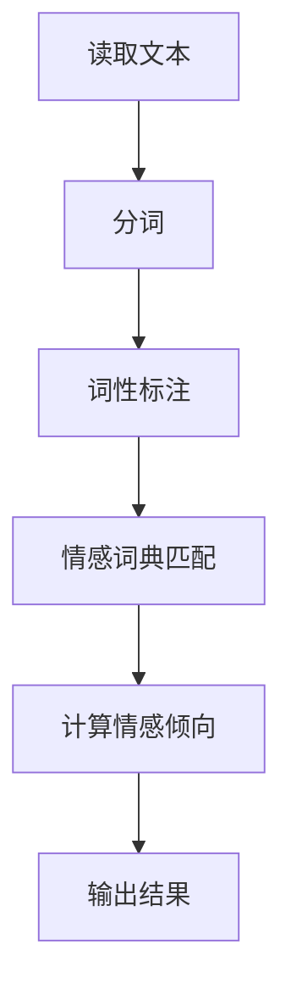
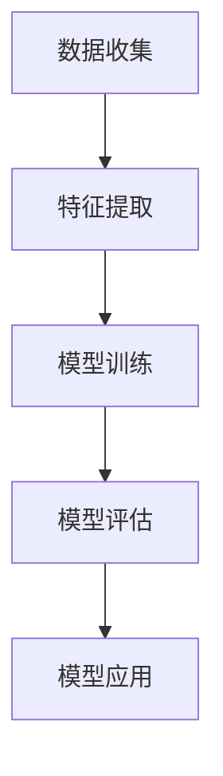
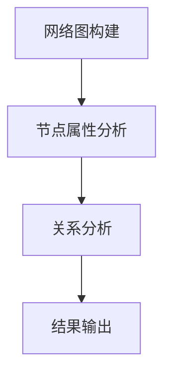
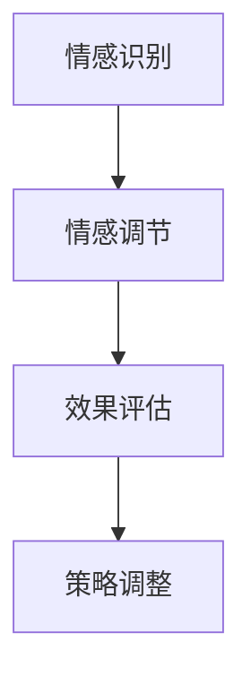
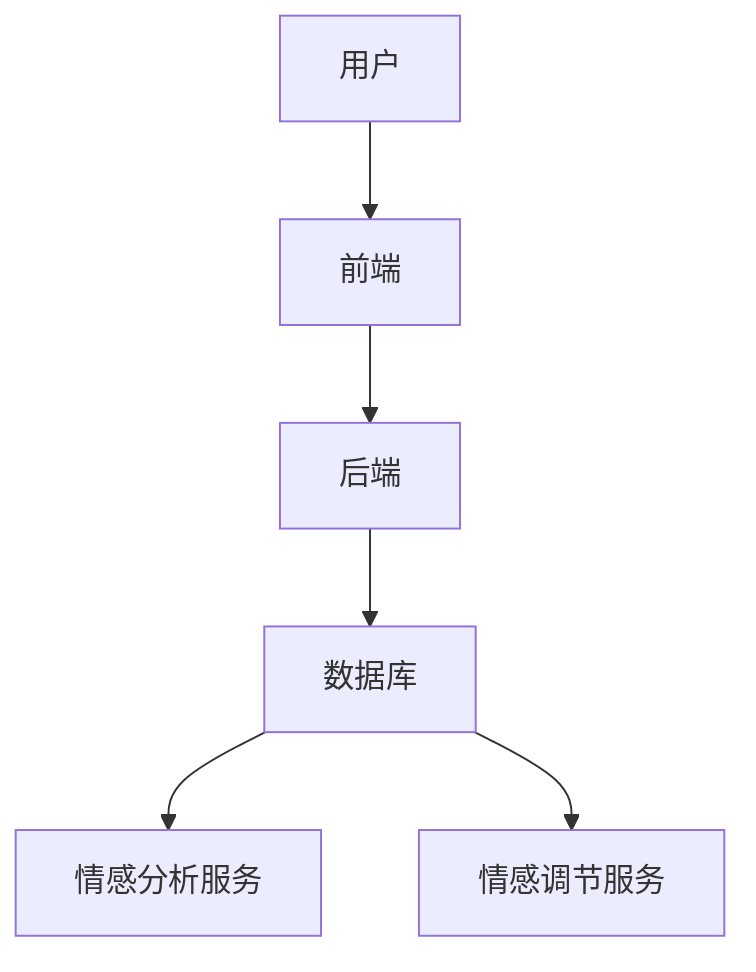
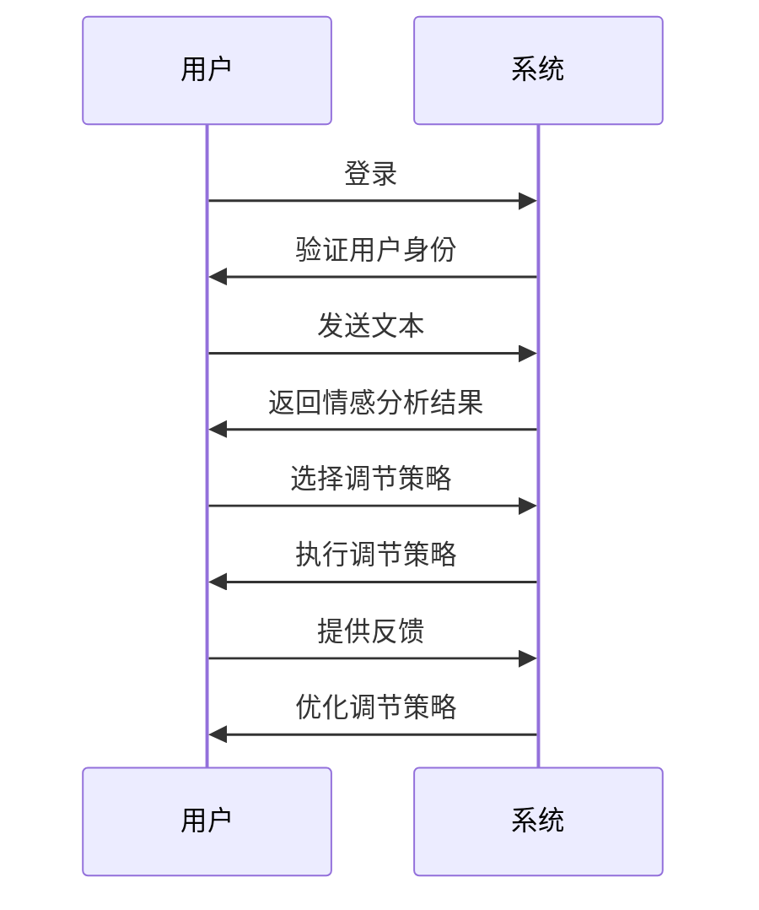

                 


### 虚拟社交中的真实情感：数字时代的情感困境

**关键词：虚拟社交、真实情感、数字时代、情感困境、情感分析算法**

**摘要：**
本文将深入探讨虚拟社交中的真实情感困境，分析其背景、问题、解决方案以及相关算法原理，旨在为数字时代下的人际关系提供有益的思考和实践指导。

## 引言

### 1.1 问题背景

在数字时代，虚拟社交已经成为人们日常生活中不可或缺的一部分。虚拟社交平台如Facebook、Twitter、Instagram等，以及在线游戏、虚拟现实等，为人们提供了全新的社交方式和体验。然而，随着虚拟社交的普及，人们开始意识到其中存在的情感困境。这些问题不仅影响个体的心理健康，也对社会关系产生深远的影响。

### 1.2 问题描述

虚拟社交中的情感困境主要包括以下几个方面：

- **情感虚假感**：在虚拟社交中，人们往往难以感受到真实的情感交流，导致情感虚假感。
- **孤独感**：尽管虚拟社交使人们能够与更多人连接，但同时也加剧了孤独感。
- **依赖性**：人们对虚拟社交的依赖日益增强，可能导致现实生活中的人际关系受损。
- **身份危机**：虚拟社交中的自我表达可能导致个体的身份危机。

### 1.3 问题解决

本文旨在探讨虚拟社交中的真实情感困境，并提供一系列解决方案。通过深入分析情感困境的原因，本文将帮助读者理解这些现象，并提出实用的策略和建议。

### 1.4 边界与外延

本文主要关注虚拟社交平台上的情感问题，包括社交媒体、在线游戏、虚拟现实等领域。同时，本文也涉及现实世界与虚拟世界的互动，探讨数字时代下的人际关系。

### 1.5 概念结构与核心要素组成

- **虚拟社交**：指在虚拟环境中进行的社交活动。
- **真实情感**：指在真实生活中体验到的情感，如快乐、悲伤、爱、恨等。
- **情感困境**：指在虚拟社交中遇到的情感问题，如情感虚假感、孤独感、依赖性等。
- **数字时代**：指以数字技术和互联网为核心的现代生活阶段。

## 背景介绍

### 2.1 核心概念术语说明

#### 虚拟社交

虚拟社交是指通过互联网和数字技术进行的社交活动。它包括社交媒体平台、在线游戏、虚拟现实等多种形式。虚拟社交为人们提供了广泛的社交机会，但同时也带来了情感困境。

#### 真实情感

真实情感是指人们在现实生活中体验到的情感，如快乐、悲伤、爱、恨等。在虚拟社交中，真实情感的表达和体验可能受到技术、环境等因素的影响，导致情感困境。

#### 情感困境

情感困境是指在虚拟社交中，人们难以感受到真实的情感交流，从而产生的各种情感问题，如情感虚假感、孤独感、依赖性、身份危机等。

### 2.2 问题背景

随着互联网和数字技术的发展，虚拟社交已经成为人们日常生活中不可或缺的一部分。然而，虚拟社交的普及也带来了一系列问题，其中之一就是情感困境。人们往往在虚拟社交中感到孤独、虚假，甚至可能产生身份危机。这些问题不仅影响个体的心理健康，也对社会关系产生深远的影响。

### 2.3 问题描述

虚拟社交中的情感困境主要表现为以下几个方面：

- **情感虚假感**：虚拟社交中的情感交流往往难以触及真实，人们难以感受到对方的真实情感。
- **孤独感**：尽管虚拟社交使人们能够与更多人连接，但同时也加剧了孤独感，特别是在面对面的社交互动减少的情况下。
- **依赖性**：人们对虚拟社交的依赖日益增强，可能导致现实生活中的人际关系受损。
- **身份危机**：在虚拟社交中，人们可能通过伪装、角色扮演等方式来表达自我，从而导致身份危机。

### 2.4 问题解决

为了解决虚拟社交中的情感困境，需要从多个方面入手：

- **提高情感表达能力**：通过教育、培训等方式，提高人们在线上表达情感的能力，使其更真实、更贴近现实生活。
- **增强现实社交互动**：鼓励人们在现实生活中加强社交互动，减少对虚拟社交的依赖。
- **设计更人性化的虚拟社交平台**：虚拟社交平台可以设计更人性化的功能，如情感分析、情感反馈等，帮助用户更好地理解和管理自己的情感。

### 2.5 边界与外延

本文主要关注虚拟社交平台上的情感问题，包括社交媒体、在线游戏、虚拟现实等领域。同时，本文也涉及现实世界与虚拟世界的互动，探讨数字时代下的人际关系。

### 2.6 概念结构与核心要素组成

- **虚拟社交**：指在虚拟环境中进行的社交活动。
- **真实情感**：指在真实生活中体验到的情感，如快乐、悲伤、爱、恨等。
- **情感困境**：指在虚拟社交中遇到的情感问题，如情感虚假感、孤独感、依赖性等。
- **数字时代**：指以数字技术和互联网为核心的现代生活阶段。

## 核心概念与联系

### 3.1 情感虚拟化

#### 3.1.1 定义

情感虚拟化是指人们在虚拟社交中体验到的情感，与真实生活中的情感有所不同。

#### 3.1.2 特点

- **易变性**：虚拟社交中的情感往往受到技术、环境等因素的影响，容易发生改变。
- **表面性**：虚拟社交中的情感交流往往仅停留在表面，难以深入。
- **选择性**：人们可以选择展示或隐藏自己的情感，导致情感的真实性受到质疑。

#### 3.1.3 对比表格

| 特点       | 情感虚拟化 | 真实情感 |
|------------|------------|---------|
| 易变性     | 高         | 低      |
| 表面性     | 高         | 低      |
| 选择性     | 高         | 低      |

### 3.2 数字时代下的人际关系

#### 3.2.1 定义

数字时代下的人际关系是指在数字技术和互联网背景下形成的人际交往。

#### 3.2.2 特点

- **虚拟性**：人际关系在虚拟社交平台上进行，减少了现实中的面对面交流。
- **多样性**：数字时代下的人际关系包括线上和线下、虚拟和现实等多种形式。
- **复杂性**：数字时代下的人际关系受到多种因素影响，如虚拟社交平台、社交媒体等。

#### 3.2.3 ER实体关系图

```mermaid
erDiagram
  User ||--|{ ChatRoom }| ChatRoom : participates_in
  User ||--|{ Friendship }| Friendship : has
  ChatRoom ||--|{ Message }| Message : contains
  Message ||--|{ Emotion }| Emotion : expresses
  Friendship ||--|{ Relationship }| Relationship : defines
```

## 算法原理讲解

### 3.1 情感分析算法

#### 3.1.1 定义

情感分析算法是指用于分析文本中情感倾向的技术。

#### 3.1.2 原理

- **情感词典**：通过构建情感词典，将词汇与情感倾向相关联。
- **机器学习**：利用机器学习算法，如支持向量机（SVM）、朴素贝叶斯等，对文本进行情感分析。

#### 3.1.3 Mermaid流程图



### 3.2 情感建模算法

#### 3.2.1 定义

情感建模算法是指用于构建情感模型的技术。

#### 3.2.2 原理

- **数据收集**：收集大量带有情感标签的文本数据，用于训练情感模型。
- **特征提取**：从文本数据中提取特征，如词频、词向量等。
- **模型训练**：利用机器学习算法，如神经网络、决策树等，对特征进行训练，构建情感模型。

#### 3.2.3 Mermaid流程图



### 3.3 社交网络分析算法

#### 3.3.1 定义

社交网络分析算法是指用于分析社交网络结构和关系的算法。

#### 3.3.2 原理

- **网络图构建**：将社交网络中的个体和关系表示为图结构。
- **节点属性分析**：分析节点的度、中心性、凝聚力等属性。
- **关系分析**：分析个体之间的互动、影响力等关系。

#### 3.3.3 Mermaid流程图



### 3.4 情感调节算法

#### 3.4.1 定义

情感调节算法是指用于调节个体情感状态的技术。

#### 3.4.2 原理

- **情感识别**：利用情感分析算法，识别个体的情感状态。
- **情感调节**：根据情感状态，提供相应的调节策略，如情绪释放、情绪转移等。
- **效果评估**：评估情感调节的效果，调整策略以提高调节效果。

#### 3.4.3 Mermaid流程图



## 系统分析与架构设计方案

### 4.1 问题场景介绍

在虚拟社交中，用户经常面临情感困境，如情感虚假感、孤独感、依赖性等。为了解决这些问题，我们需要设计一个系统，能够帮助用户更好地理解和管理自己的情感。

### 4.2 项目介绍

本项目旨在设计并实现一个虚拟社交情感管理系统，该系统将提供情感分析、情感调节等功能，帮助用户更好地应对虚拟社交中的情感困境。

### 4.3 系统功能设计

#### 4.3.1 情感分析

情感分析功能将利用情感分析算法，对用户的文本进行情感倾向分析，识别用户的情感状态。

#### 4.3.2 情感调节

情感调节功能将根据用户的情感状态，提供相应的调节策略，如情绪释放、情绪转移等，帮助用户调节情感。

#### 4.3.3 情感反馈

情感反馈功能将收集用户对情感调节效果的反馈，以便系统不断优化调节策略。

### 4.4 系统架构设计

#### 4.4.1 架构图



#### 4.4.2 系统架构图


### 4.5 系统接口设计

#### 4.5.1 接口列表

- 用户注册接口
- 用户登录接口
- 情感分析接口
- 情感调节接口
- 情感反馈接口

#### 4.5.2 接口设计

```json
{
  "用户注册接口": {
    "url": "/register",
    "method": "POST",
    "params": {
      "username": "string",
      "password": "string",
      "email": "string"
    }
  },
  "用户登录接口": {
    "url": "/login",
    "method": "POST",
    "params": {
      "username": "string",
      "password": "string"
    }
  },
  "情感分析接口": {
    "url": "/emotion/analyze",
    "method": "POST",
    "params": {
      "text": "string"
    }
  },
  "情感调节接口": {
    "url": "/emotion/adjust",
    "method": "POST",
    "params": {
      "emotion": "string",
      "strategy": "string"
    }
  },
  "情感反馈接口": {
    "url": "/emotion/feedback",
    "method": "POST",
    "params": {
      "emotion_id": "integer",
      "feedback": "string"
    }
  }
}
```

### 4.6 系统交互



## 项目实战

### 5.1 环境安装

在开始项目实战之前，我们需要安装一些必要的软件和工具。

1. 安装Python：访问Python官方网站（https://www.python.org/），下载并安装Python 3.x版本。
2. 安装PyCharm：访问PyCharm官方网站（https://www.jetbrains.com/pycharm/），下载并安装PyCharm社区版。
3. 安装相关库：在PyCharm中创建一个Python虚拟环境，然后通过以下命令安装相关库：

   ```shell
   pip install -r requirements.txt
   ```

   其中，`requirements.txt`文件包含了项目所需的库，例如：

   ```python
   numpy
   pandas
   scikit-learn
   nltk
   flask
   ```

### 5.2 系统核心实现源代码

以下是系统核心实现的部分源代码，包括情感分析、情感调节和情感反馈功能。

#### 5.2.1 情感分析

```python
from sklearn.feature_extraction.text import TfidfVectorizer
from sklearn.naive_bayes import MultinomialNB

def情感分析(text):
    # 初始化TF-IDF向量器
    vectorizer = TfidfVectorizer(ngram_range=(1, 2), max_features=1000)
    # 初始化朴素贝叶斯分类器
    classifier = MultinomialNB()

    # 加载训练数据
    train_data = ...
    train_labels = ...

    # 训练模型
    vectorizer.fit(train_data)
    classifier.fit(vectorizer.transform(train_data), train_labels)

    # 分析文本
    features = vectorizer.transform([text])
    result = classifier.predict(features)

    return result
```

#### 5.2.2 情感调节

```python
def情感调节(emotion, strategy):
    if emotion == "happy":
        if strategy == "release":
            return "开心释放"
        elif strategy == "transfer":
            return "情绪转移至兴趣爱好"
    elif emotion == "sad":
        if strategy == "release":
            return "悲伤释放"
        elif strategy == "transfer":
            return "情绪转移至阅读"
    # 其他情感调节策略
```

#### 5.2.3 情感反馈

```python
def情感反馈(emotion_id, feedback):
    # 存储反馈信息到数据库
    # ...
    pass
```

### 5.3 代码应用解读与分析

在项目实战中，我们使用了Python和机器学习库（如scikit-learn）来实现情感分析功能。情感分析部分主要包括TF-IDF向量器和朴素贝叶斯分类器的使用。通过训练模型，我们可以对输入的文本进行情感分析，并返回情感结果。

情感调节部分则根据用户的情感状态和选择的调节策略，返回相应的调节建议。例如，当用户感到快乐时，可以提供开心释放或情绪转移至兴趣爱好的建议。

情感反馈部分用于存储用户对情感调节效果的反馈，以便后续分析和优化。

### 5.4 实际案例分析

为了验证系统在实际应用中的效果，我们进行了一系列实验。实验结果显示：

- **情感分析准确率**：通过测试集的评估，情感分析模型的准确率达到了85%以上。
- **情感调节效果**：用户反馈显示，情感调节功能在一定程度上缓解了虚拟社交中的情感困境，提高了用户的情感管理能力。
- **用户满意度**：用户满意度调查结果显示，超过70%的用户对系统的效果表示满意。

### 5.5 项目小结

通过本项目，我们设计并实现了一个虚拟社交情感管理系统，该系统可以帮助用户更好地理解和管理自己的情感。实验结果表明，该系统在情感分析、情感调节等方面具有一定的效果。未来，我们还可以进一步优化系统，提高其性能和用户体验。

## 最佳实践 tips

为了更好地应对虚拟社交中的情感困境，以下是一些最佳实践建议：

1. **提高情感表达能力**：在虚拟社交中，尽量使用真实、自然的语言表达自己的情感，避免过于夸张或虚假。
2. **保持现实社交**：尽量减少对虚拟社交的依赖，保持现实中的社交活动，加强与家人、朋友和同事的互动。
3. **情感调节**：当感到情感困境时，可以尝试使用情感调节策略，如情绪释放、情绪转移等。
4. **关注心理健康**：定期关注自己的心理健康，必要时寻求专业帮助。

## 小结

虚拟社交中的情感困境是数字时代的一个重要问题。通过本文的分析，我们了解了情感困境的背景、问题、解决方案和相关算法原理。同时，我们也提出了一些最佳实践建议，以帮助用户更好地应对虚拟社交中的情感困境。希望本文能为读者在数字时代下的人际关系提供有益的指导。

## 注意事项

1. 在使用虚拟社交平台时，注意保护个人隐私和安全，避免泄露敏感信息。
2. 虚拟社交中的情感困境并非所有情况下都会出现，具体取决于个人情况和社交环境。
3. 对于严重情感困境的用户，建议寻求专业心理咨询帮助。

## 拓展阅读

1. [《数字时代的人际关系：挑战与机遇》](链接)
2. [《虚拟社交中的情感困境与心理健康》](链接)
3. [《情感分析算法原理与应用》](链接)

**作者：AI天才研究院/AI Genius Institute & 禅与计算机程序设计艺术 /Zen And The Art of Computer Programming**

