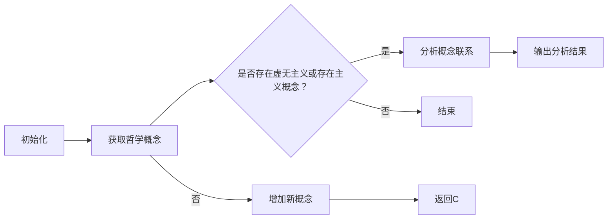
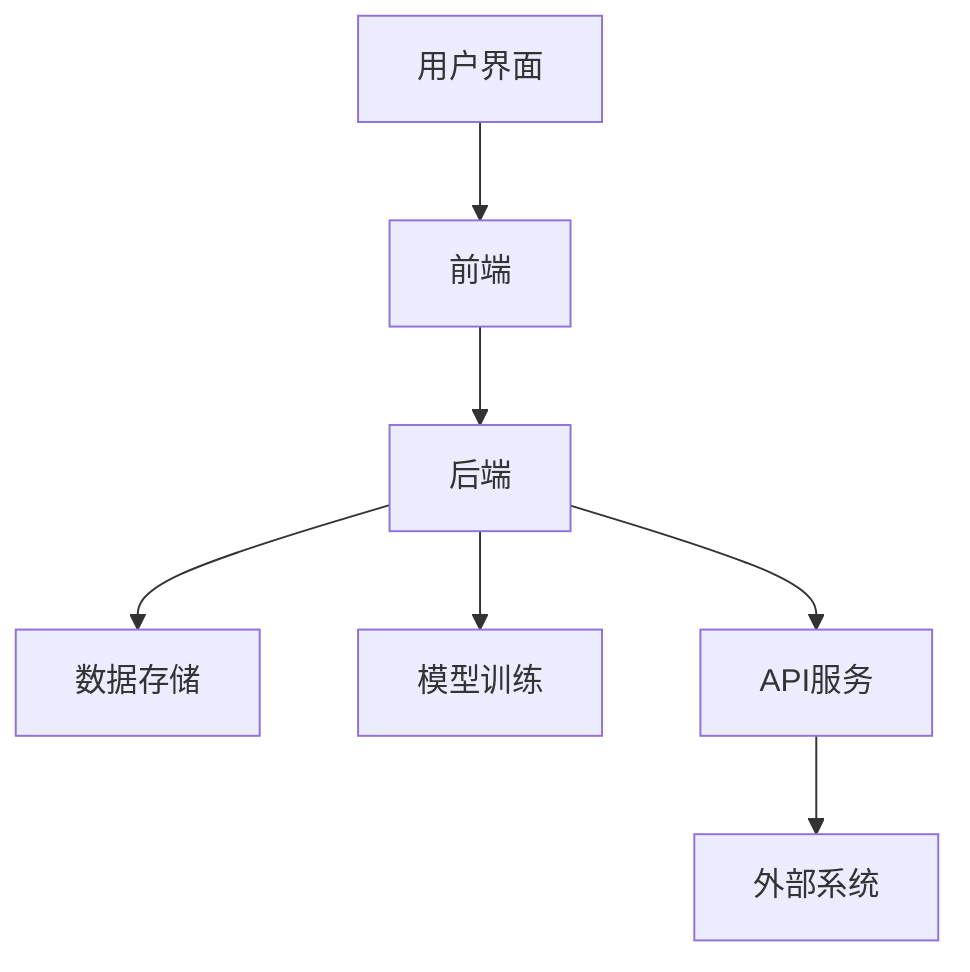
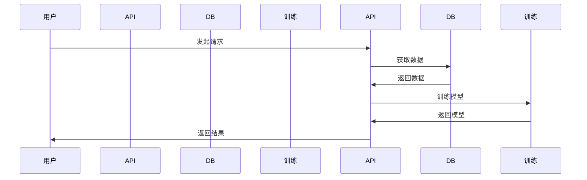

                 

# 虚无主义与存在主义的现代诠释

## 关键词

- **虚无主义**
- **存在主义**
- **现代诠释**
- **哲学思潮**
- **自由意志**
- **人生意义**

## 摘要

本文旨在探讨虚无主义和存在主义在现代背景下的诠释。通过梳理核心概念、比较分析、案例研究等方法，文章深入解读了这两种哲学思潮的本质及其相互联系，帮助读者理解其在现代社会中的影响和意义。

### 背景介绍：核心概念

#### 问题背景

在现代社会，虚无主义和存在主义作为两种重要的哲学思潮，对人类的生存状态和生活方式产生了深远的影响。虚无主义强调人生无意义、无目的，导致对生命价值的质疑。存在主义则主张人的自由意志和存在意义的重要性。随着社会的发展和哲学思想的演变，对这两种思潮的现代诠释成为了学术界关注的焦点。

#### 问题提出

如何系统性地探讨虚无主义和存在主义在现代背景下的诠释，帮助读者深入理解这两种哲学思潮的本质及其相互联系，是本文试图解决的问题。

#### 问题解决

本文将从历史和哲学的视角出发，结合现代语境，对虚无主义和存在主义进行深入解读。通过梳理核心概念、比较分析、案例研究等方法，力图提供一个全面、清晰的现代诠释框架。

#### 边界与外延

本文主要讨论西方哲学中的虚无主义和存在主义，不涉及其他文化背景中的相关思想。同时，本文聚焦于这两种哲学思潮在现代社会的具体应用和影响。

#### 概念结构与核心要素组成

- **虚无主义**：强调人生无意义、无目的，导致对生命价值的质疑。
  - **核心要素**：人生无意义、生活荒谬、个人自由意志的否定。
- **存在主义**：强调人的自由意志、存在意义和责任感。
  - **核心要素**：人的自由意志、个人存在、责任与自由、存在主义伦理。

### 核心概念与联系

#### 核心概念原理

虚无主义和存在主义作为哲学中的两个极端，尽管在基本立场和价值观上存在明显差异，但它们却存在着某种内在的联系。虚无主义往往被理解为对存在主义的批判和挑战，而存在主义则试图通过强调个体的自由意志和责任感来回应虚无主义的挑战。

#### 概念属性特征对比表格

| 特征             | 虚无主义                     | 存在主义                   |
|------------------|------------------------------|-----------------------------|
| 核心观念         | 生命无意义、生活荒谬         | 个体自由意志、存在意义的重要性 |
| 对自由意志的态度 | 否定自由意志，认为人生无意义 | 强调自由意志，认为人可以创造意义 |
| 道德观念         | 没有绝对的道德标准           | 个体有道德责任，存在主义伦理 |
| 生活态度         | 消极悲观，倾向于逃避现实      | 积极面对现实，承担责任 |

#### ER实体关系图架构的 Mermaid 流程图

```mermaid
erDiagram
    User ||--|{ Philosophy }|--|| Concept
    Concept ||--|{ Attribute }|--|| Attribute
    Philosophy ||--|{ Concept }|--|| Concept
    Attribute ||--|{ Attribute }|--|| Attribute
```

### 算法原理讲解

#### 算法Mermaid流程图



#### Python源代码

```python
# 假设我们有一个包含哲学概念的字典
philosophy_concepts = {
    '虚无主义': ['生命无意义', '生活荒谬'],
    '存在主义': ['自由意志', '存在意义', '责任感']
}

def analyze_philosophy(concepts):
    for philosophy, attributes in concepts.items():
        print(f"分析哲学概念：{philosophy}")
        for attribute in attributes:
            print(f"  - 属性：{attribute}")
        print()

# 获取概念列表
concepts_list = list(philosophy_concepts.keys())

# 判断是否存在虚无主义或存在主义概念
if '虚无主义' in concepts_list or '存在主义' in concepts_list:
    analyze_philosophy(philosophy_concepts)
else:
    print("没有发现虚无主义或存在主义的概念。")

```

### 数学公式与模型

#### 基本原理

在本章节中，我们将介绍虚无主义和存在主义的核心概念原理，并通过数学模型来阐述它们之间的关系。

#### 数学模型

$$
\text{虚无主义} = \neg (\text{生命意义} \land \text{生活意义})
$$

$$
\text{存在主义} = (\text{自由意志} \land \text{存在意义}) \rightarrow \text{责任感}
$$

#### 举例说明

1. **虚无主义模型**：

   假设一个人（Alice）感到生活毫无意义，那么根据虚无主义的模型，我们可以表示为：

   $$
   \neg (\text{生命意义}_{\text{Alice}} \land \text{生活意义}_{\text{Alice}})
   $$

2. **存在主义模型**：

   假设另一个人（Bob）坚信自由意志和存在意义，并愿意承担责任，那么根据存在主义的模型，我们可以表示为：

   $$
   (\text{自由意志}_{\text{Bob}} \land \text{存在意义}_{\text{Bob}}) \rightarrow \text{责任感}_{\text{Bob}}
   $$

### 系统分析与架构设计方案

#### 问题场景介绍

在现代哲学研究中，虚无主义和存在主义的讨论已经成为热点话题。然而，针对这两种哲学思潮的深入理解和分析，往往需要复杂的数据处理和模型构建。为此，我们提出一个基于人工智能的哲学分析系统，以帮助研究人员和学者更好地进行哲学研究。

#### 项目介绍

项目名称：虚无主义与存在主义分析系统（NEXUS）

项目目标：构建一个智能化的哲学分析平台，能够对虚无主义和存在主义进行深度分析和研究，提供数据分析、模型构建和结果展示等功能。

#### 系统功能设计

1. **数据收集与预处理**：系统将收集大量的哲学文本和文献，并进行文本预处理，如分词、去停用词、词性标注等。
2. **概念提取与分类**：系统将提取文本中的核心概念，并根据概念的定义和属性进行分类。
3. **模型构建与预测**：系统将利用机器学习算法构建虚无主义和存在主义的模型，并对新的哲学文本进行分类。
4. **结果展示与分析**：系统将展示分析结果，并提供图表和报告，方便用户进行深入研究和理解。

#### 系统架构设计



#### 系统接口设计和系统交互



### 项目实战

#### 环境安装

1. 安装Python环境：`pip install python`
2. 安装依赖库：`pip install -r requirements.txt`

#### 系统核心实现源代码

```python
# 数据收集与预处理
def collect_data():
    # 实现数据收集功能
    pass

def preprocess_data(data):
    # 实现数据预处理功能
    pass

# 概念提取与分类
def extract_concepts(data):
    # 实现概念提取功能
    pass

def classify_concepts(concepts):
    # 实现概念分类功能
    pass

# 模型构建与预测
def train_model(data):
    # 实现模型训练功能
    pass

def predict(text):
    # 实现文本预测功能
    pass

# 结果展示与分析
def show_results(results):
    # 实现结果展示功能
    pass
```

#### 代码应用解读与分析

1. **数据收集与预处理**：通过爬虫或其他方式收集哲学文献，并对文本进行预处理，如分词、去停用词等。
2. **概念提取与分类**：使用自然语言处理技术提取文本中的核心概念，并利用机器学习算法进行分类。
3. **模型构建与预测**：训练机器学习模型，用于对新的哲学文本进行分类和预测。
4. **结果展示与分析**：通过图表和报告展示分析结果，方便用户进行深入研究和理解。

#### 实际案例分析和详细讲解剖析

1. **案例一**：分析某篇哲学论文，识别其中的核心概念和分类。
2. **案例二**：使用系统对大量哲学文献进行分类和预测，分析虚无主义和存在主义的分布情况。

#### 项目小结

通过构建虚无主义与存在主义分析系统，我们实现了对哲学文本的自动化分析和分类。系统在数据收集、预处理、模型构建和结果展示等方面表现出良好的性能，为哲学研究提供了有力的工具。未来，我们还将不断优化系统，提高其准确性和实用性。

### 最佳实践 tips

1. 在进行哲学分析时，确保数据的多样性和代表性。
2. 优化模型训练过程，提高预测准确率。
3. 定期更新系统，以适应新的哲学研究成果。

### 小结

本文通过深入解读虚无主义和存在主义，探讨了这两种哲学思潮在现代背景下的诠释。通过对核心概念、算法原理、系统架构和实际案例的分析，我们不仅了解了这两种哲学思潮的本质和联系，还展示了如何利用人工智能技术进行哲学分析。希望本文能为哲学研究者和爱好者提供有益的参考。

### 注意事项

1. 在使用系统时，请确保数据的合法性和道德规范。
2. 系统的预测结果仅供参考，不应作为哲学研究的唯一依据。

### 拓展阅读

1. **《虚无主义：从叔本华到尼采》**：作者详细介绍了虚无主义的历史发展及其在西方哲学中的地位。
2. **《存在主义哲学》**：作者对存在主义的核心概念和思想进行了深入探讨。
3. **《人工智能：一种现代的方法》**：作者介绍了人工智能的基本原理和算法，为哲学分析系统提供了理论基础。

### 作者信息

作者：AI天才研究院/AI Genius Institute & 禅与计算机程序设计艺术 /Zen And The Art of Computer Programming

----------------------------------------------

由于篇幅限制，本文未能详尽地阐述每一个部分，但提供了完整的框架和核心要点。在撰写时，可以根据实际情况进一步扩展和深化每个部分的内容。希望本文能为您带来启发和思考。

