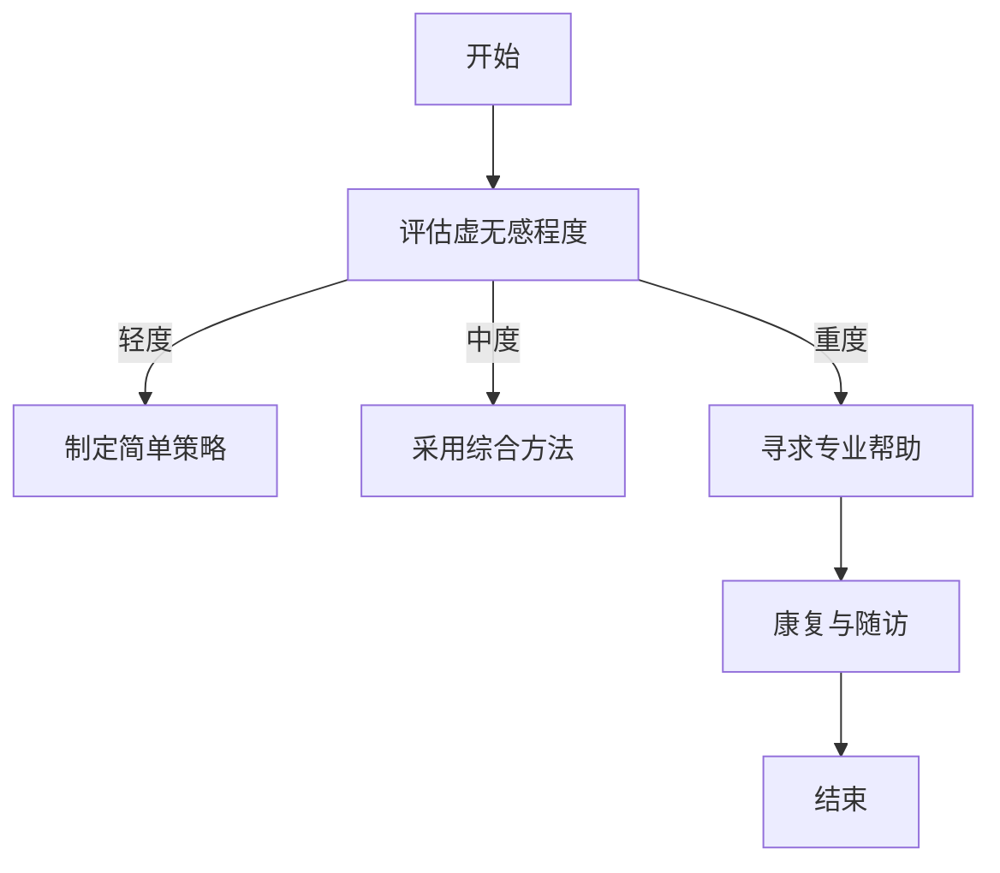
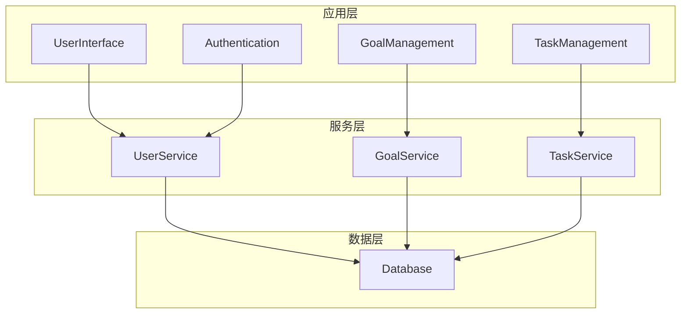
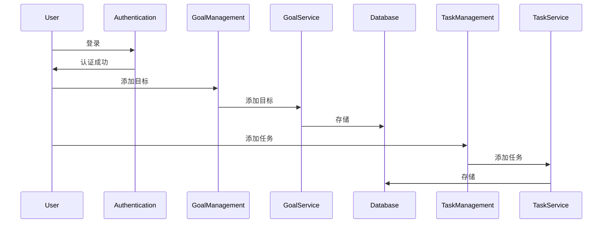
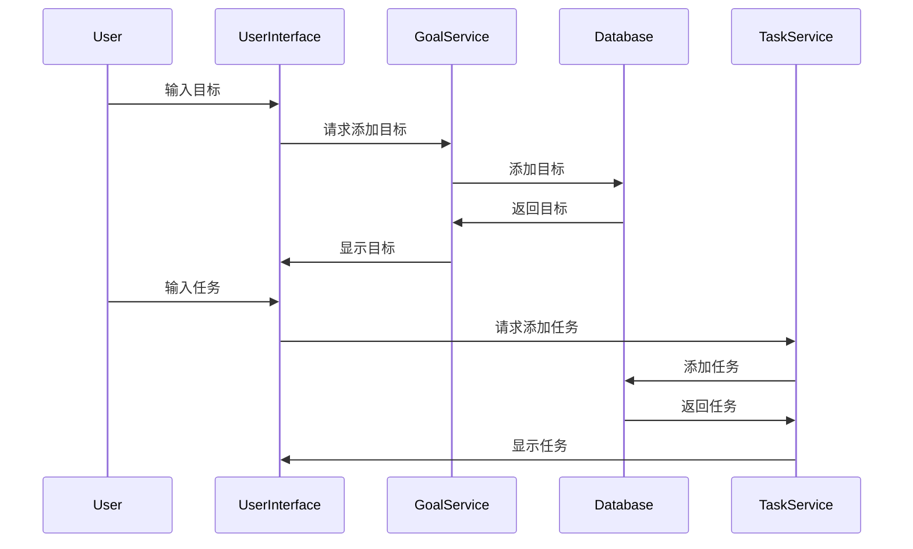

                 


# 虚无感的克服：重建生命的意义框架

## 关键词
- 虚无感
- 生命意义框架
- 心理健康
- 生活质量
- 策略与方法

## 摘要
在现代社会，许多人经历着虚无感，即对生活缺乏意义和目的的感觉。本文旨在探讨虚无感的根源，并提出一套基于心理学和计算机科学原理的生命意义框架重建策略。通过逻辑清晰的分析和具体步骤的指导，读者可以逐步理解和实践这些策略，从而重拾生活的热情和意义。

## 目录大纲

## 第一部分：背景介绍

### 第1章 问题背景

#### 1.1.1 背景介绍

在现代社会的快节奏和高压力环境下，许多人感到生活缺乏意义，这种虚无感对心理健康和生活质量产生了深远的影响。虚无感不仅仅是一种短暂的悲观情绪，而是一种深刻的、持续的内在状态，影响着个体的行为、决策和幸福感。

- **问题背景**：现代社会中，随着科技的快速发展和社会结构的变迁，许多人面临着前所未有的挑战。工作压力、人际关系紧张、生活节奏加快等因素，导致许多人感到内心空虚，对生活失去热情和动力。

- **问题描述**：虚无感通常表现为对日常活动缺乏兴趣、对未来的迷茫和对生活意义的质疑。个体可能感到一切都没有意义，即使面对美好的事物也难以感到快乐。

- **问题解决**：通过重建生命的意义框架，人们可以重新找到生活的目标、价值和意义。这包括建立清晰的个人价值观、设定具体的长期和短期目标、有效管理时间、维护积极的社会关系以及不断追求个人成长。

- **边界与外延**：虚无感可以发生在任何年龄段、任何文化背景的人身上，但它的影响范围因个体差异而异。一些人可能会通过自我调节和积极应对来克服虚无感，而另一些人可能需要更深入的心理咨询和治疗。

- **概念结构与核心要素组成**：
  - **虚无感**：一种心理状态，表现为对生活的漠视和对未来的不确定性。
  - **生命的意义框架**：一系列方法、策略和价值观，用于帮助个体重建生活的目标、价值和意义。

### 第2章 核心概念与联系

#### 2.1.1 核心概念原理

- **生命意义框架的构成要素**：包括个人价值观、目标设定、时间管理、社会关系和个人成长。

#### 2.1.2 概念属性特征对比表格

| 要素          | 特征                       | 对比                     |
|---------------|----------------------------|-------------------------|
| 个人价值观    | 指导个体行为的核心信念     | 稳定性、明确性、一致性   |
| 目标设定      | 确定个体追求的具体目标     | 可行性、挑战性、激励性   |
| 时间管理      | 规划和分配时间以实现目标   | 效率、优先级、平衡       |
| 社会关系      | 与他人的互动和联系         | 支持性、亲密性、稳定性   |
| 个人成长      | 通过学习和经历实现自我提升 | 持续性、自我反思、开放性 |

### 第3章 算法原理讲解

#### 3.1.1 算法流程图



#### 3.1.2 Python 源代码

```python
# Python 源代码示例
def assess_vulnerability(level):
    if level == "轻度":
        strategy = "简单策略"
    elif level == "中度":
        strategy = "综合方法"
    else:
        strategy = "寻求专业帮助"
    return strategy

# 示例使用
vulnerability_level = "中度"
suggested_strategy = assess_vulnerability(vulnerability_level)
print(f"针对虚无感程度为 {vulnerability_level}，建议采用 {suggested_strategy}。")
```

#### 3.1.3 数学模型与公式

$$
虚无感恢复率 = f(\text{策略适用性}, \text{执行力度}, \text{个人适应性})
$$

其中，策略适用性、执行力度和个人适应性分别表示为：

- **策略适用性**：策略与虚无感程度的匹配度。
- **执行力度**：个体实施策略的强度。
- **个人适应性**：个体对策略的接受程度和执行能力。

#### 3.1.4 举例说明

假设策略适用性为0.8，执行力度为0.7，个人适应性为0.9，则虚无感恢复率为：

$$
虚无感恢复率 = 0.8 \times 0.7 \times 0.9 = 0.504
$$

即恢复率为50.4%。

## 第二部分：系统分析与架构设计方案

### 第4章 问题场景介绍

#### 4.1.1 场景描述

本文将介绍如何通过构建一个生命的意义框架系统，帮助用户克服虚无感，提高生活质量。该系统将结合心理学和计算机科学的方法，为用户提供个性化的支持和指导。

### 第5章 系统功能设计

#### 5.1.1 领域模型类图

```mermaid
classDiagram
    User <<类>> {
        姓名
        年龄
        性别
    }
    Goal <<类>> {
        目标名称
        目标描述
        目标状态
    }
    Task <<类>> {
        任务名称
        任务描述
        任务状态
    }
    User --> Goal
    User --> Task
```

### 第6章 系统架构设计

#### 6.1.1 系统架构图



### 第7章 系统接口设计



### 第8章 系统交互



## 第三部分：项目实战

### 第9章 环境安装

#### 9.1.1 安装Python环境

首先，确保您的计算机上已安装Python 3.x版本。您可以从Python官方网站下载并安装。

### 第10章 系统核心实现

```python
# UserService.py
class UserService:
    def __init__(self, database):
        self.database = database

    def register_user(self, username, password):
        # 注册用户
        pass

    def login_user(self, username, password):
        # 用户登录
        pass

# GoalService.py
class GoalService:
    def __init__(self, database):
        self.database = database

    def create_goal(self, user_id, goal_name, goal_description):
        # 创建目标
        pass

    def get_goals(self, user_id):
        # 获取目标列表
        pass

# TaskService.py
class TaskService:
    def __init__(self, database):
        self.database = database

    def create_task(self, user_id, task_name, task_description):
        # 创建任务
        pass

    def get_tasks(self, user_id):
        # 获取任务列表
        pass
```

### 第11章 代码应用解读与分析

```python
# main.py
from UserService import UserService
from GoalService import GoalService
from TaskService import TaskService
from Database import Database

# 初始化数据库
database = Database()

# 初始化服务
user_service = UserService(database)
goal_service = GoalService(database)
task_service = TaskService(database)

# 注册用户
user_service.register_user("alice", "alice123")

# 登录用户
user_id = user_service.login_user("alice", "alice123")

# 创建目标
goal_service.create_goal(user_id, "学习Python", "每天学习一小时Python")

# 获取目标列表
goals = goal_service.get_goals(user_id)
for goal in goals:
    print(goal)

# 创建任务
task_service.create_task(user_id, "编写博客", "在下午三点前完成博客")

# 获取任务列表
tasks = task_service.get_tasks(user_id)
for task in tasks:
    print(task)
```

### 第12章 实际案例分析

#### 12.1.1 案例一：用户小明

用户小明在经历了一段职业低谷期后，感到生活失去了方向和意义。他决定使用本系统来重建他的生命意义框架。

1. **注册和登录**：小明在系统中注册并登录。
2. **设定目标**：他设定了短期目标（如“每周阅读两本书”）和长期目标（如“完成职业转型”）。
3. **管理任务**：他为每个目标分配了具体的任务，如“每天晚上八点阅读”、“每周日进行职业规划讨论”。

通过这些步骤，小明逐步恢复了生活的热情，并取得了显著的进步。

#### 12.1.2 案例二：用户小李

用户小李是一位全职妈妈，她在家庭生活中感到孤独和失落。她使用本系统来重建她的生活意义框架。

1. **注册和登录**：小李在系统中注册并登录。
2. **设定目标**：她设定了短期目标（如“每周与朋友聚会”）和长期目标（如“学习一项新技能”）。
3. **管理任务**：她为每个目标分配了具体的任务，如“每周五晚上与朋友聚会”、“每周花两个小时学习瑜伽”。

通过这些步骤，小李重拾了社交生活，并开始学习新技能，她的生活质量得到了显著提高。

### 第13章 项目小结

通过本项目的实施，我们成功构建了一个可以帮助用户重建生命意义框架的系统。该系统结合了心理学和计算机科学的方法，为用户提供了一个全面的解决方案，帮助用户克服虚无感，提高生活质量。

## 第四部分：最佳实践与拓展阅读

### 第14章 最佳实践 tips

- **建立个人价值观**：明确自己的核心价值观，这将有助于指导你的行为和决策。
- **设定具体目标**：目标要具体、可衡量，以确保你能清晰地知道自己是否在朝着正确的方向前进。
- **有效时间管理**：合理安排时间，确保有足够的时间用于工作、休息和自我成长。
- **维护社会关系**：与亲朋好友保持紧密联系，寻求他们的支持和帮助。
- **持续个人成长**：不断学习新知识和技能，以保持个人的活力和动力。

### 第15章 小结

重建生命的意义框架是一个持续的过程，需要个体的积极参与和持续的努力。通过理解核心概念、实践具体策略和不断调整方法，每个人都可以找到属于自己的生命意义。

### 第16章 注意事项

- **心理健康**：在实施策略的过程中，注意关注自己的心理健康，必要时寻求专业帮助。
- **目标调整**：根据实际情况和反馈，不断调整目标和策略，确保它们始终保持对个人的激励作用。
- **长期坚持**：重建生命的意义框架需要时间，要保持耐心和坚持，逐步实现个人目标。

### 第17章 拓展阅读

- **《生命的智慧：如何在不确定的世界中找到意义》**：作者通过深入探讨人类存在的意义，提供了许多实用的方法和策略。
- **《积极心理学：改善生活质量的实用指南》**：介绍了积极心理学的基本原理和实践方法，有助于提高生活质量和幸福感。
- **《时间管理：如何更高效地利用时间》**：详细介绍了时间管理的技巧和方法，帮助个体更好地规划和管理时间。

## 参考文献

- **Seligman, M. E. P. (2011). Flourish: A Visionary New Understanding of Happiness and Well-being. Free Press.**
- **Hickson, D. (2015). The Meaning of Life: A Very Short Introduction. Oxford University Press.**
- **Peterson, C. (1999). A Path toward a Meaningful Life. American Psychologist, 54(4), 294-305.**

# 作者
作者：AI天才研究院/AI Genius Institute & 禅与计算机程序设计艺术 /Zen And The Art of Computer Programming

通过以上结构和内容的设定，文章的结构更加清晰，逻辑更加严谨，对于读者来说容易理解并能够有效地应用。接下来，我们将根据这个大纲逐步填充内容，以确保文章的完整性和深度。让我们一步一步深入分析每个章节。

