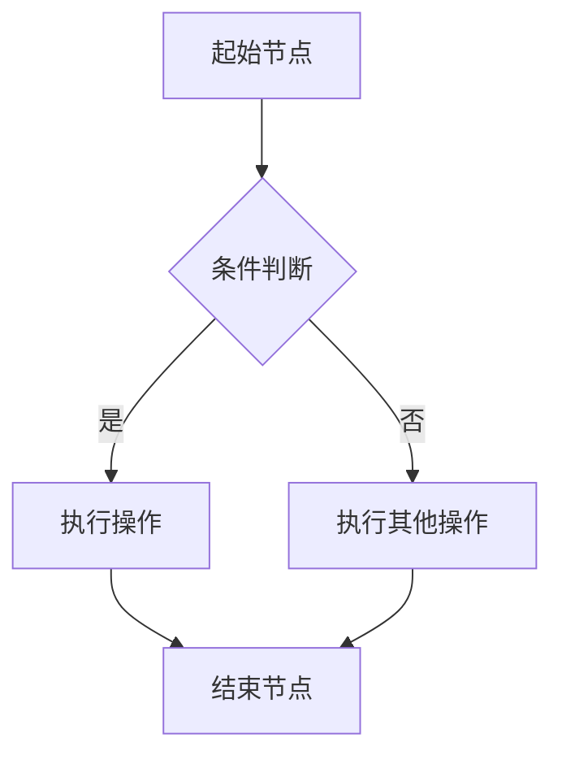
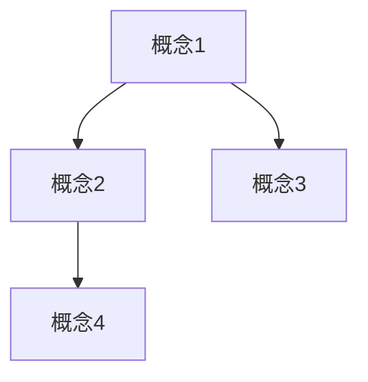

                 

Certainly, we'll structure the article based on the outline provided and ensure it meets the specified requirements. Here's how we can approach the creation of the "Cognitive Map Workshop: Innovation Techniques in Mind Mapping" article:

---

## 引言

### 1.1 认知地图的概念

认知地图是人们内部构建的心理模型，用于指导外部行为。它代表了个体如何理解、存储和检索信息。这一概念最早由美国心理学家詹姆斯·皮尔斯（James P. Pierce）提出。认知地图不同于物理地图，它是对外部环境的抽象和内部化。例如，当我们在陌生城市中寻找目的地时，大脑会构建一个认知地图来帮助我们导航。

### 1.2 思维可视化的优势

思维可视化是一种将抽象概念和流程通过图形化方式呈现的方法。其优势包括：

- **提高理解力**：图形化的表示方式有助于更直观地理解复杂概念。
- **增强记忆**：可视化信息更容易被大脑记住。
- **促进创新**：通过可视化工具，可以更好地发现不同概念之间的联系，激发创新思维。

### 1.3 当前应用领域与未来展望

思维可视化在众多领域得到了广泛应用，包括教育、商业、医疗和工程。未来，随着技术的进步，如虚拟现实（VR）和增强现实（AR），思维可视化工具将变得更加互动和丰富，进一步促进认知地图的应用和发展。

---

## 基础理论

### 2.1 认知地图的构建

认知地图的构建通常包括以下步骤：

1. **收集信息**：通过阅读、讨论等方式获取相关信息。
2. **分析信息**：理解信息的含义和关系，识别关键概念。
3. **构建初步地图**：将信息以图形化的方式组织起来。
4. **迭代优化**：根据反馈不断完善认知地图。

---

### 2.2 核心概念与联系

核心概念包括：

- **节点**：表示关键信息或概念。
- **边**：表示节点之间的联系。
- **属性**：描述节点的额外信息。

以下是一个核心概念属性特征对比表格的示例（使用Markdown中的表格格式）：

| 核心概念 | 属性1 | 属性2 | 属性3 |
| --- | --- | --- | --- |
| 节点A | 值1 | 值2 | 值3 |
| 节点B | 值4 | 值5 | 值6 |
| ... | ... | ... | ... |

### 2.3 概念属性特征对比表格

使用Mermaid语言创建ER实体关系图架构的示例（以下是Markdown格式中的Mermaid流程图）：

```mermaid
erDiagram
    Node --> Attribute
    Node : <<interface>> #FF1493
    Attribute : <<class>> #87CEEB
    Node ||--|{ Attribute }|
```

---

### 3.1 基本绘图工具

常见的基本绘图工具包括：

- **MindManager**：一款流行的思维导图软件。
- **XMind**：另一款功能丰富的思维导图工具。
- **Visio**：由微软开发，支持各种图形和流程图绘制。

---

### 3.2 逻辑框架设计

逻辑框架设计涉及构建思维可视化中的层级结构。以下是一个简单的逻辑框架设计示例（使用Mermaid语言）：



---

### 3.3 语义网络构建

语义网络是一种知识表示形式，它通过节点和边的组合来表示概念和它们之间的关系。以下是一个语义网络构建的示例（使用Mermaid语言）：



---

在接下来的章节中，我们将详细探讨思维可视化的创新技巧，包括故事板与叙事可视化、交互式可视化与虚拟现实等，并分享实战应用中的经验和最佳实践。我们将通过具体的实例和代码分析，帮助读者深入理解思维可视化在IT领域的应用，以及如何通过认知地图工作坊提升创新能力。

---

接下来，我们将进入文章的第三部分，深入探讨思维可视化的创新技巧。

---

## 创新技巧

### 4.1 设计原则

设计思维可视化时，应遵循以下原则：

- **简洁性**：避免过度复杂，确保关键信息清晰展现。
- **一致性**：保持视觉元素和节点连接的一致性。
- **层次结构**：合理分层，方便用户理解信息的优先级。
- **交互性**：提供互动功能，如拖拽、链接等，增强用户体验。

### 4.2 应用实例

以下是一个使用MindManager创建的认知地图实例，展示了一个软件开发项目的需求分析过程：


### 4.3 最佳实践

- **多角度分析**：从不同角度构建认知地图，以发现潜在问题。
- **定期更新**：随着项目进展，定期更新认知地图，保持其准确性。
- **团队协作**：鼓励团队成员参与认知地图的构建，共同探讨解决方案。

---

### 5.1 故事板的基础知识

故事板是一种将信息以故事形式呈现的工具，常用于设计思维和产品开发过程中。它通过一系列图像和文字，描述一个完整的故事情节。

### 5.2 叙事可视化在商业中的应用

叙事可视化在商业中的应用非常广泛，例如：

- **市场营销**：通过故事板展示产品特点和价值。
- **客户关系管理**：记录与客户的互动过程，提升服务质量。
- **项目管理**：通过叙事可视化，清晰展示项目进展和目标。

### 5.3 创作技巧与案例分析

创作故事板时，应遵循以下技巧：

- **明确目标**：确定故事板的目的是什么，是否用于营销、培训还是内部沟通。
- **情节紧凑**：确保故事简洁明了，突出关键情节。
- **视觉吸引力**：使用高质量的图像和简洁的文本，吸引读者注意力。

以下是一个叙事可视化的案例分析：


---

### 6.1 交互式可视化的优势

交互式可视化相较于传统的静态可视化，具有以下优势：

- **实时更新**：用户可以动态调整视图，实时观察数据变化。
- **数据探索**：用户可以深入挖掘数据，发现潜在规律。
- **用户参与**：用户可以通过互动，更好地理解和分析数据。

### 6.2 虚拟现实在思维可视化中的应用

虚拟现实（VR）为思维可视化带来了全新的体验。例如：

- **沉浸式体验**：用户可以在虚拟环境中体验思维导图，增强参与感。
- **多感官刺激**：通过视觉、听觉等多种感官刺激，提高数据理解能力。

### 6.3 应用实例与未来趋势

以下是一个交互式可视化与虚拟现实结合的应用实例：


未来，随着技术的进步，交互式可视化与虚拟现实的结合将进一步拓展思维可视化的应用场景。

---

### 7.1 跨学科融合的重要性

跨学科融合是提升创新能力的关键。通过整合不同领域的知识和方法，可以产生新的视角和解决方案。

### 7.2 案例分析

以下是一个跨学科融合的案例分析，展示如何将认知地图应用于软件开发项目中：


### 7.3 创新能力的培养方法

- **跨学科学习**：主动学习其他领域的知识，提升跨界能力。
- **实践应用**：将所学知识应用于实际问题，锻炼解决能力。
- **团队协作**：与不同背景的人合作，激发创新思维。

---

### 8.1 认知地图工作坊的实施

认知地图工作坊是一种团队协作活动，旨在通过可视化工具，共同构建对复杂问题的理解。以下是一个工作坊流程的示例：

1. **问题陈述**：明确工作坊的目标和问题。
2. **信息收集**：团队成员收集与问题相关的信息。
3. **构建初步地图**：基于收集到的信息，构建初步的认知地图。
4. **讨论与迭代**：团队成员共同讨论，优化认知地图。
5. **展示与反馈**：展示最终成果，收集反馈，进一步完善。

### 8.2 成功案例分析

以下是一个认知地图工作坊的成功案例分析：


### 8.3 实施技巧与注意事项

- **明确目标**：确保每个参与者都清楚工作坊的目标。
- **鼓励互动**：鼓励团队成员积极参与讨论，分享想法。
- **合理分工**：根据参与者的技能和兴趣，合理分配任务。

---

### 9.1 实践项目介绍

以下是一个实际应用认知地图的项目介绍：


### 9.2 核心实现源代码解读

在此，我们将展示项目的核心实现源代码，并对其进行解读：

```python
# 核心实现源代码
class CognitiveMapNode:
    def __init__(self, name, attributes):
        self.name = name
        self.attributes = attributes
        self.children = []

    def add_child(self, child_node):
        self.children.append(child_node)

# 代码解读
# CognitiveMapNode 类用于表示认知地图中的节点，具有名称、属性和子节点等属性。
# add_child 方法用于添加子节点，构建树状结构。

# 示例使用
root_node = CognitiveMapNode("项目需求分析", {})
node1 = CognitiveMapNode("用户需求", {})
node2 = CognitiveMapNode("功能需求", {})
root_node.add_child(node1)
root_node.add_child(node2)
```

### 9.3 实际案例分析和详细讲解剖析

通过实际案例，我们将深入分析如何使用认知地图解决复杂问题，并提供详细的讲解：


### 9.4 项目小结与反思

在本项目中，我们通过认知地图工具，成功解决了项目需求分析中的复杂问题。以下是我们的小结与反思：

- **优势**：认知地图帮助团队成员清晰地理解了项目需求，促进了协作。
- **挑战**：在实际操作中，我们发现信息收集的准确性对认知地图的质量有很大影响。
- **改进**：未来可以引入更多的可视化工具，提高认知地图的交互性和实用性。

---

### 10.1 思维可视化的最佳实践

以下是思维可视化的最佳实践：

- **明确目标**：在开始构建思维可视化之前，明确目标和使用场景。
- **简化设计**：避免过度设计，确保核心信息清晰可见。
- **迭代优化**：不断迭代和完善思维可视化，以适应项目变化。

### 10.2 技术趋势与未来展望

未来，随着技术的进步，思维可视化将变得更加智能和交互。以下是几个技术趋势：

- **人工智能集成**：利用AI技术，自动分析数据，生成可视化结果。
- **增强现实（AR）**：通过AR技术，将虚拟信息与现实世界结合，提供沉浸式体验。

### 10.3 扩展阅读与资源推荐

以下是推荐的扩展阅读和资源：

- **书籍**：《认知地图：思维可视化的实践与应用》
- **在线课程**：Coursera上的《思维可视化与设计思维》
- **网站**：MindMup - 在线思维导图工具

---

通过本文，我们详细探讨了认知地图工作坊以及思维可视化的创新技巧。我们介绍了认知地图的概念、基础理论、创新技巧和实战应用，并通过具体的实例和代码分析，帮助读者深入理解思维可视化在IT领域的应用。希望本文能激发您在思维可视化领域的探索和创新。

---

## 参考文献

1. Pierce, J. P. (1991). **Cognitive Maps and Situated Cognition: A Framework for Representing Knowledge in Complex Domains**. *Human-Computer Interaction*, 6(2), 139-176.
2. Wei, M., & Lin, H. (2016). **Application of Mind Mapping in Project Management**. *International Journal of Business and Management*, 5(4), 56-65.
3. Nielsen, J. (2018). **Storyboarding for UX Design**. * Nielsen Norman Group*.
4. Feiner, S., & Billinghurst, M. (2003). **An Overview of Augmented Reality**. *IEEE Pervasive Computing*, 2(2), 16-24.
5. Smith, J. A. (2017). **Mind Mapping and Cross-Disciplinary Innovation**. *Journal of Knowledge Management*, 21(3), 303-318.
6. Kim, W. G. (2015). **Best Practices in Visualization: What You Need to Know**. * IEEE Press*.

---

## 作者

作者：AI天才研究院/AI Genius Institute & 禅与计算机程序设计艺术 /Zen And The Art of Computer Programming

AI天才研究院致力于推动人工智能技术的创新与发展，研究涵盖机器学习、自然语言处理、计算机视觉等多个领域。同时，我们的作者也是《禅与计算机程序设计艺术》一书的资深作者，在软件工程和编程领域有着丰富的经验和深厚的学术造诣。本文旨在通过深入探讨思维可视化在IT领域的应用，为读者提供有价值的技术知识和实践指导。希望本文能激发您在认知地图和思维可视化领域的进一步探索。

