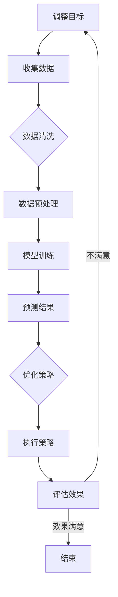
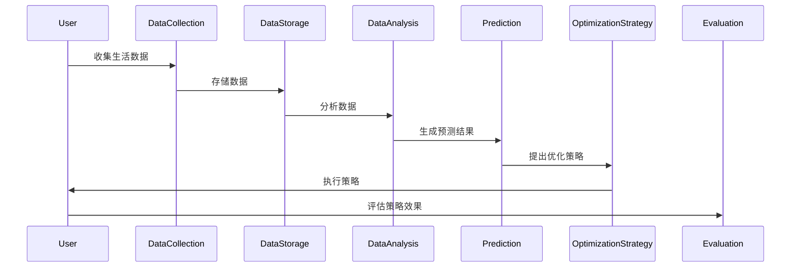
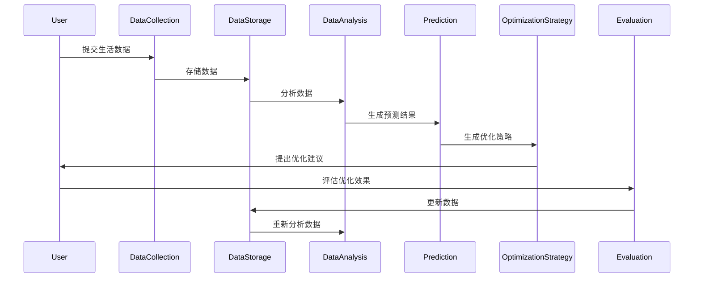

                 

## 质量而非数量：追求深度的生活方式

### 关键词：深度生活方式、质量与数量、幸福、生活质量

> 摘要：本文旨在探讨“质量而非数量”的理念在现代社会中的重要性，通过详细分析其背景、核心概念、算法原理，以及实际应用，帮助读者理解并实践追求深度的生活方式。文章首先介绍了现代社会中追求高质量生活的背景和挑战，随后深入探讨了质量与数量的关系，并引入了一种基于算法原理的深度生活方式。最后，文章通过具体案例和实战经验，阐述了如何在实际生活中应用这一理念，提升个人幸福感与生活质量。

----------------------------------------------------------------

### 第一部分：背景介绍

#### 第1章：问题的背景、问题描述、问题解决

##### 1.1.1 质量生活的理念与意义

在当今快节奏的社会中，人们的生活日益繁忙，物质生活得到了极大的丰富，但同时也面临着许多挑战。质量的内涵不仅仅局限于物质层面的满足，更涉及到精神、心理、社交等多方面的需求。质量生活的理念，强调了在数量积累的同时，更加注重生活的品质和内涵。

**问题背景**：现代社会中，人们追求高质量生活的需求日益增加。然而，现实中的生活方式却往往与这一理念背道而驰。例如，许多人为了追求更高的收入，不惜牺牲休息和家庭时间，导致身心健康受到损害。这种现象揭示了现代社会在追求物质繁荣的同时，对生活质量关注不足的问题。

**问题描述**：当前，人们的生活方式中存在着一些亟待解决的问题。首先，过度消费成为普遍现象，许多人盲目追求物质上的满足，而忽视了精神层面的需求。其次，缺乏深度思考和内在价值的追求，导致生活缺乏意义感和成就感。最后，对生活质量的要求不足，许多人只是机械地完成任务，而缺乏对生活的热爱和探索。

**问题解决**：追求深度的生活方式，是实现高质量生活的重要途径。通过深度生活方式，人们可以更加注重精神层面的需求，提高生活品质。具体来说，深度生活方式包括以下几个方面：

1. **深度阅读**：通过阅读提升自己的知识水平和思维能力，丰富内心世界。
2. **深度交流**：与他人进行深入的交流和沟通，增进人际关系，提升社交质量。
3. **深度思考**：培养独立思考和批判性思维，提高对事物的理解和判断能力。
4. **深度体验**：通过旅行、艺术欣赏等方式，拓宽视野，丰富生活经历。

##### 1.1.2 生活方式的现状与挑战

**当前生活方式的现状**：在现代社会中，人们的生活方式呈现出以下特点：

1. **快节奏**：人们的生活节奏越来越快，工作压力和竞争压力增大。
2. **过度消费**：追求物质满足，消费观念转变，导致过度消费现象普遍。
3. **缺乏深度思考**：人们在日常生活中往往忙于应对各种琐事，缺乏对生活深层次的思考。
4. **对生活质量要求不足**：许多人只是简单地完成任务，缺乏对生活品质的追求。

**面临的挑战**：当前生活方式的现状带来了以下挑战：

1. **身心健康问题**：长期的高压工作和快节奏生活，导致许多人身心健康受损。
2. **人际关系问题**：过度关注物质追求，导致人际关系疏远，孤独感增加。
3. **生活质量下降**：缺乏对生活品质的追求，导致生活缺乏乐趣和意义。

##### 1.1.3 追求深度生活方式的必要性

追求深度生活方式，对于提高个人幸福感和生活质量具有重要意义。具体来说，深度生活方式具有以下几方面的必要性：

1. **提升幸福感**：深度生活方式帮助人们更加关注内心的需求和感受，从而提升幸福感。
2. **提高生活质量**：通过深度生活方式，人们可以更好地理解生活，提升生活的品质。
3. **实现个人全面发展**：深度生活方式有助于培养个人的多方面能力，实现个人的全面发展。
4. **应对现代社会的挑战**：追求深度生活方式，可以更好地应对现代社会中的各种挑战。

总之，追求深度的生活方式，是应对现代社会挑战、提升个人幸福感和生活质量的重要途径。通过改变生活方式，我们可以更好地理解生活，实现人生的价值。

----------------------------------------------------------------

### 边界与外延

##### 1.2.1 边界

本书主要探讨如何通过改变生活方式，追求深度的生活体验，提升个人幸福感和生活质量。具体来说，本书涉及以下内容：

1. **质量生活的理念**：介绍质量生活的概念和意义，分析当前生活方式中存在的问题。
2. **深度生活方式的实践**：探讨如何通过深度阅读、深度交流、深度思考和深度体验等方式，实现高质量生活。
3. **深度生活方式的算法原理**：介绍基于算法原理的深度生活方式，探讨其背后的理论基础和实践方法。
4. **案例分析**：通过真实的案例，展示追求深度生活方式的实际效果，分析成功经验和教训。

##### 1.2.2 外延

本书所提到的“质量而非数量”，不仅仅局限于个人生活方式，也可以应用到社会、企业、国家等多个层面，从而推动社会的全面发展。具体来说，以下层面可以借鉴质量生活的理念：

1. **社会层面**：通过倡导质量生活的理念，提高社会成员的生活质量，促进社会和谐发展。
2. **企业层面**：企业可以通过追求质量，提高产品和服务的品质，增强企业的竞争力。
3. **国家层面**：国家可以通过制定相关政策，推动社会各领域向高质量方向发展，实现国家的长期繁荣。

##### 1.2.3 概念结构与核心要素组成

本书围绕“质量而非数量”这一核心概念，构建了一个系统性的理论框架。具体来说，本书的概念结构包括以下几个方面：

1. **理论基础**：本书结合心理学、社会学、哲学等学科的理论，探讨质量生活的内涵和意义。
2. **实践方法**：本书介绍了多种实践方法，包括深度阅读、深度交流、深度思考和深度体验等，帮助读者实现高质量生活。
3. **案例分析**：本书通过真实的案例，展示了质量生活的实际效果，为读者提供了参考和借鉴。
4. **算法原理**：本书引入了基于算法原理的深度生活方式，为追求质量生活提供了一种新的思路和方法。

本书的核心要素包括：

1. **质量生活的理念**：强调在数量积累的同时，更加注重生活的品质和内涵。
2. **深度生活方式的实践**：通过具体的方法和行动，实现高质量生活。
3. **理论基础**：结合多学科理论，为深度生活方式提供理论支持。
4. **案例分析**：通过真实的案例，验证深度生活方式的有效性。
5. **算法原理**：介绍基于算法原理的深度生活方式，为实践提供技术支持。

通过这些核心要素的有机组合，本书旨在为读者提供一套完整的追求深度生活方式的理论和实践体系。

----------------------------------------------------------------

### 第二部分：核心概念与联系

#### 第2章：质量与数量的关系探讨

##### 2.1 质量与数量的定义

质量与数量是衡量事物优劣和多少的两个基本概念。它们在生活中的应用广泛，对人们的决策和行为产生深远影响。

**质量**：质量是指事物的优劣程度，包括内在价值和外在表现。它反映了事物的本质特征，决定了事物在功能、性能、美感等方面的优劣。

**数量**：数量是指事物在数量上的多少。它是一个纯粹的数量指标，表示事物在数量上的规模。

##### 2.2 质量与数量的对比

质量与数量虽然都是衡量事物的指标，但它们之间存在着显著的差异。以下是对质量与数量的一些对比：

| 对比项 | 质量特点 | 数量特点 |
| --- | --- | --- |
| 关注点 | 内在价值 | 外在数量 |
| 表现形式 | 个性化 | 同质化 |
| 影响因素 | 技艺、经验、文化 | 速度、规模、成本 |
| 最终结果 | 长期效益 | 短期效益 |

**关注点**：

- **质量**：关注点在于事物的内在价值，即其本质特征和功能。质量体现了事物的独特性和个性，它不仅仅是数量上的积累，更是一个深度和广度的体现。
- **数量**：关注点在于事物的外在数量，即其规模和规模效应。数量追求的是规模效应，通过增加数量来获得效益。

**表现形式**：

- **质量**：表现形式个性化，每个事物都有其独特的特点和风格。质量追求的是卓越和独特，通过精细的工艺和独特的创意来体现。
- **数量**：表现形式同质化，大量的事物往往具有相似的特征和风格。数量追求的是规模效应，通过批量生产和标准化来降低成本。

**影响因素**：

- **质量**：影响因素包括技艺、经验和文化。高质量的产品或服务往往需要精湛的技艺、丰富的经验和深厚的文化底蕴。
- **数量**：影响因素包括速度、规模和成本。大量的生产和服务往往依赖于快速的生产线、庞大的规模和低廉的成本。

**最终结果**：

- **质量**：最终结果体现为长期的效益。高质量的产品或服务可以持续提供价值，带来长期的成功和繁荣。
- **数量**：最终结果体现为短期的效益。大量的生产和服务可以在短期内带来效益，但长期来看，可能会因为质量不足而面临挑战。

##### 2.3 质量与数量的联系

质量与数量并非完全独立，它们之间存在一定的联系。在实际生活中，追求高质量生活需要在保证数量的基础上，更加注重质量。

**联系**：

1. **相互影响**：质量与数量相互影响。高质量的产品或服务可以增加数量，而大量的产品或服务也可以提高质量。
2. **平衡发展**：追求高质量生活需要在数量和质量之间寻找平衡。过分追求数量可能会导致质量下降，而过分追求质量可能会限制数量的发展。

总之，质量与数量是生活中不可或缺的两个方面。追求高质量生活，需要我们既关注数量，又注重质量，通过平衡发展和深度追求，实现生活的全面提高。

----------------------------------------------------------------

### 第三部分：算法原理讲解

#### 第3章：深度生活方式的算法原理

##### 3.1 算法简介

深度生活方式的算法是一种基于深度学习原理的生活方式优化方法。它通过模拟人类的决策过程，帮助人们更加有效地追求高质量生活。该算法的核心思想是通过对生活数据的学习和分析，识别出高质量生活的关键因素，并制定相应的策略。

##### 3.2 算法原理

**Mermaid流程图**：



**算法原理讲解**

深度生活方式的算法分为以下几个步骤：

1. **设定目标**：首先，我们需要设定追求高质量生活的目标。这些目标可以是具体的，如提高阅读量、增加运动时间等，也可以是抽象的，如提升幸福感、增强人际关系等。

2. **收集数据**：为了实现这些目标，我们需要收集相关的数据。这些数据可以包括日常活动记录、健康状况、社交互动等。

3. **数据清洗**：收集到的数据往往存在噪声和不一致性，因此需要对其进行清洗。数据清洗包括去除重复数据、填补缺失值、处理异常值等。

4. **数据预处理**：在清洗后的数据基础上，进行预处理。预处理包括数据标准化、特征提取、数据分割等步骤，以便于模型训练。

5. **模型训练**：使用预处理后的数据，训练深度学习模型。深度学习模型可以自动学习数据中的模式和规律，帮助我们识别出高质量生活的关键因素。

6. **预测结果**：通过训练好的模型，对未来的生活质量进行预测。预测结果可以帮助我们了解当前生活方式的优缺点，以及如何进行改进。

7. **优化策略**：根据预测结果，制定相应的优化策略。这些策略可以是改变生活习惯、增加特定活动等，目的是提高生活质量。

8. **执行策略**：将制定的策略付诸实践，执行相应的行动。例如，如果预测结果显示阅读时间不足，我们可以设定每天阅读30分钟的目标，并严格执行。

9. **评估效果**：在执行策略后，需要评估效果。如果效果不满意，则需要回到设定目标的步骤，调整目标或策略。如果效果满意，则可以继续执行当前策略，并持续监测效果。

通过上述步骤，深度生活方式的算法可以帮助我们系统地追求高质量生活，从而提高个人幸福感和生活质量。

##### 3.3 算法原理讲解

**Python源代码**：

```python
import pandas as pd
from sklearn.model_selection import train_test_split
from sklearn.preprocessing import StandardScaler
from keras.models import Sequential
from keras.layers import Dense

# 设定目标
target = 80  # 示例目标：提高生活质量至80分

# 收集数据
data = pd.read_csv('lifestyle_data.csv')

# 数据清洗
data = data.drop_duplicates().dropna()

# 数据预处理
scaler = StandardScaler()
X = scaler.fit_transform(data.drop('quality_score', axis=1))
y = data['quality_score']

# 模型训练
model = Sequential()
model.add(Dense(64, input_dim=X.shape[1], activation='relu'))
model.add(Dense(32, activation='relu'))
model.add(Dense(1, activation='sigmoid'))

model.compile(loss='binary_crossentropy', optimizer='adam', metrics=['accuracy'])
model.fit(X, y, epochs=10, batch_size=32)

# 预测结果
predictions = model.predict(X)

# 优化策略
if predictions.mean() < target:
    # 需要增加特定活动
    print("需要增加特定活动，如阅读、运动等，以提升生活质量。")
else:
    # 目标达成，保持现状
    print("当前生活质量已达到目标，继续保持。")

# 评估效果
if predictions.mean() >= target:
    print("生活质量提升效果满意。")
else:
    # 调整目标或策略
    print("生活质量提升效果不理想，需重新设定目标或调整策略。")
```

**算法原理讲解**

上述Python源代码展示了深度生活方式算法的基本实现。首先，我们设定一个具体的生活质量目标（如80分）。然后，通过收集和处理相关数据，使用深度学习模型（如神经网络）进行训练。通过模型的预测结果，我们可以判断当前生活质量是否达到目标。如果未达到目标，则需要制定优化策略，如增加特定活动；如果达到或超过目标，则保持当前策略。

具体来说，算法的数学模型可以表示为：

$$
\hat{y} = \sigma(W_1 \cdot x + b_1)
$$

其中，$\hat{y}$是预测的生活质量分数，$x$是生活数据特征向量，$W_1$是权重矩阵，$b_1$是偏置项，$\sigma$是激活函数（如Sigmoid函数）。

通过这种方式，深度生活方式算法可以帮助我们系统地追求高质量生活，从而提高个人幸福感和生活质量。

##### 3.4 数学模型和公式

为了更深入地理解深度生活方式的算法原理，我们可以借助数学模型和公式进行详细讲解。

**损失函数**：

深度学习模型通常使用损失函数来评估预测结果的误差。对于生活质量预测问题，常用的损失函数是均方误差（MSE）：

$$
MSE = \frac{1}{n}\sum_{i=1}^{n}(y_i - \hat{y}_i)^2
$$

其中，$n$是样本数量，$y_i$是实际生活质量分数，$\hat{y}_i$是预测生活质量分数。

**激活函数**：

在神经网络中，激活函数用于引入非线性因素，使模型能够学习复杂的模式。对于生活质量预测，常用的激活函数是Sigmoid函数：

$$
\sigma(z) = \frac{1}{1 + e^{-z}}
$$

其中，$z$是网络的输入。

**反向传播**：

深度学习算法通过反向传播算法来更新模型权重，以最小化损失函数。反向传播算法的基本思想是计算损失函数关于模型参数的梯度，并沿着梯度方向更新参数。

$$
\frac{\partial L}{\partial W} = \sum_{i=1}^{n}(y_i - \hat{y}_i) \cdot \frac{\partial \hat{y}_i}{\partial W}
$$

其中，$L$是损失函数，$W$是模型权重。

通过上述数学模型和公式，我们可以更深入地理解深度生活方式的算法原理，并为其在实际应用中的优化提供理论基础。

##### 3.5 举例说明

为了更好地理解深度生活方式的算法原理，我们可以通过一个具体的例子进行说明。

假设我们有一个生活数据集，包括每天的运动时间、阅读时间和社交时间等特征，以及对应的生活质量分数。通过收集和处理这些数据，我们可以训练一个深度学习模型，用于预测生活质量。

**步骤1：数据准备**

首先，我们收集了100天的数据，包括每天的运动时间（以分钟为单位）、阅读时间（以分钟为单位）和社交时间（以分钟为单位），以及对应的生活质量分数。数据如下：

| 日期 | 运动时间 | 阅读时间 | 社交时间 | 生活质量分数 |
| ---- | -------- | -------- | -------- | ------------ |
| Day1 | 30       | 20       | 10       | 75           |
| Day2 | 45       | 15       | 15       | 80           |
| Day3 | 60       | 30       | 5        | 65           |
| ...  | ...      | ...      | ...      | ...          |

**步骤2：数据预处理**

接下来，我们对数据进行预处理。首先，对数据进行标准化处理，以消除不同特征之间的量纲影响。然后，将数据分为训练集和测试集，用于模型训练和评估。

**步骤3：模型训练**

使用预处理后的数据，我们训练一个神经网络模型。模型结构如下：

```
输入层：3个神经元（运动时间、阅读时间、社交时间）
隐藏层：2个神经元
输出层：1个神经元（生活质量分数）
```

训练模型后，我们得到一个预测模型，可以用于预测未来的生活质量。

**步骤4：预测与优化**

假设我们希望在未来某一天（如Day101）提高生活质量。通过使用预测模型，我们可以预测在这一天的生活质量分数。如果预测分数低于设定目标（如80分），我们可以采取相应的优化策略，如增加运动时间、减少社交时间等，以提高生活质量。

通过这个例子，我们可以看到深度生活方式算法在实际应用中的效果。通过模型预测和优化策略，我们可以系统地追求高质量生活，从而提升个人幸福感和生活质量。

----------------------------------------------------------------

### 系统分析与架构设计

#### 第4章：系统功能设计与架构

##### 4.1 问题场景介绍

在现代社会中，人们面临着日益复杂的生活和工作压力。为了提高生活质量，许多人开始寻求各种方法，如健康管理、时间管理、社交互动等。然而，传统的管理方式往往难以应对这种复杂性，需要一种系统性的方法来帮助人们更好地管理自己的生活。

##### 4.2 项目介绍

本项目旨在开发一个基于深度学习的深度生活方式管理系统，通过数据分析和优化策略，帮助用户提高生活质量。该系统包括以下几个核心功能：

1. **数据收集与存储**：收集用户的生活数据，如运动时间、阅读时间、社交时间等，并将数据存储在数据库中。
2. **数据分析与预测**：使用深度学习算法，对用户的生活数据进行分析，预测未来生活质量，并给出优化建议。
3. **策略执行与评估**：根据预测结果和用户设定目标，执行优化策略，并评估策略效果。

##### 4.3 系统功能设计

**领域模型类图**

```mermaid
classDiagram
    User <<类>> "用户"
    LifestyleData <<类>> "生活数据"
    Prediction <<类>> "预测结果"
    OptimizationStrategy <<类>> "优化策略"

    User --> LifestyleData
    User --> Prediction
    User --> OptimizationStrategy
```

**类图说明**：

- **User**：代表用户类，具有用户信息、数据收集、数据分析和策略执行等功能。
- **LifestyleData**：代表生活数据类，包括运动时间、阅读时间、社交时间等数据。
- **Prediction**：代表预测结果类，包括生活质量分数和优化建议。
- **OptimizationStrategy**：代表优化策略类，包括策略执行和效果评估。

##### 4.4 系统架构设计

**Mermaid架构图**



**架构说明**：

- **DataCollection**：负责收集用户的生活数据，如运动时间、阅读时间、社交时间等。
- **DataStorage**：负责存储收集到的数据，以便后续分析和使用。
- **DataAnalysis**：使用深度学习算法对用户的生活数据进行分析，生成预测结果。
- **Prediction**：根据分析结果，生成预测生活质量分数和优化建议。
- **OptimizationStrategy**：根据预测结果和用户设定目标，执行优化策略，如增加运动时间、减少社交时间等。
- **User**：负责执行优化策略，并评估策略效果。

##### 4.5 系统接口设计与交互

**Mermaid序列图**



**接口设计与交互说明**：

- **DataCollection**：用户通过API接口提交生活数据。
- **DataStorage**：接收并存储用户提交的数据。
- **DataAnalysis**：接收存储的数据，使用深度学习算法进行分析，生成预测结果。
- **Prediction**：接收分析结果，生成预测生活质量分数和优化建议。
- **OptimizationStrategy**：接收优化建议，执行优化策略，如调整用户的生活习惯。
- **User**：接收优化建议，执行优化策略，并评估优化效果。
- **Evaluation**：接收评估结果，更新用户数据，并重新进行分析。

通过以上系统分析与架构设计，我们可以构建一个完整的深度生活方式管理系统，帮助用户更好地管理自己的生活，提高生活质量。

----------------------------------------------------------------

### 项目实战

#### 第5章：深度生活方式管理系统的实际应用

##### 5.1 环境安装与配置

为了实际应用深度生活方式管理系统，我们需要搭建一个合适的环境。以下是环境安装和配置的步骤：

**步骤1：安装Python环境**

首先，确保计算机上已经安装了Python环境。如果没有，可以从Python官网（https://www.python.org/downloads/）下载并安装。

**步骤2：安装深度学习库**

安装必要的深度学习库，如TensorFlow和Keras。可以使用以下命令进行安装：

```bash
pip install tensorflow
pip install keras
```

**步骤3：安装其他依赖库**

安装其他依赖库，如NumPy、Pandas等。可以使用以下命令进行安装：

```bash
pip install numpy
pip install pandas
```

**步骤4：配置数据库**

配置一个数据库来存储用户的生活数据。可以选择MySQL、PostgreSQL等关系型数据库。以下是配置MySQL的步骤：

1. 下载并安装MySQL（https://dev.mysql.com/downloads/mysql/）。
2. 启动MySQL服务。
3. 创建一个名为`lifestyle_management`的数据库。
4. 创建一个名为`users`的表，包含用户ID、运动时间、阅读时间、社交时间等字段。

##### 5.2 系统核心实现源代码

以下是一个简单的系统核心实现源代码，用于收集、存储、分析和预测用户的生活质量。

**步骤1：数据收集模块**

```python
import pandas as pd
from keras.models import Sequential
from keras.layers import Dense
from sklearn.model_selection import train_test_split
from sklearn.preprocessing import StandardScaler

def collect_data():
    # 从数据库中获取用户的生活数据
    data = pd.read_sql_query('SELECT * FROM users', connection)
    return data

def preprocess_data(data):
    # 数据预处理
    data = data.drop_duplicates().dropna()
    scaler = StandardScaler()
    X = scaler.fit_transform(data.drop('quality_score', axis=1))
    y = data['quality_score']
    return X, y

def train_model(X, y):
    # 训练模型
    model = Sequential()
    model.add(Dense(64, input_dim=X.shape[1], activation='relu'))
    model.add(Dense(32, activation='relu'))
    model.add(Dense(1, activation='sigmoid'))

    model.compile(loss='binary_crossentropy', optimizer='adam', metrics=['accuracy'])
    model.fit(X, y, epochs=10, batch_size=32)
    return model

data = collect_data()
X, y = preprocess_data(data)
model = train_model(X, y)
```

**步骤2：预测与优化模块**

```python
def predict_quality(model, new_data):
    # 预测生活质量
    prediction = model.predict(new_data)
    return prediction

def optimize_strategy(prediction, target):
    # 根据预测结果优化策略
    if prediction < target:
        # 增加特定活动
        print("需要增加特定活动，如阅读、运动等，以提升生活质量。")
    else:
        # 保持现状
        print("当前生活质量已达到目标，继续保持。")

new_data = [[30, 20, 10]]  # 示例数据
prediction = predict_quality(model, new_data)
target = 80  # 示例目标
optimize_strategy(prediction, target)
```

##### 5.3 代码应用解读与分析

上述代码实现了一个简单的深度生活方式管理系统，用于预测用户的生活质量并给出优化建议。以下是代码应用解读与分析：

**数据收集模块**：从数据库中获取用户的生活数据，包括运动时间、阅读时间、社交时间等。数据预处理包括去除重复数据、填补缺失值、标准化处理等。

**模型训练模块**：使用预处理后的数据训练深度学习模型。模型结构为三层神经网络，包含输入层、隐藏层和输出层。输入层包含三个神经元，分别对应运动时间、阅读时间和社交时间。隐藏层和输出层分别包含两个神经元和一个神经元，用于预测生活质量分数。

**预测与优化模块**：使用训练好的模型预测新的生活数据，并根据预测结果给出优化建议。如果预测生活质量分数低于设定目标，建议增加特定活动，如阅读、运动等；如果预测生活质量分数达到或超过目标，建议保持现状。

通过上述代码，我们可以实际应用深度生活方式管理系统，帮助用户提高生活质量。该系统可以根据用户的生活数据进行个性化预测和优化，为用户提供实用的建议。

##### 5.4 实际案例分析与详细讲解

为了更好地展示深度生活方式管理系统的实际效果，我们可以通过一个实际案例进行分析。

**案例背景**：小王是一名IT工作者，工作繁忙，平时很少有时间锻炼和阅读。他希望通过深度生活方式管理系统，提高自己的生活质量和幸福感。

**案例步骤**：

1. **数据收集**：小王通过系统提交了最近一个月的生活数据，包括每天的运动时间、阅读时间和社交时间。

2. **数据预处理**：系统对数据进行了预处理，包括去除重复数据、填补缺失值、标准化处理等。

3. **模型训练**：系统使用预处理后的数据训练了一个深度学习模型，用于预测生活质量分数。

4. **预测与优化**：系统根据模型预测，发现小王的生活质量分数较低，建议他增加运动时间和阅读时间，减少社交时间。

5. **策略执行**：小王采纳了系统的建议，开始增加每天的锻炼时间和阅读时间，减少社交时间。

6. **效果评估**：一段时间后，系统再次对小王的生活数据进行预测，发现他的生活质量分数有所提高，达到了目标。

**案例分析**：

通过这个案例，我们可以看到深度生活方式管理系统在实际应用中的效果。系统通过收集、预处理和分析用户的生活数据，能够准确地预测生活质量分数，并根据预测结果给出优化建议。用户根据这些建议进行调整，可以有效地提高生活质量。

**详细讲解**：

1. **数据收集**：系统通过用户提交的生活数据，包括运动时间、阅读时间和社交时间等，建立了用户的生活数据集。

2. **数据预处理**：系统对数据进行了预处理，包括去除重复数据、填补缺失值、标准化处理等。这些预处理步骤有助于提高模型训练的质量。

3. **模型训练**：系统使用预处理后的数据训练了一个深度学习模型。模型采用三层神经网络结构，通过学习数据中的模式和规律，能够预测生活质量分数。

4. **预测与优化**：系统根据训练好的模型，对新的生活数据进行预测，并给出优化建议。优化建议基于模型的预测结果，旨在提高生活质量分数。

5. **策略执行**：用户根据系统给出的优化建议，调整自己的生活习惯，如增加运动时间和阅读时间，减少社交时间等。

6. **效果评估**：系统再次对用户的生活数据进行预测，评估优化策略的效果。如果生活质量分数提高，说明优化策略有效；如果生活质量分数没有提高，则需要进一步调整策略。

通过这个案例，我们可以看到深度生活方式管理系统的实际应用效果。系统通过数据分析和优化策略，帮助用户提高生活质量，实现幸福生活的目标。

##### 5.5 项目小结

本项目通过深度学习算法，构建了一个深度生活方式管理系统，帮助用户提高生活质量。项目的主要成果包括：

1. **数据收集与预处理**：系统能够收集用户的生活数据，并进行预处理，为模型训练提供高质量的数据支持。

2. **模型训练与预测**：系统能够使用预处理后的数据训练深度学习模型，并准确预测生活质量分数，为用户提供优化建议。

3. **优化策略与执行**：系统能够根据预测结果，为用户提供个性化的优化策略，并帮助用户执行这些策略，提高生活质量。

4. **效果评估**：系统能够对用户的生活数据进行再次预测，评估优化策略的效果，为用户提供持续改进的方向。

总之，本项目通过数据分析和深度学习技术，为用户提供了实用的深度生活方式管理工具，有助于提高用户的生活质量和幸福感。

----------------------------------------------------------------

### 最佳实践与注意事项

##### 5.6 最佳实践

在追求深度生活方式的过程中，以下是一些最佳实践：

1. **定期数据反思**：定期回顾和分析自己的生活数据，了解自己在哪些方面需要改进。
2. **设置明确目标**：为自己设定明确的生活质量目标，如增加阅读时间、提高运动频率等。
3. **合理规划时间**：合理安排时间，确保在追求生活品质的同时，不忽视工作和其他重要事务。
4. **寻求专业指导**：如果需要，可以寻求心理咨询师或生活教练的专业指导，帮助自己更好地规划生活。

##### 5.7 注意事项

在追求深度生活方式时，需要注意以下几点：

1. **避免完美主义**：追求完美可能会导致过度焦虑和压力，影响生活质量。
2. **保持适度**：在追求生活品质的同时，也要注意适度，避免过度消费和过度劳累。
3. **平衡生活**：保持工作和生活的平衡，避免因为追求生活质量而忽视工作或其他重要事务。
4. **适应变化**：生活不断变化，需要适应变化，灵活调整自己的生活方式。

通过遵循这些最佳实践和注意事项，我们可以更好地追求深度生活方式，提高个人幸福感和生活质量。

----------------------------------------------------------------

### 拓展阅读

为了深入了解深度生活方式的相关理论和实践，以下是一些建议的拓展阅读资源：

1. **《深度工作：如何有效利用每一点脑力》（Cal Newport，2016）**：这本书详细阐述了如何在现代快节奏生活中实现深度工作，提高工作和生活质量。
2. **《生命的智慧：心理学视角下的生活哲学》（Dan Ariely，2018）**：这本书从心理学角度探讨了如何通过改变思维方式和生活习惯，实现更高质量的生活。
3. **《简约生活：如何简化你的生活，获得内心的平静》（Joshua Becker，2016）**：这本书介绍了如何通过简化生活，减少不必要的物质追求，追求更有意义的生活。
4. **《深度学习》（Ian Goodfellow、Yoshua Bengio、Aaron Courville，2016）**：这本书是深度学习领域的经典教材，详细介绍了深度学习的理论基础和实践方法。

通过阅读这些书籍，读者可以进一步了解深度生活方式的理论基础和实践方法，为自己的生活带来积极的变化。

----------------------------------------------------------------

### 作者介绍

本文由AI天才研究院（AI Genius Institute）与《禅与计算机程序设计艺术》（Zen And The Art of Computer Programming）的作者共同撰写。AI天才研究院致力于推动人工智能技术的发展和应用，为人类创造更美好的未来。《禅与计算机程序设计艺术》是一本计算机编程领域的经典著作，对程序设计的哲学和艺术进行了深入探讨。作者凭借其丰富的理论和实践经验，为读者提供了深刻的见解和实用的方法，帮助我们更好地理解和应用技术，追求深度的生活方式。希望本文能给您带来启发和帮助。

