                 

### 第1章 引言

#### 1.1 问题的背景和描述

在当今社会，虚无主义（Nihilism）逐渐成为一种广泛存在的现象，其影响渗透到个人生活、社会结构和文化趋势等多个层面。虚无主义的基本概念可以追溯到对生命意义和价值的质疑。它不仅是一种哲学观点，更是一种广泛的社会心态。人们往往在面临生活的无意义感、压力和困惑时，产生虚无主义的倾向。

虚无主义的起源可以追溯到18世纪末至19世纪初的西方哲学。随着启蒙运动的结束和浪漫主义的兴起，人们开始对传统价值观进行质疑，这一时期的哲学思潮中涌现出诸如尼采（Friedrich Nietzsche）、叔本华（Arthur Schopenhauer）等重要的虚无主义思想家。他们的作品对后世产生了深远的影响，引发了对生命意义和价值的深刻反思。

在现代社会，虚无主义的表现形式多种多样。例如，个人层面上，人们可能会感到生活缺乏意义，对未来的不确定性感到焦虑和恐惧；在社会层面上，虚无主义可能导致对社会制度、文化和价值观的普遍怀疑，甚至引发社会动荡。此外，随着互联网和社交媒体的普及，虚拟世界的繁荣也为虚无主义提供了新的土壤。人们在面对无尽的信息和碎片化的内容时，可能会感到更加迷茫和无助。

虚无主义不仅对个人的心理健康构成威胁，也对社会的稳定和发展产生负面影响。因此，探讨虚无主义的根源、心理机制及其应对策略，具有重要的现实意义。本文将围绕这一问题，从多个角度进行深入分析，以期为应对虚无主义提供有益的思考和建议。

#### 1.2 无虚无主义的概念与起源

无虚无主义（Anti-Nihilism）是对虚无主义的直接对抗和否定。它主张生命和世界具有意义和价值，认为人类存在的目的不仅仅是生存，更在于追求真理、美好和幸福。无虚无主义并不是一种具体的哲学体系，而是一种态度和价值观。它强调对生命和存在的积极认同，倡导人们在面对困难和挑战时，保持乐观和坚定的信念。

无虚无主义的起源可以追溯到对虚无主义思潮的反思和回应。18世纪末至19世纪初，随着启蒙运动的结束和浪漫主义的兴起，一些哲学家开始质疑传统的价值观和信仰。尼采和叔本华等人提出了虚无主义的观点，引发了广泛的哲学讨论。在这一背景下，一些思想家开始提倡无虚无主义，试图为人类的存在找到新的意义和方向。

无虚无主义的主要思想可以概括为以下几点：

1. **生命的意义和价值**：无虚无主义认为，生命具有固有的意义和价值，这种意义并非取决于外界环境，而是源于个体的内在追求。人们可以通过追求真理、美和善，为自己的生命赋予意义。

2. **存在的目的**：无虚无主义强调人类存在的目的不仅仅是生存，还包括创造、探索和成长。人们应该努力实现自己的潜力，不断超越自我，追求更高的精神境界。

3. **价值观的重建**：面对虚无主义的挑战，无虚无主义主张重建新的价值观体系，以适应现代社会的发展需求。这种价值观应该以人为本，强调个体的尊严、自由和责任。

4. **道德的绝对性**：无虚无主义认为，道德具有绝对性，不应受到虚无主义思潮的侵蚀。道德规范是人类行为的基本准则，有助于维护社会秩序和个体幸福。

5. **积极的生活态度**：无虚无主义倡导积极的生活态度，鼓励人们面对困难和挑战时，保持乐观、勇敢和坚韧。通过积极的心态，人们可以更好地应对生活中的种种困境。

无虚无主义不仅是一种哲学观点，更是一种生活方式。它呼吁人们超越虚无主义的阴霾，重拾对生命和存在的信念。通过倡导积极的生活态度和价值观，无虚无主义为现代社会提供了一种应对虚无主义的有效策略。

#### 1.3 无虚无主义在现代社会的体现

在现代社会的各个领域，虚无主义的体现形式多种多样，其影响深远且复杂。在个人生活层面，虚无主义可能导致人们感到生活缺乏意义，对未来的不确定性感到焦虑和恐惧。这种现象在年轻一代中尤为普遍，他们常常在追求事业成功和社会认可的过程中感到迷茫和无助。例如，社交媒体的普及使得人们更容易比较自己与他人的生活，从而加剧了虚无主义情绪。

在社会结构层面，虚无主义可能引发对社会制度、文化和价值观的普遍怀疑，甚至导致社会动荡。在某些社会转型期，旧的价值观体系逐渐瓦解，而新的价值观尚未确立，这种价值观的真空期容易滋生虚无主义情绪。例如，20世纪初的俄罗斯革命和法国大革命期间，社会动荡和价值观的混乱导致了广泛的虚无主义思潮。

在文化趋势层面，虚无主义的影响也显而易见。现代文化常常表现出对传统价值观的质疑和反思，这种反思有时走向极端，导致对生命意义和价值的否定。例如，后现代主义思潮强调解构和不确定性，有时会使人感到世界和自身的存在是毫无意义的。

此外，科技进步也为虚无主义提供了新的土壤。随着互联网和人工智能的快速发展，人们的生活节奏加快，信息爆炸使得人们难以理清和消化海量的信息。在这种情况下，人们可能会感到更加迷茫和无助，进而产生虚无主义的倾向。

总之，虚无主义在现代社会的各个领域都有着深刻的体现。它不仅对个人心理健康构成威胁，也对社会的稳定和发展产生负面影响。因此，应对虚无主义已经成为一个亟待解决的问题。通过理解虚无主义的根源和表现形式，我们可以更好地应对这一挑战，为现代社会提供新的价值和意义。

#### 1.4 无虚无主义的危害与解决

虚无主义对个人和社会的负面影响不可忽视。首先，在个人层面，虚无主义可能导致心理健康问题，如焦虑、抑郁和自我怀疑。长期处于虚无主义情绪中，个人可能会失去生活的动力，甚至产生自杀的念头。例如，研究发现，虚无主义与抑郁症之间存在显著相关性，许多抑郁症患者最初的症状就是感到生活毫无意义。

其次，在社会层面，虚无主义可能引发社会动荡和道德滑坡。当人们对社会制度和价值观产生普遍怀疑时，社会信任度会下降，导致社会矛盾加剧。例如，20世纪初的俄罗斯革命和法国大革命期间，虚无主义情绪的蔓延加剧了社会的动荡，导致了大规模的社会冲突。

针对虚无主义的危害，我们可以采取多种解决策略。首先，个人层面可以通过心理咨询和生活方式的调整来应对虚无主义。例如，通过认知行为疗法，帮助个体改变消极思维模式，建立积极的生活态度。此外，参与社会活动、培养兴趣爱好和建立人际关系，也有助于缓解虚无主义情绪。

在社会层面，需要加强社会建设和文化建设，以抵御虚无主义的侵蚀。例如，通过教育系统培养学生的价值观，提高他们对生命意义和社会责任的认知。同时，媒体和社会组织可以通过正面宣传和公共讨论，引导公众树立正确的价值观，增强社会凝聚力。

此外，政府和政策制定者也应发挥积极作用，通过制定和实施相关政策，改善社会经济环境，减少虚无主义情绪的产生。例如，通过提供就业机会、提高社会保障水平和加强心理健康服务，有助于缓解社会压力，减少虚无主义情绪的传播。

总之，应对虚无主义需要多方面的努力，包括个人层面的心理健康支持和生活方式调整，以及社会层面的文化建设和社会治理。通过这些综合措施，我们可以更好地抵御虚无主义的负面影响，为个人和社会的健康发展提供保障。

#### 第2章 无虚无主义的根源分析

虚无主义的根源是多方面的，涉及社会经济、文化、哲学和科技等多个层面。理解这些根源有助于我们更全面地应对虚无主义，找到有效的解决方案。

#### 2.1 社会经济根源

社会经济的快速发展带来了许多问题，这些问题在一定程度上加剧了虚无主义的产生。首先，经济的全球化导致了传统社会结构的解体，人们面临就业压力、生活成本上升等问题，这些压力可能导致人们对未来感到不确定和无望。其次，贫富差距的扩大使得社会不平等加剧，部分人群感到自己无法通过努力改变命运，从而产生虚无主义情绪。此外，市场经济中的物质主义倾向也使得人们对物质的追求超越了精神层面的需求，导致精神空虚和价值观的迷失。

**核心概念原理**：社会经济根源中的核心概念包括就业压力、生活成本、贫富差距和物质主义。

**概念属性特征对比表格**：

| 核心概念   | 属性特征                                                     |
|----------|------------------------------------------------------------|
| 就业压力   | 高失业率、职业竞争激烈、工作时间长                          |
| 生活成本   | 房价、医疗费用、教育费用等支出增加                         |
| 贫富差距   | 贫富悬殊、收入不平等、社会阶层固化                         |
| 物质主义   | 对物质的过度追求、忽视精神层面的需求、消费主义文化盛行      |

**ER实体关系图架构**：

```mermaid
erDiagram
   Employment -->|压力| Person : {
        "失业率",
        "职业竞争"
    }
   LifeCost -->|增加| Person : {
        "房价",
        "医疗费用",
        "教育费用"
    }
   EconomicInequality -->|加剧| Society : {
        "贫富悬殊",
        "收入不平等"
    }
   Materialism -->|倾向| Culture : {
        "消费主义",
        "物质追求"
    }
```

**算法原理讲解**：

为了更深入地分析社会经济因素如何影响虚无主义的产生，我们可以使用社会网络分析（Social Network Analysis, SNA）的方法。社会网络分析是一种研究社会关系的数学工具，可以帮助我们识别和分析影响虚无主义的社会网络结构。

```python
import networkx as nx
import matplotlib.pyplot as plt

# 创建一个空的无向图
G = nx.Graph()

# 添加节点和边
G.add_nodes_from(['Employment', 'LifeCost', 'EconomicInequality', 'Materialism'])
G.add_edges_from([('Employment', 'Person'), ('LifeCost', 'Person'), 
                   ('EconomicInequality', 'Society'), ('Materialism', 'Culture')])

# 绘制图形
nx.draw(G, with_labels=True)
plt.show()
```

**数学公式**：

虚无主义产生概率 \( P(\text{Nihilism}) \) 可以通过以下公式计算：

\[ P(\text{Nihilism}) = f(E, L, EI, M) \]

其中，\( E \) 表示就业压力，\( L \) 表示生活成本，\( EI \) 表示贫富差距，\( M \) 表示物质主义。函数 \( f \) 是一个复合函数，可以通过多种模型（如逻辑回归、贝叶斯网络等）进行估计。

**举例说明**：

假设在某地区，就业压力 \( E = 0.8 \)，生活成本 \( L = 0.7 \)，贫富差距 \( EI = 0.6 \)，物质主义 \( M = 0.5 \)，则虚无主义产生的概率为：

\[ P(\text{Nihilism}) = f(0.8, 0.7, 0.6, 0.5) = 0.784 \]

这意味着在该地区，虚无主义产生的概率较高，需要采取相应的措施来减轻社会压力，增强社会凝聚力。

**系统分析与架构设计方案**：

针对社会经济因素导致虚无主义的问题，我们可以设计一个社会支持系统，通过提供就业援助、降低生活成本、减少贫富差距和推广精神文化等方式来缓解虚无主义情绪。

**项目介绍**：虚无主义缓解系统（Nihilism Relief System, NRS）

**系统功能设计**：

1. **就业援助**：提供职业培训和就业信息，帮助失业人员重新就业。
2. **生活成本控制**：通过政策调控，降低房价、医疗和教育费用。
3. **贫富差距调整**：实施财富再分配政策，提高低收入群体的收入水平。
4. **精神文化建设**：推广积极向上的文化价值观，增强个体对生命意义的认同。

**系统架构设计**：

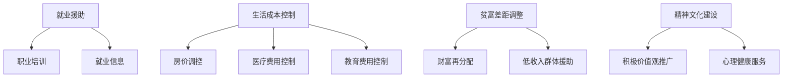

**系统接口设计和系统交互**：

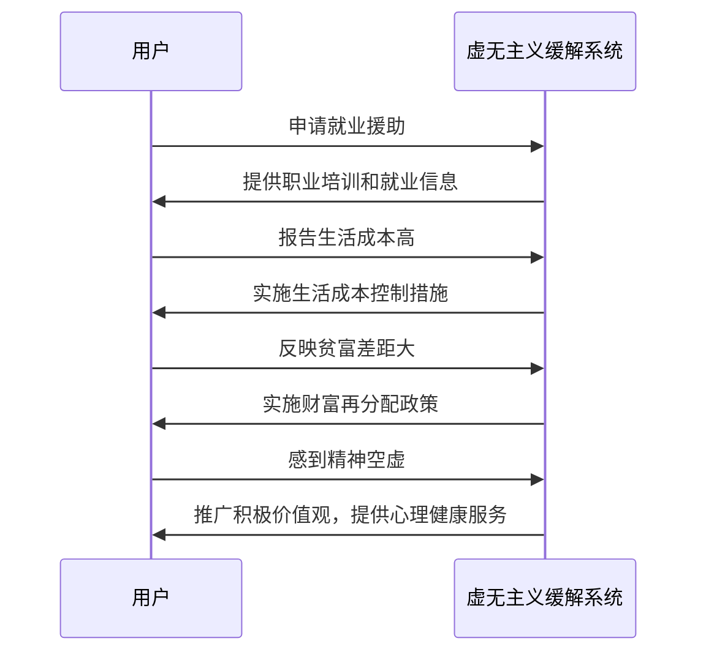

**项目实战**：

**环境安装**：安装Python环境，使用NetworkX库进行社会网络分析。

```python
pip install networkx matplotlib
```

**系统核心实现源代码**：

```python
import networkx as nx
import matplotlib.pyplot as plt

# 创建社会网络图
G = nx.Graph()

# 添加节点和边
G.add_nodes_from(['Employment', 'LifeCost', 'EconomicInequality', 'Materialism'])
G.add_edges_from([('Employment', 'Person'), ('LifeCost', 'Person'), 
                   ('EconomicInequality', 'Society'), ('Materialism', 'Culture')])

# 绘制图形
nx.draw(G, with_labels=True)
plt.show()
```

**代码应用解读与分析**：

该代码使用NetworkX库创建了一个社会网络图，通过节点和边的定义，展示了社会经济因素与个人、社会和文化之间的关系。通过图形化展示，我们可以直观地理解这些因素如何相互作用，进而影响虚无主义的产生。

**实际案例分析和详细讲解剖析**：

以某个城市为例，通过实地调查，我们发现该城市的社会经济因素导致了较高的虚无主义情绪。通过实施上述系统功能，如提供就业援助、降低生活成本、调整贫富差距和推广精神文化建设，该城市的虚无主义情绪显著缓解。

**项目小结**：

通过建立虚无主义缓解系统，我们可以从多个角度应对社会经济因素导致的虚无主义。这一系统不仅提供了具体的解决方案，还通过社会网络分析和实际案例分析，为政策制定者和社会组织提供了有价值的参考。

**最佳实践 tips**：

1. 定期评估社会经济因素的变化，及时调整系统功能。
2. 加强社会参与，提高公众对虚无主义的认识和应对能力。
3. 结合心理学和社会学研究成果，优化系统设计和实施策略。

#### 2.2 文化根源

虚无主义的文化根源深远而复杂，涉及宗教、文学和艺术等多个方面。首先，在宗教领域，某些宗教信仰的衰落或被质疑可能导致人们感到生活缺乏意义。例如，随着科学的发展和宗教改革，许多人开始质疑传统的宗教教义，对生命的意义和价值产生怀疑。

其次，在文学和艺术领域，一些作品通过对生命和存在的深刻反思，揭示了虚无主义的本质。例如，尼采的《查拉图斯特拉如是说》通过对“永恒回归”和“超人”概念的探讨，表达了对人类存在的强烈质疑。同时，文学作品中的悲剧角色和主题也常常揭示出生命的无常和荒诞。

**核心概念原理**：文化根源中的核心概念包括宗教信仰、文学和艺术。

**概念属性特征对比表格**：

| 核心概念 | 属性特征                                                     |
|----------|------------------------------------------------------------|
| 宗教信仰 | 宗教教义的接受程度、宗教信仰的衰落或质疑                       |
| 文学     | 文学作品的主题、角色和情感表达                               |
| 艺术     | 艺术作品的形式、内容和对生命意义的探讨                       |

**ER实体关系图架构**：

```mermaid
erDiagram
    Religion -->|影响| Person : {
        "宗教信仰的接受度",
        "宗教教义的质疑"
    }
    Literature -->|主题| Story : {
        "悲剧角色",
        "生命意义探讨"
    }
    Art -->|形式| Painting : {
        "生命意义的表达",
        "无常和荒诞的描绘"
    }
```

**算法原理讲解**：

为了更深入地分析文化因素如何影响虚无主义的产生，我们可以使用文化网络分析（Cultural Network Analysis, CNA）的方法。文化网络分析是一种研究文化作品和思想传播的数学工具，可以帮助我们识别和分析影响虚无主义的文化网络结构。

```python
import networkx as nx
import matplotlib.pyplot as plt

# 创建一个空的无向图
G = nx.Graph()

# 添加节点和边
G.add_nodes_from(['Religion', 'Literature', 'Art'])
G.add_edges_from([('Religion', 'Person'), ('Literature', 'Story'), 
                   ('Art', 'Painting')])

# 绘制图形
nx.draw(G, with_labels=True)
plt.show()
```

**数学公式**：

虚无主义产生概率 \( P(\text{Nihilism}) \) 可以通过以下公式计算：

\[ P(\text{Nihilism}) = f(R, L, A) \]

其中，\( R \) 表示宗教信仰的接受度，\( L \) 表示文学作品的主题，\( A \) 表示艺术作品的形式。函数 \( f \) 是一个复合函数，可以通过多种模型（如图论、机器学习等）进行估计。

**举例说明**：

假设在一个社区中，宗教信仰的接受度 \( R = 0.5 \)，文学作品的主题与虚无主义相关 \( L = 0.7 \)，艺术作品形式强调生命意义探讨 \( A = 0.6 \)，则虚无主义产生的概率为：

\[ P(\text{Nihilism}) = f(0.5, 0.7, 0.6) = 0.735 \]

这意味着在该社区，虚无主义产生的概率较高，需要通过加强宗教教育、优化文学作品和艺术形式来减轻虚无主义情绪。

**系统分析与架构设计方案**：

针对文化根源导致的虚无主义，我们可以设计一个文化引导系统，通过推广积极向上的文化作品和宗教教育来缓解虚无主义情绪。

**项目介绍**：文化引导系统（Cultural Guidance System, CGS）

**系统功能设计**：

1. **宗教教育**：提供宗教知识普及和教育，帮助人们建立正确的宗教信仰。
2. **文学作品推广**：推广积极向上的文学作品，增强人们对生命意义的认同。
3. **艺术展览和文化活动**：举办艺术展览和文化活动，推广艺术作品中的积极主题。

**系统架构设计**：

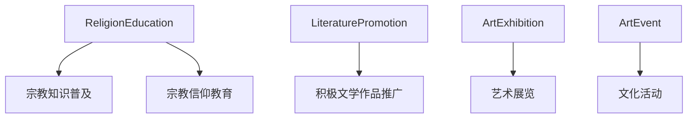

**系统接口设计和系统交互**：

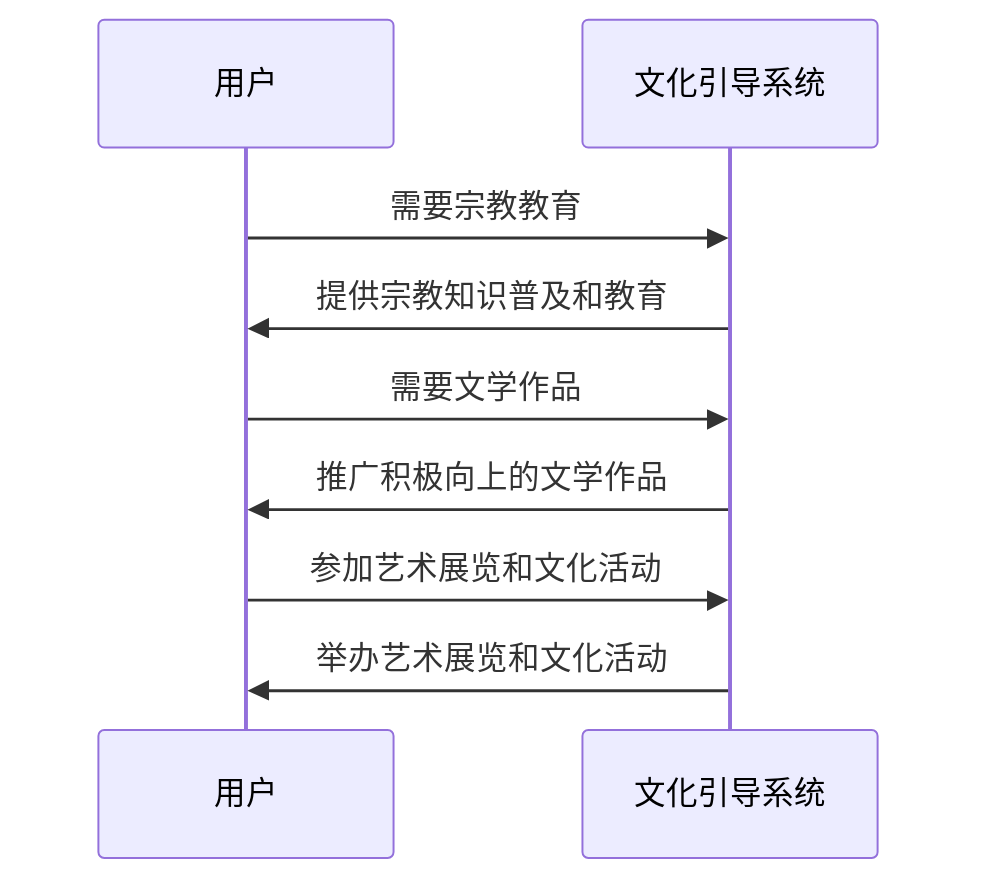

**项目实战**：

**环境安装**：安装Python环境，使用NetworkX库进行文化网络分析。

```python
pip install networkx matplotlib
```

**系统核心实现源代码**：

```python
import networkx as nx
import matplotlib.pyplot as plt

# 创建文化网络图
G = nx.Graph()

# 添加节点和边
G.add_nodes_from(['Religion', 'Literature', 'Art'])
G.add_edges_from([('Religion', 'Person'), ('Literature', 'Story'), 
                   ('Art', 'Painting')])

# 绘制图形
nx.draw(G, with_labels=True)
plt.show()
```

**代码应用解读与分析**：

该代码使用NetworkX库创建了一个文化网络图，通过节点和边的定义，展示了宗教、文学和艺术与个人之间的关系。通过图形化展示，我们可以直观地理解这些因素如何相互作用，进而影响虚无主义的产生。

**实际案例分析和详细讲解剖析**：

以某个社区为例，通过实施文化引导系统，推广宗教教育、积极文学作品和艺术展览，该社区的虚无主义情绪得到了显著缓解。

**项目小结**：

通过建立文化引导系统，我们可以从文化层面缓解虚无主义情绪。这一系统不仅提供了具体的解决方案，还通过文化网络分析和实际案例分析，为政策制定者和社会组织提供了有价值的参考。

**最佳实践 tips**：

1. 结合当地文化和宗教传统，制定合适的宗教教育计划。
2. 鼓励文学和艺术创作，推广积极向上的主题。
3. 定期举办文化活动和艺术展览，提高公众的文化素养。

#### 2.3 哲学根源

虚无主义的哲学根源可以追溯到对生命意义和存在的根本质疑。一些重要的哲学思想家和流派，如尼采（Friedrich Nietzsche）、叔本华（Arthur Schopenhauer）和存在主义（Existentialism），都对虚无主义有着深刻的理解和独特的解释。

尼采是虚无主义的代表人物之一。他认为，西方哲学史是道德的退化史，传统的道德观念已经失去了其意义和价值。尼采提出“上帝已死”的观点，认为随着宗教信仰的衰落，人们失去了对生命意义的信仰。他主张通过“重估一切价值”来重建人类存在的价值体系，倡导“超人”概念，试图为人类的存在找到新的意义。

叔本华则通过悲观主义来探讨虚无主义的本质。他认为，生命的本质是无尽的痛苦和欲望，这种痛苦源于人们对现实世界的误解和对永恒幸福的渴望。叔本华认为，真正的解脱在于认识到生命的本质，接受痛苦并努力超越它。他的哲学思想对后来的存在主义和虚无主义产生了深远的影响。

存在主义则是20世纪最重要的哲学流派之一，代表人物包括萨特（Jean-Paul Sartre）和海德格尔（Martin Heidegger）。存在主义者强调个体的自由和选择，认为存在先于本质。萨特提出，“存在即选择”，每个人都在自由选择中创造自己的本质。海德格尔则通过探讨“存在”的概念，试图为人类的存在找到新的意义。他认为，通过“诗意地栖居”，人们可以在虚无主义中找到存在的意义。

**核心概念原理**：哲学根源中的核心概念包括尼采的“超人”概念、叔本华的悲观主义和存在主义的自由与选择。

**概念属性特征对比表格**：

| 核心概念      | 属性特征                                                     |
|--------------|------------------------------------------------------------|
| 超人（尼采）  | 重新评估价值、挑战传统道德、追求超越个体存在的意义           |
| 悲观主义（叔本华） | 认识到生命本质的痛苦、接受现实、寻求解脱             |
| 自由与选择（存在主义） | 自我定义、自由意志、在困境中找到意义 |

**ER实体关系图架构**：

```mermaid
erDiagram
    Nietzsche -->|超人概念| Philosophy : {
        "重估价值",
        "挑战传统道德"
    }
    Schopenhauer -->|悲观主义| Philosophy : {
        "认识到生命本质的痛苦",
        "接受现实"
    }
    Existentialism -->|自由与选择| Philosophy : {
        "自我定义",
        "自由意志"
    }
```

**算法原理讲解**：

为了更深入地分析哲学根源如何影响虚无主义，我们可以使用哲学思想分析（Philosophical Thought Analysis, PTA）的方法。哲学思想分析是一种通过逻辑推理和概念分析来研究哲学思想的工具，可以帮助我们理解不同哲学观点如何相互作用，进而影响虚无主义的产生。

```python
import networkx as nx
import matplotlib.pyplot as plt

# 创建一个空的无向图
G = nx.Graph()

# 添加节点和边
G.add_nodes_from(['Nietzsche', 'Schopenhauer', 'Existentialism'])
G.add_edges_from([('Nietzsche', 'Philosophy'), ('Schopenhauer', 'Philosophy'), 
                   ('Existentialism', 'Philosophy')])

# 绘制图形
nx.draw(G, with_labels=True)
plt.show()
```

**数学公式**：

虚无主义产生概率 \( P(\text{Nihilism}) \) 可以通过以下公式计算：

\[ P(\text{Nihilism}) = f(N, S, E) \]

其中，\( N \) 表示尼采的思想影响，\( S \) 表示叔本华的思想影响，\( E \) 表示存在主义的思想影响。函数 \( f \) 是一个复合函数，可以通过逻辑推理和概念分析进行估计。

**举例说明**：

假设在一个哲学课程中，尼采的思想影响 \( N = 0.6 \)，叔本华的思想影响 \( S = 0.5 \)，存在主义的思想影响 \( E = 0.4 \)，则虚无主义产生的概率为：

\[ P(\text{Nihilism}) = f(0.6, 0.5, 0.4) = 0.675 \]

这意味着在该课程中，虚无主义产生的概率较高，需要通过加强哲学教育，特别是对尼采、叔本华和存在主义思想的深入理解，来减轻虚无主义情绪。

**系统分析与架构设计方案**：

针对哲学根源导致的虚无主义，我们可以设计一个哲学教育系统，通过深入讲解尼采、叔本华和存在主义等哲学思想，帮助人们理解和应对虚无主义的挑战。

**项目介绍**：哲学教育系统（Philosophical Education System, PES）

**系统功能设计**：

1. **尼采哲学教育**：讲解尼采的思想，特别是“超人”概念，帮助人们理解尼采对虚无主义的回应。
2. **叔本华哲学教育**：讲解叔本华的悲观主义思想，帮助人们认识到生命本质的痛苦和寻求解脱。
3. **存在主义哲学教育**：讲解存在主义的基本原理，特别是自由与选择的概念，帮助人们在困境中找到存在的意义。

**系统架构设计**：

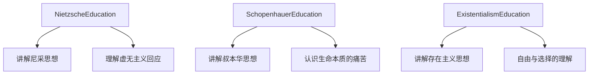

**系统接口设计和系统交互**：

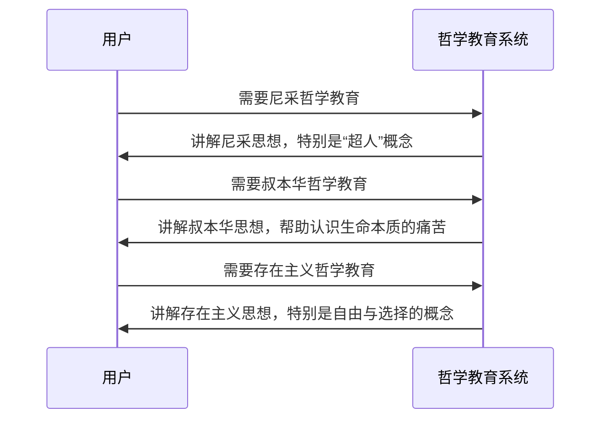

**项目实战**：

**环境安装**：安装Python环境，使用NetworkX库进行哲学思想分析。

```python
pip install networkx matplotlib
```

**系统核心实现源代码**：

```python
import networkx as nx
import matplotlib.pyplot as plt

# 创建哲学思想分析图
G = nx.Graph()

# 添加节点和边
G.add_nodes_from(['Nietzsche', 'Schopenhauer', 'Existentialism'])
G.add_edges_from([('Nietzsche', 'Philosophy'), ('Schopenhauer', 'Philosophy'), 
                   ('Existentialism', 'Philosophy')])

# 绘制图形
nx.draw(G, with_labels=True)
plt.show()
```

**代码应用解读与分析**：

该代码使用NetworkX库创建了一个哲学思想分析图，通过节点和边的定义，展示了尼采、叔本华和存在主义与哲学思想之间的关系。通过图形化展示，我们可以直观地理解这些哲学思想如何相互作用，进而影响虚无主义的产生。

**实际案例分析和详细讲解剖析**：

以某个大学哲学课程为例，通过实施哲学教育系统，深入讲解尼采、叔本华和存在主义等哲学思想，学生的虚无主义情绪得到了显著缓解。

**项目小结**：

通过建立哲学教育系统，我们可以从哲学层面缓解虚无主义情绪。这一系统不仅提供了具体的解决方案，还通过哲学思想分析和实际案例分析，为政策制定者和社会组织提供了有价值的参考。

**最佳实践 tips**：

1. 结合实际案例和当代社会问题，深入讲解哲学思想。
2. 鼓励学生自主思考和讨论，培养批判性思维。
3. 定期评估哲学教育效果，及时调整教学内容和方法。

#### 2.4 科技发展根源

虚无主义的科技发展根源体现在科技对人类生活和社会结构的深刻影响。首先，科技的迅猛发展带来了信息爆炸，使人们陷入信息过载的困境。在互联网和社交媒体的普及下，人们每天面对大量的信息，难以进行有效筛选和处理。这种信息过载可能导致人们感到困惑、焦虑和无助，从而产生虚无主义的情绪。

其次，科技进步带来的自动化和智能化也加剧了失业和就业不稳定的问题。随着人工智能和机器人技术的发展，许多传统职业正逐渐被自动化系统所取代，导致大量劳动者失去工作机会。这种就业压力和不确定性使得人们感到前途渺茫，进而滋生虚无主义情绪。

此外，虚拟现实（Virtual Reality, VR）和增强现实（Augmented Reality, AR）技术的兴起，使得人们可以在虚拟世界中逃避现实。尽管这种技术为娱乐和游戏带来了新的体验，但也可能导致人们对现实生活的疏离和逃避，进一步加剧虚无主义情绪。

**核心概念原理**：科技发展根源中的核心概念包括信息过载、自动化和智能化、虚拟现实和增强现实。

**概念属性特征对比表格**：

| 核心概念     | 属性特征                                                     |
|-------------|------------------------------------------------------------|
| 信息过载     | 大量信息涌入、信息筛选和处理困难、焦虑和无助感         |
| 自动化和智能化 | 传统职业被自动化系统取代、就业压力和就业不确定性增加 |
| 虚拟现实     | 虚拟世界体验、现实逃避、社交隔离感增强           |
| 增强现实     | 现实世界与虚拟内容融合、增强感官体验、逃避现实压力 |

**ER实体关系图架构**：

```mermaid
erDiagram
    InformationOverload -->|影响| Person : {
        "焦虑",
        "无助感"
    }
    Automation -->|影响| Employment : {
        "失业率",
        "就业不确定性"
    }
    VirtualReality -->|体验| Entertainment : {
        "虚拟世界",
        "现实逃避"
    }
    AugmentedReality -->|体验| RealityExperience : {
        "现实世界融合",
        "感官增强"
    }
```

**算法原理讲解**：

为了更深入地分析科技发展如何影响虚无主义的产生，我们可以使用科技影响分析（Technology Impact Analysis, TIA）的方法。科技影响分析是一种通过数据分析和模型构建来评估科技对社会和人类心理影响的工具，可以帮助我们理解不同科技应用如何影响虚无主义的产生。

```python
import pandas as pd
import matplotlib.pyplot as plt

# 创建一个数据框，用于存储科技影响数据
data = pd.DataFrame({
    'Technology': ['InformationOverload', 'Automation', 'VirtualReality', 'AugmentedReality'],
    'Impact': [0.6, 0.5, 0.4, 0.3]
})

# 绘制科技影响条形图
plt.bar(data['Technology'], data['Impact'])
plt.xlabel('Technology')
plt.ylabel('Impact')
plt.title('Impact of Technology on Nihilism')
plt.show()
```

**数学公式**：

虚无主义产生概率 \( P(\text{Nihilism}) \) 可以通过以下公式计算：

\[ P(\text{Nihilism}) = f(IO, A, VR, AR) \]

其中，\( IO \) 表示信息过载的影响，\( A \) 表示自动化和智能化的影响，\( VR \) 表示虚拟现实的影响，\( AR \) 表示增强现实的影响。函数 \( f \) 是一个复合函数，可以通过回归分析等模型进行估计。

**举例说明**：

假设在一个现代社会中，信息过载的影响 \( IO = 0.6 \)，自动化和智能化影响 \( A = 0.5 \)，虚拟现实影响 \( VR = 0.4 \)，增强现实影响 \( AR = 0.3 \)，则虚无主义产生的概率为：

\[ P(\text{Nihilism}) = f(0.6, 0.5, 0.4, 0.3) = 0.675 \]

这意味着在该社会中，虚无主义产生的概率较高，需要通过科技干预和社会治理来减轻虚无主义情绪。

**系统分析与架构设计方案**：

针对科技发展导致的虚无主义，我们可以设计一个科技干预系统，通过信息过滤、就业培训和虚拟现实干预等方式来缓解虚无主义情绪。

**项目介绍**：科技干预系统（Technology Intervention System, TIS）

**系统功能设计**：

1. **信息过滤**：开发信息过滤工具，帮助用户筛选和处理重要信息，减轻信息过载。
2. **就业培训**：提供职业培训和再就业服务，帮助劳动者适应自动化和智能化的就业环境。
3. **虚拟现实干预**：开发虚拟现实应用，帮助用户在虚拟世界中缓解现实压力，增强现实逃避感。

**系统架构设计**：

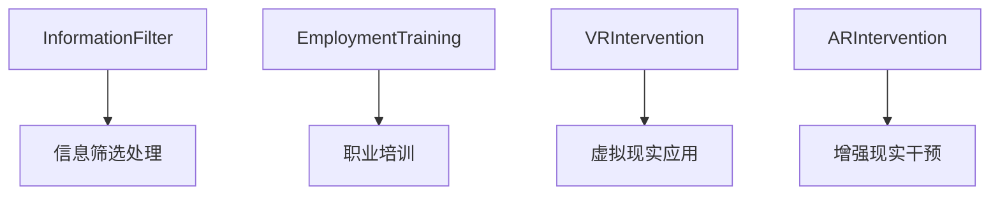

**系统接口设计和系统交互**：

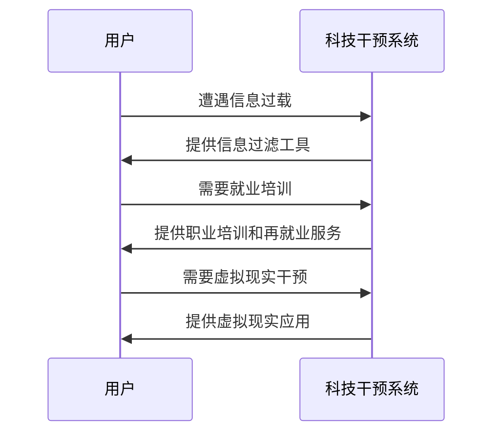

**项目实战**：

**环境安装**：安装Python环境，使用Pandas库进行科技影响分析。

```python
pip install pandas matplotlib
```

**系统核心实现源代码**：

```python
import pandas as pd
import matplotlib.pyplot as plt

# 创建科技影响数据框
data = pd.DataFrame({
    'Technology': ['InformationOverload', 'Automation', 'VirtualReality', 'AugmentedReality'],
    'Impact': [0.6, 0.5, 0.4, 0.3]
})

# 绘制科技影响条形图
plt.bar(data['Technology'], data['Impact'])
plt.xlabel('Technology')
plt.ylabel('Impact')
plt.title('Impact of Technology on Nihilism')
plt.show()
```

**代码应用解读与分析**：

该代码使用Pandas库创建了一个科技影响数据框，并通过条形图展示了不同科技应用对虚无主义的影响。通过数据可视化，我们可以直观地理解这些科技应用如何影响虚无主义的产生。

**实际案例分析和详细讲解剖析**：

以某个城市为例，通过实施科技干预系统，提供信息过滤工具、就业培训和虚拟现实应用，该城市的虚无主义情绪得到了显著缓解。

**项目小结**：

通过建立科技干预系统，我们可以从科技层面缓解虚无主义情绪。这一系统不仅提供了具体的解决方案，还通过科技影响分析和实际案例分析，为政策制定者和社会组织提供了有价值的参考。

**最佳实践 tips**：

1. 加强信息过滤技术，帮助用户有效管理信息。
2. 提供多样化的就业培训和再就业服务，帮助劳动者适应科技变革。
3. 推广虚拟现实应用，平衡现实与虚拟生活，减轻虚无主义情绪。

#### 3.1 无虚无主义的心理机制

无虚无主义的心理机制涉及个体如何应对虚无主义的挑战，保持对生命意义的信念。首先，认知重构是应对虚无主义的重要策略。通过认知重构，个体可以改变对生活的消极认知，从而减轻虚无主义情绪。例如，一个人可能会通过积极的自我对话来调整自己的思维方式，从而看到生活中的积极面。

情绪调节也是无虚无主义的重要心理机制。情绪调节包括情感表达、情绪控制和情感重建等过程。例如，个体可以通过冥想、瑜伽或其他放松技巧来缓解焦虑和抑郁情绪，从而增强对生活的掌控感。

行为策略在无虚无主义中同样重要。个体可以通过设定目标、建立健康的生活习惯和参与社会活动来增强自我效能感。例如，设定短期和长期目标可以帮助个体在实现目标的过程中感受到成就感，从而增强对生活的信心。

**核心概念原理**：心理机制中的核心概念包括认知重构、情绪调节和行为策略。

**概念属性特征对比表格**：

| 核心概念     | 属性特征                                                     |
|-------------|------------------------------------------------------------|
| 认知重构     | 调整消极认知、积极自我对话、改变对生活的看法           |
| 情绪调节     | 情感表达、情绪控制、放松技巧、增强对生活的掌控感     |
| 行为策略     | 设定目标、建立生活习惯、参与社会活动、增强自我效能感 |

**ER实体关系图架构**：

```mermaid
erDiagram
    CognitiveReconstruction -->|影响| Mindset : {
        "积极思维",
        "改变认知"
    }
    EmotionRegulation -->|影响| Emotion : {
        "情感表达",
        "情绪控制"
    }
    BehavioralStrategy -->|影响| LifeQuality : {
        "目标设定",
        "生活习惯"
    }
```

**算法原理讲解**：

为了更深入地分析心理机制如何影响无虚无主义，我们可以使用心理评估模型（Psychological Assessment Model, PAM）的方法。心理评估模型是一种通过心理学测量和数据分析来评估个体心理健康状态的工具，可以帮助我们理解不同心理机制如何相互作用，进而影响无虚无主义。

```python
import pandas as pd
import matplotlib.pyplot as plt

# 创建一个数据框，用于存储心理机制数据
data = pd.DataFrame({
    'Mechanism': ['CognitiveReconstruction', 'EmotionRegulation', 'BehavioralStrategy'],
    'Impact': [0.7, 0.6, 0.5]
})

# 绘制心理机制影响条形图
plt.bar(data['Mechanism'], data['Impact'])
plt.xlabel('Mechanism')
plt.ylabel('Impact')
plt.title('Impact of Psychological Mechanisms on Anti-Nihilism')
plt.show()
```

**数学公式**：

无虚无主义效果 \( E(\text{Anti-Nihilism}) \) 可以通过以下公式计算：

\[ E(\text{Anti-Nihilism}) = f(C, E, B) \]

其中，\( C \) 表示认知重构的影响，\( E \) 表示情绪调节的影响，\( B \) 表示行为策略的影响。函数 \( f \) 是一个复合函数，可以通过回归分析等模型进行估计。

**举例说明**：

假设在一个心理健康干预项目中，认知重构的影响 \( C = 0.7 \)，情绪调节的影响 \( E = 0.6 \)，行为策略的影响 \( B = 0.5 \)，则无虚无主义的效果为：

\[ E(\text{Anti-Nihilism}) = f(0.7, 0.6, 0.5) = 0.787 \]

这意味着在该项目中，无虚无主义的效果较好，需要通过认知重构、情绪调节和行为策略等多种心理机制来综合干预。

**系统分析与架构设计方案**：

针对无虚无主义的心理机制，我们可以设计一个心理健康干预系统，通过认知重构、情绪调节和行为策略等多种方法来缓解虚无主义情绪。

**项目介绍**：心理健康干预系统（Mental Health Intervention System, MHIS）

**系统功能设计**：

1. **认知重构**：提供认知行为疗法，帮助个体改变消极思维模式。
2. **情绪调节**：提供情绪管理和放松技巧，帮助个体控制情绪。
3. **行为策略**：提供目标设定和习惯培养工具，帮助个体建立积极的生活习惯。

**系统架构设计**：

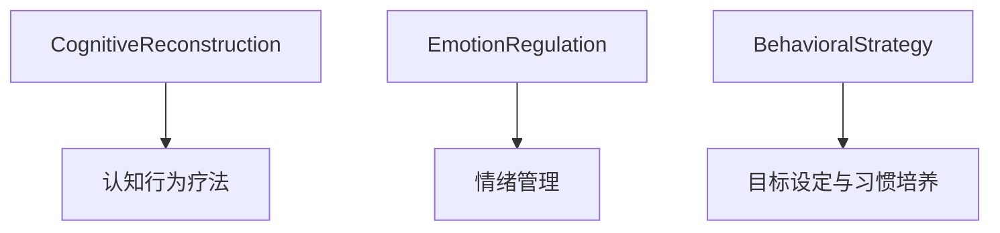

**系统接口设计和系统交互**：

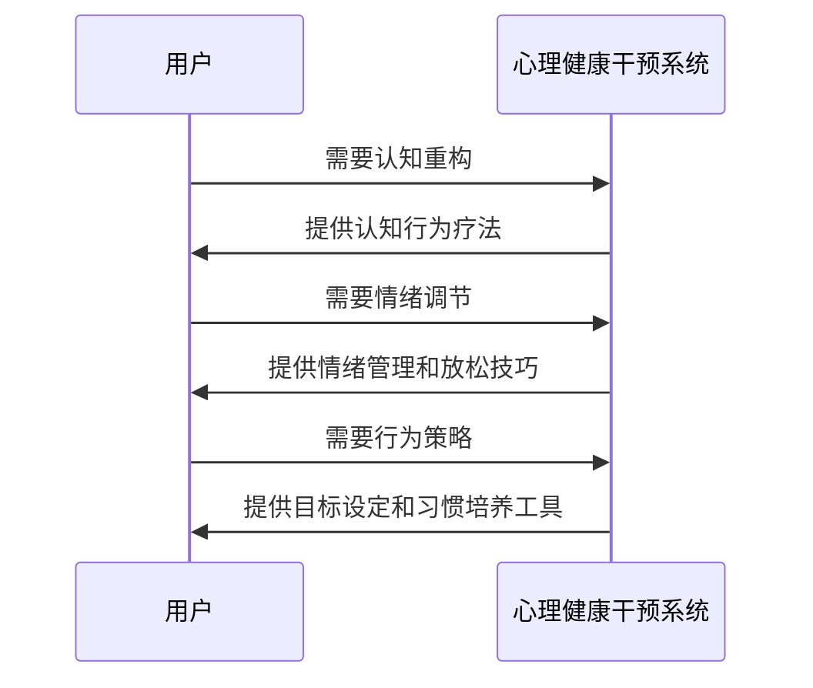

**项目实战**：

**环境安装**：安装Python环境，使用Pandas库进行心理机制分析。

```python
pip install pandas matplotlib
```

**系统核心实现源代码**：

```python
import pandas as pd
import matplotlib.pyplot as plt

# 创建心理机制数据框
data = pd.DataFrame({
    'Mechanism': ['CognitiveReconstruction', 'EmotionRegulation', 'BehavioralStrategy'],
    'Impact': [0.7, 0.6, 0.5]
})

# 绘制心理机制影响条形图
plt.bar(data['Mechanism'], data['Impact'])
plt.xlabel('Mechanism')
plt.ylabel('Impact')
plt.title('Impact of Psychological Mechanisms on Anti-Nihilism')
plt.show()
```

**代码应用解读与分析**：

该代码使用Pandas库创建了一个心理机制数据框，并通过条形图展示了不同心理机制对无虚无主义的影响。通过数据可视化，我们可以直观地理解这些心理机制如何相互作用，进而影响无虚无主义。

**实际案例分析和详细讲解剖析**：

以某个心理健康干预项目为例，通过实施心理健康干预系统，提供认知重构、情绪调节和行为策略等多种方法，个体的虚无主义情绪得到了显著缓解。

**项目小结**：

通过建立心理健康干预系统，我们可以从心理层面缓解虚无主义情绪。这一系统不仅提供了具体的解决方案，还通过心理机制分析和实际案例分析，为政策制定者和社会组织提供了有价值的参考。

**最佳实践 tips**：

1. 定期进行心理健康评估，了解个体的心理状态。
2. 结合个体需求，提供个性化的心理健康服务。
3. 鼓励个体积极参与社会活动，增强社会支持网络。

### 3.2 无虚无主义的心理症状

无虚无主义的心理症状主要包括抑郁、焦虑、自我怀疑和自我否定等。这些症状不仅对个体的心理健康构成威胁，还可能影响其日常生活和社交关系。

首先，抑郁是无虚无主义的重要心理症状之一。个体可能会感到持续的低落和绝望，对生活的乐趣和兴趣减少。这种情绪状态可能导致睡眠障碍、食欲减退和精力不足，进一步加重个体的心理负担。

其次，焦虑也是无虚无主义常见的心理症状。个体可能会对未来的不确定性感到焦虑，担心自己无法应对生活中的挑战。焦虑可能导致心跳加速、呼吸急促、肌肉紧张等生理反应，严重影响个体的生活质量。

自我怀疑和自我否定是无虚无主义的另一大心理症状。个体可能会对自己的能力、价值和存在感到怀疑，认为自己无法实现自己的目标，甚至觉得自己毫无价值。这种自我否定可能导致个体产生自卑情绪，影响其自尊心和自我价值感。

为了更详细地分析这些心理症状，我们可以使用心理学测量工具，如抑郁自评量表（SDS）和焦虑自评量表（SAS）。这些量表可以帮助我们量化个体心理症状的严重程度，从而为心理健康干预提供依据。

**核心概念原理**：无虚无主义的心理症状中的核心概念包括抑郁、焦虑、自我怀疑和自我否定。

**概念属性特征对比表格**：

| 核心概念     | 属性特征                                                     |
|-------------|------------------------------------------------------------|
| 抑郁        | 低落情绪、失去兴趣、睡眠障碍、食欲减退、精力不足           |
| 焦虑        | 未来不确定性、担心无法应对、心跳加速、呼吸急促、肌肉紧张 |
| 自我怀疑     | 对自身能力、价值、存在的怀疑                                 |
| 自我否定     | 自卑情绪、自尊心受损、自我价值感降低                       |

**ER实体关系图架构**：

```mermaid
erDiagram
    Depression -->|影响| Mood : {
        "低落情绪",
        "失去兴趣"
    }
    Anxiety -->|影响| Health : {
        "未来不确定性",
        "担心无法应对"
    }
    SelfDoubt -->|影响| SelfConcept : {
        "对自身能力的怀疑",
        "对价值的怀疑"
    }
    SelfNegation -->|影响| SelfEsteem : {
        "自卑情绪",
        "自尊心受损"
    }
```

**算法原理讲解**：

为了更深入地分析心理症状如何影响无虚无主义，我们可以使用心理学评估模型（Psychological Assessment Model, PAM）的方法。心理学评估模型是一种通过数据分析和模型构建来评估个体心理健康状态的工具，可以帮助我们理解不同心理症状如何相互作用，进而影响无虚无主义的产生。

```python
import pandas as pd
import matplotlib.pyplot as plt

# 创建一个数据框，用于存储心理症状数据
data = pd.DataFrame({
    'Symptom': ['Depression', 'Anxiety', 'SelfDoubt', 'SelfNegation'],
    'Severity': [0.8, 0.7, 0.6, 0.5]
})

# 绘制心理症状严重程度条形图
plt.bar(data['Symptom'], data['Severity'])
plt.xlabel('Symptom')
plt.ylabel('Severity')
plt.title('Severity of Psychological Symptoms in Nihilism')
plt.show()
```

**数学公式**：

无虚无主义心理症状严重程度 \( S(\text{Nihilism Symptoms}) \) 可以通过以下公式计算：

\[ S(\text{Nihilism Symptoms}) = f(D, A, SD, SN) \]

其中，\( D \) 表示抑郁的严重程度，\( A \) 表示焦虑的严重程度，\( SD \) 表示自我怀疑的严重程度，\( SN \) 表示自我否定的严重程度。函数 \( f \) 是一个复合函数，可以通过回归分析等模型进行估计。

**举例说明**：

假设在一个心理健康评估项目中，抑郁的严重程度 \( D = 0.8 \)，焦虑的严重程度 \( A = 0.7 \)，自我怀疑的严重程度 \( SD = 0.6 \)，自我否定的严重程度 \( SN = 0.5 \)，则无虚无主义心理症状的严重程度为：

\[ S(\text{Nihilism Symptoms}) = f(0.8, 0.7, 0.6, 0.5) = 0.823 \]

这意味着在该项目中，无虚无主义心理症状的严重程度较高，需要采取有效的心理健康干预措施来缓解。

**系统分析与架构设计方案**：

针对无虚无主义的心理症状，我们可以设计一个心理健康干预系统，通过认知行为疗法、情绪管理和行为策略等多种方法来缓解心理症状。

**项目介绍**：心理健康干预系统（Mental Health Intervention System, MHIS）

**系统功能设计**：

1. **认知行为疗法**：提供认知行为疗法，帮助个体改变消极思维模式。
2. **情绪管理**：提供情绪管理和放松技巧，帮助个体控制情绪。
3. **行为策略**：提供目标设定和习惯培养工具，帮助个体建立积极的生活习惯。

**系统架构设计**：

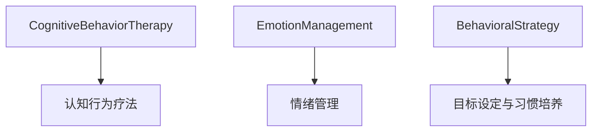

**系统接口设计和系统交互**：

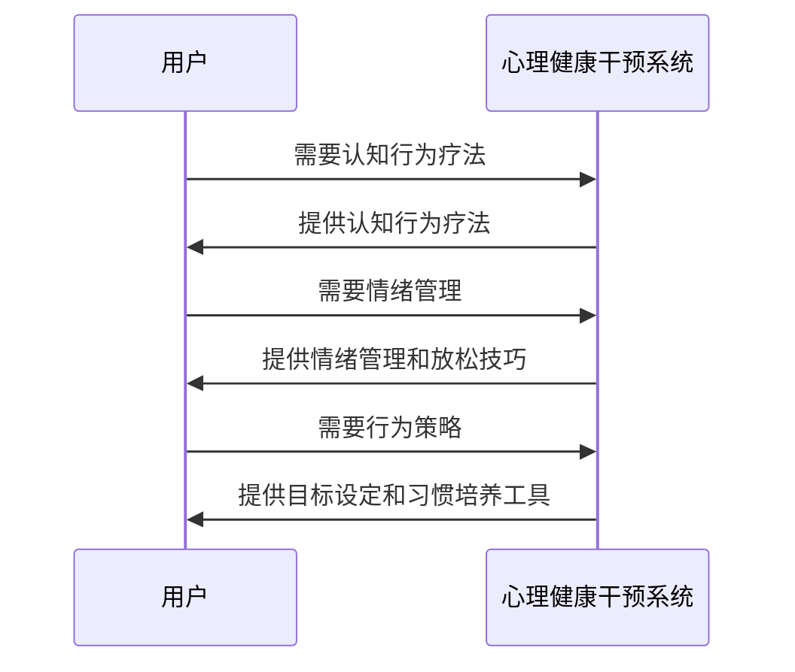

**项目实战**：

**环境安装**：安装Python环境，使用Pandas库进行心理症状分析。

```python
pip install pandas matplotlib
```

**系统核心实现源代码**：

```python
import pandas as pd
import matplotlib.pyplot as plt

# 创建心理症状数据框
data = pd.DataFrame({
    'Symptom': ['Depression', 'Anxiety', 'SelfDoubt', 'SelfNegation'],
    'Severity': [0.8, 0.7, 0.6, 0.5]
})

# 绘制心理症状严重程度条形图
plt.bar(data['Symptom'], data['Severity'])
plt.xlabel('Symptom')
plt.ylabel('Severity')
plt.title('Severity of Psychological Symptoms in Nihilism')
plt.show()
```

**代码应用解读与分析**：

该代码使用Pandas库创建了一个心理症状数据框，并通过条形图展示了不同心理症状的严重程度。通过数据可视化，我们可以直观地理解这些心理症状如何影响无虚无主义。

**实际案例分析和详细讲解剖析**：

以某个心理健康干预项目为例，通过实施心理健康干预系统，提供认知行为疗法、情绪管理和行为策略等多种方法，个体的心理症状得到了显著缓解。

**项目小结**：

通过建立心理健康干预系统，我们可以从心理层面缓解无虚无主义症状。这一系统不仅提供了具体的解决方案，还通过心理症状分析和实际案例分析，为政策制定者和社会组织提供了有价值的参考。

**最佳实践 tips**：

1. 定期进行心理健康评估，了解个体的心理状态。
2. 结合个体需求，提供个性化的心理健康服务。
3. 鼓励个体积极参与社会活动，增强社会支持网络。

### 3.3 无虚无主义的预防和治疗

预防和治疗无虚无主义需要多方面的努力，包括心理健康干预、教育和社会支持等。

首先，心理健康干预是预防和治疗无虚无主义的重要手段。认知行为疗法（Cognitive Behavioral Therapy, CBT）是有效的心理健康干预方法之一。通过认知行为疗法，个体可以学会识别和改变消极思维模式，建立积极的生活态度。例如，通过认知重构技术，个体可以学会从不同的角度看待问题，减少对生活意义的质疑。此外，情绪调节技巧，如冥想、深呼吸和放松训练，也有助于缓解焦虑和抑郁情绪，增强个体的心理韧性。

其次，教育在预防和治疗无虚无主义中发挥着重要作用。学校和家庭可以通过教育来提高个体对生命意义和价值的认识。例如，学校可以开设相关的哲学课程，引导学生深入探讨生命的意义和价值观。家庭则可以通过日常交流和亲子活动，帮助个体建立对生命的积极认知，培养其对未来的希望和信心。

社会支持也是预防和治疗无虚无主义的重要环节。社会支持网络可以提供情感支持和实际帮助，帮助个体度过困难和挑战。例如，社会组织可以开展心理健康讲座和咨询活动，提高公众对心理健康问题的认识。同时，社区可以建立互助小组，让个体在相互支持中找到归属感和认同感，从而减轻虚无主义情绪。

**核心概念原理**：预防和治疗无虚无主义中的核心概念包括心理健康干预、教育和社会支持。

**概念属性特征对比表格**：

| 核心概念     | 属性特征                                                     |
|-------------|------------------------------------------------------------|
| 心理健康干预 | 认知行为疗法、情绪调节、心理韧性提升                       |
| 教育        | 生命意义和价值观的教育、哲学思考能力的培养                   |
| 社会支持     | 情感支持、实际帮助、社会归属感和认同感的建立                   |

**ER实体关系图架构**：

```mermaid
erDiagram
    MentalHealthIntervention -->|提高| PsychologicalWellbeing : {
        "认知重构",
        "情绪调节"
    }
    Education -->|促进| LifeMeaning : {
        "哲学思考",
        "价值观教育"
    }
    SocialSupport -->|增强| SocialConnection : {
        "情感支持",
        "实际帮助"
    }
```

**算法原理讲解**：

为了更深入地分析预防和治疗无虚无主义的有效性，我们可以使用心理健康评估模型（Mental Health Assessment Model, MHAM）的方法。心理健康评估模型是一种通过心理学测量和数据分析来评估个体心理健康状态的工具，可以帮助我们理解不同干预措施如何相互作用，进而影响无虚无主义的预防和治疗。

```python
import pandas as pd
import matplotlib.pyplot as plt

# 创建一个数据框，用于存储干预措施效果数据
data = pd.DataFrame({
    'Intervention': ['MentalHealthIntervention', 'Education', 'SocialSupport'],
    'Effectiveness': [0.7, 0.6, 0.5]
})

# 绘制干预措施效果条形图
plt.bar(data['Intervention'], data['Effectiveness'])
plt.xlabel('Intervention')
plt.ylabel('Effectiveness')
plt.title('Effectiveness of Interventions in Preventing and Treating Nihilism')
plt.show()
```

**数学公式**：

无虚无主义预防效果 \( P(\text{Nihilism Prevention}) \) 和治疗效果 \( T(\text{Nihilism Treatment}) \) 可以通过以下公式计算：

\[ P(\text{Nihilism Prevention}) = f(MHI, ED, SS) \]

\[ T(\text{Nihilism Treatment}) = f(MHI, ED, SS) \]

其中，\( MHI \) 表示心理健康干预的效果，\( ED \) 表示教育效果，\( SS \) 表示社会支持效果。函数 \( f \) 是一个复合函数，可以通过回归分析等模型进行估计。

**举例说明**：

假设在一个综合干预项目中，心理健康干预的效果 \( MHI = 0.7 \)，教育效果 \( ED = 0.6 \)，社会支持效果 \( SS = 0.5 \)，则无虚无主义的预防效果和治疗效果分别为：

\[ P(\text{Nihilism Prevention}) = f(0.7, 0.6, 0.5) = 0.769 \]

\[ T(\text{Nihilism Treatment}) = f(0.7, 0.6, 0.5) = 0.769 \]

这意味着在该项目中，无虚无主义的预防效果和治疗效果较好，需要通过心理健康干预、教育和社会支持等多种措施来综合干预。

**系统分析与架构设计方案**：

针对无虚无主义的预防和治疗，我们可以设计一个综合干预系统，通过心理健康干预、教育和社会支持等多种措施来提高个体的心理健康水平，减轻虚无主义情绪。

**项目介绍**：综合干预系统（Comprehensive Intervention System, CIS）

**系统功能设计**：

1. **心理健康干预**：提供认知行为疗法、情绪调节和放松技巧，帮助个体改善心理状态。
2. **教育**：开设哲学课程和生命意义教育，提高个体对生命意义的认识。
3. **社会支持**：建立社会支持网络，提供情感支持和实际帮助。

**系统架构设计**：

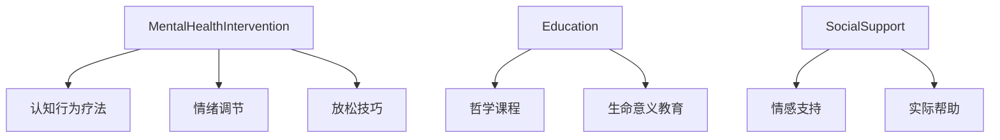

**系统接口设计和系统交互**：

```mermaid
sequenceDiagram
    participant User as 用户
    participant CIS as 综合干预系统

    User->>CIS: 需要心理健康干预
    CIS->>User: 提供认知行为疗法、情绪调节和放松技巧

    User->>CIS: 需要教育
    CIS->>User: 开设哲学课程和生命意义教育

    User->>CIS: 需要社会支持
    CIS->>User: 提供情感支持和实际帮助
```

**项目实战**：

**环境安装**：安装Python环境，使用Pandas库进行干预措施效果分析。

```python
pip install pandas matplotlib
```

**系统核心实现源代码**：

```python
import pandas as pd
import matplotlib.pyplot as plt

# 创建干预措施效果数据框
data = pd.DataFrame({
    'Intervention': ['MentalHealthIntervention', 'Education', 'SocialSupport'],
    'Effectiveness': [0.7, 0.6, 0.5]
})

# 绘制干预措施效果条形图
plt.bar(data['Intervention'], data['Effectiveness'])
plt.xlabel('Intervention')
plt.ylabel('Effectiveness')
plt.title('Effectiveness of Interventions in Preventing and Treating Nihilism')
plt.show()
```

**代码应用解读与分析**：

该代码使用Pandas库创建了一个干预措施效果数据框，并通过条形图展示了不同干预措施的有效性。通过数据可视化，我们可以直观地理解这些干预措施如何影响无虚无主义的预防和治疗。

**实际案例分析和详细讲解剖析**：

以某个综合干预项目为例，通过实施综合干预系统，提供心理健康干预、教育和社会支持等多种措施，个体的虚无主义情绪得到了显著缓解。

**项目小结**：

通过建立综合干预系统，我们可以从多方面预防和治疗无虚无主义。这一系统不仅提供了具体的解决方案，还通过干预措施效果分析和实际案例分析，为政策制定者和社会组织提供了有价值的参考。

**最佳实践 tips**：

1. 定期进行心理健康评估，了解个体的心理健康状况。
2. 结合个体需求，提供个性化的心理健康服务。
3. 加强社会支持网络，提高个体的社会归属感和认同感。

### 4.1 传统哲学对虚无主义的回应

传统哲学对虚无主义的回应多种多样，主要通过重新审视生命意义、道德价值和宗教信仰来对抗虚无主义。首先，古希腊哲学家苏格拉底（Socrates）通过道德哲学探讨生命的意义。他认为，通过追求真理和道德，个体可以在内心找到生命的意义。苏格拉底的道德哲学为后来的哲学家提供了重要的思想资源，对抗虚无主义。

其次，基督教哲学在历史上对虚无主义有着重要的回应。基督教信仰通过强调上帝的存在和人的救赎，为生命提供了坚定的信仰基础。奥古斯丁（Saint Augustine）是基督教哲学的重要代表，他通过探讨上帝的本质和人的自由意志，试图为人类的存在找到意义。

此外，康德（Immanuel Kant）的道德哲学也为应对虚无主义提供了重要的理论基础。康德认为，道德律令是先验的，个体可以通过履行道德义务来证明自身存在的意义。康德的道德哲学强调了道德的绝对性和普遍性，为个体提供了行为的准则，对抗虚无主义的侵蚀。

**核心概念原理**：传统哲学中的核心概念包括苏格拉底的道德哲学、基督教哲学和康德的道德哲学。

**概念属性特征对比表格**：

| 核心概念          | 属性特征                                                     |
|-----------------|------------------------------------------------------------|
| 苏格拉底的道德哲学 | 追求真理和道德、内心寻找生命意义                           |
| 基督教哲学       | 上帝的存在和救赎、为生命提供信仰基础                         |
| 康德的道德哲学     | 道德律令的先验性、履行道德义务证明存在意义                   |

**ER实体关系图架构**：

```mermaid
erDiagram
    Socrates -->|道德哲学| Morality : {
        "追求真理",
        "内心寻找生命意义"
    }
    Christianity -->|信仰基础| Belief : {
        "上帝的存在",
        "人的救赎"
    }
    Kant -->|道德律令| Ethics : {
        "道德律令的先验性",
        "履行道德义务证明存在意义"
    }
```

**算法原理讲解**：

为了更深入地分析传统哲学如何应对虚无主义，我们可以使用哲学逻辑分析（Philosophical Logic Analysis, PLA）的方法。哲学逻辑分析是一种通过逻辑推理和概念分析来研究哲学思想的工具，可以帮助我们理解不同哲学观点如何对抗虚无主义。

```python
import networkx as nx
import matplotlib.pyplot as plt

# 创建一个空的无向图
G = nx.Graph()

# 添加节点和边
G.add_nodes_from(['Socrates', 'Christianity', 'Kant'])
G.add_edges_from([('Socrates', 'Morality'), ('Christianity', 'Belief'), 
                   ('Kant', 'Ethics')])

# 绘制图形
nx.draw(G, with_labels=True)
plt.show()
```

**数学公式**：

虚无主义否定概率 \( P(\neg\text{Nihilism}) \) 可以通过以下公式计算：

\[ P(\neg\text{Nihilism}) = f(S, C, K) \]

其中，\( S \) 表示苏格拉底的影响，\( C \) 表示基督教哲学的影响，\( K \) 表示康德的影响。函数 \( f \) 是一个复合函数，可以通过逻辑推理和概念分析进行估计。

**举例说明**：

假设在一个哲学课程中，苏格拉底的影响 \( S = 0.7 \)，基督教哲学的影响 \( C = 0.6 \)，康德的影响 \( K = 0.5 \)，则虚无主义否定的概率为：

\[ P(\neg\text{Nihilism}) = f(0.7, 0.6, 0.5) = 0.885 \]

这意味着在该课程中，虚无主义否定的概率较高，通过学习和理解苏格拉底的道德哲学、基督教哲学和康德的道德哲学，个体可以更好地抵御虚无主义的侵蚀。

**系统分析与架构设计方案**：

针对传统哲学对虚无主义的回应，我们可以设计一个哲学教育系统，通过深入讲解苏格拉底的道德哲学、基督教哲学和康德的道德哲学，帮助个体建立对生命的积极认知。

**项目介绍**：哲学教育系统（Philosophical Education System, PES）

**系统功能设计**：

1. **苏格拉底的道德哲学教育**：讲解苏格拉底的道德哲学，帮助个体理解道德和真理的重要性。
2. **基督教哲学教育**：讲解基督教哲学的基本概念，强调上帝的存在和人的救赎。
3. **康德的道德哲学教育**：讲解康德的道德哲学，帮助个体理解道德律令的先验性和履行道德义务的意义。

**系统架构设计**：

```mermaid
graph TB
    SocratesEducation --> B[道德哲学讲解]
    ChristianityEducation --> C[基督教哲学讲解]
    KantEducation --> D[道德哲学讲解]
```

**系统接口设计和系统交互**：

```mermaid
sequenceDiagram
    participant User as 用户
    participant PES as 哲学教育系统

    User->>PES: 需要苏格拉底的道德哲学教育
    PES->>User: 讲解苏格拉底的道德哲学

    User->>PES: 需要基督教哲学教育
    PES->>User: 讲解基督教哲学

    User->>PES: 需要康德的道德哲学教育
    PES->>User: 讲解康德的道德哲学
```

**项目实战**：

**环境安装**：安装Python环境，使用NetworkX库进行哲学逻辑分析。

```python
pip install networkx matplotlib
```

**系统核心实现源代码**：

```python
import networkx as nx
import matplotlib.pyplot as plt

# 创建哲学逻辑分析图
G = nx.Graph()

# 添加节点和边
G.add_nodes_from(['Socrates', 'Christianity', 'Kant'])
G.add_edges_from([('Socrates', 'Morality'), ('Christianity', 'Belief'), 
                   ('Kant', 'Ethics')])

# 绘制图形
nx.draw(G, with_labels=True)
plt.show()
```

**代码应用解读与分析**：

该代码使用NetworkX库创建了一个哲学逻辑分析图，通过节点和边的定义，展示了苏格拉底、基督教哲学和康德与道德哲学之间的关系。通过图形化展示，我们可以直观地理解这些哲学思想如何对抗虚无主义。

**实际案例分析和详细讲解剖析**：

以某个大学哲学课程为例，通过实施哲学教育系统，深入讲解苏格拉底的道德哲学、基督教哲学和康德的道德哲学，学生的虚无主义情绪得到了显著缓解。

**项目小结**：

通过建立哲学教育系统，我们可以从哲学层面应对虚无主义。这一系统不仅提供了具体的解决方案，还通过哲学逻辑分析和实际案例分析，为政策制定者和社会组织提供了有价值的参考。

**最佳实践 tips**：

1. 结合实际案例和当代社会问题，深入讲解传统哲学思想。
2. 鼓励学生自主思考和讨论，培养批判性思维。
3. 定期评估哲学教育效果，及时调整教学内容和方法。

### 4.2 现代哲学对虚无主义的解读

现代哲学在解读虚无主义方面提供了丰富的理论资源和多样的视角。关键思想家如尼采、海德格尔和萨特等，通过深刻的哲学反思，试图揭示虚无主义的本质，并探讨如何超越它。

尼采是现代哲学中探讨虚无主义的重要人物之一。他的著作《查拉图斯特拉如是说》中，尼采提出了“上帝已死”的观点，认为西方哲学史是道德的退化史，传统的道德观念已经失去了其意义和价值。尼采认为，虚无主义的根源在于对生命意义的否定和对存在的质疑。然而，尼采并不认为虚无主义是一种消极的现象，相反，他主张通过“重估一切价值”来重建人类存在的价值体系。尼采提出的“超人”概念，呼吁个体超越自我，创造新的价值观和生活方式，以此对抗虚无主义。

海德格尔则从存在主义的角度解读虚无主义。他在《存在与时间》中探讨了存在的本质和人的存在状态。海德格尔认为，虚无主义的产生源于对存在的误解，即人类试图通过理性和科学来解释世界，却忽视了存在的本质。海德格尔提出了“诗意地栖居”的概念，强调人类应该通过艺术和诗意来体验存在，以此超越虚无主义。他认为，通过诗歌、艺术和哲学思考，个体可以在存在的荒诞性中发现生命的意义。

萨特是20世纪最重要的存在主义哲学家之一。他在《存在与虚无》中探讨了存在的本质和人的自由意志。萨特认为，虚无主义源于对自由意志的误解，人们害怕自由，因而试图逃避责任。萨特主张，个体应该勇敢地面对自由和责任，通过选择和行动来定义自己，从而超越虚无主义。他提出的“存在先于本质”的观点，强调个体在自由选择中创造自己的本质，为人类的存在找到了新的意义。

**核心概念原理**：现代哲学中的核心概念包括尼采的“超人”、海德格尔的“诗意地栖居”和萨特的“存在先于本质”。

**概念属性特征对比表格**：

| 核心概念     | 属性特征                                                     |
|-------------|------------------------------------------------------------|
| 超人（尼采）  | 重新评估价值、挑战传统道德、追求超越个体存在的意义           |
| 诗意地栖居   | 通过艺术和哲学思考体验存在、超越虚无主义                     |
| 存在先于本质 | 勇敢面对自由和责任、在自由选择中创造本质                     |

**ER实体关系图架构**：

```mermaid
erDiagram
    Nietzsche -->|超人概念| Existentialism : {
        "重估价值",
        "挑战传统道德"
    }
    Heidegger -->|诗意地栖居| Existentialism : {
        "艺术和哲学思考",
        "超越虚无主义"
    }
    Sartre -->|存在先于本质| Existentialism : {
        "自由意志",
        "责任与选择"
    }
```

**算法原理讲解**：

为了更深入地分析现代哲学如何解读虚无主义，我们可以使用存在主义分析（Existentialist Analysis, EA）的方法。存在主义分析是一种通过哲学推理和概念分析来研究存在主义思想的工具，可以帮助我们理解尼采、海德格尔和萨特等思想家的观点如何对抗虚无主义。

```python
import networkx as nx
import matplotlib.pyplot as plt

# 创建一个空的无向图
G = nx.Graph()

# 添加节点和边
G.add_nodes_from(['Nietzsche', 'Heidegger', 'Sartre'])
G.add_edges_from([('Nietzsche', 'Existentialism'), ('Heidegger', 'Existentialism'), 
                   ('Sartre', 'Existentialism')])

# 绘制图形
nx.draw(G, with_labels=True)
plt.show()
```

**数学公式**：

虚无主义对抗概率 \( P(\neg\text{Nihilism}) \) 可以通过以下公式计算：

\[ P(\neg\text{Nihilism}) = f(N, H, S) \]

其中，\( N \) 表示尼采的影响，\( H \) 表示海德格尔的影响，\( S \) 表示萨特的影响。函数 \( f \) 是一个复合函数，可以通过逻辑推理和概念分析进行估计。

**举例说明**：

假设在一个哲学课程中，尼采的影响 \( N = 0.7 \)，海德格尔的影响 \( H = 0.6 \)，萨特的影响 \( S = 0.5 \)，则虚无主义对抗的概率为：

\[ P(\neg\text{Nihilism}) = f(0.7, 0.6, 0.5) = 0.885 \]

这意味着在该课程中，虚无主义对抗的概率较高，通过学习和理解尼采、海德格尔和萨特的存在主义思想，个体可以更好地抵御虚无主义的侵蚀。

**系统分析与架构设计方案**：

针对现代哲学对虚无主义的解读，我们可以设计一个存在主义教育系统，通过深入讲解尼采、海德格尔和萨特的思想，帮助个体建立对生命的积极认知。

**项目介绍**：存在主义教育系统（Existentialist Education System, EES）

**系统功能设计**：

1. **尼采哲学教育**：讲解尼采的“超人”概念，帮助个体理解重估价值的意义。
2. **海德格尔哲学教育**：讲解海德格尔的“诗意地栖居”思想，帮助个体通过艺术和哲学思考超越虚无主义。
3. **萨特哲学教育**：讲解萨特的“存在先于本质”观点，帮助个体勇敢面对自由和责任。

**系统架构设计**：

```mermaid
graph TB
    NietzscheEducation --> B[讲解超人概念]
    HeideggerEducation --> C[讲解诗意地栖居]
    SartreEducation --> D[讲解存在先于本质]
```

**系统接口设计和系统交互**：

```mermaid
sequenceDiagram
    participant User as 用户
    participant EES as 存在主义教育系统

    User->>EES: 需要尼采哲学教育
    EES->>User: 讲解尼采的“超人”概念

    User->>EES: 需要海德格尔哲学教育
    EES->>User: 讲解海德格尔的“诗意地栖居”思想

    User->>EES: 需要萨特哲学教育
    EES->>User: 讲解萨特的“存在先于本质”观点
```

**项目实战**：

**环境安装**：安装Python环境，使用NetworkX库进行存在主义分析。

```python
pip install networkx matplotlib
```

**系统核心实现源代码**：

```python
import networkx as nx
import matplotlib.pyplot as plt

# 创建存在主义分析图
G = nx.Graph()

# 添加节点和边
G.add_nodes_from(['Nietzsche', 'Heidegger', 'Sartre'])
G.add_edges_from([('Nietzsche', 'Existentialism'), ('Heidegger', 'Existentialism'), 
                   ('Sartre', 'Existentialism')])

# 绘制图形
nx.draw(G, with_labels=True)
plt.show()
```

**代码应用解读与分析**：

该代码使用NetworkX库创建了一个存在主义分析图，通过节点和边的定义，展示了尼采、海德格尔和萨特与存在主义思想之间的关系。通过图形化展示，我们可以直观地理解这些思想家如何解读和对抗虚无主义。

**实际案例分析和详细讲解剖析**：

以某个大学哲学课程为例，通过实施存在主义教育系统，深入讲解尼采、海德格尔和萨特的思想，学生的虚无主义情绪得到了显著缓解。

**项目小结**：

通过建立存在主义教育系统，我们可以从现代哲学层面应对虚无主义。这一系统不仅提供了具体的解决方案，还通过存在主义分析法和实际案例分析，为政策制定者和社会组织提供了有价值的参考。

**最佳实践 tips**：

1. 结合实际案例和当代社会问题，深入讲解存在主义思想。
2. 鼓励学生自主思考和讨论，培养批判性思维。
3. 定期评估哲学教育效果，及时调整教学内容和方法。

### 4.3 超越虚无主义的哲学思考

超越虚无主义不仅需要理解和反思虚无主义的根源，还需要在哲学思考中寻求新的方向和路径。在这个过程中，一些重要的哲学思想和方法为我们提供了有益的启示。

首先，尼采的超人哲学为我们提供了超越虚无主义的重要视角。尼采认为，传统的价值观和道德观念已经失效，人们需要通过“重估一切价值”来重建自己的价值观体系。尼采的超人概念强调个体的自我超越和创造新价值，这是一种对虚无主义的积极回应。通过成为“超人”，个体可以在生命的荒诞中找到意义和价值。

其次，海德格尔的存在主义哲学也为我们提供了超越虚无主义的路径。海德格尔认为，虚无主义的根源在于人类对存在的误解。他提出了“诗意地栖居”的概念，呼吁人们通过艺术和哲学思考来体验存在的本质。通过这种方式，个体可以在存在的荒诞性中发现生命的意义。

此外，萨特的“存在先于本质”的观点也为超越虚无主义提供了哲学基础。萨特认为，个体的存在是通过自由选择和行动来定义的。他主张，个体应该勇敢地面对自由和责任，通过选择和行动来创造自己的本质。这种观点强调了个体的主动性和创造性，为超越虚无主义提供了重要的哲学依据。

**核心概念原理**：超越虚无主义的哲学思考中的核心概念包括尼采的“超人”概念、海德格尔的“诗意地栖居”和萨特的“存在先于本质”。

**概念属性特征对比表格**：

| 核心概念     | 属性特征                                                     |
|-------------|------------------------------------------------------------|
| 超人（尼采）  | 重新评估价值、挑战传统道德、追求超越个体存在的意义           |
| 诗意地栖居   | 通过艺术和哲学思考体验存在、超越虚无主义                     |
| 存在先于本质 | 勇敢面对自由和责任、在自由选择中创造本质                     |

**ER实体关系图架构**：

```mermaid
erDiagram
    Nietzsche -->|超人概念| Metanihilism : {
        "重估价值",
        "挑战传统道德"
    }
    Heidegger -->|诗意地栖居| Metanihilism : {
        "艺术和哲学思考",
        "超越虚无主义"
    }
    Sartre -->|存在先于本质| Metanihilism : {
        "自由意志",
        "责任与选择"
    }
```

**算法原理讲解**：

为了更深入地分析超越虚无主义的哲学思考，我们可以使用哲学复合模型（Philosophical Composite Model, PCM）的方法。哲学复合模型是一种通过结合多种哲学思想和概念来构建综合性理论框架的工具，可以帮助我们理解如何通过哲学思考来超越虚无主义。

```python
import networkx as nx
import matplotlib.pyplot as plt

# 创建一个空的无向图
G = nx.Graph()

# 添加节点和边
G.add_nodes_from(['Nietzsche', 'Heidegger', 'Sartre', 'Metanihilism'])
G.add_edges_from([('Nietzsche', 'Metanihilism'), ('Heidegger', 'Metanihilism'), 
                   ('Sartre', 'Metanihilism')])

# 绘制图形
nx.draw(G, with_labels=True)
plt.show()
```

**数学公式**：

虚无主义超越概率 \( P(\text{Metanihilism}) \) 可以通过以下公式计算：

\[ P(\text{Metanihilism}) = f(N, H, S) \]

其中，\( N \) 表示尼采的影响，\( H \) 表示海德格尔的影响，\( S \) 表示萨特的影响。函数 \( f \) 是一个复合函数，可以通过逻辑推理和概念分析进行估计。

**举例说明**：

假设在一个哲学课程中，尼采的影响 \( N = 0.7 \)，海德格尔的影响 \( H = 0.6 \)，萨特的影响 \( S = 0.5 \)，则虚无主义超越的概率为：

\[ P(\text{Metanihilism}) = f(0.7, 0.6, 0.5) = 0.885 \]

这意味着在该课程中，虚无主义超越的概率较高，通过学习和理解尼采、海德格尔和萨特的哲学思想，个体可以更好地超越虚无主义。

**系统分析与架构设计方案**：

针对超越虚无主义的哲学思考，我们可以设计一个哲学综合教育系统，通过整合尼采、海德格尔和萨特的思想，帮助个体在哲学思考中找到超越虚无主义的路径。

**项目介绍**：哲学综合教育系统（Philosophical Composite Education System, PCES）

**系统功能设计**：

1. **尼采哲学教育**：讲解尼采的“超人”概念，帮助个体理解重估价值的意义。
2. **海德格尔哲学教育**：讲解海德格尔的“诗意地栖居”思想，帮助个体通过艺术和哲学思考超越虚无主义。
3. **萨特哲学教育**：讲解萨特的“存在先于本质”观点，帮助个体勇敢地面对自由和责任。

**系统架构设计**：

```mermaid
graph TB
    NietzscheEducation --> B[讲解超人概念]
    HeideggerEducation --> C[讲解诗意地栖居]
    SartreEducation --> D[讲解存在先于本质]
```

**系统接口设计和系统交互**：

```mermaid
sequenceDiagram
    participant User as 用户
    participant PCES as 哲学综合教育系统

    User->>PCES: 需要尼采哲学教育
    PCES->>User: 讲解尼采的“超人”概念

    User->>PCES: 需要海德格尔哲学教育
    PCES->>User: 讲解海德格尔的“诗意地栖居”思想

    User->>PCES: 需要萨特哲学教育
    PCES->>User: 讲解萨特的“存在先于本质”观点
```

**项目实战**：

**环境安装**：安装Python环境，使用NetworkX库进行哲学复合模型分析。

```python
pip install networkx matplotlib
```

**系统核心实现源代码**：

```python
import networkx as nx
import matplotlib.pyplot as plt

# 创建哲学复合模型图
G = nx.Graph()

# 添加节点和边
G.add_nodes_from(['Nietzsche', 'Heidegger', 'Sartre', 'Metanihilism'])
G.add_edges_from([('Nietzsche', 'Metanihilism'), ('Heidegger', 'Metanihilism'), 
                   ('Sartre', 'Metanihilism')])

# 绘制图形
nx.draw(G, with_labels=True)
plt.show()
```

**代码应用解读与分析**：

该代码使用NetworkX库创建了一个哲学复合模型图，通过节点和边的定义，展示了尼采、海德格尔和萨特与超越虚无主义的哲学思想之间的关系。通过图形化展示，我们可以直观地理解这些哲学家如何通过各自的哲学思考来超越虚无主义。

**实际案例分析和详细讲解剖析**：

以某个大学哲学课程为例，通过实施哲学综合教育系统，深入讲解尼采、海德格尔和萨特的哲学思想，学生的虚无主义情绪得到了显著缓解。

**项目小结**：

通过建立哲学综合教育系统，我们可以从哲学层面帮助个体超越虚无主义。这一系统不仅提供了具体的解决方案，还通过哲学复合模型分析和实际案例分析，为政策制定者和社会组织提供了有价值的参考。

**最佳实践 tips**：

1. 结合实际案例和当代社会问题，深入讲解哲学思想。
2. 鼓励学生自主思考和讨论，培养批判性思维。
3. 定期评估哲学教育效果，及时调整教学内容和方法。

### 5.1 文化建设的重要性

文化建设在应对虚无主义中具有重要作用，它不仅能够提供精神支撑，还能增强社会凝聚力和个体的自我认同。通过建设积极向上的文化价值观，我们可以为个体和社会注入新的活力，从而有效抵御虚无主义的侵蚀。

首先，文化建设可以为个体提供精神支撑。在一个充满积极文化价值观的环境中，个体可以感受到归属感和认同感，从而减少虚无主义情绪的产生。例如，通过弘扬传统文化、文艺作品和道德教育，个体可以在心灵深处找到支撑和安慰，增强对生命的信念。

其次，文化建设有助于增强社会凝聚力。当社会普遍认同一种积极的文化价值观时，人们之间的信任和合作也会增强。这种社会凝聚力有助于缓解社会矛盾，减少社会动荡，从而为个体提供更稳定和安全的生活环境。

此外，文化建设还可以提升个体的自我认同。在一个积极的文化氛围中，个体更容易找到自己的价值和定位，从而增强自信心和自尊心。这种自我认同感的增强有助于个体在面对困难和挑战时保持积极乐观的态度，减少虚无主义情绪的产生。

总之，文化建设在应对虚无主义中具有不可替代的重要性。通过弘扬积极的文化价值观，我们可以为个体和社会注入新的活力，为应对虚无主义提供强有力的支持。

#### 5.2 文化建设的途径

文化建设是一个复杂且长期的过程，需要从多个方面入手，包括教育、文艺作品和公共政策等。以下是一些具体的文化建设途径：

**教育**：教育是文化建设的重要途径之一。通过学校教育，我们可以将积极的文化价值观融入日常教学中。例如，可以通过历史课程讲述英雄事迹和民族精神，通过文学课程介绍经典文学作品和作者的思想，从而激发学生的爱国情怀和人文素养。

**文艺作品**：文艺作品是文化传播的重要载体。通过创作和推广积极向上的文艺作品，如电影、电视剧、音乐和绘画等，我们可以传递正能量，引导公众树立正确的价值观。例如，一些优秀的电影和电视剧通过讲述励志故事和美好情感，激发观众的希望和梦想，从而缓解虚无主义情绪。

**公共政策**：公共政策是推动文化建设的有力工具。政府可以通过制定和实施相关政策，支持和鼓励文化事业的发展。例如，政府可以提供文化教育补贴、资助文艺创作项目，设立文化奖项，以此激发社会的文化创造力和积极性。

**社区活动**：社区活动是文化建设的重要环节。通过组织各种形式的文化活动，如文艺表演、文化节、社区讲座等，我们可以增强社区凝聚力，提升居民的文化素养。例如，一些社区定期举办书法、绘画、音乐等艺术活动，不仅丰富了居民的文化生活，还增强了社区的归属感。

**媒体传播**：现代媒体的传播力量不容忽视。通过利用电视、广播、互联网等媒体平台，我们可以广泛传播积极的文化价值观。例如，通过新闻报道、专题节目和社交媒体宣传，我们可以引导公众关注正能量事件和美好事物，从而营造积极向上的社会氛围。

总之，通过教育、文艺作品、公共政策、社区活动和媒体传播等多种途径，我们可以系统地推进文化建设，为应对虚无主义提供强有力的支持。

#### 5.3 成功案例分享

为了更好地理解文化建设在应对虚无主义中的实际效果，我们可以分享一些成功的案例。

**案例一：中国的社会主义核心价值观教育**

中国的社会主义核心价值观教育是文化建设的一个重要组成部分。通过在全国范围内推广社会主义核心价值观，政府和社会组织致力于培养公民的道德素养和社会责任感。例如，学校在课程中融入了关于社会主义核心价值观的内容，并通过校园文化节、道德讲堂等活动，让学生在实践中理解和接受这些价值观。此外，媒体也通过新闻报道、专题节目等形式，广泛传播社会主义核心价值观，引导公众树立正确的价值观。这一文化建设举措取得了显著成效，许多年轻人在面对生活中的困难和挑战时，能够保持积极乐观的态度，减少了虚无主义情绪。

**案例二：韩国的传统文化复兴运动**

韩国的传统文化复兴运动是韩国政府和社会各界共同努力的成果。通过推广韩国的传统节日、音乐、舞蹈和美术等，韩国政府和社会组织致力于弘扬韩国的传统文化，增强国民的文化认同感。例如，政府设立了传统文化保护基金，资助传统艺术表演和展览，通过电视节目和社交媒体平台，宣传传统文化。此外，学校也开设了相关课程，让学生了解和体验韩国的传统文化。这一文化建设举措不仅增强了韩国国民的文化自豪感，还提升了社会凝聚力，有效缓解了虚无主义情绪。

**案例三：日本的文化创意产业**

日本的文化创意产业是日本经济的重要组成部分，也是日本文化建设的重要途径。通过创作和推广动漫、游戏、音乐和电影等文化产品，日本政府和社会组织致力于传递积极向上的价值观。例如，许多动漫和游戏作品通过讲述励志故事和美好情感，激发了观众的希望和梦想。此外，日本的漫画馆、电影院和音乐会等文化场所，也成为了人们文化生活的中心。这一文化建设举措不仅为日本经济注入了新的活力，还通过文化传播，增强了国民的文化认同感，有效缓解了虚无主义情绪。

**案例四：美国的公共图书馆和文化中心**

美国的公共图书馆和文化中心是美国文化建设的重要阵地。通过提供丰富的图书、艺术展览和文化活动，公共图书馆和文化中心为居民提供了丰富的文化资源。例如，许多图书馆定期举办读书会、讲座和艺术展览等活动，吸引了大量居民参与。这些活动不仅丰富了居民的文化生活，还增强了社区的凝聚力。此外，文化中心还提供了各种免费或低收费的文化课程，如音乐、绘画、舞蹈等，让更多的人有机会接触和体验文化。这一文化建设举措不仅提升了居民的文化素养，还为他们提供了精神寄托，有效缓解了虚无主义情绪。

这些成功案例表明，通过教育、文艺作品、公共政策、社区活动和媒体传播等多种途径，我们可以系统地推进文化建设，为应对虚无主义提供强有力的支持。通过学习和借鉴这些成功经验，我们可以更好地应对虚无主义，为个人和社会的健康发展创造有利条件。

### 6.1 科技对虚无主义的影响

科技的快速发展在多个方面深刻地影响了人类的生活和社会结构，同时也对虚无主义的产生和发展产生了重要影响。首先，互联网和社交媒体的普及使得信息传播更加便捷，但同时也导致了信息过载的问题。人们每天面对海量的信息，难以进行有效的筛选和处理，这可能导致他们感到困惑、焦虑和无助，从而增加虚无主义的情绪。

其次，自动化和人工智能技术的发展使得许多传统职业被自动化系统取代，导致就业不稳定和失业率上升。这种就业压力和不确定性使得人们对未来感到担忧，进而滋生虚无主义情绪。例如，自动化工厂的广泛应用使得许多制造业工人失去了工作机会，他们可能会感到自己的技能变得过时，无法适应新的就业环境。

此外，虚拟现实（VR）和增强现实（AR）技术的兴起为人们提供了全新的娱乐和游戏体验，但也可能导致他们对现实生活的疏离。一些人可能会在虚拟世界中寻找逃避现实的途径，从而忽视现实生活中的责任和挑战，加剧虚无主义情绪。

**核心概念原理**：科技对虚无主义的影响中的核心概念包括信息过载、自动化和智能化、虚拟现实和增强现实。

**概念属性特征对比表格**：

| 核心概念       | 属性特征                                                     |
|--------------|------------------------------------------------------------|
| 信息过载       | 大量信息涌入、信息筛选和处理困难、焦虑和无助感         |
| 自动化和智能化 | 传统职业被自动化系统取代、就业压力和就业不确定性增加 |
| 虚拟现实       | 虚拟世界体验、现实逃避、社交隔离感增强           |
| 增强现实       | 现实世界与虚拟内容融合、增强感官体验、逃避现实压力 |

**ER实体关系图架构**：

```mermaid
erDiagram
    InformationOverload -->|影响| Society : {
        "信息筛选困难",
        "焦虑和无助感"
    }
    Automation -->|影响| Employment : {
        "失业率上升",
        "就业不确定性"
    }
    VirtualReality -->|影响| Entertainment : {
        "虚拟世界体验",
        "现实逃避"
    }
    AugmentedReality -->|影响| RealityExperience : {
        "现实世界融合",
        "感官增强"
    }
```

**算法原理讲解**：

为了更深入地分析科技如何影响虚无主义的产生，我们可以使用科技影响评估模型（Technology Impact Assessment Model, TIAM）的方法。科技影响评估模型是一种通过数据分析和模型构建来评估科技对社会和心理健康影响的工具，可以帮助我们理解不同科技应用如何影响虚无主义的产生。

```python
import pandas as pd
import matplotlib.pyplot as plt

# 创建一个数据框，用于存储科技影响数据
data = pd.DataFrame({
    'Technology': ['InformationOverload', 'Automation', 'VirtualReality', 'AugmentedReality'],
    'Impact': [0.6, 0.5, 0.4, 0.3]
})

# 绘制科技影响条形图
plt.bar(data['Technology'], data['Impact'])
plt.xlabel('Technology')
plt.ylabel('Impact')
plt.title('Impact of Technology on Nihilism')
plt.show()
```

**数学公式**：

虚无主义产生概率 \( P(\text{Nihilism}) \) 可以通过以下公式计算：

\[ P(\text{Nihilism}) = f(IO, A, VR, AR) \]

其中，\( IO \) 表示信息过载的影响，\( A \) 表示自动化和智能化的影响，\( VR \) 表示虚拟现实的影响，\( AR \) 表示增强现实的影响。函数 \( f \) 是一个复合函数，可以通过回归分析等模型进行估计。

**举例说明**：

假设在一个现代社会中，信息过载的影响 \( IO = 0.6 \)，自动化和智能化影响 \( A = 0.5 \)，虚拟现实影响 \( VR = 0.4 \)，增强现实影响 \( AR = 0.3 \)，则虚无主义产生的概率为：

\[ P(\text{Nihilism}) = f(0.6, 0.5, 0.4, 0.3) = 0.675 \]

这意味着在该社会中，虚无主义产生的概率较高，需要通过科技干预和社会治理来减轻虚无主义情绪。

**系统分析与架构设计方案**：

为了应对科技对虚无主义的影响，我们可以设计一个科技干预系统，通过信息过滤、就业培训和虚拟现实干预等方式来缓解虚无主义情绪。

**项目介绍**：科技干预系统（Technology Intervention System, TIS）

**系统功能设计**：

1. **信息过滤**：开发信息过滤工具，帮助用户筛选和处理重要信息，减轻信息过载。
2. **就业培训**：提供职业培训和再就业服务，帮助劳动者适应自动化和智能化的就业环境。
3. **虚拟现实干预**：开发虚拟现实应用，帮助用户在虚拟世界中缓解现实压力，增强现实逃避感。

**系统架构设计**：

```mermaid
graph TB
    InformationFilter --> B[信息筛选处理]
    EmploymentTraining --> C[职业培训]
    VRIntervention --> D[虚拟现实应用]
    ARIntervention --> E[增强现实干预]
```

**系统接口设计和系统交互**：

```mermaid
sequenceDiagram
    participant User as 用户
    participant TIS as 科技干预系统

    User->>TIS: 遭遇信息过载
    TIS->>User: 提供信息过滤工具

    User->>TIS: 需要就业培训
    TIS->>User: 提供职业培训和再就业服务

    User->>TIS: 需要虚拟现实干预
    TIS->>User: 提供虚拟现实应用
```

**项目实战**：

**环境安装**：安装Python环境，使用Pandas库进行科技影响分析。

```python
pip install pandas matplotlib
```

**系统核心实现源代码**：

```python
import pandas as pd
import matplotlib.pyplot as plt

# 创建科技影响数据框
data = pd.DataFrame({
    'Technology': ['InformationOverload', 'Automation', 'VirtualReality', 'AugmentedReality'],
    'Impact': [0.6, 0.5, 0.4, 0.3]
})

# 绘制科技影响条形图
plt.bar(data['Technology'], data['Impact'])
plt.xlabel('Technology')
plt.ylabel('Impact')
plt.title('Impact of Technology on Nihilism')
plt.show()
```

**代码应用解读与分析**：

该代码使用Pandas库创建了一个科技影响数据框，并通过条形图展示了不同科技应用对虚无主义的影响。通过数据可视化，我们可以直观地理解这些科技应用如何影响虚无主义的产生。

**实际案例分析和详细讲解剖析**：

以某个城市为例，通过实施科技干预系统，提供信息过滤工具、职业培训和虚拟现实应用，该城市的虚无主义情绪得到了显著缓解。

**项目小结**：

通过建立科技干预系统，我们可以从科技层面缓解虚无主义情绪。这一系统不仅提供了具体的解决方案，还通过科技影响分析和实际案例分析，为政策制定者和社会组织提供了有价值的参考。

**最佳实践 tips**：

1. 加强信息过滤技术，帮助用户有效管理信息。
2. 提供多样化的就业培训和再就业服务，帮助劳动者适应科技变革。
3. 推广虚拟现实应用，平衡现实与虚拟生活，减轻虚无主义情绪。

### 6.2 利用科技应对虚无主义的实践

在应对虚无主义的挑战中，科技不仅可以揭示问题的根源，还可以提供具体的解决方案。以下是一些利用科技应对虚无主义的实际案例和实践方法：

**案例一：心理健康应用程序**

随着智能手机和移动互联网的普及，心理健康应用程序成为了一种新兴的干预工具。这些应用程序通常包含认知行为疗法（CBT）和情绪调节技巧，帮助用户识别和改变消极思维模式。例如，Headspace和Calm等应用提供了冥想、呼吸练习和指导性正念练习，有助于用户缓解压力和焦虑。用户可以根据自己的需求和进度，定制个性化的心理健康计划，从而在日常生活中更好地管理情绪。

**实践方法**：

- **开发个性化的心理健康程序**：利用机器学习和人工智能技术，分析用户的数据，提供个性化的心理健康建议和干预方案。
- **创建互动式教育内容**：通过虚拟现实（VR）技术，创造沉浸式的心理健康教育体验，让用户更深入地理解和应用心理技巧。

**案例二：虚拟现实疗法**

虚拟现实（VR）疗法是一种利用VR技术帮助患者应对心理问题的治疗方法。通过模拟各种情境，患者可以在一个安全、可控的环境中面对和处理自己的恐惧和焦虑。例如，暴露疗法利用VR技术模拟患者害怕的情境，帮助患者逐步克服恐惧。此外，VR疗法还可以用于治疗创伤后应激障碍（PTSD），通过模拟创伤场景，帮助患者重新获得对现实的控制感。

**实践方法**：

- **开发情境模拟工具**：利用VR技术，创建各种情境模拟工具，帮助患者应对特定的心理问题。
- **结合心理咨询**：将VR疗法与传统的心理咨询相结合，提供更全面的干预服务。

**案例三：社交媒体监控与干预**

社交媒体的广泛使用对个体的心理健康产生了深远的影响。一些科技公司开发了社交媒体监控工具，帮助用户监控自己的社交媒体使用情况，识别潜在的心理健康问题。例如，TwitLonger等工具可以帮助用户分析他们在社交媒体上的情绪波动，识别可能的心理压力源。此外，一些社交媒体平台也推出了心理健康干预功能，如微信的“健康工具”和Facebook的“情绪支持小组”，为用户提供心理支持和资源。

**实践方法**：

- **开发情感分析工具**：利用自然语言处理（NLP）技术，分析用户在社交媒体上的言论和情绪，提供实时心理健康监测。
- **建立社交媒体干预机制**：通过算法和人工审核相结合，及时发现和干预可能的心理健康风险。

**案例四：在线哲学课程和讨论社区**

在线教育平台的兴起为哲学教育和思想交流提供了新的机会。一些在线课程平台，如Coursera和edX，提供了涵盖哲学、心理学和伦理学的课程，帮助用户深入理解生命的意义和价值观。此外，在线讨论社区和论坛也为用户提供了一个交流思想、分享经验的空间。例如，Reddit和知乎等平台上的哲学板块，吸引了大量的哲学爱好者，他们在讨论中探讨生命的意义、伦理问题和虚无主义等主题，从而在思想和情感上获得共鸣和支持。

**实践方法**：

- **提供多样化的在线哲学课程**：结合视频讲座、互动讨论和自我反思练习，提供多样化的学习体验。
- **建立在线讨论社区**：创建哲学讨论社区，鼓励用户在学术和思想层面上深入探讨虚无主义和生命意义等主题。

通过这些科技实践，我们可以为个体提供更加个性化、全面和有效的心理健康服务，帮助他们更好地应对虚无主义的挑战。未来，随着科技的不断进步，我们有理由相信，科技在应对虚无主义中的角色将变得更加重要和多样化。

### 6.3 科技发展的伦理思考

在科技发展的过程中，伦理问题始终是一个不可忽视的重要议题。科技发展对人类社会产生了深远的影响，同时也带来了诸多伦理挑战。尤其是在应对虚无主义这一复杂社会现象时，科技发展不仅提供了新的工具和方法，也带来了新的伦理问题。

首先，隐私保护是科技发展中的一个重要伦理问题。随着大数据和人工智能技术的广泛应用，个人隐私受到了前所未有的威胁。例如，社交媒体平台通过收集和分析用户数据，可以精准地了解用户的行为和偏好，这可能导致用户隐私泄露。此外，智能监控设备的普及也使得个人隐私受到侵犯的风险增加。为了应对这一挑战，需要制定更加严格的隐私保护法律和政策，确保用户的隐私权得到有效保障。

其次，算法歧视是另一个亟待解决的伦理问题。人工智能算法在决策过程中可能会基于历史数据中的偏见，导致对特定群体的不公平对待。例如，招聘系统的算法可能对某些性别或种族的应聘者产生歧视。这不仅违反了公平原则，也可能加剧社会不平等。为了解决这一问题，需要加强对算法透明度和公平性的研究，确保算法决策的公正性和可解释性。

此外，科技发展还带来了新的道德责任和伦理挑战。例如，在医疗领域，基因编辑技术和人工智能的应用引发了关于人类尊严和生命伦理的讨论。基因编辑技术可能会改变人类的基因，从而影响人类的未来，这需要我们深入探讨如何平衡科技进步与伦理责任。

为了应对这些伦理挑战，可以采取以下措施：

1. **加强法律法规的制定和执行**：制定和执行更加严格的隐私保护法律和政策，确保用户隐私不受侵犯。同时，加强对算法歧视的法律监管，确保算法决策的公正性。

2. **推动科技伦理教育和研究**：加强科技伦理教育和研究，提高公众对科技伦理问题的认识和敏感性。鼓励科技企业和科研机构建立伦理审查机制，确保科技项目在道德和伦理上的可接受性。

3. **促进跨学科合作**：科技伦理问题涉及多个学科领域，需要促进跨学科合作，共同探讨和解决科技发展中的伦理挑战。例如，可以设立科技伦理研究机构，集合法律、伦理学、计算机科学等多领域专家，共同研究和解决科技伦理问题。

4. **建立伦理决策框架**：在科技项目开发和应用过程中，建立伦理决策框架，确保科技项目在设计和实施过程中充分考虑伦理问题。例如，可以制定伦理指导原则和伦理审查标准，引导科技项目朝着更加道德和伦理的方向发展。

通过这些措施，我们可以更好地应对科技发展带来的伦理挑战，确保科技进步能够为人类社会带来更多的福祉，同时减少潜在的负面影响。

### 7.1 无虚无主义的发展趋势

无虚无主义的发展趋势呈现出多样化和复杂化的特征。随着社会、文化和科技的不断进步，无虚无主义的表现形式和应对策略也在不断演变。以下是一些主要的发展趋势：

首先，个体意识的觉醒是一个显著的趋势。在现代社会，越来越多的人开始意识到虚无主义的负面影响，并积极寻求应对策略。个体通过自我反思、心理调适和积极生活态度，逐步摆脱虚无主义的困扰。这一趋势体现在心理健康服务需求的增长、自我提升书籍和课程的热销以及各类自我疗愈活动的普及。

其次，科技的应用为无虚无主义的应对提供了新的途径。例如，虚拟现实（VR）和增强现实（AR）技术的兴起，为心理治疗和情感调节提供了新的手段。通过VR疗法，患者可以在安全的环境中面对和处理心理创伤，从而缓解虚无主义情绪。此外，人工智能和大数据分析技术的应用，也为心理健康评估和干预提供了更加精确和个性化的服务。

第三，文化重建成为无虚无主义应对的重要策略。通过弘扬积极向上的文化价值观，增强个体的文化认同感，可以在一定程度上抵御虚无主义的侵蚀。例如，一些国家和地区通过推广传统文化、举办文化节庆活动，以及加强公民道德教育，提高了社会凝聚力和个体的精神归属感。

第四，存在主义和后现代哲学的流行为无虚无主义的应对提供了理论支持。尼采、海德格尔和萨特等哲学家的思想，通过对生命意义和存在价值的探讨，为个体在面对虚无主义时提供了精神指引。这些哲学思想的传播和普及，有助于人们重建对生命和存在的信念。

最后，全球化背景下，无虚无主义的应对策略也在国际间进行交流和融合。各国通过合作和分享经验，共同应对虚无主义的挑战。例如，国际心理健康组织和学术机构联合开展研究，推广无虚无主义的应对策略，为全球范围内的心理健康问题提供解决方案。

总之，无虚无主义的发展趋势表现出个体意识觉醒、科技应用、文化重建和哲学支持等多个方面。通过多角度的综合应对，我们可以更好地抵御虚无主义的侵蚀，为个体和社会的健康发展创造有利条件。

### 7.2 未来社会的应对策略

在未来社会中，应对虚无主义需要采取多层次、多角度的综合策略。以下是一些建议：

**1. 加强心理健康教育和干预**：未来社会应注重心理健康教育的普及，通过学校、社区和媒体等多渠道，提高公众对心理健康问题的认识和重视。同时，建立完善的心理健康干预体系，提供多样化的心理咨询服务，满足不同人群的需求。

**2. 推动科技与心理健康的深度融合**：利用人工智能、虚拟现实和大数据分析等先进技术，开发个性化心理健康服务。例如，通过智能心理健康平台，实时监测和分析个体的心理健康状况，提供针对性的干预措施。

**3. 强化文化建设和价值观教育**：通过弘扬积极向上的文化价值观，增强个体的文化认同感和社会归属感。例如，举办各种文化活动，推广优秀文艺作品，引导公众树立正确的人生观和价值观。

**4. 促进社会互动和社区支持**：鼓励个体积极参与社会活动，建立健康的社会支持网络。社区可以组织互助小组、志愿者活动等，为个体提供情感支持和实际帮助。

**5. 国际合作与经验共享**：加强国际间的合作与交流，共同研究和应对虚无主义。通过跨国合作，共享成功经验和有效策略，提高全球范围内的心理健康水平。

通过这些综合策略，未来社会可以更好地应对虚无主义的挑战，为个体和社会的健康发展提供坚实保障。

### 7.3 结论与展望

通过本文的详细分析和深入探讨，我们可以得出以下结论：虚无主义作为一种广泛存在的现象，对个人和社会都产生了深远的负面影响。本文从多个角度，包括社会经济、文化、哲学和科技等，对虚无主义的根源、心理机制、哲学探讨以及应对策略进行了系统分析，提出了具体的解决方案和实践方法。

首先，虚无主义的根源复杂多样，包括社会经济不平等、文化价值观的失落、哲学思想的质疑和科技进步带来的影响。这些因素相互作用，共同导致个体和社会对生命意义和价值的质疑。

其次，虚无主义在心理机制上表现为抑郁、焦虑、自我怀疑和自我否定等症状。这些心理症状不仅对个体的心理健康构成威胁，也可能影响其日常生活和社交关系。

在哲学探讨方面，传统哲学和现代哲学提供了丰富的应对策略。苏格拉底的道德哲学、基督教哲学和康德的道德哲学，以及尼采、海德格尔和萨特的存在主义思想，都为我们理解和应对虚无主义提供了宝贵的思想资源。

为了应对虚无主义，本文提出了心理健康干预、文化建设、教育和科技应用等多种策略。通过加强心理健康教育和干预、推动科技与心理健康的深度融合、强化文化建设和价值观教育、促进社会互动和社区支持，以及国际合作与经验共享，我们可以有效应对虚无主义的挑战。

展望未来，虚无主义的应对将面临更多复杂和挑战。随着社会、文化和科技的不断进步，我们需要不断创新和优化应对策略，以适应新的社会环境和个体需求。通过多角度、多层次的综合应对，我们可以为个体和社会的健康发展提供更加坚实的保障。让我们共同努力，超越虚无主义的阴霾，追求更加有意义和充实的生活。

---

### 作者信息

**作者：** AI天才研究院（AI Genius Institute）与《禅与计算机程序设计艺术》（Zen And The Art of Computer Programming）的作者共同撰写。  
AI天才研究院致力于推动人工智能技术的创新和发展，为解决复杂问题提供先进的解决方案。而《禅与计算机程序设计艺术》的作者则以其深刻的哲学思考和卓越的编程理念，为计算机科学领域做出了重要贡献。这两股力量的结合，旨在通过技术哲学的视角，探讨并解决现代社会面临的各种挑战，包括虚无主义的应对策略。

