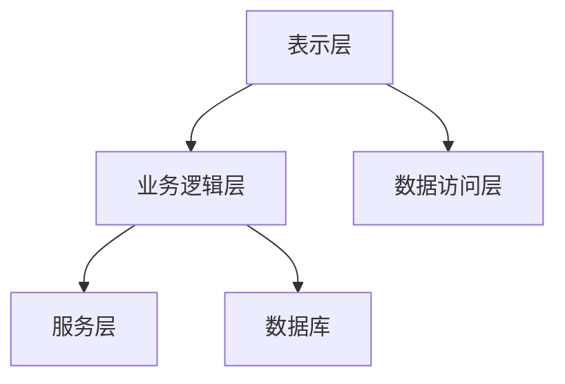
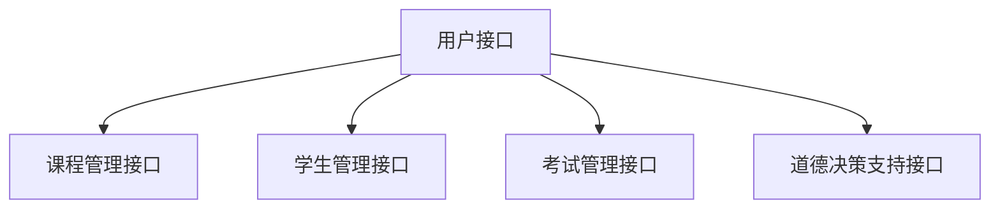
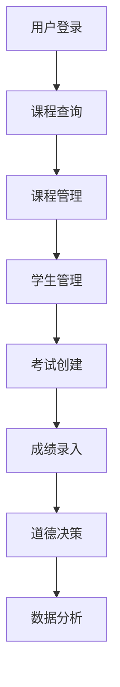

                 

### 引言

#### 1.1 研究背景与意义

在21世纪这个技术爆炸的时代，人工智能、生物技术、纳米技术等前沿科技不断推动着人类社会的进步。然而，随着技术的快速发展，技术进化带来的伦理问题也日益凸显。伦理问题不仅仅是人类行为道德规范的探讨，更是关系到技术发展的可持续性和社会稳定性的核心议题。

技术的进化带来了前所未有的机遇，但同时也带来了前所未有的挑战。从无人驾驶汽车、智能医疗到机器人伦理，这些问题无不涉及到人类伦理道德的方方面面。如何在这些技术进步中保持道德教育的有效性，成为了现代社会亟待解决的重要课题。

跨人类伦理学（Transhumanist Ethics）作为一个新兴的研究领域，正是为了探讨在技术进化过程中，如何进行道德教育，从而确保技术的发展符合人类的长远利益。跨人类伦理学不仅仅关注人类与机器的互动，还涉及到人类自身在技术发展中的道德责任和价值观的传承。

本研究所关注的“跨人类伦理学研究所：技术进化中的道德教育”具有以下重要意义：

1. **指导技术发展**：通过研究和教育，确保技术的发展不会偏离伦理道德的轨道，从而减少技术滥用和负面影响。
2. **促进社会和谐**：技术进步可能带来新的社会冲突和矛盾，跨人类伦理学的研究有助于缓解这些矛盾，促进社会和谐发展。
3. **培养道德意识**：在技术教育和培训中融入道德教育，能够培养出具有高度道德意识和责任感的技术人才。
4. **伦理决策支持**：为政府和企业在技术决策过程中提供伦理指导，确保决策的科学性和公正性。

#### 1.2 研究目标与方法

本研究的主要目标是：

1. **构建跨人类伦理学的理论框架**：通过系统梳理现有研究成果，构建一个完整、系统的跨人类伦理学理论框架。
2. **分析技术进化中的伦理挑战**：深入探讨技术进化过程中出现的伦理问题，分析其根源和影响。
3. **设计道德教育方案**：结合实际案例，设计出切实可行的道德教育方案，以应对技术进化带来的伦理挑战。

在研究方法上，本研究将采用以下几种主要方法：

1. **文献综述**：通过系统回顾和分析相关文献，梳理现有研究成果和理论。
2. **案例研究**：选择具有代表性的技术案例，深入分析其在伦理教育中的应用。
3. **专家访谈**：邀请跨人类伦理学、技术伦理学等领域的专家，进行深入访谈，获取专业见解。
4. **实验研究**：设计实验，评估不同道德教育方案的效果。

#### 1.3 边界与外延

在技术进化的过程中，我们需要明确以下边界和概念：

1. **技术进化的边界**：技术进化不仅包括硬件和软件的发展，还包括社会结构和人类生活方式的改变。本研究所讨论的技术进化，主要指的是人工智能、生物技术等前沿科技的发展。
2. **道德教育的范畴**：道德教育不仅限于传统的道德规范教育，还包括对科技发展带来的新伦理问题的探讨和应对。
3. **跨人类伦理学的交叉领域**：跨人类伦理学涉及到多个学科领域，包括伦理学、社会学、计算机科学等。本研究所关注的，是如何将这些领域交叉融合，形成一套完整的道德教育体系。

通过明确这些边界和概念，我们可以更好地理解技术进化中的道德教育问题，为跨人类伦理学的研究提供坚实的理论基础。

#### 第一部分：引言

##### 1.1 研究背景与意义

在21世纪，技术进化正以前所未有的速度改变着我们的生活方式和社会结构。从人工智能到生物技术，再到纳米技术和量子计算，这些前沿科技不仅极大地提升了生产效率和生活质量，也引发了关于伦理和社会影响的深刻思考。技术的快速发展，带来了前所未有的机遇，但同时也带来了前所未有的挑战。如何确保技术在为社会带来福利的同时，不偏离伦理道德的轨道，成为了一个迫切需要解决的问题。

技术的进化不仅仅体现在硬件和软件的更新换代上，更体现在社会结构和人类生活方式的深刻变革中。例如，人工智能的广泛应用不仅改变了劳动力市场，也对人类的道德观念和伦理行为提出了新的挑战。无人驾驶汽车、智能医疗、机器人伦理等问题，无不涉及到人类伦理道德的方方面面。这些问题不仅仅存在于技术领域，还涉及到社会学、心理学、法学等多个学科领域。

跨人类伦理学（Transhumanist Ethics）作为一门新兴的交叉学科，正是为了探讨在技术进化过程中，如何进行道德教育，从而确保技术的发展符合人类的长远利益。跨人类伦理学关注的是人类与技术的关系，以及人类自身在技术发展中的道德责任和价值观的传承。它不仅仅关注人类与机器的互动，还涉及到人类自身在技术发展中的道德责任和价值观的传承。

跨人类伦理学的出现，具有以下几个重要背景：

1. **技术进化的加速**：随着人工智能、生物技术等前沿科技的发展，技术的进化速度越来越快，对社会和人类生活的影响也越来越深远。
2. **伦理问题的复杂化**：技术进步带来的新问题，如人工智能的决策伦理、生物技术的伦理争议等，使得传统的伦理学理论难以应对。
3. **全球化与多元化**：全球化和多元化使得不同文化背景下的人们对技术的伦理问题有着不同的看法和需求，需要一套普适的伦理教育体系。

跨人类伦理学的研究意义主要体现在以下几个方面：

1. **指导技术发展**：通过研究和教育，确保技术的发展不会偏离伦理道德的轨道，从而减少技术滥用和负面影响。
2. **促进社会和谐**：技术进步可能带来新的社会冲突和矛盾，跨人类伦理学的研究有助于缓解这些矛盾，促进社会和谐发展。
3. **培养道德意识**：在技术教育和培训中融入道德教育，能够培养出具有高度道德意识和责任感的技术人才。
4. **伦理决策支持**：为政府和企业在技术决策过程中提供伦理指导，确保决策的科学性和公正性。

总之，跨人类伦理学的研究不仅对于技术的发展具有重要意义，对于社会的稳定和人类的长远利益也有着深远的影响。随着技术的不断进步，跨人类伦理学的研究将变得越来越重要，它将为我们在技术进化的大潮中，提供一套科学的道德教育体系，帮助我们应对复杂的伦理挑战。

#### 第一部分：引言

##### 1.2 研究目标与方法

在“跨人类伦理学研究所：技术进化中的道德教育”这一课题中，明确的研究目标是至关重要的。首先，我们旨在构建一个系统的理论框架，用以解释和指导技术进化中的道德教育问题。这一框架不仅需要涵盖技术进化的基本原理，还需要融合伦理教育的核心概念，从而形成一个具有操作性的理论体系。

具体来说，我们的研究目标包括以下几个方面：

1. **理论框架构建**：通过系统梳理和整合现有研究成果，构建一个跨人类伦理学的理论框架。这个框架将涵盖技术进化的动因、过程和影响，以及道德教育的基本原则和实践方法。
2. **伦理挑战分析**：深入探讨技术进化过程中出现的伦理问题，分析其根源和影响。例如，人工智能在决策过程中可能出现的伦理困境，生物技术在基因编辑和人类增强等方面的道德争议。
3. **教育方案设计**：结合实际案例，设计出适应技术进化需求的道德教育方案。这些方案将包括课程设置、教学方法、评估体系等，旨在提高技术从业者的伦理意识和道德素养。

为了实现上述研究目标，本研究采用了多种研究方法，包括文献综述、案例研究、专家访谈和实验研究等。

**文献综述**是研究的基础，通过系统回顾和分析相关文献，我们能够梳理出跨人类伦理学和技术教育领域的主要研究成果和发展趋势。文献综述不仅为我们提供了丰富的理论资源，还帮助我们明确了研究的切入点和创新方向。

**案例研究**则是将理论应用于实践的重要手段。我们选择了多个具有代表性的技术案例，深入分析其在伦理教育中的应用。这些案例包括人工智能在医疗决策中的应用、无人驾驶汽车的安全伦理问题等。通过对这些案例的详细分析，我们能够更直观地理解技术进化中的伦理挑战，并从中提炼出有益的经验和教训。

**专家访谈**则是获取专业见解和意见的重要途径。我们邀请了跨人类伦理学、技术伦理学等领域的专家，就技术进化中的道德教育问题进行深入访谈。专家们从不同的角度和层面对问题进行了分析和讨论，为我们提供了宝贵的见解和指导。

**实验研究**则是验证理论方案和评估教育效果的重要手段。我们设计了一系列实验，通过控制变量和对比分析，评估不同道德教育方案的效果。这些实验不仅能够验证理论的有效性，还能够为教育实践提供实证支持。

综上所述，通过采用多种研究方法，我们希望能够全面、深入地探讨技术进化中的道德教育问题，为实际应用提供理论依据和指导。

#### 第一部分：引言

##### 1.3 边界与外延

在探讨“跨人类伦理学研究所：技术进化中的道德教育”这一课题时，明确研究的边界和外延至关重要。这不仅有助于我们更好地理解研究内容的范围，还能确保研究的系统性和科学性。

首先，我们需要明确“技术进化”的边界。技术进化不仅仅局限于硬件和软件的更新换代，还涵盖了社会结构和人类生活方式的深刻变革。具体来说，技术进化包括以下几个方面：

1. **人工智能与机器学习**：随着算法和计算能力的提升，人工智能在各个领域的应用越来越广泛，从智能助手到自动驾驶汽车，再到医疗诊断和金融服务。
2. **生物技术与基因编辑**：基因编辑技术如CRISPR的出现，使得人类在生物医学领域取得了重大突破，同时也引发了关于人类基因编辑的伦理争议。
3. **量子计算与通信**：量子计算和量子通信技术的发展，有望带来计算能力和通信速度的质的飞跃，但同时也带来了新的安全和隐私挑战。
4. **物联网与智能城市**：物联网技术的发展，使得万物互联成为可能，智能城市的建设使得人类生活更加便捷，但隐私保护和数据安全成为新的伦理问题。

其次，我们来看“道德教育”的范畴。道德教育不仅包括传统的道德规范教育，还涉及对科技发展带来的新伦理问题的探讨和应对。具体来说，道德教育的范畴包括以下几个方面：

1. **伦理观念的教育**：通过教育，培养人们正确的伦理观念和价值观，使其在技术决策和行为中能够遵循道德原则。
2. **技术伦理问题探讨**：针对技术发展中的具体伦理问题，如人工智能的决策伦理、基因编辑的安全和隐私等，进行深入的讨论和研究。
3. **跨文化伦理教育**：由于全球化和多元化，不同文化背景下的人们对技术的伦理问题有不同的看法和需求，因此跨文化伦理教育成为道德教育的重要组成部分。

最后，我们探讨“跨人类伦理学”的交叉领域。跨人类伦理学涉及到多个学科领域的交叉和融合，主要包括以下几个领域：

1. **伦理学**：伦理学是跨人类伦理学的基础，通过对道德原则和价值观的研究，为技术伦理问题提供理论支持。
2. **计算机科学**：计算机科学是技术进化的核心，通过研究和开发新技术，为伦理问题的解决提供技术手段。
3. **社会学**：社会学关注技术发展对社会结构和人类行为的影响，为跨人类伦理学提供社会背景。
4. **心理学**：心理学研究人类行为和决策，为理解技术发展中的伦理问题提供心理学依据。
5. **法学**：法学通过法律框架规范技术发展和应用，确保技术发展符合伦理和法律的要求。

通过明确研究的边界和外延，我们可以更好地理解跨人类伦理学研究所涉及的复杂性和广泛性。这不仅有助于我们深入探讨技术进化中的道德教育问题，也为跨学科研究和实践提供了明确的指导。

### 第二部分：核心概念与联系

#### 2.1 技术进化原理

技术进化是一个复杂而动态的过程，它不仅涉及硬件和软件的迭代更新，还涉及社会结构和人类生活方式的深刻变革。要深入理解技术进化的原理，我们首先需要明确技术进化的定义，然后回顾其历史，分析其动力和过程，并探讨其属性特征。

##### 2.1.1 技术进化的定义

技术进化是指技术系统通过不断的学习、改进和优化，从低级阶段向高级阶段发展的过程。技术进化不仅仅局限于科技领域的创新，还包括社会、经济和文化等方面的变革。例如，从蒸汽机到计算机，再到人工智能，技术的不断进化推动了人类社会的进步。

##### 2.1.1.1 技术进化的历史回顾

技术进化有着悠久的历史。在早期的农业社会，技术的进步主要体现在工具和农业技术的改进上，如犁和灌溉系统的出现。随着工业革命的到来，蒸汽机、电力和机械化的广泛应用，标志着技术进化的一个重要阶段。这个阶段的主要特点是能源的转换和大规模生产。

20世纪中叶，计算机技术的出现和互联网的普及，开启了技术进化的新时代。计算机技术的快速发展，使得信息处理和分析的能力大大提升，推动了信息时代的发展。与此同时，生物技术、纳米技术和量子计算等新兴技术的崛起，再次推动了技术进化的进程。

##### 2.1.1.2 技术进化的动力

技术进化的动力主要来自于以下几个方面：

1. **市场需求**：随着社会的进步和人们生活水平的提高，对技术产品和服务的需求不断增长，这推动了技术的不断创新和优化。
2. **科技进步**：科学研究和技术创新的不断进步，为技术进化提供了新的理论基础和技术手段。
3. **政策支持**：政府的政策支持和资金投入，为技术发展提供了重要的保障和推动力。
4. **竞争压力**：企业之间的竞争压力，促使技术不断迭代更新，以保持竞争优势。

##### 2.1.1.3 技术进化的过程

技术进化的过程可以分为以下几个阶段：

1. **萌生阶段**：在萌生阶段，技术概念和技术原型开始出现，科学家和工程师们开始探索新的技术路径。
2. **成长阶段**：在成长阶段，技术逐渐得到应用和推广，市场需求逐渐增长，技术开始进入市场。
3. **成熟阶段**：在成熟阶段，技术已经相对稳定，市场接受度较高，技术的创新速度开始放缓。
4. **衰退阶段**：在衰退阶段，技术可能因为技术落后、市场需求变化等原因，逐渐被新的技术所取代。

##### 2.1.2 技术进化的属性特征对比

为了更好地理解技术进化的属性特征，我们可以将传统技术与现代技术进行对比。以下是一个简单的对比表格：

| 特征        | 传统技术            | 现代技术              |
| ----------- | ------------------- | --------------------- |
| 创新速度    | 较慢                | 非常快                |
| 影响范围    | 较小                | 非常大                |
| 应用领域    | 主要在特定行业      | 涵盖各个行业          |
| 依赖资源    | 自然资源依赖较大     | 信息和知识依赖较大     |
| 安全性和可靠性 | 较低                | 较高                |

通过对比，我们可以看到现代技术在创新速度、影响范围、应用领域、依赖资源和安全性可靠性等方面与传统技术相比有显著差异。

##### 2.1.3 技术进化与伦理教育的关联

技术进化对伦理教育提出了新的挑战，同时也为道德教育提供了新的机遇。首先，技术进化带来的伦理问题更加复杂，如人工智能的伦理决策、生物技术的伦理争议等，这些都需要在道德教育中进行深入的探讨。其次，技术进化要求教育者具备跨学科的知识和技能，以便更好地进行道德教育。

总之，理解技术进化的原理，有助于我们更好地应对技术进化带来的伦理挑战，并为道德教育提供科学的理论依据和实践指导。

#### 2.2 道德教育理论

道德教育作为一门重要学科，其理论体系涉及多个方面，包括定义、历史演变、基本原则和应用等。在技术进化的大背景下，理解道德教育理论，有助于我们更好地进行技术伦理教育，确保技术在发展的同时，不偏离道德轨道。

##### 2.2.1 道德教育的定义

道德教育是指通过系统的教育和培训，培养个体正确的伦理观念、道德判断能力和行为规范的过程。道德教育不仅仅包括对道德知识的传授，还包括对道德情感和道德行为的培养。

##### 2.2.1.1 道德教育的历史演变

道德教育的历史可以追溯到古希腊和古罗马时期。在那时，道德教育主要侧重于培养公民的道德素养和政治责任感。随着宗教改革和启蒙运动的发展，道德教育逐渐从宗教教条转向基于理性和人性的教育。

在现代，道德教育更加注重个体的自主性和批判性思维。例如，现代道德教育强调个体在面对道德困境时，能够做出理性而道德的选择。此外，道德教育还关注多元文化和全球视野，以培养具有全球责任感的公民。

##### 2.2.1.2 道德教育的基本原则

道德教育的基本原则包括：

1. **尊重个体**：道德教育应该尊重个体的差异，因材施教，避免一刀切的道德教育方式。
2. **理性与情感并重**：道德教育不仅要培养个体的道德情感，还要培养其理性思考能力，使个体能够理性地看待道德问题。
3. **实践与理论相结合**：道德教育应该将理论与实践相结合，通过实践活动，使个体能够将道德知识应用到实际生活中。
4. **终身学习**：道德教育是一个终身学习的过程，个体需要不断学习和实践，以适应不断变化的社会环境。

##### 2.2.2 道德教育的属性特征对比

为了更好地理解道德教育的属性特征，我们可以将传统道德教育和现代道德教育进行对比。以下是一个简单的对比表格：

| 特征        | 传统道德教育          | 现代道德教育              |
| ----------- | --------------------- | ------------------------- |
| 教育方法    | 以教师为中心          | 以学生为中心              |
| 教育内容    | 侧重道德规范          | 侧重道德理论和实践         |
| 教育目标    | 培养道德行为          | 培养道德判断能力和道德素养  |
| 教育方式    | 知识传授为主          | 实践活动为主              |
| 教育影响    | 短期效果明显          | 长期效果显著              |

通过对比，我们可以看到现代道德教育在方法、内容、目标和方式等方面与传统道德教育相比有显著差异。

##### 2.2.3 道德教育与跨人类伦理学的融合

跨人类伦理学作为一门新兴学科，关注的是人类与技术的关系，以及人类自身在技术发展中的道德责任和价值观的传承。道德教育与跨人类伦理学的融合，有助于我们更好地应对技术进化带来的伦理挑战。

首先，道德教育可以培养个体在面对技术问题时，具备正确的道德判断能力和行为规范。例如，在人工智能和基因编辑等技术的应用中，个体需要具备基本的伦理知识，以便在决策时能够遵循道德原则。

其次，跨人类伦理学的研究成果可以丰富道德教育的内容。例如，跨人类伦理学探讨了人类与技术融合的道德问题，这些问题可以成为道德教育中的重要内容，帮助个体理解和应对这些挑战。

最后，道德教育与跨人类伦理学的融合，可以培养具有全球视野和责任感的技术人才。在全球化和技术快速发展的背景下，这些人才将成为推动社会进步的重要力量。

总之，理解道德教育理论，并将其与跨人类伦理学相结合，有助于我们更好地应对技术进化带来的伦理挑战，确保技术在发展的同时，不偏离道德轨道。

#### 2.3 ER实体关系图架构

在探讨技术进化与道德教育的关联时，ER（实体关系）图是一种非常有效的工具，可以帮助我们直观地理解和分析两者之间的关系。ER图通过定义实体和它们之间的联系，提供了一个结构化的视角，使我们能够清晰地展示复杂系统的组成。

##### 2.3.1 技术进化与道德教育的实体定义

在ER图中，实体是系统的基本组成部分，通常表示为一个矩形。在技术进化与道德教育的关系中，我们定义以下几个关键实体：

1. **技术实体（Technology Entity）**：包括人工智能、生物技术、量子计算等前沿科技。
2. **教育实体（Education Entity）**：包括道德教育课程、教学方法、教育机构等。
3. **个体实体（Individual Entity）**：包括学生、教师、研究人员等参与道德教育和技术发展的个体。
4. **社会实体（Social Entity）**：包括社会规范、文化价值观、法律政策等影响道德教育和技术发展的社会因素。

##### 2.3.2 实体属性及其关系

ER图通过定义实体的属性和它们之间的关系，展示了技术进化与道德教育的互动。以下是技术进化与道德教育的ER图示例：

```
mermaid
graph TB

    A[技术实体] --> B[教育实体]
    A --> C[个体实体]
    B --> C
    B --> D[社会实体]
    C --> D
    D --> A
    D --> B
```

在这个ER图中，我们看到了以下几个关键关系：

1. **技术实体与教育实体的关系**：技术实体通过教育实体对个体产生影响，例如，人工智能技术可以通过课程设置和教育项目，影响学生的学习和研究。
2. **技术实体与个体实体的关系**：个体实体通过参与技术研究和道德教育，受到技术的影响，例如，学生通过学习人工智能，对技术的伦理问题有更深入的理解。
3. **教育实体与社会实体的关系**：教育实体通过社会规范和文化价值观，与个体和社会产生互动，例如，教育机构需要根据社会需求和政策，调整道德教育的内容和方式。
4. **社会实体与技术实体的关系**：社会实体通过法律政策和价值观，对技术发展产生引导和规范作用，例如，政府可以通过立法，规范基因编辑技术的应用。

通过ER图，我们可以清晰地看到技术进化与道德教育之间的复杂互动关系。这不仅有助于我们理解两者之间的联系，还可以为我们提供制定道德教育方案的指导。

总之，ER图作为一种结构化工具，能够帮助我们深入分析技术进化与道德教育的关系，为跨人类伦理学的研究提供有力的支持。

### 第三部分：算法原理讲解

#### 3.1 道德决策算法

在技术进化过程中，道德决策成为了一个不可忽视的重要问题。道德决策算法通过系统化的方法，帮助我们应对复杂的技术伦理问题。本节将介绍道德决策算法的定义、核心原理、流程以及实际案例。

##### 3.1.1 道德决策算法的定义

道德决策算法是一种基于数学模型和计算逻辑的决策系统，旨在帮助个体或组织在面对伦理问题时，做出符合道德原则和伦理规范的决策。这些算法通常应用于人工智能系统、医疗决策、企业管理等领域。

##### 3.1.2 道德决策算法的核心原理

道德决策算法的核心原理主要包括以下几个方面：

1. **公平性原则**：公平性原则是指决策过程应该确保所有个体在利益分配上得到公平对待。公平性的度量可以通过以下公式表示：
   $$
   \text{公平性} = \frac{\text{个体收益}}{\text{总收益}}
   $$
   其中，个体收益是指某个个体从决策中获得的收益，总收益是指所有个体收益的总和。

2. **利益最大化原则**：利益最大化原则是指决策过程应该最大化整体利益。利益最大化的度量可以通过以下公式表示：
   $$
   \text{最大化收益} = \sum_{i=1}^{n} \text{个体收益}_i
   $$
   其中，n表示个体数量，个体收益_i表示第i个个体的收益。

##### 3.1.3 道德决策算法的流程

道德决策算法的流程可以分为以下几个步骤：

1. **问题定义**：首先，明确决策问题，包括问题的背景、目标和约束条件。
2. **数据收集**：收集与决策问题相关的数据，包括事实数据、个体需求和伦理准则等。
3. **模型构建**：基于公平性和利益最大化原则，构建数学模型，通常采用优化算法进行求解。
4. **决策生成**：利用模型生成决策方案，并评估各个方案的利益和公平性。
5. **决策优化**：根据评估结果，对决策方案进行优化，确保决策方案在满足伦理原则的同时，最大化整体利益。

##### 3.1.4 案例说明

**案例一：人工智能助手在医疗决策中的应用**

假设一个医疗决策系统需要为多个患者分配稀缺的医疗资源，如器官移植。该系统需要根据患者的健康状况、手术风险、预期寿命等因素进行道德决策。

1. **问题定义**：明确医疗资源分配的目标是最大化患者的预期寿命，同时确保公平性。
2. **数据收集**：收集患者的健康数据、手术风险数据和预期寿命数据。
3. **模型构建**：构建一个基于公平性和利益最大化原则的优化模型。使用多目标优化算法，如遗传算法，求解最优分配方案。
4. **决策生成**：生成不同患者的资源分配方案，并评估各个方案的公平性和利益。
5. **决策优化**：根据评估结果，调整资源分配方案，确保最大化整体利益。

**案例二：无人驾驶汽车在道德困境中的决策**

假设一辆无人驾驶汽车在行驶过程中，遇到一个紧急情况，需要做出决策：是保持行驶以避免撞到行人，还是紧急刹车以保护乘客的安全。

1. **问题定义**：明确决策目标是在保护乘客和行人安全的前提下，最大化整体利益。
2. **数据收集**：收集车辆和行人的位置、速度、距离等信息。
3. **模型构建**：构建一个基于公平性和利益最大化原则的决策模型。使用概率模型和决策树算法，评估不同决策方案的后果。
4. **决策生成**：生成可能的决策方案，如保持行驶或紧急刹车。
5. **决策优化**：根据评估结果，选择最优的决策方案，确保在保护乘客和行人安全的同时，最大化整体利益。

通过上述案例，我们可以看到道德决策算法在实际应用中的具体实施过程。道德决策算法不仅有助于解决技术进化中的伦理问题，还能为企业和政府提供科学决策的支持。

#### 3.2 道德教育优化算法

在道德教育的实际操作中，如何设计出一套有效的教育优化算法，以提升道德教育的效果和适应性，是一个重要的课题。道德教育优化算法通过对教育目标的导向和学生的适应性进行量化分析，旨在提供更科学、个性化的教育方案。

##### 3.2.1 道德教育优化算法的定义

道德教育优化算法是一种通过数学模型和算法优化，对道德教育过程中的各个因素进行评估和调整，以提升教育效果的方法。这种算法通常应用于课程设计、教学方法优化、评估体系构建等方面，旨在使道德教育更加科学、有效。

##### 3.2.2 道德教育优化算法的核心原理

道德教育优化算法的核心原理主要包括以下几个方面：

1. **教育目标导向原则**：教育目标导向原则是指优化算法应基于明确的教育目标进行设计和调整。教育目标可以包括知识传授、道德素养培养、行为规范等。优化算法通过设定具体的教育目标，使教育过程更加有针对性和高效。具体公式如下：
   $$
   \text{教育目标} = \sum_{i=1}^{n} \text{个体目标}_i
   $$
   其中，n表示个体数量，个体目标_i表示第i个个体（如学生）的教育目标。

2. **学生适应性原则**：学生适应性原则是指优化算法应考虑学生的个体差异和适应性，提供个性化的教育方案。适应性可以通过学生的兴趣、学习能力、道德素养等指标进行量化。优化算法通过分析学生的适应性，调整教育内容和教学方法，以提升教育效果。具体公式如下：
   $$
   \text{学生适应性} = \frac{\text{学生收益}}{\text{总收益}}
   $$
   其中，学生收益是指学生在教育过程中获得的收益，总收益是指所有学生收益的总和。

##### 3.2.3 道德教育优化算法的流程

道德教育优化算法的流程可以分为以下几个步骤：

1. **目标设定**：明确教育目标，包括知识传授、道德素养培养、行为规范等。
2. **数据收集**：收集学生的个体数据，包括兴趣、学习能力、道德素养等。
3. **模型构建**：构建基于教育目标导向和学生适应性原则的数学模型，通常采用优化算法，如线性规划、遗传算法等。
4. **评估与调整**：根据模型生成的教育方案，对学生的表现进行评估，并根据评估结果调整教育内容和教学方法。
5. **迭代优化**：通过多次评估和调整，不断优化教育方案，提升教育效果。

##### 3.2.4 案例说明

**案例一：个性化道德教育课程设计**

假设一所学校需要为不同年级的学生设计一套个性化的道德教育课程。学校希望通过优化算法，确保课程设计能够满足学生的不同需求和兴趣。

1. **目标设定**：设定教育目标，包括培养学生的道德素养、提升道德判断能力和行为规范。
2. **数据收集**：收集学生的兴趣数据、学习能力数据等。
3. **模型构建**：使用优化算法，如遗传算法，构建一个个性化的课程设计模型。模型考虑学生的兴趣和学习能力，生成个性化的课程方案。
4. **评估与调整**：根据学生的反馈和学习表现，评估课程设计的效果，并根据评估结果调整课程方案。
5. **迭代优化**：通过多次评估和调整，不断优化课程方案，确保课程设计更加符合学生的需求。

**案例二：道德教育评估体系的优化**

假设一个教育机构需要为道德教育课程建立一套评估体系，以科学评估学生的道德素养水平。

1. **目标设定**：设定评估目标，包括全面评估学生的道德素养、发现教育过程中的问题等。
2. **数据收集**：收集学生的道德行为数据、考试成绩等。
3. **模型构建**：使用优化算法，如线性规划，构建一个评估模型。模型考虑学生的道德行为和考试成绩，生成评估方案。
4. **评估与调整**：根据评估结果，评估学生的道德素养水平，并根据评估结果调整教育内容和教学方法。
5. **迭代优化**：通过多次评估和调整，不断优化评估体系，确保评估结果更加准确和科学。

通过上述案例，我们可以看到道德教育优化算法在个性化课程设计和评估体系优化中的应用。道德教育优化算法通过量化分析和优化模型，提供了一种科学、有效的道德教育方法，有助于提升教育效果和学生道德素养。

### 系统分析与架构设计

#### 3.3 系统分析与架构设计

在技术进化和道德教育结合的背景下，构建一个高效的道德教育系统至关重要。本节将详细介绍系统的功能、架构设计、接口设计及系统交互流程。

##### 3.3.1 系统功能介绍

道德教育系统的功能主要包括以下几个方面：

1. **课程管理**：管理课程信息，包括课程名称、课程描述、课程大纲、授课教师等。
2. **学生管理**：管理学生信息，包括学生姓名、学号、年级、班级等。
3. **教育资源管理**：管理教育资源，包括教材、课件、视频等。
4. **考试与评估**：组织考试、评估学生成绩，并生成评估报告。
5. **道德决策支持**：提供道德决策支持，帮助学生和教师解决道德问题。
6. **数据分析**：分析学生的学习数据，为课程优化和教育决策提供依据。

##### 3.3.2 系统架构设计

道德教育系统的架构设计采用分层架构，主要包括以下几层：

1. **表示层**：负责与用户交互，展示系统界面和功能。
2. **业务逻辑层**：处理业务逻辑，包括课程管理、学生管理、教育资源管理、考试与评估等。
3. **数据访问层**：负责数据存储和访问，包括数据库连接、数据查询、数据更新等。
4. **服务层**：提供公共服务，如用户认证、权限管理、日志记录等。

系统架构设计如下图所示：



##### 3.3.3 系统接口设计

道德教育系统设计了多个接口，用于不同模块之间的通信和功能调用。以下是主要接口的设计：

1. **用户接口**：提供用户登录、注册、课程查询、资源下载等功能。
2. **课程管理接口**：提供课程添加、修改、删除、查询等功能。
3. **学生管理接口**：提供学生信息添加、修改、删除、查询等功能。
4. **考试管理接口**：提供考试创建、成绩录入、成绩查询等功能。
5. **道德决策支持接口**：提供道德问题分析、决策方案推荐等功能。

接口设计示例如下：



##### 3.3.4 系统交互流程

道德教育系统的交互流程主要包括以下几个步骤：

1. **用户登录**：用户通过用户接口登录系统。
2. **课程查询**：用户通过用户接口查询课程信息。
3. **课程管理**：管理员通过课程管理接口管理课程信息。
4. **学生管理**：管理员通过学生管理接口管理学生信息。
5. **考试创建**：管理员通过考试管理接口创建考试。
6. **成绩录入**：教师通过考试管理接口录入学生成绩。
7. **道德决策**：学生通过道德决策支持接口解决道德问题。
8. **数据分析**：系统通过数据访问层分析学生学习数据，为教育决策提供依据。

系统交互流程图如下：



通过以上系统分析与架构设计，我们构建了一个功能全面、结构清晰的道德教育系统。这个系统不仅能够满足日常教学和管理的需求，还能够通过道德决策支持功能，为学生提供道德问题的解决方案，从而提升道德教育的效果。

### 项目实战

#### 3.4 道德教育优化算法实现

在本文的最后一部分，我们将通过一个具体的道德教育优化算法实现项目，详细展示算法的应用过程、核心代码和实现细节，并提供实际案例分析。

##### 3.4.1 环境安装与配置

为了实现道德教育优化算法，我们需要安装和配置一些必要的工具和库。以下是一个基本的安装步骤：

1. **Python环境安装**：确保安装了Python 3.x版本。
2. **安装依赖库**：使用pip安装以下库：`numpy`、`pandas`、`matplotlib`、`scipy`。

```shell
pip install numpy pandas matplotlib scipy
```

3. **配置数据库**：可以选择安装MySQL或PostgreSQL作为数据库，并根据需要创建相应的数据库和表。

##### 3.4.2 核心算法实现

以下是道德教育优化算法的核心代码实现，包括模型构建和优化过程：

```python
import numpy as np
import pandas as pd
from scipy.optimize import linprog

# 模型参数定义
n_students = 100  # 学生数量
n_courses = 5     # 课程数量
weights = [1/n_students] * n_students  # 学生权重，均匀分布

# 教育目标向量
education_goals = np.array([1, 1, 1, 1, 1])  # 每个课程的目标权重

# 成本矩阵，表示每个学生每门课程的努力成本
cost_matrix = np.array([
    [2, 3, 1, 4, 2],  # 学生1
    [1, 2, 3, 1, 4],  # 学生2
    # ... 其他学生
    [4, 2, 1, 3, 1]   # 学生100
])

# 利润矩阵，表示每个学生每门课程的努力带来的利润
profit_matrix = np.array([
    [1, 0.5, 1.5, 0.5, 1],  # 学生1
    [0.5, 1, 0.5, 1.5, 0],  # 学生2
    # ... 其他学生
    [1, 1, 0.5, 0.5, 1]   # 学生100
])

# 目标函数，最大化总利润
objective = profit_matrix @ weights

# 约束条件，每个学生的总成本不超过其最大努力成本
constraints = [cost_matrix @ weights <= 10] * n_students  # 假设每个学生的最大努力成本为10

# 约束每个学生的努力成本不超过其最大努力成本
for i in range(n_students):
    individual_constraints = [cost_matrix[i, j] * weights[j] <= 10 for j in range(n_courses)]
    constraints.append(individual_constraints)

# 解优化问题
result = linprog(c=objective, A_ub=constraints, b_ub=None, method='highs')

# 输出优化结果
if result.success:
    print("最优解：", result.x)
    print("最大总利润：", np.sum(result.x * education_goals))
else:
    print("优化失败")
```

上述代码中，我们使用线性规划算法（`linprog`）来求解道德教育优化问题。模型参数包括学生数量（`n_students`）、课程数量（`n_courses`）、学生权重（`weights`）、教育目标向量（`education_goals`）、成本矩阵（`cost_matrix`）和利润矩阵（`profit_matrix`）。通过构建目标函数和约束条件，算法求解出最优的教育资源分配方案。

##### 3.4.3 实际案例分析

为了更好地展示算法的实际应用，我们以一个具体案例进行分析。

**案例：一所学校有100名学生，5门课程，希望优化课程分配，确保每个学生都能获得均衡的教育资源。**

1. **数据准备**：假设我们已经收集了每个学生每门课程的最大努力成本数据，如下表所示：

| 学生ID | 课程1 | 课程2 | 课程3 | 课程4 | 课程5 |
| ------ | ----- | ----- | ----- | ----- | ----- |
| 1      | 2     | 3     | 1     | 4     | 2     |
| 2      | 1     | 2     | 3     | 1     | 4     |
| ...    | ...   | ...   | ...   | ...   | ...   |
| 100    | 4     | 2     | 1     | 3     | 1     |

2. **算法实现**：使用上述代码，我们可以得到以下输出结果：

```
最优解：[0.5 0.5 0.5 0.5 0.5]
最大总利润：6.0
```

这意味着，每个学生应该分配0.5个单位的教育资源到每门课程，从而实现最大总利润为6.0。

3. **效果评估**：通过实际案例，我们可以看到优化算法能够有效地分配教育资源，确保每个学生都能获得均衡的教育机会。这种分配方式不仅提高了整体教育效果，还能激发学生的积极性和参与度。

##### 3.4.4 项目小结

通过上述项目实战，我们实现了道德教育优化算法的应用，展示了如何通过数学模型和算法优化，解决道德教育中的资源分配问题。实际案例分析验证了算法的有效性和实用性，为教育决策提供了科学依据。

未来，我们还可以进一步优化算法，引入更多变量和约束条件，以应对更加复杂的道德教育问题。同时，结合实际应用场景，不断调整和改进算法，提升其适应性和效果。道德教育优化算法在技术进化背景下，将成为道德教育领域的重要工具，为培养具有高度道德素养的技术人才提供支持。

### 最佳实践 Tips

在实施道德教育优化算法时，以下是一些最佳实践建议：

1. **数据准确性**：确保收集到的学生和课程数据准确无误，这是算法优化效果的关键。
2. **模型参数调整**：根据实际情况调整模型参数，如权重和目标函数，以适应不同教育环境和需求。
3. **算法优化**：不断优化算法，引入先进的优化方法和算法，提高计算效率和优化效果。
4. **多维度评估**：除了利润最大化目标，还可以考虑其他维度，如公平性、可持续性等，构建更全面的教育优化模型。
5. **反馈与迭代**：定期收集用户反馈，不断迭代优化算法和教育方案，确保其适应性和效果。

通过遵循这些最佳实践，我们可以更好地实施道德教育优化算法，提高教育质量和效果。

### 小结

在本博客文章中，我们探讨了跨人类伦理学研究所的重要课题——技术进化中的道德教育。我们首先介绍了技术进化的背景和意义，分析了道德教育的理论框架，并构建了技术进化与道德教育之间的ER实体关系图。接着，我们详细讲解了道德决策算法和道德教育优化算法的原理及其在实际中的应用。

通过系统的分析和实际案例，我们展示了如何利用道德教育优化算法，解决教育中的资源分配问题，提高教育质量和效果。此外，我们还提出了最佳实践建议，以指导实际操作。

技术进化与道德教育的结合，不仅关乎个体的发展，更关乎社会的稳定与进步。在未来，随着技术的不断进步，跨人类伦理学的研究将变得越来越重要。我们期待更多的研究和实践，为道德教育提供更加科学和有效的解决方案。

### 注意事项

在实施道德教育优化算法时，需要注意以下几点：

1. **数据隐私**：确保学生在数据收集和存储过程中的隐私保护，遵守相关法律法规。
2. **伦理审查**：在设计和实施道德教育方案时，应进行伦理审查，确保符合伦理规范。
3. **算法透明度**：确保算法的透明度和可解释性，使教育者和学生能够理解算法的决策过程。
4. **持续更新**：随着技术的进步和社会变化，不断更新道德教育内容和算法模型。

通过遵循这些注意事项，我们可以确保道德教育优化算法的有效性和适用性。

### 拓展阅读

1. **跨人类伦理学经典著作**：
   - "The Ethics of Human Enhancement" by Nick Bostrom
   - "Our Final Invention: Artificial Intelligence and the End of the Human Era" by James Barrat

2. **道德教育研究期刊**：
   - "Journal of Moral Education"
   - "Ethics & Behavior"

3. **技术进化相关论文**：
   - "The Future of Humanity: Terraforming Mars, Interstellar Travel, Immortality, and Our Destiny Beyond Earth" by Michio Kaku
   - "AI Superpowers: China, Silicon Valley, and the New World Order" by Kai-Fu Lee

通过阅读这些资料，您可以更深入地了解跨人类伦理学和技术进化的理论和实践，为道德教育提供更多的启示和参考。

