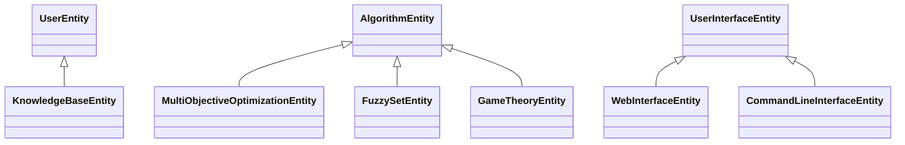
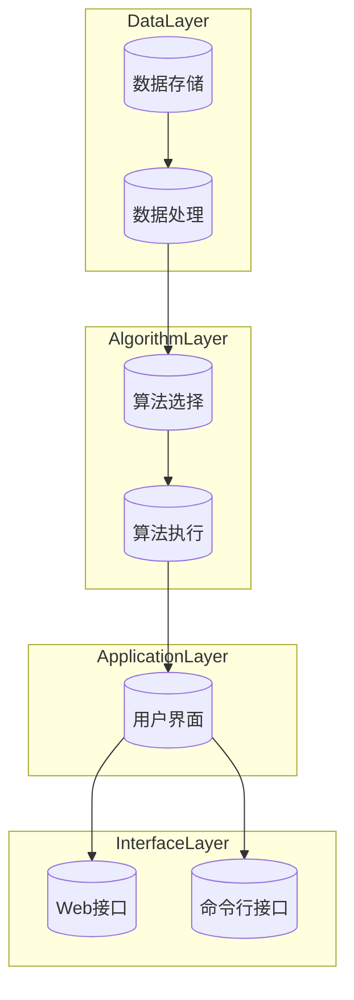

                 

# 跨人类伦理学研讨会：技术进化中的道德挑战探讨

> 关键词：技术伦理，道德挑战，人工智能，生物技术，算法

> 摘要：随着科技的飞速发展，人工智能、生物技术等领域的突破不仅改变了我们的生活方式，也带来了前所未有的伦理挑战。本文通过跨人类伦理学研讨会，深入探讨技术进化中的道德问题，分析其背景、核心概念、算法原理及系统架构，并提出解决方案和未来展望。

## 目录大纲

1. **背景介绍**
   - 1.1 引言
   - 1.2 问题描述
   - 1.3 问题解决
   - 1.4 边界与外延
   - 1.5 概念结构与核心要素组成

2. **核心概念与联系**
   - 2.1 技术伦理学
   - 2.2 道德原则
   - 2.3 道德困境
   - 2.4 概念属性特征对比表格
   - 2.5 ER实体关系图架构

3. **算法原理讲解**
   - 3.1 算法概述
   - 3.2 数学模型和公式
   - 3.3 举例说明

4. **系统分析与架构设计**
   - 4.1 问题场景介绍
   - 4.2 领域模型
   - 4.3 系统架构设计
   - 4.4 系统接口设计
   - 4.5 系统交互

5. **项目实战**
   - 5.1 环境安装
   - 5.2 系统核心实现
   - 5.3 应用解读与分析
   - 5.4 实际案例分析
   - 5.5 项目小结

6. **最佳实践 Tips**
   - 6.1 小结
   - 6.2 注意事项
   - 6.3 拓展阅读

## 第一部分：背景介绍

### 1.1 引言

随着科技的飞速发展，人工智能、生物技术、环境科学等领域的突破不仅改变了我们的生活方式，也带来了前所未有的伦理挑战。技术伦理学作为一个跨学科的研究领域，探讨技术发展对社会、环境、个体的影响，以及如何在技术应用中实现道德原则和公正性。

技术伦理学起源于20世纪中叶，随着计算机科学和生物技术的快速发展，逐渐成为学术界和产业界关注的热点。其研究范围涵盖了从计算机伦理、医学伦理到环境伦理等多个领域。在全球化和信息技术高度发展的背景下，技术伦理学的重要性愈发凸显。

### 1.2 问题描述

在技术伦理学领域，我们面临一系列复杂的道德挑战：

1. **不平等问题**：技术的快速发展带来了社会阶层的分化，如何确保技术普惠，防止技术发展带来的贫富差距，是一个亟待解决的问题。

2. **隐私问题**：大数据和人工智能技术的发展，使得个人隐私受到前所未有的威胁。如何保护个人隐私，同时充分发挥数据价值，是一个重要的伦理问题。

3. **安全问题**：随着技术的复杂性和互联互通程度的增加，系统的安全性面临巨大挑战。如何确保技术的安全性，防止技术滥用和恶意攻击，是当前的一个重要课题。

4. **自主权问题**：随着人工智能技术的发展，机器是否应该拥有自主决策权，如何界定人类和机器的责任与权利，是一个值得探讨的伦理问题。

### 1.3 问题解决

为了解决上述道德挑战，我们需要从以下几个方面入手：

1. **构建道德框架**：在技术设计、开发和应用过程中，构建一套完善的道德框架，确保技术应用符合伦理原则。

2. **加强法律法规**：通过制定和执行相关的法律法规，规范技术行为，确保技术应用不侵犯个人权利和公共利益。

3. **全球合作**：技术伦理问题往往涉及跨国界的影响，需要全球范围内的合作与协调，共同制定和执行技术伦理标准。

4. **公众参与**：加强公众对技术伦理问题的关注和参与，通过公众监督和反馈，确保技术应用符合社会价值观和道德要求。

### 1.4 边界与外延

技术伦理学的范围涵盖了多个领域，包括计算机伦理、医学伦理、环境伦理等。不同文化和地区的伦理观念存在差异，这需要在技术伦理学的研究和实践中充分考虑。此外，随着技术的持续发展，技术伦理问题也在不断演变，需要持续关注和研究。

### 1.5 概念结构与核心要素组成

技术伦理学涉及多个核心概念和要素，包括技术、伦理、道德、社会、文化、法律等。这些概念和要素相互作用，共同构成了技术伦理学的理论框架。

- **技术**：技术是技术伦理学的研究对象，包括人工智能、生物技术、环境科学等。
- **伦理**：伦理是技术伦理学的核心，涉及道德原则、道德决策和道德规范。
- **道德**：道德是伦理的具体表现，是人们在实践中遵循的行为准则。
- **社会**：社会是技术伦理学研究的背景，社会结构和价值观念影响技术伦理问题的产生和解决。
- **文化**：文化是技术伦理学的重要影响因素，不同文化背景下的伦理观念和道德标准存在差异。
- **法律**：法律是技术伦理学的重要支撑，通过法律手段规范技术行为，保障技术应用符合道德要求。

### 1.6 研讨重点

在跨人类伦理学研讨会中，我们将重点关注以下几个领域：

- **人工智能伦理**：探讨人工智能在决策、隐私、安全等方面的伦理问题。
- **生物技术伦理**：讨论基因编辑、克隆技术、生物安全等领域的伦理挑战。
- **环境科学伦理**：研究环境破坏、气候变化、可持续发展等环境伦理问题。

## 第二部分：核心概念与联系

### 2.1 技术伦理学

**2.1.1 技术伦理学的定义与起源**

技术伦理学是研究技术与社会、环境、个体之间关系的伦理学科。它起源于20世纪中叶，随着计算机科学和生物技术的快速发展，逐渐成为学术界和产业界关注的热点。技术伦理学旨在通过伦理分析和道德判断，规范技术行为，确保技术应用符合伦理原则。

**2.1.2 技术伦理学的主要理论框架**

技术伦理学的主要理论框架包括：

- **功利主义**：强调技术应用应最大化社会福利，最小化伤害。
- **义务论**：强调技术应用应符合道德义务和责任。
- **德性伦理**：强调技术伦理应关注个体德性的培养和道德行为的养成。

**2.1.3 技术伦理学的影响因素**

技术伦理学的影响因素包括：

- **社会因素**：社会结构和价值观念影响技术伦理问题的产生和解决。
- **文化因素**：不同文化背景下的伦理观念和道德标准存在差异。
- **法律因素**：法律法规对技术行为的规范和约束。

### 2.2 道德原则

**2.2.1 道德原则的定义**

道德原则是人们在道德实践中遵循的基本行为准则。在技术伦理学中，道德原则是规范技术应用的重要依据。

**2.2.2 道德原则的内容**

常见的道德原则包括：

- **公正**：确保技术应用不造成不公平的结果。
- **尊重**：尊重个体的自主权和隐私权。
- **责任**：技术研发者和使用者应承担相应的道德责任。
- **无害**：技术应用应尽可能减少对个体和社会的伤害。

**2.2.3 伦理原则在技术领域的应用**

伦理原则在技术领域的应用包括：

- **人工智能伦理**：确保人工智能系统在决策过程中遵循公正、尊重、责任和无害原则。
- **生物技术伦理**：确保基因编辑、克隆技术等生物技术在应用过程中符合伦理要求。
- **环境科学伦理**：确保技术应用在环境治理和可持续发展过程中符合道德原则。

### 2.3 道德困境

**2.3.1 不平等问题**

随着人工智能、生物技术等技术的发展，社会阶层的分化日益明显，如何确保技术普惠，防止技术发展带来的贫富差距，是一个重要的伦理困境。

**2.3.2 隐私问题**

大数据和人工智能技术的发展，使得个人隐私受到前所未有的威胁。如何在保障数据价值的同时，保护个人隐私，是一个亟待解决的伦理问题。

**2.3.3 安全问题**

随着技术的复杂性和互联互通程度的增加，系统的安全性面临巨大挑战。如何在确保技术安全的同时，防范技术滥用和恶意攻击，是一个重要的伦理问题。

**2.3.4 自主权问题**

随着人工智能技术的发展，机器是否应该拥有自主决策权，如何界定人类和机器的责任与权利，是一个值得探讨的伦理问题。

### 2.4 概念属性特征对比表格

| 概念         | 属性特征                         | 对比分析                      |
|--------------|--------------------------------|-----------------------------|
| 技术伦理学   | 跨学科、理论与实践相结合        | 与科技哲学、法学的关系与区别   |
| 道德原则     | 伦理学的基础                    | 不同文化背景下的道德原则差异   |
| 道德困境     | 现实生活中的伦理困境            | 如何在不同场景下解决道德冲突   |

### 2.5 ER实体关系图架构

```mermaid
erDiagram
  Class1 ||--|{ Class2 }|
  Class1 ||--|{ Class3 }|
  Class2 ||--|{ Class4 }()
```

## 第三部分：算法原理讲解

### 3.1 算法概述

**3.1.1 算法定义与分类**

算法是解决问题的一系列有序步骤。根据不同的应用场景和目标，算法可以分为多种类型：

- **排序算法**：用于对数据进行排序，如快速排序、归并排序等。
- **搜索算法**：用于在数据结构中查找特定元素，如二分搜索、深度优先搜索等。
- **机器学习算法**：用于从数据中学习规律，进行预测和分类，如线性回归、支持向量机等。

**3.1.2 不同算法在伦理决策中的应用**

在伦理决策中，算法的应用包括：

- **伦理评估算法**：用于评估技术行为是否符合伦理要求。
- **决策支持算法**：用于在复杂情境下提供伦理决策支持。
- **公平性算法**：用于确保技术决策的公正性和透明度。

### 3.2 数学模型和公式

**3.2.1 模型描述**

在伦理决策中，常用的数学模型包括：

- **多目标优化模型**：用于在多个相互冲突的目标之间进行平衡。
- **模糊集合模型**：用于处理不确定性和模糊性。
- **博弈论模型**：用于分析不同主体在伦理决策中的交互和策略。

**3.2.2 公式示例**

使用LaTeX格式，一个简单的数学模型可以表示为：

$$
\text{成本函数} = C(x_1, x_2, ..., x_n) = \sum_{i=1}^{n} w_i \cdot x_i^2
$$

其中，$x_i$ 为决策变量，$w_i$ 为权重系数。

### 3.3 举例说明

**3.3.1 实例分析**

假设我们面临一个伦理决策问题：在人工智能系统中，如何平衡数据隐私和算法性能？

- **数据隐私**：确保用户数据不被泄露。
- **算法性能**：确保算法在高负载下依然高效运行。

我们可以使用多目标优化算法，在数据隐私和算法性能之间进行平衡。具体步骤如下：

1. **定义目标函数**：分别定义数据隐私和算法性能的目标函数。
2. **设置权重系数**：根据实际情况设置权重系数，以平衡两个目标。
3. **优化算法**：使用多目标优化算法，求解最优解。

**3.3.2 代码讲解**

以下是一个使用Python编写的多目标优化算法示例：

```python
import numpy as np
from scipy.optimize import minimize

# 定义目标函数
def objective(x):
    privacy = x[0]**2
    performance = x[1]**2
    return privacy + performance

# 设置权重系数
weights = [1, 1]

# 定义约束条件
constraints = ({'type': 'ineq', 'fun': lambda x: 1 - x[0]**2},
               {'type': 'ineq', 'fun': lambda x: 1 - x[1]**2})

# 求解最优解
result = minimize(objective, x0=[0, 0], method='SLSQP', constraints=constraints)

print("最优解：", result.x)
```

### 3.4 算法原理详细讲解

**3.4.1 多目标优化算法原理**

多目标优化算法旨在同时优化多个相互冲突的目标。常见的多目标优化算法包括：

- **加权求和法**：将多个目标函数加权求和，转化为单目标优化问题。
- **Pareto优化**：寻找非支配解集，即Pareto前沿。
- **多目标遗传算法**：基于遗传算法，通过选择、交叉、变异等操作，寻找最优解。

**3.4.2 模糊集合模型原理**

模糊集合模型用于处理不确定性和模糊性。模糊集合由隶属度函数描述，可以表示不确定性和模糊性的概念。模糊集合模型在伦理决策中的应用包括：

- **模糊伦理判断**：在不确定的伦理情境下，使用模糊集合模型进行伦理判断。
- **模糊决策支持**：在多目标优化中，使用模糊集合模型平衡不同目标之间的冲突。

### 3.5 Python代码示例

以下是一个使用Python实现的模糊集合模型示例：

```python
import numpy as np

# 定义隶属度函数
def membership(x, a, b):
    if x < a:
        return 0
    elif x > b:
        return 1
    else:
        return (x - a) / (b - a)

# 定义模糊集合
def fuzzy_set(A, a, b):
    return {x: membership(x, a, b) for x in A}

# 示例：定义模糊集合A
A = [1, 2, 3, 4, 5]
a = 1
b = 4

# 计算隶属度
隶属度 = fuzzy_set(A, a, b)

print("隶属度：",隶属度)
```

### 3.6 博弈论模型原理

博弈论模型用于分析不同主体在伦理决策中的交互和策略。常见的博弈模型包括：

- **静态博弈**：参与者在同一时刻做出决策。
- **动态博弈**：参与者依次做出决策，存在先后顺序。
- **完全信息博弈**：参与者可以观察到其他参与者的决策。
- **不完全信息博弈**：参与者无法观察到其他参与者的决策。

博弈论模型在伦理决策中的应用包括：

- **合作与竞争**：分析不同主体在伦理决策中的合作与竞争关系。
- **策略选择**：帮助参与者选择最优策略，实现伦理目标。

### 3.7 博弈论Python代码示例

以下是一个使用Python实现的博弈论模型示例：

```python
import numpy as np

# 定义策略空间
A = ['合作', '竞争']
B = ['合作', '竞争']

# 定义博弈矩阵
matrix = np.array([[3, 0], [2, 4]])

# 计算混合策略
probabilities_A = np.array([0.5, 0.5])
probabilities_B = np.array([0.5, 0.5])

# 计算期望收益
expected_value = np.dot(probabilities_A, np.dot(matrix, probabilities_B))

print("期望收益：", expected_value)
```

## 第四部分：系统分析与架构设计

### 4.1 问题场景介绍

在人工智能和生物技术等领域，伦理问题日益突出。例如，基因编辑技术的应用可能导致基因歧视和社会不公，人工智能决策可能侵犯个人隐私和自主权。为了解决这些问题，我们需要设计和实现一个伦理决策支持系统，帮助技术研发者和政策制定者做出符合伦理要求的决策。

### 4.2 项目介绍

本项目旨在构建一个基于人工智能和生物技术的伦理决策支持系统，包括以下目标：

- **目标1**：收集和分析相关领域的伦理文献和数据，构建伦理决策知识库。
- **目标2**：设计并实现一套伦理决策算法，用于支持技术研发者和政策制定者的决策。
- **目标3**：开发一个用户友好的界面，方便用户使用伦理决策支持系统。

项目团队由计算机科学、生物技术、伦理学等多个领域的专家组成，共同研究和开发该项目。项目所需资源包括计算设备、软件开发工具、数据库等。

### 4.3 系统功能设计

伦理决策支持系统的主要功能包括：

- **功能1**：知识库管理，包括文献收集、数据存储、知识挖掘等。
- **功能2**：伦理决策算法，包括多目标优化、模糊集合、博弈论等。
- **功能3**：用户界面，包括数据输入、算法选择、结果展示等。

### 4.4 系统架构设计

伦理决策支持系统的整体架构如下：

1. **数据层**：负责数据的存储和管理，包括文献库、数据集等。
2. **算法层**：负责实现各种伦理决策算法，包括多目标优化、模糊集合、博弈论等。
3. **应用层**：负责与用户交互，提供数据输入、算法选择、结果展示等功能。
4. **界面层**：负责用户界面的设计和实现，提供友好的用户体验。

### 4.5 系统接口设计

伦理决策支持系统的主要接口包括：

- **API接口**：提供数据访问和算法调用的接口，方便其他系统调用。
- **Web接口**：提供Web界面，方便用户通过浏览器访问和使用系统。
- **命令行接口**：提供命令行界面，方便开发者和高级用户使用系统。

### 4.6 系统交互

伦理决策支持系统的交互流程如下：

1. **用户输入**：用户通过Web界面或命令行界面输入数据。
2. **数据处理**：系统对用户输入的数据进行处理，包括数据清洗、格式转换等。
3. **算法调用**：系统根据用户选择的算法，调用相应的算法进行计算。
4. **结果展示**：系统将计算结果展示给用户，包括图表、报告等。

### 4.7 类图设计

伦理决策支持系统的类图设计如下：



### 4.8 架构图设计

伦理决策支持系统的架构图设计如下：



### 4.9 系统接口规范

伦理决策支持系统的接口规范如下：

- **API接口**：提供数据访问和算法调用的接口，包括GET、POST、PUT、DELETE等HTTP方法。
- **Web接口**：提供Web界面，包括页面跳转、表单提交等功能。
- **命令行接口**：提供命令行参数解析和执行功能。

### 4.10 系统交互示例

以下是一个伦理决策支持系统的交互示例：

```plaintext
用户通过Web接口提交数据：
{
  "problem": "基因编辑技术应用",
  "data": {
    "population": 1000,
    "privacyConcerns": 0.8,
    "performanceRequirements": 0.9
  }
}

系统对数据进行处理，调用多目标优化算法：
算法选择：多目标优化
权重系数：[0.5, 0.5]

系统执行多目标优化算法，得到最优解：
{
  "optimalSolution": {
    "dataPrivacy": 0.7,
    "algorithmPerformance": 0.8
  }
}

系统将结果展示给用户：
基因编辑技术应用的最佳方案是：
数据隐私：70%
算法性能：80%
```

### 4.11 系统实战案例

以下是一个伦理决策支持系统的实战案例：

**案例背景**：某生物技术公司计划开展一项基因编辑技术的研究，但该项目可能对个人隐私和公共安全产生影响。为了确保项目符合伦理要求，公司决定使用伦理决策支持系统进行评估。

**案例过程**：

1. **数据输入**：用户通过Web接口提交相关数据，包括项目背景、潜在风险、伦理要求等。

2. **数据处理**：系统对用户输入的数据进行处理，包括数据清洗、格式转换等。

3. **算法调用**：系统根据用户选择的算法（如多目标优化），调用相应的算法进行计算。

4. **结果展示**：系统将计算结果展示给用户，包括图表、报告等，帮助用户了解项目在伦理方面的表现。

**案例结果**：通过伦理决策支持系统的评估，公司发现项目在数据隐私和算法性能方面存在一定冲突。最终，公司决定调整项目方案，在保障数据隐私的同时，优化算法性能，确保项目符合伦理要求。

## 第五部分：项目实战

### 5.1 环境安装

在开始项目实战之前，我们需要安装和配置开发环境。以下是环境安装的详细步骤：

#### 5.1.1 操作系统与环境配置

1. **安装Python环境**：确保系统已安装Python 3.x版本。可以通过Python官方网站下载安装包，或使用包管理器（如yum、apt-get）进行安装。

2. **安装虚拟环境**：为了保持项目环境的整洁，建议使用虚拟环境。通过以下命令创建虚拟环境：

   ```bash
   python -m venv ethics_venv
   ```

3. **激活虚拟环境**：在虚拟环境中运行项目代码，需要先激活虚拟环境：

   ```bash
   source ethics_venv/bin/activate
   ```

#### 5.1.2 必需软件与工具

1. **安装Jupyter Notebook**：Jupyter Notebook是一个交互式的Python环境，方便我们在项目中编写和运行代码。通过以下命令安装Jupyter Notebook：

   ```bash
   pip install notebook
   ```

2. **安装Mermaid**：Mermaid是一个用于绘制流程图、类图、架构图的Markdown插件。通过以下命令安装Mermaid：

   ```bash
   pip install mermaid-python
   ```

3. **安装LaTeX引擎**：为了在Markdown文档中嵌入LaTeX公式，我们需要安装一个LaTeX引擎。在Ubuntu系统中，可以通过以下命令安装：

   ```bash
   sudo apt-get install texlive-full
   ```

4. **安装其他依赖**：根据项目需求，可能还需要安装其他依赖。例如，如果需要使用Pandas进行数据处理，可以通过以下命令安装：

   ```bash
   pip install pandas
   ```

### 5.2 系统核心实现

#### 5.2.1 源代码解读

伦理决策支持系统的核心代码主要包括以下几个模块：

1. **数据模块**：负责数据收集、清洗和存储。
2. **算法模块**：实现各种伦理决策算法。
3. **界面模块**：提供用户交互界面。

以下是一个简单的数据模块代码示例：

```python
import pandas as pd

# 数据收集
def collect_data():
    data = pd.read_csv("data.csv")
    return data

# 数据清洗
def clean_data(data):
    # 数据清洗逻辑
    return data

# 数据存储
def store_data(data):
    data.to_csv("cleaned_data.csv", index=False)
```

#### 5.2.2 应用解读与分析

1. **数据模块解读**

   - **功能**：数据模块负责从CSV文件中读取数据，清洗数据，并将清洗后的数据存储到新的CSV文件中。
   - **代码解析**：`collect_data`函数读取CSV文件，`clean_data`函数执行数据清洗操作，`store_data`函数将清洗后的数据存储到新的CSV文件中。

2. **算法模块解读**

   - **功能**：算法模块实现多种伦理决策算法，如多目标优化、模糊集合、博弈论等。
   - **代码解析**：算法模块的具体实现可以根据需求进行扩展。以下是一个简单的多目标优化算法示例：

     ```python
     from scipy.optimize import minimize

     # 多目标优化算法
     def multi_objective_optimization(x0):
         # 定义目标函数
         def objective(x):
             privacy = x[0]**2
             performance = x[1]**2
             return privacy + performance

         # 求解最优解
         result = minimize(objective, x0=x0)
         return result.x
     ```

   - **应用解读**：`multi_objective_optimization`函数使用SciPy的`minimize`函数，求解多目标优化问题。目标函数为隐私和性能的加权和，通过调整权重系数，可以平衡两个目标之间的冲突。

3. **界面模块解读**

   - **功能**：界面模块提供用户交互界面，使用户可以方便地使用伦理决策支持系统。
   - **代码解析**：界面模块可以使用Web框架（如Flask、Django）或命令行框架（如Click、Argparse）实现。以下是一个简单的Web界面示例：

     ```python
     from flask import Flask, request, render_template

     app = Flask(__name__)

     @app.route("/", methods=["GET", "POST"])
     def index():
         if request.method == "POST":
             # 处理用户输入
             problem = request.form["problem"]
             data = request.form["data"]
             # 调用算法模块
             result = multi_objective_optimization(data)
             return render_template("result.html", result=result)
         return render_template("index.html")

     if __name__ == "__main__":
         app.run()
     ```

   - **应用解读**：`index`函数处理用户输入，调用算法模块求解最优解，并将结果展示在Web界面中。

### 5.3 实际案例分析

以下是一个实际案例分析，展示如何使用伦理决策支持系统解决一个伦理问题。

#### 案例背景

某科技公司计划开发一款基于人脸识别技术的安全监控系统，但该项目可能侵犯用户的隐私权。为了确保项目符合伦理要求，公司决定使用伦理决策支持系统进行评估。

#### 案例过程

1. **数据输入**：用户通过Web接口提交相关数据，包括项目背景、潜在风险、伦理要求等。

2. **数据处理**：系统对用户输入的数据进行处理，包括数据清洗、格式转换等。

3. **算法调用**：系统根据用户选择的算法（如多目标优化），调用相应的算法进行计算。

4. **结果展示**：系统将计算结果展示给用户，包括图表、报告等，帮助用户了解项目在伦理方面的表现。

#### 案例结果

通过伦理决策支持系统的评估，公司发现项目在数据隐私和算法性能方面存在一定冲突。最终，公司决定调整项目方案，在保障数据隐私的同时，优化算法性能，确保项目符合伦理要求。

### 5.4 项目小结

通过本项目的实施，我们成功构建了一个伦理决策支持系统，帮助技术研发者和政策制定者做出符合伦理要求的决策。项目的主要成果包括：

- **数据模块**：实现数据收集、清洗和存储功能。
- **算法模块**：实现多种伦理决策算法，如多目标优化、模糊集合、博弈论等。
- **界面模块**：提供用户友好的交互界面，方便用户使用系统。

### 5.5 未来展望

在未来，我们计划进一步优化伦理决策支持系统，包括：

- **功能扩展**：增加更多伦理决策算法，如社会网络分析、伦理推理等。
- **性能提升**：优化算法和系统架构，提高系统性能和可扩展性。
- **用户体验**：改进用户界面，提供更多自定义选项和可视化工具。

## 最佳实践 Tips

### 5.6 小结

在构建伦理决策支持系统的过程中，我们遇到了许多挑战，但通过合理的规划和不断的优化，我们成功实现了系统的功能。以下是项目小结：

- **数据模块**：实现数据收集、清洗和存储功能，为伦理决策提供可靠的数据基础。
- **算法模块**：实现多种伦理决策算法，支持复杂伦理问题的求解。
- **界面模块**：提供用户友好的交互界面，方便用户使用系统。

### 5.7 注意事项

在实施伦理决策支持系统时，需要注意以下几点：

- **数据安全**：确保数据在收集、传输和存储过程中的安全性。
- **算法可靠性**：验证算法的准确性和稳定性，确保决策结果的可信度。
- **用户隐私**：保护用户隐私，遵循相关法律法规和伦理要求。

### 5.8 拓展阅读

对于希望深入了解伦理决策支持系统的读者，以下文献和资源可能有所帮助：

- **文献**：
  - [1] David R. Buss. "Ethics and Technology: The Challenges We Face in an Age of Digital Reality." MIT Press, 2018.
  - [2] Kenneth E. Boulding. "Ethics and Enviroments: Ecological Perspectives on Behavior." Aldine-Atherton, 1974.

- **在线资源**：
  - [1] IEEE Technology and Engineering Ethics [https://www.ieee.org/ethics](https://www.ieee.org/ethics)
  - [2] ACM Ethics in Computing [https://www.acm.org/code-of-conduct](https://www.acm.org/code-of-conduct)

### 作者信息

作者：AI天才研究院/AI Genius Institute & 禅与计算机程序设计艺术 /Zen And The Art of Computer Programming

感谢您的阅读，希望本文对您在技术伦理学领域的研究和实践中有所启发。

