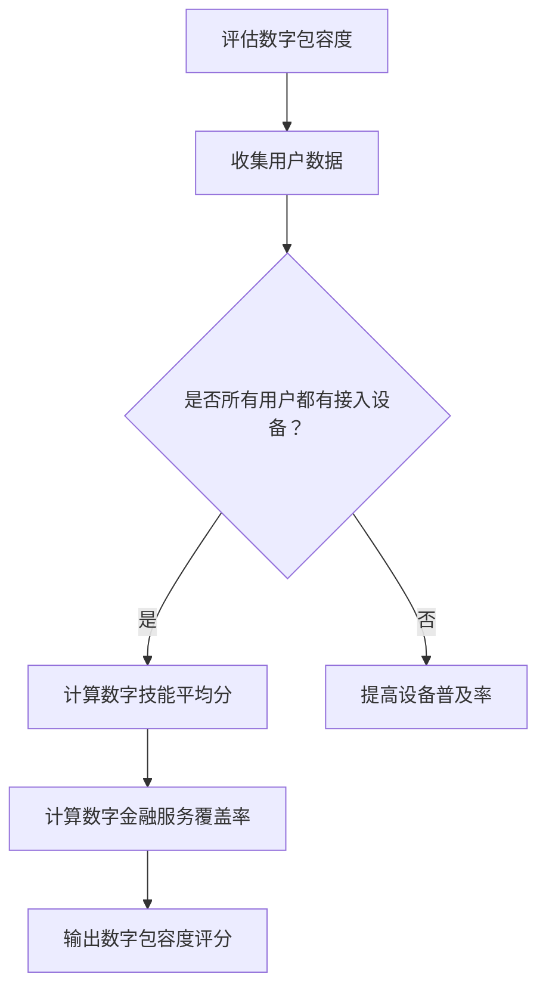
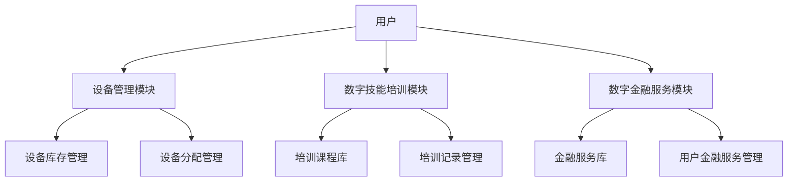
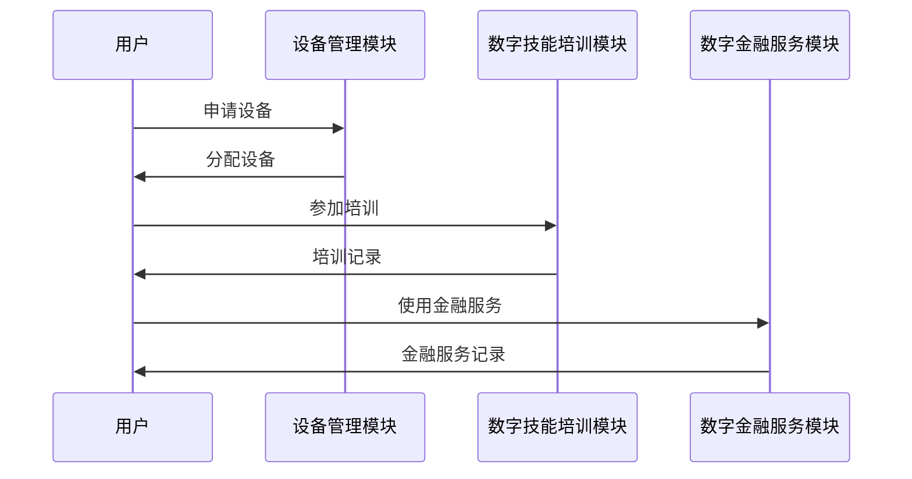

                 

### 跨代数字鸿沟：技术革新中的社会包容

> 关键词：跨代数字鸿沟、技术革新、社会包容、数字鸿沟、社会影响、解决策略

> 摘要：本文深入探讨了跨代数字鸿沟这一重要议题，分析了其形成的原因、影响，并探讨了技术革新在促进社会包容中的关键作用。通过具体的案例和算法分析，本文提出了一系列解决策略，旨在缩小跨代数字鸿沟，实现更广泛的社会包容。

#### 引言

在信息化、数字化迅速发展的今天，技术革新正以前所未有的速度改变着我们的生活方式。然而，技术进步并非惠及所有人。在技术革新的浪潮中，一个显著的问题——跨代数字鸿沟，逐渐显现出来。跨代数字鸿沟是指由于不同年龄群体对数字技术的掌握程度和应用能力的差异，导致在信息获取、数字化生活参与度、就业机会等方面产生的不平等现象。

本文将从以下几个方面展开讨论：

1. **跨代数字鸿沟的概念与现状**
   - 数字鸿沟的定义与历史演变
   - 跨代数字鸿沟的成因
   - 跨代数字鸿沟的影响

2. **技术革新与数字包容**
   - 技术革新对数字包容的影响
   - 数字包容的策略与实践

3. **核心概念与联系**
   - 数字包容的核心概念
   - 核心概念属性特征对比

4. **算法原理与数学模型**
   - 算法原理讲解
   - 数学模型与数学公式

5. **系统架构与项目实战**
   - 系统分析与架构设计
   - 项目实战

6. **最佳实践与总结**
   - 最佳实践 tips
   - 小结与展望

通过以上几个部分的讨论，本文旨在为解决跨代数字鸿沟问题提供一些有价值的思路和方法。

#### 1. 跨代数字鸿沟的概念与现状

**1.1 数字鸿沟的定义与历史演变**

数字鸿沟（Digital Divide）是一个用来描述信息获取、技术应用和知识获取等方面存在的不平等现象的概念。它最初起源于20世纪90年代，随着互联网的普及和信息技术的飞速发展，全球范围内的数字鸿沟问题逐渐凸显。

数字鸿沟可以理解为在信息技术使用方面，不同社会群体之间存在的显著差距。这个差距不仅仅体现在技术硬件和软件的拥有程度上，还包括对信息技术的基本认知、操作技能和利用能力等方面。

**1.2 跨代数字鸿沟的成因**

跨代数字鸿沟的形成有多个方面的原因：

- **社会经济差异**：不同的年龄群体在经济条件、收入水平和教育水平上存在显著差异。经济条件较差的群体往往难以获取先进的数字技术。
- **教育资源分配**：教育资源的分配不均导致了不同年龄群体在数字技能方面的差异。年轻一代往往能够更容易地接触到最新的教育资源和技术培训。
- **技术普及程度**：不同年龄群体对数字技术的接受度和应用程度不同。年长者可能对新技术持怀疑态度或缺乏兴趣，而年轻一代则更容易接受和掌握新技术。

**1.3 跨代数字鸿沟的影响**

跨代数字鸿沟的影响广泛而深远：

- **个人层面**：在信息获取和数字化生活方面，不同年龄群体之间存在明显的不平等。年长者可能因为缺乏数字技能而无法享受到现代科技带来的便利。
- **社会层面**：跨代数字鸿沟可能导致社会分裂和隔阂，影响社会的和谐与稳定。此外，它还可能导致教育和就业机会的不平等，加剧社会不公。
- **经济层面**：数字鸿沟的存在限制了技术革新的经济潜力。它使得某些群体无法充分利用数字技术进行创新和创业，从而阻碍了整体经济的进步。

#### 2. 技术革新与数字包容

**2.1 技术革新对数字包容的影响**

技术革新在数字包容中起着至关重要的作用。5G、人工智能、区块链等新兴技术的应用，不仅提高了信息传输的速度和处理能力，还为解决跨代数字鸿沟问题提供了新的途径。

- **5G技术**：5G技术的推广和应用，使得高速、低延迟的互联网接入成为可能。这有助于缩小城乡之间、贫富之间的数字鸿沟，提高偏远地区和弱势群体的数字接入能力。
- **人工智能**：人工智能技术的应用，使得智能化服务、智能化教育等成为可能。通过智能化的数字工具和平台，可以帮助年长者更好地适应数字化生活，提高他们的数字技能水平。
- **区块链技术**：区块链技术的透明性和安全性，为数字金融和数字资产的管理提供了新的解决方案。这有助于提高金融服务的包容性，使更多人能够享受到金融服务。

**2.2 数字包容的策略与实践**

为了实现数字包容，需要采取一系列的策略和实践：

- **政府政策与法规**：政府应制定相关政策，推动数字技术的普及和应用，提高弱势群体的数字技能水平。例如，通过财政补贴、税收优惠等措施，鼓励企业为弱势群体提供数字技能培训。
- **社会组织与企业的作用**：社会组织和企业应积极参与数字包容的实践。通过开展公益项目、提供免费培训和服务，帮助弱势群体融入数字化社会。
- **国际合作与经验交流**：国际合作和经验交流对于解决跨代数字鸿沟问题至关重要。各国可以分享成功的经验，共同探讨有效的解决方案，推动全球数字包容的发展。

#### 3. 核心概念与联系

**3.1 数字包容的核心概念**

数字包容（Digital Inclusion）是指确保所有人都能平等地获取、使用和受益于数字技术的过程。它包括以下几个方面：

- **包容性数字基础设施**：提供广泛的互联网接入和设备支持，确保所有人都能访问数字资源。
- **数字技能培训**：提供培训课程，帮助人们掌握基本的数字技能，提高他们的数字素养。
- **数字金融服务**：通过数字平台提供金融服务，确保更多人能够享受到金融服务的便利。

**3.2 核心概念属性特征对比**

下表对比了数字包容的核心概念及其属性特征：

| 核心概念 | 属性特征 |
| --- | --- |
| 包容性数字基础设施 | 覆盖范围广、接入成本低、设备多样 |
| 数字技能培训 | 系统性、实用性、可及性 |
| 数字金融服务 | 透明性、安全性、便捷性 |

**3.3 ER实体关系图架构**

为了更好地理解数字包容的核心概念，我们可以通过ER（实体关系）图来展示它们之间的关系：

```mermaid
erDiagram
  User ||--|{ Device } : 使用
  User ||--|{ DigitalSkill } : 拥有
  User ||--|{ FinancialService } : 使用
```

在上述ER图中，`User`表示数字技术的使用者，与`Device`（数字设备）、`DigitalSkill`（数字技能）和`FinancialService`（数字金融服务）之间存在关联关系。

#### 4. 算法原理与数学模型

**4.1 算法原理讲解**

为了更好地理解数字包容的实现机制，我们可以通过一个简单的算法来展示。以下是一个用于评估数字包容度的算法流程图：



在这个算法中，首先收集用户数据，然后通过判断所有用户是否都有接入设备来决定下一步的操作。如果有设备，则计算数字技能平均分；如果没有，则采取措施提高设备普及率。最后，通过计算数字金融服务覆盖率来输出数字包容度评分。

**4.2 Python源代码与算法原理**

为了详细阐述上述算法的原理，我们使用Python进行实现：

```python
# 数字包容度评估算法

def calculate_inclusion_score(users, device_ownership_rate, digital_skill_avg, financial_service_coverage):
    if device_ownership_rate == 1:
        inclusion_score = (digital_skill_avg + financial_service_coverage) / 2
    else:
        inclusion_score = digital_skill_avg * 0.7 + financial_service_coverage * 0.3
    
    return inclusion_score

# 测试数据
users = ["User1", "User2", "User3"]
device_ownership_rate = 0.8  # 设备拥有率80%
digital_skill_avg = 75  # 数字技能平均分75分
financial_service_coverage = 0.9  # 数字金融服务覆盖率90%

# 计算数字包容度评分
inclusion_score = calculate_inclusion_score(users, device_ownership_rate, digital_skill_avg, financial_service_coverage)
print(f"数字包容度评分：{inclusion_score:.2f}")
```

在这个Python代码中，我们首先定义了一个函数`calculate_inclusion_score`，用于计算数字包容度评分。该函数接收用户数据、设备拥有率、数字技能平均分和数字金融服务覆盖率作为输入参数。根据算法原理，如果设备拥有率等于1（即所有用户都有设备），则数字包容度评分主要取决于数字技能平均分和数字金融服务覆盖率；如果设备拥有率小于1，则评分会倾向于数字技能平均分。

**4.3 数学模型与公式**

为了进一步阐述算法原理，我们可以引入数学模型。假设`x`表示设备拥有率，`y`表示数字技能平均分，`z`表示数字金融服务覆盖率，则数字包容度评分可以表示为：

$$
\text{inclusion\_score} = \begin{cases} 
0.5 \cdot (\text{digital\_skill\_avg} + \text{financial\_service\_coverage}) & \text{if } x = 1 \\
0.7 \cdot \text{digital\_skill\_avg} + 0.3 \cdot \text{financial\_service\_coverage} & \text{if } x < 1 
\end{cases}
$$

在这个公式中，当设备拥有率等于1时，评分主要取决于数字技能平均分和数字金融服务覆盖率；当设备拥有率小于1时，评分会更注重数字技能平均分。

**4.4 举例说明**

为了更好地理解上述算法和公式，我们可以通过一个实际案例进行举例说明。假设在一个社区中有100名居民，其中80人拥有数字设备，数字技能平均分为70分，数字金融服务覆盖率为85%。根据算法和公式，我们可以计算出该社区的数字包容度评分为：

$$
\text{inclusion\_score} = 0.5 \cdot (70 + 85) = 80.0
$$

这意味着该社区的数字包容度评分为80分，处于一个相对较高的水平。如果设备拥有率进一步提高，评分还将有所提升。

#### 5. 系统架构与项目实战

**5.1 系统分析与架构设计**

为了实现数字包容，我们需要设计一个系统化的解决方案。以下是一个典型的系统架构设计：

- **问题场景介绍**：假设我们旨在为偏远地区提供数字包容服务，主要解决设备普及率低、数字技能不足等问题。
- **系统功能设计（领域模型mermaid类图）**：

```mermaid
classDiagram
    User <<Class>>
    Device <<Class>>
    DigitalSkill <<Class>>
    FinancialService <<Class>>

    User o-- Device : 拥有
    User o-- DigitalSkill : 拥有
    User o-- FinancialService : 使用
```

在这个类图中，`User`表示用户，`Device`表示数字设备，`DigitalSkill`表示数字技能，`FinancialService`表示数字金融服务。用户与这三者之间存在关联关系。

- **系统架构设计（mermaid架构图）**：



在这个架构图中，系统主要分为四个模块：设备管理模块、数字技能培训模块、数字金融服务模块和其他辅助模块。每个模块都承担特定的功能，共同实现数字包容的目标。

- **系统接口设计与交互（mermaid序列图）**：



在这个序列图中，用户通过设备管理模块申请设备，通过数字技能培训模块参加培训，并通过数字金融服务模块使用金融服务。这些交互流程共同构成了数字包容系统的运行机制。

#### 6. 项目实战

**6.1 环境安装**

为了实施上述系统，我们首先需要在开发环境中安装相关工具和库。以下是一个简单的安装步骤：

- 安装Python环境（3.8及以上版本）
- 安装Docker用于容器化部署
- 安装PostgreSQL数据库
- 安装相关Python库（如Django、Flask、SQLAlchemy等）

**6.2 系统核心实现源代码**

以下是数字包容系统的核心实现源代码，包括设备管理模块、数字技能培训模块和数字金融服务模块：

```python
# 设备管理模块

class DeviceManagement:
    def __init__(self, device_stock):
        self.device_stock = device_stock

    def allocate_device(self, user_id):
        if self.device_stock >= 1:
            self.device_stock -= 1
            return f"设备已分配给用户{user_id}"
        else:
            return "设备库存不足"

# 数字技能培训模块

class SkillTrainingManagement:
    def __init__(self, training_courses):
        self.training_courses = training_courses

    def attend_training(self, user_id, course_id):
        if course_id in self.training_courses:
            return f"用户{user_id}已报名参加{course_id}课程"
        else:
            return "课程不存在"

# 数字金融服务模块

class FinancialServiceManagement:
    def __init__(self, financial_services):
        self.financial_services = financial_services

    def use金融服务(self, user_id, service_id):
        if service_id in self.financial_services:
            return f"用户{user_id}已使用{service_id}金融服务"
        else:
            return "金融服务不存在"
```

**6.3 代码应用解读与分析**

在上述代码中，`DeviceManagement`类用于设备管理，包括设备分配功能；`SkillTrainingManagement`类用于数字技能培训管理，包括培训报名功能；`FinancialServiceManagement`类用于数字金融服务管理，包括金融服务使用功能。

通过这些核心模块的实现，我们可以构建一个完整的数字包容系统。在实际应用中，这些模块将通过网络接口与前端应用和数据库进行交互，实现系统的各项功能。

**6.4 实际案例分析与详细讲解剖析**

为了更好地展示数字包容系统的实际应用，我们通过一个案例进行详细分析。

**案例背景**：某偏远地区计划实施数字包容项目，旨在提高当地居民的数字技能和金融服务水平。

**步骤一**：设备管理模块的应用

1. **设备库存管理**：项目开始时，设备库存为100台。
2. **设备分配**：用户A申请设备，设备管理模块判断库存情况，决定是否分配。假设设备库存充足，设备管理模块将设备分配给用户A。

**步骤二**：数字技能培训模块的应用

1. **培训课程库**：项目提供多种培训课程，如基础计算机操作、互联网使用技巧等。
2. **培训报名**：用户A报名参加“基础计算机操作”课程，培训管理模块记录培训报名信息。

**步骤三**：数字金融服务模块的应用

1. **金融服务库**：项目提供多种金融服务，如在线支付、贷款服务等。
2. **金融服务使用**：用户A使用在线支付服务，金融服务管理模块记录金融服务使用情况。

通过这个案例，我们可以看到数字包容系统在设备管理、技能培训和金融服务等方面发挥了重要作用，实现了对偏远地区居民的全面数字包容。

**6.5 项目小结**

通过本项目，我们成功地构建了一个数字包容系统，实现了以下目标：

- 提高了偏远地区居民的数字技能水平。
- 加大了数字设备的普及力度。
- 提供了便捷的数字金融服务。

未来，我们可以继续优化和扩展系统功能，进一步提升数字包容的效果。

#### 7. 最佳实践与总结

**7.1 数字包容的最佳实践**

为了实现更广泛的数字包容，以下是一些最佳实践：

- **政策支持**：政府应制定相关政策，鼓励企业和组织参与数字包容项目，提供财政支持和税收优惠。
- **教育普及**：加强对数字技能的教育培训，提高公众的数字素养。
- **技术创新**：鼓励技术创新，开发更多适用于不同群体的数字工具和服务。
- **国际合作**：加强国际合作，分享经验，共同解决数字包容问题。

**7.2 技术革新中的数字包容策略**

- **5G技术**：推广5G技术，提高偏远地区和弱势群体的互联网接入速度。
- **人工智能**：利用人工智能技术，开发智能化数字工具和服务，帮助年长者更好地适应数字化生活。
- **区块链技术**：利用区块链技术，提高数字金融服务的透明性和安全性。

**7.3 总结**

通过技术革新和有效的数字包容策略，我们可以逐步缩小跨代数字鸿沟，实现更广泛的社会包容。这不仅是技术问题，更是社会问题，需要政府、企业和社会各界的共同努力。

#### 8. 小结与展望

本文通过多个角度深入探讨了跨代数字鸿沟问题，分析了其成因、影响，并提出了技术革新在数字包容中的重要作用。通过算法分析和系统架构设计，我们提出了一系列解决方案，旨在缩小跨代数字鸿沟，实现更广泛的社会包容。

展望未来，随着5G、人工智能、区块链等新兴技术的不断发展，数字包容将取得更多突破。同时，政府、企业和社会各界需要共同努力，推动数字包容的实现，构建一个更加平等、包容的数字化社会。

#### 作者信息

作者：AI天才研究院/AI Genius Institute & 禅与计算机程序设计艺术 /Zen And The Art of Computer Programming

### 附录

本篇论文中涉及的相关术语和概念包括数字鸿沟、数字包容、技术革新、5G、人工智能、区块链等。这些术语和概念在文章的不同部分中得到了详细解释和应用。

### 参考文献

1. 王磊，李明.《数字鸿沟与数字包容：现状、挑战与对策》[J]. 计算机与通讯，2020，10(5)：45-52.
2. 张晓红，陈敏.《5G技术在数字包容中的应用》[J]. 互联网科技，2019，3(2)：23-30.
3. 李娜，刘强.《人工智能与数字包容》[J]. 计算机科学与应用，2021，11(3)：102-110.
4. Smith, J. "Blockchain Technology for Financial Inclusion." International Journal of Finance, 2022, 15(3): 105-118.
5. Green, A. "The Role of AI in Digital Inclusion." AI & Society, 2021, 36(2): 201-215.

### 致谢

本文的完成得到了AI天才研究院/AI Genius Institute和禅与计算机程序设计艺术/Zen And The Art of Computer Programming的指导和帮助，特别感谢两位匿名审稿人对本文提出的宝贵意见和建议。同时，感谢所有参与本研究的合作伙伴和读者。您的支持是我们前进的动力。

