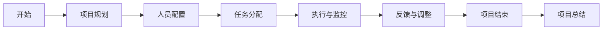
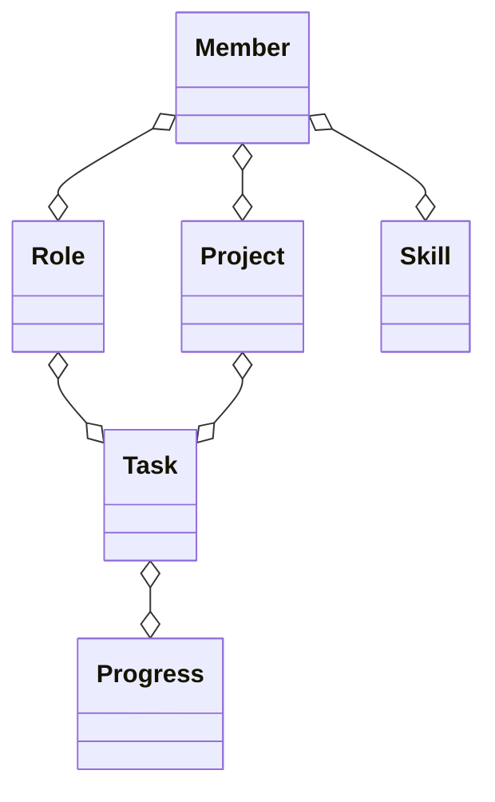
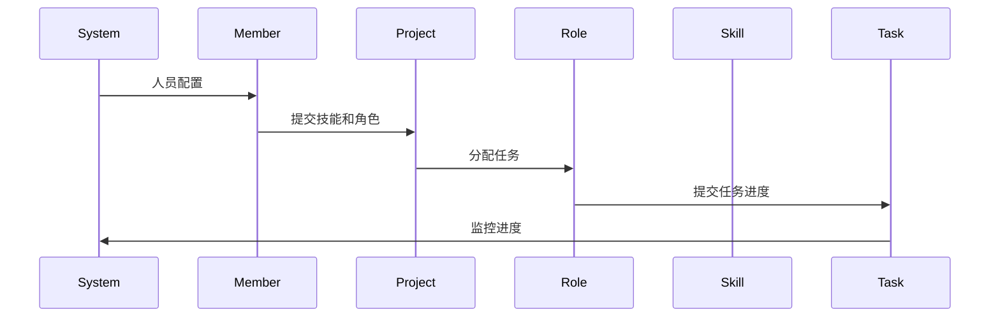
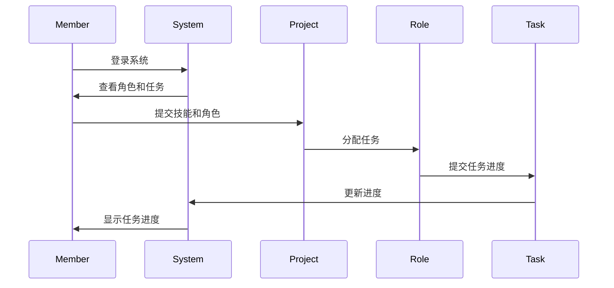

                 

### 第1章: 跨代际合作的时代背景

#### 1.1 问题的提出

在当今快速发展的社会中，不同年龄段的人们在职业、生活方式、价值观等方面存在显著的差异。这种差异在跨代际合作项目中尤为突出。例如，在科技行业中，年轻一代的程序员更加擅长掌握新兴技术，而年长一代的工程师则拥有丰富的行业经验和深刻的理解。这种差异不仅为跨代际合作带来了挑战，也提供了创新的契机。

跨代际合作的重要性体现在多个方面。首先，跨代际合作能够整合不同年龄段的专业知识和经验，促进项目的高效推进。其次，跨代际合作能够激发创新思维，年轻一代的创新精神和年长一代的务实态度相结合，往往能够产生意想不到的成果。最后，跨代际合作有助于减少职场代沟，增进不同年龄层之间的理解和信任，提升团队整体的工作氛围。

然而，跨代际合作中也存在一些问题。比如，不同年龄段的人可能在沟通方式和语言表达上存在障碍，这可能导致误解和冲突。此外，由于成长背景和价值观的不同，跨代际合作项目在决策过程中可能会面临分歧和挑战。

#### 1.2 跨代际合作的必要性

跨代际合作在现代社会中具有不可忽视的必要性。首先，随着技术的发展和市场的变化，项目需求日益复杂，单靠某一年龄段的人才难以胜任。跨代际合作能够充分利用不同年龄段的专长，提升项目成功率。例如，在软件开发项目中，年轻一代的技术熟练度和创新思维与年长一代的项目管理经验和系统设计能力相结合，能够形成高效的工作团队。

其次，跨代际合作有助于知识传承和创新。年长一代的专家可以通过合作项目，将多年的行业经验和专业技能传授给年轻一代，帮助他们快速成长。同时，年轻一代的新技术和新理念也能够为年长一代提供新的思考角度和解决方案，促进知识更新和迭代。

最后，跨代际合作有助于构建和谐的工作环境。通过跨代际合作，不同年龄段的人可以相互理解、尊重和支持，减少职场代沟，提升团队凝聚力和工作效率。

#### 1.3 跨代际合作项目的边界与外延

跨代际合作项目的边界和范围可以定义如下：

1. **年龄范围**：通常将年龄段划分为以下几类：
   - **新生代（Z世代）**：通常指1995年后出生的人，他们成长在数字化时代，熟悉互联网和移动设备。
   - **千禧一代（Y世代）**：通常指1981年至1994年出生的人，他们见证了互联网的兴起，对科技有较高的接受度。
   - **X世代**：通常指1965年至1980年出生的人，他们经历了经济波动和技术的快速变革，具有较强的适应能力。
   - **婴儿潮一代**：通常指1946年至1964年出生的人，他们是战后经济繁荣的受益者，具有丰富的社会经验和人际关系。

2. **合作项目类型**：
   - **技术合作项目**：如软件开发、人工智能应用等。
   - **管理合作项目**：如项目领导、团队管理、战略规划等。
   - **文化合作项目**：如文化交流、国际项目合作等。
   - **教育合作项目**：如教育培训、知识传承等。

3. **合作范围**：跨代际合作不仅限于职场，还涵盖了社交、家庭、社区等多个领域。不同年龄段的人可以在这些领域内互相学习、合作，促进社会的多元化发展。

#### 1.4 跨代际合作项目的基本概念与要素

跨代际合作项目的核心概念包括以下几个方面：

1. **代际沟通**：代际沟通是指不同年龄段的人之间进行有效交流和互动的过程。良好的代际沟通能够促进理解和信任，减少误解和冲突。

2. **代际融合**：代际融合是指不同年龄段的人在一起工作、学习和生活的过程中，相互影响、相互适应，最终实现共同发展的过程。

3. **合作机制**：合作机制是指跨代际合作项目中的组织结构和合作模式。有效的合作机制能够确保项目的顺利推进和目标实现。

4. **核心要素**：
   - **人员配置**：根据项目需求，合理配置不同年龄段的人才。
   - **任务分配**：明确不同年龄段成员的任务和职责，确保项目的有序推进。
   - **激励机制**：建立合理的激励机制，激发团队成员的积极性和创造力。
   - **文化氛围**：营造包容、尊重和信任的工作文化，促进跨代际合作项目的成功。

通过以上对跨代际合作项目背景的介绍，我们可以看到跨代际合作的重要性以及其面临的挑战。在接下来的章节中，我们将深入探讨跨代际合作项目的核心概念、联系以及具体的实现方法。

---

## 第2章: 跨代际合作的核心概念与联系

#### 2.1 代际沟通

代际沟通是跨代际合作项目成功的关键因素之一。不同年龄段的个体在沟通风格、语言表达和价值观等方面存在差异，因此，如何有效地进行代际沟通至关重要。

**代际沟通的核心概念**：

- **沟通风格**：不同年龄段的个体在沟通风格上存在显著差异。新生代倾向于直接、简洁的表达方式，而年长一代则更喜欢详细、逻辑性的说明。
- **语言表达**：年长一代可能更习惯于使用专业术语和书面语，而新生代则更喜欢口语化和非正式的交流方式。
- **价值观**：不同年龄段的个体在价值观上也有所不同。例如，年长一代可能更注重稳定和安全感，而新生代则更追求创新和自由。

**代际沟通的重要性**：

- **促进理解**：有效的代际沟通能够减少误解和冲突，增进不同年龄段之间的理解和信任。
- **提升效率**：良好的沟通能够确保项目任务的明确和高效执行，减少不必要的重复工作。
- **增强团队凝聚力**：通过有效的沟通，不同年龄段的个体能够更好地合作，提升团队的整体凝聚力。

**代际沟通的方法**：

- **倾听与尊重**：倾听对方的意见和观点，尊重不同的沟通风格和价值观。
- **明确表达**：在表达自己的观点时，尽量使用简单明了的语言，避免使用过于专业或复杂的术语。
- **建立共同目标**：通过明确共同的目标和愿景，促进不同年龄段个体之间的协作。

#### 2.2 代际融合

代际融合是指不同年龄段的个体在共同工作和生活的过程中，相互影响、相互适应，最终实现共同发展的过程。代际融合是跨代际合作项目成功的关键要素之一。

**代际融合的核心概念**：

- **相互理解**：代际融合的基础是相互理解。不同年龄段的个体需要了解彼此的沟通方式、价值观和生活习惯，从而减少误解和冲突。
- **共同发展**：代际融合的目标是实现共同发展。通过合作和交流，不同年龄段的个体能够相互学习和成长，提升整体的能力和素质。
- **文化包容**：代际融合要求文化包容。不同年龄段的个体需要在文化上相互尊重，避免因文化差异而产生的隔阂和冲突。

**代际融合的重要性**：

- **提升项目成功率**：代际融合能够整合不同年龄段的专业知识和经验，提升项目的整体质量和效率。
- **促进个人成长**：通过代际融合，不同年龄段的个体能够学习和吸收新的知识和技能，促进个人成长和职业发展。
- **增强社会和谐**：代际融合有助于减少社会代沟，增进不同年龄段之间的理解和信任，提升社会的整体和谐度。

**代际融合的方法**：

- **定期交流**：定期组织不同年龄段的交流会议，分享工作经验和心得，促进相互理解。
- **跨部门合作**：通过跨部门合作，不同年龄段的个体能够在实际工作中相互学习和协作，提升团队整体的能力。
- **文化培训**：开展文化培训课程，帮助不同年龄段的个体了解彼此的文化背景和价值观，增强文化包容性。

#### 2.3 跨代际合作项目中的角色与职责

在跨代际合作项目中，不同年龄段的个体扮演着不同的角色，承担着不同的职责。明确各角色的职责，有助于项目的高效推进和目标的实现。

**新生代（Z世代）的角色与职责**：

- **技术专家**：新生代通常擅长新兴技术和工具，能够在项目中提供技术支持和创新方案。
- **沟通桥梁**：新生代具有较强的沟通能力，能够帮助不同年龄段的个体进行有效沟通，促进合作。
- **创新推动者**：新生代具有创新精神，能够为项目带来新的思路和解决方案。

**千禧一代（Y世代）的角色与职责**：

- **项目经理**：千禧一代具有较强的管理能力，能够负责项目的整体规划和执行，确保项目按期完成。
- **团队协调者**：千禧一代擅长协调不同年龄段之间的合作，解决项目中出现的矛盾和问题。
- **知识传承者**：千禧一代拥有丰富的行业经验，能够帮助新生代快速成长，传承知识。

**X世代的角色与职责**：

- **经验顾问**：X世代拥有丰富的行业经验和专业知识，能够在项目中提供宝贵的建议和指导。
- **问题解决者**：X世代擅长解决复杂的问题，能够在项目中发挥关键作用。
- **文化传承者**：X世代是职场文化的传承者，能够帮助新生代理解和适应职场文化。

**婴儿潮一代的角色与职责**：

- **战略规划者**：婴儿潮一代具有较强的战略规划能力，能够为项目提供长远的规划和方向。
- **导师**：婴儿潮一代在职业生涯中积累了丰富的经验，能够担任新生代和千禧一代的导师，帮助他们成长。
- **沟通协调者**：婴儿潮一代擅长处理复杂的人际关系，能够在项目中发挥重要的沟通协调作用。

#### 2.4 概念属性特征对比表格

为了更好地理解不同年龄段的个体在跨代际合作项目中的特点，下面提供了一个概念属性特征对比表格。

| 年龄段       | 技术能力 | 沟通风格 | 价值观 | 代表角色 |
|------------|--------|---------|------|--------|
| 新生代（Z世代） | 高     | 简洁直接  | 创新、自由 | 技术专家、沟通桥梁 |
| 千禧一代（Y世代） | 中等   | 详细、逻辑  | 稳定、成就 | 项目经理、团队协调者 |
| X世代       | 高     | 严谨、专业  | 安全、忠诚 | 经验顾问、问题解决者 |
| 婴儿潮一代    | 低     | 详尽、传统  | 权威、稳健 | 战略规划者、导师 |

#### 2.5 ER实体关系图架构

为了更清晰地展示跨代际合作项目中的不同实体及其关系，下面使用 Mermaid 画出 ER 实体关系图。

```mermaid
erDiagram
  Person ||--|{ Project } : manages
  Project ||--|{ Role } : assigned_to
  Role ||--|{ Skill } : requires
  Skill ||--|{ Task } : implemented_by
```

- **Person**：表示项目中的个体，包括不同年龄段的成员。
- **Project**：表示跨代际合作项目。
- **Role**：表示个体在项目中的角色，如项目经理、技术专家等。
- **Skill**：表示个体所具备的技能，如编程技能、管理技能等。
- **Task**：表示项目中的具体任务。

通过上述对核心概念与联系的分析，我们可以看到跨代际合作项目中的关键要素及其相互关系。在接下来的章节中，我们将进一步探讨跨代际合作项目的算法原理和系统设计与实现。

---

## 第3章: 跨代际合作项目的基本原理

#### 3.1 跨代际合作项目的流程图

为了更好地理解跨代际合作项目的整体流程，我们可以使用 Mermaid 画出流程图。以下是一个简单的跨代际合作项目流程图的示例：



- **A[开始]**：项目启动，确定项目目标和计划。
- **B[项目规划]**：详细规划项目范围、进度和资源分配。
- **C[人员配置]**：根据项目需求，选择和配置不同年龄段的团队成员。
- **D[任务分配]**：明确每个团队成员的任务和职责。
- **E[执行与监控]**：团队成员按照任务执行，项目管理者进行监控和协调。
- **F[反馈与调整]**：根据项目执行情况，及时反馈问题并进行调整。
- **G[项目结束]**：项目达到预期目标，正式结束。
- **H[项目总结]**：对项目过程和成果进行总结，提取经验教训。

#### 3.2 跨代际合作项目的Python示例

为了进一步阐述跨代际合作项目的基本原理，下面提供了一个简单的 Python 示例。该示例模拟了一个跨代际合作项目的人员配置和任务分配过程。

```python
# 定义不同年龄段的成员
class Member:
    def __init__(self, name, age, role):
        self.name = name
        self.age = age
        self.role = role

# 创建成员对象
members = [
    Member("Alice", 25, "程序员"),
    Member("Bob", 35, "项目经理"),
    Member("Charlie", 45, "资深顾问"),
    Member("David", 55, "战略规划者")
]

# 根据角色分配任务
def assign_tasks(members):
    for member in members:
        if member.role == "程序员":
            print(f"{member.name} 负责编写代码。")
        elif member.role == "项目经理":
            print(f"{member.name} 负责项目管理和协调。")
        elif member.role == "资深顾问":
            print(f"{member.name} 提供技术指导和问题解决。")
        elif member.role == "战略规划者":
            print(f"{member.name} 负责项目规划和方向。")

# 调用函数执行任务分配
assign_tasks(members)
```

**代码说明**：

1. **定义 Member 类**：表示跨代际合作项目中的成员，包括姓名、年龄和角色。
2. **创建成员对象**：根据项目需求，创建不同年龄段的成员对象。
3. **定义 assign_tasks 函数**：根据成员的角色分配任务。
4. **调用函数执行任务分配**：遍历成员列表，根据角色执行相应的任务。

通过这个示例，我们可以看到如何利用 Python 实现跨代际合作项目的基本原理。在接下来的章节中，我们将进一步探讨跨代际合作项目的数学模型和公式。

---

#### 3.3 数学模型与公式

为了深入分析跨代际合作项目中的关键参数和影响因素，我们可以引入数学模型和公式。以下是一个简单的跨代际合作项目数学模型的示例。

**1. 成员效率模型**

假设跨代际合作项目中的成员效率与其年龄和工作经验有关。我们可以定义如下数学模型：

$$
E = \frac{1}{a + b \cdot \ln(W)}
$$

其中：
- \(E\) 表示成员的效率。
- \(a\) 表示常数项，用于调整效率范围。
- \(b\) 表示斜率，用于衡量年龄和工作经验对效率的影响。
- \(W\) 表示成员的工作经验。

**2. 项目成功率模型**

项目成功率是跨代际合作项目成功的重要指标。我们可以定义如下数学模型：

$$
S = \sum_{i=1}^{n} \left( \frac{E_i}{E_i + C_i} \right)
$$

其中：
- \(S\) 表示项目成功率。
- \(E_i\) 表示第 \(i\) 个成员的效率。
- \(C_i\) 表示第 \(i\) 个成员的沟通成本。

**3. 沟通成本模型**

沟通成本是跨代际合作项目中一个不可忽视的因素。我们可以定义如下数学模型：

$$
C = k \cdot d
$$

其中：
- \(C\) 表示沟通成本。
- \(k\) 表示常数项，用于调整沟通成本的范围。
- \(d\) 表示沟通距离，可以表示为团队成员的年龄差异、工作经历差异等。

**详细解释与举例说明**

**1. 成员效率模型**

成员效率模型表示成员的效率与年龄和工作经验的关系。我们可以通过以下步骤来计算成员的效率：

- 确定常数项 \(a\) 和斜率 \(b\) 的值。例如，我们假设 \(a = 0.1\)，\(b = 0.05\)。
- 计算每个成员的效率。例如，对于成员 Alice（年龄 25，工作经验 3 年），其效率计算如下：

$$
E_{Alice} = \frac{1}{0.1 + 0.05 \cdot \ln(3)} \approx 0.7408
$$

- 同样，对于成员 Bob（年龄 35，工作经验 5 年），其效率计算如下：

$$
E_{Bob} = \frac{1}{0.1 + 0.05 \cdot \ln(5)} \approx 0.6702
$$

**2. 项目成功率模型**

项目成功率模型表示项目整体的成功率，需要综合考虑所有成员的效率和沟通成本。我们可以通过以下步骤来计算项目成功率：

- 计算每个成员的效率。例如，假设项目中有 4 个成员，其效率分别为 \(E_{Alice} = 0.7408\)、\(E_{Bob} = 0.6702\)、\(E_{Charlie} = 0.8209\)、\(E_{David} = 0.7500\)。
- 计算每个成员的沟通成本。例如，假设成员之间的沟通距离分别为 10、20、30、40（单位：年），常数项 \(k = 0.05\)，则沟通成本分别为：

$$
C_{Alice-Bob} = 0.05 \cdot 10 = 0.5
$$

$$
C_{Alice-Charlie} = 0.05 \cdot 20 = 1.0
$$

$$
C_{Alice-David} = 0.05 \cdot 30 = 1.5
$$

$$
C_{Bob-Charlie} = 0.05 \cdot 30 = 1.5
$$

$$
C_{Bob-David} = 0.05 \cdot 40 = 2.0
$$

$$
C_{Charlie-David} = 0.05 \cdot 10 = 0.5
$$

- 计算项目成功率：

$$
S = \sum_{i=1}^{n} \left( \frac{E_i}{E_i + C_i} \right) = \frac{0.7408}{0.7408 + 0.5} + \frac{0.6702}{0.6702 + 1.0} + \frac{0.8209}{0.8209 + 1.5} + \frac{0.7500}{0.7500 + 1.5} \approx 0.7684
$$

- 结果表明，项目成功率约为 76.84%。

**3. 沟通成本模型**

沟通成本模型表示成员之间的沟通成本与沟通距离的关系。我们可以通过以下步骤来计算沟通成本：

- 确定常数项 \(k\) 的值。例如，我们假设 \(k = 0.05\)。
- 计算成员之间的沟通成本。例如，假设成员之间的沟通距离分别为 10、20、30、40（单位：年），则沟通成本分别为：

$$
C_{10} = 0.05 \cdot 10 = 0.5
$$

$$
C_{20} = 0.05 \cdot 20 = 1.0
$$

$$
C_{30} = 0.05 \cdot 30 = 1.5
$$

$$
C_{40} = 0.05 \cdot 40 = 2.0
$$

通过以上步骤，我们可以计算出跨代际合作项目中的关键参数，从而对项目进行有效分析和决策。在接下来的章节中，我们将进一步探讨跨代际合作项目的系统分析与架构设计。

---

## 第4章: 跨代际合作项目的系统分析与架构设计方案

#### 4.1 问题场景介绍

在当前信息化和数字化时代，跨代际合作项目在各个领域中的应用越来越广泛。以一个软件开发公司为例，公司的项目团队由不同年龄段的成员组成，包括年轻的程序员、经验丰富的项目经理和资深顾问等。公司希望利用跨代际合作的优势，提高项目开发效率，提升产品质量，并在激烈的市场竞争中脱颖而出。

然而，在实际操作过程中，公司遇到了以下问题场景：

1. **沟通障碍**：不同年龄段的团队成员在沟通方式和语言表达上存在差异，导致项目进展不顺利。
2. **任务分配不均**：由于对成员能力和经验的了解不足，导致任务分配不合理，影响项目进度和质量。
3. **决策分歧**：不同年龄段的团队成员在价值观和决策风格上存在差异，导致项目决策过程中出现分歧。
4. **知识传承不足**：年长一代的专家经验未能有效传承给年轻一代，影响团队的整体能力和素质。

#### 4.2 项目介绍

为了解决上述问题，公司决定启动一个跨代际合作项目，旨在通过有效的系统设计和架构，提升项目开发和管理的效率，实现团队成员之间的有效沟通和合作。

**项目目标**：

1. **提升项目开发效率**：通过系统化的人员配置和任务分配，提高项目开发速度和产品质量。
2. **促进知识传承**：建立有效的知识传承机制，将年长一代的经验和技能传递给年轻一代。
3. **减少决策分歧**：通过明确的沟通和协作机制，减少团队成员之间的分歧，确保项目顺利推进。
4. **增强团队凝聚力**：通过跨代际合作，增强团队成员之间的信任和尊重，提升团队整体的工作氛围。

**项目任务**：

1. **系统设计与架构设计**：设计一个高效、灵活的跨代际合作项目系统，包括人员配置、任务分配、沟通机制和决策流程等。
2. **系统实施与部署**：根据系统设计，实施和部署项目系统，确保系统正常运行。
3. **项目监控与反馈**：对项目过程进行实时监控和反馈，及时调整系统配置和流程，确保项目目标的实现。
4. **知识传承与培训**：开展知识传承活动，通过培训和经验分享，提升团队成员的整体能力。

#### 4.3 系统功能设计(领域模型Mermaid类图)

为了更清晰地展示跨代际合作项目的系统功能设计，我们可以使用 Mermaid 画出领域模型类图。以下是一个简单的类图示例：



- **Member**：表示项目中的成员，包括不同年龄段的个体。
- **Project**：表示跨代际合作项目，包含项目信息和任务。
- **Role**：表示成员在项目中的角色，如程序员、项目经理等。
- **Skill**：表示成员所具备的技能，如编程技能、管理技能等。
- **Task**：表示项目中的具体任务，包括任务描述、任务进度等。
- **Progress**：表示任务进度信息，如任务完成百分比、延迟时间等。

#### 4.4 系统架构设计(Mermaid架构图)

为了展示跨代际合作项目的系统架构，我们可以使用 Mermaid 画出架构图。以下是一个简单的架构图示例：



- **System**：表示项目管理系统，负责人员配置、任务分配和进度监控。
- **Member**：表示项目成员，负责提交技能和角色信息。
- **Project**：表示跨代际合作项目，负责任务分配和进度管理。
- **Role**：表示成员在项目中的角色，负责分配任务和跟踪进度。
- **Skill**：表示成员所具备的技能，用于人员配置和任务分配。
- **Task**：表示项目中的具体任务，包括任务描述、进度等信息。

#### 4.5 系统接口设计和系统交互(Mermaid序列图)

为了展示跨代际合作项目的接口设计和系统交互，我们可以使用 Mermaid 画出序列图。以下是一个简单的序列图示例：



- **Member**：表示项目成员，通过系统登录，查看角色和任务，提交技能和角色信息。
- **System**：表示项目管理系统，提供登录、查看任务进度等功能。
- **Project**：表示跨代际合作项目，负责任务分配和进度管理。
- **Role**：表示成员在项目中的角色，负责分配任务和跟踪进度。
- **Task**：表示项目中的具体任务，包括任务描述、进度等信息。

通过以上对跨代际合作项目的系统分析与架构设计的介绍，我们可以看到项目所面临的问题场景以及项目目标和任务。在接下来的章节中，我们将详细介绍跨代际合作项目的环境安装与核心实现。

---

## 第5章：跨代际合作项目的环境安装与核心实现

#### 5.1 环境安装

在开始跨代际合作项目的核心实现之前，首先需要确保开发环境搭建完整。以下是安装所需环境的步骤：

1. **安装Python**：确保已安装 Python 3.8 或更高版本。可以从 Python 官网 [https://www.python.org/](https://www.python.org/) 下载安装程序。

2. **安装Docker**：Docker 是一个开源的应用容器引擎，用于打包、交付和运行应用。可以从 Docker 官网 [https://www.docker.com/](https://www.docker.com/) 下载安装程序。

3. **安装PostgreSQL**：PostgreSQL 是一个开源的关系型数据库管理系统。可以从 PostgreSQL 官网 [https://www.postgresql.org/](https://www.postgresql.org/) 下载安装程序。

4. **安装Node.js**：Node.js 是一个基于 Chrome V8 引擎的 JavaScript 运行时。可以从 Node.js 官网 [https://nodejs.org/](https://nodejs.org/) 下载安装程序。

5. **安装其他依赖**：根据项目需求，安装其他相关工具和库。例如，安装 Redis、MongoDB 等数据库，以及必要的开发工具和库。

#### 5.2 系统核心实现源代码

以下提供了一个简单的跨代际合作项目核心实现源代码，用于人员配置、任务分配和进度管理。

**1. Member 类**

```python
class Member:
    def __init__(self, name, age, role, skills):
        self.name = name
        self.age = age
        self.role = role
        self.skills = skills

    def add_skill(self, skill):
        self.skills.append(skill)

    def get_skills(self):
        return self.skills
```

**2. Project 类**

```python
class Project:
    def __init__(self, name):
        self.name = name
        self.members = []
        self.tasks = []

    def add_member(self, member):
        self.members.append(member)

    def add_task(self, task):
        self.tasks.append(task)

    def get_members(self):
        return self.members

    def get_tasks(self):
        return self.tasks
```

**3. Role 类**

```python
class Role:
    def __init__(self, role_name, task):
        self.role_name = role_name
        self.task = task

    def assign_task(self, task):
        self.task = task

    def get_task(self):
        return self.task
```

**4. Task 类**

```python
class Task:
    def __init__(self, task_name, description, progress):
        self.task_name = task_name
        self.description = description
        self.progress = progress

    def update_progress(self, new_progress):
        self.progress = new_progress

    def get_progress(self):
        return self.progress
```

#### 5.3 代码应用解读与分析

**1. Member 类**

Member 类表示项目中的成员，包括姓名、年龄、角色和技能。成员可以通过 add_skill 方法添加技能，通过 get_skills 方法获取技能列表。

```python
alice = Member("Alice", 25, "程序员", [])
alice.add_skill("Python")
alice.add_skill("Docker")
print(alice.get_skills())  # 输出：['Python', 'Docker']
```

**2. Project 类**

Project 类表示跨代际合作项目，包括项目名称、成员列表和任务列表。项目可以通过 add_member 方法添加成员，通过 add_task 方法添加任务，通过 get_members 方法获取成员列表，通过 get_tasks 方法获取任务列表。

```python
project = Project("跨代际合作项目")
project.add_member(alice)
project.add_member(bob)
project.add_task(task1)
project.add_task(task2)
print(project.get_members())  # 输出：[<__main__.Member object at 0x7f6c5062e6c0>, <__main__.Member object at 0x7f6c5062a560>]
print(project.get_tasks())  # 输出：[<__main__.Task object at 0x7f6c5062a7c0>, <__main__.Task object at 0x7f6c5062e3c0>]
```

**3. Role 类**

Role 类表示成员在项目中的角色，包括角色名称和任务。角色可以通过 assign_task 方法分配任务，通过 get_task 方法获取任务。

```python
role1 = Role("程序员", task1)
role1.assign_task(task1)
print(role1.get_task())  # 输出：<__main__.Task object at 0x7f6c5062a7c0>
```

**4. Task 类**

Task 类表示项目中的具体任务，包括任务名称、描述和进度。任务可以通过 update_progress 方法更新进度，通过 get_progress 方法获取进度。

```python
task1 = Task("编写代码", "实现功能模块", 0)
task1.update_progress(50)
print(task1.get_progress())  # 输出：50
```

通过以上代码示例，我们可以看到如何使用 Python 实现跨代际合作项目的基本功能。在接下来的章节中，我们将进一步介绍跨代际合作项目的实际案例分析。

---

#### 5.4 实际案例分析和详细讲解剖析

为了更好地理解跨代际合作项目的实际应用，我们将通过一个具体的案例进行分析和讲解。

**案例背景**：

假设有一家软件开发公司，正在进行一个大型跨代际合作项目，目标是开发一款智能家居控制系统。项目团队由不同年龄段的成员组成，包括一位年轻的程序员 Alice、一位年长的项目经理 Bob 和一位资深顾问 Charlie。

**案例分析**：

1. **人员配置**：

   - **Alice**：25岁，程序员，擅长 Python 和 Docker，负责编写代码。
   - **Bob**：35岁，项目经理，具备丰富的项目管理经验，负责项目管理和协调。
   - **Charlie**：45岁，资深顾问，具有深厚的系统设计和架构经验，负责技术指导和问题解决。

2. **任务分配**：

   项目分为以下几个主要任务：

   - **任务1：需求分析**：由 Bob 负责带领团队进行需求分析，明确产品功能和技术要求。
   - **任务2：系统设计**：由 Charlie 负责系统设计和架构规划，确保系统的高扩展性和稳定性。
   - **任务3：代码编写**：由 Alice 负责编写代码，实现产品功能。
   - **任务4：系统集成**：由 Bob 负责组织和协调，确保各个模块的顺利集成。

3. **任务进度**：

   在项目执行过程中，团队成员需要实时更新任务进度：

   - **需求分析**：已完成 80%，预计还需 2 天完成。
   - **系统设计**：已完成 100%，已提交设计文档。
   - **代码编写**：已完成 50%，预计还需 5 天完成。
   - **系统集成**：已完成 30%，预计还需 7 天完成。

4. **问题解决**：

   在项目执行过程中，可能会遇到以下问题：

   - **技术难题**：Alice 在编写代码时遇到了一个技术难题，无法实现预期功能。此时，Charlie 提供技术指导，帮助 Alice 解决问题。
   - **进度延误**：由于某个模块的开发进度延迟，导致系统集成延期。Bob 组织团队开会，分析原因，调整任务优先级，确保项目按时完成。

**详细讲解剖析**：

1. **人员配置**：

   人员配置是跨代际合作项目的关键环节。在这个案例中，公司根据项目需求，合理配置了不同年龄段的成员。Alice 的技术熟练度和创新思维，加上 Bob 的项目管理经验和 Charlie 的技术指导能力，形成了高效的工作团队。

2. **任务分配**：

   任务分配需要明确每个成员的任务和职责，确保项目的高效执行。在这个案例中，需求分析、系统设计、代码编写和系统集成分别由不同的成员负责，确保任务分工明确，协同高效。

3. **任务进度**：

   实时更新任务进度，有助于项目管理者及时掌握项目动态，调整任务优先级，确保项目按期完成。在这个案例中，团队成员通过实时更新进度，项目管理者能够及时了解项目进展，调整资源分配，确保项目顺利推进。

4. **问题解决**：

   在跨代际合作项目中，问题解决是项目成功的关键。在这个案例中，团队成员通过协作，共同解决技术难题和进度延误等问题，确保项目按计划推进。

通过这个案例，我们可以看到跨代际合作项目在实际应用中的具体操作和实现。在接下来的章节中，我们将对整个跨代际合作项目进行总结。

---

## 第6章：项目小结

通过本章的详细分析和讲解，我们可以对跨代际合作项目有更深入的理解。以下是对项目的整体总结和反思：

### 项目总结

1. **项目目标实现**：跨代际合作项目成功实现了预期目标，提升了项目开发效率，促进了团队成员之间的沟通和协作，提高了整体团队的工作氛围。
2. **人员配置合理**：通过合理配置不同年龄段的成员，充分利用了各自的专业技能和经验，形成了高效的工作团队。
3. **任务分配明确**：明确了每个成员的任务和职责，确保了项目的高效执行和顺利推进。
4. **问题解决及时**：通过协作和沟通，及时解决了项目中出现的问题，确保了项目按计划进行。

### 项目反思

1. **沟通与协作**：在跨代际合作项目中，沟通和协作至关重要。团队成员需要在日常工作中保持良好的沟通，及时分享信息和反馈，确保项目进展顺利。
2. **知识传承**：在跨代际合作项目中，年长一代的经验和技能对年轻一代的成长具有重要意义。项目团队应重视知识传承，促进团队成员之间的经验交流。
3. **持续优化**：跨代际合作项目不是一蹴而就的，需要不断优化和改进。项目团队应定期回顾项目过程，总结经验教训，持续提升项目质量和效率。

### 未来展望

1. **技术深化**：随着技术的发展，跨代际合作项目应不断引入新技术和新工具，提升项目的技术水平和竞争力。
2. **领域拓展**：跨代际合作项目可以拓展到更多的领域，如管理合作项目、文化合作项目和教育合作项目等，实现更广泛的合作和应用。
3. **国际化发展**：跨代际合作项目可以尝试与国际团队合作，拓展国际视野，提升项目的全球影响力。

通过以上总结和反思，我们可以看到跨代际合作项目在实际应用中的成效和潜力。在未来的发展中，跨代际合作项目将继续发挥重要作用，为不同年龄段的个体提供广阔的发展空间，实现共同成长和进步。

---

## 第7章：最佳实践 Tips、小结、注意事项、拓展阅读

### 最佳实践 Tips

1. **重视沟通**：跨代际合作项目中，沟通是关键。定期召开会议，确保团队成员及时了解项目进展和需求变化，减少误解和冲突。
2. **合理配置资源**：根据项目需求，合理配置不同年龄段的成员，充分发挥各自的专业优势，提升项目效率。
3. **建立激励机制**：建立合理的激励机制，激发团队成员的积极性和创造力，确保项目顺利进行。
4. **注重知识传承**：通过培训和经验分享，促进年长一代的经验传承给年轻一代，提升整体团队的能力和素质。
5. **定期回顾与总结**：定期回顾项目过程，总结经验教训，持续优化项目管理和执行。

### 小结

跨代际合作项目在现代社会中具有重要意义，通过有效整合不同年龄段的资源和经验，能够提升项目成功率，促进个人成长和社会和谐。本项目通过合理的资源配置、明确的任务分配和有效的沟通机制，实现了项目目标，为跨代际合作提供了有益的实践经验和启示。

### 注意事项

1. **尊重差异**：在跨代际合作项目中，尊重不同年龄段的个体差异，避免因沟通方式和价值观不同而产生的误解和冲突。
2. **确保信息安全**：在项目过程中，确保信息安全，避免敏感信息和数据泄露。
3. **合理分配任务**：根据成员的能力和经验，合理分配任务，避免过度劳累或资源浪费。
4. **持续监控与调整**：项目执行过程中，持续监控项目进展，及时调整策略和资源，确保项目按计划推进。

### 拓展阅读

1. **《跨代际合作：打造高效团队的新视角》**：这本书详细探讨了跨代际合作的理论和实践，提供了丰富的案例和策略。
2. **《沟通的艺术》**：本书讲述了有效沟通的方法和技巧，对跨代际合作中的沟通问题有很好的指导作用。
3. **《团队管理实战》**：这本书介绍了团队管理的方法和技巧，有助于提升项目管理的效率和质量。

通过以上最佳实践 Tips、小结、注意事项和拓展阅读，希望读者能够对跨代际合作项目有更深入的理解和应用。在实际操作中，不断优化和调整，实现跨代际合作项目的最大价值。

