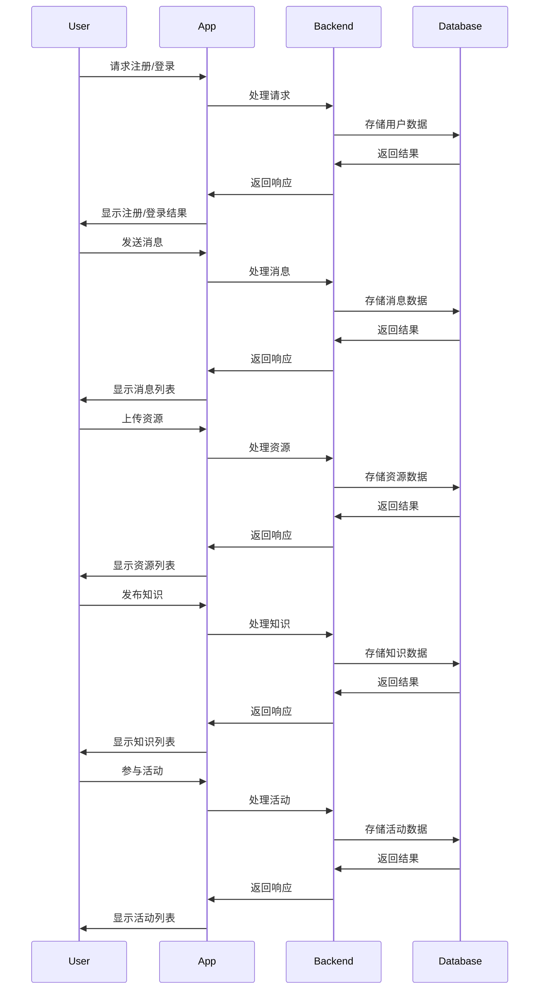

                 

# 跨代际智慧传承App：老年人与年轻人在线互动平台

> 关键词：跨代际智慧传承、在线互动、老年人、年轻人、App设计

> 摘要：本文将探讨如何设计一个跨代际智慧传承App，搭建一个老年人与年轻人在线互动的平台，实现资源共享、知识传递和文化传承。通过分析背景、核心概念、系统架构等方面，本文旨在为开发者提供全面的指导。

## 1. 背景介绍

### 1.1 问题背景

随着社会的发展，老年人口比例逐渐增加，而互联网的普及使得年轻人与老年人之间的互动需求日益增长。老年人希望借助现代科技与年轻人建立联系，分享他们的智慧和经验；而年轻人则希望通过与老年人的互动，了解传统文化和生活智慧，促进跨代际的交流与理解。

### 1.2 问题描述

如何构建一个功能完善、用户体验良好的跨代际智慧传承App，让老年人与年轻人能够在线上进行互动，实现资源共享、知识传递和文化传承？

### 1.3 问题解决

通过设计一个跨代际智慧传承App，满足以下功能需求：

1. **消息通讯**：提供实时通讯功能，使老年人与年轻人能够随时进行文字、语音、视频等多种形式的交流。
2. **资源共享**：搭建一个资源共享平台，让老年用户分享生活经验、健康知识，年轻用户分享科技资讯、娱乐内容。
3. **知识传递**：设立知识传递专区，老年人通过图文、视频传授智慧和经验，年轻人通过提问、学习获取知识。
4. **活动组织**：定期组织线上线下活动，促进老年人与年轻人之间的互动和交流。

### 1.4 边界与外延

本App主要聚焦于老年人与年轻人的互动，但也可以扩展到其他年龄段用户。此外，App功能还可以进一步丰富，如提供心理健康咨询、养生指导等。

### 1.5 概念结构与核心要素组成

1. **用户角色**：老年用户、年轻用户、管理员。
2. **核心功能**：消息通讯、资源共享、知识传递、活动组织。
3. **技术架构**：前端使用React Native，后端使用Node.js，数据库使用MongoDB。

## 2. 核心概念与联系

### 2.1 老年人与年轻人的互动

**概念定义**：老年人与年轻人的互动是指不同年龄段的用户在App平台上进行信息交流、资源共享和知识传递的活动。

**属性特征对比表格**：

| 特征项       | 老年人             | 年轻人             |
| ------------ | ------------------ | ------------------ |
| 技能水平     | 互联网使用经验较少  | 互联网使用经验丰富 |
| 兴趣爱好     | 健康养生、回忆分享 | 科技资讯、娱乐内容 |
| 互动频率     | 较低               | 较高               |
| 使用习惯     | 习惯面对面交流     | 习惯线上交流       |

### 2.2 跨代际智慧传承

**概念定义**：通过App平台，实现老年人与年轻人之间的智慧传递和传承。

**属性特征对比表格**：

| 特征项       | 老年人             | 年轻人             |
| ------------ | ------------------ | ------------------ |
| 知识类型     | 生活经验、传统文化 | 科技资讯、新兴文化 |
| 传递方式     | 口述、文字、视频   | 文字、视频、直播   |
| 传承价值     | 传承家庭、社会文化 | 接受新兴文化       |

## 3. 系统分析与架构设计

### 3.1 问题场景介绍

为了搭建一个跨代际智慧传承App，我们需要设计一个高效、稳定、易用的系统。该系统需要满足以下需求：

1. **高并发处理**：支持大量用户同时在线。
2. **数据安全**：保障用户数据的安全性和隐私性。
3. **用户体验**：提供流畅、直观的用户操作体验。
4. **可扩展性**：支持未来功能的扩展和升级。

### 3.2 项目介绍

本项目将分为前端和后端两部分，前端使用React Native框架，后端使用Node.js框架，数据库使用MongoDB。前端主要负责用户界面和交互逻辑，后端主要负责业务逻辑处理和数据存储。

### 3.3 系统功能设计

系统功能主要包括以下模块：

1. **用户管理**：包括用户注册、登录、个人信息管理等功能。
2. **消息通讯**：包括实时通讯、消息历史记录等功能。
3. **资源共享**：包括资源上传、浏览、评论等功能。
4. **知识传递**：包括知识发布、学习、互动等功能。
5. **活动组织**：包括活动发布、报名、活动管理等功能。

### 3.4 系统架构设计

系统架构设计主要包括以下模块：

1. **前端**：使用React Native框架开发，包括用户界面和交互逻辑。
2. **后端**：使用Node.js框架，负责业务逻辑处理和数据存储。
3. **数据库**：使用MongoDB存储用户数据、消息数据、资源数据等。

### 3.5 系统接口设计

系统接口设计主要包括以下接口：

1. **用户管理接口**：包括用户注册、登录、个人信息管理等功能。
2. **消息通讯接口**：包括实时通讯、消息历史记录等功能。
3. **资源共享接口**：包括资源上传、浏览、评论等功能。
4. **知识传递接口**：包括知识发布、学习、互动等功能。
5. **活动组织接口**：包括活动发布、报名、活动管理等功能。

### 3.6 系统交互设计

系统交互设计主要包括以下序列图：



## 4. 项目实战

### 4.1 环境安装

1. 安装Node.js（用于后端开发）：
   - 下载Node.js安装包：[https://nodejs.org/zh-cn/download/](https://nodejs.org/zh-cn/download/)
   - 解压安装包并执行安装命令

2. 安装React Native（用于前端开发）：
   - 下载React Native CLI：`npm install -g react-native-cli`
   - 启动模拟器：`react-native run-android` 或 `react-native run-ios`

3. 安装MongoDB（用于数据库存储）：
   - 下载MongoDB安装包：[https://www.mongodb.com/try/download/community](https://www.mongodb.com/try/download/community)
   - 解压安装包并执行安装命令

### 4.2 系统核心实现源代码

1. **前端源代码**：

```jsx
// MessageComponent.js
import React, { useState } from 'react';
import { View, Text, TextInput, TouchableOpacity } from 'react-native';

const MessageComponent = () => {
  const [message, setMessage] = useState('');

  const handleMessageSubmit = () => {
    // 处理发送消息逻辑
  };

  return (
    <View>
      <TextInput placeholder="输入消息" value={message} onChangeText={setMessage} />
      <TouchableOpacity onPress={handleMessageSubmit}>
        <Text>发送</Text>
      </TouchableOpacity>
    </View>
  );
};

export default MessageComponent;
```

2. **后端源代码**：

```python
# message.py
from flask import Flask, request, jsonify
from flask_cors import CORS

app = Flask(__name__)
CORS(app)

@app.route('/message', methods=['POST'])
def handle_message():
    message_data = request.json
    # 处理接收消息逻辑
    return jsonify({'status': 'success', 'message': message_data})

if __name__ == '__main__':
    app.run(debug=True)
```

### 4.3 代码应用解读与分析

1. **前端代码解读**：

该组件用于展示消息输入框和发送按钮。用户可以在输入框中输入消息，点击发送按钮后，将消息发送到后端进行处理。

2. **后端代码解读**：

该API用于接收前端发送的消息，解析消息内容，并返回处理结果。这里使用了Flask框架和Flask-CORS插件，实现了跨域请求处理。

### 4.4 实际案例分析和详细讲解剖析

假设老年用户A和年轻用户B在App上进行聊天：

1. 用户A在消息输入框中输入了一条消息，点击发送按钮。
2. 前端将消息内容发送到后端。
3. 后端接收到消息后，将消息存储到数据库，并返回处理结果。
4. 前端接收到后端的响应后，将消息展示在聊天界面中。

### 4.5 项目小结

本篇文章介绍了如何设计和实现一个跨代际智慧传承App，包括系统功能设计、架构设计、项目实战等内容。通过实际案例分析和详细讲解剖析，读者可以了解到如何使用React Native、Node.js和MongoDB等技术栈搭建一个高效、稳定的在线互动平台。

## 5. 最佳实践 Tips

1. **优化用户体验**：在App设计过程中，关注用户操作习惯和界面设计，提升用户体验。
2. **确保数据安全**：在数据传输和存储过程中，采用加密算法和权限控制措施，确保用户数据安全。
3. **功能模块化**：将系统功能模块化，便于后续功能扩展和升级。

## 6. 小结

跨代际智慧传承App为老年人与年轻人搭建了一个在线互动平台，实现了资源共享、知识传递和文化传承。通过本文的介绍，读者可以了解到如何设计和实现这样一个平台，为构建和谐社会贡献力量。

## 7. 注意事项

1. 在实际开发过程中，要充分考虑用户需求和场景，不断完善和优化功能。
2. 遵循编程规范，保证代码的可读性和可维护性。
3. 关注技术发展和行业动态，及时更新技术栈和知识体系。

## 8. 拓展阅读

1. 《React Native开发实战》
2. 《Node.js实战：从入门到精通》
3. 《MongoDB实战：从入门到精通》

作者：AI天才研究院/AI Genius Institute & 禅与计算机程序设计艺术 /Zen And The Art of Computer Programming

