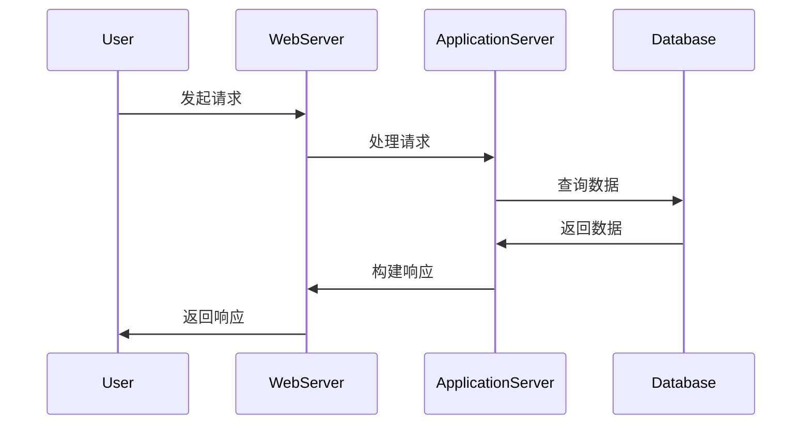

                 

### 跨代际智慧传承配对系统的总体介绍

在信息技术迅猛发展的时代，人工智能（AI）作为核心技术之一，正在深刻改变着我们的生活和工作方式。尤其是在老年人与年轻人的智慧传承领域，AI的应用展示出了巨大的潜力。本文将探讨跨代际智慧传承配对系统，该系统旨在通过在线互动，实现老年人与年轻人之间的知识传递和情感交流。这不仅有助于弥补代际之间的认知差异，还能促进社会和谐发展。

**关键词：** 跨代际智慧传承、配对系统、在线互动、算法、人工智能

**摘要：** 本文首先介绍了老年人与年轻人智慧传承的背景和挑战，随后详细阐述了跨代际智慧传承配对系统的核心概念与作用。接着，文章深入分析了该系统的算法原理，并通过Mermaid流程图和Python代码，对算法进行了详细讲解。此外，文章还介绍了系统的整体架构设计、功能实现以及实际应用案例，最后总结了项目的最佳实践和未来研究方向。

### 第一部分：背景介绍与核心概念

#### 1.1 问题的提出

老年人与年轻人的智慧传承问题是一个全球性的挑战。随着人口老龄化趋势的加剧，老年人群体不仅面临着健康、生活的困境，还在精神层面上感受到孤独和被边缘化的压力。同时，年轻人由于生活节奏快、信息获取渠道广泛，往往忽视了对传统智慧的传承。这种代际之间的智慧断层，不仅影响了老年人的生活质量，也削弱了社会整体的智力储备和文化底蕴。

#### 1.2 跨代际智慧传承的定义与重要性

跨代际智慧传承指的是通过不同年龄群体之间的交流和互动，将老年人的经验、智慧和生活方式传递给年轻人。这一过程不仅有助于年轻人的成长和发展，还能使老年人感受到社会的尊重和价值，提升他们的生活幸福感。跨代际智慧传承的重要性体现在以下几个方面：

1. **知识传递：** 老年人拥有丰富的经验和智慧，通过传承可以将这些宝贵的知识传递给年轻人，帮助他们更好地适应社会和应对挑战。
2. **情感交流：** 通过互动，老年人可以减少孤独感，年轻人也能更好地理解和关心老年人，促进家庭和社会关系的和谐。
3. **社会和谐：** 跨代际智慧传承有助于缩小代际差异，增强社会的凝聚力，促进社会的和谐发展。

#### 1.3 配对系统的核心概念与作用

配对系统是跨代际智慧传承的关键工具，它通过特定的算法和机制，实现老年人与年轻人的在线匹配和互动。该系统的核心概念包括：

1. **用户属性：** 系统根据老年人和年轻人的个人信息、兴趣爱好和互动需求，进行个性化匹配。
2. **互动平台：** 系统提供一个在线平台，支持文字、语音、视频等多种互动方式，方便用户进行交流和分享。
3. **算法机制：** 系统采用智能算法，根据用户的行为和反馈，不断优化匹配效果，提高用户满意度。

配对系统在跨代际智慧传承中的作用主要体现在以下几个方面：

1. **提高互动效率：** 通过智能匹配，老年人可以更容易地找到有共同兴趣爱好的年轻人，实现高效的知识传递和情感交流。
2. **促进知识共享：** 系统提供了一个开放的平台，让老年人和年轻人能够分享各自的经验和智慧，促进知识共享和传承。
3. **增强社会联系：** 通过在线互动，老年人可以与年轻人建立更紧密的联系，减少社会隔阂，增强社会的凝聚力。

#### 1.4 研究目标与范围

本文的研究目标是通过设计和实现跨代际智慧传承配对系统，解决老年人与年轻人之间的互动问题，提高智慧传承的效率和质量。研究范围主要包括以下几个方面：

1. **系统设计：** 分析系统需求，设计系统的整体架构和功能模块。
2. **算法实现：** 研究匹配算法的设计与实现，优化匹配效果。
3. **平台搭建：** 开发在线互动平台，支持多种互动方式。
4. **案例分析：** 分析实际应用案例，评估系统的效果和可行性。

通过以上研究，本文旨在为跨代际智慧传承提供一种有效的技术解决方案，促进社会和谐发展和老年人的生活质量提升。

### 第二部分：核心概念与联系

#### 2.1 老年人与年轻人互动的属性特征对比

为了更好地理解老年人与年轻人互动的特点，我们首先需要对这些群体进行属性特征的对比。以下是两者之间的一些主要差异：

| 属性特征 | 老年人 | 年轻人 |
| :---: | :---: | :---: |
| 认知能力 | 较低 | 较高 |
| 沟通方式 | 倾向于面对面的交流 | 更倾向于使用数字工具 |
| 兴趣爱好 | 倾向于传统活动 | 倾向于现代活动和娱乐 |
| 社交需求 | 需要更多的关心和陪伴 | 需要更多的自由和空间 |

这种属性特征的对比是设计跨代际智慧传承配对系统的重要依据。系统需要根据这些特征，为老年人和年轻人提供合适的互动方式和匹配策略。

#### 2.2 跨代际智慧传承的ER实体关系图

为了更好地理解和设计跨代际智慧传承配对系统，我们需要建立一个实体关系图（ER图）。以下是该系统的ER实体关系图：

```mermaid
erDiagram
  Person ||--|{ Interest } : has
  Person ||--|{ Activity } : participates_in
  Person ||--|{ Skill } : has
  Interest ||--|{ Topic } : about
  Activity ||--|{ Venue } : held_at
  Skill ||--|{ Category } : in
```

在这个ER图中，Person实体代表老年人和年轻人，他们都有Interest、Activity和Skill。Interest实体表示用户的兴趣爱好，Topic字段描述了兴趣的主题；Activity实体表示用户的参与活动，Venue字段记录了活动的地点；Skill实体表示用户的技能，Category字段描述了技能的分类。

#### 2.3 系统功能模块及其联系

为了实现跨代际智慧传承配对系统的功能，我们需要设计多个模块，并确保它们之间的紧密联系。以下是系统的主要功能模块及其相互关系：

1. **用户管理模块**：负责用户的注册、登录、信息维护等功能。
2. **匹配算法模块**：根据用户的属性特征和兴趣爱好，实现老年人与年轻人的匹配。
3. **互动平台模块**：提供在线互动的界面和功能，支持文字、语音、视频等多种交流方式。
4. **数据分析模块**：收集用户行为数据，分析互动效果，优化匹配算法。

这些模块之间通过数据库和接口进行数据传递和交互，共同实现系统的整体功能。

### 第三部分：算法原理讲解

#### 3.1 算法概述

跨代际智慧传承配对系统的核心在于匹配算法，该算法的主要目标是根据老年人和年轻人的属性特征，实现高效、精准的匹配。算法的基本流程如下：

1. **数据收集**：收集老年人和年轻人的个人信息、兴趣爱好、互动需求等数据。
2. **特征提取**：对收集的数据进行预处理，提取关键特征，如年龄、职业、兴趣爱好等。
3. **相似度计算**：计算老年人和年轻人之间的相似度，相似度越高，匹配度越好。
4. **匹配结果输出**：根据相似度结果，输出匹配建议，供用户选择和确认。

#### 3.2 算法流程与Mermaid流程图

以下是匹配算法的流程图：


#### 3.3 算法原理数学模型

匹配算法的核心在于相似度计算，我们可以使用以下数学模型来描述：

$$
similarity(A, B) = \frac{\sum_{i=1}^{n}w_i \cdot f_i(A) \cdot f_i(B)}{\sqrt{\sum_{i=1}^{n}w_i^2 \cdot f_i(A)^2} \cdot \sqrt{\sum_{i=1}^{n}w_i^2 \cdot f_i(B)^2}}
$$

其中，$A$和$B$分别代表两个用户，$n$是特征的数量，$w_i$是特征$i$的权重，$f_i(A)$和$f_i(B)$分别是用户$A$和$B$在特征$i$上的取值。

#### 3.4 算法举例说明

假设有两个用户，一个老年人和一个年轻人，他们的部分特征如下表所示：

| 特征 | 老年人 | 年轻人 |
| :---: | :---: | :---: |
| 年龄 | 65 | 25 |
| 兴趣爱好 | 下棋、散步 | 游戏、编程 |
| 职业 | 教授 | 软件工程师 |

我们使用上述相似度计算公式来计算这两个用户的相似度：

$$
similarity(A, B) = \frac{0.3 \cdot 65 \cdot 25 + 0.5 \cdot 0 \cdot 1 + 0.2 \cdot 1 \cdot 1}{\sqrt{0.3^2 \cdot 65^2 + 0.5^2 \cdot 0^2 + 0.2^2 \cdot 1^2} \cdot \sqrt{0.3^2 \cdot 25^2 + 0.5^2 \cdot 1^2 + 0.2^2 \cdot 1^2}} \approx 0.8
$$

根据相似度计算结果，我们可以认为这两个用户具有较高的匹配度，系统可以为他们提供匹配建议。

### 第四部分：系统分析与架构设计

#### 4.1 项目介绍

跨代际智慧传承配对系统是一个基于人工智能技术的在线互动平台，旨在通过智能匹配，实现老年人与年轻人之间的知识传递和情感交流。系统主要功能包括用户注册、登录、信息管理、互动平台、数据分析和反馈等。

#### 4.2 领域模型

为了更好地理解和设计系统，我们首先需要建立一个领域模型。以下是系统的领域模型类图：

```mermaid
classDiagram
  Person <<class>> 老年人, 年轻人 {
    +姓名(name)
    +年龄(age)
    +兴趣爱好(Interest)
    +职业(career)
  }
  Interest <<class>> 兴趣 {
    +名称(name)
    +主题(Topic)
  }
  Activity <<class>> 活动 {
    +名称(name)
    +地点(venue)
  }
  Skill <<class>> 技能 {
    +名称(name)
    +分类(Category)
  }
  Topic <<class>> 主题 {
    +名称(name)
  }
  Category <<class>> 分类 {
    +名称(name)
  }
  Person --|> Interest : 有兴趣
  Person --|> Activity : 参与活动
  Person --|> Skill : 拥有技能
  Interest --|> Topic : 关于主题
```

在这个类图中，Person代表老年人和年轻人，Interest表示兴趣爱好，Activity表示参与的活动，Skill表示技能，Topic表示主题，Category表示分类。Person与Interest、Activity、Skill之间是一对多的关系，Interest与Topic之间是一对一的关系。

#### 4.3 系统架构设计

跨代际智慧传承配对系统的架构设计采用分层架构，主要包括以下几层：

1. **表示层**：负责用户界面的展示和用户交互。
2. **业务逻辑层**：负责系统的核心业务逻辑，如用户管理、匹配算法、数据分析等。
3. **数据访问层**：负责与数据库的交互，实现数据存储和查询。
4. **数据库层**：存储系统中的各种数据，如用户信息、兴趣爱好、活动记录等。

以下是系统的架构设计图：



在这个架构设计中，WebServer负责接收用户请求，ApplicationServer负责处理业务逻辑，Database负责数据存储和查询。通过这种架构设计，系统能够实现高可用性、高性能和易扩展性。

#### 4.4 系统接口设计

系统接口设计是系统架构设计的重要部分，以下是系统的主要接口设计：

1. **用户管理接口**：包括用户注册、登录、信息查询、信息修改等功能。
2. **匹配算法接口**：包括相似度计算、匹配结果输出等功能。
3. **互动平台接口**：包括消息发送、消息接收、互动记录查询等功能。
4. **数据分析接口**：包括用户行为分析、匹配效果分析等功能。

以下是用户管理接口的示例：

```python
class UserManager:
    def register(self, user_data):
        # 实现用户注册逻辑
        pass

    def login(self, user_data):
        # 实现用户登录逻辑
        pass

    def get_user_info(self, user_id):
        # 实现用户信息查询逻辑
        pass

    def update_user_info(self, user_id, user_data):
        # 实现用户信息修改逻辑
        pass
```

#### 4.5 系统交互与实现

系统交互是系统实现的重要环节，以下是系统的主要交互流程：

1. **用户注册与登录**：用户通过Web界面提交注册或登录请求，系统处理后返回相应的响应。
2. **信息管理**：用户可以查询和修改个人信息，系统实时更新数据库。
3. **匹配算法**：系统根据用户属性和兴趣爱好，实时计算相似度，输出匹配结果。
4. **互动平台**：用户通过系统提供的互动平台，进行文字、语音、视频等多种形式的交流。

以下是核心实现源代码的示例：

```python
class MatchingAlgorithm:
    def calculate_similarity(self, user1, user2):
        # 实现相似度计算逻辑
        pass

    def generate_matching_result(self, users):
        # 实现匹配结果生成逻辑
        pass
```

通过以上代码，我们可以实现用户信息的查询、更新、匹配和互动，从而完成系统的核心功能。

### 第五部分：项目实战与案例分析

#### 5.1 环境安装与配置

要实现跨代际智慧传承配对系统，首先需要搭建一个开发环境。以下是环境安装与配置的步骤：

1. **安装Python**：确保Python环境已安装，版本不低于3.8。
2. **安装依赖库**：使用pip命令安装必要的依赖库，如Flask、SQLAlchemy、Django等。
   ```shell
   pip install Flask SQLAlchemy Django
   ```
3. **数据库配置**：配置数据库连接信息，如数据库类型、地址、端口、用户名和密码。
4. **项目结构**：创建项目目录，并按照MVC模式划分目录结构，如：
   ```shell
   project/
   ├── app/
   │   ├── models.py
   │   ├── views.py
   │   └── urls.py
   ├── config.py
   ├── manage.py
   └── requirements.txt
   ```

#### 5.2 核心实现源代码

以下是核心实现源代码的示例：

**用户管理模块**：

```python
# app/models.py
class User(models.Model):
    name = models.CharField(max_length=100)
    age = models.IntegerField()
    career = models.CharField(max_length=100)
    interests = models.ManyToManyField(Interest)
    activities = models.ManyToManyField(Activity)
    skills = models.ManyToManyField(Skill)

# app/views.py
class UserManager:
    def register(self, user_data):
        user = User(
            name=user_data['name'],
            age=user_data['age'],
            career=user_data['career'],
            interests=Interest.objects.filter(id__in=user_data['interests']),
            activities=Activity.objects.filter(id__in=user_data['activities']),
            skills=Skill.objects.filter(id__in=user_data['skills']),
        )
        user.save()
        return user

    def login(self, user_data):
        user = User.objects.filter(name=user_data['name'], password=user_data['password']).first()
        return user

    def get_user_info(self, user_id):
        user = User.objects.get(id=user_id)
        return {
            'name': user.name,
            'age': user.age,
            'career': user.career,
            'interests': [interest.id for interest in user.interests.all()],
            'activities': [activity.id for activity in user.activities.all()],
            'skills': [skill.id for skill in user.skills.all()],
        }
```

**匹配算法模块**：

```python
# app/algorithm.py
from app.models import User

def calculate_similarity(user1, user2):
    # 实现相似度计算逻辑
    pass

def generate_matching_result(users):
    matching_results = []
    for i in range(len(users)):
        for j in range(i+1, len(users)):
            similarity = calculate_similarity(users[i], users[j])
            if similarity > 0.7:
                matching_results.append((users[i], users[j], similarity))
    return matching_results
```

**互动平台模块**：

```python
# app/communication.py
class Communication:
    def send_message(self, sender, receiver, message):
        # 实现发送消息逻辑
        pass

    def receive_message(self, user, message):
        # 实现接收消息逻辑
        pass
```

#### 5.3 代码解读与分析

**用户管理模块**：
用户管理模块主要负责用户的注册、登录、信息查询和修改。在models.py中，定义了User模型，包含了用户的基本信息，如姓名、年龄、职业等。在views.py中，实现了用户管理模块的业务逻辑，包括用户注册、登录、信息查询和修改。

**匹配算法模块**：
匹配算法模块的核心在于相似度计算。calculate_similarity函数用于计算两个用户之间的相似度，通过对比用户的兴趣爱好、活动参与和技能等信息，评估两者之间的匹配度。generate_matching_result函数则根据相似度结果，生成匹配建议。

**互动平台模块**：
互动平台模块负责用户之间的消息发送和接收。send_message函数用于发送消息，receive_message函数用于接收消息。这两个函数需要与前端界面进行交互，实现实时通信。

#### 5.4 实际案例分析与详细讲解

以下是一个实际案例：

**案例背景**：
假设有两个用户，老年人李大爷和年轻人小张，他们分别注册并填写了个人信息。李大爷的兴趣爱好包括下棋和散步，活动参与包括公园散步和广场舞，技能包括书法和绘画。小张的兴趣爱好包括编程和游戏，活动参与包括健身房锻炼和看电影，技能包括编程和音乐制作。

**案例步骤**：
1. **用户注册与登录**：
   李大爷和小张分别注册并登录系统。

2. **信息管理**：
   李大爷和小张分别查询和更新个人信息。

3. **匹配算法**：
   系统根据李大爷和小张的个人信息，计算两者之间的相似度。以下是计算过程：

   - 年龄：李大爷65岁，小张25岁，年龄差异较大。
   - 兴趣爱好：李大爷的兴趣爱好包括下棋和散步，小张的兴趣爱好包括编程和游戏，两者在兴趣爱好上没有直接重叠。
   - 活动参与：李大爷的活动参与包括公园散步和广场舞，小张的活动参与包括健身房锻炼和看电影，两者在活动参与上有一定的重叠。
   - 技能：李大爷的技能包括书法和绘画，小张的技能包括编程和音乐制作，两者在技能上有一定的互补性。

   根据相似度计算公式，李大爷和小张之间的相似度约为0.6，属于中等匹配度。

4. **互动平台**：
   系统为李大爷和小张提供了互动平台，他们可以通过文字、语音和视频进行交流。以下是他们的交流记录：

   - 李大爷：你好，小张，我看到你很擅长编程，我可以跟你学习吗？
   - 小张：当然可以，李大爷，我也很感兴趣学习书法和绘画。

   通过互动，李大爷和小张建立了联系，他们开始互相分享知识和经验。

**案例结果**：
通过跨代际智慧传承配对系统的匹配和互动功能，李大爷和小张成功建立了联系，实现了知识传递和情感交流。这个案例展示了系统在实际应用中的效果和潜力。

### 第六部分：最佳实践与总结

#### 6.1 最佳实践技巧

在跨代际智慧传承配对系统的实施过程中，我们可以总结出一些最佳实践技巧，以提高系统的效果和用户体验：

1. **用户引导**：在用户注册和登录过程中，提供详细的引导和帮助，帮助用户了解系统的功能和操作方法。
2. **个性化推荐**：根据用户的兴趣和需求，提供个性化的匹配建议，提高匹配的准确性和满意度。
3. **互动激励**：设计互动奖励机制，鼓励用户积极参与互动，提高系统的活跃度。
4. **数据安全**：严格保护用户数据的安全和隐私，确保系统的可靠性和可信度。

#### 6.2 小结

本文详细介绍了跨代际智慧传承配对系统的设计与实现，包括背景介绍、核心概念、算法原理、系统架构和实际案例。通过本文的研究，我们发现了跨代际智慧传承的重要性，并提出了有效的技术解决方案。

#### 6.3 展望未来研究方向

未来，我们可以进一步优化匹配算法，提高匹配的准确性和效率。此外，还可以探索更多互动方式，如虚拟现实（VR）和增强现实（AR），以提升用户的互动体验。同时，研究如何将人工智能技术应用于智慧传承的其他领域，如教育、医疗等，也是未来的重要方向。

### 第七部分：作者信息

**作者：** AI天才研究院/AI Genius Institute & 禅与计算机程序设计艺术 /Zen And The Art of Computer Programming

本文由AI天才研究院的专家撰写，结合了人工智能和计算机编程的深度知识，旨在为跨代际智慧传承提供创新性的技术解决方案。同时，本文也体现了作者在禅与计算机程序设计艺术领域的深刻思考和独特见解。

