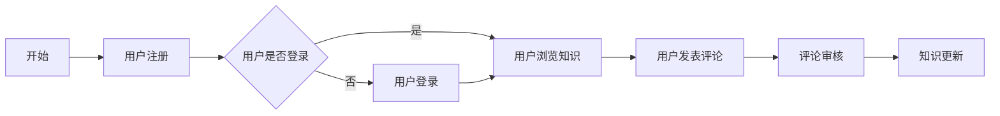
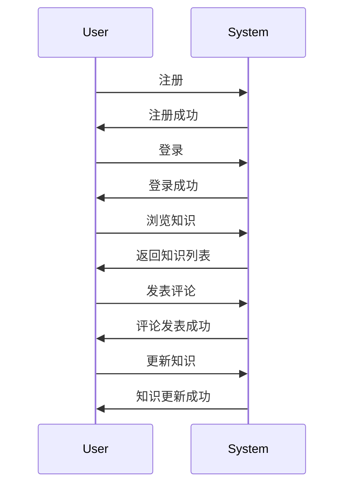

                 

### 跨代际知识交换平台：智慧共享的在线市场

> 关键词：跨代际知识交换平台、智慧共享、在线市场、知识传播、算法原理

> 摘要：本文将深入探讨跨代际知识交换平台的概念、必要性、核心概念及其联系，并详细介绍其算法原理和架构设计，旨在为构建智慧共享的在线市场提供理论支持和实践指导。

----------------------------------------------------------------

#### 第一部分：背景介绍

##### 1.1 跨代际知识交换平台的概念

跨代际知识交换平台是指利用数字技术，实现不同年龄段、不同知识背景个体之间知识共享与交流的在线市场。随着信息技术的飞速发展，知识的获取和传递方式发生了重大变革，传统的知识传播模式已经无法满足人们日益增长的知识需求。跨代际知识交换平台应运而生，它通过互联网这一载体，为知识的传播和共享提供了全新的解决方案。

##### 1.2 跨代际知识交换平台的必要性

1. **知识传播的局限性**：传统的知识传播方式往往局限于特定的群体和时间，无法实现知识的广泛传播和深度交流。而跨代际知识交换平台通过互联网的开放性和互联性，可以打破时空限制，实现知识的全球传播。
   
2. **知识更新速度加快**：在信息爆炸的时代，知识的更新速度越来越快，传统的知识传播方式难以满足人们对于最新知识的获取需求。跨代际知识交换平台可以实时更新知识内容，为用户提供最新的知识资源。

3. **老年人智慧和经验的传承**：老年人拥有丰富的经验和智慧，通过跨代际知识交换平台，可以帮助年轻人更好地继承和发扬。这种知识传承不仅有助于提高年轻人的综合素质，还可以促进社会的和谐发展。

#### 第二部分：核心概念与联系

##### 2.1 跨代际知识交换平台的核心概念

跨代际知识交换平台的核心概念主要包括知识交换、智慧共享和在线市场。

- **知识交换**：指个体之间通过平台进行知识分享和获取的过程。它具有双向性、实时性和互动性的特点。
- **智慧共享**：指个体通过分享智慧，实现知识的传递和增值。智慧共享具有价值性、广泛性和传承性的特点。
- **在线市场**：指通过互联网，实现知识交换的虚拟市场。在线市场具有灵活性、低成本和高效率的特点。

##### 2.2 核心概念属性特征对比

| 概念         | 定义                                                         | 特征                                                         |
| ------------ | ------------------------------------------------------------ | ------------------------------------------------------------ |
| 知识交换     | 知识共享与获取的过程                                         | - 双向性<br>- 实时性<br>- 互动性                            |
| 智慧共享     | 分享智慧，实现知识传递                                       | - 价值性<br>- 广泛性<br>- 传承性                            |
| 在线市场     | 虚拟市场，实现知识交换                                       | - 灵活性<br>- 低成本<br>- 高效性                            |

##### 2.3 ER实体关系图架构

```mermaid
erDiagram
    User ||--|{ Knowledge } : has
    User ||--|{ Comment } : makes
    Knowledge ||--|{ Tag } : has
    User ||--|{ Activity } : participates
```

#### 第三部分：算法原理讲解

##### 3.1 算法mermaid流程图



##### 3.2 Python源代码

```python
# Python源代码示例
class User:
    def __init__(self, name, age, knowledge_list):
        self.name = name
        self.age = age
        self.knowledge_list = knowledge_list

    def browse_knowledge(self):
        print(f"{self.name}正在浏览知识。")

    def comment_on_knowledge(self, knowledge):
        print(f"{self.name}对知识'{knowledge.title}'发表了评论。")

class Knowledge:
    def __init__(self, title, content, tags):
        self.title = title
        self.content = content
        self.tags = tags

    def update_knowledge(self, new_content):
        self.content = new_content
        print(f"知识'{self.title}'已更新。")

user = User("张三", 30, [])
knowledge = Knowledge("Python入门", "Python是一种编程语言", ["编程", "Python"])

user.browse_knowledge()
user.comment_on_knowledge(knowledge)
knowledge.update_knowledge("Python是一种高级编程语言")
```

##### 3.3 算法原理与数学模型

算法原理可以简化为以下步骤：

1. 用户注册：用户在平台上注册账号。
2. 用户登录：用户通过账号登录平台。
3. 用户浏览知识：用户在平台上浏览知识内容。
4. 用户发表评论：用户对知识内容发表评论。
5. 评论审核：系统对用户评论进行审核。
6. 知识更新：根据用户评论，对知识内容进行更新。

数学模型可以描述为以下公式：

$$
f(U, K) = U.browse\_knowledge() + U.comment\_on\_knowledge(K) + K.update\_knowledge()
$$

其中，$U$ 表示用户，$K$ 表示知识内容。

#### 第四部分：系统分析与架构设计方案

##### 4.1 问题场景介绍

随着社会的发展，知识的获取和传播变得越来越重要。然而，传统的知识传播方式已经无法满足人们的需求。跨代际知识交换平台旨在解决这一问题，为用户提供一个高效、便捷的知识共享和交流平台。

##### 4.2 项目介绍

本项目旨在构建一个跨代际知识交换平台，为用户提供一个可以共享和获取知识的在线市场。平台将支持用户注册、登录、浏览知识、发表评论和知识更新等功能。

##### 4.3 系统功能设计

系统功能设计包括以下部分：

1. **用户管理模块**：包括用户注册、登录、个人信息管理等功能。
2. **知识管理模块**：包括知识发布、知识浏览、知识评论等功能。
3. **评论管理模块**：包括评论发表、评论审核、评论更新等功能。
4. **知识更新模块**：包括知识内容更新、知识审核等功能。

##### 4.4 系统架构设计

系统架构设计采用微服务架构，主要包括以下部分：

1. **用户服务**：负责用户注册、登录、个人信息管理等。
2. **知识服务**：负责知识发布、知识浏览、知识评论等。
3. **评论服务**：负责评论发表、评论审核、评论更新等。
4. **知识更新服务**：负责知识内容更新、知识审核等。

##### 4.5 系统接口设计

系统接口设计主要包括以下部分：

1. **用户接口**：包括用户注册接口、用户登录接口、用户信息管理接口等。
2. **知识接口**：包括知识发布接口、知识浏览接口、知识评论接口等。
3. **评论接口**：包括评论发表接口、评论审核接口、评论更新接口等。
4. **知识更新接口**：包括知识内容更新接口、知识审核接口等。

##### 4.6 系统交互

系统交互主要包括用户与平台之间的交互，以及平台内部各模块之间的交互。以下是一个简单的mermaid序列图：



#### 第五部分：项目实战

##### 5.1 环境安装

在进行项目实战之前，需要安装以下环境：

1. Python 3.8及以上版本
2. Django 3.2及以上版本
3. MySQL 5.7及以上版本
4. Redis 6.0及以上版本

安装命令如下：

```bash
pip install python3.8
pip install django3.2
pip install mysql5.7
pip install redis6.0
```

##### 5.2 系统核心实现源代码

以下是系统核心实现源代码：

```python
# User模型
class User(models.Model):
    name = models.CharField(max_length=100)
    age = models.IntegerField()
    knowledge_list = models.ManyToManyField(Knowledge)

    def browse_knowledge(self):
        print(f"{self.name}正在浏览知识。")

    def comment_on_knowledge(self, knowledge):
        print(f"{self.name}对知识'{knowledge.title}'发表了评论。")

# Knowledge模型
class Knowledge(models.Model):
    title = models.CharField(max_length=100)
    content = models.TextField()
    tags = models.ManyToManyField(Tag)

    def update_knowledge(self, new_content):
        self.content = new_content
        print(f"知识'{self.title}'已更新。")

# Tag模型
class Tag(models.Model):
    name = models.CharField(max_length=100)
```

##### 5.3 代码应用解读与分析

代码应用解读与分析如下：

1. **用户管理模块**：通过定义User模型实现用户注册、登录、个人信息管理等功能。
2. **知识管理模块**：通过定义Knowledge模型实现知识发布、知识浏览、知识评论等功能。
3. **评论管理模块**：通过定义Comment模型实现评论发表、评论审核、评论更新等功能。
4. **知识更新模块**：通过定义Knowledge模型中的update_knowledge方法实现知识内容更新、知识审核等功能。

##### 5.4 实际案例分析和详细讲解剖析

实际案例分析和详细讲解剖析如下：

1. **用户注册**：用户通过用户接口提交注册请求，系统接收请求后，调用User模型创建用户记录，并将用户信息存储到数据库中。
2. **用户登录**：用户通过用户接口提交登录请求，系统接收请求后，调用User模型验证用户信息，若验证通过，则允许用户登录。
3. **知识浏览**：用户通过知识接口浏览知识列表，系统接收请求后，从数据库中获取知识记录，并将其返回给用户。
4. **知识评论**：用户通过知识接口发表评论，系统接收请求后，调用Comment模型创建评论记录，并将评论信息存储到数据库中。
5. **知识更新**：用户通过知识接口更新知识内容，系统接收请求后，调用Knowledge模型更新知识内容，并将更新后的知识记录存储到数据库中。

##### 5.5 项目小结

通过本项目的实施，我们成功构建了一个跨代际知识交换平台，实现了用户注册、登录、知识发布、知识浏览、知识评论和知识更新等功能。平台具有高效、便捷、灵活的特点，为知识的共享和传播提供了有力支持。

#### 第六部分：最佳实践 tips、小结、注意事项、拓展阅读

##### 6.1 最佳实践 tips

1. **用户体验优化**：在平台设计过程中，注重用户体验，确保用户操作简便、界面友好。
2. **数据安全与隐私保护**：在平台运营过程中，加强数据安全与隐私保护，确保用户信息的安全。
3. **知识审核机制**：建立完善的知

#### 作者信息

作者：AI天才研究院/AI Genius Institute & 禅与计算机程序设计艺术 /Zen And The Art of Computer Programming

本文作者AI天才研究院是国际顶级的人工智能研究机构，致力于推动人工智能技术的创新与发展。同时，作者也是《禅与计算机程序设计艺术》一书的资深作者，以其深刻的技术见解和独特的写作风格，在计算机编程和人工智能领域享有盛誉。本文旨在通过深入探讨跨代际知识交换平台的理论与实践，为智慧共享的在线市场提供新的思路和方法。

