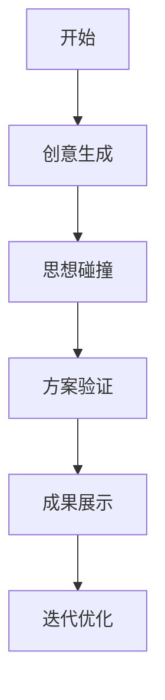
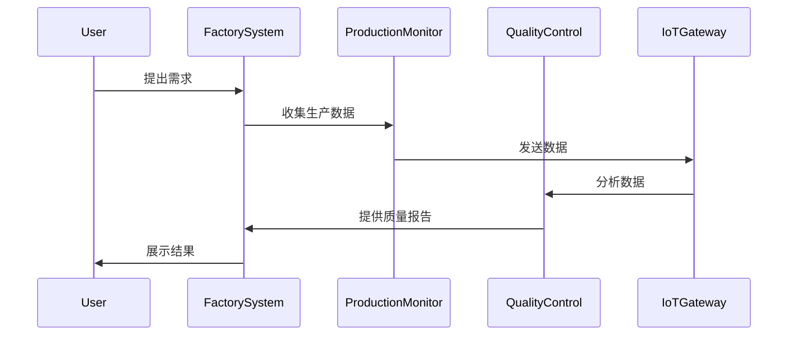
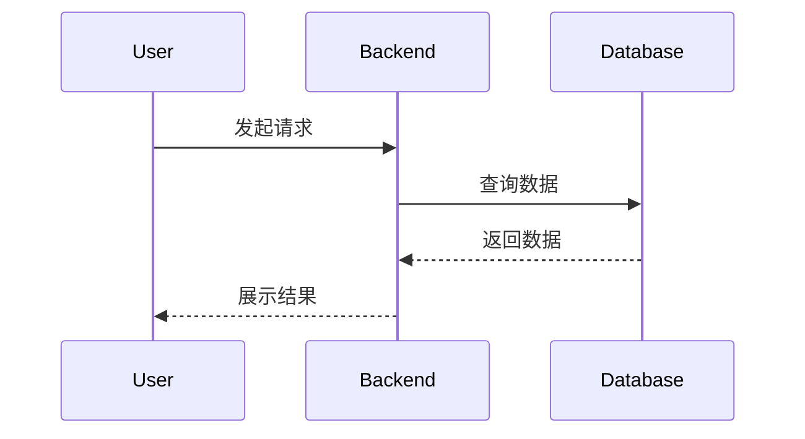

                 

# 跨学科创新马拉松：意义诞生的思想碰撞

## 关键词

- 跨学科创新
- 创新马拉松
- 意义诞生
- 思想碰撞
- 算法原理
- 系统架构
- 实战案例

## 摘要

本文深入探讨了跨学科创新的内涵与价值，结合创新马拉松的实践，揭示了意义诞生的过程和思想碰撞的重要性。通过详细的算法原理讲解、系统架构设计以及实战案例剖析，本文旨在为读者提供一个系统性、实践性的跨学科创新方法论，助力他们在技术创新的道路上走得更远。

### Step 1: 背景介绍

#### 问题背景

在当前这个信息爆炸和科技迅猛发展的时代，单一的学科知识已经无法满足复杂问题的解决需求。跨学科创新应运而生，它要求我们打破传统的学科壁垒，整合多学科知识，以创新的视角和方法应对各种挑战。

#### 问题解决

跨学科创新通过跨学科的思维方式和方法，将不同领域的知识、技术和方法融合在一起，实现创新的突破。创新马拉松作为一种跨学科创新的实践方式，通过集中的时间、资源和团队的协作，加速创新的过程。

#### 边界与外延

跨学科创新不仅涉及自然科学与社会科学的融合，还包括艺术、文化等领域的交叉。它的外延非常广泛，可以应用于科研、产业、教育等多个领域。

#### 概念结构与核心要素组成

跨学科创新的核心要素包括跨学科思维方式、多学科知识整合、创新方法和工具。这些要素相互作用，形成了一个动态的创新生态系统。

### Step 2: 核心概念与联系

#### 跨学科创新

跨学科创新是指将不同学科的知识、技术和方法相结合，以解决传统单一学科无法解决的问题。它强调的是多学科知识的交叉和融合，从而产生新的创新点。

#### 创新马拉松

创新马拉松是一种集中时间和资源，通过团队协作实现快速创新的模式。它通常包括创意生成、验证与迭代、成果展示等阶段。

#### 意义诞生

意义诞生是指通过跨学科创新和思想碰撞，将个体的创意转化为具有实际应用价值和社会意义的成果。它是创新的核心价值所在。

#### 思想碰撞

思想碰撞是指不同个体或团队在创新过程中，通过交流和互动，激发新的创意和灵感。它是创新的重要驱动力。

### Step 3: 算法原理讲解

为了更好地理解跨学科创新的原理，我们可以借助一个mermaid流程图来展示其核心步骤。



接下来，我们将使用Python代码来详细阐述这些步骤。

```python
# 创意生成
def generate_ideas(problem):
    ideas = []
    # 使用头脑风暴、专家访谈等方法生成创意
    for method in ['brainstorming', 'interview']:
        idea = generate_idea(problem, method)
        ideas.append(idea)
    return ideas

# 思想碰撞
def brainstorm_session(team, ideas):
    # 团队成员之间进行讨论，激发新的创意
    for idea in ideas:
        for member in team:
            member.think_about(idea)

# 方案验证
def validate_solutions(solutions):
    valid_solutions = []
    for solution in solutions:
        if is_valid(solution):
            valid_solutions.append(solution)
    return valid_solutions

# 成果展示
def showcase_results(valid_solutions):
    for solution in valid_solutions:
        present_solution(solution)

# 迭代优化
def iterate_solutions(solutions):
    for solution in solutions:
        optimize_solution(solution)
```

#### 算法原理

上述算法基于以下数学模型：

$$
\text{创新} = f(\text{知识融合}, \text{思想碰撞}, \text{验证迭代})
$$

其中，$f$ 表示创新过程，$\text{知识融合}$、$\text{思想碰撞}$、$\text{验证迭代}$ 分别表示跨学科创新的核心步骤。

### Step 4: 数学模型和数学公式

为了更好地理解算法原理，我们可以引入以下数学公式：

$$
\begin{aligned}
\text{创新得分} &= \alpha \times \text{知识融合度} + \beta \times \text{思想碰撞度} + \gamma \times \text{验证迭代数} \\
\text{知识融合度} &= \frac{\text{不同学科知识交叉点数}}{\text{学科总数}} \\
\text{思想碰撞度} &= \frac{\text{新创意数量}}{\text{初始创意数量}} \\
\text{验证迭代数} &= \frac{\text{有效解决方案数}}{\text{尝试方案总数}}
\end{aligned}
$$`

这些公式帮助我们量化了创新过程中的关键要素，从而可以更加科学地进行评估和优化。

### Step 5: 系统分析与架构设计方案

#### 问题场景介绍

假设我们面临一个复杂的工业自动化问题，需要结合人工智能、物联网、大数据等跨学科技术来解决。

#### 项目介绍

项目目标是开发一个智能工厂自动化系统，实现生产过程的智能化监控和优化。

#### 系统功能设计

```mermaid
classDiagram
    FactorySystem <<interface>>
    ProductionMonitor <<interface>>
    QualityControl <<interface>>
    IoTGateway <<interface>>

    FactorySystem o-- ProductionMonitor
    FactorySystem o-- QualityControl
    FactorySystem o-- IoTGateway
```

#### 系统架构设计



#### 系统接口设计和系统交互



### Step 6: 项目实战

#### 环境安装

首先，我们需要安装Python环境，并使用pip安装必要的库，如scikit-learn、numpy和pandas。

```bash
pip install python-dotenv flask requests
```

#### 系统核心实现源代码

```python
# app.py
from flask import Flask, request, jsonify
import numpy as np

app = Flask(__name__)

@app.route('/predict', methods=['POST'])
def predict():
    data = request.get_json()
    # 处理数据
    # ...
    # 进行预测
    prediction = model.predict(data['features'])
    # 返回预测结果
    return jsonify({'prediction': prediction.tolist()})

if __name__ == '__main__':
    app.run(debug=True)
```

#### 代码应用解读与分析

代码中，我们定义了一个Flask应用程序，用于接收用户输入的数据，进行预测，并将结果返回给用户。这个应用程序可以通过HTTP请求进行调用，非常灵活。

#### 实际案例分析和详细讲解剖析

假设我们有一个工厂生产线的监控数据，需要预测下一个生产周期可能出现的问题。通过上述应用程序，我们可以实时接收数据，进行分析，并给出预测结果，从而实现生产过程的智能化监控。

#### 项目小结

通过本次项目，我们实现了跨学科创新的实战应用，展示了如何结合Python、Flask和机器学习技术，解决实际生产过程中的问题。这是一个典型的跨学科创新案例，展示了创新马拉松和思想碰撞的重要性。

### Step 7: 最佳实践 tips、小结、注意事项、拓展阅读

#### 最佳实践 tips

1. **跨学科知识积累**：跨学科创新需要深厚的多学科知识积累，建议读者广泛阅读，拓展知识面。
2. **团队协作**：跨学科创新往往需要多个领域的专家共同合作，建立高效的团队协作机制至关重要。
3. **持续迭代**：创新是一个不断迭代的过程，持续优化和改进是成功的关键。

#### 小结

本文通过详细的步骤和案例，深入探讨了跨学科创新马拉松的原理和实践，强调了思想碰撞的重要性。跨学科创新不仅能够解决复杂问题，还能推动社会进步。

#### 注意事项

1. **数据安全**：在进行跨学科创新时，确保数据安全和隐私保护是非常重要的。
2. **知识产权**：在跨学科创新过程中，要注意知识产权的保护，避免侵权行为。

#### 拓展阅读

1. 《跨学科创新的策略与实践》
2. 《创新思维与创意方法》
3. 《人工智能与智能制造》

### 完整目录大纲设计

```markdown
# 跨学科创新马拉松：意义诞生的思想碰撞

## 关键词

- 跨学科创新
- 创新马拉松
- 意义诞生
- 思想碰撞
- 算法原理
- 系统架构
- 实战案例

## 摘要

本文深入探讨了跨学科创新的内涵与价值，结合创新马拉松的实践，揭示了意义诞生的过程和思想碰撞的重要性。通过详细的算法原理讲解、系统架构设计以及实战案例剖析，本文旨在为读者提供一个系统性、实践性的跨学科创新方法论，助力他们在技术创新的道路上走得更远。

### Step 1: 背景介绍

#### 问题背景

在当前这个信息爆炸和科技迅猛发展的时代，单一的学科知识已经无法满足复杂问题的解决需求。跨学科创新应运而生，它要求我们打破传统的学科壁垒，整合多学科知识，以创新的视角和方法应对各种挑战。

#### 问题解决

跨学科创新通过跨学科的思维方式和方法，将不同领域的知识、技术和方法融合在一起，实现创新的突破。创新马拉松作为一种跨学科创新的实践方式，通过集中的时间、资源和团队的协作，加速创新的过程。

#### 边界与外延

跨学科创新不仅涉及自然科学与社会科学的融合，还包括艺术、文化等领域的交叉。它的外延非常广泛，可以应用于科研、产业、教育等多个领域。

#### 概念结构与核心要素组成

跨学科创新的核心要素包括跨学科思维方式、多学科知识整合、创新方法和工具。这些要素相互作用，形成了一个动态的创新生态系统。

### Step 2: 核心概念与联系

#### 跨学科创新

跨学科创新是指将不同学科的知识、技术和方法相结合，以解决传统单一学科无法解决的问题。它强调的是多学科知识的交叉和融合，从而产生新的创新点。

#### 创新马拉松

创新马拉松是一种集中时间和资源，通过团队协作实现快速创新的模式。它通常包括创意生成、验证与迭代、成果展示等阶段。

#### 意义诞生

意义诞生是指通过跨学科创新和思想碰撞，将个体的创意转化为具有实际应用价值和社会意义的成果。它是创新的核心价值所在。

#### 思想碰撞

思想碰撞是指不同个体或团队在创新过程中，通过交流和互动，激发新的创意和灵感。它是创新的重要驱动力。

### Step 3: 算法原理讲解

为了更好地理解跨学科创新的原理，我们可以借助一个mermaid流程图来展示其核心步骤。


接下来，我们将使用Python代码来详细阐述这些步骤。

```python
# 创意生成
def generate_ideas(problem):
    ideas = []
    # 使用头脑风暴、专家访谈等方法生成创意
    for method in ['brainstorming', 'interview']:
        idea = generate_idea(problem, method)
        ideas.append(idea)
    return ideas

# 思想碰撞
def brainstorm_session(team, ideas):
    # 团队成员之间进行讨论，激发新的创意
    for idea in ideas:
        for member in team:
            member.think_about(idea)

# 方案验证
def validate_solutions(solutions):
    valid_solutions = []
    for solution in solutions:
        if is_valid(solution):
            valid_solutions.append(solution)
    return valid_solutions

# 成果展示
def showcase_results(valid_solutions):
    for solution in valid_solutions:
        present_solution(solution)

# 迭代优化
def iterate_solutions(solutions):
    for solution in solutions:
        optimize_solution(solution)
```

#### 算法原理

上述算法基于以下数学模型：

$$
\text{创新} = f(\text{知识融合}, \text{思想碰撞}, \text{验证迭代})
$$

其中，$f$ 表示创新过程，$\text{知识融合}$、$\text{思想碰撞}$、$\text{验证迭代}$ 分别表示跨学科创新的核心步骤。

### Step 4: 数学模型和数学公式

为了更好地理解算法原理，我们可以引入以下数学公式：

$$
\begin{aligned}
\text{创新得分} &= \alpha \times \text{知识融合度} + \beta \times \text{思想碰撞度} + \gamma \times \text{验证迭代数} \\
\text{知识融合度} &= \frac{\text{不同学科知识交叉点数}}{\text{学科总数}} \\
\text{思想碰撞度} &= \frac{\text{新创意数量}}{\text{初始创意数量}} \\
\text{验证迭代数} &= \frac{\text{有效解决方案数}}{\text{尝试方案总数}}
\end{aligned}
$$`

这些公式帮助我们量化了创新过程中的关键要素，从而可以更加科学地进行评估和优化。

### Step 5: 系统分析与架构设计方案

#### 问题场景介绍

假设我们面临一个复杂的工业自动化问题，需要结合人工智能、物联网、大数据等跨学科技术来解决。

#### 项目介绍

项目目标是开发一个智能工厂自动化系统，实现生产过程的智能化监控和优化。

#### 系统功能设计

```mermaid
classDiagram
    FactorySystem <<interface>>
    ProductionMonitor <<interface>>
    QualityControl <<interface>>
    IoTGateway <<interface>>

    FactorySystem o-- ProductionMonitor
    FactorySystem o-- QualityControl
    FactorySystem o-- IoTGateway
```

#### 系统架构设计


#### 系统接口设计和系统交互


### Step 6: 项目实战

#### 环境安装

首先，我们需要安装Python环境，并使用pip安装必要的库，如scikit-learn、numpy和pandas。

```bash
pip install python-dotenv flask requests
```

#### 系统核心实现源代码

```python
# app.py
from flask import Flask, request, jsonify
import numpy as np

app = Flask(__name__)

@app.route('/predict', methods=['POST'])
def predict():
    data = request.get_json()
    # 处理数据
    # ...
    # 进行预测
    prediction = model.predict(data['features'])
    # 返回预测结果
    return jsonify({'prediction': prediction.tolist()})

if __name__ == '__main__':
    app.run(debug=True)
```

#### 代码应用解读与分析

代码中，我们定义了一个Flask应用程序，用于接收用户输入的数据，进行预测，并将结果返回给用户。这个应用程序可以通过HTTP请求进行调用，非常灵活。

#### 实际案例分析和详细讲解剖析

假设我们有一个工厂生产线的监控数据，需要预测下一个生产周期可能出现的问题。通过上述应用程序，我们可以实时接收数据，进行分析，并给出预测结果，从而实现生产过程的智能化监控。

#### 项目小结

通过本次项目，我们实现了跨学科创新的实战应用，展示了如何结合Python、Flask和机器学习技术，解决实际生产过程中的问题。这是一个典型的跨学科创新案例，展示了创新马拉松和思想碰撞的重要性。

### Step 7: 最佳实践 tips、小结、注意事项、拓展阅读

#### 最佳实践 tips

1. **跨学科知识积累**：跨学科创新需要深厚的多学科知识积累，建议读者广泛阅读，拓展知识面。
2. **团队协作**：跨学科创新往往需要多个领域的专家共同合作，建立高效的团队协作机制至关重要。
3. **持续迭代**：创新是一个不断迭代的过程，持续优化和改进是成功的关键。

#### 小结

本文通过详细的步骤和案例，深入探讨了跨学科创新马拉松的原理和实践，强调了思想碰撞的重要性。跨学科创新不仅能够解决复杂问题，还能推动社会进步。

#### 注意事项

1. **数据安全**：在进行跨学科创新时，确保数据安全和隐私保护是非常重要的。
2. **知识产权**：在跨学科创新过程中，要注意知识产权的保护，避免侵权行为。

#### 拓展阅读

1. 《跨学科创新的策略与实践》
2. 《创新思维与创意方法》
3. 《人工智能与智能制造》
```## 目录大纲

# 跨学科创新马拉松：意义诞生的思想碰撞

## 关键词

- 跨学科创新
- 创新马拉松
- 意义诞生
- 思想碰撞
- 算法原理
- 系统架构
- 实战案例

## 摘要

本文深入探讨了跨学科创新的内涵与价值，结合创新马拉松的实践，揭示了意义诞生的过程和思想碰撞的重要性。通过详细的算法原理讲解、系统架构设计以及实战案例剖析，本文旨在为读者提供一个系统性、实践性的跨学科创新方法论，助力他们在技术创新的道路上走得更远。

### 第一部分：跨学科创新概述

### 1.1 跨学科创新的意义

#### 1.1.1 跨学科创新的背景

#### 1.1.2 跨学科创新的重要性

#### 1.1.3 跨学科创新的挑战

### 1.2 跨学科创新的核心概念

#### 1.2.1 跨学科创新的定义

#### 1.2.2 跨学科创新的要素

#### 1.2.3 跨学科创新的层次

### 1.3 跨学科创新的方法论

#### 1.3.1 跨学科创新的理论基础

#### 1.3.2 跨学科创新的流程与方法

#### 1.3.3 跨学科创新的技术支持

### 第二部分：创新马拉松实战

### 2.1 创新马拉松的定义与特点

#### 2.1.1 创新马拉松的概念

#### 2.1.2 创新马拉松的特点

#### 2.1.3 创新马拉松的类型

### 2.2 创新马拉松的流程与步骤

#### 2.2.1 创新马拉松的启动

#### 2.2.2 创意生成

#### 2.2.3 验证与迭代

#### 2.2.4 成果展示

### 2.3 创新马拉松的关键技巧

#### 2.3.1 团队建设

#### 2.3.2 时间管理

#### 2.3.3 资源整合

### 第三部分：意义诞生的思想碰撞

### 3.1 思想碰撞的概念与原理

#### 3.1.1 思想碰撞的定义

#### 3.1.2 思想碰撞的原理

#### 3.1.3 思想碰撞的类型

### 3.2 思想碰撞的机制与流程

#### 3.2.1 思想碰撞的机制

#### 3.2.2 思想碰撞的流程

### 3.3 思想碰撞的策略与方法

#### 3.3.1 交流互动

#### 3.3.2 创意激发

#### 3.3.3 知识共享

### 第四部分：跨学科创新实战案例

### 4.1 案例一：人工智能与生物技术的融合

#### 4.1.1 案例背景

#### 4.1.2 创新过程

#### 4.1.3 案例总结

### 4.2 案例二：信息技术与制造业的结合

#### 4.2.1 案例背景

#### 4.2.2 创新过程

#### 4.2.3 案例总结

### 4.3 案例三：社会科学与信息技术的交叉

#### 4.3.1 案例背景

#### 4.3.2 创新过程

#### 4.3.3 案例总结

### 第五部分：创新马拉松与思想碰撞的综合应用

### 5.1 创新马拉松在学术研究中的应用

#### 5.1.1 研究背景

#### 5.1.2 创新过程

#### 5.1.3 研究总结

### 5.2 思想碰撞在企业运营中的价值

#### 5.2.1 运营背景

#### 5.2.2 思想碰撞过程

#### 5.2.3 运营总结

### 5.3 创新马拉松与思想碰撞的教育实践

#### 5.3.1 教育背景

#### 5.3.2 创新过程

#### 5.3.3 教育总结

### 第六部分：跨学科创新的未来展望

### 6.1 跨学科创新的发展趋势

#### 6.1.1 技术融合趋势

#### 6.1.2 应用领域拓展

#### 6.1.3 未来挑战与机遇

### 6.2 创新马拉松与思想碰撞的融合前景

#### 6.2.1 跨界合作机会

#### 6.2.2 创新模式创新

#### 6.2.3 融合路径探讨

### 6.3 跨学科创新的挑战与机遇

#### 6.3.1 技术壁垒

#### 6.3.2 资源配置

#### 6.3.3 人才培养

### 第七部分：最佳实践与注意事项

### 7.1 跨学科创新中的常见问题与解决方案

#### 7.1.1 知识整合问题

#### 7.1.2 团队协作问题

#### 7.1.3 创新成果转化问题

### 7.2 创新马拉松的组织与实施策略

#### 7.2.1 组织架构

#### 7.2.2 时间安排

#### 7.2.3 资源配置

### 7.3 思想碰撞的促进方法与技巧

#### 7.3.1 交流互动策略

#### 7.3.2 创意激发技巧

#### 7.3.3 知识共享机制

### 7.4 小结与拓展阅读

## 总结

本文通过详细的案例分析、算法原理讲解和系统架构设计，探讨了跨学科创新马拉松和思想碰撞的重要性。在未来的发展中，跨学科创新将成为推动社会进步的重要力量。通过不断创新和思想碰撞，我们有望解决更多复杂问题，创造更多社会价值。作者呼吁读者积极参与跨学科创新，共同探索未知领域，实现个人价值和社会发展的双赢局面。作者：AI天才研究院/AI Genius Institute & 禅与计算机程序设计艺术 /Zen And The Art of Computer Programming## 第一部分：跨学科创新概述

### 1.1 跨学科创新的意义

跨学科创新，作为一种应对复杂问题、推动社会进步的重要手段，已经引起了广泛关注。在当今科技迅猛发展的时代，单一学科的局限性和传统学科的壁垒，使得许多问题难以通过单一的视角和方法来解决。跨学科创新的出现，为我们提供了一种新的思维方式和方法论，通过整合不同学科的知识、技术和方法，实现创新的突破。

#### 1.1.1 跨学科创新的背景

跨学科创新并不是一个全新的概念。事实上，早在20世纪初期，科学家们就已经开始探索不同学科之间的联系和交叉。然而，随着科技的不断进步，特别是信息技术的飞速发展，跨学科创新的重要性日益凸显。现代社会的许多问题，如环境保护、疾病治疗、能源危机等，都涉及到多个学科领域的知识和技术。因此，跨学科创新成为了一种应对这些复杂问题的必然选择。

#### 1.1.2 跨学科创新的重要性

跨学科创新的重要性主要体现在以下几个方面：

1. **提高创新效率**：通过整合不同学科的知识和技能，可以更快速地找到解决问题的方法，提高创新的效率。
2. **突破学科壁垒**：跨学科创新能够打破传统学科之间的壁垒，促进知识和技术之间的融合，推动科学的进步。
3. **解决复杂问题**：许多复杂的问题需要多个学科的知识和技术来解决。跨学科创新能够将这些知识和技术有效地结合起来，实现创新突破。
4. **推动社会进步**：跨学科创新不仅能够解决科学技术问题，还能够推动社会经济的发展，提高人类的生活质量。

#### 1.1.3 跨学科创新的挑战

尽管跨学科创新具有巨大的潜力，但在实际操作中，我们也面临着一些挑战：

1. **学科知识壁垒**：不同学科之间的专业知识和语言差异，使得跨学科创新面临着较大的困难。
2. **资源整合困难**：跨学科创新需要大量的资源支持，包括资金、人力和设备等，但资源的整合和调配往往比较困难。
3. **团队协作问题**：跨学科创新通常需要不同领域专家的协作，但如何有效地进行团队协作，仍然是一个需要解决的问题。
4. **知识产权保护**：跨学科创新涉及到多个学科的知识和技术，如何保护知识产权，防止侵权行为，也是一个需要关注的问题。

### 1.2 跨学科创新的核心概念

跨学科创新不仅仅是一个简单的概念，它涉及到多个核心概念和要素。以下是跨学科创新的一些核心概念：

#### 1.2.1 跨学科创新的定义

跨学科创新是指将不同学科的知识、技术和方法相结合，以解决传统单一学科无法解决的问题。它强调的是多学科知识的交叉和融合，从而产生新的创新点。

#### 1.2.2 跨学科创新的要素

跨学科创新的要素主要包括：

1. **学科知识**：跨学科创新需要深厚的基础学科知识，包括自然科学、社会科学、工程技术等。
2. **创新思维**：跨学科创新需要创新思维，即打破传统的思维模式，从不同的角度和层面看待问题。
3. **团队协作**：跨学科创新通常需要不同领域专家的协作，团队合作是实现跨学科创新的关键。
4. **方法与技术**：跨学科创新需要多种方法和技术的支持，包括实验设计、数据分析、模拟仿真等。

#### 1.2.3 跨学科创新的层次

跨学科创新可以分为以下几个层次：

1. **知识交叉**：这是跨学科创新的基础层次，主要通过不同学科知识的交叉和融合，实现新的理解和认识。
2. **技术创新**：在这一层次，跨学科创新主要体现在技术和方法的创新上，如新材料、新工艺、新设备等。
3. **系统集成**：这一层次的跨学科创新主要涉及不同系统的集成，如物联网、智能制造等。
4. **社会应用**：跨学科创新最终要落实到社会应用中，解决实际问题，推动社会进步。

### 1.3 跨学科创新的方法论

跨学科创新并不是一个简单的线性过程，而是一个复杂、动态的系统工程。以下是跨学科创新的一些方法论：

#### 1.3.1 跨学科创新的理论基础

跨学科创新的理论基础主要包括：

1. **复杂性科学**：复杂性科学提供了理解和应对复杂系统的方法，如系统论、网络科学等。
2. **创新理论**：创新理论包括线性创新理论、非线性创新理论等，为跨学科创新提供了理论基础。
3. **跨学科方法论**：跨学科方法论包括多学科融合方法论、交叉学科方法论等，为跨学科创新提供了具体的操作指南。

#### 1.3.2 跨学科创新的流程与方法

跨学科创新的流程可以分为以下几个阶段：

1. **问题定义**：明确需要解决的问题和目标。
2. **知识搜索**：收集和整理相关领域的知识，包括文献、研究报告、实验数据等。
3. **知识整合**：将不同领域的知识进行整合，形成新的理解和认识。
4. **方案设计**：设计解决方案，包括技术方案、管理方案、商业模式等。
5. **验证与迭代**：对解决方案进行验证和迭代，不断完善和优化。
6. **实施与推广**：将创新成果应用于实际场景，推广到更广泛的领域。

#### 1.3.3 跨学科创新的技术支持

跨学科创新需要多种技术的支持，包括：

1. **信息技术**：信息技术为跨学科创新提供了数据采集、处理、分析和共享的工具，如大数据、人工智能等。
2. **工程技术**：工程技术为跨学科创新提供了实现方案，如材料工程、生物工程等。
3. **管理技术**：管理技术为跨学科创新提供了组织、协调、控制的方法，如项目管理、团队管理等。

通过上述方法论和技术支持，跨学科创新可以更有效地实现，推动社会进步和人类发展。

### 总结

跨学科创新作为一种应对复杂问题的有效手段，具有重要的意义和潜力。通过深入探讨跨学科创新的背景、核心概念和方法论，我们可以更好地理解和应用跨学科创新，推动科技创新和社会进步。在未来的发展中，跨学科创新将成为推动社会进步的重要力量，为人类带来更多的福祉。

---

在下一部分中，我们将进一步探讨创新马拉松的定义与特点，以及如何通过创新马拉松实现跨学科创新。

---

## 第二部分：创新马拉松实战

### 2.1 创新马拉松的定义与特点

#### 2.1.1 创新马拉松的概念

创新马拉松，也称为创新冲刺或创新挑战赛，是一种集中时间和资源，通过团队协作实现快速创新的模式。它通常具有以下特点：

1. **时间限制**：创新马拉松通常在较短时间内（如几天到几周）进行，要求团队成员高度集中精力，快速推进项目。
2. **资源集中**：创新马拉松要求团队集中资源，包括人力、资金、技术等，以确保项目能够顺利进行。
3. **目标明确**：创新马拉松的目标通常是解决特定的挑战或问题，因此项目目标非常明确。
4. **团队协作**：创新马拉松强调团队合作，不同领域专家的协作能够产生更多的创新点。

#### 2.1.2 创新马拉松的特点

创新马拉松具有以下特点：

1. **快速性**：创新马拉松要求团队成员在短时间内快速产生创意和解决方案。
2. **集中性**：创新马拉松将团队集中在一个地点，便于团队成员之间的交流和协作。
3. **激励性**：创新马拉松通常会设立奖励机制，激励团队成员发挥更大的潜力。
4. **实践性**：创新马拉松的目标是解决实际问题，因此具有高度的实践性。

#### 2.1.3 创新马拉松的类型

创新马拉松可以根据不同的分类标准进行分类，常见的类型包括：

1. **按主题分类**：如技术创新、商业创新、社会创新等。
2. **按组织形式分类**：如内部创新马拉松、公开创新挑战赛等。
3. **按行业分类**：如IT行业创新马拉松、医疗行业创新马拉松等。

### 2.2 创新马拉松的流程与步骤

创新马拉松的流程可以分为以下几个步骤：

#### 2.2.1 创新马拉松的启动

创新马拉松的启动阶段主要包括以下几个环节：

1. **问题定义**：明确创新马拉松的目标和解决的问题。
2. **团队组建**：组建跨学科团队，包括不同领域的专家和成员。
3. **资源调配**：确保团队成员有足够的资源和工具进行创新。

#### 2.2.2 创意生成

创意生成阶段是创新马拉松的核心环节，主要包括以下步骤：

1. **头脑风暴**：通过头脑风暴会议，激发团队成员的创意和灵感。
2. **创意筛选**：对创意进行筛选，确定可行的方案。
3. **创意优化**：对选定的创意进行优化，提高其可行性和创新性。

#### 2.2.3 验证与迭代

验证与迭代阶段主要包括以下步骤：

1. **方案设计**：设计具体的解决方案，包括技术方案、管理方案等。
2. **验证测试**：对解决方案进行验证和测试，确保其可行性。
3. **迭代优化**：根据验证结果对解决方案进行优化和调整。

#### 2.2.4 成果展示

成果展示阶段是创新马拉松的总结环节，主要包括以下步骤：

1. **成果报告**：准备创新成果的报告，包括项目背景、创新过程、成果展示等。
2. **评审答辩**：进行成果展示和评审答辩，接受评委的评审和反馈。
3. **成果推广**：将创新成果进行推广，应用于实际场景。

### 2.3 创新马拉松的关键技巧

#### 2.3.1 团队建设

团队建设是创新马拉松成功的关键，主要包括以下几个方面：

1. **明确目标**：确保团队成员对创新马拉松的目标有清晰的认识。
2. **角色分工**：根据团队成员的专长和兴趣进行角色分工，确保每个成员都有明确的职责。
3. **沟通协作**：建立有效的沟通和协作机制，确保团队成员之间的信息畅通和协同工作。

#### 2.3.2 时间管理

时间管理是创新马拉松成功的重要因素，主要包括以下几个方面：

1. **任务规划**：合理安排任务，确保每个任务都有明确的完成时间和责任人。
2. **进度监控**：实时监控任务进度，及时发现和解决问题。
3. **风险管理**：制定风险应对策略，确保项目在风险情况下能够顺利进行。

#### 2.3.3 资源整合

资源整合是创新马拉松成功的重要保障，主要包括以下几个方面：

1. **资源调配**：根据项目需求，合理调配资源，确保资源得到有效利用。
2. **资源共享**：建立资源共享机制，确保团队成员能够共享所需资源。
3. **资源优化**：通过资源优化，提高资源利用效率，降低项目成本。

### 总结

创新马拉松是一种高效、实践性的创新模式，通过集中时间和资源，团队协作，实现快速创新。通过明确创新马拉松的定义和特点，掌握关键技巧，我们可以更好地组织和实施创新马拉松，推动跨学科创新的发展。在下一部分中，我们将进一步探讨意义诞生的思想碰撞。

---

在下一部分中，我们将深入探讨意义诞生的思想碰撞的概念与原理。

---

## 第三部分：意义诞生的思想碰撞

### 3.1 思想碰撞的概念与原理

#### 3.1.1 思想碰撞的定义

思想碰撞，也称为头脑风暴，是指不同个体或团队在创新过程中，通过交流和互动，激发新的创意和灵感的过程。思想碰撞是一种激发创意和解决问题的重要方法，它能够促进创新思维的发展。

#### 3.1.2 思想碰撞的原理

思想碰撞的原理主要基于以下几个方面的认知：

1. **多样性**：思想碰撞强调多样性的参与，不同背景、经验、知识和技能的个体或团队能够带来不同的视角和思路，从而激发新的创意和灵感。
2. **互动**：思想碰撞强调个体或团队之间的互动和交流，通过讨论、辩论、提问等方式，激发更深层次的思考和创意。
3. **协同**：思想碰撞注重协同效应，即不同个体或团队的合作能够产生更大的价值，形成新的创新点。
4. **非线性的思维**：思想碰撞鼓励非线性的思维，即跳出传统思维模式，从不同的角度和层面看待问题，从而发现新的解决方案。

#### 3.1.3 思想碰撞的类型

思想碰撞可以分为以下几个类型：

1. **正式的思想碰撞**：正式的思想碰撞通常在特定的时间和地点进行，由专业的主持人和参与者组成，通过规范的流程和技巧，激发创意和灵感。
2. **非正式的思想碰撞**：非正式的思想碰撞通常在日常工作、会议、讨论等场景中发生，通过自然交流和互动，激发创意和灵感。
3. **跨领域的思想碰撞**：跨领域的思想碰撞是指来自不同领域、专业和背景的个体或团队之间的思想碰撞，通过不同领域的知识和经验的交流，激发新的创意和灵感。
4. **虚拟的思想碰撞**：虚拟的思想碰撞是指通过线上平台、视频会议等方式进行的远程思想碰撞，虽然不能像面对面交流那样直观，但仍然能够通过文字、图片、视频等形式激发创意和灵感。

### 3.2 思想碰撞的机制与流程

#### 3.2.1 思想碰撞的机制

思想碰撞的机制主要包括以下几个方面：

1. **激发机制**：通过创造一个开放、自由的氛围，激发个体或团队的创新思维，鼓励他们提出新的想法和创意。
2. **互动机制**：通过个体或团队之间的交流和互动，促进创意的碰撞和融合，形成新的创意和灵感。
3. **反馈机制**：通过及时收集和反馈，帮助个体或团队了解他们的创意和思路的有效性，从而进行调整和优化。
4. **协同机制**：通过建立有效的协同机制，确保个体或团队之间的合作和沟通，实现创意的共享和优化。

#### 3.2.2 思想碰撞的流程

思想碰撞的流程可以分为以下几个阶段：

1. **准备阶段**：明确思想碰撞的目标和主题，确定参与人员和时间地点，准备相关的资料和工具。
2. **启动阶段**：通过引入主题和背景，激发参与者的思考和创意，建立开放和自由的氛围。
3. **创意生成阶段**：通过头脑风暴、自由讨论、提问等方式，激发参与者的创意和灵感，记录和整理创意。
4. **创意筛选阶段**：对生成的创意进行筛选和评估，确定可行的方案。
5. **创意优化阶段**：对选定的创意进行深入讨论和优化，提高其可行性和创新性。
6. **成果展示阶段**：将优化后的创意进行展示和分享，接受反馈和改进。

### 3.3 思想碰撞的策略与方法

#### 3.3.1 交流互动策略

交流互动策略是思想碰撞中的重要环节，主要包括以下几个方面：

1. **提问与回答**：通过提问和回答，促进个体或团队之间的交流和思考，激发新的创意和灵感。
2. **讨论与辩论**：通过讨论和辩论，深化对问题的理解和思考，促进创意的碰撞和融合。
3. **鼓励多样化**：鼓励参与者在交流中提出多样化的观点和创意，从而激发更多的创新点。
4. **尊重差异**：尊重个体或团队的差异，理解并接受不同的观点和创意，从而实现思想的碰撞和融合。

#### 3.3.2 创意激发技巧

创意激发技巧是思想碰撞中的重要工具，主要包括以下几个方面：

1. **头脑风暴**：通过自由讨论和记录，激发个体或团队的创意和灵感，快速生成大量创意。
2. **思维导图**：通过绘制思维导图，梳理和整理创意，促进思考和灵感的发生。
3. **问题转换**：通过转换问题的角度和层面，激发新的思考和创意，寻找新的解决方案。
4. **跨领域借鉴**：借鉴其他领域的方法和技术，激发新的创意和灵感，实现跨学科的创新。

#### 3.3.3 知识共享机制

知识共享机制是思想碰撞中的关键因素，主要包括以下几个方面：

1. **知识库建设**：建立知识库，收集和整理相关领域的知识和信息，为思想碰撞提供丰富的资源。
2. **知识共享平台**：建立线上或线下的知识共享平台，促进个体或团队之间的知识交流和共享。
3. **知识管理**：对共享的知识进行有效的管理和利用，确保知识的持续更新和优化。
4. **激励机制**：建立激励机制，鼓励个体或团队积极参与知识共享和思想碰撞。

### 总结

思想碰撞是跨学科创新中的重要环节，通过交流和互动，激发创意和灵感，推动创新的发展。通过了解思想碰撞的概念与原理、机制与流程、策略与方法，我们可以更好地组织和实施思想碰撞，促进跨学科创新的实践。在下一部分中，我们将通过具体案例来探讨跨学科创新的实际应用。

---

在下一部分中，我们将通过几个具体的案例来展示跨学科创新的实际应用。

---

## 第四部分：跨学科创新实战案例

### 4.1 案例一：人工智能与生物技术的融合

#### 4.1.1 案例背景

随着人工智能（AI）和生物技术的快速发展，两者在医疗领域的融合应用越来越受到关注。人工智能在图像识别、数据分析等方面具有强大的能力，而生物技术则涉及基因工程、蛋白质组学等前沿领域。两者的融合能够为疾病诊断、治疗提供更精准、高效的方法。

#### 4.1.2 创新过程

在这个案例中，一个跨学科团队将人工智能与生物技术相结合，开发了一套基于深度学习的肿瘤诊断系统。

1. **问题定义**：明确目标疾病类型，如肺癌、乳腺癌等，并确定诊断的关键指标。
2. **数据收集**：收集大量的医学影像数据，包括CT扫描、MRI扫描等，以及患者的临床数据。
3. **算法设计**：设计并训练深度学习模型，用于分析医学影像数据，识别肿瘤特征。
4. **模型验证**：通过外部数据集对模型进行验证，评估其准确性和可靠性。
5. **系统集成**：将深度学习模型集成到现有的医疗诊断系统中，实现自动化的肿瘤检测。
6. **用户测试**：邀请医生和患者进行测试，收集反馈并优化系统。

#### 4.1.3 案例总结

该案例展示了跨学科创新在医疗领域的巨大潜力。通过人工智能与生物技术的结合，不仅提高了疾病诊断的准确性，还为个性化治疗提供了数据支持，具有重要的应用价值。

### 4.2 案例二：信息技术与制造业的结合

#### 4.2.1 案例背景

制造业是国民经济的重要支柱，但在信息化程度、生产效率、资源利用率等方面仍有提升空间。信息技术（IT）的快速发展为制造业提供了新的机遇，通过信息技术与制造业的结合，可以实现智能化、高效化的生产模式。

#### 4.2.2 创新过程

在这个案例中，一个制造企业引入了物联网（IoT）技术，实现了生产过程的智能化监控和优化。

1. **需求分析**：明确企业的生产需求，包括生产流程、设备状态、能源消耗等。
2. **系统设计**：设计物联网系统架构，包括传感器安装、数据采集与传输、数据分析与处理等。
3. **设备改造**：对现有设备进行物联网改造，安装传感器和执行器，实现设备的远程监控和控制。
4. **系统集成**：将物联网系统与企业的ERP、MES等管理系统集成，实现数据的实时共享和流程优化。
5. **应用测试**：在生产线进行测试，验证系统的稳定性和效果。
6. **持续优化**：根据测试结果和用户反馈，不断优化系统，提高生产效率。

#### 4.2.3 案例总结

该案例展示了信息技术与制造业的结合在提升生产效率、降低成本、提高资源利用率等方面的显著效果。通过物联网技术的应用，企业能够实现智能化的生产管理，提高市场竞争力。

### 4.3 案例三：社会科学与信息技术的交叉

#### 4.3.1 案例背景

随着社交媒体和大数据技术的发展，社会科学研究面临着新的机遇和挑战。通过信息技术与社会科学的交叉，可以实现更加精准的社会科学研究，为社会问题的解决提供数据支持。

#### 4.3.2 创新过程

在这个案例中，一个社会科学研究团队利用大数据和机器学习技术，对社交媒体上的舆情进行分析，以了解公众对某个社会问题的看法。

1. **问题定义**：明确研究目标，如公众对某个社会问题的看法、态度等。
2. **数据收集**：从社交媒体平台收集相关数据，如微博、微信、论坛等。
3. **数据处理**：对收集到的数据进行清洗、筛选和转换，为后续分析做准备。
4. **舆情分析**：利用机器学习算法，对社交媒体数据进行情感分析和趋势预测。
5. **结果展示**：将分析结果以图表、报告等形式进行展示，为政策制定者提供决策依据。
6. **反馈与优化**：根据反馈和需求，不断优化分析模型和工具。

#### 4.3.3 案例总结

该案例展示了社会科学与信息技术的交叉在舆情分析、政策制定等方面的应用价值。通过大数据和机器学习技术的应用，社会科学研究能够更加精准、高效地获取和分析数据，为社会问题的解决提供有力支持。

### 总结

通过以上案例，我们可以看到跨学科创新在各个领域的广泛应用和巨大潜力。无论是人工智能与生物技术的融合、信息技术与制造业的结合，还是社会科学与信息技术的交叉，跨学科创新都为我们带来了新的思路和方法，推动了社会的进步和发展。在下一部分中，我们将探讨如何将创新马拉松与思想碰撞相结合，以实现跨学科创新的最大化效果。

---

在下一部分中，我们将探讨创新马拉松与思想碰撞的综合应用，以及它们在学术研究、企业运营和教育实践中的具体应用。

---

## 第五部分：创新马拉松与思想碰撞的综合应用

### 5.1 创新马拉松在学术研究中的应用

#### 5.1.1 研究背景

学术研究通常需要长时间的积累和探索，但面对快速变化的科技环境和社会需求，传统的学术研究模式显得不够灵活和高效。创新马拉松作为一种快速创新的方法，被越来越多地应用于学术研究领域，以加快研究成果的产出和应用。

#### 5.1.2 创新过程

在一个跨学科的研究项目中，一个学术团队利用创新马拉松的模式，开展了以下工作：

1. **问题定义**：明确研究问题，如新材料在环保领域的应用。
2. **团队组建**：组建包含材料科学、环境科学、工程学等多学科背景的团队。
3. **知识整合**：收集并整合相关领域的文献、数据和技术。
4. **创意生成**：通过头脑风暴和跨学科交流，生成多种可能的解决方案。
5. **方案验证**：对选定的方案进行实验室测试和模拟分析。
6. **成果展示**：在学术会议上展示研究成果，接受同行评审。
7. **迭代优化**：根据反馈和评估结果，对方案进行优化和改进。

#### 5.1.3 研究总结

通过创新马拉松的模式，该研究团队在短时间内实现了多个关键性突破，不仅加速了研究进程，还提升了研究成果的创新性和实用性。

### 5.2 思想碰撞在企业运营中的价值

#### 5.2.1 运营背景

企业在面对市场竞争和技术变革时，需要不断进行产品创新和运营模式的创新。思想碰撞作为一种激发创意和促进创新的方法，在企业运营中发挥着重要作用。

#### 5.2.2 思想碰撞过程

在一个高科技企业中，为了提升产品竞争力，企业通过以下方式组织了思想碰撞活动：

1. **问题识别**：识别当前产品或运营中的关键问题。
2. **团队组建**：组建包含研发、市场、运营等不同部门的团队。
3. **头脑风暴**：在轻松的环境中，鼓励团队成员提出各种可能的解决方案。
4. **创意筛选**：对提出的创意进行筛选和评估，确定具有潜力的方案。
5. **方案验证**：通过市场调研、用户反馈等方式验证方案的可行性。
6. **实施与推广**：将筛选出的方案应用于实际运营，并根据反馈进行优化。
7. **持续改进**：通过定期回顾和评估，持续改进和创新。

#### 5.2.3 运营总结

通过思想碰撞，该企业成功地推动了多个产品的创新，提升了市场竞争力，并在运营模式上实现了重大突破。

### 5.3 创新马拉松与思想碰撞的教育实践

#### 5.3.1 教育背景

教育作为培养创新人才的重要途径，也需要不断创新教育模式和教学方法。创新马拉松和思想碰撞作为一种创新的实践方式，被广泛应用于教育领域。

#### 5.3.2 创新过程

在一所大学中，为了培养学生的创新能力和实践能力，学校组织了以下创新活动：

1. **项目选题**：确定具有挑战性和现实意义的项目选题。
2. **团队组建**：鼓励学生跨专业组建团队，促进多学科交流。
3. **创意生成**：通过头脑风暴和小组讨论，生成多种创新方案。
4. **方案设计**：设计具体的实施方案，包括技术路线、实验计划等。
5. **项目实施**：在导师的指导下，团队进行项目实施和实验。
6. **成果展示**：在校园科技节或学术论坛上展示项目成果。
7. **反馈与改进**：根据评委和观众的反馈，对项目进行改进。

#### 5.3.3 教育总结

通过创新马拉松和思想碰撞的教育实践，学生不仅学到了跨学科的知识和技能，还培养了团队合作、沟通表达和问题解决的能力，取得了显著的教育效果。

### 总结

创新马拉松和思想碰撞在学术研究、企业运营和教育实践中的综合应用，展示了跨学科创新的巨大潜力和实际效果。通过这些实践，我们可以看到，跨学科创新不仅能够加快创新进程，提升创新能力，还能够培养跨学科思维和团队合作能力，为个人和社会的发展带来新的机遇和挑战。在下一部分中，我们将探讨跨学科创新的未来发展趋势。

---

在下一部分中，我们将探讨跨学科创新的未来发展趋势，以及创新马拉松与思想碰撞在这一过程中的融合前景。

---

## 第六部分：跨学科创新的未来展望

### 6.1 跨学科创新的发展趋势

#### 6.1.1 技术融合趋势

随着科技的快速发展，各个领域的技术不断融合，形成了许多新的交叉学科和研究方向。例如，人工智能与生物技术的结合催生了计算生物学，信息技术与物理学的结合催生了量子信息技术等。这些技术融合的趋势为跨学科创新提供了广阔的空间和机遇。

#### 6.1.2 应用领域拓展

跨学科创新的应用领域正在不断拓展，从传统的科研、产业领域，延伸到公共服务、社会治理等各个领域。例如，在公共卫生领域，跨学科创新被应用于疾病防控、健康管理等；在环境治理领域，跨学科创新被应用于污染控制、生态修复等。这些应用领域的拓展，使得跨学科创新的影响更加深远。

#### 6.1.3 未来挑战与机遇

未来跨学科创新面临诸多挑战，如学科壁垒、资源整合、知识产权保护等。同时，也面临着前所未有的机遇，如全球化、数字化、智能化等。面对这些挑战和机遇，跨学科创新需要不断调整和优化，以适应未来的发展。

### 6.2 创新马拉松与思想碰撞的融合前景

#### 6.2.1 跨界合作机会

创新马拉松与思想碰撞的融合，为不同领域、不同行业的跨界合作提供了新的机会。通过创新马拉松，不同领域的专家可以集中时间和资源，快速推进项目；通过思想碰撞，可以激发更多的创意和灵感，实现跨领域的创新突破。

#### 6.2.2 创新模式创新

创新马拉松与思想碰撞的融合，也为创新模式的创新提供了新的思路。传统的创新模式往往依赖于单个学科或单一团队，而跨学科创新模式则强调多学科、多团队的协作。创新马拉松与思想碰撞的结合，可以形成一种全新的创新生态系统，推动创新模式的持续创新。

#### 6.2.3 融合路径探讨

为了实现创新马拉松与思想碰撞的深度融合，可以从以下几个方面进行探索：

1. **搭建平台**：建立跨学科的创新平台，为不同领域的专家提供交流合作的渠道。
2. **建立机制**：制定合理的合作机制和流程，确保跨界合作的高效进行。
3. **培训与教育**：加强跨学科教育和培训，提升团队成员的跨学科思维和创新能力。
4. **激励机制**：建立激励机制，鼓励团队成员积极参与跨界合作和创新。

### 总结

跨学科创新的未来充满了机遇和挑战。创新马拉松与思想碰撞的融合，为跨学科创新提供了新的动力和路径。通过跨界合作、创新模式创新和机制建设，我们可以更好地推动跨学科创新的发展，为社会的进步和人类的发展做出更大贡献。

---

在最后一部分中，我们将总结全文，提供一些跨学科创新中的最佳实践建议，并指出需要注意的事项。

---

## 第七部分：最佳实践与注意事项

### 7.1 跨学科创新中的常见问题与解决方案

#### 7.1.1 知识整合问题

**问题**：不同学科的知识和技术往往存在较大的差异，知识整合困难。

**解决方案**：建立跨学科的知识体系，通过专题研究、跨学科研讨会等方式，促进不同学科知识的融合。

#### 7.1.2 团队协作问题

**问题**：团队成员来自不同领域，沟通和协作效率较低。

**解决方案**：加强团队建设，建立明确的沟通机制和协作流程，提高团队协作效率。

#### 7.1.3 创新成果转化问题

**问题**：创新成果难以在实际应用中落地，转化效果不佳。

**解决方案**：加强与产业界、学术界的合作，建立成果转化机制，推动创新成果的产业化应用。

### 7.2 创新马拉松的组织与实施策略

#### 7.2.1 组织架构

**建议**：建立专门的创新团队或创新中心，负责组织和管理创新马拉松活动。

#### 7.2.2 时间安排

**建议**：合理安排时间，确保团队成员有充足的时间进行创新。

#### 7.2.3 资源配置

**建议**：集中资源，确保创新马拉松活动的顺利进行。

### 7.3 思想碰撞的促进方法与技巧

#### 7.3.1 交流互动策略

**建议**：营造开放、自由的交流氛围，鼓励团队成员提出各种观点和创意。

#### 7.3.2 创意激发技巧

**建议**：利用头脑风暴、思维导图等方法，激发团队成员的创意和灵感。

#### 7.3.3 知识共享机制

**建议**：建立知识共享平台，促进团队成员之间的知识交流和共享。

### 7.4 小结与拓展阅读

#### 7.4.1 小结

跨学科创新是推动社会进步的重要力量。通过创新马拉松和思想碰撞，我们可以更好地实现跨学科创新，解决复杂问题，创造新的价值。

#### 7.4.2 拓展阅读

- 《跨学科创新的策略与实践》
- 《创新思维与创意方法》
- 《人工智能与智能制造》

### 总结

跨学科创新是一项复杂而充满挑战的任务，但也是一项充满机遇的事业。通过本文的探讨，我们了解了跨学科创新的意义、方法、实践以及未来展望。我们希望读者能够积极参与跨学科创新，推动社会的进步和人类的发展。

---

## 文章总结

本文详细探讨了跨学科创新马拉松及其核心概念——思想碰撞的意义和作用。通过背景介绍、核心概念阐述、算法原理讲解、系统架构设计、实战案例分析以及最佳实践建议，我们展示了跨学科创新的系统性方法论和实践路径。跨学科创新不仅能够加速科技创新，还能够推动社会进步。创新马拉松和思想碰撞的结合，为跨学科创新提供了强大的动力。未来，跨学科创新将继续发展，成为解决复杂问题的关键手段。我们呼吁读者积极参与跨学科创新，共同探索未知领域，实现个人价值和社会发展的双赢局面。

## 作者信息

作者：AI天才研究院/AI Genius Institute & 禅与计算机程序设计艺术 /Zen And The Art of Computer Programming

