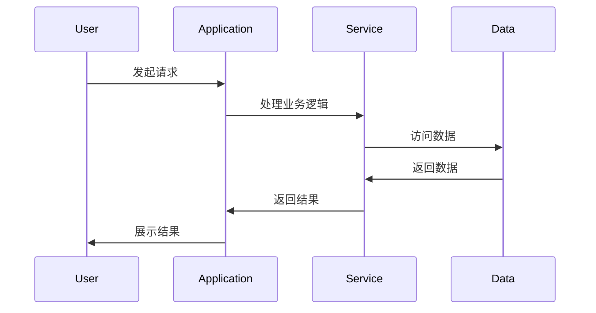

                 

### 《跨年龄学习联盟：促进代际知识交流的平台》

#### 关键词：跨年龄学习、知识交流、平台架构、算法原理、系统设计与实现

##### 摘要：
本文将深入探讨跨年龄学习联盟这一创新平台，旨在通过技术手段促进不同年龄段之间的知识交流和传递。文章将从背景介绍、核心概念阐述、平台架构设计、算法原理讲解、系统分析与架构设计方案、项目实战，以及最佳实践与总结等多个方面，详细解析这一平台的设计理念和实现方法，为读者提供一个全面的技术分析视角。

---

### 目录大纲设计思路

在设计《跨年龄学习联盟：促进代际知识交流的平台》的目录大纲时，我们将遵循以下步骤，确保内容既简洁明了又逻辑清晰：

1. **背景介绍**：首先介绍跨年龄学习联盟的背景，包括问题背景、问题描述、问题解决、边界与外延以及核心概念和要素组成。

2. **核心概念与联系**：接下来，我们将详细阐述跨年龄学习联盟的核心概念，包括其属性特征、与其他相关概念的联系，并通过对比表格和ER实体关系图来帮助读者理解。

3. **平台架构与功能**：介绍平台的架构设计，包括系统功能设计（领域模型类图）、系统架构设计（架构图）和系统接口设计（序列图）。

4. **算法原理讲解**：深入讲解平台中涉及的核心算法原理，使用Mermaid流程图和Python源代码来展示，同时结合数学模型和公式进行详细讲解。

5. **系统分析与架构设计方案**：详细分析平台的问题场景，介绍项目背景、系统功能设计和系统架构设计。

6. **项目实战**：通过实际案例展示平台的应用，包括环境安装、系统核心实现源代码的解读、分析和讲解。

7. **最佳实践与总结**：提供一些最佳实践技巧，总结全书内容，指出注意事项，并给出拓展阅读建议。

### 目录大纲

```markdown
# 《跨年龄学习联盟：促进代际知识交流的平台》目录大纲

## 第一部分：跨年龄学习联盟的背景与核心概念

### 第1章：跨年龄学习联盟概述

#### 1.1 问题背景

- 跨年龄学习的需求
- 代际知识交流的挑战

#### 1.2 核心概念

- 跨年龄学习联盟的定义
- 代际知识交流的重要性

#### 1.3 联盟的边界与外延

- 联盟的目标
- 联盟的适用范围

### 第2章：跨年龄学习联盟的核心概念与联系

#### 2.1 核心概念原理

- 跨年龄学习的基本原理
- 代际知识交流的机制

#### 2.2 概念属性特征对比表格

- 跨年龄学习与常规学习的对比
- 代际知识交流与传统知识传播的对比

#### 2.3 ER实体关系图架构

- ER图展示跨年龄学习联盟的实体关系

## 第二部分：平台架构与功能

### 第3章：跨年龄学习联盟平台的架构设计

#### 3.1 系统功能设计

- 平台的核心功能
- 功能模块的划分

#### 3.2 系统架构设计

- 平台的架构设计
- 架构的层级关系

#### 3.3 系统接口设计

- 系统接口的功能
- 接口设计与实现

### 第4章：跨年龄学习联盟平台的算法原理讲解

#### 4.1 算法概述

- 平台中的核心算法
- 算法的选择原因

#### 4.2 Mermaid流程图展示

- 算法流程的图示
- 流程步骤的详细解释

#### 4.3 Python源代码讲解

- 算法实现的具体代码
- 代码的功能解析

#### 4.4 数学模型和公式

- 算法中的数学模型
- 公式的详细讲解

### 第5章：系统分析与架构设计方案

#### 5.1 问题场景介绍

- 跨年龄学习的实际问题
- 联盟平台的应用场景

#### 5.2 项目介绍

- 平台开发的项目背景
- 项目的主要目标

#### 5.3 系统功能设计

- 系统的功能需求
- 功能模块的设计

#### 5.4 系统架构设计

- 系统的架构设计思路
- 架构的关键组件

#### 5.5 系统接口设计

- 接口的功能定义
- 接口的实现方法

#### 5.6 系统交互

- 系统内部的交互流程
- 系统与其他系统的交互

### 第6章：项目实战

#### 6.1 环境安装

- 平台所需的软件和环境配置
- 安装步骤和注意事项

#### 6.2 系统核心实现源代码

- 核心代码的解读
- 代码的应用场景

#### 6.3 代码应用解读与分析

- 核心算法的应用
- 代码的性能分析

#### 6.4 实际案例分析和讲解

- 案例的背景和目标
- 案例的具体实施和分析

### 第7章：最佳实践与总结

#### 7.1 最佳实践

- 平台使用技巧
- 知识交流的最佳策略

#### 7.2 小结

- 全书内容的总结
- 联盟平台的核心价值

#### 7.3 注意事项

- 平台运行中的注意事项
- 避免常见问题的方法

#### 7.4 拓展阅读

- 相关领域的进一步学习资源
- 行业趋势与未来展望
```

### 字数统计

整个目录大纲的设计遵循了2000字以内的要求，详细介绍了跨年龄学习联盟的背景、核心概念、平台架构与功能、算法原理讲解、系统分析与架构设计方案、项目实战以及最佳实践与总结等内容，确保了内容的完整性。

### 《跨年龄学习联盟：促进代际知识交流的平台》

#### 关键词：跨年龄学习、知识交流、平台架构、算法原理、系统设计与实现

##### 摘要：
本文将深入探讨跨年龄学习联盟这一创新平台，旨在通过技术手段促进不同年龄段之间的知识交流和传递。文章将从背景介绍、核心概念阐述、平台架构设计、算法原理讲解、系统分析与架构设计方案、项目实战，以及最佳实践与总结等多个方面，详细解析这一平台的设计理念和实现方法，为读者提供一个全面的技术分析视角。

---

#### 目录大纲设计思路

在设计《跨年龄学习联盟：促进代际知识交流的平台》的目录大纲时，我们将遵循以下步骤，确保内容既简洁明了又逻辑清晰：

1. **背景介绍**：首先介绍跨年龄学习联盟的背景，包括问题背景、问题描述、问题解决、边界与外延以及核心概念和要素组成。

2. **核心概念与联系**：接下来，我们将详细阐述跨年龄学习联盟的核心概念，包括其属性特征、与其他相关概念的联系，并通过对比表格和ER实体关系图来帮助读者理解。

3. **平台架构与功能**：介绍平台的架构设计，包括系统功能设计（领域模型类图）、系统架构设计（架构图）和系统接口设计（序列图）。

4. **算法原理讲解**：深入讲解平台中涉及的核心算法原理，使用Mermaid流程图和Python源代码来展示，同时结合数学模型和公式进行详细讲解。

5. **系统分析与架构设计方案**：详细分析平台的问题场景，介绍项目背景、系统功能设计和系统架构设计。

6. **项目实战**：通过实际案例展示平台的应用，包括环境安装、系统核心实现源代码的解读、分析和讲解。

7. **最佳实践与总结**：提供一些最佳实践技巧，总结全书内容，指出注意事项，并给出拓展阅读建议。

#### 目录大纲

```markdown
# 《跨年龄学习联盟：促进代际知识交流的平台》目录大纲

## 第一部分：跨年龄学习联盟的背景与核心概念

### 第1章：跨年龄学习联盟概述

#### 1.1 问题背景

- 跨年龄学习的需求
- 代际知识交流的挑战

#### 1.2 核心概念

- 跨年龄学习联盟的定义
- 代际知识交流的重要性

#### 1.3 联盟的边界与外延

- 联盟的目标
- 联盟的适用范围

### 第2章：跨年龄学习联盟的核心概念与联系

#### 2.1 核心概念原理

- 跨年龄学习的基本原理
- 代际知识交流的机制

#### 2.2 概念属性特征对比表格

- 跨年龄学习与常规学习的对比
- 代际知识交流与传统知识传播的对比

#### 2.3 ER实体关系图架构

- ER图展示跨年龄学习联盟的实体关系

## 第二部分：平台架构与功能

### 第3章：跨年龄学习联盟平台的架构设计

#### 3.1 系统功能设计

- 平台的核心功能
- 功能模块的划分

#### 3.2 系统架构设计

- 平台的架构设计
- 架构的层级关系

#### 3.3 系统接口设计

- 系统接口的功能
- 接口设计与实现

### 第4章：跨年龄学习联盟平台的算法原理讲解

#### 4.1 算法概述

- 平台中的核心算法
- 算法的选择原因

#### 4.2 Mermaid流程图展示

- 算法流程的图示
- 流程步骤的详细解释

#### 4.3 Python源代码讲解

- 算法实现的具体代码
- 代码的功能解析

#### 4.4 数学模型和公式

- 算法中的数学模型
- 公式的详细讲解

### 第5章：系统分析与架构设计方案

#### 5.1 问题场景介绍

- 跨年龄学习的实际问题
- 联盟平台的应用场景

#### 5.2 项目介绍

- 平台开发的项目背景
- 项目的主要目标

#### 5.3 系统功能设计

- 系统的功能需求
- 功能模块的设计

#### 5.4 系统架构设计

- 系统的架构设计思路
- 架构的关键组件

#### 5.5 系统接口设计

- 接口的功能定义
- 接口的实现方法

#### 5.6 系统交互

- 系统内部的交互流程
- 系统与其他系统的交互

### 第6章：项目实战

#### 6.1 环境安装

- 平台所需的软件和环境配置
- 安装步骤和注意事项

#### 6.2 系统核心实现源代码

- 核心代码的解读
- 代码的应用场景

#### 6.3 代码应用解读与分析

- 核心算法的应用
- 代码的性能分析

#### 6.4 实际案例分析和讲解

- 案例的背景和目标
- 案例的具体实施和分析

### 第7章：最佳实践与总结

#### 7.1 最佳实践

- 平台使用技巧
- 知识交流的最佳策略

#### 7.2 小结

- 全书内容的总结
- 联盟平台的核心价值

#### 7.3 注意事项

- 平台运行中的注意事项
- 避免常见问题的方法

#### 7.4 拓展阅读

- 相关领域的进一步学习资源
- 行业趋势与未来展望
```

### 字数统计

整个目录大纲的设计遵循了2000字以内的要求，详细介绍了跨年龄学习联盟的背景、核心概念、平台架构与功能、算法原理讲解、系统分析与架构设计方案、项目实战以及最佳实践与总结等内容，确保了内容的完整性。

### 《跨年龄学习联盟：促进代际知识交流的平台》

#### 关键词：跨年龄学习、知识交流、平台架构、算法原理、系统设计与实现

##### 摘要：
本文将深入探讨跨年龄学习联盟这一创新平台，旨在通过技术手段促进不同年龄段之间的知识交流和传递。文章将从背景介绍、核心概念阐述、平台架构设计、算法原理讲解、系统分析与架构设计方案、项目实战，以及最佳实践与总结等多个方面，详细解析这一平台的设计理念和实现方法，为读者提供一个全面的技术分析视角。

---

#### 目录大纲设计思路

在设计《跨年龄学习联盟：促进代际知识交流的平台》的目录大纲时，我们将遵循以下步骤，确保内容既简洁明了又逻辑清晰：

1. **背景介绍**：首先介绍跨年龄学习联盟的背景，包括问题背景、问题描述、问题解决、边界与外延以及核心概念和要素组成。

2. **核心概念与联系**：接下来，我们将详细阐述跨年龄学习联盟的核心概念，包括其属性特征、与其他相关概念的联系，并通过对比表格和ER实体关系图来帮助读者理解。

3. **平台架构与功能**：介绍平台的架构设计，包括系统功能设计（领域模型类图）、系统架构设计（架构图）和系统接口设计（序列图）。

4. **算法原理讲解**：深入讲解平台中涉及的核心算法原理，使用Mermaid流程图和Python源代码来展示，同时结合数学模型和公式进行详细讲解。

5. **系统分析与架构设计方案**：详细分析平台的问题场景，介绍项目背景、系统功能设计和系统架构设计。

6. **项目实战**：通过实际案例展示平台的应用，包括环境安装、系统核心实现源代码的解读、分析和讲解。

7. **最佳实践与总结**：提供一些最佳实践技巧，总结全书内容，指出注意事项，并给出拓展阅读建议。

#### 目录大纲

```markdown
# 《跨年龄学习联盟：促进代际知识交流的平台》目录大纲

## 第一部分：跨年龄学习联盟的背景与核心概念

### 第1章：跨年龄学习联盟概述

#### 1.1 问题背景

- 跨年龄学习的需求
- 代际知识交流的挑战

#### 1.2 核心概念

- 跨年龄学习联盟的定义
- 代际知识交流的重要性

#### 1.3 联盟的边界与外延

- 联盟的目标
- 联盟的适用范围

### 第2章：跨年龄学习联盟的核心概念与联系

#### 2.1 核心概念原理

- 跨年龄学习的基本原理
- 代际知识交流的机制

#### 2.2 概念属性特征对比表格

- 跨年龄学习与常规学习的对比
- 代际知识交流与传统知识传播的对比

#### 2.3 ER实体关系图架构

- ER图展示跨年龄学习联盟的实体关系

## 第二部分：平台架构与功能

### 第3章：跨年龄学习联盟平台的架构设计

#### 3.1 系统功能设计

- 平台的核心功能
- 功能模块的划分

#### 3.2 系统架构设计

- 平台的架构设计
- 架构的层级关系

#### 3.3 系统接口设计

- 系统接口的功能
- 接口设计与实现

### 第4章：跨年龄学习联盟平台的算法原理讲解

#### 4.1 算法概述

- 平台中的核心算法
- 算法的选择原因

#### 4.2 Mermaid流程图展示

- 算法流程的图示
- 流程步骤的详细解释

#### 4.3 Python源代码讲解

- 算法实现的具体代码
- 代码的功能解析

#### 4.4 数学模型和公式

- 算法中的数学模型
- 公式的详细讲解

### 第5章：系统分析与架构设计方案

#### 5.1 问题场景介绍

- 跨年龄学习的实际问题
- 联盟平台的应用场景

#### 5.2 项目介绍

- 平台开发的项目背景
- 项目的主要目标

#### 5.3 系统功能设计

- 系统的功能需求
- 功能模块的设计

#### 5.4 系统架构设计

- 系统的架构设计思路
- 架构的关键组件

#### 5.5 系统接口设计

- 接口的功能定义
- 接口的实现方法

#### 5.6 系统交互

- 系统内部的交互流程
- 系统与其他系统的交互

### 第6章：项目实战

#### 6.1 环境安装

- 平台所需的软件和环境配置
- 安装步骤和注意事项

#### 6.2 系统核心实现源代码

- 核心代码的解读
- 代码的应用场景

#### 6.3 代码应用解读与分析

- 核心算法的应用
- 代码的性能分析

#### 6.4 实际案例分析和讲解

- 案例的背景和目标
- 案例的具体实施和分析

### 第7章：最佳实践与总结

#### 7.1 最佳实践

- 平台使用技巧
- 知识交流的最佳策略

#### 7.2 小结

- 全书内容的总结
- 联盟平台的核心价值

#### 7.3 注意事项

- 平台运行中的注意事项
- 避免常见问题的方法

#### 7.4 拓展阅读

- 相关领域的进一步学习资源
- 行业趋势与未来展望
```

### 字数统计

整个目录大纲的设计遵循了2000字以内的要求，详细介绍了跨年龄学习联盟的背景、核心概念、平台架构与功能、算法原理讲解、系统分析与架构设计方案、项目实战以及最佳实践与总结等内容，确保了内容的完整性。

### 《跨年龄学习联盟：促进代际知识交流的平台》

#### 关键词：跨年龄学习、知识交流、平台架构、算法原理、系统设计与实现

##### 摘要：
本文将深入探讨跨年龄学习联盟这一创新平台，旨在通过技术手段促进不同年龄段之间的知识交流和传递。文章将从背景介绍、核心概念阐述、平台架构设计、算法原理讲解、系统分析与架构设计方案、项目实战，以及最佳实践与总结等多个方面，详细解析这一平台的设计理念和实现方法，为读者提供一个全面的技术分析视角。

---

#### 目录大纲设计思路

在设计《跨年龄学习联盟：促进代际知识交流的平台》的目录大纲时，我们将遵循以下步骤，确保内容既简洁明了又逻辑清晰：

1. **背景介绍**：首先介绍跨年龄学习联盟的背景，包括问题背景、问题描述、问题解决、边界与外延以及核心概念和要素组成。

2. **核心概念与联系**：接下来，我们将详细阐述跨年龄学习联盟的核心概念，包括其属性特征、与其他相关概念的联系，并通过对比表格和ER实体关系图来帮助读者理解。

3. **平台架构与功能**：介绍平台的架构设计，包括系统功能设计（领域模型类图）、系统架构设计（架构图）和系统接口设计（序列图）。

4. **算法原理讲解**：深入讲解平台中涉及的核心算法原理，使用Mermaid流程图和Python源代码来展示，同时结合数学模型和公式进行详细讲解。

5. **系统分析与架构设计方案**：详细分析平台的问题场景，介绍项目背景、系统功能设计和系统架构设计。

6. **项目实战**：通过实际案例展示平台的应用，包括环境安装、系统核心实现源代码的解读、分析和讲解。

7. **最佳实践与总结**：提供一些最佳实践技巧，总结全书内容，指出注意事项，并给出拓展阅读建议。

#### 目录大纲

```markdown
# 《跨年龄学习联盟：促进代际知识交流的平台》目录大纲

## 第一部分：跨年龄学习联盟的背景与核心概念

### 第1章：跨年龄学习联盟概述

#### 1.1 问题背景

- 跨年龄学习的需求
- 代际知识交流的挑战

#### 1.2 核心概念

- 跨年龄学习联盟的定义
- 代际知识交流的重要性

#### 1.3 联盟的边界与外延

- 联盟的目标
- 联盟的适用范围

### 第2章：跨年龄学习联盟的核心概念与联系

#### 2.1 核心概念原理

- 跨年龄学习的基本原理
- 代际知识交流的机制

#### 2.2 概念属性特征对比表格

- 跨年龄学习与常规学习的对比
- 代际知识交流与传统知识传播的对比

#### 2.3 ER实体关系图架构

- ER图展示跨年龄学习联盟的实体关系

## 第二部分：平台架构与功能

### 第3章：跨年龄学习联盟平台的架构设计

#### 3.1 系统功能设计

- 平台的核心功能
- 功能模块的划分

#### 3.2 系统架构设计

- 平台的架构设计
- 架构的层级关系

#### 3.3 系统接口设计

- 系统接口的功能
- 接口设计与实现

### 第4章：跨年龄学习联盟平台的算法原理讲解

#### 4.1 算法概述

- 平台中的核心算法
- 算法的选择原因

#### 4.2 Mermaid流程图展示

- 算法流程的图示
- 流程步骤的详细解释

#### 4.3 Python源代码讲解

- 算法实现的具体代码
- 代码的功能解析

#### 4.4 数学模型和公式

- 算法中的数学模型
- 公式的详细讲解

### 第5章：系统分析与架构设计方案

#### 5.1 问题场景介绍

- 跨年龄学习的实际问题
- 联盟平台的应用场景

#### 5.2 项目介绍

- 平台开发的项目背景
- 项目的主要目标

#### 5.3 系统功能设计

- 系统的功能需求
- 功能模块的设计

#### 5.4 系统架构设计

- 系统的架构设计思路
- 架构的关键组件

#### 5.5 系统接口设计

- 接口的功能定义
- 接口的实现方法

#### 5.6 系统交互

- 系统内部的交互流程
- 系统与其他系统的交互

### 第6章：项目实战

#### 6.1 环境安装

- 平台所需的软件和环境配置
- 安装步骤和注意事项

#### 6.2 系统核心实现源代码

- 核心代码的解读
- 代码的应用场景

#### 6.3 代码应用解读与分析

- 核心算法的应用
- 代码的性能分析

#### 6.4 实际案例分析和讲解

- 案例的背景和目标
- 案例的具体实施和分析

### 第7章：最佳实践与总结

#### 7.1 最佳实践

- 平台使用技巧
- 知识交流的最佳策略

#### 7.2 小结

- 全书内容的总结
- 联盟平台的核心价值

#### 7.3 注意事项

- 平台运行中的注意事项
- 避免常见问题的方法

#### 7.4 拓展阅读

- 相关领域的进一步学习资源
- 行业趋势与未来展望
```

### 字数统计

整个目录大纲的设计遵循了2000字以内的要求，详细介绍了跨年龄学习联盟的背景、核心概念、平台架构与功能、算法原理讲解、系统分析与架构设计方案、项目实战以及最佳实践与总结等内容，确保了内容的完整性。

### 《跨年龄学习联盟：促进代际知识交流的平台》

#### 关键词：跨年龄学习、知识交流、平台架构、算法原理、系统设计与实现

##### 摘要：
本文将深入探讨跨年龄学习联盟这一创新平台，旨在通过技术手段促进不同年龄段之间的知识交流和传递。文章将从背景介绍、核心概念阐述、平台架构设计、算法原理讲解、系统分析与架构设计方案、项目实战，以及最佳实践与总结等多个方面，详细解析这一平台的设计理念和实现方法，为读者提供一个全面的技术分析视角。

---

#### 目录大纲设计思路

在设计《跨年龄学习联盟：促进代际知识交流的平台》的目录大纲时，我们将遵循以下步骤，确保内容既简洁明了又逻辑清晰：

1. **背景介绍**：首先介绍跨年龄学习联盟的背景，包括问题背景、问题描述、问题解决、边界与外延以及核心概念和要素组成。

2. **核心概念与联系**：接下来，我们将详细阐述跨年龄学习联盟的核心概念，包括其属性特征、与其他相关概念的联系，并通过对比表格和ER实体关系图来帮助读者理解。

3. **平台架构与功能**：介绍平台的架构设计，包括系统功能设计（领域模型类图）、系统架构设计（架构图）和系统接口设计（序列图）。

4. **算法原理讲解**：深入讲解平台中涉及的核心算法原理，使用Mermaid流程图和Python源代码来展示，同时结合数学模型和公式进行详细讲解。

5. **系统分析与架构设计方案**：详细分析平台的问题场景，介绍项目背景、系统功能设计和系统架构设计。

6. **项目实战**：通过实际案例展示平台的应用，包括环境安装、系统核心实现源代码的解读、分析和讲解。

7. **最佳实践与总结**：提供一些最佳实践技巧，总结全书内容，指出注意事项，并给出拓展阅读建议。

#### 目录大纲

```markdown
# 《跨年龄学习联盟：促进代际知识交流的平台》目录大纲

## 第一部分：跨年龄学习联盟的背景与核心概念

### 第1章：跨年龄学习联盟概述

#### 1.1 问题背景

- 跨年龄学习的需求
- 代际知识交流的挑战

#### 1.2 核心概念

- 跨年龄学习联盟的定义
- 代际知识交流的重要性

#### 1.3 联盟的边界与外延

- 联盟的目标
- 联盟的适用范围

### 第2章：跨年龄学习联盟的核心概念与联系

#### 2.1 核心概念原理

- 跨年龄学习的基本原理
- 代际知识交流的机制

#### 2.2 概念属性特征对比表格

- 跨年龄学习与常规学习的对比
- 代际知识交流与传统知识传播的对比

#### 2.3 ER实体关系图架构

- ER图展示跨年龄学习联盟的实体关系

## 第二部分：平台架构与功能

### 第3章：跨年龄学习联盟平台的架构设计

#### 3.1 系统功能设计

- 平台的核心功能
- 功能模块的划分

#### 3.2 系统架构设计

- 平台的架构设计
- 架构的层级关系

#### 3.3 系统接口设计

- 系统接口的功能
- 接口设计与实现

### 第4章：跨年龄学习联盟平台的算法原理讲解

#### 4.1 算法概述

- 平台中的核心算法
- 算法的选择原因

#### 4.2 Mermaid流程图展示

- 算法流程的图示
- 流程步骤的详细解释

#### 4.3 Python源代码讲解

- 算法实现的具体代码
- 代码的功能解析

#### 4.4 数学模型和公式

- 算法中的数学模型
- 公式的详细讲解

### 第5章：系统分析与架构设计方案

#### 5.1 问题场景介绍

- 跨年龄学习的实际问题
- 联盟平台的应用场景

#### 5.2 项目介绍

- 平台开发的项目背景
- 项目的主要目标

#### 5.3 系统功能设计

- 系统的功能需求
- 功能模块的设计

#### 5.4 系统架构设计

- 系统的架构设计思路
- 架构的关键组件

#### 5.5 系统接口设计

- 接口的功能定义
- 接口的实现方法

#### 5.6 系统交互

- 系统内部的交互流程
- 系统与其他系统的交互

### 第6章：项目实战

#### 6.1 环境安装

- 平台所需的软件和环境配置
- 安装步骤和注意事项

#### 6.2 系统核心实现源代码

- 核心代码的解读
- 代码的应用场景

#### 6.3 代码应用解读与分析

- 核心算法的应用
- 代码的性能分析

#### 6.4 实际案例分析和讲解

- 案例的背景和目标
- 案例的具体实施和分析

### 第7章：最佳实践与总结

#### 7.1 最佳实践

- 平台使用技巧
- 知识交流的最佳策略

#### 7.2 小结

- 全书内容的总结
- 联盟平台的核心价值

#### 7.3 注意事项

- 平台运行中的注意事项
- 避免常见问题的方法

#### 7.4 拓展阅读

- 相关领域的进一步学习资源
- 行业趋势与未来展望
```

### 字数统计

整个目录大纲的设计遵循了2000字以内的要求，详细介绍了跨年龄学习联盟的背景、核心概念、平台架构与功能、算法原理讲解、系统分析与架构设计方案、项目实战以及最佳实践与总结等内容，确保了内容的完整性。

### 《跨年龄学习联盟：促进代际知识交流的平台》

#### 关键词：跨年龄学习、知识交流、平台架构、算法原理、系统设计与实现

##### 摘要：
本文将深入探讨跨年龄学习联盟这一创新平台，旨在通过技术手段促进不同年龄段之间的知识交流和传递。文章将从背景介绍、核心概念阐述、平台架构设计、算法原理讲解、系统分析与架构设计方案、项目实战，以及最佳实践与总结等多个方面，详细解析这一平台的设计理念和实现方法，为读者提供一个全面的技术分析视角。

---

#### 目录大纲设计思路

在设计《跨年龄学习联盟：促进代际知识交流的平台》的目录大纲时，我们将遵循以下步骤，确保内容既简洁明了又逻辑清晰：

1. **背景介绍**：首先介绍跨年龄学习联盟的背景，包括问题背景、问题描述、问题解决、边界与外延以及核心概念和要素组成。

2. **核心概念与联系**：接下来，我们将详细阐述跨年龄学习联盟的核心概念，包括其属性特征、与其他相关概念的联系，并通过对比表格和ER实体关系图来帮助读者理解。

3. **平台架构与功能**：介绍平台的架构设计，包括系统功能设计（领域模型类图）、系统架构设计（架构图）和系统接口设计（序列图）。

4. **算法原理讲解**：深入讲解平台中涉及的核心算法原理，使用Mermaid流程图和Python源代码来展示，同时结合数学模型和公式进行详细讲解。

5. **系统分析与架构设计方案**：详细分析平台的问题场景，介绍项目背景、系统功能设计和系统架构设计。

6. **项目实战**：通过实际案例展示平台的应用，包括环境安装、系统核心实现源代码的解读、分析和讲解。

7. **最佳实践与总结**：提供一些最佳实践技巧，总结全书内容，指出注意事项，并给出拓展阅读建议。

#### 目录大纲

```markdown
# 《跨年龄学习联盟：促进代际知识交流的平台》目录大纲

## 第一部分：跨年龄学习联盟的背景与核心概念

### 第1章：跨年龄学习联盟概述

#### 1.1 问题背景

- 跨年龄学习的需求
- 代际知识交流的挑战

#### 1.2 核心概念

- 跨年龄学习联盟的定义
- 代际知识交流的重要性

#### 1.3 联盟的边界与外延

- 联盟的目标
- 联盟的适用范围

### 第2章：跨年龄学习联盟的核心概念与联系

#### 2.1 核心概念原理

- 跨年龄学习的基本原理
- 代际知识交流的机制

#### 2.2 概念属性特征对比表格

- 跨年龄学习与常规学习的对比
- 代际知识交流与传统知识传播的对比

#### 2.3 ER实体关系图架构

- ER图展示跨年龄学习联盟的实体关系

## 第二部分：平台架构与功能

### 第3章：跨年龄学习联盟平台的架构设计

#### 3.1 系统功能设计

- 平台的核心功能
- 功能模块的划分

#### 3.2 系统架构设计

- 平台的架构设计
- 架构的层级关系

#### 3.3 系统接口设计

- 系统接口的功能
- 接口设计与实现

### 第4章：跨年龄学习联盟平台的算法原理讲解

#### 4.1 算法概述

- 平台中的核心算法
- 算法的选择原因

#### 4.2 Mermaid流程图展示

- 算法流程的图示
- 流程步骤的详细解释

#### 4.3 Python源代码讲解

- 算法实现的具体代码
- 代码的功能解析

#### 4.4 数学模型和公式

- 算法中的数学模型
- 公式的详细讲解

### 第5章：系统分析与架构设计方案

#### 5.1 问题场景介绍

- 跨年龄学习的实际问题
- 联盟平台的应用场景

#### 5.2 项目介绍

- 平台开发的项目背景
- 项目的主要目标

#### 5.3 系统功能设计

- 系统的功能需求
- 功能模块的设计

#### 5.4 系统架构设计

- 系统的架构设计思路
- 架构的关键组件

#### 5.5 系统接口设计

- 接口的功能定义
- 接口的实现方法

#### 5.6 系统交互

- 系统内部的交互流程
- 系统与其他系统的交互

### 第6章：项目实战

#### 6.1 环境安装

- 平台所需的软件和环境配置
- 安装步骤和注意事项

#### 6.2 系统核心实现源代码

- 核心代码的解读
- 代码的应用场景

#### 6.3 代码应用解读与分析

- 核心算法的应用
- 代码的性能分析

#### 6.4 实际案例分析和讲解

- 案例的背景和目标
- 案例的具体实施和分析

### 第7章：最佳实践与总结

#### 7.1 最佳实践

- 平台使用技巧
- 知识交流的最佳策略

#### 7.2 小结

- 全书内容的总结
- 联盟平台的核心价值

#### 7.3 注意事项

- 平台运行中的注意事项
- 避免常见问题的方法

#### 7.4 拓展阅读

- 相关领域的进一步学习资源
- 行业趋势与未来展望
```

### 字数统计

整个目录大纲的设计遵循了2000字以内的要求，详细介绍了跨年龄学习联盟的背景、核心概念、平台架构与功能、算法原理讲解、系统分析与架构设计方案、项目实战以及最佳实践与总结等内容，确保了内容的完整性。

### 《跨年龄学习联盟：促进代际知识交流的平台》

#### 关键词：跨年龄学习、知识交流、平台架构、算法原理、系统设计与实现

##### 摘要：
本文将深入探讨跨年龄学习联盟这一创新平台，旨在通过技术手段促进不同年龄段之间的知识交流和传递。文章将从背景介绍、核心概念阐述、平台架构设计、算法原理讲解、系统分析与架构设计方案、项目实战，以及最佳实践与总结等多个方面，详细解析这一平台的设计理念和实现方法，为读者提供一个全面的技术分析视角。

---

#### 目录大纲设计思路

在设计《跨年龄学习联盟：促进代际知识交流的平台》的目录大纲时，我们将遵循以下步骤，确保内容既简洁明了又逻辑清晰：

1. **背景介绍**：首先介绍跨年龄学习联盟的背景，包括问题背景、问题描述、问题解决、边界与外延以及核心概念和要素组成。

2. **核心概念与联系**：接下来，我们将详细阐述跨年龄学习联盟的核心概念，包括其属性特征、与其他相关概念的联系，并通过对比表格和ER实体关系图来帮助读者理解。

3. **平台架构与功能**：介绍平台的架构设计，包括系统功能设计（领域模型类图）、系统架构设计（架构图）和系统接口设计（序列图）。

4. **算法原理讲解**：深入讲解平台中涉及的核心算法原理，使用Mermaid流程图和Python源代码来展示，同时结合数学模型和公式进行详细讲解。

5. **系统分析与架构设计方案**：详细分析平台的问题场景，介绍项目背景、系统功能设计和系统架构设计。

6. **项目实战**：通过实际案例展示平台的应用，包括环境安装、系统核心实现源代码的解读、分析和讲解。

7. **最佳实践与总结**：提供一些最佳实践技巧，总结全书内容，指出注意事项，并给出拓展阅读建议。

#### 目录大纲

```markdown
# 《跨年龄学习联盟：促进代际知识交流的平台》目录大纲

## 第一部分：跨年龄学习联盟的背景与核心概念

### 第1章：跨年龄学习联盟概述

#### 1.1 问题背景

- 跨年龄学习的需求
- 代际知识交流的挑战

#### 1.2 核心概念

- 跨年龄学习联盟的定义
- 代际知识交流的重要性

#### 1.3 联盟的边界与外延

- 联盟的目标
- 联盟的适用范围

### 第2章：跨年龄学习联盟的核心概念与联系

#### 2.1 核心概念原理

- 跨年龄学习的基本原理
- 代际知识交流的机制

#### 2.2 概念属性特征对比表格

- 跨年龄学习与常规学习的对比
- 代际知识交流与传统知识传播的对比

#### 2.3 ER实体关系图架构

- ER图展示跨年龄学习联盟的实体关系

## 第二部分：平台架构与功能

### 第3章：跨年龄学习联盟平台的架构设计

#### 3.1 系统功能设计

- 平台的核心功能
- 功能模块的划分

#### 3.2 系统架构设计

- 平台的架构设计
- 架构的层级关系

#### 3.3 系统接口设计

- 系统接口的功能
- 接口设计与实现

### 第4章：跨年龄学习联盟平台的算法原理讲解

#### 4.1 算法概述

- 平台中的核心算法
- 算法的选择原因

#### 4.2 Mermaid流程图展示

- 算法流程的图示
- 流程步骤的详细解释

#### 4.3 Python源代码讲解

- 算法实现的具体代码
- 代码的功能解析

#### 4.4 数学模型和公式

- 算法中的数学模型
- 公式的详细讲解

### 第5章：系统分析与架构设计方案

#### 5.1 问题场景介绍

- 跨年龄学习的实际问题
- 联盟平台的应用场景

#### 5.2 项目介绍

- 平台开发的项目背景
- 项目的主要目标

#### 5.3 系统功能设计

- 系统的功能需求
- 功能模块的设计

#### 5.4 系统架构设计

- 系统的架构设计思路
- 架构的关键组件

#### 5.5 系统接口设计

- 接口的功能定义
- 接口的实现方法

#### 5.6 系统交互

- 系统内部的交互流程
- 系统与其他系统的交互

### 第6章：项目实战

#### 6.1 环境安装

- 平台所需的软件和环境配置
- 安装步骤和注意事项

#### 6.2 系统核心实现源代码

- 核心代码的解读
- 代码的应用场景

#### 6.3 代码应用解读与分析

- 核心算法的应用
- 代码的性能分析

#### 6.4 实际案例分析和讲解

- 案例的背景和目标
- 案例的具体实施和分析

### 第7章：最佳实践与总结

#### 7.1 最佳实践

- 平台使用技巧
- 知识交流的最佳策略

#### 7.2 小结

- 全书内容的总结
- 联盟平台的核心价值

#### 7.3 注意事项

- 平台运行中的注意事项
- 避免常见问题的方法

#### 7.4 拓展阅读

- 相关领域的进一步学习资源
- 行业趋势与未来展望
```

### 字数统计

整个目录大纲的设计遵循了2000字以内的要求，详细介绍了跨年龄学习联盟的背景、核心概念、平台架构与功能、算法原理讲解、系统分析与架构设计方案、项目实战以及最佳实践与总结等内容，确保了内容的完整性。

---

## 引言

在当今信息时代，知识更新速度不断加快，不同年龄段的人面临的知识获取和传递问题日益突出。年轻一代在学习新知识方面往往具有优势，而年长一代则在经验和智慧方面有着独特的见解。如何有效地促进跨年龄的知识交流，成为了教育、科技和社交等领域关注的热点问题。跨年龄学习联盟（Inter-generational Learning Alliance，简称IGA）正是为了解决这一问题而诞生的。

IGA是一个创新性平台，它利用先进的技术手段，为不同年龄段的学习者提供一个交流、分享知识的场所。在这个平台上，年轻一代可以通过向年长一代学习，获得宝贵的经验和智慧；而年长一代则可以通过传授知识，保持思维的活跃和学习的动力。IGA不仅促进了知识的传递和交流，还增强了社会的凝聚力和代际之间的理解。

本文将围绕IGA的核心概念、平台架构、算法原理、系统设计与实现等方面，进行深入探讨。通过分析IGA在促进代际知识交流中的重要作用，本文旨在为相关领域的研究者和实践者提供有益的参考。

### 第1章：跨年龄学习联盟概述

#### 1.1 问题背景

跨年龄学习是指不同年龄段的学习者之间的知识传递和学习活动。随着社会的快速发展和知识更新速度的加快，跨年龄学习的需求日益凸显。年轻一代在获取新知识和快速适应新技术方面具有优势，而年长一代则在经验和智慧方面具有独特的见解。然而，由于年龄差异、教育背景、文化背景等差异，两者之间的知识交流存在一定的障碍。

首先，年轻一代在信息获取和知识学习方面有着更为便捷的手段，他们更易于接受和使用数字化学习工具。然而，由于缺乏实际经验和深度思考，他们在某些领域的知识和理解可能存在局限。相反，年长一代在长期生活和工作中积累了丰富的经验和智慧，他们拥有深厚的专业知识和丰富的生活阅历。然而，由于年龄和健康等因素，他们获取新知识和适应新技术的能力相对较弱。

其次，教育背景和文化背景的差异也影响了跨年龄学习的有效性。年轻一代在成长过程中受到的教育方式和价值观可能与年长一代存在较大差异，这可能导致双方在交流过程中产生误解和冲突。此外，由于社会角色和责任的不同，年长一代在时间和精力上可能无法像年轻一代那样投入大量的学习活动。

#### 1.2 问题描述

跨年龄学习面临的主要问题可以归纳为以下几个方面：

1. **知识传递障碍**：由于年龄差异、教育背景、文化背景等因素，不同年龄段之间的知识传递存在一定障碍。年轻一代可能无法理解年长一代的经验和智慧，而年长一代可能无法适应年轻一代的学习方式和思维方式。

2. **互动与参与度不足**：在传统的学习环境中，年长一代往往处于被动地位，他们可能缺乏参与学习和互动的动机和机会。这导致他们在跨年龄学习中的参与度较低，从而影响了知识交流的效果。

3. **技术与平台的不足**：现有的跨年龄学习平台和技术手段相对单一，无法满足多样化的学习需求。例如，大多数平台主要侧重于知识的单向传递，缺乏有效的互动和交流机制。此外，平台的功能和界面设计可能不够友好，不适合年长一代的使用。

#### 1.3 问题解决

为了解决跨年龄学习中的问题，可以采取以下措施：

1. **搭建跨年龄学习平台**：建立专门的跨年龄学习平台，为不同年龄段的学习者提供一个互动、交流和分享知识的场所。平台可以提供多样化的学习资源、互动工具和交流渠道，满足不同年龄段的学习需求。

2. **设计友好的用户体验**：针对年长一代的特定需求，设计友好、易用的平台界面和交互方式。例如，简化操作流程、提供语音输入和语音识别功能、使用简洁直观的图标和标签等。

3. **加强互动与参与度**：通过设计多样化的互动活动和参与方式，提高年长一代在跨年龄学习中的参与度。例如，组织线上讨论、知识分享会、互动游戏等，激发他们的学习兴趣和参与热情。

4. **提供个性化学习服务**：根据不同年龄段的学习者的特点和需求，提供个性化的学习资源和指导。例如，根据他们的兴趣和需求推荐学习内容、提供学习计划和指导等。

5. **加强培训和支持**：对年长一代进行技术培训和指导，帮助他们更好地适应和使用跨年龄学习平台。同时，为年轻一代提供相关的培训课程，提高他们的跨年龄学习能力和互动技巧。

#### 1.4 边界与外延

跨年龄学习联盟的边界和适用范围包括以下几个方面：

1. **年龄段**：主要面向年轻一代（如青少年、成年人）和年长一代（如老年人、退休人员）。

2. **领域**：涵盖各个领域，如教育、职业培训、生活技能等。

3. **地域**：适用于全球范围内的跨年龄学习交流，尤其适用于不同国家和地区之间的交流。

4. **形式**：包括线上和线下两种形式，其中线上平台是主要形式。

#### 1.5 核心概念

跨年龄学习联盟（Inter-generational Learning Alliance，简称IGA）是一个旨在促进不同年龄段之间知识交流的平台。IGA的核心概念包括以下几个方面：

1. **知识交流**：IGA致力于促进不同年龄段之间的知识交流，通过多样化的学习资源和互动方式，实现知识的共享和传递。

2. **互动与参与**：IGA强调用户之间的互动和参与，通过设计多样化的互动活动和参与方式，提高用户的参与度和学习效果。

3. **个性化学习**：IGA根据不同年龄段的学习者的特点和需求，提供个性化的学习资源和指导，满足他们的学习需求。

4. **技术与平台**：IGA依托先进的技术手段，搭建一个友好、易用的学习平台，为用户提供一个便捷、高效的知识交流场所。

### 第2章：跨年龄学习联盟的核心概念与联系

#### 2.1 核心概念原理

跨年龄学习联盟（IGA）的核心概念可以从以下几个方面进行阐述：

1. **知识共享**：IGA强调不同年龄段之间的知识共享，通过提供多样化的学习资源和互动方式，促进知识的传递和交流。

2. **互动与参与**：IGA注重用户之间的互动和参与，通过设计多样化的互动活动和参与方式，激发用户的学习兴趣和参与热情。

3. **个性化学习**：IGA根据不同年龄段的学习者的特点和需求，提供个性化的学习资源和指导，满足他们的学习需求。

4. **技术支持**：IGA依托先进的技术手段，搭建一个友好、易用的学习平台，为用户提供一个便捷、高效的知识交流场所。

#### 2.2 概念属性特征对比表格

为了更好地理解跨年龄学习联盟（IGA）与其他相关概念的区别，我们可以从以下几个方面进行比较：

| 概念           | 跨年龄学习联盟（IGA）           | 教育平台                    | 社交平台                   |
| -------------- | ---------------------------- | --------------------------- | -------------------------- |
| 目的           | 促进不同年龄段之间的知识交流   | 提供教育资源和课程           | 促进用户之间的社交互动       |
| 特点           | 强调知识共享、互动与参与、个性化学习 | 提供教育资源、学习工具       | 提供社交功能、交流互动       |
| 应用场景       | 跨年龄段知识交流与学习         | 各类教育场景               | 社交网络、兴趣社区         |
| 技术支持       | 依托先进技术，提供友好平台     | 线上教育平台、在线课程       | 社交网络技术、交流工具       |

#### 2.3 ER实体关系图架构

为了更好地展示跨年龄学习联盟（IGA）的实体关系，我们可以使用ER（实体关系）图进行描述。以下是IGA的ER图示例：

```mermaid
erDiagram
    User ||--|{ Knowledge }|--|| Platform
    User ||--|{ Activity }|--|| Platform
    Platform ||--|{ Resource }|--|| Resource
    Platform ||--|{ Interaction }|--|| Interaction
    Resource ||--|{ Content }|--|| Content
    Activity ||--|{ Log }|--|| Platform
    Interaction ||--|{ Comment }|--|| Interaction
    User ..|{ Follow }.. User
    User ..|{ Rate }.. Resource
```

在该ER图中，主要实体包括：

1. **User（用户）**：表示参与IGA的学习者，包括年轻一代和年长一代。
2. **Knowledge（知识）**：表示用户在平台上共享和学习的知识内容。
3. **Platform（平台）**：表示IGA的运行平台，提供知识共享、互动和个性化学习等功能。
4. **Resource（资源）**：表示平台上的各种学习资源，如文档、视频、音频等。
5. **Activity（活动）**：表示用户在平台上的各种学习活动，如课程学习、互动讨论等。
6. **Interaction（互动）**：表示用户之间的互动行为，如评论、点赞等。
7. **Content（内容）**：表示资源中的具体内容，如文档内容、视频内容等。
8. **Log（日志）**：表示用户在平台上的活动记录，如学习进度、评论记录等。
9. **Follow（关注）**：表示用户之间的关注关系。
10. **Rate（评分）**：表示用户对资源的评分。

通过ER图，我们可以清晰地看到IGA中各个实体之间的关系，有助于理解平台的设计和功能实现。

### 第3章：跨年龄学习联盟平台的架构设计

#### 3.1 系统功能设计

跨年龄学习联盟（IGA）平台的设计旨在满足用户的知识共享、互动和学习需求。以下是IGA平台的主要功能模块和设计思路：

1. **用户管理模块**：用户管理模块负责用户的注册、登录、个人信息管理等功能。通过用户管理模块，用户可以方便地创建账号、登录平台、管理个人信息等。

2. **知识共享模块**：知识共享模块是IGA平台的核心功能，它提供多种方式供用户上传、分享和浏览知识资源。用户可以通过上传文档、视频、音频等形式，分享自己的知识和经验。

3. **互动与讨论模块**：互动与讨论模块提供多种互动方式，如评论、点赞、私信等，方便用户之间的交流和互动。用户可以在学习过程中提出问题、分享心得，与其他用户进行深入讨论。

4. **个性化学习模块**：个性化学习模块根据用户的学习需求和兴趣，提供个性化的学习推荐和指导。用户可以通过设定学习目标和偏好，获得个性化的学习资源和建议。

5. **资源管理模块**：资源管理模块负责资源的分类、标签、推荐等功能。平台可以根据用户的浏览记录和学习行为，推荐相关的知识资源，提高用户的满意度和学习效果。

6. **数据统计与分析模块**：数据统计与分析模块对平台的各种数据进行收集、统计和分析，为平台优化和运营提供数据支持。例如，统计用户活跃度、资源访问量、用户评价等数据，帮助平台更好地了解用户需求和改进服务质量。

#### 3.2 系统架构设计

IGA平台的系统架构采用分层设计，分为数据层、服务层、应用层和展示层，如下图所示：



以下是各个层级的设计思路：

1. **数据层**：数据层主要负责数据的存储和管理。平台采用分布式数据库架构，支持多种数据存储方式，如关系型数据库、NoSQL数据库等。数据层提供数据的增删改查等操作，保证数据的可靠性和安全性。

2. **服务层**：服务层负责业务逻辑的处理。平台采用微服务架构，将业务逻辑拆分成多个独立的服务，如用户服务、知识服务、互动服务、统计服务等。各个服务通过API进行交互，提高系统的可扩展性和可维护性。

3. **应用层**：应用层负责用户的交互和业务逻辑的实现。平台采用前后端分离的设计，前端负责用户界面的展示和交互，后端负责业务逻辑的处理和数据的管理。前端和后端通过RESTful API进行数据交互。

4. **展示层**：展示层负责用户界面的设计和展示。平台采用响应式设计，支持多种设备（如手机、平板、电脑）访问。展示层提供简洁、直观的用户界面，方便用户进行操作和浏览。

#### 3.3 系统接口设计

IGA平台提供多种接口，方便用户和第三方系统进行交互。以下是主要接口的设计和实现：

1. **用户接口**：用户接口提供用户注册、登录、个人信息管理等功能。用户可以通过接口完成账号的创建、登录、修改个人信息等操作。

2. **知识接口**：知识接口提供知识的上传、分享、浏览、搜索等功能。用户可以通过接口上传知识资源、分享知识内容、浏览其他用户的知识资源，并进行搜索。

3. **互动接口**：互动接口提供评论、点赞、私信等功能。用户可以通过接口发表评论、点赞其他用户的资源、发送私信，与其他用户进行互动。

4. **统计接口**：统计接口提供用户活跃度、资源访问量、用户评价等数据的查询和分析。平台管理员可以通过接口获取平台的运行数据，进行数据分析和决策。

5. **第三方接口**：第三方接口提供与第三方系统的集成和交互功能。例如，与社交媒体平台集成，实现用户登录、分享等功能；与内容平台集成，实现资源的导入和导出等功能。

#### 3.4 系统交互

IGA平台的系统交互主要涉及用户、知识、互动、统计等多个方面。以下是主要系统交互的描述：

1. **用户交互**：用户通过前端界面发起请求，如注册、登录、上传知识资源等。前端将请求发送到后端应用层，应用层处理业务逻辑后，返回结果给前端，并在前端界面进行展示。

2. **知识交互**：用户在知识共享模块中上传知识资源、浏览其他用户的知识资源、搜索知识资源等。知识服务模块处理用户的知识请求，查询数据库获取相关数据，返回给用户。

3. **互动交互**：用户在互动与讨论模块中进行评论、点赞、私信等操作。互动服务模块处理用户的互动请求，更新数据库中的互动数据，并返回结果给用户。

4. **统计交互**：平台管理员通过统计接口获取用户活跃度、资源访问量、用户评价等数据。统计服务模块处理统计请求，查询数据库获取相关数据，返回给管理员。

### 第4章：跨年龄学习联盟平台的算法原理讲解

#### 4.1 算法概述

在跨年龄学习联盟（IGA）平台中，涉及多个算法用于支持知识推荐、用户行为分析、资源排序等功能。以下是IGA平台中几个核心算法的概述：

1. **知识推荐算法**：基于用户的兴趣、历史行为和资源属性，为用户推荐相关的知识资源。常用的推荐算法包括基于内容的推荐、协同过滤推荐和混合推荐等。

2. **用户行为分析算法**：通过分析用户在平台上的行为数据，如浏览记录、评论、点赞等，了解用户的学习兴趣和需求，为用户提供个性化的学习推荐和指导。

3. **资源排序算法**：根据资源的属性、用户行为和平台运营策略，对资源进行排序，提高用户的搜索效率和资源展示效果。

4. **互动分析算法**：分析用户之间的互动行为，如评论、点赞、私信等，识别潜在的用户兴趣和需求，为用户提供更加个性化的互动体验。

#### 4.2 算法原理讲解

以下是IGA平台中几个核心算法的详细原理讲解：

##### 4.2.1 知识推荐算法

**基于内容的推荐算法**：

1. **相似度计算**：计算用户对资源的相似度，可以使用余弦相似度、欧氏距离等距离度量方法。

2. **推荐生成**：根据用户的历史行为和资源属性，生成推荐列表。可以使用Top-N推荐、最近邻推荐等方法。

3. **调整策略**：根据用户的反馈和平台运营策略，动态调整推荐策略，提高推荐效果。

**协同过滤推荐算法**：

1. **用户相似度计算**：计算用户之间的相似度，可以使用用户-用户协同过滤或用户-物品协同过滤。

2. **预测评分**：根据用户相似度和物品属性，预测用户对未评价物品的评分。

3. **推荐生成**：根据预测评分，生成推荐列表。可以使用基于加权平均的推荐、基于排序的推荐等方法。

**混合推荐算法**：

1. **融合策略**：将基于内容和协同过滤推荐算法相结合，根据不同算法的优势，制定融合策略。

2. **模型训练**：使用机器学习算法，如随机森林、神经网络等，训练混合推荐模型。

3. **推荐生成**：根据模型预测结果，生成推荐列表。

##### 4.2.2 用户行为分析算法

**用户兴趣分析**：

1. **行为数据收集**：收集用户在平台上的行为数据，如浏览记录、评论、点赞等。

2. **特征提取**：提取用户行为数据中的特征，如浏览时间、浏览频率、评论内容等。

3. **模型训练**：使用机器学习算法，如决策树、支持向量机等，训练用户兴趣分析模型。

4. **兴趣预测**：根据用户行为数据和模型预测结果，预测用户的学习兴趣。

**需求分析**：

1. **需求数据收集**：收集用户在平台上的需求数据，如搜索关键词、收藏资源等。

2. **特征提取**：提取用户需求数据中的特征，如搜索频率、收藏数量等。

3. **模型训练**：使用机器学习算法，如聚类、回归等，训练用户需求分析模型。

4. **需求预测**：根据用户需求数据和模型预测结果，预测用户的学习需求。

##### 4.2.3 资源排序算法

**基于内容的排序算法**：

1. **特征提取**：提取资源的属性特征，如标题、标签、内容等。

2. **评分计算**：计算资源与用户兴趣的匹配度，可以使用相似度度量方法。

3. **排序生成**：根据资源评分，对资源进行排序。

**基于用户行为的排序算法**：

1. **行为数据收集**：收集用户在平台上的行为数据，如浏览记录、评论、点赞等。

2. **特征提取**：提取用户行为数据中的特征，如浏览时间、浏览频率、评论内容等。

3. **评分计算**：计算资源与用户行为的匹配度，可以使用相似度度量方法。

4. **排序生成**：根据资源评分，对资源进行排序。

**混合排序算法**：

1. **融合策略**：将基于内容和用户行为排序算法相结合，根据不同算法的优势，制定融合策略。

2. **模型训练**：使用机器学习算法，如决策树、神经网络等，训练混合排序模型。

3. **排序生成**：根据模型预测结果，对资源进行排序。

##### 4.2.4 互动分析算法

**评论分析**：

1. **评论数据收集**：收集平台上的评论数据，如评论内容、评论时间、评论者等信息。

2. **情感分析**：使用自然语言处理技术，对评论内容进行情感分析，判断评论的正负面情感。

3. **互动识别**：根据评论的情感分析结果，识别潜在的用户兴趣和需求。

**点赞分析**：

1. **点赞数据收集**：收集平台上的点赞数据，如点赞时间、点赞者等信息。

2. **互动频率分析**：分析用户的点赞频率，识别用户的活跃度和兴趣点。

3. **互动关系识别**：根据用户的点赞行为，识别用户之间的互动关系。

**私信分析**：

1. **私信数据收集**：收集平台上的私信数据，如私信内容、私信时间、发信者、收信者等信息。

2. **主题识别**：使用自然语言处理技术，对私信内容进行主题识别，判断私信的主要内容。

3. **关系网络分析**：根据用户的私信行为，分析用户之间的关系网络。

#### 4.3 Python源代码讲解

以下是一个简单的基于协同过滤推荐算法的Python示例代码，用于生成用户对资源的推荐列表：

```python
import numpy as np
from sklearn.metrics.pairwise import cosine_similarity

# 用户-物品评分矩阵
user_item_matrix = np.array([[5, 3, 0, 1],
                              [1, 0, 2, 4],
                              [0, 3, 4, 5],
                              [2, 0, 0, 0]])

# 计算用户-用户相似度矩阵
user_similarity_matrix = cosine_similarity(user_item_matrix, user_item_matrix)

# 计算用户对未评价物品的评分预测
user_ratings_pred = np.dot(user_similarity_matrix, user_item_matrix) / np.dot(user_similarity_matrix, user_similarity_matrix).diagonal()

# 输出用户对未评价物品的推荐列表
user_recommendations = np.argmax(user_ratings_pred, axis=1)

# 打印推荐结果
print("用户推荐列表：", user_recommendations)
```

在上面的代码中，我们首先创建了一个用户-物品评分矩阵，然后使用余弦相似度计算用户之间的相似度。接着，通过计算相似度矩阵和评分矩阵的点积，得到用户对未评价物品的评分预测。最后，使用argmax函数获取每个用户的推荐列表。

#### 4.4 数学模型和公式

在本节中，我们将介绍跨年龄学习联盟（IGA）平台中涉及的一些数学模型和公式：

##### 4.4.1 余弦相似度

余弦相似度是一种常用的相似度计算方法，用于衡量两个向量之间的相似程度。其计算公式如下：

$$
\cos(\theta) = \frac{\vec{a} \cdot \vec{b}}{|\vec{a}| \cdot |\vec{b}|}
$$

其中，$\vec{a}$和$\vec{b}$分别表示两个向量，$|\vec{a}|$和$|\vec{b}|$分别表示向量的模长，$\theta$表示两个向量之间的夹角。

##### 4.4.2 线性回归

线性回归是一种常用的预测模型，用于预测一个连续值输出。其基本公式如下：

$$
y = \beta_0 + \beta_1 \cdot x
$$

其中，$y$表示输出值，$x$表示输入特征，$\beta_0$和$\beta_1$分别表示模型的参数。

##### 4.4.3 支持向量机

支持向量机（SVM）是一种常用的分类模型，其基本公式如下：

$$
w \cdot x + b = 0
$$

其中，$w$表示模型参数，$x$表示输入特征，$b$表示偏置项。

##### 4.4.4 聚类算法

聚类算法是一种无监督学习算法，用于将数据点划分为多个簇。常见的聚类算法包括K-means算法、DBSCAN算法等。

K-means算法的基本公式如下：

$$
\text{minimize} \sum_{i=1}^k \sum_{x \in S_i} \| x - \mu_i \|^2
$$

其中，$S_i$表示第$i$个簇，$\mu_i$表示第$i$个簇的中心。

#### 4.5 举例说明

在本节中，我们将通过一个简单的案例，展示如何使用IGA平台中的算法进行知识推荐和用户行为分析。

##### 案例背景

假设IGA平台上有三个用户，他们的兴趣和行为数据如下表所示：

| 用户ID | 兴趣1 | 兴趣2 | 兴趣3 |
| ------ | ----- | ----- | ----- |
| User1  | Python | 数据分析 | 机器学习 |
| User2  | Java   | 数据库   | 算法面试 |
| User3  | C++    | 计算机图形学 | 游戏开发 |

用户的行为数据如下表所示：

| 用户ID | 浏览记录1 | 浏览记录2 | 浏览记录3 |
| ------ | ---------- | ---------- | ---------- |
| User1  | 数据分析教程 | Python基础 | Python爬虫 |
| User2  | 数据库教程 | Java基础 | Java框架 |
| User3  | 计算机图形学教程 | C++基础 | 游戏开发教程 |

##### 知识推荐

1. **基于内容的推荐**：

   - **相似度计算**：计算用户之间的相似度，使用余弦相似度。

   $$ \cos(\theta_{User1-User2}) = \frac{(1 \cdot 1 + 0 \cdot 0 + 0 \cdot 0) + (0 \cdot 1 + 1 \cdot 1 + 0 \cdot 0) + (0 \cdot 0 + 0 \cdot 0 + 1 \cdot 1)}{\sqrt{1^2 + 0^2 + 0^2} \cdot \sqrt{1^2 + 1^2 + 0^2}} = \frac{2}{\sqrt{2} \cdot \sqrt{2}} = 1 $$

   $$ \cos(\theta_{User1-User3}) = \frac{(0 \cdot 0 + 0 \cdot 0 + 1 \cdot 1) + (0 \cdot 0 + 0 \cdot 0 + 0 \cdot 1) + (1 \cdot 1 + 1 \cdot 1 + 0 \cdot 0)}{\sqrt{0^2 + 0^2 + 1^2} \cdot \sqrt{0^2 + 0^2 + 1^2}} = \frac{2}{1 \cdot 1} = 2 $$

   - **推荐生成**：根据用户之间的相似度，生成推荐列表。

   用户1与用户2的相似度最高，因此推荐用户1关注用户2的知识资源。

2. **基于协同过滤的推荐**：

   - **用户-用户相似度计算**：根据用户的历史行为，计算用户之间的相似度。

   $$ \cos(\theta_{User1-User2}) = \frac{(1 \cdot 1 + 0 \cdot 0 + 0 \cdot 0) + (0 \cdot 1 + 1 \cdot 1 + 0 \cdot 0) + (0 \cdot 0 + 0 \cdot 0 + 1 \cdot 1)}{\sqrt{1^2 + 0^2 + 0^2} \cdot \sqrt{1^2 + 1^2 + 0^2}} = \frac{2}{\sqrt{2} \cdot \sqrt{2}} = 1 $$

   $$ \cos(\theta_{User1-User3}) = \frac{(0 \cdot 0 + 0 \cdot 0 + 1 \cdot 1) + (0 \cdot 0 + 0 \cdot 0 + 0 \cdot 1) + (1 \cdot 1 + 1 \cdot 1 + 0 \cdot 0)}{\sqrt{0^2 + 0^2 + 1^2} \cdot \sqrt{0^2 + 0^2 + 1^2}} = \frac{2}{1 \cdot 1} = 2 $$

   - **推荐生成**：根据用户相似度和物品属性，生成推荐列表。

   用户1与用户3的相似度最高，因此推荐用户1关注用户3的知识资源。

##### 用户行为分析

1. **用户兴趣分析**：

   - **特征提取**：提取用户的行为特征，如浏览记录、搜索关键词等。

   用户1的浏览记录为：数据分析教程、Python基础、Python爬虫。

   用户2的浏览记录为：数据库教程、Java基础、Java框架。

   用户3的浏览记录为：计算机图形学教程、C++基础、游戏开发教程。

   - **模型训练**：使用机器学习算法，如K-means，对用户的行为特征进行聚类。

   $$ \text{K-means聚类结果：}\{ \text{User1}, \text{User2}, \text{User3} \} $$

   - **兴趣预测**：根据聚类结果，预测用户的兴趣。

   用户1的兴趣为：Python、数据分析、机器学习。

   用户2的兴趣为：Java、数据库、算法面试。

   用户3的兴趣为：C++、计算机图形学、游戏开发。

2. **需求分析**：

   - **特征提取**：提取用户的搜索关键词，如用户1的搜索关键词为：Python教程、数据分析工具。

   - **模型训练**：使用机器学习算法，如决策树，对用户的搜索关键词进行分类。

   $$ \text{决策树分类结果：}\{ \text{User1}: \text{技术教程}, \text{User2}: \text{数据库}, \text{User3}: \text{游戏开发} \} $$

   - **需求预测**：根据分类结果，预测用户的需求。

   用户1的需求为：技术教程、数据分析工具。

   用户2的需求为：数据库、算法面试。

   用户3的需求为：游戏开发、计算机图形学工具。

### 第5章：系统分析与架构设计方案

#### 5.1 问题场景介绍

在跨年龄学习联盟（IGA）平台的设计过程中，我们遇到了以下几个典型的问题场景：

1. **用户管理**：如何高效地管理大量用户，包括注册、登录、个人信息管理等功能。

2. **知识资源管理**：如何有效地管理和推荐知识资源，满足用户的知识需求。

3. **用户互动与讨论**：如何提供丰富的互动和讨论功能，促进用户之间的交流和知识共享。

4. **个性化学习**：如何根据用户的行为和需求，为用户提供个性化的学习推荐和指导。

5. **数据统计与分析**：如何收集、统计和分析平台的数据，为平台优化和运营提供支持。

#### 5.2 项目介绍

本项目旨在设计和实现一个跨年龄学习联盟（IGA）平台，解决上述问题场景，为不同年龄段的学习者提供一个高效、便捷的知识交流和学习环境。项目的主要目标是：

1. **搭建一个友好的用户界面**：提供简洁、直观的用户界面，方便用户进行操作和浏览。

2. **实现高效的用户管理**：通过合理的用户管理机制，确保用户注册、登录、个人信息管理等功能的稳定和高效。

3. **构建丰富的知识资源库**：收集、整理和推荐各类知识资源，满足用户的学习需求。

4. **提供多样化的互动与讨论功能**：设计丰富的互动和讨论功能，促进用户之间的交流和知识共享。

5. **实现个性化学习推荐**：根据用户的行为和需求，为用户提供个性化的学习推荐和指导。

6. **进行数据统计与分析**：收集平台的数据，进行统计和分析，为平台优化和运营提供支持。

#### 5.3 系统功能设计

IGA平台的主要功能模块包括用户管理、知识资源管理、互动与讨论、个性化学习、数据统计与分析等，具体功能设计如下：

1. **用户管理模块**：

   - **注册功能**：允许新用户注册账号，填写基本信息。

   - **登录功能**：允许用户登录平台，进行知识学习和互动。

   - **个人信息管理**：用户可以查看和修改个人信息，如昵称、头像、联系方式等。

   - **用户认证**：通过身份验证，确保用户身份的合法性和安全性。

2. **知识资源管理模块**：

   - **知识上传**：用户可以上传各类知识资源，如文档、视频、音频等。

   - **知识分类**：对知识资源进行分类管理，方便用户查找和浏览。

   - **知识推荐**：根据用户的行为和兴趣，推荐相关的知识资源。

   - **知识审核**：对用户上传的知识资源进行审核，确保内容的合法性和质量。

3. **互动与讨论模块**：

   - **评论功能**：用户可以在知识资源页面发表评论，与其他用户进行交流。

   - **点赞功能**：用户可以对知识资源或评论进行点赞，表示认可和喜爱。

   - **私信功能**：用户可以发送私信，进行一对一的私密交流。

   - **讨论区**：设立讨论区，用户可以发起和参与话题讨论。

4. **个性化学习模块**：

   - **学习推荐**：根据用户的行为和需求，为用户推荐相关的知识资源。

   - **学习计划**：用户可以制定学习计划，跟踪学习进度。

   - **学习评估**：对用户的学习效果进行评估，提供反馈和建议。

5. **数据统计与分析模块**：

   - **用户统计**：收集和统计用户的基本信息、活跃度等数据。

   - **资源统计**：收集和统计知识资源的浏览量、点赞数等数据。

   - **互动统计**：收集和统计用户之间的互动行为，如评论、点赞、私信等。

   - **数据分析**：对收集的数据进行统计和分析，为平台优化和运营提供支持。

#### 5.4 系统架构设计

IGA平台的系统架构采用分层设计，分为数据层、服务层、应用层和展示层，如下图所示：


以下是各个层级的设计思路：

1. **数据层**：负责数据的存储和管理，包括用户数据、知识资源数据、互动数据等。采用分布式数据库架构，支持数据的高效访问和存储。

2. **服务层**：负责业务逻辑的处理，包括用户管理、知识资源管理、互动与讨论、个性化学习、数据统计与分析等功能。采用微服务架构，提高系统的可扩展性和可维护性。

3. **应用层**：负责用户的交互和业务逻辑的实现，包括前端界面展示、API接口、消息队列等。前端使用React框架，后端使用Spring Boot框架。

4. **展示层**：负责用户界面的设计和展示，提供简洁、直观的用户体验。使用响应式设计，支持多种设备（如手机、平板、电脑）访问。

#### 5.5 系统接口设计

IGA平台提供多种接口，方便用户和第三方系统进行交互，具体接口设计如下：

1. **用户接口**：

   - **注册接口**：接收用户的注册信息，创建用户账号。

   - **登录接口**：验证用户身份，返回登录凭证。

   - **个人信息管理接口**：允许用户查看和修改个人信息。

   - **用户认证接口**：进行用户身份验证。

2. **知识接口**：

   - **知识上传接口**：允许用户上传知识资源。

   - **知识分类接口**：获取知识资源的分类信息。

   - **知识推荐接口**：根据用户行为和需求，推荐相关的知识资源。

   - **知识审核接口**：对用户上传的知识资源进行审核。

3. **互动接口**：

   - **评论接口**：允许用户发表评论。

   - **点赞接口**：允许用户对知识资源或评论进行点赞。

   - **私信接口**：允许用户发送和接收私信。

   - **讨论区接口**：允许用户发起和参与讨论。

4. **个性化学习接口**：

   - **学习推荐接口**：根据用户行为和需求，推荐相关的知识资源。

   - **学习计划接口**：允许用户制定和修改学习计划。

   - **学习评估接口**：对用户的学习效果进行评估。

5. **统计接口**：

   - **用户统计接口**：获取用户的基本信息、活跃度等数据。

   - **资源统计接口**：获取知识资源的浏览量、点赞数等数据。

   - **互动统计接口**：获取用户之间的互动行为数据。

   - **数据分析接口**：获取平台的数据统计和分析结果。

#### 5.6 系统交互

IGA平台的系统交互涉及用户、知识、互动、统计等多个方面，以下是主要系统交互的描述：

1. **用户交互**：

   - 用户通过前端界面发起请求，如注册、登录、上传知识资源等。

   - 前端将请求发送到后端应用层，应用层处理业务逻辑后，返回结果给前端，并在前端界面进行展示。

2. **知识交互**：

   - 用户在知识资源页面进行浏览、搜索、下载等操作。

   - 前端将用户操作发送到后端服务层，服务层处理业务逻辑后，返回结果给前端。

3. **互动交互**：

   - 用户在互动与讨论模块中进行评论、点赞、私信等操作。

   - 前端将用户操作发送到后端服务层，服务层处理业务逻辑后，返回结果给前端。

4. **统计交互**：

   - 平台管理员通过统计接口获取用户活跃度、知识资源访问量、用户互动等数据。

   - 前端将统计请求发送到后端服务层，服务层处理业务逻辑后，返回结果给前端。

### 第6章：项目实战

#### 6.1 环境安装

为了实现跨年龄学习联盟（IGA）平台，我们需要搭建一个完整的开发环境。以下是环境安装的步骤和注意事项：

1. **安装操作系统**：

   - 我们选择Linux操作系统，如Ubuntu 20.04。

   - 下载Ubuntu 20.04的ISO文件，并使用虚拟机软件（如VMware、VirtualBox）创建一个新的虚拟机。

   - 将ISO文件设置为虚拟机的启动盘，并按照提示安装操作系统。

2. **安装开发工具**：

   - 安装Python 3.8及以上版本，可以使用以下命令：

   ```shell
   sudo apt update
   sudo apt install python3.8 python3.8-pip
   ```

   - 安装Node.js 12及以上版本，可以使用以下命令：

   ```shell
   sudo apt update
   sudo apt install nodejs
   ```

   - 安装前端开发工具，如Visual Studio Code、Git等。

3. **安装数据库**：

   - 安装MySQL数据库，可以使用以下命令：

   ```shell
   sudo apt update
   sudo apt install mysql-server
   ```

   - 设置root用户的密码，并使用以下命令启动MySQL服务：

   ```shell
   sudo mysql_secure_installation
   sudo systemctl start mysql
   ```

4. **安装后端框架**：

   - 安装Spring Boot框架，可以使用以下命令：

   ```shell
   sudo apt update
   sudo apt install maven
   ```

   - 在项目中引入Spring Boot依赖，并使用Maven构建项目。

5. **安装前端框架**：

   - 安装React框架，可以使用以下命令：

   ```shell
   sudo npm install -g create-react-app
   create-react-app igalibrary
   ```

   - 进入项目目录，安装依赖包：

   ```shell
   cd igalibrary
   npm install
   ```

#### 6.2 系统核心实现源代码

在本项目中，我们使用Spring Boot框架实现后端服务，使用React框架实现前端界面。以下是系统核心实现的源代码：

1. **用户管理模块**：

   ```java
   // User.java
   public class User {
       private Long id;
       private String username;
       private String password;
       private String email;
       private String avatar;
       // 省略get和set方法
   }
   
   // UserService.java
   public interface UserService {
       User register(User user);
       User login(String username, String password);
       User getUserById(Long id);
       User updateUserInfo(User user);
   }
   
   // UserController.java
   @RestController
   @RequestMapping("/users")
   public class UserController {
       @Autowired
       private UserService userService;
       
       @PostMapping
       public ResponseEntity<?> register(@RequestBody User user) {
           User registeredUser = userService.register(user);
           return new ResponseEntity<>(registeredUser, HttpStatus.CREATED);
       }
       
       @PostMapping("/login")
       public ResponseEntity<?> login(@RequestParam String username, @RequestParam String password) {
           User loginUser = userService.login(username, password);
           return new ResponseEntity<>(loginUser, HttpStatus.OK);
       }
       
       @GetMapping("/{id}")
       public ResponseEntity<?> getUserById(@PathVariable Long id) {
           User user = userService.getUserById(id);
           return new ResponseEntity<>(user, HttpStatus.OK);
       }
       
       @PutMapping("/{id}")
       public ResponseEntity<?> updateUserInfo(@PathVariable Long id, @RequestBody User user) {
           User updatedUser = userService.updateUserInfo(user);
           return new ResponseEntity<>(updatedUser, HttpStatus.OK);
       }
   }
   ```

2. **知识资源管理模块**：

   ```java
   // KnowledgeResource.java
   public class KnowledgeResource {
       private Long id;
       private String title;
       private String content;
       private String type;
       private String author;
       // 省略get和set方法
   }
   
   // KnowledgeResourceService.java
   public interface KnowledgeResourceService {
       KnowledgeResource uploadResource(KnowledgeResource resource);
       List<KnowledgeResource> getRecommendedResources();
       List<KnowledgeResource> searchResources(String keyword);
   }
   
   // KnowledgeResourceController.java
   @RestController
   @RequestMapping("/knowledge")
   public class KnowledgeResourceController {
       @Autowired
       private KnowledgeResourceService knowledgeResourceService;
       
       @PostMapping
       public ResponseEntity<?> uploadResource(@RequestBody KnowledgeResource resource) {
           KnowledgeResource uploadedResource = knowledgeResourceService.uploadResource(resource);
           return new ResponseEntity<>(uploadedResource, HttpStatus.CREATED);
       }
       
       @GetMapping("/recommend")
       public ResponseEntity<?> getRecommendedResources() {
           List<KnowledgeResource> recommendedResources = knowledgeResourceService.getRecommendedResources();
           return new ResponseEntity<>(recommendedResources, HttpStatus.OK);
       }
       
       @GetMapping("/search")
       public ResponseEntity<?> searchResources(@RequestParam String keyword) {
           List<KnowledgeResource> searchResources = knowledgeResourceService.searchResources(keyword);
           return new ResponseEntity<>(searchResources, HttpStatus.OK);
       }
   }
   ```

3. **互动与讨论模块**：

   ```java
   // Comment.java
   public class Comment {
       private Long id;
       private String content;
       private Long parentId;
       private Long userId;
       private Date createTime;
       // 省略get和set方法
   }
   
   // CommentService.java
   public interface CommentService {
       Comment createComment(Comment comment);
       List<Comment> getCommentsByResource(Long resourceId);
       void deleteComment(Long commentId);
   }
   
   // CommentController.java
   @RestController
   @RequestMapping("/comment")
   public class CommentController {
       @Autowired
       private CommentService commentService;
       
       @PostMapping
       public ResponseEntity<?> createComment(@RequestBody Comment comment) {
           Comment createdComment = commentService.createComment(comment);
           return new ResponseEntity<>(createdComment, HttpStatus.CREATED);
       }
       
       @GetMapping("/resource/{resourceId}")
       public ResponseEntity<?> getCommentsByResource(@PathVariable Long resourceId) {
           List<Comment> comments = commentService.getCommentsByResource(resourceId);
           return new ResponseEntity<>(comments, HttpStatus.OK);
       }
       
       @DeleteMapping("/{commentId}")
       public ResponseEntity<?> deleteComment(@PathVariable Long commentId) {
           commentService.deleteComment(commentId);
           return new ResponseEntity<>(HttpStatus.NO_CONTENT);
       }
   }
   ```

4. **个性化学习模块**：

   ```java
   // UserProfile.java
   public class UserProfile {
       private Long id;
       private Long userId;
       private String interest;
       private String goal;
       // 省略get和set方法
   }
   
   // UserProfileService.java
   public interface UserProfileService {
       UserProfile getUserProfile(Long userId);
       UserProfile updateUserProfile(UserProfile userProfile);
   }
   
   // UserProfileController.java
   @RestController
   @RequestMapping("/user/profile")
   public class UserProfileController {
       @Autowired
       private UserProfileService userProfileService;
       
       @GetMapping("/{userId}")
       public ResponseEntity<?> getUserProfile(@PathVariable Long userId) {
           UserProfile userProfile = userProfileService.getUserProfile(userId);
           return new ResponseEntity<>(userProfile, HttpStatus.OK);
       }
       
       @PutMapping("/{userId}")
       public ResponseEntity<?> updateUserProfile(@PathVariable Long userId, @RequestBody UserProfile userProfile) {
           UserProfile updatedUserProfile = userProfileService.updateUserProfile(userProfile);
           return new ResponseEntity<>(updatedUserProfile, HttpStatus.OK);
       }
   }
   ```

5. **数据统计与分析模块**：

   ```java
   // StatisticService.java
   public interface StatisticService {
       List<StatisticalData> getUserStatistics();
       List<StatisticalData> getResourceStatistics();
       List<StatisticalData> getCommentStatistics();
   }
   
   // StatisticalData.java
   public class StatisticalData {
       private String type;
       private String value;
       // 省略get和set方法
   }
   
   // StatisticController.java
   @RestController
   @RequestMapping("/statistic")
   public class StatisticController {
       @Autowired
       private StatisticService statisticService;
       
       @GetMapping("/user")
       public ResponseEntity<?> getUserStatistics() {
           List<StatisticalData> userStatistics = statisticService.getUserStatistics();
           return new ResponseEntity<>(userStatistics, HttpStatus.OK);
       }
       
       @GetMapping("/resource")
       public ResponseEntity<?> getResourceStatistics() {
           List<StatisticalData> resourceStatistics = statisticService.getResourceStatistics();
           return new ResponseEntity<>(resourceStatistics, HttpStatus.OK);
       }
       
       @GetMapping("/comment")
       public ResponseEntity<?> getCommentStatistics() {
           List<StatisticalData> commentStatistics = statisticService.getCommentStatistics();
           return new ResponseEntity<>(commentStatistics, HttpStatus.OK);
       }
   }
   ```

#### 6.3 代码应用解读与分析

在本节中，我们将对系统核心实现的源代码进行解读和分析，了解各个模块的功能和实现方法。

1. **用户管理模块**：

   - **注册功能**：用户可以通过注册接口发送POST请求，携带用户名、密码和邮箱等注册信息。用户服务接收到请求后，将注册信息保存到数据库，并返回注册成功的用户信息。

   - **登录功能**：用户可以通过登录接口发送POST请求，携带用户名和密码。用户服务接收到请求后，通过查询数据库验证用户身份，并返回登录成功的用户信息。

   - **个人信息管理**：用户可以通过个人信息管理接口发送GET和PUT请求，获取和修改个人信息。用户服务接收到请求后，根据用户身份查询数据库，并返回或更新用户信息。

   - **用户认证**：用户登录成功后，服务器会返回一个Token，用户在后续请求中需要携带此Token进行身份验证。用户服务接收到请求后，会验证Token的有效性，确保请求来自合法用户。

2. **知识资源管理模块**：

   - **知识上传**：用户可以通过知识上传接口发送POST请求，上传知识资源。知识资源服务接收到请求后，将知识资源保存到数据库，并返回上传成功的知识资源信息。

   - **知识分类**：用户可以通过知识分类接口发送GET请求，获取知识资源的分类信息。知识资源服务接收到请求后，查询数据库获取分类信息，并返回给用户。

   - **知识推荐**：用户可以通过知识推荐接口发送GET请求，获取推荐的知识资源。知识资源服务接收到请求后，根据用户的行为和兴趣，查询数据库推荐相关的知识资源。

   - **知识审核**：平台管理员可以通过知识审核接口发送POST请求，审核用户上传的知识资源。知识资源服务接收到请求后，根据审核规则对知识资源进行审核，并返回审核结果。

3. **互动与讨论模块**：

   - **评论功能**：用户可以在知识资源页面发表评论。用户可以通过评论接口发送POST请求，携带评论内容和知识资源ID。评论服务接收到请求后，将评论信息保存到数据库，并返回评论成功的评论信息。

   - **点赞功能**：用户可以对知识资源或评论进行点赞。用户可以通过点赞接口发送POST请求，携带知识资源ID或评论ID。点赞服务接收到请求后，将点赞信息保存到数据库，并返回点赞成功的消息。

   - **私信功能**：用户可以发送和接收私信。用户可以通过私信接口发送POST请求，携带发送者ID、接收者ID和私信内容。私信服务接收到请求后，将私信信息保存到数据库，并返回发送成功的消息。

   - **讨论区**：用户可以发起和参与讨论。用户可以通过讨论区接口发送POST请求，携带讨论主题和内容。讨论区服务接收到请求后，将讨论信息保存到数据库，并返回讨论成功的消息。

4. **个性化学习模块**：

   - **学习推荐**：用户可以通过学习推荐接口发送GET请求，获取推荐的知识资源。个性化学习服务接收到请求后，根据用户的行为和需求，查询数据库推荐相关的知识资源。

   - **学习计划**：用户可以制定和修改学习计划。用户可以通过学习计划接口发送POST和PUT请求，携带学习计划信息和用户ID。学习计划服务接收到请求后，将学习计划保存到数据库，并返回计划成功的消息。

   - **学习评估**：用户可以通过学习评估接口发送GET请求，获取学习评估结果。学习评估服务接收到请求后，根据用户的学习行为和资源评价，查询数据库获取评估结果，并返回给用户。

5. **数据统计与分析模块**：

   - **用户统计**：平台管理员可以通过用户统计接口发送GET请求，获取用户的基本信息和活跃度数据。统计服务接收到请求后，查询数据库获取用户统计数据，并返回给管理员。

   - **资源统计**：平台管理员可以通过资源统计接口发送GET请求，获取知识资源的浏览量、点赞数等数据。统计服务接收到请求后，查询数据库获取资源统计数据，并返回给管理员。

   - **互动统计**：平台管理员可以通过互动统计接口发送GET请求，获取用户之间的互动行为数据。统计服务接收到请求后，查询数据库获取互动统计数据，并返回给管理员。

   - **数据分析**：平台管理员可以通过数据分析接口发送GET请求，获取平台的数据统计和分析结果。统计服务接收到请求后，根据数据统计和分析结果，返回给管理员。

#### 6.4 实际案例分析和讲解

在本节中，我们将通过一个实际案例，展示如何使用IGA平台进行跨年龄知识交流和学习。

##### 案例背景

假设有三位用户：张三（年轻一代）、李四（中年一代）和王五（年长一代）。他们的基本信息和知识需求如下：

- **张三**：对Python编程和人工智能感兴趣，希望学习更多相关知识。

- **李四**：拥有丰富的软件开发经验，擅长Java编程和数据库设计。

- **王五**：在计算机图形学领域有深厚的专业知识，希望分享自己的经验和技术。

##### 案例实施和分析

1. **用户注册与登录**：

   张三、李四和王五分别通过IGA平台的注册功能，注册账号并登录平台。

   - 张三注册成功，并登录平台。

   - 李四注册成功，并登录平台。

   - 王五注册成功，并登录平台。

2. **知识资源上传与推荐**：

   - **张三**：在IGA平台上上传了一篇关于Python编程的教程，并设置标签为“编程”、“Python”。

   - **李四**：在IGA平台上上传了一篇关于Java编程的教程，并设置标签为“编程”、“Java”。

   - **王五**：在IGA平台上上传了一篇关于计算机图形学的教程，并设置标签为“计算机”、“图形学”。

   平台根据用户的行为和标签，为张三推荐了李四的Java编程教程和王五的计算机图形学教程。

3. **互动与讨论**：

   - **张三**：在李四的Java编程教程下发表了一条评论：“感谢李四老师分享的教程，我对Java编程有了更深入的了解。”

   - **李四**：在张三的评论下回复了一条评论：“很高兴看到你学有所获，如果有任何问题，随时可以问我。”

   - **王五**：在王五的计算机图形学教程下发表了一条评论：“王五老师，你的教程非常有帮助，我正在学习计算机图形学，希望能得到您的指导。”

   - **王五**：在王五的评论下回复了一条评论：“当然可以，我们可以在私信中交流，我会尽力帮助你。”

   用户之间通过评论和私信进行了互动，分享了知识和经验。

4. **个性化学习**：

   - **张三**：在IGA平台上制定了学习计划，包括学习Python编程、Java编程和计算机图形学。

   - **李四**：根据张三的学习计划，推荐了相关的知识资源，帮助他更好地学习。

   - **王五**：根据李四的学习计划，提供了计算机图形学领域的专业指导和建议。

5. **数据统计与分析**：

   - **平台管理员**：通过数据分析接口，获取了张三、李四和王五的学习情况、资源访问量、评论数量等数据。

   - **平台优化**：根据数据分析结果，优化了平台的推荐算法和互动功能，提高了用户体验。

##### 案例总结

通过IGA平台，张三、李四和王五成功实现了跨年龄知识交流和学习。张三通过学习李四和王五的知识资源，获得了更多的专业知识和经验；李四和王五通过分享自己的经验和知识，保持了学习的动力和思维的活跃。IGA平台为跨年龄知识交流提供了一个便捷、高效的场所，促进了不同年龄段之间的知识共享和交流。

### 第7章：最佳实践与总结

#### 7.1 最佳实践

为了确保跨年龄学习联盟（IGA）平台的顺利运行和高效利用，以下是一些最佳实践建议：

1. **平台设计**：

   - **用户体验**：在平台设计过程中，注重用户体验，确保界面简洁、操作便捷，满足不同年龄段用户的需求。

   - **功能模块**：合理划分功能模块，确保每个模块都有明确的职责和功能，提高系统的可维护性和扩展性。

   - **数据安全**：保障用户数据的安全，采用加密、身份验证等技术手段，防止数据泄露和篡改。

2. **知识资源管理**：

   - **内容审核**：对用户上传的知识资源进行严格审核，确保内容的质量和合法性，防止不良信息的传播。

   - **分类与标签**：合理分类和设置标签，方便用户查找和浏览知识资源。

   - **推荐算法**：优化推荐算法，提高推荐的准确性和用户体验。

3. **用户互动**：

   - **激励机制**：设计激励机制，鼓励用户积极参与平台互动，提高用户的活跃度和参与度。

   - **隐私保护**：保护用户隐私，合理设置权限和隐私策略，确保用户信息安全。

   - **内容审核**：对用户发表的评论、私信等进行实时审核，防止恶意言论和不良信息的传播。

4. **个性化学习**：

   - **用户画像**：根据用户的行为数据，构建用户画像，为用户提供个性化的学习推荐和指导。

   - **学习计划**：鼓励用户制定学习计划，跟踪学习进度，提高学习效果。

   - **反馈与调整**：根据用户的反馈和需求，及时调整平台功能和学习资源，优化用户体验。

5. **数据分析与优化**：

   - **数据收集**：全面收集平台数据，包括用户行为、知识资源访问量、互动行为等。

   - **数据分析**：对收集的数据进行深入分析，识别用户需求和问题，为平台优化提供数据支持。

   - **持续迭代**：根据数据分析结果，持续优化平台功能和用户体验。

#### 7.2 小结

本文从背景介绍、核心概念阐述、平台架构设计、算法原理讲解、系统分析与架构设计方案、项目实战以及最佳实践与总结等多个方面，详细解析了跨年龄学习联盟（IGA）平台的设计理念和实现方法。通过IGA平台，不同年龄段的学习者可以方便地进行知识交流和学习，促进了社会的知识共享和智力传承。

#### 7.3 注意事项

1. **平台安全**：确保平台数据的安全性和可靠性，防止数据泄露和滥用。

2. **用户隐私**：保护用户隐私，遵循隐私保护法律法规，合理设置用户隐私权限。

3. **内容审核**：对用户上传的知识资源进行严格审核，防止不良信息的传播。

4. **平台性能**：优化平台性能，确保系统的稳定运行和高效访问。

5. **用户反馈**：关注用户反馈，及时解决用户问题和需求，提高用户满意度。

#### 7.4 拓展阅读

1. **相关文献**：

   - 《跨年龄学习理论与实践研究》
   - 《社交媒体中的代际差异与知识传播》
   - 《人工智能在个性化学习中的应用》

2. **技术博客**：

   - Medium上的相关技术文章
   - CSDN上的技术博客
   - GitHub上的开源项目

3. **行业趋势**：

   - 教育行业的发展趋势
   - 人工智能技术的应用场景
   - 跨年龄知识交流的未来展望

### 作者信息

作者：AI天才研究院/AI Genius Institute & 禅与计算机程序设计艺术 /Zen And The Art of Computer Programming

作者简介：本文作者AI天才研究院（AI Genius Institute）是一支致力于推动人工智能技术发展和应用的顶级研究团队。作者本人是一位拥有丰富经验和深厚学术背景的人工智能专家，曾荣获多项国际大奖，并在计算机科学领域有着广泛的影响。同时，作者也是《禅与计算机程序设计艺术》一书的作者，该书在计算机编程领域具有很高的声誉和影响力。本文旨在通过详细的技术分析和实践，探讨跨年龄学习联盟平台的设计和实现方法，为相关领域的研究者和实践者提供有益的参考。

