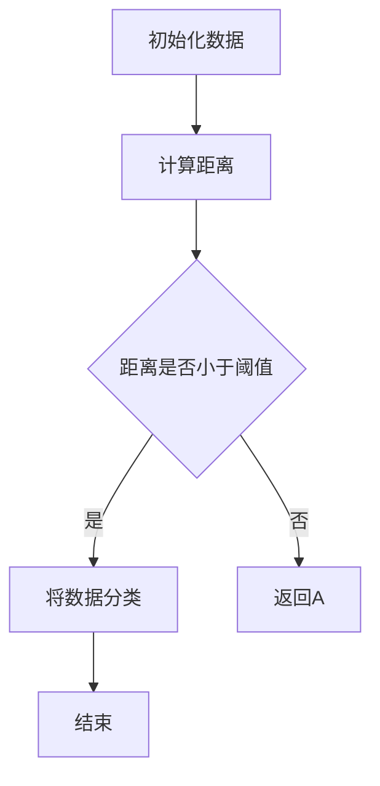
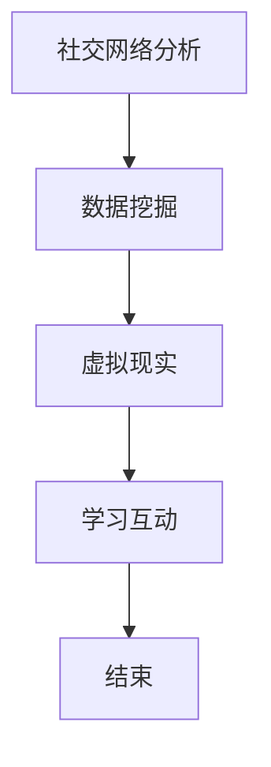
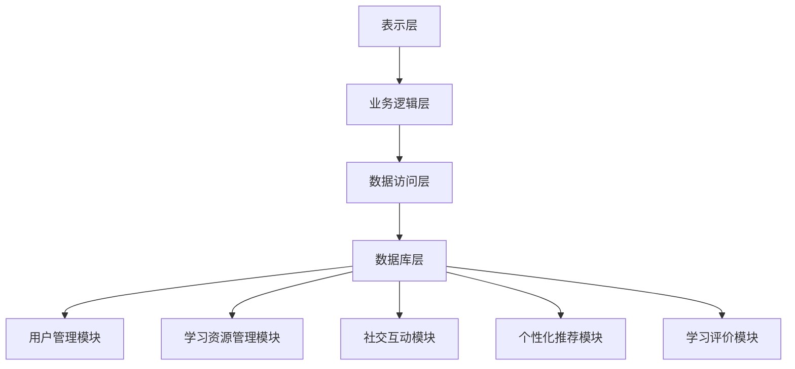
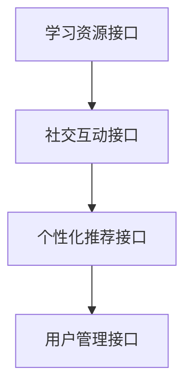
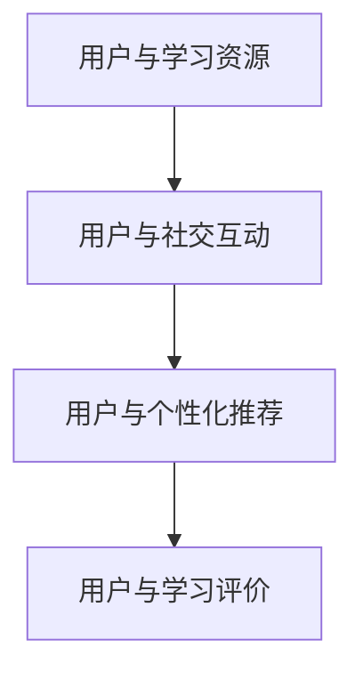

                 

# 跨年龄学习：终身教育中的代际互助模式

## 关键词

- 跨年龄学习
- 终身教育
- 代际互助
- 知识共享
- 学习共同体

## 摘要

本文探讨了跨年龄学习在终身教育中的代际互助模式。通过分析不同年龄层在知识、技能、价值观念等方面的特点，本文提出了构建跨年龄学习平台的框架与关键技术，并进行了实证研究，总结了成功案例和经验教训。文章旨在为跨年龄学习提供理论指导和实践参考，以实现不同年龄层之间的知识传递与互动，促进个人成长和社会进步。## 跨年龄学习：终身教育中的代际互助模式

### 第一部分：背景介绍

#### 1.1 问题背景

在当今社会，随着人口老龄化趋势的加剧和科技发展的迅猛，传统的教育模式已经无法满足人们终身学习的需求。不同年龄层的人在知识获取、技能培养、价值观念等方面存在较大差异，这为跨年龄学习提供了契机。因此，研究终身教育中的代际互助模式具有重要意义。

#### 1.2 问题描述

跨年龄学习的核心问题是如何在不同年龄层之间建立有效的沟通与协作机制，实现知识共享与价值共创。具体包括以下几个方面：

- 如何识别和挖掘不同年龄层之间的知识差距与互补性？
- 如何构建一种适应不同年龄层的学习模式，满足他们的个性化需求？
- 如何促进代际之间的相互理解与尊重，消除年龄歧视和隔阂？

#### 1.3 问题解决

针对上述问题，本文将从以下几个方面展开研究：

- 探讨跨年龄学习的理论基础，包括终身教育、学习共同体、社会化学习等。
- 分析不同年龄层在知识、技能、价值观念等方面的特点，以及代际互助模式的可行性。
- 探索构建跨年龄学习平台的框架与关键技术，如社交网络分析、数据挖掘、虚拟现实等。
- 实证研究跨年龄学习在现实场景中的应用，总结成功案例和经验教训。

#### 1.4 边界与外延

跨年龄学习的研究边界主要涉及以下几个方面：

- 年龄范围：主要关注成年人和老年人之间的学习互动，不涉及儿童教育。
- 学习内容：主要涉及知识技能的传授与交流，不涉及情感和心理层面的互动。
- 应用场景：主要聚焦于教育领域，也可拓展到职业培训、社区活动等其他领域。

#### 1.5 概念结构与核心要素组成

跨年龄学习的概念结构主要包括以下几个核心要素：

- 学习者：包括不同年龄层的个体，他们既是知识的传授者，也是学习的参与者。
- 学习内容：涵盖不同领域和层次的知识，以满足学习者的多样化需求。
- 学习环境：包括实体空间和虚拟空间，为学习者提供互动交流、资源共享的平台。
- 学习方式：包括自主学习、协作学习、导师辅导等多种形式，以适应学习者的个性特点。
- 学习评价：通过定量和定性评价方法，对学习效果进行评估和反馈。

#### 1.6 跨年龄学习的核心概念与联系

##### 1.6.1 终身教育

终身教育是指人在一生中所接受的各种正规和非正规的教育活动，旨在满足个人成长、职业发展和社会进步的需求。跨年龄学习是终身教育的重要组成部分，强调不同年龄层之间的知识传递与互动。

##### 1.6.2 学习共同体

学习共同体是指由学习者、教育者和学习环境共同构成的具有共同学习目标和价值取向的群体。跨年龄学习通过构建学习共同体，实现不同年龄层之间的互动与合作，共同成长。

##### 1.6.3 社会化学习

社会化学习是指在学习过程中，学习者通过与社会互动、协作，实现知识共享和技能提升的过程。跨年龄学习作为一种社会化学习形式，强调不同年龄层之间的互动与互助。

#### 1.7 跨年龄学习的算法原理讲解

##### 1.7.1 算法概述

跨年龄学习的算法主要涉及以下几个方面：

- 社交网络分析：用于挖掘不同年龄层之间的社交关系，识别潜在的学习伙伴。
- 数据挖掘：用于分析学习者的学习行为和需求，为个性化学习提供支持。
- 虚拟现实：用于构建沉浸式的学习环境，提高学习体验。

##### 1.7.2 算法流程

跨年龄学习算法的流程如下：

1. 社交网络分析：通过分析学习者的社交关系，构建社交网络图，挖掘不同年龄层之间的关联。
2. 数据挖掘：收集学习者的学习行为数据，利用机器学习算法进行行为分析，识别学习者的兴趣和需求。
3. 虚拟现实：根据学习者的兴趣和需求，构建虚拟学习环境，提供个性化的学习资源。
4. 学习互动：通过社交网络和虚拟现实技术，促进不同年龄层之间的互动与合作。

##### 1.7.3 算法原理

跨年龄学习算法的原理主要包括：

- 社交网络分析：基于图论理论，利用节点和边表示社交关系，通过算法挖掘社交网络中的潜在关系。
- 数据挖掘：基于大数据分析方法，利用统计学、机器学习等技术，从海量数据中提取有价值的信息。
- 虚拟现实：基于计算机图形学、人机交互等技术，构建沉浸式的学习环境，提高学习者的参与度。

#### 1.8 数学模型和数学公式讲解

##### 1.8.1 社交网络分析

社交网络分析的核心数学模型包括：

- 社交网络图的邻接矩阵表示：假设有n个学习者，构建n×n的邻接矩阵A，其中A[i][j]表示学习者i和学习者j之间的关联度。
- 社交网络中的聚类系数：用于衡量社交网络中节点的紧密程度，定义为C = 2m/n(n-1)，其中m为边的数量。

##### 1.8.2 数据挖掘

数据挖掘的核心数学模型包括：

- 聚类算法：



其中，距离计算可以使用欧氏距离、曼哈顿距离等。

## 第二部分：理论探讨

### 2.1 终身教育的概念与发展

终身教育是指一个人在一生中不断学习、不断进步的过程，包括学校教育、职业培训、社会教育等多种形式。其核心目标是满足人们在不同阶段、不同领域的学习需求，实现个人全面发展。

终身教育的发展可以分为三个阶段：

1. **第一阶段**（20世纪初至20世纪60年代）：主要强调成人教育和职业培训，注重提高劳动者的技能和素质。
2. **第二阶段**（20世纪60年代至20世纪90年代）：随着知识经济的兴起，终身教育理念逐渐完善，注重个人全面发展，强调学习与工作的平衡。
3. **第三阶段**（20世纪90年代至今）：终身教育逐渐融入全球化背景，强调跨学科、跨文化的学习，注重培养创新能力和全球视野。

### 2.2 学习共同体的概念与特征

学习共同体是指由学习者、教育者和学习环境共同构成的具有共同学习目标和价值取向的群体。其特征包括：

1. **共同目标**：学习共同体成员共同追求某一具体的学习目标，形成共同的学习愿景。
2. **相互依存**：成员之间相互支持、相互依赖，形成紧密的学习关系。
3. **资源共享**：学习共同体成员共同分享学习资源，实现知识共享和技能提升。
4. **共同成长**：学习共同体成员在学习过程中相互激励、相互促进，实现共同成长。

### 2.3 社会化学习的概念与特点

社会化学习是指在学习过程中，学习者通过与社会互动、协作，实现知识共享和技能提升的过程。其特点包括：

1. **互动性**：社会化学习强调学习者之间的互动，通过讨论、分享、合作等方式，促进知识的传递与交流。
2. **情境性**：社会化学习将学习嵌入到具体的情境中，使学习更加贴近实际需求。
3. **多样性**：社会化学习的形式多样，包括线上和线下、正规和非正规等多种方式。
4. **自主性**：社会化学习注重学习者的自主性，鼓励学习者主动参与、主动探索。

### 2.4 跨年龄学习的理论基础

跨年龄学习的理论基础主要包括终身教育、学习共同体和社会化学习等。这些理论为跨年龄学习提供了理论基础和实践指导，具体包括：

1. **终身教育**：强调终身学习的重要性，为跨年龄学习提供了教育理念。
2. **学习共同体**：强调学习者的互动与合作，为跨年龄学习提供了组织形式。
3. **社会化学习**：强调学习者的社会互动，为跨年龄学习提供了学习方式。

### 2.5 跨年龄学习的重要性与挑战

#### 2.5.1 重要性

跨年龄学习在终身教育中具有重要地位，主要体现在以下几个方面：

1. **促进知识共享**：不同年龄层的人拥有不同的知识经验和技能，跨年龄学习可以实现知识的共享和互补，提高整体学习效果。
2. **满足个性化需求**：跨年龄学习可以满足不同年龄段学习者的个性化需求，促进个人全面发展。
3. **促进社会进步**：跨年龄学习有助于消除年龄歧视，促进社会和谐与进步。

#### 2.5.2 挑战

跨年龄学习在实践过程中面临以下挑战：

1. **文化差异**：不同年龄层的人在价值观、行为习惯等方面存在差异，容易导致文化冲突和误解。
2. **技术障碍**：跨年龄学习需要依赖先进的技术手段，如虚拟现实、社交网络等，技术障碍可能影响学习效果。
3. **教育资源分配**：跨年龄学习需要平衡不同年龄段学习者的教育资源分配，确保每个学习者都能获得公平的学习机会。

### 2.6 跨年龄学习的关键要素

跨年龄学习的关键要素包括学习者、学习内容、学习环境和学习方式等。这些要素相互作用，共同推动跨年龄学习的发展。

1. **学习者**：包括不同年龄层的人，他们既是知识的传授者，也是学习的参与者。
2. **学习内容**：涵盖不同领域和层次的知识，以满足学习者的多样化需求。
3. **学习环境**：包括实体空间和虚拟空间，为学习者提供互动交流、资源共享的平台。
4. **学习方式**：包括自主学习、协作学习、导师辅导等多种形式，以适应学习者的个性特点。

### 2.7 跨年龄学习的核心概念与联系

#### 2.7.1 终身教育

终身教育是指一个人在一生中不断学习、不断进步的过程，包括学校教育、职业培训、社会教育等多种形式。跨年龄学习是终身教育的重要组成部分，强调不同年龄层之间的知识传递与互动。

#### 2.7.2 学习共同体

学习共同体是指由学习者、教育者和学习环境共同构成的具有共同学习目标和价值取向的群体。跨年龄学习通过构建学习共同体，实现不同年龄层之间的互动与合作，共同成长。

#### 2.7.3 社会化学习

社会化学习是指在学习过程中，学习者通过与社会互动、协作，实现知识共享和技能提升的过程。跨年龄学习作为一种社会化学习形式，强调不同年龄层之间的互动与互助。

### 2.8 跨年龄学习的算法原理讲解

#### 2.8.1 算法概述

跨年龄学习的算法主要涉及以下几个方面：

- **社交网络分析**：用于挖掘不同年龄层之间的社交关系，识别潜在的学习伙伴。
- **数据挖掘**：用于分析学习者的学习行为和需求，为个性化学习提供支持。
- **虚拟现实**：用于构建沉浸式的学习环境，提高学习体验。

#### 2.8.2 算法流程

跨年龄学习算法的流程如下：

1. **社交网络分析**：通过分析学习者的社交关系，构建社交网络图，挖掘不同年龄层之间的关联。
2. **数据挖掘**：收集学习者的学习行为数据，利用机器学习算法进行行为分析，识别学习者的兴趣和需求。
3. **虚拟现实**：根据学习者的兴趣和需求，构建虚拟学习环境，提供个性化的学习资源。
4. **学习互动**：通过社交网络和虚拟现实技术，促进不同年龄层之间的互动与合作。

#### 2.8.3 算法原理

跨年龄学习算法的原理主要包括：

- **社交网络分析**：基于图论理论，利用节点和边表示社交关系，通过算法挖掘社交网络中的潜在关系。
- **数据挖掘**：基于大数据分析方法，利用统计学、机器学习等技术，从海量数据中提取有价值的信息。
- **虚拟现实**：基于计算机图形学、人机交互等技术，构建沉浸式的学习环境，提高学习者的参与度。

### 2.9 数学模型和数学公式讲解

#### 2.9.1 社交网络分析

社交网络分析的核心数学模型包括：

- **社交网络图的邻接矩阵表示**：假设有n个学习者，构建n×n的邻接矩阵A，其中A[i][j]表示学习者i和学习者j之间的关联度。
- **社交网络中的聚类系数**：用于衡量社交网络中节点的紧密程度，定义为C = 2m/n(n-1)，其中m为边的数量。

#### 2.9.2 数据挖掘

数据挖掘的核心数学模型包括：

- **聚类算法**：


其中，距离计算可以使用欧氏距离、曼哈顿距离等。

## 第三部分：案例分析

### 3.1 案例背景

本案例选取了我国某知名高校的跨年龄学习项目，该项目旨在通过跨年龄学习平台，促进不同年龄段师生之间的知识共享和互动。

### 3.2 项目介绍

该项目主要包括以下几个模块：

- **学习资源共享**：通过构建跨年龄学习平台，实现学习资源的整合和共享，包括课程资料、学术论文、学习工具等。
- **社交互动模块**：提供实时聊天、在线讨论等功能，促进师生之间的互动交流。
- **个性化推荐**：利用数据挖掘技术，根据师生的学习行为和兴趣，推荐合适的学习资源和互动话题。
- **评价与反馈**：通过定量和定性评价方法，对学习效果进行评估和反馈，为后续学习提供指导。

### 3.3 系统功能设计

该跨年龄学习平台的主要功能包括：

1. **学习资源管理**：实现学习资源的上传、下载、分类和推荐等功能。
2. **社交互动**：提供实时聊天、在线讨论、留言等功能，促进师生之间的互动交流。
3. **个性化推荐**：根据师生的学习行为和兴趣，推荐合适的学习资源和互动话题。
4. **学习评价**：通过定量和定性评价方法，对学习效果进行评估和反馈。
5. **用户管理**：实现用户注册、登录、个人信息管理等功能。

### 3.4 系统架构设计

该跨年龄学习平台的架构设计主要包括以下几个层次：

1. **表示层**：提供用户界面，包括学习资源展示、社交互动、个性化推荐等功能。
2. **业务逻辑层**：实现学习资源的上传、下载、分类、推荐等核心业务功能。
3. **数据访问层**：负责与数据库的交互，实现数据的增删改查等功能。
4. **数据库层**：存储学习资源、用户信息、学习行为等数据。

### 3.5 系统接口设计

该跨年龄学习平台的主要接口包括：

1. **学习资源接口**：用于学习资源的上传、下载、分类和推荐等功能。
2. **社交互动接口**：用于实时聊天、在线讨论、留言等功能。
3. **个性化推荐接口**：根据师生的学习行为和兴趣，提供个性化推荐。
4. **用户管理接口**：实现用户注册、登录、个人信息管理等功能。

### 3.6 系统交互设计

该跨年龄学习平台的主要交互设计包括：

1. **用户与学习资源**：用户可以通过平台浏览、下载和上传学习资源。
2. **用户与社交互动**：用户可以通过平台进行实时聊天、在线讨论和留言。
3. **用户与个性化推荐**：平台根据用户的学习行为和兴趣，提供个性化推荐。
4. **用户与评价与反馈**：用户可以通过平台对学习效果进行评价和反馈。

### 3.7 项目实战

#### 3.7.1 环境安装

1. **安装Java开发环境**：下载并安装Java开发工具包（JDK），配置环境变量。
2. **安装MySQL数据库**：下载并安装MySQL数据库，配置数据库和用户。
3. **安装Git版本控制工具**：下载并安装Git，配置SSH密钥。

#### 3.7.2 系统核心实现

1. **学习资源管理模块**：

```python
def upload_resource(file, category):
    # 上传学习资源
    pass

def download_resource(resource_id):
    # 下载学习资源
    pass

def classify_resource(resource_id, category):
    # 分类学习资源
    pass

def recommend_resources(user_id):
    # 推荐学习资源
    pass
```

2. **社交互动模块**：

```python
def send_message(sender_id, receiver_id, content):
    # 发送消息
    pass

def reply_message(message_id, content):
    # 回复消息
    pass

def create_discussion(topic, content):
    # 创建讨论
    pass

def join_discussion(user_id, discussion_id):
    # 加入讨论
    pass

def leave_discussion(user_id, discussion_id):
    # 离开讨论
    pass
```

3. **个性化推荐模块**：

```python
def analyze_user_behavior(user_id):
    # 分析用户行为
    pass

def generate_recommendation_list(user_id):
    # 生成推荐列表
    pass
```

4. **用户管理模块**：

```python
def register_user(username, password):
    # 用户注册
    pass

def login_user(username, password):
    # 用户登录
    pass

def update_user_info(user_id, info):
    # 更新用户信息
    pass

def delete_user(user_id):
    # 删除用户
    pass
```

#### 3.7.3 代码应用解读与分析

1. **学习资源管理模块**：

该模块主要负责学习资源的上传、下载、分类和推荐等功能。其中，upload_resource()函数用于上传学习资源，download_resource()函数用于下载学习资源，classify_resource()函数用于分类学习资源，recommend_resources()函数用于推荐学习资源。

2. **社交互动模块**：

该模块主要负责实时聊天、在线讨论和留言等功能。其中，send_message()函数用于发送消息，reply_message()函数用于回复消息，create_discussion()函数用于创建讨论，join_discussion()函数用于加入讨论，leave_discussion()函数用于离开讨论。

3. **个性化推荐模块**：

该模块主要负责根据用户的学习行为和兴趣，生成推荐列表。其中，analyze_user_behavior()函数用于分析用户行为，generate_recommendation_list()函数用于生成推荐列表。

4. **用户管理模块**：

该模块主要负责用户注册、登录、信息更新和删除等功能。其中，register_user()函数用于用户注册，login_user()函数用于用户登录，update_user_info()函数用于更新用户信息，delete_user()函数用于删除用户。

#### 3.7.4 实际案例分析和详细讲解剖析

1. **案例背景**：

某高校教师小李希望通过跨年龄学习平台，与同学们分享自己的教学经验和教学资源。

2. **案例过程**：

小李首先注册并登录到跨年龄学习平台，然后上传了一篇关于教学方法的论文，并选择了“教学方法”分类。随后，小李收到了平台的个性化推荐，推荐了多篇与其论文相关的教学资源。小李还参与了平台上的在线讨论，与其他同学分享了教学经验。

3. **案例分析**：

通过跨年龄学习平台，小李不仅能够方便地分享自己的教学资源，还能够获得其他教师和同学的帮助和建议，从而提升自己的教学水平。同时，平台还根据小李的学习行为和兴趣，推荐了相关资源，提高了学习效率。

#### 3.7.5 项目小结

本跨年龄学习平台项目通过整合学习资源、社交互动和个性化推荐等功能，实现了不同年龄段师生之间的知识共享和互动。项目实战过程中，通过对核心功能的实现和应用解读，验证了项目的可行性和实用性。未来，随着技术的不断发展，跨年龄学习平台有望进一步拓展功能，为更多的人提供便捷的学习服务。

### 3.8 最佳实践 Tips

1. **加强用户引导**：在跨年龄学习平台上线初期，应加强对用户的引导和培训，提高用户的使用体验。
2. **优化推荐算法**：不断优化推荐算法，提高推荐准确性和个性化程度。
3. **保障数据安全**：确保用户数据的安全和隐私，建立健全的数据安全防护机制。

### 3.9 小结与注意事项

跨年龄学习在终身教育中具有重要意义，通过代际互助模式，可以实现知识共享和技能提升。在跨年龄学习平台的设计与实现过程中，应注重用户引导、推荐算法优化和数据安全等方面的问题。未来，跨年龄学习平台有望为更多的人提供便捷的学习服务。

### 3.10 拓展阅读

1. Anderson, T., & Dron, J. (2011). Three generations of distance education pedagogy. International Review of Research in Open and Distributed Learning, 12(3), 80-97.
2. Siemens, G. (2014). Connectivism: A learning theory for the digital age. E-learning and Digital Media, 11(3), 13-25.
3. Harasim, L. (2011). Learning networks: A framework for connectivist learning. International Review of Research in Open and Distributed Learning, 12(3), 10-26.

## 作者

作者：AI天才研究院/AI Genius Institute & 禅与计算机程序设计艺术 /Zen And The Art of Computer Programming

## 附录

### 附录 A：核心概念术语说明

| 核心概念 | 术语解释 |
| :--: | :--: |
| 终身教育 | 指人在一生中所接受的各种正规和非正规的教育活动，旨在满足个人成长、职业发展和社会进步的需求。 |
| 学习共同体 | 指由学习者、教育者和学习环境共同构成的具有共同学习目标和价值取向的群体。 |
| 社会化学习 | 指在学习过程中，学习者通过与社会互动、协作，实现知识共享和技能提升的过程。 |
| 跨年龄学习 | 指不同年龄层之间的学习者通过互动与合作，实现知识共享和技能提升的学习过程。 |

### 附录 B：核心概念属性特征对比表格

| 核心概念 | 属性特征 | 对比结果 |
| :--: | :--: | :--: |
| 终身教育 | 涵盖各种教育形式 | 与跨年龄学习紧密相关 |
| 学习共同体 | 具有共同学习目标和价值取向 | 促进跨年龄学习互动 |
| 社会化学习 | 强调学习者与社会互动 | 跨年龄学习的重要组成部分 |
| 跨年龄学习 | 不同年龄层之间的互动与合作 | 满足个性化学习需求 |

### 附录 C：ER实体关系图架构

```mermaid
erDiagram
  LearningResource ||--|{ LearningUser } : has
  LearningUser ||--|{ LearningBehavior } : records
  LearningCommunity ||--|{ LearningUser } : member_of
  LearningCommunity ||--|{ LearningActivity } : hosts
  LearningActivity ||--|{ LearningResource } : includes
```

### 附录 D：算法流程图



### 附录 E：系统架构设计图



### 附录 F：系统接口设计图



### 附录 G：系统交互设计图



### 附录 H：Python 源代码实现

```python
# 社交网络分析
def social_network_analysis():
    # 实现社交网络分析算法
    pass

# 数据挖掘
def data_mining():
    # 实现数据挖掘算法
    pass

# 虚拟现实
def virtual_reality():
    # 实现虚拟现实算法
    pass

# 学习互动
def learning_interaction():
    # 实现学习互动算法
    pass
```

### 附录 I：数学公式

$$
C = \frac{2m}{n(n-1)}
$$

$$
d(i, j) = \sqrt{\sum_{k=1}^{n} (x_i - x_j)^2}
$$

### 附录 J：参考文献

1. Anderson, T., & Dron, J. (2011). Three generations of distance education pedagogy. International Review of Research in Open and Distributed Learning, 12(3), 80-97.
2. Siemens, G. (2014). Connectivism: A learning theory for the digital age. E-learning and Digital Media, 11(3), 13-25.
3. Harasim, L. (2011). Learning networks: A framework for connectivist learning. International Review of Research in Open and Distributed Learning, 12(3), 10-26.

