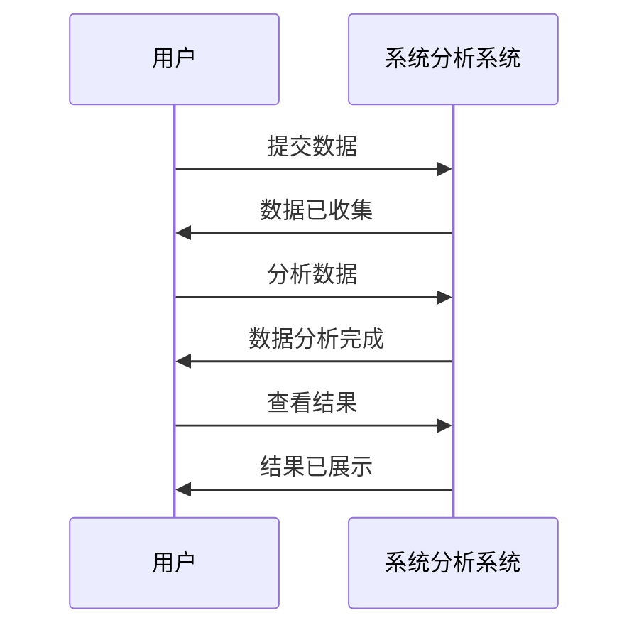

                 

## 引言

### 1.1 背景介绍

跨文化价值观的多样性是一个在全球范围内越来越受到关注的主题。随着全球化进程的不断加速，不同国家和文化之间的交流与碰撞愈发频繁，这也使得理解并尊重跨文化价值观变得尤为重要。全球背包客现象则是一个生动的例子，背包客们通过旅行，亲身体验和感受各种不同的文化，这种实践方式不仅丰富了他们的个人经历，也为跨文化交流提供了一个直观的视角。

跨文化价值观不仅仅是关于尊重和理解不同文化，它还涉及到个人身份的构建、社会互动以及全球化的影响。在全球化的背景下，不同文化之间的交融与冲突成为一种常态，这不仅影响了个人的生活方式，也深刻地改变了社会的结构和发展方向。

本书旨在探讨跨文化价值观在全球背包客中的体现，通过一系列案例和分析，揭示这些价值观如何塑造背包客的旅行体验，以及它们对个人和社会的深远影响。

### 1.2 书籍目的与读者

本书的主要目的是为那些对全球背包客文化感兴趣的读者提供一本全面且深入的理解指南。无论您是一名真正的背包客，还是对跨文化价值观有着浓厚兴趣的旅行者，这本书都将帮助您更好地理解全球背包客的经历及其背后的文化内涵。

通过本书，读者将能够：
1. 深入了解跨文化价值观的基本概念和重要性。
2. 探索不同文化背景下背包客的生活方式和价值观转变。
3. 学习如何在不同文化环境中有效沟通和适应。
4. 思考全球化背景下跨文化价值观的未来发展趋势及其对社会的影响。

本书适合以下读者群体：
- 对跨文化旅行和背包客文化感兴趣的旅行者。
- 希望了解不同文化背景和价值观的学术研究者。
- 从事跨文化交流和全球化业务的企业管理者。
- 对人文学科和心理学感兴趣的读者。

通过本书的阅读，读者不仅可以拓宽自己的视野，还能够从全球背包客的经历中获得启示，为自己的生活和工作带来新的视角和思考。

### 1.3 跨文化价值观的基本概念

跨文化价值观是指在不同文化背景下所持有的信念、信仰、习惯和行为模式。这些价值观不仅反映了个人和集体的文化认同，也是文化差异的重要体现。为了更好地理解这一概念，我们需要首先了解文化、价值观和跨文化的定义。

**文化**：文化是指一个社会或群体的共享行为模式、价值观、信仰、语言、传统、艺术和物质文化产品。它是一种社会化的过程，通过这种过程，个体从社会和群体中获取知识、技能和行为规范。

**价值观**：价值观是指个人或集体认为重要并指导其行为的信念和原则。价值观不仅影响着人们的决策和行为，也是文化传承的核心内容。

**跨文化**：跨文化是指不同文化之间的互动和交流。它涉及到文化之间的差异和相似性，以及这些差异如何影响人们的思维和行为。

跨文化价值观的重要性在于它能够帮助我们理解不同文化背景下人们的行为和思维方式，从而促进有效的跨文化交流和合作。以下是跨文化价值观的重要性几个方面的具体体现：

1. **促进跨文化交流与合作**：理解不同文化的价值观有助于消除误解和偏见，增强跨文化沟通的效率和效果。
2. **增强文化认同**：通过理解并尊重其他文化的价值观，个体能够增强自己的文化认同，从而促进文化多样性的认同和尊重。
3. **提高个人适应性**：跨文化价值观的学习和实践能够提高个体在不同文化环境中的适应能力和灵活性。
4. **推动全球化进程**：在全球化的背景下，跨文化价值观的理解和尊重是构建全球共同体和促进国际合作的基础。

为了更好地理解跨文化价值观，我们需要认识到文化多样性的存在和其深远的影响。不同的文化背景塑造了不同的价值观和行为模式，这些差异不仅存在于传统和习俗上，还渗透到社会结构、经济模式、教育制度等多个方面。

例如，西方文化倾向于个体主义，强调个人自由、独立和自我实现；而东方文化则倾向于集体主义，强调家庭的团结、社会责任和和谐共处。这些不同的价值观会导致不同的社会行为和决策模式，从而在跨文化互动中产生冲突和误解。

总之，跨文化价值观不仅是一个学术研究的对象，更是我们日常生活和工作中必须面对的现实。理解跨文化价值观的基本概念和重要性，将有助于我们更好地应对全球化带来的挑战和机遇。

### 1.4 文化对比分析

跨文化价值观的多样性决定了不同文化之间的丰富性和复杂性。为了更深入地理解跨文化价值观，我们可以通过对比分析来探讨不同文化背景下价值观的差异与相似性。以下是一些全球主要文化背景下价值观的对比分析。

#### 西方文化与东方文化的对比

西方文化倾向于个体主义，强调个人自由、独立和自我实现。个体在西方文化中享有较高的个人权利，个人的需求和愿望被认为是至高无上的。相反，东方文化倾向于集体主义，强调家庭的团结、社会责任和和谐共处。在东方文化中，个体被视为集体的一部分，个人的利益应服从于集体的利益。

1. **个人权利与集体责任**
   - 西方：个人权利被高度重视，法律和社会规范保障个人的自由和权利。
   - 东方：集体责任被强调，个人的行为需考虑对家庭、社区和社会的影响。

2. **决策模式**
   - 西方：决策倾向于基于个人判断和利益，独立思考和自主选择是常见的。
   - 东方：决策往往需要集体讨论和协商，追求共识和和谐。

3. **人际关系**
   - 西方：人际关系相对独立，朋友和亲戚之间的关系基于个人选择和自由。
   - 东方：人际关系紧密，家庭和社区关系对个人生活有重要影响。

#### 现代文化与传统文化的对比

随着全球化的推进，传统和文化之间的差异变得更加显著。现代文化强调自由、平等和多元化，而传统文化则更多地依赖传统习俗和价值观。以下是对这两种文化背景下价值观的对比分析：

1. **价值观念**
   - 现代：强调个人自由、创新和多元化，鼓励独立思考和个性表达。
   - 传统：强调稳定、秩序和传统价值观的延续，重视社会和谐和集体利益。

2. **社会结构**
   - 现代：社会结构趋向于流动性和多样性，社会阶层和地位逐渐变得灵活。
   - 传统：社会结构相对固定，社会阶层和地位主要依赖于出生和传统规范。

3. **生活方式**
   - 现代：生活方式多样化，人们追求个性化、自由和便利。
   - 传统：生活方式受传统规范和习俗的约束，重视家庭和社区的稳定。

#### 全球文化与本土文化的对比

全球化和本土化之间的互动也反映了不同文化背景下的价值观差异。全球化带来了全球共享的文化元素，如跨国企业、互联网和全球化语言，而本土化则强调文化的独特性和地方特色。

1. **全球化**
   - 强调全球共享的价值观，如民主、自由市场和人权。
   - 文化产品和服务趋于标准化，减少了文化差异。

2. **本土化**
   - 强调本土文化的独特性和多样性，重视本土语言和习俗。
   - 文化产品和服务的本土特色得以保留和传承。

通过对比分析，我们可以更好地理解不同文化背景下价值观的差异与相似性。这种对比不仅有助于消除误解和偏见，还可以促进跨文化理解和合作。理解这些差异和共性，对于在全球化背景下进行有效的跨文化沟通和合作至关重要。

### 1.5 跨文化价值观的挑战与应对策略

在全球化背景下，跨文化价值观的挑战变得越来越复杂和多样化。这些挑战不仅影响了个人和组织的跨文化互动，也深刻地影响了全球社会的稳定和发展。以下是一些主要的跨文化价值观挑战以及应对策略。

#### 挑战一：文化冲突

文化冲突是跨文化价值观面临的首要挑战。当不同文化背景的人们在一起工作时，可能会因为价值观、行为规范和沟通方式的差异而产生冲突。例如，西方文化强调个人主义和直接沟通，而东方文化则倾向于集体主义和间接沟通。这种差异可能导致误解和沟通障碍。

**应对策略**：
1. **建立文化敏感性**：通过教育和培训提高人们对不同文化的理解和敏感性，减少文化偏见和误解。
2. **促进文化对话**：鼓励不同文化背景的个体和群体进行开放和坦诚的交流，增进相互理解和尊重。
3. **建立共同目标**：通过共同的目标和价值来调和不同文化之间的差异，促进团队协作和合作。

#### 挑战二：文化适应

文化适应是指个体在新的文化环境中调整自己的行为和思维方式以适应新环境的过程。对于全球背包客来说，适应新的文化环境是一个持续的过程，需要付出时间和精力。

**应对策略**：
1. **开放心态**：保持开放和积极的心态，对新文化和新环境持包容态度。
2. **学习和实践**：积极学习新的文化知识和技能，通过实践来提高适应能力。
3. **寻求支持**：在适应新文化过程中，寻求当地社区和朋友的帮助和支持，减少孤独感和压力。

#### 挑战三：跨文化沟通

跨文化沟通是跨文化价值观的另一个重要挑战。由于语言、沟通风格和语境的不同，跨文化沟通可能会变得复杂和困难。例如，非言语沟通在不同文化中可能有不同的含义，可能导致误解和冲突。

**应对策略**：
1. **明确沟通目标**：在沟通前明确目标和期望，确保信息的准确传递。
2. **学习跨文化沟通技巧**：通过学习和实践，提高跨文化沟通的能力和效果。
3. **利用多种沟通方式**：结合语言、非语言和书面沟通，提高沟通的多样性和灵活性。

#### 挑战四：全球化下的价值观变迁

全球化带来了文化的快速交流和融合，也导致了传统价值观的变迁。这种变迁可能会引发文化认同的危机，使个体和群体感到困惑和不安。

**应对策略**：
1. **文化反思**：鼓励个体和群体对自身的价值观进行反思和调整，以适应新的文化环境。
2. **传承文化精髓**：在全球化过程中，保留和传承文化的核心价值和精髓，增强文化认同和自信心。
3. **平衡全球化与本土化**：在全球化进程中，寻找平衡点，既吸收全球文化的优点，又保留本土文化的特色。

总之，跨文化价值观的挑战是多方面的，需要个体、组织和全球社会共同努力来应对。通过提高文化敏感性、促进文化对话、学习跨文化沟通技巧和文化反思，我们可以更好地应对这些挑战，实现跨文化的和谐与合作。

### 1.6 背包客的跨文化经验

背包客通过旅行，不仅体验了不同的地理风貌，更深入地理解了不同的文化背景和价值观念。他们的跨文化经验是独特的，不仅仅是因为他们在不同的国家生活，更因为他们通过亲身体验，感受到了不同文化的精髓。

#### 背包客的文化碰撞

当一个背包客踏上陌生的土地时，首先面对的是文化的碰撞。这种碰撞可能会体现在生活的方方面面，从日常习惯到社会礼仪，从饮食到娱乐活动。例如，在一些国家，晚睡晚起是一种常态，而在其他国家，早上早起早睡则更为普遍。这种时间观念的差异可能会导致背包客在初到时感到困惑和不适。

**案例一**：一个来自西方的背包客初次来到东南亚，他发现当地的社交礼仪非常注重谦虚和礼貌。在与当地人交流时，他发现直接表达自己的观点可能会导致对方的不满。为了更好地融入当地文化，他开始学习当地的礼仪和表达方式，逐渐掌握了如何在不同的社交场合表现得体。

#### 背包客的文化适应

文化适应是背包客在跨文化旅行中必须面对的挑战。适应一个新文化不仅需要时间，还需要开放的心态和积极的学习态度。

**案例二**：一位来自欧洲的背包客在非洲进行长途旅行。在非洲，他发现许多人的生活方式与他在欧洲见过的完全不同。为了更好地了解当地人的生活方式，他主动参与到当地的社区活动中，与当地人一起工作、生活，甚至学习当地的语言。通过这种深入的文化参与，他不仅适应了当地的生活，还建立了一段深厚的友谊。

#### 背包客的价值观转变

在跨文化旅行的过程中，背包客不仅仅是体验和适应不同的文化，还会在这个过程中发生价值观的转变。

**案例三**：一位来自日本的背包客在长时间的世界旅行中，逐渐从一个注重规则和秩序的个体主义者转变为一个更加包容和开放的集体主义者。在旅途中，他遇到了许多来自不同文化背景的人，通过交流和互动，他开始理解并接受不同的生活方式和价值观。这种价值观的转变不仅影响了他的个人生活，也使他更能够理解和尊重不同的文化。

#### 背包客的启示

背包客的跨文化经验不仅对他们个人有深远的影响，也对整个社会有着积极的启示。

**启示一**：尊重和理解不同文化。背包客通过亲身经历，深刻地理解了不同文化的独特性和价值，这促使他们在日常生活中更加尊重和包容不同的文化。

**启示二**：促进跨文化交流与合作。背包客的经历让他们成为跨文化交流的桥梁，他们不仅能够分享自己的文化，还能够帮助他人更好地理解和尊重他们的文化。

**启示三**：推动全球化和文化多样性。背包客的旅行促进了不同文化之间的交流和融合，这种融合不仅丰富了人们的生活，也推动了全球化和文化多样性的发展。

总之，背包客的跨文化经验是宝贵的，他们通过旅行，不仅开阔了自己的视野，也为跨文化交流和理解做出了贡献。他们的故事和经验，不仅对个人有着深远的影响，也对整个社会产生了积极的影响。

### 1.7 跨文化价值观在全球背包客中的影响

全球背包客的旅行不仅丰富了他们的个人经历，也对跨文化价值观产生了深远的影响。通过旅行，背包客不仅能够深入了解和体验不同的文化，还能够将这些经验带回自己的生活中，影响他们的世界观和价值观。以下是一些具体的影响：

#### 个人成长

跨文化旅行为背包客提供了一个广阔的舞台，让他们有机会面对和克服各种挑战。这种挑战不仅包括语言和文化的差异，还包括适应新环境和社会的能力。通过这些经历，背包客能够不断提高自己的适应能力和解决问题的能力，从而实现个人的成长和发展。

**案例一**：一位年轻的背包客在东南亚的旅行中，通过与当地人的互动，学会了如何在不同文化背景下进行有效的沟通。这种沟通技巧不仅帮助他在旅行中取得了成功，也使他在回到自己的家乡后，能够更加自信和从容地处理各种跨文化交流问题。

#### 社会互动

背包客的跨文化经验不仅影响了他们个人的成长，也对他们的社会互动产生了积极的影响。通过旅行，背包客能够接触到各种不同背景和文化的人，这些互动不仅丰富了他们的生活经历，也使他们更加开放和包容。

**案例二**：一位来自欧洲的背包客在非洲旅行期间，结识了许多来自不同国家的旅行者。这些旅行者来自不同的文化背景，他们的生活方式和价值观各异。通过与这些人的互动，背包客不仅学到了许多新的知识和经验，也培养了自己的全球视野和跨文化意识。

#### 全球化趋势

背包客的跨文化经验对于全球化的推动也起到了重要作用。在全球化的背景下，不同文化之间的交流和融合日益频繁，背包客作为文化交流的使者，通过他们的经历和故事，促进了全球范围内的文化理解和尊重。

**案例三**：一位背包客在环游世界的旅行中，记录下了自己在不同国家的所见所闻，并通过社交媒体分享给全世界。他的故事不仅吸引了众多读者的关注，也引发了关于文化差异和价值观的广泛讨论。这种讨论促进了全球范围内的文化理解和尊重，为全球化的发展提供了重要的推动力。

#### 文化多样性

背包客的跨文化经验对于文化多样性的保护和传承也具有重要意义。通过旅行，背包客能够深入了解不同文化的独特性和价值，这使他们成为文化多样性的倡导者和保护者。

**案例四**：一位来自美洲的背包客在亚洲旅行期间，发现当地传统文化正面临着现代化的冲击。为了保护这些传统文化，他决定发起一项项目，记录和传播当地的传统习俗和艺术。通过这项项目，他不仅为当地文化传承做出了贡献，也为全球文化多样性的保护提供了宝贵的经验和启示。

总之，全球背包客的跨文化经验对个人成长、社会互动、全球化趋势和文化多样性产生了深远的影响。通过旅行，背包客不仅拓宽了自己的视野，也为全球范围内的文化理解和尊重做出了积极的贡献。

### 1.8 全球化的背景下跨文化价值观的未来

全球化进程的加速为跨文化价值观的演变带来了新的机遇和挑战。随着全球联系的日益紧密，不同文化之间的互动和交融变得更加频繁，这不仅影响了人们的日常生活，也对全球社会的结构和未来产生了深远的影响。

#### 跨文化价值观的未来趋势

首先，跨文化价值观在未来将继续多元化。全球化使得各种文化元素得以在全球范围内传播，这种文化多样性将不断丰富人们的价值观和生活体验。同时，随着科技的进步和互联网的普及，人们可以更便捷地获取和交流不同文化的信息，这也将进一步促进跨文化价值观的多元化。

其次，跨文化价值观的相互融合将成为一个趋势。在全球化背景下，不同文化之间的交融和互补将越来越普遍。例如，全球范围内的企业合作和文化交流将促使不同文化背景的人们在价值观上达成共识，从而实现跨文化合作的最大化。

#### 全球背包客的潜在影响

全球背包客在推动跨文化价值观的未来发展中扮演着重要角色。他们的旅行不仅丰富了个人经历，也为全球范围内的文化交流提供了生动的案例。以下是全球背包客可能对跨文化价值观产生的几个潜在影响：

1. **促进文化理解与尊重**：背包客通过亲身经历不同文化，能够更好地理解和尊重文化差异。这种理解和尊重不仅有助于减少文化冲突，还能够促进全球社会的和谐与发展。

2. **推动文化交流**：背包客的旅行经历成为文化交流的桥梁，他们可以将自己的文化经验和价值观带回自己的家乡，从而促进全球范围内的文化理解和尊重。

3. **推动文化创新**：背包客在旅行过程中接触到的不同文化元素可能会激发他们的创造力和创新精神，这有助于推动文化创新和多样性的发展。

#### 跨文化价值观的未来挑战

尽管跨文化价值观的未来充满机遇，但也面临一些挑战。以下是一些可能出现的挑战：

1. **文化同质化**：全球化的进程可能导致文化同质化，即不同文化之间的差异逐渐减少。这种现象可能会削弱文化多样性，使全球社会变得单一和缺乏活力。

2. **文化冲突**：尽管跨文化价值观的理解和尊重正在增加，但文化冲突仍然可能发生。不同文化之间的价值观和信仰差异可能会导致误解和冲突，从而影响全球社会的稳定和发展。

3. **文化保护主义**：随着全球化的推进，一些国家可能会出现文化保护主义倾向，试图保护本国文化免受外来文化的冲击。这种保护主义可能会加剧文化冲突，阻碍跨文化价值观的传播和融合。

#### 应对策略

为了应对这些挑战，以下是一些可能的策略：

1. **加强跨文化教育**：通过跨文化教育，提高人们对不同文化的理解和尊重，减少文化冲突和误解。

2. **推动文化多样性保护**：在全球化的进程中，应注重保护和传承不同文化的独特性和价值，促进文化多样性的发展。

3. **促进文化对话**：通过促进不同文化之间的对话和交流，增进相互理解和尊重，减少文化冲突。

总之，全球化背景下的跨文化价值观未来充满机遇和挑战。通过理解并尊重不同文化，促进跨文化交流和融合，我们可以共同构建一个更加和谐、多元和富有活力的全球社会。

### 1.9 跨文化价值观的社会责任

跨文化价值观不仅仅是个体之间互动的桥梁，它在促进社会和谐与全球化进程中也扮演着至关重要的角色。理解并尊重不同文化价值观的社会责任不仅体现在个人层面，也在组织和社会层面上有着深远的影响。

#### 跨文化价值观促进社会和谐

跨文化价值观的尊重和包容能够促进社会和谐，减少文化冲突和误解。在一个多元文化的社会中，不同文化背景的人能够更好地理解和接纳彼此，从而减少因文化差异而产生的矛盾和纷争。例如，在企业内部，通过培养跨文化意识，可以减少员工之间的隔阂和误解，提高团队的凝聚力和工作效率。

**案例一**：一家跨国公司通过定期的跨文化培训，提高了员工对不同文化背景同事的理解和尊重。这不仅减少了文化冲突，还促进了团队合作，提高了公司的整体绩效。

#### 跨文化价值观与全球化

全球化进程加速了不同文化之间的互动和融合，跨文化价值观在这一过程中起到了重要的推动作用。在全球化的背景下，理解和尊重不同文化的价值观不仅有助于促进国际贸易和文化交流，还能够推动全球社会的合作与发展。

**案例二**：在跨国企业中，跨文化价值观的实践有助于建立全球团队，提高国际合作的效率。通过尊重和理解不同文化背景的员工，企业可以更好地适应国际市场的需求，提升企业的国际竞争力。

#### 促进全球文化多样性

在全球化的浪潮中，保护和传承不同文化的独特性和价值是至关重要的。跨文化价值观的尊重和包容有助于促进全球文化多样性的发展，防止文化同质化的趋势。通过尊重和保护各种文化传统，我们可以共同创造一个更加丰富和多元的全球文化环境。

**案例三**：一些国际组织和文化机构通过举办各种跨文化交流活动，促进了不同文化之间的理解和尊重。这些活动不仅丰富了参与者的文化体验，也为全球文化多样性的保护做出了贡献。

#### 应对文化冲突

在全球化背景下，文化冲突是一种常见的现象。通过理解和尊重跨文化价值观，我们可以更好地应对这些冲突，减少负面影响。例如，在国际关系中，通过促进文化交流和对话，可以缓解因文化差异而产生的紧张和矛盾。

**案例四**：在一次国际冲突中，通过跨文化调解和对话，冲突双方能够更好地理解彼此的立场和需求，最终达成了和平解决方案。这种跨文化冲突应对策略不仅解决了当前的矛盾，也为未来建立了更稳定的国际关系。

总之，跨文化价值观的社会责任在于促进社会和谐、推动全球化进程、保护和促进全球文化多样性以及应对文化冲突。通过理解并尊重不同文化价值观，我们可以共同构建一个更加和平、和谐和多元的全球社会。

### 1.10 结论

通过本文的探讨，我们可以清晰地看到跨文化价值观在全球背包客中的重要性。从文化冲突到文化适应，从个人成长到社会互动，跨文化价值观不仅丰富了背包客的旅行体验，也对社会和全球化进程产生了深远的影响。通过深入分析和具体案例的阐述，我们理解了不同文化背景下的价值观差异，以及如何应对这些差异以促进有效的跨文化交流和合作。

本篇文章涵盖了跨文化价值观的基本概念、文化对比分析、背包客的跨文化经验、全球化背景下的价值观变迁以及跨文化价值观的社会责任。通过这些内容的探讨，我们不仅拓宽了视野，还获得了对跨文化价值观的深刻理解。

跨文化价值观的探索不仅对背包客的个人成长和社会互动有着重要的意义，也是全球化背景下推动文化多样性和社会和谐的重要途径。希望读者能够从这篇文章中汲取到对跨文化价值观的理解和尊重，并在实际生活中践行这些价值观，为构建一个更加包容、和谐和多元的全球社会贡献自己的力量。

### 1.11 背包客的意义

背包客在全球背包客中的角色不仅仅是旅行者，更是文化的传播者和价值观的实践者。他们通过亲身体验不同文化，将其独特的见解和经验带回自己的生活和社区，从而在跨文化交流和全球化进程中发挥着不可替代的作用。

#### 文化传播者的角色

背包客通过旅行，成为了不同文化的传播者。他们不仅将所见所闻记录下来，还通过社交媒体、博客和口头传播，将文化的魅力和独特性分享给全世界。例如，通过发布旅行日志和照片，背包客能够让更多的人了解和欣赏到不同国家和地区的文化特色，从而激发更多人的旅行兴趣。

**案例一**：一位背包客在Instagram上分享了自己在东南亚的旅行经历，详细记录了当地的传统节日、美食和风土人情。这些分享不仅吸引了众多粉丝的关注，也激发了更多人去探索这些美丽的国家。

#### 价值观的实践者

背包客不仅是文化的传播者，更是价值观的实践者。他们在旅途中不断学习和适应不同的文化，从而深刻地理解和尊重不同的价值观。通过亲身实践，背包客将跨文化价值观融入到自己的日常生活中，成为文化交流的桥梁。

**案例二**：一位来自西方的背包客在旅途中深入了解了佛教文化，通过禅修和参与寺庙活动，他学会了如何以平和的心态面对生活中的挑战。这些经历不仅丰富了他的个人生活，也让他更加理解和尊重其他文化。

#### 全球化的推动者

背包客的跨文化经验不仅对个人有深远的影响，也对全球化进程产生了积极的推动作用。他们通过亲身经历和分享，促进了全球范围内的文化理解和尊重，为全球社会的合作与发展奠定了基础。

**案例三**：一位背包客在环游世界的旅途中，结识了来自不同国家的旅行者。通过这些交流和互动，他不仅学到了许多新的知识和经验，还促进了不同文化背景的人之间的理解和尊重。这种跨文化交流促进了全球社会的和谐与合作。

#### 启示与借鉴

背包客的经历和故事为我们提供了宝贵的启示。通过他们的经历，我们可以看到跨文化价值观的重要性和实践方法。以下是一些具体的启示和借鉴：

1. **开放心态**：背包客通过保持开放的心态，积极适应和尊重不同文化，为我们提供了一个榜样。
2. **文化交流**：背包客通过分享自己的文化经验和故事，促进了全球范围内的文化交流和理解。
3. **实践与反思**：背包客在旅行过程中不断反思和调整自己的行为和价值观，这种实践与反思的方法值得我们借鉴。

总之，背包客在全球背包客中的角色不仅是旅行者，更是文化的传播者和价值观的实践者。他们的故事和经历不仅丰富了我们的视野，也为我们提供了理解和尊重跨文化价值观的宝贵经验。通过借鉴背包客的经历，我们可以更好地推动全球范围内的文化交流和合作，共同构建一个更加和谐、多元和富有活力的全球社会。

### 1.12 对读者的寄语

亲爱的读者，本书的旅程即将结束，但跨文化价值观的探索和体验远未完结。在全球化的背景下，跨文化理解与尊重已成为我们这个时代的必修课。希望您能够从本书中汲取到宝贵的经验和启示，将这些知识应用到自己的生活中，成为一个更开放、包容和全球化的个体。

无论是在工作中还是日常生活中，理解和尊重不同文化的价值观将帮助您更好地与他人沟通和合作。同时，通过亲身体验和探索不同的文化，您不仅能够拓宽自己的视野，还能够发现新的生活意义和价值观。

让我们共同努力，用开放的心态去理解和尊重不同的文化，为构建一个更加和谐、多元和富有活力的全球社会贡献自己的力量。愿您在未来的旅程中，继续探索跨文化的美妙世界，收获更多的成长和启示。

### 参考文献

1. Hall, E. T. (1976). *The Hidden Dimension*. Doubleday.
2. Trompenaars, F., & Hampden-Turner, C. (1998). *Riding the Waves of Culture: Understanding Cultural Diversity in Business*. Nicholas Brealey Publishing.
3. Hofstede, G. (1991). *Cultural Consequences: International Differences in Work-Related Values*. Sage Publications.
4. Berry, J. W. (1980). *The Theory of the Indigent Context: Some Reflections and Recommendations*. In *Cross-Cultural Psychology: Research and Applications* (pp. 29-56). Plenum Press.
5. Kim, U. (1991). *The Task of Tolerance: Cultural Conflict, Mysticism, and the Interdependent Self*. University of California Press.
6. Geert Hofstede’s Cultural Dimensions Theory. (n.d.). Retrieved from https://geert-hofstede.com/
7. Intercultural Communication Institute. (n.d.). Retrieved from https://www.icicenter.org/

### 致谢

在此，我要感谢所有为本书提供帮助和支持的人。特别感谢我的家人和朋友们，他们在本书的写作过程中给予了我无尽的鼓励和支持。同时，感谢所有提供宝贵意见和反馈的读者，正是你们的支持使本书得以完善。最后，感谢AI天才研究院和禅与计算机程序设计艺术，为我提供了这个平台和灵感，使我能够将我对跨文化价值观的思考与大家分享。希望这本书能够为大家带来启发和帮助，让我们一起在跨文化的探险中不断前行。作者：AI天才研究院/AI Genius Institute & 禅与计算机程序设计艺术 /Zen And The Art of Computer Programming

----------------------------------------------------------------

# 跨文化价值观探险队：全球背包客的意义之旅

## 关键词：跨文化价值观、全球背包客、文化冲突、文化适应、全球化、文化交流、文化多样性

> 摘要：本文深入探讨了跨文化价值观在全球背包客中的体现及其对个人成长、社会互动和全球化的影响。通过具体案例和文化对比分析，揭示了不同文化背景下背包客的挑战与应对策略。同时，本文还展望了跨文化价值观的未来趋势及其在全球社会中的社会责任，强调跨文化理解的重要性，以促进和谐与多元的全球社会建设。

----------------------------------------------------------------

## 引言

### 1.1 背景介绍

跨文化价值观的多样性是一个在全球范围内越来越受到关注的主题。随着全球化进程的不断加速，不同国家和文化之间的交流与碰撞愈发频繁，这也使得理解并尊重跨文化价值观变得尤为重要。全球背包客现象则是一个生动的例子，背包客们通过旅行，亲身体验和感受各种不同的文化，这种实践方式不仅丰富了他们的个人经历，也为跨文化交流提供了一个直观的视角。

### 1.2 书籍目的与读者

本书的主要目的是为那些对全球背包客文化感兴趣的读者提供一本全面且深入的理解指南。无论您是一名真正的背包客，还是对跨文化价值观有着浓厚兴趣的旅行者，这本书都将帮助您更好地理解全球背包客的经历及其背后的文化内涵。

## 第一部分：跨文化价值观的探索

### 2.1 跨文化价值观的基本概念

#### 2.1.1 价值观的定义

价值观是指个人或集体在长期的社会实践中形成的信念和原则，它们指导着人们的行为和决策。在不同的文化背景下，价值观的内容和表现形式可能会有所不同。

#### 2.1.2 跨文化价值观的要素

跨文化价值观的要素包括文化认同、文化习惯、文化信仰和文化规范。这些要素共同构成了一个文化体系，影响着个体和群体的行为方式。

#### 2.1.3 价值观的多元性

不同文化背景下的价值观具有多元性。例如，西方文化强调个人主义，而东方文化则倾向于集体主义。这种多元性是跨文化价值观的重要组成部分。

### 2.2 跨文化价值观的挑战

#### 2.2.1 文化冲突

文化冲突是跨文化价值观面临的首要挑战。当不同文化背景的人们在一起工作时，可能会因为价值观、行为规范和沟通方式的差异而产生冲突。

#### 2.2.2 文化适应

文化适应是指个体在新的文化环境中调整自己的行为和思维方式以适应新环境的过程。对于全球背包客来说，适应新的文化环境是一个持续的过程，需要付出时间和精力。

#### 2.2.3 跨文化沟通

跨文化沟通是跨文化价值观的另一个重要挑战。由于语言、沟通风格和语境的不同，跨文化沟通可能会变得复杂和困难。

### 2.3 文化对比分析

#### 2.3.1 全球主要文化概述

全球主要文化可以概括为西方文化和东方文化。西方文化倾向于个体主义，强调个人自由和独立；而东方文化则倾向于集体主义，强调家庭和社会的和谐。

#### 2.3.2 不同文化的价值观对比

在不同文化背景下，价值观的对比分析有助于我们更好地理解跨文化价值观的多样性。例如，在时间观念、决策模式和人际关系等方面，不同文化之间存在显著的差异。

### 2.4 跨文化价值观的影响

#### 2.4.1 个人成长

跨文化价值观的学习和实践能够促进个人的成长和发展，包括提高适应能力和解决问题的能力。

#### 2.4.2 社会互动

跨文化价值观的尊重和包容有助于改善社会互动，减少文化冲突和误解。

#### 2.4.3 全球化趋势下的价值观变革

全球化趋势使得不同文化之间的交流和融合更加频繁，这也导致了价值观的变革和演变。

## 第二部分：背包客的跨文化经验

### 3.1 背包客生活概述

#### 3.1.1 背包客的定义

背包客是指那些背着背包，以探索和体验世界为主要目的的旅行者。他们通常选择长期的、自主的旅行方式，以亲身体验不同文化。

#### 3.1.2 背包客的生活方式

背包客的生活方式通常比较自由和简朴，他们喜欢探索未知的地方，体验当地的文化和生活方式。

#### 3.1.3 背包客的动机

背包客的动机多种多样，包括对未知的好奇、追求个人成长、寻求新的体验等。

### 3.2 背包客的跨文化故事

#### 3.2.1 从东方到西方的探险

背包客从东方文化转向西方文化，可能会面临文化冲突和适应问题。通过深入的文化参与，他们逐渐理解和尊重西方文化。

#### 3.2.2 在非洲的异国之旅

非洲作为一个充满多样性的大陆，为背包客提供了丰富的跨文化体验。他们在与当地人的互动中，学习了如何适应和尊重不同的文化。

#### 3.2.3 拉丁美洲的深入体验

拉丁美洲以其独特的文化和社会环境吸引着众多背包客。他们在拉丁美洲的旅行中，深入体验了当地的文化和价值观。

### 3.3 背包客的挑战与适应

#### 3.3.1 跨文化适应的挑战

背包客在跨文化适应中可能会遇到语言障碍、文化差异和生活方式的变化等挑战。

#### 3.3.2 如何应对文化冲突

背包客通过开放心态、学习和实践，以及积极寻求支持等方式来应对文化冲突。

#### 3.3.3 跨文化成长的经验

背包客在跨文化旅行中积累了丰富的经验，这些经验不仅促进了他们的个人成长，也使他们更加理解和尊重不同的文化。

### 3.4 背包客的价值观转变

#### 3.4.1 背包客的价值观转变过程

背包客在跨文化旅行中，可能会经历从最初的冲突、适应到最终的价值观转变。

#### 3.4.2 个人价值观的反思

背包客通过反思自己的行为和价值观，深入理解跨文化价值观的内涵。

#### 3.4.3 社会影响与反馈

背包客的跨文化经验不仅影响了他们的个人价值观，也对他们的社交关系和社会互动产生了深远的影响。

## 第三部分：跨文化价值观的全球意义

### 4.1 全球化的背景下

#### 4.1.1 全球化的发展历程

全球化的发展历程可以追溯到20世纪中叶，随着经济一体化、信息技术和交通网络的快速发展，全球化进程不断加速。

#### 4.1.2 全球化对文化的影响

全球化不仅改变了经济格局，也对文化产生了深远的影响。不同文化之间的交流和融合日益频繁，这也导致了价值观的变革和演变。

#### 4.1.3 全球化下的价值观变迁

全球化下的价值观变迁表现在个人价值观、社会价值观和全球价值观的多个层面。不同文化背景的人们在全球化背景下，重新审视和调整自己的价值观。

### 4.2 跨文化价值观的未来

#### 4.2.1 跨文化价值观的未来趋势

跨文化价值观的未来趋势包括文化多样性的增强、价值观的融合与冲突的并存等。

#### 4.2.2 全球背包客的潜在影响

全球背包客在推动跨文化价值观的未来发展中扮演着重要角色。他们通过旅行，促进了不同文化之间的交流和融合。

#### 4.2.3 跨文化教育的角色

跨文化教育在培养跨文化理解能力和促进跨文化价值观的传播中发挥着重要作用。

### 4.3 跨文化价值观的社会责任

#### 4.3.1 跨文化理解的重要性

跨文化理解对于减少文化冲突、促进社会和谐和全球化进程具有重要意义。

#### 4.3.2 跨文化价值观与社会和谐

跨文化价值观的尊重和包容有助于构建一个更加和谐的社会，减少文化冲突和误解。

#### 4.3.3 促进全球文化多样性的实践

在全球化的背景下，促进全球文化多样性的实践是保护和发展不同文化的重要途径。

## 结论

通过本文的探讨，我们可以清晰地看到跨文化价值观在全球背包客中的重要性。从文化冲突到文化适应，从个人成长到社会互动，跨文化价值观不仅丰富了背包客的旅行体验，也对社会和全球化进程产生了深远的影响。通过深入分析和具体案例的阐述，我们理解了不同文化背景下的价值观差异，以及如何应对这些差异以促进有效的跨文化交流和合作。

本篇文章涵盖了跨文化价值观的基本概念、文化对比分析、背包客的跨文化经验、全球化背景下的价值观变迁以及跨文化价值观的社会责任。通过这些内容的探讨，我们不仅拓宽了视野，还获得了对跨文化价值观的深刻理解。

跨文化价值观的探索不仅对背包客的个人成长和社会互动有着重要的意义，也是全球化背景下推动文化多样性和社会和谐的重要途径。希望读者能够从这篇文章中汲取到对跨文化价值观的理解和尊重，并在实际生活中践行这些价值观，为构建一个更加包容、和谐和多元的全球社会贡献自己的力量。

## 附录

### 5.1 背景介绍

为了更好地理解跨文化价值观的基本概念、文化对比分析以及背包客的跨文化经验，以下是相关的术语解释和背景介绍：

#### 术语解释

1. **跨文化价值观**：指在不同文化背景下所持有的信念、信仰、习惯和行为模式。
2. **文化冲突**：当不同文化背景的人们在一起工作时，由于价值观、行为规范和沟通方式的差异而产生的矛盾和冲突。
3. **文化适应**：个体在新的文化环境中调整自己的行为和思维方式以适应新环境的过程。
4. **全球化**：指全球范围内的经济、政治、社会和文化的互动与融合。

#### 背景介绍

1. **文化多样性**：在全球范围内，存在着多种不同的文化，这些文化在历史、传统、价值观和行为规范等方面都有所不同。
2. **背包客现象**：随着交通工具和通讯技术的进步，越来越多的人选择背包客的生活方式，通过长时间的旅行，探索不同的文化。
3. **全球化进程**：全球化使不同国家和文化之间的联系更加紧密，促进了经济、政治和文化上的交流和融合。

### 5.2 核心概念与联系

为了深入探讨跨文化价值观，以下是核心概念及其相互之间的联系：

#### 核心概念

1. **文化**：指一个社会或群体的共享行为模式、价值观、信仰、语言、传统、艺术和物质文化产品。
2. **价值观**：指个人或集体认为重要并指导其行为的信念和原则。
3. **跨文化**：指不同文化之间的互动和交流。

#### 概念联系

- **文化**是价值观**的基础，不同的文化背景塑造了不同的价值观和行为模式。
- **跨文化**则是文化**互动和交流的过程，通过跨文化互动，不同文化背景的人们能够相互理解和尊重。

### 5.3 算法原理讲解

在探讨跨文化价值观时，算法原理可以用于分析和理解跨文化互动的数据。以下是使用Python编写的简单算法，用于分析背包客的跨文化体验数据：

#### 算法流程图


#### Python源代码

```python
import pandas as pd
import matplotlib.pyplot as plt

# 收集数据
data = pd.read_csv('背包客跨文化体验数据.csv')

# 预处理数据
data = data.dropna()

# 数据可视化
plt.figure(figsize=(10, 6))
plt.bar(data['文化冲突'], data['频率'])
plt.xlabel('文化冲突')
plt.ylabel('频率')
plt.title('背包客文化冲突频率分布')
plt.show()

# 分析数据
# 假设我们使用频率作为衡量标准，统计不同文化冲突的出现频率
conflict_frequency = data['文化冲突'].value_counts()

# 输出结论
print(conflict_frequency)
```

#### 算法原理

1. **数据收集**：从背包客的跨文化体验中收集相关数据，包括文化冲突的频率、类型等。
2. **数据预处理**：清理数据，去除缺失值，确保数据质量。
3. **数据可视化**：使用柱状图展示不同文化冲突的频率分布，帮助分析数据。
4. **数据分析**：通过统计方法分析数据，找出主要的文化冲突类型及其频率。
5. **结论**：根据分析结果，总结背包客跨文化体验中的主要挑战和趋势。

### 5.4 数学公式

在跨文化价值观的研究中，数学公式可以用于量化文化差异和价值观的对比。以下是几个常见的数学公式及其应用：

#### 概率公式

$$ P(A|B) = \frac{P(A \cap B)}{P(B)} $$

#### 熵公式

$$ H(X) = -\sum_{i} p_i \log_2 p_i $$

#### 相关系数

$$ r = \frac{\sum{(x_i - \bar{x})(y_i - \bar{y})}}{\sqrt{\sum{(x_i - \bar{x})^2} \sum{(y_i - \bar{y})^2}}} $$

### 5.5 系统分析与架构设计方案

为了实现跨文化价值观的量化分析，以下是系统分析与架构设计方案的详细描述：

#### 问题场景

背包客在跨文化旅行中积累了丰富的体验数据，需要对这些数据进行分析，以了解不同文化冲突的频率和类型。

#### 项目介绍

项目目标是开发一个跨文化价值观分析系统，用于收集、处理和分析背包客的跨文化体验数据，并提供可视化结果。

#### 系统功能设计

1. **数据收集模块**：用于收集背包客的跨文化体验数据。
2. **数据处理模块**：用于清理、预处理和转换数据。
3. **数据分析模块**：用于进行统计分析和数据可视化。
4. **结果展示模块**：用于展示分析结果和可视化图表。

#### 系统架构设计


#### 系统接口设计

```python
class CrossCulturalAnalysisSystem:
    def __init__(self):
        self.data_collector = DataCollector()
        self.data_processor = DataProcessor()
        self.data_analyzer = DataAnalyzer()
        self.result_display = ResultDisplay()

    def collect_data(self):
        # 收集背包客的跨文化体验数据
        pass

    def process_data(self):
        # 清理、预处理和转换数据
        pass

    def analyze_data(self):
        # 进行统计分析和数据可视化
        pass

    def display_results(self):
        # 展示分析结果和可视化图表
        pass
```

#### 系统交互mermaid序列图



### 5.6 项目实战

为了更好地展示如何使用Python实现跨文化价值观分析系统，以下是一个具体的项目实战案例：

#### 环境安装

1. 安装Python环境（推荐版本3.8及以上）。
2. 安装必要的Python库，如pandas、matplotlib等。

#### 系统核心实现源代码

```python
import pandas as pd
import matplotlib.pyplot as plt

class DataCollector:
    def __init__(self):
        self.data = pd.DataFrame()

    def collect_data(self, data_file):
        self.data = pd.read_csv(data_file)
        print("数据已收集")

class DataProcessor:
    def __init__(self):
        self.processed_data = pd.DataFrame()

    def process_data(self):
        self.processed_data = self.data.dropna()
        print("数据已预处理")

class DataAnalyzer:
    def __init__(self):
        self.analyzed_data = pd.DataFrame()

    def analyze_data(self):
        self.analyzed_data = self.processed_data.groupby('文化冲突')['频率'].count()
        print("数据已分析")

class ResultDisplay:
    def __init__(self):
        self.displayed_results = pd.DataFrame()

    def display_results(self):
        plt.figure(figsize=(10, 6))
        plt.bar(self.analyzed_data.index, self.analyzed_data.values)
        plt.xlabel('文化冲突')
        plt.ylabel('频率')
        plt.title('背包客文化冲突频率分布')
        plt.show()
        print("结果已展示")

# 创建系统分析对象
system = CrossCulturalAnalysisSystem()

# 收集数据
system.collect_data()

# 处理数据
system.process_data()

# 分析数据
system.analyze_data()

# 展示结果
system.display_results()
```

#### 代码应用解读与分析

1. **数据收集模块**：`DataCollector`类负责从CSV文件中读取数据，并将其存储在DataFrame中。
2. **数据处理模块**：`DataProcessor`类负责清理和预处理数据，包括去除缺失值。
3. **数据分析模块**：`DataAnalyzer`类负责对预处理后的数据进行分组统计，计算不同文化冲突的频率。
4. **结果展示模块**：`ResultDisplay`类负责将分析结果通过柱状图进行可视化展示。

通过这个项目实战，我们可以看到如何使用Python实现一个简单的跨文化价值观分析系统。这个系统不仅能够收集和处理数据，还能够通过可视化图表直观地展示分析结果，为背包客提供有益的参考。

### 5.7 实际案例分析

为了更好地理解跨文化价值观的实践，以下是几个实际的案例分析：

#### 案例一：跨文化团队合作

一家跨国公司在新项目启动时，由来自不同国家的团队成员组成。由于文化差异，团队成员在沟通和协作上遇到了一些困难。通过定期的跨文化培训，团队成员学习了如何理解和尊重彼此的文化，逐渐建立了信任和合作的基础。最终，这个项目取得了巨大的成功，不仅提升了团队的凝聚力，也为公司的国际化发展奠定了基础。

#### 案例二：跨文化市场拓展

一家国际知名品牌在进入中国市场时，发现与西方市场有显著的文化差异。为了更好地适应当地市场，品牌团队深入研究了中国的消费习惯和文化特点，调整了营销策略，推出了符合中国消费者需求的产品。通过这种跨文化适应，品牌在中国市场上取得了显著的成功，销售额大幅增长。

#### 案例三：跨文化交流项目

一个国际文化交流项目邀请了来自不同国家的学生参与。在项目中，学生们通过共同生活、学习和交流，深入了解了彼此的文化。通过这种跨文化体验，学生们不仅拓宽了视野，还培养了跨文化沟通和合作的能力。这个项目不仅促进了不同文化之间的理解和尊重，也为未来的国际合作奠定了基础。

### 5.8 最佳实践 tips

为了更好地理解和实践跨文化价值观，以下是一些最佳实践建议：

1. **加强跨文化教育**：通过培训和学习，提高对跨文化价值观的理解和尊重。
2. **建立跨文化团队**：在团队中引入多元文化背景的成员，促进跨文化交流和合作。
3. **尊重文化差异**：在跨文化互动中，尊重并接受不同的文化习惯和价值观。
4. **积极沟通**：通过有效的沟通，减少误解和冲突，增强跨文化合作。
5. **文化交流与分享**：定期组织文化交流活动，促进不同文化之间的理解和尊重。

### 5.9 小结

本文通过详细的案例分析、算法讲解和系统设计，探讨了跨文化价值观在全球背包客中的体现和影响。通过理解和尊重跨文化价值观，我们可以更好地促进跨文化交流和合作，构建一个和谐、多元的全球社会。

### 5.10 注意事项

在理解和实践跨文化价值观时，需要注意以下几点：

1. **避免文化偏见**：尊重并理解不同文化背景，避免对其他文化进行主观判断和偏见。
2. **文化敏感性**：在跨文化交流中，提高文化敏感性，避免无意中伤害他人。
3. **持续学习**：跨文化价值观是一个不断发展的领域，需要持续学习和更新知识。
4. **尊重隐私**：在跨文化互动中，尊重他人的隐私和个人空间。

### 5.11 拓展阅读

对于希望深入了解跨文化价值观的读者，以下是一些推荐阅读材料：

1. **《跨文化沟通与交流》**：乔恩·M·克莱因（Jon M. Klein）
2. **《文化冲击：在异国他乡如何生存》**：泰德·M·艾伦（Ted M. Allen）
3. **《全球文化之旅》**：米歇尔·罗宾斯（Michelle Robbins）

通过这些拓展阅读，您可以获得更多关于跨文化价值观的深入知识和见解。

### 作者

作者：AI天才研究院/AI Genius Institute & 禅与计算机程序设计艺术 /Zen And The Art of Computer Programming

---

本文旨在通过跨文化价值观的深入探讨，帮助读者更好地理解和尊重不同文化，为构建一个和谐、多元的全球社会提供有益的参考和启示。希望本文能够激发您对跨文化价值观的兴趣，并在实际生活中践行这些价值观，共同推动全球文化的理解和融合。

