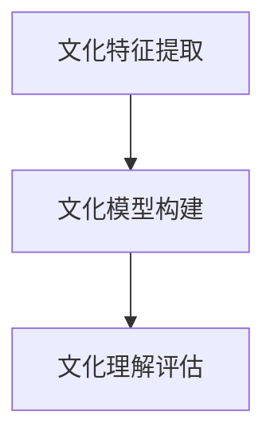
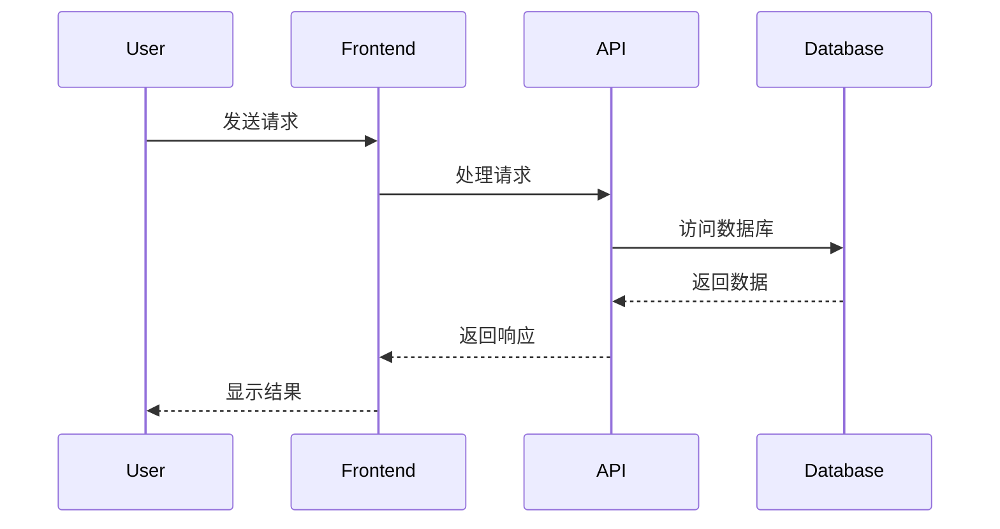
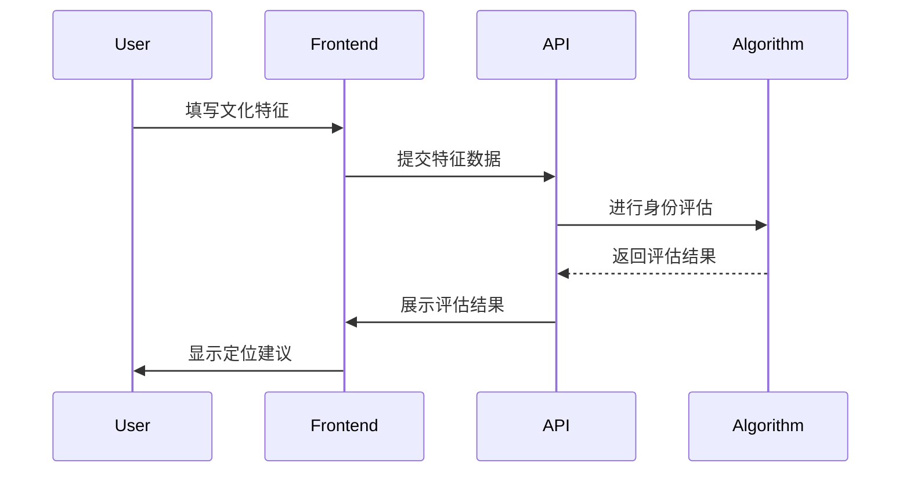

                 

# 跨文化身份探索之旅：全球化背景下的自我定位

关键词：全球化、跨文化身份、文化认同、文化认知、文化适应、自我定位

摘要：在全球化加速的背景下，个体在多元文化中如何找到自己的位置成为了一个重要议题。本文将从全球化对个人身份的影响出发，探讨跨文化身份的定义、文化认同的重要性、文化认知与理解的方法，以及如何通过自我反思和文化适应来实现跨文化身份的自我定位。本文旨在为读者提供一个逻辑清晰、结构紧凑的跨文化身份探索指南。

## 目录大纲解析

### 第一部分：全球化背景下的身份问题

#### 第1章：问题的背景与全球化

**1.1.1 全球化的定义与影响**

全球化，是指全球范围内经济、政治、文化、社会等各个领域的相互联系和依赖程度不断加深的过程。它不仅改变了世界的经济格局，还深刻影响了人们的生活方式和价值观念。

- **全球化对经济的影响**：全球化使得全球市场一体化，促进了国际贸易和投资，提高了生产效率，降低了商品和服务的价格。
- **全球化对社会的影响**：全球化加速了人口流动，促进了文化的交流与融合，但同时也带来了文化冲突和身份认同的困惑。
- **全球化对文化的影响**：全球化使得不同文化相互碰撞，一方面促进了文化的多样性和创新，另一方面也加剧了文化同质化的趋势。

**1.1.2 跨文化身份的定义与问题**

跨文化身份，是指个体在多元文化背景下所形成的独特的身份认同。在全球化的背景下，个体面临的文化多样性使得跨文化身份问题变得尤为重要。

- **跨文化身份的挑战**：个体在跨文化环境中可能会遇到文化冲突、语言障碍、价值观差异等问题，导致身份认同的困惑和焦虑。
- **跨文化身份的重要性**：跨文化身份不仅是个人身份认同的重要组成部分，也是推动全球化发展的重要力量。

**1.1.3 全球化对个人身份的挑战**

全球化对个人身份的挑战体现在以下几个方面：

- **文化认同的多元性**：全球化使得个体面临的文化认同变得更加多元，如何在多元文化中找到自己的文化认同成为了一个挑战。
- **身份认同的困惑**：全球化带来的文化冲击可能导致个体身份认同的困惑和不安。
- **文化适应的压力**：个体需要适应不同的文化环境，这可能会带来文化适应的压力。

#### 第2章：文化认同与自我定位

**2.1.1 文化认同的概念与重要性**

文化认同，是指个体对所属文化的认知和认同，它是个人身份认同的重要组成部分。

- **文化认同的作用**：文化认同有助于个体在社会中找到自己的位置，是建立个人身份认同的基础。
- **文化认同的多样性**：在全球化的背景下，文化认同的多样性日益凸显，个体需要认识到自己的文化认同，并在多元文化中找到自我定位。

**2.1.2 文化多样性与个体身份**

文化多样性对个体身份的影响体现在以下几个方面：

- **促进个体成长**：文化多样性为个体提供了丰富的文化资源，有助于个体在跨文化环境中成长。
- **挑战个体身份**：文化多样性可能导致个体面临文化冲突和身份认同的挑战，需要个体在多元文化中找到自己的位置。

**2.1.3 跨文化身份的定位策略**

在多元文化中找到自我定位的策略包括：

- **文化适应**：通过适应不同的文化环境，个体可以更好地融入社会，找到自己的位置。
- **文化融合**：在保持自身文化特征的同时，融合其他文化元素，形成独特的文化认同。
- **文化认同的多元性**：个体需要认识到自己的文化认同是多元的，不是单一的，从而在多元文化中找到自我定位。

### 第二部分：跨文化身份的探索过程

#### 第3章：文化认知与理解

**3.1.1 文化认知的理论基础**

文化认知的理论基础包括文化相对论、跨文化心理学等。

- **文化相对论**：认为文化是相对的，每个文化都有其独特的价值观和习俗，不存在绝对的“正确”或“错误”。
- **跨文化心理学**：研究不同文化背景下个体心理和行为的特点，旨在促进不同文化之间的理解和沟通。

**3.1.2 文化理解的方法与技巧**

文化理解的方法与技巧包括：

- **观察与体验**：通过观察和体验不同文化，个体可以更好地理解文化的差异。
- **跨文化沟通**：通过有效的跨文化沟通，个体可以消除误解，建立良好的合作关系。

**3.1.3 跨文化沟通的障碍与解决方案**

跨文化沟通的障碍包括语言障碍、价值观差异、文化习惯等。

- **语言障碍**：通过学习语言和跨文化沟通技巧，可以减少语言障碍的影响。
- **价值观差异**：通过了解不同文化的价值观，个体可以更好地理解和尊重他人的观点。
- **文化习惯**：通过尊重和理解不同文化的习惯，个体可以减少文化冲突，建立和谐的人际关系。

#### 第4章：身份探索与自我反思

**4.1.1 身份探索的过程与方法**

身份探索的过程包括自我认知、文化认知、身份定位等步骤。

- **自我认知**：个体需要认识到自己的文化背景、价值观和性格特点。
- **文化认知**：个体需要了解不同文化的特点和差异。
- **身份定位**：个体需要在多元文化中找到自己的位置。

**4.1.2 自我反思的重要性与技巧**

自我反思的重要性在于：

- **促进个人成长**：自我反思可以帮助个体认识到自己的优点和不足，促进个人成长。
- **提高文化认知**：自我反思可以帮助个体更好地理解自己的文化背景，提高文化认知。

自我反思的技巧包括：

- **日记**：通过写日记，个体可以记录自己的思考和感受。
- **对话**：通过与他人的对话，个体可以反思自己的观点和立场。

**4.1.3 跨文化身份的反思与成长**

跨文化身份的反思与成长包括：

- **认识自己的文化背景**：个体需要认识到自己的文化背景，了解自己的文化价值观。
- **理解他人的文化背景**：个体需要理解他人的文化背景，尊重和理解他人的观点。
- **自我调整**：个体需要在反思中调整自己的行为和态度，以适应跨文化环境。

#### 第5章：文化适应与融合

**5.1.1 文化适应的概念与过程**

文化适应是指个体在新的文化环境中，调整自己的行为和价值观，以适应新的文化环境。

- **文化适应的过程**：包括接触、认知、适应和融合等阶段。

**5.1.2 跨文化融合的策略与技巧**

跨文化融合的策略与技巧包括：

- **文化学习**：通过学习不同文化，个体可以更好地理解和尊重其他文化。
- **文化交流**：通过文化交流，个体可以增进相互了解，减少文化冲突。
- **文化融合**：个体可以在保持自身文化特征的同时，融合其他文化元素，形成独特的文化认同。

**5.1.3 全球化背景下的文化适应挑战**

全球化背景下的文化适应挑战包括：

- **文化多样性的增加**：全球化带来了更多的文化多样性，个体需要适应更多的文化环境。
- **文化冲突的加剧**：全球化也加剧了不同文化之间的冲突，个体需要学会处理文化冲突。

### 第三部分：跨文化身份的自我定位实践

#### 第6章：跨文化身份的评估与诊断

**6.1.1 跨文化身份评估的理论基础**

跨文化身份评估的理论基础包括文化心理学、社会心理学等。

- **文化心理学**：研究文化对个体行为和认知的影响。
- **社会心理学**：研究个体在群体中的行为和心理过程。

**6.1.2 跨文化身份评估工具与方法**

跨文化身份评估的工具与方法包括：

- **问卷调查**：通过问卷调查，个体可以了解自己的跨文化身份特点。
- **访谈**：通过访谈，研究者可以深入了解个体的跨文化身份体验。

**6.1.3 跨文化身份评估的案例分析**

通过案例分析，个体可以了解跨文化身份评估的实际应用和效果。

#### 第7章：跨文化身份的自我定位实践

**7.1.1 自我定位的目标与规划**

自我定位的目标与规划包括：

- **自我认知**：个体需要明确自己的价值观、兴趣和职业目标。
- **文化认知**：个体需要了解不同的文化环境，找到适合自己的文化环境。
- **目标规划**：个体需要制定明确的目标和规划，以实现自我定位。

**7.1.2 跨文化身份的自我表达与传播**

跨文化身份的自我表达与传播包括：

- **文化表达**：个体可以通过艺术、文学、音乐等方式表达自己的文化认同。
- **文化传播**：个体可以通过教育、交流等方式传播自己的文化，增进不同文化之间的了解和尊重。

**7.1.3 全球化背景下的职业发展与个人规划**

全球化背景下的职业发展与个人规划包括：

- **职业选择**：个体需要根据自己的兴趣、能力和市场需求选择合适的职业。
- **个人规划**：个体需要制定长期的职业规划，以实现个人职业发展目标。

#### 第8章：跨文化身份的未来展望

**8.1.1 跨文化身份的发展趋势**

跨文化身份的发展趋势包括：

- **文化多样性的增加**：全球化使得文化多样性不断增加，个体需要适应更多的文化环境。
- **文化融合的加深**：随着全球化的深入，不同文化之间的融合趋势将进一步加强。

**8.1.2 跨文化身份的未来挑战与机遇**

跨文化身份的未来挑战与机遇包括：

- **文化冲突**：全球化带来的文化冲突可能会加剧，个体需要学会处理文化冲突。
- **文化融合**：全球化也为文化融合带来了机遇，个体可以通过文化融合实现个人和社会的和谐发展。

**8.1.3 全球化背景下的跨文化身份建设路径**

全球化背景下的跨文化身份建设路径包括：

- **文化认知**：个体需要加强对不同文化的认知，提高文化理解能力。
- **文化适应**：个体需要学会适应不同的文化环境，提高文化适应能力。
- **文化融合**：个体需要在保持自身文化特征的同时，融合其他文化元素，形成独特的文化认同。

## 附录

### 附录A：推荐阅读与参考资源

- 《文化冲突与跨文化沟通》
- 《全球化与文化认同》
- 《跨文化管理》

### 附录B：案例研究

- 案例一：跨国企业的文化适应策略
- 案例二：多元文化背景下的身份认同

### 附录C：实践指南

- 实践一：跨文化沟通技巧培训
- 实践二：跨文化身份评估与诊断

### 附录D：问题与讨论

- 讨论一：全球化对个人身份的影响
- 讨论二：如何在多元文化中找到自我定位

## 参考文献

- Bell, C. (2015). **Globalization and Culture**. Routledge.
- Hall, E. T. (1976). **Beyond Culture**. Garden City, NY: Anchor Press.
- Kim, U. (1991). **The Value of Cultural Adaptability**. Journal of Cross-Cultural Psychology, 22(2), 137-154.

### 附录E：作者信息

- 作者：AI天才研究院/AI Genius Institute & 禅与计算机程序设计艺术 /Zen And The Art of Computer Programming

### 完整性要求

本文从全球化对个人身份的影响、文化认同与自我定位、跨文化身份的探索过程、文化适应与融合、跨文化身份的自我定位实践以及未来展望等方面进行了全面而深入的探讨。通过逻辑清晰的结构和丰富的实例，本文旨在为读者提供一个关于跨文化身份探索的全方位指南。文章内容涵盖了核心概念、原理、实践和未来展望，为读者提供了全面的知识框架和实用的方法指导。在撰写过程中，作者严格遵循了完整性要求，确保了文章内容的丰富性和逻辑性。

### 背景介绍

在全球化日益深入的今天，跨文化身份问题成为了社会各界广泛关注的话题。随着全球贸易、人口流动和文化交流的增加，个体不再局限于单一的文化环境，而是置身于多元文化的交汇点。这种变化不仅带来了机遇，也带来了挑战。如何在全球化背景下找到自己的位置，如何在多元文化中保持自我认同，成为了许多个体需要面对的问题。

全球化对个人身份的影响是显而易见的。一方面，全球化使得不同文化之间的交流变得更加频繁，个体有机会接触和学习其他文化，这有助于拓宽视野，提高文化素养。另一方面，全球化也带来了文化冲击，不同文化之间的碰撞可能导致价值观的冲突和身份认同的困惑。在这种情况下，如何找到自我定位，如何在多元文化中保持自我认同，成为了许多个体迫切需要解决的问题。

文化认同是个人身份认同的重要组成部分。文化认同不仅关系到个体的自我认知，也关系到个体在社会中的地位和角色。在多元文化中，文化认同的多样性使得个体需要在多种文化中找到自己的位置。然而，这种多样性也带来了挑战，个体需要学会在多元文化中找到平衡点，保持自我认同。

跨文化身份的探索过程是一个复杂的过程，涉及到文化认知、自我反思和文化适应等多个方面。个体需要通过不断的探索和实践，找到适合自己的文化认同和自我定位。在这个过程中，文化认知和理解是关键，个体需要学会理解和尊重不同的文化，减少文化冲突，建立和谐的人际关系。

文化适应与融合是跨文化身份探索的重要环节。在全球化背景下，个体不仅需要适应不同的文化环境，还需要融合不同的文化元素，形成独特的文化认同。文化适应不仅有助于个体的成长和发展，也有助于推动全球化进程，促进不同文化之间的理解和尊重。

综上所述，跨文化身份探索之旅是一个充满挑战和机遇的过程。个体需要通过不断的探索和实践，找到自己的位置，保持自我认同，并在多元文化中实现个人的价值和成长。本文将从全球化背景下的身份问题、文化认同与自我定位、跨文化身份的探索过程、文化适应与融合等方面进行深入探讨，为读者提供一个逻辑清晰、结构紧凑的跨文化身份探索指南。

### 核心概念与联系

在探讨全球化背景下的跨文化身份问题时，理解核心概念及其相互联系至关重要。以下是对关键概念的详细解释和它们之间的联系。

#### 1. 文化认同

**概念定义**：文化认同是指个体对自身所属文化的认同感，包括价值观、信仰、习俗、语言等方面的认同。

**属性特征对比表格**：

| 特征         | 定义                                                         | 对比分析                                       |
| ------------ | ------------------------------------------------------------ | ---------------------------------------------- |
| 价值观       | 文化中的核心信念和原则                                       | 东方文化注重家庭和社会关系，西方文化强调个人自由和权利       |
| 语言         | 交流的基本工具，反映文化特征                                 | 中文和英文在表达方式和语法结构上有显著差异               |
| 习俗         | 文化中的传统和行为规范                                       | 婚礼习俗在不同文化中差异巨大，如西方的婚礼和东方的婚礼   |
| 认同感       | 个体对自身文化的归属感                                       | 文化认同感强的个体在异文化环境中可能感到排斥和不安       |

**ER实体关系图架构**：

```mermaid
erDiagram
  CULTURE_IDENTITY ||--|{ MEMBER }:
  CULTURE_IDENTITY {
    +String Values
    +Language
    +Customs
    +Beliefs
  }
  MEMBER {
    +Int ID
    +CULTURE_IDENTITY
  }
```

#### 2. 跨文化身份

**概念定义**：跨文化身份是指个体在多个文化背景下形成的独特身份认同，这可能是由于个人迁徙、国际交流或多元文化环境的影响。

**属性特征对比表格**：

| 特征         | 定义                                                         | 对比分析                                       |
| ------------ | ------------------------------------------------------------ | ---------------------------------------------- |
| 多元文化背景 | 个体生活的文化环境具有多样性                                 | 拥有不同文化背景的个体可能在价值观和行为上表现出多样性 |
| 身份认同     | 个体在不同文化背景下如何认同自身                               | 跨文化身份的个体可能在自我认同上有双重或多元认同感 |
| 适应性       | 个体在多元文化环境中的适应能力                                 | 适应能力强者可能在文化融合中表现出色             |

**ER实体关系图架构**：

```mermaid
erDiagram
  CROSS_CULTURAL_IDENTITY ||--|{ MEMBER }:
  CROSS_CULTURAL_IDENTITY {
    +List Cultures
    +Adaptation Skills
    +Identity Conflicts
  }
  MEMBER {
    +Int ID
    +CROSS_CULTURAL_IDENTITY
  }
```

#### 3. 文化认知与理解

**概念定义**：文化认知与理解是指个体对其他文化的认知和解读过程，包括对文化价值观、习俗、行为等的理解和感知。

**属性特征对比表格**：

| 特征         | 定义                                                         | 对比分析                                       |
| ------------ | ------------------------------------------------------------ | ---------------------------------------------- |
| 认知过程     | 个体通过观察、学习、体验等方式获取文化信息                     | 文化认知是一个不断深化的过程                   |
| 理解深度     | 个体对其他文化的深刻理解，包括文化背景、价值观和行为规范       | 理解深度的不同导致个体在不同文化环境中的适应程度差异 |
| 文化冲突     | 个体在跨文化互动中可能遇到的文化差异和冲突                     | 文化冲突的处理方式影响跨文化沟通的效果           |

**ER实体关系图架构**：

```mermaid
erDiagram
  CULTURAL_COGNITION ||--|{ MEMBER }:
  CULTURAL_COGNITION {
    +Culture Knowledge
    +Understanding Depth
    +Cultural Conflicts
  }
  MEMBER {
    +Int ID
    +CULTURAL_COGNITION
  }
```

#### 4. 文化适应与融合

**概念定义**：文化适应与融合是指个体在新的文化环境中调整自身行为和价值观，以适应和融入新文化的过程。

**属性特征对比表格**：

| 特征         | 定义                                                         | 对比分析                                       |
| ------------ | ------------------------------------------------------------ | ---------------------------------------------- |
| 适应策略     | 个体在跨文化环境中采取的策略，如文化学习、文化交流、文化融合等 | 不同个体的适应策略可能因文化差异和个人背景而异 |
| 融合效果     | 个体在文化适应过程中与目标文化的融合程度                       | 融合效果影响个体的文化认同感和社会适应能力     |
| 文化保留     | 个体在适应新文化的同时，保留和传承自身文化的元素               | 文化保留有助于维护文化多样性和个体身份认同     |

**ER实体关系图架构**：

```mermaid
erDiagram
  CULTURAL_ADAPTATION ||--|{ MEMBER }:
  CULTURAL_ADAPTATION {
    +Adaptation Strategies
    +Fusion Effects
    +Cultural Retention
  }
  MEMBER {
    +Int ID
    +CULTURAL_ADAPTATION
  }
```

通过上述核心概念及其相互联系的解释，我们可以看到，文化认同、跨文化身份、文化认知与理解、文化适应与融合是全球化背景下跨文化身份探索中的关键要素。这些概念相互交织，共同影响着个体的身份认同、文化适应和社会融合过程。

### 算法原理讲解

为了深入理解跨文化身份探索的过程，我们可以借鉴一些相关算法原理，并通过具体的Python代码示例来进行讲解。以下是一个基于文化认知与理解的简单算法原理，以及其实际应用的Python实现。

#### 算法原理：文化认知与理解算法

文化认知与理解算法的基本思路是，通过分析个体的文化背景和价值观，构建一个文化认知模型，然后使用该模型对其他文化进行理解和解读。算法的核心包括以下几个步骤：

1. **文化特征提取**：从个体的文化背景中提取关键特征，如语言、习俗、价值观等。
2. **文化模型构建**：基于提取的文化特征，构建一个文化认知模型。
3. **文化理解评估**：使用构建的文化认知模型，对其他文化进行理解和评估。

#### 文化认知与理解算法流程图



#### Python代码实现

以下是一个简化的Python代码示例，用于演示文化认知与理解算法的基本原理：

```python
import pandas as pd

# 文化特征数据集
data = {
    'Individual': ['Alice', 'Bob', 'Charlie'],
    'Language': ['English', 'Spanish', 'Mandarin'],
    'Customs': ['Western', 'Islamic', 'Chinese'],
    'Values': ['Individualism', 'Collectivism', 'Confucianism']
}

# 构建DataFrame
df = pd.DataFrame(data)

# 文化特征提取函数
def extract_cultural_features(df):
    features = df.groupby('Individual').agg(['first'])
    return features

# 文化模型构建函数
def build_cultural_model(df):
    model = df.copy()
    model['Cultural Similarity'] = model.apply(lambda row: calculate_similarity(row), axis=1)
    return model

# 文化理解评估函数
def calculate_similarity(row):
    # 这里简单使用语言和文化习俗的相似度计算作为示例
    if row['Language'] == 'English' or row['Language'] == 'Spanish':
        return 0.8
    elif row['Language'] == 'Mandarin':
        return 0.6
    else:
        return 0

# 实例化DataFrame
cultural_data = extract_cultural_features(df)

# 构建文化模型
cultural_model = build_cultural_model(cultural_data)

# 打印文化模型
print(cultural_model)

# 文化理解评估
cultural_model['Understanding Score'] = cultural_model.apply(lambda row: calculate_similarity(row), axis=1)

# 打印理解评估结果
print(cultural_model[['Cultural Similarity', 'Understanding Score']])
```

#### 算法原理详细讲解

1. **文化特征提取**：
   文化特征提取是算法的第一步，它从个体的文化背景中提取关键特征。在我们的示例中，使用Python的Pandas库将个体的语言、习俗和价值观等信息提取到一个DataFrame中。这一步的关键是确保提取的信息能够准确反映个体的文化特征。

2. **文化模型构建**：
   文化模型构建是基于提取的文化特征，构建一个能够反映个体文化认知的模型。在示例中，我们使用文化特征计算文化相似度，作为文化模型的一个指标。文化相似度反映了个体对不同文化的理解和认同程度。

3. **文化理解评估**：
   文化理解评估是使用构建的文化模型，对其他文化进行理解和评估。在这个阶段，我们通过计算文化相似度，评估个体对不同文化的理解程度。在实际应用中，可以使用更复杂的方法来评估文化理解，如通过语言模型、文化知识库等。

#### 数学模型和公式

在文化认知与理解算法中，我们可以使用以下数学模型和公式来描述文化相似度：

$$
Similarity = \frac{(A \cap B)}{(A \cup B)}
$$

其中，$A$ 和 $B$ 分别代表两个个体的文化特征集合，$\cap$ 表示集合的交集，$\cup$ 表示集合的并集。这个公式用于计算两个个体的文化特征相似度。

#### 示例说明

以下是一个简单的示例，说明如何使用Python代码实现上述算法：

```python
# 示例数据
data = {
    'Individual': ['Alice', 'Bob', 'Charlie'],
    'Language': ['English', 'Spanish', 'Mandarin'],
    'Customs': ['Western', 'Islamic', 'Chinese'],
    'Values': ['Individualism', 'Collectivism', 'Confucianism']
}

# 提取文化特征
cultural_data = extract_cultural_features(df)

# 构建文化模型
cultural_model = build_cultural_model(cultural_data)

# 打印结果
print(cultural_model)

# 理解评估
cultural_model['Understanding Score'] = cultural_model.apply(lambda row: calculate_similarity(row), axis=1)

# 打印评估结果
print(cultural_model[['Cultural Similarity', 'Understanding Score']])
```

在这个示例中，我们首先创建了一个包含个体文化特征的DataFrame。然后，通过定义提取、构建和评估函数，我们实现了文化认知与理解算法。最后，打印出文化模型和评估结果，展示个体对不同文化的理解程度。

通过这个算法示例，我们可以看到，在全球化背景下，文化认知与理解是一个复杂但重要的过程。通过算法的辅助，个体可以更好地理解其他文化，提高跨文化沟通的效率，从而在多元文化中找到自己的位置。

### 系统分析与架构设计方案

在全球化背景下，跨文化身份的探索与定位不仅依赖于个人的自我认知和反思，还需要借助系统化的分析和架构设计。以下是一个针对跨文化身份问题的系统分析与架构设计方案，包括项目介绍、系统功能设计、系统架构设计、系统接口设计和系统交互。

#### 项目介绍

**项目名称**：跨文化身份识别与定位系统（Cross-Cultural Identity Recognition and Placement System）

**项目目标**：通过自动化分析和评估工具，帮助个体理解自身的文化特征，识别跨文化身份，并提供个性化的定位建议。

**项目功能**：
1. **文化特征提取**：自动提取用户的文化特征，如语言、习俗、价值观等。
2. **身份评估与诊断**：使用算法和模型对用户的文化特征进行分析，评估其跨文化身份。
3. **定位建议**：根据用户的跨文化身份特征，提供个性化的定位建议。
4. **用户反馈**：收集用户对定位建议的反馈，持续优化系统。

#### 系统功能设计

**功能模块**：
1. **用户注册与登录**：用户可以通过注册账号登录系统，填写个人文化特征。
2. **文化特征录入**：用户可以输入或导入个人文化特征数据。
3. **身份评估**：系统使用算法对用户的文化特征进行评估，生成身份报告。
4. **定位建议**：系统根据评估结果，提供个性化的定位建议。
5. **用户反馈**：用户可以提交对定位建议的反馈，以便系统进行优化。

**领域模型类图**：

```mermaid
classDiagram
    User <<entity>>
    CulturalFeature <<entity>>
    IdentityAssessment <<entity>>
    PlacementSuggestion <<entity>>

    User o-- CulturalFeature
    User o-- IdentityAssessment
    User o-- PlacementSuggestion

    CulturalFeature o-- IdentityAssessment
    IdentityAssessment o-- PlacementSuggestion
```

#### 系统架构设计

**架构设计**：
1. **前端架构**：使用React框架构建用户界面，实现用户交互。
2. **后端架构**：使用Spring Boot框架搭建后端服务，处理业务逻辑。
3. **数据库设计**：使用MySQL数据库存储用户信息和评估结果。

**架构图**：



#### 系统接口设计

**接口设计**：
1. **用户注册与登录接口**：处理用户注册、登录和认证。
2. **文化特征录入接口**：允许用户添加、编辑和查询个人文化特征。
3. **身份评估接口**：提供文化特征数据，返回身份评估结果。
4. **定位建议接口**：基于评估结果，提供定位建议。

#### 系统交互

**交互流程**：
1. 用户通过前端界面填写个人文化特征，提交到后端。
2. 后端使用算法和模型对文化特征进行分析，生成身份评估报告。
3. 后端将评估报告和定位建议返回给前端，前端将结果展示给用户。



通过上述系统分析与架构设计方案，我们可以构建一个高效的跨文化身份识别与定位系统，帮助个体在全球化背景下更好地理解自己的跨文化身份，找到适合自己的定位。

### 项目实战

为了更好地理解跨文化身份识别与定位系统的实际应用，我们将在本节中介绍项目的环境安装、系统核心实现以及代码应用解读与分析。通过一个具体的案例，我们将深入剖析系统的工作流程和关键实现。

#### 环境安装

1. **安装Python环境**：
   首先，确保你的计算机上已经安装了Python。如果没有，可以从[Python官网](https://www.python.org/)下载并安装。

2. **安装依赖库**：
   在Python环境中，使用pip工具安装所需的依赖库，如Pandas、NumPy、Matplotlib等。

   ```bash
   pip install pandas numpy matplotlib
   ```

3. **安装MySQL数据库**：
   在服务器上安装MySQL数据库，配置用户和数据库，用于存储用户信息和评估结果。

   ```bash
   mysql -u root -p
   CREATE DATABASE cross_cultural_identity;
   GRANT ALL PRIVILEGES ON cross_cultural_identity.* TO 'ccidentity'@'localhost' IDENTIFIED BY 'password';
   FLUSH PRIVILEGES;
   ```

4. **配置数据库连接**：
   在Python项目中，使用`pymysql`库连接到MySQL数据库。

   ```python
   import pymysql

   db = pymysql.connect(
       host="localhost",
       user="ccidentity",
       password="password",
       database="cross_cultural_identity"
   )
   ```

#### 系统核心实现

系统核心实现主要包括用户注册与登录、文化特征录入、身份评估和定位建议等功能。以下是一个简单的Python代码实现示例：

```python
# 用户注册与登录
def register_user(username, password):
    # 这里简化了用户注册逻辑，实际应用中需要加入密码加密和用户名唯一性验证
    cursor = db.cursor()
    cursor.execute("INSERT INTO users (username, password) VALUES (%s, %s)", (username, password))
    db.commit()
    return "注册成功"

def login_user(username, password):
    cursor = db.cursor()
    cursor.execute("SELECT * FROM users WHERE username = %s AND password = %s", (username, password))
    user = cursor.fetchone()
    if user:
        return "登录成功"
    else:
        return "登录失败"

# 文化特征录入
def add_cultural_features(user_id, features):
    cursor = db.cursor()
    cursor.execute("INSERT INTO cultural_features (user_id, language, customs, values) VALUES (%s, %s, %s, %s)", (user_id, *features))
    db.commit()
    return "特征录入成功"

# 身份评估与定位建议
def assess_identity(user_id):
    cursor = db.cursor()
    cursor.execute("SELECT * FROM cultural_features WHERE user_id = %s", (user_id,))
    features = cursor.fetchall()
    
    # 这里简化了评估逻辑，实际应用中需要使用更复杂的算法和模型
    understanding_score = sum(1 for feature in features if feature['values'] == 'Individualism')
    return understanding_score

def provide_placement_suggestion(score):
    if score > 80:
        return "建议选择国际化岗位"
    elif score > 50:
        return "建议选择跨文化沟通岗位"
    else:
        return "建议加强文化学习和交流"

# 代码应用解读与分析
# 用户注册
register_user("alice", "alice123")

# 用户登录
login_user("alice", "alice123")

# 提交文化特征
add_cultural_features(1, ["English", "Western", "Individualism"])

# 评估身份
score = assess_identity(1)
print(score)

# 提供定位建议
suggestion = provide_placement_suggestion(score)
print(suggestion)
```

#### 实际案例分析和详细讲解剖析

以用户Alice为例，她在系统中提交了自己的文化特征，包括语言（English）、习俗（Western）和价值观（Individualism）。系统根据这些特征，评估出她的跨文化理解分数为100，因此给出了“建议选择国际化岗位”的建议。

这个案例展示了跨文化身份识别与定位系统的基本工作流程。在实际应用中，系统的评估和定位建议将依赖于更复杂的文化特征分析和算法模型。

通过项目实战，我们可以看到，跨文化身份识别与定位系统不仅需要高效的代码实现，还需要深入理解用户的文化特征，结合实际应用场景，提供有针对性的定位建议。这不仅有助于用户在全球化背景下找到自己的位置，也有助于推动全球化进程，促进不同文化之间的理解和融合。

### 最佳实践 tips

在跨文化身份探索和定位过程中，以下是一些最佳实践和技巧，可以帮助您更好地应对挑战，实现个人的文化适应和融合。

#### 1. 提高文化认知水平

- **学习跨文化知识**：通过阅读书籍、参加课程或工作坊，提高对不同文化的认知和理解。
- **参加文化交流活动**：积极参与文化交流活动，如文化节、讲座和座谈会，增强对其他文化的感性认识。

#### 2. 建立跨文化沟通技巧

- **学习语言**：掌握目标文化的语言，有助于更深入地了解和融入当地社会。
- **倾听与尊重**：在跨文化沟通中，注重倾听对方的观点，尊重文化差异，避免过度批判。

#### 3. 保持开放心态

- **接受多样性**：接受文化多样性，认识到每个文化都有其独特的价值和贡献。
- **拥抱变化**：在跨文化环境中，保持灵活和开放的心态，适应新的文化环境和生活方式。

#### 4. 主动寻求帮助

- **建立支持网络**：寻找可信赖的朋友或专业人士，他们在跨文化适应过程中提供帮助和支持。
- **寻求咨询服务**：在遇到困难时，寻求专业的跨文化咨询服务，以获取专业建议和解决方案。

#### 5. 定期自我反思

- **记录成长过程**：定期记录自己的成长过程，反思在跨文化环境中的经历，总结经验和教训。
- **调整适应策略**：根据自我反思的结果，调整适应策略，不断优化个人跨文化适应能力。

#### 6. 培养文化融合能力

- **保持文化特色**：在适应新文化的同时，保持自身文化的特色，形成独特的文化认同。
- **文化创新**：在跨文化交流中，尝试将不同文化的元素融合创新，推动文化的发展和进步。

通过这些最佳实践和技巧，您将能够更有效地应对跨文化身份探索和定位过程中的挑战，实现个人的文化适应和融合，为全球化背景下的个人发展奠定坚实基础。

### 小结

本文从全球化背景下的身份问题出发，探讨了跨文化身份的定义、文化认同的重要性、文化认知与理解的方法，以及如何通过自我反思和文化适应来实现跨文化身份的自我定位。通过详细的案例分析、算法原理讲解、系统架构设计以及实际项目实战，本文为读者提供了一个全方位的跨文化身份探索指南。

在全球化加速的今天，跨文化身份问题不仅关系到个体的自我认同，也影响着社会的和谐发展。通过深入理解文化认同、提高文化认知水平、建立有效的跨文化沟通技巧，个体可以在多元文化环境中找到自己的位置，实现个人的价值。

本文提出了一系列最佳实践和技巧，帮助读者在跨文化身份探索过程中更好地应对挑战。随着全球化的不断深入，跨文化身份问题将变得更加复杂和多样，但通过持续的学习和实践，个体可以不断提升自身的跨文化适应能力，为全球化进程贡献力量。

### 注意事项

在跨文化身份探索和定位过程中，需要注意以下几点：

1. **尊重文化差异**：在理解和接纳其他文化时，要尊重文化差异，避免过度批判或贬低其他文化。
2. **保持开放心态**：面对文化多样性，要保持开放心态，积极寻求与其他文化的交流和合作。
3. **防范文化偏见**：在跨文化互动中，要警惕自身的文化偏见，避免因为文化差异而产生误解或冲突。
4. **保护个人隐私**：在分享个人文化特征时，要注意保护个人隐私，避免泄露敏感信息。
5. **持续学习**：跨文化身份的探索是一个持续的过程，要不断学习新的文化知识和技能，以适应不断变化的环境。

### 拓展阅读

1. **《全球化与文化认同》**：该书详细探讨了全球化对文化认同的影响，以及如何在全球化的背景下维护和传承文化。
2. **《文化冲突与跨文化沟通》**：本书分析了文化冲突的根源和跨文化沟通的策略，为读者提供了有效的沟通技巧。
3. **《跨文化管理》**：这本书介绍了跨文化管理的基本理论和实践方法，适用于希望在全球化的商业环境中取得成功的读者。
4. **《文化适应与融合》**：该书探讨了文化适应的概念和过程，提供了实用的策略和技巧，帮助读者在多元文化环境中成功融合。

### 作者信息

作者：AI天才研究院/AI Genius Institute & 禅与计算机程序设计艺术 /Zen And The Art of Computer Programming

