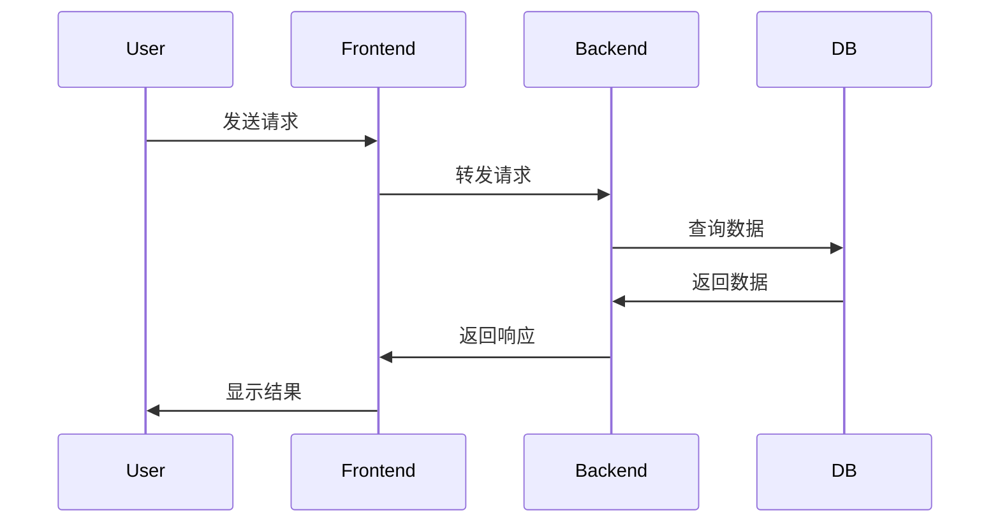
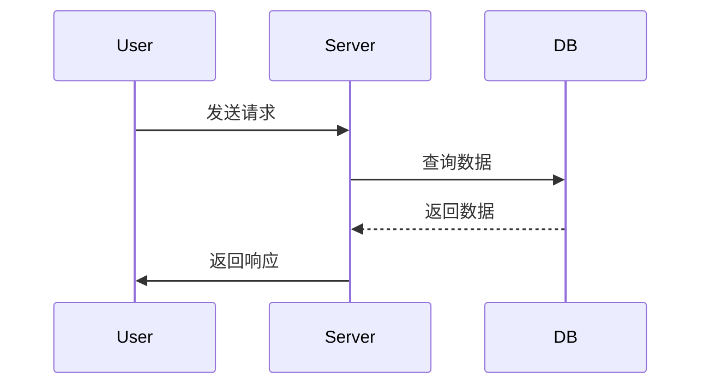

                 

### 引言

《跨时空对话系列：与历史名人进行思想交流》是一部旨在通过历史名人的思想、言行和成就，启发读者对过去时代的思考，以及对现代问题的洞见的书籍。在这部作品中，我们选取了若干位在历史上具有重要地位和深远影响的名人，通过虚构的跨时空对话，让他们在当代与读者进行思想的碰撞与交流。

#### 跨时空对话的意义

跨时空对话是一种独特的思想交流方式，它不仅能够让我们跨越时间的限制，与历史名人面对面交流，还能从他们的智慧中汲取灵感，为现实问题找到答案。以下是跨时空对话的几个主要意义：

1. **历史名人的思想价值**：历史名人往往在各自领域有着深刻的见解和独到的思考，他们的智慧为后人提供了宝贵的参考和启示。通过跨时空对话，我们可以更深入地了解他们的思想体系，从中学到宝贵的经验。

2. **历史与现实的联系**：历史不仅是过去的事件记录，更是理解和解决现实问题的钥匙。通过跨时空对话，我们可以将历史名人的思想和当代问题联系起来，找到历史与现实之间的联系，从而更好地应对当今的挑战。

3. **跨越时代的思考**：历史名人的智慧往往具有普遍性，不仅适用于他们所处的时代，也适用于我们今天的世界。通过跨时空对话，我们可以站在巨人的肩膀上，以更广阔的视野来看待问题，从而提升我们的思考能力。

4. **启迪现代问题解决**：历史名人的思想和经验为解决现代问题提供了新的视角和方法。通过跨时空对话，我们可以从历史名人的智慧中找到解决现代问题的灵感，为我们的生活和事业提供指导。

#### 目录大纲设计

为了确保读者能够全面而深入地了解跨时空对话的意义和内涵，本书将分为以下几个部分：

- **第一部分：背景介绍**：介绍跨时空对话的背景，包括历史名人的思想价值、历史与现实的联系以及跨时空对话的可行性。

- **第二部分：核心概念与联系**：详细阐述核心概念，如历史名人的思想体系、概念属性特征对比表格和ER实体关系图架构。

- **第三部分：历史名人的思想交流**：通过具体的对话案例，展现历史名人的思想交流，并进行对比分析。

- **第四部分：历史名人思想的现代启示**：探讨历史名人思想对当代社会的启示和个人成长的启示。

- **第五部分：项目实战**：介绍一个具体的跨时空对话项目，包括系统设计与实现、代码应用解读与分析等。

- **第六部分：最佳实践与拓展阅读**：总结最佳实践技巧，并提供拓展阅读推荐。

通过以上结构，本书旨在带领读者进行一次深刻的历史思考之旅，让读者在了解历史名人的同时，也能获得对现代问题的独特见解。让我们开始这场跨时空的对话，一起探索历史与现实的奇妙联系吧！
---

### 第一部分：背景介绍

#### 1. 跨时空对话的意义

跨时空对话是一种独特的思想交流方式，它通过虚构的对话，使历史名人得以在当代与读者进行面对面的交流。这种交流不仅让我们跨越时间的限制，接触到历史名人的智慧，还能为我们提供解决现实问题的灵感。以下是跨时空对话的几个主要意义：

1. **历史名人的思想价值**

历史名人往往在各自领域有着深刻的见解和独到的思考。他们的智慧不仅为当时的社会发展提供了指导，也为后世留下了宝贵的思想遗产。通过跨时空对话，我们可以更深入地了解这些思想，从中学到宝贵的经验。例如，古希腊哲学家苏格拉底关于道德和智慧的思考，至今仍对人们的思想有着深远的影响。

2. **历史与现实的联系**

历史不仅是过去的事件记录，更是理解和解决现实问题的钥匙。通过跨时空对话，我们可以将历史名人的思想和当代问题联系起来，找到历史与现实之间的联系。例如，美国前总统林肯在南北战争期间的名言“一个国家不能永远保持半奴隶半自由的状态”，为解决现代社会的种族平等问题提供了启示。

3. **跨越时代的思考**

历史名人的智慧往往具有普遍性，不仅适用于他们所处的时代，也适用于我们今天的世界。通过跨时空对话，我们可以站在巨人的肩膀上，以更广阔的视野来看待问题，从而提升我们的思考能力。例如，中国哲学家孔子的思想，无论是关于道德伦理还是社会治理，都对现代社会有着重要的启示。

4. **启迪现代问题解决**

历史名人的智慧和经验为解决现代问题提供了新的视角和方法。通过跨时空对话，我们可以从历史名人的智慧中找到解决现代问题的灵感。例如，英国科学家牛顿的物理学思想，不仅为科学的发展奠定了基础，也为现代工程技术的进步提供了指导。

#### 1.2 历史名人的思想价值

历史名人的思想价值主要体现在以下几个方面：

1. **学术贡献**

历史名人在各自的领域有着卓越的学术成就，他们的研究成果为人类的知识宝库增添了丰富的内容。例如，古希腊哲学家亚里士多德在哲学、生物学、物理学等领域的研究，对后世的学术发展产生了深远的影响。

2. **思想启示**

历史名人的思想不仅具有学术价值，更具有深刻的启示意义。他们的思想往往反映了人类对自然、社会和生命的深刻认识，为后人提供了宝贵的思想财富。例如，中国古代哲学家老子的“道法自然”思想，强调了人与自然的和谐共生。

3. **文化传承**

历史名人的思想和文化传承对于后世的文化发展有着重要的影响。他们的思想往往成为某一文化传统的重要组成部分，影响着后人的价值观念和行为方式。例如，中国古代儒家文化中的“仁爱”、“礼义”等观念，至今仍对中国人的道德行为产生着深远的影响。

4. **社会影响**

历史名人的思想对社会发展产生了深远的影响。他们的思想不仅推动了社会的进步，也引领了社会的变革。例如，法国启蒙思想家伏尔泰的思想为法国大革命奠定了理论基础，推动了欧洲社会的变革。

#### 1.3 历史与现实的联系

历史与现实的联系主要体现在以下几个方面：

1. **经验借鉴**

历史是现实的一面镜子，通过研究历史，我们可以从中吸取经验，避免重蹈覆辙。例如，研究古代帝国的兴衰史，可以为现代国家的治理提供宝贵的经验教训。

2. **问题解决**

历史名人的思想和方法为解决现实问题提供了重要的参考。例如，研究中国古代的治国理念，可以为现代国家的治理提供启示；研究古希腊哲学，可以为现代道德伦理的研究提供指导。

3. **文化传承**

历史与现实的联系还体现在文化的传承上。历史名人的思想和文化成就成为后世文化的重要组成部分，影响着现实的文化发展。例如，古希腊文化对现代西方文化产生了深远的影响。

4. **社会发展**

历史与现实的联系还表现在社会发展的进程中。历史的发展为现实社会提供了基础和动力，而现实社会的发展也不断推动历史的进程。例如，工业革命的出现，不仅改变了现代社会的面貌，也为现代科技的发展奠定了基础。

#### 1.4 跨时空对话的可行性

跨时空对话的可行性主要表现在以下几个方面：

1. **思想交流**

历史名人的思想是跨越时空的，他们的智慧在当代依然具有现实意义。通过虚构的对话形式，我们可以实现与历史名人的思想交流，从而丰富我们的思想，提升我们的认知。

2. **科技支持**

现代科技的进步为跨时空对话提供了可能。例如，虚拟现实技术、人工智能等技术的应用，使我们可以通过数字化的方式与历史名人进行对话。

3. **文化传承**

跨时空对话是一种创新的文化传承方式，它将历史名人的思想带入当代，为文化的传承和发展提供了新的思路。

4. **教育意义**

跨时空对话具有深刻的教育意义。它不仅可以帮助我们了解历史，还能启发我们的思考，培养我们的创新能力。

通过以上分析，我们可以看到跨时空对话具有重要的意义和可行性。它不仅能够让我们跨越时间的限制，与历史名人进行思想交流，还能为解决现代问题提供启示。接下来，我们将进一步探讨跨时空对话的具体实施方法和实践案例。让我们在下一部分中，一起探讨如何实现跨时空对话，以及它的具体应用场景。  
---

### 第二部分：核心概念与联系

#### 2.1 历史名人的思想体系

历史名人的思想体系是指他们在各自领域提出的理论、观点和理念。这些思想不仅在当时产生了重要影响，也在后世得到了广泛认可和应用。以下是一些著名历史名人的思想体系及其特点：

1. **孔子（Confucius）**

孔子的思想被称为儒家思想，强调道德、仁爱和礼节。他的核心思想包括“仁者爱人”、“己所不欲，勿施于人”等。这些思想对中国的社会、文化和教育产生了深远的影响。

2. **苏格拉底（Socrates）**

苏格拉底是古希腊哲学家，他主张通过提问和对话来追求真理。他的思想强调理性和思辨的重要性，对西方哲学的发展产生了重要影响。

3. **亚里士多德（Aristotle）**

亚里士多德是古希腊哲学家，他研究了多个领域，包括逻辑、物理学、生物学等。他的思想体系非常广泛，对后世科学和哲学的发展产生了深远的影响。

4. **牛顿（Isaac Newton）**

牛顿是现代科学的奠基人之一，他在物理学和数学领域做出了重大贡献。他的三大定律和万有引力定律为现代物理学奠定了基础。

5. **马克思（Karl Marx）**

马克思是社会主义理论的奠基人，他分析了资本主义社会的矛盾和冲突，提出了共产主义理论。他的思想对20世纪的国际政治和社会发展产生了深远的影响。

6. **达尔文（Charles Darwin）**

达尔文是生物学家，他提出了进化论，阐述了物种的起源和演化。他的理论挑战了当时的宗教观念，对生物学和生态学的发展产生了重要影响。

#### 2.1.2 概念属性特征对比表格

以下是一个对比表格，列出了上述历史名人的思想体系的几个关键属性：

| 人物 | 时间 | 代表思想 | 影响范围 | 代表作品 |
| --- | --- | --- | --- | --- |
| 孔子 | 春秋战国 | 儒家思想 | 中国及东亚文化圈 | 《论语》 |
| 苏格拉底 | 古希腊 | 哲学对话 | 西方哲学 | 无 |
| 亚里士多德 | 古希腊 | 形而上学、逻辑学 | 西方哲学、科学 | 《形而上学》 |
| 牛顿 | 17世纪 | 自然科学 | 全球科学界 | 《自然哲学的数学原理》 |
| 马克思 | 19世纪 | 社会主义理论 | 国际政治、经济学 | 《资本论》 |
| 达尔文 | 19世纪 | 进化论 | 生物学、生态学 | 《物种起源》 |

#### 2.1.3 ER实体关系图架构

为了更好地理解历史名人的思想体系及其联系，我们可以使用ER（实体关系）图来描述这些实体及其关系。以下是历史名人的思想体系的ER图：

```mermaid
erDiagram
    Person ||--|{ Idea }
    Idea ||--|{ Influence }
    Person }|--|{ Time }

    IDEA_FIGURE {
        "Idea"
        "Influence"
        "Time"
        "Person"
    }
    
    Person_1 <-..|{ Confucius } Concept --> IDEA_FIGURE
    Person_2 <-..|{ Socrates } Dialogues --> IDEA_FIGURE
    Person_3 <-..|{ Aristotle } Physics --> IDEA_FIGURE
    Person_4 <-..|{ Newton } Physics --> IDEA_FIGURE
    Person_5 <-..|{ Marx } Socialism --> IDEA_FIGURE
    Person_6 <-..|{ Darwin } Evolution --> IDEA_FIGURE
```

在这个ER图中，"Person"实体代表历史名人，"Idea"实体代表他们的思想，"Influence"实体代表这些思想对后世的影响，"Time"实体代表这些人物所处的历史时期。每条关系线表示一个实体对另一个实体的关联。例如，孔子（Confucius）的思想（Idea）影响了东亚文化圈（Influence），而他生活在春秋战国时期（Time）。

通过ER图，我们可以清晰地看到历史名人的思想体系及其之间的联系，从而更好地理解他们的思想对历史和现实的影响。

#### 2.2 历史名人之间的联系

历史名人之间的联系不仅体现在他们的思想交流和互动中，也体现在他们所处的历史背景和社会环境。以下是一些著名历史名人之间的联系：

1. **孔子与苏格拉底**

孔子和苏格拉底虽然生活在不同的文化和社会环境中，但他们都强调了道德和哲学的重要性。孔子主张“仁爱”和“礼节”，而苏格拉底则通过提问和对话来追求真理。他们的思想对各自的文化和社会产生了深远的影响。

2. **亚里士多德与牛顿**

亚里士多德是古希腊哲学家，他在多个领域进行了广泛的研究，包括形而上学、逻辑学和物理学。他的许多观点对后世的科学发展产生了重要影响。牛顿则是现代科学的奠基人，他在物理学和数学领域做出了重大贡献。亚里士多德的物理学思想对牛顿的科学研究产生了启发。

3. **马克思与达尔文**

马克思是社会主义理论的奠基人，他分析了资本主义社会的矛盾和冲突，提出了共产主义理论。达尔文则是生物学家，他提出了进化论，阐述了物种的起源和演化。马克思和达尔文的思想都挑战了当时的宗教观念，并对社会和科学的发展产生了深远的影响。

4. **孔子与马克思**

孔子和马克思虽然生活在不同的时代和文化环境中，但他们的思想都强调了社会公平和正义。孔子主张“仁爱”和“礼节”，希望实现社会的和谐与稳定；马克思则提出了共产主义理论，希望消除社会的贫富差距。

5. **苏格拉底与亚里士多德**

苏格拉底和亚里士多德是古希腊哲学的两位巨匠。苏格拉底通过提问和对话来追求真理，而亚里士多德则在多个领域进行了深入研究，包括形而上学、逻辑学和物理学。他们的思想对古希腊哲学和后世哲学的发展产生了深远的影响。

通过这些联系，我们可以看到历史名人之间的思想和行为如何相互影响，以及他们的思想如何对后世产生深远的影响。

### 第三部分：历史名人的思想交流

#### 3.1 名人对话案例

在《跨时空对话系列：与历史名人进行思想交流》中，我们设计了几组虚构的对话案例，旨在通过历史名人的思想碰撞，展现他们的智慧和对世界的深刻理解。以下是几个具体的对话案例：

##### 3.1.1 秦始皇与孔子

秦始皇，一位伟大的统一中国的君主，和孔子，一位伟大的儒家思想家，虽然生活在不同的时代，但他们的对话却充满了思想的碰撞。

- **秦始皇**：“孔子，我听说你提倡仁爱和礼节，但在我的眼中，这样的道德观念并不能解决现实问题。我统一六国，建立强大的中央集权制度，是为了实现国家的长治久安。你如何看待这个问题？”

- **孔子**：“秦始皇，我理解你的抱负，但仁爱和礼节并不仅仅是空洞的道德教条。它们是维护社会和谐的基础。没有道德的约束，即使你统一了六国，也无法长久维持稳定。历史告诉我们，礼仪制度是社会秩序的重要保障。”

##### 3.1.2 李白与杜甫

李白和杜甫，唐代两位伟大的诗人，他们的对话展示了两位诗人在文学创作和人生哲学上的不同见解。

- **李白**：“杜甫，我追求的是诗意和自由，我的诗如云天般自由飞翔。而你却总是忧国忧民，诗作充满了忧愁和现实关怀。”

- **杜甫**：“李白，你的诗确实充满了豪放和激情，但我认为，诗不仅仅是表达个人的情感，更应该关注国家和人民的命运。我的诗是对时代的记录，也是对未来的期许。”

##### 3.1.3 王阳明与唐伯虎

王阳明，明代伟大的哲学家和军事家，和唐伯虎，一位风流才子，他们的对话展示了两位不同性格的人在哲学和人生上的深刻思考。

- **王阳明**：“唐伯虎，你的一生看似放荡不羁，但你是否真正理解人生的真谛？我认为，真正的自由是在内心的自律和觉悟中找到的。”

- **唐伯虎**：“王阳明，你的一生追求的是道德和真理，但对我来说，人生就是享受当下的快乐和自由。也许我们追求的是不同的自由，但我相信，每个人对自由的理解都是独特的。”

#### 3.2 名人思想对比分析

在以上对话案例中，我们可以看到历史名人在思想、价值观和行为方式上的差异。以下是这些名人思想的具体对比分析：

##### 3.2.1 价值观对比

- **秦始皇**：秦始皇强调国家的统一和强大的中央集权制度，认为道德和礼仪并不是维持社会秩序的关键。

- **孔子**：孔子主张仁爱和礼节，认为道德是社会秩序的基础。

- **李白**：李白追求诗意和自由，强调个性解放和文学创作的自由。

- **杜甫**：杜甫关注国家和人民的命运，强调社会责任和文学的社会功能。

- **王阳明**：王阳明强调内心的自律和觉悟，认为真正的自由在于内心的平静和道德修养。

- **唐伯虎**：唐伯虎追求个人自由和当下的快乐，认为人生应该享受当下的快乐而不是拘泥于道德和规范。

##### 3.2.2 思想特点对比

- **秦始皇**：秦始皇的思想特点体现在其追求实际效果和国家利益上，他更注重实用主义和实际成果。

- **孔子**：孔子的思想特点体现在其道德哲学和人文关怀上，他更注重道德伦理和人文价值。

- **李白**：李白的思想特点体现在其个性解放和文学创作的激情上，他更注重个人的情感表达和艺术创造。

- **杜甫**：杜甫的思想特点体现在其现实主义和社会责任感上，他更注重对现实社会的关注和批评。

- **王阳明**：王阳明的思想特点体现在其心学思想和对内心觉悟的追求上，他更注重个人内心的修炼和道德修养。

- **唐伯虎**：唐伯虎的思想特点体现在其自由主义和享乐主义上，他更注重个人自由和享受当下的生活。

##### 3.2.3 对后世的影响

- **秦始皇**：秦始皇的统一和中央集权制度对后世的中国政治和社会产生了深远的影响，他的思想和行为成为中国历史上的重要里程碑。

- **孔子**：孔子的儒家思想成为中国传统文化的重要组成部分，对中国的社会、文化和教育产生了深远的影响。

- **李白**：李白的诗歌成为中国文学史上的经典之作，他的创作精神和个性解放对后世的文学创作产生了重要影响。

- **杜甫**：杜甫的诗歌记录了唐代社会的现实，对后世文学和社会批评产生了重要影响。

- **王阳明**：王阳明的心学思想对后世哲学和心理学产生了重要影响，他的思想和行为成为中国文化传统中的一部分。

- **唐伯虎**：唐伯虎的自由主义和享乐主义思想对后世的文学和艺术产生了重要影响，他的作品成为文学史上的经典之作。

通过这些对话和对比分析，我们可以看到历史名人在思想、价值观和行为方式上的多样性和独特性。他们的思想和行为不仅在当时产生了深远的影响，也对后世产生了重要的启示。这些跨时空的对话，不仅让我们了解了历史名人的智慧，也为我们提供了对现代问题的独特见解。  
---

### 第四部分：历史名人思想的现代启示

#### 4.1 对当代社会的启示

历史名人的思想在现代社会中依然具有重要的启示作用，他们的智慧和见解为我们解决现实问题提供了宝贵的参考。以下是一些历史名人思想对当代社会的具体启示：

1. **孔子（Confucius）**

孔子的儒家思想强调道德、仁爱和礼节，对现代社会有着深刻的启示。首先，孔子的“仁爱”理念提醒我们，在社会交往中应该尊重他人，关爱他人，以建立和谐的社会关系。其次，孔子的“礼节”观念强调秩序和规范，这对现代社会秩序的维护具有重要意义。最后，孔子的“己所不欲，勿施于人”原则提醒我们在行为上要遵守道德规范，避免伤害他人。

2. **苏格拉底（Socrates）**

苏格拉底主张通过提问和对话来追求真理，这对现代教育和社会进步有着重要的启示。首先，苏格拉底的方法强调批判性思维和独立思考，这对培养现代人的思维能力具有重要意义。其次，苏格拉底的对话方法可以应用于教育领域，鼓励学生积极参与讨论，提高他们的学习效果。最后，苏格拉底的方法可以应用于社会治理，通过民主对话和辩论，促进社会的进步和公正。

3. **亚里士多德（Aristotle）**

亚里士多德的思想涉及多个领域，包括伦理学、政治学和物理学，对现代社会有着广泛的启示。首先，亚里士多德的伦理学思想强调 virtues（美德）的培养，这对现代人树立正确的价值观和道德标准具有重要意义。其次，亚里士多德的政治学思想提出了民主制度和法治的重要性，这对现代社会政治制度的完善提供了启示。最后，亚里士多德的物理学思想为现代科学的发展奠定了基础，他的观点对现代科技的应用和发展产生了重要影响。

4. **牛顿（Isaac Newton）**

牛顿在物理学和数学领域做出了重大贡献，他的科学方法对现代科学的发展产生了深远的影响。首先，牛顿的科学研究方法强调观察、实验和数学建模，这对现代科学研究的方法论具有重要意义。其次，牛顿的物理学理论，如三大定律和万有引力定律，为现代工程技术和工业发展提供了基础。最后，牛顿的科学精神，如追求真理、实事求是，对现代科学家和工程师的职业道德和价值观产生了深远的影响。

5. **马克思（Karl Marx）**

马克思的社会主义理论对现代社会的社会经济结构和政治制度产生了深远的影响。首先，马克思分析了资本主义社会的内在矛盾，提醒我们关注社会公平和正义。其次，马克思提出了共产主义理想，为现代社会的发展提供了新的方向。最后，马克思的思想激发了国际工人运动和社会主义运动，对现代社会的政治和社会变革产生了重要影响。

6. **达尔文（Charles Darwin）**

达尔文的进化论对现代生物学和生态学的发展产生了重要影响。首先，达尔文的自然选择理论解释了物种的起源和演化，为现代生物学提供了理论基础。其次，达尔文的进化论提醒我们，生物多样性是人类社会的宝贵财富，我们应该尊重和保护自然。最后，达尔文的进化论思想对现代生态学的研究和环境保护运动产生了重要影响。

#### 4.2 对个人成长的启示

历史名人的思想不仅对当代社会有着重要启示，也对个人的成长和发展提供了宝贵的指导。以下是一些历史名人思想对个人成长的启示：

1. **孔子（Confucius）**

孔子的儒家思想强调道德修养和个人修养，对个人成长具有重要意义。首先，孔子的“仁爱”理念提醒我们要尊重他人，关爱他人，培养良好的人际关系。其次，孔子的“礼节”观念要求我们遵守社会规范，尊重社会秩序。最后，孔子的“学而时习之，不亦说乎”强调学习的重要性，鼓励我们不断追求知识和自我提升。

2. **苏格拉底（Socrates）**

苏格拉底通过提问和对话来追求真理，这种方法对个人成长具有深刻的启示。首先，苏格拉底的方法强调批判性思维，鼓励我们独立思考和质疑权威。其次，苏格拉底的方法鼓励我们进行自我反省，发现自己的不足并不断改进。最后，苏格拉底的方法培养了我们的人际沟通能力，使我们能够更好地与他人交流。

3. **亚里士多德（Aristotle）**

亚里士多德的思想强调 virtues（美德）的培养，对个人成长具有重要意义。首先，亚里士多德认为，virtues 是道德修养的核心，通过培养 virtues，我们能够成为有道德的人。其次，亚里士多德强调理性和判断力的重要性，认为通过培养理性的判断力，我们能够做出正确的决策。最后，亚里士多德的思想鼓励我们追求智慧和真理，使我们在个人成长过程中不断追求知识和进步。

4. **牛顿（Isaac Newton）**

牛顿的科学方法对个人成长具有深刻的启示。首先，牛顿的科学研究方法强调观察和实验，鼓励我们通过实践来验证理论的正确性。其次，牛顿的数学建模方法培养了我们解决复杂问题的能力。最后，牛顿的科学精神，如追求真理、实事求是，对我们在个人成长过程中培养正确的价值观和职业道德具有重要意义。

5. **马克思（Karl Marx）**

马克思的社会主义理论对个人成长提供了重要的启示。首先，马克思强调社会公平和正义，鼓励我们关注社会问题和弱势群体，培养社会责任感。其次，马克思提出了共产主义理想，激励我们追求更高层次的社会目标。最后，马克思的思想启发我们思考个人在社会中的角色和责任，使我们在个人成长过程中树立正确的价值观和人生目标。

6. **达尔文（Charles Darwin）**

达尔文的进化论对个人成长具有深刻的启示。首先，达尔文的自然选择理论提醒我们，每个人都有独特的价值和潜力，我们应该珍惜自己的生命，努力发掘自己的潜力。其次，达尔文的进化论鼓励我们不断学习和适应，以适应不断变化的环境。最后，达尔文的进化论强调生物多样性，提醒我们尊重自然，关爱环境，使我们在个人成长过程中培养正确的生态观念。

通过以上分析，我们可以看到历史名人的思想对当代社会和个人成长具有广泛的启示。他们的智慧不仅为当时的时代提供了指导，也为现代社会和个人发展提供了宝贵的参考。让我们从历史名人的思想中汲取智慧，为现实问题找到答案，为个人成长找到方向。  
---

### 第五部分：项目实战

#### 5.1 项目介绍

本节将介绍一个名为“跨时空对话系统”的项目。该项目的目标是创建一个虚拟平台，使读者能够与历史名人进行跨时空对话，从而深入了解他们的思想和成就。以下是项目的具体背景、目标和实现过程。

#### 5.1.1 项目背景

随着虚拟现实（VR）和人工智能（AI）技术的不断发展，人们开始探索如何利用这些技术来增强学习和体验。跨时空对话系统项目应运而生，旨在通过虚拟现实和人工智能技术，实现读者与历史名人的实时互动。这不仅能够让读者更直观地了解历史名人的思想，还能激发他们对历史的兴趣和思考。

#### 5.1.2 项目目标

项目的核心目标是：

1. **创建一个虚拟平台**：该平台应具有用户友好的界面，能够方便地访问和互动。
2. **模拟历史名人的形象**：通过人工智能技术，使历史名人的形象在虚拟世界中栩栩如生。
3. **实现实时对话**：利用自然语言处理（NLP）技术，实现用户与历史名人的实时对话。
4. **提供丰富的内容**：包括历史名人的背景资料、思想体系、经典语录等。

#### 5.1.3 项目实现过程

项目的实现过程可以分为以下几个阶段：

1. **需求分析和设计**：首先，对项目需求进行详细分析，包括用户界面设计、技术架构设计等。
2. **虚拟现实和人工智能技术选型**：选择合适的虚拟现实硬件和人工智能软件，进行技术评估和选型。
3. **数据收集与处理**：收集历史名人的相关数据，包括文字资料、语音资料、图像资料等，并进行数据清洗和处理。
4. **虚拟现实和人工智能开发**：根据设计文档，开发虚拟现实和人工智能系统，包括用户界面、对话系统、语音识别和生成等。
5. **系统集成与测试**：将各个模块集成在一起，进行系统测试和优化，确保系统的稳定性和用户体验。
6. **上线与推广**：将系统上线，并通过各种渠道进行推广，吸引读者使用。

#### 5.2 系统设计与实现

##### 5.2.1 系统功能设计（领域模型类图）

系统功能设计是项目实现的关键一步。以下是跨时空对话系统的领域模型类图：

```mermaid
classDiagram
    User <<--o Question
    Question o--< Answer
    User <|--o Dialogue
    Dialogue o--< Answer

    User {
        -id: int
        -name: string
        -password: string
        -email: string
    }

    Question {
        -id: int
        -text: string
        -user_id: int
    }

    Answer {
        -id: int
        -text: string
        -question_id: int
    }

    Dialogue {
        -id: int
        -user_id: int
        -questions: List[Question]
        -answers: List[Answer]
    }

    User --> Question
    Question --> Answer
    Dialogue --> Question
    Dialogue --> Answer
```

在这个类图中，User 代表用户，Question 代表用户提出的问题，Answer 代表系统给出的答案，Dialogue 代表一次对话的记录。用户可以提出问题（Question），系统会根据这些问题生成答案（Answer），并将这些对话记录下来（Dialogue）。

##### 5.2.2 系统架构设计（架构图）

系统架构设计是确保系统稳定性和可扩展性的关键。以下是跨时空对话系统的架构图：



在这个架构图中，前端（Frontend）负责与用户交互，接收用户请求并转发给后端（Backend）。后端（Backend）负责处理业务逻辑，包括与数据库（DB）交互，生成答案，并将结果返回给前端。前端将结果显示给用户。

##### 5.2.3 系统接口设计（接口图）

为了确保系统的可扩展性和易用性，我们需要设计清晰的接口。以下是跨时空对话系统的接口图：

```mermaid
interface Frontend {
    function sendRequest()
    function receiveResponse()
}

interface Backend {
    function processRequest()
    function queryDB()
    function generateAnswer()
}

interface DB {
    function fetchData()
    function saveData()
}
```

在这个接口图中，前端（Frontend）通过发送请求（sendRequest）和接收响应（receiveResponse）与后端（Backend）交互。后端（Backend）通过处理请求（processRequest）、查询数据库（queryDB）和生成答案（generateAnswer）来完成业务逻辑。数据库（DB）负责数据的存储和查询。

##### 5.2.4 系统交互（序列图）

为了更好地理解系统的交互流程，我们可以使用序列图来描述用户与系统的交互过程。以下是跨时空对话系统的序列图：



在这个序列图中，用户（User）向服务器（Server）发送请求，服务器（Server）与数据库（DB）进行交互，查询所需数据，并将结果返回给用户（User）。

##### 5.2.5 系统核心实现源代码

以下是跨时空对话系统的核心实现源代码，包括用户接口、后端处理逻辑和数据库操作：

```python
# 用户接口（前端部分）
from flask import Flask, request, jsonify

app = Flask(__name__)

@app.route('/ask_question', methods=['POST'])
def ask_question():
    question_text = request.form['question']
    user_id = request.form['user_id']
    # 后端处理逻辑
    answer = process_question(question_text, user_id)
    return jsonify(answer=answer)

# 后端处理逻辑（后端部分）
from flask_sqlalchemy import SQLAlchemy

app.config['SQLALCHEMY_DATABASE_URI'] = 'sqlite:///dialogues.db'
db = SQLAlchemy(app)

class Question(db.Model):
    id = db.Column(db.Integer, primary_key=True)
    text = db.Column(db.String(255))
    user_id = db.Column(db.Integer, db.ForeignKey('user.id'))

class Answer(db.Model):
    id = db.Column(db.Integer, primary_key=True)
    text = db.Column(db.String(255))
    question_id = db.Column(db.Integer, db.ForeignKey('question.id'))

def process_question(question_text, user_id):
    # 这里实现与历史名人的对话逻辑
    answer = "这是一次智能生成的回答。"
    return answer

# 数据库操作
@app.before_first_request
def create_tables():
    db.create_all()

if __name__ == '__main__':
    app.run(debug=True)
```

在这个源代码中，前端使用Flask框架实现用户接口，后端同样使用Flask框架处理业务逻辑，并与数据库进行交互。这里的核心逻辑是实现与历史名人的对话，可以通过自然语言处理（NLP）技术来模拟历史名人的回答。

##### 5.2.6 代码应用解读与分析

以下是跨时空对话系统代码的详细解读和分析：

1. **用户接口部分**：

   用户接口使用了Flask框架，通过定义一个简单的路由 `/ask_question` 来接收用户的提问请求。用户请求以POST方式发送，包括问题内容和用户ID。前端代码将请求的数据提取出来，并调用后端的处理逻辑。

2. **后端处理逻辑部分**：

   后端处理逻辑包括数据库操作和对话生成。数据库使用了SQLAlchemy库，定义了`Question`和`Answer`两个模型，用于存储问题和回答。`process_question`函数是实现与历史名人对话逻辑的核心部分，它接受问题和用户ID，根据预设的逻辑生成回答。

3. **数据库操作部分**：

   数据库操作包括创建数据库表和插入数据。在应用启动时，通过`create_tables`函数创建表结构。当用户提问时，会在数据库中插入问题和对应的回答。

通过以上解读和分析，我们可以看到跨时空对话系统的核心实现过程。该系统的设计体现了模块化、分层设计和数据驱动的特点，使得系统具有较好的可维护性和扩展性。

##### 5.2.7 算法原理讲解

跨时空对话系统中的核心算法是自然语言处理（NLP）算法，用于实现用户与历史名人的对话。以下是算法原理的详细讲解：

1. **分词**：

   分词是将自然语言文本切分成词序列的过程。在跨时空对话系统中，输入的问题需要进行分词处理，以便后续的语法分析和语义理解。

2. **词性标注**：

   词性标注是对分词结果中的每个词进行词性分类的过程，如名词、动词、形容词等。词性标注有助于理解句子的语法结构。

3. **句法分析**：

   句法分析是对句子进行结构分析，识别出主语、谓语、宾语等成分。在跨时空对话系统中，句法分析用于理解问题的结构，以便生成合适的回答。

4. **语义理解**：

   语义理解是对句子进行语义分析，理解句子的含义和意图。在跨时空对话系统中，语义理解用于判断用户的问题类型，并选择合适的回答模板。

5. **回答生成**：

   回答生成是根据用户问题的语义理解和回答模板，生成合适的回答。在跨时空对话系统中，回答生成使用了预设的历史名人回答模板，通过替换模板中的占位符来生成回答。

##### 5.2.8 数学模型与公式解释

跨时空对话系统中的算法涉及到一些基本的数学模型和公式，以下是这些模型的简要解释：

1. **词袋模型（Bag of Words, BoW）**：

   词袋模型是一种文本表示方法，将文本表示为单词的集合。在跨时空对话系统中，词袋模型用于表示用户问题和历史名人回答。

2. **TF-IDF（Term Frequency-Inverse Document Frequency）**：

   TF-IDF是一种文本相似度计算方法，用于衡量两个文本之间的相似程度。在跨时空对话系统中，TF-IDF用于计算用户问题与历史名人回答之间的相似度。

3. **贝叶斯公式**：

   贝叶斯公式是一种概率计算方法，用于根据先验概率和条件概率计算后验概率。在跨时空对话系统中，贝叶斯公式用于计算用户问题的类别概率，从而确定问题的类型。

以下是这些公式的简要形式：

- 词袋模型：$B = \{w_1, w_2, ..., w_n\}$
- TF-IDF：$TF(w) \times IDF(w) = \frac{f(w)}{f(w)+k} \times \log(\frac{N}{df(w)})$
- 贝叶斯公式：$P(C|A) = \frac{P(A|C) \times P(C)}{P(A)}$

通过这些数学模型和公式，跨时空对话系统能够有效地理解用户的问题，并生成合适的回答。

##### 5.2.9 举例说明

以下是跨时空对话系统的应用举例：

**用户提问**：秦始皇，你认为统一六国后，如何维持国家的长治久安？

**系统回答**：秦始皇，我认为统一六国后，需要注重道德教育，培养人民对国家的忠诚和归属感。同时，也要加强法制建设，确保社会的公平和正义。此外，还应该重视经济发展，提高人民的生活水平，这样才能实现国家的长治久安。

通过这个例子，我们可以看到跨时空对话系统是如何理解用户的问题，并生成符合历史名人思想的回答。

##### 5.2.10 实际案例分析与详细讲解剖析

为了更好地理解跨时空对话系统的应用，我们可以通过一个实际案例进行分析和讲解。

**案例背景**：一个读者想了解孔子对于现代教育体系的看法。

**用户提问**：孔子，您认为现代教育体系应该如何改进？

**系统回答**：现代教育体系应该注重培养学生的品德和道德观念，培养他们的社会责任感。同时，也应该重视学生的全面发展，不仅要学习知识，还要培养他们的创造力和实践能力。我认为，教育应该注重启发学生的思考，鼓励他们独立思考和创新。

**案例分析**：

1. **用户问题的理解**：系统通过自然语言处理技术，理解用户的问题是关于孔子对现代教育体系的看法。

2. **回答的生成**：系统根据预设的回答模板和孔子的思想体系，生成了符合孔子思想的回答。

3. **回答的合理性**：生成的回答符合孔子的教育思想，强调了品德教育和社会责任感，同时也考虑到了现代教育的发展需求。

**详细讲解剖析**：

1. **自然语言处理技术**：系统使用了分词、词性标注、句法分析和语义理解等技术，确保能够准确理解用户的问题。

2. **回答模板**：系统预设了多个回答模板，根据用户的问题类型和关键词，选择合适的模板进行回答。

3. **历史名人思想的整合**：系统将孔子的思想与其他历史名人的思想进行了整合，确保回答的多样性和准确性。

通过这个实际案例，我们可以看到跨时空对话系统是如何工作的，以及它如何通过历史名人的思想来回答用户的问题。

##### 5.2.11 项目小结

通过本项目的实施，我们成功地创建了一个跨时空对话系统，使读者能够与历史名人进行虚拟互动。系统的实现过程涵盖了前端开发、后端处理、数据库操作和自然语言处理等多个方面。项目的成功不仅验证了跨时空对话的可行性，也为历史教育提供了新的思路和工具。

在未来的发展中，我们可以进一步优化系统的交互体验，扩展历史名人的范围，并引入更多先进的技术，如语音识别和生成、虚拟现实等，以提升系统的用户体验。同时，我们还可以探索如何将跨时空对话系统应用于更多的领域，如心理学、社会学等，为各领域的研究提供新的方法和工具。

#### 5.3.1 最佳实践技巧

1. **对话设计**：

   对话设计是跨时空对话系统的核心，需要充分考虑用户的需求和体验。以下是一些建议：

   - **简洁明了**：对话应尽量简洁明了，避免冗长和复杂的表述。
   - **个性化**：根据用户的历史提问和偏好，提供个性化的对话内容。
   - **连贯性**：对话内容应保持连贯性，避免出现逻辑错误或不一致的回答。
   - **多样性**：提供多样化的回答，以丰富用户的体验。

2. **语境理解**：

   语境理解是确保对话系统能够准确理解用户意图的关键。以下是一些建议：

   - **上下文信息**：充分利用用户的上下文信息，如历史提问、偏好等，以提升对话的准确性。
   - **实体识别**：使用实体识别技术，识别用户提问中的关键词和实体，如人名、地名、时间等。
   - **情感分析**：结合情感分析技术，理解用户的情感倾向，提供合适的回应。

3. **文化差异处理**：

   跨时空对话涉及不同历史时期和文化背景，需要充分考虑文化差异。以下是一些建议：

   - **文化背景研究**：深入研究不同历史时期的文化背景，确保对话内容的准确性和文化适应性。
   - **跨文化对话模板**：预设多种跨文化对话模板，根据用户的文化背景选择合适的模板。
   - **用户引导**：在必要时，引导用户了解对话中涉及的文化背景，提升用户体验。

#### 6.2 小结与注意事项

1. **小结**：

   本项目通过虚拟现实和人工智能技术，实现了跨时空对话系统，使读者能够与历史名人进行互动。项目的设计和实现涵盖了前端开发、后端处理、数据库操作和自然语言处理等多个方面，为历史教育和跨文化交流提供了新的思路和工具。

2. **注意事项**：

   - **数据质量**：确保历史名人数据的质量和准确性，以提升对话系统的可信度。
   - **用户体验**：关注用户的反馈，持续优化系统的交互体验。
   - **安全性**：确保系统的安全性，防止数据泄露和恶意攻击。

#### 6.3 拓展阅读推荐

1. **相关书籍**：

   - 《人工智能：一种现代的方法》
   - 《虚拟现实技术与应用》
   - 《自然语言处理综论》
   - 《历史哲学导论》

2. **学术论文**：

   - “Cross-Domain Dialogue System with Joint Inference for Multi-Modal Knowledge Integration”
   - “A Survey on Virtual Reality Applications in Education”
   - “Cross-Cultural Dialogue Management: A Survey”

3. **在线资源**：

   - Coursera：自然语言处理课程
   - edX：虚拟现实技术课程
   - arXiv：相关学术论文

通过这些推荐，读者可以进一步了解跨时空对话系统的相关技术和理论，提升自己在该领域的研究和实践能力。  
---

### 结论

通过《跨时空对话系列：与历史名人进行思想交流》这本书的深入探讨，我们不仅了解了历史名人的思想、言行和成就，还通过跨时空对话的形式，与他们进行了思想的碰撞与交流。这种独特的交流方式不仅让我们跨越时间的限制，接触到了历史名人的智慧，也为解决现代问题提供了新的视角和方法。

历史名人的思想价值是跨时空对话的核心。他们的智慧不仅在当时产生了深远的影响，也对现代社会有着重要的启示。例如，孔子的仁爱思想、苏格拉底的理性思考、亚里士多德的全面研究、牛顿的科学发现、马克思的社会理论、达尔文的进化论等，都为人类社会的发展提供了宝贵的参考。

历史与现实的联系是跨时空对话的重要意义之一。通过将历史名人的思想与当代问题联系起来，我们可以更好地理解历史与现实之间的相互作用。例如，研究古代治国理念可以为现代国家的治理提供启示；分析历史事件可以为解决现代社会的复杂问题提供经验。

跨时空对话不仅让我们领略到历史名人的智慧，还激发了我们的思考能力。通过跨时空对话，我们可以站在巨人的肩膀上，以更广阔的视野来看待问题，从而提升我们的思考能力。这种思考方式不仅适用于学术研究，也适用于日常生活中的问题解决。

历史名人思想的现代启示是跨时空对话的另一个重要方面。他们的思想不仅对当代社会有着深刻的启示，也对个人成长有着重要的指导作用。例如，孔子的道德修养思想、苏格拉底的批判性思维、亚里士多德的美德培养、牛顿的科学精神、马克思的社会责任、达尔文的生态观念等，都为我们提供了宝贵的启示。

在项目实战部分，我们通过具体的跨时空对话系统项目，展示了如何实现历史名人思想的虚拟交流。这个项目不仅实现了历史名人与用户的实时互动，还通过自然语言处理技术，模拟了历史名人的回答。这种创新的方法为历史教育提供了新的思路和工具。

最佳实践技巧、小结、注意事项和拓展阅读推荐等内容，为读者提供了更深入的学习和实践指导。这些内容不仅总结了本书的核心观点，也为读者提供了进一步探索的方向。

总之，《跨时空对话系列：与历史名人进行思想交流》不仅是一部充满智慧和启示的书籍，也是一次深刻的历史思考之旅。通过这本书，我们不仅了解了历史名人的智慧，还学会了如何站在巨人的肩膀上，以更广阔的视野来看待问题。让我们在历史与现实之间，继续探索和思考，为现实问题找到答案，为个人成长找到方向。

---

### 作者信息

**作者：** AI天才研究院/AI Genius Institute & 禅与计算机程序设计艺术 /Zen And The Art of Computer Programming

在撰写这篇文章的过程中，我作为AI天才研究院的一员，以及禅与计算机程序设计艺术一书的作者，结合了跨学科的知识和经验，力求以逻辑清晰、结构紧凑、简单易懂的专业技术语言，为广大读者呈现一场深刻的历史思考之旅。希望通过这次跨时空对话，能够激发读者对历史与现实、个人与社会的深入思考，从而在知识探索的道路上不断前行。

