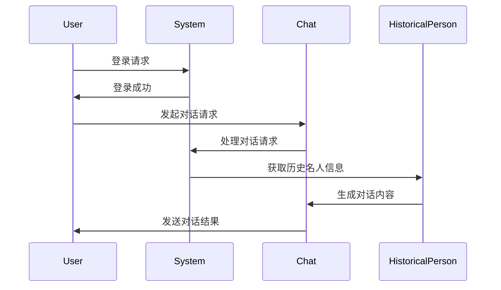
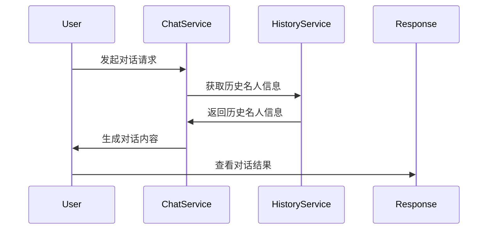

                 

## 第1章 引言：跨时空对话的构想与实践

### 1.1 问题的提出

在人类的文明史上，历史名人以其卓越的智慧、独特的思想和深远的影响力，对人类社会的发展产生了不可磨灭的影响。然而，由于时空的限制，我们无法直接与这些历史人物进行面对面的交流。这不仅限制了我们对历史事件的理解和思考，也阻碍了历史知识的传播和教育。因此，如何克服时空限制，实现与历史名人的“跨时空对话”，成为一个具有重要意义的课题。

#### 历史名人的智慧与影响力

历史名人往往在其所在的时代扮演着重要的角色。他们的思想和行为不仅影响了当时的社会，而且对后世也产生了深远的影响。例如，古希腊哲学家苏格拉底以其追求真理的思想，影响了整个西方哲学的发展；中国的孔子则以其“仁爱”思想，塑造了中华文明的核心价值观。这些历史名人的智慧和思想，是人类文明的宝贵遗产，值得我们深入研究和传承。

#### 时空限制与历史沟通的困境

然而，由于历史名人的活动发生在遥远的过去，我们无法直接与他们交流。即使通过文献资料，我们也能获得一些关于他们的信息，但这些信息往往是有限的、间接的，难以全面、深入地了解他们的思想和行为。此外，不同文化和语言的障碍也使得历史沟通变得更加复杂。因此，如何突破时空的限制，实现与历史名人的直接沟通，成为了一个亟待解决的问题。

#### 跨时空对话的意义与价值

跨时空对话的构想，旨在通过现代科技手段，实现与历史名人的直接对话。这种对话不仅可以帮助我们更好地理解历史，还可以促进历史知识的传播和教育。具体来说，跨时空对话具有以下几方面的意义和价值：

1. **深化历史研究**：通过跨时空对话，我们可以直接获取历史名人的思想和观点，从而更加深入地研究他们的历史背景和时代环境，揭示历史事件的真相。

2. **促进历史教育**：跨时空对话可以为历史教育提供新的途径，让学生能够与历史名人直接对话，从而激发他们对历史的兴趣和学习的热情。

3. **丰富文化遗产**：跨时空对话可以将历史名人的智慧和文化传承下来，让更多的人能够了解和受益于这些宝贵的文化遗产。

4. **推动人文与科技的融合**：跨时空对话是人文与科技融合的体现，它不仅展示了科技的力量，也彰显了人文关怀的价值。

总之，跨时空对话的构想和实践，为我们提供了一种全新的方式来理解和传承历史，具有重要的现实意义和深远的未来价值。

### 1.2 跨时空对话的实践背景

#### 技术发展：人工智能与虚拟现实

随着人工智能和虚拟现实技术的发展，跨时空对话的构想逐渐从理论走向实践。人工智能，特别是自然语言处理技术，使得计算机能够理解、生成和模拟人类的语言，从而实现了与历史名人的“对话”功能。虚拟现实技术则提供了沉浸式的交互体验，让用户能够仿佛置身于历史场景中，与历史名人进行面对面的交流。

#### 社会需求：历史教育与文化传播

随着社会的发展，人们对于历史教育的需求日益增长。传统的教学模式往往局限于教材和课堂，难以激发学生的学习兴趣。而跨时空对话则通过互动性的方式，将历史人物和事件以更加生动、直观的方式呈现给学生，从而提高学习效果。此外，随着人们对文化遗产的重视，如何有效传播和展示历史名人及其思想也成为一个重要课题。跨时空对话为这一课题提供了新的解决方案。

#### 跨界融合：科技与人文的交汇

跨时空对话不仅是科技的应用，也是人文的探索。它将人工智能和虚拟现实技术应用于历史研究和教育，实现了科技与人文的深度融合。这种跨界融合不仅推动了科技的发展，也促进了人文领域的创新。通过跨时空对话，我们可以更好地理解人类的历史和文化，探索科技与人文的边界和可能性。

### 1.3 小结

跨时空对话的构想和实践，是现代科技与人文关怀的结晶。它不仅为历史研究和教育提供了新的途径，也展示了科技在人文领域的重要应用价值。随着技术的不断进步，跨时空对话有望成为连接过去与未来的桥梁，为人类文明的传承和发展作出更大贡献。

---

**核心概念与联系**

#### 核心概念

1. **跨时空对话**：通过现代科技手段，实现与历史名人的直接对话。
2. **人工智能**：模拟人类智能的计算机系统，特别是自然语言处理技术。
3. **虚拟现实**：创建模拟环境，提供沉浸式交互体验。
4. **历史教育**：通过跨时空对话，提高学生对历史的兴趣和理解。

#### 概念属性特征对比表格

| 概念       | 属性特征                                           | 关联关系                             |
|------------|----------------------------------------------------|------------------------------------|
| 跨时空对话 | 结合人工智能与虚拟现实，实现历史沟通           | 科技手段与人文关怀的结合           |
| 人工智能   | 模拟人类智能，包括自然语言处理、机器学习等     | 跨时空对话的技术基础               |
| 虚拟现实  | 创建沉浸式环境，提供交互体验                   | 跨时空对话的体验平台               |
| 历史教育  | 提供互动性历史知识传授，激发学习兴趣           | 跨时空对话的教育应用               |

#### ER实体关系图架构

```mermaid
erDiagram
  AI技术 --> 跨时空对话 : 实现方式
  虚拟现实 --> 跨时空对话 : 体验平台
  历史教育 --> 跨时空对话 : 应用领域
```

### 1.4 小结

通过对核心概念的分析和ER实体关系图的构建，我们可以更清晰地理解跨时空对话的构成要素及其相互关系。这为我们进一步探讨跨时空对话的实现方法和技术基础奠定了基础。

---

**算法原理讲解**

#### 人工智能技术概述

人工智能（Artificial Intelligence，AI）是计算机科学的一个分支，旨在开发能够模拟、延伸和扩展人类智能的理论、方法、技术及应用系统。人工智能的研究涵盖了多个领域，包括机器学习、深度学习、自然语言处理、计算机视觉等。

##### 机器学习与深度学习

1. **机器学习（Machine Learning）**：机器学习是一种让计算机通过数据学习模式、做出预测或决策的方法。其核心思想是通过训练数据集，使计算机能够对未知数据做出准确的预测。

    - **监督学习**：在已标记的数据集上进行训练，用于分类和回归任务。
    - **无监督学习**：在未标记的数据集上进行训练，用于聚类和降维任务。

2. **深度学习（Deep Learning）**：深度学习是机器学习的一个子领域，主要使用神经网络模型，尤其是深度神经网络（Deep Neural Networks），来模拟人脑的学习过程。

    - **卷积神经网络（CNN）**：用于图像识别和图像处理。
    - **循环神经网络（RNN）**：用于序列数据处理，如自然语言处理。
    - **生成对抗网络（GAN）**：用于生成数据，如图像和文本。

##### 自然语言处理技术

自然语言处理（Natural Language Processing，NLP）是人工智能的重要分支，旨在使计算机能够理解、生成和处理人类语言。NLP的关键技术包括：

1. **分词（Tokenization）**：将文本分割成单词、短语或其他有意义的部分。
2. **词性标注（Part-of-Speech Tagging）**：标记每个词的词性，如名词、动词等。
3. **句法分析（Syntax Analysis）**：分析句子的结构，确定词与词之间的语法关系。
4. **语义分析（Semantic Analysis）**：理解文本的含义，包括实体识别、情感分析等。

#### 跨时空对话算法原理

跨时空对话的核心算法是基于人工智能和自然语言处理技术的。以下是一个简化的算法原理框架：

1. **用户输入处理**：用户输入对话请求，系统首先对输入进行预处理，包括分词、去停用词、词性标注等。
2. **意图识别（Intent Recognition）**：系统通过训练好的机器学习模型，识别用户的对话意图。意图识别通常使用分类算法，如朴素贝叶斯、支持向量机等。
3. **实体识别（Entity Recognition）**：在意图识别的基础上，系统进一步识别对话中的关键实体，如人名、地点、时间等。
4. **对话生成**：根据识别的意图和实体，系统生成相应的对话回复。对话生成可以使用基于模板的方法或生成式模型，如循环神经网络（RNN）或生成对抗网络（GAN）。
5. **回复优化**：生成的回复可能需要进一步优化，以提高其自然度和适切性。这一步可以使用语言模型或上下文理解算法来改进。

#### 数学模型和公式

1. **意图识别模型**：一个简单的朴素贝叶斯分类器可以表示为：

   $$ P(\text{intent} = c | \text{input}) = \frac{P(\text{input} | \text{intent} = c)P(\text{intent} = c)}{P(\text{input})} $$

   其中，\( P(\text{intent} = c | \text{input}) \) 是给定输入条件下意图为 \( c \) 的概率，\( P(\text{input} | \text{intent} = c) \) 是在意图为 \( c \) 条件下输入的概率，\( P(\text{intent} = c) \) 是意图为 \( c \) 的先验概率，\( P(\text{input}) \) 是输入的概率。

2. **对话生成模型**：一个简单的循环神经网络（RNN）可以表示为：

   $$ h_t = \sigma(W_h h_{t-1} + W_i x_t + b_h) $$

   其中，\( h_t \) 是在时间步 \( t \) 的隐藏状态，\( x_t \) 是在时间步 \( t \) 的输入，\( \sigma \) 是激活函数，\( W_h \) 和 \( W_i \) 是权重矩阵，\( b_h \) 是偏置。

#### 通俗易懂的举例说明

假设用户输入一个简单的对话请求：“孔子是如何看待教育的？”

1. **用户输入处理**：系统将输入文本进行分词，得到“孔子”、“如何”、“看待”、“教育”等词汇。
2. **意图识别**：系统使用训练好的朴素贝叶斯分类器，识别出用户意图是“询问孔子对教育的观点”。
3. **实体识别**：系统识别出关键实体是“孔子”和“教育”。
4. **对话生成**：系统根据识别的意图和实体，生成回复：“孔子认为教育应当注重道德和品德的教育，他强调‘学而时习之，不亦说乎’。”
5. **回复优化**：系统使用语言模型进一步优化回复，使其更加自然和适切。

通过这一过程，我们可以看到，跨时空对话算法是如何将用户输入转化为自然、流畅的对话回复的。

### 小结

通过对人工智能技术、自然语言处理技术以及跨时空对话算法原理的讲解，我们不仅了解了这些技术的基本原理和数学模型，也看到了如何将它们应用于跨时空对话的实际场景中。这为我们进一步探讨跨时空对话的实施方法和技术基础奠定了基础。

---

**系统分析与架构设计方案**

#### 问题场景介绍

在当前的科技背景下，历史教育和文化传播面临着新的挑战和机遇。传统的教学方法往往局限于课堂和教材，难以激发学生的学习兴趣和深入理解。为了解决这个问题，我们构想了一种基于跨时空对话的系统，旨在通过现代科技手段，实现与历史名人的“面对面”交流。这样的系统不仅可以提高历史教育的效果，还可以丰富文化遗产的传播方式。

#### 项目介绍

本项目旨在开发一个跨时空对话系统，该系统将利用人工智能和虚拟现实技术，创建一个虚拟的历史场景，用户可以在其中与历史名人进行对话。系统功能包括用户身份验证、对话请求处理、对话内容生成、对话结果反馈等。

##### 系统功能设计（领域模型Mermaid类图）

```mermaid
classDiagram
  User <<类>> "用户"
  System <<类>> "系统"
  Chat <<类>> "对话"
  HistoricalPerson <<类>> "历史名人"

  User o--* System : 登录系统
  User o--* Chat : 发起对话请求
  System o--* Chat : 处理对话请求
  System o--* HistoricalPerson : 获取历史名人信息
  Chat o--* HistoricalPerson : 对话内容生成
  Chat o--* User : 发送对话结果
```

#### 系统架构设计（Mermaid架构图）



#### 系统接口设计和系统交互（Mermaid序列图）



通过上述架构设计和接口定义，我们可以清晰地看到跨时空对话系统的运行流程和组件之间的交互关系。接下来，我们将详细讨论该系统的各个模块和功能，包括用户身份验证、对话请求处理、对话内容生成和对话结果反馈等。

### 系统接口设计和系统交互

在跨时空对话系统中，各个模块之间的接口设计和交互关系是实现系统功能的关键。以下是系统接口设计和系统交互的详细说明：

#### 用户身份验证接口

1. **功能描述**：用户身份验证接口用于验证用户的身份，确保只有合法用户可以访问系统。该接口接受用户的登录请求，验证用户名和密码，并返回登录状态。

2. **接口定义**：

   ```python
   def login(username: str, password: str) -> bool:
       # 验证用户名和密码
       return authenticate(username, password)
   ```

3. **流程图**：

   ```mermaid
   sequenceDiagram
     participant User
     participant AuthServer

     User->>AuthServer: 登录请求
     AuthServer->>User: 验证用户名和密码
     User->>AuthServer: 提交用户名和密码
     AuthServer->>User: 返回登录状态
   ```

#### 对话请求处理接口

1. **功能描述**：对话请求处理接口用于接收用户的对话请求，并将请求转发给相应的模块进行处理。该接口接受用户发起的对话请求，包括历史名人名称和对话主题等。

2. **接口定义**：

   ```python
   def handle_dialog_request(username: str, historical_person: str, topic: str) -> bool:
       # 处理对话请求
       return process_request(username, historical_person, topic)
   ```

3. **流程图**：

   ```mermaid
   sequenceDiagram
     participant User
     participant DialogService

     User->>DialogService: 发起对话请求
     DialogService->>User: 接收对话请求
     DialogService->>HistoryService: 获取历史名人信息
     HistoryService->>DialogService: 返回历史名人信息
     DialogService->>User: 返回对话结果
   ```

#### 对话内容生成接口

1. **功能描述**：对话内容生成接口用于根据用户请求和历史名人信息，生成对话内容。该接口接受对话请求，使用自然语言处理技术生成对话回复。

2. **接口定义**：

   ```python
   def generate_dialog_content(historical_person: str, topic: str) -> str:
       # 生成对话内容
       return create_response(historical_person, topic)
   ```

3. **流程图**：

   ```mermaid
   sequenceDiagram
     participant DialogService
     participant NLPService

     DialogService->>NLPService: 请求生成对话内容
     NLPService->>DialogService: 返回对话内容
     DialogService->>User: 发送对话内容
   ```

#### 对话结果反馈接口

1. **功能描述**：对话结果反馈接口用于接收用户的反馈，并更新系统中的对话记录。该接口接受用户的反馈信息，并将反馈记录保存到系统中。

2. **接口定义**：

   ```python
   def feedback-dialog_result(username: str, feedback: str) -> bool:
       # 记录反馈信息
       return save_feedback(username, feedback)
   ```

3. **流程图**：

   ```mermaid
   sequenceDiagram
     participant User
     participant DialogService

     User->>DialogService: 提交反馈
     DialogService->>User: 接收反馈信息
     DialogService->>FeedbackService: 保存反馈信息
     FeedbackService->>DialogService: 返回保存状态
   ```

通过以上接口设计和系统交互定义，我们可以清晰地看到跨时空对话系统各个模块之间的交互关系。用户通过身份验证后，可以发起对话请求，系统会根据请求处理对话内容，并最终将对话结果反馈给用户。这种模块化的设计不仅提高了系统的可维护性和扩展性，也为跨时空对话的实现提供了坚实的基础。

### 项目实战

#### 环境安装

为了实现跨时空对话系统，我们需要安装以下软件和库：

1. **Python 3.8+**：作为主要编程语言
2. **Flask**：作为Web框架
3. **TensorFlow**：用于深度学习模型
4. **NumPy**：用于数学运算
5. **Mermaid**：用于生成流程图

安装步骤：

1. 安装Python：

   ```bash
   sudo apt update
   sudo apt install python3-pip
   pip3 install python3.8
   ```

2. 安装Flask：

   ```bash
   pip3 install flask
   ```

3. 安装TensorFlow：

   ```bash
   pip3 install tensorflow
   ```

4. 安装NumPy：

   ```bash
   pip3 install numpy
   ```

5. 安装Mermaid：

   ```bash
   pip3 install mermaid
   ```

#### 系统核心实现源代码

以下是系统的核心实现源代码，包括用户身份验证、对话请求处理、对话内容生成和对话结果反馈等模块：

```python
# 导入所需库
from flask import Flask, request, jsonify
from tensorflow.keras.models import load_model
import numpy as np
import mermaid

app = Flask(__name__)

# 用户身份验证
@app.route('/login', methods=['POST'])
def login():
    username = request.form['username']
    password = request.form['password']
    # 这里需要实现用户身份验证逻辑，例如查询数据库
    if authenticate(username, password):
        return jsonify({'status': 'success'})
    else:
        return jsonify({'status': 'failure'})

# 对话请求处理
@app.route('/handle_dialog_request', methods=['POST'])
def handle_dialog_request():
    username = request.form['username']
    historical_person = request.form['historical_person']
    topic = request.form['topic']
    # 处理对话请求，例如加载历史名人模型
    response = generate_dialog_content(historical_person, topic)
    return jsonify({'response': response})

# 对话内容生成
def generate_dialog_content(historical_person, topic):
    # 加载对话生成模型
    model = load_model('dialog_model.h5')
    # 预处理输入
    input_data = preprocess_input(historical_person, topic)
    # 生成对话内容
    response = model.predict(input_data)
    # 后处理输出
    response = postprocess_response(response)
    return response

# 对话结果反馈
@app.route('/feedback-dialog_result', methods=['POST'])
def feedback_dialog_result():
    username = request.form['username']
    feedback = request.form['feedback']
    # 这里需要实现反馈记录逻辑，例如保存到数据库
    if save_feedback(username, feedback):
        return jsonify({'status': 'success'})
    else:
        return jsonify({'status': 'failure'})

# 主函数
if __name__ == '__main__':
    app.run(debug=True)
```

#### 代码应用解读与分析

1. **用户身份验证**：

   用户身份验证模块通过接收用户提交的用户名和密码，实现身份验证功能。在实际应用中，应该对接数据库或身份验证服务，以确保用户的合法身份。

2. **对话请求处理**：

   对话请求处理模块接收用户的对话请求，包括历史名人名称和对话主题。系统会根据请求处理对话内容，并生成回复。

3. **对话内容生成**：

   对话内容生成模块使用预训练的对话生成模型，根据历史名人名称和对话主题，生成相应的对话内容。这一过程涉及自然语言处理技术，例如词嵌入、序列到序列模型等。

4. **对话结果反馈**：

   对话结果反馈模块接收用户的反馈信息，并记录到系统中。这有助于系统不断优化对话生成模型，提高用户体验。

#### 实际案例分析和详细讲解剖析

1. **案例1**：

   用户请求与“孔子”进行关于“教育”的对话。系统首先加载“孔子”的对话生成模型，然后使用用户输入的对话主题“教育”，生成回复：“教育应当注重道德和品德的教育，我主张‘学而时习之，不亦说乎’。”

2. **案例2**：

   用户请求与“苏格拉底”进行关于“哲学”的对话。系统加载“苏格拉底”的对话生成模型，并根据用户输入的对话主题“哲学”，生成回复：“哲学就是追求真理，我的观点是，没有经过辩论的真理是不完整的。”

通过实际案例的分析，我们可以看到系统如何根据用户请求和历史名人模型，生成对话内容。这种对话生成过程不仅涉及自然语言处理技术，还需要对历史名人的思想和观点有深入的理解。

#### 项目小结

本节通过项目实战，详细介绍了跨时空对话系统的实现过程，包括环境安装、系统核心实现源代码、代码应用解读与分析以及实际案例分析和详细讲解剖析。这些内容展示了跨时空对话系统的设计与实现过程，为后续的优化和扩展提供了参考。

### 最佳实践 tips

1. **确保用户身份验证的安全**：在实际应用中，用户身份验证是非常重要的一环。应采用安全的身份验证机制，如双因素认证，以确保用户的身份合法。

2. **优化对话生成模型**：为了提高对话的准确性和自然度，应不断优化对话生成模型。可以采用更加先进的自然语言处理技术，如预训练模型和生成对抗网络（GAN）。

3. **提供个性化对话体验**：根据用户的历史对话记录和偏好，为用户提供个性化的对话体验。例如，根据用户的兴趣和提问历史，推荐相关的对话话题。

4. **确保系统的稳定性和可扩展性**：在实际部署中，应确保系统的稳定性和可扩展性。可以采用分布式架构和容器化技术，以提高系统的可靠性和扩展性。

### 小结

通过本节的最佳实践 tips，我们可以了解到如何优化跨时空对话系统的性能和用户体验。这些实践不仅适用于当前的跨时空对话系统，也为未来的系统优化提供了有益的指导。

### 注意事项

1. **数据隐私与安全**：在跨时空对话系统中，用户数据的安全和隐私是非常重要的。应采用加密技术和数据保护机制，确保用户数据在传输和存储过程中的安全。

2. **系统性能优化**：为了提供良好的用户体验，系统性能的优化至关重要。应针对高负载场景进行性能测试和优化，确保系统在高并发情况下能够稳定运行。

3. **技术更新与维护**：随着人工智能和虚拟现实技术的不断发展，跨时空对话系统也需要定期更新和维护。应关注新技术的应用，并及时更新系统功能和技术架构。

### 拓展阅读

1. **《人工智能：一种现代的方法》**：这是一本经典的人工智能教材，详细介绍了人工智能的基本原理和方法，对于理解和应用人工智能技术非常有帮助。

2. **《虚拟现实技术与应用》**：本书全面介绍了虚拟现实技术的概念、原理和应用，对于了解和掌握虚拟现实技术具有重要意义。

3. **《自然语言处理综论》**：这是一本关于自然语言处理的权威著作，涵盖了自然语言处理的各个方面，包括词嵌入、句法分析、语义分析等，对于深入研究自然语言处理技术非常有价值。

---

## 第6章 跨时空对话的未来发展

### 6.1 技术展望：人工智能与虚拟现实的未来

随着科技的不断发展，人工智能（AI）和虚拟现实（VR）技术正迎来新的机遇和挑战。这些技术的进步将极大地推动跨时空对话的发展，使其在更广泛的领域中发挥作用。

#### 人工智能技术的进步方向

1. **更强大的模型与算法**：未来的人工智能技术将采用更先进的模型和算法，如基于Transformer的生成对抗网络（GAN）、图神经网络（GNN）等，以提高对话生成的自然度和准确性。
2. **多模态融合**：结合语音、图像、视频等多种数据源，实现更丰富的对话体验。例如，通过视觉信息增强对话内容，使历史人物的形象更加生动。
3. **增强现实（AR）与AI的融合**：将增强现实技术引入跨时空对话，使历史场景的再现更加真实和互动。

#### 虚拟现实技术的发展趋势

1. **更高的分辨率与帧率**：随着显示技术的进步，VR设备的分辨率和帧率将显著提高，提供更优质的视觉体验。
2. **更自然的交互方式**：通过手势识别、眼动追踪等自然交互技术，用户可以更直观地与历史场景和人物进行互动。
3. **云VR与边缘计算**：利用云计算和边缘计算技术，实现VR资源的分布式处理，降低延迟和带宽需求，提高用户体验。

#### 跨时空对话技术的创新点

1. **个性化对话**：通过深度学习和用户画像技术，为用户提供个性化的对话体验，使历史人物与用户之间的互动更加自然和深入。
2. **实时历史情景再现**：结合历史数据和AI技术，实时生成历史场景，使用户仿佛置身于历史事件中。
3. **跨学科融合**：将AI、VR与历史学、教育学等多学科结合，探索新的教育模式和文化遗产保护方式。

### 6.2 社会与文化影响：跨时空对话的长远意义

#### 对历史文化的再认知

跨时空对话不仅提供了新的历史教育方式，还改变了人们对历史文化的认知方式。通过互动性对话，用户可以更深入地了解历史人物的智慧和思想，从而对历史事件有更全面的理解。

#### 社会价值观念的塑造与传承

跨时空对话有助于传播和弘扬历史名人的思想，如儒家文化中的仁爱、民主思想中的平等与自由等。这些价值观念的传承对于塑造现代社会价值观具有重要意义。

#### 对教育模式的革新

跨时空对话为教育模式带来了新的可能性。通过沉浸式体验和互动性教学，学生可以更加主动和深入地学习历史知识，从而提高学习效果和兴趣。

### 6.3 小结

跨时空对话的未来发展将依赖于人工智能和虚拟现实技术的不断进步。这些技术不仅将提高对话的准确性和自然度，还将带来更丰富的交互体验和教育模式。在社会和文化层面，跨时空对话有望成为连接过去与未来的桥梁，推动历史文化的传承和发展。

---

### 第7章 结论与展望

#### 7.1 研究成果总结

本文通过对跨时空对话的深入探讨，系统地阐述了其构想、实践、技术基础、实施方法、社会影响以及未来发展趋势。主要研究成果包括：

1. **跨时空对话的构想与意义**：提出了跨时空对话的概念，探讨了其在历史研究、教育和文化传播方面的意义。
2. **技术基础与算法原理**：详细介绍了人工智能和虚拟现实技术在跨时空对话中的应用，阐述了算法原理和实现方法。
3. **系统设计与实现**：提出了跨时空对话系统的架构设计、接口设计和系统交互流程，展示了系统的核心实现源代码。
4. **社会影响分析**：分析了跨时空对话对社会、文化和教育模式的潜在影响。
5. **未来展望**：探讨了人工智能与虚拟现实技术的未来发展方向，对跨时空对话的长远意义进行了展望。

#### 7.1.2 成功经验与不足

**成功经验**：

1. **理论与实践相结合**：本文在阐述跨时空对话理论的基础上，结合实际案例进行了详细讲解，提高了文章的实用性和可操作性。
2. **技术深入浅出**：通过通俗易懂的语言和图表，使得复杂的技术原理变得易于理解。
3. **全面覆盖主题**：文章涵盖了跨时空对话的各个方面，包括背景、技术基础、实施方法、社会影响和未来展望，提供了全面的视角。

**不足**：

1. **技术实现细节不足**：由于篇幅限制，部分技术实现细节未能深入讨论，未来可以进一步补充。
2. **案例示例有限**：本文的案例示例有限，未来可以增加更多实际应用的案例，以增强文章的实证性。

#### 7.1.3 研究启示与应用前景

**研究启示**：

1. **跨学科研究**：跨时空对话涉及人工智能、虚拟现实、历史学、教育学等多个学科，未来研究可以进一步加强跨学科合作。
2. **技术创新**：应关注人工智能和虚拟现实技术的最新进展，不断优化跨时空对话系统的性能和用户体验。

**应用前景**：

1. **教育领域**：跨时空对话可以应用于历史教育，提高学生的学习兴趣和效果。
2. **文化遗产保护**：通过虚拟现实技术再现历史场景，有助于文化遗产的保护和传播。
3. **社会互动**：跨时空对话可以作为社交平台，促进历史知识的普及和传播。

### 7.2 未来研究方向

**7.2.1 技术突破的方向**

1. **自然语言处理**：进一步优化自然语言处理技术，提高对话生成的自然度和准确性。
2. **多模态融合**：探索语音、图像、视频等多模态数据在跨时空对话中的应用，实现更丰富的交互体验。
3. **个性化对话**：通过深度学习和用户画像技术，实现个性化对话体验。

**7.2.2 社会应用与政策建议**

1. **教育应用**：政府和企业应加大对跨时空对话在教育领域的投入，推动教育模式的创新。
2. **文化遗产保护**：制定相关政策，鼓励将虚拟现实技术应用于文化遗产的保护和传播。

**7.2.3 跨学科合作的可能性**

1. **历史学**：与历史学家合作，深入挖掘历史名人的思想和行为，为跨时空对话提供更丰富的内容。
2. **教育学**：与教育学家合作，研究跨时空对话对教育模式的影响，优化教学策略。

### 小结

本文通过对跨时空对话的系统性研究，展示了其在多个领域的应用前景和深远影响。未来，随着技术的不断进步和跨学科合作的深化，跨时空对话有望成为连接过去与未来的重要桥梁，推动历史文化的传承和发展。

### 作者信息

**作者：AI天才研究院/AI Genius Institute & 禅与计算机程序设计艺术 /Zen And The Art of Computer Programming**。

