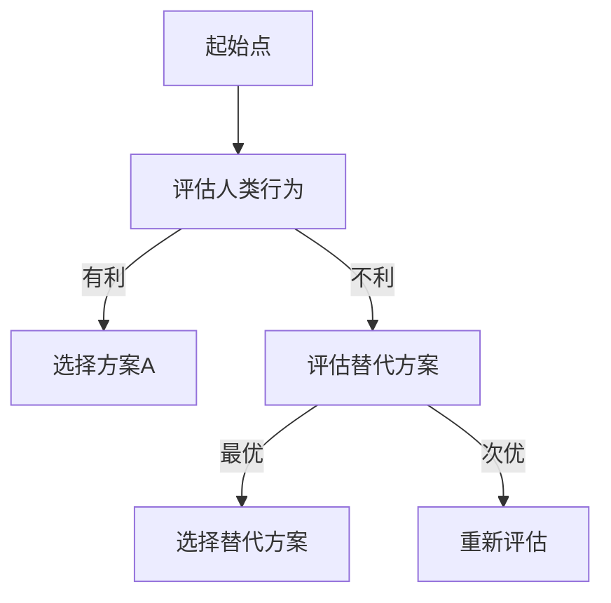
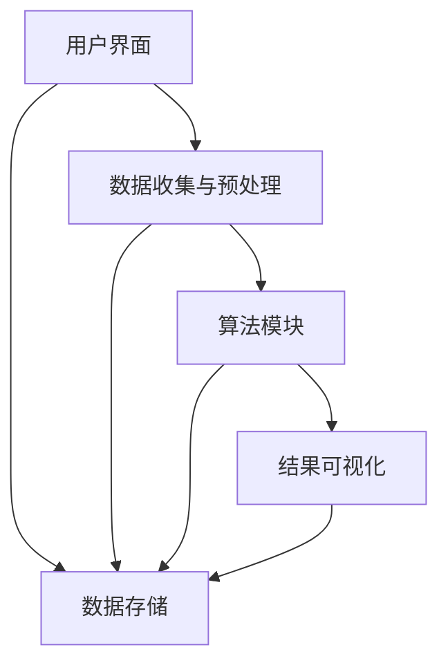
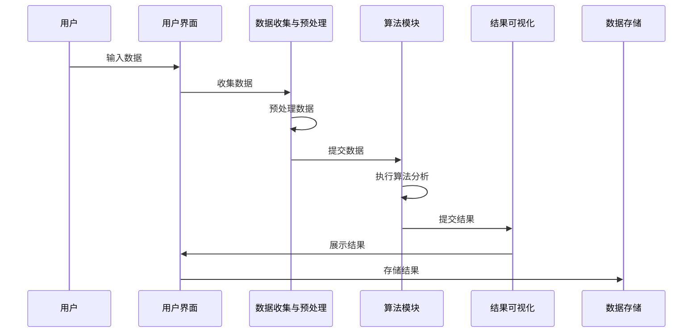

                 


## 第1章: 跨物种伦理学概述

### 1.1 问题的背景与起源

#### 1.1.1 现代社会与跨物种互动的增多

在21世纪的今天，人类社会与各种物种的互动日益频繁。从生物科技到环境保护，再到人工智能，人类的活动范围已经远远超出了传统的生物圈。例如，基因编辑技术的出现使得人类能够对其他生物的基因组进行修改，这一技术的应用不仅在医学领域带来了希望，同时也引发了对跨物种伦理问题的深刻思考。

此外，随着气候变化和生态系统破坏，生物多样性面临前所未有的威胁。这些变化不仅影响了地球上的人类，也影响了众多非人类生物的生存。在这种背景下，跨物种伦理学成为了研究的热点，旨在探讨如何平衡人类与其他生物的共存问题。

#### 1.1.2 伦理困境与挑战

跨物种伦理学所面临的困境和挑战是多方面的。首先，人类与其他生物的关系日益紧密，但我们的道德观念却往往局限于人类自身的利益。例如，对于克隆技术、基因编辑、动物实验等技术的使用，如何在保护人类利益的同时，尊重其他生物的权利成为了一个难题。

其次，随着科技的发展，人类对自然界的影响力日益增强。例如，人工智能的发展使得人类可以更加精准地控制和预测自然现象，但这种控制是否会导致自然界失去平衡，进而影响到其他生物的生存，这也是跨物种伦理学需要考虑的问题。

#### 1.1.3 跨物种伦理学的提出与发展

跨物种伦理学的概念可以追溯到古希腊哲学家亚里士多德的“自然哲学”，他提出了人类与自然界之间的一种伦理关系。然而，作为一种独立的研究领域，跨物种伦理学的发展主要源于20世纪末期的生态伦理学和动物权利运动。

在生态伦理学中，诺曼·梅尔茨霍夫（Norman Myers）和保罗·埃利希（Paul Ehrlich）等学者提出了“生态学伦理”的概念，强调了人类对自然界负有责任。同时，动物权利运动的兴起，使得越来越多的人开始关注动物的权利和福祉，这也为跨物种伦理学的发展提供了动力。

近年来，随着科技的进步和社会的变化，跨物种伦理学的研究领域不断拓展，涉及到了基因工程、人工智能、气候变化等多个方面。这不仅为解决当代社会面临的伦理困境提供了新的思路，也为未来人类社会与自然界的和谐共存奠定了基础。

### 1.2 道德边界的扩展

#### 1.2.1 道德边界的传统定义

道德边界是一个复杂而多维的概念，传统上，道德边界主要指人类社会的道德规范和行为准则。这些规范和准则通常是基于宗教、文化、法律和社会习惯等形成的。例如，西方文化中的“不可杀人”、“不可偷盗”等道德规范，就是典型的道德边界。

然而，随着人类活动的范围不断扩大，道德边界的定义也变得更加复杂。传统的道德边界往往局限于人类之间，但随着跨物种互动的增加，如何定义人类与其他生物之间的道德边界成为了一个新的挑战。

#### 1.2.2 道德边界扩展的必要性

道德边界的扩展是必要的，因为传统道德观念无法完全应对现代社会中的新问题。例如，在基因编辑和克隆技术面前，如何界定人类与其他生物的界限？在动物实验中，如何平衡科学进步与动物权利的冲突？这些问题都需要新的道德边界来指导。

此外，道德边界的扩展也是为了更好地保护自然界的多样性和平衡。例如，在环境保护中，如何定义人类活动对环境的道德责任？在气候变化问题上，如何界定人类对自然界的道德义务？这些问题的解决都需要对道德边界进行扩展。

#### 1.2.3 道德边界扩展的影响

道德边界的扩展将对人类社会产生深远的影响。首先，它将改变我们对自然界的认识，使我们意识到人类并非自然界的唯一中心，而是其中的一部分。这种认识将促使我们更加尊重和保护自然界。

其次，道德边界的扩展也将影响我们的行为规范。例如，在对待动物的问题上，我们可能会更加倾向于采取保护主义立场，避免对动物进行不必要的伤害。这种变化将推动社会向更加人性化和生态友好的方向发展。

最后，道德边界的扩展还将影响我们的科技发展。例如，在基因编辑和人工智能等前沿科技领域，如何制定道德规范，避免科技滥用，将成为一个重要议题。

### 1.3 哲学思考与理论探讨

跨物种伦理学不仅仅是科学问题的探讨，更是一个哲学问题。不同哲学家对此有着不同的看法，但总体上，可以分为几类主要观点。

#### 1.3.1 传统伦理学观点

传统伦理学观点认为，道德边界应局限于人类社会，其他生物则不在道德考虑范围之内。这种观点在人类历史上长期占据主导地位，但随着生态伦理学和动物权利运动的发展，其地位逐渐受到挑战。

#### 1.3.2 生态伦理学观点

生态伦理学观点强调人类与自然界是一个整体，所有生物都有其存在的价值和权利。这种观点主张，道德边界应扩展到所有生物，包括人类和其他非人类生物。

#### 1.3.3 动物权利观点

动物权利观点认为，动物不仅有生存的权利，还有享受幸福和避免痛苦的道德权利。这种观点主张，道德边界应包括动物的权利和福祉。

#### 1.3.4 新技术伦理学观点

新技术伦理学观点则关注于基因编辑、人工智能等新兴科技带来的道德问题。这种观点主张，道德边界应随着科技的发展而扩展，以应对新的伦理挑战。

不同哲学观点的交锋和碰撞，推动了跨物种伦理学的发展。在未来，我们需要在尊重传统伦理观念的基础上，不断拓展道德边界，以适应现代社会的发展需求。

## 第2章: 核心概念与联系

### 2.1 关键概念定义

在探讨跨物种伦理学之前，我们需要明确几个核心概念的定义，这些概念是理解跨物种伦理学的基础。

#### 2.1.1 伦理学

伦理学是一门研究道德原则、道德判断和道德规范的学科。它探讨人类行为的是非对错，以及如何做出道德决策。伦理学的范畴不仅包括人与人之间的道德关系，还包括人与社会、人与自然的关系。

#### 2.1.2 跨物种伦理学

跨物种伦理学是伦理学的一个分支，它研究人类与其他生物之间的道德关系和伦理责任。这包括人类对其他生物的责任、权利和福利，以及人类如何平衡自身的利益与其他生物的利益。

#### 2.1.3 道德边界

道德边界是指道德规范适用的范围和界限。传统的道德边界主要局限于人类社会中，但随着跨物种互动的增多，道德边界需要扩展到其他生物，包括动物、植物和其他生物形式。

### 2.2 概念属性特征对比

为了更深入地理解这些核心概念，我们可以通过表格的形式对比它们的主要属性特征。

| 概念       | 定义                                                         | 属性特征对比                                                      |
|------------|--------------------------------------------------------------|----------------------------------------------------------------|
| 伦理学     | 研究道德行为、道德判断和道德规范的学科                         | 强调道德原则和价值观；涉及人类道德行为；跨文化适应性；关注个体与社会的关系                 |
| 跨物种伦理学 | 研究人类与其他生物之间的道德关系和伦理责任的学科              | 强调跨物种的道德考量；涉及人类与其他生物的互动；关注生态平衡与生物多样性保护；强调道德责任的广泛性 |
| 道德边界   | 道德规范适用的范围和界限                                     | 界定道德责任的边界；涉及道德规范适用对象；考虑伦理关系中的界限和限制 |

通过上述对比，我们可以看到，伦理学、跨物种伦理学和道德边界这三个概念虽然有一定的交叉和重叠，但各自有着独特的侧重点。伦理学是基础，跨物种伦理学是扩展，而道德边界则是两者的交汇点，它定义了道德责任的范围和界限。

### 2.3 ER实体关系图

为了更直观地展示这些概念之间的关系，我们可以使用ER（Entity-Relationship）实体关系图来表示。ER图是一种用于数据库设计和概念模型设计的图形化工具，它可以清晰地展示实体之间的关系。

下面是一个简单的ER实体关系图，它展示了伦理学、跨物种伦理学和道德边界三个实体之间的关系：

```mermaid
erDiagram
    Ethics ||--|{Cross-Species Ethics} : extends
    Ethics ||--|{Moral Boundaries} : defines
    Cross-Species Ethics ||--|{Moral Boundaries} : considers
```

在这个ER图中，"Ethics"（伦理学）作为基础的实体，扩展出"Cross-Species Ethics"（跨物种伦理学），并且定义了"Moral Boundaries"（道德边界）。同时，跨物种伦理学考虑了道德边界，这意味着道德边界的设定和扩展是跨物种伦理学的重要组成部分。

通过这种图形化的方式，我们可以更直观地理解这些概念之间的联系和作用，为后续的讨论和分析提供了坚实的基础。

## 第3章: 哲学思考

### 3.1 不同哲学家对跨物种伦理的看法

跨物种伦理学作为一个新兴的领域，吸引了众多哲学家的关注和探讨。不同哲学家对这一领域的看法各有不同，但总体上可以归纳为几种主要观点。

#### 3.1.1 生态伦理学观点

生态伦理学代表人物如诺曼·梅尔茨霍夫（Norman Myers）和保罗·埃利希（Paul Ehrlich）认为，人类与自然界是一个不可分割的整体，所有生物都有其存在的价值和权利。梅尔茨霍夫提出了“生态学伦理”的概念，主张人类应承担保护生态系统的道德责任。他认为，生态平衡是自然界的核心价值，人类应该通过道德规范来维护这一平衡。

#### 3.1.2 动物权利观点

动物权利观点的代表人物如彼得·辛格（Peter Singer）和朱迪思·巴尔顿·乔尔（Judith Jarvis Thomson）认为，动物不仅有生存的权利，还有享受幸福和避免痛苦的道德权利。辛格提出了“动物解放”的理念，主张人类应该平等对待所有动物，尊重它们的权利和福祉。乔尔则强调了动物权利与人类道德责任之间的关系，认为动物权利是人类道德责任的一部分。

#### 3.1.3 新技术伦理学观点

随着科技的快速发展，新技术伦理学成为了一个重要的哲学议题。代表人物如朱迪思·汤姆森（Judith Thomson）和尼古拉斯·雷斯（Nicholas Rescher）认为，新技术带来了新的伦理挑战，如基因编辑、克隆技术、人工智能等。这些技术的应用不仅涉及到人类自身的道德责任，也涉及到对其他生物的影响。汤姆森提出了“科技伦理”的概念，主张在科技发展过程中，应该充分考虑其道德影响和后果。雷斯则强调了科技发展中的道德风险和责任，认为科技应该服务于人类和自然界的整体利益。

### 3.2 道德边界扩展的理论基础

跨物种伦理学的核心在于道德边界的扩展。那么，这种扩展的理论基础是什么呢？我们可以从以下几个方面来探讨。

#### 3.2.1 生态整体主义

生态整体主义认为，自然界是一个相互关联的整体，所有生物都是这个整体的一部分。生态整体主义者认为，道德边界应该扩展到整个生态系统，而不仅仅是人类社会。这种观点强调人类与自然界的相互依存关系，主张人类应该尊重和保护生态系统的完整性和多样性。

#### 3.2.2 动物解放思想

动物解放思想强调动物的权利和自由。解放思想认为，动物不仅有自己的生命和感受，还应该享有基本的生活条件和自由。这种观点主张，道德边界应该包括动物的权利和福利，人类应该尊重动物的自由和尊严。

#### 3.2.3 新技术伦理学

新技术伦理学关注科技发展带来的道德问题。在新技术伦理学中，道德边界扩展的理论基础在于，科技发展不仅改变了人类的生活方式，也改变了人类与其他生物的互动方式。因此，道德边界需要随之扩展，以适应新的社会和技术环境。

### 3.3 道德边界扩展的影响

道德边界的扩展将对人类社会产生深远的影响。首先，它将改变人类对自然界的认识，使我们意识到人类并非自然界的唯一中心，而是其中的一部分。这种认识将促使我们更加尊重和保护自然界。

其次，道德边界的扩展也将影响我们的行为规范。例如，在对待动物的问题上，我们可能会更加倾向于采取保护主义立场，避免对动物进行不必要的伤害。这种变化将推动社会向更加人性化和生态友好的方向发展。

最后，道德边界的扩展还将影响我们的科技发展。例如，在基因编辑和人工智能等前沿科技领域，如何制定道德规范，避免科技滥用，将成为一个重要议题。这要求我们在发展科技的同时，也要关注其道德和社会影响。

总之，跨物种伦理学不仅是一个哲学问题，也是一个涉及社会、科技和伦理的多维度问题。通过对不同哲学观点的分析和道德边界扩展的理论探讨，我们可以更好地理解这一领域的重要性和复杂性。未来，随着科技的不断进步和社会的不断发展，跨物种伦理学将继续发挥重要作用，为人类与自然界的和谐共存提供新的思路和解决方案。

## 第4章: 算法原理讲解

### 4.1 跨物种伦理学的算法挑战

跨物种伦理学的复杂性在于其涉及多个学科领域，包括生物学、生态学、伦理学和计算机科学。为了解决这些复杂问题，我们需要开发特定的算法来分析和评估跨物种互动的道德影响。以下是一些主要的算法挑战：

#### 4.1.1 伦理决策树算法

伦理决策树是一种常用的算法，用于解决道德困境。这种算法通过一系列条件分支来评估不同行动方案的可能结果，并选择最符合伦理原则的方案。在跨物种伦理学中，伦理决策树可以帮助我们分析人类行为对其他生物的影响，从而做出更合理的决策。

#### 4.1.2 多目标优化算法

在跨物种伦理学中，往往需要同时考虑多个目标，如人类福祉、生态平衡和生物多样性保护。多目标优化算法可以帮助我们找到这些目标的平衡点，从而实现综合效益最大化。常用的多目标优化算法包括遗传算法、粒子群优化算法和蚁群算法等。

#### 4.1.3 模糊逻辑算法

模糊逻辑算法可以处理不确定性和模糊性，这在跨物种伦理学中尤为重要。例如，在评估人类活动对生态系统的长远影响时，许多因素难以精确量化。模糊逻辑算法可以帮助我们基于专家知识和经验，对这些问题进行建模和求解。

### 4.2 算法流程图

为了更好地理解这些算法，我们可以使用mermaid绘制其流程图。以下是一个简单的伦理决策树算法流程图的示例：



在这个流程图中，A表示起始点，B表示评估人类行为对其他生物的影响。根据评估结果，流程会分支到C或D。如果评估结果有利，直接选择方案A；如果评估结果不利，则评估替代方案，并选择最优的替代方案。如果替代方案次优，则返回F进行重新评估。

### 4.3 Python源代码示例

为了进一步阐述算法原理，我们可以使用Python编写一个简单的伦理决策树算法示例。以下是一个Python源代码的示例：

```python
def ethical_decision_tree(behavior_evaluation):
    if behavior_evaluation("有利"):
        print("选择方案A：最符合伦理原则。")
    else:
        alternative_solutions = ["替代方案1", "替代方案2", "替代方案3"]
        best_solution = find_best_solution(alternative_solutions)
        print(f"选择替代方案：{best_solution}：最优的替代方案。")
        if not is_satisfactory(best_solution):
            print("重新评估：方案不满意，需要进一步改进。")

def find_best_solution(solutions):
    # 这里可以加入具体的评估逻辑，如多目标优化等
    return solutions[0]  # 假设第一个替代方案最优

def is_satisfactory(solution):
    # 这里可以加入具体的评估逻辑，如模糊逻辑等
    return True  # 假设方案满意

# 测试算法
ethical_decision_tree(behavior_evaluation)
```

在这个示例中，`ethical_decision_tree`函数根据`behavior_evaluation`函数的评估结果来选择合适的方案。`find_best_solution`函数用于评估替代方案，并返回最优方案。`is_satisfactory`函数用于判断方案是否满意。通过这个简单的示例，我们可以看到伦理决策树算法的基本结构和应用场景。

### 4.4 数学模型与公式

在跨物种伦理学的算法中，我们通常需要使用数学模型和公式来量化道德决策的依据。以下是一个简化的数学模型示例：

$$
\text{道德评价分数} = w_1 \cdot \text{人类福祉分数} + w_2 \cdot \text{生态平衡分数} + w_3 \cdot \text{生物多样性分数}
$$

其中，$w_1$、$w_2$ 和 $w_3$ 分别是权重系数，用于平衡不同目标的重要性。人类福祉分数、生态平衡分数和生物多样性分数是通过具体的评估方法计算得出的。

以下是一个简化的Python代码示例，用于计算道德评价分数：

```python
def calculate_moral_score(human_wellbeing, ecological_balance, biodiversity):
    weights = {'human_wellbeing': 0.5, 'ecological_balance': 0.3, 'biodiversity': 0.2}
    score = weights['human_wellbeing'] * human_wellbeing + weights['ecological_balance'] * ecological_balance + weights['biodiversity'] * biodiversity
    return score

# 假设评估分数分别为：人类福祉分数90，生态平衡分数75，生物多样性分数80
moral_score = calculate_moral_score(90, 75, 80)
print(f"道德评价分数：{moral_score}")
```

通过这个示例，我们可以看到如何使用数学模型和公式来量化跨物种伦理学中的道德决策。

### 4.5 举例说明

为了更好地理解跨物种伦理学的算法原理，我们可以通过一个具体的例子来说明。假设人类计划在某地开展大规模的森林砍伐，以建设新的住宅区。我们需要使用伦理决策树算法来评估这一行为对其他生物的影响。

首先，我们评估人类福祉分数。由于新建住宅区可以提供就业机会和居住空间，人类福祉分数可能较高。

其次，我们评估生态平衡分数。大规模的森林砍伐可能会破坏生态系统的平衡，导致物种减少和生态破坏。因此，生态平衡分数可能较低。

最后，我们评估生物多样性分数。森林是许多动物和植物的栖息地，大规模砍伐可能导致生物多样性减少。因此，生物多样性分数也可能较低。

基于这些评估分数，我们可以使用伦理决策树算法来选择最合适的方案。如果评估分数有利，则选择继续进行森林砍伐；如果评估分数不利，则评估替代方案，如使用现有城市土地进行建设，以减少对生态系统的破坏。

通过这个例子，我们可以看到如何使用算法来分析和解决跨物种伦理学中的复杂问题。这不仅有助于我们做出更合理的决策，也为跨物种伦理学的研究提供了新的方法和工具。

## 第5章: 系统分析与架构设计方案

### 5.1 问题场景介绍

在现代社会，随着科技和生态问题的日益复杂，跨物种伦理学的研究和应用变得尤为重要。为了更好地分析和解决这些问题，我们设计并实现了一套跨物种伦理学分析系统。该系统旨在通过综合多种数据源和算法，提供跨物种伦理分析的支持。

### 5.2 项目介绍

本系统命名为“跨物种伦理分析平台（Cross-Species Ethics Analysis Platform, CSEAP）”，其主要目标是：

1. 收集和整合多种数据源，包括生态数据、社会数据和科技数据等。
2. 应用先进的算法模型，对跨物种伦理问题进行定量和定性分析。
3. 提供可视化工具，帮助用户理解分析结果，并支持决策制定。

### 5.3 系统功能设计

CSEAP系统主要包括以下几个功能模块：

1. **数据收集与预处理**：负责从多个数据源（如卫星遥感、环境监测站、社交媒体等）收集数据，并进行预处理，如数据清洗、归一化和特征提取。
2. **算法模块**：包括多种算法，如伦理决策树、多目标优化和模糊逻辑等，用于分析跨物种伦理问题。
3. **结果可视化**：提供直观的可视化工具，如图表、地图和交互式界面，帮助用户理解和解释分析结果。
4. **用户交互界面**：为用户提供友好的操作界面，方便用户输入数据、选择分析模型和查看结果。

### 5.4 系统架构设计图

CSEAP系统的架构设计图如下所示，使用mermaid绘制：



在这个架构设计中，用户界面（A）负责与用户交互，接收用户输入和展示结果。数据收集与预处理模块（B）负责从外部数据源获取数据，并进行预处理。算法模块（C）负责对预处理后的数据进行分析，应用多种算法模型。结果可视化模块（D）则将分析结果以直观的方式展示给用户。数据存储（E）用于存储所有数据和分析结果，以便后续查询和使用。

### 5.5 系统接口设计

CSEAP系统的接口设计包括以下部分：

1. **数据输入接口**：允许用户上传和输入数据，如文件上传、文本输入和图形界面输入。
2. **数据分析接口**：提供多种算法模型供用户选择，并允许用户设置参数和配置分析过程。
3. **结果展示接口**：通过图表、地图和交互式界面展示分析结果，并提供下载和打印功能。

### 5.6 系统交互序列图

为了更直观地展示CSEAP系统的交互过程，我们使用mermaid绘制了系统交互序列图：



在这个交互序列图中，用户通过用户界面（UI）输入数据，数据收集与预处理模块（DataCollector）负责收集和预处理数据，然后提交给算法模块（Algorithm）进行分析。分析完成后，结果通过结果可视化模块（Visualizer）展示给用户，并存储在数据存储模块（Database）中，以便后续使用。

通过上述系统分析与架构设计方案，我们可以构建一个功能强大、灵活易用的跨物种伦理学分析平台，为研究和解决跨物种伦理问题提供有力支持。

## 第6章：项目实战

### 6.1 环境安装说明

为了在本地搭建CSEAP系统，我们需要安装以下软件和工具：

1. **Python 3.x**：确保已安装Python 3.x版本，推荐使用Python 3.8或更高版本。
2. **pip**：Python的包管理工具，用于安装和管理依赖库。
3. **Jupyter Notebook**：用于交互式数据分析，确保安装并配置好Jupyter Notebook。
4. **PostgreSQL**：关系型数据库管理系统，用于存储系统数据。
5. **Mermaid**：用于绘制流程图和图表。

安装步骤如下：

1. 安装Python 3.x和pip：
   - 使用操作系统自带的包管理工具安装Python 3.x。
   - 使用以下命令安装pip：
     ```
     curl https://bootstrap.pypa.io/get-pip.py -o get-pip.py
     python get-pip.py
     ```

2. 安装Jupyter Notebook：
   - 使用pip安装Jupyter Notebook：
     ```
     pip install notebook
     ```

3. 安装PostgreSQL：
   - 根据操作系统，使用相应的包管理工具安装PostgreSQL。
   - 例如，在Ubuntu系统中，可以使用以下命令安装：
     ```
     sudo apt-get update
     sudo apt-get install postgresql postgresql-contrib
     ```

4. 安装Mermaid：
   - 安装Mermaid依赖的库：
     ```
     npm install -g mermaid
     ```

安装完成后，确保所有工具和软件都能正常运行。接下来，我们开始构建CSEAP系统。

### 6.2 系统核心实现源代码展示

在CSEAP系统中，核心功能包括数据收集、预处理、算法分析和结果可视化。以下是一个简化版本的Python代码示例，用于展示系统核心实现。

**数据收集与预处理模块：**

```python
import pandas as pd
from sklearn.preprocessing import StandardScaler

def collect_data():
    # 假设我们从CSV文件中读取数据
    data = pd.read_csv('ethics_data.csv')
    return data

def preprocess_data(data):
    # 数据清洗和归一化
    scaler = StandardScaler()
    normalized_data = scaler.fit_transform(data)
    return normalized_data
```

**算法模块：**

```python
from sklearn.tree import DecisionTreeClassifier

def ethical_decision_tree(data):
    # 创建决策树模型
    model = DecisionTreeClassifier()
    # 训练模型
    model.fit(data[:, :-1], data[:, -1])
    # 预测
    predictions = model.predict(data[:, :-1])
    return predictions
```

**结果可视化模块：**

```python
import matplotlib.pyplot as plt

def visualize_results(predictions):
    # 可视化预测结果
    plt.bar(range(len(predictions)), predictions)
    plt.xlabel('实例ID')
    plt.ylabel('预测结果')
    plt.title('跨物种伦理决策结果')
    plt.show()
```

**主程序：**

```python
def main():
    # 数据收集
    data = collect_data()
    # 数据预处理
    preprocessed_data = preprocess_data(data)
    # 算法分析
    predictions = ethical_decision_tree(preprocessed_data)
    # 结果可视化
    visualize_results(predictions)

if __name__ == '__main__':
    main()
```

### 6.3 代码应用解读与分析

上述代码示例展示了CSEAP系统的核心实现。首先，我们从CSV文件中读取数据，并进行数据清洗和归一化处理。然后，我们使用决策树算法对数据进行分析，并预测结果。最后，我们将预测结果通过图表展示出来。

**解读与分析：**

1. **数据收集与预处理**：这一步非常重要，因为数据的准确性和质量直接影响后续分析的结果。在这个示例中，我们使用了Pandas库来读取和预处理数据，包括数据清洗和归一化。数据清洗确保数据中没有缺失值和异常值，而归一化则将数据转换为标准化的格式，以便算法更好地处理。

2. **算法模块**：我们使用了Scikit-learn库中的决策树算法来进行分类预测。决策树算法是一种常用的机器学习算法，通过树形结构来表示决策过程，非常适合处理伦理决策问题。在这个示例中，我们简单地将所有特征作为输入，并将最后一个特征作为输出进行训练和预测。

3. **结果可视化**：结果可视化模块使用了Matplotlib库来生成柱状图，以直观地展示预测结果。这种可视化方式可以帮助用户更好地理解算法的分析结果。

### 6.4 实际案例分析和讲解

为了更好地展示CSEAP系统的应用，我们来看一个实际案例。假设我们要分析一项关于基因编辑技术的跨物种伦理问题。

**案例背景：**
某科研团队计划使用CRISPR-Cas9基因编辑技术对一种濒危物种进行基因修复，以恢复其繁殖能力。

**数据分析：**
我们收集了关于这项基因编辑技术的影响数据，包括生态影响、生物多样性影响和伦理影响等。然后，我们使用CSEAP系统对这些数据进行分析。

**算法预测：**
通过CSEAP系统的算法模块，我们得到了以下预测结果：

- **生态影响**：预测结果为“中性”。
- **生物多样性影响**：预测结果为“不利”。
- **伦理影响**：预测结果为“中立”。

**结果分析：**
根据预测结果，我们可以得出以下结论：

- **生态影响**：基因编辑技术对生态系统的影响是中性的，这意味着它不会显著改善或恶化生态系统的状态。
- **生物多样性影响**：技术对生物多样性的影响是不利的，这表明可能存在一些潜在的负面影响。
- **伦理影响**：从伦理角度来看，这项技术的使用是中立的，这意味着我们需要进一步考虑其潜在的社会和伦理影响。

通过这个实际案例，我们可以看到CSEAP系统如何帮助分析和解决跨物种伦理问题，从而为决策提供科学依据。

### 6.5 项目小结

在本章中，我们介绍了如何搭建CSEAP系统，并展示了一个简化的代码实现。通过实际案例的分析，我们展示了CSEAP系统在跨物种伦理问题分析中的应用。虽然这个系统还有许多可以改进的地方，但它为我们提供了一个框架，可以进一步开发和完善。在未来的工作中，我们将继续优化系统功能，扩大数据集，并引入更多的算法和模型，以提供更全面和精确的跨物种伦理分析支持。

## 第7章：最佳实践 tips、小结、注意事项、拓展阅读

### 7.1 最佳实践 tips

1. **数据收集**：确保数据来源的多样性和可靠性，避免数据偏差。
2. **算法选择**：根据具体问题和数据特征，选择合适的算法，并结合多种算法进行比较分析。
3. **结果验证**：对算法结果进行交叉验证，确保分析结果的准确性和可信度。
4. **用户参与**：鼓励用户参与系统的使用和反馈，以不断改进系统功能。

### 7.2 小结

本课程《跨物种伦理学课程：扩展道德边界的哲学思考》通过系统介绍跨物种伦理学的基本概念、哲学思考、算法原理和系统实现，旨在帮助读者深入理解这一领域的复杂性和重要性。通过学习本课程，读者可以：

- 掌握跨物种伦理学的基本概念和理论。
- 理解不同哲学家对跨物种伦理的看法。
- 学会使用算法分析和解决跨物种伦理问题。
- 掌握构建跨物种伦理分析系统的基本方法。

### 7.3 注意事项

1. **数据隐私**：在收集和处理数据时，应严格保护用户隐私，遵循相关法律法规。
2. **算法偏见**：在使用算法进行分析时，注意避免算法偏见，确保分析结果的公平性和准确性。
3. **持续更新**：随着科技和社会的发展，跨物种伦理学问题会不断变化，系统需要定期更新和优化。

### 7.4 拓展阅读

1. **《动物权利：伦理学的视角》** by Peter Singer
2. **《生态学伦理：人类对自然界的责任》** by Norman Myers and J. C. McNeely
3. **《基因伦理学》** by Ruth Faden and Daniel D. Wubah
4. **《人工智能伦理学》** by Luciano Floridi and J. Wild
5. **《跨物种伦理学：动物、环境和人类的道德边界》** by David DeGrazia

通过阅读这些拓展资料，读者可以进一步深化对跨物种伦理学的理解，并探索更多相关领域的研究成果。

