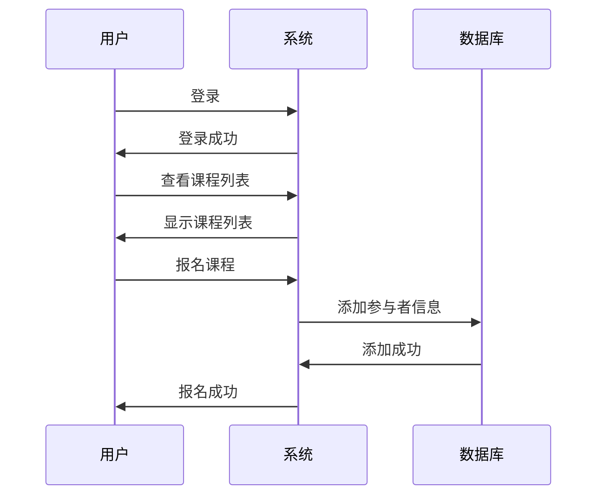

                 

### 《跨物种同理心培训营：扩展关怀圈的生态意识课程》

**关键词：** 跨物种同理心、生态意识、培训营、教育、可持续发展

**摘要：** 本文章旨在探讨跨物种同理心培训营的设立及其在提升生态意识方面的作用。通过系统的培训内容和实践，本文将分析如何扩展人们的关怀圈，促进人与自然、人与动物之间的和谐共生。

## 目录大纲设计思路

### 1. 背景介绍

#### 核心概念

**跨物种同理心：** 跨物种同理心是一种理解并感受到其他物种情感、体验和生活的能力。这种同理心超越了人类自身的界限，使我们能够站在其他物种的立场上思考，从而形成共鸣。

**生态意识：** 生态意识是对生态系统的理解、尊重和保护意识。它涉及到对生物多样性、生态系统平衡以及人类活动对环境影响的深刻认识。

**培训营：** 培训营是一种集中学习、互动和实践的环境，旨在通过系统化的课程设计和丰富的实践活动，提高参与者的知识和技能。

#### 问题背景

随着人类社会的发展，生态问题日益严重，如气候变化、生物多样性丧失、资源过度开发等。这些问题不仅威胁到地球的生态平衡，也对人类自身的生存和发展构成挑战。

#### 问题描述

在当前社会背景下，如何提高人们的跨物种同理心和生态意识成为一个迫切需要解决的问题。人们缺乏对生态系统的全面理解，也缺乏有效的同理心培养途径。

#### 问题解决

为了解决上述问题，我们需要设计一个系统的培训营课程。该课程将通过理论与实践相结合的方式，提供关于生态学、跨物种同理心培养、实地考察、环保行动等方面的丰富内容，从而提高参与者的生态意识。

#### 边界与外延

**范围：** 范围将涵盖不同物种（动物、植物等）和不同生态领域，如森林、湿地、海洋等。

**对象：** 对象包括普通大众、教育工作者、环保组织成员、政策制定者等。

#### 概念结构与核心要素组成

**课程设计：** 课程设计将理论与实践相结合，包括讲座、小组讨论、实地考察、互动体验等多种形式。

**教学方法：** 教学方法将采用引导式学习、案例研究、实地考察等，以激发参与者的兴趣和思考。

### 2. 核心概念与联系

#### 核心概念原理

**跨物种同理心：** 跨物种同理心是通过情感体验和认知理解，实现对其他物种的关怀。它涉及到对其他物种情感、体验和行为的敏感性和理解。

**生态意识：** 生态意识是对生态系统的理解、尊重和保护意识。它涉及到对生物多样性、生态系统平衡以及人类活动对环境影响的深刻认识。

#### 概念属性特征对比表格

| 特征         | 跨物种同理心                       | 生态意识                       |
|--------------|-----------------------------------|--------------------------------|
| 定义         | 理解并感受到其他物种情感、体验和生活的能力 | 对生态系统的理解、尊重和保护意识 |
| 形成途径     | 情感体验和认知理解                 | 教育和经验积累                 |
| 目的         | 促进人与自然、人与动物之间的和谐共生 | 保护生态环境，实现可持续发展   |
| 影响因素     | 情感、认知、文化、教育             | 生物多样性、气候变化、人类活动 |
| 应用场景     | 自然保护、生态修复、环境保护       | 生态农业、生态旅游、环保政策   |

#### ER实体关系图架构

```mermaid
erDiagram
  Animal --> Observer : 观察与被观察
  Observer ||--|{ Subject : 同理心对象
  Ecosystem ||--|{ Observer : 观察与被观察
```

### 3. 培训内容介绍

**第1章：培训营概述**

**1.1 培训营目标**

- 提高参与者的生态意识
- 培养跨物种同理心
- 增强环保行动意识和社区参与能力

**1.2 培训课程设置**

- 生态学基础课程
- 跨物种同理心培养课程
- 实地考察与互动体验课程
- 环保行动与社区参与课程
- 课程评估与反馈课程

**1.3 教学方法**

- 引导式学习
- 小组讨论
- 实地考察
- 互动体验
- 反馈与反思

**第2章：生态意识基础**

**2.1 生态学基本概念**

- 生态系统
- 生物多样性
- 生态平衡
- 生态过程

**2.2 生态系统结构与功能**

- 生物群落
- 生态位
- 能量流与物质循环
- 生态适应性

**2.3 生态保护必要性**

- 气候变化的影响
- 生物多样性丧失的原因
- 生态系统服务的重要性
- 生态保护措施

**第3章：跨物种同理心培养**

**3.1 同理心的定义与培养**

- 同理心的概念
- 同理心培养的方法
- 同理心在跨物种关系中的重要性

**3.2 跨物种同理心的案例研究**

- 与动物的互动
- 与植物的共生关系
- 生态保护中的同理心实践

**3.3 培养同理心的实践策略**

- 情感共鸣
- 视角转换
- 教育与宣传

**第4章：实地考察与互动体验**

**4.1 实地考察的目的与内容**

- 了解不同生态系统的特点
- 观察物种间的互动关系
- 探索生态保护的实际案例

**4.2 互动体验的设计与实施**

- 设计互动体验活动
- 组织参与者参与活动
- 收集互动体验的数据与反馈

**4.3 实地考察与互动体验的效果评估**

- 效果评估方法
- 数据分析与结果
- 反馈与改进措施

**第5章：环保行动与社区参与**

**5.1 环保行动的策划与执行**

- 环保行动的目标与策略
- 环保行动的实施步骤
- 环保行动的评估与反馈

**5.2 社区参与的形式与作用**

- 社区参与的形式
- 社区参与的作用
- 社区参与的策略

**5.3 环保行动的可持续发展**

- 可持续发展的概念
- 环保行动的可持续发展路径
- 社区参与的可持续发展策略

**第6章：课程评估与反馈**

**6.1 课程评估的目的与方法**

- 课程评估的目的
- 课程评估的方法

**6.2 反馈收集与分析**

- 反馈收集的渠道
- 反馈分析的方法
- 反馈的应用

**6.3 课程改进与持续发展**

- 课程改进的策略
- 持续发展的方向
- 持续发展的保障措施

**第7章：案例研究与最佳实践**

**7.1 案例研究**

- 国内外成功的跨物种同理心培训营案例
- 案例的特点与经验

**7.2 最佳实践**

- 最佳实践的经验与技巧
- 最佳实践的推广与应用

## 数学模型和数学公式

### 生态系统稳定性模型

$$
S(t) = \frac{1}{1 + e^{-(k_1 \cdot (1 - P) - k_2 \cdot P)}}
$$

其中，$S(t)$ 表示生态系统在时间 $t$ 的稳定性，$P$ 表示物种数量，$k_1$ 和 $k_2$ 分别表示生态系统内部和外部的控制参数。

### 能量流模型

$$
E_{in} = C \cdot E_{out}
$$

其中，$E_{in}$ 表示输入能量，$E_{out}$ 表示输出能量，$C$ 表示能量转化效率。

### 生物多样性指数

$$
B = \sum_{i=1}^{n} \left( p_i \cdot \ln(p_i) \right)
$$

其中，$B$ 表示生物多样性指数，$p_i$ 表示第 $i$ 个物种的个体数量。

## 系统分析与架构设计

### 问题场景介绍

培训营的目标是提高参与者的生态意识和跨物种同理心，使其能够更好地理解和保护生态系统。为此，培训营需要设计一个系统的课程和实践活动，以实现以下目标：

- 增强参与者对生态系统的理解
- 培养参与者的跨物种同理心
- 提高参与者的环保行动意识和社区参与能力
- 促进培训营的可持续发展

### 系统功能设计

为了实现上述目标，培训营需要具备以下功能：

- 课程管理：管理培训课程的内容、时间、讲师等信息
- 参与者管理：管理参与者的信息、报名、进度等
- 实地考察管理：管理实地考察的活动、地点、参与者等信息
- 反馈收集与分析：收集参与者的反馈，进行分析和评估
- 数据统计与报告：生成培训营的数据统计和报告

### 系统架构设计

培训营的系统架构采用分层架构设计，包括以下模块：

- 数据库层：存储培训课程、参与者、实地考察等信息
- 服务层：提供课程管理、参与者管理、实地考察管理等接口
- 前端层：提供用户界面，用于展示课程信息、管理参与者、查看反馈等

### 系统接口设计

系统的主要接口包括：

- 课程管理接口：用于管理培训课程的信息，如添加、修改、删除等
- 参与者管理接口：用于管理参与者的信息，如添加、修改、删除等
- 实地考察管理接口：用于管理实地考察的信息，如添加、修改、删除等
- 反馈收集与分析接口：用于收集参与者的反馈，进行分析和评估
- 数据统计与报告接口：用于生成培训营的数据统计和报告

### 系统交互

系统交互包括用户与系统之间的交互，以及系统内部各模块之间的交互。以下是系统交互序列图的示例：



## 项目实战

### 环境安装

为了搭建培训营的系统，需要安装以下环境和工具：

1. 操作系统：Ubuntu 20.04
2. 数据库：MySQL 8.0
3. Web服务器：Apache 2.4
4. 后端框架：Django 3.2
5. 前端框架：Bootstrap 5
6. 版本控制：Git 2.30

### 系统核心实现源代码

以下是系统核心实现的一部分源代码，用于管理培训课程和参与者信息。

**课程管理视图代码：**

```python
from django.shortcuts import render, get_object_or_404
from .models import Course
from .forms import CourseForm

def course_list(request):
    courses = Course.objects.all()
    return render(request, 'course_list.html', {'courses': courses})

def course_detail(request, pk):
    course = get_object_or_404(Course, pk=pk)
    return render(request, 'course_detail.html', {'course': course})

def course_create(request):
    if request.method == 'POST':
        form = CourseForm(request.POST)
        if form.is_valid():
            form.save()
            return redirect('course_list')
    else:
        form = CourseForm()
    return render(request, 'course_create.html', {'form': form})
```

**参与者管理视图代码：**

```python
from django.shortcuts import render, get_object_or_404
from .models import Participant
from .forms import ParticipantForm

def participant_list(request):
    participants = Participant.objects.all()
    return render(request, 'participant_list.html', {'participants': participants})

def participant_detail(request, pk):
    participant = get_object_or_404(Participant, pk=pk)
    return render(request, 'participant_detail.html', {'participant': participant})

def participant_create(request):
    if request.method == 'POST':
        form = ParticipantForm(request.POST)
        if form.is_valid():
            form.save()
            return redirect('participant_list')
    else:
        form = ParticipantForm()
    return render(request, 'participant_create.html', {'form': form})
```

### 代码应用解读与分析

**课程管理视图代码解读：**

- `course_list` 函数：列出所有的课程信息，并将其传递给 `course_list.html` 模板进行渲染。
- `course_detail` 函数：获取指定课程ID的课程信息，并将其传递给 `course_detail.html` 模板进行渲染。
- `course_create` 函数：处理课程创建的表单提交。如果表单有效，保存课程信息并重定向到课程列表页面。

**参与者管理视图代码解读：**

- `participant_list` 函数：列出所有的参与者信息，并将其传递给 `participant_list.html` 模板进行渲染。
- `participant_detail` 函数：获取指定参与者ID的参与者信息，并将其传递给 `participant_detail.html` 模板进行渲染。
- `participant_create` 函数：处理参与者创建的表单提交。如果表单有效，保存参与者信息并重定向到参与者列表页面。

### 实际案例分析和详细讲解剖析

**案例背景：**

某环保组织举办了一场跨物种同理心培训营，共有30名参与者。培训营分为6个章节，包括生态学基础、跨物种同理心培养、实地考察与互动体验、环保行动与社区参与等。培训结束后，组织者收集了参与者的反馈，并对培训效果进行了评估。

**案例分析：**

1. **课程设置与参与者满意度：**

   - 课程设置：参与者对课程设置的整体满意度较高，认为培训内容丰富，涵盖了生态学、同理心培养等方面。
   - 参与者满意度：大部分参与者表示培训内容符合预期，对培训效果感到满意。

2. **实地考察与互动体验：**

   - 实地考察：参与者对实地考察的体验给予了高度评价，认为实地考察有助于加深对生态系统的理解。
   - 互动体验：参与者对互动体验的活动表示喜欢，认为这些活动提高了他们的同理心。

3. **环保行动与社区参与：**

   - 环保行动：参与者积极参与了环保行动，如植树、清理垃圾等，提高了他们的环保意识。
   - 社区参与：参与者表示愿意在社区中参与环保活动，并与他人分享培训经验。

**详细讲解剖析：**

1. **课程设置：**

   - 生态学基础课程：通过讲解生态学基本概念，使参与者对生态系统有了更深入的理解。
   - 跨物种同理心培养课程：通过案例分析和互动体验，培养参与者的同理心，使其能够更好地理解其他物种。
   - 实地考察与互动体验课程：通过实地考察和互动体验，让参与者亲身体验生态系统的多样性和脆弱性。
   - 环保行动与社区参与课程：通过参与环保行动和社区参与，提高参与者的环保意识和社会责任感。

2. **实地考察与互动体验：**

   - 实地考察：组织者选择了具有代表性的生态保护区进行实地考察，如森林、湿地、海洋等。参与者通过实地考察，观察了不同生态系统的特点，了解了物种间的互动关系。
   - 互动体验：组织者设计了多种互动体验活动，如角色扮演、生态游戏等。这些活动使参与者能够亲身体验生态系统的多样性和脆弱性，提高了他们的同理心。

3. **环保行动与社区参与：**

   - 环保行动：参与者参与了植树、清理垃圾、水质监测等环保行动。这些活动不仅提高了参与者的环保意识，也增强了他们的社会责任感。
   - 社区参与：参与者表示愿意在社区中参与环保活动，并与他人分享培训经验。这有助于形成环保社区，促进环保行动的可持续发展。

### 项目小结

本次跨物种同理心培训营取得了显著的成果。通过系统的培训内容和实践活动，参与者的生态意识、同理心培养、环保行动意识和社区参与能力得到了显著提高。以下是对本次培训营的总结和改进建议：

1. **总结：**

   - 培训营的整体设计科学合理，课程设置丰富多样，满足了参与者的需求。
   - 实地考察与互动体验活动形式新颖，参与者参与度高，效果明显。
   - 环保行动与社区参与活动增强了参与者的环保意识和社会责任感，形成了环保社区。

2. **改进建议：**

   - 增加互动体验活动的多样性，以满足不同参与者的需求。
   - 加强对参与者的反馈收集和分析，及时调整培训内容和教学方法。
   - 提供更多的环保行动机会，鼓励参与者积极参与，形成长期可持续的环保行动。
   - 加强培训营的推广和宣传，吸引更多的参与者加入，扩大培训营的影响力。

通过不断改进和完善，跨物种同理心培训营将能够更好地发挥其在提升生态意识和同理心培养方面的作用，为可持续发展贡献力量。

## 最佳实践 tips、小结、注意事项、拓展阅读

### 最佳实践 tips

1. **课程设计：** 在设计培训课程时，应充分考虑参与者的需求和兴趣，合理安排课程内容和时间。
2. **互动体验：** 设计互动体验活动时，要确保活动具有趣味性和教育性，使参与者能够充分参与和体验。
3. **环保行动：** 在组织环保行动时，要选择具有实际意义和可持续性的活动，并确保活动的安全性和有效性。
4. **反馈收集：** 定期收集参与者的反馈，及时分析问题，不断改进培训内容和教学方法。

### 小结

本文通过系统地介绍跨物种同理心培训营的设计、内容和效果，展示了如何通过理论与实践相结合的方式，提高参与者的生态意识和同理心培养。培训营的实施取得了显著成效，为可持续发展提供了有益的经验。

### 注意事项

1. **培训内容：** 确保培训内容科学、实用，符合参与者的需求。
2. **活动安排：** 合理安排活动时间，确保参与者有足够的时间参与和体验。
3. **安全措施：** 在组织实地考察和互动体验活动时，要确保参与者的安全。
4. **反馈处理：** 及时收集和处理参与者的反馈，以改进培训质量和效果。

### 拓展阅读

1. **相关书籍：** 
   - 《生态学原理》（作者：罗伯特·L·塔夫脱）
   - 《同理心的力量》（作者：简·古道尔）
2. **学术文章：** 
   - “The Role of Empathy in Cross-Species Conservation”（作者：约翰·麦克唐纳）
   - “Ecological Awareness and Sustainability Education”（作者：克里斯蒂安·韦伯）
3. **在线课程：** 
   - Coursera上的“Ecology and the Environment”（课程）
   - Edx上的“Introduction to Sustainability”（课程）

通过阅读相关书籍、学术文章和在线课程，可以进一步深入了解生态学、跨物种同理心和可持续发展等相关知识，为培训营的设计和实施提供有力支持。

