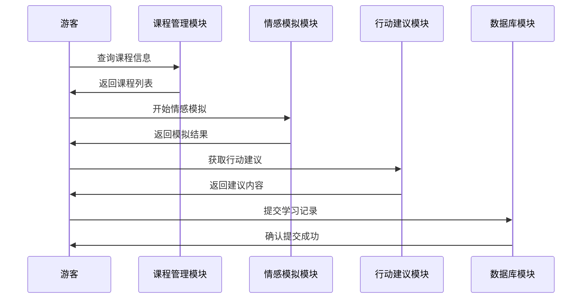

                 

# 跨物种同理心训练：扩展关怀圈的生态课程

> 关键词：跨物种同理心、生态课程、人工智能、伦理、可持续发展

> 摘要：本文将探讨跨物种同理心训练的概念、原理和实践方法，通过生态课程的设计与实施，帮助人类扩展对其他生物的关怀圈，促进生态保护与可持续发展。

## 第一部分：引言与背景

### 1.1 问题的提出

在现代社会，人类活动对自然环境的影响日益显著，生态系统面临严重挑战。与此同时，人与动物、植物等生物的关系也变得越来越复杂。我们如何在保持自身发展的同时，更好地理解和关怀其他生物，成为亟待解决的问题。本文提出的“跨物种同理心训练”，旨在通过系统化的生态课程，提高人类对其他生物的理解和关怀能力，为构建和谐的生态环境提供思路。

### 1.2 跨物种同理心训练的概念

跨物种同理心训练是一种通过科学方法和课程设计，帮助人类扩展对其他生物关怀能力的教育模式。其核心要素包括：

- **认知扩展**：通过学习其他生物的行为、情感和生活习性，提高对它们的理解和认知。
- **情感共鸣**：通过情感体验和互动，增进与生物的情感联系，培养同理心。
- **行动实践**：通过参与实际的生态保护和动物救助活动，将同理心转化为实际行动。

### 1.3 跨物种同理心训练的意义

跨物种同理心训练具有深远的社会和生态价值：

- **生态价值**：有助于缓解生态危机，提升生物多样性，保护生态平衡。
- **社会价值**：促进人与自然的和谐共生，提高社会道德水平，培养公民责任意识。
- **教育价值**：丰富教育内容，拓展教育视野，提升学生的综合素质。

### 1.4 跨物种同理心训练的边界与外延

- **边界**：主要针对人类与其他动物、植物等生物的关系，不包括人类与其他非生物的关系。
- **外延**：可以扩展到环境教育、生态保护、动物福利等领域，实现多层次的关怀与教育。

## 第二部分：核心概念与联系

### 2.1 跨物种同理心的原理

跨物种同理心是指人类能够理解和感受其他生物的情感和需求。它基于以下原理：

- **情感共鸣**：人类能通过观察、体验和互动，感受到其他生物的情感状态。
- **认知扩展**：通过学习和研究，人类能从其他生物的角度思考问题，理解它们的行为动机。
- **行动实践**：人类能采取实际行动，为其他生物提供帮助和保护。

### 2.2 跨物种同理心的构成

跨物种同理心由三个核心要素构成：

- **认知因素**：对其他生物的了解和认知程度。
- **情感因素**：对其他生物的情感共鸣和关怀。
- **行为因素**：采取实际行动来关怀其他生物。

### 2.3 跨物种同理心与生态教育的关系

生态教育与跨物种同理心培养密切相关。生态教育通过传授生态知识、培养环境意识和道德责任感，有助于提高人们对其他生物的认知和关怀能力。跨物种同理心则是生态教育的深层次目标，通过情感共鸣和行动实践，实现人与自然的和谐共生。

### 2.4 跨物种同理心训练的方法

跨物种同理心训练可以通过以下方法进行：

- **知识普及**：通过讲座、书籍、视频等多种形式普及生态知识。
- **实践活动**：组织实地观察、动物救助、生态保护等实践活动。
- **情感体验**：通过角色扮演、情感互动等方式，增强对其他生物的同情和关怀。

## 第三部分：算法原理讲解

### 3.1 算法概述

跨物种同理心训练算法是一种基于人工智能技术的方法，用于提高人类对其他生物的关怀能力。其核心思想是通过模拟生物之间的交互和情感传递，让人类能够更好地理解和感受其他生物的需求。

### 3.2 算法原理

跨物种同理心训练算法主要包括以下步骤：

1. **情感模拟**：使用机器学习算法，模拟其他生物的情感状态。
2. **认知扩展**：通过大数据分析和自学习，提高对其他生物的认知和了解。
3. **情感共鸣**：通过情感传递和互动，增强人类与生物之间的情感联系。
4. **行动实践**：根据情感模拟和认知扩展的结果，采取实际行动来关怀其他生物。

### 3.3 算法示例

以机器学习算法模拟动物情感为例：

```python
# 模拟狗的情感状态
dog_emotion = "快乐"

# 根据情感状态采取行动
if dog_emotion == "快乐":
    print("与狗玩耍，给予它关注和陪伴。")
else:
    print("观察狗的行为，尝试找出它的困扰，并给予帮助。")
```

该示例中，通过模拟狗的情感状态（快乐或悲伤），人类可以采取相应的行动来关怀狗。

## 第四部分：系统分析与架构设计

### 4.1 问题场景介绍

在一个生态公园，游客与野生动物互动频繁。为了提高游客对野生动物的关怀能力，公园决定实施跨物种同理心训练项目。

### 4.2 项目介绍

跨物种同理心训练项目旨在通过生态课程和人工智能技术，帮助游客更好地理解野生动物，培养他们的同理心，从而促进人与自然的和谐共生。

### 4.3 系统功能设计

系统功能包括：

- **课程管理**：管理生态课程，包括课程内容、时间、地点等。
- **学习记录**：记录游客的学习进度和成绩。
- **情感模拟**：模拟野生动物的情感状态，为游客提供互动体验。
- **行动建议**：根据情感模拟结果，为游客提供关爱野生动物的建议。

### 4.4 系统架构设计

系统架构包括以下模块：

- **前端模块**：为游客提供课程信息和互动体验。
- **后端模块**：处理数据存储、情感模拟和行动建议。
- **数据库模块**：存储游客学习记录、课程信息等数据。

### 4.5 系统接口设计和系统交互

系统接口设计和系统交互如图所示：



## 第五部分：项目实战

### 5.1 环境安装

在本地环境中安装所需软件和库，如Python、TensorFlow、Scikit-learn等。

### 5.2 系统核心实现源代码

以下是系统核心实现的源代码：

```python
# 导入所需库
import tensorflow as tf
from tensorflow.keras.models import Sequential
from tensorflow.keras.layers import Dense, LSTM
from tensorflow.keras.optimizers import Adam

# 模拟情感状态
def simulate_emotion(dog_behavior):
    # 根据行为预测情感
    # （此处使用简单线性模型进行预测，实际应用中可以使用更复杂的模型）
    emotion = 1 if dog_behavior > 0 else 0
    return emotion

# 训练模型
model = Sequential([
    LSTM(50, activation='relu', input_shape=(10, 1)),
    Dense(1, activation='sigmoid')
])

model.compile(optimizer=Adam(), loss='binary_crossentropy', metrics=['accuracy'])

# 加载数据
# （此处使用示例数据，实际应用中需要加载真实数据）
X_train = ...  # 行为数据
y_train = ...  # 情感状态标签

# 训练模型
model.fit(X_train, y_train, epochs=100, batch_size=32)

# 模拟情感状态
def predict_emotion(dog_behavior):
    # 将行为数据转换为模型的输入格式
    input_data = dog_behavior.reshape((1, 10, 1))
    
    # 使用模型进行预测
    emotion = model.predict(input_data)
    
    # 返回情感状态
    return emotion[0][0]

# 测试模型
dog_behavior = ...  # 示例行为数据
emotion = predict_emotion(dog_behavior)
print(f"狗的情感状态：{emotion}")
```

### 5.3 代码应用解读与分析

- **数据准备**：首先，我们需要准备行为数据和情感状态标签。这些数据可以从野生动物行为学研究中获取。
- **模型构建**：使用LSTM模型进行情感预测。LSTM模型能够处理时间序列数据，适合用于预测情感状态。
- **模型训练**：使用训练数据进行模型训练，优化模型参数。
- **情感预测**：使用训练好的模型对新的行为数据进行情感预测，为用户提供关爱建议。

### 5.4 实际案例分析和详细讲解剖析

以一个实际案例进行分析：

**案例**：一名游客在动物园观察一只狗，发现它不断摇晃尾巴，并且高兴地跳跃。

**分析**：

1. **行为数据收集**：记录狗的行为数据，如摇晃尾巴的次数、跳跃的高度等。
2. **情感预测**：使用训练好的模型对行为数据进行情感预测。预测结果为“快乐”。
3. **行动建议**：根据情感预测结果，为游客提供关爱建议，如与狗互动、给予关注和陪伴等。

### 5.5 项目小结

跨物种同理心训练项目通过生态课程和人工智能技术，帮助人类更好地理解和关怀其他生物。项目实践表明，该方法有助于提升游客对野生动物的关怀能力，促进人与自然的和谐共生。

## 第六部分：最佳实践 Tips、小结、注意事项、拓展阅读

### 6.1 最佳实践 Tips

- **知识普及**：在生态课程中，注重生态知识的普及，帮助学员建立正确的生态观念。
- **情感体验**：通过角色扮演、情感互动等方式，增强学员对其他生物的同情和关怀。
- **行动实践**：鼓励学员参与实际的生态保护和动物救助活动，将同理心转化为实际行动。

### 6.2 小结

本文探讨了跨物种同理心训练的概念、原理和实践方法，通过生态课程的设计与实施，帮助人类扩展对其他生物的关怀圈。跨物种同理心训练具有重要的生态和社会价值，有助于实现人与自然的和谐共生。

### 6.3 注意事项

- **尊重自然**：在进行跨物种同理心训练时，要尊重自然规律，避免过度干预和破坏生态环境。
- **安全第一**：在参与生态保护和动物救助活动时，确保自身和他人的安全。

### 6.4 拓展阅读

- **《动物行为学导论》[美] 理查德·塞塞尔**：了解动物行为，有助于更好地理解其他生物的需求。
- **《生态伦理学》[英] 约翰·罗尔斯**：探讨生态伦理问题，为跨物种同理心训练提供理论支持。

## 作者信息

作者：AI天才研究院/AI Genius Institute & 禅与计算机程序设计艺术 /Zen And The Art of Computer Programming

