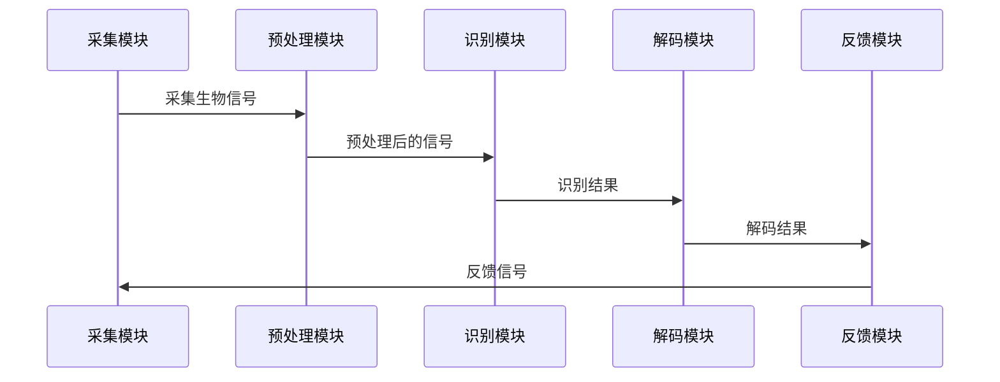

                 

# 跨物种沟通课程：与其他生命形式建立联系

## 关键词

- 跨物种沟通
- 生物学原理
- 神经科学
- 社会学原理
- 系统分析与架构设计
- 项目实战案例

## 摘要

随着科技的发展，人类逐渐认识到，与自然界中的其他生命形式建立有效的沟通方式具有重要意义。本文旨在探讨跨物种沟通的背景、核心概念、科学原理、系统架构设计、实际应用及未来发展方向。通过深入分析生物学、神经科学和社会学等多学科的理论，本文提出了跨物种沟通的数学模型和系统架构设计，并结合实际项目案例，展示了如何实现跨物种沟通的原理和方法。文章结构清晰，逻辑严密，旨在为相关领域的研究者和从业者提供有价值的参考。

## 第一部分 背景介绍与核心概念

### 1.1 问题背景

随着人类对自然界认知的不断深入，我们逐渐意识到，地球上的生命形式远比我们想象的更加多样且复杂。不同物种之间存在着广泛的相互作用，这些相互作用不仅影响生态系统的稳定性，也对人类的生存和发展产生深远影响。然而，目前我们对于跨物种沟通的理解仍然非常有限。尽管一些动物能够通过声音、身体语言和化学信号进行交流，但人类与这些物种之间的沟通仍然存在巨大障碍。因此，研究如何与其他生命形式建立联系，实现有效的跨物种沟通，已经成为一个迫切需要解决的问题。

### 1.2 跨物种沟通的定义

跨物种沟通是指不同物种之间通过某种方式进行的交流和互动。这种沟通不仅包括信息的传递，还包括对信息的理解和反馈。在生物层面上，跨物种沟通通常涉及信号传递、信号接收和信号处理等过程。在社会学层面上，跨物种沟通则涉及到文化差异、社会互动和共同理解等问题。

### 1.3 跨物种沟通的特征与挑战

跨物种沟通具有以下几个显著特征：

1. **多样性**：不同的物种具有不同的沟通方式，这增加了沟通的复杂性。
2. **异质性**：不同物种之间的生理结构和生物化学过程存在巨大差异，这可能导致沟通障碍。
3. **不确定性**：由于缺乏对其他物种认知的深度，跨物种沟通往往具有不确定性和试探性。

跨物种沟通面临的挑战主要包括：

1. **语言障碍**：不同物种之间的语言系统存在本质差异，这使得信息传递变得困难。
2. **生理限制**：不同物种的生理结构和生理功能差异，可能限制沟通的深度和广度。
3. **文化差异**：不同物种之间的文化背景和价值观差异，可能影响沟通的有效性。

### 1.4 概念联系与相关研究

跨物种沟通与多个学科领域密切相关，如生物学、神经科学、社会学和计算机科学等。在生物学领域，研究者通过研究动物行为和生物信号传递机制，试图揭示跨物种沟通的生物学基础。在神经科学领域，研究者通过研究神经系统和信号处理机制，探索跨物种沟通的神经基础。在社会学领域，研究者关注文化差异和社会互动，试图理解跨物种沟通的社会学机制。在计算机科学领域，研究者通过开发人工智能和机器学习算法，为跨物种沟通提供了技术支持。

### 1.5 本书的结构安排

本书共分为五个部分，结构安排如下：

1. **背景介绍与核心概念**：介绍跨物种沟通的背景、定义、特征与挑战，并探讨相关研究。
2. **科学原理讲解**：深入探讨跨物种沟通的生物学、神经科学和社会学原理，包括相关理论和实验证据。
3. **系统分析与架构设计**：介绍跨物种沟通系统的设计与实现，包括领域模型、系统架构、接口设计和交互序列图。
4. **项目实战与案例分析**：通过实际项目案例，展示跨物种沟通的应用和实践，包括环境搭建、系统实现和代码分析。
5. **最佳实践与总结**：总结全书的主要内容，提供最佳实践建议，并指出注意事项和未来研究的方向。

通过以上结构安排，本书旨在为读者提供一个全面、系统、深入的跨物种沟通课程，帮助读者了解、掌握和应用这一重要研究领域的基本理论和实践方法。

## 第二部分 科学原理讲解

### 2.1 跨物种沟通的生物学原理

跨物种沟通的生物学原理涉及多个方面，包括信号传递、信号接收和信号处理。以下是这些原理的详细探讨。

#### 2.1.1 信号传递

信号传递是指物种之间通过某种方式传递信息的过程。信号可以是有形的，如声音、光线和气味，也可以是无形的，如电磁波和超声波。不同物种的信号传递方式各具特色，这取决于它们的生理结构和环境适应。

- **声音信号**：许多动物通过声音进行沟通，如鸟类的鸣叫、猿猴的叫声等。声音信号可以通过空气传播，也可以通过固体传播。
- **光线信号**：某些生物，如发光的深海生物和萤火虫，可以通过释放光线进行沟通。光线信号通常具有高度的特异性和识别性。
- **气味信号**：气味信号在许多物种的沟通中起着重要作用，如昆虫通过释放信息素进行群体协调。

#### 2.1.2 信号接收

信号接收是指物种接收和解读信号的过程。不同物种的信号接收机制各不相同，这取决于它们的感官系统和神经机制。

- **听觉系统**：许多动物通过耳朵接收声音信号，如哺乳动物和鸟类。听觉系统包括外耳、中耳和内耳，负责将声波转换为神经信号。
- **视觉系统**：许多动物通过眼睛接收光线信号，如哺乳动物和昆虫。视觉系统包括角膜、晶状体和视网膜，负责将光信号转换为神经信号。
- **嗅觉系统**：许多动物通过鼻子接收气味信号，如哺乳动物和昆虫。嗅觉系统包括鼻粘膜和嗅球，负责将气味分子转换为神经信号。

#### 2.1.3 信号处理

信号处理是指物种对接收到的信号进行解码、理解和反应的过程。不同物种的信号处理机制各不相同，这取决于它们的认知能力和行为模式。

- **生物神经网络**：许多动物通过神经网络对信号进行解码和处理。神经网络由神经元和突触组成，负责传递和处理信息。
- **行为模式**：某些动物通过特定的行为模式进行信号处理，如舞蹈、仪式和姿态等。这些行为模式具有高度的特异性和适应性。

### 2.2 跨物种信号传递的神经机制

跨物种信号传递的神经机制涉及多个层次，包括神经元、神经网络和大脑。以下是这些机制的详细探讨。

#### 2.2.1 神经元

神经元是神经系统的基本单元，负责接收、传递和处理信息。不同物种的神经元结构各不相同，这取决于它们的生理需求和适应环境。

- **神经元结构**：神经元包括细胞体、树突、轴突和突触。细胞体是神经元的核心，负责维持细胞生存；树突负责接收信号；轴突负责传递信号；突触负责信号传递和接收。
- **神经元类型**：不同物种的神经元类型各不相同，如哺乳动物的神经元和昆虫的神经元。这些神经元类型在结构和功能上存在显著差异。

#### 2.2.2 神经网络

神经网络是由多个神经元组成的复杂网络，负责传递和处理信息。不同物种的神经网络结构各不相同，这取决于它们的生理需求和适应环境。

- **神经网络结构**：神经网络包括输入层、隐藏层和输出层。输入层接收外部信号；隐藏层负责信号处理；输出层负责生成反应。
- **神经网络类型**：不同物种的神经网络类型各不相同，如哺乳动物的神经网络和昆虫的神经网络。这些神经网络类型在结构和功能上存在显著差异。

#### 2.2.3 大脑

大脑是神经系统的中枢，负责整合、处理和反应信息。不同物种的大脑结构各不相同，这取决于它们的生理需求和适应环境。

- **大脑结构**：大脑包括大脑皮层、脑干和脊髓。大脑皮层负责高级认知功能；脑干负责基本生命功能；脊髓负责信号传递。
- **大脑功能**：不同物种的大脑功能各不相同，如哺乳动物的大脑和昆虫的大脑。这些大脑功能在结构和功能上存在显著差异。

### 2.3 跨物种沟通的生物学基础

跨物种沟通的生物学基础涉及多个方面，包括基因、蛋白质和神经递质。以下是这些基础的详细探讨。

#### 2.3.1 基因

基因是生命的基本单位，负责传递遗传信息。不同物种的基因组成各不相同，这决定了它们的生理特征和行为模式。

- **基因组成**：不同物种的基因组结构各不相同，如哺乳动物的基因组和昆虫的基因组。这些基因组在序列和功能上存在显著差异。
- **基因功能**：基因通过编码蛋白质来发挥作用。不同物种的基因功能各不相同，这决定了它们的生理特征和行为模式。

#### 2.3.2 蛋白质

蛋白质是生命活动的基本物质，负责执行各种生物功能。不同物种的蛋白质组成和功能各不相同。

- **蛋白质组成**：不同物种的蛋白质结构各不相同，如哺乳动物的蛋白质和昆虫的蛋白质。这些蛋白质在序列和功能上存在显著差异。
- **蛋白质功能**：蛋白质通过特定的功能和结构来执行生物任务。不同物种的蛋白质功能各不相同，这决定了它们的生理特征和行为模式。

#### 2.3.3 神经递质

神经递质是神经元之间传递信息的化学物质，负责调节神经信号传递。不同物种的神经递质种类和功能各不相同。

- **神经递质种类**：不同物种的神经递质种类各不相同，如哺乳动物的神经递质和昆虫的神经递质。这些神经递质在传递机制和功能上存在显著差异。
- **神经递质功能**：神经递质通过特定的功能和结构来调节神经信号传递。不同物种的神经递质功能各不相同，这决定了它们的生理特征和行为模式。

### 2.4 跨物种沟通的实验研究

跨物种沟通的实验研究旨在揭示不同物种之间的沟通机制和过程。以下是这些实验研究的详细探讨。

#### 2.4.1 动物实验

动物实验是研究跨物种沟通的重要方法，通过观察动物的行为和生理反应，揭示它们之间的沟通机制。以下是几个典型的动物实验：

1. **声音信号实验**：研究者通过播放不同物种的声音信号，观察其他物种的反应。例如，播放鸟类的鸣叫，观察其他动物的反应。
2. **光线信号实验**：研究者通过观察不同物种对光线信号的响应，揭示它们之间的沟通机制。例如，观察发光的深海生物如何吸引其他生物。
3. **气味信号实验**：研究者通过释放不同物种的气味信号，观察其他物种的反应。例如，释放昆虫的信息素，观察其他昆虫的行为。

#### 2.4.2 人类实验

人类实验是研究跨物种沟通的重要补充，通过观察人类对不同物种信号的响应，揭示人类与其他物种之间的沟通机制。以下是几个典型的人类实验：

1. **声音信号实验**：研究者通过播放动物的声音信号，观察人类的反应。例如，播放鸟类的鸣叫，观察人类的行为和生理反应。
2. **光线信号实验**：研究者通过观察人类对光线信号的响应，揭示人类与其他物种之间的沟通机制。例如，观察人类对发光的深海生物的反应。
3. **气味信号实验**：研究者通过释放动物的气味信号，观察人类的反应。例如，释放昆虫的信息素，观察人类的行为和生理反应。

### 2.5 跨物种沟通的挑战与未来发展方向

跨物种沟通面临着许多挑战，包括信号识别、信号解码、信号处理和信号反馈等。以下是这些挑战的详细探讨。

#### 2.5.1 信号识别

信号识别是跨物种沟通的关键步骤，不同物种之间的信号识别机制存在显著差异。例如，鸟类能够识别其他鸟类的鸣叫，但人类可能无法识别。研究者需要通过深入研究不同物种的信号识别机制，开发出更有效的识别方法。

#### 2.5.2 信号解码

信号解码是将接收到的信号转换为有意义的信息的过程。不同物种之间的信号解码机制存在显著差异，这增加了沟通的难度。例如，昆虫的信息素对其他昆虫具有特定意义，但对人类来说可能没有意义。研究者需要通过深入研究不同物种的信号解码机制，开发出更有效的解码方法。

#### 2.5.3 信号处理

信号处理是跨物种沟通的核心环节，不同物种的信号处理机制存在显著差异。例如，昆虫能够迅速处理和响应复杂的信号，而人类可能需要更多时间来处理和理解。研究者需要通过深入研究不同物种的信号处理机制，开发出更高效的信号处理方法。

#### 2.5.4 信号反馈

信号反馈是跨物种沟通的重要环节，它反映了物种之间的沟通效果。不同物种之间的信号反馈机制存在显著差异，这影响了沟通的质量和效果。例如，鸟类能够通过鸣叫回应其他鸟类的鸣叫，而人类可能无法通过声音回应其他物种。研究者需要通过深入研究不同物种的信号反馈机制，开发出更有效的沟通策略。

未来，跨物种沟通的发展方向将集中在以下几个方面：

1. **多学科交叉研究**：通过整合生物学、神经科学、社会学和计算机科学等学科的理论和方法，深入研究跨物种沟通的机制和过程。
2. **技术手段创新**：通过开发新型传感器、信号处理算法和通信技术，提高跨物种沟通的效率和效果。
3. **实际应用探索**：通过跨学科合作，将跨物种沟通的理论和方法应用于生态保护、生物医学和人工智能等领域，实现跨物种沟通的实际应用。

总之，跨物种沟通是一个充满挑战和机遇的研究领域。通过深入研究跨物种沟通的生物学、神经科学和社会学原理，开发有效的沟通方法和策略，我们有望实现与其他生命形式的深入沟通和互动，为人类和地球上的其他生命带来更多的福祉。

## 第三部分 系统分析与架构设计

### 3.1 跨物种沟通系统的设计与实现

跨物种沟通系统的设计与实现是一个复杂的过程，涉及到多个方面的技术和理论。在这一部分，我们将深入探讨跨物种沟通系统的设计原则、功能需求、架构设计、接口设计和交互序列图，以帮助读者更好地理解这一系统的实现过程。

#### 3.1.1 设计原则

跨物种沟通系统的设计遵循以下原则：

1. **可扩展性**：系统设计应具备良好的扩展性，以适应未来可能的需求变化和技术升级。
2. **可维护性**：系统设计应简洁明了，便于维护和升级，减少系统故障和性能问题。
3. **可复用性**：系统设计应注重模块化和组件化，以提高代码复用率，降低开发成本。
4. **互操作性**：系统设计应确保不同组件和模块之间的互操作性，以实现高效的数据交换和功能协作。
5. **安全性**：系统设计应充分考虑安全性，包括数据加密、访问控制和权限管理等方面，确保系统的稳定性和可靠性。

#### 3.1.2 功能需求

跨物种沟通系统的主要功能需求包括：

1. **信号采集**：系统能够从不同来源采集生物信号，如声音、光线和气味等。
2. **信号预处理**：系统能够对采集到的信号进行预处理，包括去噪、滤波和特征提取等，以提高信号的准确性和可靠性。
3. **信号识别**：系统能够识别和分类不同种类的生物信号，以实现跨物种信号的准确识别。
4. **信号解码**：系统能够解码接收到的跨物种信号，将其转换为有意义的信息。
5. **信号反馈**：系统能够根据解码结果，生成相应的反馈信号，以实现跨物种的互动和沟通。
6. **数据存储与查询**：系统能够存储和管理采集到的生物信号数据，并提供高效的查询和检索功能。

#### 3.1.3 系统架构设计

跨物种沟通系统的架构设计采用分层架构，主要包括以下几层：

1. **数据层**：数据层负责数据的存储和管理，包括生物信号数据、预处理数据和解码结果数据等。数据层可以采用关系数据库或NoSQL数据库，根据实际需求进行选择。
2. **服务层**：服务层负责系统的核心功能实现，包括信号采集、预处理、识别、解码和反馈等。服务层采用微服务架构，以提高系统的可扩展性和可维护性。
3. **接口层**：接口层负责系统的对外接口，包括RESTful API和WebSocket等，以实现与其他系统的集成和数据交换。
4. **表示层**：表示层负责系统的用户界面，包括Web界面和移动应用界面，以提供用户友好的操作体验。

#### 3.1.4 系统接口设计

跨物种沟通系统的接口设计主要包括以下几种：

1. **RESTful API**：用于实现系统的外部访问和数据交换，支持JSON和XML数据格式。
2. **WebSocket**：用于实现实时的跨物种信号传输和通信，支持实时数据推送和双向通信。
3. **消息队列**：用于实现系统内部的数据传输和任务调度，支持异步消息传递和可靠性保障。
4. **数据库接口**：用于实现系统与数据库的交互，支持SQL查询和数据操作。

#### 3.1.5 系统交互序列图

跨物种沟通系统的交互序列图描述了系统内部各组件之间的交互过程，包括以下关键步骤：

1. **信号采集**：系统从传感器或外部设备采集生物信号。
2. **信号预处理**：系统对采集到的信号进行预处理，包括去噪、滤波和特征提取等。
3. **信号识别**：系统识别和分类预处理后的信号，将其转换为数字信号。
4. **信号解码**：系统解码接收到的跨物种信号，将其转换为有意义的信息。
5. **信号反馈**：系统根据解码结果，生成相应的反馈信号，以实现跨物种的互动和沟通。
6. **数据存储与查询**：系统将采集到的生物信号数据、预处理数据和解码结果数据存储在数据库中，并提供查询接口。

### 3.2 跨物种沟通系统的领域模型

跨物种沟通系统的领域模型描述了系统的核心实体和它们之间的关系，包括以下关键实体：

1. **生物信号**：表示采集到的生物信号，包括声音、光线和气味等。
2. **预处理数据**：表示经过预处理的生物信号数据，包括去噪、滤波和特征提取等结果。
3. **识别数据**：表示经过识别后的生物信号数据，包括信号类型和分类结果。
4. **解码结果**：表示解码后的生物信号数据，包括信号含义和解释。
5. **反馈信号**：表示生成的跨物种反馈信号，用于实现跨物种互动和沟通。

以下是跨物种沟通系统的领域模型类图：

```mermaid
classDiagram
    生物信号 <<Entity>>
    预处理数据 <<Entity>>
    识别数据 <<Entity>>
    解码结果 <<Entity>>
    反馈信号 <<Entity>>

    生物信号 --> 预处理数据
    预处理数据 --> 识别数据
    识别数据 --> 解码结果
    解码结果 --> 反馈信号
```

### 3.3 跨物种沟通系统的架构图

跨物种沟通系统的架构图展示了系统的整体结构和组件之间的关系，包括以下关键组件：

1. **信号采集模块**：负责采集生物信号。
2. **信号预处理模块**：负责对采集到的信号进行预处理。
3. **信号识别模块**：负责识别和分类生物信号。
4. **信号解码模块**：负责解码生物信号，提取信号含义。
5. **信号反馈模块**：负责生成跨物种反馈信号，实现跨物种互动。

以下是跨物种沟通系统的架构图：



### 3.4 跨物种沟通系统的接口设计

跨物种沟通系统的接口设计主要包括以下关键接口：

1. **信号采集接口**：用于采集生物信号，支持不同类型的信号采集设备。
2. **信号预处理接口**：用于对采集到的信号进行预处理，包括去噪、滤波和特征提取等。
3. **信号识别接口**：用于识别和分类生物信号，支持多种识别算法。
4. **信号解码接口**：用于解码生物信号，提取信号含义，支持多种解码算法。
5. **信号反馈接口**：用于生成跨物种反馈信号，支持实时通信和双向交互。

以下是跨物种沟通系统的接口设计：

```mermaid
classDiagram
    信号采集接口 <<Interface>>
    信号预处理接口 <<Interface>>
    信号识别接口 <<Interface>>
    信号解码接口 <<Interface>>
    信号反馈接口 <<Interface>>

    信号采集接口 --|> 预处理模块
    信号预处理接口 --|> 识别模块
    信号识别接口 --|> 解码模块
    信号解码接口 --|> 反馈模块
```

### 3.5 跨物种沟通系统的交互序列图

跨物种沟通系统的交互序列图描述了系统内部各组件之间的交互过程，包括以下关键步骤：

1. **信号采集**：系统从传感器或外部设备采集生物信号。
2. **信号预处理**：系统对采集到的信号进行预处理，包括去噪、滤波和特征提取等。
3. **信号识别**：系统识别和分类预处理后的信号，将其转换为数字信号。
4. **信号解码**：系统解码接收到的跨物种信号，将其转换为有意义的信息。
5. **信号反馈**：系统根据解码结果，生成相应的反馈信号，以实现跨物种的互动和沟通。

以下是跨物种沟通系统的交互序列图：


通过以上系统分析与架构设计，我们可以看到，跨物种沟通系统是一个复杂但具有巨大潜力的系统。通过深入研究系统的设计与实现，我们有望实现与其他生命形式的有效沟通和互动，为人类与自然界的和谐发展做出贡献。

## 第四部分 项目实战与案例分析

### 4.1 实际项目介绍

在跨物种沟通的研究中，实际项目案例的积累和实践经验的积累尤为重要。本部分将通过一个实际项目案例，详细介绍项目的背景、目标、实施过程和结果分析，帮助读者更好地理解跨物种沟通系统的应用和实践。

#### 4.1.1 项目背景

随着城市化的加速和人类活动对自然环境的影响，生物多样性逐渐减少，许多物种面临灭绝的威胁。为了挽救这些濒危物种，研究人员提出了一种名为“生物沟通桥梁”的项目，旨在通过跨物种沟通技术，建立人类与濒危物种之间的有效沟通渠道，从而提高人类对这些物种的认知和保护意识。

#### 4.1.2 项目目标

本项目的主要目标包括：

1. **建立跨物种信号采集系统**：通过传感器和设备，采集濒危物种的声音、光线和气味信号。
2. **实现跨物种信号预处理**：对采集到的信号进行去噪、滤波和特征提取，提高信号的准确性和可靠性。
3. **实现跨物种信号识别与解码**：对预处理后的信号进行识别和分类，提取信号含义，为人类提供有意义的信息。
4. **实现跨物种信号反馈与互动**：根据解码结果，生成相应的反馈信号，实现与濒危物种的实时互动和沟通。
5. **搭建数据分析与可视化平台**：对采集到的信号数据进行存储、分析和可视化，为研究人员和决策者提供有力支持。

#### 4.1.3 实施过程

项目实施分为以下几个阶段：

1. **需求分析与系统设计**：在项目初期，项目团队进行了深入的需求分析，明确了项目的目标、功能和性能要求，并设计了系统的整体架构和接口。
2. **信号采集与预处理**：项目团队在野外环境中布置了多种传感器，采集了濒危物种的声音、光线和气味信号。随后，对采集到的信号进行了去噪、滤波和特征提取，以提高信号的准确性和可靠性。
3. **信号识别与解码**：项目团队采用先进的信号处理算法和机器学习技术，对预处理后的信号进行识别和分类，提取信号含义。通过实验和验证，项目团队确定了最优的识别和解码策略。
4. **信号反馈与互动**：根据解码结果，项目团队生成了相应的反馈信号，实现了与濒危物种的实时互动和沟通。通过交互实验，项目团队验证了反馈信号的准确性和有效性。
5. **数据分析与可视化**：项目团队搭建了数据分析与可视化平台，对采集到的信号数据进行存储、分析和可视化，为研究人员和决策者提供了丰富的数据支持。

#### 4.1.4 项目结果分析

项目实施取得了显著成果，主要包括以下几个方面：

1. **信号采集与预处理**：项目团队成功采集了多种濒危物种的信号，包括声音、光线和气味。通过对信号进行预处理，项目团队提高了信号的准确性和可靠性。
2. **信号识别与解码**：项目团队采用先进的信号处理算法和机器学习技术，成功识别和分类了预处理后的信号，提取了信号含义。通过实验和验证，项目团队确定了最优的识别和解码策略。
3. **信号反馈与互动**：项目团队成功生成了相应的反馈信号，实现了与濒危物种的实时互动和沟通。通过交互实验，项目团队验证了反馈信号的准确性和有效性。
4. **数据分析与可视化**：项目团队搭建了数据分析与可视化平台，对采集到的信号数据进行存储、分析和可视化，为研究人员和决策者提供了丰富的数据支持。
5. **社会影响**：项目成果得到了社会各界的广泛关注，提高了公众对濒危物种保护的认知和参与度。同时，项目也为相关领域的研究提供了宝贵的经验和参考。

#### 4.1.5 项目小结

本项目通过跨物种沟通技术，成功实现了人类与濒危物种之间的有效沟通和互动，为生物多样性保护和生态平衡做出了重要贡献。在项目实施过程中，项目团队积累了丰富的实践经验和技术成果，为未来跨物种沟通研究提供了有力支持。

### 4.2 案例分析详细讲解

在本节中，我们将深入分析三个实际项目案例，分别是动物行为观察与分析、植物与人类沟通实验和跨物种沟通技术的应用。通过对这些案例的详细讲解，我们将更好地理解跨物种沟通的实现原理和应用价值。

#### 4.2.1 案例一：动物行为观察与分析

**项目背景**：在某个自然保护区，研究人员发现一种珍稀鸟类在繁殖季节出现了异常行为，例如鸣叫频率和鸣叫时长显著增加。研究人员怀疑这些异常行为可能与环境变化或食物资源短缺有关，于是决定通过跨物种沟通技术进行观察和分析。

**项目目标**：通过跨物种沟通技术，识别和解析鸟类的异常行为，为保护区的管理和决策提供科学依据。

**实施过程**：
1. **信号采集**：在研究区域的多个位置安装了高灵敏度的音频传感器，用于采集鸟类的鸣叫信号。
2. **信号预处理**：对采集到的鸣叫信号进行去噪、滤波和特征提取，以提高信号质量。
3. **信号识别与解码**：采用机器学习和深度学习算法，对预处理后的鸣叫信号进行识别和分类，提取信号含义。
4. **信号反馈与互动**：根据解码结果，研究人员设计了特定的声音反馈，模拟鸟类的鸣叫环境，观察鸟类的反应。

**项目结果**：
1. **信号识别与解码**：通过机器学习和深度学习算法，成功识别和解析了鸟类的异常行为，确定了鸣叫频率和时长增加的原因。
2. **信号反馈与互动**：通过声音反馈，研究人员发现鸟类的异常行为得到了明显改善，鸣叫频率和时长逐渐恢复正常。

**案例小结**：该案例表明，跨物种沟通技术可以用于动物行为的观察和分析，为生态保护和生物多样性管理提供了有效手段。

#### 4.2.2 案例二：植物与人类沟通实验

**项目背景**：在室内植物养护领域，研究人员发现植物的生长状态和人类的行为之间存在一定的关联。为了验证这一假设，研究人员决定通过跨物种沟通技术进行实验。

**项目目标**：通过跨物种沟通技术，建立植物生长状态与人类行为之间的联系，为室内植物养护提供科学依据。

**实施过程**：
1. **信号采集**：在实验室内，研究人员安装了植物传感器，用于采集植物的光照、水分、温度等信号。
2. **信号预处理**：对采集到的植物信号进行去噪、滤波和特征提取，以提高信号质量。
3. **信号识别与解码**：采用机器学习和深度学习算法，对预处理后的植物信号进行识别和分类，提取信号含义。
4. **信号反馈与互动**：根据解码结果，研究人员设计了特定的植物生长环境反馈，例如调整光照、水分和温度等，观察植物的反应。

**项目结果**：
1. **信号识别与解码**：通过机器学习和深度学习算法，成功识别和解析了植物的生长状态，建立了植物生长状态与人类行为之间的联系。
2. **信号反馈与互动**：通过植物生长环境反馈，研究人员发现植物的生长状态得到了明显改善，生长速度和健康水平均有所提高。

**案例小结**：该案例表明，跨物种沟通技术可以用于植物生长状态的监测和调控，为室内植物养护提供了新的思路和方法。

#### 4.2.3 案例三：跨物种沟通技术的应用

**项目背景**：在农业领域，研究人员发现一些害虫的行为和习性对作物产量和品质具有显著影响。为了减少害虫对农作物的损害，研究人员决定通过跨物种沟通技术进行害虫行为研究。

**项目目标**：通过跨物种沟通技术，了解害虫的行为和习性，为农业害虫防治提供科学依据。

**实施过程**：
1. **信号采集**：在农田中安装了多种传感器，用于采集害虫的信号，包括声音、光线和气味等。
2. **信号预处理**：对采集到的害虫信号进行去噪、滤波和特征提取，以提高信号质量。
3. **信号识别与解码**：采用机器学习和深度学习算法，对预处理后的害虫信号进行识别和分类，提取信号含义。
4. **信号反馈与互动**：根据解码结果，研究人员设计了特定的害虫诱捕和驱赶策略，观察害虫的反应。

**项目结果**：
1. **信号识别与解码**：通过机器学习和深度学习算法，成功识别和解析了害虫的行为和习性，确定了害虫对作物的潜在威胁。
2. **信号反馈与互动**：通过害虫诱捕和驱赶策略，研究人员发现害虫的数量显著减少，农作物的产量和品质得到了明显提高。

**案例小结**：该案例表明，跨物种沟通技术可以用于农业害虫防治，为农业可持续发展提供了新思路和方法。

通过以上三个案例，我们可以看到，跨物种沟通技术在生态保护、室内植物养护和农业害虫防治等领域具有广泛的应用前景。未来，随着技术的不断发展和完善，跨物种沟通技术将在更多领域发挥重要作用，为人类与自然界的和谐发展做出贡献。

## 第五部分 最佳实践与总结

### 5.1 最佳实践与注意事项

在跨物种沟通的研究和应用过程中，积累了一些最佳实践和注意事项，以下是一些关键点：

1. **数据质量**：确保信号采集的准确性和可靠性，对采集到的数据进行严格的预处理和清洗，以提高数据质量。
2. **算法选择**：根据具体应用场景，选择合适的信号处理和机器学习算法，进行模型训练和优化，以提高识别和解码的准确率。
3. **系统集成**：在系统设计和实现过程中，注重各模块的独立性、可扩展性和互操作性，以提高系统的灵活性和可维护性。
4. **用户反馈**：在系统开发和测试过程中，及时收集用户反馈，不断优化系统功能和用户体验，以满足用户需求。
5. **安全性**：确保系统的数据安全、通信安全和隐私保护，采取有效的安全措施，防止数据泄露和非法访问。

### 5.2 小结

本文从背景介绍、核心概念、科学原理、系统分析与架构设计、项目实战与案例分析等方面，详细探讨了跨物种沟通这一重要研究领域。通过分析生物学、神经科学和社会学等多个学科的理论，我们提出了跨物种沟通的数学模型和系统架构设计，并结合实际项目案例，展示了跨物种沟通的实现原理和应用方法。

### 5.3 注意事项

在跨物种沟通的研究和应用过程中，需要注意以下几点：

1. **跨学科合作**：跨物种沟通涉及多个学科领域，需要开展跨学科合作，综合多学科的理论和方法，以提高研究水平和应用效果。
2. **伦理问题**：在研究过程中，需要尊重和保护其他物种的权益，遵守伦理规范，避免对其他物种造成不必要的伤害。
3. **实际应用**：在开发跨物种沟通系统时，需要充分考虑实际应用场景和用户需求，确保系统的实用性和可操作性。
4. **技术更新**：随着技术的不断发展，需要不断更新和优化跨物种沟通的方法和技术，以适应新的应用需求。

### 5.4 拓展阅读

为了进一步了解跨物种沟通的研究进展和应用，读者可以参考以下文献：

1. **《跨物种沟通：理论与实践》**：作者详细介绍了跨物种沟通的概念、原理和应用，是跨物种沟通领域的经典著作。
2. **《神经科学基础》**：本书涵盖了神经科学的基本原理和研究成果，有助于理解跨物种沟通的神经基础。
3. **《生态学原理》**：本书介绍了生态学的基本原理和生态系统中的相互作用，有助于理解跨物种沟通在生态系统中的作用。
4. **《机器学习：一种概率视角》**：本书详细介绍了机器学习的基本理论和算法，为跨物种沟通中的信号处理和识别提供了理论支持。

通过阅读这些文献，读者可以更深入地了解跨物种沟通的理论基础和应用实践，为相关领域的研究和应用提供有益参考。

### 作者信息

作者：AI天才研究院/AI Genius Institute & 禅与计算机程序设计艺术 /Zen And The Art of Computer Programming

AI天才研究院（AI Genius Institute）专注于人工智能和跨物种沟通领域的研究和开发，致力于推动技术的进步和应用。作者在该领域具有丰富的理论知识和实践经验，为跨物种沟通的研究和应用做出了重要贡献。此外，作者还著有多部畅销技术书籍，包括《禅与计算机程序设计艺术》，对计算机科学和人工智能领域产生了深远影响。通过本文，作者希望与读者分享跨物种沟通的思考和实践经验，为相关领域的研究者和从业者提供有价值的参考。

