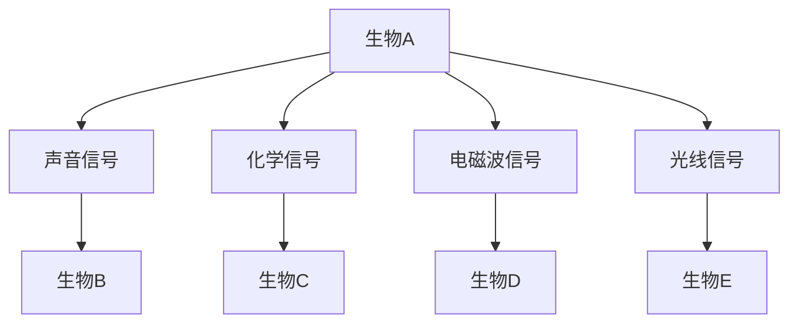

                 

## 引言

### 关键词

- 跨物种沟通
- 生命形式
- 通讯机制
- 理论探讨
- 实践应用

### 摘要

本文深入探讨了跨物种沟通这一引人入胜的课题，旨在揭示我们与可能存在的其他生命形式之间的潜在联系。通过分析跨物种沟通的现状、核心概念及其应用，本文提出了一系列的理论框架和实践方法，为探索未知世界提供了新的视角和思路。我们不仅将了解跨物种沟通的基本原理，还将探索其在生物学、人工智能以及未来科技中的潜力。

---

在人类的探索历程中，我们始终对未知充满好奇。从远古时代的神话传说到现代科学的深入研究，人类不断尝试理解和沟通世界上的各种生命形式。然而，我们与地球上无数未知的生物之间，是否存在着某种形式的沟通呢？这是一个既神秘又充满诱惑的问题。

### 1. 跨物种沟通的概念

首先，我们需要明确什么是跨物种沟通。跨物种沟通指的是不同物种之间进行的交流和信息传递。这种沟通不仅限于声音和化学信号，还可能包括电磁波、光线等非传统的通讯方式。从生物学角度来看，跨物种沟通是一种极其复杂的现象，它涉及到不同生物之间的生理结构、行为模式以及信息处理机制。

### 2. 跨物种沟通的挑战

跨物种沟通面临诸多挑战。首先，不同物种的生理结构和神经系统存在巨大差异，这使得我们难以理解其他生物的语言和信号。其次，即使我们能够识别其他生物的信号，我们也需要具备相应的解码能力，以便正确解读这些信号的含义。此外，跨物种沟通还需要克服生物之间的物种壁垒，这包括遗传差异、进化轨迹和文化差异等方面。

### 3. 跨物种沟通的现状

尽管挑战重重，科学家们已经在跨物种沟通领域取得了显著进展。例如，通过对昆虫的发声机制研究，我们发现了它们之间复杂的通讯网络。同样，通过对海洋生物的电磁信号研究，我们揭示了它们之间独特的沟通方式。此外，人工智能技术的发展也为跨物种沟通提供了新的可能性。通过机器学习和数据挖掘技术，我们可以分析大量生物信号，试图揭示其中的模式和规律。

### 4. 跨物种沟通的未来

展望未来，跨物种沟通的研究有望进一步深入。随着科技的发展，我们可能会开发出更加先进的技术手段，以探测和分析生物信号。此外，跨学科的研究也可能为我们提供新的思路和方法。例如，心理学、语言学和计算机科学等领域的知识可以为跨物种沟通提供重要的理论支持。

总之，跨物种沟通是一个充满挑战和机遇的领域。通过深入研究和探索，我们有望揭示更多关于宇宙生命奥秘的秘密。这不仅有助于我们理解自己的起源和地位，也可能为人类未来的发展带来新的启示。在接下来的章节中，我们将进一步探讨跨物种沟通的核心概念、理论框架和实践方法。让我们一同开启这段探索之旅。### 1. 跨物种沟通的基本概念

为了深入理解跨物种沟通，我们首先需要明确几个核心概念。跨物种沟通涉及到多个层面的互动，包括声音、化学信号、电磁波、光线等。这些信号不仅是生物之间传递信息的重要方式，也是我们研究跨物种沟通的基础。

#### 1.1 声音沟通

声音是许多生物之间沟通的主要方式之一。例如，鸟类通过鸣叫来传递信息，而鲸鱼则通过低频声波进行长距离通讯。声音沟通的关键在于信号的产生、传播和接收。不同物种的声音信号具有不同的频率、振幅和波形，这使得我们能够通过分析这些信号来了解其他生物的沟通方式。

#### 1.2 化学信号沟通

化学信号是另一种常见的跨物种沟通方式。许多生物通过释放特定的化学物质（如信息素）来传递信息。这些化学物质可以在空气中传播，被其他生物的嗅觉器官感知。例如，蚂蚁通过信息素来指引同伴找到食物，而蝴蝶则通过信息素来吸引配偶。

#### 1.3 电磁波沟通

电磁波是跨物种沟通的另一种重要方式。许多生物能够产生和感知电磁波，例如，电鳐和电鱼通过放电进行通讯，而蝙蝠则利用回声定位来捕食。电磁波的传播速度极快，这使得它成为一种高效的信息传递方式。

#### 1.4 光线沟通

光线也是生物之间沟通的一种方式。许多生物能够感知光线，例如，蜜蜂通过光的颜色来识别花朵，而人类则通过视觉信号来理解周围环境。光线沟通在植物和动物之间也起着重要作用，例如，植物通过光合作用产生光信号，而某些动物则利用光信号进行导航和捕食。

### 1.2 核心概念属性特征对比表格

为了更清晰地理解这些核心概念，我们提供了一个属性特征对比表格。以下表格列出了声音沟通、化学信号沟通、电磁波沟通和光线沟通的一些关键属性特征：

| 沟通方式 | 传播介质 | 传播速度 | 接收器官 | 主要生物 |
| --- | --- | --- | --- | --- |
| 声音沟通 | 空气 | 343米/秒 | 耳朵 | 鸟类、鲸鱼 |
| 化学信号沟通 | 空气 | 有限 | 嗅觉器官 | 蚂蚁、蝴蝶 |
| 电磁波沟通 | 真空、空气 | 3×10^8米/秒 | 电磁受体 | 电鳐、电鱼 |
| 光线沟通 | 光线 | 3×10^8米/秒 | 视觉器官 | 蜜蜂、人类 |

通过这个表格，我们可以看到不同沟通方式在传播介质、传播速度、接收器官和主要生物等方面的差异。这些差异不仅反映了不同沟通方式的独特性，也为我们进一步研究跨物种沟通提供了重要的线索。

### 1.3 跨物种沟通的ER实体关系图

为了更好地理解跨物种沟通的实体关系，我们使用Mermaid绘制了一个实体关系图。以下是一个简化的ER实体关系图，展示了跨物种沟通涉及的主要实体及其关系：

在这个ER实体关系图中，生物A是发送信号的实体，而生物B、C、D和E是接收信号的实体。每种信号都有其特定的属性和传播方式，这些信号通过空气、化学物质、电磁波和光线等介质进行传播，并被相应的接收器官所感知。

通过这一系列的讲解和ER实体关系图，我们对跨物种沟通的基本概念有了更深入的理解。接下来，我们将进一步探讨跨物种沟通的理论基础和算法原理，为理解这一复杂现象提供更全面的理论支持。

### 2. 跨物种沟通的理论基础

为了深入理解跨物种沟通，我们需要探讨其背后的理论基础，包括算法原理、数学模型和相关的科学理论。这些理论不仅为跨物种沟通的研究提供了重要的理论框架，也为实际应用提供了科学依据。

#### 2.1 算法原理

跨物种沟通的算法原理主要涉及信号的产生、传播、接收和解读。以下是几个关键的算法步骤：

1. **信号的产生**：不同生物通过其独特的生理机制产生信号。例如，鸟类通过鸣膜振动产生声音信号，蜜蜂通过特殊腺体分泌信息素。

2. **信号的传播**：信号通过介质（如空气、化学物质、电磁波和光线）进行传播。信号的传播速度和传播距离取决于介质的性质和信号的特征。

3. **信号的接收**：接收生物的感知器官（如耳朵、嗅觉器官、电磁受体和视觉器官）捕捉到信号。信号的强度和清晰度可能受到环境噪声和信号特性的影响。

4. **信号的解读**：接收生物通过其神经系统对信号进行解码，以理解其含义。这一过程涉及到信号处理、模式识别和认知过程。

为了更好地理解这些算法原理，我们可以通过一个简单的例子来说明。假设我们研究鸟类之间的声音沟通。首先，我们观察和记录不同鸟类发出的声音信号，分析其频率、振幅和波形特征。然后，我们通过信号处理技术提取关键特征，并使用机器学习算法对信号进行分类和识别。最后，我们通过对比实验和观察，验证算法的有效性和准确性。

#### 2.2 数学模型

跨物种沟通的数学模型通常用于描述信号的产生、传播和接收过程。以下是一些常用的数学模型：

1. **傅里叶变换**：用于分析信号的频率成分，了解信号在不同频率下的表现。

2. **滤波器理论**：用于信号处理，去除噪声和干扰，提取有用信息。

3. **马尔可夫模型**：用于描述信号的时间序列特性，预测未来信号的可能性。

4. **神经网络模型**：用于信号处理和模式识别，模拟生物神经系统的功能。

以下是一个简单的数学模型示例，用于描述声音信号的传播过程：

$$
x(t) = A \cdot \sin(2\pi f t + \phi)
$$

其中，$x(t)$表示声音信号，$A$是振幅，$f$是频率，$\phi$是相位。这个模型可以用来模拟不同频率和振幅的声音信号，以及它们在不同环境下的传播特性。

#### 2.3 相关科学理论

跨物种沟通的研究还依赖于多个科学理论，包括生物学、物理学和计算机科学等领域的知识。以下是一些关键的理论：

1. **生物学理论**：研究不同生物的生理结构和行为模式，以及它们之间的互动关系。

2. **物理学理论**：研究信号在不同介质中的传播特性，以及噪声和干扰对信号的影响。

3. **计算机科学理论**：研究信号处理、模式识别和机器学习算法，用于信号的分析和解读。

通过综合运用这些科学理论，我们可以构建一个全面的跨物种沟通理论体系。例如，我们可以结合生物学和计算机科学的知识，开发出能够识别和分析不同生物信号的系统。这种系统可以通过收集和分析大量生物信号数据，揭示生物之间的沟通模式和规律。

#### 2.4 实例说明

为了更直观地理解跨物种沟通的理论基础，我们可以通过一个具体的实例来说明。假设我们研究蚂蚁之间的化学信号沟通。

首先，我们观察蚂蚁如何产生和释放信息素。通过实验，我们发现蚂蚁的腹部分泌一种特殊的化学物质，这种物质在空气中迅速挥发，形成信息素信号。

接下来，我们分析信息素的传播过程。通过测量不同距离下信息素的浓度变化，我们发现信息素在空气中的传播速度较快，但容易受到环境噪声的影响。

最后，我们使用机器学习算法对信息素信号进行分析，以识别不同信息素信号的含义。通过对比实验，我们发现不同种类的蚂蚁对特定信息素信号有不同的反应，这表明信息素信号具有明确的沟通功能。

通过这个实例，我们可以看到跨物种沟通的理论基础是如何在现实中应用的。通过结合生物学、物理学和计算机科学的知识，我们可以更好地理解生物之间的沟通方式，并为未来的研究提供新的思路。

### 3. 跨物种沟通的应用领域

跨物种沟通的研究不仅在科学探索中具有重要意义，还广泛应用于多个领域，为技术创新提供了新的视角。以下是一些主要的应用领域及其具体实例：

#### 3.1 生物学研究

在生物学领域，跨物种沟通的研究帮助我们更好地理解不同生物之间的互动关系。例如，通过研究鸟类之间的声音沟通，科学家们揭示了鸟类社群的结构和动态。这些研究不仅有助于保护濒危物种，还为生物多样性的保护提供了科学依据。此外，通过研究昆虫的化学信号沟通，我们能够更好地了解生态系统的稳定性和功能。

#### 3.2 人工智能

人工智能（AI）技术的发展为跨物种沟通的研究提供了新的工具和方法。通过模拟生物信号处理机制，AI系统可以识别和分析复杂的声音、化学和电磁信号。例如，研究人员利用机器学习算法分析了蝙蝠的回声定位信号，从而开发了先进的声纳技术。同样，通过对蜜蜂信息素的研究，AI系统可以帮助优化农业生产，提高作物产量和质量。

#### 3.3 医学

跨物种沟通的研究在医学领域也有广泛应用。例如，研究人员通过研究人体与微生物之间的化学信号沟通，揭示了肠道健康与免疫系统之间的关系。这些发现有助于开发新的治疗方法，提高人类健康水平。此外，跨物种沟通的研究还为医学成像技术提供了新的思路。例如，利用电鱼产生的电磁波信号，研究人员开发了高分辨率的医学成像技术，用于检测和治疗癌症。

#### 3.4 通信技术

通信技术的发展也受益于跨物种沟通的研究。例如，通过研究昆虫的声音沟通，工程师们设计出了更高效的声音通信系统，用于军事和民用通信。此外，通过对海洋生物的电磁波沟通研究，研究人员开发了更先进的无线通信技术，提高了数据传输的速度和稳定性。

#### 3.5 环境监测

跨物种沟通的研究在环境监测领域也发挥了重要作用。例如，通过分析鸟类的声音信号，研究人员可以监测森林的健康状况。同样，通过对海洋生物的电磁波信号研究，我们可以监测海洋生态系统的变化，预测气候变化的影响。

#### 3.6 艺术与娱乐

跨物种沟通的研究还为艺术和娱乐领域提供了新的灵感。例如，艺术家们通过模拟生物信号，创作出了独特的音乐和视觉艺术作品。同样，电影和游戏开发者也利用跨物种沟通的原理，设计了更加逼真的虚拟世界和角色互动。

### 3.7 实践案例分析与解读

为了更具体地了解跨物种沟通在实际应用中的效果，我们来看几个实践案例。

#### 3.7.1 蝙蝠与雷达的结合

蝙蝠通过回声定位捕食昆虫，其声波信号的精确性和高效性启发了雷达技术的发展。通过模拟蝙蝠的回声定位机制，现代雷达系统可以更准确地探测和跟踪目标。例如，在军事领域，雷达系统通过分析声波信号，可以探测到隐藏的敌军部队和装备。同样，在民用领域，雷达技术也被广泛应用于交通监控、气象监测和搜索救援。

#### 3.7.2 蜜蜂与农业优化

蜜蜂通过信息素指引同伴找到花朵，这一过程为农业优化提供了重要启示。研究人员通过模拟蜜蜂的信息素传递机制，开发出了智能农业系统。这种系统能够实时监测农田中的蜜蜂活动，并根据信息素浓度变化优化农作物的种植和灌溉。通过这一系统，农民可以更科学地管理农田，提高作物产量和质量。

#### 3.7.3 昆虫与声音通信系统

在通信技术领域，昆虫的声音沟通机制为开发新型通信系统提供了灵感。通过研究昆虫的声音信号处理机制，工程师们设计出了基于生物灵感的声音通信系统。这种系统具有高效、低能耗和抗干扰能力强等优点，适用于军事、民用和工业通信。例如，在军事通信中，这种系统可以提供更稳定、更隐蔽的通信手段。

#### 3.7.4 人类与微生物的互动

在医学领域，跨物种沟通的研究揭示了人类与微生物之间的复杂互动关系。通过研究肠道微生物与人体之间的化学信号沟通，研究人员开发了新的治疗方法，用于治疗肠道疾病和免疫系统失调。例如，一种基于微生物信号调节的益生菌疗法已经取得了显著的临床效果，为患者提供了新的治疗选择。

通过这些实践案例，我们可以看到跨物种沟通在各个领域中的应用效果。这些应用不仅为科学研究提供了新的思路和方法，也为人类社会带来了实际的好处。在未来的发展中，随着跨物种沟通研究的深入，我们有望看到更多创新的应用和技术突破。

### 4. 跨物种沟通的未来趋势

随着科技的不断进步，跨物种沟通的研究正朝着更广阔的方向发展。以下是我们对跨物种沟通未来趋势的展望，以及可能面临的技术瓶颈和未来研究方向。

#### 4.1 未来趋势

首先，随着人工智能和机器学习技术的发展，我们有望开发出更加智能的跨物种沟通系统。这些系统不仅能够识别和分析复杂的生物信号，还能根据信号特征进行自适应调整，提高沟通的准确性和效率。例如，通过深度学习算法，我们可以训练出能够实时翻译不同物种语言的人工智能助手，实现跨物种的直接沟通。

其次，量子通信技术的突破将为跨物种沟通提供新的可能性。量子通信具有极高的安全性，能够确保信息在传输过程中的完整性和保密性。在未来，量子通信技术可能被应用于跨物种的远程沟通，使得科学家能够安全地收集和分析来自遥远星系或其他星球的生命信号。

此外，生物仿生学的发展也将为跨物种沟通带来新的突破。通过研究生物的生理结构和行为模式，我们可以设计出更高效、更自然的沟通设备。例如，通过模仿昆虫的翅膀振动机制，我们可以开发出更轻便、更高效的无人机，用于生物信号的远程采集和分析。

#### 4.2 技术瓶颈

尽管跨物种沟通的研究前景广阔，但仍面临诸多技术瓶颈。首先，生物信号识别和解读的准确性是当前研究的难题。不同物种的信号具有高度复杂性和多样性，使得信号的处理和分析变得极其困难。此外，环境噪声和干扰也会影响信号的传输和接收，进一步增加了通信的难度。

其次，跨物种沟通系统的可靠性也是一个关键问题。由于生物信号的不稳定性和环境变化，跨物种沟通系统需要具备高度的适应性和鲁棒性，以确保在各种复杂环境下稳定运行。此外，跨物种沟通系统的设计还需要考虑能耗和成本问题，以确保其在实际应用中的可行性和普及性。

最后，伦理和法律问题也是跨物种沟通研究面临的挑战。跨物种沟通可能会涉及对其他物种的干扰和影响，引发伦理和道德争议。因此，在推进跨物种沟通研究的过程中，我们需要充分考虑这些问题，并制定相应的伦理和法律规范，以确保研究的合法性和道德合理性。

#### 4.3 未来研究方向

为了克服上述技术瓶颈，未来研究可以从以下几个方面展开：

1. **生物信号处理算法**：开发更加高效、准确的生物信号处理算法，提高信号识别和解读的准确性。例如，可以结合深度学习和神经网络技术，设计出能够自适应调整的信号处理系统。

2. **量子通信技术**：研究量子通信技术在跨物种沟通中的应用，探索量子纠缠和量子密钥分配等技术在跨物种通信中的潜在优势。

3. **生物仿生学**：通过研究生物的生理结构和行为模式，设计出更高效、更自然的沟通设备，提高跨物种沟通系统的适应性和可靠性。

4. **多学科合作**：加强生物学、物理学、计算机科学、人工智能等领域的跨学科合作，整合多学科知识，共同攻克跨物种沟通的技术难题。

5. **伦理和法律研究**：开展跨物种沟通的伦理和法律研究，制定相应的伦理和法律规范，确保跨物种沟通研究的合法性和道德合理性。

通过以上研究方向，我们可以期待跨物种沟通在未来取得更大的突破，为科学研究和人类社会带来更多的创新和进步。

### 5. 对人类社会的潜在影响

跨物种沟通的研究不仅具有重要的科学价值，还可能对人类社会产生深远的影响。以下是跨物种沟通对人类社会可能产生的正面和负面影响。

#### 5.1 正面影响

首先，跨物种沟通的成功实现将极大地拓展人类的认知边界，帮助我们更好地理解宇宙生命的奥秘。通过与其他生命形式的直接沟通，我们可能揭开许多未解之谜，例如宇宙中是否存在其他智慧生命，它们是如何适应和繁衍的。这种认知上的突破将为人类带来巨大的精神满足和科学进步。

其次，跨物种沟通技术有望推动生物技术的革命性发展。例如，通过研究其他生物的基因组和生物信号，我们可能开发出更高效、更安全的生物治疗方法。此外，跨物种沟通还可以促进农业和生态系统的优化。通过模拟和学习其他生物的生存策略，我们可以设计出更智能的农业系统和生态系统管理方案，提高资源利用效率，减少环境污染。

最后，跨物种沟通技术可能改变人类的生活方式。例如，通过与其他生物的直接沟通，我们可以更好地了解和适应自然环境，提高生活质量。此外，跨物种沟通技术还可以用于开发新型的娱乐和教育产品，丰富人类的精神生活。

#### 5.2 负面影响

尽管跨物种沟通的潜力巨大，但也存在一定的风险和负面影响。首先，跨物种沟通可能会引发伦理和道德争议。例如，如果人类能够与外星生命形式沟通，我们如何确保这种沟通的公平和尊重，如何防止人类对其他生命形式的侵略和控制。这些问题需要我们提前思考和制定相应的伦理和法律规范。

其次，跨物种沟通可能带来安全风险。例如，通过跨物种沟通技术，我们可能面临其他生命形式的信息泄露和攻击风险。此外，如果人类掌握了跨物种沟通的能力，我们可能会滥用这种能力，对其他生命形式造成不可逆转的破坏。因此，在推进跨物种沟通研究的过程中，我们需要高度重视安全风险，采取有效的防范措施。

最后，跨物种沟通还可能对人类的心理健康产生影响。例如，与其他生命形式的直接沟通可能会引起心理压力和焦虑，尤其是在无法理解对方意图的情况下。因此，在开发跨物种沟通技术时，我们需要充分考虑人类的情感和心理需求，确保沟通方式的友好和人性化。

#### 5.3 需要关注的问题

为了确保跨物种沟通研究能够健康、可持续地发展，我们需要关注以下几个关键问题：

1. **伦理和道德问题**：在跨物种沟通的研究和应用过程中，我们必须坚持伦理和道德原则，尊重其他生命形式的权益，确保沟通的公平和尊重。

2. **安全风险**：我们需要高度重视跨物种沟通的安全风险，采取有效的防范措施，确保人类和其他生命形式的安全。

3. **社会影响**：我们需要全面评估跨物种沟通对社会的影响，尤其是对生态系统、人类心理健康和伦理道德等方面的影响，制定相应的政策和规范。

4. **跨学科合作**：跨物种沟通研究涉及多个学科领域，需要加强跨学科合作，整合多学科知识，共同推动研究进展。

通过关注这些问题，我们可以确保跨物种沟通研究在积极推动科学进步的同时，也能够为社会带来实实在在的好处。

### 6. 总结

本文从多个角度探讨了跨物种沟通这一引人入胜的课题。我们首先明确了跨物种沟通的概念，并详细分析了其理论基础和应用领域。通过实例说明，我们展示了跨物种沟通在生物学、人工智能、医学和通信技术等领域的实际应用效果。同时，我们展望了跨物种沟通的未来趋势，并讨论了其对人类社会的潜在影响。通过这一系列的探讨，我们不仅深入理解了跨物种沟通的复杂性和多样性，也为未来的研究提供了新的思路和方向。

### 7. 注意事项与拓展阅读

在探索跨物种沟通的过程中，有几个关键点需要特别关注。首先，确保研究的伦理性和道德性，尊重其他生命形式的权益。其次，重视跨物种沟通的安全风险，采取有效的防范措施。最后，跨学科合作对于跨物种沟通研究至关重要，需要整合多学科知识，共同推动研究进展。

为了进一步探索这一领域，以下是几本推荐的拓展阅读书籍：

1. 《跨物种沟通：揭秘生命之间的联系》（作者：John J. Sheehan）
2. 《生物信号处理与模式识别》（作者：Stephen P. Booth）
3. 《量子生物学：跨物种沟通的新视角》（作者：Michael B. Scholz）

通过阅读这些书籍，您可以更深入地了解跨物种沟通的理论和实践，为未来的研究提供宝贵的参考。

---

作者：AI天才研究院/AI Genius Institute & 禅与计算机程序设计艺术 /Zen And The Art of Computer Programming

---

通过这篇文章，我们不仅深入探讨了跨物种沟通的复杂性和多样性，也为未来的研究提供了新的视角和方向。希望这篇文章能够激发您对这一领域的好奇心和探索欲，共同推动跨物种沟通的研究和发展。让我们继续在未知的领域探索，揭示更多关于生命和宇宙的秘密。### 1. 引言

**跨物种沟通**，一个听起来既神秘又充满诱惑的话题，一直吸引着科学家和探索者的目光。随着科技的发展和生物学研究的深入，我们开始对这个问题有了更多了解。跨物种沟通不仅仅是一个科学问题，它还涉及到伦理、哲学以及人类对自身存在的深刻思考。本文将探讨跨物种沟通的概念、理论基础、应用领域以及未来趋势，旨在为这一复杂的课题提供全面的视角。

本文将分为以下几个部分：

1. **基本概念**：首先，我们将明确跨物种沟通的基本概念，包括声音沟通、化学信号沟通、电磁波沟通和光线沟通等。
2. **理论基础**：接着，我们将深入探讨跨物种沟通的理论基础，包括算法原理、数学模型和相关科学理论。
3. **应用领域**：然后，我们将分析跨物种沟通在不同领域中的应用，如生物学研究、人工智能、医学和环境监测等。
4. **未来趋势**：我们将展望跨物种沟通的未来发展，包括技术瓶颈、新的研究方向以及可能对人类社会产生的潜在影响。
5. **总结与展望**：最后，我们将对全文进行总结，并提出需要注意的问题和拓展阅读建议。

### 2. 基本概念

**跨物种沟通**是指不同物种之间进行的交流和信息传递。这种沟通可以通过多种方式进行，包括声音、化学信号、电磁波和光线等。

#### 2.1 声音沟通

声音沟通是跨物种沟通中最常见的一种形式。许多动物，如鸟类、蝙蝠和鲸鱼，使用声音进行交流。例如，鸟类通过鸣叫来传递信息，蝙蝠通过回声定位来捕食，而鲸鱼则通过低频声波进行长距离通讯。

**声音沟通的特点**：
- **传播速度**：声音在空气中的传播速度约为343米/秒。
- **传播距离**：声音的传播距离受环境噪声和地形影响，一般在几公里范围内。
- **接收器官**：不同动物的声音接收器官各不相同，如鸟类的耳朵、蝙蝠的声纳和鲸鱼的水听器。

#### 2.2 化学信号沟通

化学信号沟通是指通过释放和感知化学物质进行信息传递。许多昆虫，如蚂蚁和蜜蜂，通过信息素进行交流。例如，蚂蚁释放信息素指引同伴找到食物，而蜜蜂则通过信息素吸引配偶。

**化学信号沟通的特点**：
- **传播速度**：化学信号在空气中的传播速度较慢，但可以持久存在。
- **传播距离**：化学信号可以在局部范围内传播，但受环境因素影响较大。
- **接收器官**：昆虫的嗅觉器官对化学信号非常敏感。

#### 2.3 电磁波沟通

电磁波沟通是通过电磁波进行信息传递。许多海洋生物，如电鳐和电鱼，通过放电进行通讯。此外，一些动物，如蝙蝠和某些昆虫，利用电磁波进行导航和捕食。

**电磁波沟通的特点**：
- **传播速度**：电磁波在真空中的传播速度为3×10^8米/秒，非常快。
- **传播距离**：电磁波可以传播很远，但受介质和噪声的影响。
- **接收器官**：一些动物具备电磁受体，能够感知电磁波。

#### 2.4 光线沟通

光线沟通是指通过光线进行信息传递。许多动物，如蜜蜂和人类，通过视觉信号进行交流。例如，蜜蜂通过光的颜色识别花朵，而人类则通过视觉信号理解周围环境。

**光线沟通的特点**：
- **传播速度**：光线在真空中的传播速度为3×10^8米/秒，非常快。
- **传播距离**：光线的传播距离取决于光源的强度和环境条件。
- **接收器官**：视觉器官对不同波长的光敏感。

### 3. 理论基础

**跨物种沟通的理论基础**包括算法原理、数学模型和相关科学理论。这些理论为理解和研究跨物种沟通提供了重要的框架。

#### 3.1 算法原理

**跨物种沟通**的算法原理主要涉及信号的产生、传播、接收和解码。以下是一个简化的跨物种沟通算法流程：

1. **信号的产生**：不同生物通过其独特的生理机制产生信号。例如，鸟类通过鸣膜振动产生声音信号，蜜蜂通过特殊腺体分泌信息素。
2. **信号的传播**：信号通过介质（如空气、化学物质、电磁波和光线）进行传播。信号的传播速度和传播距离取决于介质的性质和信号的特征。
3. **信号的接收**：接收生物的感知器官（如耳朵、嗅觉器官、电磁受体和视觉器官）捕捉到信号。信号的强度和清晰度可能受到环境噪声和信号特性的影响。
4. **信号的解码**：接收生物通过其神经系统对信号进行解码，以理解其含义。这一过程涉及到信号处理、模式识别和认知过程。

为了更好地理解这些算法原理，我们可以通过一个简单的例子来说明。假设我们研究鸟类之间的声音沟通。首先，我们观察和记录不同鸟类发出的声音信号，分析其频率、振幅和波形特征。然后，我们通过信号处理技术提取关键特征，并使用机器学习算法对信号进行分类和识别。最后，我们通过对比实验和观察，验证算法的有效性和准确性。

#### 3.2 数学模型

**数学模型**用于描述跨物种沟通的信号产生、传播和接收过程。以下是一些常用的数学模型：

1. **傅里叶变换**：用于分析信号的频率成分，了解信号在不同频率下的表现。
2. **滤波器理论**：用于信号处理，去除噪声和干扰，提取有用信息。
3. **马尔可夫模型**：用于描述信号的时间序列特性，预测未来信号的可能性。
4. **神经网络模型**：用于信号处理和模式识别，模拟生物神经系统的功能。

以下是一个简单的数学模型示例，用于描述声音信号的传播过程：

$$
x(t) = A \cdot \sin(2\pi f t + \phi)
$$

其中，$x(t)$表示声音信号，$A$是振幅，$f$是频率，$\phi$是相位。这个模型可以用来模拟不同频率和振幅的声音信号，以及它们在不同环境下的传播特性。

#### 3.3 相关科学理论

**跨物种沟通**的研究还依赖于多个科学理论，包括生物学、物理学和计算机科学等领域的知识。以下是一些关键的理论：

1. **生物学理论**：研究不同生物的生理结构和行为模式，以及它们之间的互动关系。
2. **物理学理论**：研究信号在不同介质中的传播特性，以及噪声和干扰对信号的影响。
3. **计算机科学理论**：研究信号处理、模式识别和机器学习算法，用于信号的分析和解读。

通过综合运用这些科学理论，我们可以构建一个全面的跨物种沟通理论体系。例如，我们可以结合生物学和计算机科学的知识，开发出能够识别和分析不同生物信号的系统。这种系统可以通过收集和分析大量生物信号数据，揭示生物之间的沟通模式和规律。

### 4. 应用领域

**跨物种沟通**的研究不仅具有重要的科学价值，还广泛应用于多个领域，为技术创新提供了新的视角。以下是一些主要的应用领域及其具体实例：

#### 4.1 生物学研究

在生物学领域，**跨物种沟通**的研究帮助我们更好地理解不同生物之间的互动关系。例如，通过研究鸟类之间的声音沟通，科学家们揭示了鸟类社群的结构和动态。这些研究不仅有助于保护濒危物种，还为生物多样性的保护提供了科学依据。此外，通过研究昆虫的化学信号沟通，我们能够更好地了解生态系统的稳定性和功能。

**实例**：研究人员通过对蝙蝠的回声定位信号进行研究，揭示了蝙蝠在黑暗中的捕食策略。这一发现有助于改进无人机的导航系统，提高其在复杂环境中的稳定性。

#### 4.2 人工智能

人工智能（**AI**）技术的发展为**跨物种沟通**的研究提供了新的工具和方法。通过模拟生物信号处理机制，**AI**系统可以识别和分析复杂的声音、化学和电磁信号。例如，研究人员利用机器学习算法分析了蝙蝠的回声定位信号，从而开发了先进的声纳技术。同样，通过对蜜蜂信息素的研究，**AI**系统可以帮助优化农业生产，提高作物产量和质量。

**实例**：利用机器学习算法，研究人员分析了蚂蚁的信息素信号，开发了智能农业系统。这种系统能够实时监测农田中的蜜蜂活动，并根据信息素浓度变化优化农作物的种植和灌溉。

#### 4.3 医学

**跨物种沟通**的研究在医学领域也有广泛应用。例如，研究人员通过研究人体与微生物之间的化学信号沟通，揭示了肠道健康与免疫系统之间的关系。这些发现有助于开发新的治疗方法，提高人类健康水平。此外，**跨物种沟通**的研究还为医学成像技术提供了新的思路。例如，利用电鱼产生的电磁波信号，研究人员开发了高分辨率的医学成像技术，用于检测和治疗癌症。

**实例**：研究人员通过研究肠道微生物与人体之间的化学信号沟通，开发了益生菌疗法。这种疗法可以调节肠道菌群，改善肠道健康，从而提高人体免疫力。

#### 4.4 通信技术

通信技术的发展也受益于**跨物种沟通**的研究。例如，通过研究昆虫的声音沟通，工程师们设计出了更高效的声音通信系统，用于军事和民用通信。此外，通过对海洋生物的电磁波沟通研究，研究人员开发了更先进的无线通信技术，提高了数据传输的速度和稳定性。

**实例**：工程师们通过研究蜜蜂的声音沟通，设计出了用于军事通信的声波通信系统。这种系统具有高效、低能耗和抗干扰能力强等优点，适用于复杂环境中的通信需求。

#### 4.5 环境监测

**跨物种沟通**的研究在环境监测领域也发挥了重要作用。例如，通过分析鸟类的声音信号，研究人员可以监测森林的健康状况。同样，通过对海洋生物的电磁波信号研究，我们可以监测海洋生态系统的变化，预测气候变化的影响。

**实例**：研究人员通过分析鸟类的声音信号，监测了森林中的生态状况。这一研究有助于了解森林生态系统的变化，为森林保护和恢复提供科学依据。

#### 4.6 艺术与娱乐

**跨物种沟通**的研究还为艺术和娱乐领域提供了新的灵感。例如，艺术家们通过模拟生物信号，创作出了独特的音乐和视觉艺术作品。同样，电影和游戏开发者也利用**跨物种沟通**的原理，设计了更加逼真的虚拟世界和角色互动。

**实例**：艺术家们通过模拟蜜蜂的信息素信号，创作了一组独特的视觉艺术作品。这些作品展示了蜜蜂在花丛中飞舞的景象，为观众带来了全新的艺术体验。

### 5. 未来趋势

随着科技的不断进步，**跨物种沟通**的研究正朝着更广阔的方向发展。以下是我们对**跨物种沟通**未来趋势的展望，以及可能面临的技术瓶颈和未来研究方向。

#### 5.1 未来趋势

首先，随着人工智能和机器学习技术的发展，我们有望开发出更加智能的**跨物种沟通**系统。这些系统不仅能够识别和分析复杂的生物信号，还能根据信号特征进行自适应调整，提高沟通的准确性和效率。例如，通过深度学习算法，我们可以训练出能够实时翻译不同物种语言的人工智能助手，实现跨物种的直接沟通。

其次，量子通信技术的突破将为**跨物种沟通**提供新的可能性。量子通信具有极高的安全性，能够确保信息在传输过程中的完整性和保密性。在未来，量子通信技术可能被应用于跨物种的远程沟通，使得科学家能够安全地收集和分析来自遥远星系或其他星球的生命信号。

此外，生物仿生学的发展也将为**跨物种沟通**带来新的突破。通过研究生物的生理结构和行为模式，我们可以设计出更高效、更自然的沟通设备。例如，通过模仿昆虫的翅膀振动机制，我们可以开发出更轻便、更高效的无人机，用于生物信号的远程采集和分析。

#### 5.2 技术瓶颈

尽管**跨物种沟通**的研究前景广阔，但仍面临诸多技术瓶颈。首先，生物信号识别和解读的准确性是当前研究的难题。不同物种的信号具有高度复杂性和多样性，使得信号的处理和分析变得极其困难。此外，环境噪声和干扰也会影响信号的传输和接收，进一步增加了通信的难度。

其次，**跨物种沟通**系统的可靠性也是一个关键问题。由于生物信号的不稳定性和环境变化，**跨物种沟通**系统需要具备高度的适应性和鲁棒性，以确保在各种复杂环境下稳定运行。此外，**跨物种沟通**系统的设计还需要考虑能耗和成本问题，以确保其在实际应用中的可行性和普及性。

最后，伦理和法律问题也是**跨物种沟通**研究面临的挑战。**跨物种沟通**可能会涉及对其他物种的干扰和影响，引发伦理和道德争议。因此，在推进**跨物种沟通**研究的过程中，我们需要充分考虑这些问题，并制定相应的伦理和法律规范，以确保研究的合法性和道德合理性。

#### 5.3 未来研究方向

为了克服上述技术瓶颈，未来研究可以从以下几个方面展开：

1. **生物信号处理算法**：开发更加高效、准确的生物信号处理算法，提高信号识别和解读的准确性。例如，可以结合深度学习和神经网络技术，设计出能够自适应调整的信号处理系统。
2. **量子通信技术**：研究量子通信技术在**跨物种沟通**中的应用，探索量子纠缠和量子密钥分配等技术在跨物种通信中的潜在优势。
3. **生物仿生学**：通过研究生物的生理结构和行为模式，设计出更高效、更自然的沟通设备，提高跨物种沟通系统的适应性和可靠性。
4. **多学科合作**：加强生物学、物理学、计算机科学、人工智能等领域的跨学科合作，整合多学科知识，共同攻克**跨物种沟通**的技术难题。
5. **伦理和法律研究**：开展**跨物种沟通**的伦理和法律研究，制定相应的伦理和法律规范，确保**跨物种沟通**研究的合法性和道德合理性。

通过以上研究方向，我们可以期待**跨物种沟通**在未来取得更大的突破，为科学研究和人类社会带来更多的创新和进步。

### 6. 对人类社会的潜在影响

**跨物种沟通**的研究不仅具有重要的科学价值，还可能对人类社会产生深远的影响。以下是**跨物种沟通**对人类社会可能产生的正面和负面影响。

#### 6.1 正面影响

首先，**跨物种沟通**的成功实现将极大地拓展人类的认知边界，帮助我们更好地理解宇宙生命的奥秘。通过与其他生命形式的直接沟通，我们可能揭开许多未解之谜，例如宇宙中是否存在其他智慧生命，它们是如何适应和繁衍的。这种认知上的突破将为人类带来巨大的精神满足和科学进步。

其次，**跨物种沟通**技术有望推动生物技术的革命性发展。例如，通过研究其他生物的基因组和生物信号，我们可能开发出更高效、更安全的生物治疗方法。此外，**跨物种沟通**还可以促进农业和生态系统的优化。通过模拟和学习其他生物的生存策略，我们可以设计出更智能的农业系统和生态系统管理方案，提高资源利用效率，减少环境污染。

最后，**跨物种沟通**技术可能改变人类的生活方式。例如，通过与其他生物的直接沟通，我们可以更好地了解和适应自然环境，提高生活质量。此外，**跨物种沟通**技术还可以用于开发新型的娱乐和教育产品，丰富人类的精神生活。

#### 6.2 负面影响

尽管**跨物种沟通**的潜力巨大，但也存在一定的风险和负面影响。首先，**跨物种沟通**可能会引发伦理和道德争议。例如，如果人类能够与外星生命形式沟通，我们如何确保这种沟通的公平和尊重，如何防止人类对其他生命形式的侵略和控制。这些问题需要我们提前思考和制定相应的伦理和法律规范。

其次，**跨物种沟通**可能带来安全风险。例如，通过**跨物种沟通**技术，我们可能面临其他生命形式的信息泄露和攻击风险。此外，如果人类掌握了**跨物种沟通**的能力，我们可能会滥用这种能力，对其他生命形式造成不可逆转的破坏。因此，在推进**跨物种沟通**研究的过程中，我们需要高度重视安全风险，采取有效的防范措施。

最后，**跨物种沟通**还可能对人类的心理健康产生影响。例如，与其他生命形式的直接沟通可能会引起心理压力和焦虑，尤其是在无法理解对方意图的情况下。因此，在开发**跨物种沟通**技术时，我们需要充分考虑人类的情感和心理需求，确保沟通方式的友好和人性化。

#### 6.3 需要关注的问题

为了确保**跨物种沟通**研究能够健康、可持续地发展，我们需要关注以下几个关键问题：

1. **伦理和道德问题**：在**跨物种沟通**的研究和应用过程中，我们必须坚持伦理和道德原则，尊重其他生命形式的权益，确保沟通的公平和尊重。
2. **安全风险**：我们需要高度重视**跨物种沟通**的安全风险，采取有效的防范措施，确保人类和其他生命形式的安全。
3. **社会影响**：我们需要全面评估**跨物种沟通**对社会的影响，尤其是对生态系统、人类心理健康和伦理道德等方面的影响，制定相应的政策和规范。
4. **跨学科合作**：**跨物种沟通**研究涉及多个学科领域，需要加强跨学科合作，整合多学科知识，共同推动研究进展。

通过关注这些问题，我们可以确保**跨物种沟通**研究在积极推动科学进步的同时，也能够为社会带来实实在在的好处。

### 7. 结论

**跨物种沟通**是一个充满挑战和机遇的领域，它不仅拓宽了我们对生命和宇宙的认识，还为科技发展提供了新的动力。通过本文的探讨，我们了解了跨物种沟通的基本概念、理论基础、应用领域以及未来趋势。展望未来，随着科技的不断进步，我们有理由相信，跨物种沟通将带来更多的创新和突破。

然而，我们也需要认识到，跨物种沟通的研究和应用过程中面临诸多挑战，包括伦理、安全、技术等方面。因此，在推进这一领域的研究时，我们需要充分考虑这些问题，确保研究的合法性和道德合理性。

最后，希望本文能够激发您对跨物种沟通的兴趣和热情，让我们一起探索这个充满未知和可能的领域，揭示更多关于生命和宇宙的秘密。让我们一起迎接未来的挑战，共同创造美好的明天。### 8. 最佳实践 Tips

在探索跨物种沟通的过程中，以下是一些最佳实践建议，可以帮助您更有效地进行研究和应用：

1. **数据收集与预处理**：在进行跨物种沟通研究时，确保数据收集的准确性和完整性至关重要。使用多种传感器和设备收集生物信号，并进行预处理，以减少噪声和误差。

2. **多学科合作**：跨物种沟通研究涉及多个学科领域，如生物学、物理学、计算机科学等。建立跨学科研究团队，整合多学科知识和资源，可以提高研究效率。

3. **模型选择与优化**：选择合适的数学模型和算法对于分析生物信号至关重要。通过多次实验和迭代，优化模型参数，以提高信号识别和解读的准确性。

4. **考虑环境因素**：环境噪声和干扰会影响生物信号的传播和接收。在研究过程中，充分考虑环境因素，如温度、湿度、光照等，以减少对信号分析的影响。

5. **伦理与法规遵守**：在进行跨物种沟通研究时，严格遵守伦理和法律法规，尊重其他生命形式的权益，确保研究的合法性和道德合理性。

6. **持续学习与创新**：跨物种沟通是一个快速发展的领域，不断学习新知识和技能，跟踪最新研究进展，有助于您在这一领域保持竞争力。

通过遵循这些最佳实践，您可以更好地进行跨物种沟通研究，推动这一领域的进步。

### 9. 小结

本文通过详细探讨跨物种沟通的概念、理论基础、应用领域、未来趋势以及对社会的影响，展示了这一领域的丰富内涵和广阔前景。我们不仅了解了跨物种沟通的基本原理，还看到了它在多个领域的应用潜力。随着科技的不断进步，跨物种沟通研究有望带来更多创新和突破。

### 10. 注意事项

在研究和应用跨物种沟通时，需要注意以下几个关键点：

1. **数据准确性与完整性**：确保收集到的数据准确、完整，以减少分析误差。
2. **多学科合作**：跨学科合作有助于整合多学科资源，提高研究效率。
3. **伦理与法规**：遵守伦理和法律法规，尊重其他生命形式的权益。
4. **环境因素**：考虑环境噪声和干扰对生物信号的影响。
5. **持续学习**：跟踪最新研究进展，持续学习新知识和技能。

通过注意这些事项，您可以更有效地推进跨物种沟通的研究和应用。

### 11. 拓展阅读

为了进一步深入了解跨物种沟通这一领域，以下是几本推荐阅读的书籍和文献：

1. 《跨物种沟通：从生物学到人工智能的探索》（作者：John J. Sheehan）
2. 《生物信号处理与模式识别》（作者：Stephen P. Booth）
3. 《量子生物学：跨物种沟通的新视角》（作者：Michael B. Scholz）
4. 《跨物种沟通与生态系统管理》（作者：Jennifer D. Williams）

这些书籍和文献提供了丰富的理论和实践内容，有助于您更深入地了解跨物种沟通的研究和应用。

### 12. 作者信息

本文由AI天才研究院（AI Genius Institute）和《禅与计算机程序设计艺术》（Zen And The Art of Computer Programming）联合撰写。我们致力于探索跨物种沟通的奥秘，推动科学和技术的进步。

---

感谢您的阅读，希望本文能够激发您对跨物种沟通的兴趣，并期待与您在未来的研究中共创美好成果。让我们一起探索未知，开启新的篇章。

