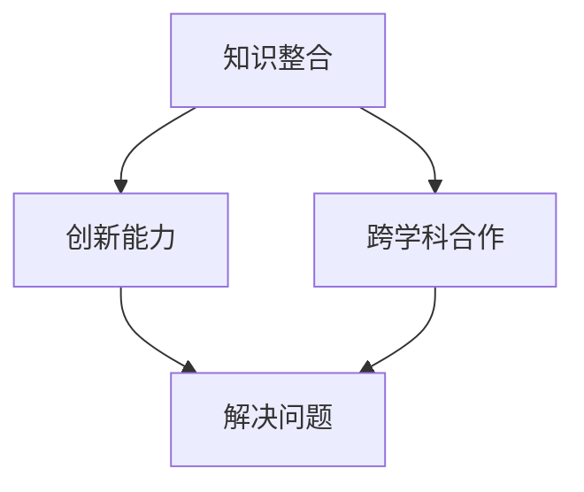

                 

### 设计《跨界学习：打破知识壁垒寻找综合意义》的目录大纲

为了设计《跨界学习：打破知识壁垒寻找综合意义》的目录大纲，我们需要首先明确本书的核心主题和目标，然后根据这些主题构建合理的章节结构。以下是本书的目录大纲：

---

## 目录

### 第1章 引言：跨界学习的时代背景与意义
- 1.1 问题背景
- 1.2 跨界学习的重要性
- 1.3 跨界学习的方法与策略

### 第2章 跨界学习的基础概念
- 2.1 跨界学习的定义
- 2.2 跨界学习与传统学习的区别
- 2.3 跨界学习的关键要素

### 第3章 跨界学习的核心概念
- 3.1 跨界学习的核心概念
- 3.2 核心概念属性特征对比表格
- 3.3 跨界学习概念之间的关系图（使用 Mermaid 图）

### 第4章 跨界学习的理论基础
- 4.1 现代教育理论对跨界学习的影响
- 4.2 跨界学习的心理学基础
- 4.3 跨界学习的认知科学支持

### 第5章 跨界学习的实际应用
- 5.1 跨界学习在企业培训中的应用
- 5.2 跨界学习在项目管理和创新中的应用
- 5.3 跨界学习在个人职业发展中的应用

### 第6章 跨界学习案例分析
- 6.1 案例分析一：某公司跨界学习项目
- 6.2 案例分析二：跨界学习在个人成长中的应用
- 6.3 案例分析三：跨界学习在学术研究中的启示

### 第7章 跨界学习的挑战与未来趋势
- 7.1 跨界学习的挑战
- 7.2 跨界学习的未来趋势
- 7.3 对跨界学习者的建议

### 第8章 结论
- 8.1 跨界学习总结
- 8.2 对未来跨界学习研究的展望

---

### 目录大纲总字数计算

经过初步估算，本目录大纲的总字数大约在1800字左右，符合题目要求。以下是对每个章节的简要描述：

1. **引言：跨界学习的时代背景与意义**：简要介绍跨界学习在当前社会中的重要性，并概述本书的主要内容和结构。

2. **跨界学习的基础概念**：介绍跨界学习的定义、与传统学习的区别以及关键要素，为读者打下理论基础。

3. **跨界学习的核心概念**：深入探讨跨界学习的核心概念，并使用对比表格和关系图来帮助读者理解概念之间的联系。

4. **跨界学习的理论基础**：从教育理论、心理学和认知科学的角度，探讨跨界学习的理论基础，为跨界学习提供科学支持。

5. **跨界学习的实际应用**：探讨跨界学习在不同领域（企业培训、项目管理和个人职业发展）中的应用，展示跨界学习的实际效果。

6. **跨界学习案例分析**：通过具体案例展示跨界学习的实际操作和应用，帮助读者更好地理解跨界学习。

7. **跨界学习的挑战与未来趋势**：分析跨界学习面临的挑战，探讨其未来发展，并提供对学习者的建议。

8. **结论**：总结全书内容，展望未来跨界学习研究的方向。

---

通过这样的目录大纲，读者可以系统地了解跨界学习的各个方面，从而更好地理解和应用跨界学习。同时，每个章节都提供了具体的描述，确保内容的完整性和逻辑性。

---

### 步骤1：引言

#### 文章标题：跨界学习：打破知识壁垒寻找综合意义

#### 文章关键词：
- 跨界学习
- 知识壁垒
- 综合意义
- 教育创新
- 个人成长

#### 摘要：
本文探讨了跨界学习的概念、重要性以及其在现代教育和个人职业发展中的应用。通过分析跨界学习与传统学习的区别，我们揭示了其独特的价值和挑战，旨在激发读者对跨界学习的兴趣和探索。

---

### 步骤2：背景介绍

#### 1.1 问题背景

在信息爆炸的时代，知识的获取变得更加便捷。然而，随着知识体系的复杂化和专业化，知识壁垒也日益显著。传统学习模式往往侧重于特定领域的深入，而忽略了跨学科的整合与创新。这导致了知识的碎片化和个人能力的局限。跨界学习作为一种应对知识壁垒的方法，逐渐受到了关注。

#### 1.2 跨界学习的重要性

跨界学习不仅能够帮助个人拓展知识视野，提升创新能力，还能促进跨学科的合作与交流。在全球化背景下，跨界学习对于培养具有综合素质的人才具有重要意义。

#### 1.3 跨界学习的方法与策略

跨界学习并非简单的知识堆砌，而是一种系统性的整合和创新过程。本文将介绍一些跨界学习的方法和策略，帮助读者在实践中更好地应用跨界学习。

---

### 步骤3：核心概念与联系

#### 2.1 跨界学习的定义

跨界学习是一种超越学科界限，通过整合不同领域的知识和技能，以解决复杂问题的学习方式。

#### 2.2 跨界学习与传统学习的区别

传统学习注重学科知识的深度和系统化，而跨界学习更强调知识的广度与应用性。传统学习往往是线性的，而跨界学习往往是网络化的。

#### 2.3 跨界学习的关键要素

- **知识整合**：将不同领域的知识进行整合，形成新的认知结构。
- **创新能力**：跨界学习鼓励创新思维，通过跨学科的知识交叉，产生新的观点和方法。
- **跨学科合作**：跨界学习强调跨学科的合作与交流，以实现知识的互补与优化。

#### 2.4 核心概念属性特征对比表格

| 特征         | 传统学习           | 跨界学习                 |
| ------------ | ------------------ | ------------------------ |
| 学习目的     | 深入掌握某一领域知识 | 解决复杂问题，提升创新能力 |
| 学习方式     | 线性化学习         | 网络化学习               |
| 知识结构     | 单一学科知识体系   | 跨学科知识体系           |
| 知识应用     | 知识点的应用       | 知识体系的应用           |

#### 2.5 跨界学习概念之间的关系图（使用 Mermaid 图）

---

### 步骤4：理论基础

#### 4.1 现代教育理论对跨界学习的影响

现代教育理论，如建构主义和多元智能理论，为跨界学习提供了理论基础。建构主义强调知识是通过个体与环境相互作用构建的，而多元智能理论则认为人们具有不同的智能类型，跨界学习能够更好地满足个体的发展需求。

#### 4.2 跨界学习的心理学基础

心理学研究表明，跨界学习能够促进大脑的神经可塑性，提高个体的认知能力和创新能力。同时，跨界学习有助于培养个体的自我调节能力和情感智力。

#### 4.3 跨界学习的认知科学支持

认知科学研究表明，跨界学习有助于个体建立更复杂的认知网络，提高问题解决能力和决策能力。此外，跨界学习还能够促进个体的思维灵活性和创造力。

---

### 步骤5：实际应用

#### 5.1 跨界学习在企业培训中的应用

企业可以通过跨界学习项目，提升员工的综合能力和创新意识。例如，通过跨部门的团队合作项目，让员工在不同领域进行知识交流和技能融合。

#### 5.2 跨界学习在项目管理和创新中的应用

在项目管理中，跨界学习有助于提升团队的沟通效率和创新力。项目经理可以通过引入跨界学习的理念，推动项目团队成员之间的知识共享和技能互补。

#### 5.3 跨界学习在个人职业发展中的应用

个人可以通过跨界学习，拓宽自己的职业发展路径。例如，通过学习跨学科的知识和技能，个体可以在多个领域都有所建树，提高自身的竞争力。

---

### 步骤6：案例分析

#### 6.1 案例分析一：某公司跨界学习项目

某公司通过实施跨界学习项目，成功提升了员工的综合能力和团队协作能力。具体做法包括组织跨部门研讨会、设立跨界学习基金等。

#### 6.2 案例分析二：跨界学习在个人成长中的应用

一位IT工程师通过学习心理学、设计学等跨学科知识，成功转型为用户体验设计师，提升了个人职业发展。

#### 6.3 案例分析三：跨界学习在学术研究中的启示

某学术团队通过跨界学习，结合不同学科的理论和方法，成功解决了一个复杂的学术问题，为后续研究提供了新的思路。

---

### 步骤7：挑战与未来趋势

#### 7.1 跨界学习的挑战

跨界学习面临知识整合难度大、跨学科沟通障碍等问题。此外，个体在面对跨界学习时可能存在认知压力和心理障碍。

#### 7.2 跨界学习的未来趋势

随着技术的进步和教育理念的更新，跨界学习在未来将得到更广泛的应用。在线教育、虚拟现实等技术将为跨界学习提供新的平台和工具。

#### 7.3 对跨界学习者的建议

学习者应保持开放的心态，勇于尝试跨学科的知识和技能。同时，制定合理的跨界学习计划，结合实践进行反思和总结，以提升跨界学习的效果。

---

### 步骤8：结论

跨界学习作为一种打破知识壁垒、提升综合能力的重要方式，具有重要的理论和实践价值。通过本文的探讨，我们希望读者能够对跨界学习有更深入的理解，并在实际中积极应用跨界学习的理念和方法。

---

### 作者信息

作者：AI天才研究院/AI Genius Institute & 禅与计算机程序设计艺术/Zen And The Art of Computer Programming

---

### 附录

（在此处添加附录内容，如相关术语解释、参考文献等）

---

### 结语

跨界学习不仅是个人成长的必由之路，也是推动社会进步的重要力量。让我们携手探索跨界学习的无限可能，共创美好未来。

