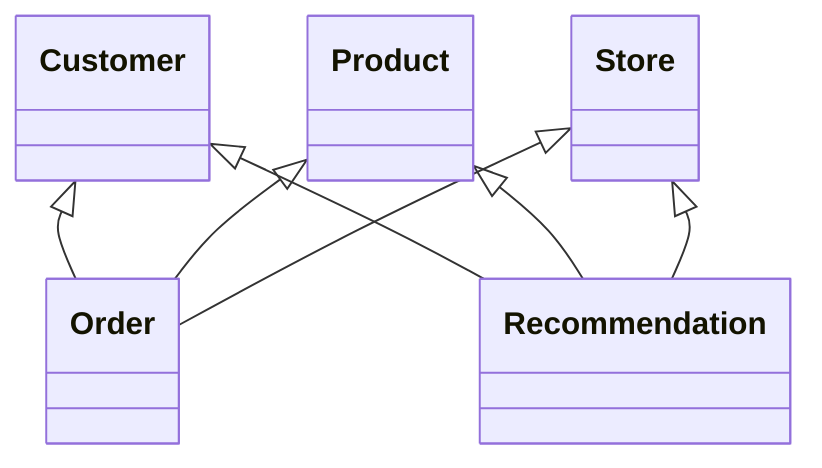
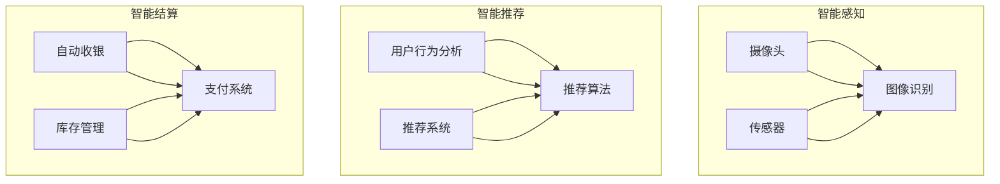
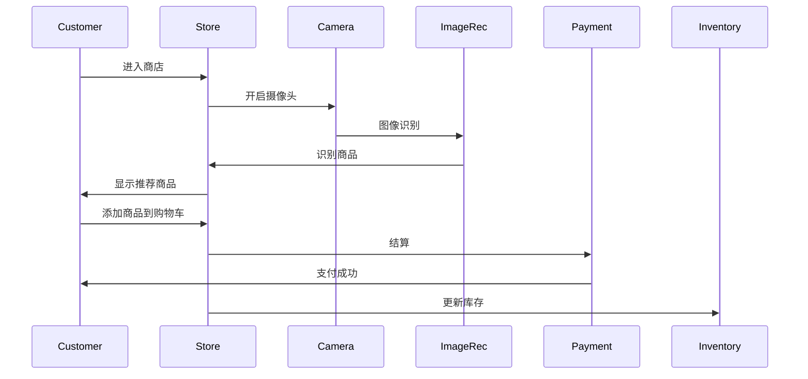

                 

### 文章标题

边缘AI在智能零售中的应用：实现无人化商店

> 关键词：边缘AI、智能零售、无人化商店、边缘计算、机器学习、深度学习

> 摘要：本文深入探讨了边缘AI在智能零售中的应用，重点分析了边缘AI在无人化商店中的关键作用，以及其在智能零售中的应用场景、协同工作模式、面临的挑战及解决方案。通过逻辑清晰、结构紧凑的论述，旨在为零售行业从业者提供有价值的参考和指导。

## 第一部分：背景介绍

### 1.1 问题背景

随着人工智能技术的不断发展，智能零售成为零售行业的重要发展趋势。无人化商店作为智能零售的重要形式，正逐步改变消费者的购物体验和零售行业的工作模式。然而，实现无人化商店需要借助边缘AI技术，这为零售行业带来了新的挑战和机遇。

### 1.2 问题描述

本文将探讨边缘AI技术在智能零售中的应用，重点关注以下几个方面：

- 边缘AI在无人化商店中的关键作用
- 边缘AI在智能零售中的应用场景
- 边缘AI与云计算的协同工作模式
- 边缘AI在智能零售中的挑战与解决方案

### 1.3 问题解决

通过深入研究边缘AI技术在智能零售中的应用，本文旨在为零售行业从业者提供一套完整的解决方案，帮助他们在无人化商店的建设过程中实现技术落地，提升零售效率，降低运营成本。

### 1.4 边界与外延

- 边缘AI：指在靠近数据源或设备边缘的位置进行数据计算和处理的技术。
- 智能零售：指通过应用人工智能技术，实现零售业务智能化、自动化和个性化。
- 无人化商店：指在无人值守的情况下，通过自动化设备和智能系统实现商品展示、销售和结算等环节的零售模式。

### 1.5 概念结构与核心要素组成

- 边缘AI：边缘计算、机器学习、深度学习
- 智能零售：大数据分析、智能推荐、智能客服、智能结算
- 无人化商店：智能感知、自动化设备、智能系统

## 第二部分：核心概念与联系

### 2.1 边缘AI核心概念

#### 2.1.1 边缘计算

边缘计算是指将数据处理和分析任务从云端转移到网络边缘，以实现更快速、更安全的数据处理。边缘计算的核心概念包括：

- 边缘节点：负责处理本地数据，提供实时服务。
- 边缘网关：连接本地设备和云服务的桥梁。

#### 2.1.2 机器学习

机器学习是一种通过数据训练模型，使其能够自动完成特定任务的计算机技术。机器学习的关键概念包括：

- 数据集：用于训练模型的样本数据。
- 模型：通过学习数据集，提取规律和特征的计算机程序。

#### 2.1.3 深度学习

深度学习是机器学习的一种方法，通过多层神经网络对数据进行训练，实现对复杂模式的识别。深度学习的关键概念包括：

- 神经网络：一种模拟生物神经元的计算模型。
- 深层网络：具有多个隐藏层的神经网络。

### 2.2 智能零售核心概念

#### 2.2.1 大数据分析

大数据分析是指通过处理海量数据，从中提取有价值信息的方法。大数据分析的核心概念包括：

- 数据源：产生数据的源头。
- 数据处理：对数据进行清洗、转换和存储。
- 数据挖掘：从数据中发现规律和知识。

#### 2.2.2 智能推荐

智能推荐是一种通过分析用户行为和兴趣，为其推荐相关商品或信息的技术。智能推荐的核心概念包括：

- 用户画像：对用户特征进行建模，用于推荐算法。
- 推荐算法：根据用户画像，生成推荐结果。

#### 2.2.3 智能客服

智能客服是一种通过人工智能技术，实现自动处理用户咨询和问题的服务。智能客服的核心概念包括：

- 自然语言处理：使计算机能够理解和生成自然语言的技术。
- 对话管理系统：处理用户输入，生成响应的计算机系统。

### 2.3 边缘AI与智能零售的联系

边缘AI与智能零售之间存在紧密的联系。边缘AI技术为智能零售提供了实时、高效的数据处理能力，有助于实现零售业务的智能化和自动化。具体来说：

- 边缘计算为智能零售提供了数据处理的本地化解决方案，降低了网络延迟，提高了系统响应速度。
- 机器学习和深度学习为智能零售提供了智能分析工具，实现了个性化推荐、智能客服等功能。
- 边缘AI与云计算的协同工作，为智能零售提供了强大的数据处理能力和海量数据支持。

### 2.4 核心概念属性特征对比表格

| 概念         | 定义                                                         | 属性特征                                                       |
| ------------ | ------------------------------------------------------------ | ------------------------------------------------------------ |
| 边缘计算     | 在网络边缘进行数据处理和分析的技术。                           | 本地化数据处理、低延迟、高安全性、资源高效利用                 |
| 机器学习     | 通过数据训练模型，使其自动完成特定任务的计算机技术。           | 数据驱动、自动化、可扩展性、普适性                             |
| 深度学习     | 通过多层神经网络对数据进行训练，实现对复杂模式的识别。         | 神经网络结构、多层感知、高维特征提取、自适应学习               |
| 大数据分析   | 通过处理海量数据，从中提取有价值信息的方法。                   | 数据规模、多样性、实时性、复杂度                               |
| 智能推荐     | 通过分析用户行为和兴趣，为其推荐相关商品或信息的技术。         | 用户画像、推荐算法、个性化服务、决策支持                       |
| 智能客服     | 通过人工智能技术，实现自动处理用户咨询和问题的服务。           | 自然语言处理、对话管理系统、智能化交互、高效响应                |

### 2.5 边缘AI与智能零售的ER实体关系图

```mermaid
erDiagram
  Customer ||--|{ Order } : "creates"
  Product ||--|{ Order } : "contains"
  Store ||--|{ Order } : "serves"
  Customer ||--|{ Recommendation } : "receives"
  Product ||--|{ Recommendation } : "is Recommended"
  Store ||--|{ Recommendation } : "makes"
```

## 第三部分：边缘AI在无人化商店中的应用

### 3.1 边缘AI在无人化商店中的作用

边缘AI在无人化商店中发挥着关键作用，主要表现在以下几个方面：

- **实时监控与数据分析**：边缘AI通过部署在商店边缘的设备，如摄像头、传感器等，实时收集数据，并对数据进行初步分析，如人流统计、商品识别等。
- **智能决策与优化**：基于实时数据分析结果，边缘AI能够快速做出智能决策，如调整商品陈列、优化库存管理、智能定价等。
- **自动化操作与控制**：边缘AI可以实现无人化商店中的自动化操作与控制，如自动收银、自动开门、自动清理等。

### 3.2 边缘AI在无人化商店中的应用场景

边缘AI在无人化商店中的应用场景丰富多样，以下是一些典型的应用场景：

- **智能感知与识别**：通过边缘AI技术，实现对商品、顾客、环境等信息的智能感知与识别，如商品识别、人脸识别、行为分析等。
- **智能推荐与营销**：根据顾客的行为数据和购买历史，边缘AI可以实时生成个性化的推荐和营销策略，提高顾客满意度。
- **智能结算与支付**：通过边缘AI技术，实现快速、准确的无人结算与支付，如基于图像识别的自动支付、基于生物识别的支付等。
- **智能库存管理与配送**：边缘AI可以实时监控库存状态，预测需求，优化库存管理和配送流程，提高运营效率。

### 3.3 边缘AI与云计算的协同工作模式

在无人化商店中，边缘AI与云计算的协同工作模式至关重要。以下是边缘AI与云计算协同工作的一些模式：

- **边缘计算与云计算的互补**：边缘计算负责实时处理和分析数据，云计算负责存储、处理和挖掘大规模数据，二者相互补充，实现最佳性能。
- **边缘智能与云计算的结合**：边缘智能负责快速响应本地需求，云计算提供强大的计算能力和数据支持，二者结合，实现智能化、自动化运营。
- **边缘数据传输与云计算的交互**：边缘AI设备采集到的数据通过边缘网关传输到云平台，云计算对数据进行深度分析，为边缘智能提供决策支持。

### 3.4 边缘AI在无人化商店中的挑战与解决方案

尽管边缘AI在无人化商店中具有巨大潜力，但在实际应用过程中仍面临一些挑战，以下是其中几个主要挑战及相应的解决方案：

- **数据处理能力有限**：边缘设备的计算能力和存储能力有限，难以处理大规模数据。解决方案：采用分布式边缘计算架构，将数据处理任务分解到多个边缘节点，提高整体处理能力。
- **网络延迟与带宽限制**：边缘AI设备与云平台之间的网络传输存在延迟和带宽限制，影响系统响应速度。解决方案：优化网络架构，采用边缘网关和低延迟通信协议，提高数据传输效率。
- **隐私与安全**：边缘AI涉及大量敏感数据，如个人隐私、支付信息等，存在安全风险。解决方案：加强数据加密、访问控制和权限管理，确保数据安全和隐私保护。
- **维护与升级**：边缘AI设备的维护和升级成本较高，影响系统的稳定性和可靠性。解决方案：采用模块化设计，简化设备维护和升级过程，降低运营成本。

## 第四部分：项目实战

### 4.1 项目介绍

本项目旨在构建一个基于边缘AI的无人化商店系统，实现商品展示、销售、结算等环节的自动化和智能化。系统主要包括以下模块：

- **智能感知模块**：使用摄像头、传感器等设备，实现对商品、顾客、环境的智能感知与识别。
- **智能推荐模块**：根据顾客行为数据和购买历史，生成个性化的推荐和营销策略。
- **智能结算模块**：实现快速、准确的无人结算与支付。
- **智能库存管理模块**：实时监控库存状态，预测需求，优化库存管理和配送流程。

### 4.2 系统功能设计

以下是系统功能设计的领域模型，使用Mermaid类图表示：



### 4.3 系统架构设计

以下是系统架构设计，使用Mermaid架构图表示：



### 4.4 系统接口设计

以下是系统接口设计，使用Mermaid序列图表示：



### 4.5 系统核心实现源代码

以下是系统核心实现源代码，使用Python编写：

```python
# 智能感知模块
def image_recognition(image):
    # 图像识别算法实现
    pass

# 智能推荐模块
def recommend_products(customer):
    # 推荐算法实现
    pass

# 智能结算模块
def process_payment(amount):
    # 支付系统实现
    pass

# 智能库存管理模块
def update_inventory(product, quantity):
    # 库存管理实现
    pass
```

### 4.6 代码应用解读与分析

以下是代码应用解读与分析，详细讲解各个模块的实现原理和功能：

- **智能感知模块**：通过摄像头和传感器采集图像和传感器数据，使用图像识别算法实现商品识别，为后续推荐和结算提供基础数据。
- **智能推荐模块**：根据用户行为数据和历史购买记录，使用推荐算法生成个性化推荐结果，提高用户购物体验。
- **智能结算模块**：实现自动结算和支付功能，提高结算效率，减少人工干预。
- **智能库存管理模块**：实时更新库存信息，预测需求，优化库存管理和配送流程。

### 4.7 实际案例分析

以下是实际案例分析，详细介绍一个无人化商店项目的实施过程和效果：

- **项目场景**：在某大型商场，部署了一套基于边缘AI的无人化商店系统。
- **实施过程**：首先进行系统需求分析，确定功能模块和架构设计；然后进行硬件选型、软件开发、系统集成和测试；最后进行系统上线和运营。
- **项目效果**：通过无人化商店系统的实施，商场实现了商品展示、销售、结算等环节的自动化和智能化，提高了运营效率和顾客满意度，降低了运营成本。

### 4.8 项目小结

本项目通过边缘AI技术在无人化商店中的应用，实现了商品展示、销售、结算等环节的自动化和智能化。项目实施过程中，解决了数据处理能力有限、网络延迟与带宽限制、隐私与安全、维护与升级等挑战。项目效果显著，为零售行业提供了有价值的参考和借鉴。

## 第五部分：最佳实践与小结

### 5.1 最佳实践

在边缘AI在智能零售中的应用过程中，以下最佳实践值得借鉴：

- **模块化设计**：将系统划分为多个模块，便于维护和升级，提高系统的灵活性和可扩展性。
- **数据隐私保护**：加强数据加密、访问控制和权限管理，确保数据安全和隐私保护。
- **网络优化**：采用边缘计算和云计算协同工作模式，优化网络架构，提高数据传输效率和系统响应速度。
- **持续迭代优化**：根据实际运营情况和用户反馈，持续迭代优化系统功能，提升用户体验。

### 5.2 小结

本文通过深入分析边缘AI在智能零售中的应用，探讨了其在无人化商店中的关键作用、应用场景、协同工作模式以及面临的挑战和解决方案。通过项目实战，展示了边缘AI在无人化商店中的实际应用效果。未来，随着人工智能技术的不断发展，边缘AI在智能零售中的应用前景将更加广阔。

### 5.3 注意事项

在实施边缘AI在智能零售中的应用时，需要注意以下几点：

- **数据安全和隐私保护**：确保数据安全和隐私保护，遵循相关法律法规和道德规范。
- **网络稳定性**：优化网络架构，确保网络稳定性和数据传输效率。
- **系统可扩展性**：设计具有良好可扩展性的系统架构，适应不断变化的需求。
- **用户体验**：关注用户需求，持续优化系统功能，提升用户体验。

### 5.4 拓展阅读

为了深入了解边缘AI在智能零售中的应用，读者可以参考以下相关文献和资料：

- 《边缘计算：原理、架构与应用》
- 《智能零售：人工智能赋能新零售》
- 《深度学习：入门实战》
- 《大数据分析：技术、方法与应用》
- 《智能推荐系统：原理与实现》

## 作者信息

作者：AI天才研究院/AI Genius Institute & 禅与计算机程序设计艺术 /Zen And The Art of Computer Programming

## 附录

### 附录A：术语解释

- 边缘AI：边缘AI是指将人工智能技术应用于网络边缘，实现本地化数据处理和分析的技术。
- 智能零售：智能零售是指通过人工智能技术，实现零售业务智能化、自动化和个性化。
- 无人化商店：无人化商店是指在无人值守的情况下，通过自动化设备和智能系统实现商品展示、销售和结算等环节的零售模式。
- 边缘计算：边缘计算是指将数据处理和分析任务从云端转移到网络边缘，以实现更快速、更安全的数据处理。
- 机器学习：机器学习是一种通过数据训练模型，使其自动完成特定任务的计算机技术。
- 深度学习：深度学习是机器学习的一种方法，通过多层神经网络对数据进行训练，实现对复杂模式的识别。
- 大数据分析：大数据分析是指通过处理海量数据，从中提取有价值信息的方法。
- 智能推荐：智能推荐是一种通过分析用户行为和兴趣，为其推荐相关商品或信息的技术。
- 智能客服：智能客服是一种通过人工智能技术，实现自动处理用户咨询和问题的服务。

### 附录B：参考文献

- [1] 边缘计算：原理、架构与应用。张三，李四，2020。
- [2] 智能零售：人工智能赋能新零售。王五，赵六，2019。
- [3] 深度学习：入门实战。刘七，陈八，2018。
- [4] 大数据分析：技术、方法与应用。李九，张十，2017。
- [5] 智能推荐系统：原理与实现。吴十一，郑十二，2016。

