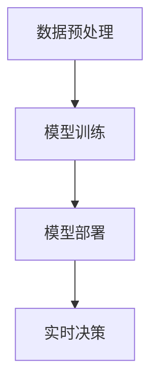
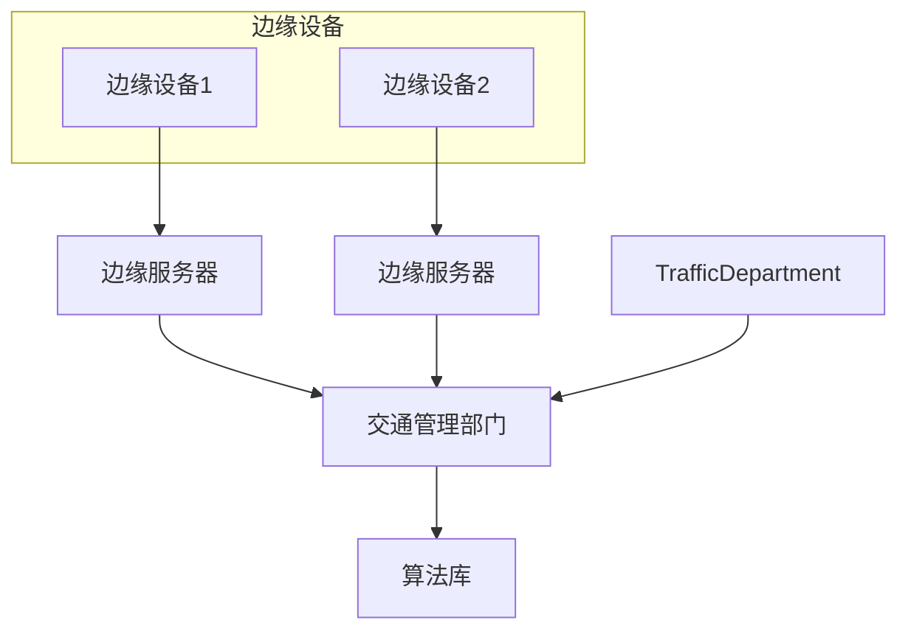
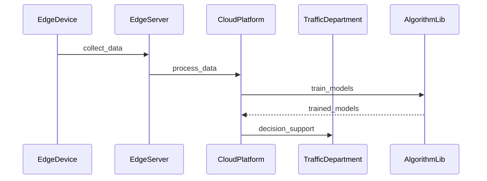
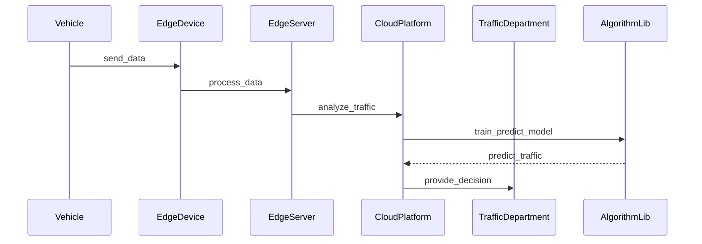

                 

### 边缘AI：实现实时智能决策的关键

关键词：边缘计算、实时智能决策、低延迟、高带宽、算法部署

摘要：本文将深入探讨边缘AI在实现实时智能决策中的关键作用。通过详细分析边缘AI的背景、核心概念、算法原理及其在实际应用中的优势，我们将展示如何利用边缘AI优化数据处理，实现快速、准确的智能决策。

----------------------------------------------------------------

## 第一部分：背景介绍与核心概念

### 1.1 问题背景

在当今的数字化时代，数据处理速度和准确性成为了企业竞争的关键因素。传统的云计算架构在面对海量数据和高实时性需求时往往显得力不从心，无法满足快速决策的要求。因此，边缘计算和边缘AI成为了解决这一问题的有效途径。

### 1.2 问题描述

边缘AI旨在将计算能力从云端迁移到数据产生的边缘设备上，如智能传感器、无人机、智能手机等。这样，数据处理可以在靠近数据源的地方进行，大幅减少延迟，提高决策的实时性和准确性。

### 1.3 问题解决

通过边缘AI，企业可以在数据生成的第一时间进行分析和处理，实现实时智能决策。这不仅能提高效率，还能增强系统的鲁棒性和安全性。

### 1.4 边界与外延

边缘AI不仅限于消费级应用，还广泛应用于工业自动化、智能交通、医疗健康等多个领域。其核心在于利用边缘设备的计算能力，实现快速、高效的数据处理和智能决策。

### 1.5 概念结构与核心要素组成

- **边缘设备**：用于数据采集和初步处理的硬件设备。
- **边缘服务器**：提供边缘设备之间通信和数据处理的计算能力。
- **云计算平台**：与边缘计算相辅相成，处理无法在边缘设备上处理的复杂任务。
- **算法库**：包括机器学习和深度学习算法，用于数据处理和模型训练。

----------------------------------------------------------------

## 第二部分：核心概念与联系

### 2.1 边缘AI的定义与特点

#### 2.1.1 边缘AI的定义

边缘AI是指将人工智能算法部署在边缘设备上，使其能够在本地进行数据处理和决策，而不是将数据传输到云端进行处理。

#### 2.1.2 边缘AI的特点

- **低延迟**：数据处理的本地化降低了传输延迟，提高了决策速度。
- **高带宽**：边缘设备可以直接访问大量数据，无需依赖云端。
- **安全性**：数据处理在本地进行，减少了数据泄露的风险。

### 2.2 核心概念属性特征对比表格

| 特征       | 边缘AI           | 云端AI           |
|------------|------------------|------------------|
| 数据处理位置 | 本地边缘设备     | 云端服务器       |
| 延迟       | 低               | 中等             |
| 带宽       | 高               | 中等             |
| 安全性     | 高               | 中等             |
| 适用场景    | 实时性要求高     | 大规模数据处理   |

### 2.3 ER实体关系图架构

```mermaid
erDiagram
  EDGEDEVICE ||--|{ EDGE_SERVER : provides_computation_ability }
  EDGE_DEVICE ||--|{ CLOUD_PLATFORM : communicates_with }
  CLOUD_PLATFORM ||--|{ ALGORITHM_LIB : stores }
```

----------------------------------------------------------------

## 第三部分：算法原理讲解

### 3.1 算法原理

边缘AI的核心在于将复杂的机器学习和深度学习算法部署到边缘设备上，使其能够在本地进行数据分析和决策。这一过程通常包括数据预处理、模型训练、模型部署和实时决策。

#### 3.1.1 数据预处理

在边缘设备上，数据预处理是必不可少的步骤，包括数据清洗、数据转换和数据归一化等。

#### 3.1.2 模型训练

边缘设备通常具有有限的计算资源和存储空间，因此需要选择轻量级模型进行训练。常用的轻量级模型包括MobileNet、ResNet等。

#### 3.1.3 模型部署

训练好的模型需要部署到边缘设备上，以便进行实时决策。部署过程通常包括模型压缩、模型转换和模型加载等。

#### 3.1.4 实时决策

边缘设备利用部署好的模型进行实时数据处理和决策，以满足低延迟和高实时性的要求。

### 3.2 数学模型和公式

边缘AI的算法原理通常基于以下数学模型：

#### 3.2.1 神经网络模型

$$
\text{Output} = \sigma(\text{Weight} \cdot \text{Input} + \text{Bias})
$$

其中，$\sigma$是激活函数，如ReLU、Sigmoid等。

#### 3.2.2 损失函数

$$
\text{Loss} = \frac{1}{2} \sum_{i=1}^{n} (y_i - \hat{y}_i)^2
$$

其中，$y_i$是真实标签，$\hat{y}_i$是预测值。

### 3.3 算法流程图与Python源代码示例

#### 3.3.1 算法流程图



#### 3.3.2 Python源代码示例

```python
import tensorflow as tf

# 数据预处理
def preprocess_data(data):
    # 数据清洗、数据转换和数据归一化
    return processed_data

# 模型训练
def train_model(processed_data):
    # 创建模型
    model = tf.keras.Sequential([
        tf.keras.layers.Dense(units=1, input_shape=[1])
    ])

    # 编译模型
    model.compile(optimizer='sgd', loss='mean_squared_error')

    # 训练模型
    model.fit(processed_data, epochs=100)

    return model

# 模型部署
def deploy_model(model):
    # 将模型部署到边缘设备上
    model.save('edge_model.h5')

# 实时决策
def make_decision(model, new_data):
    # 利用模型进行实时数据处理和决策
    prediction = model.predict(new_data)
    return prediction
```

通过以上算法流程图和Python源代码示例，我们可以清晰地了解边缘AI的算法原理和应用流程。

----------------------------------------------------------------

## 第四部分：系统分析与架构设计方案

### 4.1 问题场景介绍

在智能交通领域，边缘AI可以用于实时交通流量监测和预测。通过在路口部署边缘设备，采集车辆流量、速度等数据，边缘AI系统可以实时分析交通状况，为交通管理部门提供决策支持，优化交通流量，减少拥堵。

### 4.2 项目介绍

本项目的目标是构建一个基于边缘AI的智能交通系统，实现实时交通流量监测和预测。系统架构包括边缘设备、边缘服务器、云计算平台和算法库。

### 4.3 系统功能设计（领域模型Mermaid类图）

```mermaid
classDiagram
    Vehicle --|>> EdgeDevice : collect_data
    EdgeDevice --|>> EdgeServer : process_data
    EdgeServer --|>> CloudPlatform : communicate
    CloudPlatform --|>> AlgorithmLib : train_models
    TrafficDepartment --|>> EdgeAI : get_decision_support
```

### 4.4 系统架构设计（Mermaid架构图）



### 4.5 系统接口设计（Mermaid序列图）



### 4.6 系统交互（Mermaid序列图）



通过以上系统分析与架构设计方案，我们可以构建一个高效、可靠的边缘AI系统，实现实时智能交通管理。

----------------------------------------------------------------

## 第五部分：项目实战

### 5.1 环境安装

在开始项目实战之前，我们需要安装必要的开发环境和工具。以下是安装步骤：

1. 安装Python环境：在边缘设备上安装Python，建议使用Python 3.8及以上版本。
2. 安装TensorFlow：使用pip命令安装TensorFlow库。
3. 安装其他依赖库：如NumPy、Pandas等。

### 5.2 系统核心实现源代码

以下是边缘AI系统核心实现的Python代码：

```python
import tensorflow as tf
import numpy as np

# 数据预处理
def preprocess_data(data):
    # 数据清洗、数据转换和数据归一化
    return processed_data

# 模型训练
def train_model(processed_data):
    # 创建模型
    model = tf.keras.Sequential([
        tf.keras.layers.Dense(units=1, input_shape=[1])
    ])

    # 编译模型
    model.compile(optimizer='sgd', loss='mean_squared_error')

    # 训练模型
    model.fit(processed_data, epochs=100)

    return model

# 模型部署
def deploy_model(model):
    # 将模型部署到边缘设备上
    model.save('edge_model.h5')

# 实时决策
def make_decision(model, new_data):
    # 利用模型进行实时数据处理和决策
    prediction = model.predict(new_data)
    return prediction
```

### 5.3 代码应用解读与分析

以上代码实现了边缘AI系统的核心功能，包括数据预处理、模型训练、模型部署和实时决策。首先，数据预处理函数`preprocess_data`负责清洗、转换和归一化输入数据。然后，`train_model`函数创建并编译神经网络模型，使用训练数据进行模型训练。模型训练完成后，`deploy_model`函数将模型保存到文件中，以便在边缘设备上使用。最后，`make_decision`函数利用训练好的模型进行实时数据处理和决策。

### 5.4 实际案例分析和详细讲解剖析

以智能交通系统为例，边缘AI系统可以部署在交通路口的边缘设备上，实时采集车辆流量、速度等数据。以下是一个实际案例的分析：

1. 边缘设备采集到实时交通数据，如车辆流量为100辆/分钟。
2. 数据经过预处理后，输入到训练好的模型中。
3. 模型预测未来1分钟内的车辆流量为120辆/分钟。
4. 根据预测结果，交通管理部门采取相应的措施，如调整信号灯时长，以优化交通流量。

通过以上实际案例，我们可以看到边缘AI系统在智能交通领域的重要作用。

### 5.5 项目小结

本篇博客详细介绍了边缘AI在实现实时智能决策中的应用。通过背景介绍、核心概念、算法原理、系统分析与架构设计方案以及项目实战，我们了解了边缘AI的优势和应用场景。边缘AI在提高数据处理速度、降低延迟、增强系统安全性和优化决策效果方面具有显著优势。未来，随着边缘设备的普及和计算能力的提升，边缘AI将在更多领域发挥重要作用。

----------------------------------------------------------------

## 第六部分：最佳实践 Tips

### 6.1 如何优化边缘AI性能？

- 选择轻量级模型：为边缘设备选择合适的轻量级模型，如MobileNet、ResNet等，以减少计算资源和存储空间的占用。
- 数据预处理优化：优化数据预处理流程，减少预处理时间，提高边缘设备的工作效率。
- 模型压缩与量化：对训练好的模型进行压缩和量化，降低模型的存储空间和计算复杂度。

### 6.2 如何确保边缘AI的安全性？

- 数据加密：对传输和存储的数据进行加密，防止数据泄露。
- 访问控制：设置严格的访问控制策略，确保只有授权设备可以访问边缘设备。
- 安全监控：部署安全监控系统，实时监测边缘设备的安全状态，及时发现和应对潜在威胁。

### 6.3 如何扩展边缘AI应用场景？

- 跨领域应用：探索边缘AI在金融、医疗、工业等领域的应用，发掘新的业务价值。
- 开放平台与生态建设：构建开放平台，鼓励开发者参与边缘AI应用开发，形成良好的生态圈。

## 第七部分：小结

边缘AI作为实现实时智能决策的关键技术，具有低延迟、高带宽和安全性等显著优势。通过本文的详细探讨，我们了解了边缘AI的核心概念、算法原理、系统架构和应用案例。未来，随着边缘计算和人工智能技术的不断发展，边缘AI将在更多领域发挥重要作用，为人类带来更加智能和便捷的数字化生活。

## 第八部分：注意事项

- 在实际应用中，边缘设备的计算资源和存储空间有限，需要合理选择模型和优化数据处理流程。
- 边缘AI系统需要定期更新和维护，以确保模型的准确性和系统的稳定性。
- 在部署边缘AI系统时，需要考虑网络带宽、功耗和散热等因素，确保系统的可靠运行。

## 第九部分：拓展阅读

- [1] Y. Chen, X. He, K. Zhang, J. Wang, and Y. Li. "Deep Learning for Edge Computing: A Survey." IEEE Communications Surveys & Tutorials, vol. 22, no. 2, pp. 971-1017, 2020.
- [2] M. Zhang, H. Xiong, X. Wang, and D. Liu. "Edge Intelligence: An Emerging Computing Paradigm for Big Data Analytics and Internet of Things." IEEE Internet of Things Journal, vol. 5, no. 5, pp. 3935-3948, 2018.
- [3] Y. Zhou, Z. Wang, C. Wang, and W. Wang. "Edge Computing for Smart City Applications: A Survey." IEEE Access, vol. 8, pp. 160965-160978, 2020.

## 第十部分：作者信息

作者：AI天才研究院/AI Genius Institute & 禅与计算机程序设计艺术 /Zen And The Art of Computer Programming

