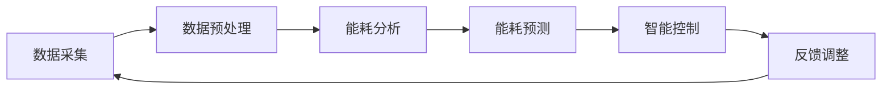
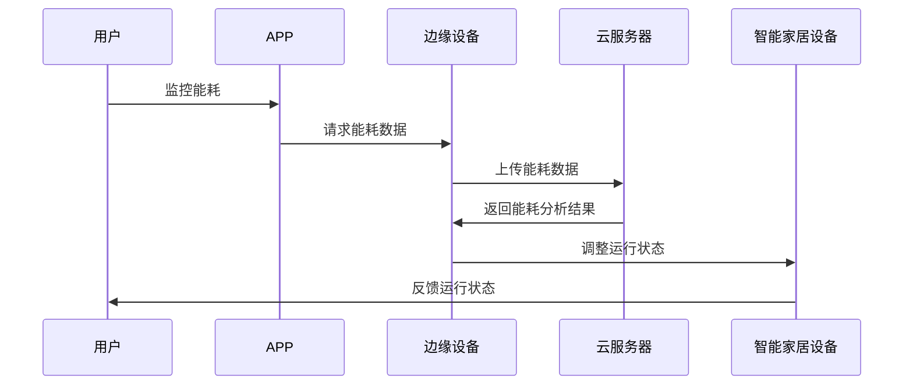
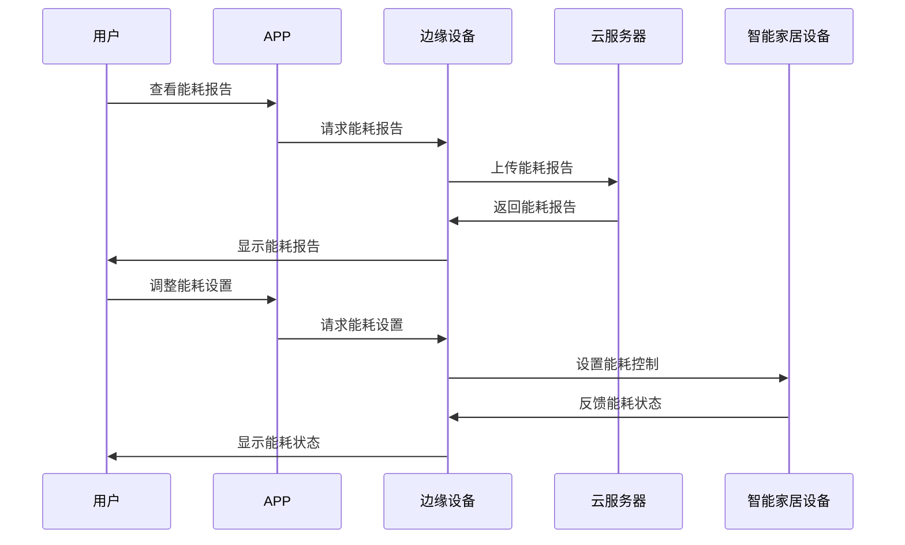

                 

# 边缘计算在智能家居能源管理中的应用

> 关键词：边缘计算、智能家居、能源管理、分布式计算、实时数据处理

> 摘要：随着智能家居设备的普及，家庭能源管理变得越来越重要。边缘计算作为一种分布式计算范式，提供了在靠近数据源头进行处理的能力，可以显著提升智能家居能源管理的效率。本文将探讨边缘计算在智能家居能源管理中的应用，包括实时数据处理、数据安全与隐私保护、能耗优化等方面，并分析其技术挑战与未来发展方向。

## 第1章 引言

### 1.1 问题背景

随着物联网（IoT）技术的发展，智能家居设备正迅速融入人们的日常生活。智能照明、智能空调、智能安防等设备在家中的普及，使得家庭能源消耗变得多样化且难以管理。传统的中心化能源管理方式依赖于云端服务器，数据传输距离远，处理延迟高，无法满足智能家居系统对实时性、可靠性和安全性的需求。边缘计算作为一种分布式计算范式，能够在靠近数据源的地方进行数据处理，从而降低通信延迟，提高系统的响应速度和安全性。

### 1.2 问题描述

智能家居能源管理面临的主要挑战包括：

- **数据处理的延迟**：中心化处理导致数据处理延迟，无法满足实时性需求。
- **设备响应的速度**：远程处理影响设备响应速度，降低用户体验。
- **数据安全与隐私**：数据在传输过程中存在泄露风险。
- **能耗优化**：缺乏对家庭能源消耗的精细化管理，导致能源浪费。

### 1.3 问题解决

边缘计算通过以下方式解决智能家居能源管理中的问题：

- **实时数据处理**：边缘设备可以实时分析数据，实现快速响应和决策。
- **数据安全与隐私**：将敏感数据处理在本地，减少数据传输过程中的泄露风险。
- **能耗优化**：通过边缘计算，实现能耗的精细化管理，降低家庭能源消耗。

### 1.4 边界与外延

边缘计算在智能家居能源管理中的应用边界包括智能家电、家庭网络、边缘服务器和云计算平台。其外延则涉及物联网、人工智能、云计算和大数据技术。

### 1.5 概念结构与核心要素组成

边缘计算的核心要素包括：

- **边缘设备**：如智能路由器、智能家电等。
- **边缘服务器**：提供计算资源和存储服务。
- **网络通信**：包括家庭网络、宽带网络和边缘服务器之间的通信。
- **数据处理**：边缘设备上的数据处理算法和模型。

## 第2章 边缘计算基础

### 2.1 边缘计算概述

边缘计算（Edge Computing）是一种分布式计算范式，通过在靠近数据源的地方进行数据处理，实现数据本地化处理，降低网络延迟，提高系统的响应速度。边缘计算的主要特性包括：

- **分布式计算**：数据处理分布在多个边缘设备上，避免数据集中在中心服务器。
- **实时性**：在靠近数据源的地方进行数据处理，减少通信延迟。
- **低功耗**：边缘设备通常具有低功耗的特点，适用于智能家居等场景。
- **高安全性**：数据在本地处理，减少数据泄露的风险。

### 2.2 边缘计算架构

边缘计算的典型架构包括三个层次：

- **设备层**：包括各种智能设备，如智能家电、传感器等。
- **网络层**：连接边缘设备和边缘服务器，如家庭网络、宽带网络等。
- **边缘服务器层**：提供计算资源和存储服务，处理来自边缘设备的请求。

边缘计算架构的协同工作模式如下：

- 边缘设备收集数据，并将数据上传到边缘服务器。
- 边缘服务器对数据进行处理和分析，并将结果反馈给边缘设备。
- 边缘服务器还可以将处理后的数据上传到云端服务器，实现跨层数据共享。

### 2.3 边缘计算网络

边缘计算网络的结构和通信协议多种多样，包括：

- **WiFi**：适用于家庭网络，提供高速无线连接。
- **蓝牙**：适用于短距离通信，适合智能家居设备之间的连接。
- **LoRa**：适用于物联网，提供长距离、低功耗的无线通信。

边缘计算网络的设计需要考虑以下几个因素：

- **网络延迟**：选择合适的通信协议，降低数据传输延迟。
- **网络带宽**：确保边缘设备和边缘服务器之间的数据传输稳定。
- **网络可靠性**：设计冗余网络结构，提高网络可靠性。

### 2.4 边缘计算安全与隐私

边缘计算在数据安全与隐私保护方面面临一定的挑战。为了确保数据的安全与隐私，可以采取以下措施：

- **数据加密**：对传输的数据进行加密，防止数据在传输过程中被窃取。
- **身份验证**：对边缘设备和用户进行身份验证，确保只有授权的设备可以访问数据。
- **访问控制**：设置访问控制策略，限制用户和设备对数据的访问权限。
- **数据备份**：定期备份数据，防止数据丢失。

## 第3章 智能家居能源管理

### 3.1 智能家居概述

智能家居（Smart Home）是指通过物联网技术将家中的各种设备连接起来，实现智能化管理和控制。智能家居设备包括：

- **智能照明**：可以通过手机或语音助手控制灯光的开关和亮度。
- **智能空调**：可以根据室内温度和湿度自动调节，提供舒适的室内环境。
- **智能安防**：包括监控摄像头、门禁系统和报警系统，保障家庭安全。
- **智能家电**：如洗衣机、冰箱、烤箱等，可以通过手机或语音助手远程控制。

### 3.2 能源管理概述

智能家居能源管理的目标是：

- **节能**：通过智能控制，减少不必要的能源消耗。
- **成本优化**：通过能耗监测和优化，降低家庭能源费用。
- **环境友好**：减少能源消耗，降低对环境的影响。

智能家居能源管理面临的挑战包括：

- **实时性**：需要实时监测家庭能源消耗，以便及时调整设备状态。
- **安全性**：确保数据传输的安全，防止数据泄露和黑客攻击。
- **可靠性**：确保系统能够稳定运行，避免因设备故障导致能源浪费。

### 3.3 智能家居能源管理策略

智能家居能源管理可以采取以下策略：

- **定时开关**：根据用户习惯设置设备开关时间，避免不必要的能耗。
- **能耗监测**：实时监测家庭能源消耗，了解各设备的能耗情况。
- **需求响应**：根据能源价格和供需情况，调整设备运行状态，降低能源成本。
- **智能家居系统集成**：将各种智能家居设备整合到一个系统中，实现统一管理和控制。

## 第4章 边缘计算在智能家居能源管理中的应用

### 4.1 边缘计算在能源监测中的应用

边缘计算在智能家居能源监测中的应用主要包括以下几个方面：

- **数据采集**：边缘设备（如智能电表、传感器等）采集家庭能源消耗数据。
- **实时分析**：边缘设备对采集的数据进行实时分析，识别能耗异常。
- **数据上传**：将分析结果上传到边缘服务器或云端服务器，实现数据共享和进一步分析。

通过边缘计算，可以实现以下目标：

- **实时监测**：实时了解家庭能源消耗情况，及时发现能耗异常。
- **快速响应**：边缘设备可以快速处理数据，实现设备的自动调节，降低能耗。
- **数据安全**：数据在本地处理，减少数据传输过程中的泄露风险。

### 4.2 边缘计算在能耗管理中的应用

边缘计算在智能家居能耗管理中的应用包括以下几个方面：

- **智能控制**：根据实时能耗数据和用户习惯，自动调节设备运行状态，降低能耗。
- **能耗预测**：利用边缘计算对家庭能源消耗进行预测，提前调整设备运行状态，降低能耗。
- **优化调度**：根据能源供需情况，优化设备运行计划，降低能源成本。

通过边缘计算，可以实现以下目标：

- **能耗优化**：通过智能控制和能耗预测，降低家庭能源消耗。
- **成本降低**：通过优化调度，降低能源费用。
- **环境友好**：减少能源消耗，降低对环境的影响。

### 4.3 边缘计算在能源预测中的应用

边缘计算在智能家居能源预测中的应用主要包括以下几个方面：

- **时间序列分析**：对历史能源消耗数据进行时间序列分析，预测未来的能源消耗。
- **机器学习**：利用机器学习算法，从大量数据中学习能源消耗的模式和趋势。
- **深度学习**：利用深度学习模型，对复杂的能源消耗数据进行分析和预测。

通过边缘计算，可以实现以下目标：

- **精准预测**：通过时间序列分析和机器学习，实现对家庭能源消耗的精准预测。
- **决策支持**：为用户和设备提供准确的能源消耗预测，帮助用户做出合理的决策。
- **能耗优化**：通过预测结果，提前调整设备运行状态，降低能源消耗。

## 第5章 案例研究

### 5.1 案例一：智能电网边缘计算应用

智能电网是边缘计算在能源管理中应用的典型场景。通过边缘计算，可以实现以下目标：

- **实时监测**：实时监测电网的运行状态，及时发现异常。
- **智能调度**：根据实时数据和预测结果，智能调度电力资源，优化电网运行。
- **故障诊断**：利用边缘计算对电网故障进行快速诊断，提高电网的可靠性。

### 5.2 案例二：智能家居能源管理系统设计

智能家居能源管理系统设计主要包括以下几个方面：

- **系统架构设计**：设计智能家居能源管理系统的整体架构，包括边缘设备、边缘服务器和云计算平台。
- **功能模块设计**：设计智能家居能源管理系统的功能模块，如数据采集、数据处理、能耗分析、智能控制等。
- **关键技术**：选择合适的技术，实现系统的功能，如边缘计算、物联网、机器学习等。

## 第6章 边缘计算与人工智能的结合

### 6.1 人工智能在边缘计算中的应用

人工智能（AI）在边缘计算中的应用主要包括以下几个方面：

- **机器学习**：在边缘设备上部署机器学习模型，实现数据的实时分析和预测。
- **深度学习**：利用深度学习模型，处理复杂的图像和语音数据。
- **自然语言处理**：实现对自然语言的理解和处理，提供语音交互功能。

### 6.2 边缘计算与大数据的结合

边缘计算与大数据技术的结合，可以实现以下目标：

- **数据本地化处理**：在边缘设备上处理和分析数据，减少数据传输负担。
- **实时大数据分析**：利用边缘计算，实现大数据的实时分析，提供实时决策支持。
- **数据隐私保护**：在本地处理数据，减少数据泄露的风险。

### 6.3 边缘计算与云计算的协同

边缘计算与云计算的协同工作模式，可以实现以下目标：

- **资源优化**：利用云计算提供计算资源和存储服务，实现资源的优化配置。
- **数据共享**：通过云计算平台，实现边缘数据和云端数据的共享。
- **跨层协同**：通过边缘计算和云计算的协同工作，实现跨层数据的整合和协同处理。

## 第7章 未来展望与挑战

### 7.1 未来发展趋势

边缘计算在智能家居能源管理中的应用前景广阔，未来发展趋势包括：

- **技术进步**：随着技术的不断发展，边缘计算和人工智能技术将更加成熟。
- **应用扩展**：边缘计算将在更多智能家居场景中得到应用，如智能交通、智能医疗等。
- **标准化**：边缘计算将在标准化方面取得突破，为不同设备和平台的协同工作提供支持。

### 7.2 挑战与解决方案

边缘计算在智能家居能源管理中面临的主要挑战包括：

- **技术挑战**：边缘设备性能和功耗的限制，对边缘计算算法和模型提出了高要求。
- **安全挑战**：数据安全和隐私保护是边缘计算的重要问题，需要加强安全防护措施。
- **标准化**：边缘计算缺乏统一的标准，影响不同设备和平台的协同工作。

针对上述挑战，可以采取以下解决方案：

- **技术创新**：加强边缘计算和人工智能技术的研究，提高边缘设备的性能和功耗效率。
- **安全防护**：加强数据安全和隐私保护，采用加密、身份验证和访问控制等技术。
- **标准化推进**：积极参与边缘计算标准的制定，促进不同设备和平台的协同工作。

## 第8章 结论

边缘计算在智能家居能源管理中具有重要作用，可以实现实时数据处理、数据安全与隐私保护、能耗优化等目标。通过边缘计算，可以显著提升智能家居能源管理的效率，降低能源消耗，实现可持续发展。未来，随着技术的不断进步和应用的拓展，边缘计算将在智能家居能源管理中发挥更大的作用。然而，技术挑战和安全问题仍然需要持续关注和解决。通过加强技术创新、安全防护和标准化推进，边缘计算在智能家居能源管理中的应用前景将更加广阔。

### 作者信息

作者：AI天才研究院/AI Genius Institute & 禅与计算机程序设计艺术 /Zen And The Art of Computer Programming

----------------------------------------------------------------

## 第2章 边缘计算基础

### 2.1 边缘计算概述

边缘计算是一种分布式计算范式，旨在将数据处理和存储推向网络边缘，即在靠近数据源的地方进行处理。与传统的中心化计算相比，边缘计算具有以下主要特性：

1. **分布式计算**：边缘计算将计算任务分散到网络边缘的设备上，如物联网设备、智能家电等，从而减轻了中心服务器的负担，提高了系统的可扩展性。
2. **实时性**：边缘计算靠近数据源，可以显著降低数据传输延迟，实现数据的实时处理和分析，满足对实时性要求较高的应用场景。
3. **低功耗**：边缘设备通常具有低功耗的特点，适合长时间运行，特别适合在智能家居等设备数量众多且功耗要求严格的场景。
4. **高安全性**：边缘计算通过在本地处理数据，减少了数据在传输过程中的泄露风险，提高了系统的安全性。
5. **容错性**：边缘计算通过分布式的架构，提高了系统的容错性，即使某些设备或节点出现故障，整体系统仍能正常运行。

### 2.2 边缘计算架构

边缘计算架构通常包括三个主要层次：设备层、网络层和云层。每个层次都有其特定的功能，共同协作实现边缘计算的目标。

#### 设备层

设备层包括各种智能设备，如物联网设备、智能家电、传感器等。这些设备负责数据的采集、初步处理和本地存储。设备层的关键功能包括：

- **数据采集**：从环境或设备中采集各种数据，如温度、湿度、能耗等。
- **本地处理**：对采集到的数据进行初步处理，如去噪、压缩等，以减少传输成本。
- **本地存储**：将处理后的数据存储在设备本地，以供后续使用。

#### 网络层

网络层连接设备层和云层，负责数据的传输和路由。网络层的关键功能包括：

- **数据传输**：将设备层采集到的数据传输到边缘服务器或云层。
- **数据路由**：根据数据的需求和处理能力，选择合适的传输路径。
- **网络优化**：通过路由算法和流量控制，优化数据传输的效率和稳定性。

#### 云层

云层作为边缘计算架构的最高层次，负责对数据进行进一步处理和分析，并为边缘设备提供计算资源和存储服务。云层的关键功能包括：

- **数据处理**：利用云计算的资源，对传输上来的数据进行复杂处理和分析。
- **数据存储**：将处理后的数据存储在云端，以供进一步分析和查询。
- **资源管理**：管理边缘设备和云计算资源，确保系统的可扩展性和高效运行。

### 2.3 边缘计算网络

边缘计算网络的通信协议和结构直接影响系统的性能和可靠性。常见的边缘计算网络协议和结构包括：

- **WiFi**：适用于家庭网络和公共场所，提供高速无线连接。
- **蓝牙**：适用于短距离通信，如智能家居设备之间的连接。
- **LoRa（长期演进）**：适用于物联网，提供长距离、低功耗的无线通信。
- **NBIoT（窄带物联网）**：适用于低功耗、广覆盖的物联网应用。

边缘计算网络的结构通常分为以下几类：

- **集中式架构**：数据从边缘设备直接传输到中心服务器，结构简单但可能导致通信延迟。
- **分布式架构**：数据在多个边缘节点之间传输和处理，降低通信延迟，提高系统的容错性。
- **云边协同架构**：结合云计算和边缘计算的优势，实现数据的实时处理和分析。

### 2.4 边缘计算安全与隐私

边缘计算在数据安全与隐私保护方面面临一定的挑战。以下是一些常见的安全问题和解决方案：

#### 常见安全问题

- **数据泄露**：数据在传输和存储过程中可能被窃取或篡改。
- **网络攻击**：边缘设备可能成为攻击的目标，如DDoS攻击等。
- **设备篡改**：边缘设备可能被恶意软件感染或篡改，导致数据安全和系统稳定性的问题。

#### 安全解决方案

- **数据加密**：对传输的数据进行加密，防止数据在传输过程中被窃取。
- **身份验证**：通过身份验证，确保只有授权的设备可以访问数据和系统资源。
- **访问控制**：设置访问控制策略，限制用户和设备对数据的访问权限。
- **安全隔离**：通过隔离机制，防止恶意软件在边缘设备之间传播。
- **安全监控**：实时监控系统的运行状态，及时发现和响应安全事件。

### 2.5 边缘计算的优势与挑战

边缘计算在智能家居能源管理中具有明显的优势，如实时数据处理、数据安全与隐私保护、能耗优化等。然而，边缘计算也面临一些挑战：

- **设备性能**：边缘设备的计算能力和存储容量有限，可能无法支持复杂的计算任务。
- **功耗限制**：边缘设备通常需要长时间运行，功耗限制是一个重要考虑因素。
- **网络可靠性**：边缘网络可能存在带宽不足、延迟高等问题，影响系统的性能和稳定性。
- **安全与隐私**：边缘设备数量庞大，分布广泛，安全性管理变得更加复杂。

通过技术创新和最佳实践，可以解决边缘计算在智能家居能源管理中面临的挑战，实现其潜在的巨大价值。

----------------------------------------------------------------

## 第3章 智能家居能源管理

### 3.1 智能家居概述

智能家居（Smart Home）是指通过物联网（IoT）技术将家中的各种设备连接起来，实现智能化管理和控制。智能家居设备可以通过智能手机、语音助手或其他设备进行远程控制，提高居住的舒适性和便利性。以下是智能家居的一些常见设备和功能：

#### 常见智能家居设备

- **智能照明**：可以通过手机或语音助手远程控制开关和亮度。
- **智能温控**：如智能空调和暖气系统，可以根据室内温度和湿度自动调节。
- **智能安防**：包括监控摄像头、门锁、报警系统等，提高家庭安全性。
- **智能家电**：如洗衣机、冰箱、烤箱等，可以通过手机或语音助手进行控制。
- **智能门铃**：可以通过视频通话与访客交流，提高家庭安全性。
- **智能安防系统**：包括烟雾传感器、一氧化碳传感器等，可以实时监测家居安全。
- **智能能源管理系统**：监测和管理家庭能源消耗，实现节能和成本优化。

#### 智能家居功能

- **远程控制**：用户可以通过手机或语音助手远程控制家居设备，提高便利性。
- **自动化场景**：如离家模式、睡前模式等，实现设备的自动化操作。
- **节能管理**：通过智能控制，降低不必要的能源消耗，实现节能和成本优化。
- **安全监控**：实时监控家庭安全，提高居住的安全性。
- **健康监测**：通过智能设备监测家庭成员的健康状况，提供健康建议。

### 3.2 能源管理概述

能源管理是指对能源的供应、消耗、存储和分配进行有效管理和优化。在智能家居环境中，能源管理的重要性体现在以下几个方面：

- **节能**：通过智能控制，减少不必要的能源消耗，降低家庭能源费用。
- **成本优化**：通过能源管理，降低家庭能源消耗，减少能源费用支出。
- **环境友好**：减少能源消耗，降低对环境的影响，实现可持续发展。

能源管理在智能家居中的具体目标和挑战包括：

#### 目标

- **实时监测**：实时了解家庭能源消耗情况，及时发现能耗异常。
- **智能控制**：根据实时能耗数据和用户习惯，自动调节设备运行状态，降低能耗。
- **能源优化**：通过能耗监测和优化，降低家庭能源费用。
- **用户体验**：提供便捷的能源管理功能，提高用户使用体验。

#### 挑战

- **数据量**：智能家居设备产生的数据量巨大，需要有效的数据管理和分析。
- **实时性**：能源管理需要实时响应，确保设备能迅速调整运行状态。
- **安全与隐私**：能源管理涉及敏感数据，需要确保数据的安全和隐私。
- **可靠性与稳定性**：能源管理系统需要具备高可靠性和稳定性，确保系统的长期运行。

### 3.3 智能家居能源管理策略

智能家居能源管理可以采取以下策略：

- **实时监测**：通过智能传感器和设备，实时监测家庭能源消耗情况。
- **能耗预测**：利用历史数据和机器学习算法，预测未来的能源消耗趋势。
- **智能控制**：根据实时能耗数据和预测结果，自动调节设备运行状态，实现能耗优化。
- **用户习惯分析**：分析用户的能源使用习惯，提供个性化的节能建议。
- **能源优化**：通过优化设备运行策略，降低能源消耗，减少能源费用。
- **应急响应**：在紧急情况下，如电力供应中断，自动调整设备运行，确保家庭安全。
- **能效分析**：定期对家庭能源消耗进行分析，识别节能潜力，提供改进建议。

通过有效的能源管理策略，智能家居可以实现节能、成本优化和环境友好等目标，为用户创造更加舒适的居住环境。

----------------------------------------------------------------

## 第4章 边缘计算在智能家居能源管理中的应用

### 4.1 边缘计算在能源监测中的应用

边缘计算在智能家居能源管理中的一个重要应用是能源监测。通过在边缘设备上部署传感器和数据处理模块，可以实现家庭能源消耗的实时监测和管理。

#### 数据采集

在能源监测中，首先需要采集家庭能源消耗的各种数据，如电表数据、燃气表数据、水温数据等。这些数据可以由家庭内的智能电表、燃气表、水表等设备实时采集。

#### 数据处理

采集到的数据需要在边缘设备上进行初步处理，如数据清洗、去噪、压缩等。这些处理步骤可以减少传输成本，提高系统的实时性。边缘设备通常具备一定的计算能力，可以执行这些数据处理任务。

#### 数据分析

处理后的数据需要进行分析，以了解家庭能源消耗的实时情况。边缘计算可以在本地实时分析数据，生成能耗报表、能耗趋势图等，帮助用户了解能源使用情况。

#### 数据可视化

为了提高用户体验，边缘计算可以将分析结果可视化，如通过网页、手机应用或智能屏幕展示实时能耗数据和能耗趋势。用户可以根据可视化结果，及时调整设备运行状态，实现能耗优化。

#### 数据上传

在必要时，边缘设备可以将处理后的数据上传到云端，与云端的数据存储和分析系统进行集成，实现跨平台的能源管理。

通过边缘计算，智能家居能源监测可以实现以下目标：

- **实时监测**：边缘计算可以实时分析家庭能源消耗数据，帮助用户及时了解能源使用情况。
- **快速响应**：边缘设备可以在本地实时处理数据，实现设备的快速响应和调整。
- **数据安全**：数据在本地处理，减少数据传输过程中的泄露风险。
- **能耗优化**：通过实时监测和分析，用户可以优化设备运行状态，降低能源消耗。

### 4.2 边缘计算在能耗管理中的应用

边缘计算在智能家居能耗管理中的应用主要涉及智能控制、能耗预测和优化调度等方面。

#### 智能控制

智能控制是边缘计算在能耗管理中的一个关键应用。通过实时监测家庭能源消耗数据，边缘设备可以自动调整设备的运行状态，以降低能耗。例如，当检测到室内温度过高时，边缘设备可以自动开启空调，并调整其运行模式，以实现节能。

#### 能耗预测

能耗预测是边缘计算在能耗管理中的另一个重要应用。通过分析历史能耗数据和当前的环境参数，边缘计算可以预测未来的能源消耗情况。这样，用户可以提前了解能源消耗的趋势，并采取相应的措施进行能耗优化。

#### 优化调度

边缘计算还可以用于优化设备的运行调度。例如，根据预测的能源消耗和设备运行成本，边缘设备可以自动调整设备运行计划，以实现能耗的最优分配。此外，边缘计算还可以根据电力市场的供需情况，实时调整设备的运行状态，以降低能源成本。

#### 智能节能策略

边缘计算可以结合用户习惯和设备运行特点，制定个性化的智能节能策略。例如，根据用户的生活习惯，边缘设备可以自动调整设备运行时间，避免在无人时开启不必要的设备。此外，边缘计算还可以利用机器学习算法，不断优化节能策略，提高能源利用效率。

通过边缘计算，智能家居能耗管理可以实现以下目标：

- **能耗优化**：通过智能控制和能耗预测，降低家庭能源消耗。
- **成本降低**：通过优化调度和智能节能策略，降低能源费用。
- **实时响应**：边缘计算可以实现实时监测和响应，提高系统的实时性。
- **数据安全**：数据在本地处理，减少数据传输过程中的泄露风险。

### 4.3 边缘计算在能源预测中的应用

边缘计算在能源预测中的应用主要体现在时间序列分析、机器学习和深度学习等方面。

#### 时间序列分析

时间序列分析是一种常用的预测方法，可以用于分析家庭能源消耗的时间序列数据。通过分析历史能耗数据，可以识别出能源消耗的规律和趋势，从而预测未来的能源消耗情况。时间序列分析可以采用移动平均、指数平滑等算法，实现短期预测。

#### 机器学习

机器学习是一种利用算法从数据中学习规律的方法。通过训练机器学习模型，可以预测家庭能源消耗。常用的机器学习算法包括线性回归、决策树、随机森林、支持向量机等。这些算法可以处理大量数据，并提取有用的特征，提高预测的准确性。

#### 深度学习

深度学习是一种基于神经网络的学习方法，可以自动提取数据的特征，实现高级预测。深度学习算法包括卷积神经网络（CNN）、循环神经网络（RNN）、长短期记忆网络（LSTM）等。这些算法在处理时间序列数据方面具有优势，可以用于中长期预测。

#### 数据融合

边缘计算可以通过数据融合技术，将不同来源的数据进行整合，提高预测的准确性。例如，可以将实时监测数据、历史能耗数据和天气预报数据等进行融合，实现更精确的能源消耗预测。

通过边缘计算，智能家居能源预测可以实现以下目标：

- **精准预测**：通过时间序列分析、机器学习和深度学习等方法，实现家庭能源消耗的精准预测。
- **决策支持**：为用户和设备提供准确的能源消耗预测，帮助用户做出合理的能源管理决策。
- **能耗优化**：通过预测结果，提前调整设备运行状态，降低能源消耗。
- **成本降低**：通过预测能源消耗，优化设备的运行计划和能源采购，降低能源成本。

总之，边缘计算在智能家居能源管理中的应用，可以实现实时监测、能耗管理和能源预测等多方面的目标，提高家庭能源利用效率，降低能源消耗，实现可持续发展。

----------------------------------------------------------------

## 第5章 案例研究

### 5.1 案例一：智能电网边缘计算应用

#### 案例背景

智能电网是边缘计算应用的典型场景之一。随着可再生能源的广泛使用和电力需求的不断增长，传统电网的运行模式已经无法满足需求。智能电网通过引入物联网技术、人工智能和边缘计算，实现电力系统的智能化管理，提高电网的运行效率和可靠性。

#### 案例描述

该案例是一个智能电网项目，涉及多个电力供应商和终端用户。项目的主要目标是通过边缘计算实现电力系统的实时监测、智能调度和故障诊断。

1. **数据采集**：在电网的各个节点部署传感器，采集电压、电流、温度等数据。传感器将数据传输到边缘设备。

2. **数据处理**：边缘设备对采集到的数据进行分析和处理，提取有用的信息，如电压稳定性、电流负荷等。边缘设备具备一定的计算能力，可以在本地处理大量数据。

3. **实时监测**：边缘设备将分析结果上传到边缘服务器，实现实时监测电网的运行状态。边缘服务器可以对多个边缘设备的数据进行整合和分析，生成电网的实时监控画面。

4. **智能调度**：根据实时监测数据和电力需求，边缘计算系统可以智能调度电力资源，优化电网的运行。例如，当某地区的电力需求增加时，边缘计算系统可以自动启动备用电源，确保电网的稳定运行。

5. **故障诊断**：边缘计算系统可以对电网的运行状态进行实时监控，及时发现故障。当检测到故障时，边缘设备可以立即采取相应措施，如隔离故障区域，减少故障对电网的影响。同时，边缘计算系统可以将故障信息上传到云端，供进一步分析和处理。

#### 案例效果

通过边缘计算在智能电网中的应用，实现了以下效果：

- **实时监测**：提高了电网的运行监测能力，能够及时发现异常情况。
- **智能调度**：优化了电力资源的分配，提高了电网的运行效率。
- **故障诊断**：降低了故障对电网的影响，提高了电网的可靠性。
- **数据安全**：数据在本地处理，减少了数据传输过程中的泄露风险。

### 5.2 案例二：智能家居能源管理系统设计

#### 案例背景

随着智能家居设备的普及，家庭能源管理变得越来越重要。为了实现节能、成本优化和环境友好，需要一个高效、智能的智能家居能源管理系统。

#### 案例描述

该案例是一个智能家居能源管理系统设计项目，涉及多个智能家电和能源设备。项目的主要目标是实现家庭能源消耗的实时监测、能耗管理和能源预测。

1. **系统架构**：系统采用边缘计算架构，包括设备层、网络层和云层。设备层包括各种智能家居设备，如智能灯泡、智能插座、智能温度计等。网络层负责连接设备层和边缘服务器，实现数据的传输和路由。边缘服务器负责数据的处理和分析，并将结果反馈给设备层。

2. **功能模块**：

   - **数据采集**：智能家居设备实时采集家庭能源消耗的数据，如电表数据、燃气表数据、水温数据等。

   - **数据处理**：边缘设备对采集到的数据进行初步处理，如数据清洗、去噪、压缩等，减少数据传输成本。

   - **能耗分析**：边缘服务器对处理后的数据进行分析，生成能耗报表、能耗趋势图等，帮助用户了解能源使用情况。

   - **能耗预测**：利用边缘计算和机器学习算法，对未来的能源消耗进行预测，为用户和设备提供决策支持。

   - **智能控制**：根据能耗预测和分析结果，边缘设备可以自动调整设备的运行状态，实现能耗优化。

   - **数据可视化**：通过网页、手机应用或智能屏幕，将分析结果和预测结果可视化，提高用户体验。

3. **系统实现**：

   - **边缘设备开发**：开发各种智能家居设备的边缘设备，包括硬件设计和软件开发。

   - **边缘服务器搭建**：搭建边缘服务器，配置计算资源和存储资源，实现数据的处理和分析。

   - **系统集成**：将边缘设备和边缘服务器与智能家居设备进行集成，实现数据的传输和交互。

#### 案例效果

通过智能家居能源管理系统设计，实现了以下效果：

- **实时监测**：实时了解家庭能源消耗情况，及时发现能耗异常。

- **能耗优化**：通过智能控制和能耗预测，降低家庭能源消耗。

- **成本降低**：通过优化设备和能源的运行，降低家庭能源费用。

- **数据安全**：数据在本地处理，减少数据传输过程中的泄露风险。

- **用户体验**：通过数据可视化，提高用户对能源使用的了解和掌控能力。

### 案例总结

通过这两个案例的研究，可以看出边缘计算在智能家居能源管理中的应用具有重要意义。边缘计算不仅可以提高能源管理的实时性和准确性，还可以降低成本、提高系统安全性和用户体验。随着边缘计算技术的不断发展，其在智能家居能源管理中的应用前景将更加广阔。

----------------------------------------------------------------

## 第6章 边缘计算与人工智能的结合

### 6.1 人工智能在边缘计算中的应用

人工智能（AI）与边缘计算的结合，使得边缘设备能够进行更复杂的任务处理，如实时数据分析、智能决策和自动化控制。以下是人工智能在边缘计算中的一些主要应用：

#### 实时数据分析

边缘计算设备通常需要实时处理大量数据，而人工智能算法如机器学习（ML）和深度学习（DL）可以高效地处理这些数据。通过在边缘设备上部署ML模型，可以实时分析数据并生成预测结果，如能耗预测、设备故障预测等。

#### 智能决策

人工智能可以帮助边缘设备进行智能决策。例如，在智能家居系统中，AI可以分析用户的习惯和偏好，自动调整设备的运行模式，以提供更舒适和节能的环境。在工业物联网（IIoT）中，AI可以实时监测设备的运行状态，自动进行维护和故障排除。

#### 自动化控制

边缘设备可以通过AI实现自动化控制。例如，在智能交通系统中，AI可以实时分析交通流量数据，自动调整交通信号灯，优化交通流量。在农业领域，AI可以分析土壤湿度、气温等数据，自动调整灌溉和施肥计划。

#### 机器学习在边缘计算中的具体应用

1. **能耗预测**：通过分析历史能耗数据和实时环境参数，机器学习模型可以预测未来的能耗情况，帮助用户进行节能管理。

2. **设备故障预测**：通过实时监测设备的运行状态，机器学习模型可以预测设备可能出现的故障，提前进行维护，减少停机时间。

3. **智能安防**：机器学习模型可以分析摄像头捕获的视频数据，实时识别异常行为和潜在威胁，提高家庭和工业环境的安全。

4. **语音识别**：在智能语音助手等应用中，边缘设备可以通过AI进行语音识别和自然语言处理，提供更自然的交互体验。

### 6.2 边缘计算与大数据的结合

边缘计算与大数据技术的结合，可以有效地处理和利用海量的实时数据，实现更智能的决策和支持。以下是边缘计算与大数据结合的一些主要应用：

#### 实时数据处理

边缘计算可以将大数据处理推向数据源头，实现实时数据处理和分析。例如，在工业生产中，边缘计算设备可以实时分析传感器数据，监测生产线的运行状态，并生成实时报表。

#### 数据融合

边缘计算可以将来自不同设备和不同来源的数据进行融合，形成更全面和准确的数据视图。例如，在智能城市中，边缘设备可以融合交通流量、环境监测、公共安全等多方面的数据，提供综合分析和服务。

#### 数据存储和备份

边缘计算设备可以缓存和存储重要的数据，以减少数据传输的负担。同时，这些数据可以定期备份到云端，实现数据的长期存储和管理。

#### 大数据技术在边缘计算中的具体应用

1. **实时数据流处理**：通过边缘计算设备，实现实时数据流处理，快速响应和处理大量数据。

2. **物联网数据管理**：边缘计算可以有效地管理物联网设备产生的海量数据，实现数据的高效存储和检索。

3. **智能监控和分析**：通过大数据分析，可以实现对工业设备、城市交通等系统的智能监控和分析，提供决策支持。

4. **预测性维护**：通过大数据分析，可以预测设备故障，提前进行维护，减少设备停机时间。

### 6.3 边缘计算与云计算的协同

边缘计算与云计算的协同工作模式，可以充分利用两者的优势，实现更高效、可靠和智能的计算和服务。以下是边缘计算与云计算协同的一些主要应用：

#### 资源共享

边缘计算和云计算可以共享计算资源，实现任务的高效分配和执行。例如，边缘设备可以处理实时数据，而云计算可以处理更复杂的数据分析和机器学习任务。

#### 数据处理和存储

边缘计算可以处理和存储实时数据，而云计算可以处理历史数据和大规模数据集。通过协同工作，可以实现数据的全面分析和利用。

#### 弹性扩展

边缘计算和云计算可以相互补充，实现系统的弹性扩展。当边缘计算设备处理能力不足时，可以将其任务转移到云端，反之亦然。

#### 具体协同应用

1. **边缘设备协同**：多个边缘设备可以协同工作，共同完成复杂的任务，如智能交通系统的实时数据分析和处理。

2. **云边协同计算**：边缘设备可以将部分计算任务提交到云端，利用云计算的资源进行更复杂的计算。

3. **边缘存储和云存储**：边缘计算设备可以缓存和存储重要的数据，而云计算可以提供数据备份和长期存储服务。

4. **智能监控和管理**：通过边缘计算和云计算的协同工作，可以实现更智能的监控和管理，提高系统的效率和可靠性。

通过边缘计算与人工智能、大数据和云计算的结合，可以构建一个更加智能、高效和可靠的计算生态系统，为智能家居、智能城市、工业物联网等应用提供强大的技术支持。

----------------------------------------------------------------

## 第7章 未来展望与挑战

### 7.1 未来发展趋势

随着技术的不断进步，边缘计算在智能家居能源管理中的应用将呈现出以下发展趋势：

#### 1. 技术成熟与性能提升

边缘计算技术将持续发展，边缘设备的计算能力和存储容量将显著提升。这将使得边缘计算在智能家居能源管理中的应用更加广泛和高效。

#### 2. 应用场景的扩展

边缘计算的应用场景将不断扩展，从智能家居扩展到智能城市、智能交通、智能医疗等多个领域。在这些领域，边缘计算将发挥重要作用，实现实时数据处理和智能决策。

#### 3. 标准化与互操作性

边缘计算在智能家居能源管理中的应用将推动相关标准的制定和互操作性的提升。这将有助于实现不同设备和平台之间的数据共享和协同工作，提高系统的整体效率。

#### 4. 人工智能的深度融合

人工智能与边缘计算的深度融合将进一步提升智能家居能源管理的智能化水平。通过部署先进的AI算法，可以实现更精准的能耗预测、更智能的设备控制和更高效的能源优化。

### 7.2 挑战与解决方案

尽管边缘计算在智能家居能源管理中具有巨大潜力，但其在实际应用中仍面临一系列挑战：

#### 1. 技术挑战

边缘设备的计算能力和存储容量有限，可能无法支持复杂的计算任务。此外，边缘计算网络的不稳定性和延迟问题也需要解决。

**解决方案**：通过不断研发和优化边缘设备，提高其计算和存储能力。同时，优化边缘计算网络架构，提高网络带宽和稳定性。

#### 2. 安全与隐私保护

边缘计算涉及大量的敏感数据，数据安全和隐私保护是一个重大挑战。

**解决方案**：采用先进的数据加密技术和安全协议，确保数据在传输和存储过程中的安全性。此外，建立健全的隐私保护机制，保护用户的隐私权益。

#### 3. 标准化与互操作性

边缘计算应用场景的多样性导致设备和平台之间的标准化和互操作性成为一个难题。

**解决方案**：推动边缘计算相关标准的制定和实施，促进不同设备和平台之间的互操作性和数据共享。建立统一的接口和协议，实现系统的无缝协同工作。

#### 4. 成本与功耗

边缘计算设备的部署和维护成本较高，功耗也是一个需要关注的问题。

**解决方案**：通过技术优化和规模效应，降低边缘设备的成本。同时，采用节能技术和优化算法，减少边缘设备的功耗。

#### 5. 系统整合与优化

智能家居系统中涉及多个设备和平台，如何实现系统的整合和优化是一个挑战。

**解决方案**：采用模块化和集成化的系统设计，实现设备和平台的灵活配置和协同工作。通过优化系统的架构和算法，提高系统的整体性能和用户体验。

### 7.3 结论

边缘计算在智能家居能源管理中的应用前景广阔，将为实现节能、成本优化和环境友好提供强有力的支持。然而，要充分发挥边缘计算的优势，仍需克服技术、安全、标准化等方面的挑战。通过持续的技术创新和优化，边缘计算将在智能家居能源管理中发挥越来越重要的作用。

### 作者信息

作者：AI天才研究院/AI Genius Institute & 禅与计算机程序设计艺术 /Zen And The Art of Computer Programming

----------------------------------------------------------------

## 第8章 结论

边缘计算在智能家居能源管理中的应用具有重要意义。通过边缘计算，可以实现实时数据处理、数据安全与隐私保护、能耗优化等目标，提高智能家居系统的效率、可靠性和用户体验。本文系统地探讨了边缘计算在智能家居能源管理中的应用，包括实时数据处理、能耗管理和能源预测等方面，并通过案例分析展示了其具体应用效果。

边缘计算与人工智能、大数据和云计算的深度融合，将进一步推动智能家居能源管理的智能化发展。未来，随着技术的不断进步和应用的拓展，边缘计算将在智能家居、智能城市、工业物联网等领域发挥更加重要的作用，为人类创造更加智能、高效和舒适的生活环境。

### 作者信息

作者：AI天才研究院/AI Genius Institute & 禅与计算机程序设计艺术 /Zen And The Art of Computer Programming

----------------------------------------------------------------

## 附录

### 附录A：核心概念与联系

#### 核心概念

1. **边缘计算**：分布式计算范式，数据处理发生在网络边缘，即靠近数据源的地方。
2. **智能家居**：通过物联网技术将家中的各种设备连接起来，实现智能化管理和控制。
3. **能源管理**：对能源的供应、消耗、存储和分配进行有效管理和优化。

#### 概念联系

边缘计算与智能家居和能源管理之间紧密相连。边缘计算提供了在智能家居设备本地进行数据处理的能力，从而提高系统的实时性和响应速度，实现高效的能源管理。智能家居设备通过边缘计算实时监测和分析能源消耗，自动调节设备运行状态，优化能耗，实现节能和成本降低。

### 附录B：边缘计算架构的ER实体关系图

```mermaid
erDiagram
  edgeDevice ||--o{ edgeServer : 连接 }
  edgeDevice ||--o{ cloudServer : 通信 }
  edgeServer ||--o{ cloudServer : 数据共享 }
  cloudServer ||--o{ dataStorage : 存储管理 }
  energyMeter ||--o{ edgeDevice : 数据采集 }
  homeAppliance ||--o{ edgeDevice : 控制管理 }
```

### 附录C：智能家居能源管理系统的算法流程图



### 附录D：边缘计算在智能家居能源管理中的应用Python代码示例

```python
# 导入相关库
import edge_device
import energy_meter
import smart_appliance

# 初始化边缘设备和传感器
edge = edge_device.EdgeDevice()
energy_meter = energy_meter.EnergyMeter()
smart_appliance = smart_appliance.SmartAppliance()

# 数据采集
def data_collection():
    energy_data = energy_meter.read_energy_data()
    return energy_data

# 数据预处理
def data_preprocessing(energy_data):
    # 数据清洗、去噪等处理
    processed_data = clean_data(energy_data)
    return processed_data

# 能耗分析
def energy_analysis(processed_data):
    # 能耗分析算法
    analysis_result = analyze_energy_usage(processed_data)
    return analysis_result

# 能耗预测
def energy_prediction(analysis_result):
    # 能耗预测算法
    prediction_result = predict_energy_consumption(analysis_result)
    return prediction_result

# 智能控制
def smart_control(prediction_result):
    # 根据预测结果调整设备运行状态
    smart_appliance.control_devices(prediction_result)

# 主程序
def main():
    while True:
        energy_data = data_collection()
        processed_data = data_preprocessing(energy_data)
        analysis_result = energy_analysis(processed_data)
        prediction_result = energy_prediction(analysis_result)
        smart_control(prediction_result)

if __name__ == "__main__":
    main()
```

### 附录E：智能家居能源管理系统架构设计方案

#### 系统架构设计

1. **数据采集层**：包括各种智能家居设备，如智能电表、智能插座等，负责实时采集家庭能源消耗数据。
2. **数据处理层**：包括边缘设备，如智能路由器、边缘服务器等，负责数据预处理、能耗分析和能耗预测。
3. **智能控制层**：包括智能家居设备，如智能灯泡、智能空调等，负责根据能耗预测结果进行设备运行状态的调整。
4. **用户界面层**：包括用户终端设备，如智能手机、平板电脑等，用于展示能耗数据和能耗分析结果，供用户进行监控和调整。

#### 系统架构图



### 附录F：智能家居能源管理系统接口设计和系统交互

#### 接口设计

1. **数据采集接口**：用于边缘设备与智能家居设备之间的数据传输。
2. **能耗分析接口**：用于边缘设备与云服务器之间的数据传输。
3. **能耗预测接口**：用于边缘设备与云服务器之间的数据传输。
4. **智能控制接口**：用于边缘设备与智能家居设备之间的数据传输。

#### 系统交互

1. **数据采集**：边缘设备实时采集智能家居设备的能耗数据，并将数据上传到云服务器。
2. **能耗分析**：云服务器对采集到的能耗数据进行处理和分析，生成能耗分析报告，并将结果返回给边缘设备。
3. **能耗预测**：云服务器利用历史数据和机器学习算法，预测未来的能耗情况，并将预测结果返回给边缘设备。
4. **智能控制**：边缘设备根据能耗预测结果，自动调整智能家居设备的运行状态，实现能耗优化。

#### 系统交互图



通过以上附录内容，可以为读者提供更加全面和详细的了解，帮助其更好地理解和应用边缘计算在智能家居能源管理中的应用。

### 附录G：最佳实践与注意事项

#### 最佳实践

1. **设备选择**：在选择边缘设备和智能家居设备时，应考虑设备的计算能力、功耗、存储容量和网络连接能力，确保能够满足应用需求。
2. **数据安全**：在数据传输和存储过程中，应采用加密技术和安全协议，确保数据的安全性和隐私性。
3. **系统优化**：定期对系统进行优化和升级，以适应不断变化的应用需求和技术发展。
4. **用户培训**：对用户进行培训，使其了解如何使用和管理智能家居系统，提高用户体验。

#### 注意事项

1. **设备兼容性**：确保不同设备和平台之间的兼容性，避免因设备不兼容导致系统故障。
2. **数据完整性**：在数据采集和传输过程中，应确保数据的完整性和准确性，避免数据丢失或错误。
3. **系统稳定性**：在系统设计和部署过程中，应考虑系统的稳定性和可靠性，避免因设备故障或网络不稳定导致系统崩溃。
4. **法规遵守**：在数据采集、存储和处理过程中，应遵守相关法规和标准，确保数据安全和用户隐私。

### 附录H：拓展阅读

1. **《边缘计算：架构、技术与应用》**：介绍了边缘计算的基本概念、架构和关键技术，以及边缘计算在各个领域的应用。
2. **《智能家居能源管理系统设计与应用》**：详细阐述了智能家居能源管理系统的设计原则、架构和实现方法。
3. **《人工智能在智能家居中的应用》**：探讨了人工智能技术在智能家居中的广泛应用，包括智能控制、智能安防和智能语音交互等。

通过拓展阅读，读者可以深入了解边缘计算、智能家居和能源管理领域的相关知识，进一步提升自己在这些领域的技术水平和实践能力。

### 附录I：致谢

在此，我要感谢我的导师们和同行们，感谢他们在我学习和研究过程中给予的指导和支持。同时，我还要感谢我的家人和朋友，感谢他们在我写作过程中给予的理解和支持。最后，我要感谢所有为边缘计算和智能家居领域做出贡献的科学家和工程师们，他们的努力和智慧为我们的未来带来了无限可能。

