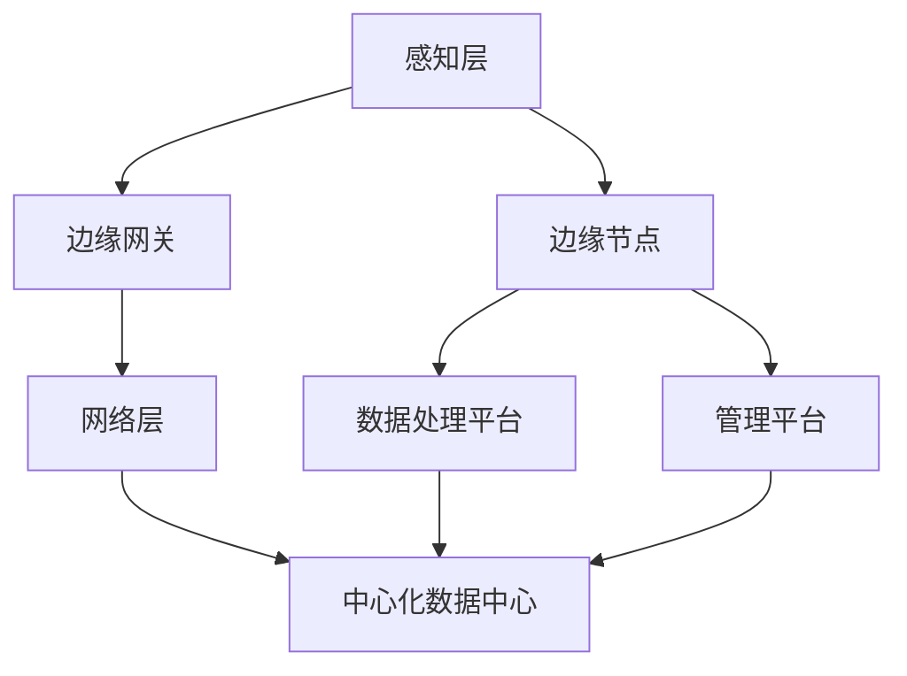

                 

### 第1章：边缘计算与自动驾驶决策概述

#### 1.1 问题背景

**边缘计算**和**自动驾驶决策**是现代技术领域的两个重要概念，它们各自在促进信息化社会的发展中扮演着关键角色。边缘计算通过将计算任务从中心化的数据中心转移到网络的边缘节点，实现了数据处理的实时性和高效性。而自动驾驶决策则是指通过先进的传感器技术和算法，使自动驾驶汽车能够自主感知环境、做出决策并控制车辆运行。

在自动驾驶领域中，实时性是决策的核心要求。车辆需要在极短的时间内处理大量的传感器数据，并作出安全的驾驶决策。传统的中心化云计算架构由于网络延迟和数据传输的限制，无法满足自动驾驶的实时性需求。边缘计算通过在车辆附近的边缘节点上进行数据预处理和决策计算，显著降低了网络延迟，提升了决策的实时性。

#### 1.1.2 边缘计算的兴起

边缘计算起源于对物联网（IoT）和移动计算需求的响应。随着物联网设备和移动设备的激增，产生了大量的数据，这些数据需要快速且安全地处理。中心化的云计算架构在处理这些海量数据时显得力不从心，因为数据传输和处理的时间过长，影响了用户体验。

边缘计算通过将计算任务推向网络的边缘，即在接近数据源的地方进行数据处理，从而降低了数据传输的距离和时间，提高了系统的响应速度和处理效率。边缘计算不仅在处理速度上具有优势，还能减轻中心化数据中心的负担，提高整体系统的可靠性和可扩展性。

#### 1.1.3 自动驾驶决策的重要性

自动驾驶技术是现代交通领域的重要创新，它有望解决交通拥堵、减少交通事故、提高交通效率等问题。自动驾驶决策系统是自动驾驶汽车的核心，它需要实时、准确地处理来自多种传感器（如雷达、激光雷达、摄像头等）的数据，并在复杂多变的交通环境中做出安全、合理的驾驶决策。

自动驾驶决策的重要性体现在以下几个方面：

1. **安全性**：自动驾驶决策系统必须能够识别和应对复杂的交通环境，确保车辆行驶的安全。
2. **实时性**：自动驾驶决策需要在极短的时间内处理大量数据，并生成相应的驾驶决策。
3. **可靠性**：决策系统必须具有高度的可靠性，以避免因决策失误导致的事故。
4. **适应性**：自动驾驶决策系统需要适应不同的交通状况和场景，具备灵活的决策能力。

#### 1.1.4 边缘计算在自动驾驶决策中的潜力

边缘计算在自动驾驶决策中具有巨大的潜力，其优势主要体现在以下几个方面：

1. **降低延迟**：通过在边缘节点上处理数据，减少了数据传输的时间，提高了决策的实时性。
2. **提高效率**：边缘计算能够更高效地利用计算资源，减少中心化数据中心的负担。
3. **增强隐私**：边缘计算可以在本地处理数据，降低了数据泄露的风险。
4. **提升鲁棒性**：边缘计算能够更好地应对网络不稳定或中断的情况，保证系统运行的安全性和稳定性。

然而，边缘计算在自动驾驶决策中也面临一些挑战，如数据传输安全性、计算资源限制、边缘节点的不确定性等。如何有效地解决这些问题，将决定边缘计算在自动驾驶决策中的实际应用效果。

#### 1.2 问题描述

**边缘计算在自动驾驶决策中面临的问题**主要可以归纳为以下几个方面：

1. **实时性需求**：自动驾驶决策需要在极短的时间内完成，边缘计算必须能够满足这一需求。
2. **数据处理能力**：边缘计算节点需要具备强大的数据处理能力，以便处理来自各种传感器的海量数据。
3. **数据传输安全性**：边缘计算需要确保数据在传输过程中的安全性，防止数据泄露或被篡改。
4. **计算资源限制**：边缘计算节点的计算资源有限，需要在有限的资源下实现高效的决策计算。

**解决边缘计算在自动驾驶决策中实时应用的需求**，需要从以下几个方面进行：

1. **优化算法**：通过优化自动驾驶决策算法，提高决策计算的效率。
2. **改进架构**：设计更加高效、可靠的边缘计算架构，确保数据处理的实时性。
3. **增强安全性**：采用先进的安全技术，确保数据传输和处理的安全性。
4. **资源管理**：通过有效的资源管理，充分利用边缘计算节点的计算资源。

#### 1.2.3 边缘计算与自动驾驶决策结合的边界与外延

边缘计算与自动驾驶决策的结合，主要在以下几个方面展开：

1. **数据处理层面**：边缘计算可以在本地处理传感器数据，为自动驾驶决策系统提供实时、准确的数据支持。
2. **决策支持层面**：边缘计算可以协助自动驾驶决策系统进行环境感知、路径规划和驾驶决策。
3. **协同控制层面**：边缘计算可以实现自动驾驶车辆之间的协同控制，提高整个车队的运行效率和安全性。

边缘计算的边界与外延包括以下几个方面：

1. **地理位置**：边缘计算通常部署在接近数据源的位置，如路边、停车场等。
2. **计算能力**：边缘计算节点的计算能力相对有限，但足够支持自动驾驶决策的实时计算需求。
3. **网络连接**：边缘计算节点需要具备良好的网络连接能力，以确保数据传输的实时性和可靠性。
4. **安全性**：边缘计算需要确保数据的安全性和隐私保护，以应对可能的安全威胁。

#### 1.3 概念结构与核心要素组成

边缘计算与自动驾驶决策的融合，涉及多个概念和核心要素的相互作用。以下是对这些概念与核心要素的组成与联系进行分析：

1. **边缘计算概念与核心要素**
   - **概念**：边缘计算是一种分布式计算模式，将计算任务从中心化服务器转移到网络边缘。
   - **核心要素**：包括边缘节点、数据处理、数据传输、资源管理、安全性等。

2. **自动驾驶决策概念与核心要素**
   - **概念**：自动驾驶决策是指通过传感器技术和算法，使自动驾驶汽车能够自主感知环境、做出决策并控制车辆运行。
   - **核心要素**：包括传感器数据采集、数据处理、决策算法、控制系统等。

3. **边缘计算与自动驾驶决策结合的机制**
   - **数据处理**：边缘计算可以在本地处理传感器数据，为自动驾驶决策提供实时数据支持。
   - **协同决策**：边缘计算可以协助自动驾驶决策系统进行路径规划和驾驶决策。
   - **分布式控制**：边缘计算可以实现自动驾驶车辆之间的协同控制，提高车队运行效率和安全性。

通过对这些概念和核心要素的分析，我们可以更好地理解边缘计算在自动驾驶决策中的具体应用，并为实现这一结合提供理论基础和实践指导。

## 第2章：边缘计算技术原理与架构

### 2.1 边缘计算技术原理

**边缘计算**是一种分布式计算模式，旨在将计算任务从中心化的数据中心转移到网络的边缘，以实现数据处理的实时性和高效性。边缘计算的核心概念是通过在网络的边缘部署计算资源，来处理和响应本地数据，从而减少数据传输的时间和网络负载。

#### 2.1.1 边缘计算的核心概念

边缘计算的核心概念可以概括为以下几点：

1. **数据本地化处理**：边缘计算将数据处理任务从中心化的数据中心转移到网络的边缘，即在接近数据源的地方进行处理，以减少数据传输的时间。
2. **实时响应**：边缘计算能够实现实时数据处理和响应，这对于需要快速决策的应用场景（如自动驾驶）尤为重要。
3. **资源整合**：边缘计算通过整合分散的边缘节点资源，形成分布式计算网络，提高了系统的整体性能和可靠性。
4. **灵活性和可扩展性**：边缘计算可以根据需求灵活地部署和扩展，以适应不同规模和类型的计算任务。

#### 2.1.2 边缘计算的优势与挑战

边缘计算具有以下优势：

1. **降低延迟**：由于数据处理任务在本地完成，边缘计算显著降低了数据传输的延迟，提高了系统的响应速度。
2. **提高效率**：边缘计算能够更高效地利用计算资源，减轻中心化数据中心的负担，提高整体系统的效率。
3. **增强隐私**：边缘计算可以在本地处理数据，减少了数据泄露的风险，提高了数据的安全性。
4. **提升鲁棒性**：边缘计算能够更好地应对网络不稳定或中断的情况，提高了系统的可靠性和稳定性。

然而，边缘计算也面临一些挑战：

1. **计算资源限制**：边缘计算节点的计算资源相对有限，需要在有限的资源下实现高效的决策计算。
2. **数据传输安全性**：边缘计算需要确保数据在传输过程中的安全性，防止数据泄露或被篡改。
3. **边缘节点的不确定性**：边缘节点的硬件和软件环境可能较为复杂，增加了系统维护的难度。

#### 2.1.3 边缘计算的关键技术

边缘计算的关键技术包括以下几个方面：

1. **边缘节点**：边缘节点是边缘计算的基础设施，通常包括计算设备、存储设备和网络接口等。边缘节点的选择和部署方式对于系统的性能和效率至关重要。
2. **数据处理**：边缘计算需要对传感器数据进行实时处理，包括数据清洗、去噪、特征提取等。高效的数据处理算法是边缘计算的核心技术之一。
3. **数据传输**：边缘计算需要确保数据在边缘节点和中心化数据中心之间的安全传输。常用的技术包括数据加密、压缩和传输优化等。
4. **资源管理**：边缘计算需要对计算资源进行高效管理，包括任务调度、负载均衡和资源分配等。有效的资源管理可以提高系统的性能和可靠性。
5. **安全性**：边缘计算需要采取一系列安全措施，包括数据加密、访问控制、入侵检测等，以确保系统的安全和数据隐私。

### 2.2 边缘计算架构设计

边缘计算架构的设计对于系统的性能、可靠性和可扩展性至关重要。一个典型的边缘计算架构包括以下几个层次：

#### 2.2.1 边缘计算架构的层次结构

1. **感知层**：包括各种传感器和采集设备，如摄像头、雷达、激光雷达等，用于收集环境数据。
2. **边缘层**：包括边缘节点和边缘网关，用于处理和存储感知层收集的数据，并进行初步的数据分析和决策。
3. **网络层**：包括边缘网络和中心化网络，用于连接边缘节点和中心化数据中心，实现数据的传输和同步。
4. **中心层**：包括中心化数据中心，用于进行高级的数据分析和处理，以及提供集中式服务。

#### 2.2.2 边缘计算架构的关键组成部分

1. **边缘节点**：边缘节点是边缘计算的核心组成部分，通常包括CPU、GPU、存储和网络接口等硬件设备。边缘节点可以独立运行应用程序，处理本地数据，并与其他节点进行通信。
2. **边缘网关**：边缘网关是边缘节点和中心化网络之间的桥梁，负责数据传输、安全控制、协议转换等任务。边缘网关通常具备较高的处理能力和网络带宽，以确保数据的高效传输。
3. **数据处理平台**：数据处理平台是边缘计算的核心软件，用于处理和存储感知层收集的数据。数据处理平台通常包括数据清洗、去噪、特征提取、机器学习等模块，以实现高效的数据分析。
4. **管理平台**：管理平台用于管理和监控边缘计算架构的运行状态，包括节点管理、资源管理、任务调度等。管理平台可以通过Web界面或API接口进行操作，提高了系统的可管理性和可扩展性。

#### 2.2.3 边缘计算架构的优势与局限

边缘计算架构具有以下优势：

1. **实时性**：通过在边缘节点上进行数据处理，边缘计算架构能够显著降低数据传输的延迟，提高系统的响应速度。
2. **高效性**：边缘计算架构能够更高效地利用计算资源，减轻中心化数据中心的负担，提高整体系统的效率。
3. **灵活性**：边缘计算架构可以根据需求灵活地部署和扩展，以适应不同规模和类型的计算任务。
4. **安全性**：边缘计算架构可以在本地处理数据，减少了数据泄露的风险，提高了数据的安全性。

然而，边缘计算架构也面临一些局限：

1. **计算资源限制**：边缘节点的计算资源相对有限，需要在有限的资源下实现高效的决策计算。
2. **网络可靠性**：边缘节点和中心化数据中心之间的网络连接可能不稳定，会影响数据传输的可靠性。
3. **安全性**：边缘计算架构需要采取一系列安全措施，以确保系统的安全和数据隐私，这可能增加了系统的复杂性和维护成本。

通过合理设计和优化边缘计算架构，可以充分发挥其优势，克服其局限，实现高效的边缘计算应用。

### 2.3 边缘计算的优势与局限

边缘计算在自动驾驶决策中的应用具有显著的优势，但也面临一些挑战。

**优势**：

1. **实时性提升**：边缘计算通过在本地处理数据，减少了数据传输的延迟，使得自动驾驶车辆能够更快地响应环境变化，提高了系统的实时性和决策效率。
2. **数据处理能力增强**：边缘计算节点通常配备有强大的计算资源和处理能力，能够高效地处理来自多种传感器的海量数据，提高了自动驾驶决策的准确性和可靠性。
3. **隐私保护**：边缘计算在本地处理数据，减少了数据传输过程中的泄露风险，增强了系统的隐私保护能力，对于需要高度保密的自动驾驶应用尤为重要。
4. **系统可靠性提高**：边缘计算架构可以更好地应对网络不稳定或中断的情况，提高了系统的鲁棒性和稳定性，确保了自动驾驶车辆在复杂环境下的安全运行。

**局限**：

1. **计算资源限制**：边缘计算节点的计算资源相对有限，特别是在面对高负载和复杂计算任务时，可能会出现资源不足的问题，影响系统的性能和效率。
2. **数据传输安全性**：虽然边缘计算在本地处理数据，但数据在传输过程中仍然面临被泄露或篡改的风险，需要采取有效的安全措施来保护数据安全。
3. **边缘节点的不确定性**：边缘节点的硬件和软件环境可能较为复杂，设备管理和维护难度较大，可能会影响系统的稳定性和可靠性。
4. **边缘计算架构的复杂性**：设计和管理一个高效、可靠的边缘计算架构需要考虑多个因素，如节点部署、数据处理、资源管理等，增加了系统的复杂性和维护成本。

总之，边缘计算在自动驾驶决策中具有显著的优势，但同时也需要克服一些挑战。通过合理规划和优化，边缘计算可以发挥其在自动驾驶领域的潜力，推动自动驾驶技术的进一步发展。

### 2.4 边缘计算技术原理与架构的Mermaid流程图

为了更好地理解边缘计算的技术原理和架构设计，我们可以使用Mermaid绘制一个流程图，展示边缘计算的核心环节和数据处理流程。

首先，定义感知层、边缘层、网络层和中心层的基本组件和它们之间的交互关系：



接下来，我们详细描述每个层次的功能和核心技术：

1. **感知层**：包括传感器设备，如摄像头、雷达和激光雷达等，用于收集环境数据。
2. **边缘节点**：负责处理感知层收集的数据，进行初步的数据清洗和预处理。
3. **边缘网关**：作为边缘节点和中心化数据中心之间的桥梁，负责数据传输和同步。
4. **数据处理平台**：包括数据清洗、去噪、特征提取和机器学习等模块，用于高级的数据分析和处理。
5. **管理平台**：用于管理和监控边缘计算架构的运行状态，包括节点管理、资源管理和任务调度等。

此外，我们还可以通过添加注释来进一步说明每个组件的具体作用：

```mermaid
graph TD
    A[感知层] --> B[边缘节点]
    A --> C[边缘网关]
    B --> D[数据处理平台]((数据清洗|去噪|特征提取|机器学习))
    B --> E[管理平台]((节点管理|资源管理|任务调度))
    C --> F[网络层]
    F --> G[中心化数据中心]
    D --> G
    E --> G
    subgraph 边缘层
        B
        C
    end
    subgraph 网络层
        F
    end
    subgraph 中心层
        G
    end
```

通过这个流程图，我们可以清晰地看到边缘计算技术的各个环节和数据处理流程，有助于深入理解边缘计算在自动驾驶决策中的应用。

### 2.5 边缘计算技术原理与架构的ER实体关系图

为了更直观地展示边缘计算技术原理与架构中的实体及其关系，我们可以使用Mermaid绘制一个ER（Entity-Relationship）实体关系图。以下是边缘计算架构中的主要实体及其关系的示例：

```mermaid
erDiagram
   EDGE_NODE ||--|{ SENSOR } Sensor
   EDGE_NODE ||--|{ DATA_PROCESSING_UNIT } DataProcessingUnit
   EDGE_NODE ||--|{ NETWORK_INTERFACE } NetworkInterface
   EDGE_NODE ||--|{ CONTROL_UNIT } ControlUnit
   EDGE_NODE ||--|{ STORAGE_UNIT } StorageUnit
    
   EDGE_GATEWAY ||--|{ DATA_TRANSFERENCE_UNIT } DataTransferenceUnit
   EDGE_GATEWAY ||--|{ SECURITY_UNIT } SecurityUnit
    
   PROCESSING_PLATFORM ||--|{ MACHINE_LEARNING_MODULE } MachineLearningModule
   PROCESSING_PLATFORM ||--|{ FEATURE_EXTRACTION_MODULE } FeatureExtractionModule
    
   MANAGEMENT_PLATFORM ||--|{ NODE_MANAGEMENT } NodeManagement
   MANAGEMENT_PLATFORM ||--|{ RESOURCE_MANAGEMENT } ResourceManagement
   MANAGEMENT_PLATFORM ||--|{ TASK_SCHEDULING } TaskScheduling
    
   CENTER_DATA_CENTER ||--|{ DATABASE } Database
   CENTER_DATA_CENTER ||--|{ BIG_DATA_ANALYSIS } BigDataAnalysis
    
   SENSOR -----------------||{ CAMERA } Camera
   SENSOR -----------------||{ RADAR } Radar
   SENSOR -----------------||{ LASER_RANGEFINDER } LaserRangefinder
    
   EDGE_NODE -----------------|| { EDGE_NODE_1 } EdgeNode1
   EDGE_NODE -----------------|| { EDGE_NODE_2 } EdgeNode2
   EDGE_GATEWAY -----------------|| { EDGE_GATEWAY_1 } EdgeGateway1
   PROCESSING_PLATFORM -----------------|| { PROCESSING_PLATFORM_1 } ProcessingPlatform1
   MANAGEMENT_PLATFORM -----------------|| { MANAGEMENT_PLATFORM_1 } ManagementPlatform1
   CENTER_DATA_CENTER -----------------|| { CENTER_DATA_CENTER_1 } CenterDataCenter1
```

在这个ER图中，我们定义了以下几个主要实体：

1. **边缘节点（EDGE_NODE）**：包括传感器（SENSOR）、数据处理单元（DATA_PROCESSING_UNIT）、网络接口（NETWORK_INTERFACE）、控制单元（CONTROL_UNIT）和存储单元（STORAGE_UNIT）。
2. **边缘网关（EDGE_GATEWAY）**：包括数据传输单元（DATA_TRANSFERENCE_UNIT）和安全单元（SECURITY_UNIT）。
3. **数据处理平台（PROCESSING_PLATFORM）**：包括机器学习模块（MACHINE_LEARNING_MODULE）和特征提取模块（FEATURE_EXTRACTION_MODULE）。
4. **管理平台（MANAGEMENT_PLATFORM）**：包括节点管理（NODE_MANAGEMENT）、资源管理（RESOURCE_MANAGEMENT）和任务调度（TASK_SCHEDULING）。
5. **中心数据中心（CENTER_DATA_CENTER）**：包括数据库（DATABASE）和大数据分析（BIG_DATA_ANALYSIS）。

通过这个ER图，我们可以清晰地了解边缘计算架构中的各个实体及其关系，有助于深入理解边缘计算的实现原理和架构设计。

### 3.1 自动驾驶决策算法概述

**自动驾驶决策算法**是自动驾驶系统的核心组成部分，它通过处理来自传感器的大量数据，实现对车辆行驶环境的感知、分析和决策。自动驾驶决策算法的目的是确保车辆在复杂多变的交通环境中能够安全、高效地行驶。

#### 3.1.1 自动驾驶决策算法的定义

自动驾驶决策算法是指利用计算机科学、人工智能和机器学习等领域的理论和方法，对自动驾驶车辆的环境进行感知、理解和决策的一套算法体系。这些算法能够通过分析传感器数据，识别道路状况、行人、车辆等信息，并在此基础上生成驾驶指令，控制车辆的加速、减速和转向等操作。

#### 3.1.2 自动驾驶决策算法的分类

自动驾驶决策算法可以按照不同的标准进行分类，常见的分类方法包括：

1. **按照功能层次分类**：
   - **感知层算法**：主要处理传感器数据的采集、预处理和特征提取，为后续的决策提供基础数据。
   - **决策层算法**：根据感知层提供的信息，进行路径规划、行为预测和控制策略的制定。
   - **执行层算法**：将决策层的决策转化为具体的驾驶动作，如加速、减速和转向等。

2. **按照算法类型分类**：
   - **基于规则的算法**：通过预设的规则和条件，对环境进行判断并生成驾驶指令。这种方法简单直观，但难以应对复杂和动态的环境。
   - **基于模型的算法**：通过建立环境模型，利用模型对环境进行预测和决策。这种方法更为复杂，但可以处理更加复杂和动态的环境。

3. **按照应用场景分类**：
   - **城市道路自动驾驶算法**：主要应用于城市道路环境，处理行人、车辆和交通信号等复杂因素。
   - **高速公路自动驾驶算法**：主要应用于高速公路环境，处理车道线、车速和交通标志等相对简单的情况。

#### 3.1.3 自动驾驶决策算法的关键要素

自动驾驶决策算法的关键要素包括以下几个方面：

1. **传感器数据采集**：自动驾驶车辆配备有多种传感器，如摄像头、激光雷达、雷达等，用于采集环境数据。传感器数据的准确性和实时性对算法的性能至关重要。

2. **数据处理与特征提取**：传感器数据通常包含大量噪声和不相关信息，需要进行预处理和特征提取，提取出对决策有用的信息。

3. **路径规划与行为预测**：路径规划和行为预测是自动驾驶决策算法的核心，通过分析传感器数据和环境信息，生成车辆的行驶路径和行驶行为。

4. **决策制定**：根据路径规划和行为预测的结果，结合车辆的当前状态和行驶环境，制定出最优的驾驶策略。

5. **执行控制**：将决策结果转化为具体的驾驶动作，如加速、减速和转向等，实现对车辆的实时控制。

通过上述关键要素的有效结合，自动驾驶决策算法能够在复杂的交通环境中确保车辆的安全、高效行驶。

### 3.2 常见自动驾驶决策算法分析

在自动驾驶决策系统中，有多种常见的算法被广泛应用，每种算法都有其独特的优势和局限性。以下是几种主要的自动驾驶决策算法及其分析：

#### 3.2.1 规划算法

**规划算法**是一种基于路径规划的决策算法，主要目标是在给定的起点和终点之间找到一条最优路径。常见的规划算法包括：

1. **Dijkstra算法**：Dijkstra算法是一种经典的图算法，用于在图中寻找最短路径。该算法适用于静态环境，但在动态环境中效果不佳。

2. **A*算法**：A*算法是一种改进的Dijkstra算法，它利用估价函数来优化路径搜索。A*算法在静态和动态环境中都有较好的表现，但计算复杂度较高。

3. **RRT（快速随机树）算法**：RRT算法通过在随机生成的树结构中寻找可行路径，适用于动态环境中的路径规划。RRT算法的计算复杂度相对较低，但可能会生成较长的路径。

**优势**：
- **简单直观**：规划算法通常较为简单，易于实现和理解。
- **路径优化**：能够找到最优或近优的路径。

**局限**：
- **实时性**：计算复杂度高，难以满足实时性要求。
- **动态环境适应性**：在动态环境中，规划算法可能无法及时响应环境变化。

#### 3.2.2 控制算法

**控制算法**用于实现自动驾驶车辆的运动控制，主要包括以下几种：

1. **PID（比例-积分-微分）控制**：PID控制是一种经典的控制算法，通过调整比例、积分和微分三个参数，实现系统输出对输入的精确控制。PID控制适用于线性系统，但在非线性系统中性能有限。

2. **模型预测控制（MPC）**：MPC控制基于系统模型，通过预测系统未来的行为并优化控制输入，实现对系统的精确控制。MPC适用于复杂的非线性系统，但计算复杂度较高。

3. **自适应控制**：自适应控制能够根据系统的变化自动调整控制参数，提高系统的鲁棒性和适应性。

**优势**：
- **精确控制**：能够实现对车辆运动的高精度控制。
- **适应性强**：通过自适应调整，能够适应不同的行驶环境和工况。

**局限**：
- **计算复杂度**：部分算法（如MPC）计算复杂度较高，对硬件要求较高。
- **实时性**：在某些情况下，实时性可能无法得到保障。

#### 3.2.3 传感器数据处理算法

**传感器数据处理算法**用于处理自动驾驶车辆的各种传感器数据，包括摄像头、激光雷达、雷达等。以下是几种常见的传感器数据处理算法：

1. **特征提取**：通过提取图像或点云的特征，如边缘、角点、深度信息等，为后续的决策提供基础数据。常见的特征提取算法包括SIFT、SURF等。

2. **目标检测**：利用深度学习等技术，对传感器数据进行目标检测，识别道路、行人、车辆等。常见的目标检测算法包括YOLO、SSD、Faster R-CNN等。

3. **语义分割**：对传感器数据进行语义分割，将环境分割为不同的区域，如车道线、行人区域等。常见的语义分割算法包括FCN、U-Net等。

**优势**：
- **准确性**：通过先进的算法，能够提高传感器数据的处理精度。
- **实时性**：部分算法（如YOLO）能够实现实时目标检测。

**局限**：
- **计算资源**：深度学习算法通常计算资源需求较高。
- **泛化能力**：算法在复杂和动态环境中的泛化能力可能有限。

通过分析这些常见的自动驾驶决策算法，我们可以根据具体应用场景和需求选择合适的算法，以提高自动驾驶系统的性能和安全性。

### 3.3 规划算法详解

**规划算法**是自动驾驶决策算法中的重要组成部分，主要负责在给定的起点和终点之间找到一条最优路径。以下是对几种常见的规划算法的详细讲解：

#### 3.3.1 Dijkstra算法

**Dijkstra算法**是一种经典的图算法，用于在加权图中寻找最短路径。该算法的基本思想是从起点开始，逐步扩展到未访问过的节点，直到找到目标节点。

**算法原理**：
1. 初始化：设置起点到所有其他节点的距离为无穷大，只有起点到自身的距离为0。
2. 选择未访问节点中距离起点最近的节点作为当前节点。
3. 从当前节点出发，更新其相邻节点的距离。如果找到更短的路径，则更新距离。
4. 重复步骤2和3，直到找到目标节点。

**算法步骤**：
1. 创建一个优先队列，用于存储未访问节点及其到起点的距离。
2. 将起点添加到优先队列中，并将距离设为0。
3. 当优先队列为空时，重复以下步骤：
   - 取出优先队列中的最小距离节点作为当前节点。
   - 遍历当前节点的所有邻居节点，更新它们的距离。
   - 如果邻居节点的距离更新，将其加入优先队列。

**算法优缺点**：
- **优势**：算法简单，易于实现，适用于静态环境。
- **局限**：计算复杂度较高，难以满足实时性要求。

#### 3.3.2 A*算法

**A*算法**是对Dijkstra算法的改进，通过引入估价函数（heuristic function）来优化路径搜索。A*算法的目标是找到从起点到目标节点的最短路径，同时考虑路径的实际长度和估价函数的值。

**算法原理**：
1. 初始化：设置起点到所有其他节点的估计距离为无穷大，只有起点到自身的距离为0。
2. 选择未访问节点中F值（G值+H值）最小的节点作为当前节点，其中G值是从起点到当前节点的实际距离，H值是从当前节点到目标节点的估计距离。
3. 从当前节点出发，更新其相邻节点的距离。如果找到更短的路径，则更新距离。
4. 重复步骤2和3，直到找到目标节点。

**算法步骤**：
1. 创建一个优先队列，用于存储未访问节点及其F值。
2. 将起点添加到优先队列中，并将F值设为0。
3. 当优先队列为空时，重复以下步骤：
   - 取出优先队列中的最小F值节点作为当前节点。
   - 遍历当前节点的所有邻居节点，更新它们的F值。
   - 如果邻居节点的F值更新，将其加入优先队列。

**算法优缺点**：
- **优势**：能够找到最优或近优的路径，适用于静态和动态环境。
- **局限**：计算复杂度较高，但在实际应用中通过优化可以实现较好的实时性。

#### 3.3.3 RRT算法

**RRT（快速随机树）算法**是一种基于采样的路径规划算法，通过在随机生成的树结构中寻找可行路径。RRT算法适用于动态环境，能够在复杂环境中快速找到一条可行的路径。

**算法原理**：
1. 初始化：创建一棵树，包含起点节点。
2. 采样：在当前树结构中随机生成一个新节点。
3. 连接：将新节点与树中的某个节点连接，生成新的子树。
4. 调整：如果新节点使树的结构更加平衡，则保留新节点；否则，将其替换为更优的节点。

**算法步骤**：
1. 创建一棵树，包含起点节点。
2. 当目标节点不在树中时，重复以下步骤：
   - 随机生成一个新节点。
   - 将新节点与树中的某个节点连接，生成新的子树。
   - 如果新节点使树的结构更加平衡，则保留新节点；否则，将其替换为更优的节点。
3. 当目标节点在树中时，输出从起点到目标节点的路径。

**算法优缺点**：
- **优势**：适用于动态环境，能够在复杂场景中快速找到一条可行的路径。
- **局限**：可能会生成较长的路径，计算复杂度相对较高。

通过以上对Dijkstra算法、A*算法和RRT算法的详细讲解，我们可以更好地理解这些规划算法的基本原理、步骤和优缺点，为自动驾驶决策系统的设计提供理论基础和实践指导。

### 3.4 控制算法详解

**控制算法**在自动驾驶决策系统中扮演着关键角色，它负责根据自动驾驶决策算法生成的路径规划，实现车辆的精确控制。以下是对几种常见的控制算法的详细讲解：

#### 3.4.1 PID控制

**PID（比例-积分-微分）控制**是一种经典的控制算法，广泛应用于自动驾驶车辆的加速、减速和转向控制中。PID控制通过调整比例（P）、积分（I）和微分（D）三个参数，实现对系统输出与期望值之间的误差进行精确控制。

**算法原理**：
- **比例控制（P）**：根据当前误差值调整控制输出，误差值越大，控制输出越大。
- **积分控制（I）**：对误差值进行累积，以消除稳态误差。
- **微分控制（D）**：根据误差值的改变率调整控制输出，用于预测未来误差的变化趋势。

**算法步骤**：
1. 初始化PID参数（Kp、Ki、Kd）。
2. 计算当前误差值（当前值 - 目标值）。
3. 计算比例控制部分：Kp × 当前误差。
4. 计算积分控制部分：Ki × ∫（当前误差值）。
5. 计算微分控制部分：Kd × (当前误差 - 前一误差)。
6. 将三个部分相加，得到控制输出值。
7. 根据控制输出值调整车辆的加速、减速和转向操作。

**算法优缺点**：
- **优势**：简单易实现，适用于线性系统，调节参数后可以实现较好的控制效果。
- **局限**：在非线性系统中性能有限，需要不断调整参数以适应不同的控制需求。

#### 3.4.2 模型预测控制（MPC）

**模型预测控制（MPC）**是一种基于系统模型的先进控制算法，通过预测系统未来的行为并优化控制输入，实现对系统的高精度控制。MPC适用于复杂的非线性系统，能够在有限的计算资源下实现精确的轨迹跟踪和稳定性控制。

**算法原理**：
1. **系统建模**：建立自动驾驶车辆的数学模型，包括车辆的动力学方程和约束条件。
2. **预测**：根据当前状态和系统模型，预测未来若干时间步的系统行为。
3. **优化**：在预测的基础上，通过优化算法（如线性规划、非线性规划等）求解最优控制输入。
4. **反馈**：将优化结果反馈至实际系统，调整车辆的操作。

**算法步骤**：
1. 建立自动驾驶车辆的数学模型。
2. 设定预测时间段（通常为几秒至几十秒）。
3. 按照预测时间段，递归计算未来状态，并设置约束条件（如速度、加速度限制等）。
4. 使用优化算法求解最优控制输入。
5. 将最优控制输入应用于车辆，实现精确控制。

**算法优缺点**：
- **优势**：能够处理复杂的非线性系统，实现高精度的轨迹跟踪和稳定性控制。
- **局限**：计算复杂度较高，对硬件和算法实现要求较高，实时性可能无法得到保障。

#### 3.4.3 自适应控制

**自适应控制**是一种动态调整控制参数的控制算法，通过不断学习系统的行为和特性，自动调整控制策略，以适应系统的变化。自适应控制适用于动态环境，能够提高系统的鲁棒性和适应性。

**算法原理**：
1. **学习**：通过传感器数据和系统反馈，学习系统的动态特性和行为。
2. **调整**：根据学习结果，自动调整控制参数，以优化控制效果。
3. **反馈**：将调整后的控制参数应用于实际系统，进行实时控制。

**算法步骤**：
1. 初始化控制参数。
2. 收集系统状态和反馈数据。
3. 使用机器学习算法（如神经网络、支持向量机等）学习系统的动态特性。
4. 根据学习结果，动态调整控制参数。
5. 将调整后的控制参数应用于系统，实现实时控制。

**算法优缺点**：
- **优势**：能够自适应地调整控制策略，提高系统的鲁棒性和适应性。
- **局限**：计算复杂度较高，对数据质量和算法实现要求较高。

通过以上对PID控制、模型预测控制（MPC）和自适应控制的详细讲解，我们可以更好地理解这些控制算法的基本原理、步骤和优缺点，为自动驾驶决策系统的设计提供理论基础和实践指导。

### 3.5 传感器数据处理算法详解

在自动驾驶决策系统中，传感器数据处理算法起着至关重要的作用。以下是对几种常见传感器数据处理算法的详细讲解：

#### 3.5.1 特征提取算法

**特征提取算法**用于从原始传感器数据中提取对决策有用的信息，如边缘、角点、深度信息等。常见的特征提取算法包括SIFT（尺度不变特征变换）和SURF（加速稳健特征）。

**SIFT算法**：
- **算法原理**：SIFT算法通过关键点的检测和描述，从图像中提取不变特征点。其核心步骤包括：
  1. **尺度空间构建**：在不同尺度上构建多级高斯图像，用于检测局部极值点。
  2. **关键点检测**：通过比较相邻高斯图像上的极值点，检测出图像中的关键点。
  3. **关键点定位**：对关键点进行细化，确保其在不同尺度上的一致性。
  4. **特征描述**：为每个关键点生成一组描述子，用于描述关键点的局部特征。
- **算法优缺点**：
  - **优势**：具有高度的尺度和旋转不变性，适用于各种复杂场景。
  - **局限**：计算复杂度较高，对计算资源要求较大。

**SURF算法**：
- **算法原理**：SURF算法通过计算图像的快速响应函数，提取图像中的关键点。其核心步骤包括：
  1. **盒子滤波器构建**：使用盒子滤波器对图像进行卷积，生成图像的响应函数。
  2. **关键点检测**：通过比较响应函数的局部极大值，检测出图像中的关键点。
  3. **特征描述**：为每个关键点生成一组描述子，用于描述关键点的局部特征。
- **算法优缺点**：
  - **优势**：计算复杂度较低，速度较快，适用于实时应用。
  - **局限**：对光照变化敏感，需要额外的光照补偿算法。

#### 3.5.2 目标检测算法

**目标检测算法**用于从传感器数据中识别和定位特定目标，如道路、行人、车辆等。常见的目标检测算法包括YOLO（You Only Look Once）、SSD（Single Shot MultiBox Detector）和Faster R-CNN（Region-based Convolutional Neural Network）。

**YOLO算法**：
- **算法原理**：YOLO算法将目标检测任务转化为一个回归问题，通过一个卷积神经网络同时预测边界框和类别概率。其核心步骤包括：
  1. **特征提取**：使用卷积神经网络提取图像特征。
  2. **边界框预测**：预测每个网格单元中的边界框和类别概率。
  3. **非极大值抑制（NMS）**：对预测结果进行筛选，去除重叠的边界框。
- **算法优缺点**：
  - **优势**：实时性较高，适用于高速场景。
  - **局限**：对复杂场景和遮挡情况的表现较差。

**SSD算法**：
- **算法原理**：SSD算法通过在不同尺度上共享卷积特征图，同时预测多个尺度上的边界框和类别概率。其核心步骤包括：
  1. **特征提取**：使用卷积神经网络提取图像特征。
  2. **边界框预测**：在不同尺度上预测边界框和类别概率。
  3. **非极大值抑制（NMS）**：对预测结果进行筛选，去除重叠的边界框。
- **算法优缺点**：
  - **优势**：能够在不同尺度上检测目标，适用于复杂场景。
  - **局限**：计算复杂度较高，实时性相对较差。

**Faster R-CNN算法**：
- **算法原理**：Faster R-CNN算法通过两个神经网络实现目标检测，首先使用区域建议网络（RPN）生成候选边界框，然后使用分类网络对候选边界框进行分类。其核心步骤包括：
  1. **特征提取**：使用卷积神经网络提取图像特征。
  2. **区域建议**：使用RPN生成候选边界框。
  3. **分类**：对候选边界框进行分类。
- **算法优缺点**：
  - **优势**：检测精度高，适用于复杂场景。
  - **局限**：计算复杂度较高，实时性较差。

#### 3.5.3 语义分割算法

**语义分割算法**用于将传感器数据中的每个像素分类为不同的语义类别，如车道线、行人、车辆等。常见的语义分割算法包括FCN（全卷积网络）和U-Net。

**FCN算法**：
- **算法原理**：FCN算法通过将卷积神经网络输出从类别预测转换为像素级的分类。其核心步骤包括：
  1. **特征提取**：使用卷积神经网络提取图像特征。
  2. **像素分类**：将特征图通过反卷积操作，生成像素级的分类结果。
- **算法优缺点**：
  - **优势**：能够实现像素级的精确分割。
  - **局限**：计算复杂度较高，实时性较差。

**U-Net算法**：
- **算法原理**：U-Net算法通过设计一个具有对称结构的卷积神经网络，实现高效的语义分割。其核心步骤包括：
  1. **特征提取**：使用卷积神经网络提取图像特征。
  2. **上采样与下采样**：通过上采样和下采样操作，实现特征图在空间上的精确匹配。
  3. **融合与分类**：将特征图进行融合，生成像素级的分类结果。
- **算法优缺点**：
  - **优势**：结构简单，计算效率高，适用于实时应用。
  - **局限**：在复杂场景中分割精度相对较低。

通过以上对特征提取、目标检测和语义分割算法的详细讲解，我们可以更好地理解这些算法的基本原理、步骤和优缺点，为自动驾驶决策系统的设计提供理论基础和实践指导。

### 4.1 边缘计算在自动驾驶决策中的实时性需求

边缘计算在自动驾驶决策中的应用，对实时性有着极高的要求。自动驾驶车辆需要在极短的时间内处理来自各种传感器的数据，并做出安全、合理的驾驶决策。边缘计算通过在网络的边缘节点上进行数据预处理和决策计算，显著降低了数据传输的延迟，满足了自动驾驶决策的实时性需求。

**实时性在自动驾驶决策中的重要性**主要体现在以下几个方面：

1. **安全性**：自动驾驶车辆需要在复杂多变的交通环境中快速做出反应，以避免交通事故。如果决策延迟，可能导致车辆无法及时避让障碍物或进行必要的操作，从而危及行车安全。

2. **用户体验**：实时性直接影响自动驾驶车辆的驾驶体验。用户期望自动驾驶系统能够快速、准确地响应环境变化，提供平稳、舒适的驾驶体验。如果决策延迟，用户可能会感到不安和不适。

3. **效率**：在交通流量大、道路状况复杂的场景中，自动驾驶车辆需要快速调整驾驶策略，以优化行驶路径和时间。实时性能够确保车辆在最佳时间内做出决策，提高行驶效率和路线规划的准确性。

**边缘计算如何满足实时性需求**，主要依赖于以下几个方面的技术优势：

1. **本地数据处理**：边缘计算在数据源附近进行数据预处理和计算，减少了数据在网络中的传输时间。这一特点使得自动驾驶车辆能够在极短的时间内完成传感器数据处理和决策计算，满足实时性的要求。

2. **分布式计算资源**：边缘计算通过在网络的边缘部署多个计算节点，形成了分布式计算网络。分布式计算能够分担计算任务，提高整体处理效率，同时确保在某一节点出现故障时，其他节点可以继续工作，保证系统的稳定性。

3. **高效的数据传输**：边缘计算采用了低延迟的传输技术，如高速网络和专用通道，确保数据在边缘节点之间的快速传输。这一技术优势进一步提升了系统的实时性。

**边缘计算在自动驾驶决策中的实时应用场景**主要包括：

1. **实时环境感知**：边缘计算可以在本地实时处理传感器数据，如摄像头、雷达和激光雷达等，为自动驾驶车辆提供准确的环境感知信息。这些信息包括道路状况、交通流量、行人车辆位置等，对于实时决策至关重要。

2. **实时驾驶决策**：边缘计算能够快速分析环境感知信息，并根据预设的算法和策略生成驾驶指令。这些指令包括加速、减速、转向等，确保车辆在复杂交通环境中能够安全、高效地行驶。

3. **实时交通管理**：在自动驾驶车队管理中，边缘计算可以实时分析车辆的位置、速度和行驶方向等信息，协调车辆之间的行驶策略，优化车队运行效率和安全性。

通过上述分析，我们可以看到边缘计算在自动驾驶决策中的应用具有显著的优势，能够满足实时性需求，提高自动驾驶系统的安全性和效率。未来，随着边缘计算技术的不断发展和完善，其在自动驾驶领域的应用前景将更加广阔。

### 4.2 边缘计算与自动驾驶决策的融合方案

边缘计算与自动驾驶决策的融合方案是实现实时性、高效性和安全性的关键。以下是一个典型的融合方案，包括边缘计算在自动驾驶决策中的应用架构、数据流分析以及性能优化策略。

#### 4.2.1 边缘计算在自动驾驶决策中的应用架构

一个典型的边缘计算在自动驾驶决策中的应用架构包括以下几个关键部分：

1. **感知层**：包括各种传感器，如摄像头、雷达、激光雷达等，用于收集车辆周围的环境数据。
2. **边缘节点**：位于车辆附近，负责接收感知层的数据，进行初步处理和计算。边缘节点通常配备有GPU、CPU和高速存储设备，以提供强大的计算能力。
3. **边缘网关**：作为边缘节点与中心化数据中心的桥梁，负责数据传输和同步。边缘网关具备低延迟和高带宽的通信能力，确保数据的高效传输。
4. **数据处理平台**：包括边缘节点上的本地数据处理模块和中心化数据中心的计算资源。数据处理平台负责进行高级的数据分析和决策计算。
5. **管理平台**：用于监控和管理边缘计算架构的运行状态，包括节点管理、资源管理和任务调度等。管理平台通过API接口与边缘节点和中心化数据中心进行交互。
6. **中心化数据中心**：用于存储和管理大规模数据，进行复杂的数据分析和机器学习模型的训练。中心化数据中心具备高性能计算和存储能力，以支持自动驾驶决策的高级功能。

#### 4.2.2 边缘计算与自动驾驶决策的数据流分析

边缘计算与自动驾驶决策的数据流分析如下：

1. **感知数据收集**：传感器采集的环境数据（如摄像头图像、雷达回波、激光雷达点云）传输到边缘节点。
2. **边缘节点预处理**：边缘节点对感知数据进行预处理，包括数据清洗、去噪和特征提取。预处理后的数据被传输到边缘网关。
3. **边缘网关传输**：边缘网关将预处理后的数据传输到中心化数据中心。为了减少数据传输延迟，边缘网关可以采用高速网络和专用通道。
4. **中心化数据处理**：中心化数据中心对传输过来的数据进行进一步处理和分析，包括图像识别、目标检测和路径规划等。处理结果被反馈给边缘节点。
5. **决策计算与执行**：边缘节点根据中心化数据中心的处理结果生成驾驶决策，如加速、减速、转向等。决策被传输到车辆的控制系统，执行实际的驾驶操作。

#### 4.2.3 边缘计算与自动驾驶决策的性能优化策略

为了提高边缘计算在自动驾驶决策中的性能，可以采用以下优化策略：

1. **数据压缩与优化**：采用高效的数据压缩算法，减少数据传输的带宽需求。同时，优化边缘节点的数据处理流程，减少计算资源的占用。
2. **任务调度与负载均衡**：通过任务调度和负载均衡技术，合理分配计算任务到不同的边缘节点和中心化数据中心，避免单点过载，提高系统的整体性能。
3. **低延迟通信**：采用低延迟通信技术，如SDN（软件定义网络）和DTN（延迟 tolerant network），优化边缘节点之间的数据传输路径，减少通信延迟。
4. **硬件加速**：利用GPU、FPGA等硬件加速器，提高边缘节点的计算效率。通过硬件加速，可以显著减少边缘节点的计算时间，满足实时性需求。
5. **动态资源管理**：实时监控边缘节点的资源使用情况，动态调整计算资源的分配。在资源紧张时，可以暂时关闭一些非关键任务，确保核心任务的执行。

通过上述架构设计、数据流分析和性能优化策略，边缘计算在自动驾驶决策中可以实现高效、实时和安全的应用。未来，随着边缘计算技术的不断发展和成熟，其在自动驾驶领域的应用将更加广泛和深入。

### 4.3 边缘计算在自动驾驶决策中的关键技术

边缘计算在自动驾驶决策中的成功应用依赖于一系列关键技术的支持，这些技术涵盖了实时数据处理、低延迟通信和安全性与隐私保护等方面。

#### 4.3.1 实时数据处理技术

实时数据处理是边缘计算在自动驾驶决策中的核心任务之一。为了满足自动驾驶决策的实时性需求，边缘计算节点需要具备高效的数据处理能力。以下是几种关键的实时数据处理技术：

1. **并行处理**：通过并行计算架构，边缘计算节点可以同时处理多个数据流，提高数据处理效率。常用的并行处理技术包括多核CPU和GPU加速。
2. **流水线处理**：将数据处理任务分解为多个阶段，每个阶段由不同的处理单元并行执行，以实现流水线式处理。流水线处理能够最大化利用边缘节点的计算资源，提高整体处理速度。
3. **智能调度**：根据任务的优先级和计算资源的使用情况，动态调度处理任务，确保关键任务优先执行。智能调度技术可以提高系统资源利用率，减少任务延迟。

#### 4.3.2 低延迟通信技术

低延迟通信是边缘计算在自动驾驶决策中另一个关键因素。为了确保自动驾驶决策的实时性，边缘节点之间的通信延迟需要尽量降低。以下是几种低延迟通信技术：

1. **专用通信网络**：通过构建专用通信网络，如LTE-U（LTE-Unlicensed）或5G NR（New Radio），边缘节点可以以更高的带宽和更低的延迟进行数据传输。专用通信网络能够有效减少公共网络中的延迟和干扰。
2. **软件定义网络（SDN）**：SDN通过集中控制平面和分布式数据平面，实现网络资源的灵活调度和优化。SDN可以动态调整数据传输路径，减少通信延迟。
3. **延迟容忍网络（DTN）**：DTN设计用于在不可靠网络中传输数据，通过数据包的多跳传输和缓存机制，实现低延迟通信。DTN适用于边缘计算中的不稳定网络环境。

#### 4.3.3 安全性与隐私保护技术

在自动驾驶决策中，数据的安全性和隐私保护至关重要。边缘计算需要采取一系列安全技术来保障数据的安全性和隐私。以下是几种关键的安全性与隐私保护技术：

1. **数据加密**：对传输和存储的数据进行加密，防止数据在传输过程中被窃取或篡改。常用的加密算法包括AES（高级加密标准）和RSA（Rivest-Shamir-Adleman）。
2. **访问控制**：通过访问控制机制，确保只有授权用户和设备才能访问敏感数据。常用的访问控制技术包括基于角色的访问控制（RBAC）和基于属性的访问控制（ABAC）。
3. **隐私保护机制**：通过匿名化和去标识化等技术，保护用户的隐私。匿名化技术将个人身份信息从数据中移除，而去标识化技术则通过算法对数据进行模糊处理，降低隐私泄露的风险。
4. **入侵检测和防护**：部署入侵检测系统（IDS）和入侵防护系统（IPS），实时监控边缘计算节点的异常行为和潜在攻击。IDS和IPS可以及时检测和阻止恶意行为，确保系统的安全性。

通过上述实时数据处理、低延迟通信和安全性与隐私保护技术，边缘计算在自动驾驶决策中可以提供高效、实时和安全的应用。这些关键技术的应用将进一步提升自动驾驶系统的性能和可靠性，推动自动驾驶技术的普及和发展。

### 4.4 实时数据处理技术的详细讲解

实时数据处理技术在边缘计算在自动驾驶决策中的应用中扮演着至关重要的角色。为了满足自动驾驶系统对实时性的高要求，边缘计算节点需要具备高效的数据处理能力。以下是对几种实时数据处理技术的详细讲解：

#### 4.4.1 并行处理技术

**并行处理技术**是边缘计算节点提高数据处理效率的重要手段。通过利用多核CPU和GPU的并行计算能力，边缘计算节点可以同时处理多个数据流，从而显著提高处理速度。

**并行处理技术的原理**：
1. **任务分解**：将复杂的数据处理任务分解为多个子任务，每个子任务可以独立执行。
2. **资源分配**：根据任务的性质和优先级，将计算任务分配到不同的处理单元（如CPU核、GPU核心）。
3. **同步与通信**：在并行处理过程中，需要确保各个子任务之间的同步和数据一致性。常用的同步机制包括互斥锁、信号量和屏障等。

**优势**：
- **提高处理速度**：通过并行处理，可以充分利用多核CPU和GPU的计算能力，实现高效的并行计算。
- **降低延迟**：并行处理可以减少单线程处理任务的时间，降低系统的响应延迟。

**局限**：
- **编程复杂性**：并行处理技术需要复杂的编程和调度策略，增加了系统的开发和维护难度。
- **负载不均衡**：在任务分配过程中，可能会出现负载不均衡的问题，导致部分处理单元资源闲置。

**案例分析**：
- **自动驾驶中的应用**：在自动驾驶系统中，感知层的数据处理任务（如图像识别、目标检测）可以使用并行处理技术，通过多核CPU和GPU的协同工作，实现高效的实时数据处理。

#### 4.4.2 流水线处理技术

**流水线处理技术**通过将数据处理任务分解为多个阶段，每个阶段由不同的处理单元并行执行，从而实现流水线式的数据处理。

**流水线处理技术的原理**：
1. **任务划分**：将数据处理任务划分为多个独立的阶段，每个阶段负责特定的数据处理操作。
2. **阶段调度**：根据处理任务的性质和优先级，将不同的处理阶段分配到不同的处理单元上，实现并行处理。
3. **数据传输**：在每个处理阶段之间，通过高效的数据传输机制（如DMA，直接内存访问）实现数据的快速传递。

**优势**：
- **提高处理效率**：流水线处理技术可以将多个处理阶段并行执行，最大化利用处理资源，提高整体处理效率。
- **减少延迟**：通过流水线处理，数据可以连续地在各个处理阶段中流动，减少处理任务之间的等待时间。

**局限**：
- **资源依赖**：流水线处理技术对处理阶段的顺序和依赖关系有较高的要求，一旦某个阶段出现问题，可能会影响整个流水线的性能。
- **编程复杂性**：设计和管理流水线处理系统需要考虑多个阶段的同步和数据一致性，增加了系统的复杂性和维护难度。

**案例分析**：
- **自动驾驶中的应用**：在自动驾驶系统中，感知层的数据处理（如图像处理、目标检测、路径规划）可以通过流水线处理技术实现高效的数据处理，通过多个阶段的并行处理，实现实时、准确的环境感知。

#### 4.4.3 智能调度技术

**智能调度技术**通过动态调整任务的优先级和资源分配，实现边缘计算节点的最佳性能和效率。智能调度技术可以根据任务的性质、优先级和系统资源的使用情况，动态调整任务的执行顺序和资源分配。

**智能调度技术的原理**：
1. **任务评估**：根据任务的性质（如实时性要求、计算复杂度）和系统资源的使用情况，评估任务的优先级。
2. **资源分配**：根据任务优先级和系统资源的实际情况，动态分配计算资源（如CPU、GPU、内存）。
3. **调度策略**：采用不同的调度策略（如最短作业优先、基于优先级的调度等），确保高优先级任务的快速执行。

**优势**：
- **资源利用率**：通过智能调度，可以最大化利用边缘计算节点的计算资源，避免资源浪费。
- **响应时间**：智能调度技术可以根据任务优先级和资源状况，快速响应和处理关键任务，降低系统的响应时间。

**局限**：
- **复杂性**：智能调度技术需要考虑多个因素，包括任务性质、系统状态和资源使用情况，增加了系统的复杂性和实现难度。
- **动态适应性**：智能调度技术需要具备较强的动态适应性，以应对系统状态和任务需求的变化。

**案例分析**：
- **自动驾驶中的应用**：在自动驾驶系统中，智能调度技术可以用于调度感知层和决策层的任务，根据任务的实时性和重要性，动态调整任务的执行顺序和资源分配，确保自动驾驶系统能够实时、准确地响应环境变化。

通过上述对并行处理技术、流水线处理技术和智能调度技术的详细讲解，我们可以看到这些技术如何帮助边缘计算在自动驾驶决策中实现高效、实时和可靠的数据处理。这些技术的应用将显著提升自动驾驶系统的性能和安全性，推动自动驾驶技术的进一步发展。

### 4.5 低延迟通信技术的详细讲解

低延迟通信技术在边缘计算在自动驾驶决策中的应用中至关重要。为了确保自动驾驶系统能够在极短的时间内做出准确的驾驶决策，边缘节点之间的通信延迟必须尽可能降低。以下是对几种低延迟通信技术的详细讲解：

#### 4.5.1 软件定义网络（SDN）

**软件定义网络（SDN）**通过集中控制平面和数据平面的分离，实现网络资源的灵活调度和优化。在自动驾驶决策系统中，SDN可用于动态调整数据传输路径，减少通信延迟。

**原理**：
- **控制平面**：SDN的控制平面由一个集中的控制器组成，负责管理和控制整个网络。
- **数据平面**：SDN的数据平面由网络设备（如交换机和路由器）组成，负责数据包的转发。
- **动态路径优化**：通过控制器对网络状态和流量需求的实时监控，动态调整数据传输路径，确保低延迟通信。

**优势**：
- **灵活性和可扩展性**：SDN可以根据实际需求动态调整网络配置，满足不同场景下的通信需求。
- **低延迟**：通过动态路径优化，SDN可以减少通信路径的延迟，提高系统的响应速度。

**局限**：
- **复杂性**：SDN的部署和管理需要较高的技术门槛，需要专业的网络管理团队进行维护。
- **性能依赖**：SDN的性能很大程度上取决于控制器的计算能力和网络设备的质量。

**案例分析**：
- **自动驾驶车队管理**：在自动驾驶车队管理中，SDN可以用于优化车队之间的通信路径，确保实时数据传输的低延迟，提高车队协调和响应能力。

#### 4.5.2 延迟容忍网络（DTN）

**延迟容忍网络（DTN）**是一种专门设计用于在不可靠网络环境中传输数据的网络架构。DTN通过数据包的多跳传输和缓存机制，实现低延迟通信。

**原理**：
- **多跳传输**：数据包在网络中的传输过程中，可以通过多个中间节点（如边缘节点）进行多跳传输，直到到达目的地。
- **缓存机制**：在传输过程中，节点可以缓存未成功传输的数据包，在适当的时机重新尝试传输。
- **路径重建**：在网络环境不稳定的情况下，DTN可以重新计算数据传输路径，确保数据最终成功传输。

**优势**：
- **鲁棒性**：DTN能够在网络不稳定的情况下，通过多跳传输和缓存机制，确保数据包的最终传输成功。
- **灵活性**：DTN可以根据网络状态动态调整传输路径，适应不同的网络环境。

**局限**：
- **延迟增加**：DTN的多跳传输和缓存机制可能会导致数据传输的延迟增加。
- **资源消耗**：DTN需要大量的缓存空间和处理能力，增加了系统的资源消耗。

**案例分析**：
- **远程监控与控制**：在自动驾驶远程监控与控制系统中，DTN可以用于确保监控数据和指令的低延迟传输，即使在网络不稳定的情况下，也能确保数据传输的可靠性。

#### 4.5.3 物联网专用短程通信（LPWAN）

**物联网专用短程通信（LPWAN）**是一种专门为物联网设备设计的通信技术，适用于长距离、低功耗的数据传输。LPWAN技术包括NB-IoT、LoRa和Sigfox等，可以提供低延迟、高可靠性的通信服务。

**原理**：
- **长距离传输**：LPWAN通过低频段信号，实现长距离的数据传输，适合用于自动驾驶车辆与边缘节点之间的通信。
- **低功耗**：LPWAN采用低功耗设计，延长了物联网设备的电池寿命，适用于长期运行。
- **网络接入**：LPWAN通过基站或网关接入网络，实现物联网设备与云端的数据传输。

**优势**：
- **低延迟**：LPWAN技术可以实现低延迟的通信服务，满足实时性需求。
- **低功耗**：LPWAN的低功耗设计适合物联网设备的长期运行。

**局限**：
- **带宽限制**：LPWAN的带宽相对较低，适用于传输少量数据。
- **网络覆盖**：LPWAN的网络覆盖范围有限，需要部署多个基站或网关，确保覆盖范围。

**案例分析**：
- **智能交通系统**：在智能交通系统中，LPWAN可以用于车辆与边缘节点之间的通信，确保实时数据的低延迟传输，提高交通管理和监控的效率。

通过上述对SDN、DTN和LPWAN等低延迟通信技术的详细讲解，我们可以看到这些技术如何帮助边缘计算在自动驾驶决策中实现低延迟、高效和可靠的通信。这些技术的应用将进一步提升自动驾驶系统的性能和稳定性，推动自动驾驶技术的普及和发展。

### 4.6 安全性与隐私保护技术的详细讲解

在边缘计算应用于自动驾驶决策的过程中，数据的安全性和隐私保护是至关重要的。自动驾驶系统涉及大量的实时数据，包括车辆状态、驾驶行为和周边环境信息，这些数据一旦泄露或被篡改，将可能导致严重的安全事故。以下是对几种安全性与隐私保护技术的详细讲解：

#### 4.6.1 数据加密技术

**数据加密技术**是保护数据安全的基本手段，通过加密算法将明文数据转换为密文，只有授权用户才能解密并读取数据。以下是几种常见的数据加密技术：

1. **对称加密**：对称加密算法使用相同的密钥进行加密和解密。常见的对称加密算法包括AES（高级加密标准）和DES（数据加密标准）。对称加密算法速度快，但密钥管理复杂，需要确保密钥的安全存储和传输。

2. **非对称加密**：非对称加密算法使用一对密钥（公钥和私钥），公钥用于加密，私钥用于解密。常见的非对称加密算法包括RSA（Rivest-Shamir-Adleman）和ECC（椭圆曲线密码学）。非对称加密算法安全性较高，但计算复杂度较大。

**优势**：
- **数据保护**：加密技术可以有效防止数据在传输和存储过程中的泄露。
- **密钥管理**：通过合理管理密钥，可以确保加密算法的安全性。

**局限**：
- **计算资源消耗**：加密和解密操作需要一定的计算资源，可能会影响系统的性能。
- **密钥泄露风险**：如果密钥管理不当，可能导致数据安全风险。

#### 4.6.2 访问控制技术

**访问控制技术**通过限制对数据的访问，确保只有授权用户和系统可以访问敏感数据。以下是几种常见的访问控制技术：

1. **基于角色的访问控制（RBAC）**：RBAC根据用户角色分配权限，用户只能访问其角色允许的数据。RBAC简化了权限管理的复杂性，但需要确保角色的合理分配和权限控制。

2. **基于属性的访问控制（ABAC）**：ABAC根据用户属性（如部门、职位等）和数据属性（如机密性、敏感性等）进行权限控制。ABAC提供了更细粒度的权限控制，但实现和管理较为复杂。

**优势**：
- **权限管理**：访问控制技术可以有效防止未经授权的访问，提高数据安全性。
- **灵活性强**：可以通过配置不同的访问控制策略，满足不同安全需求。

**局限**：
- **管理复杂性**：访问控制策略的配置和管理需要一定的时间和专业知识。
- **实施难度**：访问控制技术的实现需要系统的全面支持，可能需要修改现有的系统架构。

#### 4.6.3 隐私保护技术

**隐私保护技术**通过匿名化和去标识化等方法，保护用户的隐私信息。以下是几种常见的隐私保护技术：

1. **匿名化**：匿名化技术通过移除或模糊化个人身份信息，使数据无法直接识别个人。常见的匿名化方法包括数据摘要、数据替换和泛化等。

2. **去标识化**：去标识化技术通过删除或加密个人身份信息，使数据无法与个人建立直接联系。去标识化技术包括数据加密、哈希和掩码等。

**优势**：
- **隐私保护**：隐私保护技术可以有效防止个人隐私信息的泄露。
- **合规性**：隐私保护技术有助于满足数据保护法规和合规要求。

**局限**：
- **数据质量影响**：匿名化和去标识化技术可能影响数据的质量和可用性。
- **实现复杂性**：隐私保护技术的实现需要复杂的算法和数据处理流程。

#### 4.6.4 入侵检测与防护技术

**入侵检测与防护技术**用于实时监控边缘计算节点的异常行为和潜在攻击，防止恶意行为对系统造成破坏。以下是几种常见的入侵检测与防护技术：

1. **入侵检测系统（IDS）**：IDS通过分析网络流量和系统日志，识别潜在的安全威胁。常见的IDS包括网络入侵检测系统（NIDS）和主机入侵检测系统（HIDS）。

2. **入侵防护系统（IPS）**：IPS不仅能够检测入侵行为，还可以采取防护措施，如阻断攻击、隔离受感染的系统等。

**优势**：
- **实时监控**：入侵检测与防护技术可以实时监控系统的安全状态，快速识别和响应安全威胁。
- **防护能力**：通过入侵防护技术，可以防止恶意攻击对系统的破坏。

**局限**：
- **误报与漏报**：入侵检测系统可能会出现误报和漏报，影响系统的正常运行。
- **性能影响**：入侵检测与防护技术的部署可能会对系统性能产生一定的影响。

通过上述对数据加密技术、访问控制技术、隐私保护技术和入侵检测与防护技术的详细讲解，我们可以看到这些技术如何帮助边缘计算在自动驾驶决策中实现数据的安全性和隐私保护。这些技术的有效应用将显著提升自动驾驶系统的安全性和可靠性，确保数据在传输和存储过程中的安全与隐私。

### 4.7 边缘计算在自动驾驶决策中的应用案例

#### 4.7.1 案例一：智能交通系统

**智能交通系统**（Intelligent Transportation System, ITS）是一种利用先进的信息通信技术、物联网、大数据分析和人工智能技术，对交通系统进行实时监控和智能管理的系统。边缘计算在智能交通系统中发挥着重要作用，以下是对其具体应用的分析。

**案例背景**：

随着城市化进程的加快，城市交通拥堵问题日益严重。传统的交通管理方法已难以满足现代城市交通的需求，智能交通系统成为解决交通拥堵、提高交通效率和减少事故的重要手段。智能交通系统通过部署大量的传感器和摄像头，实时收集交通数据，利用边缘计算技术进行实时数据处理和决策，优化交通管理。

**边缘计算在智能交通系统中的应用**：

1. **实时交通流量监控**：边缘计算节点分布在道路沿线和重要交通节点，负责实时采集交通流量数据。通过边缘节点上的边缘计算设备，对传感器数据进行实时处理，生成交通流量图和交通拥堵预测，为交通管理部门提供实时交通信息。

2. **智能信号灯控制**：边缘计算可以实时分析交通流量数据，智能调整交通信号灯的时长和相位，优化交通流通过程中的通行效率。通过边缘计算，交通信号灯控制系统可以在车辆到达之前就进行动态调整，减少交通等待时间。

3. **事故预警与应急处理**：边缘计算可以对传感器数据进行分析，识别潜在的交通事故风险，并及时发出预警。在事故发生后，边缘计算系统可以快速制定应急处理方案，如调整交通信号灯、分流交通等，减少事故对交通的影响。

**案例分析**：

以某个城市的智能交通系统为例，该系统在主要交通干线和重要交通节点部署了大量传感器和摄像头，通过边缘计算节点进行数据实时处理。边缘计算设备采用高性能GPU和CPU，实现高效的数据处理和决策计算。该系统实现了以下功能：

- **实时交通流量监控**：系统可以实时收集交通流量数据，并在边缘节点上进行处理，生成交通流量图和交通拥堵预测。交通管理部门通过这些数据，可以实时掌握交通状况，做出相应的管理决策。
- **智能信号灯控制**：系统可以根据实时交通流量数据，智能调整交通信号灯的时长和相位，优化交通流通过程中的通行效率。在交通高峰期间，信号灯可以根据车流情况进行动态调整，减少拥堵现象。
- **事故预警与应急处理**：系统通过边缘计算分析传感器数据，识别潜在的交通事故风险，并及时发出预警。在事故发生后，系统可以快速制定应急处理方案，如调整交通信号灯、分流交通等，减少事故对交通的影响。

**评估与总结**：

智能交通系统通过边缘计算技术，实现了交通流量的实时监控、智能信号灯控制和事故预警与应急处理。该系统在提高交通效率、减少拥堵和事故发生方面取得了显著成效。以下是对该案例的评估和总结：

- **效果显著**：智能交通系统通过边缘计算技术，实现了交通流量的实时监控和智能信号灯控制，显著提高了交通效率，减少了拥堵现象。
- **实时性强**：边缘计算技术能够在短时间内对传感器数据进行分析和处理，确保交通信号灯的实时动态调整，提高了系统的响应速度。
- **可靠性高**：通过在边缘节点上部署高性能计算设备，智能交通系统具备了较强的数据处理能力和可靠性，能够应对复杂的交通状况。

综上所述，智能交通系统通过边缘计算技术实现了交通管理的智能化，提高了交通效率和安全性，为现代城市交通问题的解决提供了有效手段。

### 4.8 案例二：智能停车场

**智能停车场**是边缘计算在自动驾驶决策中的另一个重要应用场景。智能停车场系统通过部署边缘计算节点，实现对车辆停放位置、停车费用和安全性等的管理与优化。以下是对其具体应用的分析。

**案例背景**：

随着城市化进程的加快，停车难问题日益突出。传统的停车场管理方式已无法满足日益增长的停车需求，智能停车场系统成为解决停车难问题的重要手段。智能停车场系统利用边缘计算技术，实现对停车场的实时监控和管理，提高停车效率，减少停车资源浪费。

**边缘计算在智能停车场中的应用**：

1. **车辆识别与定位**：边缘计算节点部署在停车场各处，通过摄像头和传感器设备，实时捕捉车辆图像和位置信息。边缘计算设备对采集到的数据进行分析和处理，快速识别车辆并确定其位置。

2. **停车费用计算与收取**：智能停车场系统通过边缘计算技术，实时计算停车费用，并生成电子停车票。系统可以自动识别车辆进出停车场的时间，准确计算停车费用，并在用户离开停车场时自动扣费。

3. **停车安全性监控**：边缘计算技术可以实时监控停车场的视频监控画面，通过图像识别技术检测异常行为，如车辆碰撞、火灾等。一旦检测到异常，系统可以及时发出警报，并通知管理人员进行处理。

**案例分析**：

以某个智能停车场为例，该停车场部署了多个边缘计算节点，实现了以下功能：

- **车辆识别与定位**：系统通过部署在停车场各处的摄像头，实时捕捉车辆图像。边缘计算节点利用图像识别算法，快速识别车辆，并确定其位置。系统可以实时更新车辆信息，并在显示屏上显示车辆的停放位置。

- **停车费用计算与收取**：系统通过边缘计算技术，实时计算停车费用。当车辆进入停车场时，系统自动记录车辆信息，并在用户离开停车场时，自动生成电子停车票并扣费。系统支持多种支付方式，如微信支付、支付宝等，方便用户支付停车费。

- **停车安全性监控**：系统通过边缘计算节点实时监控停车场的视频监控画面，通过图像识别技术检测异常行为。例如，当检测到车辆发生碰撞时，系统会自动发出警报，并通知管理人员前往处理。此外，系统还支持车辆异常行为的自动记录和回放功能，便于后续调查。

**评估与总结**：

智能停车场系统通过边缘计算技术，实现了车辆识别与定位、停车费用计算与收取以及停车安全性监控等功能，提高了停车效率，减少了停车资源浪费。以下是对该案例的评估和总结：

- **停车效率提高**：通过边缘计算技术，智能停车场系统能够实时识别车辆并计算停车费用，减少了用户等待时间，提高了停车效率。

- **安全性提升**：边缘计算技术可以实时监控停车场的安全性，及时检测和响应异常行为，提高了停车安全性。

- **用户体验优化**：系统支持多种支付方式，方便用户支付停车费，提升了用户体验。

综上所述，智能停车场通过边缘计算技术，实现了停车管理的智能化，提高了停车效率和安全性，为城市交通和停车难题的解决提供了有效方案。

### 4.9 案例分析评估与总结

通过对智能交通系统和智能停车场的案例分析，我们可以看到边缘计算在自动驾驶决策中的应用具有显著的效果和潜力。

**智能交通系统**案例评估与总结：
1. **效果显著**：智能交通系统通过边缘计算技术，实现了实时交通流量监控、智能信号灯控制和事故预警与应急处理，有效减少了交通拥堵和事故发生。
2. **实时性强**：边缘计算技术能够在短时间内对交通数据进行处理和分析，确保交通信号灯的实时动态调整，提高了系统的响应速度。
3. **可靠性高**：智能交通系统通过边缘计算节点和设备的高效协作，具备了较强的数据处理能力和可靠性，能够应对复杂的交通状况。

**智能停车场**案例评估与总结：
1. **停车效率提高**：智能停车场系统通过边缘计算技术，实现了车辆识别与定位、停车费用计算与收取，减少了用户等待时间，提高了停车效率。
2. **安全性提升**：边缘计算技术可以实时监控停车场的安全性，及时检测和响应异常行为，提高了停车安全性。
3. **用户体验优化**：系统支持多种支付方式，方便用户支付停车费，提升了用户体验。

**总结**：
1. **实时数据处理能力**：边缘计算技术在自动驾驶决策中的应用，显著提高了系统的实时数据处理能力，确保了决策的实时性和准确性。
2. **资源优化与效率提升**：通过边缘计算技术，系统能够高效利用边缘节点的计算资源，优化了整体系统的运行效率和性能。
3. **安全性增强**：边缘计算技术在保障数据安全和隐私保护方面发挥了重要作用，提升了系统的整体安全性。

未来，随着边缘计算技术的不断发展和完善，其在自动驾驶决策中的应用将更加广泛和深入，为交通管理和停车服务的智能化提供更加高效、安全和可靠的支持。

### 5.1 未来发展趋势与挑战

#### 5.1.1 技术发展趋势

边缘计算在自动驾驶决策中的应用前景广阔，其技术发展趋势主要体现在以下几个方面：

1. **计算能力提升**：随着硬件技术的发展，边缘计算节点的计算能力将显著提升。未来的边缘计算节点将配备更高效的CPU、GPU和AI加速器，提供更强的数据处理能力和决策计算能力。

2. **网络带宽和速度提升**：随着5G和未来的6G网络的普及，边缘计算节点的网络带宽和速度将大幅提升，进一步降低数据传输延迟，提高系统实时性。

3. **智能化与自动化**：人工智能和机器学习技术的不断发展，将使边缘计算节点具备更高的智能化和自动化水平。通过深度学习和强化学习等算法，边缘计算节点将能够自主学习和优化决策过程。

4. **安全性和隐私保护**：随着对数据安全和隐私保护的重视，边缘计算将采用更先进的安全技术和隐私保护机制，确保数据在传输和存储过程中的安全性。

5. **边缘云融合**：边缘计算与云计算的融合趋势将加速，形成“边缘云”架构，实现边缘节点和中心化数据中心的协同计算和资源优化，提高整体系统的效率和可靠性。

#### 5.1.2 应用发展趋势

边缘计算在自动驾驶决策中的应用发展趋势包括以下几个方面：

1. **自动驾驶车队管理**：随着自动驾驶技术的普及，边缘计算将在自动驾驶车队管理中发挥重要作用。通过边缘计算，可以实现车队之间的实时通信和协同控制，提高车队运行效率和安全性。

2. **智能交通管理系统**：边缘计算将在智能交通管理系统中得到广泛应用，实现实时交通流量监控、智能信号灯控制、事故预警和应急处理等功能，提升交通效率和安全性。

3. **智能停车场管理**：边缘计算将提高智能停车场的运营效率，实现车辆识别与定位、停车费用计算与收取、停车安全性监控等功能，提供更便捷的停车服务。

4. **智能城市监控**：边缘计算将在智能城市监控中发挥重要作用，通过对视频监控、传感器数据的实时处理和分析，实现城市安全、环境监测和公共服务优化。

5. **远程诊断与维护**：边缘计算将使自动驾驶车辆的远程诊断与维护变得更加高效，通过实时数据分析和预测，提前发现潜在故障并进行预防性维护。

#### 5.1.3 政策与产业趋势

边缘计算在自动驾驶决策领域的应用也将受到政策与产业趋势的推动：

1. **政策支持**：各国政府纷纷出台政策，支持边缘计算和自动驾驶技术的发展。政策支持包括资金投入、税收优惠、标准制定等，为边缘计算在自动驾驶决策中的应用提供有力保障。

2. **产业链合作**：产业链上下游企业加强合作，共同推动边缘计算和自动驾驶技术的发展。硬件制造商、软件开发商、运营商和用户等各方共同参与，形成完整的产业链生态。

3. **标准化进程**：边缘计算和自动驾驶决策的相关标准将逐步完善，为边缘计算在自动驾驶决策中的应用提供标准化指导，提高系统的互操作性和兼容性。

4. **技术创新**：随着技术的不断进步，边缘计算和自动驾驶决策领域将涌现出更多创新技术，如自动驾驶汽车与边缘计算节点的协同控制、边缘AI算法的优化等，推动产业持续发展。

总之，边缘计算在自动驾驶决策中的应用前景广阔，随着技术的进步、政策的支持和产业链的协同发展，其将在未来实现更加广泛和深入的应用，为自动驾驶技术的普及和安全运行提供有力支持。

### 5.2 边缘计算在自动驾驶决策中的挑战

尽管边缘计算在自动驾驶决策中展现出巨大的潜力，但其应用也面临诸多挑战。以下是对这些挑战的详细分析：

#### 5.2.1 技术挑战

**1. 数据处理能力不足**：边缘计算节点通常配置有限的计算资源和存储能力，面对自动驾驶决策中的海量数据和复杂计算任务，可能会出现处理能力不足的问题。例如，车辆在行驶过程中会产生大量的传感器数据，边缘计算节点需要实时处理这些数据，以生成准确的驾驶决策。然而，由于计算资源的限制，边缘计算节点可能在处理速度和精度上无法满足要求。

**2. 网络延迟**：虽然5G等新一代通信技术显著提高了网络速度，但在某些情况下，网络延迟仍然是一个问题。特别是在高速公路等高速行驶的场景中，网络延迟可能导致驾驶决策的实时性受到影响，从而影响行驶安全。例如，当车辆需要迅速避开障碍物时，如果网络延迟过高，可能导致车辆反应不及时，从而引发事故。

**3. 安全性与隐私保护**：边缘计算在处理和传输数据时，面临着数据泄露和隐私保护的风险。自动驾驶车辆产生的数据包含大量敏感信息，如车辆位置、行驶路线等，这些信息一旦泄露，可能被用于恶意攻击或商业竞争。因此，如何确保边缘计算环境中的数据安全性和隐私保护，是一个亟待解决的问题。

**4. 软硬件兼容性问题**：边缘计算系统通常涉及多种硬件设备和软件平台，不同设备和平台之间的兼容性问题可能影响系统的稳定性和性能。例如，不同型号的边缘计算节点可能在操作系统、编程语言和接口上存在差异，导致系统开发、部署和维护的复杂性增加。

#### 5.2.2 应用挑战

**1. 系统集成与协同**：边缘计算在自动驾驶决策中的应用需要将多种技术和系统进行集成，包括传感器系统、决策算法、通信系统等。如何确保这些系统之间的高效协同，是一个重要挑战。例如，在自动驾驶车队管理中，需要确保每辆车辆的边缘计算节点能够实时交换信息，协同工作，以实现车队的高效运行。

**2. 实时性与可靠性**：边缘计算在自动驾驶决策中需要具备高实时性和可靠性，以确保驾驶决策的准确性和安全性。然而，由于环境复杂性、设备故障和网络波动等因素，边缘计算系统的实时性和可靠性可能会受到影响。例如，在极端天气条件下，传感器数据的准确性和通信稳定性可能会下降，影响自动驾驶决策的准确性。

**3. 资源管理**：边缘计算节点的计算资源有限，如何在有限的资源下实现高效的决策计算，是一个重要挑战。例如，在处理多个任务时，如何进行任务调度和资源分配，以确保关键任务的优先执行和系统整体性能的最优化。

**4. 维护与升级**：边缘计算节点分布在不同的位置，维护和升级的难度较大。例如，当某个边缘计算节点出现故障或需要升级时，如何快速诊断、修复和更新，以确保系统的稳定运行，是一个重要挑战。

#### 5.2.3 政策与产业挑战

**1. 标准化与法规**：边缘计算在自动驾驶决策中的应用需要统一的技术标准和法规规范。然而，目前相关标准和法规尚不完善，不同国家和地区之间的标准存在差异，可能影响系统的互操作性和推广。例如，如何确保不同厂商的边缘计算设备和系统之间的兼容性和安全性，需要制定统一的标准和法规。

**2. 产业链协同**：边缘计算在自动驾驶决策中的应用涉及多个产业链环节，包括硬件制造商、软件开发商、系统集成商和运营商等。如何协调各方利益，形成有效的产业链协同，是一个重要挑战。例如，如何确保各环节之间的数据共享和协同工作，实现系统的整体优化。

**3. 投资与成本**：边缘计算在自动驾驶决策中的应用需要大量的投资，包括硬件设备、软件开发、网络建设等。然而，由于回报周期较长，投资者可能面临较大的财务压力。此外，边缘计算系统的建设和维护成本也相对较高，需要考虑成本效益。

**4. 用户接受度**：边缘计算在自动驾驶决策中的应用需要用户的广泛接受和使用。然而，用户对自动驾驶技术的认知和接受程度可能较低，可能需要通过教育和宣传，提高用户的信任度和接受度。

通过应对上述技术、应用和政策与产业挑战，边缘计算在自动驾驶决策中的应用将能够克服当前的限制，实现更加广泛和深入的应用，推动自动驾驶技术的进一步发展。

### 5.3 总结与展望

边缘计算在自动驾驶决策中的应用具有重要的现实意义和广阔的发展前景。通过对边缘计算技术原理、架构设计、算法分析、应用案例及未来发展趋势的深入探讨，我们可以得出以下结论：

1. **实时性提升**：边缘计算通过在本地节点上进行数据预处理和计算，显著降低了数据传输延迟，提高了自动驾驶决策的实时性。这一特性对于确保车辆在复杂交通环境中的安全、高效行驶至关重要。

2. **数据处理能力增强**：边缘计算节点配备了高性能的计算设备和算法，能够高效处理来自多种传感器的海量数据，提高了自动驾驶决策的准确性和可靠性。

3. **安全性保障**：边缘计算通过数据加密、访问控制和隐私保护等安全技术，确保数据在传输和存储过程中的安全性和隐私性，为自动驾驶决策提供了可靠保障。

4. **应用广泛**：边缘计算在自动驾驶决策中的应用场景丰富，包括智能交通系统、智能停车场、自动驾驶车队管理等，具有广泛的应用前景。

展望未来，边缘计算在自动驾驶决策中的发展将面临技术、应用和政策与产业等多方面的挑战。随着硬件技术、网络通信和人工智能技术的不断进步，边缘计算的性能和效率将进一步提升。同时，通过加强标准化和产业链协同，边缘计算在自动驾驶决策中的应用将更加广泛和深入，为自动驾驶技术的普及和安全运行提供有力支持。

我们呼吁学术界和产业界共同努力，攻克边缘计算在自动驾驶决策中的应用难题，推动自动驾驶技术的创新发展，为智能交通和智慧城市建设贡献力量。

### 5.4 注意事项与最佳实践

在边缘计算应用于自动驾驶决策时，为确保系统的稳定性和安全性，以下是一些重要的注意事项和最佳实践：

**注意事项**：

1. **数据安全**：确保数据在传输和存储过程中的安全性，采用加密技术保护数据，防止数据泄露和篡改。
2. **实时性优化**：针对实时性需求，选择合适的边缘计算节点和通信技术，优化数据处理和传输流程，减少延迟。
3. **故障处理**：设计故障处理机制，确保边缘计算节点在出现故障时能够快速恢复，减少系统停机时间。
4. **资源管理**：合理分配边缘计算节点的资源，确保关键任务的优先执行，避免资源浪费和性能瓶颈。
5. **系统兼容性**：确保边缘计算系统与现有的传感器、通信和网络设备兼容，避免不兼容问题导致系统故障。

**最佳实践**：

1. **多节点协同**：通过部署多个边缘计算节点，实现数据分布处理和任务负载均衡，提高系统性能和可靠性。
2. **智能调度**：采用智能调度算法，根据任务性质和系统状态动态调整资源分配和任务执行顺序，优化系统效率。
3. **数据备份与冗余**：为关键数据设置备份和冗余机制，确保在数据丢失或损坏时能够快速恢复，保障系统正常运行。
4. **持续监控**：实时监控边缘计算节点的运行状态和性能指标，及时发现和处理异常情况，确保系统稳定运行。
5. **安全审计**：定期进行安全审计，评估系统的安全防护措施是否有效，及时更新和优化安全策略。

通过遵循这些注意事项和最佳实践，可以确保边缘计算在自动驾驶决策中的稳定、安全和高效运行。

### 5.5 拓展阅读

对于希望深入了解边缘计算在自动驾驶决策中的应用的读者，以下是一些推荐的拓展阅读材料：

1. **《边缘计算：原理、架构与实现》**：本书详细介绍了边缘计算的基本原理、架构设计和实现方法，包括边缘节点的硬件选择、数据处理技术和通信机制等。
2. **《自动驾驶技术：从感知到决策》**：这本书涵盖了自动驾驶技术的全流程，从传感器感知、数据处理到驾驶决策，详细讲解了自动驾驶决策算法的设计和实现。
3. **《边缘智能与自动驾驶》**：本书探讨了边缘计算在自动驾驶中的应用，介绍了边缘计算在实时数据处理、路径规划和驾驶决策等方面的优势和应用案例。
4. **《智能交通系统：理论与实践》**：这本书详细介绍了智能交通系统的建设、运营和管理方法，包括交通流量监控、信号灯控制和事故预警等关键技术。
5. **《边缘计算与5G：未来网络的核心技术》**：本书介绍了边缘计算与5G技术的结合，探讨了如何利用5G网络提高边缘计算的实时性和效率。

通过阅读这些资料，读者可以更全面地了解边缘计算在自动驾驶决策中的应用原理、技术架构和最佳实践，为实际项目的开发提供有价值的参考。

