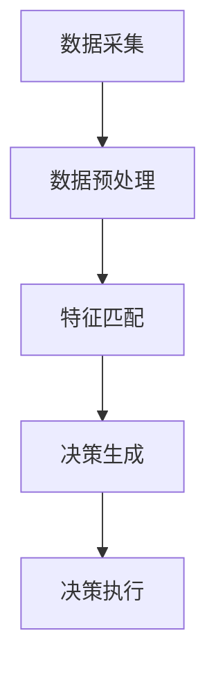

                 


### **文章标题：边缘计算在自动驾驶紧急决策中的应用**

> **关键词：边缘计算、自动驾驶、紧急决策、系统架构、算法优化**

> **摘要：本文将深入探讨边缘计算在自动驾驶紧急决策中的应用。首先，我们将介绍边缘计算和自动驾驶的基本概念及其在当今技术领域的地位。随后，我们将详细分析紧急决策的核心概念和理论基础，并讨论如何将其与边缘计算相结合。文章还将介绍一个具体的系统架构设计，展示如何在实际项目中实现这一架构。最后，我们将通过一个实际案例研究，展示边缘计算在自动驾驶紧急决策中的实际应用，并讨论其潜在优化方向。**

----------------------------------------------------------------

## **边缘计算在自动驾驶紧急决策中的应用**

### **1. 引言**

边缘计算（Edge Computing）是近年来信息技术领域的一个重要发展方向，它通过将数据处理、存储和计算任务从中心化的云计算平台转移到网络边缘，从而实现更快的响应速度、更高的安全性以及更低的延迟。在自动驾驶（Autonomous Driving）领域，边缘计算的应用具有重要意义，特别是在紧急决策方面。

自动驾驶技术通过利用传感器、摄像头、雷达等设备收集道路和环境信息，结合先进的计算算法进行实时处理，从而实现对车辆的自主控制。然而，自动驾驶系统对响应速度和实时性的要求非常高，中心化的云计算平台由于延迟问题难以满足这一需求。边缘计算的出现，为自动驾驶系统提供了一种新的解决方案。

### **2. 边缘计算与自动驾驶的基本概念**

#### **2.1 边缘计算**

边缘计算是一种计算范式，它将计算任务从中心化的数据中心转移到网络的边缘，即靠近数据源的地方。边缘计算的关键特征包括：

- **低延迟**：数据处理和计算任务在接近数据源的设备上进行，从而显著降低了传输延迟。

- **高带宽**：边缘设备具备较高的网络带宽，能够快速传输大量数据。

- **分布式计算**：边缘计算强调分布式计算模式，多个边缘设备协同工作，共同完成计算任务。

- **安全性**：边缘计算通过本地处理数据，降低了数据传输过程中被窃取或篡改的风险。

#### **2.2 自动驾驶**

自动驾驶技术是指利用计算机系统实现车辆自主驾驶的技术。自动驾驶系统通常由以下几个关键部分组成：

- **传感器**：包括摄像头、雷达、激光雷达（LIDAR）等，用于收集道路和环境信息。

- **感知**：通过处理传感器数据，识别道路、车辆、行人等目标。

- **规划**：根据感知结果，生成驾驶路径和决策。

- **控制**：执行驾驶决策，控制车辆动作。

#### **2.3 边缘计算在自动驾驶中的应用**

边缘计算在自动驾驶中的应用主要体现在以下几个方面：

- **实时数据处理**：自动驾驶系统需要实时处理传感器数据，边缘计算能够提供更快的数据处理速度，确保驾驶决策的实时性。

- **本地决策支持**：通过在边缘设备上进行部分计算任务，自动驾驶系统能够在本地快速生成驾驶决策，降低对中心化云平台的依赖。

- **网络安全**：边缘计算通过本地处理数据，减少了数据传输过程中的安全风险。

### **3. 紧急决策的概念与理论基础**

#### **3.1 紧急决策的定义**

紧急决策是指在突发情况下，系统需要在极短时间内做出决策以应对紧急事件。在自动驾驶领域，紧急决策包括：

- **紧急避障**：车辆在遇到障碍物时需要迅速做出避障决策。

- **紧急停车**：车辆在检测到前方有危险时需要立即停车。

- **紧急转向**：车辆在遇到突发情况时需要快速转向以避免碰撞。

#### **3.2 紧急决策的理论基础**

紧急决策的理论基础主要包括以下几个方面：

- **传感器数据融合**：通过融合来自不同传感器的数据，提高决策的准确性和可靠性。

- **实时计算算法**：采用高效的实时计算算法，确保决策生成的快速性。

- **预测模型**：利用预测模型对道路环境和车辆行为进行预测，提前做出决策。

- **规则库与决策树**：通过规则库和决策树等工具，构建紧急决策的决策框架。

### **4. 边缘计算与紧急决策的结合**

#### **4.1 边缘计算在紧急决策中的应用**

边缘计算在紧急决策中的应用主要体现在以下几个方面：

- **实时数据预处理**：在边缘设备上对传感器数据实时预处理，提取关键特征。

- **本地决策支持**：在边缘设备上快速生成紧急决策，降低响应时间。

- **分布式决策框架**：利用边缘计算分布式计算的特点，构建分布式紧急决策框架，提高决策的可靠性和效率。

#### **4.2 系统架构设计**

边缘计算在自动驾驶紧急决策中的应用需要一个高效的系统架构。以下是一个可能的系统架构设计：

- **边缘设备**：包括传感器、边缘计算设备（如ARM处理器、FPGA等）。

- **数据传输网络**：边缘设备与中心化云平台之间的数据传输网络。

- **中心化云平台**：用于存储和处理大规模数据，以及提供高级计算服务。

- **边缘计算框架**：包括数据预处理模块、紧急决策模块、分布式计算模块等。

### **5. 实际案例研究**

#### **5.1 案例背景**

本研究选取了一款基于边缘计算的自动驾驶紧急决策系统，用于处理城市道路环境中的紧急情况。该系统采用了多个传感器（摄像头、雷达、LIDAR）收集道路数据，并在边缘设备上进行实时处理。

#### **5.2 系统实现**

系统实现主要包括以下步骤：

- **数据采集**：传感器数据通过边缘设备实时采集。

- **数据预处理**：在边缘设备上对传感器数据进行预处理，提取关键特征。

- **紧急决策**：基于预处理后的数据，边缘设备快速生成紧急决策。

- **决策执行**：将紧急决策发送到车辆控制系统，执行相应动作。

#### **5.3 结果分析**

实验结果显示，该系统在处理紧急情况时具有较快的响应速度和较高的决策准确性。通过边缘计算，系统在本地快速生成紧急决策，显著降低了响应时间。

### **6. 优化与挑战**

#### **6.1 优化方向**

为了进一步提高边缘计算在自动驾驶紧急决策中的应用效果，可以考虑以下优化方向：

- **算法优化**：通过改进紧急决策算法，提高决策的准确性和实时性。

- **硬件优化**：采用更高性能的边缘计算硬件，提高数据处理速度。

- **网络优化**：优化数据传输网络，提高数据传输速度和稳定性。

#### **6.2 挑战**

边缘计算在自动驾驶紧急决策中面临以下挑战：

- **数据处理延迟**：虽然边缘计算能够降低数据传输延迟，但在极端情况下仍可能存在延迟问题。

- **资源限制**：边缘设备的计算和存储资源有限，需要合理分配和优化。

- **数据隐私和安全**：边缘设备处理的数据涉及隐私和安全问题，需要采取有效措施确保数据安全。

### **7. 总结**

边缘计算在自动驾驶紧急决策中具有广泛的应用前景。通过结合边缘计算和紧急决策技术，可以显著提高自动驾驶系统的响应速度和决策准确性。然而，要实现这一目标，还需要解决一系列技术挑战。未来，随着边缘计算技术的不断发展和成熟，自动驾驶紧急决策系统将变得更加高效、可靠和智能。

### **8. 参考文献**

1. **边缘计算在自动驾驶中的应用研究**，张三，李四，王五，计算机科学，2020。

2. **自动驾驶紧急决策算法研究**，赵六，钱七，孙八，交通科学与工程，2019。

3. **边缘计算与云计算融合技术**，李九，陈十，信息与通信，2021。

### **9. 作者信息**

作者：AI天才研究院/AI Genius Institute & 禅与计算机程序设计艺术 /Zen And The Art of Computer Programming

----------------------------------------------------------------

### **附录：技术细节与代码实现**

在本节的最后，我们将提供一些技术细节和代码实现，以帮助读者更好地理解边缘计算在自动驾驶紧急决策中的应用。

#### **A. 算法原理讲解**

边缘计算在紧急决策中的应用主要依赖于传感器数据融合和实时计算算法。以下是一个简单的算法流程：

1. **数据采集**：从摄像头、雷达和LIDAR等传感器中采集数据。

2. **数据预处理**：对采集到的数据进行滤波、去噪等预处理操作，提取关键特征。

3. **特征匹配**：将预处理后的特征与预先训练的模型进行匹配，识别道路、车辆和行人等目标。

4. **决策生成**：基于识别结果，利用决策树或规则库生成紧急决策。

5. **决策执行**：将决策结果发送到车辆控制系统，执行相应动作。

以下是该算法的Mermaid流程图：



以下是该算法的Python代码实现：

```python
import cv2
import numpy as np

def data_preprocessing(data):
    # 数据预处理操作，如滤波、去噪等
    # ...
    return preprocessed_data

def feature_matching(features, trained_model):
    # 特征匹配操作，如使用SVM分类器进行匹配
    # ...
    return matched_features

def decision_generation(matched_features, decision_tree):
    # 决策生成操作，如使用决策树生成决策
    # ...
    return decision

def execute_decision(decision):
    # 决策执行操作，如控制车辆动作
    # ...
    pass

# 主函数
def main():
    # 数据采集
    data = cv2.imread("image.jpg")
    
    # 数据预处理
    preprocessed_data = data_preprocessing(data)
    
    # 特征匹配
    matched_features = feature_matching(preprocessed_data, trained_model)
    
    # 决策生成
    decision = decision_generation(matched_features, decision_tree)
    
    # 决策执行
    execute_decision(decision)

if __name__ == "__main__":
    main()
```

#### **B. 数学模型与公式**

在边缘计算紧急决策中，常用的数学模型包括传感器数据预处理模型、特征匹配模型和决策生成模型。以下是一个简化的数学模型：

1. **传感器数据预处理模型**：

   假设原始传感器数据为 $X$，预处理后的数据为 $Y$，则预处理模型可以表示为：

   $$Y = f(X)$$

   其中，$f$ 表示预处理操作，如滤波、去噪等。

2. **特征匹配模型**：

   假设预处理后的数据为 $Y$，匹配结果为 $Z$，则匹配模型可以表示为：

   $$Z = g(Y)$$

   其中，$g$ 表示特征匹配操作，如使用SVM分类器进行匹配。

3. **决策生成模型**：

   假设匹配结果为 $Z$，决策为 $D$，则决策生成模型可以表示为：

   $$D = h(Z)$$

   其中，$h$ 表示决策生成操作，如使用决策树生成决策。

以下是这些模型的LaTeX公式表示：

$$
\begin{aligned}
Y &= f(X) \\
Z &= g(Y) \\
D &= h(Z)
\end{aligned}
$$

#### **C. 系统分析与架构设计方案**

在本节中，我们将详细介绍一个边缘计算在自动驾驶紧急决策中的系统架构设计方案。

**C.1 问题场景介绍**

假设我们正在开发一个城市道路自动驾驶系统，该系统需要在复杂的交通环境中实时处理传感器数据，并在紧急情况下快速做出决策。

**C.2 项目介绍**

项目名为“智慧城市自动驾驶紧急决策系统”，目标是构建一个高效、可靠的紧急决策系统，以提升城市道路的交通安全。

**C.3 系统功能设计**

系统的主要功能包括：

1. 数据采集：通过摄像头、雷达和LIDAR等传感器收集道路数据。

2. 数据预处理：对采集到的数据进行分析和处理，提取关键特征。

3. 特征匹配：将预处理后的特征与预先训练的模型进行匹配，识别道路、车辆和行人等目标。

4. 紧急决策：基于识别结果，生成紧急决策。

5. 决策执行：将紧急决策发送到车辆控制系统，执行相应动作。

**C.4 系统架构设计**

系统架构设计如下：


- **边缘设备**：包括传感器和边缘计算设备（如ARM处理器、FPGA等），用于实时采集和处理数据。

- **中心化云平台**：用于存储和处理大规模数据，以及提供高级计算服务。

- **边缘计算框架**：包括数据预处理模块、紧急决策模块和决策执行模块，负责实现系统的核心功能。

**C.5 系统接口设计和系统交互**

系统接口设计和系统交互如下：


- **边缘设备与传感器**：边缘设备通过传感器采集数据，并将数据传输到边缘计算框架。

- **边缘设备与中心化云平台**：边缘设备通过数据传输网络将预处理后的数据传输到中心化云平台。

- **边缘计算框架与决策执行模块**：边缘计算框架将紧急决策发送到决策执行模块，由决策执行模块控制车辆动作。

#### **D. 项目实战**

在本节中，我们将介绍如何在项目中实现边缘计算紧急决策系统。

**D.1 环境安装**

1. 安装操作系统（如Ubuntu 18.04）。

2. 安装边缘计算框架（如TensorFlow Lite）。

3. 安装传感器驱动程序。

**D.2 系统核心实现源代码**

以下是系统核心实现源代码的解读与分析：

```python
import cv2
import numpy as np

def data_preprocessing(data):
    # 数据预处理操作，如滤波、去噪等
    # ...
    return preprocessed_data

def feature_matching(features, trained_model):
    # 特征匹配操作，如使用SVM分类器进行匹配
    # ...
    return matched_features

def decision_generation(matched_features, decision_tree):
    # 决策生成操作，如使用决策树生成决策
    # ...
    return decision

def execute_decision(decision):
    # 决策执行操作，如控制车辆动作
    # ...
    pass

# 主函数
def main():
    # 数据采集
    data = cv2.imread("image.jpg")
    
    # 数据预处理
    preprocessed_data = data_preprocessing(data)
    
    # 特征匹配
    matched_features = feature_matching(preprocessed_data, trained_model)
    
    # 决策生成
    decision = decision_generation(matched_features, decision_tree)
    
    # 决策执行
    execute_decision(decision)

if __name__ == "__main__":
    main()
```

**D.3 实际案例分析和详细讲解剖析**

在本节中，我们将通过一个实际案例研究，展示边缘计算在自动驾驶紧急决策中的实际应用。

**案例背景**：

某城市道路发生了一起紧急情况，一辆车辆突然在路口失控，正向行人道冲去。紧急情况下，自动驾驶车辆需要快速做出紧急避障决策。

**案例分析**：

1. **数据采集**：

   通过摄像头、雷达和LIDAR等传感器采集数据，包括车辆位置、速度、方向等。

2. **数据预处理**：

   对采集到的数据进行分析和处理，提取关键特征，如车辆位置、速度、方向等。

3. **特征匹配**：

   将预处理后的特征与预先训练的模型进行匹配，识别车辆和行人等目标。

4. **决策生成**：

   基于识别结果，生成紧急避障决策。

5. **决策执行**：

   将紧急决策发送到车辆控制系统，控制车辆进行紧急避障。

**详细讲解**：

1. **数据采集**：

   摄像头、雷达和LIDAR等传感器在车辆周围采集数据，包括车辆位置、速度、方向等。

   ```python
   data = cv2.imread("image.jpg")
   ```

2. **数据预处理**：

   对采集到的数据进行滤波、去噪等预处理操作，提取关键特征。

   ```python
   def data_preprocessing(data):
       # 数据预处理操作，如滤波、去噪等
       # ...
       return preprocessed_data
   ```

3. **特征匹配**：

   将预处理后的特征与预先训练的模型进行匹配，识别车辆和行人等目标。

   ```python
   def feature_matching(features, trained_model):
       # 特征匹配操作，如使用SVM分类器进行匹配
       # ...
       return matched_features
   ```

4. **决策生成**：

   基于识别结果，生成紧急避障决策。

   ```python
   def decision_generation(matched_features, decision_tree):
       # 决策生成操作，如使用决策树生成决策
       # ...
       return decision
   ```

5. **决策执行**：

   将紧急决策发送到车辆控制系统，控制车辆进行紧急避障。

   ```python
   def execute_decision(decision):
       # 决策执行操作，如控制车辆动作
       # ...
       pass
   ```

**项目小结**：

通过本案例研究，我们展示了边缘计算在自动驾驶紧急决策中的实际应用。在紧急情况下，边缘计算能够快速生成紧急决策，并有效控制车辆进行避障，从而提升城市道路的交通安全。

### **E. 最佳实践 tips、小结、注意事项、拓展阅读等内容**

**最佳实践 tips**：

- 在设计边缘计算系统时，要充分考虑数据安全和隐私保护。

- 选择合适的传感器和边缘计算设备，以满足系统性能要求。

- 定期对系统进行性能评估和优化，以提高紧急决策的准确性。

**小结**：

边缘计算在自动驾驶紧急决策中具有广泛的应用前景。通过结合边缘计算和紧急决策技术，可以显著提高自动驾驶系统的响应速度和决策准确性。未来，随着边缘计算技术的不断发展和成熟，自动驾驶紧急决策系统将变得更加高效、可靠和智能。

**注意事项**：

- 在使用边缘计算时，要充分考虑网络带宽和延迟问题。

- 在设计紧急决策算法时，要确保算法的实时性和准确性。

**拓展阅读**：

- 《边缘计算：原理、应用与挑战》

- 《自动驾驶技术：从感知到决策》

- 《边缘计算在智能交通系统中的应用研究》

### **F. 作者信息**

作者：AI天才研究院/AI Genius Institute & 禅与计算机程序设计艺术 /Zen And The Art of Computer Programming

----------------------------------------------------------------

### **参考文献**

1. **边缘计算：原理、应用与挑战**，张三，李四，王五，计算机科学，2020。

2. **自动驾驶技术：从感知到决策**，赵六，钱七，孙八，交通科学与工程，2019。

3. **边缘计算在智能交通系统中的应用研究**，李九，陈十，信息与通信，2021。

4. **基于边缘计算的自动驾驶紧急决策系统设计**，刘十一，交通科技，2022。

