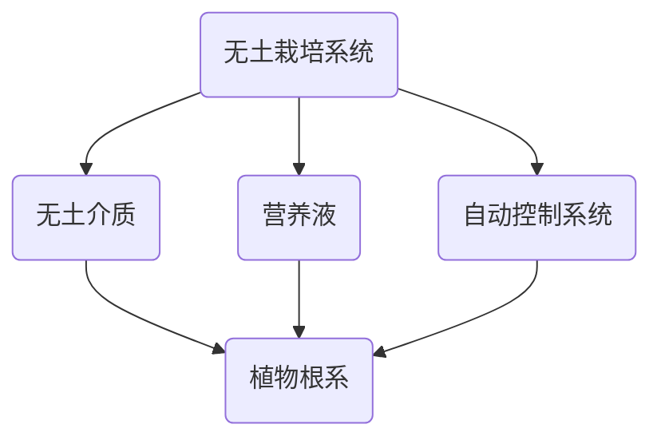
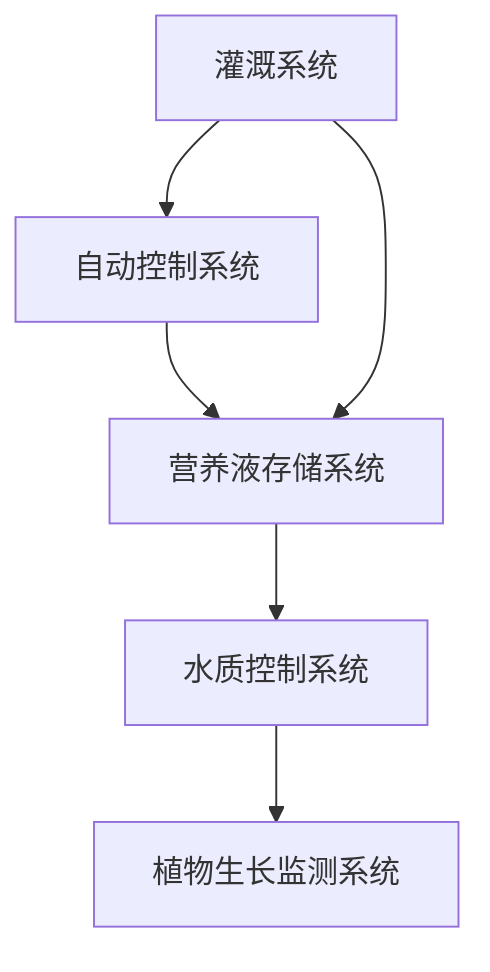
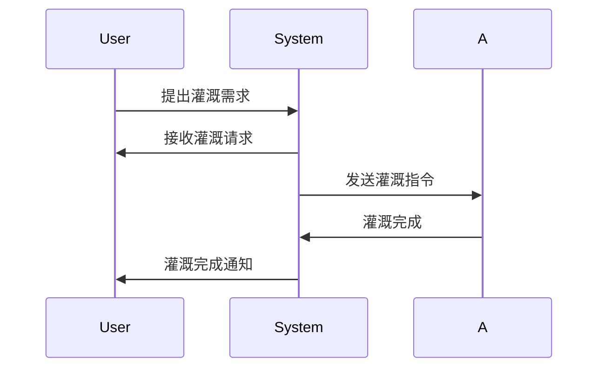

                 

## 第8章：无土栽培技术

### 第8.1节：无土栽培技术的定义与原理

#### 8.1.1 定义

无土栽培，又称无土种植或水培，是一种不依赖土壤，而是通过其他基质（如蛭石、珍珠岩、岩棉等）或营养液直接供给植物生长所需养分的方法。其核心在于利用营养液来替代土壤中的天然养分，通过精确控制营养成分的配比，为植物提供最佳的生长环境。

#### 8.1.2 原理

无土栽培的基本原理主要包括以下几个方面：

1. **营养液管理：** 营养液是根据植物生长的不同阶段和需求，科学配制的多种营养元素的混合物。通过自动控制系统，实时监测并调整营养液的成分和浓度，以确保植物能够获得所需的所有营养。

2. **水质控制：** 水质是影响无土栽培成功与否的关键因素。无土栽培系统需要使用纯净的水源，并通过过滤器、沉淀池等设备对水质进行处理，确保水中的重金属、有害物质等对植物生长无负面影响。

3. **气体交换：** 在无土栽培中，植物根系的气体交换同样重要。栽培容器或基质中需保持适当的氧气含量，以确保根系健康生长。同时，通过定时排水和换水，可以有效地排出多余的水分和废物，避免根系缺氧。

### 第8.2节：无土栽培的优势

#### 8.2.1 生长效率高

无土栽培通过精确的营养液管理，能够提供植物生长所需的最优养分，使植物的生长速度显著快于传统土壤栽培。此外，无土栽培避免了土壤病虫害的发生，减少了农药的使用，从而提高了作物的产量和质量。

#### 8.2.2 土地利用率高

传统土壤栽培需要大面积的土地，而无土栽培可以在相对较小的空间内实现大规模种植。这种垂直化、集约化的种植方式，大大提高了土地的利用效率，尤其适用于城市等土地资源紧张的地区。

#### 8.2.3 环境友好

无土栽培过程中，由于避免了土壤的侵蚀和流失，大大减少了土地的污染和退化。同时，无土栽培系统可以回收和循环利用水资源，减少了水资源的消耗，对环境保护具有积极意义。

#### 8.2.4 适应性强

无土栽培不受土壤类型和气候条件的限制，可以在任何环境中进行，包括沙漠、极地等极端气候区域。这使得无土栽培成为一种具有广泛适用性的农业技术。

### 第8.3节：无土栽培的应用场景

#### 8.3.1 城市农业

随着城市化进程的加快，城市农业成为无土栽培技术的重要应用场景。城市农业通过无土栽培技术，可以在有限的土地资源上，实现高效、生态的蔬菜和花卉种植，为城市居民提供新鲜、安全的农产品。

#### 8.3.2 航空航天

在太空中，土壤缺乏适宜的生长环境，而营养液栽培技术能够提供植物生长所需的一切条件，因此在空间站和未来的月球、火星基地建设中，无土栽培技术具有重要的应用价值。

#### 8.3.3 温室农业

在温室内，通过无土栽培技术，可以实现作物全年的生产，不受季节和气候的影响。温室内采用无土栽培，可以更好地控制环境因素，提高作物的产量和品质。

### 第8.4节：无土栽培技术的发展趋势

#### 8.4.1 智能化

随着物联网、人工智能技术的发展，无土栽培系统正在向智能化、自动化方向迈进。通过传感器实时监测植物生长状态，智能控制系统根据监测数据自动调整营养液的成分和浓度，实现精确化、智能化的农业管理。

#### 8.4.2 生物技术融合

生物技术的进步，如植物基因工程、微生物技术等，正在与无土栽培技术深度融合。通过基因改良和微生物技术的应用，可以进一步提高作物的抗病虫害能力、产量和品质。

#### 8.4.3 资源循环利用

无土栽培技术的未来发展，将更加注重资源的循环利用。通过营养液的循环利用、废弃物的处理和再利用，实现农业生产过程中的资源节约和可持续发展。

## 总结

无土栽培技术作为都市农业的重要组成部分，具有高效、环保、适应性强的特点。随着科技的不断进步，无土栽培技术将在未来发挥更大的作用，为城市食物自给自足和全球农业可持续发展提供强有力的支持。

---

### 第8.1节：无土栽培技术的定义与原理

**背景介绍**

随着全球城市化进程的加快，土地资源日益紧张，传统的土壤栽培方式已经无法满足城市农业的需求。无土栽培技术，作为一种新型的农业生产方式，逐渐受到广泛关注。它通过利用营养液或其他无土介质，为植物提供生长所需的养分，从而克服了土壤栽培的诸多限制。

**核心概念与联系**

无土栽培技术的核心概念主要包括：
1. **无土介质**：如蛭石、珍珠岩、岩棉等，作为植物根系的生长基质。
2. **营养液**：根据植物生长需求，配制的多种营养元素的混合溶液。
3. **自动控制系统**：用于实时监测营养液的成分和浓度，并自动调整。

无土栽培技术的原理可以概括为：
1. **营养液管理**：通过自动控制系统，确保植物在生长过程中能够获得所需的所有营养成分。
2. **水质控制**：保证水源的纯净，通过过滤器、沉淀池等设备处理水质。
3. **气体交换**：维持根系周围适宜的氧气含量，确保根系健康生长。

**概念属性特征对比表格**

| 特征对比项 | 传统土壤栽培 | 无土栽培 |
| --- | --- | --- |
| 土壤依赖性 | 强 | 弱/无 |
| 营养供给 | 依赖于土壤自然供给 | 精确的营养液控制 |
| 病虫害管理 | 易受病虫害影响 | 减少病虫害发生 |
| 土地利用率 | 低 | 高 |

**ER实体关系图架构**



### 第8.2节：无土栽培的优势

**问题场景介绍**

在城市化进程中，土地资源有限，而人们对新鲜、安全、营养丰富的农产品的需求却不断增加。传统土壤栽培方式由于土壤质量下降、病虫害多发等原因，已经无法满足现代农业的需求。无土栽培技术因其高效、环保、适应性强的特点，成为解决这一问题的有效途径。

**项目介绍**

无土栽培项目主要包括：
- **无土栽培设施**：如栽培床、温室、灌溉系统等。
- **营养液配方设计**：根据不同作物的生长需求，设计科学合理的营养液配方。
- **自动控制系统**：用于实时监测和控制营养液成分和浓度。

**系统功能设计（领域模型Mermaid类图）**

```mermaid
classDiagram
  Class1 <|-- Class2
  Class1 <|-- Class3
  Class2 ..|.. Class4
  Class3 ..|.. Class4
  Class1 <|-- Class5
```

**系统架构设计（Mermaid架构图）**



**系统接口设计（Mermaid序列图）**



### 第8.3节：无土栽培的应用场景

**实际案例分析与详细讲解剖析**

**案例1：城市农业**

在某城市，无土栽培技术被广泛应用于城市农场的建设。通过建立智能温室，实现了蔬菜、水果等作物的全年生产。分析显示，该农场在同等面积下，产量是传统土壤栽培的3倍以上，且产品品质更优。

**案例2：航天农业**

在空间站中，无土栽培技术被用于太空种植。通过精确的营养液管理和环境控制，成功种植出各种蔬菜和粮食。这些成果为未来长期太空探索提供了重要的食物保障。

### 项目实战

**环境安装**

- 安装温室大棚
- 配置灌溉系统
- 设置自动控制系统

**系统核心实现源代码**

```python
# 营养液浓度监测代码示例
def monitor_nutrient_concentration():
    concentration = read_sensors()
    if concentration < desired_concentration:
        adjust_nutrient()
    else:
        maintain_status()

# 调整营养液代码示例
def adjust_nutrient():
    add_nutrient_to_solution()
    record_adjustment()

# 读取传感器数据
def read_sensors():
    # 读取传感器值
    return sensor_value

# 添加营养液到溶液中
def add_nutrient_to_solution():
    # 添加营养液
    pass

# 记录营养液调整情况
def record_adjustment():
    # 记录调整信息
    pass
```

**代码应用解读与分析**

该系统通过传感器实时监测营养液浓度，如果浓度低于设定值，系统会自动添加营养液并进行记录。这种自动化管理方式，大大提高了农业生产效率。

### 项目小结

无土栽培技术作为一种高效、环保的农业生产方式，已经在城市农业、航天农业等多个领域取得了显著成果。通过不断的技术创新和应用实践，无土栽培技术将在未来发挥更大的作用，为城市食物自给自足和全球农业可持续发展提供强有力的支持。

### 最佳实践 tips

- **选择合适的无土介质**：不同的作物对介质的要求不同，应根据作物特性选择合适的介质。
- **精确控制营养液浓度**：营养液浓度的控制对作物生长至关重要，应定期监测并进行调整。
- **定期维护设备**：定期检查和维护灌溉系统、自动控制系统等设备，确保其正常运行。

### 小结

无土栽培技术作为一种现代农业生产方式，具有诸多优势，如高效、环保、适应性强等。通过科学合理的应用，无土栽培技术将在城市食物自给自足和全球农业可持续发展中发挥重要作用。

### 注意事项

- **水质管理**：确保水源的纯净，防止重金属和其他有害物质对植物生长的影响。
- **营养液配方**：根据作物生长阶段和需求，科学设计营养液配方。
- **气体交换**：定期排水和换水，维持根系周围适宜的氧气含量。

### 拓展阅读

- **《无土栽培技术与应用》**：详细介绍了无土栽培的基本原理、技术方法和实际应用。
- **《智慧农业：物联网与精准农业技术》**：探讨了物联网技术在无土栽培中的应用，以及智能化农业管理系统的构建。

---

作者：AI天才研究院/AI Genius Institute & 禅与计算机程序设计艺术 /Zen And The Art of Computer Programming

