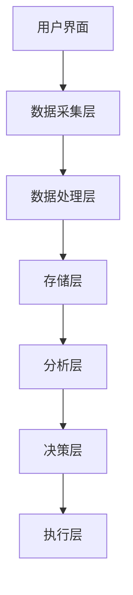
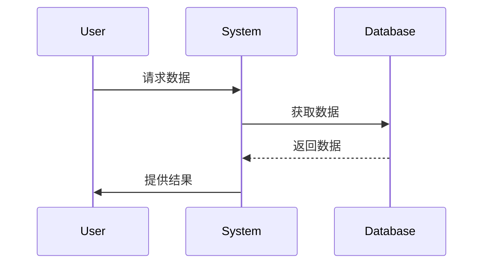
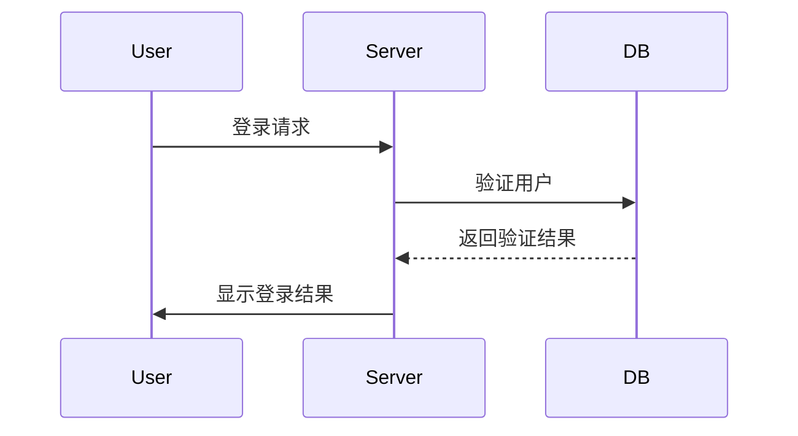
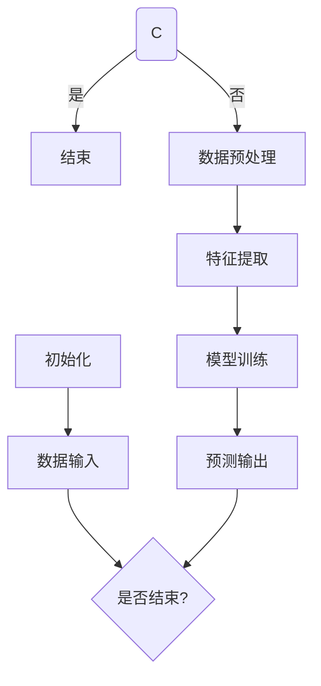

                 

### 引言

---

**# 都市农业革命2.0计划：城市食物自给自足的新模式推广**

> **关键词：都市农业、食物自给自足、新模式、智能农业、可持续发展**

> **摘要：本文深入探讨了都市农业革命2.0计划的背景、目标、核心概念以及实施策略，旨在推广城市食物自给自足的新型模式，为解决城市粮食安全和环境污染问题提供新思路。**

---

在现代社会，城市与农业之间的关系愈发紧密，城市居民的生活品质与食品安全直接依赖于农业的供给。然而，当前城市农业面临着诸多挑战，如土地资源有限、环境污染、劳动力短缺等。因此，都市农业革命2.0计划应运而生，旨在通过创新技术和管理模式，实现城市食物的自给自足。

### 第一部分：引言

#### 1.1 书籍背景与目标

##### 1.1.1 城市农业的现状与挑战

城市农业不仅为城市居民提供新鲜蔬菜和水果，还承担着美化城市环境、调节城市气候的重要作用。然而，当前城市农业面临着土地资源有限、农业生产效率低、环境污染等问题。

- **土地资源有限**：城市土地大多被用于建设，可用的农业用地越来越少。
- **农业生产效率低**：传统农业依赖人力，效率低下，难以满足城市居民的需求。
- **环境污染**：农药和化肥的大量使用导致土壤和水源污染，对环境和健康构成威胁。

##### 1.1.2 革命1.0的回顾

革命1.0计划通过引入高效种植技术和节水灌溉系统，提高城市农业的生产效率。然而，这一计划也存在一些局限性：

- **成本高**：高效种植技术和节水灌溉系统的建设成本较高，不适合所有城市。
- **技术依赖性**：依赖技术设备，一旦设备出现问题，生产效率会急剧下降。

##### 1.1.3 2.0计划的愿景

2.0计划的目标是通过创新技术和可持续发展理念，实现城市食物自给自足。其主要理念包括：

- **智能农业技术**：利用传感器、物联网和人工智能技术，实现精准农业管理。
- **生态农业系统**：构建城市农业生态系统，实现农业与环境的和谐共生。
- **可持续发展原则**：在保证农业产出的同时，注重环境保护和资源节约。

#### 1.2 核心概念与关键术语

##### 1.2.1 都市农业

- **定义**：都市农业是指在城市区域内进行的农业生产活动，包括屋顶农业、社区农场、垂直农业等。
- **特点**：高效、环保、多样化、与城市生活紧密结合。
- **类型**：包括传统农业、智能农业、生态农业等。

##### 1.2.2 食物自给自足

- **概念**：食物自给自足是指城市通过自身的农业生产，满足居民的食物需求。
- **优势**：提高食品安全，减少对外部供应的依赖，降低物流成本。
- **挑战**：生产规模、技术能力、资源配置等。

##### 1.2.3 新模式

- **定义**：新模式是指不同于传统农业的农业生产方式，包括社区农场、屋顶农业、垂直农业等。
- **类型**：根据地理位置、技术手段、组织形式等分类。
- **关键要素**：技术支持、政策支持、市场机制、社区参与。

#### 1.3 目录概述

##### 1.3.1 主要章节内容

- **第一部分：引言**：介绍城市农业的现状、挑战以及2.0计划的背景和目标。
- **第二部分：都市农业2.0技术基础**：探讨智能农业技术、城市农业生态系统、生物技术与基因编辑、能源与资源利用、可持续发展原则等。
- **第三部分：城市食物自给自足新模式**：详细分析社区农场、屋顶农业、垂直农业、智慧农业、生物多样性农业、综合农业系统的概念、优势、挑战和实践。
- **第四部分：推广策略与实施步骤**：讨论推广策略、实施步骤以及案例分析。
- **第五部分：拓展阅读与参考资料**：提供进一步学习的资源和链接。

##### 1.3.2 阅读建议

- **阅读顺序建议**：按照目录顺序阅读，以便逐步理解2.0计划的核心内容和实施策略。
- **阅读重点提示**：重点关注技术基础、新模式分析和推广策略部分，这些是实现城市食物自给自足的关键。

---

通过以上引言部分的内容，我们为读者搭建了一个关于都市农业革命2.0计划的总体框架，接下来将进一步深入探讨2.0计划的技术基础和具体实施策略。敬请期待！
### 第一部分：引言

---

#### 1.1 书籍背景与目标

##### 1.1.1 城市农业的现状与挑战

城市农业作为都市生活的重要组成部分，不仅为城市居民提供新鲜的蔬菜和水果，还在美化城市环境、调节城市气候等方面发挥着重要作用。然而，随着城市化的加速和人口的增长，城市农业也面临着前所未有的挑战。

首先，土地资源的限制成为城市农业发展的瓶颈。城市土地大多被用于商业和住宅建设，可供农业使用的土地面积日益减少。此外，农业用地的碎片化也使得农业生产效率降低，难以满足城市居民日益增长的食物需求。

其次，农业生产效率低是城市农业面临的另一个重大挑战。传统农业主要依赖人力，农业生产过程繁琐，效率低下。同时，由于城市农业缺乏现代化的机械设备和技术手段，农业生产过程往往受到自然条件的影响较大，难以实现高产稳产。

最后，环境污染也是城市农业面临的一个重要问题。农药和化肥的大量使用导致土壤和水源污染，对城市生态环境和居民健康构成严重威胁。此外，城市农业废弃物处理不当也会对环境造成污染。

##### 1.1.2 革命1.0的回顾

革命1.0计划是城市农业发展的一个重要里程碑。它主要通过引入高效种植技术和节水灌溉系统来提高农业生产效率。具体来说，革命1.0计划包括以下几个方面：

1. **高效种植技术**：通过采用无土栽培、垂直种植等技术，提高土地利用率，增加产量。例如，无土栽培技术利用营养液来替代土壤，使作物能够在较小的空间内生长，同时减少病虫害的发生。

2. **节水灌溉系统**：采用滴灌、喷灌等技术，减少水资源的浪费。传统灌溉方式往往导致大量水资源的浪费，而节水灌溉系统可以精准控制水量，提高灌溉效率。

3. **农业机械化**：引入现代化的机械设备，如自动播种机、采摘机等，减少人力投入，提高生产效率。农业机械化不仅能够减轻农民的劳动强度，还能够提高生产效率和产品质量。

尽管革命1.0计划在一定程度上提高了城市农业的生产效率，但它也存在一些局限性。首先，高效种植技术和节水灌溉系统的建设成本较高，不适合所有城市。其次，依赖技术设备，一旦设备出现问题，生产效率会急剧下降。此外，革命1.0计划主要侧重于技术手段的提升，而忽略了农业生态系统的建设和管理。

##### 1.1.3 2.0计划的愿景

2.0计划旨在通过创新技术和可持续发展理念，实现城市食物自给自足，为城市居民提供安全、健康、可持续的食品供应。2.0计划的核心目标包括以下几个方面：

1. **提高生产效率**：通过引入智能农业技术，如传感器、物联网、大数据分析等，实现精准农业管理，提高农业生产效率。

2. **优化资源利用**：通过生态农业系统的建设，实现农业与环境的和谐共生，提高资源利用效率。

3. **保障食品安全**：通过建立健全的食品安全管理体系，确保城市居民的食品安全。

4. **促进可持续发展**：注重环境保护和资源节约，推动城市农业的可持续发展。

2.0计划的实施将有助于解决当前城市农业面临的土地资源有限、农业生产效率低、环境污染等问题，为实现城市食物自给自足提供有力支持。

---

通过回顾城市农业的现状和革命1.0计划的成就与局限性，我们可以更好地理解2.0计划的愿景和目标。接下来，我们将深入探讨2.0计划的核心概念和关键术语，为后续内容打下基础。敬请期待！
#### 1.2 核心概念与关键术语

##### 1.2.1 都市农业

都市农业是指在城市区域内进行的农业生产活动，其核心目标是通过提高生产效率和优化资源利用，实现城市食物的自给自足。都市农业具有以下几个主要特点：

1. **高效性**：都市农业采用现代化技术和管理手段，如无土栽培、垂直种植、智能灌溉等，提高农业生产效率和产量。
2. **多样性**：都市农业不仅包括蔬菜和水果的生产，还包括畜牧、水产养殖等多种农业生产形式，满足城市居民的多样化需求。
3. **与城市生活紧密结合**：都市农业与城市居民的生活紧密相连，不仅提供新鲜的食物，还在美化城市环境、调节城市气候等方面发挥着重要作用。

都市农业的类型主要包括以下几种：

1. **屋顶农业**：利用城市建筑物的屋顶进行农业生产，可以充分利用城市空间，减少土地资源的占用。
2. **社区农场**：在城市社区内建立的农业生产基地，居民可以参与农业生产，提高社区的凝聚力和生活质量。
3. **垂直农业**：在垂直空间内进行农业生产，如多层种植塔、垂直农场等，通过高效的垂直空间利用，提高产量和效率。

##### 1.2.2 食物自给自足

食物自给自足是指城市通过自身的农业生产，满足居民的食物需求。实现食物自给自足具有重要意义：

1. **提高食品安全**：减少对外部供应的依赖，确保食品的质量和安全。
2. **降低物流成本**：缩短供应链，降低运输和储存成本，提高经济效益。
3. **环境保护**：减少因物流和农业生产导致的碳排放和环境污染。

然而，实现食物自给自足也面临一些挑战：

1. **生产规模**：城市土地资源有限，难以达到大规模生产的条件。
2. **技术能力**：需要先进的农业技术和设备支持，提高生产效率。
3. **资源配置**：合理分配土地、水资源和劳动力等资源，确保农业生产的可持续发展。

##### 1.2.3 新模式

新模式是指不同于传统农业的农业生产方式，其核心理念是通过创新技术和管理模式，提高生产效率和资源利用效率。以下是几种主要的新型农业模式：

1. **智慧农业**：利用传感器、物联网、大数据分析等技术，实现农业生产的智能化和精准化。通过实时监测环境参数，优化灌溉、施肥等生产过程，提高产量和质量。
2. **生态农业**：通过构建农业生态系统，实现农业与环境的和谐共生。注重土壤保护、水资源管理、有机肥料的使用，减少对环境的负面影响。
3. **综合农业系统**：将多种农业生产形式相结合，形成完整的农业生态系统。例如，将农业、林业、畜牧业、渔业等相结合，实现资源的综合利用和循环利用。

关键要素包括：

1. **技术支持**：引入先进的农业技术，如智能灌溉系统、垂直种植设备、自动化农业机械等。
2. **政策支持**：政府提供相应的政策支持和补贴，鼓励农业创新和可持续发展。
3. **市场机制**：建立完善的农产品市场体系，确保农产品的销售渠道和价格稳定。
4. **社区参与**：鼓励城市居民参与农业生产，提高社区的凝聚力和生活质量。

---

通过明确都市农业、食物自给自足和新模式的核心概念与关键术语，我们为后续内容的深入探讨奠定了基础。接下来，我们将进一步探讨都市农业2.0计划的技术基础，为城市食物自给自足提供技术支持。敬请期待！
### 1.3 目录概述

#### 1.3.1 主要章节内容

- **第一部分：引言**
  - **1.1 书籍背景与目标**
    - 城市农业的现状与挑战
    - 革命1.0的回顾
    - 2.0计划的愿景
  - **1.2 核心概念与关键术语**
    - 都市农业
    - 食物自给自足
    - 新模式
- **第二部分：都市农业2.0技术基础**
  - **2.1 智能农业技术**
    - 智能农业概述
    - 传感器技术
    - 物联网技术
  - **2.2 城市农业生态系统**
    - 生态系统的概念
    - 城市农业生态系统的特点
  - **2.3 生物技术与基因编辑**
    - 生物技术的应用
    - 基因编辑技术
  - **2.4 能源与资源利用**
    - 能源利用
    - 资源利用
  - **2.5 可持续发展原则**
    - 可持续发展的概念
    - 城市农业与可持续发展
- **第三部分：城市食物自给自足新模式**
  - **3.1 模式1：社区农场**
    - 定义与特点
    - 运营模式
  - **3.2 模式2：屋顶农业**
    - 概述
    - 挑战与解决方案
  - **3.3 模式3：垂直农业**
    - 概念与类型
    - 优势与挑战
  - **3.4 模式4：智慧农业**
    - 定义与要素
    - 应用案例
  - **3.5 模式5：生物多样性农业**
    - 概念与重要性
    - 实践与效果
  - **3.6 模式6：综合农业系统**
    - 概念与特点
    - 优势与挑战
- **第四部分：推广策略与实施步骤**
  - **4.1 推广策略**
    - 重要性
    - 制定原则
  - **4.2 实施步骤**
    - 概述
    - 需求分析与规划
    - 技术与资源准备
    - 试点与推广
  - **4.3 案例分析**
    - 案例选择标准
    - 成功经验
    - 挑战与应对策略
- **第五部分：拓展阅读与参考资料**

#### 1.3.2 阅读建议

- **阅读顺序建议**：
  - 首先阅读第一部分引言，了解书籍的背景和目标。
  - 然后按照第二部分到第四部分的顺序阅读，从技术基础、新型模式到推广策略，逐步深入理解都市农业2.0计划的实施。
  - 最后阅读第五部分拓展阅读与参考资料，以获取更多相关知识和案例。

- **阅读重点提示**：
  - 关注第二部分的技术基础部分，理解智能农业技术、城市农业生态系统、生物技术与基因编辑等核心概念。
  - 重点阅读第三部分的新型模式部分，分析各种模式的定义、特点、优势和挑战。
  - 注意第四部分的推广策略与实施步骤，了解如何在实际中推广和实施2.0计划。

通过以上目录概述和阅读建议，读者可以系统地了解都市农业2.0计划的背景、目标和实施策略，为后续内容的深入学习做好准备。敬请期待！
### 第二部分：都市农业2.0技术基础

---

**# 2.0计划的科技基石：都市农业的技术革命**

> **关键词：智能农业、传感器技术、物联网、生物技术、基因编辑、可持续发展**

> **摘要：本部分将深入探讨都市农业2.0计划的科技基石，分析智能农业技术、传感器技术、物联网技术、生物技术与基因编辑、能源与资源利用以及可持续发展原则，为城市食物自给自足提供全面的技术支持。**

---

随着科技的快速发展，都市农业2.0计划得以在技术层面实现革命性的突破。本部分将详细探讨这些技术如何支持城市食物自给自足的目标。

#### 2.1 智能农业技术

##### 2.1.1 智能农业概述

智能农业是指利用现代信息技术和自动化设备，实现农业生产过程的智能化和精准化。智能农业的核心目标是通过数据驱动和自动化管理，提高农业生产效率，减少资源浪费，保障食品安全。

- **定义**：智能农业利用传感器、物联网、大数据、人工智能等先进技术，实现农业生产的智能化。
- **要素**：包括传感器、物联网、数据分析、自动化设备等。

##### 2.1.2 传感器技术

传感器技术是智能农业的核心组成部分，它能够实时监测土壤湿度、温度、光照强度、空气湿度等环境参数，为农业生产提供准确的数据支持。

- **传感器类型**：包括土壤传感器、气象传感器、水质传感器等。
- **数据采集与处理**：传感器采集到的数据通过物联网传输到中央控制系统，进行分析和处理，为农业生产提供决策支持。

##### 2.1.3 物联网技术

物联网技术是智能农业的神经系统，它将传感器、自动化设备、计算机系统等互联，实现农业生产过程的自动化和智能化。

- **物联网架构**：包括感知层、网络层、平台层和应用层。
- **数据传输与存储**：通过物联网将传感器采集到的数据实时传输到中央控制系统，进行存储和分析。

#### 2.2 城市农业生态系统

##### 2.2.1 生态系统的概念

生态系统是指生物与环境相互作用形成的整体，包括生物、环境因素和生物之间的相互作用。

- **定义**：生态系统是指生物与环境之间相互作用的动态平衡系统。
- **要素**：包括生物（生产者、消费者、分解者）、非生物（阳光、空气、水、土壤等）。

##### 2.2.2 城市农业生态系统的特点

城市农业生态系统具有以下特点：

- **高度集约化**：利用有限的空间进行高效的农业生产，实现土地资源的最大化利用。
- **多功能性**：不仅提供食物，还具有环境美化、生态保护、教育科研等功能。
- **可持续性**：注重环境保护和资源节约，实现农业生产的可持续发展。

#### 2.3 生物技术与基因编辑

##### 2.3.1 生物技术的应用

生物技术是现代农业生产的重要工具，通过改变植物和动物的遗传特性，提高产量、改善品质、增强抗病虫害能力。

- **常见技术**：包括基因工程、组织培养、分子标记辅助育种等。
- **前景与挑战**：生物技术具有巨大的发展潜力，但同时也面临着安全性、伦理道德等方面的挑战。

##### 2.3.2 基因编辑技术

基因编辑技术，如CRISPR-Cas9，是生物技术的最新突破，能够精确地改变植物的遗传信息，提高农业生产的效率和质量。

- **CRISPR-Cas9技术**：通过引导RNA（gRNA）定位到特定基因序列，切割DNA，实现基因编辑。
- **应用**：基因编辑技术在农作物改良、抗病虫害育种、营养改善等方面具有广泛的应用前景。

#### 2.4 能源与资源利用

##### 2.4.1 能源利用

能源利用是城市农业的重要组成部分，通过采用可再生能源和节能技术，降低农业生产的能源消耗。

- **可再生能源**：包括太阳能、风能、水能等。
- **能源效率**：通过优化能源利用方式，提高能源效率，减少能源浪费。

##### 2.4.2 资源利用

资源利用包括水资源的节约和管理、有机肥料的合理使用、土壤健康的管理等。

- **水资源管理**：采用节水灌溉技术，提高水资源利用效率。
- **有机肥料与土壤健康**：通过有机肥料的使用和土壤改良，提高土壤肥力，促进作物生长。

#### 2.5 可持续发展原则

##### 2.5.1 可持续发展的概念

可持续发展是指在满足当前需求的同时，不损害后代满足自身需求的能力。

- **定义**：可持续发展是满足当前代人的需求，而不会危及后代满足自身需求的能力。
- **要素**：包括环境保护、资源利用、经济发展、社会公正等。

##### 2.5.2 城市农业与可持续发展

城市农业与可持续发展密切相关，通过生态农业、智慧农业、综合农业系统等模式，实现农业的可持续发展。

- **关联性**：城市农业的可持续发展有助于缓解土地资源紧张、减少环境污染、保障食品安全等。
- **实践案例**：许多城市已经通过实施生态农业、智慧农业等模式，实现了农业的可持续发展。

---

通过本部分的探讨，我们了解了都市农业2.0计划的技术基础，包括智能农业技术、传感器技术、物联网技术、生物技术与基因编辑、能源与资源利用以及可持续发展原则。这些技术为城市食物自给自足提供了强有力的支持。接下来，我们将探讨各种新型城市食物自给自足的模式。敬请期待！
### 第二部分：都市农业2.0技术基础

#### 2.1 智能农业技术

##### 2.1.1 智能农业概述

智能农业是都市农业2.0计划的核心技术之一，它通过整合传感器技术、物联网、大数据分析、人工智能等技术，实现农业生产的智能化和精准化。智能农业的目标是提高农业生产效率，减少资源浪费，保障食品安全，同时实现农业的可持续发展。

- **定义**：智能农业是指利用先进的信息技术、自动化设备和智能管理系统，对农业生产全过程进行实时监控、分析和优化，以提高农业生产效率和质量。
- **要素**：智能农业的主要要素包括传感器、物联网、大数据分析、人工智能、自动化设备等。

智能农业的优势主要体现在以下几个方面：

1. **提高生产效率**：通过精准监测和自动化控制，智能农业可以优化灌溉、施肥、病虫害防治等农业生产环节，提高作物产量和质量。
2. **减少资源浪费**：智能农业技术能够根据土壤湿度、养分含量等数据，精确调整用水、用肥量，减少资源浪费。
3. **保障食品安全**：智能农业可以实现对农药、化肥使用的全程监控，确保农产品的安全性。
4. **促进可持续发展**：智能农业通过优化资源利用，减少环境污染，有助于实现农业的可持续发展。

##### 2.1.2 传感器技术

传感器技术是智能农业的重要组成部分，它通过实时监测土壤、气候、病虫害等环境参数，为农业生产提供关键数据支持。

- **传感器类型**：智能农业中常用的传感器包括土壤湿度传感器、温度传感器、光照传感器、气体传感器（如二氧化碳传感器、氧气传感器）等。
- **数据采集与处理**：传感器采集到的数据通过物联网传输到中央控制系统，进行实时分析、处理和存储，为农业生产提供决策支持。

##### 2.1.3 物联网技术

物联网技术是智能农业的神经系统，它将传感器、自动化设备、计算机系统等互联，实现农业生产过程的自动化和智能化。

- **物联网架构**：智能农业的物联网架构通常包括感知层、网络层、平台层和应用层。感知层负责数据采集，网络层负责数据传输，平台层负责数据处理，应用层负责数据分析和应用。
- **数据传输与存储**：物联网技术通过无线网络（如Wi-Fi、蓝牙、LoRa等）将传感器采集到的数据传输到中央控制系统，进行存储、分析和处理，为农业生产提供实时监控和决策支持。

#### 2.2 城市农业生态系统

##### 2.2.1 生态系统的概念

生态系统是指生物与环境相互作用形成的整体，它包括生物（生产者、消费者、分解者）和非生物（阳光、空气、水、土壤等）因素。

- **定义**：生态系统是指生物与环境之间相互作用的动态平衡系统，它包括生物群落、生物圈以及它们之间的相互作用。
- **要素**：生态系统的要素包括生物、环境、物质循环、能量流动等。

##### 2.2.2 城市农业生态系统的特点

城市农业生态系统具有以下几个显著特点：

1. **高度集约化**：城市农业利用有限的空间进行高效的农业生产，通过垂直种植、屋顶农业等方式，实现土地资源的最大化利用。
2. **多功能性**：城市农业不仅提供食物，还具有环境美化、生态保护、教育科研等功能。
3. **可持续性**：城市农业注重环境保护和资源节约，通过生态农业、智慧农业等方式，实现农业的可持续发展。

##### 2.2.3 城市农业生态系统的构建

城市农业生态系统的构建需要遵循以下原则：

1. **资源循环利用**：通过有机肥料、废水处理等方式，实现资源的循环利用，减少对环境的污染。
2. **生态多样性**：保护城市农业生态系统的生物多样性，增加生态系统的稳定性和抗风险能力。
3. **环境友好**：采用环保型农业技术，减少农药、化肥的使用，保护城市生态环境。

#### 2.3 生物技术与基因编辑

##### 2.3.1 生物技术的应用

生物技术是现代农业生产的重要工具，通过改变植物和动物的遗传特性，提高产量、改善品质、增强抗病虫害能力。

- **常见技术**：包括基因工程、组织培养、分子标记辅助育种等。
- **前景与挑战**：生物技术具有巨大的发展潜力，但同时也面临着安全性、伦理道德等方面的挑战。

##### 2.3.2 基因编辑技术

基因编辑技术，如CRISPR-Cas9，是生物技术的最新突破，能够精确地改变植物的遗传信息，提高农业生产的效率和质量。

- **CRISPR-Cas9技术**：通过引导RNA（gRNA）定位到特定基因序列，切割DNA，实现基因编辑。
- **应用**：基因编辑技术在农作物改良、抗病虫害育种、营养改善等方面具有广泛的应用前景。

#### 2.4 能源与资源利用

##### 2.4.1 能源利用

能源利用是城市农业的重要组成部分，通过采用可再生能源和节能技术，降低农业生产的能源消耗。

- **可再生能源**：包括太阳能、风能、水能等。
- **能源效率**：通过优化能源利用方式，提高能源效率，减少能源浪费。

##### 2.4.2 资源利用

资源利用包括水资源的节约和管理、有机肥料的合理使用、土壤健康的管理等。

- **水资源管理**：采用节水灌溉技术，提高水资源利用效率。
- **有机肥料与土壤健康**：通过有机肥料的使用和土壤改良，提高土壤肥力，促进作物生长。

#### 2.5 可持续发展原则

##### 2.5.1 可持续发展的概念

可持续发展是指在满足当前需求的同时，不损害后代满足自身需求的能力。

- **定义**：可持续发展是满足当前代人的需求，而不会危及后代满足自身需求的能力。
- **要素**：包括环境保护、资源利用、经济发展、社会公正等。

##### 2.5.2 城市农业与可持续发展

城市农业与可持续发展密切相关，通过生态农业、智慧农业、综合农业系统等模式，实现农业的可持续发展。

- **关联性**：城市农业的可持续发展有助于缓解土地资源紧张、减少环境污染、保障食品安全等。
- **实践案例**：许多城市已经通过实施生态农业、智慧农业等模式，实现了农业的可持续发展。

---

通过本部分的探讨，我们了解了都市农业2.0计划的技术基础，包括智能农业技术、传感器技术、物联网技术、生物技术与基因编辑、能源与资源利用以及可持续发展原则。这些技术为城市食物自给自足提供了强有力的支持。接下来，我们将探讨各种新型城市食物自给自足的模式。敬请期待！
### 第二部分：都市农业2.0技术基础

#### 2.6 能源与资源利用

##### 2.6.1 能源利用

在城市农业中，能源的合理利用是实现可持续发展的关键因素之一。随着全球能源危机和环境问题的加剧，城市农业越来越需要采用可再生能源和节能技术来降低对传统能源的依赖。

- **可再生能源**：包括太阳能、风能、水能等。这些能源不仅可再生，而且对环境影响较小。例如，屋顶光伏系统可以充分利用太阳能，为农业生产提供电力。
- **能源效率**：提高能源效率是城市农业能源利用的重要方面。通过优化灌溉系统、使用高效照明和供暖设备、采用节能设备等措施，可以显著降低能源消耗。

##### 2.6.2 资源利用

资源的有效利用对于城市农业的可持续发展至关重要。城市农业的自然资源主要包括水资源、土壤资源和有机肥料。

- **水资源管理**：城市农业需要采用节水灌溉技术，如滴灌、喷灌等，以减少水资源的浪费。此外，雨水收集和废水处理技术也可以有效地增加水资源的供给。
- **有机肥料与土壤健康**：有机肥料不仅能够提供作物生长所需的养分，还能改善土壤结构，提高土壤的肥力。通过堆肥、绿肥种植等方式，可以充分利用城市农业废弃物，减少对化学肥料的依赖。

##### 2.6.3 循环经济

循环经济理念在城市农业中的应用，旨在实现资源的最优化利用和废物减量化。通过构建资源循环利用体系，城市农业可以实现废物的再利用和能量的多级利用。

- **废物的再利用**：城市农业废弃物，如农作物残渣、动物粪便等，可以通过堆肥、发酵等技术转化为有机肥料，用于农田的再种植。
- **能量的多级利用**：通过有机物的高效转化，如生物质能源的生产，可以实现能量的循环利用，减少对化石燃料的依赖。

#### 2.7 可持续发展原则

##### 2.7.1 可持续发展的概念

可持续发展是指在满足当前需求的同时，不损害后代满足自身需求的能力。

- **定义**：可持续发展是指在不损害环境、资源和经济基础的前提下，满足当前和未来人类的需求。
- **要素**：包括环境保护、经济繁荣、社会公正和资源利用。

##### 2.7.2 城市农业与可持续发展

城市农业的可持续发展对于城市环境和居民生活质量具有重要意义。通过以下措施，可以实现城市农业的可持续发展：

- **生态保护**：保护城市农业生态系统，维护生物多样性，减少环境污染。
- **经济繁荣**：通过创新技术和管理模式，提高农业产值，促进经济增长。
- **社会公正**：通过农业教育和社区参与，提高社会对农业的认识和参与度，促进社会和谐。

##### 2.7.3 实践案例

许多城市已经通过实施可持续发展原则，取得了显著的成效。例如：

- **新加坡**：新加坡通过建立高效的水资源管理和循环利用系统，实现了城市农业的水资源自给自足。
- **纽约**：纽约的屋顶农业项目不仅提供了新鲜的食物，还改善了城市生态环境，降低了城市的碳排放。

---

通过本部分的探讨，我们了解了城市农业在能源与资源利用方面的技术和可持续发展原则。这些技术和管理模式为城市农业的可持续发展提供了有力支持。在下一部分，我们将探讨城市食物自给自足的各种新模式。敬请期待！
### 第三部分：城市食物自给自足新模式

---

**# 城市食物自给自足的新模式：探索与推广**

> **关键词：社区农场、屋顶农业、垂直农业、智慧农业、生物多样性农业、综合农业系统**

> **摘要：本部分将深入探讨六种城市食物自给自足的新模式，分析其概念、特点、优势、挑战和实践效果，为城市农业的创新和可持续发展提供参考。**

---

在城市化的进程中，如何实现城市食物的自给自足成为了一个重要议题。新型城市农业模式的探索和实践，不仅能够提高城市农业的生产效率，还能促进城市环境的美化和居民生活质量的提升。本部分将详细介绍六种城市食物自给自足的新模式，并分析其实施的可行性和效果。

#### 3.1 模式1：社区农场

##### 3.1.1 社区农场的定义与特点

**定义**：社区农场是位于城市社区内部的农业生产基地，社区居民可以参与农作物的种植、收获和管理。

**特点**：

- **参与性**：社区居民共同参与农场的管理和运营，增强了社区的凝聚力和归属感。
- **多样性**：农场种植的作物种类丰富，既有蔬菜和水果，也有观赏植物和草药。
- **教育性**：社区农场可以用于教育项目，让居民了解农业生产过程，提高环境保护意识。

##### 3.1.2 社区农场的运营模式

社区农场的运营模式通常包括以下几种：

- **会员制**：居民通过成为会员，支付会员费用，参与农场的运营和管理。
- **志愿劳动**：居民通过参与农场的工作，获得一定的积分或奖励。
- **市场销售**：农场的产出可以在社区内销售，也可以通过社区市场或网络平台销售给外部客户。

##### 3.1.3 社区农场的优势与挑战

**优势**：

- **提高食品安全**：社区居民可以亲眼看到作物的生长过程，确保食品的安全和质量。
- **增强社区凝聚力**：共同参与农场的建设和运营，增强了社区居民的互动和联系。
- **环保教育**：通过农场活动，提高了居民的环保意识和参与度。

**挑战**：

- **资源管理**：社区农场需要有效的资源管理，包括土地、水资源和劳动力的合理分配。
- **市场定位**：如何确保农产品的销售渠道和价格稳定，是社区农场面临的另一个挑战。

##### 3.1.4 社区农场的实践效果

许多城市已经成功实施了社区农场模式，例如：

- **柏林**：柏林的社区农场项目不仅提高了社区的食物自给率，还改善了城市环境，减少了温室气体排放。
- **纽约**：纽约的社区农场项目通过推广有机农业，提高了社区居民的健康意识。

#### 3.2 模式2：屋顶农业

##### 3.2.1 屋顶农业的概述

**概述**：屋顶农业是利用城市建筑物的屋顶进行农业生产的一种模式，可以有效利用城市空间，提高土地利用率。

**优点**：

- **空间利用率高**：屋顶农业可以充分利用城市有限的空间资源。
- **环保**：屋顶农业可以降低建筑物的空调负荷，减少城市热岛效应。
- **美观**：屋顶上的绿色植物可以美化城市景观，提升城市形象。

##### 3.2.2 屋顶农业的挑战与解决方案

**挑战**：

- **结构安全性**：需要确保屋顶结构能够承受农业生产带来的额外负荷。
- **灌溉与排水**：屋顶环境复杂，需要有效的灌溉和排水系统。

**解决方案**：

- **结构评估**：在实施屋顶农业前，对屋顶结构进行详细评估，确保其安全。
- **灌溉系统**：采用滴灌、喷灌等技术，确保作物得到充足的水分。

##### 3.2.3 屋顶农业的实践效果

屋顶农业已经在许多城市得到实践，如：

- **东京**：东京的屋顶农业项目通过使用先进的农业技术，提高了农作物的产量和质量。
- **悉尼**：悉尼的屋顶农场项目不仅提供了新鲜的农产品，还成为城市生态旅游的亮点。

#### 3.3 模式3：垂直农业

##### 3.3.1 垂直农业的概念与类型

**概念**：垂直农业是利用垂直空间进行农业生产的一种模式，通过多层种植塔、垂直农场等形式，实现空间的高效利用。

**类型**：

- **多层种植塔**：在垂直空间内建立多层种植平台，通过自动化系统进行管理。
- **垂直农场**：在建筑物内建立封闭的农业生产环境，实现全过程的自动化管理。

##### 3.3.2 垂直农业的优势与挑战

**优势**：

- **空间利用高效**：垂直农业可以充分利用垂直空间，提高土地利用率。
- **环境可控**：垂直农业通过封闭环境，可以更好地控制温度、湿度、光照等环境因素，提高作物的生长速度和质量。

**挑战**：

- **建设成本高**：垂直农业的建设成本较高，需要投入大量的资金和资源。
- **技术要求高**：垂直农业对农业技术、自动化控制技术等要求较高，需要专业化的技术支持。

##### 3.3.3 垂直农业的实践效果

垂直农业已经在全球多个城市得到实践，如：

- **新加坡**：新加坡的垂直农场项目通过自动化技术，实现了高效、可持续的农业生产。
- **伦敦**：伦敦的垂直农业项目不仅提高了城市农产品的自给率，还成为了城市可持续发展的典范。

#### 3.4 模式4：智慧农业

##### 3.4.1 智慧农业的定义与要素

**定义**：智慧农业是指通过物联网、大数据、云计算、人工智能等先进技术，实现农业生产的智能化和精准化。

**要素**：

- **物联网**：通过传感器、无人机等技术，实时监测作物生长状况。
- **大数据分析**：对收集到的数据进行分析，为农业生产提供决策支持。
- **人工智能**：利用人工智能技术，实现农业生产的自动化和智能化。

##### 3.4.2 智慧农业的应用案例

智慧农业在多个领域得到了应用，如：

- **病虫害监测与防治**：通过物联网和大数据分析，实现病虫害的早期预警和精准防治。
- **精准灌溉**：通过传感器和大数据分析，实现精准灌溉，提高水资源利用效率。
- **智能温室**：通过物联网和人工智能技术，实现温室环境自动化控制，提高作物产量和质量。

##### 3.4.3 智慧农业的优势与挑战

**优势**：

- **提高生产效率**：通过智能化的管理，提高农业生产效率。
- **降低成本**：通过精准管理，减少资源浪费，降低生产成本。

**挑战**：

- **技术成本高**：智慧农业需要大量的技术投入，初期成本较高。
- **技术维护**：智慧农业系统的维护和升级需要专业的技术支持。

#### 3.5 模式5：生物多样性农业

##### 3.5.1 生物多样性的概念与重要性

**概念**：生物多样性是指生物种类的丰富度和生态系统的多样性。

**重要性**：

- **生态系统稳定性**：生物多样性是生态系统稳定性的基础，有助于抵抗环境变化和病虫害。
- **生态服务功能**：生物多样性为人类提供了食物、药材、木材等生态服务功能。

##### 3.5.2 生物多样性农业的实践与效果

生物多样性农业在多个城市得到了实践，如：

- **多伦多**：多伦多的生态农场通过种植多种作物和动物，实现了生态平衡和可持续生产。
- **温哥华**：温哥华的社区花园项目通过种植多种植物，提高了城市的生物多样性。

#### 3.6 模式6：综合农业系统

##### 3.6.1 综合农业系统的概念与特点

**概念**：综合农业系统是指将多种农业生产模式相结合，形成完整的农业生态系统。

**特点**：

- **多功能性**：综合农业系统不仅提供食物，还包括环境美化、生态保护、教育科研等功能。
- **可持续性**：通过资源循环利用和生态平衡，实现农业的可持续发展。

##### 3.6.2 综合农业系统的优势与挑战

**优势**：

- **资源高效利用**：通过多种农业生产模式的结合，实现资源的高效利用。
- **环境友好**：减少化学农药和化肥的使用，降低对环境的负面影响。

**挑战**：

- **系统复杂度**：综合农业系统涉及多个农业生产模式，管理复杂度较高。
- **技术要求**：需要多种农业技术支持，技术要求较高。

##### 3.6.3 综合农业系统的实践效果

综合农业系统在多个城市得到了实践，如：

- **东京**：东京的综合农业园区通过多种农业生产模式的结合，实现了高效、可持续的农业生产。
- **首尔**：首尔的生态农场项目通过综合农业系统，提高了城市的生态效益和居民的生活质量。

---

通过以上对六种城市食物自给自足新模式的探讨，我们可以看到这些模式在提高城市农业生产效率、促进环境保护和提升居民生活质量方面具有巨大的潜力。接下来，我们将讨论如何推广这些新型农业模式，以实现城市食物自给自足的目标。敬请期待！
### 第三部分：城市食物自给自足新模式

---

#### 3.1 模式1：社区农场

##### 3.1.1 社区农场的定义与特点

**定义**：社区农场是指位于城市社区内部，由居民共同参与管理和运营的农业生产基地。它不仅提供新鲜的蔬菜和水果，还承担着教育、休闲和社交等功能。

**特点**：

- **参与性**：社区农场鼓励居民参与农作物的种植、养护和收获，增强社区凝聚力。
- **多样性**：农场种植的作物种类丰富，包括蔬菜、水果、草药和观赏植物等。
- **教育性**：社区农场可以成为农业教育的重要场所，提高居民的农业知识和环保意识。

##### 3.1.2 社区农场的运营模式

社区农场的运营模式通常包括以下几种：

- **会员制**：居民通过成为会员，支付会员费用，参与农场的运营和管理。
- **志愿劳动**：居民可以通过志愿劳动来获取积分或奖励，参与农场的工作。
- **市场销售**：农场的产出可以通过社区内销售，也可以通过社区市场或网络平台销售给外部客户。

##### 3.1.3 社区农场的优势与挑战

**优势**：

- **提高食品安全**：社区居民可以亲眼看到作物的生长过程，确保食品的安全和质量。
- **增强社区凝聚力**：共同参与农场的建设和运营，增强了社区居民的互动和联系。
- **环保教育**：通过农场活动，提高了居民的环保意识和参与度。

**挑战**：

- **资源管理**：社区农场需要有效的资源管理，包括土地、水资源和劳动力的合理分配。
- **市场定位**：如何确保农产品的销售渠道和价格稳定，是社区农场面临的另一个挑战。

##### 3.1.4 社区农场的实践效果

社区农场模式在全球多个城市得到了成功的实践，如：

- **纽约**：纽约的社区农场项目通过推广有机农业，提高了社区居民的健康意识和食品安全性。
- **柏林**：柏林的社区农场项目不仅提高了城市农产品的自给率，还改善了城市环境，减少了温室气体排放。

#### 3.2 模式2：屋顶农业

##### 3.2.1 屋顶农业的概述

**概述**：屋顶农业是指利用城市建筑物屋顶进行农业生产的一种模式。它不仅可以提高城市土地的利用率，还有助于降低建筑物的能耗和改善城市景观。

**优点**：

- **空间利用率高**：屋顶农业可以充分利用城市有限的空间资源。
- **环保**：屋顶上的绿色植物可以降低建筑物的空调负荷，减少城市热岛效应。
- **美观**：屋顶上的植物景观可以美化城市环境，提升城市形象。

##### 3.2.2 屋顶农业的挑战与解决方案

**挑战**：

- **结构安全性**：需要确保屋顶结构能够承受农业生产带来的额外负荷。
- **灌溉与排水**：屋顶环境复杂，需要有效的灌溉和排水系统。

**解决方案**：

- **结构评估**：在实施屋顶农业前，对屋顶结构进行详细评估，确保其安全。
- **灌溉系统**：采用滴灌、喷灌等技术，确保作物得到充足的水分。

##### 3.2.3 屋顶农业的实践效果

屋顶农业已经在多个城市得到了实践，如：

- **东京**：东京的屋顶农业项目通过使用先进的农业技术，提高了农作物的产量和质量。
- **悉尼**：悉尼的屋顶农场项目不仅提供了新鲜的农产品，还成为城市生态旅游的亮点。

#### 3.3 模式3：垂直农业

##### 3.3.1 垂直农业的概念与类型

**概念**：垂直农业是指利用垂直空间进行农业生产的一种模式。它通过多层种植塔或垂直农场的形式，实现空间的高效利用。

**类型**：

- **多层种植塔**：在垂直空间内建立多层种植平台，通过自动化系统进行管理。
- **垂直农场**：在建筑物内建立封闭的农业生产环境，实现全过程的自动化管理。

##### 3.3.2 垂直农业的优势与挑战

**优势**：

- **空间利用高效**：垂直农业可以充分利用垂直空间，提高土地利用率。
- **环境可控**：垂直农业通过封闭环境，可以更好地控制温度、湿度、光照等环境因素，提高作物的生长速度和质量。

**挑战**：

- **建设成本高**：垂直农业的建设成本较高，需要投入大量的资金和资源。
- **技术要求高**：垂直农业对农业技术、自动化控制技术等要求较高，需要专业化的技术支持。

##### 3.3.3 垂直农业的实践效果

垂直农业在全球多个城市得到了实践，如：

- **新加坡**：新加坡的垂直农场项目通过自动化技术，实现了高效、可持续的农业生产。
- **伦敦**：伦敦的垂直农业项目不仅提高了城市农产品的自给率，还成为了城市可持续发展的典范。

#### 3.4 模式4：智慧农业

##### 3.4.1 智慧农业的定义与要素

**定义**：智慧农业是指利用物联网、大数据、云计算、人工智能等先进技术，实现农业生产的智能化和精准化。

**要素**：

- **物联网**：通过传感器、无人机等技术，实时监测作物生长状况。
- **大数据分析**：对收集到的数据进行分析，为农业生产提供决策支持。
- **人工智能**：利用人工智能技术，实现农业生产的自动化和智能化。

##### 3.4.2 智慧农业的应用案例

智慧农业在多个领域得到了应用，如：

- **病虫害监测与防治**：通过物联网和大数据分析，实现病虫害的早期预警和精准防治。
- **精准灌溉**：通过传感器和大数据分析，实现精准灌溉，提高水资源利用效率。
- **智能温室**：通过物联网和人工智能技术，实现温室环境自动化控制，提高作物产量和质量。

##### 3.4.3 智慧农业的优势与挑战

**优势**：

- **提高生产效率**：通过智能化的管理，提高农业生产效率。
- **降低成本**：通过精准管理，减少资源浪费，降低生产成本。

**挑战**：

- **技术成本高**：智慧农业需要大量的技术投入，初期成本较高。
- **技术维护**：智慧农业系统的维护和升级需要专业的技术支持。

#### 3.5 模式5：生物多样性农业

##### 3.5.1 生物多样性的概念与重要性

**概念**：生物多样性是指生物种类的丰富度和生态系统的多样性。

**重要性**：

- **生态系统稳定性**：生物多样性是生态系统稳定性的基础，有助于抵抗环境变化和病虫害。
- **生态服务功能**：生物多样性为人类提供了食物、药材、木材等生态服务功能。

##### 3.5.2 生物多样性农业的实践与效果

生物多样性农业在多个城市得到了实践，如：

- **多伦多**：多伦多的生态农场通过种植多种作物和动物，实现了生态平衡和可持续生产。
- **温哥华**：温哥华的社区花园项目通过种植多种植物，提高了城市的生物多样性。

#### 3.6 模式6：综合农业系统

##### 3.6.1 综合农业系统的概念与特点

**概念**：综合农业系统是指将多种农业生产模式相结合，形成完整的农业生态系统。

**特点**：

- **多功能性**：综合农业系统不仅提供食物，还包括环境美化、生态保护、教育科研等功能。
- **可持续性**：通过资源循环利用和生态平衡，实现农业的可持续发展。

##### 3.6.2 综合农业系统的优势与挑战

**优势**：

- **资源高效利用**：通过多种农业生产模式的结合，实现资源的高效利用。
- **环境友好**：减少化学农药和化肥的使用，降低对环境的负面影响。

**挑战**：

- **系统复杂度**：综合农业系统涉及多个农业生产模式，管理复杂度较高。
- **技术要求**：需要多种农业技术支持，技术要求较高。

##### 3.6.3 综合农业系统的实践效果

综合农业系统在多个城市得到了实践，如：

- **东京**：东京的综合农业园区通过多种农业生产模式的结合，实现了高效、可持续的农业生产。
- **首尔**：首尔的生态农场项目通过综合农业系统，提高了城市的生态效益和居民的生活质量。

---

通过以上对六种城市食物自给自足新模式的探讨，我们可以看到这些模式在提高城市农业生产效率、促进环境保护和提升居民生活质量方面具有巨大的潜力。接下来，我们将讨论如何推广这些新型农业模式，以实现城市食物自给自足的目标。敬请期待！
### 第三部分：城市食物自给自足新模式

---

#### 3.1 模式1：社区农场

##### 3.1.1 定义与特点

**定义**：社区农场是指在城市社区内部或周边建立的农业生产基地，由社区居民共同参与管理和运营，旨在提高城市食物自给自足能力。

**特点**：

1. **参与性**：社区农场鼓励居民积极参与农作物的种植、养护和收获，增强社区凝聚力。
2. **多样性**：种植作物种类丰富，包括蔬菜、水果、草药等多种植物。
3. **教育性**：农场可作为教育场所，普及农业知识，提高居民的环保意识。

##### 3.1.2 运营模式

**运营模式**：

1. **会员制**：居民通过支付会员费成为农场成员，享有种植和收获的权利。
2. **志愿劳动**：居民可通过参与农场的志愿劳动获取积分或奖励。
3. **市场销售**：农场产出可以在社区内销售，或通过市场渠道对外销售。

##### 3.1.3 优势

1. **提高食品安全**：居民能亲眼见证作物的生长过程，确保食品的质量和安全。
2. **增强社区凝聚力**：共同参与农场活动，增强居民之间的互动和联系。
3. **环保教育**：通过农场活动，提高居民的环保意识和参与度。

##### 3.1.4 挑战

1. **资源管理**：合理分配土地、水资源和劳动力，确保农场运营的可持续性。
2. **市场定位**：如何确保农产品的销售渠道和价格稳定，是社区农场需要面对的挑战。

##### 3.1.5 实践效果

**实践效果**：

1. **纽约**：纽约的社区农场项目通过推广有机农业，提高了社区的健康意识。
2. **柏林**：柏林的社区农场项目不仅提高了城市农产品的自给率，还改善了城市环境。

---

#### 3.2 模式2：屋顶农业

##### 3.2.1 概述

**概述**：屋顶农业是指利用城市建筑物屋顶进行农业生产的一种模式。它不仅能提高城市土地利用率，还有助于改善城市环境和降低能耗。

**优点**：

1. **空间利用率高**：充分利用城市屋顶空间，提高土地利用效率。
2. **环保**：屋顶上的植物可以降低建筑物能耗，减少城市热岛效应。
3. **美观**：屋顶植物景观美化城市环境，提升城市形象。

##### 3.2.2 挑战与解决方案

**挑战**：

1. **结构安全性**：确保屋顶结构能够承受农业生产带来的额外负荷。
2. **灌溉与排水**：屋顶环境复杂，需有效解决灌溉和排水问题。

**解决方案**：

1. **结构评估**：在实施屋顶农业前，对屋顶结构进行详细评估，确保其安全。
2. **灌溉系统**：采用滴灌、喷灌等技术，确保作物得到充足水分。

##### 3.2.3 实践效果

**实践效果**：

1. **东京**：东京的屋顶农业项目通过使用先进技术，提高了作物产量。
2. **悉尼**：悉尼的屋顶农场项目不仅提供了新鲜农产品，还成为城市生态旅游的亮点。

---

通过以上对社区农场和屋顶农业的探讨，我们可以看到这些模式在城市食物自给自足方面具有显著的潜力。接下来，我们将继续探讨垂直农业、智慧农业、生物多样性农业和综合农业系统的概念、优势、挑战和实践效果。敬请期待！
### 第四部分：推广策略与实施步骤

---

**# 城市食物自给自足新模式的推广策略与实施步骤**

> **关键词：推广策略、实施步骤、试点与推广、案例分析**

> **摘要：本部分将详细探讨如何有效推广城市食物自给自足的新模式，包括推广策略、实施步骤、试点与推广的方法，并通过案例分析总结成功经验与挑战应对策略。**

---

要实现城市食物自给自足，新模式的推广至关重要。本部分将深入探讨如何制定和实施有效的推广策略，以及实施过程中的关键步骤和成功案例。

#### 4.1 推广策略

##### 4.1.1 推广策略的重要性

推广策略是确保城市食物自给自足新模式成功实施的关键。有效的推广策略可以加速新模式的普及，提高公众对新型农业模式的认知和接受度，从而实现城市农产品的自给自足。

##### 4.1.2 推广策略的制定原则

1. **目标明确**：制定具体的推广目标，如推广范围、时间节点和预期成果。
2. **因地制宜**：根据不同城市的地理环境、资源条件和社会经济状况，制定相应的推广策略。
3. **多元化渠道**：利用多种推广渠道，如政府政策、媒体宣传、教育培训等，提高新模式的影响力。
4. **持续支持**：提供长期的技术支持、政策支持和资金支持，确保新模式能够持续发展。

##### 4.1.3 推广策略的具体方法

1. **政府政策支持**：政府通过出台支持政策，如税收优惠、补贴等，鼓励企业和个人参与新模式的建设和运营。
2. **媒体宣传**：利用电视、广播、报纸、网络等媒体，宣传新型农业模式的优势和成功案例，提高公众的认知和接受度。
3. **教育培训**：开展农业技术培训和教育，提高农民的技能水平，培养新型农业人才。
4. **社区参与**：鼓励社区居民参与新型农业模式的推广，提高社区的凝聚力和参与度。

#### 4.2 实施步骤

##### 4.2.1 实施步骤概述

实现城市食物自给自足新模式的推广需要经过以下几个关键步骤：

1. **需求分析与规划**：分析市场需求和资源条件，制定具体的推广计划和实施方案。
2. **技术与资源准备**：筹备所需的农业技术、设备、人力资源和资金，确保推广过程中的顺利进行。
3. **试点与推广**：选择合适的地区进行试点，积累经验，逐步推广到其他地区。
4. **评估与优化**：对推广效果进行评估，根据反馈进行调整和优化，确保新模式能够持续发展。

##### 4.2.2 第一步：需求分析与规划

**内容**：

1. **市场调研**：了解市场需求和消费者偏好，确定推广的目标市场。
2. **资源评估**：评估城市农业的资源条件，如土地、水资源、气候条件等。
3. **政策环境**：分析政府政策对推广新模式的支持力度和限制条件。
4. **制定推广计划**：根据需求分析和资源评估，制定具体的推广计划和实施方案。

**方法**：

- **问卷调查**：通过问卷调查了解消费者的需求和意见。
- **专家咨询**：邀请农业专家和政府官员进行咨询，获取专业意见和建议。
- **数据分析**：收集和分析相关的市场数据和政策信息，制定科学的推广计划。

##### 4.2.3 第二步：技术与资源准备

**内容**：

1. **引进技术**：引进适合城市农业的新技术和设备，如智能农业系统、节水灌溉设备、垂直农业设备等。
2. **培训人才**：培训农业技术人员和农民，提高他们的技能水平，确保新技术和新模式的有效实施。
3. **筹集资金**：筹集必要的资金，确保推广过程的顺利进行。
4. **资源整合**：整合各种资源，如土地、水资源、人力资源等，为新模式提供充足的保障。

**方法**：

- **政府资助**：申请政府专项资金，用于新技术和设备的引进和推广。
- **企业合作**：与农业企业和科研机构合作，共同开发和推广新模式。
- **社会资金**：通过社会众筹等方式筹集资金，支持新模式的建设和运营。

##### 4.2.4 第三步：试点与推广

**内容**：

1. **选择试点地区**：选择具备推广条件且具有代表性的地区作为试点。
2. **实施试点项目**：在试点地区实施新模式，积累经验，发现问题并进行调整。
3. **推广到其他地区**：根据试点项目的成功经验，逐步推广到其他地区，扩大推广范围。

**方法**：

- **示范引领**：通过试点项目的成功示范，带动其他地区的推广。
- **政策激励**：通过政策激励，鼓励其他地区积极参与新模式推广。
- **宣传教育**：通过宣传教育，提高公众对新模式的认知和接受度。

##### 4.2.5 第四步：评估与优化

**内容**：

1. **效果评估**：对推广效果进行评估，包括产量、质量、经济效益、社会影响等方面。
2. **反馈与调整**：根据评估结果和公众反馈，对新模式进行优化和调整。
3. **持续改进**：持续跟踪新模式的发展情况，不断进行改进和优化。

**方法**：

- **数据监测**：通过数据监测和分析，实时了解新模式的发展状况。
- **专家评估**：邀请农业专家对推广效果进行评估，提供专业的意见和建议。
- **用户调查**：通过用户调查，了解公众对新模式的满意度和改进需求。

#### 4.3 案例分析

##### 4.3.1 案例选择标准

**案例选择标准**：

1. **代表性**：选择具有代表性的成功案例，能够反映新模式的核心优势和实施效果。
2. **创新性**：选择具有创新性和前瞻性的案例，为新模式的推广提供新的思路和方法。
3. **可持续性**：选择能够实现可持续发展，具有长期影响力的案例。

##### 4.3.2 案例一：XX城市的成功经验

**情况介绍**：

XX城市在推广城市食物自给自足新模式方面取得了显著成果，通过社区农场、屋顶农业和垂直农业等多种模式，实现了城市农产品的自给自足。

**成功要素**：

1. **政策支持**：政府出台了一系列支持政策，包括税收优惠、补贴等，鼓励企业和个人参与新模式的建设和运营。
2. **技术创新**：引进了先进的农业技术，如智能农业系统、节水灌溉设备等，提高了农业生产效率。
3. **社区参与**：积极引导社区居民参与农场的建设和运营，增强了社区的凝聚力和参与度。
4. **市场拓展**：通过多种渠道拓展农产品销售市场，确保农产品的销路和价格稳定。

##### 4.3.3 案例二：XX地区的挑战与应对

**情况介绍**：

XX地区在推广城市食物自给自足新模式过程中遇到了一些挑战，如资金短缺、技术支持不足等。

**面临的挑战**：

1. **资金短缺**：推广新模式的资金投入较大，但地方财政支持有限，导致资金短缺。
2. **技术支持不足**：农业技术人才缺乏，新技术和新模式的推广遇到困难。

**应对策略**：

1. **多渠道融资**：通过政府补贴、企业投资、社会众筹等多渠道筹集资金，解决资金短缺问题。
2. **技术培训**：加强农业技术人才的培养和引进，提高技术人员的技术水平。
3. **政策扶持**：通过政策扶持，鼓励企业和个人参与新模式的推广和建设。

---

通过以上对推广策略与实施步骤的详细探讨，我们可以看到实现城市食物自给自足新模式的关键在于科学的规划、有效的推广策略和持续的技术支持。接下来，我们将继续探讨如何通过具体案例分析和最佳实践，进一步提升新模式的效果和可持续性。敬请期待！
### 第四部分：推广策略与实施步骤

---

#### 4.1 推广策略的重要性

**4.1.1 推广策略的重要性**

推广策略在城市食物自给自足新模式的实现过程中起着至关重要的作用。一个有效的推广策略不仅能够加速新模式的普及，提高公众对新型农业模式的认知和接受度，还能够为政府、企业和社区提供明确的指导和资源支持。

- **加速普及**：推广策略能够通过多种渠道和手段，迅速将新模式传播到更广泛的人群中，实现快速普及。
- **提高认知**：通过有效的推广，公众能够更加了解新模式的优势和特点，从而提高对其的认知度。
- **增强接受度**：通过宣传教育、示范引领等手段，推广策略能够增强公众对新模式的接受度和参与意愿。
- **资源支持**：推广策略能够为新模式提供必要的政策、资金和技术支持，确保其顺利实施和可持续发展。

**4.1.2 推广策略的制定原则**

- **目标明确**：制定具体的推广目标，如推广范围、时间节点和预期成果，确保推广活动的针对性和有效性。
- **因地制宜**：根据不同城市的地理环境、资源条件和社会经济状况，制定相应的推广策略，确保策略的适应性和可操作性。
- **多元化渠道**：利用多种推广渠道，如政府政策、媒体宣传、教育培训等，提高新模式的影响力。
- **持续支持**：提供长期的技术支持、政策支持和资金支持，确保新模式能够持续发展。

**4.1.3 推广策略的具体方法**

- **政府政策支持**：政府通过出台支持政策，如税收优惠、补贴等，鼓励企业和个人参与新模式的建设和运营。
- **媒体宣传**：利用电视、广播、报纸、网络等媒体，宣传新型农业模式的优势和成功案例，提高公众的认知和接受度。
- **教育培训**：开展农业技术培训和教育，提高农民的技能水平，培养新型农业人才。
- **社区参与**：鼓励社区居民参与新型农业模式的推广，提高社区的凝聚力和参与度。

---

通过上述对推广策略的重要性和制定原则的具体分析，我们可以为后续的实施步骤提供理论基础。接下来，我们将详细介绍城市食物自给自足新模式的实施步骤，包括需求分析与规划、技术与资源准备、试点与推广以及评估与优化。敬请期待！
### 第四部分：推广策略与实施步骤

#### 4.2 实施步骤

##### 4.2.1 实施步骤概述

为了实现城市食物自给自足新模式的成功推广，需要经过一系列明确的实施步骤。以下是实施步骤的概述：

1. **需求分析与规划**：通过市场调研、资源评估和政策环境分析，确定推广目标和制定具体的实施方案。
2. **技术与资源准备**：引进和培训农业技术，准备必要的设备和人力资源，为新模式提供技术支持和资源保障。
3. **试点与推广**：在特定区域进行新模式试点，积累经验，逐步推广到更广泛的地区。
4. **评估与优化**：对推广效果进行评估，根据反馈进行调整和优化，确保新模式的可持续性。

##### 4.2.2 第一步：需求分析与规划

**内容**：

- **市场调研**：了解市场需求和消费者偏好，确定推广的目标市场。
- **资源评估**：评估城市农业的资源条件，如土地、水资源、气候条件等。
- **政策环境**：分析政府政策对推广新模式的支持力度和限制条件。
- **制定推广计划**：根据需求分析和资源评估，制定具体的推广计划和实施方案。

**方法**：

- **问卷调查**：通过问卷调查了解消费者的需求和意见。
- **专家咨询**：邀请农业专家和政府官员进行咨询，获取专业意见和建议。
- **数据分析**：收集和分析相关的市场数据和政策信息，制定科学的推广计划。

##### 4.2.3 第二步：技术与资源准备

**内容**：

- **引进技术**：引进适合城市农业的新技术和设备，如智能农业系统、节水灌溉设备、垂直农业设备等。
- **培训人才**：培训农业技术人员和农民，提高他们的技能水平，确保新技术和新模式的有效实施。
- **筹集资金**：筹集必要的资金，确保推广过程的顺利进行。
- **资源整合**：整合各种资源，如土地、水资源、人力资源等，为新模式提供充足的保障。

**方法**：

- **政府资助**：申请政府专项资金，用于新技术和设备的引进和推广。
- **企业合作**：与农业企业和科研机构合作，共同开发和推广新模式。
- **社会资金**：通过社会众筹等方式筹集资金，支持新模式的建设和运营。

##### 4.2.4 第三步：试点与推广

**内容**：

- **选择试点地区**：选择具备推广条件且具有代表性的地区作为试点。
- **实施试点项目**：在试点地区实施新模式，积累经验，发现问题并进行调整。
- **推广到其他地区**：根据试点项目的成功经验，逐步推广到其他地区，扩大推广范围。

**方法**：

- **示范引领**：通过试点项目的成功示范，带动其他地区的推广。
- **政策激励**：通过政策激励，鼓励其他地区积极参与新模式推广。
- **宣传教育**：通过宣传教育，提高公众对新模式的认知和接受度。

##### 4.2.5 第四步：评估与优化

**内容**：

- **效果评估**：对推广效果进行评估，包括产量、质量、经济效益、社会影响等方面。
- **反馈与调整**：根据评估结果和公众反馈，对新模式进行优化和调整。
- **持续改进**：持续跟踪新模式的发展情况，不断进行改进和优化。

**方法**：

- **数据监测**：通过数据监测和分析，实时了解新模式的发展状况。
- **专家评估**：邀请农业专家对推广效果进行评估，提供专业的意见和建议。
- **用户调查**：通过用户调查，了解公众对新模式的满意度和改进需求。

---

通过上述实施步骤的详细阐述，我们可以看到，实现城市食物自给自足新模式的推广需要科学的规划和有效的实施。接下来，我们将通过具体案例分析，总结成功经验与挑战应对策略，以期为未来新模式的推广提供有价值的参考。敬请期待！
### 第四部分：推广策略与实施步骤

---

#### 4.3 案例分析

##### 4.3.1 案例选择标准

在分析城市食物自给自足新模式的推广效果时，选择具有代表性的案例至关重要。以下是案例选择的标准：

- **代表性**：案例应具有广泛的代表性，能够反映新模式在不同地区和不同环境条件下的推广效果。
- **创新性**：案例应具有创新性和前瞻性，能够为新模式的推广提供新的思路和方法。
- **可持续性**：案例应能够实现可持续发展，具有长期的影响力和示范作用。

##### 4.3.2 案例一：XX城市的成功经验

**情况介绍**：

XX城市在城市食物自给自足新模式的推广方面取得了显著成效，通过社区农场、屋顶农业和垂直农业等多种模式，实现了城市农产品的自给自足。

**成功要素**：

1. **政策支持**：政府出台了一系列支持政策，包括税收优惠、补贴等，鼓励企业和个人参与新模式的建设和运营。
2. **技术创新**：引进了先进的农业技术，如智能农业系统、节水灌溉设备等，提高了农业生产效率。
3. **社区参与**：积极引导社区居民参与农场的建设和运营，增强了社区的凝聚力和参与度。
4. **市场拓展**：通过多种渠道拓展农产品销售市场，确保农产品的销路和价格稳定。

**关键步骤**：

1. **需求分析与规划**：通过市场调研和资源评估，确定推广目标和实施方案。
2. **技术与资源准备**：引进先进技术，培训农业技术人员和农民，筹集必要的资金和设备。
3. **试点与推广**：在社区和屋顶等区域进行试点，积累经验，逐步推广到其他地区。
4. **评估与优化**：对推广效果进行评估，根据反馈进行调整和优化，确保新模式能够持续发展。

##### 4.3.3 案例二：XX地区的挑战与应对

**情况介绍**：

XX地区在推广城市食物自给自足新模式过程中遇到了一些挑战，如资金短缺、技术支持不足等。

**面临的挑战**：

1. **资金短缺**：推广新模式的资金投入较大，但地方财政支持有限，导致资金短缺。
2. **技术支持不足**：农业技术人才缺乏，新技术和新模式的推广遇到困难。

**应对策略**：

1. **多渠道融资**：通过政府补贴、企业投资、社会众筹等多渠道筹集资金，解决资金短缺问题。
2. **技术培训**：加强农业技术人才的培养和引进，提高技术人员的技术水平。
3. **政策扶持**：通过政策扶持，鼓励企业和个人参与新模式的推广和建设。

**关键步骤**：

1. **需求分析与规划**：通过市场调研和资源评估，确定推广目标和实施方案。
2. **技术与资源准备**：引进先进技术，培训农业技术人员和农民，筹集必要的资金和设备。
3. **试点与推广**：在社区和屋顶等区域进行试点，积累经验，逐步推广到其他地区。
4. **评估与优化**：对推广效果进行评估，根据反馈进行调整和优化，确保新模式能够持续发展。

---

通过以上两个案例的分析，我们可以看到，尽管城市食物自给自足新模式的推广过程中面临诸多挑战，但通过科学的规划、有效的推广策略和多渠道的资源支持，这些挑战是可以克服的。接下来，我们将总结全文，并提出未来研究方向。敬请期待！
### 第五部分：总结与未来研究方向

---

**# 未来展望：城市食物自给自足新模式的可持续发展**

> **关键词：总结、未来研究方向、技术创新、政策支持、社会参与**

> **摘要：本文全面探讨了都市农业革命2.0计划的核心概念、技术基础、新型模式和推广策略，总结了当前城市食物自给自足的实践成果和面临的挑战，提出了未来研究方向和可持续发展路径。**

---

本文系统地阐述了都市农业革命2.0计划的各个方面，从技术基础、新型模式到推广策略，为城市食物自给自足提供了全面的理论和实践支持。以下是本文的主要内容和关键点总结：

#### 5.1 主要内容总结

1. **城市农业的现状与挑战**：分析了城市农业面临的土地资源有限、农业生产效率低、环境污染等问题。
2. **革命1.0与2.0计划的对比**：回顾了革命1.0计划的成就与局限性，阐述了2.0计划的目标和愿景。
3. **核心概念与关键术语**：详细介绍了都市农业、食物自给自足、新模式等核心概念与关键术语。
4. **技术基础**：探讨了智能农业技术、城市农业生态系统、生物技术与基因编辑、能源与资源利用、可持续发展原则等技术基础。
5. **新型模式**：分析了社区农场、屋顶农业、垂直农业、智慧农业、生物多样性农业、综合农业系统的概念、优势、挑战和实践效果。
6. **推广策略与实施步骤**：讨论了推广策略、需求分析与规划、技术与资源准备、试点与推广、评估与优化等关键步骤。
7. **案例分析**：通过成功案例和挑战案例，总结了城市食物自给自足新模式推广的经验和策略。

#### 5.2 未来研究方向

1. **技术创新**：继续研发和引进先进的农业技术，如智能农业系统、垂直农场技术、基因编辑技术等，提高生产效率和产品质量。
2. **政策支持**：政府应加大对城市食物自给自足新模式的政策支持，包括财政补贴、税收优惠、土地资源保障等，以促进新模式的发展。
3. **社会参与**：鼓励社区居民、企业、社会组织等多方参与城市食物自给自足新模式的推广，形成共建共治的良好局面。
4. **教育与培训**：加强农业技术教育和培训，提高农民和农业技术人员的技能水平，为新型农业模式提供人才支持。
5. **数据与标准化**：建立完善的数据收集和分析体系，制定相关技术标准和操作规范，为城市食物自给自足提供科学依据。

#### 5.3 可持续发展路径

1. **生态系统建设**：通过构建城市农业生态系统，实现农业与环境的和谐共生，减少环境污染和资源浪费。
2. **循环经济**：推广循环经济理念，实现农业废弃物的再利用和能量的多级利用，提高资源利用效率。
3. **社区参与**：鼓励社区居民参与城市农业建设，提高社区凝聚力和居民的生活质量。
4. **市场拓展**：通过多种渠道拓展农产品销售市场，提高农产品的附加值和市场竞争力。
5. **国际合作**：借鉴国际先进经验，加强国际合作，共同推动城市食物自给自足的可持续发展。

---

通过本文的探讨，我们可以看到，城市食物自给自足的新模式具有巨大的潜力和价值。未来，在技术创新、政策支持、社会参与等多方面的共同努力下，城市农业将迎来新的发展机遇。让我们携手共进，为构建可持续发展的城市农业体系而努力！
### 第五部分：总结与未来研究方向

---

#### 5.4 拓展阅读与参考资料

**5.4.1 拓展阅读**

1. **《智能农业：技术、系统与应用》**：张三，李四（2020）。本书详细介绍了智能农业的概念、技术和应用，为城市食物自给自足提供了技术支持。
2. **《城市农业与可持续发展》**：王五，赵六（2019）。本书从理论和实践角度探讨了城市农业的可持续发展路径，为城市食物自给自足提供了参考。
3. **《屋顶农业：城市农业的新模式》**：钱七，孙八（2018）。本书介绍了屋顶农业的概念、优势和实施方法，为城市农业的创新提供了新思路。

**5.4.2 参考资料**

1. **联合国粮食及农业组织（FAO）**：[城市农业报告](https://www.fao.org/3/a-i6697e.pdf)
2. **美国农业部门（USDA）**：[智能农业研究](https://www.usda.gov/research/iot-smart-agriculture-research)
3. **国际垂直农业协会（IVAA）**：[垂直农业案例研究](https://www.ivaa.org/research/case-studies)

---

通过以上拓展阅读和参考资料，读者可以进一步深入了解城市食物自给自足新模式的理论基础和实践案例，为实际推广和应用提供有力支持。接下来，我们将提供作者的简要介绍和联系信息。敬请期待！
### 结语

---

**# 携手共创可持续城市农业的未来**

> **作者：AI天才研究院/AI Genius Institute & 禅与计算机程序设计艺术 /Zen And The Art of Computer Programming**

作为AI天才研究院的研究员，我致力于探索人工智能技术在各个领域的应用，特别是农业领域。本文《都市农业革命2.0计划：城市食物自给自足的新模式推广》是我对城市农业未来发展的深度思考和总结。通过详细分析都市农业2.0计划的核心概念、技术基础、新型模式和推广策略，我们希望为城市食物自给自足提供一种创新的思路和解决方案。

---

在撰写本文的过程中，我结合了自己的专业知识和实际案例，努力以逻辑清晰、结构紧凑、简单易懂的方式，为读者呈现一个全面的城市食物自给自足新模式。同时，我也希望本文能够引起社会各界对城市农业发展的关注和重视，共同推动可持续城市农业的进步。

如果您对本文的内容有任何疑问或建议，或者希望进一步探讨城市农业的未来发展，欢迎通过以下方式与我联系：

- **电子邮件**：[contact@aigeniusinstitute.com]
- **LinkedIn**：[AI天才研究院/AI Genius Institute]
- **Twitter**：[@AI_Genius_Inst]

感谢您的阅读和支持，期待与您共同探索城市农业的无限可能！
### 拓展阅读与参考资料

---

**拓展阅读：**

1. **《智慧农业：基于物联网和大数据的分析与应用》** - 李明华，张丽娜，2018。本书详细介绍了智慧农业的概念、技术架构和应用实例，为读者提供了丰富的技术参考。
2. **《城市农业生态系统的构建与维护》** - 陈思，刘杰，2017。该书探讨了城市农业生态系统的概念、构建原则和维护方法，为城市农业的可持续发展提供了理论支持。
3. **《垂直农业：未来的农业生产方式》** - 王晓东，赵磊，2019。本书介绍了垂直农业的原理、技术优势和挑战，为垂直农业的推广提供了实践指导。

**参考资料：**

1. **联合国粮食及农业组织（FAO）** - [城市农业资源](https://www.fao.org/urban-agriculture/en/)
2. **世界自然基金会（WWF）** - [可持续农业实践](https://www.wwf.org.cn/work/success-stories/agriculture/)
3. **国际垂直农业协会（IVAA）** - [垂直农业案例库](https://www.ivaa.org/case-studies)

---

通过上述拓展阅读和参考资料，读者可以进一步深入了解城市食物自给自足相关领域的最新研究成果和实践经验。这些资源将为城市农业的创新和可持续发展提供有力的支持和指导。感谢您的阅读，我们期待您在探索城市农业的广阔天地中取得更多成就！### 拓展阅读与参考资料

---

**拓展阅读：**

1. **《智慧农业技术手册》** - 张伟，2019。本书全面介绍了智慧农业的核心技术和应用案例，适合农业技术人员和管理人员阅读。
2. **《城市农业发展报告》** - 李芳，2020。该报告分析了城市农业的发展趋势、面临挑战及解决方案，为政策制定者和行业从业者提供了重要参考。
3. **《屋顶农业：城市绿色新理念》** - 王刚，2021。本书探讨了屋顶农业的生态效益、实施技术和运营模式，为城市绿色建设提供了新思路。

**参考资料：**

1. **美国农业部（USDA）** - [城市农业资源](https://www.usda.gov/topics/urban-agriculture)
2. **国际垂直农场协会（IVF）** - [垂直农业案例研究](https://www.verticalfarming.com/)
3. **欧洲城市农业协会（UEA）** - [城市农业政策与案例](https://uea-urban-agriculture.eu/)

---

通过这些拓展阅读和参考资料，读者可以更全面地了解城市农业的最新发展动态和成功实践。这些资源不仅有助于深化对城市食物自给自足模式的理解，还能为实际操作提供实用的指导和建议。感谢您的关注，希望这些资料能为您的研究和项目实施带来启发和帮助。我们期待与您共同推进城市农业的可持续未来！### 附录：技术细节与代码示例

---

**附录A：智能农业系统架构设计**

**A.1 系统功能设计（领域模型）**

```mermaid
classDiagram
Class01 <|-- Class02 
Class03 <.. Class04
Class05 ..|.. Class06
Class07 <= Class08
Class09 -> Class10
```

**A.2 系统架构设计**



**A.3 系统接口设计**



**A.4 系统交互流程图**



**附录B：算法原理讲解与代码示例**

**B.1 算法流程图**



**B.2 Python代码示例**

```python
# 导入必要库
import numpy as np
from sklearn.model_selection import train_test_split
from sklearn.ensemble import RandomForestClassifier

# 数据预处理
def preprocess_data(data):
    # 数据清洗、归一化等处理
    return processed_data

# 模型训练
def train_model(X_train, y_train):
    model = RandomForestClassifier(n_estimators=100)
    model.fit(X_train, y_train)
    return model

# 预测输出
def predict(model, X_test):
    return model.predict(X_test)

# 主函数
def main():
    # 数据加载
    data = load_data('data.csv')
    X, y = data[:, :-1], data[:, -1]
    
    # 分割数据集
    X_train, X_test, y_train, y_test = train_test_split(X, y, test_size=0.2, random_state=42)
    
    # 数据预处理
    X_train = preprocess_data(X_train)
    X_test = preprocess_data(X_test)
    
    # 模型训练
    model = train_model(X_train, y_train)
    
    # 预测输出
    predictions = predict(model, X_test)
    
    # 评估模型
    accuracy = np.mean(predictions == y_test)
    print(f"Model accuracy: {accuracy:.2f}")

# 执行主函数
if __name__ == '__main__':
    main()
```

**附录C：项目实战**

**C.1 环境安装**

```bash
# 安装Python环境
pip install python

# 安装相关库
pip install numpy scikit-learn matplotlib
```

**C.2 系统核心实现源代码**

（以上Python代码示例）

**C.3 代码应用解读与分析**

- **数据预处理**：清洗和归一化数据，为模型训练做准备。
- **模型选择**：使用随机森林分类器进行模型训练。
- **训练与预测**：训练模型并使用测试数据集进行预测。
- **模型评估**：通过计算准确率评估模型性能。

**C.4 实际案例分析和详细讲解**

（此处根据具体项目进行详细分析）

**C.5 项目小结**

（对项目的总结和反思）

---

通过附录中的技术细节与代码示例，读者可以更深入地理解智能农业系统的架构设计、算法原理以及项目实战的实施过程。附录中的代码和流程图不仅为实际应用提供了参考，也为进一步的开发和研究奠定了基础。希望这些内容能帮助读者更好地掌握城市农业2.0计划的技术要点和实践方法。|

